专题十六　函数的零点问题（3）

<strong>考点一　已知</strong><em><strong>y</strong></em><strong>＝</strong><em><strong>f</strong></em><strong>(</strong><em><strong>x</strong></em><strong>)±</strong><em><strong>b</strong></em><strong>型函数零点的情况，求参数</strong><em><strong>b</strong></em><strong>的取值范围</strong>

【方法总结】

已知零点的情况，求参数*b*的取值范围要大致画出*y*＝*f*(*x*)的图象，有的题需要用导数处理才能画出图象，再画出*y*＝±*b*的图象，使得满足条件，求出*b*的取值范围．对于不是*y*＝*f*(*x*)±*b*型函数需先分离参数转化为该种类型去求解．

【例题选讲】

<strong>[例1]</strong>（1）已知函数<em>f</em>(<em>x</em>)＝若函数<em>g</em>(<em>x</em>)＝<em>f</em>(<em>x</em>)－<em>m</em>有三个零点，则实数<em>m</em>的取值范围是\_\_\_\_\_\_\_\_．
答案　　解析　作出函数<em>f</em>(<em>x</em>)的图象如图所示．当<em>x</em>≤0时，<em>f</em>(<em>x</em>)＝<em>x</em>2＋<em>x</em>＝2－≥－，若函数<em>f</em>(<em>x</em>)与<em>y</em>＝<em>m</em>的图象有三个不同的交点，则－&lt;<em>m</em>≤0，即实数<em>m</em>的取值范围是．

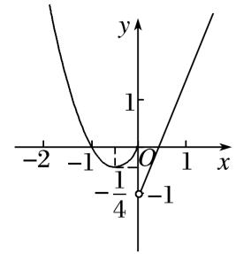  
（2）已知函数*f*(*x*)＝若关于*x*的方程*f*(*x*)＝*k*有三个不同的实根，则实数*k*的取值范围是\_\_\_\_\_\_\_\_．
答案　(－1，0)　解析　关于*x*的方程*f*(*x*)＝*k*有三个不同的实根，等价于函数*f*(*x*)与函数*y*＝*k*的图象有三个不同的交点，作出函数的图象如图所示，由图可知实数*k*的取值范围是(－1，0)．

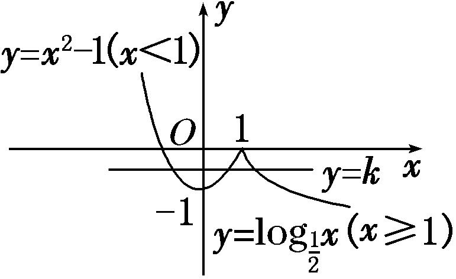  
（3）已知0<*a*<1，*k*≠0，函数*f*(*x*)＝若函数*g*(*x*)＝*f*(*x*)－*k*有两个零点，则实数*k*的取值范围是\_\_\_\_\_\_\_\_．
答案　(0，1)　解析　函数*g*(*x*)＝*f*(*x*)－*k*有两个零点，即*f*(*x*)－*k*＝0有两个解，即*y*＝*f*(*x*)与*y*＝*k*的图象有两个交点．分*k*>0和*k*<0作出函数*f*(*x*)的图象．当0<*k*<1时，函数*y*＝*f*(*x*)与*y*＝*k*的图象有两个交点；当*k*＝1时，有一个交点；当*k*>1或*k*<0时，没有交点，故当0<*k*<1时满足题意．

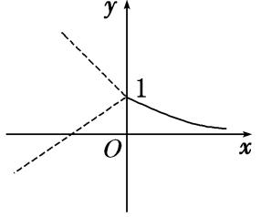  
（4）对任意实数<em>a</em>，<em>b</em>定义运算“⊗”：<em>a</em>⊗<em>b</em>＝设<em>f</em>(<em>x</em>)＝(<em>x</em>2－1)⊗(4＋<em>x</em>)，若函数<em>g</em>(<em>x</em>)＝<em>f</em>(<em>x</em>)＋<em>k</em>的图象与<em>x</em>轴恰有三个不同的交点，则<em>k</em>的取值范围是\_\_\_\_\_\_\_\_．
答案　[－2，1)　解析　解不等式<em>x</em>2－1－(4＋<em>x</em>)≥1，得<em>x</em>≤－2或<em>x</em>≥3，所以<em>f</em>(<em>x</em>)＝函数<em>g</em>(<em>x</em>)＝<em>f</em>(<em>x</em>)＋<em>k</em>的图象与<em>x</em>轴恰有三个不同的交点转化为

函数*f*(*x*)的图象和直线*y*＝－*k*恰有三个不同的交点．作出函数*f*(*x*)的图象如图所示，所以－1＜－*k*≤2，故－2≤*k*＜1．

  
（5）已知*a*>－1，函数*f*(*x*)＝若存在*t*使得*g*(*x*)＝*f*(*x*)－*t*有三个零点，则*a*的取值范围是(　　)

A．(－1，0)　　　　　
B．(0，1)　　　　　
C．(1，＋∞)　　　　　
D．(0，＋∞)
答案　C　解析　如图，作出函数<em>y</em>＝<em>x</em>2和<em>y</em>＝log2(<em>x</em>＋1)的图象，从图中可以看出，在点<em>O</em>(0，0)和点<em>A</em>(1，1)处两函数图象有交点，显然，要使<em>g</em>(<em>x</em>)＝<em>f</em>(<em>x</em>)－<em>t</em>有三个零点，则函数<em>y</em>＝<em>f</em>(<em>x</em>)的图象与直线<em>y</em>＝<em>t</em>有三个交点，显然，只有当<em>a</em>&gt;1时，才可能有三个交点，故选C．

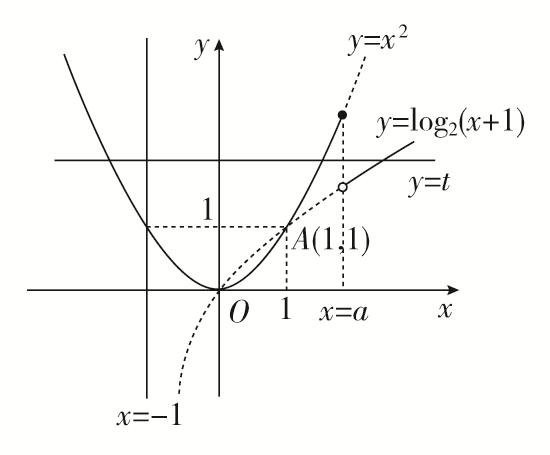

【对点训练】

1．已知函数*f*(*x*)＝若关于*x*的方程*f*(*x*)＝*k*有三个不同的实根，则实数*k*的取值范围

是\_\_\_\_\_\_\_\_．

1．答案　(－1，0)　解析　关于*x*的方程*f*(*x*)＝*k*有三个不同的实根，等价于函数*y*＝*f*(*x*)与函数*y*＝*k*的

图象有三个不同的交点，作出函数的图象如图所示，由图可知实数*k*的取值范围是(－1，0)．

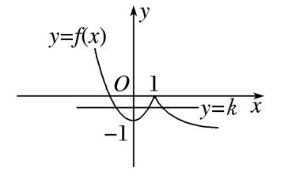

2．已知函数*f*(*x*)＝若方程*f*(*x*)－*a*＝0有三个不同的实数根，则实数*a*的取值范围是(　　)

A．(1，3) 　　　　　
B．(0，3)　　　　　
C．(0，2)　　　　　
D．(0，1)

2．答案　<strong>D</strong>　解析　画出函数<em>f</em>(<em>x</em>)的图象如图所示，

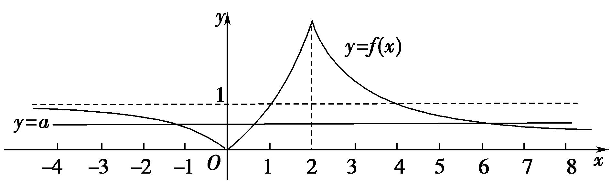

观察图象可知，若方程*f*(*x*)－*a*＝0有三个不同的实数根，则函数*y*＝*f*(*x*)的图象与直线*y*＝*a*有3个不同的交点，此时需满足0＜*a*＜1．故选D．

3．已知函数*f*(*x*)＝若函数*g*(*x*)＝*f*(*x*)－*m*有3个零点，则实数*m*的取值范围是\_\_\_\_\_\_．

3．答案　(0，1)　解析　函数*g*(*x*)＝*f*(*x*)－*m*有3个零点，转化为*f*(*x*)－*m*＝0的根有3个，进而转化为*y*

＝*f*(*x*)，*y*＝*m*的交点有3个．画出函数*y*＝*f*(*x*)的图象，则直线*y*＝*m*与其有3个公共点．又抛物线顶点为(－1，1)，由图可知实数*m*的取值范围是(0，1)．

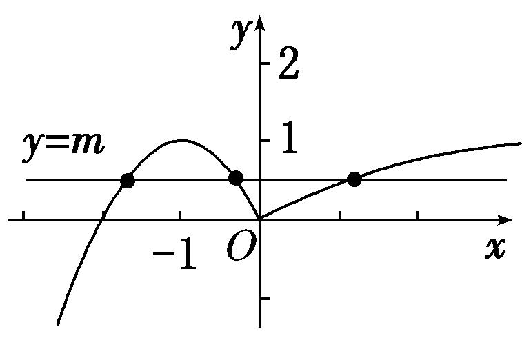

4．已知函数<em>f</em>(<em>x</em>)＝则函数<em>F</em>(<em>x</em>)＝<em>f</em>(<em>x</em>)－<em>a</em>2＋<em>a</em>＋1(<em>a</em>∈<strong>R</strong>)总有零点时，<em>a</em>的取值范围是(　　)

A．(－∞，0)∪(1，＋∞)　　
B．[－1，2)　　
C．[－1，0]∪(1，2]　　
D．[0，1]

4．解析　A　由<em>F</em>(<em>x</em>)＝0，得<em>f</em>(<em>x</em>)＝<em>a</em>2－<em>a</em>－1，因为函数<em>f</em>(<em>x</em>)的值域为(－1，＋∞)，故<em>a</em>2－<em>a</em>－1&gt;－1，解得

*a*<0或*a*>1．故选A．

5．已知<em>f</em>(<em>x</em>)是定义在<strong>R</strong>上且周期为4的偶函数，又函数<em>f</em>(<em>x</em>)＝<em>．</em>若<em>f</em>(<em>x</em>)＝<em>a</em>在[－e，

4]上有6个零点，则实数*a*的取值范围是\_\_\_\_\_\_\_\_．

5．答案　(0，1)　解析　由题意画出函数*f*(*x*)在[－e，4]上的图象，如图所示．

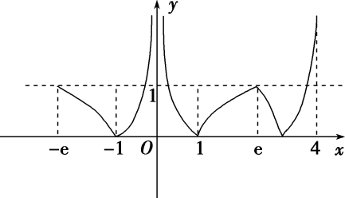
又*f*(*x*)＝*a*在[－e，4]上有6个零点，数形结合可知，实数*a*的取值范围为(0，1)．

6．已知函数*f*(*x*)＝若存在实数*b*，使函数*g*(*x*)＝*f*(*x*)－*b*有两个零点，则*a*的取值范围是\_\_\_\_\_\_．

6．答案　(－∞，0)∪(1，＋∞)　解析　令<em>φ</em>(<em>x</em>)＝<em>x</em>3(<em>x</em>≤<em>a</em>)，<em>h</em>(<em>x</em>)＝<em>x</em>2(<em>x</em>&gt;<em>a</em>)，函数<em>g</em>(<em>x</em>)＝<em>f</em>(<em>x</em>)－<em>b</em>有两个零点，
即函数<em>y</em>＝<em>f</em>(<em>x</em>)的图象与直线<em>y</em>＝<em>b</em>有两个交点，结合图象，可得<em>a</em>&lt;0或<em>φ</em>(<em>a</em>)&gt;<em>h</em>(<em>a</em>)，即<em>a</em>&lt;0或<em>a</em>3&gt;<em>a</em>2，解得<em>a</em>&lt;0或<em>a</em>&gt;1，故<em>a</em>∈(－∞，0)∪(1，＋∞)．

7．(2016·山东)已知函数*f*(*x*)＝其中*m*>0．若存在实数*b*，使得关于*x*的方程*f*(*x*)

＝*b*有三个不同的根，则*m*的取值范围是\_\_\_\_\_\_\_\_．

7．答案　(3，＋∞)　解析　*f*(*x*)的大致图象如图所示，

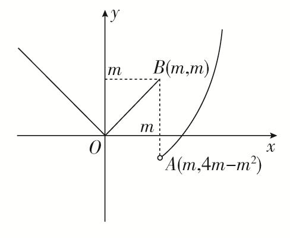
若存在<em>b</em>∈<strong>R</strong>，使得方程<em>f</em>(<em>x</em>)＝<em>b</em>有三个不同的根，只需4<em>m</em>－<em>m</em>2&lt;<em>m</em>，又<em>m</em>&gt;0，所以<em>m</em>&gt;3．

<strong>考点二　已知</strong><em><strong>y</strong></em><strong>＝</strong><em><strong>f</strong></em><strong>(</strong><em><strong>x</strong></em><strong>)±</strong><em><strong>g</strong></em><strong>(</strong><em><strong>x</strong></em><strong>，</strong><em><strong>a</strong></em><strong>)型函数零点的个数，求参数</strong><em><strong>a</strong></em><strong>的取值范围</strong>

【方法总结】

已知*y*＝*f*(*x*)±*g*(*x*，*a*)型函数零点的情况，求参数*a*的取值范围的问题多数题都是*y*＝*f*(*x*)为周期函数，先画出的*y*＝*f*(*x*)图象，再画出*y*＝±*g*(*x*，*a*)的图象．然后根据零点的情况，建立参数*a*的不等式．如等．

【例题选讲】

<strong>[例2]</strong>　（1）(2018·全国Ⅰ)已知函数<em>f</em>(<em>x</em>)＝<em>g</em>(<em>x</em>)＝<em>f</em>(<em>x</em>)＋<em>x</em>＋<em>a</em>．若<em>g</em>(<em>x</em>)存在2个零点，则<em>a</em>的取值范围是(　　)

A．[－1，0) 　　　　　
B．[0，＋∞)　　　　　
C．[－1，＋∞)　　　　　
D．[1，＋∞)
答案　C　解析　函数*g*(*x*)＝*f*(*x*)＋*x*＋*a*存在2个零点，即关于*x*的方程*f*(*x*)＝－*x*－*a*有2个不同的实根，即函数*f*(*x*)的图象与直线*y*＝－*x*－*a*有2个交点．作出直线*y*＝－*x*－*a*与函数*f*(*x*)的图象，如图所示，由图可知，－*a*≤1，解得*a*≥－1，故选C．

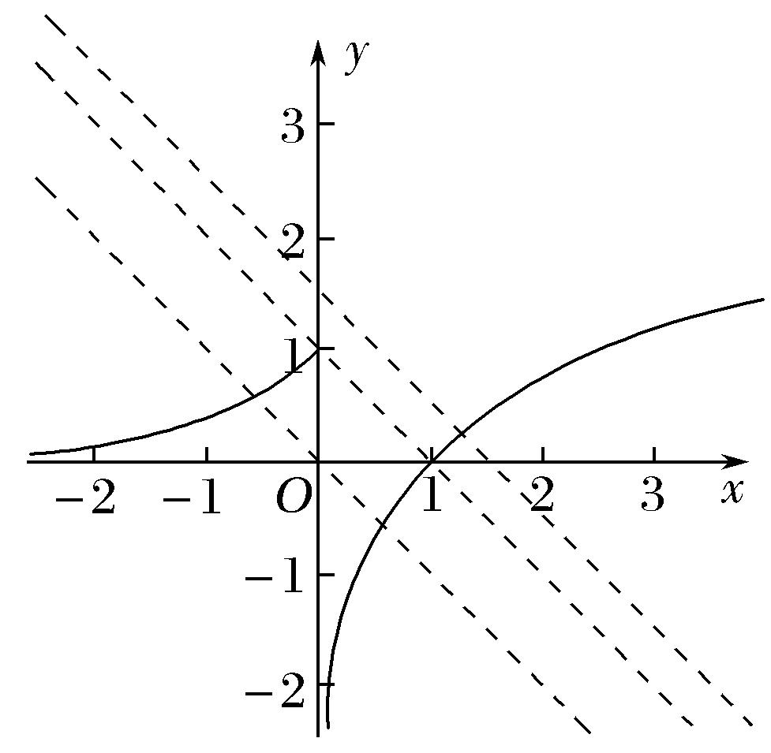  
（2）函数*f*(*x*)＝若方程*f*(*x*)＝－*x*＋*a*有且只有两个不相等的实数根，则实数*a*的取值范围为(　　)

A．(－∞，0)　　　　　　
B．[0，1)　　　　　　
C．(－∞，1)　　　　　　
D．[0，＋∞)
答案　C　解析　函数*f*(*x*)＝的图象如图所示，作出直线*l*：*y*＝*a*－*x*，向左平移直线*l*，观察可得当函数*y*＝*f*(*x*)的图象与直线*l*：*y*＝－*x*＋*a*的图象有两个交点，即方程*f*(*x*)＝－*x*＋*a*有且只有两个不相等的实数根时，有*a*<1，故选C．

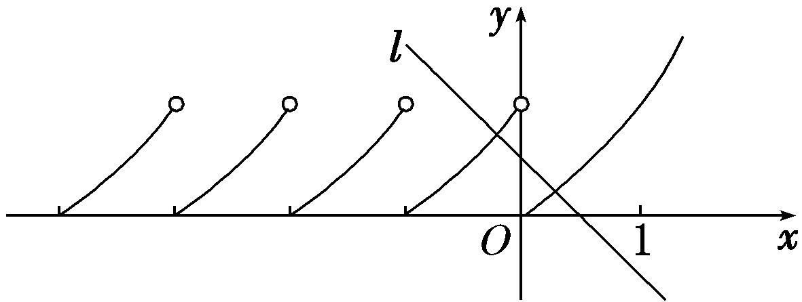  
（3）已知函数<em>f</em>(<em>x</em>)为偶函数且<em>f</em>(<em>x</em>)＝<em>f</em>(<em>x</em>－4)，又在区间[0，2]上<em>f</em>(<em>x</em>)＝函数<em>g</em>(<em>x</em>)＝|<em>x</em>|＋<em>a</em>，若<em>F</em>(<em>x</em>)＝<em>f</em>(<em>x</em>)－<em>g</em>(<em>x</em>)恰有2个零点，则<em>a</em>＝\_\_\_\_\_\_\_\_．
答案　2　解析　由题意可知*f*(*x*)是周期为4的偶函数，画出函数*f*(*x*)与*g*(*x*)的大致图象(图略)．若*F*(*x*)＝*f*(*x*)－*g*(*x*)恰有2个零点，则有*g*（1）＝*f*（1），解得*a*＝2．

  
（4）已知定义在<strong>R</strong>上的偶函数<em>f</em>(<em>x</em>)满足<em>f</em>(<em>x</em>－4)＝<em>f</em>(<em>x</em>)，且在区间[0，2]上<em>f</em>(<em>x</em>)＝<em>x</em>，若关于<em>x</em>的方程<em>f</em>(<em>x</em>)＝log<em>ax</em>有三个不同的实根，则<em>a</em>的取值范围为\_\_\_\_\_\_\_\_．
答案　(，)　解析　由<em>f</em>(<em>x</em>－4)＝<em>f</em>(<em>x</em>)知，函数的周期为4，又函数为偶函数，∴<em>f</em>(<em>x</em>－4)＝<em>f</em>(<em>x</em>)＝<em>f</em>(4－<em>x</em>)．∴函数图象关于<em>x</em>＝2对称，且<em>f</em>（2）＝<em>f</em>（6）＝<em>f</em>（10）＝2．要使方程<em>f</em>(<em>x</em>)＝log<em>ax</em>有三个不同的根，则满足如图，即解得＜<em>a</em>＜．故<em>a</em>的取值范围是(，)．

  
（5）定义域为<strong>R</strong>的偶函数<em>f</em>(<em>x</em>)满足对∀<em>x</em>∈<strong>R</strong>，有<em>f</em>(<em>x</em>＋2)＝<em>f</em>(<em>x</em>)－<em>f</em>（1），且当<em>x</em>∈[2，3]时，<em>f</em>(<em>x</em>)＝－2<em>x</em>2＋12<em>x</em>－18，若函数<em>y</em>＝<em>f</em>(<em>x</em>)－log<em>a</em>(|<em>x</em>|＋1)在(0，＋∞)上至多有三个零点，则<em>a</em>的取值范围是\_\_\_\_\_\_\_\_．
答案　(，1)∪(1，＋∞)　解析　对于偶函数<em>f</em>(<em>x</em>)，<em>f</em>(<em>x</em>＋2)＝<em>f</em>(<em>x</em>)－<em>f</em>（1），令<em>x</em>＝－1，则<em>f</em>（1）＝<em>f</em>(－1)－<em>f</em>（1），因为<em>f</em>(－1)＝<em>f</em>（1），所以<em>f</em>(－1)＝<em>f</em>（1）＝0，所以<em>f</em>(<em>x</em>)＝<em>f</em>(<em>x</em>＋2)，故<em>f</em>(<em>x</em>)的图象如图所示，则问题等价于<em>f</em>(<em>x</em>)的图象与函数<em>y</em>＝log<em>a</em>(|<em>x</em>|＋1)的图象在(0，＋∞)上至多有三个交点，显然<em>a</em>&gt;1符合题意；若0&lt;<em>a</em>&lt;1，则由图可知，只需点(4，－2)在函数<em>y</em>＝log<em>a</em>(|<em>x</em>|＋1)图象的上方，所以log<em>a</em>5&lt;－2＝log<em>a</em>⇒5&gt;⇒&lt;<em>a</em>&lt;1．综上，实数<em>a</em>的取值范围是(，1)∪(1，＋∞)．

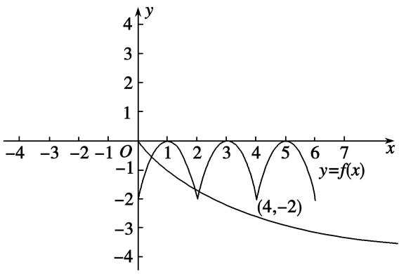  
（6）定义在<strong>R</strong>上的奇函数<em>f</em>(<em>x</em>)满足条件<em>f</em>(1＋<em>x</em>)＝<em>f</em>(1－<em>x</em>)，当<em>x</em>∈[0，1]时，<em>f</em>(<em>x</em>)＝<em>x</em>，若函数<em>g</em>(<em>x</em>)＝|<em>f</em>(<em>x</em>)|－<em>a</em>e－|<em>x</em>|在区间[－2 018，2 018]上有4 032个零点，则实数<em>a</em>的取值范围是(　　)

A．(0，1)　　　　　　　
B．(e，e3)　　　　　　　
C．(e，e2)　　　　　　　
D．(1，e3)
答案　B　解析　<em>f</em>(<em>x</em>)满足条件<em>f</em>(1＋<em>x</em>)＝<em>f</em>(1－<em>x</em>)且为奇函数，则<em>f</em>(<em>x</em>)的图象关于<em>x</em>＝1对称，且<em>f</em>(<em>x</em>)＝<em>f</em>(2－<em>x</em>)，<em>f</em>(<em>x</em>)＝－<em>f</em>(－<em>x</em>)，∴－<em>f</em>(－<em>x</em>)＝<em>f</em>(2－<em>x</em>)，即－<em>f</em>(<em>x</em>)＝<em>f</em>(2＋<em>x</em>)，∴<em>f</em>(<em>x</em>＋4)＝<em>f</em>(<em>x</em>)，∴<em>f</em>(<em>x</em>)的周期为4．令<em>m</em>(<em>x</em>)＝|<em>f</em>(<em>x</em>)|，<em>n</em>(<em>x</em>)＝<em>a</em>e－|<em>x</em>|，画出<em>m</em>(<em>x</em>)、<em>n</em>(<em>x</em>)的图象如图，

可知<em>m</em>(<em>x</em>)与<em>n</em>(<em>x</em>)为偶函数，且要使<em>m</em>(<em>x</em>)与<em>n</em>(<em>x</em>)图象有交点，需<em>a</em>＞0，由题意知要满足<em>g</em>(<em>x</em>)在区间[－2 018，2 018]上有4 032个零点，只需<em>m</em>(<em>x</em>)与<em>n</em>(<em>x</em>)的图象在[0，4]上有两个交点，则可得e＜<em>a</em>＜e3，故选B．

【对点训练】

8．函数*f*(*x*)＝若方程*f*(*x*)＝－*x*＋*a*有且只有两个不相等的实数根，则实数*a*的取值范

围为\_\_\_\_\_\_\_\_．

8．答案　(－∞，1)　解析　函数*f*(*x*)＝的图象如图所示，作出直线*l*：*y*＝*a*－*x*，向左

平移直线*l*，观察可得函数*y*＝*f*(*x*)的图象与直线*l*：*y*＝－*x*＋*a*的图象有两个交点，即方程*f*(*x*)＝－*x*＋*a*有且只有两个不相等的实数根，即有*a*＜1．

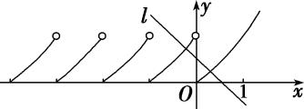

9．已知函数<em>f</em>(<em>x</em>)＝e|<em>x</em>|＋|<em>x</em>|．若关于<em>x</em>的方程<em>f</em>(<em>x</em>)＝<em>k</em>有两个不同的实根，则实数<em>k</em>的取值范围是(　　)

A．(0，1)　　　　　
B．(1，＋∞)　　　　　
C．(－1，0)　　　　　
D．(－∞，－1)

9．答案　B　解析　方程<em>f</em>(<em>x</em>)＝<em>k</em>化为方程e|<em>x</em>|＝<em>k</em>－|<em>x</em>|．令<em>y</em>＝e|<em>x</em>|，<em>y</em>＝<em>k</em>－|<em>x</em>|，<em>y</em>＝<em>k</em>－|<em>x</em>|表示过点(0，<em>k</em>)，斜

率为1或－1的平行折线系，折线与曲线<em>y</em>＝e|<em>x</em>|恰好有一个公共点时，有<em>k</em>＝1．若关于<em>x</em>的方程<em>f</em>(<em>x</em>)＝<em>k</em>有两个不同的实根，则实数<em>k</em>的取值范围是(1，＋∞)．

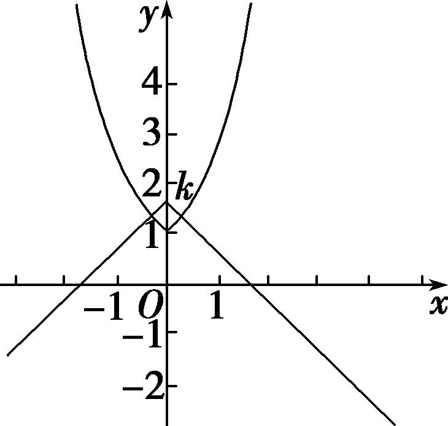

10．设<em>f</em>(<em>x</em>)是定义在<strong>R</strong>上的偶函数，对任意的<em>x</em>∈<strong>R</strong>，都有<em>f</em>(<em>x</em>－2)＝<em>f</em>(<em>x</em>＋2)，且当<em>x</em>∈[－2，0]时，<em>f</em>(<em>x</em>)＝

<em>x</em>－1，若函数<em>g</em>(<em>x</em>)＝<em>f</em>(<em>x</em>)－log<em>a</em>(<em>x</em>＋2)(<em>a</em>&gt;1)在区间[－2，6]内恰有三个零点，则实数<em>a</em>的取值范围是\_\_\_\_\_．

10．答案　<*a*<2　解　根据题意得*f*((*x*＋2)－2)＝*f*((*x*＋2)＋2)，即*f*(*x*)＝*f*(*x*＋4)，故函数*f*(*x*)的周期为4．
若方程<em>f</em>(<em>x</em>)－log<em>a</em>(<em>x</em>＋2)＝0(<em>a</em>&gt;1)在区间[－2，6]内恰有三个不同的实根，则函数<em>y</em>＝<em>f</em>(<em>x</em>)和<em>y</em>＝log<em>a</em>(<em>x</em>＋2)的图象在区间[－2，6]内恰有三个不同的交点，根据图象可知，log<em>a</em>(6＋2)&gt;3且log<em>a</em>(2＋2)&lt;3，解得&lt;<em>a</em>&lt;2．

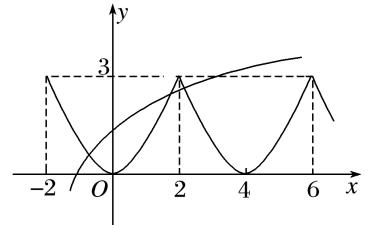

11．已知定义域为<strong>R</strong>的偶函数<em>f</em>(<em>x</em>)满足：对∀<em>x</em>∈<strong>R</strong>，有<em>f</em>(<em>x</em>＋2)＝<em>f</em>(<em>x</em>)－<em>f</em>（1），且当<em>x</em>∈[2，3]时，<em>f</em>(<em>x</em>)＝－2<em>x</em>2

＋12<em>x</em>－18．若函数<em>y</em>＝<em>f</em>(<em>x</em>)－log<em>a</em>(<em>x</em>＋1)在(0，＋∞)上至少有三个零点，则实数<em>a</em>的取值范围为(　　)

A．　　　　
B．　　　　
C．　　　　
D．

11．答案　A　解析　∵*f*(*x*＋2)＝*f*(*x*)－*f*（1），*f*(*x*)是偶函数，∴*f*（1）＝0，∴*f*(*x*＋2)＝*f*(*x*)，即*f*(*x*)是周期为2

的周期函数，且<em>y</em>＝<em>f</em>(<em>x</em>)的图象关于直线<em>x</em>＝2对称，作出函数<em>y</em>＝<em>f</em>(<em>x</em>)与<em>g</em>(<em>x</em>)＝log<em>a</em>(<em>x</em>＋1)的图象如图所示，∵两个函数图象在(0，＋∞)上至少有三个交点，∴<em>g</em>（2）＝log<em>a</em>3&gt;<em>f</em>（2）＝－2，且0&lt;<em>a</em>&lt;1，解得0&lt;<em>a</em>&lt;，故选A．

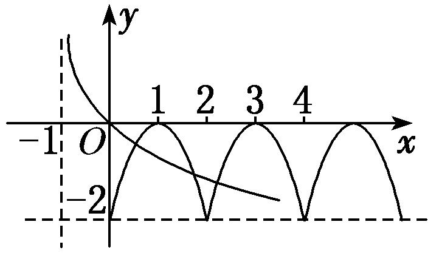

12．已知定义在<strong>R</strong>上的函数<em>y</em>＝<em>f</em>(<em>x</em>)对任意的<em>x</em>都满足<em>f</em>(<em>x</em>＋2)＝<em>f</em>(<em>x</em>)，当－1≤<em>x</em>＜1时，<em>f</em>(<em>x</em>)＝sin<em>x</em>，若函数

<em>g</em>(<em>x</em>)＝<em>f</em>(<em>x</em>)－log<em>a</em>|<em>x</em>|至少有6个零点，则<em>a</em>的取值范围是(　　)

A．∪(5，＋∞)　　　　　　　　　　
B．∪[5，＋∞)

C．∪(5，7)　　　　　　　　　　　
D．∪[5，7)

12．答案　A　解析　当<em>a</em>＞1时，作出函数<em>f</em>(<em>x</em>)与函数<em>y</em>＝log<em>a</em>|<em>x</em>|的图象，如图所示．结合图象可知，
故*a*＞5；
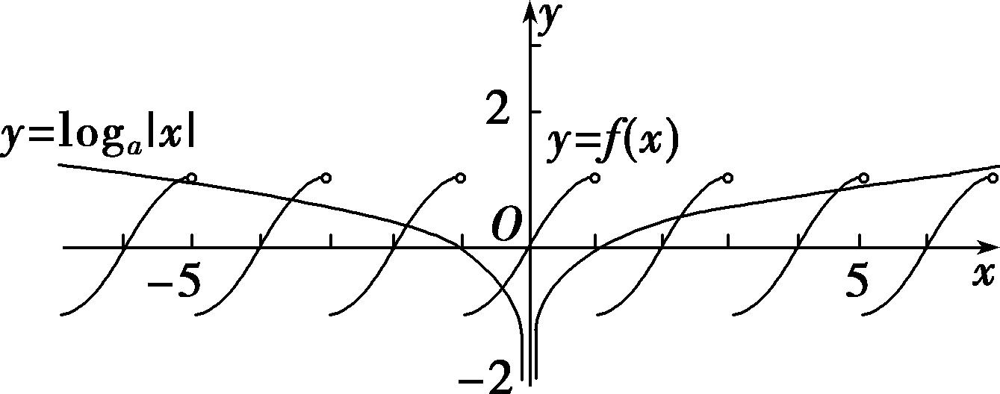
当0＜<em>a</em>＜1时，作出函数<em>f</em>(<em>x</em>)与函数<em>y</em>＝log<em>a</em>|<em>x</em>|的图象，如图所示．结合图象可知，故0＜<em>a</em>≤．故选A．

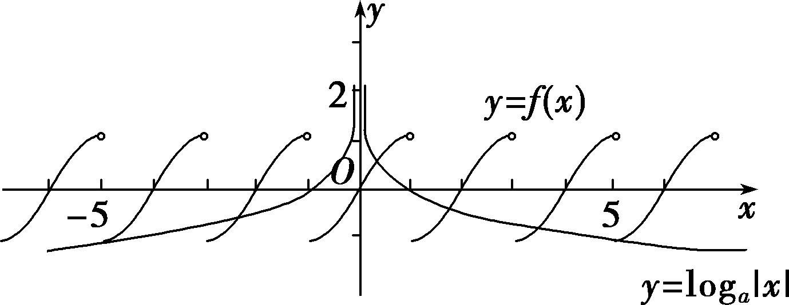

13．(2016·天津)已知函数<em>f</em>(<em>x</em>)＝(<em>a</em>&gt;0且<em>a</em>≠1)在<strong>R</strong>上单调递减，且关于<em>x</em>的方程

|*f*(*x*)|＝2－*x*恰有两个不相等的实数解，则*a*的取值范围是(　　)

A．　　　　　　
B．　　　　　　
C．∪　　　　　　
D．∪

13．答案　C　解析　由<em>y</em>＝log<em>a</em>(<em>x</em>＋1)＋1在[0，＋∞)上递减，则0&lt;<em>a</em>&lt;1，又由<em>f</em>(<em>x</em>)在<strong>R</strong>上单调递减，则：
解得≤*a*≤．
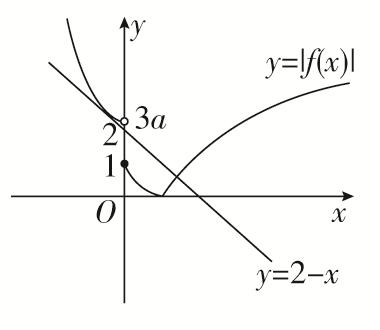

结合<em>f</em>(<em>x</em>)的图象可知，在[0，＋∞)上，＝2－<em>x</em>有且仅有一个解，故在(－∞，0)上，＝2－<em>x</em>同样有且仅有一个解，当3<em>a</em>&gt;2，即<em>a</em>&gt;时，联立＝2－<em>x</em>，则<em>Δ</em>＝(4<em>a</em>－2)2－4(3<em>a</em>－2)＝0，解得：<em>a</em>＝或1(舍)，当1≤3<em>a</em>≤2时，由图象可知，符合条件．综上：<em>a</em>∈∪．

