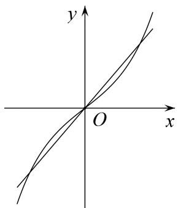
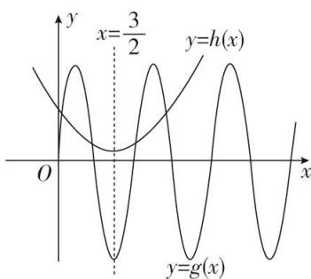
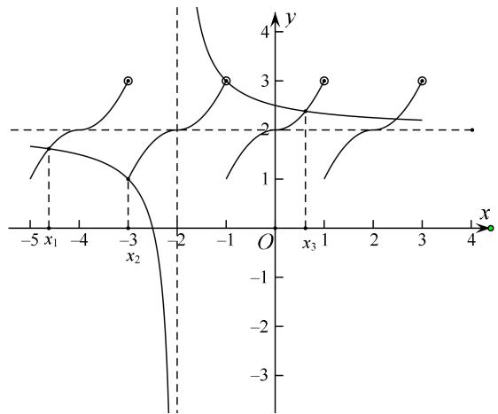
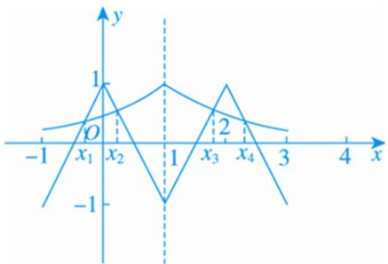
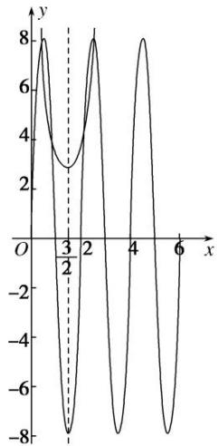
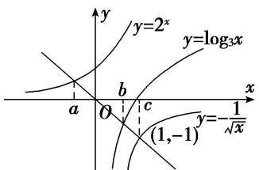
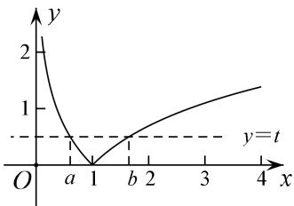
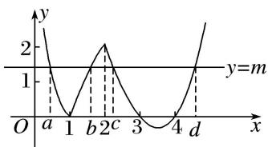

# 专题十七 函数的零点问题(4)

# 考点一 与零点相关的等式问题

# 【方法总结】

与零点相关的等式问题：可将零点问题转化成方程问题，进而通过构造函数将方程转化为两个图像交点问题，并作出函数图像。观察交点的特点(比如对称性等)并选择合适的方法处理表达式的值。即利用对称性解决对称点求和：如果 $x_{1}$ ， $x_{2}$ 关于 $x = a$ 轴对称，则 $x_{1} + x_{2} = 2a$ ；如果 $x_{1}, x_{2}$ 关于 $(a, 0)$ 中心对称，则也有 $x_{1} + x_{2} = 2a$ 。将对称的点归为一组，从而解决问题。

# 【例题选讲】

[例 1](1)已知函数 $f(x)=\mathrm{e}^{x}-\mathrm{e}^{-x}+4$ ，若方程 $f(x)=kx+4(k>0)$ 有三个不同的实根 $x_{1}, x_{2}, x_{3}$ ，则 $x_{1}+x_{2}+x_{3}=$ \_\_\_\_.

text_image

y
O
x

(2)已知函数 $f(x) = x^{2} - 3x + \frac{13}{4} - 8\cos \pi \left(\frac{1}{2} - x\right)$ ，则函数 $f(x)$ 在 $(0, +\infty)$ 上的所有零点之和为()

A. 6

B. 7

C. 9

D. 12

text_image

y
x=3/2
y=h(x)
O
x
y=g(x)

(3)已知函数 $f(x)$ 对任意的 $x \in \mathbb{R}$ ，都有 $f(\frac{1}{2} + x) = f(\frac{1}{2} - x)$ ，函数 $f(x + 1)$ 是奇函数，当 $-\frac{1}{2} \leq x \leq \frac{1}{2}$ 时， $f(x) = 2x$ ，则方程 $f(x) = -\frac{1}{2}$ 在区间 $[-3, 5]$ 内的所有根的和为 \_\_\_\_.

(4)已知定义在 $\mathbf{R}$ 上的函数 $f(x)$ 满足： $f(x) = \begin{cases} x^2 + 2 & 0 \leq x < 1 \\ 2 - x^2 & -1 \leq x < 0 \end{cases}$ ，且 $f(x + 2) = f(x)$ ， $g(x) = \frac{2x + 5}{x + 2}$ ，则方程 $f(x) = g(x)$ ，在区间[-5, 1]上的所有实根之和为（）

A. -5

B.-6

C. -7

D.-8

line

| x    | y    |
| ---- | ---- |
| -5   | 1    |
| -4   | 1.5  |
| -3   | 2    |
| -2   | 2.5  |
| -1   | 3    |
| 0    | 2.5  |
| 1    | 3    |
| 2    | 2.5  |
| 3    | 3    |
| 4    | 4    |

(5)定义在 $\mathbf{R}$ 上的偶函数 $f(x)$ 满足 $f(x + 1) = -f(x)$ ，当 $x \in [0, 1]$ 时， $f(x) = -2x + 1$ ，设函数 $g(x) = \left(\frac{1}{2}\right)x^{-1}(-1 \leq x \leq 3)$ ，则函数 $f(x)$ 与 $g(x)$ 的图象所有交点的横坐标之和为（）

A. 2

B. 4

C. 6

D. 8

line

| Point | x | y |
|---|---|---|
| 1 | -1 | 1 |
| 2 | 1 | -1 |
| 3 | 2 | 1 |
| 4 | 3 | 0 |

# 【对点训练】

1. 函数 $f(x) = \left(\frac{1}{2}\right)^{|x - 1|} + 2\cos \pi x (-4 \leq x \leq 6)$ 的所有零点之和为 \_\_\_\_.

2. 已知 $M$ 是函数 $f(x) = \mathrm{e}x^2 - 3x + \frac{13}{4} - 8\cos \left[\pi \left(\frac{1}{2} - x\right)\right]$ 在 $x \in (0, +\infty)$ 上的所有零点之和，则 $M$ 的值为（）

A. 3

B. 6

C. 9

D. 12

line

| x    | y     |
| ---- | ----- |
| 0    | 8     |
| 1/2  | 3     |
| 2    | -8    |
| 3/4  | 8     |
| 4    | -8    |
| 5    | 8     |
| 6    | -8    |

3. 已知函数 $f(x) = \sin x - \sin 3x, x \in [0, 2\pi]$ ，则 $f(x)$ 的所有零点之和等于（）

A. $5\pi$

B. $6\pi$

C. $7\pi$

D. $8\pi$

4. 已知函数 $f(x) = \frac{x - 1}{x - 2}$ 与 $g(x) = 1 - \sin \pi x$ ，则函数 $F(x) = f(x) - g(x)$ 在区间 $[-2, 6]$ 上所有零点的和为（）

A. 4

B. 8

C. 12

D. 16

5. 已知函数 $f(x) = \left(\frac{1}{2}\right)x$ ， $g(x) = \log_{\frac{1}{2}}x$ ，记函数 $h(x) = \begin{cases} g(x), & f(x) \leq g(x), \\ f(x), & f(x) > g(x), \end{cases}$ 则函数 $F(x) = h(x) + x - 5$ 的所有零点的和为 \_\_\_\_.

6. 函数 $f(x)$ 对一切实数 $x$ 都满足 $f(\frac{1}{2} + x) = f(\frac{1}{2} - x)$ ，并且方程 $f(x) = 0$ 有三个实根，则这三个实根的和为 \_\_\_\_.

7. 若 $y = f(x)$ 是定义在 $\mathbf{R}$ 上的函数，且满足：① $f(x)$ 是偶函数；② $f(x + 2)$ 是偶函数；③当 $0 < x \leq 2$ 时， $f(x) = \log_{2019} x$ ，当 $x = 0$ 时， $f(x) = 0$ ，则方程 $f(x) = -2019$ 在区间(1, 10)内的所有实数根之和为（）

A. 0

B. 10

C. 12

D. 24

8. 定义在 $\mathbf{R}$ 上的奇函数 $f(x)$ ，当 $x \geq 0$ 时， $f(x) = \begin{cases} -\frac{2x}{x + 1}, & x \in [0, 1], \\ 1 - |x - 3|, & x \in [1, +\infty], \end{cases}$ 则函数 $F(x) = f(x) - \frac{1}{\pi}$ 的所有零点之和为 \_\_\_\_.

9. 函数 $f(x)$ 是定义在 $\mathbf{R}$ 上的奇函数，当 $x > 0$ 时， $f(x) = \begin{cases} 2^{|x-1|} - 1, & 0 < x \leq 2, \\ \frac{1}{2} f(x - 2), & x > 2, \end{cases}$ 则函数 $g(x) = xf(x) - 1$ 在 $[-6, +\infty)$ 上的所有零点之和为（）

A. 8

B. 32

C. $\frac{1}{2}$

D. 0

10. 已知函数 $y=f(x+1)-2$ 是奇函数， $g(x)=\frac{2x-1}{x-1}$ ，且 $f(x)$ 与 $g(x)$ 的图象的交点为 $(x_{1}, y_{1})$ ， $(x_{2}, y_{2})$ ，…， $(x_{n}, y_{n})$ ，则 $x_{1}+x_{2}+\ldots+x_{6}+y_{1}+y_{2}+\ldots+y_{6}=$ \_\_\_\_.

# 考点二 与零点相关的不等式问题

# 【方法总结】

与零点相关的不等式问题：可将零点问题转化成方程问题，进而通过构造函数将方程转化为两个图像交点问题，并作出函数图像。通过图像与交点位置确定参数和零点的取值范围。将相等的函数值设为 $t$ ，从而用 $t$ 可表示出 $x_1, x_2, \_\_\_\_$ ，将关于 $x_1, x_2, \_\_\_\_$ 的表达式转化为关于 $t$ 的一元表达式，进而可求出范围或最值，从而解决问题。

# 【例题选讲】

[例 2](1)设方程 $10^{x}=|\lg(-x)|$ 的两根分别为 $x_{1}$ ， $x_{2}$ ，则()

A. $x_{1}x_{2}<0$

B. $x_{1}x_{2} = 1$

C. $x_{1}x_{2} > 1$

D. $0 < x_{1}x_{2} < 1$

(2)设函数 $f(x) = \mathrm{e}^{x} + 2x - 4$ ， $g(x) = \ln x + 2x^2 - 5$ ，若实数 $a, b$ 分别是 $f(x)$ ， $g(x)$ 的零点，则()

A. $g(a)<0<f(b)$

B. $f(b)<0<g(a)$

C. $0 <   g(a) <   f(b)$

D. $f(b) < g(a) < 0$

(3)已知函数 $f(x) = 2^{x} + x$ ， $g(x) = \log_3 x + x$ ， $h(x) = x - \frac{1}{\sqrt{x}}$ 的零点依次为 $a, b, c$ ，则（）

A. a<b<c

B. $c < b < a$

C. c<a<b

D. b<a<c

text_image

y
y=2^x
y=log₃x
a
b
c
x
y=-1/√x
(1,-1)

(4)已知函数 $f(x) = |\ln x|$ ，若 $0 < a < b$ ，且 $f(a) = f(b)$ ，则 $a + 2b$ 的取值范围是（）

A. $(2\sqrt{2}, +\infty)$

B. $[2\sqrt{2}, +\infty)$

C. $(3, +\infty)$

D. $[3, +\infty)$

line

| x | y |
|---|---|
| 0 | 2 |
| a | 1 |
| 1 | 0 |
| b | 1 |
| 2 | 1.5 |
| 3 | 1.75 |
| 4 | 1.9 |

(5)已知函数 $f(x)=\left\{\begin{aligned}&x+\frac{1}{2},&0\leq x<\frac{1}{2},\\ &2^{x-1},&\frac{1}{2}<x\leq2,\end{aligned}\right.$

若存在 $x_{1}$ ， $x_{2}$ ，当 $0\leq x_1 <   x_2 <   2$ 时， $f(x_{1}) = f(x_{2})$ ，则 $x_{1}f(x_{2}) - f(x_{2})$ 的取值范围为( )

A. $(0, \frac{2 - 3\sqrt{2}}{4})$

B. $\left[-\frac{9}{16}, \frac{2 - 3\sqrt{2}}{4}\right)$

C. $\left[-\frac{9}{16}, -\frac{1}{2}\right)$

D. $\left[\frac{2-3\sqrt{2}}{4},-\frac{1}{2}\right)$

(6)已知函数 $f(x)=\left\{\begin{aligned}\cos(x-\frac{\pi}{2}),&0\leqslant x\leqslant\pi,\\ \log_{2020}\frac{x}{\pi},&x>\pi,\end{aligned}\right.$

若有三个不同的实数 $a, b, c$ ，使得 $f(a) = f(b) = f(c)$ ，

则 $a+b+c$ 的取值范围是 \_\_\_\_.

(7)已知函数 $f(x) = \begin{cases} 2|\log_2x|, & 0 < x \leq 2, \\ (x - 3)(x - 4), & x > 2, \end{cases}$ 若 $f(x) = m$ 有四个零点 $a, b, c, d$ ，则 $abcd$ 的取值范围是 \_\_\_\_.

line

| Point | x | y |
|---|---|---|
| a | 0 | 2 |
| 1 | 1 | 0 |
| b | 2 | 2 |
| c | 3 | 0 |
| 3 | 4 | -2 |
| d | 5 | 2 |

(8)已知函数 $f(x) = \begin{cases} |\log_3 x|, & 0 < x \leq 3, \\ \frac{1}{3} x^2 - \frac{10}{3} x + 8, & x > 3, \end{cases}$ 若方程 $f(x) = m (m \in \mathbf{R})$ 有四个不同的实根 $x_1, x_2, x_3, x_4$ ，且满足 $x_{1} < x_{2} < x_{3} < x_{4}$ ，则 $\frac{(x_3 - 3)(x_4 - 3)}{x_1x_2}$ 的取值范围是（）

A. (0, 4]

B. $(0, 3)$

C. $(3, 4]$

D. $(1, 3)$

# 【对点训练】

11. 若函数 $f(x) = |\log_{a}x| - 2^{-x} (a > 0 \text{ 且 } a \neq 1)$ 的两个零点是 $m, n$ ，则（）

A. $mn = 1$

B. mn>1

C. 0 < mn < 1

D. 以上都不对

12. 已知函数 $f(x) = |\log_3(x - 1)| - \left(\frac{1}{3}\right)^x - 1$ 有两个不同的零点 $x_1, x_2$ ，则（）

A. $x_{1}x_{2} < 1$

B. $x_{1}x_{2}=x_{1}+x_{2}$

C. $x_{1}x_{2}>x_{1}+x_{2}$

D. $x_{1}x_{2}<x_{1}+x_{2}$

13. 已知 e 是自然对数的底数，函数 $f(x)=\mathrm{e}^{x}+x-2$ 的零点为 a，函数 $g(x)=\ln x+x-2$ 的零点为 b，则下列不等式成立的是()

A. $f(a) < f(1) < f(b)$

B. $f(a) < f(b) < f(1)$

C. $f(1) < f(a) < f(b)$

D. $f(b) <   f(1) <   f(a)$

14. 已知函数 $f(x) = 2^x + x$ , $g(x) = x - \log_1 x$ , $h(x) = \log_2 x - \sqrt{x}$ 的零点分别为 $x_1, x_2, x_3$ ，则 $x_1, x_2, x_3$ 的大

2

小关系是( )

A. $x_{1} > x_{2} > x_{3}$

B. $x_{2}>x_{1}>x_{3}$

C. $x_{1}>x_{3}>x_{2}$

D. $x_{3}>x_{2}>x_{1}$

15. 已知 $f(x)=|\ln(x+1)|$ ，若 $f(a)=f(b)(a<b)$ ，则()

A. $a + b > 0$

B. $a+b>1$

C. $2a+b>0$

D. $2a+b>1$

16. 已知函数 $f(x) = \begin{cases} \log_a (x + 1) & -1 < x < 1 \\ f(2 - x) + a - 1 & 1 < x < 3 \end{cases}$ ( $a > 0, a \neq 1$ ), 若 $x_1 \neq x_2$ , 且 $f(x_1) = f(x_2)$ , 则 $x_1 + x_2$ 的值 ( )

A. 恒小于 2

B. 恒大于 2

C. 恒等于 2

D. 与 $a$ 相关

17. 已知函数 $f(x) = \begin{cases} |\log_2 x - 1|, & 0 < x \leq 4, \\ 3 - \sqrt{x}, & x > 4, \end{cases}$ 设 $a, b, c$ 是三个不相等的实数，且满足 $f(a) = f(b) = f(c)$ ，则 abc

的取值范围为\_\_\_\_。

18. 已知函数 $f(x) = \begin{cases} |\log_2 x|, & 0 < x < 2, \\ \sin(\frac{\pi}{4} x), & 2 \leqslant x \leqslant 10, \end{cases}$ 若存在实数 $x_1, x_2, x_3, x_4$ ，满足 $x_1 < x_2 < x_3 < x_4$ ，且 $f(x_1) = f(x_2) =$

$f(x_{3})=f(x_{4})$ ，则 $\frac{(x_{3}-2)(x_{4}-2)}{x_{1}x_{2}}$ 的取值范围是()

A. (4, 16)

B. $(0, 12)$

C. (9, 21)

D. (15, 25)

19. 设 $x_{1}, x_{2}$ 分别是函数 $f(x) = x - a^{-x}$ 和 $g(x) = x\log_{a}x - 1$ 的零点(其中 $a > 1$ ), 则 $x_{1} + 4x_{2}$ 的取值范围是 \_\_\_\_.

20. 已知 $f(x) = \begin{cases} |x + 1|, & x \leq 0, \\ |\log_2 x|, & x > 0, \end{cases}$ 若方程 $f(x) = a$ 有四个不同的解 $x_1 < x_2 < x_3 < x_4$ ，则 $x_1 + x_2 + \frac{1}{x_3} + \frac{1}{x_4}$ 的取值范围是（）

A. $[0, \frac{1}{2})$

B. $(0,\ \frac{1}{2}]$

C. $[0, \frac{1}{2}]$

D. $[0, 1)$

