# 专题十七 函数的零点问题（4）

# 考点一 与零点相关的等式问题

# 【方法总结】

与零点相关的等式问题：可将零点问题转化成方程问题，进而通过构造函数将方程转化为两个图像交点问题，并作出函数图像。观察交点的特点(比如对称性等)并选择合适的方法处理表达式的值。即利用对称性解决对称点求和：如果 $x_{1}$ ， $x_{2}$ 关于 $x=a$ 轴对称，则 $x_{1}+x_{2}=2a$ ；如果 $x_{1}$ ， $x_{2}$ 关于 $(a,0)$ 中心对称，则也有 $x_{1}+x_{2}=2a$ 。将对称的点归为一组，从而解决问题。

# 【例题选讲】

[例 1]（1）已知函数 $f(x)=\mathrm{e}^{x}-\mathrm{e}^{-x}+4$ ，若方程 $f(x)=kx+4(k>0)$ 有三个不同的实根 $x_{1}, x_{2}, x_{3}$ ，则 $x_{1}+x_{2}+x_{3}=$ \_\_\_\_.
答案 0 解析 方程 $f(x) = kx + 4 (k > 0)$ 有三个不同的实根，即方程 $e^x - e^{-x} = kx$ 有三个不同的实根，易知 $y = e^x - e^{-x}$ 为奇函数且递增，得 $y = f(x)$ 的图象．所以 $y = f(x)$ 的图象关于点(0, 0)对称，又 $y = kx$ 过点(0, 0)且关于(0, 0)对称．∴方程 $e^x - e^{-x} = kx$ 的三个根中有一个为0，且另两根之和为0．因此 $x_1 + x_2 + x_3 = 0$ .

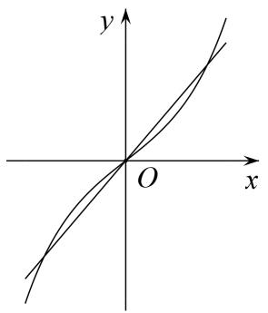  
（2）已知函数 $f(x) = x^{2} - 3x + \frac{13}{4} - 8\cos \pi \left(\frac{1}{2} - x\right)$ ，则函数 $f(x)$ 在 $(0, +\infty)$ 上的所有零点之和为()

A. 6

B. 7

C. 9

D. 12
答案 A 解析 $h(x)=x^{2}-3x+\frac{13}{4}=(x-\frac{3}{2})^{2}+1$ 的图象关于 $x=\frac{3}{2}$ 对称，设函数 $g(x)=8\cos\pi(\frac{1}{2}-x)$ . 由 $\pi(\frac{1}{2}-x)=k\pi$ ，可得 $x=\frac{1}{2}-k(k\in\mathbf{Z})$ ，令 k=-1 可得 $x=\frac{3}{2}$ ，所以函数 $g(x)=8\cos\pi(\frac{1}{2}-x)$ 的图象也关于 $x=\frac{3}{2}$ 对称．当 $x=\frac{1}{2}$ 时， $h(\frac{1}{2})=2<g(\frac{1}{2})=8$ ，作出函数 $h(x)$ ， $g(x)$ 的图象．由图可知函数 $h(x)=x^{2}-3x+\frac{13}{4}=(x-\frac{3}{2})^{2}+1$ 的图象与函数 $g(x)=8\cos(\pi\frac{1}{2}-x)$ 的图象有四个交点，所以函数 $f(x)=x^{2}-3x+\frac{13}{4}-8\cos(\pi\frac{1}{2}-x)$ 在 $(0,+\infty)$ 上的零点个数为 4，所有零点之和为 $4\times\frac{3}{2}=6$ ，故选 A.

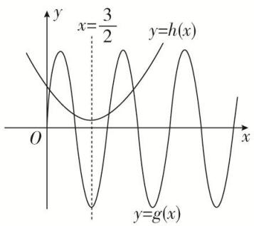  
（3）已知函数 $f(x)$ 对任意的 $x \in \mathbb{R}$ ，都有 $f(\frac{1}{2} + x) = f(\frac{1}{2} - x)$ ，函数 $f(x + 1)$ 是奇函数，当 $-\frac{1}{2} \leq x \leq \frac{1}{2}$ 时， $f(x) = 2x$ ，则方程 $f(x) = -\frac{1}{2}$ 在区间 $[-3, 5]$ 内的所有根的和为 \_\_\_\_.
答案 4 解析 ∵函数 $f(x+1)$ 是奇函数，∴函数 $f(x+1)$ 的图象关于点 $(0,0)$ 对称，把函数 $f(x+1)$ 的图象向右平移 1 个单位可得函数 $f(x)$ 的图象，即函数 $f(x)$ 的图象关于点 $(1,0)$ 对称，则 $f(2-x)=-f(x)$ . 又 ∵ $f(\frac{1}{2}+x)=f(\frac{1}{2}-x)$ , ∴ $f(1-x)=f(x)$ ，从而 $f(2-x)=-f(1-x)$ , ∴ $f(x+1)=-f(x)$ ，即 $f(x+2)=-f(x+1)=f(x)$ , ∴ 函数 $f(x)$ 的周期为 2，且图象关于直线 $x=\frac{1}{2}$ 对称．画出函数 $f(x)$ 的图象如图所示.

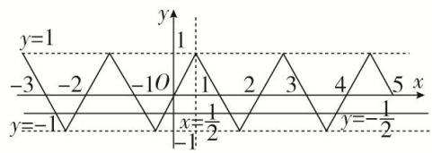
∴结合图象可得方程 $f(x)=-\frac{1}{2}$ 在区间 $[-3,5]$ 内有 8 个根，且所有根之和为 $\frac{1}{2}\times2\times4=4$ .  
（4）已知定义在 $\mathbf{R}$ 上的函数 $f(x)$ 满足： $f(x) = \begin{cases} x^2 + 2 & 0 \leq x < 1 \\ 2 - x^2 & -1 \leq x < 0 \end{cases}$ ，且 $f(x + 2) = f(x)$ ， $g(x) = \frac{2x + 5}{x + 2}$ ，则方程 $f(x) = g(x)$ ，在区间[-5, 1]上的所有实根之和为（）

A. -5

B. -6

C. -7

D. -8
答案 C 解析 先做图观察实根的特点，在 $[-1, 1)$ 中，通过作图可发现 $f(x)$ 在 $(-1, 1)$ 关于 $(0, 2)$ 中心对称，由 $f(x+2)=f(x)$ 可得 $f(x)$ 是周期为2的周期函数，则在下一个周期 $(-3, -1)$ 中， $f(x)$ 关于 $(-2, 2)$ 中心对称，以此类推。从而做出 $f(x)$ 的图像（此处要注意区间端点值在何处取到），再看 $g(x)$ 图像， $g(x)=\frac{2x+5}{x+2}=2+\frac{1}{x+2}$ ，可视为将 $y=\frac{1}{x}$ 的图像向左平移2个单位后再向上平移2个单位，所以对称中心移至 $(-2, 2)$ ，刚好与 $f(x)$ 对称中心重合，如图所示：可得共有3个交点 $x_1<x_2<x_3$ ，其中 $x_2=-3$ ， $x_1$ 与 $x_3$ 关于 $(-2, 2)$ 中心对称，所以有 $x_1+x_3=-4$ 。所以 $x_1+x_2+x_3=-7$ 。

  
（5）定义在 $\mathbf{R}$ 上的偶函数 $f(x)$ 满足 $f(x + 1) = -f(x)$ ，当 $x \in [0, 1]$ 时， $f(x) = -2x + 1$ ，设函数 $g(x) = \left(\frac{1}{2}\right)x^{-1}(-1 \leq x \leq 3)$ ，则函数 $f(x)$ 与 $g(x)$ 的图象所有交点的横坐标之和为（）

A. 2

B. 4

C. 6

D. 8
答案 B 解析 $\because f(x + 1) = -f(x), \therefore f(x + 2) = -f(x + 1) = f(x), \therefore f(x)$ 的周期为 2．又 $f(x)$ 为偶函数， $\therefore f(1 - x) = f(x - 1) = f(x + 1)$ ，故 $f(x)$ 的图象关于直线 $x = 1$ 对称．又 $g(x) = \left(\frac{1}{2}\right)^{|x - 1|} (-1 \leq x \leq 3)$ 的图象关于直线 $x = 1$ 对称，作出 $f(x)$ 和 $g(x)$ 的图象如图所示.

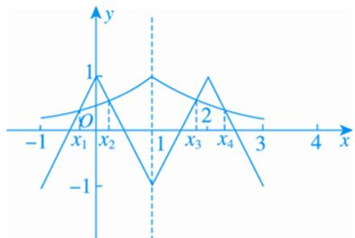
由图象可知两函数图象在 $[-1, 3]$ 上共有4个交点，分别记从左到右各交点的横坐标为 $x_{1}, x_{2}, x_{3}, x_{4}$ ，可知 $x = x_{1}$ 与 $x = x_{4}$ ， $x = x_{2}$ 与 $x = x_{3}$ 分别关于 $x = 1$ 对称， $\therefore$ 所有交点的横坐标之和为 $x_{1} + x_{2} + x_{3} + x_{4} = 1 \times 2 \times 2 = 4$ ，故选B.

# 【对点训练】

1. 函数 $f(x) = \left(\frac{1}{2}\right)^{|x - 1|} + 2\cos \pi x (-4 \leq x \leq 6)$ 的所有零点之和为 \_\_\_\_.

1. 答案 10 解析 可转化为两个函数 $y = \left(\frac{1}{2}\right)^{|x - 1|}$ 与 $y = -2\cos \pi x$ 在 $[-4, 6]$ 上的交点的横坐标的和，因为两个函数均关于 $x = 1$ 对称，所以两个函数在 $x = 1$ 两侧的交点对称，则每对对称点的横坐标的和为 2，分别画出两个函数的图象易知两个函数在 $x = 1$ 两侧分别有 5 个交点，所以 $5 \times 2 = 10$ .

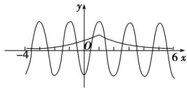

2. 已知 $M$ 是函数 $f(x) = \mathrm{e}x^2 - 3x + \frac{13}{4} - 8\cos \left[\pi \left(\frac{1}{2} - x\right)\right]$ 在 $x \in (0, +\infty)$ 上的所有零点之和，则 $M$ 的值为（）

A. 3

B. 6

C. 9

D. 12

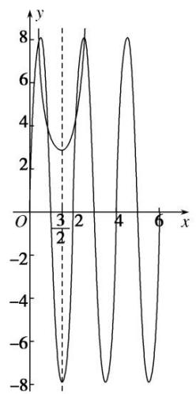

2. 答案 B 解析 函数 $f(x) = \mathrm{e}x^2 - 3x + \frac{13}{4} - 8\cos \left[\pi \left(\frac{1}{2} - x\right)\right]$ 在 $x \in (0, +\infty)$ 上的所有零点之和，即 $\mathrm{e}x^2 - 3x + \frac{13}{4} = 8\sin \pi x$ 在 $(0, +\infty)$ 上的所有实数根之和，即 $\mathrm{e}\left(x - \frac{3}{2}\right)^2 + 1 = 8\sin \pi x$ 在 $(0, +\infty)$ 上的所有实数根之和。令 $g(x) = \mathrm{e}\left(x - \frac{3}{2}\right)^2 + 1, h(x) = 8\sin \pi x$ ，易知函数 $g(x) = \mathrm{e}\left(x - \frac{3}{2}\right)^2 + 1$ 的图象关于直线 $x = \frac{3}{2}$ 对称，函数 $h(x) = 8\sin \pi x$ 的图象也关于直线 $x = \frac{3}{2}$ 对称，作出两个函数的大致图象，如图所示。由图象知，两个函数的图象有 4 个交点，且 4 个交点的横坐标之和为 6，故选 B.

3. 已知函数 $f(x) = \sin x - \sin 3x, x \in [0, 2\pi]$ ，则 $f(x)$ 的所有零点之和等于（）

A. $5\pi$

B. $6\pi$

C. $7\pi$

D. $8\pi$

3. 答案 C 解析 $f(x) = \sin x - \sin 3x = \sin (2x - x) - \sin (2x + x) = -2\cos 2x\sin x$ ，令 $f(x) = 0$ ，可得 $\cos 2x = 0$ 或 $\sin x = 0$ ，因为 $x \in [0, 2\pi]$ ，所以 $2x \in [0, 4\pi]$ ，由 $\cos 2x = 0$ 可得 $2x = \frac{\pi}{2}$ 或 $2x = \frac{3\pi}{2}$ 或 $2x = \frac{5\pi}{2}$ 或 $2x = \frac{7\pi}{2}$ ，所以 $x = \frac{\pi}{4}$ 或 $x = \frac{3\pi}{4}$ 或 $x = \frac{5\pi}{4}$ 或 $x = \frac{7\pi}{4}$ ，由 $\sin x = 0$ 可得 $x = 0$ 或 $x = \pi$ 或 $x = 2\pi$ ，因为 $\frac{\pi}{4} + \frac{3\pi}{4} + \frac{5\pi}{4} + \frac{7\pi}{4} + 0 + \pi + 2\pi = 7\pi$ ，所以 $f(x)$ 的所有零点之和等于 $7\pi$ ，故选 C.

4. 已知函数 $f(x) = \frac{x - 1}{x - 2}$ 与 $g(x) = 1 - \sin \pi x$ ，则函数 $F(x) = f(x) - g(x)$ 在区间 $[-2, 6]$ 上所有零点的和为（）

A. 4

B. 8

C. 12

D. 16

4. 答案 D 解析 令 $F(x) = f(x) - g(x) = 0$ ，得 $f(x) = g(x)$ ，在同一平面直角坐标系中分别画出函数 $f(x) = 1 + \frac{1}{x - 2}$ 与 $g(x) = 1 - \sin \pi x$ 的图象，如图所示，又 $f(x), g(x)$ 的图象都关于点(2, 1)对称，结合图象可知 $f(x)$ 与 $g(x)$ 的图象在[-2, 6]上共有8个交点，交点的横坐标即 $F(x) = f(x) - g(x)$ 的零点，且这些交点关于直线 $x = 2$ 成对出现，由对称性可得所有零点之和为 $4 \times 2 \times 2 = 16$ ，故选D.

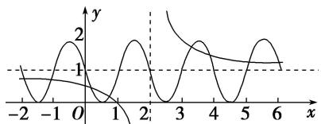

5. 已知函数 $f(x) = \left(\frac{1}{2}\right)^x$ ， $g(x) = \log_{\frac{1}{2}} x$ ，记函数 $h(x) = \begin{cases} g(x), & f(x) \leq g(x), \\ f(x), & f(x) > g(x), \end{cases}$ 则函数 $F(x) = h(x) + x - 5$ 的所有

零点的和为\_\_\_\_。

5. 答案 5 解析 由题意知函数 $h(x)$ 的图象如图所示，易知函数 $h(x)$ 的图象关于直线 $y = x$ 对称，函数 $F(x)$ 所有零点的和就是函数 $y = h(x)$ 与函数 $y = 5 - x$ 图象交点横坐标的和，设图象交点的横坐标分别为 $x_{1}, x_{2}$ ，因为两函数图象的交点关于直线 $y = x$ 对称，所以 $\frac{x_1 + x_2}{2} = 5 - \frac{x_1 + x_2}{2}$ ，所以 $x_1 + x_2 = 5$ .

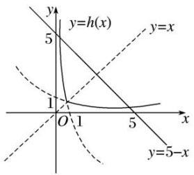

6. 函数 $f(x)$ 对一切实数 $x$ 都满足 $f(\frac{1}{2} + x) = f(\frac{1}{2} - x)$ ，并且方程 $f(x) = 0$ 有三个实根，则这三个实根的和为 \_\_\_\_.

6. 答案 $\frac{3}{2}$ 解析 函数图象关于直线 $x = \frac{1}{2}$ 对称，方程 $f(x) = 0$ 有三个实根时，一定有一个是 $\frac{1}{2}$ ，另外两个关于直线 $x = \frac{1}{2}$ 对称，其和为 1，故方程 $f(x) = 0$ 的三个实根之和为 $\frac{3}{2}$ .

7. 若 $y = f(x)$ 是定义在 $\mathbf{R}$ 上的函数，且满足：① $f(x)$ 是偶函数；② $f(x + 2)$ 是偶函数；③当 $0 < x \leq 2$ 时， $f(x) = \log_{2019} x$ ，当 $x = 0$ 时， $f(x) = 0$ ，则方程 $f(x) = -2019$ 在区间(1, 10)内的所有实数根之和为（）

A. 0

B. 10

C. 12

D. 24

7. 答案 D 解析 由 $f(x + 2)$ 是偶函数得 $f(x + 2) = f(-x + 2)$ ，则 $f(x)$ 的图象关于 $x = 2$ 对称。又因为 $f(x)$ 是偶函数，所以 $f(x)$ 的图象关于 $x = 0$ 对称， $x = 2n (n \in \mathbf{Z})$ 是函数 $f(x)$ 的对称轴。因为当 $0 < x \leq 2$ 时， $f(x) = \log_{2019} x$ ，当 $x = 0$ 时， $f(x) = 0$ ，所以在区间(1, 10)内，方程 $f(x) = -2019$ 有 4 个根，关于 $x = 4$ 对称的两个根之和为 8，关于 $x = 8$ 对称的两个根之和为 16，所以方程 $f(x) = -2019$ 在区间(1, 10)内的所有实数根之和为 24。

8. 定义在 $\mathbf{R}$ 上的奇函数 $f(x)$ ，当 $x \geq 0$ 时， $f(x) = \begin{cases} -\frac{2x}{x + 1}, & x \in [0, 1], \\ 1 - |x - 3|, & x \in [1, +\infty], \end{cases}$ 则函数 $F(x) = f(x) - \frac{1}{\pi}$ 的所有零点之和为 \_\_\_\_.

8. 答案 $\frac{1}{1 - 2\pi}$ 解析 由题意知，当 $x < 0$ 时， $f(x) = \begin{cases} -\frac{2x}{1 - x}, & x \in [-1, 0], \\ |x + 3| - 1, & x \in -\infty, -1], \end{cases}$ 作出函数 $f(x)$ 的图象如图所示，设函数 $y = f(x)$ 的图象与 $y = \frac{1}{\pi}$ 交点的横坐标从左到右依次为 $x_1, x_2, x_3, x_4, x_5$ ，由图象的对称性可知， $x_1 + x_2 = -6, x_4 + x_5 = 6, x_1 + x_2 + x_4 + x_5 = 0$ ，令 $-\frac{2x}{1 - x} = \frac{1}{\pi}$ ，解得 $x_3 = \frac{1}{1 - 2\pi}$ ，所以函数 $F(x) = f(x) - \frac{1}{\pi}$ 的所有零点之和为 $\frac{1}{1 - 2\pi}$ .

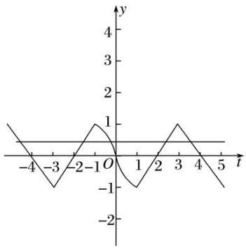

9. 函数 $f(x)$ 是定义在 $\mathbf{R}$ 上的奇函数，当 $x > 0$ 时， $f(x) = \begin{cases} 2^{|x-1|} - 1, & 0 < x \leq 2, \\ \frac{1}{2} f(x - 2), & x > 2, \end{cases}$ ，则函数 $g(x) = xf(x) - 1$ 在 $[-6, +\infty)$ 上的所有零点之和为（）

A. 8

B. 32

C. $\frac{1}{2}$

D. 0

9. 答案 A 解析 令 $g(x) = xf(x) - 1 = 0$ ，则 $x \neq 0$ ，所以函数 $g(x)$ 的零点之和等价于函数 $y = f(x)$ 的图象和 $y = \frac{1}{x}$ 的图象的交点的横坐标之和，分别作出 $x > 0$ 时， $y = f(x)$ 和 $y = \frac{1}{x}$ 的大致图象，如图所示，

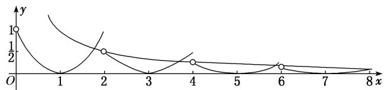
由于 $y=f(x)$ 和 $y=\frac{1}{x}$ 的图象都关于原点对称，因此函数 $g(x)$ 在 $[-6,6]$ 上的所有零点之和为 0，而当 x=8 时， $f(x)=\frac{1}{8}$ ，即两函数的图象刚好有 1 个交点，且当 $x\in(8,+\infty)$ 时， $y=\frac{1}{x}$ 的图象都在 $y=f(x)$ 的图象的上方，因此 $g(x)$ 在 $[-6,+\infty)$ 上的所有零点之和为 8.

10. 已知函数 $y = f(x + 1) - 2$ 是奇函数， $g(x) = \frac{2x - 1}{x - 1}$ ，且 $f(x)$ 与 $g(x)$ 的图象的交点为 $(x_1, y_1), (x_2, y_2), \ldots, (x_n, y_n)$ ，则 $x_1 + x_2 + \ldots + x_6 + y_1 + y_2 + \ldots + y_6 =$ \_\_\_\_.

10. 答案 18 解析 因为函数 $y = f(x + 1) - 2$ 为奇函数，所以函数 $f(x)$ 的图象关于点(1,2)对称， $g(x) = \frac{2x - 1}{x - 1} = \frac{1}{x - 1} + 2$ 关于点(1,2)对称，所以两个函数图象的交点也关于点(1,2)对称，则 $(x_1 + x_2 + \ldots + x_6) + (y_1 + y_2 + \ldots + y_6) = 2 \times 3 + 4 \times 3 = 18$ .

# 考点二 与零点相关的不等式问题

# 【方法总结】

与零点相关的不等式问题：可将零点问题转化成方程问题，进而通过构造函数将方程转化为两个图像交点问题，并作出函数图像。通过图像与交点位置确定参数和零点的取值范围。将相等的函数值设为 $t$ ，从而用 $t$ 可表示出 $x_1, x_2, \_\_\_\_$ ，将关于 $x_1, x_2, \_\_\_\_$ 的表达式转化为关于 $t$ 的一元表达式，进而可求出范围或最值，从而解决问题。

# 【例题选讲】

[例 2]（1）设方程 $10^{x}=|\lg(-x)|$ 的两根分别为 $x_{1}$ ， $x_{2}$ ，则()

A. $x_{1}x_{2} < 0$

B. $x_{1}x_{2} = 1$

C. $x_{1}x_{2} > 1$

D. $0 < x_{1}x_{2} < 1$
答案 D 解析 作出函数 $y = 10^{x}$ ， $y = |\lg (-x)|$ 的图象，由图象可知，两个根一个小于-1，一个在(-1, 0)之间，不妨设 $x_{1} < -1$ ， $-1 < x_{2} < 0$ ，则 $10x_{1} = \lg (-x_{1})$ ， $10x_{2} = |\lg (-x_{2})| = -\lg (-x_{2})$ 。两式相减得： $\lg (-x_{1}) - (-\lg (-x_{2})) = \lg (-x_{1}) + \lg (-x_{2}) = \lg (x_{1}x_{2}) = 10x_{1} - 10x_{2} < 0$ ，即 $0 < x_{1}x_{2} < 1$ 。

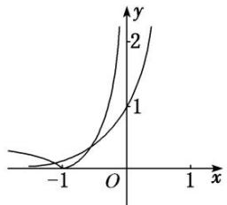  
（2）设函数 $f(x) = \mathrm{e}^{x} + 2x - 4$ ， $g(x) = \ln x + 2x^2 - 5$ ，若实数 $a, b$ 分别是 $f(x)$ ， $g(x)$ 的零点，则（）

A. $g(a)<0<f(b)$

B. $f(b)<0<g(a)$

C. $0 < g(a) < f(b)$

D. $f(b) < g(a) < 0$
答案 A 解析 依题意, $f(0) = -3 < 0$ , $f(1) = \mathrm{e} - 2 > 0$ , 且函数 $f(x)$ 是增函数, 因此函数 $f(x)$ 的零点 $a \in (0, 1)$ , $g(1) = -3 < 0$ , $g(2) = \ln 2 + 3 > 0$ , 且函数 $g(x)$ 在 $(0, +\infty)$ 上是增函数, 因此函数 $g(x)$ 的零点 $b \in (1, 2)$ , 于是有 $f(b) > f(1) > 0$ , $g(a) < g(1) < 0$ , $g(a) < 0 < f(b)$ . 故选 A.  
（3）已知函数 $f(x) = 2^{x} + x$ ， $g(x) = \log_3 x + x$ ， $h(x) = x - \frac{1}{\sqrt{x}}$ 的零点依次为 $a, b, c$ ，则（）

A. a<b<c

B. c<b<a

C. c<a<b

D. b<a<c
答案 A 解析 在同一坐标系下分别画出函数 $y = 2^{x}$ , $y = \log_3 x$ , $y = -\frac{1}{\sqrt{x}}$ 的图象, 如图, 观察它们与 $y = -x$ 的交点可知 $a < b < c$ .

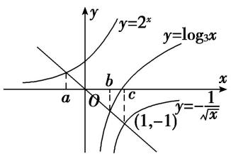  
（4）已知函数 $f(x)=|\ln x|$ ，若0<a<b，且 $f(a)=f(b)$ ，则 $a+2b$ 的取值范围是()

A. $(2\sqrt{2}, +\infty)$

B. $[2\sqrt{2}, +\infty)$

C. $(3, +\infty)$

D. $[3, +\infty)$
答案 D 解析 先做出 $f(x)$ 的图像，通过图像可知，如果 $f(a)=f(b)$ ，则 0<a<1<b，设 $f(a)=f(b)=t>0$ ，即 $\left|\ln a\right|=\left|\ln b\right|=t>0$ ，由 a, b 范围可得， $\ln a<0,\ln b>0$ ，从而 $a=e^{-t},b=e^{t}$ ，所以 $a+2b=e^{-t}+2e^{t}$ ，而 $e^{t}>0$ ，所以 $e^{-t}+2e^{t}\in(3,+\infty)$ .

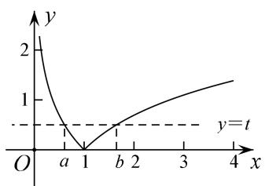

注：此类问题如果 $f(x)$ 图像易于作出，可先作图以便于观察函数特点.

本题有两个关键点，一个是引入辅助变量 t，从而用 t 表示出 a, b 达到消元效果，但是要注意 t 是有范围的（通过数形结合 y=t 需与 $y=f(x)$ 有两交点）；一个是通过图像判断出 a, b 的范围，从而去掉绝对值.  
（5）已知函数 $f(x)=\left\{\begin{aligned}x+\frac{1}{2},&0\leq x<\frac{1}{2},\\ 2^{x-1},&\frac{1}{2}<x\leq2,\end{aligned}\right.$ 若存在 $x_{1},x_{2}$ ，当 $0\leq x_{1}<x_{2}<2$ 时， $f(x_{1})=f(x_{2})$ ，则 $x_{1}f(x_{2})-f(x_{2})$ 的取值范围为（）

A. $(0, \frac{2 - 3\sqrt{2}}{4})$

B. $\left[-\frac{9}{16}, \frac{2 - 3\sqrt{2}}{4}\right)$

C. $\left[-\frac{9}{16}, -\frac{1}{2}\right)$

D. $\left[\frac{2 - 3\sqrt{2}}{4}, -\frac{1}{2}\right)$
答案 C 解析 如图可知 $\frac{\sqrt{2} - 1}{2} \leq x_1 < \frac{1}{2}$ , $\frac{1}{2} \leq x_2 < 1$ , 所以 $x_1 f(x_2) - f(x_2) = (x_1 - 1)f(x_2) = (x_1 - 1)f(x_1) = (x_1 - 1)(x_1 + \frac{1}{2}) = x_1^2 - \frac{1}{2} x_1 - \frac{1}{2}$ . 所以 $x_1 f(x_2) - f(x_2) \in [-\frac{9}{16}, -\frac{1}{2})$ .

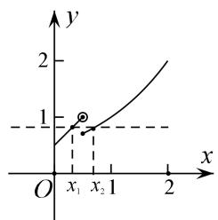  
（6）已知函数 $f(x)=\left\{\begin{aligned}\cos(x-\frac{\pi}{2}),&0\leqslant x\leqslant\pi,\\ \log_{2020}\frac{x}{\pi},&x>\pi,\end{aligned}\right.$
若有三个不同的实数 $a, b, c$ ，使得 $f(a) = f(b) = f(c)$ ，则 $a+b+c$ 的取值范围是 \_\_\_\_.
答案 (2π, 2021π) 解析 $f(x)$ 的图像可作，所以考虑作出 $f(x)$ 的图像，不妨设 $a < b < c$ ，由图像可得， $f(a) = f(b) \in (0, 1)$ ， $a, b \in [0, \pi]$ ，且关于 $x = \frac{\pi}{2}$ 轴对称，所以有 $\frac{a + b}{2} = \frac{\pi}{2}$ ，即 $a + b = \pi$ ，再观察 $c > \pi$ ，且 $f(c) = \log_{2020} \frac{c}{\pi} = f(a) \in (0, 1)$ ，所以 $0 < \log_{2020} \frac{c}{\pi} < 1$ ，即 $0 < c < 2020\pi$ ，从而 $a + b + c = \pi + c \in (2\pi, 2021\pi)$ .

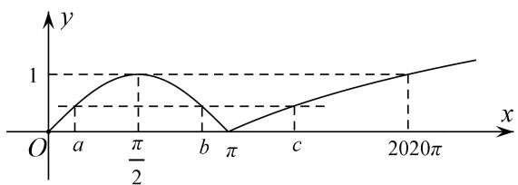

注：本题抓住 a, b 关于 $x=\frac{\pi}{2}$ 对称是关键，从而可由对称求得 $a+b=\pi$ ，使得所求式子只需考虑 c 的范围即可.  
（7）已知函数 $f(x) = \begin{cases} 2|\log_2x|, & 0 < x \leq 2, \\ (x - 3)(x - 4), & x > 2, \end{cases}$ 若 $f(x) = m$ 有四个零点 $a, b, c, d$ ，则 $abcd$ 的取值范围是 \_\_\_\_.
答案 (10, 12) 解析 作出函数 $f(x)$ 的图象，不妨设 $a < b < c < d$ ，则 $-\log_2 a = \log_2 b$ ， $\therefore ab = 1$ 。又根据二次函数的对称性，可知 $c + d = 7$ ， $\therefore cd = c(7 - c) = 7c - c^2 (2 < c < 3)$ ， $\therefore 10 < cd < 12$ ， $\therefore abcd$ 的取值范围是(10, 12).

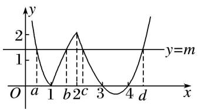  
（8）已知函数 $f(x) = \begin{cases} |\log_3 x|, & 0 < x \leq 3, \\ \frac{1}{3} x^2 - \frac{10}{3} x + 8, & x > 3, \end{cases}$ 若方程 $f(x) = m (m \in \mathbf{R})$ 有四个不同的实根 $x_1, x_2, x_3, x_4$ ，且满足 $x_1 < x_2 < x_3 < x_4$ ，则 $\frac{(x_3 - 3)(x_4 - 3)}{x_1 x_2}$ 的取值范围是（）

A. $(0, 4]$

B. $(0, 3)$

C. $(3, 4]$

D. $(1, 3)$
答案 B 解析 如图，作出函数 $f(x)$ 的图象，显然， $A(3,1)$ ，又当 $0<x\leq3$ 时， $f(x)\geq0$ ，因为方程 $f(x)=m$ 有四个不同的实根，所以 0<m<1。由 $f(x_{1})=f(x_{2})$ 可得， $|\log_{3}x_{1}|=|\log_{3}x_{2}|$ ，又因为 $0<x_{1}<1<x_{2}$ ，所以 $\log_{3}x_{1}+\log_{3}x_{2}=0$ ，解得 $x_{1}x_{2}=1$ 。因为函数 $y=\frac{1}{3}x^{2}-\frac{10}{3}x+8$ 的图象的对称轴为 x=5，

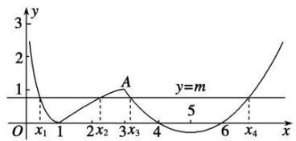
故由 $f(x_{3}) = f(x_{4})$ 可得 $x_{3} + x_{4} = 10$ . 故 $\frac{(x_3 - 3)(x_4 - 3)}{x_1x_2} = (x_3 - 3)(x_4 - 3) = (x_3 - 3)(7 - x_3) = -x_3^2 + 10x_3 - 21 = -(x_3 - 5)^2 + 4$ . 记 $g(t) = -(t - 5)^2 + 4$ , 由 $0 < m < 1$ , 即 $0 < \frac{1}{3} x^2 - \frac{10}{3} x + 8 < 1$ , 解得 $3 < x < 4$ 或 $6 < x < 7$ . 又 $x_3 < x_4$ , 所以 $3 < x_3 < 4$ , 又 $g(t) = -(t - 5)^2 + 4$ 在(3, 4)上单调递增, 所以当 $3 < t < 4$ 时, $g(3) < g(t) < g(4)$ , 即 $g(t) \in (0, 3)$ .

# 【对点训练】

11. 若函数 $f(x) = |\log_{ax}| - 2^{-x} (a > 0 \text{ 且 } a \neq 1)$ 的两个零点是 $m, n$ ，则（）

A. mn=1

B. mn>1

C. 0 < mn < 1

D. 以上都不对

11. 答案 C 解析 由题设可得 $|\log_a x| = \left(\frac{1}{2}\right)^x$ ，不妨设 $a > 1$ ， $m < n$ ，画出函数 $y = |\log_a x|$ ， $y = \left(\frac{1}{2}\right)^x$ 的图象如图所示，结合图象可知 $0 < m < 1$ ， $n > 1$ ，且 $-\log_a m = \left(\frac{1}{2}\right)^m$ ， $\log_a n = \left(\frac{1}{2}\right)^n$ ，以上两式两边相减可得 $\log_a(mn) = \left(\frac{1}{2}\right)^n - \left(\frac{1}{2}\right)^m < 0$ ，所以 $0 < mn < 1$ ，故选 C.

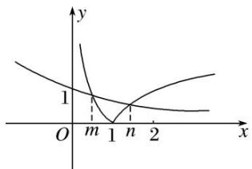

12. 已知函数 $f(x) = |\log_3(x - 1)| - \left(\frac{1}{3}\right)^x - 1$ 有两个不同的零点 $x_1, x_2$ ，则（）

A. $x_{1}x_{2} < 1$

B. $x_{1}x_{2} = x_{1} + x_{2}$

C. $x_{1}x_{2} > x_{1} + x_{2}$

D. $x_{1}x_{2}<x_{1}+x_{2}$

12. 答案 D 解析 可将零点化为方程 $|\log_3(x - 1)| = (\frac{1}{3})^x + 1$ 的根，进而转化为 $g(x) = |\log_3(x - 1)|$ 与 $h(x) = (\frac{1}{3})^x + 1$ 的交点，作出图像可得 $1 < x_1 < 2 < x_2$ ，进而可将 $|\log_3(x - 1)| = (\frac{1}{3})^x + 1$ 中的绝对值去掉得， $-\log_3(x_1)$
$-1) = (\frac{1}{3})^{x_1} + 1$ ， $-\log_3(x_2 - 1) = (\frac{1}{3})^{x_2} + 1$ ，观察选项涉及 $x_1x_2$ ， $x_1 + x_2$ ，故将②-①可得 $\log_3[(x_1 - 1)(x_2 - 1)] = (\frac{1}{3})^{x_1} - (\frac{1}{3})^{x_2}$ ，而 $y = (\frac{1}{3})^x$ 为减函数，且 $x_2 > x_1$ ，从而 $\log_3[(x_1 - 1)(x_2 - 1)] < 0$ ， $(x_1 - 1)(x_2 - 1) < 1$ ， $x_1x_2 < x_1 + x_2$ .

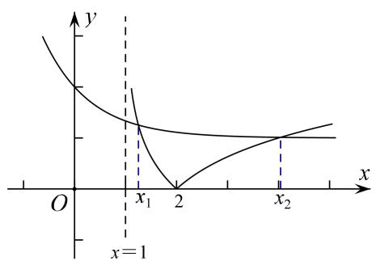

13. 已知 e 是自然对数的底数，函数 $f(x)=\mathrm{e}^{x}+x-2$ 的零点为 a，函数 $g(x)=\ln x+x-2$ 的零点为 b，则下列不等式成立的是()

A. $f(a) < f(1) < f(b)$

B. $f(a) < f(b) < f(1)$

C. $f(1) < f(a) < f(b)$

D. $f(b) < f(1) < f(a)$

13. 答案 A 解析 函数 $f(x)$ ， $g(x)$ 均为定义域上的单调递增函数，且 $f(0) = -1 < 0$ ， $f(1) = e - 1 > 0$ ， $g(1) = -1 < 0$ ， $g(e) = e - 1 > 0$ ，所以 $a \in (0, 1)$ ， $b \in (1, e)$ ，即 a < 1 < b，所以 $f(a) < f(1) < f(b)$ .

14. 已知函数 $f(x) = 2^x + x$ , $g(x) = x - \log_1 x$ , $h(x) = \log_2 x - \sqrt{x}$ 的零点分别为 $x_1, x_2, x_3$ ，则 $x_1, x_2, x_3$ 的大小关系是（）

A. $x_{1}>x_{2}>x_{3}$

B. $x_{2} > x_{1} > x_{3}$

C. $x_{1} > x_{3} > x_{2}$

D. $x_{3} > x_{2} > x_{1}$

14. 答案 D 解析 由 $f(x) = 2^x + x = 0$ ， $g(x) = x - \log_{\frac{1}{2}} x = 0$ ， $h(x) = \log_2 x - \sqrt{x} = 0$ 得 $2^x = -x$ ， $x = \log_{\frac{1}{2}} x$ ， $\log_2 x = \sqrt{x}$ 。在坐标系中分别作出 $y = 2^x$ ， $y = -x$ ； $y = x$ ， $y = \log_{\frac{1}{2}} x$ ； $y = \log_2 x$ ， $y = \sqrt{x}$ 的图象，由图象可知 $-1 < x_1 < 0$ ， $0 < x_2 < 1$ ， $x_3 > 1$ ，所以 $x_3 > x_2 > x_1$ 。

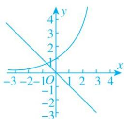

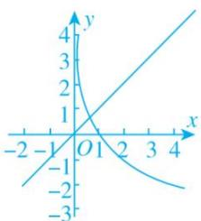

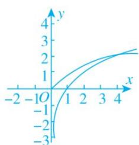

15. 已知 $f(x)=|\ln(x+1)|$ ，若 $f(a)=f(b)(a<b)$ ，则()

A. $a + b > 0$

B. $a+b>1$

C. $2a+b>0$

D. $2a+b>1$

15. 答案 A 解析 作出函数 $f(x) = |\ln (x + 1)|$ 的图象如图所示，由 $f(a) = f(b)(a < b)$ ，得 $-\ln (a + 1) = \ln (b + 1)$ ，即 $ab + a + b = 0$ ，所以 $0 = ab + a + b < \frac{(a + b)^2}{4} + a + b$ ，即 $(a + b)(a + b + 4) > 0$ ，又易知 $-1 < a < 0$ ， $b > 0$ . 所以 $a + b + 4 > 0$ ，所以 $a + b > 0$ . 故选 A.

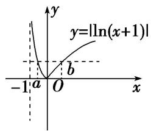

16. 已知函数 $f(x)=\left\{\begin{aligned}\log_{a}(x+1)&-1<x<1\\ f(2-x)+a-1&1<x<3\end{aligned}\right.$
$(a > 0, a \neq 1)$ , 若 $x_{1} \neq x_{2}$ , 且 $f(x_{1}) = f(x_{2})$ , 则 $x_{1} + x_{2}$ 的值( )

A. 恒小于 2

B. 恒大于 2

C. 恒等于 2

D. 与 $a$ 相关

16. 分析 观察到当 $-1 < x < 1$ 时， $f(x)$ 为单调函数，且 $1 < x < 3$ 时， $f(x)$ 的图像相当于作 $-1 < x < 1$ 时关于 $x = 1$ 对称的图像再进行上下平移，所以也为单调函数。由此可得 $f(x_1) = f(x_2)$ 时， $x_1, x_2$ 必在两段上。设 $x_1 < x_2$ 可得 $-1 < x_1 < 1 < x_2 < 3$ ，考虑使用代换法设 $f(x_1) = f(x_2) = t$ ，从而将 $x_1, x_2$ 均用 $a, t$ 表示，再判断 $x_1 + x_2$ 与 2 的大小即可。
答案 B 解析 设 $f(x_1) = f(x_2) = t$ ，不妨设 $-1 < x_1 < 1 < x_2 < 3$ ，则 $-1 < 2 - x_2 < 1$ ，所以 $\log_a(x_1 + 1) = t$ ， $x_1 = a^t - 1$ ， $\log_a(3 - x_2) + a - 1 = t$ ， $x_2 = 3 - a^{t+1-a}$ ，所以 $x_1 + x_2 = 2 + a^t - a^{t+1-a}$ ，若 $0 < a < 1$ ，则 $y = a^x$ 为减函数，且 $t < t + 1 - a$ ， $a^t > a^{t+1-a}$ ，所以 $x_1 + x_2 > 2$ 。若 $a > 1$ ，则 $y = a^x$ 为增函数，且 $t > t + 1 - a$ ， $a^t > a^{t+1-a}$ ，所以 $x_1 + x_2 > 2$ 。所以 $x_1 + x_2$ 的值恒大于 2。

17. 已知函数 $f(x) = \begin{cases} |\log_2x - 1|, & 0 < x \leq 4, \\ 3 - \sqrt{x}, & x > 4, \end{cases}$ 设 $a, b, c$ 是三个不相等的实数，且满足 $f(a) = f(b) = f(c)$ ，则 abc 的取值范围为 \_\_\_\_.

17. 答案 (16, 36) 解析 作出 $f(x)$ 的图象如图，

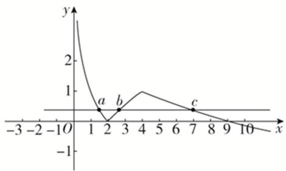
当 $x > 4$ 时，由 $f(x) = 3 - \sqrt{x} = 0$ ，得 $\sqrt{x} = 3$ ，得 $x = 9$ ，若 $a, b, c$ 互不相等，不妨设 $a < b < c$ ，因为 $f(a) = f(b) = f(c)$ ，所以由图象可知 $0 < a < 2 < b < 4 < c < 9$ ，由 $f(a) = f(b)$ ，得 $1 - \log_2 a = \log_2 b - 1$ ，即 $\log_2 a + \log_2 b = 2$ ，即 $\log_2(ab) = 2$ ，则 $ab = 4$ ，所以 $abc = 4c$ ，因为 $4 < c < 9$ ，所以 $16 < 4c < 36$ ，即 $16 < abc < 36$ ，所以 $abc$ 的取值范围是(16, 36).

18. 已知函数 $f(x) = \begin{cases} |\log_2 x|, & 0 < x < 2, \\ \sin(\frac{\pi}{4} x), & 2 \leqslant x \leqslant 10, \end{cases}$ 若存在实数 $x_1, x_2, x_3, x_4$ ，满足 $x_1 < x_2 < x_3 < x_4$ ，且 $f(x_1) = f(x_2) = f(x_3) = f(x_4)$ ，则 $\frac{(x_3 - 2)(x_4 - 2)}{x_1x_2}$ 的取值范围是（）

A. (4, 16)

B. $(0, 12)$

C. (9, 21)

D. (15, 25)

18. 答案 B 解析 不妨设 $f(x_{1})=f(x_{2})=f(x_{3})=f(x_{4})=a$ ，作出 $f(x)$ 的图像，y=a 与 $y=f(x)$ 有四个不同交点，则 $a \in (0, 1)$ ，且 $x_{1} < 1 < x_{2}$ 。 $x_{3}$ ， $x_{4}$ 关于 $x = 6$ 对称。所以有 $-\log_{2} x_{1} = \log_{2} x_{2}$ ，即 $x_{1} x_{2} = 1$ 且 $x_{3} + x_{4} = 12$ 即 $\frac{(x_{3} - 2)(x_{4} - 2)}{x_{1} x_{2}} = x_{3} x_{4} - 20$ ，因为 $x_{3} + x_{4} = 12$ ，所以 $x_{3} = 12 - x_{4}$ ，所以 $\frac{(x_{3} - 2)(x_{4} - 2)}{x_{1} x_{2}} = x_{4}(12 - x_{4}) - 20$ ， $x_{4} \in (8, 10)$ ，所以 $\frac{(x_{3} - 2)(x_{4} - 2)}{x_{1} x_{2}}$ 的范围为 $(0, 12)$ 。

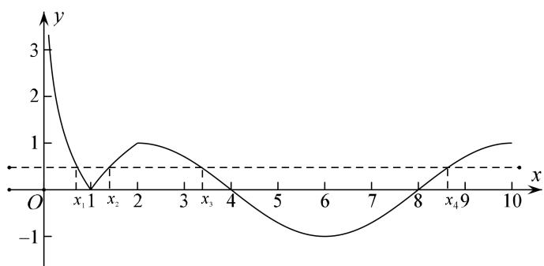

19. 设 $x_{1}, x_{2}$ 分别是函数 $f(x) = x - a^{-x}$ 和 $g(x) = x\log_{a}x - 1$ 的零点(其中 $a > 1$ ), 则 $x_{1} + 4x_{2}$ 的取值范围是 \_\_\_\_.

19. 答案 (5, +∞) 解析 $f(x)=x-a^{-x}$ 的零点 $x_{1}$ 是方程 $x=a^{-x}$ ，即 $\frac{1}{x}=a^{x}$ 的解， $g(x)=x\log_{a}x-1$ 的零点 $x_{2}$ 是方程 $x\log_{a}x-1=0$ ，即 $\frac{1}{x}=\log_{a}x$ 的解，即 $x_{1}$ ， $x_{2}$ 是 $y=a^{x}$ 与 $y=\log_{a}x$ 与 $y=\frac{1}{x}$ 交点 A，B 的横坐标，可得 $0<x_{1}<1$ ， $x_{2}>1$ ，∵ $y=a^{x}$ 的图象与 $y=\log_{a}x$ 关于 y=x 对称， $y=\frac{1}{x}$ 的图象也关于 y=x 对称，∴ A，B 关于 y=x 对称，设 $A\left(x_{1},\frac{1}{x_{1}}\right)$ ， $B\left(x_{2},\frac{1}{x_{2}}\right)$ ，∴ A 关于 y=x 的对称点 $A'\left(\frac{1}{x_{1}},x_{1}\right)$ 与 B 重合， $\frac{1}{x_{2}}=x_{1}$ ，即 $x_{2}x_{1}=1$ ， $x_{1}+4x_{2}=x_{1}+x_{2}+3x_{2}>2\sqrt{x_{1}x_{2}}+3x_{2}>2+3=5$ ， $x_{1}+4x_{2}$ 的取值范围是 (5, +∞).

20. 已知 $f(x) = \begin{cases} |x + 1|, & x \leq 0, \\ |\log_2 x|, & x > 0, \end{cases}$ 若方程 $f(x) = a$ 有四个不同的解 $x_1 < x_2 < x_3 < x_4$ ，则 $x_1 + x_2 + \frac{1}{x_3} + \frac{1}{x_4}$ 的取值范围是（）

A. $[0, \frac{1}{2})$

B. $(0,\ \frac{1}{2}]$

C. $[0, \frac{1}{2}]$

D. $[0, 1)$

20. 答案 B 解析 作出 $f(x)$ 的图像可知若 $f(x) = a$ 有四个不同的解，则 $a \in (0,1]$ ，且在这四个根中， $x_1, x_2$ ，关于直线 $x = -1$ 对称，所以 $x_1 + x_2 = -2$ ， $x_3 < 1 < x_4$ ，所以 $a = -\log_2 x_3 = \log_2 x_4$ ，即 $x_3 = (\frac{1}{2})^a$ ， $x_4 = 2^a$ ，所以 $g(a) = x_1 + x_2 + \frac{1}{x_3} + \frac{1}{x_4} = -2 + 2^a + (\frac{1}{2})^a$ ，由 $a \in (0,1]$ ，可得 $g(a)$ 的范围是 $(0, \frac{1}{2}]$ .

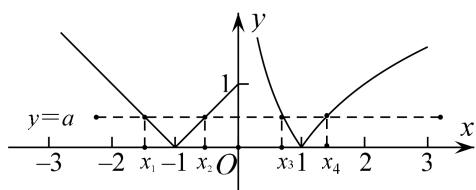

