专题十七 函数的零点问题（4）

考点一　与零点相关的等式问题

【方法总结】

与零点相关的等式问题：可将零点问题转化成方程问题，进而通过构造函数将方程转化为两个图像交点问题，并作出函数图像．观察交点的特点(比如对称性等)并选择合适的方法处理表达式的值．即利用对称性解决对称点求和：如果<em>x</em>1，<em>x</em>2关于<em>x</em>＝<em>a</em>轴对称，则<em>x</em>1＋<em>x</em>2＝2<em>a</em>；如果<em>x</em>1，<em>x</em>2关于(<em>a</em>，0)中心对称，则也有<em>x</em>1＋<em>x</em>2＝2<em>a</em>．将对称的点归为一组，从而解决问题．

【例题选讲】

<strong>[例1]</strong>（1）已知函数<em>f</em>(<em>x</em>)＝e<em>x</em>－e－<em>x</em>＋4，若方程<em>f</em>(<em>x</em>)＝<em>kx</em>＋4(<em>k</em>&gt;0)有三个不同的实根<em>x</em>1，<em>x</em>2，<em>x</em>3，则<em>x</em>1＋<em>x</em>2＋<em>x</em>3＝\_\_\_\_\_\_\_\_．

<strong>答案</strong>　0　<strong>解析</strong>　方程<em>f</em>(<em>x</em>)＝<em>kx</em>＋4(<em>k</em>&gt;0)有三个不同的实根，即方程e<em>x</em>－e－<em>x</em>＝<em>kx</em>有三个不同的实根，易知<em>y</em>＝e<em>x</em>－e－<em>x</em>为奇函数且递增，得<em>y</em>＝<em>f</em>(<em>x</em>)的图象．所以<em>y</em>＝<em>f</em>(<em>x</em>)的图象关于点(0，0)对称，又<em>y</em>＝<em>kx</em>过点(0，0)且关于(0，0)对称．∴方程e<em>x</em>－e－<em>x</em>＝<em>kx</em>的三个根中有一个为0，且另两根之和为0．因此<em>x</em>1＋<em>x</em>2＋<em>x</em>3＝0．

  
（2）已知函数<em>f</em>(<em>x</em>)＝<em>x</em>2－3<em>x</em>＋－8cosπ(－<em>x</em>)，则函数<em>f</em>(<em>x</em>)在(0，＋∞)上的所有零点之和为(　　)

A．6　　　　　　　　
B．7　　　　　　　　
C．9　　　　　　　　
D．12

<strong>答案</strong>　A　<strong>解析</strong>　<em>h</em>(<em>x</em>)＝<em>x</em>2－3<em>x</em>＋＝(<em>x</em>－)2＋1的图象关于<em>x</em>＝对称，设函数<em>g</em>(<em>x</em>)＝8cosπ(－<em>x</em>)．由π(－<em>x</em>)＝<em>k</em>π，可得<em>x</em>＝－<em>k</em>(<em>k</em>∈<strong>Z</strong>)，令<em>k</em>＝－1可得<em>x</em>＝，所以函数<em>g</em>(<em>x</em>)＝8cosπ(－<em>x</em>)的图象也关于<em>x</em>＝对称．当<em>x</em>＝时，<em>h</em>()＝2&lt;<em>g</em>()＝8，作出函数<em>h</em>(<em>x</em>)，<em>g</em>(<em>x</em>)的图象．由图可知函数<em>h</em>(<em>x</em>)＝<em>x</em>2－3<em>x</em>＋＝(<em>x</em>－)2＋1的图象与函数<em>g</em>(<em>x</em>)＝8cos(π－<em>x</em>)的图象有四个交点，所以函数<em>f</em>(<em>x</em>)＝<em>x</em>2－3<em>x</em>＋－8cos(π－<em>x</em>)在(0，＋∞)上的零点个数为4，所有零点之和为4×＝6，故选A．

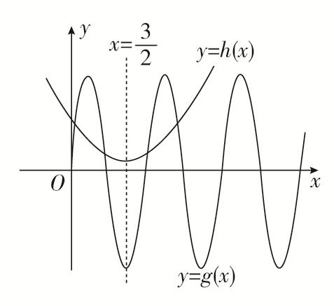  
（3）已知函数<em>f</em>(<em>x</em>)对任意的<em>x</em>∈<strong>R</strong>，都有<em>f</em>(＋<em>x</em>)＝<em>f</em>(－<em>x</em>)，函数<em>f</em>(<em>x</em>＋1)是奇函数，当－≤<em>x</em>≤时，<em>f</em>(<em>x</em>)＝2<em>x</em>，则方程<em>f</em>(<em>x</em>)＝－在区间[－3，5]内的所有根的和为\_\_\_\_\_\_\_\_．

<strong>答案</strong>　4　<strong>解析</strong>　∵函数<em>f</em>(<em>x</em>＋1)是奇函数，∴函数<em>f</em>(<em>x</em>＋1)的图象关于点(0，0)对称，把函数<em>f</em>(<em>x</em>＋1)的图象向右平移1个单位可得函数<em>f</em>(<em>x</em>)的图象，即函数<em>f</em>(<em>x</em>)的图象关于点(1，0)对称，则<em>f</em>(2－<em>x</em>)＝－<em>f</em>(<em>x</em>)．又∵<em>f</em>(＋<em>x</em>)＝<em>f</em>(－<em>x</em>)，∴<em>f</em>(1－<em>x</em>)＝<em>f</em>(<em>x</em>)，从而<em>f</em>(2－<em>x</em>)＝－<em>f</em>(1－<em>x</em>)，∴<em>f</em>(<em>x</em>＋1)＝－<em>f</em>(<em>x</em>)，即<em>f</em>(<em>x</em>＋2)＝－<em>f</em>(<em>x</em>＋1)＝<em>f</em>(<em>x</em>)，∴函数<em>f</em>(<em>x</em>)的周期为2，且图象关于直线<em>x</em>＝对称．画出函数<em>f</em>(<em>x</em>)的图象如图所示．

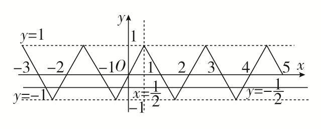
∴结合图象可得方程*f*(*x*)＝－在区间[－3，5]内有8个根，且所有根之和为×2×4＝4．  
（4）已知定义在<strong>R</strong>上的函数<em>f</em>(<em>x</em>)满足：<em>f</em>(<em>x</em>)＝，且<em>f</em>(<em>x</em>＋2)＝<em>f</em>(<em>x</em>)，<em>g</em>(<em>x</em>)＝，则方程<em>f</em>(<em>x</em>)＝<em>g</em>(<em>x</em>)，在区间[－5，1]上的所有实根之和为(　　)

A．－5　　　　　　　　
B．－6　　　　　　　　
C．－7　　　　　　　　
D．－8

<strong>答案</strong>　C　<strong>解析</strong>　先做图观察实根的特点，在[－1，1)中，通过作图可发现<em>f</em>(<em>x</em>)在(－1，1)关于(0，2)中心对称，由<em>f</em>(<em>x</em>＋2)＝<em>f</em>(<em>x</em>)可得<em>f</em>(<em>x</em>)是周期为2的周期函数，则在下一个周期(－3，－1)中，<em>f</em>(<em>x</em>)关于(－2，2)中心对称，以此类推.从而做出<em>f</em>(<em>x</em>)的图像（此处要注意区间端点值在何处取到），再看<em>g</em>(<em>x</em>)图像，<em>g</em>(<em>x</em>)＝＝2＋，可视为将<em>y</em>＝的图像向左平移2个单位后再向上平移2个单位，所以对称中心移至(－2，2)，刚好与<em>f</em>(<em>x</em>)对称中心重合，如图所示：可得共有3个交点<em>x</em>1&lt;<em>x</em>2&lt;<em>x</em>3，其中<em>x</em>2＝－3，<em>x</em>1与<em>x</em>3关于(－2，2)中心对称，所以有<em>x</em>1＋<em>x</em>3＝－4．所以<em>x</em>1＋<em>x</em>2＋<em>x</em>3＝－7．

  
（5）定义在<strong>R</strong>上的偶函数<em>f</em>(<em>x</em>)满足<em>f</em>(<em>x</em>＋1)＝－<em>f</em>(<em>x</em>)，当<em>x</em>∈[0，1]时，<em>f</em>(<em>x</em>)＝－2<em>x</em>＋1，设函数<em>g</em>(<em>x</em>)＝|<em>x</em>－1|(－1≤<em>x</em>≤3)，则函数<em>f</em>(<em>x</em>)与<em>g</em>(<em>x</em>)的图象所有交点的横坐标之和为(　　)

A．2　　　　　　　　
B．4　　　　　　　　
C．6　　　　　　　　
D．8

<strong>答案</strong>　B　解析　∵<em>f</em>(<em>x</em>＋1)＝－<em>f</em>(<em>x</em>)，∴<em>f</em>(<em>x</em>＋2)＝－<em>f</em>(<em>x</em>＋1)＝<em>f</em>(<em>x</em>)，∴<em>f</em>(<em>x</em>)的周期为2．又<em>f</em>(<em>x</em>)为偶函数，∴<em>f</em>(1－<em>x</em>)＝<em>f</em>(<em>x</em>－1)＝<em>f</em>(<em>x</em>＋1)，故<em>f</em>(<em>x</em>)的图象关于直线<em>x</em>＝1对称．又<em>g</em>(<em>x</em>)＝|<em>x</em>－1|(－1≤<em>x</em>≤3)的图象关于直线<em>x</em>＝1对称，作出<em>f</em>(<em>x</em>)和<em>g</em>(<em>x</em>)的图象如图所示．

由图象可知两函数图象在[－1，3]上共有4个交点，分别记从左到右各交点的横坐标为<em>x</em>1，<em>x</em>2，<em>x</em>3，<em>x</em>4，可知<em>x</em>＝<em>x</em>1与<em>x</em>＝<em>x</em>4，<em>x</em>＝<em>x</em>2与<em>x</em>＝<em>x</em>3分别关于<em>x</em>＝1对称，∴所有交点的横坐标之和为<em>x</em>1＋<em>x</em>2＋<em>x</em>3＋<em>x</em>4＝1×2×2＝4，故选B．

【对点训练】

1．函数*f*(*x*)＝＋2cosπ*x*(－4≤*x*≤6)的所有零点之和为\_\_\_\_\_\_\_\_．

1．答案　10　解析　可转化为两个函数*y*＝与*y*＝－2cos π*x*在[－4，6]上的交点的横坐标的和，因

为两个函数均关于*x*＝1对称，所以两个函数在*x*＝1两侧的交点对称，则每对对称点的横坐标的和为2，分别画出两个函数的图象易知两个函数在*x*＝1两侧分别有5个交点，所以5×2＝10．

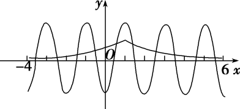

2．已知<em>M</em>是函数<em>f</em>(<em>x</em>)＝e<em>x</em>2－3<em>x</em>＋－8cos在<em>x</em>∈(0，＋∞)上的所有零点之和，则<em>M</em>的值为(　　)

A．3　　　　　　　　
B．6　　　　　　　　
C．9　　　　　　　　
D．12

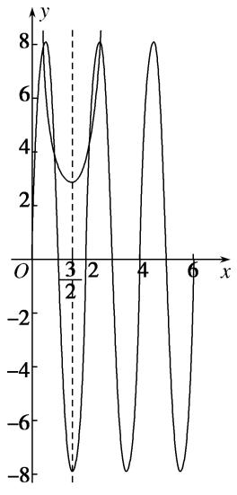

2．答案　B　解析　函数<em>f</em>(<em>x</em>)＝e<em>x</em>2－3<em>x</em>＋－8cos在<em>x</em>∈(0，＋∞)上的所有零点之和，即e<em>x</em>2－3<em>x</em>

＋＝8sinπ<em>x</em>在(0，＋∞)上的所有实数根之和，即e2＋1＝8sinπ<em>x</em>在(0，＋∞)上的所有实数根之和．令<em>g</em>(<em>x</em>)＝e2＋1，<em>h</em>(<em>x</em>)＝8sinπ<em>x</em>，易知函数<em>g</em>(<em>x</em>)＝e2＋1的图象关于直线<em>x</em>＝对称，函数<em>h</em>(<em>x</em>)＝8sinπ<em>x</em>的图象也关于直线<em>x</em>＝对称，作出两个函数的大致图象，如图所示．由图象知，两个函数的图象有4个交点，且4个交点的横坐标之和为6，故选B.

3．已知函数*f*(*x*)＝sin*x*－sin3*x*，*x*∈[0，2π]，则*f*(*x*)的所有零点之和等于(　　)

A．5π　　　　　　　　
B．6π　　　　　　　　
C．7π　　　　　　　　
D．8π

3．答案　C　解析　*f*(*x*)＝sin*x*－sin3*x*＝sin(2*x*－*x*)－sin(2*x*＋*x*)＝－2cos 2*x*sin *x*，令*f*(*x*)＝0, 可得cos2*x*

＝0或sin*x*＝0，因为*x*∈[0，2π]，所以2*x*∈[0，4π]，由cos2*x*＝0可得2*x*＝或2*x*＝或2*x*＝或2*x*＝，所以*x*＝或*x*＝或*x*＝或*x*＝，由sin*x*＝0可得*x*＝0或*x*＝π或*x*＝2π，因为＋＋＋＋0＋π＋2π＝7π，所以*f*(*x*)的所有零点之和等于7π，故选C．

4．已知函数*f*(*x*)＝与*g*(*x*)＝1－sin π*x*，则函数*F*(*x*)＝*f*(*x*)－*g*(*x*)在区间[－2，6]上所有零点的和为(　　)

A．4　　　　　　　　
B．8　　　　　　　　
C．12　　　　　　　　
D．16

4．答案　D　解析　令*F*(*x*)＝*f*(*x*)－*g*(*x*)＝0，得*f*(*x*)＝*g*(*x*)，在同一平面直角坐标系中分别画出函数*f*(*x*)＝1

＋与*g*(*x*)＝1－sin π*x*的图象，如图所示，又*f*(*x*)，*g*(*x*)的图象都关于点(2，1)对称，结合图象可知*f*(*x*)与*g*(*x*)的图象在[－2，6]上共有8个交点，交点的横坐标即*F*(*x*)＝*f*(*x*)－*g*(*x*)的零点，且这些交点关于直线*x*＝2成对出现，由对称性可得所有零点之和为4×2×2＝16，故选D.

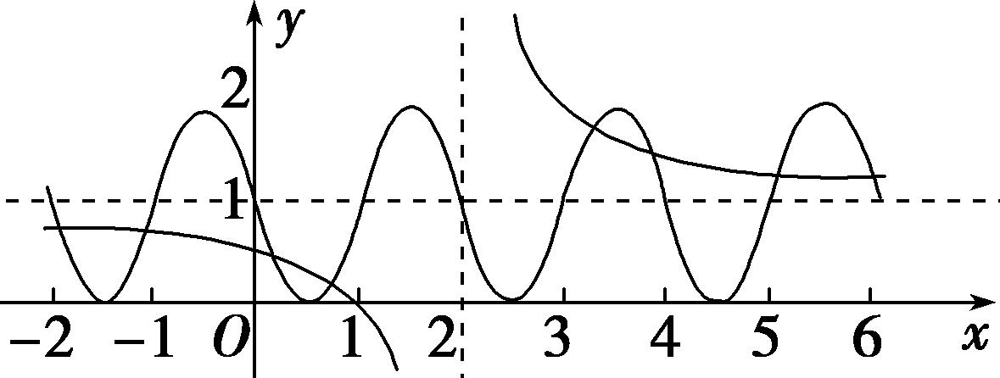

5．已知函数<em>f</em>(<em>x</em>)＝<em>x</em>，<em>g</em>(<em>x</em>)＝<em>x</em>，记函数<em>h</em>(<em>x</em>)＝则函数<em>F</em>(<em>x</em>)＝<em>h</em>(<em>x</em>)＋<em>x</em>－5的所有

零点的和为\_\_\_\_\_\_\_\_．

5．答案　5　解析　由题意知函数*h*(*x*)的图象如图所示，易知函数*h*(*x*)的图象关于直线*y*＝*x*对称，函数

<em>F</em>(<em>x</em>)所有零点的和就是函数<em>y</em>＝<em>h</em>(<em>x</em>)与函数<em>y</em>＝5－<em>x</em>图象交点横坐标的和，设图象交点的横坐标分别为<em>x</em>1，<em>x</em>2，因为两函数图象的交点关于直线<em>y</em>＝<em>x</em>对称，所以＝5－，所以<em>x</em>1＋<em>x</em>2＝5．

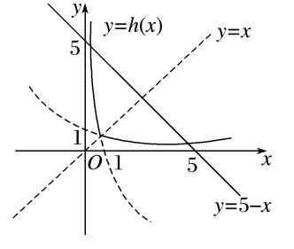

6．函数*f*(*x*)对一切实数*x*都满足*f*(＋*x*)＝*f*(－*x*)，并且方程*f*(*x*)＝0有三个实根，则这三个实根的和为

\_\_\_\_\_\_\_\_．

6．答案　　解析　函数图象关于直线*x*＝对称，方程*f*(*x*)＝0有三个实根时，一定有一个是，另外两个关于直线*x*＝对称，其和为1，故方程*f*(*x*)＝0的三个实根之和为．

7．若<em>y</em>＝<em>f</em>(<em>x</em>)是定义在<strong>R</strong>上的函数，且满足：①<em>f</em>(<em>x</em>)是偶函数；②<em>f</em>(<em>x</em>＋2)是偶函数；③当0＜<em>x</em>≤2时，<em>f</em>(<em>x</em>)

＝log2 019<em>x</em>，当<em>x</em>＝0时，<em>f</em>(<em>x</em>)＝0，则方程<em>f</em>(<em>x</em>)＝－2 019在区间(1，10)内的所有实数根之和为(　　)

A．0　　　　　　　　
B．10　　　　　　　　
C．12　　　　　　　　
D．24

7．答案　<strong>D</strong>　解析　由<em>f</em>(<em>x</em>＋2)是偶函数得<em>f</em>(<em>x</em>＋2)＝<em>f</em>(－<em>x</em>＋2)，则<em>f</em>(<em>x</em>)的图象关于<em>x</em>＝2对称．又因为<em>f</em>(<em>x</em>)

是偶函数，所以<em>f</em>(<em>x</em>)的图象关于<em>x</em>＝0对称，<em>x</em>＝2<em>n</em>(<em>n</em>∈<strong>Z</strong>)是函数<em>f</em>(<em>x</em>)的对称轴．因为当0＜<em>x</em>≤2时，<em>f</em>(<em>x</em>)＝log2 019<em>x</em>，当<em>x</em>＝0时，<em>f</em>(<em>x</em>)＝0，所以在区间(1，10)内，方程<em>f</em>(<em>x</em>)＝－2 019有4个根，关于<em>x</em>＝4对称的两个根之和为8，关于<em>x</em>＝8对称的两个根之和为16，所以方程<em>f</em>(<em>x</em>)＝－2 019在区间(1，10)内的所有实数根之和为24．

8．定义在<strong>R</strong>上的奇函数<em>f</em>(<em>x</em>)，当<em>x</em>≥0时，<em>f</em>(<em>x</em>)＝则函数<em>F</em>(<em>x</em>)＝<em>f</em>(<em>x</em>)－的所

有零点之和为\_\_\_\_\_\_\_\_．

8．答案　　解析　由题意知，当*x*<0时，*f*(*x*)＝作出函数*f*(*x*)的图

象如图所示，设函数<em>y</em>＝<em>f</em>(<em>x</em>)的图象与<em>y</em>＝交点的横坐标从左到右依次为<em>x</em>1，<em>x</em>2，<em>x</em>3，<em>x</em>4，<em>x</em>5，由图象的对称性可知，<em>x</em>1＋<em>x</em>2＝－6，<em>x</em>4＋<em>x</em>5＝6，<em>x</em>1＋<em>x</em>2＋<em>x</em>4＋<em>x</em>5＝0，令－＝，解得<em>x</em>3＝，所以函数<em>F</em>(<em>x</em>)＝<em>f</em>(<em>x</em>)－的所有零点之和为．

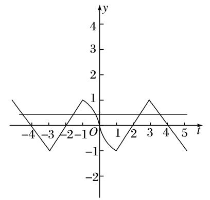

9．函数<em>f</em>(<em>x</em>)是定义在<strong>R</strong>上的奇函数，当<em>x</em>&gt;0时，<em>f</em>(<em>x</em>)＝则函数<em>g</em>(<em>x</em>)＝<em>xf</em>(<em>x</em>)－1在[－6，

＋∞)上的所有零点之和为(　　)

A．8　　　　　　　　
B．32　　　　　　　　
C．　　　　　　　　
D．0

9．答案　A　解析　令*g*(*x*)＝*xf*(*x*)－1＝0，则*x*≠0，所以函数*g*(*x*)的零点之和等价于函数*y*＝*f*(*x*)的图象和*y*

＝的图象的交点的横坐标之和，分别作出*x*>0时，*y*＝*f*(*x*)和*y*＝的大致图象，如图所示，

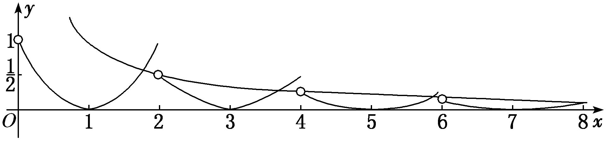
由于*y*＝*f*(*x*)和*y*＝的图象都关于原点对称，因此函数*g*(*x*)在[－6,6]上的所有零点之和为0，而当*x*＝8时，*f*(*x*)＝，即两函数的图象刚好有1个交点，且当*x*∈(8，＋∞)时，*y*＝的图象都在*y*＝*f*(*x*)的图象的上方，因此*g*(*x*)在[－6，＋∞)上的所有零点之和为8．

10．已知函数<em>y</em>＝<em>f</em>(<em>x</em>＋1)－2是奇函数，<em>g</em>(<em>x</em>)＝，且<em>f</em>(<em>x</em>)与<em>g</em>(<em>x</em>)的图象的交点为(<em>x</em>1，<em>y</em>1)，(<em>x</em>2，<em>y</em>2)，…，

(<em>xn</em>，<em>yn</em>)，则<em>x</em>1＋<em>x</em>2＋…＋<em>x</em>6＋<em>y</em>1＋<em>y</em>2＋…＋<em>y</em>6＝\_\_\_\_\_\_\_\_．

10．答案　18　解析　因为函数*y*＝*f*(*x*＋1)－2为奇函数，所以函数*f*(*x*)的图象关于点(1，2)对称，*g*(*x*)＝

＝＋2关于点(1，2)对称，所以两个函数图象的交点也关于点(1，2)对称，则(<em>x</em>1＋<em>x</em>2＋…＋<em>x</em>6)＋(<em>y</em>1＋<em>y</em>2＋…＋<em>y</em>6)＝2×3＋4×3＝18．

考点二　与零点相关的不等式问题

【方法总结】

与零点相关的不等式问题：可将零点问题转化成方程问题，进而通过构造函数将方程转化为两个图像交点问题，并作出函数图像．通过图像与交点位置确定参数和零点的取值范围．将相等的函数值设为<em>t</em>，从而用<em>t</em>可表示出<em>x</em>1，<em>x</em>2，﹍﹍，将关于<em>x</em>1，<em>x</em>2，﹍﹍的表达式转化为关于<em>t</em>的一元表达式，进而可求出范围或最值，从而解决问题．

【例题选讲】

<strong>[例2]</strong>（1）设方程10<em>x</em>＝|lg(－<em>x</em>)|的两根分别为<em>x</em>1，<em>x</em>2，则(　　)

A．<em>x</em>1<em>x</em>2&lt;0　　　　　
B．<em>x</em>1<em>x</em>2＝1　　　　　
C．<em>x</em>1<em>x</em>2&gt;1　　　　　
D．0&lt;<em>x</em>1<em>x</em>2&lt;1

<strong>答案</strong>　D　<strong>解析</strong>　作出函数<em>y</em>＝10<em>x</em>，<em>y</em>＝|lg(－<em>x</em>)|的图象，由图象可知，两个根一个小于－1，一个在(－1，0)之间，不妨设<em>x</em>1&lt;－1，－1&lt;<em>x</em>2&lt;0，则10<em>x</em>1＝lg(－<em>x</em>1)，10<em>x</em>2＝|lg(－<em>x</em>2)|＝－lg(－<em>x</em>2)．两式相减得：lg(－<em>x</em>1)－(－lg(－<em>x</em>2))＝lg(－<em>x</em>1)＋lg(－<em>x</em>2)＝lg(<em>x</em>1<em>x</em>2)＝10<em>x</em>1－10<em>x</em>2&lt;0，即0&lt;<em>x</em>1<em>x</em>2&lt;1．

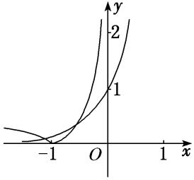  
（2）设函数<em>f</em>(<em>x</em>)＝e<em>x</em>＋2<em>x</em>－4，<em>g</em>(<em>x</em>)＝ln <em>x</em>＋2<em>x</em>2－5，若实数<em>a</em>，<em>b</em>分别是<em>f</em>(<em>x</em>)，<em>g</em>(<em>x</em>)的零点，则(　　)

A．*g*(*a*)＜0＜*f*(*b*)　　　
B．*f*(*b*)＜0＜*g*(*a*)　　　
C．0＜*g*(*a*)＜*f*(*b*)　　　
D．*f*(*b*)＜*g*(*a*)＜0

<strong>答案　A</strong>　解析　依题意，<em>f</em>（0）＝－3＜0，<em>f</em>（1）＝e－2＞0，且函数<em>f</em>(<em>x</em>)是增函数，因此函数<em>f</em>(<em>x</em>)的零点<em>a</em>∈(0，1)，<em>g</em>（1）＝－3＜0，<em>g</em>（2）＝ln 2＋3＞0，且函数<em>g</em>(<em>x</em>)在(0，＋∞)上是增函数，因此函数<em>g</em>(<em>x</em>)的零点<em>b</em>∈(1，2)，于是有<em>f</em>(<em>b</em>)＞<em>f</em>（1）＞0，<em>g</em>(<em>a</em>)＜<em>g</em>（1）＜0，<em>g</em>(<em>a</em>)＜0＜<em>f</em>(<em>b</em>)．故选A．  
（3）已知函数<em>f</em>(<em>x</em>)＝2<em>x</em>＋<em>x</em>，<em>g</em>(<em>x</em>)＝log3<em>x</em>＋<em>x</em>，<em>h</em>(<em>x</em>)＝<em>x</em>－的零点依次为<em>a</em>，<em>b</em>，<em>c</em>，则(　　)

A．*a*＜*b*＜*c*　　　　　
B．*c*＜*b*＜*a*　　　　　
C．*c*＜*a*＜*b*　　　　　
D．*b*＜*a*＜*c*

<strong>答案</strong>　A　<strong>解析</strong>　在同一坐标系下分别画出函数<em>y</em>＝2<em>x</em>，<em>y</em>＝log3<em>x</em>，<em>y</em>＝－的图象，如图，观察它们与<em>y</em>＝－<em>x</em>的交点可知<em>a</em>＜<em>b</em>＜<em>c</em>．

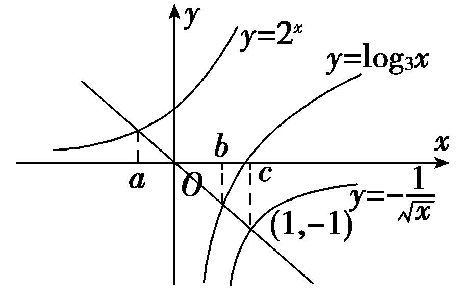  
（4）已知函数*f*(*x*)＝|ln*x*|，若0<*a*<*b*，且*f*(*a*)＝*f*(*b*)，则*a*＋2*b*的取值范围是(　　)

A．(2，＋∞)　　　　　
B．[2，＋∞)　　　　　
C．(3，＋∞)　　　　　
D．[3，＋∞)

<strong>答案</strong>　D　<strong>解析</strong>　先做出<em>f</em>(<em>x</em>)的图像，通过图像可知，如果<em>f</em>(<em>a</em>)＝<em>f</em>(<em>b</em>)，则0&lt;<em>a</em>&lt;1&lt;<em>b</em>，设<em>f</em>(<em>a</em>)＝<em>f</em>(<em>b</em>)＝<em>t</em>&gt;0，即|ln<em>a</em>|＝|ln<em>b</em>|＝<em>t</em>&gt;0，由<em>a</em>，<em>b</em>范围可得，ln<em>a</em>&lt;0，ln<em>b</em>&gt;0，从而<em>a</em>＝e－<em>t</em>，<em>b</em>＝e<em>t</em>，所以<em>a</em>＋2<em>b</em>＝e－<em>t</em>＋2 e<em>t</em>，而e<em>t</em>&gt;0，所以e－<em>t</em>＋2 e<em>t</em>∈(3，＋∞)．

注：此类问题如果*f*(*x*)图像易于作出，可先作图以便于观察函数特点．

本题有两个关键点，一个是引入辅助变量*t*，从而用*t*表示出*a*，*b*达到消元效果，但是要注意*t*是有范围的（通过数形结合*y*＝*t*需与*y*＝*f*(*x*)有两交点）；一个是通过图像判断出*a*，*b*的范围，从而去掉绝对值．  
（5）已知函数<em>f</em>(<em>x</em>)＝若存在<em>x</em>1，<em>x</em>2，当0≤<em>x</em>1&lt;<em>x</em>2&lt;2时，<em>f</em>(<em>x</em>1)＝<em>f</em>(<em>x</em>2)，则<em>x</em>1<em>f</em>(<em>x</em>2)－<em>f</em>(<em>x</em>2)的取值范围为(　　)

A．(0，)　　　
B．[－，)　　　
C．[－，－)　　　
D．[，－)

<strong>答案</strong>　C　<strong>解析</strong>　如图可知≤<em>x</em>1&lt;，≤<em>x</em>2&lt;1，所以<em>x</em>1<em>f</em>(<em>x</em>2)－<em>f</em>(<em>x</em>2)＝(<em>x</em>1－1)<em>f</em>(<em>x</em>2)＝(<em>x</em>1－1)<em>f</em>(<em>x</em>1)＝(<em>x</em>1－1)(<em>x</em>1＋)＝<em>x</em>12－<em>x</em>1－．所以<em>x</em>1<em>f</em>(<em>x</em>2)－<em>f</em>(<em>x</em>2)∈[－，－)．

  
（6）已知函数*f*(*x*)＝若有三个不同的实数*a*，*b*，*ｃ*，使得*f*(*a*)＝*f*(*b*)＝*f*(*c*)，则*a*＋*b*＋*c*的取值范围是\_\_\_\_\_\_\_\_．

<strong>答案</strong>　(2π，2021π)　<strong>解析</strong>　<em>f</em>(<em>x</em>)的图像可作，所以考虑作出<em>f</em>(<em>x</em>)的图像，不妨设<em>a</em>&lt;<em>b</em>&lt;<em>c</em>，由图像可得，<em>f</em>(<em>a</em>)＝<em>f</em>(<em>b</em>)∈(0，1)，<em>a</em>，<em>b</em>∈[0，π]，且关于<em>x</em>＝轴对称，所以有＝，即<em>a</em>＋<em>b</em>＝π，再观察<em>c</em>&gt;π，且<em>f</em>(<em>c</em>)＝log2020＝<em>f</em>(<em>a</em>)∈(0，1)，所以0&lt;log2020&lt;1，即<em>0</em>&lt;<em>c</em>&lt;2020π，从而<em>a</em>＋<em>b</em>＋<em>c</em>＝π＋<em>c</em>∈(2π，2021π)．

注：本题抓住*a*，*b*关于*x*＝对称是关键，从而可由对称求得*a*＋*b*＝π，使得所求式子只需考虑*c*的范围即可．  
（7）已知函数*f*(*x*)＝若*f*(*x*)＝*m*有四个零点*a*，*b*，*c*，*d*，则*abcd*的取值范围是\_\_\_\_\_\_\_\_．

<strong>答案</strong>　(10，12)　<strong>解析</strong>　作出函数<em>f</em>(<em>x</em>)的图象，不妨设<em>a</em>&lt;<em>b</em>&lt;<em>c</em>&lt;<em>d</em>，则－log2<em>a</em>＝log2<em>b</em>，∴<em>ab</em>＝1．又根据二次函数的对称性，可知<em>c</em>＋<em>d</em>＝7，∴<em>cd</em>＝<em>c</em>(7－<em>c</em>)＝7<em>c</em>－<em>c</em>2(2&lt;<em>c</em>&lt;3)，∴10&lt;<em>cd</em>&lt;12，∴<em>abcd</em>的取值范围是(10，12)．

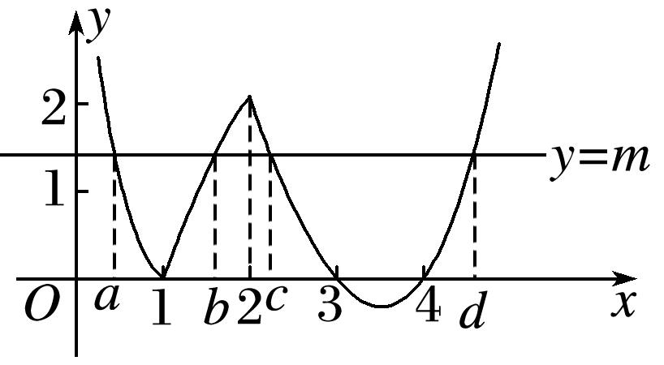  
（8）已知函数<em>f</em>(<em>x</em>)＝若方程<em>f</em>(<em>x</em>)＝<em>m</em>(<em>m</em>∈<strong>R</strong>)有四个不同的实根<em>x</em>1，<em>x</em>2，<em>x</em>3，<em>x</em>4，且满足<em>x</em>1&lt;<em>x</em>2&lt;<em>x</em>3&lt;<em>x</em>4，则的取值范围是(　　)

A．(0，4]　　　　　　
B．(0，3)　　　　　　
C．(3，4]　　　　　　
D．(1，3)
答案　B　解析　如图，作出函数<em>f</em>(<em>x</em>)的图象，显然，<em>A</em>(3，1)，又当0&lt;<em>x</em>≤3时，<em>f</em>(<em>x</em>)≥0，因为方程<em>f</em>(<em>x</em>)＝<em>m</em>有四个不同的实根，所以0&lt;<em>m</em>&lt;1．由<em>f</em>(<em>x</em>1)＝<em>f</em>(<em>x</em>2)可得，|log3<em>x</em>1|＝|log3<em>x</em>2|，又因为0&lt;<em>x</em>1&lt;1&lt;<em>x</em>2，所以log3<em>x</em>1＋log3<em>x</em>2＝0，解得<em>x</em>1<em>x</em>2＝1．因为函数<em>y</em>＝<em>x</em>2－<em>x</em>＋8的图象的对称轴为<em>x</em>＝5，

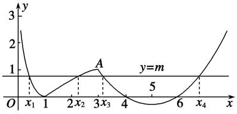
故由<em>f</em>(<em>x</em>3)＝<em>f</em>(<em>x</em>4)可得<em>x</em>3＋<em>x</em>4＝10．故＝(<em>x</em>3－3)(<em>x</em>4－3)＝(<em>x</em>3－3)(7－<em>x</em>3)＝－<em>x</em>＋10<em>x</em>3－21＝－(<em>x</em>3－5)2＋4．记<em>g</em>(<em>t</em>)＝－(<em>t</em>－5)2＋4，由0&lt;<em>m</em>&lt;1，即0&lt;<em>x</em>2－<em>x</em>＋8&lt;1，解得3&lt;<em>x</em>&lt;4或6&lt;<em>x</em>&lt;7．又<em>x</em>3&lt;<em>x</em>4，所以3&lt;<em>x</em>3&lt;4，又<em>g</em>(<em>t</em>)＝－(<em>t</em>－5)2＋4在(3，4)上单调递增，所以当3&lt;<em>t</em>&lt;4时，<em>g</em>（3）&lt;<em>g</em>(<em>t</em>)&lt;<em>g</em>（4），即<em>g</em>(<em>t</em>)∈(0，3)．

【对点训练】

11．若函数<em>f</em>(<em>x</em>)＝|log<em>ax</em>|－2－<em>x</em>(<em>a</em>&gt;0且<em>a</em>≠1)的两个零点是<em>m</em>，<em>n</em>，则(　　)

A．*mn*＝1　　　　　
B．*mn*>1　　　　　
C．0<*mn*<1　　　　　
D．以上都不对

11．答案　C　解析　由题设可得|log<em>ax</em>|＝<em>x</em>，不妨设<em>a</em>&gt;1，<em>m</em>&lt;<em>n</em>，画出函数<em>y</em>＝|log<em>ax</em>|，<em>y</em>＝<em>x</em>的图象如

图所示，结合图象可知0&lt;<em>m</em>&lt;1，<em>n</em>&gt;1，且－log<em>am</em>＝<em>m</em>，log<em>an</em>＝<em>n</em>，以上两式两边相减可得log<em>a</em>(<em>mn</em>)＝<em>n</em>－<em>m</em>&lt;0，所以0&lt;<em>mn</em>&lt;1，故选C．

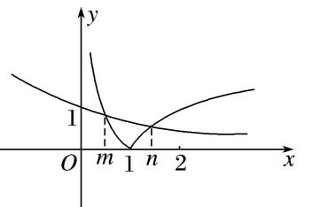

12．已知函数<em>f</em>(<em>x</em>)＝|log3(<em>x</em>－1)|－()<em>x</em>－1有两个不同的零点<em>x</em>1，<em>x</em>2，则(　　)

A．<em>x</em>1<em>x</em>2&lt;1　　　　
B．<em>x</em>1<em>x</em>2＝<em>x</em>1＋<em>x</em>2　　　　
C．<em>x</em>1<em>x</em>2&gt;<em>x</em>1＋<em>x</em>2　　　　
D．<em>x</em>1<em>x</em>2&lt;<em>x</em>1＋<em>x</em>2

12．答案　D　解析　可将零点化为方程|log3(<em>x</em>－1)|＝()<em>x</em>＋1的根，进而转化为<em>g</em>(<em>x</em>)＝|log3(<em>x</em>－1)|与<em>h</em>(<em>x</em>)＝

()<em>x</em>＋1的交点，作出图像可得1&lt;<em>x</em>1&lt;2&lt;<em>x</em>2，进而可将|log3(<em>x</em>－1)|＝()<em>x</em>＋1中的绝对值去掉得，－log3(<em>x</em>1－1)＝()<em>x</em>1＋1，－log3(<em>x</em>2－1)＝()<em>x</em>2＋1，观察选项涉及<em>x</em>1<em>x</em>2，<em>x</em>1＋<em>x</em>2，故将②①可得log3[(<em>x</em>1－1) (<em>x</em>2－1)]＝()<em>x</em>1－()<em>x</em>2，而<em>y</em>＝()<em>x</em>为减函数，且<em>x</em>2&gt; <em>x</em>1，从而log3[(<em>x</em>1－1) (<em>x</em>2－1)]&lt;0，(<em>x</em>1－1) (<em>x</em>2－1)&lt;1，<em>x</em>1<em>x</em>2&lt;<em>x</em>1＋<em>x</em>2．

13．已知e是自然对数的底数，函数<em>f</em>(<em>x</em>)＝e<em>x</em>＋<em>x</em>－2的零点为<em>a</em>，函数<em>g</em>(<em>x</em>)＝ln <em>x</em>＋<em>x</em>－2的零点为<em>b</em>，则下

列不等式成立的是(　　)

A．*f*(*a*)＜*f*（1）＜*f*(*b*)　　　
B．*f*(*a*)＜*f*(*b*)＜*f*（1）　　　
C．*f*（1）＜*f*(*a*)＜*f*(*b*)　　　
D．*f*(*b*)＜*f*（1）＜*f*(*a*)

13．答案　A　解析　函数*f*(*x*)，*g*(*x*)均为定义域上的单调递增函数，且*f*（0）＝－1＜0，*f*（1）＝e－1＞0，*g*（1）

＝－1＜0，*g*(e)＝e－1＞0，所以*a*∈(0，1)，*b*∈(1，e)，即*a*＜1＜*b*，所以*f*(*a*)＜*f*（1）＜*f*(*b*)．

14．已知函数<em>f</em>(<em>x</em>)＝2<em>x</em>＋<em>x</em>，<em>g</em>(<em>x</em>)＝<em>x</em>－log<em>x</em>，<em>h</em>(<em>x</em>)＝log2<em>x</em>－的零点分别为<em>x</em>1，<em>x</em>2，<em>x</em>3，则<em>x</em>1，<em>x</em>2，<em>x</em>3的大

小关系是(　　)

A．<em>x</em>1＞<em>x</em>2＞<em>x</em>3　　　　　
B．<em>x</em>2＞<em>x</em>1＞<em>x</em>3　　　　　
C．<em>x</em>1＞<em>x</em>3＞<em>x</em>2　　　　　
D．<em>x</em>3＞<em>x</em>2＞<em>x</em>1

14．答案　D　解析　由<em>f</em>(<em>x</em>)＝2<em>x</em>＋<em>x</em>＝0，<em>g</em>(<em>x</em>)＝<em>x</em>－log<em>x</em>＝0，<em>h</em>(<em>x</em>)＝log2<em>x</em>－＝0得2<em>x</em>＝－<em>x</em>，<em>x</em>＝log<em>x</em>，

log2<em>x</em>＝．在坐标系中分别作出<em>y</em>＝2<em>x</em>，<em>y</em>＝－<em>x</em>；<em>y</em>＝<em>x</em>，<em>y</em>＝log<em>x</em>；<em>y</em>＝log2<em>x</em>，<em>y</em>＝的图象，由图象可知－1＜<em>x</em>1＜0，0＜<em>x</em>2＜1，<em>x</em>3＞1，所以<em>x</em>3＞<em>x</em>2＞<em>x</em>1．

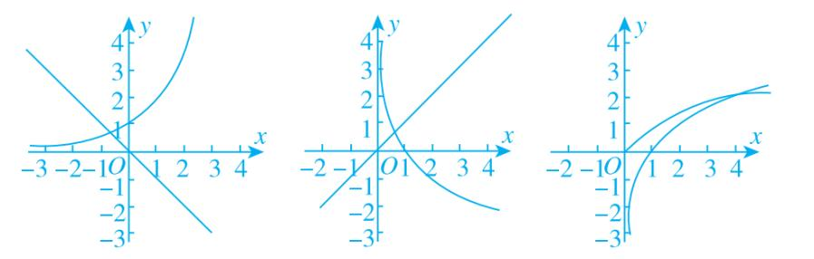

15．已知*f*(*x*)＝|ln(*x*＋1)|，若*f*(*a*)＝*f*(*b*)(*a*<*b*)，则(　　)

A．*a*＋*b*>0　　　　　
B．*a*＋*b*>1　　　　　
C．2*a*＋*b*>0　　　　　
D．2*a*＋*b*>1

15．答案　A　解析　作出函数*f*(*x*)＝|ln(*x*＋1)|的图象如图所示，由*f*(*a*)＝*f*(*b*)(*a*<*b*)，得－ln(*a*＋1)＝ln(*b*＋

1)，即*ab*＋*a*＋*b*＝0，所以0＝*ab*＋*a*＋*b*<＋*a*＋*b*，即(*a*＋*b*)(*a*＋*b*＋4)>0，又易知－1<*a*<0，*b*>0.所以*a*＋*b*＋4>0，所以*a*＋*b*>0．故选A．

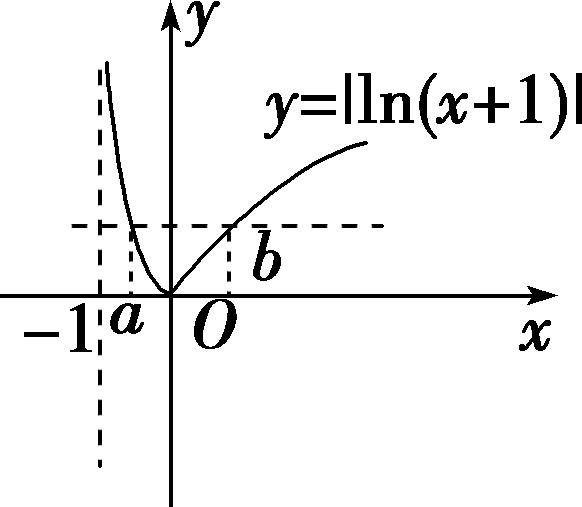

16．已知函数<em>f</em>(<em>x</em>)＝(<em>a</em>&gt;0，<em>a</em>≠1)，若<em>x</em>1≠<em>x</em>2，且<em>f</em>(<em>x</em>1)＝<em>f</em>(<em>x</em>2)，则<em>x</em>1＋<em>x</em>2的值(　　)

A．恒小于2　　　　　
B．恒大于2　　　　　
C．恒等于2　　　　　
D．与*a*相关

16．分析　观察到当－1<*x*<1时，*f*(*x*)为单调函数，且1<*x*<3时，*f*(*x*)的图像相当于作－1<*x*<1时关于*x*＝1

对称的图像再进行上下平移，所以也为单调函数．由此可得<em>f</em>(<em>x</em>1)＝<em>f</em>(<em>x</em>2)时，<em>x</em>1，<em>x</em>2必在两段上．设<em>x</em>1&lt;<em>x</em>2，可得－1&lt;<em>x</em>1&lt;1&lt;<em>x</em>2&lt;3，考虑使用代换法设<em>f</em>(<em>x</em>1)＝<em>f</em>(<em>x</em>2)＝<em>t</em>，从而将<em>x</em>1，<em>x</em>2均用<em>a</em>，<em>t</em>表示，再判断<em>x</em>1＋<em>x</em>2与2的大小即可．
答案　B　解析　设<em>f</em>(<em>x</em>1)＝<em>f</em>(<em>x</em>2)＝<em>t</em>，不妨设－1&lt;<em>x</em>1&lt;1&lt;<em>x</em>2&lt;3，则－1&lt;2－<em>x</em>2&lt;1，所以log<em>a</em>(<em>x</em>1＋1)＝<em>t</em>，<em>x</em>1＝<em>at</em>－1，log<em>a</em>(3－<em>x</em>2)＋<em>a</em>－1＝<em>t</em>，<em>x</em>2＝3－<em>at</em>＋1－<em>a</em>，所以<em>x</em>1＋<em>x</em>2＝2＋<em>at</em>－<em>at</em>＋1－<em>a</em>，若0&lt;<em>a</em>&lt;1，则<em>y</em>＝<em>ax</em>为减函数，且<em>t</em>&lt;<em>t</em>＋1－<em>a</em>，<em>at</em>&gt; <em>at</em>＋1－<em>a</em>，所以<em>x</em>1＋<em>x</em>2＞2．若<em>a</em>＞1，则<em>y</em>＝<em>ax</em>为增函数，且<em>t</em>＞<em>t</em>＋1－<em>a</em>，<em>at</em>&gt; <em>at</em>＋1－<em>a</em>，所以<em>x</em>1＋<em>x</em>2＞2．所以<em>x</em>1＋<em>x</em>2的值恒大于2．

17．已知函数*f*(*x*)＝设*a*，*b*，*c*是三个不相等的实数，且满足*f*(*a*)＝*f*(*b*)＝*f*(*c*)，则*abc*

的取值范围为\_\_\_\_\_\_\_\_．

17．答案　(16，36)　解析　作出*f*(*x*)的图象如图，

当<em>x</em>&gt;4时，由<em>f</em>(<em>x</em>)＝3－＝0，得＝3，得<em>x</em>＝9，若<em>a</em>，<em>b</em>，<em>c</em>互不相等，不妨设<em>a</em>&lt;<em>b</em>&lt;<em>c</em>，因为<em>f</em>(<em>a</em>)＝<em>f</em>(<em>b</em>)＝<em>f</em>(<em>c</em>)，所以由图象可知0&lt;<em>a</em>&lt;2&lt;<em>b</em>&lt;4&lt;<em>c</em>&lt;9，由<em>f</em>(<em>a</em>)＝<em>f</em>(<em>b</em>)，得1－log2<em>a</em>＝log2<em>b</em>－1，即log2<em>a</em>＋log2<em>b</em>＝2，即log2(<em>ab</em>)＝2，则<em>ab</em>＝4，所以<em>abc</em>＝4<em>c</em>，因为4&lt;<em>c</em>&lt;9，所以16&lt;4<em>c</em>&lt;36，即16&lt;<em>abc</em>&lt;36，所以<em>abc</em>的取值范围是(16，36)．

18．已知函数<em>f</em>(<em>x</em>)＝若存在实数<em>x</em>1，<em>x</em>2，<em>x</em>3，<em>x</em>4，满足<em>x</em>1&lt;<em>x</em>2&lt;<em>x</em>3&lt;<em>x</em>4，且<em>f</em>(<em>x</em>1)＝<em>f</em>(<em>x</em>2)＝

<em>f</em>(<em>x</em>3)＝<em>f</em>(<em>x</em>4)，则的取值范围是(　　)

A．(4，16)　　　　　　
B．(0，12)　　　　　　
C．(9，21)　　　　　　
D．(15，25)

18．<strong>答案</strong>　B　<strong>解析</strong>　不妨设<em>f</em>(<em>x</em>1)＝<em>f</em>(<em>x</em>2)＝<em>f</em>(<em>x</em>3)＝<em>f</em>(<em>x</em>4)＝<em>a</em>，作出<em>f</em>(<em>x</em>)的图像，<em>y</em>＝<em>a</em>与<em>y</em>＝<em>f</em>(<em>x</em>)有四个不同交点，
则<em>a</em>∈(0，1)，且<em>x</em>1&lt;1&lt;<em>x</em>2．<em>x</em>3，<em>x</em>4关于<em>x</em>＝6对称．所以有－log2<em>x</em>1＝log2<em>x</em>2，即<em>x</em>1<em>x</em>2＝1且<em>x</em>3＋<em>x</em>4＝12即＝<em>x</em>3<em>x</em>4－20，因为<em>x</em>3＋<em>x</em>4＝12，所以<em>x</em>3＝12－<em>x</em>4，所以＝<em>x</em>4(12－<em>x</em>4)－20，<em>x</em>4∈(8，10)，所以的范围为(0，12)．

19．设<em>x</em>1，<em>x</em>2分别是函数<em>f</em>(<em>x</em>)＝<em>x</em>－<em>a</em>－<em>x</em>和<em>g</em>(<em>x</em>)＝<em>x</em>log<em>ax</em>－1的零点(其中<em>a</em>&gt;1)，则<em>x</em>1＋4<em>x</em>2的取值范围是\_\_\_\_\_．

19．<strong>答案</strong>　(5，＋∞)　<strong>解析</strong>　<em>f</em>(<em>x</em>)＝<em>x</em>－<em>a</em>－<em>x</em>的零点<em>x</em>1是方程<em>x</em>＝<em>a</em>－<em>x</em>，即＝<em>ax</em>的解，<em>g</em>(<em>x</em>)＝<em>x</em>log<em>ax</em>－1的零点

<em>x</em>2是方程<em>x</em>log<em>ax</em>－1＝0，即＝log<em>ax</em>的解，即<em>x</em>1，<em>x</em>2是<em>y</em>＝<em>ax</em>与<em>y</em>＝log<em>ax</em>与<em>y</em>＝交点<em>A</em>，<em>B</em>的横坐标，可得0&lt;<em>x</em>1&lt;1，<em>x</em>2&gt;1，∵<em>y</em>＝<em>ax</em>的图象与<em>y</em>＝log<em>ax</em>关于<em>y</em>＝<em>x</em>对称，<em>y</em>＝的图象也关于<em>y</em>＝<em>x</em>对称，∴<em>A</em>，<em>B</em>关于<em>y</em>＝<em>x</em>对称，设<em>A</em>，<em>B</em>，∴<em>A</em>关于<em>y</em>＝<em>x</em>的对称点<em>A</em>′与<em>B</em>重合，＝<em>x</em>1，即<em>x</em>2<em>x</em>1＝1，<em>x</em>1＋4<em>x</em>2＝<em>x</em>1＋<em>x</em>2＋3<em>x</em>2&gt;2＋3<em>x</em>2&gt;2＋3＝5，<em>x</em>1＋4<em>x</em>2的取值范围是(5，＋∞)．

20．已知<em>f</em>(<em>x</em>)＝若方程<em>f</em>(<em>x</em>)＝<em>a</em>有四个不同的解<em>x</em>1&lt;<em>x</em>2&lt;<em>x</em>3&lt;<em>x</em>4，则<em>x</em>1＋<em>x</em>2＋＋的取值范围

是(　　)

A．[0，)　　　　　　
B．(0，]　　　　　　
C．[0，]　　　　　　
D．[0，1)

20．答案　B　解析　作出<em>f</em>(<em>x</em>)的图像可知若<em>f</em>(<em>x</em>)＝<em>a</em>有四个不同的解，则<em>a</em>∈(0，1]，且在这四个根中，<em>x</em>1，

<em>x</em>2，关于直线<em>x</em>＝－1对称，所以<em>x</em>1＋<em>x</em>2＝－2，<em>x</em>3&lt;1&lt;<em>x</em>4，所以<em>a</em>＝－log2<em>x</em>3＝log2<em>x</em>4，即<em>x</em>3＝()<em>a</em>，<em>x</em>4＝2<em>a</em>，所以<em>g</em>(<em>a</em>)＝<em>x</em>1＋<em>x</em>2＋＋＝－2＋2<em>a</em>＋()<em>a</em>，由<em>a</em>∈(0，1]，可得<em>g</em>(<em>a</em>)的范围是(0，]．

