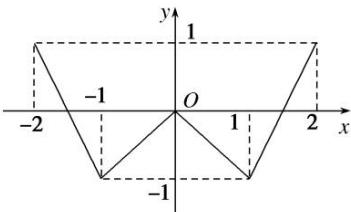
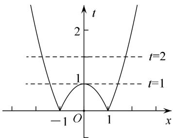
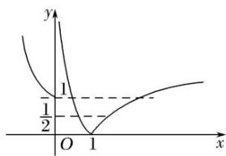
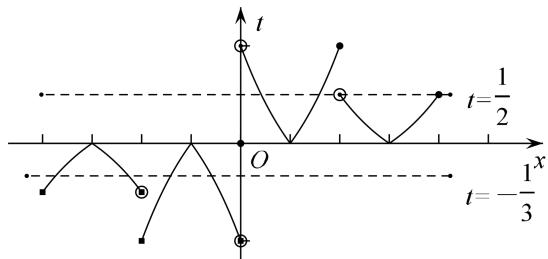
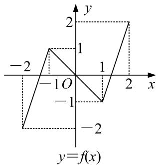
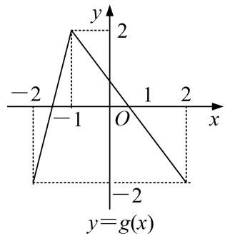
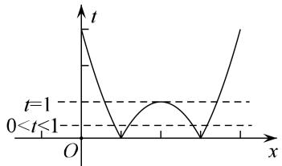
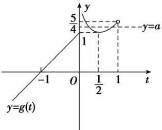

# 专题十八 函数的零点问题（5）

# 考点一 确定复合函数零点的个数或方程解的个数

# 【方法总结】

确定复合函数零点的个数或方程解的个数问题: 关于复合函数 $y=f(g(x))$ 的零点的个数或方程解的个数问题, 先换元解套, 令 $t=g(x)$ , 则 $y=f(t)$ , 再作出 $y=f(t)$ 与 $t=g(x)$ 的图像. 由 $y=f(t)$ 的图象观察有几个 t 的值满足条件, 结合 t 的值观察 $t=g(x)$ 的图象, 求出每一个 t 被几个 x 对应, 将 x 的个数汇总后即为 $y=f(g(x))$ 的根的个数, 即 “从外到内”. 此法称为双图象法(换元法十数形结合).

# 【例题选讲】

[例 1] （1） 奇函数 $f(x)$ ，偶函数 $g(x)$ 的图象分别如图（1），（2） 所示，函数 $f(g(x))$ ， $g(f(x))$ 的零点个数分别为 m，n，则 $m + n = (\quad)$

图（1）

图（2）

A. 3

B. 7

C. 10

D. 14  
（2）关于 x 的方程 $(x^{2}-1)^{2}-3|x^{2}-1|+2=0$ 的不相同实根的个数是()

A. 3

B. 4

C. 5

D. 8

  
（3）已知 $f(x)=\left\{\begin{aligned}&\lg x|,\quad x>0,\\ &2^{|x|},\quad x\leq0,\end{aligned}\right.$ 则函数 $y=2[f(x)]^{2}-3f(x)+1$ 的零点个数是\_\_\_\_.

个.

  
（4）已知定义在 $\mathbf{R}$ 上的奇函数，当 $x > 0$ 时， $f(x) = \begin{cases} 2^{|x^{-1}|} - 1, & 0 < x \leq 2, \\ \frac{1}{2} f(x - 2), & x > 2, \end{cases}$ 则关于 $x$ 的方程 $6f^2(x) - f(x) - 1 = 0$ 的实数根个数为（）

A. 6

B. 7

C. 8

D. 9

# 【对点训练】

1. 已知函数 $y = f(x)$ 和 $y = g(x)$ 在 $[-2, 2]$ 的图像如下，给出下列四个命题：  
（1）方程 $f[g(x)] = 0$ 有且只有6个根；（2）方程 $g[f(x)] = 0$ 有且只有3个根；  
（3）方程 $f[f(x)]=0$ 有且只有 5 个根；（4）方程 $g[g(x)]=0$ 有且只有 4 个根.

则正确命题的个数是( )

A. 1

B. 2

C. 3

D. 4

2. 已知 $f(x) = \begin{cases} x^3 & x \geq 0 \\ |\lg (-x)| & x < 0 \end{cases}$ 则函数 $y = 2f^2(x) - 3f(x)$ 的零点个数为 \_\_\_\_.

3. 设定义域为 R 的函数 $f(x)=\left\{\begin{aligned}\frac{1}{|x-1|},&x\neq1,\\ 1,&x=1,\end{aligned}\right.$ 若关于 x 的方程 $f^{2}(x)+bf(x)+c=0$ 有 3 个不同的解 $x_{1},x_{2},x_{3}$ ，则 $x_{1}^{2}+x_{2}^{2}+x_{3}^{2}=$ \_\_\_\_.

4. 已知函数 $f(x)=\left\{\begin{aligned}x+1,&x\leq0,\\ \log_{2}x,&x>0,\end{aligned}\right.$ 则函数 $y=f(f(x))+1$ 的零点个数是()

A. 4

B. 3

C. 2

D. 1

5. 已知函数 $f(x) = \begin{cases} ax + 1, & x \leq 0, \\ \log_2 x, & x > 0, \end{cases}$ ，则下列关于函数 $y = f(f(x)) + 1$ 的零点个数判断正确的是（）

A. 当 a>0 时，有 4 个零点；当 a<0 时，有 1 个零点

B. 当 a>0 时，有 3 个零点；当 a<0 时，有 2 个零点

C. 无论 $a$ 为何值，均有2个零点

D. 无论 $a$ 为何值，均有4个零点

6. 已知 $[x]$ 表示不超过 $x$ 的最大整数，当 $x \in \mathbf{R}$ 时，称 $y = [x]$ 为取整函数，例如 $[1.6] = 1$ ， $[-3.3] = -4$ ，若 $f(x) = [x]$ ， $g(x)$ 的图象关于 $y$ 轴对称，且当 $x \leq 0$ 时， $g(x) = -x^2 - 2x$ ，则方程 $f(f(x)) = g(x)$ 解的个数为（）

A. 1

B. 2

C. 3

D. 4

# 考点二 已知函数零点的个数，求参数的取值范围

# 【方法总结】

已知复合函数零点的个数，求参数的取值范围的问题：关于已知复合函数 $y = f(g(x))$ 零点的个数，求参数的取值范围的问题，先换元解套，令 $t = g(x)$ ，则 $y = f(t)$ ，再作出 $y = f(t)$ 与 $t = g(x)$ 的图像。由零点个数结合 $t = g(x)$ 与 $y = f(t)$ 的图象特点，从而确定 $t$ 的取值范围，进而决定参数的范围。即“从内到外”。此法称为双图象法(换元法十数形结合)。

# 【例题选讲】

[例 2]（1）已知函数 $f(x)=|x^{2}-4x+3|$ ，若方程 $[f(x)]^{2}+bf(x)+c=0$ 恰有七个不相同的实根，则实数 b 的取值范围是()

A. $(-2,0)$

B. $(-2,-1)$

C. $(0, 1)$

D. $(0, 2)$

  
（2）已知函数 $f(x) = \begin{cases} a \cdot 2^x, & x \leq 0, \\ \log_{\frac{1}{2}} x, & x > 0. \end{cases}$ . 若关于 $x$ 的方程 $f(f(x)) = 0$ 有且仅有一个实数解，则实数 $a$ 的取值范围是 \_\_\_\_.  
（3）已知函数 $f(x)=-x^{2}-2x,\quad g(x)=\left\{\begin{aligned}&x+\frac{1}{4x},&x>0,\\&x+1,&x\leq0.\end{aligned}\right.$ 若方程 $g(f(x))-a=0$ 有 4 个不同的实数根，则实数 a 的取值范围是 \_\_\_\_.

# 【对点训练】

7. 已知函数 $f(x) = \begin{cases} |\lg x|, & x > 0, \\ 2^{|x|}, & x \leq 0, \end{cases}$ 若关于 $x$ 的方程 $f^2 (x) - af(x) + 1 = 0$ 有且只有3个不同的根，则实数 $a$ 的值为（）

A. -2

B. 1

C. 2

D. 3

8. 已知函数 $f(x) = |x + \frac{1}{x}| - |x - \frac{1}{x}|$ ，关于 $x$ 的方程 $f^2 (x) + a|f(x)| + b = 0 (a, b \in \mathbf{R})$ 恰有6个不同实数解，则 $a$ 的取值范围是 \_\_\_\_.

9. 已知函数 $f(x) = \begin{cases} kx + 3, & x \geq 0, \\ \left(\frac{1}{2}\right)x, & x < 0, \end{cases}$ 若方程 $f(f(x)) - 2 = 0$ 恰有三个实数根，则实数 $k$ 的取值范围是（）

A. $[0, +\infty)$

B. $[1, 3]$

C. $\left(-1,-\frac{1}{3}\right]$

D. $\left[-1,-\frac{1}{3}\right]$

10. 已知函数 $f(x) = \begin{cases} 3^{|x - 1|}, & x > 0, \\ -x^2 - 2x + 1, & x \leq 0, \end{cases}$ 若关于 $x$ 的方程 $[f(x)]^2 + (a - 1)f(x) - a = 0$ 有7个不等的实数根，则实数 $a$ 的取值范围是（）

A. $[1, 2]$

B. $(1, 2)$

C. $(-2,-1)$

D. $[-2, -1]$

