# 专题十八 函数的零点问题(5)

# 考点一 确定复合函数零点的个数或方程解的个数

# 【方法总结】

确定复合函数零点的个数或方程解的个数问题: 关于复合函数 $y=f(g(x))$ 的零点的个数或方程解的个数问题, 先换元解套, 令 $t=g(x)$ , 则 $y=f(t)$ , 再作出 $y=f(t)$ 与 $t=g(x)$ 的图像. 由 $y=f(t)$ 的图象观察有几个 t 的值满足条件, 结合 t 的值观察 $t=g(x)$ 的图象, 求出每一个 t 被几个 x 对应, 将 x 的个数汇总后即为 $y=f(g(x))$ 的根的个数, 即 “从外到内”. 此法称为双图象法(换元法十数形结合).

# 【例题选讲】

[例 1] (1) 奇函数 $f(x)$ ，偶函数 $g(x)$ 的图象分别如图(1)，(2) 所示，函数 $f(g(x))$ ， $g(f(x))$ 的零点个数分别为 m，n，则 $m + n = (\quad)$

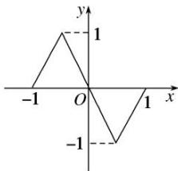

line

| x | y |
|---|---|
| -1 | 0 |
| 0 | 1 |
| 1 | 0 |
| -1 | -1 |

图(1)

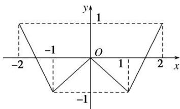

text_image

y
1
-1 O 1 2 x
-2 -1 -1

图(2)

A. 3

B. 7

C. 10

D. 14

答案 C 解析 由题中函数图象知 $f(\pm 1) = 0$ , $f(0) = 0$ , $g\left(\frac{\pm 3}{2}\right) = 0$ , $g(0) = 0$ , $g(\pm 2) = 1$ , $g(\pm 1) = -1$ , 所以 $f(g(\pm 2)) = f(1) = 0$ , $f(g(\pm 1)) = f(-1) = 0$ , $f\left(g\left(\frac{\pm 3}{2}\right)\right) = f(0) = 0$ , $f(g(0)) = f(0) = 0$ , 所以 $f(g(x))$ 有 7 个零点, 即 $m = 7$ . 又 $g(f(0)) = g(0) = 0$ , $g(f(\pm 1)) = g(0) = 0$ , 所以 $g(f(x))$ 有 3 个零点, 即 $n = 3$ . 所以 $m + n = 10$ , 选择 C.

(2)关于 x 的方程 $(x^{2}-1)^{2}-3|x^{2}-1|+2=0$ 的不相同实根的个数是()

A. 3

B. 4

C. 5

D. 8

答案 C 解析 可将 $|x^{2}-1|$ 视为一个整体，即 $t=|x^{2}-1|$ ，则方程变为 $t^{2}-3t+2=0$ 可解得，t=1 或 t=2，则只需作出 $t(x)=|x^{2}-1|$ 的图像，然后统计与 t=1 与 t=2 的交点总数即可，共有 5 个.

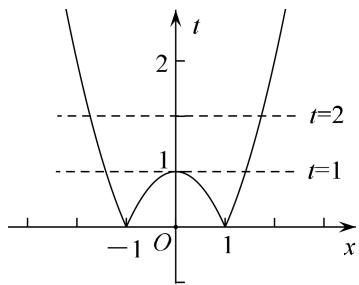

line

| x | t |
|---|---|
| -1 | 0 |
| 0 | 1 |
| 1 | 0 |
| 2 | 2 |

(3)已知 $f(x)=\left\{\begin{aligned}&|\lg x|,&x>0,\\ &2^{|x|},&x\leq0,\end{aligned}\right.$ 则函数 $y=2[f(x)]^{2}-3f(x)+1$ 的零点个数是\_\_\_\_.

答案 5 解析 由 $2[f(x)]^{2}-3f(x)+1=0$ 得 $f(x)=\frac{1}{2}$ 或 $f(x)=1$ ，作出函数 $y=f(x)$ 的图象。由图象知 $y=\frac{1}{2}$ 与 $y=f(x)$ 的图象有 2 个交点，y=1 与 $y=f(x)$ 的图象有 3 个交点。因此函数 $y=2[f(x)]^{2}-3f(x)+1$ 的零点有 5 个。

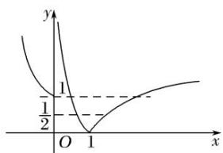

text_image

y
1
½
O 1 x

(4)已知定义在 $\mathbf{R}$ 上的奇函数，当 $x > 0$ 时， $f(x) = \begin{cases} 2^{|x^{-1}|} - 1, & 0 < x \leq 2, \\ \frac{1}{2} f(x - 2), & x > 2, \end{cases}$ 则关于 $x$ 的方程 $6f^2(x) - f(x) - 1 = 0$ 的实数根个数为（）

A. 6

B. 7

C. 8

D. 9

答案 B 解析 已知方程 $6f^{2}(x) - f(x) - 1 = 0$ 可解，得 $f_{1}(x) = \frac{1}{2}, f_{2}(x) = -\frac{1}{3}$ ，只需统计 $y = \frac{1}{2}, y = -\frac{1}{3}$ 与 $y = f(x)$ 的交点个数即可。由奇函数可先做出 $x > 0$ 的图像， $x > 2$ 时， $f(x) = \frac{1}{2} f(x - 2)$ ，则 $x \in (2, 4]$ 的图像只需将 $x \in (0, 2]$ 的图像纵坐标缩为一半即可。正半轴图像完成后可再利用奇函数的性质作出负半轴图像。通过数形结合可得共有7个交点。

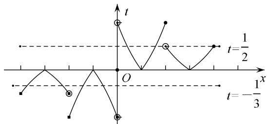

text_image

t
t=1/2
O
t=-1/3

在作图的过程中，注意确定分段函数的边界点属于哪一段区间.

# 【对点训练】

1. 已知函数 $y = f(x)$ 和 $y = g(x)$ 在 $[-2, 2]$ 的图像如下，给出下列四个命题：

(1)方程 $f[g(x)]=0$ 有且只有 6 个根；(2)方程 $g[f(x)]=0$ 有且只有 3 个根；  
(3)方程 $f[f(x)]=0$ 有且只有 5 个根；(4)方程 $g[g(x)]=0$ 有且只有 4 个根.

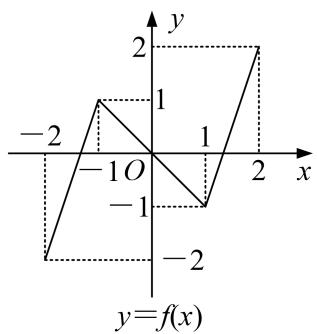

line

| x   | y   |
| --- | --- |
| -2  | -2  |
| -1  | 1   |
| 0   | 1   |
| 1   | -1  |
| 2   | 2   |

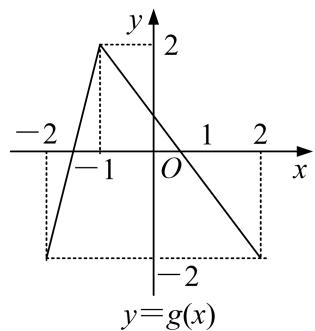

text_image

y
2
-2
-1 O 1 2 x
-2
y=g(x)

则正确命题的个数是( )

A. 1

B. 2

C. 3

D. 4

1. 答案 C 解析 每个方程都可通过图像先拆掉第一层，找到内层函数能取得的值，从而统计出 $x$ 的总数。(1)中可得 $g_{1}(x) \in (-2, -1)$ ， $g_{2}(x) = 0$ ， $g_{3}(x) \in (1, 2)$ ，进而 $g_{1}(x)$ 有 2 个对应的 $x$ ， $g_{2}(x)$ 有 2 个， $g_{3}(x)$ 有 2 个，总计 6 个，(1)正确；(2)中可得 $f_{1}(x) \in (-2, -1)$ ， $f_{2}(x) \in (0, 1)$ ，进而 $f_{1}(x)$ 有 1 个对应的 $x$ ， $f_{2}(x)$ 有 3 个，总计 4 个，(2)错误；(3)中可得 $f_{1}(x) \in (-2, -1)$ ， $f_{2}(x) = 0$ ， $f_{3}(x) \in (1, 2)$ ，进而 $f_{1}(x)$ 有 1 个对应的 $x$ ， $f_{2}(x)$ 有 3 个， $f_{3}(x)$ 有 1 个，总计 5 个，(3)正确；(4)中可得 $g_{1}(x) \in (-2, -1)$ ， $g_{2}(x) \in (0, 1)$ ，进而 $g_{1}(x)$ 有2个对应的 $x$ ， $g_{2}(x)$ 有2个，共计4个，(4)正确．则综上所述，正确的命题共有3个.

2. 已知 $f(x) = \begin{cases} x^3 & x \geq 0 \\ |\lg (-x)| & x < 0 \end{cases}$ 则函数 $y = 2f^2 (x) - 3f(x)$ 的零点个数为 \_\_\_\_.

2. 答案 5 解析 令 $y = 2f^2(x) - 3f(x) = 0$ ，则 $f(x) = 0$ 或 $f(x) = \frac{3}{2}$ . 函数 $f(x) = \begin{cases} x^3 & x \geq 0 \\ |\lg(-x)| & x < 0 \end{cases}$ 的图象如图所示：由图可得， $f(x) = 0$ 有 2 个根， $f(x) = \frac{3}{2}$ 有 3 个根，故函数 $y = 2f^2(x) - 3f(x)$ 的零点个数为 5.

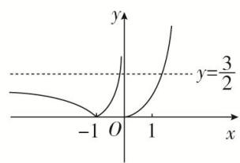

line

| x | y |
|---|---|
| -1 | 0 |
| 0 | 0 |
| 1 | 3/2 |

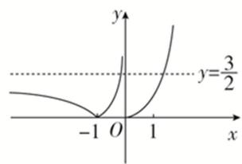

line

| x | y |
|---|---|
| -1 | 0 |
| 0 | 0 |
| 1 | 3/2 |

3. 设定义域为 $\mathbf{R}$ 的函数 $f(x) = \begin{cases} \frac{1}{|x - 1|}, & x \neq 1, \\ 1, & x = 1, \end{cases}$ 若关于 $x$ 的方程 $f^2(x) + bf(x) + c = 0$ 有3个不同的解 $x_1, x_2, x_3$ ，则 $x_1^2 + x_2^2 + x_3^2 =$ \_\_\_\_.

3. 答案 5 解析 先作出 $f(x)$ 的图像如图，观察可发现对于任意的 $t$ ，满足 $t = f(x)$ 的 $x$ 的个数分别为 2 个 ( $t > 0, t \neq 1$ ) 和 3 个 ( $t = 1$ )，已知有 3 个解，从而可得 $f(x) = 1$ 必为 $f^2(x) + bf(x) + c = 0$ 的根，而另一根为 1 或者是负数。所以 $f(x_i) = 1$ ，可解得， $x_1 = 0, x_2 = 1, x_3 = 2$ 。所以 $x_1^2 + x_2^2 + x_3^2 = 5$ 。

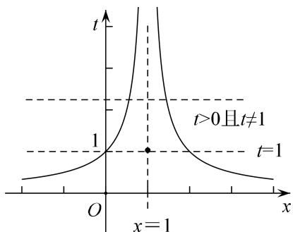

text_image

t
t>0且t≠1
1
t=1
O
x=1
x

4. 已知函数 $f(x) = \begin{cases} x + 1, & x \leq 0, \\ \log_2 x, & x > 0, \end{cases}$ 则函数 $y = f(f(x)) + 1$ 的零点个数是（）

A. 4

B. 3

C. 2

D. 1

4. 答案 A 解析 由 $f(f(x)) + 1 = 0$ ，得 $f(f(x)) = -1$ ，由 $f(-2) = f\left(\frac{1}{2}\right) = -1$ ，得 $f(x) = -2$ 或 $f(x) = \frac{1}{2}$ . 若 $f(x) = -2$ ，则 $x = -3$ 或 $x = \frac{1}{4}$ ; 若 $f(x) = \frac{1}{2}$ ，则 $x = -\frac{1}{2}$ 或 $x = \sqrt{2}$ . 综上可得函数 $y = f(f(x)) + 1$ 的零点个数是 4. 故选 A.

5. 已知函数 $f(x) = \begin{cases} ax + 1, & x \leq 0, \\ \log_2 x, & x > 0, \end{cases}$ ，则下列关于函数 $y = f(f(x)) + 1$ 的零点个数判断正确的是（）

A. 当 a>0 时，有 4 个零点；当 a<0 时，有 1 个零点

B. 当 a>0 时，有 3 个零点；当 a<0 时，有 2 个零点

C. 无论 $a$ 为何值，均有2个零点

D. 无论 a 为何值，均有 4 个零点

5. 答案 A 解析 所求函数的零点，即方程 $f(f(x)) = -1$ 的解的个数，令 $t = f(x)$ ，先作出 $y = f(t)$ 的图像，直线 $y = ax + 1$ 为过定点 $(0, 1)$ 的一条直线，但需要对 a 的符号进行分类讨论。当 a > 0 时，如图 1 所示，先拆外层可得 $t_{1} = \frac{2}{a} < 0$ ， $t_{2} = \frac{1}{2}$ ，如图 2 所示，而 $t_{1}$ 有两个对应的 x， $t_{2}$ 也有两个对应的 x，共计 4 个；当 a < 0 时，如图 3 所示，先拆外层可得 $t = \frac{1}{2}$ ，如图 4 所示， $t = \frac{1}{2}$ 只有一个满足的 x，所以共 1 个零点。结合选项，可判断出 A 正确。

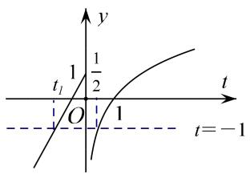

line

| t     | y     |
|-------|-------|
| 0     | 0     |
| 1/2   | 1/2   |
| 1     | 1     |
| -1    | -1    |

图1(a>0)

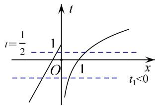

text_image

t
t=1/2 1
O 1 x
t₁<0

图2(a>0)

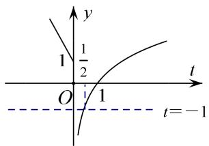

text_image

y
1/2
O
1
t
t=-1

图3(a<0)

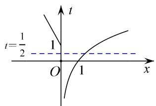

text_image

t=\frac{1}{2} 1
O 1 x

图4(a<0)

6. 已知 $[x]$ 表示不超过 $x$ 的最大整数，当 $x \in \mathbf{R}$ 时，称 $y = [x]$ 为取整函数，例如 $[1.6] = 1$ ， $[-3.3] = -4$ ，若 $f(x) = [x]$ ， $g(x)$ 的图象关于 $y$ 轴对称，且当 $x \leq 0$ 时， $g(x) = -x^2 - 2x$ ，则方程 $f(f(x)) = g(x)$ 解的个数为（）

A. 1

B. 2

C. 3

D. 4

6. 答案 D 解析 根据已知条件可知，当 $x > 0$ 时， $-x < 0$ ，又函数 $g(x)$ 的图象关于 $y$ 轴对称，故 $g(x)$ 为偶函数，所以 $g(x) = g(-x) = -(-x + 1)^2 + 1 = -(x - 1)^2 + 1$ . 由 $f(x) = [x]$ ，得 $f(f(x)) = [x]$ . 在同一平面直角坐标系中画出 $y = f(f(x))$ 与 $y = g(x)$ 的图象如图所示，由图象知，两个图象有4个交点，交点的纵坐标分别为1, 0, -3, -4，当 $x \geq 0$ 时，方程 $f(f(x)) = g(x)$ 的解是0和1；当 $x < 0$ 时， $g(x) = -(x + 1)^2 + 1 = -3$ 得 $x = -3$ ，由 $g(x) = -(x + 1)^2 + 1 = -4$ 得 $x = -1 - \sqrt{5}$ . 综上， $f(f(x)) = g(x)$ 的解的个数为4.

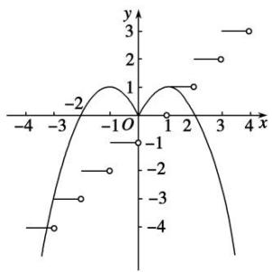

line

| x | y |
|---|---|
| -4 | -4 |
| -3 | -2 |
| -2 | 0 |
| -1 | 1 |
| 0 | 0 |
| 1 | 1 |
| 2 | 2 |
| 3 | 3 |
| 4 | 4 |

# 考点二 已知函数零点的个数，求参数的取值范围

# 【方法总结】

已知复合函数零点的个数，求参数的取值范围的问题：关于已知复合函数 $y=f(g(x))$ 零点的个数，求参数的取值范围的问题，先换元解套，令 $t=g(x)$ ，则 $y=f(t)$ ，再作出 $y=f(t)$ 与 $t=g(x)$ 的图像。由零点个数结合 $t=g(x)$ 与 $y=f(t)$ 的图象特点，从而确定 t 的取值范围，进而决定参数的范围。即 “从内到外”。此法称为双图象法(换元法+数形结合)。

# 【例题选讲】

[例 2](1)已知函数 $f(x)=|x^{2}-4x+3|$ ，若方程 $[f(x)]^{2}+bf(x)+c=0$ 恰有七个不相同的实根，则实数 b 的取值范围是()

A. $(-2, 0)$

B. $(-2, -1)$

C. $(0, 1)$

D. $(0, 2)$

答案 B 解析 考虑通过图像变换作出 $t=f(x)$ 的图像（如图），因为 $[f(x)]^{2}+bf(x)+c=0$ 最多只能解出 2 个 $f(x)$ ，若要出七个根，则 $t_{1}=1,\quad t_{2}\in(0,1)$ ，所以 $-b=t_{1}+t_{2}\in(1,2)$ ，解得 $b\in(-2,-1)$ .

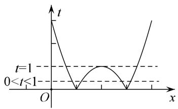

line

| x    | t     |
| ---- | ----- |
| 0    | 1     |
| < t  | 0     |
| > t  | 1     |

(2)已知函数 $f(x) = \begin{cases} a \cdot 2^x, & x \leq 0, \\ \log_{\frac{1}{2}} x, & x > 0. \end{cases}$ . 若关于 $x$ 的方程 $f(f(x)) = 0$ 有且仅有一个实数解，则实数 $a$ 的取值范围是 \_\_\_\_.

答案 $(- \infty, 0) \cup (0, 1)$ 解析 若 $a = 0$ ，当 $x \leq 0$ 时， $f(x) = 0$ ，故 $f(f(x)) = f(0) = 0$ 有无数解，不符合题意，故 $a \neq 0$ . 显然当 $x \leq 0$ 时， $a \cdot 2^x \neq 0$ ，故 $f(x) = 0$ 的根为 1，从而 $f(f(x)) = 0$ 有唯一根，即为 $f(x) = 1$ 有唯一根，而 $x > 0$ 时， $f(x) = 1$ 有唯一根 $\frac{1}{2}$ ，故 $a \cdot 2^x = 1$ 在 $(- \infty, 0]$ 上无根。当 $a \cdot 2^x = 1$ 在 $(- \infty, 0]$ 上有根时，可得 $a = \frac{1}{2^x} \geq 1$ ，故由 $a \cdot 2^x = 1$ 在 $(- \infty, 0]$ 上无根可知 $a < 0$ 或 $0 < a < 1$ 。

(3)已知函数 $f(x) = -x^{2} - 2x$ ， $g(x) = \begin{cases} x + \frac{1}{4x}, & x > 0, \\ x + 1, & x \leq 0. \end{cases}$ 若方程 $g(f(x)) - a = 0$ 有 4 个不同的实数根，则实数 $a$ 的取值范围是 \_\_\_\_.

答案 $\left[1, \frac{5}{4}\right]$ 解析 令 $f(x)=t$ ，则原方程化为 $g(t)=a$ ，易知方程 $f(x)=t$ 在 $(-\infty, 1)$ 上有 2 个不同的解，则原方程有 4 个解等价于函数 $y=g(t)(t<1)$ 与 $y=a$ 的图象有 2 个不同的交点，作出函数 $y=g(t)(t<1)$ 的图象如图，由图象可知，当 $1\leq a<\frac{5}{4}$ 时，函数 $y=g(t)(t<1)$ 与 $y=a$ 有 2 个不同的交点，即所求 $a$ 的取值范围是 $\left[1, \frac{5}{4}\right]$ .

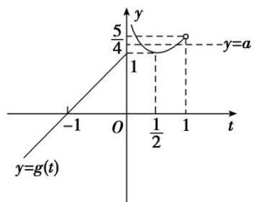

line

| t | y |
|---|---|
| -1 | 5/4 |
| 0 | 1 |
| 1/2 | 1 |
| 1 | a |

# 【对点训练】

7. 已知函数 $f(x) = \begin{cases} |\lg x|, & x > 0, \\ 2^{|x|}, & x \leq 0, \end{cases}$ 若关于 $x$ 的方程 $f^2 (x) - af(x) + 1 = 0$ 有且只有3个不同的根，则实数 $a$ 的值为（）

A.-2

B. 1

C. 2

D. 3

7. 答案 C 解析 作出函数 $f(x) = \begin{cases} |\lg x|, & x > 0, \\ 2^{|x|}, & x \leq 0 \end{cases}$ 的图象(图略)，令 $f(x) = t$ ，关于 $x$ 的方程 $f^2(x) - af(x) + 1 = 0$ 等价于 $t^2 - at + 1 = 0$ ，因为 $t_1 \cdot t_2 = 1$ ，所以 $t_1, t_2$ 同号，只有 $t_1, t_2$ 同正时，方程才有根，假设 $t_1 < t_2$ ，则 $0 < t_1 < 1, t_2 > 1$ ，此时关于 $x$ 的方程 $f^2(x) - af(x) + 1 = 0$ 有5个不同的根，只有 $t_1 = t_2 = 1$ ，关于 $x$ 的方程 $f^2(x) - af(x) + 1 = 0$ 有且只有3个不同的根，此时 $a = 2$ ，故选C.

8. 已知函数 $f(x) = |x + \frac{1}{x}| - |x - \frac{1}{x}|$ ，关于 $x$ 的方程 $f^2 (x) + a|f(x)| + b = 0 (a, b \in \mathbf{R})$ 恰有6个不同实数解，则 $a$ 的取值范围是 \_\_\_\_.

8. 答案 $-4 < a < -2$ 解析 所解方程 $f^2(x) + a | f(x)| + b = 0$ 可视为 $|f(x)|^2 + a | f(x)| + b = 0$ ，故考虑作出 $|f(x)|$ 的图像， $f(x) = \begin{cases} \frac{2}{x}, & x > 1 \\ 2x, & 0 < x \leq 1 \\ -2x, & -1 \leq x < 0 \\ -\frac{2}{x}, & x < -1, \end{cases}$ ，则 $t = |f(x)|$ 的图像如图，由图像可知，若有6个不同实数解，则

必有 $t_{1}=2,\quad0<t_{2}<2$ ，所以 $-a=t_{1}+t_{2}\in(2,4)$ ，解得 -4<a<-2.

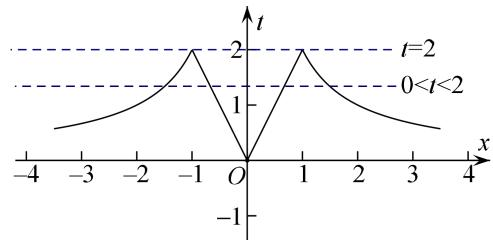

line

| x   | t     |
| --- | ----- |
| -4  | ~0.5  |
| -3  | ~0.75 |
| -2  | ~1.0  |
| -1  | ~1.5  |
| 0   | 0     |
| 1   | ~1.5  |
| 2   | ~1.0  |
| 3   | ~0.75 |
| 4   | ~0.5  |

9. 已知函数 $f(x) = \begin{cases} kx + 3, & x \geq 0, \\ \left(\frac{1}{2}\right)x, & x < 0, \end{cases}$ 若方程 $f(f(x)) - 2 = 0$ 恰有三个实数根，则实数 $k$ 的取值范围是（）

A. $[0, +\infty)$

B. $[1, 3]$

C. $\left(-1,-\frac{1}{3}\right]$

D. $\left[-1, -\frac{1}{3}\right]$

9. 答案 C 解析 $\because f(f(x))-2=0,\quad\therefore f(f(x))=2,\quad\therefore f(x)=-1$ 或 $f(x)=-\frac{1}{k}(k\neq0)$ .

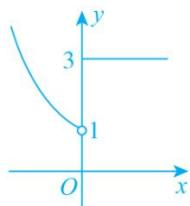

text_image

y
3
1
O
x

图①

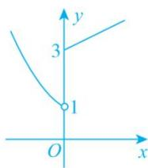

line

| Point | x | y |
|---|---|---|
| 1 | 1 | 1 |
| 2 | 3 | 3 |

图②

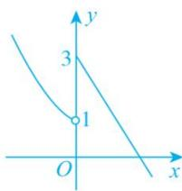

line

| Point | x | y |
|---|---|---|
| 1 | 1 | 1 |
| 2 | 3 | 3 |

图③

(1)当 k=0 时，作出函数 $f(x)$ 的图象如图①所示，由图象可知 $f(x)=-1$ 无解，∴ k=0 不符合题意；(2)当 k>0 时，作出函数 $f(x)$ 的图象如图②所示，由图象可知 $f(x)=-1$ 无解且 $f(x)=-\frac{1}{k}$ 无解，即 $f(f(x))-2=0$ 无解，不符合题意；(3)当 k<0 时，作出函数 $f(x)$ 的图象如图③所示，由图象可知 $f(x)=-1$ 有 1 个实根，∵ $f(f(x))-2=0$ 有 3 个实根，∴ $f(x)=-\frac{1}{k}$ 有 2 个实根，∴ $1<-\frac{1}{k}\leq3$ ，解得 $-1<k\leq-\frac{1}{3}$ 。综上，k 的取值范围是 $\left[-1,-\frac{1}{3}\right]$ ，故选 C.

10. 已知函数 $f(x) = \begin{cases} 3^{|x - 1|}, & x > 0, \\ -x^2 - 2x + 1, & x \leq 0, \end{cases}$ 若关于 $x$ 的方程 $[f(x)]^2 + (a - 1)f(x) - a = 0$ 有7个不等的实数根，则实数 $a$ 的取值范围是（）

A. $[1, 2]$

B. $(1, 2)$

C. $(-2,-1)$

D. $[-2, -1]$

10. 答案 C 解析 函数 $f(x)=\left\{\begin{aligned}&3^{|x^{-1}|},&x>0,\\&-x^{2}-2x+1,&x\leq0\end{aligned}\right.$ 的图象如图：

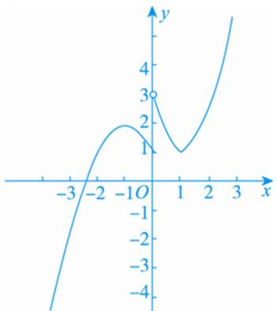

line

| x | y |
|---|---|
| -3 | -4 |
| -2 | -2 |
| -1 | 0 |
| 0 | 1 |
| 1 | 0 |
| 2 | 2 |
| 3 | 4 |

关于 $x$ 的方程 $[f(x)]^2 + (a - 1)f(x) - a = 0$ 有7个不等的实数根，即 $[f(x) + a][f(x) - 1] = 0$ 有7个不等的实数根，易知 $f(x) = 1$ 有3个不等的实数根， $\therefore f(x) = -a$ 必须有4个不相等的实数根，由函数 $f(x)$ 的图象可知 $-a \in (1, 2)$ ， $\therefore a \in (-2, -1)$ . 故选C.

