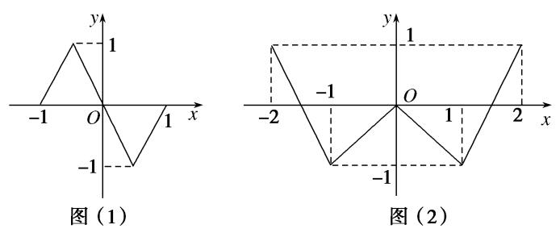
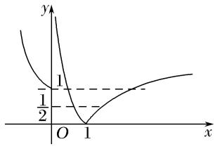
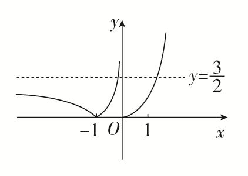
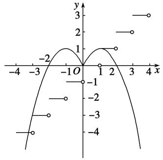
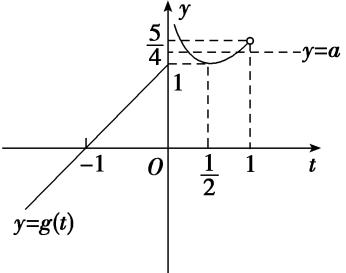
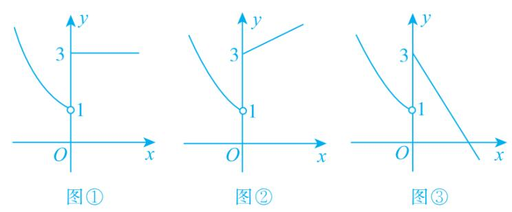

**专题十八　函数的零点问题(5)**

**考点一　确定复合函数零点的个数或方程解的个数**

【**方法总结**】

确定复合函数零点的个数或方程解的个数问题：关于复合函数*y*＝*f*(*g*(*x*))的零点的个数或方程解的个数问题，先换元解套，令*t*＝*g*(*x*)，则*y*＝*f*(*t*)，再作出*y*＝*f*(*t*)与*t*＝*g*(*x*)的图像．由*y*＝*f*(*t*)的图象观察有几个*t*的值满足条件，结合*t*的值观察*t*＝*g*(*x*)的图象，求出每一个*t*被几个*x*对应，将*x*的个数汇总后即为*y*＝*f*(*g*(*x*))的根的个数，即“从外到内”．此法称为双图象法(换元法＋数形结合)．

**【例题选讲】**

<strong>[例1]</strong>　(1)奇函数<em>f</em>(<em>x</em>)，偶函数<em>g</em>(<em>x</em>)的图象分别如图(1)，(2)所示，函数<em>f</em>(<em>g</em>(<em>x</em>))，<em>g</em>(<em>f</em>(<em>x</em>))的零点个数分别为<em>m</em>，<em>n</em>，则<em>m</em>＋<em>n</em>＝(　　)

A．3　　　　　　　　B．7　　　　　　　　C．10　　　　　　　　D．14

答案　C　解析　由题中函数图象知*f*(±1)＝0，*f*(0)＝0，*g*＝0，*g*(0)＝0，*g*(±2)＝1，*g*(±1)＝－1，所以*f*(*g*(±2))＝*f*(1)＝0，*f*(*g*(±1))＝*f*(－1)＝0，*f*＝*f*(0)＝0，*f*(*g*(0))＝*f*(0)＝0，所以*f*(*g*(*x*))有7个零点，即*m*＝7．又*g*(*f*(0))＝*g*(0)＝0，*g*(*f*(±1))＝*g*(0)＝0，所以*g*(*f*(*x*))有3个零点，即*n*＝3．所以*m*＋*n*＝10，选择C．

(2)关于<em>x</em>的方程(<em>x</em>2－1)2－3|<em>x</em>2－1|＋2＝0的不相同实根的个数是(　　)

A．3　　　　　　　　B．4　　　　　　　　C．5　　　　　　　　D．8

答案　C　解析　可将|<em>x</em>2－1|视为一个整体，即<em>t</em>＝|<em>x</em>2－1|，则方程变为<em>t</em>2－3<em>t</em>＋2＝0可解得，<em>t</em>＝1或<em>t</em>＝2，则只需作出<em>t</em>(<em>x</em>)＝|<em>x</em>2－1|的图像，然后统计与<em>t</em>＝1与<em>t</em>＝2的交点总数即可，共有5个．

(3)已知<em>f</em>(<em>x</em>)＝则函数<em>y</em>＝2[<em>f</em>(<em>x</em>)]2－3<em>f</em>(<em>x</em>)＋1的零点个数是\_\_\_\_\_\_\_\_．

答案　5　解析　由2[<em>f</em>(<em>x</em>)]2－3<em>f</em>(<em>x</em>)＋1＝0得<em>f</em>(<em>x</em>)＝或<em>f</em>(<em>x</em>)＝1，作出函数<em>y</em>＝<em>f</em>(<em>x</em>)的图象．由图象知<em>y</em>＝与<em>y</em>＝<em>f</em>(<em>x</em>)的图象有2个交点，<em>y</em>＝1与<em>y</em>＝<em>f</em>(<em>x</em>)的图象有3个交点．因此函数<em>y</em>＝2[<em>f</em>(<em>x</em>)]2－3<em>f</em>(<em>x</em>)＋1的零点有5个．

(4)已知定义在<strong>R</strong>上的奇函数，当<em>x</em>&gt;0时，<em>f</em>(<em>x</em>)＝则关于<em>x</em>的方程6<em>f</em>2(<em>x</em>)－<em>f</em>(<em>x</em>)－1＝0的实数根个数为(　　)

A．　　　　　　　　B．　　　　　　　　C．　　　　　　　　D．

答案　B　解析　已知方程6<em>f</em>2(<em>x</em>)－<em>f</em>(<em>x</em>)－1＝0可解，得<em>f</em>1(<em>x</em>)＝，<em>f</em>2(<em>x</em>)＝－，只需统计<em>y</em>＝，<em>y</em>＝－与<em>y</em>＝<em>f</em>(<em>x</em>)的交点个数即可．由奇函数可先做出<em>x</em>&gt;0的图像，<em>x</em>&gt;2时，<em>f</em>(<em>x</em>)＝<em>f</em>(<em>x</em>－2)，则<em>x</em>∈(2，4]的图像只需将<em>x</em>∈(0，2]的图像纵坐标缩为一半即可．正半轴图像完成后可再利用奇函数的性质作出负半轴图像．通过数形结合可得共有7个交点．

在作图的过程中，注意确定分段函数的边界点属于哪一段区间．

【**对点训练**】

1．已知函数*y*＝*f*(*x*)和*y*＝*g*(*x*)在[－2，2]的图像如下，给出下列四个命题：

(1)方程*f*[*g*(*x*)]＝0有且只有6个根；(2)方程*g*[*f*(*x*)]＝0有且只有3个根；

(3)方程*f*[*f*(*x*)]＝0有且只有5个根；(4)方程*g*[*g*(*x*)]＝0有且只有4个根．

则正确命题的个数是(　　)

A．1　　　　　　　　　B．2　　　　　　　　　C．3　　　　　　　　　D．4

1．答案　C　解析　每个方程都可通过图像先拆掉第一层，找到内层函数能取得的值，从而统计出的总

数．(1)中可得<em>g</em>1(<em>x</em>)∈(－2，－1)，<em>g</em>2(<em>x</em>)＝0，<em>g</em>3(<em>x</em>)∈(1，2)，进而<em>g</em>1(<em>x</em>)有2个对应的<em>x</em>，<em>g</em>2(<em>x</em>)有2个，<em>g</em>3(<em>x</em>)有2个，总计6个，(1)正确；(2)中可得<em>f</em>1(<em>x</em>)∈(－2，－1)，<em>f</em>2(<em>x</em>)∈(0，1)，进而<em>f</em>1(<em>x</em>)有1个对应的<em>x</em>，<em>f</em>2(<em>x</em>)有3个，总计4个，(2)错误；(3)中可得<em>f</em>1(<em>x</em>)∈(－2，－1)，<em>f</em>2(<em>x</em>)＝0，<em>f</em>3(<em>x</em>)∈(1，2)，进而<em>f</em>1(<em>x</em>)有1个对应的<em>x</em>，<em>f</em>2(<em>x</em>)有3个，<em>f</em>3(<em>x</em>)有1个，总计5个，(3)正确；(4)中可得<em>g</em>1(<em>x</em>)∈(－2，－1)，<em>g</em>2(<em>x</em>)∈(0，1)，进而<em>g</em>1(<em>x</em>)有2个对应的<em>x</em>，<em>g</em>2(<em>x</em>)有2个，共计4个，(4)正确．则综上所述，正确的命题共有3个．

2．已知<em>f</em>(<em>x</em>)＝则函数<em>y</em>＝2<em>f</em>2(<em>x</em>)－3<em>f</em>(<em>x</em>)的零点个数为\_\_\_\_\_\_\_\_．

2．答案　5　解析　令<em>y</em>＝2<em>f</em>2(<em>x</em>)－3<em>f</em>(<em>x</em>)＝0，则<em>f</em>(<em>x</em>)＝0或<em>f</em>(<em>x</em>)＝．函数<em>f</em>(<em>x</em>)＝的图象如图所

示：由图可得，<em>f</em>(<em>x</em>)＝0有2个根，<em>f</em>(<em>x</em>)＝有3个根，故函数<em>y</em>＝2<em>f</em>2(<em>x</em>)－3<em>f</em>(<em>x</em>)的零点个数为5．

3．设定义域为<strong>R</strong>的函数<em>f</em>(<em>x</em>)＝若关于<em>x</em>的方程<em>f</em>2(<em>x</em>)＋<em>bf</em>(<em>x</em>)＋<em>c</em>＝0有3个不同的解<em>x</em>1，<em>x</em>2，

<em>x</em>3，则<em>x</em>12＋<em>x</em>22＋<em>x</em>32＝\_\_\_\_\_\_\_\_．

3．答案　5　解析　先作出*f*(*x*)的图像如图，观察可发现对于任意的*t*，满足*t*＝*f*(*x*)的*x*的个数分别为2个

(<em>t</em>＞0，<em>t</em>≠1)和3个(<em>t</em>＝1)，已知有3个解，从而可得<em>f</em>(<em>x</em>)＝1必为<em>f</em>2(<em>x</em>)＋<em>bf</em>(<em>x</em>)＋<em>c</em>＝0的根，而另一根为1或者是负数．所以<em>f</em>(<em>xi</em>)＝1，可解得，<em>x</em>1＝0，<em>x</em>2＝1，<em>x</em>3＝2．所以<em>x</em>12＋<em>x</em>22＋<em>x</em>32＝5．

4．已知函数*f*(*x*)＝则函数*y*＝*f*(*f*(*x*))＋1的零点个数是(　　)

A．4　　　　　　　　B．3　　　　　　　　C．2　　　　　　　　D．1

4．答案　A　解析　由*f*(*f*(*x*))＋1＝0，得*f*(*f*(*x*))＝－1，由*f*(－2)＝*f*＝－1，得*f*(*x*)＝－2或*f*(*x*)＝．若*f*(*x*)

＝－2，则*x*＝－3或*x*＝；若*f*(*x*)＝，则*x*＝－或*x*＝．综上可得函数*y*＝*f*(*f*(*x*))＋1的零点个数是4．故选A．

5．已知函数*f*(*x*)＝，则下列关于函数*y*＝*f*(*f*(*x*))＋1的零点个数判断正确的是(　　)

A．当*a*>0时，有4个零点；当*a*<0时，有1个零点

B．当*a*>0时，有3个零点；当*a*<0时，有2个零点

C．无论*a*为何值，均有2个零点

D．无论*a*为何值，均有4个零点

5．答案　A　解析　所求函数的零点，即方程*f*(*f*(*x*))＝－1的解的个数，令*t*＝*f*(*x*)，先作出*y*＝*f*(*t*)的图像，

直线<em>y</em>＝<em>ax</em>＋1为过定点(0，1)的一条直线，但需要对<em>a</em>的符号进行分类讨论．当<em>a</em>&gt;0时，如图1所示，先拆外层可得<em>t</em>1＝<em>－</em>＜0，<em>t</em>2＝，如图2所示，而<em>t</em>1有两个对应的<em>x</em>，<em>t</em>2也有两个对应的，共计4个；当<em>a</em>&lt;0时，如图3所示，先拆外层可得<em>t</em>＝，如图4所示，<em>t</em>＝只有一个满足的<em>x</em>，所以共1个零点．结合选项，可判断出A正确．

6．已知[<em>x</em>]表示不超过<em>x</em>的最大整数，当<em>x</em>∈<strong>R</strong>时，称<em>y</em>＝[<em>x</em>]为取整函数，例如[1.6]＝1，[－3.3]＝－4，若

<em>f</em>(<em>x</em>)＝[<em>x</em>]，<em>g</em>(<em>x</em>)的图象关于<em>y</em>轴对称，且当<em>x</em>≤0时，<em>g</em>(<em>x</em>)＝－<em>x</em>2－2<em>x</em>，则方程<em>f</em>(<em>f</em>(<em>x</em>))＝<em>g</em>(<em>x</em>)解的个数为(　　)

A．1　　　　　　　　B．2　　　　　　　　C．3　　　　　　　　D．4

6．答案　D　解析　根据已知条件可知，当*x*>0时，－*x*<0，又函数*g*(*x*)的图象关于*y*轴对称，故*g*(*x*)为

偶函数，所以<em>g</em>(<em>x</em>)＝<em>g</em>(－<em>x</em>)＝－(－<em>x</em>＋1)2＋1＝－(<em>x</em>－1)2＋1.由<em>f</em>(<em>x</em>)＝[<em>x</em>]，得<em>f</em>(<em>f</em>(<em>x</em>))＝[<em>x</em>]．在同一平面直角坐标系中画出<em>y</em>＝<em>f</em>(<em>f</em>(<em>x</em>))与<em>y</em>＝<em>g</em>(<em>x</em>)的图象如图所示，由图象知，两个图象有4个交点，交点的纵坐标分别为1，0，－3，－4，当<em>x</em>≥0时，方程<em>f</em>(<em>f</em>(<em>x</em>))＝<em>g</em>(<em>x</em>)的解是0和1；当<em>x</em>&lt;0时，<em>g</em>(<em>x</em>)＝－(<em>x</em>＋1)2＋1＝－3得<em>x</em>＝－3，由<em>g</em>(<em>x</em>)＝－(<em>x</em>＋1)2＋1＝－4得<em>x</em>＝－1－．综上，<em>f</em>(<em>f</em>(<em>x</em>))＝<em>g</em>(<em>x</em>)的解的个数为4．

**考点二　已知函数零点的个数，求参数的取值范围**

【**方法总结**】

已知复合函数零点的个数，求参数的取值范围的问题：关于已知复合函数*y*＝*f*(*g*(*x*))零点的个数，求参数的取值范围的问题，先换元解套，令*t*＝*g*(*x*)，则*y*＝*f*(*t*)，再作出*y*＝*f*(*t*)与*t*＝*g*(*x*)的图像．由零点个数结合*t*＝*g*(*x*)与*y*＝*f*(*t*)的图象特点，从而确定*t*的取值范围，进而决定参数的范围．即“从内到外”．此法称为双图象法(换元法＋数形结合)．

**【例题选讲】**

<strong>[例2]</strong>(1)已知函数<em>f</em>(<em>x</em>)＝|<em>x</em>2－4<em>x</em>＋3|，若方程[<em>f</em>(<em>x</em>)]2＋<em>bf</em>(<em>x</em>)＋<em>c</em>＝0恰有七个不相同的实根，则实数<em>b</em>的取值范围是(　　)

A．(－2，0)　　　　　　B．(－2，－1)　　　　　　C．(0，1)　　　　　　D．(0，2)

答案　B　解析　考虑通过图像变换作出<em>t</em>＝<em>f</em>(<em>x</em>)的图像（如图），因为[<em>f</em>(<em>x</em>)]2＋<em>bf</em>(<em>x</em>)＋<em>c</em>＝0最多只能解出2个<em>f</em>(<em>x</em>)，若要出七个根，则<em>t</em>1＝1，<em>t</em>2∈(0，1)，所以－<em>b</em>＝<em>t</em>1＋<em>t</em>2∈(1，2)，解得<em>b</em>∈(－2，－1)．

(2)已知函数*f*(*x*)＝若关于*x*的方程*f*(*f*(*x*))＝0有且仅有一个实数解，则实数*a*的取值范围是\_\_\_\_\_\_\_\_．

答案　(－∞，0)∪(0，1)　解析　若<em>a</em>＝0，当<em>x</em>≤0时，<em>f</em>(<em>x</em>)＝0，故<em>f</em>(<em>f</em>(<em>x</em>))＝<em>f</em>(0)＝0有无数解，不符合题意，故<em>a</em>≠0.显然当<em>x</em>≤0时，<em>a</em>·2<em>x</em>≠0，故<em>f</em>(<em>x</em>)＝0的根为1，从而<em>f</em>(<em>f</em>(<em>x</em>))＝0有唯一根，即为<em>f</em>(<em>x</em>)＝1有唯一根，而<em>x</em>&gt;0时，<em>f</em>(<em>x</em>)＝1有唯一根，故<em>a</em>·2<em>x</em>＝1在(－∞，0]上无根．当<em>a</em>·2<em>x</em>＝1在(－∞，0]上有根时，可得<em>a</em>＝≥1，故由<em>a</em>·2<em>x</em>＝1在(－∞，0]上无根可知<em>a</em>&lt;0或0&lt;<em>a</em>&lt;1．

(3)已知函数<em>f</em>(<em>x</em>)＝－<em>x</em>2－2<em>x</em>，<em>g</em>(<em>x</em>)＝若方程<em>g</em>(<em>f</em>(<em>x</em>))－<em>a</em>＝0有4个不同的实数根，则实数<em>a</em>的取值范围是\_\_\_\_\_\_\_\_．

答案　　解析　令*f*(*x*)＝*t*，则原方程化为*g*(*t*)＝*a*，易知方程*f*(*x*)＝*t*在(－∞，1)上有2个不同的解，则原方程有4个解等价于函数*y*＝*g*(*t*)(*t*＜1)与*y*＝*a*的图象有2个不同的交点，作出函数*y*＝*g*(*t*)(*t*＜1)的图象如图，由图象可知，当1≤*a*＜时，函数*y*＝*g*(*t*)(*t*＜1)与*y*＝*a*有2个不同的交点，即所求*a*的取值范围是．

【**对点训练**】

7．已知函数<em>f</em>(<em>x</em>)＝若关于<em>x</em>的方程<em>f</em>2(<em>x</em>)－<em>af</em>(<em>x</em>)＋1＝0有且只有3个不同的根，则实数<em>a</em>的

值为(　　)

A．－2　　　　　　　　B．1　　　　　　　　C．2　　　　　　　　D．3

7．答案　C　解析　作出函数<em>f</em>(<em>x</em>)＝的图象(图略)，令<em>f</em>(<em>x</em>)＝<em>t</em>，关于<em>x</em>的方程<em>f</em>2(<em>x</em>)－<em>af</em>(<em>x</em>)＋1

＝0等价于<em>t</em>2－<em>at</em>＋1＝0，因为<em>t</em>1·<em>t</em>2＝1，所以<em>t</em>1，<em>t</em>2同号，只有<em>t</em>1，<em>t</em>2同正时，方程才有根，假设<em>t</em>1＜<em>t</em>2，则0＜<em>t</em>1＜1，<em>t</em>2＞1，此时关于<em>x</em>的方程<em>f</em>2(<em>x</em>)－<em>af</em>(<em>x</em>)＋1＝0有5个不同的根，只有<em>t</em>1＝<em>t</em>2＝1，关于<em>x</em>的方程<em>f</em>2(<em>x</em>)－<em>af</em>(<em>x</em>)＋1＝0有且只有3个不同的根，此时<em>a</em>＝2，故选C．

8．已知函数<em>f</em>(<em>x</em>)＝|<em>x</em>＋|－|<em>x</em>－|，关于的方程<em>f</em>2(<em>x</em>)＋<em>a</em>|<em>f</em>(<em>x</em>)|＋<em>b</em>＝0(<em>a</em>，<em>b</em>∈<strong>R</strong>)恰有6个不同实数解，则<em>a</em>

的取值范围是\_\_\_\_\_\_\_\_\_\_．

8．答案　－4&lt;<em>a</em>&lt;－2　解析　所解方程<em>f</em>2(<em>x</em>)＋<em>a</em>|<em>f</em>(<em>x</em>)|＋<em>b</em>＝0可视为|<em>f</em>(<em>x</em>)|2＋<em>a</em>|<em>f</em>(<em>x</em>)|＋<em>b</em>＝0，故考虑作出|<em>f</em>(<em>x</em>)|的

图像，<em>f</em>(<em>x</em>)＝，则<em>t</em>＝|<em>f</em>(<em>x</em>)|的图像如图，由图像可知，若有6个不同实数解，则必有<em>t</em>1＝2，0&lt;<em>t</em>2&lt;2，所以－<em>a</em>＝<em>t</em>1＋<em>t</em>2∈(2，4)，解得－4&lt;<em>a</em>&lt;－2．

9．已知函数*f*(*x*)＝若方程*f*(*f*(*x*))－2＝0恰有三个实数根，则实数*k*的取值范围是(　　)

A．[0，＋∞)　　　　　B．[1，3]　　　　　C．　　　　　D．

9．答案　C　解析　∵*f*(*f*(*x*))－2＝0，∴*f*(*f*(*x*))＝2，∴*f*(*x*)＝－1或*f*(*x*)＝－(*k*≠0)．

(1)当*k*＝0时，作出函数*f*(*x*)的图象如图①所示，由图象可知*f*(*x*)＝－1无解，∴*k*＝0不符合题意；(2)当*k*＞0时，作出函数*f*(*x*)的图象如图②所示，由图象可知*f*(*x*)＝－1无解且*f*(*x*)＝－无解，即*f*(*f*(*x*))－2＝0无解，不符合题意；(3)当*k*＜0时，作出函数*f*(*x*)的图象如图③所示，由图象可知*f*(*x*)＝－1有1个实根，∵*f*(*f*(*x*))－2＝0有3个实根，∴*f*(*x*)＝－有2个实根，∴1＜－≤3，解得－1＜*k*≤－．综上，*k*的取值范围是，故选C．

10．已知函数<em>f</em>(<em>x</em>)＝若关于<em>x</em>的方程[<em>f</em>(<em>x</em>)]2＋(<em>a</em>－1)<em>f</em>(<em>x</em>)－<em>a</em>＝0有7个不等的实数根，

则实数*a*的取值范围是(　　)

A．[1，2]　　　　　　B．(1，2)　　　　　　C．(－2，－1)　　　　　　D．[－2，－1]

10．答案　C　解析　函数*f*(*x*)＝的图象如图：

关于<em>x</em>的方程[<em>f</em>(<em>x</em>)]2＋(<em>a</em>－1)<em>f</em>(<em>x</em>)－<em>a</em>＝0有7个不等的实数根，即[<em>f</em>(<em>x</em>)＋<em>a</em>][<em>f</em>(<em>x</em>)－1]＝0有7个不等的实数根，易知<em>f</em>(<em>x</em>)＝1有3个不等的实数根，∴<em>f</em>(<em>x</em>)＝－<em>a</em>必须有4个不相等的实数根，由函数<em>f</em>(<em>x</em>)的图象可知－<em>a</em>∈(1，2)，∴<em>a</em>∈(－2，－1)．故选C．

