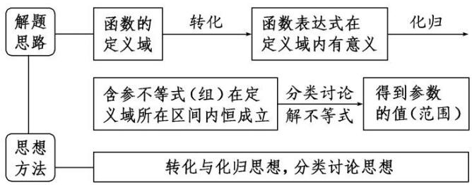

# 专题一 函数的定义域

#### 1. 函数的概念

一般地，设 A, B 是两个非空的数集，如果按照某种确定的对应关系 f，使对于集合 A 中的任意一个数 x，在集合 B 中都有唯一确定的数 $f(x)$ 和它对应，那么就称 $f: A \rightarrow B$ 为从集合 A 到集合 B 的一个函数，记作 $y = f(x)$ ， $x \in A$ .

#### 2. 函数的有关概念  
（1）函数的定义域、值域：在函数 $y = f(x)$ ， $x \in A$ 中， $x$ 叫做自变量， $x$ 的取值范围 $A$ 叫做函数的定义域；与 $x$ 的值相对应的 $y$ 值叫做函数值，函数值的集合 $\{f(x) | x \in A\}$ 叫做函数的值域．显然，值域是集合 $B$ 的子集.  
（2）函数的三要素：定义域、值域和对应关系.   
（3）相等函数：如果两个函数的定义域和对应关系完全一致，则这两个函数相等，这是判断两函数相等的依据.

#### 3. 复合函数

一般地，对于两个函数 $y = f(u)$ 和 $u = g(x)$ ，如果通过变量 $u$ ， $y$ 可以表示成 $x$ 的函数，那么称这个函数为函数 $y = f(u)$ 和 $u = g(x)$ 的复合函数，记作 $y = f(g(x))$ ，其中 $y = f(u)$ 叫做复合函数 $y = f(g(x))$ 的外层函数， $u = g(x)$ 叫做 $y = f(g(x))$ 的内层函数.

# 考点一 求给定解析式的函数的定义域

# 【方法总结】

# 常见函数定义域的类型

分式型 $\frac{1}{f(x)}$ 要满足 $f(x) \neq 0$ ;

根式型 $\sqrt[2n]{f(x)} (n\in \mathbf{N}^{*})$ 要满足 $f(x)\geqslant 0$
$[f(x)]^{0}$ 要满足 $f(x) \neq 0$ ;

对数型 $\log_a f(x) (a > 0$ , 且 $a \neq 1$ ) 要满足 $f(x) > 0$ ;

正切型 $\tan [f(x)]$ 要满足 $f(x) \neq \frac{\pi}{2} + k\pi, k \in \mathbf{Z}$ .

# 【例题选讲】

[例 1] （1） 函数 $y=\frac{\ln(1-x)}{\sqrt{x+1}}+\frac{1}{x}$ 的定义域是()

A. $[-1, 0) \cup (0, 1)$ 
B. $[-1, 0) \cup (0, 1]$ 
C. $(-1, 0) \cup (0, 1]$ 
D. $(-1, 0) \cup (0, 1)$  
（2） 函数 $y=\frac{\sqrt{-x^{2}+2x+3}}{\lg(x+1)}$ 的定义域为()

A. $(-1, 3]$ 
B. $(-1, 0) \cup (0, 3]$ 
C. $[-1, 3]$ 
D. $[-1, 0) \cup (0, 3]$  
（3） $y=\sqrt{\frac{x-1}{2x}}-\log_{2}(4-x^{2})$ 的定义域是()

A. $(-2, 0) \cup (1, 2)$ 
B. $(-2, 0] \cup (1, 2)$ 
C. $(-2, 0) \cup [1, 2)$ 
D. $[-2, 0] \cup [1, 2]$  
（4） 函数 $f(x) = \sqrt{2 - 2^x} + \frac{1}{\log_{3} x}$ 的定义域为()

A. $\{x|x<1\}$

B. $\{x|0<x<1\}$

C. $\{x|0<x\leq1\}$

D. $\{x|x>1\}$  
（5） 函数 $f(x)=\frac{\sqrt{1-|x-1|}}{a^{x}-1}$ (a>0 且 $a\neq1$ ) 的定义域为 \_\_\_\_.

# 【对点训练】

1. 下列函数中，与函数 $y = \frac{1}{\sqrt[3]{x}}$ 的定义域相同的函数为( )

A. $y=\frac{1}{\sin x}$

B. $y=\frac{\ln x}{x}$

C. $y = x e^{x}$

D. $y=\frac{\sin x}{x}$

2. 函数 $y = \log_2(2x - 4) + \frac{1}{x - 3}$ 的定义域是()

A. (2, 3)

B. $(2, +\infty)$

C. $(3, +\infty)$

D. $(2, 3) \cup (3, +\infty)$

3. 函数 $f(x) = \sqrt{2^x - 1} + \frac{1}{x - 2}$ 的定义域为( )

A. $[0, 2)$

B. $(2, +\infty)$

C. $[0, 2) \cup (2, +\infty)$

D. $(-\infty, 2) \cup (2, +\infty)$

4. 函数 $f(x)=\frac{\sqrt{10+9x-x^{2}}}{\lg(x-1)}$ 的定义域为()

A. [1, 10]

B. $[1, 2) \cup (2, 10]$

C. $(1, 10]$

D. $(1, 2) \cup (2, 10]$

5. 函数 $y=\ln\left(1+\frac{1}{x}\right)+\sqrt{1-x^{2}}$ 的定义域为 \_\_\_\_.

# 考点二 求抽象函数的定义域

# 【方法总结】

# 求抽象函数定义域的方法

已知函数 $f(x)$ 的定义域为 $[a,b]$ ，求复合函数 $f[g(x)]$ 的定义域  
由不等式 $a \leqslant g(x) \leqslant b$ 解得 $x$ ，则 $x$ 的取值范围即为所求定义域

已知复合函数 $f[g(x)]$ 的定义域为 $[a,b]$ ，求函数 $f(x)$ 的定义域求出 $y = g(x)(x\in [a,b])$ 的值域，即为 $y = f(x)$ 的定义域

# 【例题选讲】

[例 2] （1） 已知函数 $f(x)$ 的定义域为 $(-1, 0)$ ，则函数 $f(2x+1)$ 的定义域为()

A. $(-1, 1)$

B. $\left(-1,-\frac{1}{2}\right)$

C. $(-1,0)$

D. $\begin{pmatrix}\frac{1}{2},&1\end{pmatrix}$  
（2） 已知函数 $f(x)$ 的定义域为 $(-1, 1)$ ，则函数 $g(x) = f\left(\frac{x}{2}\right) + f(x - 1)$ 的定义域为（）

A. $(-2, 0)$

B. $(-2, 2)$

C. $(0, 2)$

D. $\left(-\frac{1}{2},0\right)$  
（3） 已知函数 $f(x)$ 的定义域为 $[0, 2]$ ，则函数 $g(x) = f(2x) + \sqrt{8 - 2^x}$ 的定义域为（）

A. $[0, 1]$

B. $[0, 2]$

C. $[1, 2]$

D. $[1, 3]$  
（4） 已知函数 $y=f(x^{2}-1)$ 的定义域为 $[-\sqrt{3}, \sqrt{3}]$ ，则函数 $y=f(x)$ 的定义域为 \_\_\_\_.  
（5） 若函数 $y=f(2^{x})$ 的定义域为 $\left[\frac{1}{2},\quad2\right]$ ，则 $y=f(\log_{2}x)$ 的定义域为 \_\_\_\_.

# 【对点训练】

6. 已知函数 $f(x) = \sqrt{-x^2 + 2x + 3}$ ，则函数 $f(3x - 2)$ 的定义域为（）

A. $\left[\frac{1}{3},\frac{5}{3}\right]$

B. $\left[-1,\frac{5}{3}\right]$

C. $[-3, 1]$

D. $\left[\frac{1}{3},\quad1\right]$

7. 设函数 $f(x) = \lg (1 - x)$ ，则函数 $f[f(x)]$ 的定义域为（）

A. $(-9, +\infty)$

B. $(-9, 1)$

C. $[-9, +\infty)$

D. $[-9, 1)$

8. 已知函数 $y = f(2x - 1)$ 的定义域是[0, 1]，则函数 $\frac{f(2x + 1)}{\log_2(x + 1)}$ 的定义域是()

A. [1, 2]

B. $(-1, 1]$

C. $\left[-\frac{1}{2},0\right]$

D. $(-1, 0)$

9. 若函数 $f(x + 1)$ 的定义域为 $[0, 1]$ ，则 $f(2^x - 2)$ 的定义域为（）

A. $[0, 1]$

B. $[\log_23, 2]$

C. $[1, \log_23]$

D. $[1, 2]$

# 考点三 已知函数定义域求参数

# 【方法总结】

# 解决已知定义域求参数问题的思路方法

# 【例题选讲】

[例 3] （1） 若函数 $f(x)=\sqrt{x^{2}+ax+1}$ 的定义域为实数集 R，则实数 a 的取值范围为 \_\_\_\_.  
（2） 若函数 $f(x) = \sqrt{mx^2 + mx + 1}$ 的定义域为一切实数，则实数 $m$ 的取值范围是()

A. $[0, 4)$

B. $(0, 4)$

C. $[4, +\infty)$

D. $[0, 4]$  
（3） 若函数 $f(x)=\sqrt{2^{x^{2}+2ax-a}-1}$ 的定义域为 R，则 a 的取值范围为 \_\_\_\_.  
（4） 若函数 $y = \frac{mx - 1}{mx^2 + 4mx + 3}$ 的定义域为 $\mathbf{R}$ ，则实数 $m$ 的取值范围是（）

A. $\left\{0,\frac{3}{4}\right]$

B. $\begin{pmatrix}0,\frac{3}{4}\end{pmatrix}$

C. $\begin{bmatrix}0,\frac{3}{4}\end{bmatrix}$

D. $\left[0,\frac{3}{4}\right]$

# 【对点训练】

10. 函数 $y = \ln (x^2 - x - m)$ 的定义域为 $\mathbf{R}$ ，则 $m$ 的范围是 \_\_\_\_.

11. 若函数 $f(x)=\sqrt{ax^{2}+abx+b}$ 的定义域为 $\{x|1\leq x\leq2\}$ ，则 $a+b$ 的值为 \_\_\_\_.

12. 若函数 $y=\frac{ax+1}{ax^{2}+2ax+3}$ 的定义域为 R，则实数 a 的取值范围是 \_\_\_\_.

