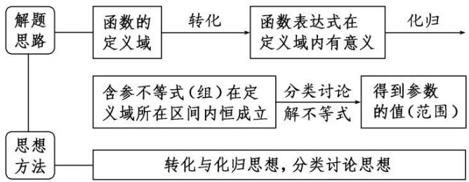
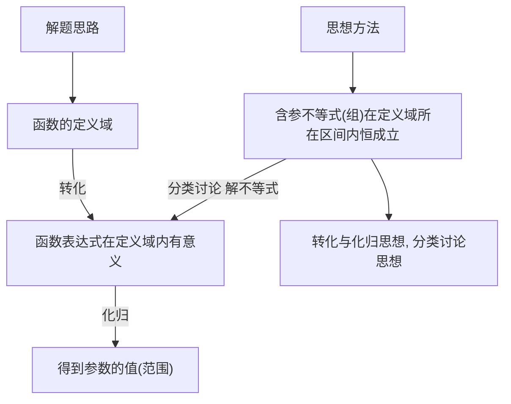

# 专题一 函数的定义域

# 1. 函数的概念

一般地，设 A, B 是两个非空的数集，如果按照某种确定的对应关系 f，使对于集合 A 中的任意一个数 x，在集合 B 中都有唯一确定的数 $f(x)$ 和它对应，那么就称 $f: A \rightarrow B$ 为从集合 A 到集合 B 的一个函数，记作 $y = f(x)$ ， $x \in A$ .

# 2. 函数的有关概念

(1)函数的定义域、值域：在函数 $y = f(x)$ ， $x \in A$ 中， $x$ 叫做自变量， $x$ 的取值范围 $A$ 叫做函数的定义域；与 $x$ 的值相对应的 $y$ 值叫做函数值，函数值的集合 $\{f(x) | x \in A\}$ 叫做函数的值域．显然，值域是集合 $B$ 的子集.  
(2)函数的三要素：定义域、值域和对应关系.   
(3)相等函数：如果两个函数的定义域和对应关系完全一致，则这两个函数相等，这是判断两函数相等的依据.

# 3. 复合函数

一般地，对于两个函数 $y = f(u)$ 和 $u = g(x)$ ，如果通过变量 $u$ ， $y$ 可以表示成 $x$ 的函数，那么称这个函数为函数 $y = f(u)$ 和 $u = g(x)$ 的复合函数，记作 $y = f(g(x))$ ，其中 $y = f(u)$ 叫做复合函数 $y = f(g(x))$ 的外层函数， $u = g(x)$ 叫做 $y = f(g(x))$ 的内层函数.

# 考点一 求给定解析式的函数的定义域

# 【方法总结】

# 常见函数定义域的类型

分式型 $\frac{1}{f(x)}$ 要满足 $f(x) \neq 0$ ;

根式型 $\sqrt[2n]{f(x)} (n\in \mathbf{N}^{*})$ 要满足 $f(x)\geqslant 0$

$[f(x)]^{0}$ 要满足 $f(x) \neq 0$ ;

对数型 $\log_a f(x) (a > 0$ , 且 $a \neq 1$ ) 要满足 $f(x) > 0$ ;

正切型 $\tan [f(x)]$ 要满足 $f(x) \neq \frac{\pi}{2} + k\pi, k \in \mathbf{Z}$ .

# 【例题选讲】

[例 1] (1) 函数 $y=\frac{\ln(1-x)}{\sqrt{x+1}}+\frac{1}{x}$ 的定义域是()

A. $[-1, 0) \cup (0, 1)$ B. $[-1, 0) \cup (0, 1]$ C. $(-1, 0) \cup (0, 1]$ D. $(-1, 0) \cup (0, 1)$

答案 D 解析 由题意得 $\left\{ \begin{array}{l} 1 - x > 0, \\ x + 1 > 0, \\ x \neq 0, \end{array} \right.$ 解得 $-1 < x < 0$ 或 $0 < x < 1$ . 所以原函数的定义域为 $(-1, 0) \cup (0,$

1).

(2) 函数 $y=\frac{\sqrt{-x^{2}+2x+3}}{\lg(x+1)}$ 的定义域为()

A. $(-1, 3]$

B. $(-1, 0) \cup (0, 3]$

C. $[-1, 3]$

D. $[-1, 0) \cup (0, 3]$

答案 B 解析 要使函数有意义，x 需满足 $\left\{\begin{aligned}-x^{2}+2x+3&\geq0,\\ x+1&>0,\\ x+1&\neq1,\end{aligned}\right.$ 解得 -1<x<0 或 $0<x\leq3$ ，所以函数的定义域为 $(-1,0)\cup(0,3]$ .

(3) $y=\sqrt{\frac{x-1}{2x}}-\log_{2}(4-x^{2})$ 的定义域是()

A. $(-2, 0) \cup (1, 2)$

B. $(-2, 0] \cup (1, 2)$

C. $(-2, 0) \cup [1, 2)$

D. $[-2, 0] \cup [1, 2]$

答案 C 解析 要使函数有意义，必须 $\left\{\begin{aligned}&x-1\\ &2x\geq0,\\&x\neq0,\\&4-x^{2}>0,\end{aligned}\right.$

所以 $x \in (-2, 0) \cup [1, 2)$ .

(4) 函数 $f(x) = \sqrt{2 - 2^x} + \frac{1}{\log_3 x}$ 的定义域为()

A. $\{x|x<1\}$

B. $\{x\mid 0 <   x <   1\}$

C. $\{x|0<x\leq1\}$

D. $\{x|x>1\}$

答案 B 解析 要使函数有意义，则必须满足 $\left\{\begin{aligned}&2-2^{x}\geq0,\\&x>0,\\&\log_{3}x\neq0,\end{aligned}\right.$ $\therefore0<x<1.$

(5) 函数 $f(x) = \frac{\sqrt{1 - |x - 1|}}{a^x - 1} (a > 0 \text{ 且 } a \neq 1)$ 的定义域为 \_\_\_\_.

答案 (0, 2] 解析 由题意得 $\left\{ \begin{array}{l} 1 - |x - 1| \geq 0, \\ a^x - 1 \neq 0, \end{array} \right.$ 解得 $\left\{ \begin{array}{l} 0 \leq x \leq 2, \\ x \neq 0, \end{array} \right.$ 即 $0 < x \leq 2$ ，故所求函数的定义域为(0, 2].

# 【对点训练】

1. 下列函数中，与函数 $y = \frac{1}{\sqrt[3]{x}}$ 的定义域相同的函数为( )

A. $y=\frac{1}{\sin x}$

B. $y=\frac{\ln x}{x}$

C. $y = x e^{x}$

D. $y=\frac{\sin x}{x}$

1. 答案 D 解析 函数 $y=\frac{1}{\sqrt[3]{x}}$ 的定义域为 $\{x|x\neq0\}$ ; $y=\frac{1}{\sin x}$ 的定义域为 $\{x|x\neq k\pi, k\in Z\}$ ; $y=\frac{\ln x}{x}$ 的定义域为 $\{x|x>0\}$ ; $y=xe^{x}$ 的定义域为 R; $y=\frac{\sin x}{x}$ 的定义域为 $\{x|x\neq0\}$ . 故选 D.

2. 函数 $y = \log_2(2x - 4) + \frac{1}{x - 3}$ 的定义域是()

A. (2, 3)

B. $(2, +\infty)$

C. $(3, +\infty)$

D. $(2, 3) \cup (3, +\infty)$

2. 答案 D 解析 由题意，得 $\left\{ \begin{array}{l} 2x - 4 > 0, \\ x - 3 \neq 0, \end{array} \right.$ 解得 $x > 2$ 且 $x \neq 3$ ，所以函数 $y = \log_2(2x - 4) + \frac{1}{x - 3}$ 的定义域为(2, 3) $\cup (3, +\infty)$ .

3. 函数 $f(x) = \sqrt{2^x - 1} + \frac{1}{x - 2}$ 的定义域为( )

A. $[0, 2)$

B. $(2, +\infty)$

C. $[0, 2) \cup (2, +\infty)$

D. $(-\infty, 2) \cup (2, +\infty)$

3. 答案 C 解析 由题意得 $\left\{ \begin{array}{l} 2^{x} - 1 \geq 0, \\ x - 2 \neq 0, \end{array} \right.$ 解得 $x \geq 0$ ，且 $x \neq 2$ .

4. 函数 $f(x) = \frac{\sqrt{10 + 9x - x^2}}{\lg(x - 1)}$ 的定义域为( )

A. $[1, 10]$

B. $[1, 2) \cup (2, 10]$

C. $(1, 10]$

D. $(1,2)\cup (2,10]$

4. 答案 D 解析 要使函数 $f(x)$ 有意义，则 x 须满足 $\left\{\begin{aligned}10+9x-x^{2}&\geq0,\\ x-1&>0,\\ \lg(x-1)&\neq0,\end{aligned}\right.$ 即 $\left\{\begin{aligned}(x+1)(x-10)&\leq0,\\ x&>1,\\ x&\neq2,\end{aligned}\right.$ 解得 $1<x\leq10$ ，且 $x\neq2$ ，所以函数 $f(x)$ 的定义域为 $(1,2)\cup(2,10]$ .

5. 函数 $y=\ln\left(1+\frac{1}{x}\right)+\sqrt{1-x^{2}}$ 的定义域为 \_\_\_\_.

5. 答案 (0, 1] 解析 由 $\left\{ \begin{array}{l} 1 + \frac{1}{x} > 0, \\ x \\ 1 - x^2 \geq 0 \end{array} \right.$ $\Rightarrow \left\{ \begin{array}{l} x < -1 \text{ 或 } x > 0, \\ -1 \leq x \leq 1 \end{array} \right.$ $\Rightarrow 0 < x \leq 1$ 。所以该函数的定义域为(0, 1].

# 考点二 求抽象函数的定义域

# 【方法总结】

# 求抽象函数定义域的方法

已知函数 $f(x)$ 的定义域为 $[a, b]$ ，求复合函数 $f[g(x)]$ 的定义域

由不等式 $a \leqslant g(x) \leqslant b$ 解得 $x$ , 则 $x$ 的取值范围即为所求定义域

已知复合函数 $f[g(x)]$ 的定义域为 $[a, b]$ ，求函数 $f(x)$ 的定义域

求出 $y=g(x)(x\in[a,b])$ 的值域，即为 $y=f(x)$ 的定义域

# 【例题选讲】

[例 2] (1) 已知函数 $f(x)$ 的定义域为 $(-1, 0)$ ，则函数 $f(2x+1)$ 的定义域为()

A. $(-1, 1)$

B. $\left(-1,-\frac{1}{2}\right)$

C. $(-1,0)$

D. $\left(\frac{1}{2},\quad1\right)$

答案 B 解析 令 $u = 2x + 1$ ，由 $f(x)$ 的定义域为 $(-1, 0)$ ，可知 $-1 < u < 0$ ，即 $-1 < 2x + 1 < 0$ ，得 $-1 < x < -\frac{1}{2}$ .

(2) 已知函数 $f(x)$ 的定义域为 $(-1, 1)$ ，则函数 $g(x) = f\left(\frac{x}{2}\right) + f(x - 1)$ 的定义域为（）

A. $(-2, 0)$

B. $(-2, 2)$

C. $(0, 2)$

D. $\left(-\frac{1}{2},0\right)$

答案 C 解析 由题意得 $\left\{ \begin{array}{l} -1 < \frac{x}{2} < 1, \\ -1 < x - 1 < 1, \end{array} \right.$ $\therefore \left\{ \begin{array}{l} -2 < x < 2, \\ 0 < x < 2, \end{array} \right.$ $\therefore 0 < x < 2, \therefore$ 函数 $g(x) = f\left(\frac{x}{2}\right) + f(x - 1)$ 的定义域为(0, 2).

(3) 已知函数 $f(x)$ 的定义域为 $[0, 2]$ ，则函数 $g(x) = f(2x) + \sqrt{8 - 2^x}$ 的定义域为（）

A. $[0, 1]$

B. $[0, 2]$

C. $[1, 2]$

D. $[1, 3]$

答案 A 解析 由题意，得 $\left\{\begin{aligned}0&\leq2x\leq2,\\ 8&-2^{x}\geq0,\end{aligned}\right.$ 解得 $0\leq x\leq1$ 。故选 A.

(4) 已知函数 $y=f(x^{2}-1)$ 的定义域为 $[-\sqrt{3}, \sqrt{3}]$ ，则函数 $y=f(x)$ 的定义域为 \_\_\_\_.

答案 $[-1, 2]$ 解析 因为 $y = f(x^2 - 1)$ 的定义域为 $[- \sqrt{3}, \sqrt{3}]$ ，所以 $x \in [-\sqrt{3}, \sqrt{3}]$ ， $x^2 - 1 \in [-1,$

2], 所以 $y = f(x)$ 的定义域为 $[-1, 2]$ .

(5) 若函数 $y=f(2^{x})$ 的定义域为 $\left[\frac{1}{2},\quad2\right]$ ，则 $y=f(\log_{2}x)$ 的定义域为 \_\_\_\_.

答案 $[2^{\sqrt{2}}, 16]$ 解析 由题意可得 $x \in \left[\frac{1}{2}, 2\right]$ ，则 $2^{x} \in [\sqrt{2}, 4]$ ， $\log_2 x \in [\sqrt{2}, 4]$ ，解得 $x \in [2^{\sqrt{2}}, 16]$ ，即 $y = f(\log_2 x)$ 的定义域为 $[2^{\sqrt{2}}, 16]$ .

# 【对点训练】

6. 已知函数 $f(x) = \sqrt{-x^2 + 2x + 3}$ ，则函数 $f(3x - 2)$ 的定义域为（）

A. $\left[\frac{1}{3},\frac{5}{3}\right]$

B. $\left[-1,\frac{5}{3}\right]$

C. $[-3, 1]$

D. $\left[\frac{1}{3},\quad1\right]$

6. 答案 A 解析 由 $-x^{2} + 2x + 3 \geq 0$ ，解得 $-1 \leq x \leq 3$ ，即 $f(x)$ 的定义域为 $[-1, 3]$ 。由 $-1 \leq 3x - 2 \leq 3$ ，解得 $\frac{1}{3} \leq x \leq \frac{5}{3}$ ，则函数 $f(3x - 2)$ 的定义域为 $\left[\frac{1}{3}, \frac{5}{3}\right]$ ，故选 A.

7. 设函数 $f(x)=\lg(1-x)$ ，则函数 $f[f(x)]$ 的定义域为()

A. $(-9, +\infty)$

B. $(-9, 1)$

C. $[-9, +\infty)$

D. $[-9, 1)$

7. 答案 B 解析 $f[f(x)]=f[\lg(1-x)]=\lg[1-\lg(1-x)]$ ，其定义域为 $\left\{\begin{aligned}1-x&>0,\\ 1-\lg(1-x)&>0\end{aligned}\right.$ 的解集，解得 -9<x<1，所以 $f[f(x)]$ 的定义域为 $(-9,1)$ 。故选 B.

8. 已知函数 $y = f(2x - 1)$ 的定义域是[0, 1]，则函数 $\frac{f(2x + 1)}{\log_2(x + 1)}$ 的定义域是()

A. $[1, 2]$

B. $(-1, 1]$

C. $\left[-\frac{1}{2},0\right]$

D. $(-1, 0)$

8. 答案 D 解析 由 $f(2x - 1)$ 的定义域是 $[0, 1]$ ，得 $0 \leq x \leq 1$ ，故 $-1 \leq 2x - 1 \leq 1$ ， $\therefore f(x)$ 的定义域是 $[-1, 1]$ ， $\therefore$ 要使函数 $\frac{f(2x + 1)}{\log_2(x + 1)}$ 有意义，需满足 $\begin{cases} -1 \leq 2x + 1 \leq 1, \\ x + 1 > 0, \\ x + 1 \neq 1, \end{cases}$ 解得 $-1 < x < 0$ .

9. 若函数 $f(x + 1)$ 的定义域为 $[0, 1]$ ，则 $f(2^x - 2)$ 的定义域为（）

A. $[0, 1]$

B. $[\log_23, 2]$

C. $[1, \log_23]$

D. $[1, 2]$

9. 答案 B 解析 $\because f(x + 1)$ 的定义域为 $[0, 1]$ ，即 $0 \leq x \leq 1$ ， $\therefore 1 \leq x + 1 \leq 2$ 。 $\because f(x + 1)$ 与 $f(2^x - 2)$ 是同一个对应关系 $f$ ， $\therefore 2^x - 2$ 与 $x + 1$ 的取值范围相同，即 $1 \leq 2^x - 2 \leq 2$ ，也就是 $3 \leq 2^x \leq 4$ ，解得 $\log_2 3 \leq x \leq 2$ 。 $\therefore$ 函数 $f(2^x - 2)$ 的定义域为 $[\log_2 3, 2]$ .

# 考点三 已知函数定义域求参数

# 【方法总结】

# 解决已知定义域求参数问题的思路方法

flowchart

# 【例题选讲】

[例 3] (1) 若函数 $f(x)=\sqrt{x^{2}+ax+1}$ 的定义域为实数集 R，则实数 a 的取值范围为 \_\_\_\_.

答案 $[-2, 2]$ 解析 若函数 $f(x) = \sqrt{x^2 + ax + 1}$ 的定义域为实数集 $\mathbf{R}$ ，则 $x^2 + ax + 1 \geq 0$ 恒成立，即 $\Delta = a^2 - 4 \leq 0$ ，解得 $-2 \leq a \leq 2$ ，即实数 $a$ 的取值范围是 $[-2, 2]$ .

(2) 若函数 $f(x) = \sqrt{mx^2 + mx + 1}$ 的定义域为一切实数，则实数 $m$ 的取值范围是（）

A. $[0, 4)$

B. $(0, 4)$

C. $[4, +\infty)$

D. $[0, 4]$

答案 D 解析 由题意可得 $mx^2 + mx + 1 \geq 0$ 恒成立。当 $m = 0$ 时， $1 \geq 0$ 恒成立；当 $m \neq 0$ 时，则 $\left\{ \begin{array}{l} m > 0, \\ \Delta = m^2 - 4m \leq 0, \end{array} \right.$ 解得 $0 < m \leq 4$ 。综上可得： $0 \leq m \leq 4$ 。

(3) 若函数 $f(x)=\sqrt{2^{x^{2}+2ax-a}-1}$ 的定义域为 R，则 a 的取值范围为 \_\_\_\_.

答案 $[-1,0]$ 解析 因为函数 $f(x)$ 的定义域为 $\mathbf{R}$ , 所以 $2^{x^2 + 2ax - a} - 1 \geq 0$ 对 $x \in \mathbf{R}$ 恒成立, 即 $2^{x^2 + 2ax - a} \geq 2^0$ , $x^2 + 2ax - a \geq 0$ 恒成立, 因此有 $\Delta = (2a)^2 + 4a \leq 0$ , 解得 $-1 \leq a \leq 0$ .

(4) 若函数 $y=\frac{mx-1}{mx^{2}+4mx+3}$ 的定义域为 R，则实数 m 的取值范围是()

A. $\left\{0,\frac{3}{4}\right]$

B. $\begin{pmatrix}0,\frac{3}{4}\end{pmatrix}$

C. $\begin{bmatrix}0,\frac{3}{4}\end{bmatrix}$

D. $\left[0,\frac{3}{4}\right]$

答案 D 解析 $\because$ 函数 $y = \frac{mx - 1}{mx^2 + 4mx + 3}$ 的定义域为 $\mathbf{R}$ , $\therefore mx^2 + 4mx + 3 \neq 0$ , $\therefore m = 0$ 或 $\left\{ \begin{array}{l} m \neq 0, \\ A = 16m^2 - 12m < 0, \end{array} \right.$ 即 $m = 0$ 或 $0 < m < \frac{3}{4}$ , $\therefore$ 实数 $m$ 的取值范围是 $\left[0, \frac{3}{4}\right]$ .

# 【对点训练】

10. 函数 $y=\ln(x^{2}-x-m)$ 的定义域为 R，则 m 的范围是 \_\_\_\_.

10. 答案 $\left(-\infty, -\frac{1}{4}\right)$ 解析 由条件知， $x^{2}-x-m>0$ 对 $x\in R$ 恒成立，即 $\Delta=1+4m<0,\quad\therefore m<-\frac{1}{4}.$

11. 若函数 $f(x) = \sqrt{ax^2 + abx + b}$ 的定义域为 $\{x \mid 1 \leq x \leq 2\}$ ，则 $a + b$ 的值为 \_\_\_\_.

11. 答案 $-\frac{9}{2}$ 解析 函数 $f(x)$ 的定义域是不等式 $ax^2 + abx + b \geq 0$ 的解集。不等式 $ax^2 + abx + b \geq 0$ 的解集

为 $\{x\mid1\leq x\leq2\}$ ，所以 $\left\{\begin{aligned}a<0,\\ 1+2&=-b,\\ 1\times2&=\frac{b}{a},\end{aligned}\right.$ 解得 $\left\{\begin{aligned}a&=-\frac{3}{2},\\ b&=-3,\end{aligned}\right.$ 所以 $a+b=-\frac{3}{2}-3=-\frac{9}{2}.$

12. 若函数 $y=\frac{ax+1}{ax^{2}+2ax+3}$ 的定义域为 R，则实数 a 的取值范围是 \_\_\_\_.

12. 答案 [0, 3) 解析 因为函数 $y = \frac{ax + 1}{ax^2 + 2ax + 3}$ 的定义域为 $\mathbf{R}$ ，所以 $ax^2 + 2ax + 3 = 0$ 无实数解，即函数 $u = ax^2 + 2ax + 3$ 的图象与 $x$ 轴无交点。当 $a = 0$ 时，函数 $u = 3$ 的图象与 $x$ 轴无交点；当 $a \neq 0$ 时，则 $A = (2a)^2 - 4 \cdot 3a < 0$ ，解得 $0 < a < 3$ 。综上所述， $a$ 的取值范围是[0, 3).

