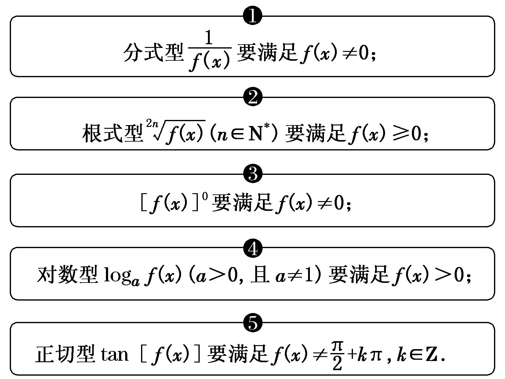
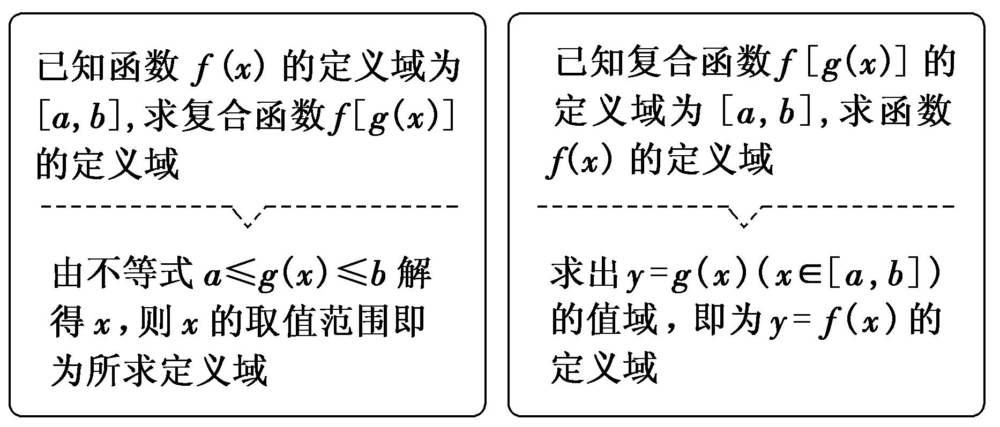
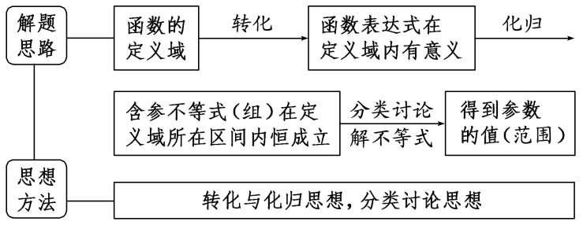

专题一　函数的定义域

1．函数的概念

一般地，设*A*，*B*是两个非空的数集，如果按照某种确定的对应关系*f*，使对于集合*A*中的任意一个数*x*，在集合*B*中都有唯一确定的数*f*(*x*)和它对应，那么就称*f*：*A*→*B*为从集合*A*到集合*B*的一个函数，记作*y*＝*f*(*x*)，*x*∈*A*．

2．函数的有关概念  
（1）函数的定义域、值域：在函数*y*＝*f*(*x*)，*x*∈*A*中，*x*叫做自变量，*x*的取值范围*A*叫做函数的定义域；与*x*的值相对应的*y*值叫做函数值，函数值的集合{*f*(*x*)|*x*∈*A*}叫做函数的值域．显然，值域是集合*B*的子集．  
（2）函数的三要素：定义域、值域和对应关系．  
（3）相等函数：如果两个函数的定义域和对应关系完全一致，则这两个函数相等，这是判断两函数相等的依据．

3．复合函数

一般地，对于两个函数*y*＝*f*(*u*)和*u*＝*g*(*x*)，如果通过变量*u*，*y*可以表示成*x*的函数，那么称这个函数为函数*y*＝*f*(*u*)和*u*＝*g*(*x*)的复合函数，记作*y*＝*f*(*g*(*x*))，其中*y*＝*f*(*u*)叫做复合函数*y*＝*f*(*g*(*x*))的外层函数，*u*＝*g*(*x*)叫做*y*＝*f*(*g*(*x*))的内层函数．

考点一　求给定解析式的函数的定义域

【方法总结】

常见函数定义域的类型

【例题选讲】

<strong>[例1]</strong> （1）函数<em>y</em>＝＋的定义域是(　　)

A．[－1，0)∪(0，1)　
B．[－1，0)∪(0，1]　
C．(－1，0)∪(0，1]　
D．(－1，0)∪(0，1)
答案　D　解析　由题意得解得－1<*x*<0或0<*x*<1．所以原函数的定义域为(－1，0)∪(0，1)．  
（2） 函数*y*＝的定义域为(　　)

A．(－1，3]　　　
B．(－1，0)∪(0，3]　　　
C．[－1，3]　　　
D．[－1，0)∪(0，3]
答案　B　解析　要使函数有意义，*x*需满足解得－1<*x*<0或0<*x*≤3，所以函数的定义域为(－1，0)∪(0，3]．  
（3） <em>y</em>＝－log2(4－<em>x</em>2)的定义域是(　　)

A．(－2，0)∪(1，2)　　
B．(－2，0]∪(1，2)　　
C．(－2，0)∪[1，2)　　
D．[－2，0]∪[1，2]
答案　C　解析　要使函数有意义，必须所以*x*∈(－2，0)∪[1，2)．  
（4） 函数*f*(*x*)＝＋的定义域为(　　)

A．{*x*|*x*<1}　　　　　
B．{*x*|0<*x*<1}　　　　　
C．{*x*|0<*x*≤1}　　　　　
D．{*x*|*x*>1}
答案　B　解析　要使函数有意义，则必须满足∴0<*x*<1．  
（5） 函数*f*(*x*)＝(*a*>0且*a*≠1)的定义域为\_\_\_\_\_\_\_\_．
答案　(0，2]　解析　由题意得解得即0<*x*≤2，故所求函数的定义域为(0，2]．

【对点训练】

1．下列函数中，与函数*y*＝的定义域相同的函数为(　　)

A．<em>y</em>＝　　　　　
B．<em>y</em>＝　　　　　
C．<em>y</em>＝<em>x</em>e<em>x</em>　　　　　
D．<em>y</em>＝

1．答案　D　解析　函数*y*＝的定义域为{*x*|*x*≠0}；*y*＝的定义域为{*x*|*x*≠*k*π，*k*∈Z}；*y*＝的定义

域为{<em>x</em>|<em>x</em>&gt;0}；<em>y</em>＝<em>x</em>e<em>x</em>的定义域为<strong>R</strong>；<em>y</em>＝的定义域为{<em>x</em>|<em>x</em>≠0}．故选D．

2．函数<em>y</em>＝log2(2<em>x</em>－4)＋的定义域是(　　)

A．(2，3)　　　　　
B．(2，＋∞)　　　　　
C．(3，＋∞)　　　　　
D．(2，3)∪(3，＋∞)

2．答案　D　解析　由题意，得解得<em>x</em>&gt;2且<em>x</em>≠3，所以函数<em>y</em>＝log2(2<em>x</em>－4)＋的定义域为(2，

3)∪(3，＋∞)．

3．函数*f*(*x*)＝＋的定义域为(　　)

A．[0，2)　　　　
B．(2，＋∞)　　　　
C．[0，2)∪(2，＋∞)　　　　
D．(－∞，2)∪(2，＋∞)

3．答案　C　解析　由题意得解得*x*≥0，且*x*≠2．

4．函数*f*(*x*)＝的定义域为(　　)

A．[1，10]　　　　
B．[1，2)∪(2，10]　　　　
C．(1，10]　　　　
D．(1，2)∪(2，10]

4．答案　D　解析　要使函数*f*(*x*)有意义，则*x*须满足即解得

1<*x*≤10，且*x*≠2，所以函数*f*(*x*)的定义域为(1，2)∪(2，10]．

5．函数*y*＝ln＋的定义域为\_\_\_\_\_\_\_\_．

5．答案　(0，1]　解析　　由⇒⇒0<*x*≤1．所以该函数的定义域为(0，1]．

考点二　求抽象函数的定义域

【方法总结】

求抽象函数定义域的方法

【例题选讲】

<strong>[例2]</strong> （1） 已知函数<em>f</em>(<em>x</em>)的定义域为(－1，0)，则函数<em>f</em>(2<em>x</em>＋1)的定义域为(　　)

A．(－1，1)　　　　
B．　　　　
C．(－1，0)　　　　
D．
答案　B　解析　令*u*＝2*x*＋1，由*f*(*x*)的定义域为(－1，0)，可知－1<*u*<0，即－1<2*x*＋1<0，得－1<*x*<－．  
（2） 已知函数*f*(*x*)的定义域为(－1，1)，则函数*g*(*x*)＝*f*＋*f*(*x*－1)的定义域为(　　)

A．(－2，0)　　　　　
B．(－2，2)　　　　　
C．(0，2)　　　　　
D．
答案　C　解析　由题意得∴∴0<*x*<2，∴函数*g*(*x*)＝*f*＋*f*(*x*－1)的定义域为(0，2)．  
（3） 已知函数*f*(*x*)的定义域为[0，2]，则函数*g*(*x*)＝*f*(2*x*)＋的定义域为(　　)

A．[0，1]　　　　
B．[0，2]　　　　
C．[1，2]　　　　
D．[1，3]
答案　A　解析　由题意，得解得0≤*x*≤1．故选A．  
（4） 已知函数<em>y</em>＝<em>f</em>(<em>x</em>2－1)的定义域为[－，]，则函数<em>y</em>＝<em>f</em>(<em>x</em>)的定义域为\_\_\_\_\_\_\_\_．
答案　[－1，2]　解析　因为<em>y</em>＝<em>f</em>(<em>x</em>2－1)的定义域为[－，]，所以<em>x</em>∈[－， ]，<em>x</em>2－1∈[－1，2]，所以<em>y</em>＝<em>f</em>(<em>x</em>)的定义域为[－1，2]．  
（5） 若函数<em>y</em>＝<em>f</em>(2<em>x</em>)的定义域为，则<em>y</em>＝<em>f</em>(log2<em>x</em>)的定义域为\_\_\_\_\_\_\_\_．

答案　[2，16]　解析　由题意可得<em>x</em>∈，则2<em>x</em>∈[，4]，log2<em>x</em>∈[，4]，解得<em>x</em>∈[2，16]，即<em>y</em>＝<em>f</em>(log2<em>x</em>)的定义域为[2，16]．

【对点训练】

6．已知函数*f*(*x*)＝，则函数*f*(3*x*－2)的定义域为(　　)

A．　　　　　　
B．　　　　　　
C．[－3，1]　　　　　　
D．

6．答案　A　解析　由－<em>x</em>2＋2<em>x</em>＋3≥0，解得－1≤<em>x</em>≤3，即<em>f</em>(<em>x</em>)的定义域为[－1，3]．由－1≤3<em>x</em>－2≤3，解得

≤*x*≤，则函数*f*(3*x*－2)的定义域为，故选A．

7．设函数*f*(*x*)＝lg(1－*x*)，则函数*f*[*f*(*x*)]的定义域为(　　)

A．(－9，＋∞)　　　　
B．(－9，1)　　　　
C．[－9，＋∞)　　　　
D．[－9，1)

7．答案　B　解析　*f*[*f*(*x*)]＝*f*[lg(1－*x*)]＝lg[1－lg(1－*x*)]，其定义域为的解集，解得－9<*x*

<1，所以*f*[*f*(*x*)]的定义域为(－9，1)．故选B．

8．已知函数*y*＝*f*(2*x*－1)的定义域是[0，1]，则函数的定义域是(　　)

A．[1，2]　　　　
B．(－1，1]　　　　
C．　　　　
D．(－1，0)

8．答案　D　解析　由*f*(2*x*－1)的定义域是[0，1]，得0≤*x*≤1，故－1≤2*x*－1≤1，∴*f*(*x*)的定义域是[－1，1]，
∴要使函数有意义，需满足解得－1<*x*<0．

9．若函数<em>f</em>(<em>x</em>＋1)的定义域为[0，1]，则<em>f</em>(2<em>x</em>－2)的定义域为(　　)

A．[0，1]　　　　　
B．[log23，2]　　　　　
C．[1，log23]　　　　　
D．[1，2]

9．答案　B　解析　∵<em>f</em>(<em>x</em>＋1)的定义域为[0，1]，即0≤<em>x</em>≤1，∴1≤<em>x</em>＋1≤2．∵<em>f</em>(<em>x</em>＋1)与<em>f</em>(2<em>x</em>－2)是同一个对

应关系<em>f</em>，∴2<em>x</em>－2与<em>x</em>＋1的取值范围相同，即1≤2<em>x</em>－2≤2，也就是3≤2<em>x</em>≤4，解得log23≤<em>x</em>≤2．∴函数<em>f</em>(2<em>x</em>－2)的定义域为[log23，2]．

考点三　已知函数定义域求参数

【方法总结】
解决已知定义域求参数问题的思路方法

【例题选讲】

<strong>[例3]</strong> （1） 若函数<em>f</em>(<em>x</em>)＝的定义域为实数集<strong>R</strong>，则实数<em>a</em>的取值范围为\_\_\_\_\_\_\_\_\_．
答案　[－2，2]　解析　若函数<em>f</em>(<em>x</em>)＝的定义域为实数集<strong>R</strong>，则<em>x</em>2＋<em>ax</em>＋1≥0恒成立，即<em>Δ</em>＝<em>a</em>2－4≤0，解得－2≤<em>a</em>≤2，即实数<em>a</em>的取值范围是[－2，2]．  
（2） 若函数*f*(*x*)＝的定义域为一切实数，则实数*m*的取值范围是(　　)

A．[0，4)　　　　　
B．(0，4)　　　　　
C．[4，＋∞)　　　　　
D．[0，4]
答案　D　解析　由题意可得<em>mx</em>2＋<em>mx</em>＋1≥0恒成立．当<em>m</em>＝0时，1≥0恒成立；当<em>m</em>≠0时，则解得0&lt;<em>m</em>≤4．综上可得：0≤<em>m</em>≤4．

  
（3） 若函数<em>f</em>(<em>x</em>)＝的定义域为<strong>R</strong>，则<em>a</em>的取值范围为\_\_\_\_\_\_\_\_．

答案　[－1，0]　解析　因为函数<em>f</em>(<em>x</em>)的定义域为<strong>R</strong>，所以2－1≥0对<em>x</em>∈<strong>R</strong>恒成立，即2≥20，<em>x</em>2＋2<em>ax</em>－<em>a</em>≥0恒成立，因此有<em>Δ</em>＝(2<em>a</em>)2＋4<em>a</em>≤0，解得－1≤<em>a</em>≤0．  
（4） 若函数<em>y</em>＝的定义域为<strong>R</strong>，则实数<em>m</em>的取值范围是(　　)

A．　　　　　
B．　　　　　
C．　　　　　
D．
答案　D　解析　∵函数<em>y</em>＝的定义域为<strong>R</strong>，∴<em>mx</em>2＋4<em>mx</em>＋3≠0，∴<em>m</em>＝0或即<em>m</em>＝0或0&lt;<em>m</em>&lt;，∴实数<em>m</em>的取值范围是．

【对点训练】

10．函数<em>y</em>＝ln(<em>x</em>2－<em>x</em>－<em>m</em>)的定义域为<strong>R</strong>，则<em>m</em>的范围是\_\_\_\_\_\_\_\_．

10．答案　　解析　由条件知，<em>x</em>2－<em>x</em>－<em>m</em>&gt;0对<em>x</em>∈<strong>R</strong>恒成立，即<em>Δ</em>＝1＋4<em>m</em>&lt;0，∴<em>m</em>&lt;－．

11．若函数*f*(*x*)＝的定义域为{*x*|1≤*x*≤2}，则*a*＋*b*的值为\_\_\_\_\_\_\_\_．

11．答案　－　解析　函数<em>f</em>(<em>x</em>)的定义域是不等式<em>ax</em>2＋<em>abx</em>＋<em>b</em>≥0的解集．不等式<em>ax</em>2＋<em>abx</em>＋<em>b</em>≥0的解集

为{*x*|1≤*x*≤2}，所以解得所以*a*＋*b*＝－－3＝－．

12．若函数<em>y</em>＝的定义域为<strong>R</strong>，则实数<em>a</em>的取值范围是\_\_\_\_\_\_\_\_．

12．答案　[0，3)　解析　因为函数<em>y</em>＝的定义域为<strong>R</strong>，所以<em>ax</em>2＋2<em>ax</em>＋3＝0无实数解，即函

数<em>u</em>＝<em>ax</em>2＋2<em>ax</em>＋3的图象与<em>x</em>轴无交点．当<em>a</em>＝0时，函数<em>u</em>＝3的图象与<em>x</em>轴无交点；当<em>a</em>≠0时，则<em>Δ</em>＝(2<em>a</em>)2－4·3<em>a</em>＜0，解得0＜<em>a</em>＜3．综上所述，<em>a</em>的取值范围是[0，3)．

