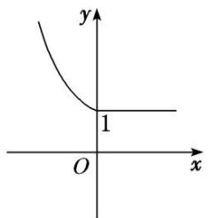

# 专题二 函数的解析式与分段函数

#### 1. 函数的表示方法

函数的表示方法有三种，分别为解析法、列表法和图象法．同一个函数可以用不同的方法表示.

#### 2. 应用三种方法表示函数的注意事项  
（1）解析法：一般情况下，必须注明函数的定义域；  
（2）列表法：选取的自变量要有代表性，应能反映定义域的特征；  
（3）图象法：注意定义域对图象的影响．与 $x$ 轴垂直的直线与其最多有一个公共点.

#### 3. 函数的三种表示方法的优缺点

<table><tr><td></td><td>优点</td><td>缺点</td></tr><tr><td>解析法</td><td>简明扼要,规范准确</td><td>（1）有些函数关系很难或不能用解析式表示;（2）求x与y的对应关系时需逐个计算,比较繁杂</td></tr><tr><td>列表法</td><td>能鲜明地显示自变量与函数值之间的数量关系</td><td>只能列出部分自变量及其对应的函数值,难以反映函数变化的全貌</td></tr><tr><td>图象法</td><td>形象直观,能清晰地呈现函数的增减变化、点的对称关系、最大(小)值等性质</td><td>作出的图象是近似的、局部的,且根据图象确定的函数值往往有误差</td></tr></table>

#### 4. 分段函数
若函数在其定义域内，对于定义域内的不同取值区间，有着不同的对应关系，这样的函数通常叫做分段函数.

#### 5. 分段函数的相关结论  
（1）分段函数虽由几个部分组成，但它表示的是一个函数.  
（2）分段函数的定义域等于各段函数的定义域的并集，值域等于各段函数的值域的并集.  
（3）各段函数的定义域不可以相交.

# 考点一 求函数的解析式

# 【方法总结】

# 函数解析式的常见求法  
（1）配凑法：已知 $f(h(x)) = g(x)$ ，求 $f(x)$ 的问题，往往把右边的 $g(x)$ 整理或配凑成只含 $h(x)$ 的式子，然后用 $x$ 将 $h(x)$ 代换.  
（2）换元法：已知 $f(h(x)) = g(x)$ ，求 $f(x)$ 时，往往可设 $h(x) = t$ ，从中解出 $x$ ，代入 $g(x)$ 进行换元．应用换元法时要注意新元的取值范围.  
（3）待定系数法：已知函数的类型(如一次函数、二次函数)可用待定系数法，比如二次函数 $f(x)$ 可设为 $f(x)=ax^{2}+bx+c(a\neq0)$ ，其中a，b，c是待定系数，根据题设条件，列出方程组，解出a，b，c即可.  
（4）解方程组法：已知 $f(x)$ 满足某个等式，这个等式除 $f(x)$ 是未知量外，还有其他未知量，如 $f\left(\frac{1}{x}\right)$ (或 $f(-x)$ ) 等，可根据已知等式再构造其他等式组成方程组，通过解方程组求出 $f(x)$ .

# 【例题选讲】

[例 1] （1） 已知 $f(\frac{1+x}{x})=\frac{x^{2}+1}{x^{2}}+\frac{1}{x}$ ，则 $f(x)=$ \_\_\_\_；  
（2） 已知 $f(\frac{2}{x}+1)=\lg x$ ，则 $f(x)=$ \_\_\_\_；  
（3） 已知 $f(x)$ 是二次函数，且 $f(0)=2,\quad f(x+1)=f(x)+x+3$ ，则 $f(x)=$ \_\_\_\_；  
（4） 已知函数 $f(x)$ 满足 $f(-x)+2f(x)=2^{x}$ ，则 $f(x)=$ \_\_\_\_；  
（5） 若函数 $f(x)$ 满足方程 $af(x)+f\left(\frac{1}{x}\right)=ax,\quad x\in\mathbb{R}$ ，且 $x\neq0,\quad a$ 为常数， $a\neq\pm1$ ，且 $a\neq0$ ，则 $f(x)=$ \_\_\_\_.

# 【对点训练】

1. 已知 $f(\sqrt{x} + 1) = x + 2\sqrt{x}$ ，则 $f(x) =$ \_\_\_\_.

2. 已知函数 $f(x - 1) = \frac{x}{x + 1}$ ，则函数 $f(x)$ 的解析式为（）

A. $f(x)=\frac{x+1}{x+2}$

B. $f(x)=\frac{x}{x+1}$

C. $f(x)=\frac{x-1}{x}$

D. $f(x)=\frac{1}{x+2}$

3. 已知 $f(x+\frac{1}{x})=x^{2}+\frac{1}{x^{2}}$ ，则 $f(x)=$ \_\_\_\_.

4. 若二次函数 $g(x)$ 满足 $g(1) = 1$ ， $g(-1) = 5$ ，且图象过原点，则 $g(x)$ 的解析式为（）

A. $g(x)=2x^{2}-3x$

B. $g(x)=3x^{2}-2x$

C. $g(x)=3x^{2}+2x$

D. $g(x) = -3x^{2} - 2x$

5. 定义在 $(-1, 1)$ 内的函数 $f(x)$ 满足 $2f(x) - f(-x) = \lg (x + 1)$ ，则 $f(x) =$ \_\_\_\_.

6. 已知 $f(x)$ 满足 $2f(x)+f\left(\frac{1}{x}\right)=3x$ ，则 $f(x)=$ \_\_\_\_.

7. 定义在 $\mathbf{R}$ 上的函数 $f(x)$ 满足 $f(x + 1) = 2f(x)$ . 若当 $0 \leq x \leq 1$ 时, $f(x) = x(1 - x)$ , 则当 $-1 \leq x \leq 0$ 时, $f(x) = \_$ .

# 考点二 分段函数求值

# 【方法总结】

# 求分段函数的函数值的策略  
（1）求分段函数的函数值时，要先确定要求值的自变量属于哪一区间，然后代入该区间对应的解析式求值；  
（2）当出现 $f(f(a))$ 的形式时，应从内到外依次求值，直到求出具体值为止；  
（3）当自变量的值所在区间不确定时，要分类讨论，分类标准应参照分段函数不同段的端点；  
（4）求值时注意函数奇偶性、周期性的应用.

# 【例题选讲】

[例 2] （1） 已知函数 $f(x)=\left\{\begin{aligned}x+\frac{1}{x-2},&x>2,\\ x^{2}+2,&x\leq2,\end{aligned}\right.$ 则 $f[f(1)]=(\quad)$

A. $-\frac{1}{2}$

B. 2

C. 4

D. 11  
（2） (2015·全国II) 设函数 $f(x)=\left\{\begin{aligned}1+\log_{2}(2-x), & x<1, \\ 2^{x-1}, & x\geq1,\end{aligned}\right.$ 则 $f(-2)+f(\log_{2}12)=(\quad)$

A. 3

B. 6

C. 9

D. 12  
（3） 已知 $f(x)=\left\{\begin{aligned}\log_{3}x,&x>0,\\ a^{x}+b,&x\leq0\end{aligned}\right.$ $(0<a<1)$ ，且 $f(-2)=5,\quad f(-1)=3$ ，则 $f(f(-3))=(\quad)$

A.-2

B. 2

C. 3

D.-3  
（4） 已知 $f(x)=\left\{\begin{aligned}x-3,&x\geq9,\\ f(f(x+4)),&x<9,\end{aligned}\right.$ 则 $f(7)=$ \_\_\_\_.  
（5） (2017·山东) 设 $f(x)=\left\{\begin{aligned}\sqrt{x},&0<x<1,\\ 2(x-1),&x\geq1,\end{aligned}\right.$ 若 $f(a)=f(a+1)$ ，则 $f\left(\frac{1}{a}\right)=(\quad)$

A. 2

B. 4

C. 6

D. 8

# 【对点训练】

8. 设 $f(x) = \begin{cases} 1 - \sqrt{x}, & x \geq 0, \\ 2^x, & x < 0, \end{cases}$ 则 $f(f(-2)) = (\quad)$

A. -1

B. $\frac{1}{4}$

C. $\frac{1}{2}$

D. $\frac{3}{2}$

9. 已知函数 $f(x) = \begin{cases} \sqrt{3}\sin \pi x, & x \leq 0, \\ f(x - 1) + 1, & x > 0, \end{cases}$ 则 $f\left(\frac{2}{3}\right)$ 的值为（）

A. $\frac{1}{2}$

B. $-\frac{1}{2}$

C. 1

D. -1

10. 已知函数 $f(x) = \begin{cases} \left(\frac{1}{2}\right)^x, & x \geq 4, \\ f(x + 1), & x < 4, \end{cases}$ 则 $f(1 + \log_2 5)$ 的值为（）

A. $\frac{1}{4}$

B. $\left(\frac{1}{2}\right)1+\log_{2}5$

C. $\frac{1}{2}$

D. $\frac{1}{20}$

11. 已知函数 $f(x) = \begin{cases} f(x - 4), & x > 2, \\ e^x, & -2 \leq x \leq 2, \\ f(-x), & x < -2, \end{cases}$ 则 $f(-2019) = (\quad)$

A. $\mathrm{e}^2$

B. e

C. 1

D. $\frac{1}{e}$

# 考点三 求参数或自变量的值或范围

# 【方法总结】

# 已知函数值(或范围)求自变量的值(或范围)的方法  
（1）根据每一段的解析式分别求解，但要注意检验所求自变量的值(或范围)是否符合相应段的自变量的取值范围，最后将各段的结果合起来(求并集)即可；  
（2）如果分段函数的图象易得, 也可以画出函数图象后结合图象求解.

# 【例题选讲】

[例 3] （1） 已知函数 $f(x)=\left\{\begin{aligned}&2^{x},&x\leq0,\\&|\log_{2}x|,&x>0,\end{aligned}\right.$ 则使 $f(x)=2$ 的 x 的集合是()

A. $\left\{\frac{1}{4},4\right\}$

B. $\{1, 4\}$

C. $\left\{1,\frac{1}{4}\right\}$

D. $\left\{1,\frac{1}{4},4\right\}$  
（2） 函数 $f(x) = \begin{cases} \sin & \pi x^2 \\ e^{x - 1}, & x \geq 0 \end{cases}$ ， $-1 < x < 0$ ，满足 $f(1) + f(a) = 2$ ，则 $a$ 的所有可能取值为（）

A. 1 或 $-\frac{\sqrt{2}}{2}$

B. $-\frac{\sqrt{2}}{2}$

C. 1

D. 1 或 $\frac{\sqrt{2}}{2}$  
（3） (2017·全国III) 设函数 $f(x)=\left\{\begin{aligned}x+1,&x\leq0,\\ 2^{x},&x>0,\end{aligned}\right.$ 则满足 $f(x)+f\left(\frac{x-1}{2}\right)>1$ 的 x 的取值范围是 \_\_\_\_.  
（4） (2018·全国I)设函数 $f(x)=\left\{\begin{aligned}2^{-x},&x\leq0,\\ 1,&x>0,\end{aligned}\right.$ 则满足 $f(x+1)<f(2x)$ 的x的取值范围是()

A. $(-\infty, -1]$

B. $(0, +\infty)$

C. $(-1, 0)$

D. $(-\infty, 0)$

  
（5） 设函数 $f(x) = \begin{cases} 3x - 1, & x < 1, \\ 2^x, & x \geq 1, \end{cases}$ 则满足 $f(f(a)) = 2^{f(a)}$ 的 $a$ 的取值范围是（）

A. $\left[\frac{2}{3},1\right]$

B. $[0, 1]$

C. $\left[\frac{2}{3},+\infty\right]$

D. $[1, +\infty)$

# 【对点训练】

12. 已知函数 $f(x)=\left\{\begin{aligned}&2x+1,&x\geq0,\\ &3x^{2},&x<0,\end{aligned}\right.$ 且 $f(x_{0})=3$ ，则实数 $x_{0}$ 的值为 \_\_\_\_.  
13. 已知函数 $f(x) = \begin{cases} \log_2 x + a, & x > 0, \\ 4^{x - 2} - 1, & x \leq 0. \end{cases}$ 若 $f(a) = 3$ ，则 $f(a - 2) = (\quad)$

A. $-\frac{15}{16}$

B. 3

C. $-\frac{63}{64}$ 或 3

D. $-\frac{15}{16}$ 或 3

14. 已知函数 $f(x) = \begin{cases} x^2 + x, & x \geq 0, \\ -3x, & x < 0. \end{cases}$ 若 $a[f(a) - f(-a)] > 0$ ，则实数 $a$ 的取值范围为（）

A. $(1, +\infty)$

B. $(2, +\infty)$

C. $(-\infty, -1) \cup (1, +\infty)$

D. $(-\infty, -2) \cup (2, +\infty)$

15. 已知函数 $f(x) = \begin{cases} \log_2(x + 1), & x \geq 1, \\ 1, & x < 1, \end{cases}$ 则满足 $f(2x + 1) < f(3x - 2)$ 的实数 $x$ 的取值范围是（）

A. $(-∞, 0]$

B. $(3, +\infty)$

C. $[1, 3)$

D. $(0, 1)$

16. (2013·全国I)已知函数 $f(x) = \begin{cases} -x^2 + 2x, & x \leq 0, \\ \ln (x + 1), & x > 0. \end{cases}$ 若 $|f(x)| \geq ax$ ，则 $a$ 的取值范围是( )

A. $(-∞, 0]$

B. $(-∞, 1]$

C. $[-2, 1]$

D. $[-2, 0]$

