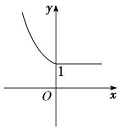

# 专题二 函数的解析式与分段函数

#### 1. 函数的表示方法

函数的表示方法有三种，分别为解析法、列表法和图象法．同一个函数可以用不同的方法表示.

#### 2. 应用三种方法表示函数的注意事项  
（1）解析法：一般情况下，必须注明函数的定义域；  
（2）列表法：选取的自变量要有代表性，应能反映定义域的特征；  
（3）图象法：注意定义域对图象的影响．与 $x$ 轴垂直的直线与其最多有一个公共点.

#### 3. 函数的三种表示方法的优缺点

<table><tr><td></td><td>优点</td><td>缺点</td></tr><tr><td>解析法</td><td>简明扼要,规范准确</td><td>（1）有些函数关系很难或不能用解析式表示;（2）求x与y的对应关系时需逐个计算,比较繁杂</td></tr><tr><td>列表法</td><td>能鲜明地显示自变量与函数值之间的数量关系</td><td>只能列出部分自变量及其对应的函数值,难以反映函数变化的全貌</td></tr><tr><td>图象法</td><td>形象直观,能清晰地呈现函数的增减变化、点的对称关系、最大(小)值等性质</td><td>作出的图象是近似的、局部的,且根据图象确定的函数值往往有误差</td></tr></table>

#### 4. 分段函数
若函数在其定义域内，对于定义域内的不同取值区间，有着不同的对应关系，这样的函数通常叫做分段函数.

#### 5. 分段函数的相关结论  
（1）分段函数虽由几个部分组成，但它表示的是一个函数.  
（2）分段函数的定义域等于各段函数的定义域的并集，值域等于各段函数的值域的并集.  
（3）各段函数的定义域不可以相交.

# 考点一 求函数的解析式

# 【方法总结】

# 函数解析式的常见求法  
（1）配凑法：已知 $f(h(x)) = g(x)$ ，求 $f(x)$ 的问题，往往把右边的 $g(x)$ 整理或配凑成只含 $h(x)$ 的式子，然后用 $x$ 将 $h(x)$ 代换.  
（2）换元法：已知 $f(h(x)) = g(x)$ ，求 $f(x)$ 时，往往可设 $h(x) = t$ ，从中解出 $x$ ，代入 $g(x)$ 进行换元．应用换元法时要注意新元的取值范围.  
（3）待定系数法：已知函数的类型(如一次函数、二次函数)可用待定系数法，比如二次函数 $f(x)$ 可设为 $f(x)=ax^{2}+bx+c(a\neq0)$ ，其中a，b，c是待定系数，根据题设条件，列出方程组，解出a，b，c即可.  
（4）解方程组法：已知 $f(x)$ 满足某个等式，这个等式除 $f(x)$ 是未知量外，还有其他未知量，如 $f\left(\frac{1}{x}\right)$ (或 $f(-x)$ ) 等，可根据已知等式再构造其他等式组成方程组，通过解方程组求出 $f(x)$ .

# 【例题选讲】

[例 1] （1） 已知 $f(\frac{1+x}{x})=\frac{x^{2}+1}{x^{2}}+\frac{1}{x}$ ，则 $f(x)=$ \_\_\_\_；
答案 $x^{2} - x + 1$ 解析 (配凑法) $f\left(\frac{1 + x}{x}\right) = \frac{x^2 + 1}{x^2} + \frac{1}{x} = \left(\frac{x + 1}{x}\right)^2 - \frac{x + 1}{x} + 1.$ 令 $\frac{x + 1}{x} = t(t \neq 1)$ ，得 $f(t) = t^2 - t + 1$ ，即 $f(x) = x^2 - x + 1$ 。  
（2） 已知 $f(\frac{2}{x}+1)=\lg x$ ，则 $f(x)=$ \_\_\_\_；
答案 $\lg \frac{2}{x - 1} (x > 1)$ 解析 (换元法)令 $\frac{2}{x} + 1 = t$ ，得 $x = \frac{2}{t - 1}$ ，代入得 $f(t) = \lg \frac{2}{t - 1}$ ，又 $x > 0$ ，所以 $t > 1$ ，故 $f(x)$ 的解析式是 $f(x) = \lg \frac{2}{x - 1}$ ， $x \in (1, +\infty)$ .  
（3） 已知 $f(x)$ 是二次函数，且 $f(0)=2,\quad f(x+1)=f(x)+x+3$ ，则 $f(x)=$ \_\_\_\_；
答案 $\frac{1}{2} x^2 +\frac{5}{2} x + 2$ 解析（待定系数法)设 $f(x) = ax^{2} + bx + c(a\neq 0)$ ，由 $f(0) = c = 2$ ，得 $f(x) = ax^{2} + bx + 2$ 则 $f(x + 1) - f(x) = a(x + 1)^2 +b(x + 1) + 2 - ax^2 -bx - 2 = 2ax + a + b = x + 3$ ，所以 $2a = 1$ ，且 $a + b = 3$ ，解得 $a$ $= \frac{1}{2},b = \frac{5}{2}$ 故 $f(x) = \frac{1}{2} x^{2} + \frac{5}{2} x + 2.$  
（4） 已知函数 $f(x)$ 满足 $f(-x)+2f(x)=2^{x}$ ，则 $f(x)=$ \_\_\_\_；
答案 $\frac{2^{x + 1} - 2^{-x}}{3}$ 解析 (解方程组法)由 $f(-x) + 2f(x) = 2^x$ ，①．得 $f(x) + 2f(-x) = 2^{-x}$ ，②．①×2-②，得 $3f(x) = 2^{x + 1} - 2^{-x}$ .即 $f(x) = \frac{2^{x + 1} - 2^{-x}}{3}$ 故 $f(x)$ 的解析式是 $f(x) = \frac{2^{x + 1} - 2^{-x}}{3} (x\in \mathbf{R})$  
（5） 若函数 $f(x)$ 满足方程 $af(x) + f\left(\frac{1}{x}\right) = ax, x \in \mathbf{R}$ ，且 $x \neq 0$ ， $a$ 为常数， $a \neq \pm 1$ ，且 $a \neq 0$ ，则 $f(x) =$ \_\_\_\_.
答案 $\frac{a(ax^{2}-1)}{(a^{2}-1)x}$ 解析 (解方程组法) 因为 $af(x)+f\left(\frac{1}{x}\right)=ax$ ，所以 $af\left(\frac{1}{x}\right)+f(x)=\frac{a}{x}$ ，两方程联立解得 $f(x)=\frac{a(ax^{2}-1)}{(a^{2}-1)x}$ .

# 【对点训练】

1. 已知 $f(\sqrt{x} + 1) = x + 2\sqrt{x}$ ，则 $f(x) =$ \_\_\_\_.

1. 答案 $x^{2} - 1(x \geq 1)$ 解析 设 $t = \sqrt{x} + 1$ ，则 $x = (t - 1)^{2}$ ， $t \geq 1$ ，代入原式有 $f(t) = (t - 1)^{2} + 2(t - 1) = t^{2} - 2t + 1 + 2t - 2 = t^{2} - 1$ 。故 $f(x) = x^{2} - 1$ ， $x \geq 1$ .

2. 已知函数 $f(x - 1) = \frac{x}{x + 1}$ ，则函数 $f(x)$ 的解析式为（）

A. $f(x)=\frac{x+1}{x+2}$

B. $f(x)=\frac{x}{x+1}$

C. $f(x)=\frac{x-1}{x}$

D. $f(x)=\frac{1}{x+2}$

2. 答案 A 解析 令 x-1=t，则 $x=t+1$ ，∴ $f(t)=\frac{t+1}{t+2}$ ，即 $f(x)=\frac{x+1}{x+2}$ 。故选 A.

3. 已知 $f(x+\frac{1}{x})=x^{2}+\frac{1}{x^{2}}$ ，则 $f(x)=$ \_\_\_\_.

3. 答案 $x^{2} - 2 (x \geq 2$ 或 $x \leq -2)$ 解析 由于 $f(x + \frac{1}{x}) = x^{2} + \frac{1}{x^{2}} = \left(x + \frac{1}{x}\right)^{2} - 2$ ，所以 $f(x) = x^{2} - 2$ ， $x \geq 2$ 或 $x \leq -2$ ，故 $f(x)$ 的解析式是 $f(x) = x^{2} - 2$ ， $x \geq 2$ 或 $x \leq -2$ .

4. 若二次函数 $g(x)$ 满足 $g(1) = 1$ ， $g(-1) = 5$ ，且图象过原点，则 $g(x)$ 的解析式为（）

A. $g(x)=2x^{2}-3x$

B. $g(x) = 3x^{2} - 2x$

C. $g(x) = 3x^{2} + 2x$

D. $g(x) = -3x^{2} - 2x$

4. 答案 B 解析 二次函数 $g(x)$ 满足 $g(1) = 1$ , $g(-1) = 5$ ，且图象过原点，可设二次函数 $g(x)$ 的解析式为 $g(x) = ax^2 + bx (a \neq 0)$ ，可得 $\begin{cases} a + b = 1, \\ a - b = 5, \end{cases}$ 解得 $a = 3$ , $b = -2$ ，所以二次函数 $g(x)$ 的解析式为 $g(x) = 3x^2 - 2x$ . 故选 B.

5. 定义在 $(-1, 1)$ 内的函数 $f(x)$ 满足 $2f(x) - f(-x) = \lg (x + 1)$ ，则 $f(x) =$ \_\_\_\_.

5. 答案 $\frac{2}{3}\lg (x + 1) + \frac{1}{3}\lg (1 - x)(-1 < x < 1)$ 解析 当 $x\in (-1, 1)$ 时，有 $2f(x) - f(-x) = \lg (x + 1)$ . ①，将 $x$ 换成 $-x$ ，则 $-x$ 换成 $x$ ，得 $2f(-x) - f(x) = \lg (-x + 1)$ . ②，由①②消去 $f(-x)$ 得， $f(x) = \frac{2}{3}\lg (x + 1) + \frac{1}{3}\lg (1 - x)(-1 < x < 1)$ .

6. 已知 $f(x)$ 满足 $2f(x)+f\left(\frac{1}{x}\right)=3x$ ，则 $f(x)=$ \_\_\_\_.

6. 答案 $2x - \frac{1}{x} (x \neq 0)$ 解析 $\because 2f(x) + f\left(\frac{1}{x}\right) = 3x$ ，①．把①中的 $x$ 换成 $\frac{1}{x}$ ，得 $2f\left(\frac{1}{x}\right) + f(x) = \frac{3}{x}$ . ②．联立①②可得 $\begin{cases} 2f(x) + f\left(\frac{1}{x}\right) = 3x, \\ 2f\left(\frac{1}{x}\right) + f(x) = \frac{3}{x}, \end{cases}$ 解此方程组可得 $f(x) = 2x - \frac{1}{x} (x \neq 0)$ .

7. 定义在 $\mathbf{R}$ 上的函数 $f(x)$ 满足 $f(x + 1) = 2f(x)$ . 若当 $0 \leq x \leq 1$ 时, $f(x) = x(1 - x)$ , 则当 $-1 \leq x \leq 0$ 时, $f(x) = \_$ .

7. 答案 $-\frac{1}{2}x(x+1)$ 解析 $\because -1 \leq x \leq 0, \therefore 0 \leq x + 1 \leq 1, \therefore f(x) = \frac{1}{2}f(x+1) = \frac{1}{2}(x+1)[1-(x+1)] = -\frac{1}{2}x(x+1).$ 故当 $-1\leq x\leq0$ 时， $f(x)=-\frac{1}{2}x(x+1)$ .

# 考点二 分段函数求值

# 【方法总结】

# 求分段函数的函数值的策略  
（1）求分段函数的函数值时，要先确定要求值的自变量属于哪一区间，然后代入该区间对应的解析式求值；  
（2）当出现 $f(f(a))$ 的形式时，应从内到外依次求值，直到求出具体值为止；  
（3）当自变量的值所在区间不确定时，要分类讨论，分类标准应参照分段函数不同段的端点；  
（4）求值时注意函数奇偶性、周期性的应用.

# 【例题选讲】

[例 2] （1） 已知函数 $f(x)=\left\{\begin{aligned}x+\frac{1}{x-2},&x>2,\\ x^{2}+2,&x\leq2,\end{aligned}\right.$ 则 $f[f(1)]=(\quad)$

A. $-\frac{1}{2}$

B. 2

C. 4

D. 11
答案 C 解析 $\because$ 函数 $f(x) = \begin{cases} x + \frac{1}{x - 2}, & x > 2, \\ x^2 + 2, & x \leq 2, \end{cases}$ . $\therefore f(1) = 1^2 + 2 = 3$ , $\therefore f[f(1)] = f(3) = 3 + \frac{1}{3 - 2} = 4$ . 故选 C.  
（2） (2015·全国II) 设函数 $f(x)=\left\{\begin{aligned}1+\log_{2}(2-x), & x<1,\\ 2^{x-1}, & x\geq1,\end{aligned}\right.$ 则 $f(-2)+f(\log_{2}12)=(\quad)$

A. 3

B. 6

C. 9

D. 12
答案 C 解析 $\because -2<1,\quad\therefore f(-2)=1+\log_{2}(2+2)=1+\log_{2}4=1+2=3.\quad\because\log_{2}12>1,\quad\therefore f(\log_{2}12)=2\log_{2}12-1=\frac{12}{2}=6.\quad\therefore f(-2)+f(\log_{2}12)=3+6=9.$  
（3） 已知 $f(x) = \begin{cases} \log_3 x, & x > 0, \\ a^x + b, & x \leq 0 \end{cases}$ ( $0 < a < 1$ ), 且 $f(-2) = 5$ , $f(-1) = 3$ , 则 $f(f(-3)) = ($ )

A.-2

B. 2

C. 3

D.-3
答案 B 解析 由题意得, $f(-2) = a^{-2} + b = 5$ , ①. $f(-1) = a^{-1} + b = 3$ , ②. 联立①②, 结合 $0 < a < 1$ , 得 $a = \frac{1}{2}$ , $b = 1$ , 所以 $f(x) = \begin{cases} \log_3 x, & x > 0, \\ \left(\frac{1}{2}\right)^x + 1, & x \leq 0, \end{cases}$ 则 $f(-3) = \left(\frac{1}{2}\right)^{-3} + 1 = 9$ , $f(f(-3)) = f(9) = \log_3 9 = 2$ .  
（4） 已知 $f(x)=\left\{\begin{aligned}x-3,&x\geq9,\\ f(f(x+4)),&x<9,\end{aligned}\right.$ 则 $f(7)=$ \_\_\_\_.
答案 6 解析 $\because 7 < 9, \therefore f(7) = f(f(7 + 4)) = f(f(11)) = f(11 - 3) = f(8)$ . 又 $\because 8 < 9, \therefore f(8) = f(f(12)) = f(9) = 9 - 3 = 6$ . 即 $f(7) = 6$ .  
（5） (2017·山东) 设 $f(x)=\left\{\begin{aligned}\sqrt{x},&0<x<1,\\ 2(x-1),&x\geq1,\end{aligned}\right.$ 若 $f(a)=f(a+1)$ ，则 $f\left(\frac{1}{a}\right)=(\quad)$

A. 2

B. 4

C. 6

D. 8
答案 C 解析 当 0<a<1 时， $a+1>1$ ， $f(a)=\sqrt{a}$ ， $f(a+1)=2(a+1-1)=2a$ ，因为 $f(a)=f(a+1)$ ，所以 $\sqrt{a}=2a$ ，解得 $a=\frac{1}{4}$ 或 a=0（舍去），所以 $f\left(\frac{1}{a}\right)=f(4)=2\times(4-1)=6$ ；当 $a\geq1$ 时， $a+1\geq2$ ，所以 $f(a)=2(a-1)$ ， $f(a+1)=2(a+1-1)=2a$ ，所以 $2(a-1)=2a$ ，无解；综上， $f\left(\frac{1}{a}\right)=6$ 。故选 C.

# 【对点训练】

8. 设 $f(x) = \begin{cases} 1 - \sqrt{x}, & x \geq 0, \\ 2^x, & x < 0, \end{cases}$ 则 $f(f(-2)) = (\quad)$

A. -1

B. $\frac{1}{4}$

C. $\frac{1}{2}$

D. $\frac{3}{2}$

8. 答案 C 解析 因为 $f(-2)=2^{-2}=\frac{1}{4}$ ，所以 $f(f(-2))=f\left(\frac{1}{4}\right)=1-\sqrt{\frac{1}{4}}=\frac{1}{2}$ ，故选 C.

9. 已知函数 $f(x) = \begin{cases} \sqrt{3}\sin \pi x, & x \leq 0, \\ f(x - 1) + 1, & x > 0, \end{cases}$ 则 $f\left(\frac{2}{3}\right)$ 的值为（）

A. $\frac{1}{2}$

B. $-\frac{1}{2}$

C. 1

D. -1

9. 答案 B 解析 $f\left(\frac{2}{3}\right)=f\left(-\frac{1}{3}\right)+1=\sqrt{3}\sin\left(-\frac{\pi}{3}\right)+1=-\frac{1}{2}.$

10. 已知函数 $f(x) = \begin{cases} \left(\frac{1}{2}\right)^x, & x \geq 4, \\ f(x + 1), & x < 4, \end{cases}$ 则 $f(1 + \log_2 5)$ 的值为（）

A. $\frac{1}{4}$

B. $\left(\frac{1}{2}\right)1+\log_{2}5$

C. $\frac{1}{2}$

D. $\frac{1}{20}$

10. 答案 D 解析 因为 $2 < \log_2 5 < 3$ ，所以 $3 < 1 + \log_2 5 < 4$ ，则 $4 < 2 + \log_2 5 < 5$ ，则 $f(1 + \log_2 5) = f(1 + \log_2 5 + 1) = f(2 + \log_2 5) = \left(\frac{1}{2}\right)^{2 + \log_2 5} = \frac{1}{4} \times \left(\frac{1}{2}\right)\log_2 5 = \frac{1}{4} \times \frac{1}{5} = \frac{1}{20}$ ，故选 D.

11. 已知函数 $f(x) = \begin{cases} f(x - 4), & x > 2, \\ \mathrm{e}^x, & -2 \leq x \leq 2, \\ f(-x), & x < -2, \end{cases}$ 则 $f(-2019) = (\quad)$

A. $e^{2}$

B. e

C. 1

D. $\frac{1}{e}$

11. 答案 D 解析 当 x<-2 时， $f(-2019)=f(2019)$ ，当 x>2 时，函数周期为 4， $f(2019)=f(-1)=\frac{1}{e}$ .

# 考点三 求参数或自变量的值或范围

# 【方法总结】

# 已知函数值(或范围)求自变量的值(或范围)的方法  
（1）根据每一段的解析式分别求解，但要注意检验所求自变量的值(或范围)是否符合相应段的自变量的取值范围，最后将各段的结果合起来(求并集)即可；  
（2）如果分段函数的图象易得，也可以画出函数图象后结合图象求解.

# 【例题选讲】

[例 3] （1） 已知函数 $f(x)=\left\{\begin{aligned}&2^{x},&x\leq0,\\&|\log_{2}x|,&x>0,\end{aligned}\right.$ 则使 $f(x)=2$ 的 x 的集合是()

A. $\left\{\frac{1}{4},4\right\}$

B. $\{1, 4\}$

C. $\left\{1,\frac{1}{4}\right\}$

D. $\left\{1,\frac{1}{4},4\right\}$
答案 A 解析 由题意可知 $f(x) = 2$ ，即 $\left\{ \begin{array}{l} 2^x = 2, \\ x \leq 0 \end{array} \right.$ 或 $\left\{ \begin{array}{l} |\log_2 x| = 2, \\ x > 0, \end{array} \right.$ 解得 $x = \frac{1}{4}$ 或 4. 故选 A.  
（2） 函数 $f(x) = \begin{cases} \sin & \pi x^2 \\ e^{x - 1}, & x \geq 0 \end{cases}$ ， $-1 < x < 0$ ，满足 $f(1) + f(a) = 2$ ，则 $a$ 的所有可能取值为（）

A. 1 或 $-\frac{\sqrt{2}}{2}$

B. $-\frac{\sqrt{2}}{2}$

C. 1

D. 1 或 $\frac{\sqrt{2}}{2}$
答案 A 解析 因为 $f(1)=\mathrm{e}^{1-1}=1$ 且 $f(1)+f(a)=2$ ，所以 $f(a)=1$ ，当 -1<a<0 时， $f(a)=\sin(\pi a^{2})=1$ ，因为 $0<a^{2}<1$ ，所以 $0<\pi a^{2}<\pi$ ，所以 $\pi a^{2}=\frac{\pi}{2}\Rightarrow a=-\frac{\sqrt{2}}{2}$ ；当 $a\geq0$ 时， $f(a)=\mathrm{e}^{a^{-1}}=1\Rightarrow a=1$ 。故 $a=-\frac{\sqrt{2}}{2}$ 或 1。  
（3） (2017·全国III)设函数 $f(x)=\left\{\begin{aligned}x+1,&x\leq0,\\ 2^{x},&x>0,\end{aligned}\right.$ 则满足 $f(x)+f\left(\frac{x-\frac{1}{2}}{2}\right)>1$ 的 x 的取值范围是 \_\_\_\_.
答案 $\left(-\frac{1}{4}, +\infty\right)$ 解析 由题意知，可对不等式分 $x \leq 0$ ， $0 < x \leq \frac{1}{2}$ ， $x > \frac{1}{2}$ 讨论。①当 $x \leq 0$ 时，原不等式为 $x + 1 + x + \frac{1}{2} > 1$ ，解得 $x > -\frac{1}{4}$ ，故 $-\frac{1}{4} < x \leq 0$ 。②当 $0 < x \leq \frac{1}{2}$ 时，原不等式为 $2^x + x + \frac{1}{2} > 1$ ，显然成立。③当 $x > \frac{1}{2}$ 时，原不等式为 $2^x + 2x - \frac{1}{2} > 1$ ，显然成立。综上可知，所求 $x$ 的取值范围是 $\left(-\frac{1}{4}, +\infty\right)$ 。  
（4） (2018·全国I)设函数 $f(x)=\begin{cases}2^{-x},&x\leq0,\\1,&x>0,\end{cases}$ 则满足 $f(x+1)<f(2x)$ 的x的取值范围是()

A. $(-\infty, -1]$

B. $(0, +\infty)$

C. $(-1, 0)$

D. $(-\infty, 0)$
答案 D 解析 法一：分类讨论法

①当 $\left\{ \begin{array}{l} x + 1 \leq 0, \\ 2x \leq 0, \end{array} \right.$ 即 $x \leq -1$ 时， $f(x + 1) < f(2x)$ ，即为 $2^{-(x + 1)} < 2^{-2x}$ ，即 $-(x + 1) < -2x$ ，解得 $x < 1$ 。因此不等式的解集为 $(- \infty, -1]$ 。②当 $\left\{ \begin{array}{l} x + 1 \leq 0, \\ 2x > 0 \end{array} \right.$ 时，不等式组无解。③当 $\left\{ \begin{array}{l} x + 1 > 0, \\ 2x \leq 0, \end{array} \right.$ 即 $-1 < x \leq 0$ 时， $f(x + 1) < f(2x)$ ，即为 $1 < 2^{-2x}$ ，解得 $x < 0$ 。因此不等式的解集为 $(-1, 0)$ 。④当 $\left\{ \begin{array}{l} x + 1 > 0, \\ 2x > 0, \end{array} \right.$ 即 $x > 0$ 时， $f(x + 1) = 1$ ， $f(2x) = 1$ ，不合题意。综上，不等式 $f(x + 1) < f(2x)$ 的解集为 $(- \infty, 0)$ 。

法二：数形结合法
$\because f(x) = \left\{ \begin{array}{ll}2^{-x}, & x\leq 0,\\ 1, & x > 0, \end{array} \right.\quad \therefore$ 函数 $f(x)$ 的图象如图所示.结合图象知，要使 $f(x + 1) <   f(2x)$ ，则需 $\left\{ \begin{array}{ll}x + 1 <   0,\\ 2x <   0,\\ 2x <   x + 1 \end{array} \right.$ 或 $\left\{ \begin{array}{ll}x + 1\geq 0,\\ 2x <   0, \end{array} \right.\quad \therefore x <   0$ ，故选D.

  
（5） 设函数 $f(x) = \begin{cases} 3x - 1, & x < 1, \\ 2^x, & x \geq 1, \end{cases}$ 则满足 $f(f(a)) = 2^{f(a)}$ 的 $a$ 的取值范围是（）

A. $\left[\frac{2}{3},1\right]$

B. $[0, 1]$

C. $\left[\frac{2}{3},+\infty\right]$

D. $[1, +\infty)$
答案 C 解析 由 $f(f(a)) = 2^{f(a)}$ 得， $f(a) \geq 1$ 。当 $a < 1$ 时，有 $3a - 1 \geq 1$ ， $\therefore a \geq \frac{2}{3}$ ， $\therefore \frac{2}{3} \leq a < 1$ 。当 $a \geq 1$ 时，有 $2^a \geq 1$ ， $\therefore a \geq 0$ ， $\therefore a \geq 1$ 。综上， $a \geq \frac{2}{3}$ ，故选 C.

# 【对点训练】

12. 已知函数 $f(x) = \begin{cases} 2x + 1, & x \geq 0, \\ 3x^2, & x < 0, \end{cases}$ 且 $f(x_0) = 3$ ，则实数 $x_0$ 的值为 \_\_\_\_.

12. 答案 -1 或 1 解析 由条件可知，当 $x_0 \geq 0$ 时， $f(x_0) = 2x_0 + 1 = 3$ ，所以 $x_0 = 1$ ；当 $x_0 < 0$ 时， $f(x_0) = 3x_0^2 = 3$ ，所以 $x_0 = -1$ 。所以实数 $x_0$ 的值为 -1 或 1。

13. 已知函数 $f(x) = \begin{cases} \log_2 x + a, & x > 0, \\ 4^{x-2} - 1, & x \leq 0. \end{cases}$ 若 $f(a) = 3$ ，则 $f(a - 2) = (\quad)$

A. $-\frac{15}{16}$

B. 3

C. $-\frac{63}{64}$ 或 3

D. $-\frac{15}{16}$ 或 3

13. 答案 A 解析 当 $a > 0$ 时，若 $f(a) = 3$ ，则 $\log_2 a + a = 3$ ，解得 $a = 2$ （满足 $a > 0$ ）；当 $a \leq 0$ 时，若 $f(a) = 3$ ，则 $4^{a-2} - 1 = 3$ ，解得 $a = 3$ ，不满足 $a \leq 0$ ，所以舍去。于是，可得 $a = 2$ 。故 $f(a - 2) = f(0) = 4^{-2} - 1 = -\frac{15}{16}$ 。

14. 已知函数 $f(x) = \begin{cases} x^2 + x, & x \geq 0, \\ -3x, & x < 0. \end{cases}$ 若 $a[f(a) - f(-a)] > 0$ ，则实数 $a$ 的取值范围为（）

A. $(1, +\infty)$

B. $(2, +\infty)$

C. $(- \infty, -1) \cup (1, +\infty)$

D. $(- \infty, -2) \cup (2, +\infty)$

14. 答案 D 解析 根据题意，当 $a > 0$ 时， $f(a) - f(-a) > 0$ ，即 $a^2 + a - [-3(-a)] > 0$ ， $\therefore a^2 - 2a > 0$ ，解得 $a > 2$ ；当 $a < 0$ 时， $f(a) - f(-a) < 0$ ，即 $-3a - [(-a)^2 + (-a)] < 0$ ， $\therefore a^2 + 2a > 0$ ，解得 $a < -2$ 。综上，实数 $a$ 的取值范围为 $(- \infty, -2) \cup (2, +\infty)$ 。故选 D.

15. 已知函数 $f(x) = \begin{cases} \log_2(x + 1), & x \geq 1, \\ 1, & x < 1, \end{cases}$ 则满足 $f(2x + 1) < f(3x - 2)$ 的实数 $x$ 的取值范围是（）

A. $(-\infty, 0]$

B. $(3, +\infty)$

C. $[1, 3)$

D. $(0, 1)$

15. 答案 B 解析 法一：由 $f(x)=\left\{\begin{aligned}\log_{2}(x+1), & x\geq1,\\ 1, & x<1\end{aligned}\right.$ 可得当 x<1 时， $f(x)=1$ ，当 $x\geq1$ 时，函数 $f(x)$ 在 $[1, +\infty)$ 上单调递增，且 $f(1)=\log_{2}2=1$ ，要使得 $f(2x+1)<f(3x-2)$ ，则 $\left\{\begin{aligned}2x+1&<3x-2,\\ 3x&-2>1,\end{aligned}\right.$ 解得 x>3，即不等式 $f(2x+1)<f(3x-2)$ 的解集为 $(3, +\infty)$ ，故选 B.

法二：当 $x \geq 1$ 时，函数 $f(x)$ 在 $[1, +\infty)$ 上单调递增，且 $f(x) \geq f(1) = 1$ ，要使 $f(2x + 1) < f(3x - 2)$ 成立，需 $\left\{ \begin{array}{l} 2x + 1 \geq 1, \\ 2x + 1 < 3x - 2 \end{array} \right.$ 或 $\left\{ \begin{array}{l} 2x + 1 < 1, \\ 3x - 2 > 1, \end{array} \right.$ 解得 $x > 3$ 。故选B.

16. (2013·全国I)已知函数 $f(x) = \begin{cases} -x^2 + 2x, & x \leq 0, \\ \ln (x + 1), & x > 0. \end{cases}$ 若 $|f(x)| \geq ax$ ，则 $a$ 的取值范围是（）

A. $(-\infty, 0]$

B. $(-∞, 1]$

C. $[-2, 1]$

D. $[-2, 0]$

16. 答案 D 解析 当 $x \leq 0$ 时， $f(x) = -x^{2} + 2x = -(x - 1)^{2} + 1 \leq 0$ ，所以 $|f(x)| \geq ax$ 化简为 $x^{2} - 2x \geq ax$ ，即 $x^{2} \geq (a + 2)x$ ，因为 $x \leq 0$ ，所以 $a + 2 \geq x$ 恒成立，所以 $a \geq -2$ ；当 x > 0 时， $f(x) = \ln(x + 1) > 0$ ，所以 $|f(x)| \geq ax$ 化简为 $\ln(x + 1) > ax$ 恒成立，由函数图象可知 $a \leq 0$ ，综上，当 $-2 \leq a \leq 0$ 时，不等式 $|f(x)| \geq ax$ 恒成立，选择 D.

