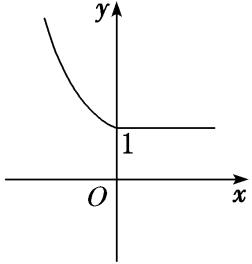

专题二　函数的解析式与分段函数

1．函数的表示方法

函数的表示方法有三种，分别为解析法、列表法和图象法．同一个函数可以用不同的方法表示．

2．应用三种方法表示函数的注意事项  
（1）解析法：一般情况下，必须注明函数的定义域；  
（2）列表法：选取的自变量要有代表性，应能反映定义域的特征；  
（3）图象法：注意定义域对图象的影响．与*x*轴垂直的直线与其最多有一个公共点．

3．函数的三种表示方法的优缺点

<table><tr><td></td><td>
优点
</td><td>
缺点
</td></tr><tr><td>
解析法
</td><td>
简明扼要，规范准确
</td><td>
（1）有些函数关系很难或不能用解析式表示；

（2）求<em>x</em>与<em>y</em>的对应关系时需逐个计算，比较繁杂
</td></tr><tr><td>
列表法
</td><td>
能鲜明地显示自变量与函数值之间的数量关系
</td><td>
只能列出部分自变量及其对应的函数值，难以反映函数变化的全貌
</td></tr><tr><td>
图象法
</td><td>
形象直观，能清晰地呈现函数的增减变化、点的对称关系、最大(小)值等性质
</td><td>
作出的图象是近似的、局部的，且根据图象确定的函数值往往有误差
</td></tr></table>

4．分段函数
若函数在其定义域内，对于定义域内的不同取值区间，有着不同的对应关系，这样的函数通常叫做分段函数．

5．分段函数的相关结论  
（1）分段函数虽由几个部分组成，但它表示的是一个函数．  
（2）分段函数的定义域等于各段函数的定义域的并集，值域等于各段函数的值域的并集．  
（3）各段函数的定义域不可以相交．

考点一　求函数的解析式

【方法总结】

函数解析式的常见求法  
（1）配凑法：已知*f*(*h*(*x*))＝*g*(*x*)，求*f*(*x*)的问题，往往把右边的*g*(*x*)整理或配凑成只含*h*(*x*)的式子，然后用*x*将*h*(*x*)代换．  
（2）换元法：已知*f*(*h*(*x*))＝*g*(*x*)，求*f*(*x*)时，往往可设*h*(*x*)＝*t*，从中解出*x*，代入*g*(*x*)进行换元．应用换元法时要注意新元的取值范围．  
（3）待定系数法：已知函数的类型(如一次函数、二次函数)可用待定系数法，比如二次函数<em>f</em>(<em>x</em>)可设为<em>f</em>(<em>x</em>)＝<em>ax</em>2＋<em>bx</em>＋<em>c</em>(<em>a</em>≠0)，其中<em>a</em>，<em>b</em>，<em>c</em>是待定系数，根据题设条件，列出方程组，解出<em>a</em>，<em>b</em>，<em>c</em>即可．  
（4）解方程组法：已知*f*(*x*)满足某个等式，这个等式除*f*(*x*)是未知量外，还有其他未知量，如*f*(或*f*(－*x*))等，可根据已知等式再构造其他等式组成方程组，通过解方程组求出*f*(*x*)．

【例题选讲】

<strong>[例1]</strong> （1） 已知＝＋，则<em>f</em>(<em>x</em>)＝\_\_\_\_\_\_\_\_\_\_；

答案　<em>x</em>2－<em>x</em>＋1　解析　(配凑法)＝＋＝2－＋1．令＝<em>t</em>(<em>t</em>≠1)，得<em>f</em>(<em>t</em>)＝<em>t</em>2－<em>t</em>＋1，即<em>f</em>(<em>x</em>)＝<em>x</em>2－<em>x</em>＋1．

  
（2） 已知＝lg *x*，则*f*(*x*)＝\_\_\_\_\_\_\_\_\_\_；
答案　lg(*x*>1)　解析　(换元法)令＋1＝*t*，得*x*＝，代入得*f*(*t*)＝lg，又*x*>0，所以*t*>1，故*f*(*x*)的解析式是*f*(*x*)＝lg，*x*∈(1，＋∞)．  
（3） 已知*f*(*x*)是二次函数，且*f*（0）＝2，*f*(*x*＋1)＝*f*(*x*)＋*x*＋3，则*f*(*x*)＝\_\_\_\_\_\_\_\_\_\_；
答案　<em>x</em>2＋<em>x</em>＋2　解析　(待定系数法)设<em>f</em>(<em>x</em>)＝<em>ax</em>2＋<em>bx</em>＋<em>c</em>(<em>a</em>≠0)，由<em>f</em>（0）＝<em>c</em>＝2，得<em>f</em>(<em>x</em>)＝<em>ax</em>2＋<em>bx</em>＋2，则<em>f</em>(<em>x</em>＋1)－<em>f</em>(<em>x</em>)＝<em>a</em>(<em>x</em>＋1)2＋<em>b</em>(<em>x</em>＋1)＋2－<em>ax</em>2－<em>bx</em>－2＝2<em>ax</em>＋<em>a</em>＋<em>b</em>＝<em>x</em>＋3，所以2<em>a</em>＝1，且<em>a</em>＋<em>b</em>＝3，解得<em>a</em>＝，<em>b</em>＝，故<em>f</em>(<em>x</em>)＝<em>x</em>2＋<em>x</em>＋2．  
（4） 已知函数<em>f</em>(<em>x</em>)满足<em>f</em>(－<em>x</em>)＋2<em>f</em>(<em>x</em>)＝2<em>x</em>，则<em>f</em>(<em>x</em>)＝\_\_\_\_\_\_\_\_\_\_；
答案　　解析　(解方程组法)由<em>f</em>(－<em>x</em>)＋2<em>f</em>(<em>x</em>)＝2<em>x</em>，①．得<em>f</em>(<em>x</em>)＋2<em>f</em>(－<em>x</em>)＝2－<em>x</em>，②．①×2－②，得3<em>f</em>(<em>x</em>)＝2<em>x</em>＋1－2－<em>x</em>．即<em>f</em>(<em>x</em>)＝．故<em>f</em>(<em>x</em>)的解析式是<em>f</em>(<em>x</em>)＝(<em>x</em>∈<strong>R</strong>)．  
（5） 若函数<em>f</em>(<em>x</em>)满足方程<em>af</em>(<em>x</em>)＋<em>f</em>＝<em>ax</em>，<em>x</em>∈<strong>R</strong>，且<em>x</em>≠0，<em>a</em>为常数，<em>a</em>≠±1，且<em>a</em>≠0，则<em>f</em>(<em>x</em>)＝\_\_\_\_\_\_\_\_．
答案　　解析　(解方程组法)因为*af*(*x*)＋*f*＝*ax*，所以*af*＋*f*(*x*)＝，两方程联立解得*f*(*x*)＝．

【对点训练】

1．已知*f*(＋1)＝*x*＋2，则*f*(*x*)＝\_\_\_\_\_\_\_\_\_\_\_\_\_\_\_\_．

1．答案　<em>x</em>2－1(<em>x</em>≥1)　解析　设<em>t</em>＝＋1，则<em>x</em>＝(<em>t</em>－1)2，<em>t</em>≥1，代入原式有<em>f</em>(<em>t</em>)＝(<em>t</em>－1)2＋2(<em>t</em>－1)＝<em>t</em>2－2<em>t</em>

＋1＋2<em>t</em>－2＝<em>t</em>2－1．故<em>f</em>(<em>x</em>)＝<em>x</em>2－1，<em>x</em>≥1．

2．已知函数*f*(*x*－1)＝，则函数*f*(*x*)的解析式为(　　)

A．*f*(*x*)＝　　　　
B．*f*(*x*)＝　　　　
C．*f*(*x*)＝　　　　
D．*f*(*x*)＝

2．答案　A　解析　令*x*－1＝*t*，则*x*＝*t*＋1，∴*f*(*t*)＝，即*f*(*x*)＝．故选A．

3．已知＝<em>x</em>2＋，则<em>f</em>(<em>x</em>)＝\_\_\_\_\_\_\_\_\_\_\_\_\_\_\_\_．

3．答案　<em>x</em>2－2(<em>x</em>≥2或<em>x</em>≤－2)　解析　由于＝<em>x</em>2＋＝2－2，所以<em>f</em>(<em>x</em>)＝<em>x</em>2－2，<em>x</em>≥2或<em>x</em>≤－

2，故<em>f</em>(<em>x</em>)的解析式是<em>f</em>(<em>x</em>)＝<em>x</em>2－2，<em>x</em>≥2或<em>x</em>≤－2．

4．若二次函数*g*(*x*)满足*g*（1）＝1，*g*(－1)＝5，且图象过原点，则*g*(*x*)的解析式为(　　)

A．<em>g</em>(<em>x</em>)＝2<em>x</em>2－3<em>x</em>　　
B．<em>g</em>(<em>x</em>)＝3<em>x</em>2－2<em>x</em>　　
C．<em>g</em>(<em>x</em>)＝3<em>x</em>2＋2<em>x</em>　　
D．<em>g</em>(<em>x</em>)＝－3<em>x</em>2－2<em>x</em>

4．答案　B　解析　二次函数*g*(*x*)满足*g*（1）＝1，*g*(－1)＝5，且图象过原点，可设二次函数*g*(*x*)的解析式

为<em>g</em>(<em>x</em>)＝<em>ax</em>2＋<em>bx</em>(<em>a</em>≠0)，可得解得<em>a</em>＝3，<em>b</em>＝－2，所以二次函数<em>g</em>(<em>x</em>)的解析式为<em>g</em>(<em>x</em>)＝3<em>x</em>2－2<em>x</em>．故选B．

5．定义在(－1，1)内的函数*f*(*x*)满足2*f*(*x*)－*f*(－*x*)＝lg(*x*＋1)，则*f*(*x*)＝\_\_\_\_\_\_\_\_\_\_\_\_\_\_\_\_．

5．答案　lg(*x*＋1)＋lg(1－*x*)(－1＜*x*＜1)　解析　当*x*∈(－1，1)时，有2*f*(*x*)－*f*(－*x*)＝lg(*x*＋1)．①，将

*x*换成－*x*，则－*x*换成*x*，得2*f*(－*x*)－*f*(*x*)＝lg(－*x*＋1)．②，由①②消去*f*(－*x*)得，*f*(*x*)＝lg(*x*＋1)＋lg(1－*x*)(－1＜*x*＜1)．

6．已知*f*(*x*)满足2*f*(*x*)＋*f*＝3*x*，则*f*(*x*)＝\_\_\_\_\_\_\_\_．

6．答案　2*x*－(*x*≠0)　解析　∵2*f*(*x*)＋*f*＝3*x*，①．把①中的*x*换成，得2*f*＋*f*(*x*)＝．②．联立①②
可得解此方程组可得*f*(*x*)＝2*x*－(*x*≠0)．

7．定义在<strong>R</strong>上的函数<em>f</em>(<em>x</em>)满足<em>f</em>(<em>x</em>＋1)＝2<em>f</em>(<em>x</em>)．若当0≤<em>x</em>≤1时，<em>f</em>(<em>x</em>)＝<em>x</em>(1－<em>x</em>)，则当－1≤<em>x</em>≤0时，<em>f</em>(<em>x</em>)＝\_\_\_\_\_．

7．答案　－*x*(*x*＋1)　解析　∵－1≤*x*≤0，∴0≤*x*＋1≤1，∴*f*(*x*)＝*f*(*x*＋1)＝(*x*＋1)[1－(*x*＋1)]＝－*x*(*x*＋1)．
故当－1≤*x*≤0时，*f*(*x*)＝－*x*(*x*＋1)．

考点二　分段函数求值

【方法总结】

求分段函数的函数值的策略  
（1）求分段函数的函数值时，要先确定要求值的自变量属于哪一区间，然后代入该区间对应的解析式求值；  
（2）当出现*f*(*f*(*a*))的形式时，应从内到外依次求值，直到求出具体值为止；  
（3）当自变量的值所在区间不确定时，要分类讨论，分类标准应参照分段函数不同段的端点；  
（4）求值时注意函数奇偶性、周期性的应用．

【例题选讲】

<strong>[例2]</strong> （1） 已知函数<em>f</em>(<em>x</em>)＝则<em>f</em>[<em>f</em>（1）]＝(　　)

A．－　　　　　　　　
B．2　　　　　　　　
C．4　　　　　　　　
D．11
答案　C　解析　∵函数<em>f</em>(<em>x</em>)＝∴<em>f</em>（1）＝12＋2＝3，∴<em>f</em>[<em>f</em>（1）]＝<em>f</em>（3）＝3＋＝4．故选C．  
（2） (2015·全国Ⅱ)设函数<em>f</em>(<em>x</em>)＝则<em>f</em>(－2)＋<em>f</em>(log212)＝(　　)

A．3　　　　　　　　
B．6　　　　　　　　
C．9　　　　　　　　
D．12
答案　C　解析　∵－2&lt;1，∴<em>f</em>(－2)＝1＋log2(2＋2)＝1＋log24＝1＋2＝3．∵log212&gt;1，∴<em>f</em>(log212)＝2log212－1＝＝6．∴<em>f</em>(－2)＋<em>f</em>(log212)＝3＋6＝9．  
（3） 已知*f*(*x*)＝(0<*a*<1)，且*f*(－2)＝5，*f*(－1)＝3，则*f*(*f*(－3))＝(　　)

A．－2　　　　　　　　
B．2　　　　　　　　
C．3　　　　　　　　
D．－3
答案　B　解析　由题意得，<em>f</em>(－2)＝<em>a</em>－2＋<em>b</em>＝5，①．<em>f</em>(－1)＝<em>a</em>－1＋<em>b</em>＝3，②．联立①②，结合0&lt;<em>a</em>&lt;1，得<em>a</em>＝，<em>b</em>＝1，所以<em>f</em>(<em>x</em>)＝则<em>f</em>(－3)＝－3＋1＝9，<em>f</em>(<em>f</em>(－3))＝<em>f</em>（9）＝log39＝2．  
（4） 已知*f*(*x*)＝则*f*（7）＝\_\_\_\_\_\_\_．
答案　6　解析　∵7<9，∴*f*（7）＝*f*(*f*(7＋4))＝*f*(*f*（11）)＝*f*(11－3)＝*f*（8）．又∵8<9，∴*f*（8）＝*f*(*f*（12）)＝*f*（9）＝9－3＝6．即*f*（7）＝6．  
（5） (2017·山东)设*f*(*x*)＝若*f*(*a*)＝*f*(*a*＋1)，则*f*＝(　　)

A．2　　　　　　　　
B．4　　　　　　　　
C．6　　　　　　　　
D．8
答案　C　解析　当0<*a*<1时，*a*＋1>1，*f*(*a*)＝，*f*(*a*＋1)＝2(*a*＋1－1)＝2*a*，因为*f*(*a*)＝*f*(*a*＋1)，所以＝2*a*，解得*a*＝或*a*＝0(舍去)，所以*f* ＝*f*（4）＝2×(4－1)＝6；当*a*≥1时，*a*＋1≥2，所以*f*(*a*)＝2(*a*－1)，*f*(*a*＋1)＝2(*a*＋1－1)＝2*a*，所以2(*a*－1)＝2*a*，无解；综上，*f* ＝6．故选C．

【对点训练】

8．设*f*(*x*)＝则*f*(*f*(－2))＝(　　)

A．－1　　　　　　　　
B．　　　　　　　　
C．　　　　　　　　
D．

8．答案　C　解析　因为<em>f</em>(－2)＝2－2＝，所以<em>f</em>(<em>f</em>(－2))＝<em>f</em>＝1－＝，故选C．

9．已知函数*f*(*x*)＝则*f*的值为(　　)

A．　　　　　　　　
B．－　　　　　　　　
C．1　　　　　　　　
D．－1

9．答案　B　解析　*f*＝*f*＋1＝sin＋1＝－．

10．已知函数<em>f</em>(<em>x</em>)＝则<em>f</em>(1＋log25)的值为(　　)

A．　　　　　　　　
B．　　　　　　　　
C．　　　　　　　　
D．

10．答案　D　解析　因为2&lt;log25&lt;3，所以3&lt;1＋log25&lt;4，则4&lt;2＋log25&lt;5，则<em>f</em>(1＋log25)＝<em>f</em>(1＋log25

＋1)＝<em>f</em>(2＋log25)＝＝×＝×＝，故选D．

11．已知函数*f*(*x*)＝则*f*(－2 019)＝(　　)

A．e2　　　　　　　　
B．e　　　　　　　　
C．1　　　　　　　　
D．

11．答案　D　解析　当*x*<－2时，*f*(－2 019)＝*f*(2 019)，当*x*>2时，函数周期为4，*f*(2 019)＝*f*(－1)＝．

考点三　求参数或自变量的值或范围

【方法总结】

已知函数值(或范围)求自变量的值(或范围)的方法  
（1）根据每一段的解析式分别求解，但要注意检验所求自变量的值(或范围)是否符合相应段的自变量的取值范围，最后将各段的结果合起来(求并集)即可；  
（2）如果分段函数的图象易得，也可以画出函数图象后结合图象求解．

【例题选讲】

<strong>[例3]</strong> （1） 已知函数<em>f</em>(<em>x</em>)＝则使<em>f</em>(<em>x</em>)＝2的<em>x</em>的集合是(　　)

A．　　　　　　
B．{1，4}　　　　　　
C．　　　　　　
D．
答案　A　解析　由题意可知*f*(*x*)＝2，即或解得*x*＝或4．故选A．  
（2） 函数*f*(*x*)＝满足*f*（1）＋*f*(*a*)＝2，则*a*的所有可能取值为(　　)

A．1或－　　　　　　
B．－　　　　　　
C．1　　　　　　
D．1或
答案　<strong>A</strong>　解析　因为<em>f</em>（1）＝e1－1＝1且<em>f</em>（1）＋<em>f</em>(<em>a</em>)＝2，所以<em>f</em>(<em>a</em>)＝1，当－1&lt;<em>a</em>&lt;0时，<em>f</em>(<em>a</em>)＝sin(π<em>a</em>2)＝1，因为0&lt;<em>a</em>2&lt;1，所以0&lt;π<em>a</em>2&lt;π，所以π<em>a</em>2＝⇒<em>a</em>＝－；当<em>a</em>≥0时，<em>f</em>(<em>a</em>)＝e<em>a</em>－1＝1⇒<em>a</em>＝1．故<em>a</em>＝－或1．  
（3） (2017·全国Ⅲ)设函数*f*(*x*)＝则满足*f*(*x*)＋*f*>1的*x*的取值范围是\_\_\_\_\_\_\_\_．
答案　　解析　由题意知，可对不等式分<em>x</em>≤0，0&lt;<em>x</em>≤，<em>x</em>&gt;讨论．①当<em>x</em>≤0时，原不等式为<em>x</em>＋1＋<em>x</em>＋&gt;1，解得<em>x</em>&gt;－，故－&lt;<em>x</em>≤0．②当0&lt;<em>x</em>≤时，原不等式为2<em>x</em>＋<em>x</em>＋&gt;1，显然成立．③当<em>x</em>&gt;时，原不等式为2<em>x</em>＋2<em>x</em>－&gt;1，显然成立．综上可知，所求<em>x</em>的取值范围是．  
（4） (2018·全国Ⅰ)设函数*f*(*x*)＝则满足*f*(*x*＋1)<*f*(2*x*)的*x*的取值范围是(　　)

A．(－∞，－1]　　　　
B．(0，＋∞)　　　　
C．(－1，0)　　　　
D．(－∞，0)
答案　D　解析　　法一：分类讨论法

①当即<em>x</em>≤－1时，<em>f</em>(<em>x</em>＋1)&lt;<em>f</em>(2<em>x</em>)，即为2－(<em>x</em>＋1)&lt;2－2<em>x</em>，即－(<em>x</em>＋1)&lt;－2<em>x</em>，解得<em>x</em>&lt;1．因此不等式的解集为(－∞，－1]．②当时，不等式组无解．③当即－1&lt;<em>x</em>≤0时，<em>f</em>(<em>x</em>＋1)&lt;<em>f</em>(2<em>x</em>)，即为1&lt;2－2<em>x</em>，解得<em>x</em>&lt;0．因此不等式的解集为(－1，0)．④当即<em>x</em>&gt;0时，<em>f</em>(<em>x</em>＋1)＝1，<em>f</em>(2<em>x</em>)＝1，不合题意．综上，不等式<em>f</em>(<em>x</em>＋1)&lt;<em>f</em>(2<em>x</em>)的解集为(－∞，0)．

法二：数形结合法
∵*f*(*x*)＝∴函数*f*(*x*)的图象如图所示．结合图象知，要使*f*(*x*＋1)<*f*(2*x*)，则需或∴*x*<0，故选D．

  
（5） 设函数<em>f</em>(<em>x</em>)＝则满足<em>f</em>(<em>f</em>(<em>a</em>))＝2<em>f</em>(<em>a</em>)的<em>a</em>的取值范围是(　　)

A．　　　　　　
B．[0，1]　　　　　　
C．　　　　　　
D．[1，＋∞)
答案　C　解析　由<em>f</em>(<em>f</em>(<em>a</em>))＝2<em>f</em>(<em>a</em>)得，<em>f</em>(<em>a</em>)≥1．当<em>a</em>＜1时，有3<em>a</em>－1≥1，∴<em>a</em>≥，∴≤<em>a</em>＜1．当<em>a</em>≥1时，有2<em>a</em>≥1，∴<em>a</em>≥0，∴<em>a</em>≥1．综上，<em>a</em>≥，故选C．

【对点训练】

12．已知函数<em>f</em>(<em>x</em>)＝且<em>f</em>(<em>x</em>0)＝3，则实数<em>x</em>0的值为\_\_\_\_\_\_\_\_．

12．答案　－1或1　解析　由条件可知，当<em>x</em>0≥0时，<em>f</em>(<em>x</em>0)＝2<em>x</em>0＋1＝3，所以<em>x</em>0＝1；当<em>x</em>0&lt;0时，<em>f</em>(<em>x</em>0)＝

3<em>x</em>＝3，所以<em>x</em>0＝－1．所以实数<em>x</em>0的值为－1或1．

13．已知函数*f*(*x*)＝若*f*(*a*)＝3，则*f*(*a*－2)＝(　　)

A．－　　　　　　　　
B．3　　　　　　　　
C．－或3　　　　　　　　
D．－或3

13．答案　A　解析　当<em>a</em>&gt;0时，若<em>f</em>(<em>a</em>)＝3，则log2<em>a</em>＋<em>a</em>＝3，解得<em>a</em>＝2(满足<em>a</em>&gt;0)；当<em>a</em>≤0时，若<em>f</em>(<em>a</em>)＝3，
则4<em>a</em>－2－1＝3，解得<em>a</em>＝3，不满足<em>a</em>≤0，所以舍去．于是，可得<em>a</em>＝2．故<em>f</em>(<em>a</em>－2)＝<em>f</em>（0）＝4－2－1＝－．

14．已知函数*f*(*x*)＝若*a*[*f*(*a*)－*f*(－*a*)]>0，则实数*a*的取值范围为(　　)

A．(1，＋∞)　　
B．(2，＋∞)　　
C．(－∞，－1)∪(1，＋∞)　　
D．(－∞，－2)∪(2，＋∞)

14．答案　D　解析　根据题意，当<em>a</em>&gt;0时，<em>f</em>(<em>a</em>)－<em>f</em>(－<em>a</em>)&gt;0，即<em>a</em>2＋<em>a</em>－[－3(－<em>a</em>)]&gt;0，∴<em>a</em>2－2<em>a</em>&gt;0，解得

<em>a</em>&gt;2；当<em>a</em>&lt;0时，<em>f</em>(<em>a</em>)－<em>f</em>(－<em>a</em>)&lt;0，即－3<em>a</em>－[(－<em>a</em>)2＋(－<em>a</em>)]&lt;0，∴<em>a</em>2＋2<em>a</em>&gt;0，解得<em>a</em>&lt;－2．综上，实数<em>a</em>的取值范围为(－∞，－2)∪(2，＋∞)．故选D．

15．已知函数*f*(*x*)＝则满足*f*(2*x*＋1)＜*f*(3*x*－2)的实数*x*的取值范围是(　　)

A．(－∞，0]　　　　　
B．(3，＋∞)　　　　　
C．[1，3)　　　　　
D．(0，1)

15．答案　B　解析　法一：由*f*(*x*)＝可得当*x*＜1时，*f*(*x*)＝1，当*x*≥1时，函数*f*(*x*)
在[1，＋∞)上单调递增，且<em>f</em>（1）＝log22＝1，要使得<em>f</em>(2<em>x</em>＋1)＜<em>f</em>(3<em>x</em>－2)，则解得<em>x</em>＞3，即不等式<em>f</em>(2<em>x</em>＋1)＜<em>f</em>(3<em>x</em>－2)的解集为(3，＋∞)，故选B．

法二：当*x*≥1时，函数*f*(*x*)在[1，＋∞)上单调递增，且*f*(*x*)≥*f*（1）＝1，要使*f*(2*x*＋1)＜*f*(3*x*－2)成立，需或解得*x*＞3．故选B．

16．(2013·全国Ⅰ)已知函数*f*(*x*)＝若|*f*(*x*)|≥*ax*，则*a*的取值范围是(　　)

A．(－∞，0]　　　　　
B．(－∞，1]　　　　　
C．[－2，1]　　　　　
D．[－2，0]

16．答案　D　解析　当<em>x</em>≤0时，<em>f</em>(<em>x</em>)＝－<em>x</em>2＋2<em>x</em>＝－(<em>x</em>－1)2＋1≤0，所以|<em>f</em>(<em>x</em>)|≥<em>ax</em>化简为<em>x</em>2－2<em>x</em>≥<em>ax</em>，即<em>x</em>2≥(<em>a</em>

＋2)*x*，因为*x*≤0，所以*a*＋2≥*x*恒成立，所以*a*≥－2；当*x*＞0时，*f*(*x*)＝ln(*x*＋1)＞0，所以|*f*(*x*)|≥*ax*化简为ln(*x*＋1)＞*ax*恒成立，由函数图象可知*a*≤0，综上，当－2≤*a*≤0时，不等式|*f*(*x*)|≥*ax*恒成立，选择D．

