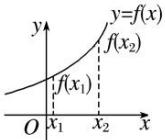
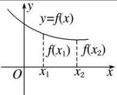
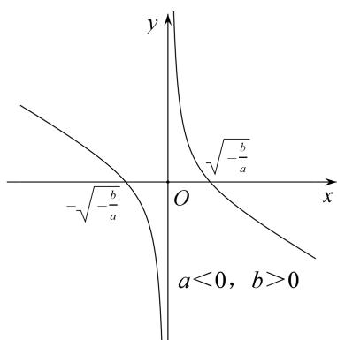
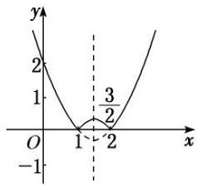

# 专题三 函数的单调性

# 1. 增函数、减函数的定义

<table><tr><td></td><td>增函数</td><td>减函数</td></tr><tr><td rowspan="2">定义</td><td colspan="2">一般地,设函数 $f(x)$ 的定义域为 $I$ ,如果对于定义域 $I$ 内某个区间 $D$ 上的任意两个自变量的值 $x_1$ , $x_2$ </td></tr><tr><td>当 $x_1 < x_2$ 时,都有 $f(x_1) < f(x_2)$ ,那么就说函数 $f(x)$ 在区间 $D$ 上是增函数</td><td>当 $x_1 < x_2$ 时,都有 $f(x_1) > f(x_2)$ ,那么就说函数 $f(x)$ 在区间 $D$ 上是减函数</td></tr><tr><td>图象描述</td><td>自左向右看图象是上升的</td><td>自左向右看图象是下降的</td></tr></table>

# 2. 单调性、单调区间的定义

若函数 $y = f(x)$ 在区间 $D$ 上是增函数或减函数，则称函数 $y = f(x)$ 在这一区间上具有(严格的)单调性，区间 $D$ 叫做函数 $y = f(x)$ 的单调区间.

单调区间是定义域的子集，故求单调区间时应树立“定义域优先”的原则。单调区间只能用区间表示，不能用集合或不等式表示；如有多个单调区间应分开写，不能用并集符号“∪”连接，也不能用“或”连接，只能用“，”或“和”隔开。

# 2. 常用结论

结论 1: 增函数与减函数形式的等价变形

$y = f(x)$ 在区间 $D$ 上是增函数 $\Leftrightarrow$ 对 $\forall x_{1} < x_{2}$ ，都有 $f(x_{1}) < f(x_{2}) \Leftrightarrow (x_{1} - x_{2}) [f(x_{1}) - f(x_{2})] > 0 \Leftrightarrow \frac{f(x_{1}) - f(x_{2})}{x_{1} - x_{2}} > 0$ ;

$y = f(x)$ 在区间 $D$ 上是减函数 $\Leftrightarrow$ 对 $\forall x_{1} <   x_{2}$ ，都有 $f(x_{1}) > f(x_{2})\Leftrightarrow (x_{1} - x_{2})[f(x_{1}) - f(x_{2})] <   0\Leftrightarrow \frac{f(x_1) - f(x_2)}{x_1 - x_2} <  0.$

结论 2：单调性的运算性质

(1)函数 $y=f(x)$ 与函数 $y=f(x)+C$ (C 为常数) 具有相同的单调性.

(2) 若 k>0，则 $kf(x)$ 与 $f(x)$ 单调性相同；若 k<0，则 $kf(x)$ 与 $f(x)$ 单调性相反.

(3)在公共定义域内，函数 $y=f(x)(f(x)>0)$ 与 $y=f^{n}(x)$ 和 $y=\sqrt[n]{f(x)}$ 具有相同的单调性.

(4)在公共定义域内，函数 $y=f(x)(f(x)\neq0)$ 与 $y=\frac{1}{f(x)}$ 单调性相反.

(5)若 $f(x)$ ， $g(x)$ 均为区间 A 上的增(减)函数，则 $f(x)+g(x)$ 也是区间 A 上的增(减)函数.

(6)若 $f(x)$ ， $g(x)$ 均为区间 A 上的增(减)函数，且 $f(x)>0$ ， $g(x)>0$ ，则 $f(x)\cdot g(x)$ 也是区间 A 上的增(减)函数.

结论 3：复合函数的单调性

复合函数 $y = f[g(x)]$ 的单调性与 $y = f(u)$ 和 $u = g(x)$ 的单调性有关。若两个简单函数的单调性相同，则它们的复合函数为增函数；若两个简单函数的单调性相反，则它们的复合函数为减函数。简记：“同增异减”。

结论 4：奇函数与偶函数的单调性

奇函数在其关于原点对称的区间上单调性相同，偶函数在其关于原点对称的区间上单调性相反.

结论 5：对勾函数与飘带函数的单调性

对勾函数： $f(x)=ax+\frac{b}{x}(ab>0)$

text_image

-√(b/a)
O
√(b/a)
a>0, b>0

text_image

y
√(b/a)
-√(b/a)
O
x
a<0, b<0

(1)当 $a > 0$ ， $b > 0$ 时， $f(x)$ 在 $(-\infty , - \sqrt{\frac{b}{a}} ]$ ， $[\sqrt{\frac{b}{a}}, + \infty)$ 上是增函数，在 $[- \sqrt{\frac{b}{a}}, 0)$ ， $(0, \sqrt{\frac{b}{a}} ]$ 上是减函数；  
(2)当 $a < 0$ ， $b < 0$ 时， $f(x)$ 在 $(-\infty , - \sqrt{\frac{b}{a}} ]$ ， $[\sqrt{\frac{b}{a}}, + \infty)$ 上是减函数，在 $[- \sqrt{\frac{b}{a}}, 0)$ ， $(0, \sqrt{\frac{b}{a}} ]$ 上是增函数；

飘带函数： $f(x)=ax+\frac{b}{x}(ab<0)$

text_image

-√(-b/a)
O
√(-b/a)
x
y
a>0, b<0

text_image

y
√(-b/a)
-√(-b/a)
O
x
a<0, b>0

(1)当 $a > 0$ ， $b <   0$ 时， $f(x)$ 在 $(-\infty ,0)$ ， $(0, + \infty)$ 上都是增函数；  
(2)当 a<0, b>0 时， $f(x)$ 在 $(-∞, 0)$ ， $(0, +∞)$ 上都是减函数；

# 考点一 确定函数的单调性或单调区间

# 【方法总结】

# 确定函数的单调性或单调区间的常用方法

(1)利用已知函数的单调性，即转化为已知函数的和、差或复合函数确定函数的单调性或单调区间.  
(2)定义法：先求定义域，再利用单调性的定义确定函数的单调性或单调区间.  
(3)图象法：如果 $f(x)$ 是以图象形式给出的，或者 $f(x)$ 的图象易作出，可由图象的直观性确定函数的单调性或单调区间.

# 【例题选讲】

[例 1] (1) 下列函数中，在区间 $(0, +\infty)$ 内单调递减的是()

A. $y=\frac{1}{x}-x$

B. $y = x^{2} - x$

C. $y=\ln x-x$

D. $y=e^{x}-x$

(2) 下列函数中，满足“ $\forall x_1, x_2 \in (0, +\infty)$ 且 $x_1 \neq x_2$ ， $(x_1 - x_2) \cdot [f(x_1) - f(x_2)] < 0$ ”的是（）

A. $f(x) = 2^{x}$

B. $f(x) = |x - 1|$

C. $f(x)=\frac{1}{x}-x$

D. $f(x)=\ln(x+1)$

(3) 函数 $f(x)=|x^{2}-3x+2|$ 的单调递增区间是()

A. $\left[\frac{3}{2}, +\infty\right]$

B. $\left[1, \frac{3}{2}\right]$ 和 $[2, +\infty)$

C. $(-\infty, 1]$ 和 $\left[\frac{3}{2}, 2\right]$

D. $\left[-\infty, \frac{3}{2}\right]$ 和 $[2, +\infty)$

line

| x | y |
|---|---|
| 0 | 2 |
| 1 | 0 |
| 2 | 0 |
| 3 | 1 |

(4) 函数 $y=\sqrt{x^{2}+x-6}$ 的单调递增区间为 \_\_\_\_，单调递减区间为 \_\_\_\_.

(5) 函数 $y = \log_{\frac{1}{2}} (x^2 - 3x + 2)$ 的单调递增区间为 \_\_\_\_，单调递减区间为 \_\_\_\_.

# 【对点训练】

1. 给定函数① $y = x^{\frac{1}{2}}$ ，② $y = \log_{\frac{1}{2}}(x + 1)$ ，③ $y = |x - 1|$ ，④ $y = 2^{x + 1}$ . 其中在区间(0，1)上单调递减的函数序号是（）

A. ①②

B. ②③

C. ③④

D. ①④

2. 下列四个函数中，在 $x \in (0, +\infty)$ 上为增函数的是( )

A. $f(x)=3-x$

B. $f(x) = x^{2} - 3x$

C. $f(x)=-\frac{1}{x+1}$

D. $f(x) = -|x|$

3. 若函数 $f(x)$ 满足“对任意 $x_{1}, x_{2} \in (0, +\infty)$ ，当 $x_{1} < x_{2}$ 时，都有 $f(x_{1}) > f(x_{2})$ ”，则 $f(x)$ 的解析式可以是( )

A. $f(x)=(x-1)^{2}$

B. $f(x) = \mathrm{e}^{x}$

C. $f(x)=\frac{1}{x}$

D. $f(x)=\ln(x+1)$

4. 函数 $f(x) = |x - 2|x$ 的单调减区间是( )

A. $[1, 2]$

B. $[-1, 0]$

C. $[0, 2]$

D. $[2, +\infty)$

5. 设函数 $f(x) = \begin{cases} 1, & x > 0, \\ 0, & x = 0, \\ -1, & x < 0, \end{cases}$ $g(x) = x^2 f(x - 1)$ ，则函数 $g(x)$ 的单调递减区间是（）

A. $(-∞, 0]$

B. $[0, 1)$

C. $[1, +\infty)$

D. $[-1, 0]$

6. 函数 $y=(\frac{1}{3})^{2x^{2}-3x+1}$ 的单调递增区间为()

A. $(1, +\infty)$

B. $\left[-\infty,\frac{3}{4}\right]$

C. $\left(\frac{1}{2},+\infty\right)$

D. $\left[\frac{3}{4}, +\infty\right]$

7. 已知函数 $f(x)=\sqrt{x^{2}-2x-3}$ ，则该函数的单调递增区间为()

A. $(-\infty, 1]$

B. $[3, +\infty)$

C. $(-\infty, -1]$

D. $[1, +\infty)$

8. (2017·全国II)函数 $f(x)=\ln(x^{2}-2x-8)$ 的单调递增区间是()

A. $(-\infty, -2)$

B. $(-∞, 1)$

C. $(1, +\infty)$

D. $(4, +\infty)$

# 考点二 比较函数值或自变量的大小

# 【方法总结】

比较函数值大小的思路：比较函数值的大小时，若自变量的值不在同一个单调区间内，要利用其函数性质，转化到同一个单调区间上进行比较，对于选择题、填空题能数形结合的尽量用图象法求解.

# 【例题选讲】

[例 2] (1) 设偶函数 $f(x)$ 的定义域为 R，当 $x \in [0, +\infty)$ 时， $f(x)$ 是增函数，则 $f(-2)$ ， $f(\pi)$ ， $f(-3)$ 的大

小关系是( )

A. $f(\pi) > f(-3) > f(-2)$

B. $f(\pi) > f(-2) > f(-3)$

C. $f(\pi) < f(-3) < f(-2)$

D. $f(\pi) < f(-2) < f(-3)$

(2) (2017·天津)已知奇函数 $f(x)$ 在 $\mathbf{R}$ 上是增函数。若 $a = -f\left(\log_2\frac{1}{5}\right)$ ， $b = f(\log_24.1)$ ， $c = f(2^{0.8})$ ，则 $a, b, c$ 的大小关系为（）

A. a<b<c

B. b<a<c

C. c<b<a

D. $c < a < b$

(3) 已知函数 $f(x) = \log_2 x + \frac{1}{1 - x}$ ，若 $x_1 \in (1, 2)$ ， $x_2 \in (2, +\infty)$ ，则（）

A. $f(x_{1})<0,\ f(x_{2})<0$

B. $f(x_{1}) <   0,f(x_{2}) > 0$

C. $f(x_{1})>0,\ f(x_{2})<0$

D. $f(x_{1})>0,\ f(x_{2})>0$

(4)已知函数 $y = f(x)$ 是 $\mathbf{R}$ 上的偶函数，当 $x_{1}, x_{2} \in (0, +\infty), x_{1} \neq x_{2}$ 时，都有 $(x_{1} - x_{2}) \cdot [f(x_{1}) - f(x_{2})] < 0$ 。设 $a = \ln \frac{1}{\pi}, b = (\ln \pi)^{2}, c = \ln \sqrt{\pi}$ ，则（）

A. $f(a) > f(b) > f(c)$

B. $f(b) > f(a) > f(c)$

C. $f(c) > f(a) > f(b)$

D. $f(c) > f(b) > f(a)$

(5)若 $2^{x}+5^{y}\leq2^{-y}+5^{-x}$ ，则有()

A. $x + y \geq 0$

B. $x + y \leq 0$

C. $x - y \leq 0$

D. $x - y \geq 0$

# 【对点训练】

9. 已知函数 $f(x)$ 的图象向左平移 1 个单位后关于 $y$ 轴对称，当 $x_2 > x_1 > 1$ 时， $[f(x_2) - f(x_1)] \cdot (x_2 - x_1) < 0$ 恒成立，设 $a = f\left(-\frac{1}{2}\right)$ ， $b = f(2)$ ， $c = f(3)$ ，则 $a, b, c$ 的大小关系为（）

A. c>a>b

B. c>b>a

C. a>c>b

D. b>a>c

10. 已知函数 $f(x)$ 在 $\mathbf{R}$ 上单调递减，且 $a = 3^{3.1}$ ， $b = \left(\frac{1}{3}\right)^{\pi}$ ， $c = \ln \frac{1}{3}$ ，则 $f(a), f(b), f(c)$ 的大小关系为（）

A. $f(a) > f(b) > f(c)$

B. $f(b) > f(c) > f(a)$

C. $f(c) > f(a) > f(b)$

D. $f(c) > f(b) > f(a)$

# 考点三 解函数不等式

# 【方法总结】

含“f”不等式的解法：首先根据函数的性质把不等式转化为 $f(g(x)) > f(h(x))$ 的形式，然后根据函数的单调性去掉“f”，转化为具体的不等式(组)，此时要注意 $g(x)$ 与 $h(x)$ 的取值应在外层函数的定义域内.

# 【例题选讲】

[例 3] (1) 已知函数 $f(x)$ 是定义在区间 $[0, +\infty)$ 上的函数，且在该区间上单调递增，则满足 $f(2x-1) < f\left(\frac{1}{3}\right)$ 的 x 的取值范围是（）

A. $\left(\frac{1}{3},\frac{2}{3}\right)$

B. $\left[\frac{1}{3},\frac{2}{3}\right]$

C. $\left(\frac{1}{2},\frac{2}{3}\right)$

D. $\left[\frac{1}{2},\frac{2}{3}\right]$

(2) 已知函数 $f(x)$ 是 $\mathbf{R}$ 上的增函数， $A(0, -3)$ ， $B(3, 1)$ 是其图象上的两点，那么不等式 $-3 < f(x + 1) < 1$ 的解集的补集是(全集为 $\mathbf{R}$ )()

A. $(-1, 2)$

B. $(1, 4)$

C. $(-\infty, -1) \cup [4, +\infty)$

D. $(-\infty, -1] \cup [2, +\infty)$

(3) 定义在 $[-2, 2]$ 上的函数 $f(x)$ 满足 $(x_{1} - x_{2})[f(x_{1}) - f(x_{2})] > 0$ ， $x_{1} \neq x_{2}$ ，且 $f(a^{2} - a) > f(2a - 2)$ ，则实数 $a$ 的取值范围为 \_\_\_\_.

(4) $f(x)$ 是定义在 $(0, +\infty)$ 上的单调增函数，满足 $f(xy) = f(x) + f(y)$ ， $f(3) = 1$ ，当 $f(x) + f(x - 8) \leq 2$ 时， $x$ 的取值范围是（）

A. $(8, +\infty)$

B. $(8, 9]$

C. [8, 9]

D. $(0, 8)$

(5) (2015·全国II) 设函数 $f(x)=\ln(1+|x|)-\frac{1}{1+x^{2}}$ ，则使得 $f(x)>f(2x-1)$ 成立的 x 的取值范围是()

A. $\left(\frac{1}{3},\ 1\right)$

B. $\left(-\infty, \frac{1}{3}\right) \cup (1, +\infty)$

C. $\left(-\frac{1}{3},\frac{1}{3}\right)$

D. $\left(-\infty, -\frac{1}{3}\right) \cup \left(\frac{1}{3}, +\infty\right)$

# 【对点训练】

11. 定义在 $\mathbf{R}$ 上的奇函数 $y = f(x)$ 在 $(0, +\infty)$ 上单调递增，且 $f\left(\frac{1}{2}\right) = 0$ ，则满足 $f\log_{\frac{1}{9}} x > 0$ 的 $x$ 的集合为 \_\_\_\_.  
12. 已知函数 $f(x) = \ln x + x$ ，若 $f(a^2 - a) > f(a + 3)$ ，则正数 $a$ 的取值范围是 \_\_\_\_.  
13. 设函数 $f(x) = \begin{cases} 2^x, & x < 2, \\ x^2, & x \geq 2. \end{cases}$ 若 $f(a + 1) \geq f(2a - 1)$ ，则实数 $a$ 的取值范围是（B）

A. $(-\infty, 1]$

B. $(-\infty, 2]$

C. [2, 6]

D. $[2, +\infty)$

14. (2018·全国I)设函数 $f(x) = \begin{cases} 2^{-x}, & x \leq 0, \\ 1, & x > 0, \end{cases}$ 则满足 $f(x + 1) < f(2x)$ 的 $x$ 的取值范围是()

A. $(-\infty, -1]$

B. $(0, +\infty)$

C. $(-1,0)$

D. $(-\infty, 0)$

15. 已知 $f(x) = \begin{cases} x^2 - 4x + 3, & x \leq 0, \\ -x^2 - 2x + 3, & x > 0, \end{cases}$ 不等式 $f(x + a) > f(2a - x)$ 在 $[a, a + 1]$ 上恒成立，则实数 $a$ 的取值范围是 \_\_\_\_.

# 考点四 求参数的取值范围

# 【方法总结】

求参数的值或取值范围的思路：根据其单调性直接构建参数满足的方程(组)(不等式(组))或先得到其图象的升降，再结合图象求解．求参数时需注意若函数在区间 $[a, b]$ 上是单调的，则该函数在此区间的任意子区间上也是单调的.

# 【例题选讲】

[例 4] (1) 如果二次函数 $f(x)=3x^{2}+2(a-1)x+b$ 在区间 $(-∞,1)$ 上是减函数，那么 a 的取值范围是 \_\_\_\_.

(2) 已知函数 $f(x)=x-\frac{a}{x}+\frac{a}{2}$ 在 $(1, +\infty)$ 上是增函数，则实数 a 的取值范围是 \_\_\_\_.  
(3)若函数 $f(x) = a|b - x| + 2$ 的单调递增区间是 $[0, +\infty)$ ，则实数 $a, b$ 的取值范围分别为  
(4) 已知函数 $f(x)=\left\{\begin{aligned} ax^{2}-x-\frac{1}{4}, & x\leq1, \\ \log_{a}x-1, & x>1\end{aligned}\right.$ 是 R 上的单调函数，则实数 a 的取值范围是()

A. $\left[\frac{1}{4},\frac{1}{2}\right]$

B. $\left[\frac{1}{4},\frac{1}{2}\right]$

C. $\left\{0,\frac{1}{2}\right]$

D. $\left[\frac{1}{2},\quad1\right]$

(5) 已知函数 $f(x) = \log_{\frac{1}{2}} (x^2 - ax + 3a)$ 在 $[1, +\infty)$ 上单调递减，则实数 $a$ 的取值范围是 \_\_\_\_.

# 【对点训练】

16. 如果函数 $f(x) = ax^2 + 2x - 3$ 在区间 $(- \infty, 4)$ 上是单调递增的，则实数 $a$ 的取值范围是（）

A. $\left(-\frac{1}{4},+\infty\right)$

B. $\left[-\frac{1}{4},+\infty\right]$

C. $\left[-\frac{1}{4},0\right]$

D. $\left[-\frac{1}{4},0\right]$

17. 若 $f(x)=\frac{x+a-1}{x+2}$ 在区间 $(-2, +\infty)$ 上是增函数，则实数 a 的取值范围是 \_\_\_\_.

18. 若 $f(x)=-x^{2}+4mx$ 与 $g(x)=\frac{2m}{x+1}$ 在区间 [2, 4] 上都是减函数，则 m 的取值范围是 (D)

A. $(-\infty, 0) \cup (0, 1]$

B. $(-1, 0) \cup (0, 1]$

C. $(0, +\infty)$

D. $(0, 1]$

19. 已知 $f(x) = \begin{cases} (2 - a)x + 1, & x < 1, \\ a^x, & x \geq 1, \end{cases}$ 满足对任意 $x_1 \neq x_2$ ，都有 $\frac{f(x_1) - f(x_2)}{x_1 - x_2} > 0$ 成立，那么 $a$ 的取值范围是 \_\_\_\_.

20. 已知函数 $f(x) = \begin{cases} -x^2 - ax - 5, & x \leq 1, \\ a, & x > 1 \end{cases}$ 是 $\mathbf{R}$ 上的增函数，则实数 $a$ 的取值范围是（）

A. $[-3, 0)$

B. $(-∞,-2]$

C. $[-3, -2]$

D. $(-\infty, 0)$

21. 设函数 $f(x)=\left\{\begin{aligned}-x^{2}+4x, & x\leq4,\\ \log_{2}x, & x>4.\end{aligned}\right.$ 若函数 $y=f(x)$ 在区间 $(a, a+1)$ 上单调递增，则实数 a 的取值范围是（）

A. $(-\infty, 1]$

B. $[1, 4]$

C. $[4, +\infty)$

D. $(-\infty, 1] \cup [4, +\infty)$

22. 已知 $f(x)=\frac{x}{x-a}(x\neq a)$ .

(1)若 a = -2，试证 $f(x)$ 在 $(-∞, -2)$ 内单调递增；

(2)若 a>0 且 $f(x)$ 在 $(1, +\infty)$ 内单调递减，求 a 的取值范围.

23. 已知定义在 $\mathbf{R}$ 上的函数 $f(x)$ 满足：① $f(x + y) = f(x) + f(y) + 1$ ，②当 $x > 0$ 时， $f(x) > -1$ .

(1)求 $f(0)$ 的值，并证明 $f(x)$ 在 R 上是单调增函数.

(2)若 $f(1)=1$ ，解关于 x 的不等式 $f(x^{2}+2x)+f(1-x)>4$ .

