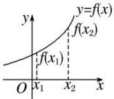
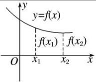
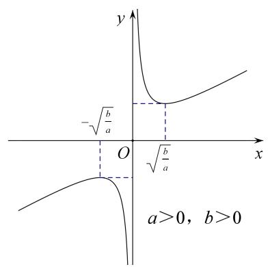
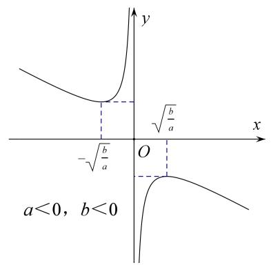
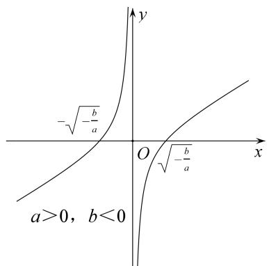
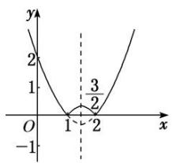
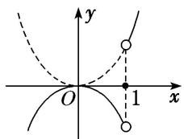
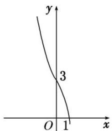
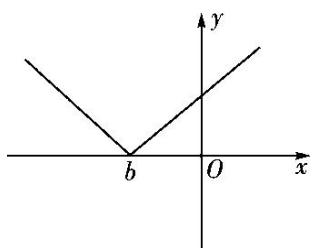
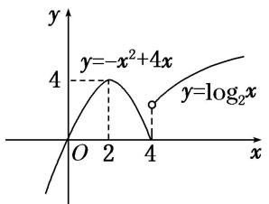

# 专题三 函数的单调性

# 1. 增函数、减函数的定义

<table><tr><td></td><td>增函数</td><td>减函数</td></tr><tr><td rowspan="2">定义</td><td colspan="2">一般地,设函数 $f(x)$ 的定义域为 $I$ ,如果对于定义域 $I$ 内某个区间 $D$ 上的任意两个自变量的值 $x_1$ , $x_2$ </td></tr><tr><td>当 $x_1 < x_2$ 时,都有 $f(x_1) < f(x_2)$ ,那么就说函数 $f(x)$ 在区间 $D$ 上是增函数</td><td>当 $x_1 < x_2$ 时,都有 $f(x_1) > f(x_2)$ ,那么就说函数 $f(x)$ 在区间 $D$ 上是减函数</td></tr><tr><td>图象描述</td><td>自左向右看图象是上升的</td><td>自左向右看图象是下降的</td></tr></table>

# 2. 单调性、单调区间的定义

若函数 $y = f(x)$ 在区间 $D$ 上是增函数或减函数，则称函数 $y = f(x)$ 在这一区间上具有(严格的)单调性，区间 $D$ 叫做函数 $y = f(x)$ 的单调区间.

单调区间是定义域的子集，故求单调区间时应树立“定义域优先”的原则．单调区间只能用区间表示，不能用集合或不等式表示；如有多个单调区间应分开写，不能用并集符号“∪”连接，也不能用“或”连接，只能用“，”或“和”隔开.

# 2. 常用结论

结论 1: 增函数与减函数形式的等价变形

$y = f(x)$ 在区间 $D$ 上是增函数 $\Leftrightarrow$ 对 $\forall x_{1} < x_{2}$ ，都有 $f(x_{1}) < f(x_{2}) \Leftrightarrow (x_{1} - x_{2}) [f(x_{1}) - f(x_{2})] > 0 \Leftrightarrow \frac{f(x_{1}) - f(x_{2})}{x_{1} - x_{2}} > 0$ ;

$y = f(x)$ 在区间 $D$ 上是减函数 $\Leftrightarrow$ 对 $\forall x_{1} <   x_{2}$ ，都有 $f(x_{1}) > f(x_{2})\Leftrightarrow (x_{1} - x_{2})[f(x_{1}) - f(x_{2})] <   0\Leftrightarrow \frac{f(x_1) - f(x_2)}{x_1 - x_2} <  0.$

结论 2：单调性的运算性质

(1)函数 $y=f(x)$ 与函数 $y=f(x)+C$ (C 为常数) 具有相同的单调性.  
(2) 若 k>0，则 $kf(x)$ 与 $f(x)$ 单调性相同；若 k<0，则 $kf(x)$ 与 $f(x)$ 单调性相反.  
(3)在公共定义域内，函数 $y=f(x)(f(x)>0)$ 与 $y=f^{n}(x)$ 和 $y=\sqrt[n]{f(x)}$ 具有相同的单调性.  
(4)在公共定义域内，函数 $y=f(x)(f(x)\neq0)$ 与 $y=\frac{1}{f(x)}$ 单调性相反.  
(5)若 $f(x)$ ， $g(x)$ 均为区间 A 上的增(减)函数，则 $f(x)+g(x)$ 也是区间 A 上的增(减)函数.  
(6)若 $f(x)$ ， $g(x)$ 均为区间 A 上的增(减)函数，且 $f(x)>0$ ， $g(x)>0$ ，则 $f(x)\cdot g(x)$ 也是区间 A 上的增(减)函数.

结论 3：复合函数的单调性

复合函数 $y = f[g(x)]$ 的单调性与 $y = f(u)$ 和 $u = g(x)$ 的单调性有关。若两个简单函数的单调性相同，则它们的复合函数为增函数；若两个简单函数的单调性相反，则它们的复合函数为减函数。简记：“同增异减”。

结论 4：奇函数与偶函数的单调性

奇函数在其关于原点对称的区间上单调性相同，偶函数在其关于原点对称的区间上单调性相反.

结论 5：对勾函数与飘带函数的单调性

对勾函数： $f(x)=ax+\frac{b}{x}(ab>0)$

text_image

-√(b/a)
O
√(b/a)
a>0, b>0

text_image

y
√(b/a)
-√(b/a)
O
x
a<0, b<0

(1)当 $a > 0$ ， $b > 0$ 时， $f(x)$ 在 $(-\infty , - \sqrt{\frac{b}{a}} ]$ ， $[\sqrt{\frac{b}{a}}, + \infty)$ 上是增函数，在 $[- \sqrt{\frac{b}{a}}, 0)$ ， $(0, \sqrt{\frac{b}{a}} ]$ 上是减函数；  
(2)当 $a < 0$ ， $b < 0$ 时， $f(x)$ 在 $(-\infty , - \sqrt{\frac{b}{a}} ]$ ， $[\sqrt{\frac{b}{a}}, + \infty)$ 上是减函数，在 $[- \sqrt{\frac{b}{a}}, 0)$ ， $(0, \sqrt{\frac{b}{a}} ]$ 上是增函数；

飘带函数： $f(x)=ax+\frac{b}{x}(ab<0)$

text_image

-√(-b/a)
O
√(-b/a)
x
y
a>0, b<0

text_image

y
√(-b/a)
-√(-b/a)
O
x
a<0, b>0

(1)当 $a > 0$ ， $b <   0$ 时， $f(x)$ 在 $(-\infty ,0)$ ， $(0, + \infty)$ 上都是增函数；  
(2)当 a<0, b>0 时， $f(x)$ 在 $(-∞, 0)$ ， $(0, +∞)$ 上都是减函数；

# 考点一 确定函数的单调性或单调区间

# 【方法总结】

# 确定函数的单调性或单调区间的常用方法

(1)利用已知函数的单调性，即转化为已知函数的和、差或复合函数确定函数的单调性或单调区间.  
(2)定义法：先求定义域，再利用单调性的定义确定函数的单调性或单调区间.  
(3)图象法：如果 $f(x)$ 是以图象形式给出的，或者 $f(x)$ 的图象易作出，可由图象的直观性确定函数的单调性或单调区间.

# 【例题选讲】

[例 1] (1) 下列函数中，在区间 $(0, +\infty)$ 内单调递减的是()

A. $y=\frac{1}{x}-x$

B. $y = x^{2} - x$

C. $y = \ln x - x$

D. $y = \mathrm{e}^{x} - x$

答案 A 解析 对于选项 A, $y_{1}=\frac{1}{x}$ 在 $(0, +\infty)$ 内是减函数， $y_{2}=x$ 在 $(0, +\infty)$ 内是增函数，则 $y=\frac{1}{x}-x$ 在 $(0, +\infty)$ 内是减函数，故选 A.

(2) 下列函数中，满足“ $\forall x_{1}, x_{2} \in (0, +\infty)$ 且 $x_{1} \neq x_{2}, (x_{1} - x_{2}) \cdot [f(x_{1}) - f(x_{2})] < 0$ ”的是（）

A. $f(x) = 2^{x}$

B. $f(x) = |x - 1|$

C. $f(x)=\frac{1}{x}-x$

D. $f(x)=\ln(x+1)$

答案 C 解析 由 $(x_{1}-x_{2})\cdot[f(x_{1})-f(x_{2})]<0$ 可知， $f(x)$ 在 $(0,+\infty)$ 上是减函数，A、D选项中， $f(x)$ 为增函数；B中， $f(x)=|x-1|$ 在 $(0,+\infty)$ 上不单调；对于 $f(x)=\frac{1}{x}-x$ ，因为 $y=\frac{1}{x}$ 与y=-x在 $(0,+\infty)$ 上单调递减，因此 $f(x)$ 在 $(0,+\infty)$ 上是减函数.

(3) 函数 $f(x)=|x^{2}-3x+2|$ 的单调递增区间是()

A. $\left[\frac{3}{2},+\infty\right]$

B. $\left[1, \frac{3}{2}\right]$ 和 $[2, +\infty)$

C. $(-\infty, 1]$ 和 $\left[\frac{3}{2}, 2\right]$

D. $\left[-\infty, \frac{3}{2}\right]$ 和 $[2, +\infty)$

答案 B 解析 $y=|x^{2}-3x+2|=\left\{\begin{aligned}x^{2}-3x+2,&x\leq1\text{ 或 }x\geq2,\\ -(x^{2}-3x+2),&1<x<2.\end{aligned}\right.$ 如图所示，函数的单调递增区间是 $\left[1,\frac{3}{2}\right]$ 和 $[2,+\infty)$ .

line

| Point | x | y |
|---|---|---|
| 1 | 0 | 0 |
| 2 | 1 | 3/2 |
| 3 | 2 | 0 |

(4) 函数 $y=\sqrt{x^{2}+x-6}$ 的单调递增区间为 \_\_\_\_，单调递减区间为 \_\_\_\_.

答案 [2, +∞) (-∞, -3] 解析 令 $u = x^{2} + x - 6$ ，则 $y = \sqrt{x^2 + x - 6}$ 可以看作是由 $y = \sqrt{u}$ 与 $u = x^2 + x - 6$ 复合而成的函数。令 $u = x^2 + x - 6 \geq 0$ ，得 $x \leq -3$ 或 $x \geq 2$ 。易知 $u = x^2 + x - 6$ 在 $(-∞, -3]$ 上是减函数，在 $[2, +∞)$ 上是增函数，而 $y = \sqrt{u}$ 在 $[0, +∞)$ 上是增函数， $\therefore y = \sqrt{x^2 + x - 6}$ 的单调递减区间为 $(-∞, -3]$ ，单调递增区间为 $[2, +∞)$ 。

(5) 函数 $y = \log_{\frac{1}{2}} (x^2 - 3x + 2)$ 的单调递增区间为 \_\_\_\_，单调递减区间为 \_\_\_\_.

答案 $(- \infty, 1)$ $(2, +\infty)$ 解析 令 $u = x^{2} - 3x + 2$ ，则原函数是 $y = \log_{\frac{1}{2}} u$ 与 $u = x^{2} - 3x + 2$ 的复合函数。令 $u = x^{2} - 3x + 2 > 0$ ，则 $x < 1$ 或 $x > 2$ 。所以函数 $y = \log_{\frac{1}{2}} (x^{2} - 3x + 2)$ 的定义域为 $(- \infty, 1) \cup (2, +\infty)$ 。又 $u = x^{2} - 3x + 2$ 的对称轴为 $x = \frac{3}{2}$ ，且开口向上，所以 $u = x^{2} - 3x + 2$ 在 $(- \infty, 1)$ 上是单调减函数，在 $(2, +\infty)$ 上是单调增函数，而 $y = \log_{\frac{1}{2}} u$ 在 $(0, +\infty)$ 上是单调减函数，所以 $y = \log_{\frac{1}{2}} (x^{2} - 3x + 2)$ 的单调递减区间为 $(2, +\infty)$ ，单调递增区间为 $(- \infty, 1)$ 。

# 【对点训练】

1. 给定函数① $y = x^{\frac{1}{2}}$ ，② $y = \log_{\frac{1}{2}}(x + 1)$ ，③ $y = |x - 1|$ ，④ $y = 2^{x + 1}$ . 其中在区间(0，1)上单调递减的函数序号是（）

A. ①②

B. ②③

C. ③④

D. ①④

1. 答案 B 解析 ① $y = x^{\frac{1}{2}}$ 在(0, 1)上递增；② $t = x + 1$ 在(0, 1)上递增，且 $0 < \frac{1}{2} < 1$ ，故 $y = \log_{\frac{1}{2}} (x + 1)$ 在(0, 1)上递减；③结合图象可知 $y = |x - 1|$ 在(0, 1)上递减；④ $u = x + 1$ 在(0, 1)上递增，且 $2 > 1$ ，故 $y=2^{x+1}$ 在 $(0,1)$ 上递增．故在区间 $(0,1)$ 上单调递减的函数序号是②③.

2. 下列四个函数中，在 $x \in (0, +\infty)$ 上为增函数的是（ ）

A. $f(x) = 3 - x$

B. $f(x)=x^{2}-3x$

C. $f(x)=-\frac{1}{x+1}$

D. $f(x) = -|x|$

2. 答案 C 解析 当 x>0 时, $f(x)=3-x$ 为减函数; 当 $x\in\left(0,\frac{3}{2}\right)$ 时, $f(x)=x^{2}-3x$ 为减函数, 当 $x\in\left(\frac{3}{2},+\infty\right)$ 时, $f(x)=x^{2}-3x$ 为增函数; 当 $x\in(0,+\infty)$ 时, $f(x)=-\frac{1}{x+1}$ 为增函数; 当 $x\in(0,+\infty)$ 时, $f(x)=-|x|$ 为减函数.

3. 若函数 $f(x)$ 满足“对任意 $x_{1}, x_{2} \in (0, +\infty)$ ，当 $x_{1} < x_{2}$ 时，都有 $f(x_{1}) > f(x_{2})$ ”，则 $f(x)$ 的解析式可以是( )

A. $f(x) = (x - 1)^{2}$

B. $f(x)=\mathrm{e}^{x}$

C. $f(x)=\frac{1}{x}$

D. $f(x)=\ln(x+1)$

3. 答案 C 解析 根据条件知， $f(x)$ 在 $(0, +\infty)$ 上单调递减。对于 A， $f(x) = (x - 1)^2$ 在 $(1, +\infty)$ 上单调递增，排除 A；对于 B， $f(x) = e^x$ 在 $(0, +\infty)$ 上单调递增，排除 B；对于 C， $f(x) = \frac{1}{x}$ 在 $(0, +\infty)$ 上单调递减，C 正确；对于 D， $f(x) = \ln (x + 1)$ 在 $(0, +\infty)$ 上单调递增，排除 D。

4. 函数 $f(x)=|x-2|x$ 的单调减区间是()

A. $[1, 2]$

B. $[-1, 0]$

C. $[0, 2]$

D. $[2, +\infty)$

4. 答案 A 解析 由于 $f(x) = |x - 2|x = \begin{cases} x^2 - 2x, & x \geq 2, \\ -x^2 + 2x, & x < 2, \end{cases}$ 结合图象可知函数的单调减区间是[1, 2].

5. 设函数 $f(x) = \begin{cases} 1, & x > 0, \\ 0, & x = 0, \\ -1, & x < 0, \end{cases}$ , $g(x) = x^2 f(x - 1)$ ，则函数 $g(x)$ 的单调递减区间是（）

A. $(-\infty, 0]$

B. $[0, 1)$

C. $[1, +\infty)$

D. $[-1, 0]$

5. 答案 B 解析 由题知， $g(x)=\left\{\begin{aligned}x^{2},&x>1,\\ 0,&x=1,\\ -x^{2},&x<1,\end{aligned}\right.$ 可得函数 $g(x)$ 的单调递减区间为 $[0,1)$ . 故选 B.

text_image

y
O
1 x

6. 函数 $y=(\frac{1}{3})^{2x^{2}-3x+1}$ 的单调递增区间为()

A. $(1, +\infty)$

B. $\left[-\infty,\frac{3}{4}\right]$

C. $\left(\frac{1}{2},+\infty\right)$

D. $\left[\frac{3}{4}, +\infty\right]$

6. 答案 B 解析 令 $u = 2x^{2} - 3x + 1 = 2\left(x - \frac{3}{4}\right)^{2} - \frac{1}{8}$ . 因为 $u = 2\left(x - \frac{3}{4}\right)^{2} - \frac{1}{8}$ 在 $\left[-\infty, \frac{3}{4}\right]$ 上单调递减，函数 $y = \left(\frac{1}{3}\right)^{u}$ 在 R 上单调递减. 所以 $y = \left(\frac{1}{3}\right)2x^{2} - 3x + 1$ 在 $\left[-\infty, \frac{3}{4}\right]$ 上单调递增，即该函数的单调递增区间为 $\left[-\infty, \frac{3}{4}\right]$ .

7. 已知函数 $f(x) = \sqrt{x^2 - 2x - 3}$ ，则该函数的单调递增区间为( )

A. $(-\infty, 1]$

B. $[3, +\infty)$

C. $(-\infty, -1]$

D. $[1, +\infty)$

7. 答案 B 解析 设 $t = x^{2} - 2x - 3$ ，由 $t \geq 0$ ，即 $x^{2} - 2x - 3 \geq 0$ ，解得 $x \leq -1$ 或 $x \geq 3$ 。所以函数的定义域为 $(- \infty, -1] \cup [3, +\infty)$ 。因为函数 $t = x^{2} - 2x - 3$ 的图象的对称轴为 $x = 1$ ，所以函数 $t$ 在 $(- \infty, -1]$ 上单调递减，在 $[3, +\infty)$ 上单调递增。所以函数 $f(x)$ 的单调递增区间为 $[3, +\infty)$ 。

8. (2017·全国II)函数 $f(x)=\ln(x^{2}-2x-8)$ 的单调递增区间是()

A. $(-\infty, -2)$

B. $(-∞, 1)$

C. $(1, +\infty)$

D. $(4, +\infty)$

8. 答案 D 解析 由 $x^{2} - 2x - 8 > 0$ ，得 $x > 4$ 或 $x < -2$ 。因此，函数 $f(x) = \ln (x^2 - 2x - 8)$ 的定义域是 $(- \infty, -2) \cup (4, +\infty)$ 。又函数 $y = x^2 - 2x - 8$ 在 $(4, +\infty)$ 上单调递增，由复合函数的单调性知， $f(x) = \ln (x^2 - 2x - 8)$ 的单调递增区间是 $(4, +\infty)$ 。

# 考点二 比较函数值或自变量的大小

# 【方法总结】

比较函数值大小的思路：比较函数值的大小时，若自变量的值不在同一个单调区间内，要利用其函数性质，转化到同一个单调区间上进行比较，对于选择题、填空题能数形结合的尽量用图象法求解.

# 【例题选讲】

[例 2] (1) 设偶函数 $f(x)$ 的定义域为 R，当 $x \in [0, +\infty)$ 时， $f(x)$ 是增函数，则 $f(-2)$ ， $f(\pi)$ ， $f(-3)$ 的大小关系是()

A. $f(\pi) > f(-3) > f(-2)$

B. $f(\pi) > f(-2) > f(-3)$

C. $f(\pi) < f(-3) < f(-2)$

D. $f(\pi) < f(-2) < f(-3)$

答案 A 解析 因为 $f(x)$ 是偶函数，所以 $f(-3)=f(3)$ ， $f(-2)=f(2)$ 。又因为函数 $f(x)$ 在 $[0, +\infty)$ 上是增函数。所以 $f(\pi)>f(3)>f(2)$ ，即 $f(\pi)>f(-3)>f(-2)$ 。

(2) (2017·天津)已知奇函数 $f(x)$ 在 $\mathbf{R}$ 上是增函数．若 $a = -f\left(\log_2\frac{1}{5}\right)$ ， $b = f(\log_24.1)$ ， $c = f(2^{0.8})$ ，则 $a, b, c$ 的大小关系为（）

A. a<b<c

B. b<a<c

C. $c < b < a$

D. $c < a < b$

答案 C 解析 由 $f(x)$ 是奇函数可得 $a = -f\left(\log_2\frac{1}{5}\right) = f(\log_25)$ . 因为 $\log_25 > \log_24.1 > \log_24 = 2 > 2^{0.8}$ ，且函数 $f(x)$ 是增函数，所以 $c < b < a$ .

(3) 已知函数 $f(x) = \log_2 x + \frac{1}{1 - x}$ ，若 $x_1 \in (1, 2)$ ， $x_2 \in (2, +\infty)$ ，则（）

A. $f(x_{1})<0,\ f(x_{2})<0$

B. $f(x_{1})<0,\ f(x_{2})>0$

C. $f(x_{1})>0,\ f(x_{2})<0$

D. $f(x_{1})>0,\ f(x_{2})>0$

答案 B 解析 因为函数 $f(x) = \log_2 x + \frac{1}{1 - x}$ 在 $(1, +\infty)$ 上为增函数，且 $f(2) = 0$ ，所以当 $x_1 \in (1, 2)$ 时， $f(x_1) < f(2) = 0$ ，当 $x_2 \in (2, +\infty)$ 时， $f(x_2) > f(2) = 0$ ，即 $f(x_1) < 0$ ， $f(x_2) > 0$ 。故选 B.

(4)已知函数 $y = f(x)$ 是 $\mathbf{R}$ 上的偶函数，当 $x_{1}, x_{2} \in (0, +\infty), x_{1} \neq x_{2}$ 时，都有 $(x_{1} - x_{2}) \cdot [f(x_{1}) - f(x_{2})] < 0$ 。设 $a = \ln \frac{1}{\pi}, b = (\ln \pi)^{2}, c = \ln \sqrt{\pi}$ ，则（）

A. $f(a) > f(b) > f(c)$

B. $f(b) > f(a) > f(c)$

C. $f(c) > f(a) > f(b)$

D. $f(c) > f(b) > f(a)$

答案 C 解析 由题意可知 $f(x)$ 在 $(0, +\infty)$ 上是减函数，且 $f(a) = f(|a|)$ ， $f(b) = f(|b|)$ ， $f(c) = f(|c|)$ ，又 $|a| = \ln \pi > 1$ ， $|b| = (\ln \pi)^2 > |a|$ ， $|c| = \frac{1}{2} \ln \pi$ ，且 $0 < \frac{1}{2} \ln \pi < |a|$ ，故 $|b| > |a| > |c| > 0$ ， $\therefore f(|c|) > f(|a|) > f(|b|)$ ，即 $f(c) > f(a) > f(b)$ .

(5)若 $2^{x} + 5^{y}\leq 2^{-y} + 5^{-x}$ ，则有（

A. $x + y \geq 0$

B. $x + y \leq 0$

C. $x - y \leq 0$

D. $x - y \geq 0$

答案 B 解析 设函数 $f(x)=2^{x}-5^{-x}$ ，易知 $f(x)$ 为增函数，又 $f(-y)=2^{-y}-5^{y}$ ，由已知得 $f(x)\leq f(-y)$ ，∴ $x\leq-y,\quad\therefore x+y\leq0$ .

# 【对点训练】

9. 已知函数 $f(x)$ 的图象向左平移 1 个单位后关于 $y$ 轴对称，当 $x_2 > x_1 > 1$ 时， $[f(x_2) - f(x_1)] \cdot (x_2 - x_1) < 0$ 恒成立，设 $a = f\left(-\frac{1}{2}\right)$ ， $b = f(2)$ ， $c = f(3)$ ，则 $a, b, c$ 的大小关系为（）

A. c>a>b

B. $c > b > a$

C. a>c>b

D. b>a>c

9. 答案 D 解析 由于函数 $f(x)$ 的图象向左平移 1 个单位后得到的图象关于 $y$ 轴对称，故函数 $y = f(x)$ 的图象关于直线 $x = 1$ 对称，所以 $a = f\left(-\frac{1}{2}\right) = f\left(\frac{5}{2}\right)$ . 当 $x_2 > x_1 > 1$ 时， $[f(x_2) - f(x_1)] (x_2 - x_1) < 0$ 恒成立，等价于函数 $f(x)$ 在 $(1, +\infty)$ 上单调递减，所以 $b > a > c$ .

10. 已知函数 $f(x)$ 在 $\mathbf{R}$ 上单调递减，且 $a = 3^{3.1}$ ， $b = \left(\frac{1}{3}\right)^{\pi}$ ， $c = \ln \frac{1}{3}$ ，则 $f(a), f(b), f(c)$ 的大小关系为（）

A. $f(a) > f(b) > f(c)$

B. $f(b) > f(c) > f(a)$

C. $f(c) > f(a) > f(b)$

D. $f(c) > f(b) > f(a)$

10. 答案 D 解析 因为 $a = 3^{3.1} > 3^0 = 1, 0 < b = \left(\frac{1}{3}\right)^{\pi} < \left(\frac{1}{3}\right)^{0} = 1, c = \ln \frac{1}{3} < \ln 1 = 0$ ，所以 $c < b < a$ ，又因为函数 $f(x)$ 在 $\mathbf{R}$ 上单调递减，所以 $f(c) > f(b) > f(a)$ ，故选 D.

# 考点三 解函数不等式

# 【方法总结】

含“f”不等式的解法：首先根据函数的性质把不等式转化为 $f(g(x)) > f(h(x))$ 的形式，然后根据函数的单调性去掉“f”，转化为具体的不等式(组)，此时要注意 $g(x)$ 与 $h(x)$ 的取值应在外层函数的定义域内.

# 【例题选讲】

[例 3] (1) 已知函数 $f(x)$ 是定义在区间 $[0, +\infty)$ 上的函数，且在该区间上单调递增，则满足 $f(2x-1) < f\left(\frac{1}{3}\right)$ 的 x 的取值范围是（）

A. $\left(\frac{1}{3},\frac{2}{3}\right)$

B. $\left[\frac{1}{3},\frac{2}{3}\right]$

C. $\left(\frac{1}{2},\frac{2}{3}\right)$

D. $\left[\frac{1}{2},\frac{2}{3}\right]$

答案 D 解析 因为函数 $f(x)$ 是定义在区间 $[0, +\infty)$ 上的增函数，满足 $f(2x-1) < f(\frac{1}{3})$ 。所以 $0 \leq 2x - 1 < \frac{1}{3}$ ，解得 $\frac{1}{2} \leq x < \frac{2}{3}$ .

(2) 已知函数 $f(x)$ 是 $\mathbf{R}$ 上的增函数， $A(0, -3)$ ， $B(3, 1)$ 是其图象上的两点，那么不等式 $-3 < f(x + 1) < 1$ 的解集的补集是(全集为 $\mathbf{R}$ )()

A. $(-1, 2)$

B. $(1, 4)$

C. $(-\infty, -1) \cup [4, +\infty)$

D. $(-\infty, -1] \cup [2, +\infty)$

答案 D 解析 由函数 $f(x)$ 是 R 上的增函数， $A(0, -3)$ ， $B(3, 1)$ 是其图象上的两点，知不等式 $-3 < f(x + 1) < 1$ 即为 $f(0) < f(x + 1) < f(3)$ ，所以 $0 < x + 1 < 3$ ，所以 $-1 < x < 2$ ，故不等式 $-3 < f(x + 1) < 1$ 的解集的补集是 $(- \infty, -1] \cup [2, +\infty)$ .

(3) 定义在 $[-2, 2]$ 上的函数 $f(x)$ 满足 $(x_{1} - x_{2})[f(x_{1}) - f(x_{2})] > 0$ ， $x_{1} \neq x_{2}$ ，且 $f(a^{2} - a) > f(2a - 2)$ ，则实数 $a$ 的取值范围为 \_\_\_\_.

答案 [0, 1) 解析 因为函数 $f(x)$ 满足 $(x_{1} - x_{2})[f(x_{1}) - f(x_{2})] > 0$ ， $x_{1} \neq x_{2}$ ，所以函数在 $[-2, 2]$ 上单调递增，所以 $-2 \leq 2a - 2 < a^{2} - a \leq 2$ ，解得 $0 \leq a < 1$ .

(4) $f(x)$ 是定义在 $(0, +\infty)$ 上的单调增函数，满足 $f(xy)=f(x)+f(y)$ ， $f(3)=1$ ，当 $f(x)+f(x-8)\leq2$ 时，x 的

取值范围是( )

A. $(8, +\infty)$

B. $(8, 9]$

C. [8, 9]

D. $(0, 8)$

答案 B 解析 $2=1+1=f(3)+f(3)=f(9)$ ，由 $f(x)+f(x-8)\leq2$ ，可得 $f[x(x-8)]\leq f(9)$ ，因为 $f(x)$ 是定义在 $(0,+\infty)$ 上的增函数，所以有 $\left\{\begin{aligned}x&>0,\\ x&-8>0,\\ x&(x-8)\leq9,\end{aligned}\right.$ 解得 $8<x\leq9$ .

(5) (2015·全国II)设函数 $f(x)=\ln(1+|x|)-\frac{1}{1+x^{2}}$ ，则使得 $f(x)>f(2x-1)$ 成立的 x 的取值范围是()

A. $\left(\frac{1}{3},\ 1\right)$

B. $\left(-\infty, \frac{1}{3}\right) \cup (1, +\infty)$

C. $\left(-\frac{1}{3},\frac{1}{3}\right)$

D. $\left(-\infty, -\frac{1}{3}\right) \cup \left(\frac{1}{3}, +\infty\right)$

答案 A 解析 $\because f(-x) = \ln (1 + |-x|) - \frac{1}{1 + (-x)^2} = f(x), \therefore$ 函数 $f(x)$ 为偶函数. $\because$ 当 $x \geq 0$ 时, $f(x) = \ln (1 + x) - \frac{1}{1 + x^2}$ , 在 $(0, +\infty)$ 上 $y = \ln (1 + x)$ 递增, $y = -\frac{1}{1 + x^2}$ 也递增, 根据单调性的性质知, $f(x)$ 在 $(0, +\infty)$ 上单调递增. 综上可知: $f(x) > f(2x - 1) \Leftrightarrow f(|x|) > f(|2x - 1|) \Leftrightarrow |x| > |2x - 1| \Leftrightarrow x^2 > (2x - 1)^2 \Leftrightarrow 3x^2 - 4x + 1 < 0 \Leftrightarrow \frac{1}{3} < x < 1$ . 故选 A.

# 【对点训练】

11. 定义在 $\mathbf{R}$ 上的奇函数 $y = f(x)$ 在 $(0, +\infty)$ 上单调递增，且 $f\left(\frac{1}{2}\right) = 0$ ，则满足 $f\log_{\frac{1}{9}} x > 0$ 的 $x$ 的集合为 \_\_\_\_.

11. 答案 $\left(0, \frac{1}{3}\right) \cup (1, 3)$ 解析 由题意， $y = f(x)$ 为奇函数且 $f\left(\frac{1}{2}\right) = 0$ ，所以 $f\left(-\frac{1}{2}\right) = -f\left(\frac{1}{2}\right) = 0$ ，又 $y = f(x)$ 在 $(0, +\infty)$ 上单调递增，则 $y = f(x)$ 在 $(-∞, 0)$ 上单调递增，于是 $\left\{\begin{aligned}&\log x>0,\\&f\log x>f\left(\frac{1}{2}\right)\end{aligned}\right.$ 或

$$
\left\{ \begin{array}{l l} \log & x <   0, \\ f \log & x > f \left(- \frac {1}{2}\right), \end{array} \right.
$$

$$
\text {即} \left\{ \begin{array}{l l} \log & x > 0, \\ \log & x > \frac {1}{2} \end{array} \right.
$$

$$
\text {或} \left\{ \begin{array}{l l} \log & x <   0, \\ \frac {1}{9} & \\ \log & x > - \frac {1}{2}, \end{array} \right.
$$

解得 $0 < x < \frac{1}{3}$ 或 1 < x < 3.

12. 已知函数 $f(x) = \ln x + x$ ，若 $f(a^2 - a) > f(a + 3)$ ，则正数 $a$ 的取值范围是 \_\_\_\_.

12. 答案 $(3, +\infty)$ 解析 因为 $f(x)=\ln x+x$ 在 $(0, +\infty)$ 上是增函数，所以 $\left\{\begin{aligned}a^{2}-a>a+3,\\ a^{2}-a>0,\\ a+3>0,\end{aligned}\right.$ 解得 -3<a<-1 或 a>3. 又 a>0，所以 a>3.

13. 设函数 $f(x) = \begin{cases} 2^x, & x < 2, \\ x^2, & x \geq 2. \end{cases}$ 若 $f(a + 1) \geq f(2a - 1)$ ，则实数 $a$ 的取值范围是 ( B )

A. $(-\infty, 1]$

B. $(-∞, 2]$

C. [2, 6]

D. $[2, +\infty)$

13. 答案 B 解析 易知函数 $f(x)$ 在定义域 $(-∞, +∞)$ 上是增函数，∵ $f(a+1)≥f(2a-1)$ ，∴ $a+1≥2a-1$ ，解得 $a≤2$ 。故实数 a 的取值范围是 $(-∞, 2]$ .

14. (2018·全国I)设函数 $f(x) = \begin{cases} 2^{-x}, & x \leq 0, \\ 1, & x > 0, \end{cases}$ 则满足 $f(x + 1) < f(2x)$ 的 $x$ 的取值范围是()

A. $(-\infty, -1]$

B. $(0, +\infty)$

C. $(-1, 0)$

D. $(-\infty, 0)$

14. 答案 D 解析 因为 $f(x)=\left\{\begin{aligned}&2^{-x},&x\leq0,\\ &1,&x>0,\end{aligned}\right.$ 所以函数 $f(x)$ 的图象如图所示. 由图可知, 当 $x+1\leq0$ 且 $2x\leq0$ 时, 函数 $f(x)$ 为减函数, 故 $f(x+1)<f(2x)$ 转化为 $x+1>2x$ , 此时 $x\leq-1$ ; 当 2x<0 且 $x+1>0$ 时, $f(2x)>1$ , $f(x+1)=1$ , 满足 $f(x+1)<f(2x)$ , 此时 -1<x<0. 综上, 不等式 $f(x+1)<f(2x)$ 的解集为 $(-∞,-1]\cup(-1,0)=(-∞,0)$ . 故选 D.

15. 已知 $f(x) = \begin{cases} x^2 - 4x + 3, & x \leq 0, \\ -x^2 - 2x + 3, & x > 0, \end{cases}$ 不等式 $f(x + a) > f(2a - x)$ 在 $[a, a + 1]$ 上恒成立，则实数 $a$ 的取值范围是 \_\_\_\_.

15. 答案 $(- \infty, -2)$ 解析 作出函数 $f(x)$ 的图象的草图如图所示，易知函数 $f(x)$ 在 R 上为单调递减函数，所以不等式 $f(x + a) > f(2a - x)$ 在 $[a, a + 1]$ 上恒成立等价于 $x + a < 2a - x$ ，即 $x < \frac{a}{2}$ 在 $[a, a + 1]$ 上恒成立，所以只需 $a + 1 < \frac{a}{2}$ ，即 $a < -2$ .

line

| Point | x | y |
|---|---|---|
| 1 | 1 | 3 |
| 2 | 0 | 0 |

# 考点四 求参数的取值范围

# 【方法总结】

求参数的值或取值范围的思路：根据其单调性直接构建参数满足的方程(组)(不等式(组))或先得到其图象的升降，再结合图象求解．求参数时需注意若函数在区间 $[a, b]$ 上是单调的，则该函数在此区间的任意子区间上也是单调的.

# 【例题选讲】

[例 4] (1) 如果二次函数 $f(x)=3x^{2}+2(a-1)x+b$ 在区间 $(-∞, 1)$ 上是减函数，那么 a 的取值范围是 \_\_\_\_.

答案 $(-∞, -2]$ 解析 二次函数的对称轴方程为 $x = -\frac{a-1}{3}$ ，由题意知 $-\frac{a-1}{3} \geq 1$ ，即 $a \leq -2$ .

(2) 已知函数 $f(x)=x-\frac{a}{x}+\frac{a}{2}$ 在 $(1, +\infty)$ 上是增函数，则实数 a 的取值范围是 \_\_\_\_.

答案 $[-1, +\infty)$ 解析 设 $1 < x_{1} < x_{2}, \therefore x_{1}x_{2} > 1$ 。\$\because\$ 函数 $f(x)$ 在 $(1, +\infty)$ 上是增函数，\$\therefore f(x\_{1}) - f(x\_{2}) = x\_{1} - \frac{a}{x\_{1}} + \frac{a}{2} - \left( x\_{2} - \frac{a}{x\_{2}} + \frac{a}{2} \right) = (x\_{1} - x\_{2}) \left( 1 + \frac{a}{x\_{1}x\_{2}} \right) < 0\$。 $\because x_{1} - x_{2} < 0, \therefore 1 + \frac{a}{x_{1}x_{2}} > 0$ ，即 $a > -x_{1}x_{2}$ 。 $\because 1 < x_{1} < x_{2}, x_{1}x_{2} > 1$ ，\$\therefore -x\_{1}x\_{2} < -1, \therefore a \geq -1\$。 $\therefore a$ 的取值范围是 $[-1, +\infty)$ .

(3)若函数 $f(x) = a|b - x| + 2$ 的单调递增区间是 $[0, +\infty)$ ，则实数 $a, b$ 的取值范围分别为 \_\_\_\_.

答案 $(0, +\infty)$ ，0 解析 因为 $|b-x|=|x-b|$ ， $y=|x-b|$ 的图象如下：

text_image

y
x
b
O

因为 $f(x)$ 的单调递增区间为 $[0, +\infty)$ ，所以 b=0，a>0。

(4) 已知函数 $f(x)=\left\{\begin{aligned}ax^{2}-x-\frac{1}{4},&x\leq1,\\ \log_{a}x-1,&x>1\end{aligned}\right.$

是 R 上的单调函数，则实数 a 的取值范围是()

A. $\left[\frac{1}{4},\frac{1}{2}\right]$

B. $\left[\frac{1}{4},\frac{1}{2}\right]$

C. $\left[0,\frac{1}{2}\right]$

D. $\left[\frac{1}{2},\quad1\right]$

答案 B 解析 由对数函数的定义可得 a>0，且 $a\neq1$ 。又函数 $f(x)$ 在 R 上单调，而二次函数 $y=ax^{2}$

$-x - \frac{1}{4}$ 的图象开口向上，所以函数 $f(x)$ 在 $\mathbf{R}$ 上单调递减，故有 $\left\{ \begin{array}{l}0 < a < 1,\\ \frac{1}{2a}\geq 1,\\ a\times 1^{2} - 1 - \frac{1}{4}\geq \log_{a}1 - 1, \end{array} \right.$ 即

$$
\left\{ \begin{array}{l l} 0 <   a <   1, \\ 0 <   a \leq \frac {1}{2}, \\ a \geq \frac {1}{4}. \end{array} \right. \quad \text {所以} a \in \left[ \frac {1}{4}, \frac {1}{2} \right].
$$

(5) 已知函数 $f(x) = \log_{\frac{1}{2}} (x^2 - ax + 3a)$ 在 $[1, +\infty)$ 上单调递减，则实数 $a$ 的取值范围是 \_\_\_\_.

答案 $\left[-\frac{1}{2}, 2\right]$ 解析 令 $t = g(x) = x^2 - ax + 3a$ ，易知 $f(t) = \log_{\frac{1}{2}} t$ 在其定义域上单调递减，要使 $f(x) = \log_{\frac{1}{2}} (x^2 - ax + 3a)$ 在 $[1, +\infty)$ 上单调递减，则 $t = g(x) = x^2 - ax + 3a$ 在 $[1, +\infty)$ 上单调递增，且 $t = g(x) = x^2 - ax + 3a > 0$ ，即 $\left\{ \begin{array}{ll} -\frac{-a}{2} \leq 1, & \\ g & 1 > 0, \end{array} \right.$ 所以 $\left\{ \begin{array}{ll} a \leq 2, & \\ a > -\frac{1}{2}, & \text{即} -\frac{1}{2} < a \leq 2. \end{array} \right.$

# 【对点训练】

16. 如果函数 $f(x) = ax^2 + 2x - 3$ 在区间 $(- \infty, 4)$ 上是单调递增的，则实数 $a$ 的取值范围是( )

A. $\left(-\frac{1}{4},+\infty\right)$

B. $\left[-\frac{1}{4},+\infty\right]$

C. $\left[-\frac{1}{4},0\right]$

D. $\left[-\frac{1}{4},0\right]$

16. 答案 D 解析 当 $a = 0$ 时, $f(x) = 2x - 3$ , 在定义域 $\mathbf{R}$ 上是单调递增的, 故在 $(- \infty, 4)$ 上单调递增; 当 $a \neq 0$ 时, 二次函数 $f(x)$ 的对称轴为 $x = -\frac{1}{a}$ , 因为 $f(x)$ 在 $(- \infty, 4)$ 上单调递增, 所以 $a < 0$ , 且 $-\frac{1}{a} \geq 4$ , 得 $-\frac{1}{4} \leq a < 0$ . 综上所述, 得 $-\frac{1}{4} \leq a \leq 0$ . 故选 D.

17. 若 $f(x)=\frac{x+a-1}{x+2}$ 在区间 $(-2, +\infty)$ 上是增函数，则实数 a 的取值范围是 \_\_\_\_.

17. 答案 $(-∞, 3)$ 解析 $f(x)=\frac{x+a-1}{x+2}=\frac{x+2+a-3}{x+2}=1+\frac{a-3}{x+2}$ ，要使函数在区间 $(-2, +∞)$ 上是增函

数，需使 a-3<0，解得 a<3。

18. 若 $f(x) = -x^{2} + 4mx$ 与 $g(x) = \frac{2m}{x + 1}$ 在区间[2, 4]上都是减函数，则 $m$ 的取值范围是（D）

A. $(-\infty, 0) \cup (0, 1]$

B. $(-1, 0) \cup (0, 1]$

C. $(0, +\infty)$

D. $(0, 1]$

18. 答案 D 解析 函数 $f(x) = -x^{2} + 4mx$ 的图象开口向下，且以直线 x = 2m 为对称轴，若在区间 [2, 4] 上是减函数，则 $2m \leq 2$ ，解得 $m \leq 1$ ； $g(x) = \frac{2m}{x + 1}$ 的图象由 $y = \frac{2m}{x}$ 的图象向左平移一个单位长度得到，若在区间 [2, 4] 上是减函数，则 2m > 0，解得 m > 0。综上可得，m 的取值范围是 (0, 1]。

19. 已知 $f(x) = \begin{cases} (2 - a)x + 1, & x < 1, \\ a^x, & x \geq 1, \end{cases}$ 满足对任意 $x_1 \neq x_2$ ，都有 $\frac{f(x_1) - f(x_2)}{x_1 - x_2} > 0$ 成立，那么 $a$ 的取值范围是 \_\_\_\_.

19. 答案 $\left[\frac{3}{2}, 2\right]$ 解析 由已知条件得 $f(x)$ 为增函数， $\therefore \begin{cases} 2 - a > 0, \\ a > 1, \\ 2 - a \times 1 + 1 \leq a, \end{cases}$ 解得 $\frac{3}{2} \leq a < 2$ ，∴ a 的取值范围是 $\left[\frac{3}{2}, 2\right]$ .

20. 已知函数 $f(x) = \begin{cases} -x^2 - ax - 5, & x \leq 1, \\ a, & x > 1 \end{cases}$ 是 $\mathbf{R}$ 上的增函数，则实数 $a$ 的取值范围是（）

A. $[-3, 0)$

B. $(-∞,-2]$

C. $[-3, -2]$

D. $(-\infty, 0)$

20. 答案 C 解析 若 $f(x)$ 是 R 上的增函数，则应满足 $\left\{\begin{aligned}-\frac{a}{2} & \geq 1, \\ a & < 0, \\ -1^{2} & -a \times 1 - 5 \leq \frac{a}{1},\end{aligned}\right.$ 解得 $-3 \leq a \leq -2$ .

21. 设函数 $f(x) = \begin{cases} -x^2 + 4x, & x \leq 4, \\ \log_2 x, & x > 4. \end{cases}$ 若函数 $y = f(x)$ 在区间 $(a, a + 1)$ 上单调递增，则实数 $a$ 的取值范围是（）

A. $(-\infty, 1]$

B. $[1, 4]$

C. $[4, +\infty)$

D. $(-\infty, 1] \cup [4, +\infty)$

21. 答案 D 解析 作出函数 $f(x)$ 的图象如图所示，由图象可知 $f(x)$ 在 $(a, a + 1)$ 上单调递增，需满足 $a \geq 4$ 或 $a + 1 \leq 2$ ，即 $a \leq 1$ 或 $a \geq 4$ ，故选 D.

line

| x | y |
|---|---|
| 0 | 0 |
| 2 | 4 |
| 4 | 3 |
The chart displays a quadratic function y = -x² + 4x and its corresponding linear function y = log₂x. The x-axis ranges from 0 to 4, and the y-axis ranges from 0 to 4. The curve intersects the x-axis at x=2 and the x-axis at x=4, indicating that for any given x value, the function is equal to or greater than the linear function. The point (2,4) lies on the y-axis for x=2 and the point (4,3) on the y-axis for x=4.

22. 已知 $f(x) = \frac{x}{x - a} (x \neq a)$ .

(1)若 a = -2，试证 $f(x)$ 在 $(-∞, -2)$ 内单调递增；

(2)若 a>0 且 $f(x)$ 在 $(1, +\infty)$ 内单调递减，求 a 的取值范围.

22. 解析 (1)证明：当 $a = -2$ 时， $f(x) = \frac{x}{x + 2}$ .

任取 $x_{1}, x_{2} \in (-\infty, -2)$ ，且 $x_{1} < x_{2}$ ，则 $f(x_{1}) - f(x_{2}) = \frac{x_{1}}{x_{1} + 2} - \frac{x_{2}}{x_{2} + 2} = \frac{2(x_{1} - x_{2})}{(x_{1} + 2)(x_{2} + 2)}.$

因为 $(x_{1}+2)(x_{2}+2)>0,\quad x_{1}-x_{2}<0$ ，所以 $f(x_{1})-f(x_{2})<0$ ，即 $f(x_{1})<f(x_{2})$ ,

所以 $f(x)$ 在 $(-∞, -2)$ 内单调递增.

(2)任取 $x_{1}$ , $x_{2} \in (1, +\infty)$ , 且 $x_{1} < x_{2}$ , 则 $f(x_{1}) - f(x_{2}) = \frac{x_{1}}{x_{1} - a} - \frac{x_{2}}{x_{2} - a} = \frac{a(x_{2} - x_{1})}{(x_{1} - a)(x_{2} - a)}$ .

因为 a>0， $x_{2}-x_{1}>0$ ，又由题意知 $f(x_{1})-f(x_{2})>0$ ，所以 $(x_{1}-a)(x_{2}-a)>0$ 恒成立，所以 $a\leq1$ 。

所以 $0 < a \leq 1$ 。所以 a 的取值范围为 $(0, 1]$ .

23. 已知定义在 $\mathbf{R}$ 上的函数 $f(x)$ 满足: ① $f(x + y) = f(x) + f(y) + 1$ , ② 当 $x > 0$ 时, $f(x) > -1$ .

(1)求 $f(0)$ 的值，并证明 $f(x)$ 在 R 上是单调增函数.

(2)若 $f(1)=1$ ，解关于 x 的不等式 $f(x^{2}+2x)+f(1-x)>4$ .

23. 解析 (1) 令 $x = y = 0$ ，得 $f(0) = -1$ .

在 R 上任取 $x_{1}>x_{2}$ ，则 $x_{1}-x_{2}>0$ ， $f(x_{1}-x_{2})>-1$ 。又 $f(x_{1})=f[(x_{1}-x_{2})+x_{2}]=f(x_{1}-x_{2})+f(x_{2})+1>f(x_{2})$

所以函数 $f(x)$ 在 R 上是单调增函数.

(2)由 $f(1)=1$ ，得 $f(2)=3$ ， $f(3)=5$ 。由 $f(x^{2}+2x)+f(1-x)>4$ 得 $f(x^{2}+x+1)>f(3)$ ，

又函数 $f(x)$ 在 R 上是增函数，故 $x^{2}+x+1>3$ ，解得 x<-2 或 x>1，

故原不等式的解集为 $\{x|x<-2$ 或 $x>1\}$ .

