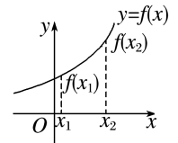
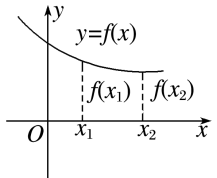
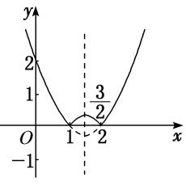
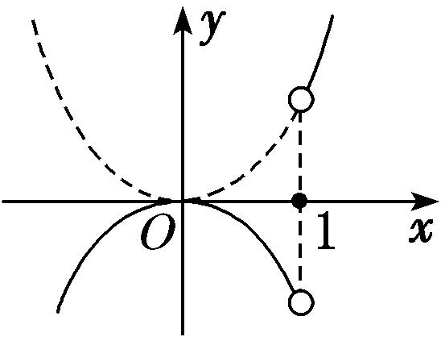
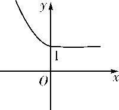
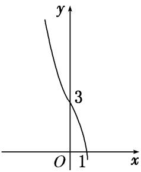
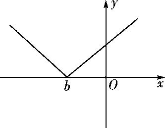
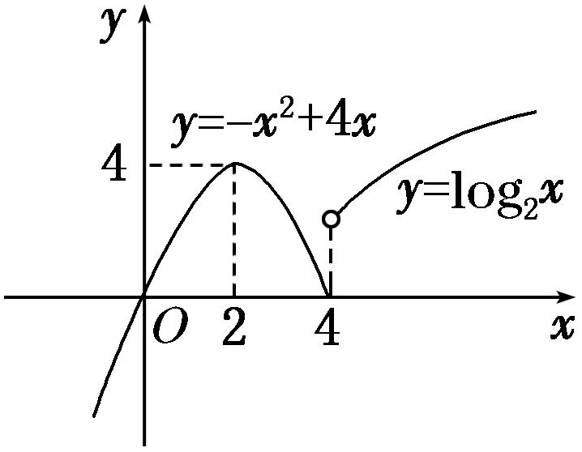

专题三　函数的单调性

1．增函数、减函数的定义

<table><tr><td></td><td>
增函数
</td><td>
减函数
</td></tr><tr><td rowspan="2">
定义
</td><td colspan="2">
一般地，设函数<em>f</em>(<em>x</em>)的定义域为<em>I</em>，如果对于定义域<em>I</em>内某个区间<em>D</em>上的任意两个自变量的值<em>x</em>1，<em>x</em>2
</td></tr><tr><td>
当<em>x</em>1&lt;<em>x</em>2时，都有<em>f</em>(<em>x</em>1)&lt;<em>f</em>(<em>x</em>2)，那么就说函数<em>f</em>(<em>x</em>)在区间<em>D</em>上是增函数
</td><td>
当<em>x</em>1&lt;<em>x</em>2时，都有<em>f</em>(<em>x</em>1)&gt;<em>f</em>(<em>x</em>2)，那么就说函数<em>f</em>(<em>x</em>)在区间<em>D</em>上是减函数
</td></tr><tr><td>
图象描述
</td><td>

自左向右看图象是上升的
</td><td>

自左向右看图象是下降的
</td></tr></table>

2．单调性、单调区间的定义
若函数*y*＝*f*(*x*)在区间*D*上是增函数或减函数，则称函数*y*＝*f*(*x*)在这一区间上具有(严格的)单调性，区间*D*叫做函数*y*＝*f*(*x*)的单调区间．

单调区间是定义域的子集，故求单调区间时应树立“定义域优先”的原则．单调区间只能用区间表示，不能用集合或不等式表示；如有多个单调区间应分开写，不能用并集符号“∪”连接，也不能用“或”连接，只能用“，”或“和”隔开．

2．常用结论

结论1：增函数与减函数形式的等价变形

<em>y</em>＝<em>f</em>(<em>x</em>)在区间<em>D</em>上是增函数⇔对∀<em>x</em>1&lt;<em>x</em>2，都有<em>f</em>(<em>x</em>1)&lt;<em>f</em>(<em>x</em>2)⇔(<em>x</em>1－<em>x</em>2)[<em>f</em>(<em>x</em>1)－<em>f</em>(<em>x</em>2)]&gt;0⇔&gt;0；
<em>y</em>＝<em>f</em>(<em>x</em>)在区间<em>D</em>上是减函数⇔对∀<em>x</em>1&lt;<em>x</em>2，都有<em>f</em>(<em>x</em>1)&gt;<em>f</em>(<em>x</em>2)⇔(<em>x</em>1－<em>x</em>2)[<em>f</em>(<em>x</em>1)－<em>f</em>(<em>x</em>2)]&lt;0⇔&lt;0．

结论2：单调性的运算性质  
（1）函数*y*＝*f*(*x*)与函数*y*＝*f*(*x*)＋*C*(*C*为常数)具有相同的单调性．  
（2）若*k*>0，则*kf*(*x*)与*f*(*x*)单调性相同；若*k*<0，则*kf*(*x*)与*f*(*x*)单调性相反．

  
（3）在公共定义域内，函数*y*＝*f*(*x*)(*f*(*x*)＞0)与和具有相同的单调性．  
（4）在公共定义域内，函数*y*＝*f*(*x*)(*f*(*x*)≠0)与*y*＝单调性相反．  
（5）若*f*(*x*)，*g*(*x*)均为区间*A*上的增(减)函数，则*f*(*x*)＋*g*(*x*)也是区间*A*上的增(减)函数．  
（6）若*f*(*x*)，*g*(*x*)均为区间*A*上的增(减)函数，且*f*(*x*)＞0，*g*(*x*)＞0，则*f*(*x*)•*g*(*x*)也是区间*A*上的增(减)函数．

结论3：复合函数的单调性

复合函数*y*＝*f*[*g*(*x*)]的单调性与*y*＝*f*(*u*)和*u*＝*g*(*x*)的单调性有关．若两个简单函数的单调性相同，则它们的复合函数为增函数；若两个简单函数的单调性相反，则它们的复合函数为减函数．简记：“同增异减”．

结论4：奇函数与偶函数的单调性

奇函数在其关于原点对称的区间上单调性相同，偶函数在其关于原点对称的区间上单调性相反．

结论5：对勾函数与飘带函数的单调性

对勾函数：*f*(*x*)＝*ax*＋(*ab*＞0)

  
（1）当*a*＞0，*b*＞0时，*f*(*x*)在(－∞，－]，[，＋∞)上是增函数，在[－，0)，(0，]上是减函数；

  
（2）当*a＜* 0，*b＜* 0时，*f*(*x*)在(－∞，－]，[，＋∞)上是减函数，在[－，0)，(0，]上是增函数；
飘带函数：*f*(*x*)＝*ax*＋(*ab*＜0)

  
（1）当*a*＞0，*b＜* 0时，*f*(*x*)在(－∞，0)，(0，＋∞)上都是增函数；  
（2）当*a＜* 0，*b＞* 0时，*f*(*x*)在(－∞，0)，(0，＋∞)上都是减函数；
考点一　确定函数的单调性或单调区间

【方法总结】

确定函数的单调性或单调区间的常用方法  
（1）利用已知函数的单调性，即转化为已知函数的和、差或复合函数确定函数的单调性或单调区间．  
（2）定义法：先求定义域，再利用单调性的定义确定函数的单调性或单调区间．  
（3）图象法：如果*f*(*x*)是以图象形式给出的，或者*f*(*x*)的图象易作出，可由图象的直观性确定函数的单调性或单调区间．

【例题选讲】

[例1] （1） 下列函数中，在区间(0，＋∞)内单调递减的是(　　)

A．<em>y</em>＝－<em>x</em>　　　
B．<em>y</em>＝<em>x</em>2－<em>x</em>　　　
C．<em>y</em>＝ln <em>x</em>－<em>x</em>　　　
D．<em>y</em>＝e<em>x</em>－<em>x</em>
答案　A　解析　对于选项A，<em>y</em>1＝在(0，＋∞)内是减函数，<em>y</em>2＝<em>x</em>在(0，＋∞)内是增函数，则<em>y</em>＝－<em>x</em>在(0，＋∞)内是减函数，故选A．  
（2） 下列函数中，满足“∀<em>x</em>1，<em>x</em>2∈(0，＋∞)且<em>x</em>1≠<em>x</em>2，(<em>x</em>1－<em>x</em>2)·[<em>f</em>(<em>x</em>1)－<em>f</em>(<em>x</em>2)]&lt;0”的是(　　)

A．<em>f</em>(<em>x</em>)＝2<em>x</em>　　　　
B．<em>f</em>(<em>x</em>)＝|<em>x</em>－1|　　　　
C．<em>f</em>(<em>x</em>)＝－<em>x</em>　　　　
D．<em>f</em>(<em>x</em>)＝ln(<em>x</em>＋1)
答案　C　解析　由(<em>x</em>1－<em>x</em>2)·[<em>f</em>(<em>x</em>1)－<em>f</em>(<em>x</em>2)]&lt;0可知，<em>f</em>(<em>x</em>)在(0，＋∞)上是减函数，A、D选项中，<em>f</em>(<em>x</em>)为增函数；B中，<em>f</em>(<em>x</em>)＝|<em>x</em>－1|在(0，＋∞)上不单调；对于<em>f</em>(<em>x</em>)＝－<em>x</em>，因为<em>y</em>＝与<em>y</em>＝－<em>x</em>在(0，＋∞)上单调递减，因此<em>f</em>(<em>x</em>)在(0，＋∞)上是减函数．  
（3） 函数<em>f</em>(<em>x</em>)＝|<em>x</em>2－3<em>x</em>＋2|的单调递增区间是(　　)

A．　　
B．和[2，＋∞)　　
C．(－∞，1]和　　
D．和[2，＋∞)
答案　B　解析　<em>y</em>＝|<em>x</em>2－3<em>x</em>＋2|＝如图所示，函数的单调递增区间是和[2，＋∞)．

  
（4） 函数*y*＝的单调递增区间为\_\_\_\_\_\_\_\_\_\_，单调递减区间为\_\_\_\_\_\_\_\_\_\_\_\_．
答案　[2，＋∞)　(－∞，－3]　解析　令<em>u</em>＝<em>x</em>2＋<em>x</em>－6，则<em>y</em>＝可以看作是由<em>y</em>＝与<em>u</em>＝<em>x</em>2＋<em>x</em>－6复合而成的函数．令<em>u</em>＝<em>x</em>2＋<em>x</em>－6≥0，得<em>x</em>≤－3或<em>x</em>≥2．易知<em>u</em>＝<em>x</em>2＋<em>x</em>－6在(－∞，－3]上是减函数，在[2，＋∞)上是增函数，而<em>y</em>＝在[0，＋∞)上是增函数，∴<em>y</em>＝的单调递减区间为(－∞，－3]，单调递增区间为[2，＋∞)．  
（5） 函数<em>y</em>＝(<em>x</em>2－3<em>x</em>＋2)的单调递增区间为\_\_\_\_\_\_\_\_\_\_，单调递减区间为\_\_\_\_\_\_\_\_\_\_\_\_．
答案　(－∞，1)　(2，＋∞)　解析　令<em>u</em>＝<em>x</em>2－3<em>x</em>＋2，则原函数是<em>y</em>＝<em>u</em>与<em>u</em>＝<em>x</em>2－3<em>x</em>＋2的复合函数．令<em>u</em>＝<em>x</em>2－3<em>x</em>＋2&gt;0，则<em>x</em>&lt;1或<em>x</em>&gt;2．所以函数<em>y</em>＝(<em>x</em>2－3<em>x</em>＋2)的定义域为(－∞，1)∪(2，＋∞)．又<em>u</em>＝<em>x</em>2－3<em>x</em>＋2的对称轴为<em>x</em>＝，且开口向上，所以<em>u</em>＝<em>x</em>2－3<em>x</em>＋2在(－∞，1)上是单调减函数，在(2，＋∞)上是单调增函数，而<em>y</em>＝<em>u</em>在(0，＋∞)上是单调减函数，所以<em>y</em>＝(<em>x</em>2－3<em>x</em>＋2)的单调递减区间为(2，＋∞)，单调递增区间为(－∞，1)．

【对点训练】

1．给定函数①<em>y</em>＝<em>x</em>，②<em>y</em>＝log(<em>x</em>＋1)，③<em>y</em>＝|<em>x</em>－1|，④<em>y</em>＝2<em>x</em>＋1．其中在区间(0，1)上单调递减的函数

序号是(　　)

A．①②　　　　　　
B．②③　　　　　　
C．③④　　　　　　
D．①④

1．答案　B　解析　①*y*＝*x*在(0，1)上递增；②∵*t*＝*x*＋1在(0，1)上递增，且0<<1，故*y*＝log (*x*＋

1)在(0，1)上递减；③结合图象可知<em>y</em>＝|<em>x</em>－1|在(0，1)上递减；④∵<em>u</em>＝<em>x</em>＋1在(0，1)上递增，且2&gt;1，故<em>y</em>＝2<em>x</em>＋1在(0，1)上递增．故在区间(0，1)上单调递减的函数序号是②③．

2．下列四个函数中，在*x*∈(0，＋∞)上为增函数的是(　　)

A．<em>f</em>(<em>x</em>)＝3－<em>x</em>　　　　
B．<em>f</em>(<em>x</em>)＝<em>x</em>2－3<em>x</em>　　　　
C．<em>f</em>(<em>x</em>)＝－　　　　
D．<em>f</em>(<em>x</em>)＝－|<em>x</em>|

2．答案　C　解析　当<em>x</em>&gt;0时，<em>f</em>(<em>x</em>)＝3－<em>x</em>为减函数；当<em>x</em>∈时，<em>f</em>(<em>x</em>)＝<em>x</em>2－3<em>x</em>为减函数，当<em>x</em>∈

时，<em>f</em>(<em>x</em>)＝<em>x</em>2－3<em>x</em>为增函数；当<em>x</em>∈(0，＋∞)时，<em>f</em>(<em>x</em>)＝－为增函数；当<em>x</em>∈(0，＋∞)时，<em>f</em>(<em>x</em>)＝－|<em>x</em>|为减函数．

3．若函数<em>f</em>(<em>x</em>)满足“对任意<em>x</em>1，<em>x</em>2∈(0，＋∞)，当<em>x</em>1&lt;<em>x</em>2时，都有<em>f</em>(<em>x</em>1)&gt;<em>f</em>(<em>x</em>2)”，则<em>f</em>(<em>x</em>)的解析式可以是(　　)

A．<em>f</em>(<em>x</em>)＝(<em>x</em>－1)2　　　　
B．<em>f</em>(<em>x</em>)＝e<em>x</em>　　　　
C．<em>f</em>(<em>x</em>)＝　　　　
D．<em>f</em>(<em>x</em>)＝ln(<em>x</em>＋1)

3．答案　C　解析　根据条件知，<em>f</em>(<em>x</em>)在(0，＋∞)上单调递减．对于A，<em>f</em>(<em>x</em>)＝(<em>x</em>－1)2在(1，＋∞)上单调递

增，排除A；对于B，<em>f</em>(<em>x</em>)＝e<em>x</em>在(0，＋∞)上单调递增，排除B；对于C，<em>f</em>(<em>x</em>)＝在(0，＋∞)上单调递减，C正确；对于D，<em>f</em>(<em>x</em>)＝ln(<em>x</em>＋1)在(0，＋∞)上单调递增，排除D．

4．函数*f*(*x*)＝|*x*－2|*x*的单调减区间是(　　)

A．[1，2]　　　　　　
B．[－1，0]　　　　　　
C．[0，2]　　　　　　
D．[2，＋∞)

4．答案　A　解析　由于*f*(*x*)＝|*x*－2|*x*＝结合图象可知函数的单调减区间是[1，2]．

5．设函数<em>f</em>(<em>x</em>)＝<em>g</em>(<em>x</em>)＝<em>x</em>2<em>f</em>(<em>x</em>－1)，则函数<em>g</em>(<em>x</em>)的单调递减区间是(　　)

A．(－∞，0]　　　　　
B．[0，1)　　　　　
C．[1，＋∞)　　　　　
D．[－1，0]

5．答案　B　解析　由题知，*g*(*x*)＝可得函数*g*(*x*)的单调递减区间为[0，1)．故选B．

6．函数*y*＝的单调递增区间为(　　)

A．(1，＋∞)　　　　　
B．　　　　　
C．　　　　　
D．

6．答案　B　解析　令<em>u</em>＝2<em>x</em>2－3<em>x</em>＋1＝22－．因为<em>u</em>＝22－在上单调递减，函数

<em>y</em>＝<em>u</em>在<strong>R</strong>上单调递减．所以<em>y</em>＝2<em>x</em>2－3<em>x</em>＋1在上单调递增，即该函数的单调递增区间为．

7．已知函数*f*(*x*)＝，则该函数的单调递增区间为(　　)

A．(－∞，1]　　　　　
B．[3，＋∞)　　　　　
C．(－∞，－1]　　　　　
D．[1，＋∞)

7．答案　B　解析　设<em>t</em>＝<em>x</em>2－2<em>x</em>－3，由<em>t</em>≥0，即<em>x</em>2－2<em>x</em>－3≥0，解得<em>x</em>≤－1或<em>x</em>≥3．所以函数的定义域为(－

∞，－1]∪[3，＋∞)．因为函数<em>t</em>＝<em>x</em>2－2<em>x</em>－3的图象的对称轴为<em>x</em>＝1，所以函数<em>t</em>在(－∞，－1]上单调递减，在[3，＋∞)上单调递增．所以函数<em>f</em>(<em>x</em>)的单调递增区间为[3，＋∞)．

8．(2017·全国Ⅱ)函数<em>f</em>(<em>x</em>)＝ln(<em>x</em>2－2<em>x</em>－8)的单调递增区间是(　　)

A．(－∞，－2)　　　　
B．(－∞，1)　　　　
C．(1，＋∞)　　　　
D．(4，＋∞)

8．答案　D　解析　由<em>x</em>2－2<em>x</em>－8&gt;0，得<em>x</em>&gt;4或<em>x</em>&lt;－2．因此，函数<em>f</em>(<em>x</em>)＝ln(<em>x</em>2－2<em>x</em>－8)的定义域是(－∞，

－2)∪(4，＋∞)．又函数<em>y</em>＝<em>x</em>2－2<em>x</em>－8在(4，＋∞)上单调递增，由复合函数的单调性知，<em>f</em>(<em>x</em>)＝ln(<em>x</em>2－2<em>x</em>－8)的单调递增区间是(4，＋∞)．

考点二　比较函数值或自变量的大小

【方法总结】
比较函数值大小的思路：比较函数值的大小时，若自变量的值不在同一个单调区间内，要利用其函数性质，转化到同一个单调区间上进行比较，对于选择题、填空题能数形结合的尽量用图象法求解．

【例题选讲】

<strong>[例2]</strong> （1） 设偶函数<em>f</em>(<em>x</em>)的定义域为<strong>R</strong>，当<em>x</em>∈[0，＋∞)时，<em>f</em>(<em>x</em>)是增函数，则<em>f</em>(－2)，<em>f</em>(π)，<em>f</em>(－3)的大小关系是(　　)

A．*f*(π)>*f*(－3)>*f*(－2)　
B．*f*(π)>*f*(－2)>*f*(－3)　
C．*f*(π)<*f*(－3)<*f*(－2)　
D．*f*(π)<*f*(－2)<*f*(－3)
答案　A　解析　因为*f*(*x*)是偶函数，所以*f*(－3)＝*f*（3），*f*(－2)＝*f*（2）．又因为函数*f*(*x*)在[0，＋∞)上是增函数．所以*f*(π)>*f*（3）>*f*（2），即*f*(π)>*f*(－3)>*f*(－2)．  
（2） (2017·天津)已知奇函数<em>f</em>(<em>x</em>)在<strong>R</strong>上是增函数．若<em>a</em>＝－<em>f</em> ，<em>b</em>＝<em>f</em>(log24.1)，<em>c</em>＝<em>f</em>(20.8)，则<em>a</em>，<em>b</em>，<em>c</em>的大小关系为(　　)

A．*a*<*b*<*c*　　　　　
B．*b*<*a*<*c*　　　　　
C．*c*<*b*<*a*　　　　　
D．*c*<*a*<*b*
答案　C　解析　由<em>f</em>(<em>x</em>)是奇函数可得<em>a</em>＝－<em>f</em> ＝<em>f</em>(log25)．因为log25&gt;log24.1&gt;log24＝2&gt;20.8，且函数<em>f</em>(<em>x</em>)是增函数，所以<em>c</em>&lt;<em>b</em>&lt;<em>a</em>．  
（3） 已知函数<em>f</em>(<em>x</em>)＝log2<em>x</em>＋，若<em>x</em>1∈(1，2)，<em>x</em>2∈(2，＋∞)，则(　　)

A．<em>f</em>(<em>x</em>1)&lt;0，<em>f</em>(<em>x</em>2)&lt;0　　
B．<em>f</em>(<em>x</em>1)&lt;0，<em>f</em>(<em>x</em>2)&gt;0　　
C．<em>f</em>(<em>x</em>1)&gt;0，<em>f</em>(<em>x</em>2)&lt;0　　
D．<em>f</em>(<em>x</em>1)&gt;0，<em>f</em>(<em>x</em>2)&gt;0
答案　B　解析　因为函数<em>f</em>(<em>x</em>)＝log2<em>x</em>＋在(1，＋∞)上为增函数，且<em>f</em>（2）＝0，所以当<em>x</em>1∈(1，2)时，<em>f</em>(<em>x</em>1)&lt;<em>f</em>（2）＝0，当<em>x</em>2∈(2，＋∞)时，<em>f</em>(<em>x</em>2)&gt;<em>f</em>（2）＝0，即<em>f</em>(<em>x</em>1)&lt;0，<em>f</em>(<em>x</em>2)&gt;0．故选B．  
（4）已知函数<em>y</em>＝<em>f</em>(<em>x</em>)是<strong>R</strong>上的偶函数，当<em>x</em>1，<em>x</em>2∈(0，＋∞)，<em>x</em>1≠<em>x</em>2时，都有(<em>x</em>1－<em>x</em>2)·[<em>f</em>(<em>x</em>1)－<em>f</em>(<em>x</em>2)]&lt;0．设<em>a</em>＝ln，<em>b</em>＝(ln π)2，<em>c</em>＝ln，则(　　)

A．*f*(*a*)>*f*(*b*)>*f*(*c*)　　
B．*f*(*b*)>*f*(*a*)>*f*(*c*)　　
C．*f*(*c*)>*f*(*a*)>*f*(*b*)　　
D．*f*(*c*)>*f*(*b*)>*f*(*a*)
答案　C　解析　由题意可知<em>f</em>(<em>x</em>)在(0，＋∞)上是减函数，且<em>f</em>(<em>a</em>)＝<em>f</em>(|<em>a</em>|)，<em>f</em>(<em>b</em>)＝<em>f</em>(|<em>b</em>|)，<em>f</em>(<em>c</em>)＝<em>f</em>(|<em>c</em>|)，又|<em>a</em>|＝ln π&gt;1，|<em>b</em>|＝(ln π)2&gt;|<em>a</em>|，|<em>c</em>|＝ln π，且0&lt;ln π&lt;|<em>a</em>|，故|<em>b</em>|&gt;|<em>a</em>|&gt;|<em>c</em>|&gt;0，∴<em>f</em>(|<em>c</em>|)&gt;<em>f</em>(|<em>a</em>|)&gt;<em>f</em>(|<em>b</em>|)，即<em>f</em>(<em>c</em>)&gt;<em>f</em>(<em>a</em>)&gt;<em>f</em>(<em>b</em>)．  
（5）若2<em>x</em>＋5<em>y</em>≤2－<em>y</em>＋5－<em>x</em>，则有(　　)

A．*x*＋*y*≥0　　　　
B．*x*＋*y*≤0　　　　
C．*x*－*y*≤0　　　　
D．*x*－*y*≥0
答案　B　解析　设函数<em>f</em>(<em>x</em>)＝2<em>x</em>－5－<em>x</em>，易知<em>f</em>(<em>x</em>)为增函数，又<em>f</em>(－<em>y</em>)＝2－<em>y</em>－5<em>y</em>，由已知得<em>f</em>(<em>x</em>)≤<em>f</em>(－<em>y</em>)，∴<em>x</em>≤－<em>y</em>，∴<em>x</em>＋<em>y</em>≤0．

【对点训练】

9．已知函数<em>f</em>(<em>x</em>)的图象向左平移1个单位后关于<em>y</em>轴对称，当<em>x</em>2&gt;<em>x</em>1&gt;1时，[<em>f</em>(<em>x</em>2)－<em>f</em>(<em>x</em>1)]·(<em>x</em>2－<em>x</em>1)&lt;0恒成立，
设*a*＝*f*，*b*＝*f*（2），*c*＝*f*（3），则*a*，*b*，*c*的大小关系为(　　)

A．*c*>*a*>*b*　　　　　
B．*c*>*b*>*a*　　　　　
C．*a*>*c*>*b*　　　　　
D．*b*>*a*>*c*

9．答案　D　解析　由于函数*f*(*x*)的图象向左平移1个单位后得到的图象关于*y*轴对称，故函数*y*＝*f*(*x*)的

图象关于直线<em>x</em>＝1对称，所以<em>a</em>＝<em>f</em>＝<em>f</em>．当<em>x</em>2&gt;<em>x</em>1&gt;1时，[<em>f</em>(<em>x</em>2)－<em>f</em>(<em>x</em>1)](<em>x</em>2－<em>x</em>1)&lt;0恒成立，等价于函数<em>f</em>(<em>x</em>)在(1，＋∞)上单调递减，所以<em>b</em>&gt;<em>a</em>&gt;<em>c</em>．

10．已知函数<em>f</em>(<em>x</em>)在<strong>R</strong>上单调递减，且<em>a</em>＝33.1，<em>b</em>＝，<em>c</em>＝ln，则<em>f</em>(<em>a</em>)，<em>f</em>(<em>b</em>)，<em>f</em>(<em>c</em>)的大小关系为(　　)

A．*f*(*a*)＞*f*(*b*)＞*f*(*c*)　　　
B．*f*(*b*)＞*f*(*c*)＞*f*(*a*)　　　
C．*f*(*c*)＞*f*(*a*)＞*f*(*b*)　　　
D．*f*(*c*)＞*f*(*b*)＞*f*(*a*)

10．答案　D　解析　因为<em>a</em>＝33.1＞30＝1，0＜<em>b</em>＝＜＝1，<em>c</em>＝ln＜ln 1＝0，所以<em>c</em>＜<em>b</em>＜<em>a</em>，又因

为函数<em>f</em>(<em>x</em>)在<strong>R</strong>上单调递减，所以<em>f</em>(<em>c</em>)＞<em>f</em>(<em>b</em>)＞<em>f</em>(<em>a</em>)，故选D．

考点三　解函数不等式

【方法总结】

含“*f*”不等式的解法：首先根据函数的性质把不等式转化为*f*(*g*(*x*))>*f*(*h*(*x*))的形式，然后根据函数的单调性去掉“*f*”，转化为具体的不等式(组)，此时要注意*g*(*x*)与*h*(*x*)的取值应在外层函数的定义域内．

【例题选讲】

<strong>[例3]</strong> （1） 已知函数<em>f</em>(<em>x</em>)是定义在区间[0，＋∞)上的函数，且在该区间上单调递增，则满足<em>f</em>(2<em>x</em>－1)＜<em>f</em>的<em>x</em>的取值范围是(　　)

A．　　　　　　
B．　　　　　　
C．　　　　　　
D．
答案　D　解析　因为函数*f*(*x*)是定义在区间[0，＋∞)上的增函数，满足*f*(2*x*－1)＜*f*．所以0≤2*x*－1＜，解得≤*x*＜．  
（2） 已知函数<em>f</em>(<em>x</em>)是<strong>R</strong>上的增函数，<em>A</em>(0，－3)，<em>B</em>(3，1)是其图象上的两点，那么不等式－3＜<em>f</em>(<em>x</em>＋1)＜1的解集的补集是(全集为<strong>R</strong>)(　　)

A．(－1，2)　　　
B．(1，4)　　　
C．(－∞，－1)∪[4，＋∞)　　　
D．(－∞，－1]∪[2，＋∞)
答案　D　解析　由函数<em>f</em>(<em>x</em>)是<strong>R</strong>上的增函数，<em>A</em>(0，－3)，<em>B</em>(3，1)是其图象上的两点，知不等式－3＜<em>f</em>(<em>x</em>＋1)＜1即为<em>f</em>（0）＜<em>f</em>(<em>x</em>＋1)＜<em>f</em>（3），所以0＜<em>x</em>＋1＜3，所以－1＜<em>x</em>＜2，故不等式－3＜<em>f</em>(<em>x</em>＋1)＜1的解集的补集是(－∞，－1]∪[2，＋∞)．  
（3） 定义在[－2，2]上的函数<em>f</em>(<em>x</em>)满足(<em>x</em>1－<em>x</em>2)[<em>f</em>(<em>x</em>1)－<em>f</em>(<em>x</em>2)]&gt;0，<em>x</em>1≠<em>x</em>2，且<em>f</em>(<em>a</em>2－<em>a</em>)&gt;<em>f</em>(2<em>a</em>－2)，则实数<em>a</em>的取值范围为\_\_\_\_\_\_\_\_．
答案　[0，1)　解析　因为函数<em>f</em>(<em>x</em>)满足(<em>x</em>1－<em>x</em>2)[<em>f</em>(<em>x</em>1)－<em>f</em>(<em>x</em>2)]&gt;0，<em>x</em>1≠<em>x</em>2，所以函数在[－2，2]上单调递增，所以－2≤2<em>a</em>－2&lt;<em>a</em>2－<em>a</em>≤2，解得0≤<em>a</em>&lt;1．  
（4） *f*(*x*)是定义在(0，＋∞)上的单调增函数，满足*f*(*xy*)＝*f*(*x*)＋*f*(*y*)，*f*（3）＝1，当*f*(*x*)＋*f*(*x*－8)≤2时，*x*的取值范围是(　　)

A．(8，＋∞)　　　　　
B．(8，9]　　　　　
C．[8，9]　　　　　
D．(0，8)
答案　B　解析　2＝1＋1＝*f*（3）＋*f*（3）＝*f*（9），由*f*(*x*)＋*f*(*x*－8)≤2，可得*f*[*x*(*x*－8)]≤*f*（9），因为*f*(*x*) 是定义在(0，＋∞)上的增函数，所以有解得8<*x*≤9．  
（5） (2015·全国Ⅱ)设函数*f*(*x*)＝ln(1＋|*x*|)－，则使得*f*(*x*)>*f*(2*x*－1)成立的*x*的取值范围是(　　)

A．　　　
B．∪(1，＋∞)　　　
C．　　　
D．∪
答案　A　解析　∵<em>f</em>(－<em>x</em>)＝ln(1＋|－<em>x</em>|)－＝<em>f</em>(<em>x</em>)，∴函数<em>f</em>(<em>x</em>)为偶函数．∵当<em>x</em>≥0时，<em>f</em>(<em>x</em>)＝ln(1＋<em>x</em>)－，在(0，＋∞)上<em>y</em>＝ln(1＋<em>x</em>)递增，<em>y</em>＝－也递增，根据单调性的性质知，<em>f</em>(<em>x</em>)在(0，＋∞)上单调递增．综上可知：<em>f</em>(<em>x</em>)&gt;<em>f</em>(2<em>x</em>－1)⇔<em>f</em>(|<em>x</em>|)&gt;<em>f</em>(|2<em>x</em>－1|)⇔|<em>x</em>|&gt;|2<em>x</em>－1|⇔<em>x</em>2&gt;(2<em>x</em>－1)2⇔3<em>x</em>2－4<em>x</em>＋1&lt;0⇔&lt;<em>x</em>&lt;1．故选A．

【对点训练】

11．定义在<strong>R</strong>上的奇函数<em>y</em>＝<em>f</em>(<em>x</em>)在(0，＋∞)上单调递增，且<em>f</em>＝0，则满足<em>f</em>log<em>x</em>&gt;0的<em>x</em>的集合为\_\_\_\_\_\_\_\_．

11．答案　∪(1，3)　解析　由题意，*y*＝*f*(*x*)为奇函数且*f*＝0，所以*f*＝－*f*＝0，又*y*＝*f*(*x*)

在(0，＋∞)上单调递增，则*y*＝*f*(*x*)在(－∞，0)上单调递增，于是或即或解得0<*x*<或1<*x*<3．

12．已知函数<em>f</em>(<em>x</em>)＝ln <em>x</em>＋<em>x</em>，若<em>f</em>(<em>a</em>2－<em>a</em>)&gt;<em>f</em>(<em>a</em>＋3)，则正数<em>a</em>的取值范围是\_\_\_\_\_\_\_\_．

12．答案　(3，＋∞)　解析　因为*f*(*x*)＝ln *x*＋*x*在(0，＋∞)上是增函数，所以解得－3<*a*<

－1或*a*>3．又*a*>0，所以*a*>3．

13．设函数*f*(*x*)＝若*f*(*a*＋1)≥*f*(2*a*－1)，则实数*a*的取值范围是(　B　)

A．(－∞，1]　　　　　
B．(－∞，2]　　　　　
C．[2，6]　　　　　
D．[2，＋∞)

13．答案　B　解析　易知函数*f*(*x*)在定义域(－∞，＋∞)上是增函数，∵*f*(*a*＋1)≥*f*(2*a*－1)，∴*a*＋1≥2*a*－1，
解得*a*≤2．故实数*a*的取值范围是(－∞，2]．

14．(2018·全国Ⅰ)设函数*f*(*x*)＝则满足*f*(*x*＋1)＜*f*(2*x*)的*x*的取值范围是(　　)

A．(－∞，－1]　　　　
B．(0，＋∞)　　　　
C．(－1，0)　　　　
D．(－∞，0)

14．答案　D　解析　因为*f*(*x*)＝所以函数*f*(*x*)的图象如图所示．由图可知，当*x*＋1≤0且2*x*≤0

时，函数*f*(*x*)为减函数，故*f*(*x*＋1)＜*f*(2*x*)转化为*x*＋1＞2*x*，此时*x*≤－1；当2*x*＜0且*x*＋1＞0时，*f*(2*x*)＞1，*f*(*x*＋1)＝1，满足*f*(*x*＋1)＜*f*(2*x*)，此时－1＜*x*＜0．综上，不等式*f*(*x*＋1)＜*f*(2*x*)的解集为(－∞，－1]∪(－1，0)＝(－∞，0)．故选D．

15．已知*f*(*x*)＝不等式*f*(*x*＋*a*)>*f*(2*a*－*x*)在[*a*，*a*＋1]上恒成立，则实数*a*的取值范围

是\_\_\_\_\_\_\_\_．

15．答案　(－∞，－2)　解析　作出函数*f*(*x*)的图象的草图如图所示，易知函数*f*(*x*)在R上为单调递减函

数，所以不等式*f*(*x*＋*a*)>*f*(2*a*－*x*)在[*a*，*a*＋1]上恒成立等价于*x*＋*a*<2*a*－*x*，即*x*<在[*a*，*a*＋1]上恒成立，所以只需*a*＋1<，即*a*<－2．

考点四　求参数的取值范围

【方法总结】

求参数的值或取值范围的思路：根据其单调性直接构建参数满足的方程(组)(不等式(组))或先得到其图象的升降，再结合图象求解．求参数时需注意若函数在区间[*a*，*b*]上是单调的，则该函数在此区间的任意子区间上也是单调的．

【例题选讲】

<strong>[例4]</strong> （1） 如果二次函数<em>f</em>(<em>x</em>)＝3<em>x</em>2＋2(<em>a</em>－1)<em>x</em>＋<em>b</em>在区间(－∞，1)上是减函数，那么<em>a</em>的取值范围是\_\_\_\_\_\_\_\_．
答案　(－∞，－2]　解析　二次函数的对称轴方程为*x*＝－，由题意知－≥1，即*a*≤－2．  
（2） 已知函数*f*(*x*)＝*x*－＋在(1，＋∞)上是增函数，则实数*a*的取值范围是\_\_\_\_\_\_\_\_．
答案　[－1，＋∞)　解析　设1&lt;<em>x</em>1&lt;<em>x</em>2，∴<em>x</em>1<em>x</em>2&gt;1．∵函数<em>f</em>(<em>x</em>)在(1，＋∞)上是增函数，∴<em>f</em>(<em>x</em>1)－<em>f</em>(<em>x</em>2)＝<em>x</em>1－＋－＝(<em>x</em>1－<em>x</em>2)&lt;0．∵<em>x</em>1－<em>x</em>2&lt;0，∴1＋&gt;0，即<em>a</em>&gt;－<em>x</em>1<em>x</em>2．∵1&lt;<em>x</em>1&lt;<em>x</em>2，<em>x</em>1<em>x</em>2&gt;1，∴－<em>x</em>1<em>x</em>2&lt;－1，∴<em>a</em>≥－1．∴<em>a</em>的取值范围是[－1，＋∞)．  
（3）若函数*f*(*x*)＝*a*|*b*－*x*|＋2的单调递增区间是[0，＋∞)，则实数*a*，*b*的取值范围分别为\_\_\_\_\_\_\_\_\_\_．
答案　(0，＋∞)，0　解析　因为|*b*－*x*|＝|*x*－*b*|，*y*＝|*x*－*b*|的图象如下：

因为*f*(*x*)的单调递增区间为[0，＋∞)，所以*b*＝0，*a*>0．  
（4） 已知函数<em>f</em>(<em>x</em>)＝是<strong>R</strong>上的单调函数，则实数<em>a</em>的取值范围是(　　)

A．　　　　　
B．　　　　　
C．　　　　　
D．
答案　B　解析　由对数函数的定义可得<em>a</em>&gt;0，且<em>a</em>≠1．又函数<em>f</em>(<em>x</em>)在<strong>R</strong>上单调，而二次函数<em>y</em>＝<em>ax</em>2－<em>x</em>－的图象开口向上，所以函数<em>f</em>(<em>x</em>)在<strong>R</strong>上单调递减，故有即所以<em>a</em>∈．  
（5） 已知函数<em>f</em>(<em>x</em>)＝(<em>x</em>2－<em>ax</em>＋3<em>a</em>)在[1，＋∞)上单调递减，则实数<em>a</em>的取值范围是\_\_\_\_\_\_\_\_．
答案　　解析　令<em>t</em>＝<em>g</em>(<em>x</em>)＝<em>x</em>2－<em>ax</em>＋3<em>a</em>，易知<em>f</em>(<em>t</em>)＝<em>t</em>在其定义域上单调递减，要使<em>f</em>(<em>x</em>)＝(<em>x</em>2－<em>ax</em>＋3<em>a</em>)在[1，＋∞)上单调递减，则<em>t</em>＝<em>g</em>(<em>x</em>)＝<em>x</em>2－<em>ax</em>＋3<em>a</em>在[1，＋∞)上单调递增，且<em>t</em>＝<em>g</em>(<em>x</em>)＝<em>x</em>2－<em>ax</em>＋3<em>a</em>&gt;0，即所以即－&lt;<em>a</em>≤2．

【对点训练】

16．如果函数<em>f</em>(<em>x</em>)＝<em>ax</em>2＋2<em>x</em>－3在区间(－∞，4)上是单调递增的，则实数<em>a</em>的取值范围是(　　)

A．　　　
B．　　　
C．　　　
D．

16．答案　D　解析　当<em>a</em>＝0时，<em>f</em>(<em>x</em>)＝2<em>x</em>－3，在定义域<strong>R</strong>上是单调递增的，故在(－∞，4)上单调递增；
当*a*≠0时，二次函数*f*(*x*)的对称轴为*x*＝－，因为*f*(*x*)在(－∞，4)上单调递增，所以*a*<0，且－≥4，得－≤*a*<0．综上所述，得－≤*a*≤0．故选D．

17．若*f*(*x*)＝在区间(－2，＋∞)上是增函数，则实数*a*的取值范围是\_\_\_\_\_\_\_\_．

17．答案　(－∞，3)　解析　*f*(*x*)＝＝＝1＋，要使函数在区间(－2，＋∞)上是增函

数，需使*a*－3<0，解得*a*<3．

18．若<em>f</em>(<em>x</em>)＝－<em>x</em>2＋4<em>mx</em>与<em>g</em>(<em>x</em>)＝在区间[2，4]上都是减函数，则<em>m</em>的取值范围是(　D 　)

A．(－∞，0)∪(0，1]　　　
B．(－1，0)∪(0，1]　　　
C．(0，＋∞)　　　
D．(0，1]

18．答案　D　解析　函数<em>f</em>(<em>x</em>)＝－<em>x</em>2＋4<em>mx</em>的图象开口向下，且以直线<em>x</em>＝2<em>m</em>为对称轴，若在区间[2，4]

上是减函数，则2*m*≤2，解得*m*≤1；*g*(*x*)＝的图象由*y*＝的图象向左平移一个单位长度得到，若在区间[2，4]上是减函数，则2*m*>0，解得*m*>0．综上可得，*m*的取值范围是(0，1]．

19．已知<em>f</em>(<em>x</em>)＝满足对任意<em>x</em>1≠<em>x</em>2，都有&gt;0成立，那么<em>a</em>的取值范围是

\_\_\_\_\_\_\_\_．

19．答案　　解析　由已知条件得*f*(*x*)为增函数，∴解得≤*a*＜2，∴*a*的取

值范围是．

20．已知函数<em>f</em>(<em>x</em>)＝是<strong>R</strong>上的增函数，则实数<em>a</em>的取值范围是(　　)

A．[－3，0)　　　　　
B．(－∞，－2]　　　　　
C．[－3，－2]　　　　　
D．(－∞，0)

20．答案　C　解析　若<em>f</em>(<em>x</em>)是<strong>R</strong>上的增函数，则应满足解得－3≤<em>a</em>≤－2．

21．设函数*f*(*x*)＝若函数*y*＝*f*(*x*)在区间(*a*，*a*＋1)上单调递增，则实数*a*的取值范围是

(　　)

A．(－∞，1]　　　　
B．[1，4]　　　　
C．[4，＋∞)　　　　
D．(－∞，1]∪[4，＋∞)

21．答案　D　解析　作出函数*f*(*x*)的图象如图所示，由图象可知*f*(*x*)在(*a*，*a*＋1)上单调递增，需满足*a*≥4

或*a*＋1≤2，即*a*≤1或*a*≥4，故选D．

22．已知*f*(*x*)＝(*x*≠*a*)．  
（1）若*a*＝－2，试证*f*(*x*)在(－∞，－2)内单调递增；  
（2）若*a*＞0且*f*(*x*)在(1，＋∞)内单调递减，求*a*的取值范围．

22．解析　（1）证明：当*a*＝－2时，*f*(*x*)＝．

任取<em>x</em>1，<em>x</em>2∈(－∞，－2)，且<em>x</em>1＜<em>x</em>2，则<em>f</em>(<em>x</em>1)－<em>f</em>(<em>x</em>2)＝－＝．
因为(<em>x</em>1＋2)(<em>x</em>2＋2)＞0，<em>x</em>1－<em>x</em>2＜0，所以<em>f</em>(<em>x</em>1)－<em>f</em>(<em>x</em>2)＜0，即<em>f</em>(<em>x</em>1)＜<em>f</em>(<em>x</em>2)，
所以*f*(*x*)在(－∞，－2)内单调递增．  
（2）任取<em>x</em>1，<em>x</em>2∈(1，＋∞)，且<em>x</em>1＜<em>x</em>2，则<em>f</em>(<em>x</em>1)－<em>f</em>(<em>x</em>2)＝－＝．
因为<em>a</em>＞0，<em>x</em>2－<em>x</em>1＞0，又由题意知<em>f</em>(<em>x</em>1)－<em>f</em>(<em>x</em>2)＞0，所以(<em>x</em>1－<em>a</em>)(<em>x</em>2－<em>a</em>)＞0恒成立，所以<em>a</em>≤1．
所以0＜*a*≤1．所以*a*的取值范围为(0，1]．

23．已知定义在<strong>R</strong>上的函数<em>f</em>(<em>x</em>)满足：①<em>f</em>(<em>x</em>＋<em>y</em>)＝<em>f</em>(<em>x</em>)＋<em>f</em>(<em>y</em>)＋1，②当<em>x</em>&gt;0时，<em>f</em>(<em>x</em>)&gt;－1．  
（1）求<em>f</em>（0）的值，并证明<em>f</em>(<em>x</em>)在<strong>R</strong>上是单调增函数．  
（2）若<em>f</em>（1）＝1，解关于<em>x</em>的不等式<em>f</em>(<em>x</em>2＋2<em>x</em>)＋<em>f</em>(1－<em>x</em>)&gt;4．

23．解析　（1）令*x*＝*y*＝0，得*f*（0）＝－1．
在<strong>R</strong>上任取<em>x</em>1&gt;<em>x</em>2，则<em>x</em>1－<em>x</em>2&gt;0，<em>f</em>(<em>x</em>1－<em>x</em>2)&gt;－1．又<em>f</em>(<em>x</em>1)＝<em>f</em>[(<em>x</em>1－<em>x</em>2)＋<em>x</em>2]＝<em>f</em>(<em>x</em>1－<em>x</em>2)＋<em>f</em>(<em>x</em>2)＋1&gt;<em>f</em>(<em>x</em>2)，
所以函数<em>f</em>(<em>x</em>)在<strong>R</strong>上是单调增函数．  
（2）由<em>f</em>（1）＝1，得<em>f</em>（2）＝3，<em>f</em>（3）＝5．由<em>f</em>(<em>x</em>2＋2<em>x</em>)＋<em>f</em>(1－<em>x</em>)&gt;4得<em>f</em>(<em>x</em>2＋<em>x</em>＋1)&gt;<em>f</em>（3），
又函数<em>f</em>(<em>x</em>)在R上是增函数，故<em>x</em>2＋<em>x</em>＋1&gt;3，解得<em>x</em>&lt;－2或<em>x</em>&gt;1，
故原不等式的解集为{*x*|*x*<－2或*x*>1}．

