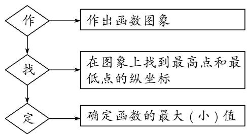
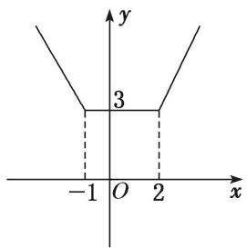
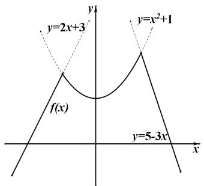
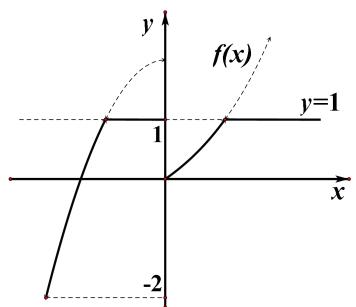

# 专题四 函数的最值(值域)

#### 1. 最大值与最小值的定义

一般地，设函数 $y=f(x)$ 的定义域为 I，如果存在实数 M 满足：  
（1）对于任意的 $x \in I$ ，都有 $f(x) \leq M$ ；存在 $x_0 \in I$ ，使得 $f(x_0) = M$ ，那么，我们称 $M$ 是函数 $y = f(x)$ 的最大值.  
（2）对于任意的 $x \in I$ ，都有 $f(x) \geq M$ ；存在 $x_0 \in I$ ，使得 $f(x_0) = M$ ，那么，我们称 $M$ 是函数 $y = f(x)$ 的最小值.

#### 2. 常用结论  
（1）闭区间上的连续函数一定存在最大值和最小值．当函数在闭区间上单调时最值一定在端点处取到.  
（2）开区间上的“单峰”函数一定存在最大值或最小值.

# 考点一 单调性法

# 【方法总结】

# 利用函数的单调性求最值的方法
如果一个函数为单调函数，则由定义域结合单调性(增、减)即可快速求出函数的最值(值域).  
（1）若函数 $y=f(x)$ 在区间 $[a, b]$ 上单调递增，则 $y_{\max}=f(b)$ ， $y_{\min}=f(a)$ .  
（2）若函数 $y=f(x)$ 在区间 $[a, b]$ 上单调递减，则 $y_{\max}=f(a)$ ， $y_{\min}=f(b)$ .  
（3）若函数 $y = f(x)$ 有多个单调区间，那就先求出各区间上的最值，再从各区间的最值中决定出最大(小)值．函数的最大(小)值是整个值域范围内的最大(小)值.  
（4）如果函数定义域为闭区间，则不但要考虑函数在该区间上的单调性，还要考虑端点处的函数值或者发展趋势.  
（5）在利用单调性求值域时，若定义域有一侧趋近于 $+\infty$ 或 $-\infty$ ，则要估计当 $x \to +\infty$ 或 $x \to -\infty$ 时，函数值是向一个常数无限接近还是也趋近于 $+\infty$ 或 $-\infty$ (即函数图象是否有水平渐近线)，同样若 $f(x)$ 的定义域抠去了某点或有一侧取不到边界，如 $x \in (a, b]$ ，则要确定当 $x \to a$ 时， $f(x)$ 的值是接近与一个常数(即临界值)还是趋向 $+\infty$ 或 $-\infty$ （即函数图象是否有竖直渐近线），这样可以使得值域更加准确.

# 【例题选讲】

[例 1] （1） 已知函数 $f(x)=\frac{x+2}{x}$ ，则函数 $f(x)$ 在 $x\in[2,8]$ 上的最大值为 \_\_\_\_.  
（2） 函数 $f(x)=\left(\frac{1}{3}\right)x-\log_{2}(x+2)$ 在区间 $[-1,1]$ 上的最大值为 \_\_\_\_.  
（3） 定义新运算 $\oplus$ ：当 $a \geq b$ 时， $a \oplus b = a$ ；当 $a < b$ 时， $a \oplus b = b^2$ ，则函数 $f(x) = (1 \oplus x)x - (2 \oplus x)$ ， $x \in [-2, 2]$ 的最大值等于（）

A.-1

B. 1

C. 6

D. 12  
（4） 若函数 $f(x) = -\frac{a}{x} + b (a > 0)$ 在 $\left[\frac{1}{2}, 2\right]$ 上的值域为 $\left[\frac{1}{2}, 2\right]$ ，则 $a =$ \_\_\_\_， $b =$ \_\_\_\_.  
（5） 设函数 $f(x)=\frac{2x}{x-2}$ 在区间 [3, 4] 上的最大值和最小值分别为 M, m，则 $\frac{m^{2}}{M}=(\quad)$

A. $\frac{2}{3}$

B. $\frac{3}{8}$

C. $\frac{3}{2}$

D. $\frac{8}{3}$

# 【对点训练】

1. 函数 $f(x) = \frac{2}{x - 1}$ 在 $[-6, -2]$ 上的最大值是 \_\_\_\_；最小值是 \_\_\_\_.  
2. 已知函数 $f(x) = \begin{cases} x + \frac{2}{x} - 3, & x \geq 1, \\ \lg (x^2 + 1), & x < 1, \end{cases}$ 则 $f(x)$ 的最小值是 \_\_\_\_.  
3. 已知函数 $f(x) = \frac{x + 2}{x}$ .  
（1）写出函数 $f(x)$ 的定义域和值域;  
（2）证明：函数 $f(x)$ 在 $(0, +\infty)$ 上为单调递减函数，并求 $f(x)$ 在 $x \in [2, 8]$ 上的最大值和最小值.

4. 已知 $f(x) = \frac{x^2 + 2x + a}{x}, x \in [1, +\infty)$ .  
（1）当 $a=\frac{1}{2}$ 时，用定义证明函数的单调性并求函数 $f(x)$ 的最小值；  
（2）若对任意 $x \in [1, +\infty)$ ， $f(x) > 0$ 恒成立，试求实数 a 的取值范围.

# 考点二 图象法

# 【方法总结】
即作出函数的图像，通过观察曲线所覆盖函数值的区域确定值域，以下函数常会考虑进行数形结合.  
（1）分段函数：尽管分段函数可以通过求出每段解析式的范围再取并集的方式解得值域，但对于一些便于作图的分段函数，数形结合也可很方便的计算值域.  
（2） $f(x)$ 的函数值为多个函数中函数值的最大值或最小值，此时需将多个函数作于同一坐标系中，然后确定靠下(或靠上)的部分为该 $f(x)$ 函数的图像，从而利用图像求得函数的值域.

图象法求函数最值的一般步骤  

# 【例题选讲】

[例 2] （1） 函数 $y=|x+1|+|x-2|$ 的值域为 \_\_\_\_.

  
（2） 已知函数 $f(x)=\left\{\begin{aligned}x^{2}-x,&0\leq x\leq2,\\ \frac{2}{x-1},&x>2,\end{aligned}\right.$ 函数 $f(x)$ 的最大值为 \_\_\_\_。最小值为 \_\_\_\_.  
（3） 对 $a, b \in \mathbf{R}$ , 记 $\max\{a, b\} = \begin{cases} a, & a \geq b, \\ b, & a < b, \end{cases}$ 函数 $f(x) = \max\{|x + 1|, |x - 2|\}(x \in \mathbf{R})$ 的最小值是 \_\_\_\_.  
（4） 定义 $\min\left\{a, b, c\right\}$ 为 a, b, c 中的最小值，设 $f(x)=\min\left\{2x+3, x^{2}+1, 5-3x\right\}$ ，则 $f(x)$ 的最大值是

  
（5） 设函数 $y = f(x)$ 定义域为 $\mathbf{R}$ ，对给定正数 $M$ ，定义函数 $f_{M}(x) = \begin{cases} f(x), & f(x) \leq M \\ M, & f(x) > M \end{cases}$ 则称函数 $f_{M}(x)$ 为 $f(x)$ 的“孪生函数”，若给定函数 $f(x) = \begin{cases} 2 - x^{2}, & -2 \leq x \leq 0 \\ 2^{x} - 1, & x > 0 \end{cases}$ ， $M = 1$ ，则 $y = f_{M}(x)$ 的值域为（）

A. $[-2, 1]$

B. $\left[-1,2\right]$

C. $(-∞, 2]$

D. $(-∞,-1]$

# 【对点训练】

5. 函数 $y=|x+1|-|x-2|$ 的最大值为 \_\_\_\_。最小值为 \_\_\_\_。

6. 函数 $f(x)=\left\{\begin{aligned}&\frac{1}{x},&x\geq1,\\&-x^{2}+2,&x<1\end{aligned}\right.$ 的最大值为 \_\_\_\_.

7. 对于任意实数 $a, b$ , 定义 $\min\{a, b\} = \begin{cases} a, & a \leq b, \\ b, & a > b. \end{cases}$ 函数 $f(x) = -x + 3$ , $g(x) = \log_2 x$ , 则函数 $h(x) = \min\{f(x), g(x)\}$ 的最大值是 \_\_\_\_.

8. 若函数 $f(x) = \begin{cases} -x + 6, & x \leq 2, \\ 3 + \log_a x, & x > 2 \end{cases}$ ( $a > 0$ 且 $a \neq 1$ ) 的值域是 $[4, +\infty)$ ，则实数 $a$ 的取值范围是（）

A. $(1, 2]$

B. $(0, 2]$

C. $[2, +\infty)$

D. $(1, 2\sqrt{2}]$

# 考点三 换元法

# 【方法总结】
换元法是将函数解析式中关于 $x$ 的部分表达式视为一个整体，并用新元 $t$ 代替，将解析式化归为熟悉的函数，进而解出最值(值域).  
（1）在换元的过程中，因为最后是要用新元解决值域，所以一旦换元，后面紧跟新元的取值范围.  
（2）换元的作用有两个:

①通过换元可将函数解析式简化，例如当解析式中含有根式时，通过将根式视为一个整体，换元后即

可“消灭”根式，达到简化解析式的目的.

②可将不熟悉的函数转化为会求值域的函数进行处理  
（3）换元的过程本质上是对研究对象进行重新选择的过程, 在有些函数解析式中明显每一项都是与 $x$ 的某个表达式有关, 那么自然将这个表达式视为研究对象.  
（4）换元也是将函数拆为两个函数复合的过程．在高中阶段，与指对数，三角函数相关的常见的复合函数分为两种：

① $y=a^{f(x)}$ ， $y=\log_{a}f(x)$ ， $y=\sin[f(x)]$ ：此类问题通常以指对，三角作为主要结构，在求值域时可先确定 $f(x)$ 的范围，再求出函数的范围.

② $y=f(a^{x})$ ， $y=f(\log_{a}x)$ ， $y=f(\sin x)$ ：此类函数的解析式会充斥的大量括号里的项，所以可利用换元将解析式转为 $y=f(t)$ 的形式，然后求值域即可．当然要注意有些解析式中的项不是直接给出，而是可作转化：例如 $y=4^{x}-2^{x+1}-8$ 可转化为 $y=(2^{x})^{2}-2\cdot2^{x}-8$ ，从而可确定研究对象为 $t=2^{x}$ .

# 【例题选讲】

[例 3] （1） 若 $x \in \left[-\frac{\pi}{6}, \frac{2\pi}{3}\right]$ ，则函数 $y = 4\sin^{2}x - 12\sin x - 1$ 的最大值为 \_\_\_\_，最小值为 \_\_\_\_.  
（2） 函数 $y=\sqrt{x}-x(x\geq0)$ 的最大值为 \_\_\_\_.  
（3） 函数 $f(x)=x+2\sqrt{1-x}$ 的最大值为 \_\_\_\_；  
（4） 函数 $y=x-\sqrt{4-x^{2}}$ 的值域为 \_\_\_\_.  
（5） 已知函数 $y=(\mathrm{e}^{x}-a)^{2}+(\mathrm{e}^{-x}-a)^{2}(a\in\mathbf{R}, a\neq0)$ ，求函数 y 的最小值.

# 【对点训练】

9. 若函数 $y = \left|\sqrt{|x|} - \frac{1}{x^2}\right|$ 在 $\{x | 1 \leq |x| \leq 4, x \in \mathbf{R}\}$ 上的最大值为 $M$ ，最小值为 $m$ ，则 $M - m = (\quad)$

A. $\frac{31}{16}$

B. 2

C. $\frac{9}{4}$

D. $\frac{11}{4}$

10. 函数 $y=2x+\sqrt{1-2x}$ 的值域为 \_\_\_\_.

11. 函数 $y=x+4+\sqrt{9-x^{2}}$ 的值域为 \_\_\_\_.

12. 已知函数 $f(x)$ 的值域为 $\left[\frac{3}{8}, \frac{4}{9}\right]$ ，则函数 $g(x) = f(x) + \sqrt{1 - 2f(x)}$ 的值域为 \_\_\_\_.

# 考点四 基本不等式法

# 【方法总结】

# 基本不等式求最值的方法

拼凑法：拼凑法求解最值，其实质就是先通过代数式变形拼凑出和或积为常数的两项，然后利用基本不等式求解最值。利用基本不等式求解最值时，要注意“一正、二定、三相等”，尤其是要注意验证等号成立的条件。

# 【例题选讲】

[例 4] （1） 若 x > 2，则 $y = \frac{1}{x - 2} + x$ 的最小值为 \_\_\_\_.  
（2） 函数 $f(x)=\frac{x^{2}+4}{x}$ 的值域为 \_\_\_\_.  
（3） 已知 $x > -1$ ，则 $y = \frac{(x + 10)(x + 2)}{x + 1}$ 的最小值为 \_\_\_\_.  
（4） 函数 $y = \sqrt{2018 - x} + \sqrt{x - 2017}$ 的值域是()

A. $[0, \sqrt{2}]$

B. $[1, \sqrt{2}]$

C. [1, 2]

D. $[0, 2]$

