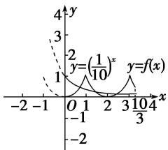
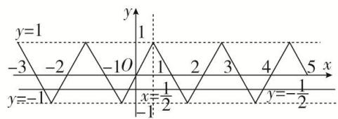

# 专题七 函数奇偶性与周期性的综合问题

周期性与奇偶性结合．此类问题多考查求值，把未知区间上的函数性质转化为已知区间上的函数性质求解．常利用奇偶性及周期性进行交换，即将所求函数值的自变量转化到已知解析式的函数定义域内求解.

# 考点一 已知函数的奇偶性与周期性，求函数值

# 【方法总结】

已知函数的奇偶性与周期性(显性)，可利用奇偶性与周期性，将其他区间上的求值转化到已知区间上，进而解决问题.

# 【例题选讲】

[例 1](1)设 $f(x)$ 是周期为 2 的奇函数，当 $0 \leq x \leq 1$ 时， $f(x) = 2x(1 - x)$ ，则 $f\left(-\frac{5}{2}\right) =$ \_\_\_\_.

(2)已知 $f(x)$ 是定义在 $\mathbf{R}$ 上周期为4的奇函数，当 $x\in (0,2]$ 时， $f(x) = 2^x +\log_2x$ ，则 $f(2019) = (\quad)$

A. 5

B. $\frac{1}{2}$

C. 2

D.-2

(3)设 $f(x)$ 是定义在 R 上周期为 4 的奇函数，若在区间 $[-2, 0) \cup (0, 2]$ 上， $f(x) = \begin{cases} ax + b, & -2 \leq x < 0, \\ ax - 1, & 0 < x \leq 2, \end{cases}$ ，则 $f(2021) =$ \_\_\_\_.

(4)已知 $f(x)$ 在 $\mathbf{R}$ 上是奇函数，且满足 $f(x + 4) = f(x)$ ，当 $x \in (-2,0)$ 时， $f(x) = 2x^2$ ，则 $f(2019)$ 等于（）

A. -2

B. 2

C. -98

D. 98

(5)定义在 $\mathbf{R}$ 上的函数 $f(x)$ 满足 $f(-x) = -f(x), f(x) = f(x + 4)$ ，且当 $x \in (-1,0)$ 时， $f(x) = 2^x + \frac{1}{5}$ ，则 $f(\log_2 20) = (\quad)$

A. 1

B. $\frac{4}{5}$

C. -1

D. $-\frac{4}{5}$

(6)(2017·山东)已知 $f(x)$ 是定义在 R 上的偶函数，且 $f(x+4)=f(x-2)$ 。若当 $x\in[-3,0]$ 时， $f(x)=6^{-x}$ ，则 $f(919)=$ \_\_\_\_。

(7) (2016·四川) 若函数 $f(x)$ 是定义在 $\mathbf{R}$ 上的周期为 2 的奇函数，当 $0 < x < 1$ 时， $f(x) = 4^x$ ，则 $f(-\frac{5}{2}) + f(2) =$ \_\_\_\_.

(8)若函数 $f(x)(x \in \mathbf{R})$ 是周期为 4 的奇函数，且在 $[0, 2]$ 上的解析式为 $f(x) = \begin{cases} x & 1 - x, & 0 \leq x \leq 1, \\ \sin \pi x, & 1 < x \leq 2, \end{cases}$ 则 $f\left(\frac{29}{4}\right) + f\left(\frac{41}{6}\right) =$ \_\_\_\_.

# 【对点训练】

1. 设 $f(x)$ 是周期为 4 的奇函数，当 $0 \leq x \leq 1$ 时， $f(x) = x(1 + x)$ ，则 $f\left(-\frac{9}{2}\right) = (\quad)$

A. $-\frac{3}{4}$

B. $-\frac{1}{4}$

C. $\frac{1}{4}$

D. $\frac{3}{4}$

2. 已知函数 $f(x)$ 是定义在 $\mathbf{R}$ 上的奇函数，其最小正周期为 4，且当 $x \in \left[ -\frac{3}{2}, 0 \right]$ 时， $f(x) = \log_2(-3x + 1)$ ，则 $f(2021)$ 等于（）

A. 4

B. 2

C.-2

D. $\log_{2}7$

3. 已知 $f(x)$ 是定义在 $\mathbf{R}$ 上以 3 为周期的偶函数，若 $f(1) < 1, f(5) = 2a - 3$ ，则实数 $a$ 的取值范围为 \_\_\_\_.

4. 已知定义在 $\mathbf{R}$ 上的奇函数 $f(x)$ 满足 $f(x + 5) = f(x)$ ，且当 $x \in \left(0, \frac{5}{2}\right)$ 时， $f(x) = x^3 - 3x$ ，则 $f(2018) = (\quad)$

A. 2

B. -18

C. 18

D.-2

5. 已知函数 $f(x)$ 是定义在 $\mathbf{R}$ 上的奇函数，且对于任意 $x \in \mathbf{R}$ ，恒有 $f(x - 1) = f(x + 1)$ 成立，当 $x \in [-1, 0]$ 时， $f(x) = 2^x - 1$ ，则 $f(2019) =$ \_\_\_\_.

6. 已知函数 $f(x)$ 是定义在 $\mathbf{R}$ 上的周期为 2 的奇函数，当 $0 < x < 1$ 时， $f(x) = 4^x$ ，则 $f\left(-\frac{5}{2}\right) + f(1) =$ \_\_\_\_.

7. 已知定义在 $\mathbf{R}$ 上的函数 $f(x)$ 是奇函数，且是以2为周期的周期函数，则 $f(1) + f(4) + f(7) = (\quad)$

A.-1

B. 0

C. 1

D. 4

8. 设定义在 $\mathbf{R}$ 上的函数 $f(x)$ 同时满足以下条件：① $f(x) + f(-x) = 0$ ；② $f(x) = f(x + 2)$ ；③ 当 $0 \leq x < 1$ 时， $f(x) = 2^x - 1$ 。则 $f\left(\frac{1}{2}\right) + f(1) + f\left(\frac{3}{2}\right) + f(2) + f\left(\frac{5}{2}\right) =$ \_\_\_\_.

# 考点二 已知函数的奇偶性，周期性(隐性)，求函数值

# 【方法总结】

已知函数的奇偶性与周期性(隐性)，可利用函数的奇偶性与周期性的性质结论1到结论9，先明确了周期再将其他区间上的求值转化到已知区间上，进而解决问题.

# 【例题选讲】

[例2] (1)若定义在 $\mathbf{R}$ 上的偶函数 $f(x)$ 满足 $f(x) > 0, f(x + 2) = \frac{1}{f(x)}$ 对任意 $x \in \mathbf{R}$ 恒成立，则 $f(2023) = \underline{\hspace{2cm}}$ .

(2)已知定义在 $\mathbf{R}$ 上的奇函数 $f(x)$ 满足 $f(x) = -f\left(x + \frac{3}{2}\right)$ ，且 $f(1) = 2$ ，则 $f(2018) =$ \_\_\_\_.

(3)对任意的实数 $x$ 都有 $f(x + 2) - f(x) = 2f(1)$ , 若 $y = f(x - 1)$ 的图象关于 $x = 1$ 对称, 且 $f(0) = 2$ , 则 $f(2019) + f(2020) = (\quad)$

A. 0

B. 2

C. 3

D. 4

(4)设 $f(x)$ 是定义在 R 上以 2 为周期的偶函数，当 $x \in [0, 1]$ 时， $f(x) = \log_2(x + 1)$ ，则函数 $f(x)$ 在[1, 2]上的解析式是 \_\_\_\_.

# 【对点训练】

9. 已知函数 $y = g(x)$ 满足 $g(x + 2) = -g(x)$ ，若 $y = f(x)$ 在 $(-2, 0) \cup (0, 2)$ 上为偶函数，且其解析式为 $f(x) = \left\{ \begin{array}{ll} \log_2 x, & 0 < x < 2, \\ g(x), & -2 < x < 0, \end{array} \right.$ 则 $g(-2017)$ 的值为（）

A. -1

B. 0

C. $\frac{1}{2}$

D. $-\frac{1}{2}$

10. 设 $f(x)$ 是定义在 $\mathbf{R}$ 上的奇函数，且对任意实数 $x$ ，恒有 $f(x + 2) = -f(x)$ . 当 $x \in [0, 2]$ 时， $f(x) = 2x - x^2$ . 当 $x \in [2, 4]$ 时，则 $f(x) =$ \_\_\_\_.

11. 已知定义在 $\mathbf{R}$ 上的奇函数 $f(x)$ 有 $f\left[\frac{x + \frac{5}{2}}{2}\right] + f(x) = 0$ ，当 $-\frac{5}{4} \leq x \leq 0$ 时， $f(x) = 2^x + a$ ，则 $f(16)$ 的值为（）

A. $\frac{1}{2}$

B. $-\frac{1}{2}$

C. $\frac{3}{2}$

D. $-\frac{3}{2}$

12. 已知 $f(x)$ 是定义在 R 上的偶函数，并且 $f(x)f(x+2)=-1$ ，当 $2 \leq x \leq 3$ 时， $f(x)=x$ ，则 $f(105.5)=$ \_\_\_\_.

13. 已知函数 $f(x)$ 为定义在 $\mathbf{R}$ 上的奇函数，当 $x \geq 0$ 时，有 $f(x + 3) = -f(x)$ ，且当 $x \in (0, 3)$ 时， $f(x) = x + 1$ ，则 $f(-2017) + f(2018) = (\quad)$

A. 3

B. 2

C. 1

D. 0

14. 已知函数 $f(x)$ 是定义在 $\mathbf{R}$ 上的偶函数，若对于 $x \geq 0$ ，都有 $f(x + 2) = -\frac{1}{f(x)}$ ，且当 $x \in [0, 2)$ 时， $f(x) = \log_2(x + 1)$ ，则求 $f(-2017) + f(2019)$ 的值为 \_\_\_\_.

# 考点三 已知函数的奇偶性与周期性，函数的零点问题

# 【方法总结】

已知函数的奇偶性与周期性，可将函数的零点问题转化为方程的根的问题，再将方程的根的问题转化为两个函数图像的交点问题．再结合函数的奇偶性与周期性画出函数的图像，从而求零点个数．求函数的所有零点的和或方程的所有根的和，同上先画出函数的图象，然后确定两图象的对称中心或对称轴，再由中点坐标公式即可求出它们的和.

# 【例题选讲】

[例 3] (1) 若定义在 R 上的偶函数 $f(x)$ ，满足 $f(x+2)=f(x)$ 且 $x\in[0,1]$ 时， $f(x)=x$ ，则方程 $f(x)=\log_{3}|x|$ 的实根个数是（）

A. 2

B. 3

C. 4

D. 6

(2)若偶函数 $f(x)$ 满足 $f(x - 1) = f(x + 1)$ ，且在 $x \in [0, 1]$ 时， $f(x) = x^2$ ，则关于 $x$ 的方程 $f(x) = \left(\frac{1}{10}\right)^x$ 在 $\left[0, \frac{10}{3}\right]$ 上的根的个数是（）

A. 1

B. 2

C. 3

D. 4

line

| x | y = (1/10)^x | y = f(x) |
|---|---|---|
| -2 | 3 | 1 |
| -1 | 2 | 1 |
| 0 | 1 | 1 |
| 1 | 0.5 | 0.5 |
| 2 | 0.25 | 0.25 |
| 3 | 0.125 | 0.125 |
| 4 | 0.0625 | 0.0625 |

(3)已知函数 $f(x)$ 对任意的 $x \in \mathbf{R}$ ，都有 $f(\frac{1}{2} + x) = f(\frac{1}{2} - x)$ ，函数 $f(x + 1)$ 是奇函数，当 $-\frac{1}{2} \leq x \leq \frac{1}{2}$ 时， $f(x) = 2x$ ，则方程 $f(x) = -\frac{1}{2}$ 在区间 $[-3, 5]$ 内的所有根的和为 \_\_\_\_.

line

| x | y |
|---|---|
| -3 | 1 |
| -2 | -2 |
| -1 | -10 |
| 0 | 1 |
| 1 | 1 |
| 2 | 2 |
| 3 | 3 |
| 4 | 4 |
| 5 | -1/2 |
| -6 | -1/2 |

# 【对点训练】

15. 设函数 $f(x)$ 是定义在 $\mathbf{R}$ 上的偶函数，且 $f(x + 2) = f(2 - x)$ ，当 $x \in [-2, 0]$ 时， $f(x) = \left(\frac{\sqrt{2}}{2}\right)^x - 1$ ，则在区间 $(-2, 6)$ 上关于 $x$ 的方程 $f(x) - \log_8(x + 2) = 0$ 的解的个数为（）

A. 1

B. 2

C. 3

D. 4

16. 若偶函数 $y = f(x)$ ， $x \in \mathbf{R}$ 满足 $f(x + 2) = -f(x)$ ，且当 $x \in [0, 2]$ 时， $f(x) = 2 - x^2$ ，则方程 $f(x) = \sin |x|$ 在 $[-10, 10]$ 内的根的个数为 \_\_\_\_.

17. 已知函数 $f(x)$ 是定义在 $(- \infty, 0) \cup (0, +\infty)$ 上的偶函数，当 $x > 0$ 时， $f(x) = \begin{cases} 2^{|x-1|}, & 0 < x \leq 2 \\ \frac{1}{2} f(x - 2), & x > 2 \end{cases}$ ，则函数 $g(x) = 4f(x) - 1$ 的零点个数为（）

A. 2

B. 4

C. 6

D. 8

18. 定义在 $\mathbf{R}$ 上的偶函数 $f(x)$ 满足 $f(x + 1) = -f(x)$ ，当 $x \in [0, 1]$ 时， $f(x) = -2x + 1$ ，设函数 $g(x) = \left(\frac{1}{2}\right)^{|x - 1|} (-1 \leq x \leq 3)$ ，则函数 $f(x)$ 与 $g(x)$ 的图象所有交点的横坐标之和为（）

A. 2

B. 4

C. 6

D. 8

19. 已知定义在非零实数集上的奇函数 $y = f(x)$ ，函数 $y = f(x - 2)$ 与 $g(x) = \sin \frac{\pi x}{2}$ 图象共有4个交点，则该4个交点横坐标之和为（）

A. 2

B. 4

C. 6

D. 8

20. 已知函数 $f(x)$ 是定义在 $\mathbf{R}$ 上的偶函数，且 $f(-x - 1) = f(x - 1)$ ，当 $x \in [-1, 0]$ 时， $f(x) = -x^3$ ，则关于 $x$ 的方程 $f(x) = |\cos \pi x|$ 在 $\left[-\frac{5}{2}, \frac{1}{2}\right]$ 上的所有实数解之和为（）

A. -7

B. -6

C.-3

D. -1

