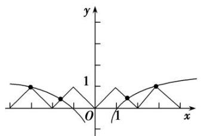
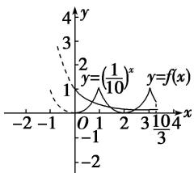
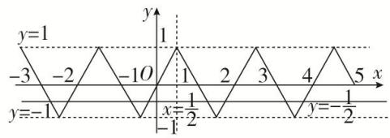
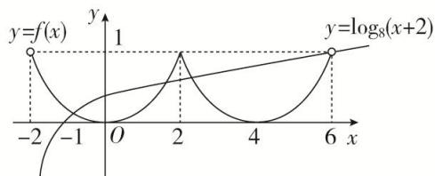
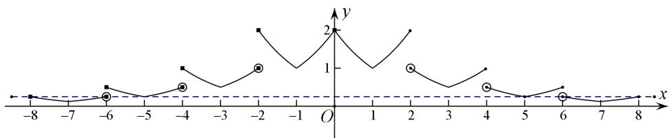
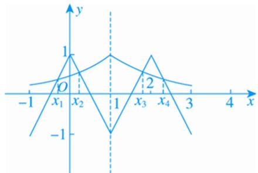
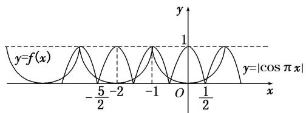

# 专题七 函数奇偶性与周期性的综合问题

周期性与奇偶性结合．此类问题多考查求值，把未知区间上的函数性质转化为已知区间上的函数性质求解．常利用奇偶性及周期性进行交换，即将所求函数值的自变量转化到已知解析式的函数定义域内求解.

# 考点一 已知函数的奇偶性与周期性，求函数值

# 【方法总结】

已知函数的奇偶性与周期性(显性)，可利用奇偶性与周期性，将其他区间上的求值转化到已知区间上，进而解决问题.

# 【例题选讲】

[例 1]（1）设 $f(x)$ 是周期为 2 的奇函数，当 $0 \leq x \leq 1$ 时， $f(x) = 2x(1 - x)$ ，则 $f\left(-\frac{5}{2}\right) =$ \_\_\_\_.
答案 $-\frac{1}{2}$ 解析 由题意可知， $f\left(-\frac{5}{2}\right)=f\left(-\frac{1}{2}\right)=-f\left(\frac{1}{2}\right)=-2\times\frac{1}{2}\times\left(1-\frac{1}{2}\right)=-\frac{1}{2}.$  
（2）已知 $f(x)$ 是定义在 $\mathbf{R}$ 上周期为4的奇函数，当 $x\in (0,2]$ 时， $f(x) = 2^x +\log_2x$ ，则 $f(2019) = (\quad)$

A. 5

B. $\frac{1}{2}$

C. 2

D.-2
答案 D 解析 由题意得 $f(2019)=f(4\times505-1)=f(-1)=-f(1)=-(2^{1}+\log_{2}1)=-2$ ，故选 D.  
（3）设 $f(x)$ 是定义在 R 上周期为 4 的奇函数，若在区间 $[-2, 0) \cup (0, 2]$ 上， $f(x) = \begin{cases} ax + b, & -2 \leq x < 0, \\ ax - 1, & 0 < x \leq 2, \end{cases}$ ，则 $f(2021) =$ \_\_\_\_.
答案 $-\frac{1}{2}$ 解析 设 $0 < x \leq 2$ ，则 $-2 \leq -x < 0$ ， $f(-x) = -ax + b$ 。因为 $f(x)$ 是定义在 $\mathbf{R}$ 上周期为 4 的奇函数，所以 $f(-x) = -f(x) = -ax + 1 = -ax + b$ ，所以 $b = 1$ 。而 $f(-2) = f(-2 + 4) = f(2)$ ，所以 $-2a + b = 2a - 1$ ，解得 $a = \frac{1}{2}$ ，所以 $f(2021) = f(1) = \frac{1}{2} \times 1 - 1 = -\frac{1}{2}$ 。  
（4）已知 $f(x)$ 在 R 上是奇函数，且满足 $f(x+4)=f(x)$ ，当 $x\in(-2,0)$ 时， $f(x)=2x^{2}$ ，则 $f(2019)$ 等于()

A.-2

B. 2

C. -98

D. 98
答案 B 解析 由 $f(x+4)=f(x)$ 知， $f(x)$ 是周期为 4 的函数， $f(2019)=f(504\times4+3)=f(3)$ ，又 $f(x+4)=f(x)$ ，∴ $f(3)=f(-1)$ ，由 $-1\in(-2,0)$ 得 $f(-1)=2$ ，∴ $f(2019)=2$ .  
（5）定义在 $\mathbf{R}$ 上的函数 $f(x)$ 满足 $f(-x) = -f(x), f(x) = f(x + 4)$ ，且当 $x \in (-1,0)$ 时， $f(x) = 2^x + \frac{1}{5}$ ，则 $f(\log_2 20) = (\quad)$

A. 1

B. $\frac{4}{5}$

C.-1

D. $-\frac{4}{5}$
答案 C 解析 因为 $x \in \mathbb{R}$ ，且 $f(-x) = -f(x)$ ，所以函数为奇函数。因为 $f(x) = f(x + 4)$ ，所以函数的周期为 4。故 $f(\log_220) = f(\log_220 - 4) = f\left(\log_2\frac{5}{4}\right) = -f\left(-\log_2\frac{5}{4}\right) = -f\left(\log_2\frac{4}{5}\right) = -\left(2^{\log_2\frac{4}{5}} + \frac{1}{5}\right) = -\left(\frac{4}{5} + \frac{1}{5}\right) = -1$ 。故选 C.  
（6）(2017·山东)已知 $f(x)$ 是定义在 R 上的偶函数，且 $f(x + 4) = f(x - 2)$ 。若当 $x \in [-3, 0]$ 时， $f(x) = 6^{-x}$ ，则 $f(919) =$ \_\_\_\_.
答案 6 解析 $\because f(x + 4) = f(x - 2), \therefore f((x + 2) + 4) = f((x + 2) - 2)$ ，即 $f(x + 6) = f(x), \therefore f(x)$ 是周期为 6 的周期函数， $\therefore f(919) = f(153 \times 6 + 1) = f(1)$ . 又 $f(x)$ 是定义在 $\mathbf{R}$ 上的偶函数， $\therefore f(1) = f(-1) = 6$ ，即 $f(919) = 6$ .  
（7） (2016·四川) 若函数 $f(x)$ 是定义在 $\mathbf{R}$ 上的周期为 2 的奇函数，当 $0 < x < 1$ 时， $f(x) = 4^x$ ，则 $f(-\frac{5}{2}) + f(2) =$ \_\_\_\_.
答案 -2 解析：因为函数 $f(x)$ 是定义在 $\mathbf{R}$ 上的周期为 2 的奇函数，所以 $f(0) = 0$ ， $f(x + 2) = f(x)$ ，所以 $f(-\frac{5}{2}) + f(2) = f\left(-\frac{5}{2} + 2\right) + f(0) = f\left(-\frac{1}{2}\right) + 0 = -f\left(\frac{1}{2}\right) = -4\frac{1}{2} = -2$ .  
（8）若函数 $f(x)(x \in \mathbf{R})$ 是周期为4的奇函数，且在[0, 2]上的解析式为 $f(x) = \begin{cases} x & 1 - x, & 0 \leq x \leq 1, \\ \sin \pi x, & 1 < x \leq 2, \end{cases}$ 则 $f\left(\frac{29}{4}\right) + f\left(\frac{41}{6}\right) =$ \_\_\_\_.
答案 $\frac{5}{16}$ 解析 由于函数 $f(x)$ 是周期为4的奇函数，所以 $f\left(\frac{29}{4}\right) + f\left(\frac{41}{6}\right) = f\left(2\times 4 - \frac{3}{4}\right) + f\left(2\times 4 - \frac{7}{6}\right) =$ $f\left(-\frac{3}{4}\right) + f\left(-\frac{7}{6}\right) = -f\left(\frac{3}{4}\right) - f\left(\frac{7}{6}\right) = -\frac{3}{16} +\sin \frac{\pi}{6} = \frac{5}{16}.$

# 【对点训练】

1. 设 $f(x)$ 是周期为 4 的奇函数，当 $0 \leq x \leq 1$ 时， $f(x) = x(1 + x)$ ，则 $f\left(-\frac{9}{2}\right) = (\quad)$

A. $-\frac{3}{4}$

B. $-\frac{1}{4}$

C. $\frac{1}{4}$

D. $\frac{3}{4}$

1. 答案 A 解析 $\because f(x)$ 是周期为 4 的奇函数， $\therefore f\left(-\frac{9}{2}\right) = -f\left(\frac{9}{2}\right) = -f\left(\frac{1}{2}\right)$ ，又 $0 \leq x \leq 1$ 时， $f(x) = x(1 + x)$ ，故 $f\left(-\frac{9}{2}\right) = -f\left(\frac{1}{2}\right) = -\frac{1}{2}\left(1 + \frac{1}{2}\right) = -\frac{3}{4}$ .

2. 已知函数 $f(x)$ 是定义在 $\mathbf{R}$ 上的奇函数，其最小正周期为 4，且当 $x \in \left[ -\frac{3}{2}, 0 \right]$ 时， $f(x) = \log_2(-3x + 1)$ ，则 $f(2021)$ 等于（）

A. 4

B. 2

C.-2

D. $\log_{2}7$

2. 答案 C 解析 $\because$ 函数 $f(x)$ 是定义在 $\mathbf{R}$ 上的奇函数，其最小正周期为 4， $\therefore f(2021) = f(4 \times 505 + 1) = f(1) = -f(-1)$ . $\because -1 \in \left[-\frac{3}{2}, 0\right]$ ，且当 $x \in \left[-\frac{3}{2}, 0\right]$ 时， $f(x) = \log_2(-3x + 1)$ ， $\therefore f(-1) = \log_2[-3 \times (-1) + 1] = 2$ ， $\therefore f(2021) = -f(-1) = -2$ .

3. 已知 $f(x)$ 是定义在 $\mathbf{R}$ 上以 3 为周期的偶函数，若 $f(1) < 1, f(5) = 2a - 3$ ，则实数 $a$ 的取值范围为 \_\_\_\_.

3. 答案 $(-∞,2)$ 解析 $\because f(x)$ 是定义在 R 上的周期为 3 的偶函数， $\therefore f(5)=f(5-6)=f(-1)=f(1)$ ， $\because f(1)<1$ ， $f(5)=2a-3<1$ ，即 a<2.

4. 已知定义在 $\mathbf{R}$ 上的奇函数 $f(x)$ 满足 $f(x + 5) = f(x)$ ，且当 $x \in \left[0, \frac{5}{2}\right]$ 时， $f(x) = x^3 - 3x$ ，则 $f(2018) = (\quad)$

A. 2

B. -18

C. 18

D. -2

4. 答案 D 解析 $\because f(x)$ 满足 $f(x + 5) = f(x)$ ， $\therefore f(x)$ 是周期为 5 的函数， $\therefore f(2018) = f(403 \times 5 + 3) = f(3) = f(5 - 2) = f(-2)$ ， $\because f(x)$ 是奇函数，且当 $x \in \left[0, \frac{5}{2}\right]$ 时， $f(x) = x^3 - 3x$ ， $\therefore f(-2) = -f(2) = -(2^3 - 3 \times 2) = -2$ ，故 $f(2018) = -2$ .

5. 已知函数 $f(x)$ 是定义在 $\mathbf{R}$ 上的奇函数，且对于任意 $x \in \mathbf{R}$ ，恒有 $f(x - 1) = f(x + 1)$ 成立，当 $x \in [-1, 0]$

时， $f(x)=2^{x}-1$ ，则 $f(2019)=$ \_\_\_\_.

5. 答案 $\frac{1}{2}$ 解析 由 $f(x-1)=f(x+1)$ 得 $f(x)$ 的周期为 2，则 $f(2019)=f(1)=-f(-1)=-(2^{-1}-1)=\frac{1}{2}$ .

6. 已知函数 $f(x)$ 是定义在 $\mathbf{R}$ 上的周期为 2 的奇函数，当 $0 < x < 1$ 时， $f(x) = 4^x$ ，则 $f\left(-\frac{5}{2}\right) + f(1) =$ \_\_\_\_.

6. 答案 -2 解析 $\because f(x)$ 是定义在 $\mathbf{R}$ 上的奇函数， $\therefore f(x) = -f(-x)$ ，又 $\because f(x)$ 的周期为 2， $\therefore f(x + 2) = f(x)$ ， $\therefore f(x + 2) = -f(-x)$ ，即 $f(x + 2) + f(-x) = 0$ ，令 $x = -1$ ，得 $f(1) + f(1) = 0$ ， $\therefore f(1) = 0$ 。又 $\because f\left(-\frac{5}{2}\right) = f\left(-\frac{1}{2}\right) = -f\left(\frac{1}{2}\right) = -4\frac{1}{2} = -2$ 。 $\therefore f\left(-\frac{5}{2}\right) + f(1) = -2$ 。

7. 已知定义在 $\mathbf{R}$ 上的函数 $f(x)$ 是奇函数，且是以2为周期的周期函数，则 $f(1) + f(4) + f(7) = (\quad)$

A. -1

B. 0

C. 1

D. 4

7. 答案 B 解析 由题意知 $f(-x) = -f(x)$ 且 $f(x + 2) = f(x)$ ，所以 $f(1) + f(4) + f(7) = f(1) + f(0) + f(-1) = 0$ . 故选 B.

8. 设定义在 $\mathbf{R}$ 上的函数 $f(x)$ 同时满足以下条件：① $f(x) + f(-x) = 0$ ；② $f(x) = f(x + 2)$ ；③ 当 $0 \leq x < 1$ 时， $f(x) = 2^x - 1$ 。则 $f\left(\frac{1}{2}\right) + f(1) + f\left(\frac{3}{2}\right) + f(2) + f\left(\frac{5}{2}\right) =$ \_\_\_\_.

8. 答案 $\sqrt{2} - 1$ 解析 依题意知：函数 $f(x)$ 为奇函数且周期为2，则 $f(1) + f(-1) = 0, f(-1) = f(1)$ ，即 $f(1) = 0$ . $\therefore f\left(\frac{1}{2}\right) + f(1) + f\left(\frac{3}{2}\right) + f(2) + f\left(\frac{5}{2}\right) = f\left(\frac{1}{2}\right) + 0 + f\left(-\frac{1}{2}\right) + f(0) + f\left(\frac{1}{2}\right) = f\left(\frac{1}{2}\right) - f\left(\frac{1}{2}\right) + f(0) + f\left(\frac{1}{2}\right) = f\left(\frac{1}{2}\right) + f(0)$ $= 2\frac{1}{2} - 1 + 2^0 - 1 = \sqrt{2} - 1.$

# 考点二 已知函数的奇偶性，周期性(隐性)，求函数值

# 【方法总结】

已知函数的奇偶性与周期性(隐性)，可利用函数的奇偶性与周期性的性质结论1到结论9，先明确了周期再将其他区间上的求值转化到已知区间上，进而解决问题.

# 【例题选讲】

[例2] （1）若定义在 $\mathbf{R}$ 上的偶函数 $f(x)$ 满足 $f(x) > 0, f(x + 2) = \frac{1}{f(x)}$ 对任意 $x \in \mathbf{R}$ 恒成立，则 $f(2023) = \underline{\quad}$ .
答案 1 解析 因为 $f(x)>0, f(x+2)=\frac{1}{f(x)}$ ，所以 $f(x+4)=f[(x+2)+2]=\frac{1}{f(x+2)}=\frac{1}{\frac{1}{f(x)}}=f(x)$ ，即函数 $f(x)$ 的周期是 4，所以 $f(2023)=f(506\times4-1)=f(-1)$ 。因为函数 $f(x)$ 为偶函数，所以 $f(2023)=f(-1)=f(1)$ 。当 x=-1 时， $f(-1+2)=\frac{1}{f(-1)}$ ，得 $f(1)=\frac{1}{f(1)}$ 。由 $f(x)>0$ ，得 $f(1)=1$ ，所以 $f(2023)=f(1)=1$ 。  
（2）已知定义在 $\mathbf{R}$ 上的奇函数 $f(x)$ 满足 $f(x) = -f\left(x + \frac{3}{2}\right)$ ，且 $f(1) = 2$ ，则 $f(2018) =$ \_\_\_\_.
答案 -2 解析 因为 $f(x) = -f\left(x + \frac{3}{2}\right)$ ，所以 $f(x + 3) = f\left[\left(x + \frac{3}{2}\right) + \frac{3}{2}\right] = -f\left(x + \frac{3}{2}\right) = f(x)$ . 所以 $f(x)$ 是以 3 为周期的周期函数．则 $f(2018) = f(672 \times 3 + 2) = f(2) = f(-1) = -f(1) = -2$ .  
（3）对任意的实数 x 都有 $f(x+2)-f(x)=2f(1)$ ，若 $y=f(x-1)$ 的图象关于 x=1 对称，且 $f(0)=2$ ，则 $f(2\ 019)+f(2\ 020)=(\quad)$

A. 0

B. 2

C. 3

D. 4
答案 B 解析 $\because y=f(x-1)$ 的图象关于 x=1 对称，则函数 $y=f(x)$ 的图象关于 x=0 对称，即函数 $f(x)$

是偶函数．令 x = -1，则 $f(-1 + 2) - f(-1) = 2f(1)$ ，即 $f(1) - f(1) = 2f(1) = 0$ ，即 $f(1) = 0$ ．则 $f(x + 2) - f(x) = 2f(1) = 0$ ，即 $f(x + 2) = f(x)$ ，即函数的周期是 2，又 $f(0) = 2$ ，则 $f(2019) + f(2020) = f(1) + f(0) = 0 + 2 = 2$ ，故选 B.  
（4）设 $f(x)$ 是定义在 R 上以 2 为周期的偶函数，当 $x \in [0, 1]$ 时， $f(x) = \log_2(x + 1)$ ，则函数 $f(x)$ 在 $[1, 2]$ 上的解析式是 \_\_\_\_.
答案 $f(x) = \log_2(3 - x)$ 解析 令 $x \in [-1, 0]$ ，则 $-x \in [0, 1]$ ，结合题意可得 $f(x) = f(-x) = \log_2(-x + 1)$ ，令 $x \in [1, 2]$ ，则 $x - 2 \in [-1, 0]$ ，故 $f(x) = \log_2[-(x - 2) + 1] = \log_2(3 - x)$ 。故函数 $f(x)$ 在 $[1, 2]$ 上的解析式是 $f(x) = \log_2(3 - x)$ 。

# 【对点训练】

9. 已知函数 $y = g(x)$ 满足 $g(x + 2) = -g(x)$ ，若 $y = f(x)$ 在 $(-2, 0) \cup (0, 2)$ 上为偶函数，且其解析式为 $f(x) = \left\{ \begin{array}{ll} \log_2 x, & 0 < x < 2, \\ g(x), & -2 < x < 0, \end{array} \right.$ 则 $g(-2017)$ 的值为（）

A. -1

B. 0

C. $\frac{1}{2}$

D. $-\frac{1}{2}$

9. 答案 B 解析 因为函数 $y = g(x)$ 满足 $g(x + 2) = -g(x)$ ，所以 $g(x + 4) = -g(x + 2) = -[-g(x)] = g(x)$ ，所以 4 是函数 $g(x)$ 的周期，所以 $g(-2017) = g(-504 \times 4 - 1) = g(-1) = f(-1) = f(1) = \log_2 1 = 0$ .

10. 设 $f(x)$ 是定义在 $\mathbf{R}$ 上的奇函数，且对任意实数 $x$ ，恒有 $f(x + 2) = -f(x)$ . 当 $x \in [0, 2]$ 时， $f(x) = 2x - x^2$ . 当 $x \in [2, 4]$ 时，则 $f(x) =$ \_\_\_\_.

10. 答案 $f(x) = x^2 - 6x + 8$ 解析 $\because f(x + 2) = -f(x), \therefore f(x + 4) = -f(x + 2) = f(x). \therefore f(x)$ 是周期为 4 的周期函数. $\because x \in [2, 4], \therefore -x \in [-4, -2], \therefore 4 - x \in [0, 2], \therefore f(4 - x) = 2(4 - x) - (4 - x)^2 = -x^2 + 6x - 8. \because f(4 - x) = f(-x) = -f(x), \therefore -f(x) = -x^2 + 6x - 8, \text{即} f(x) = x^2 - 6x + 8, x \in [2, 4].$

11. 已知定义在 $\mathbf{R}$ 上的奇函数 $f(x)$ 有 $f\left[\frac{x + \frac{5}{2}}{2}\right] + f(x) = 0$ ，当 $-\frac{5}{4} \leq x \leq 0$ 时， $f(x) = 2^x + a$ ，则 $f(16)$ 的值为（）

A. $\frac{1}{2}$

B. $-\frac{1}{2}$

C. $\frac{3}{2}$

D. $-\frac{3}{2}$

11. 答案 A 解析 由 $f\left(x+\frac{5}{2}\right)+f(x)=0$ ，得 $f(x)=-f\left(x+\frac{5}{2}\right)=f(x+5)$ ， $\therefore f(x)$ 是以 5 为周期的周期函数， $\therefore f(16)=f(1+3\times5)=f(1)$ . $\because f(x)$ 是 R 上的奇函数， $\therefore f(0)=1+a=0$ ， $\therefore a=-1$ . $\therefore$ 当 $-\frac{5}{4}\leq x\leq0$ 时， $f(x)=2^{x}-1$ ， $\therefore f(-1)=2^{-1}-1=-\frac{1}{2}$ ， $\therefore f(1)=\frac{1}{2}$ ， $\therefore f(16)=\frac{1}{2}$ .

12. 已知 $f(x)$ 是定义在 R 上的偶函数，并且 $f(x)f(x+2)=-1$ ，当 $2 \leq x \leq 3$ 时， $f(x)=x$ ，则 $f(105.5)=$ \_\_\_\_.

12. 答案 A 解析 由已知，可得 $f(x + 4) = f[(x + 2) + 2] = -\frac{1}{f(x + 2)} = -\frac{1}{-\frac{1}{f(x)}} = f(x)$ ，故函数 $f(x)$ 的周期为
4. 所以 $f(105.5) = f(4 \times 27 - 2.5) = f(-2.5) = f(2.5)$ ，因为 $2 \leq 2.5 \leq 3$ ，由题意，得 $f(2.5) = 2.5$ . 所以 $f(105.5) = 2.5$ .

13. 已知函数 $f(x)$ 为定义在 $\mathbf{R}$ 上的奇函数，当 $x \geq 0$ 时，有 $f(x + 3) = -f(x)$ ，且当 $x \in (0, 3)$ 时， $f(x) = x + 1$ ，则 $f(-2017) + f(2018) = (\quad)$

A. 3

B. 2

C. 1

D. 0

13. 答案 C 解析 因为函数 $f(x)$ 为定义在 R 上的奇函数，所以 $f(-2017) = -f(2017)$ ，因为当 $x \geq 0$ 时，有 $f(x + 3) = -f(x)$ ，所以 $f(x + 6) = -f(x + 3) = f(x)$ ，即当 $x \geq 0$ 时，自变量的值每增加 6，对应函数值重复出现一次。又当 $x \in (0, 3)$ 时， $f(x) = x + 1$ ，∴ $f(2017) = f(336 \times 6 + 1) = f(1) = 2$ ， $f(2018) = f(336 \times 6 + 2)$
$= f （2） = 3. \text {   故   } f (- 2 0 1 7) + f (2 0 1 8) = - f (2 0 1 7) + 3 = 1.$

14. 已知函数 $f(x)$ 是定义在 $\mathbf{R}$ 上的偶函数，若对于 $x \geq 0$ ，都有 $f(x + 2) = -\frac{1}{f(x)}$ ，且当 $x \in [0, 2)$ 时， $f(x) = \log_2(x + 1)$ ，则求 $f(-2017) + f(2019)$ 的值为 \_\_\_\_.

14. 答案 0 解析 当 $x \geq 0$ 时, $f(x + 2) = -\frac{1}{f(x)}$ , $\therefore f(x + 4) = f(x)$ , 即 4 是 $f(x)(x \geq 0)$ 的一个周期. $\therefore f(-2017) = f(2017) = f(1) = \log_2 2 = 1$ , $f(2019) = f(3) = -\frac{1}{f(1)} = -1$ , $\therefore f(-2017) + f(2019) = 0$ .

# 考点三 已知函数的奇偶性与周期性，函数的零点问题

# 【方法总结】

已知函数的奇偶性与周期性，可将函数的零点问题转化为方程的根的问题，再将方程的根的问题转化为两个函数图像的交点问题．再结合函数的奇偶性与周期性画出函数的图像，从而求零点个数．求函数的所有零点的和或方程的所有根的和，同上先画出函数的图象，然后确定两图象的对称中心或对称轴，再由中点坐标公式即可求出它们的和.

# 【例题选讲】

[例 3] （1） 若定义在 R 上的偶函数 $f(x)$ ，满足 $f(x+2)=f(x)$ 且 $x\in[0,1]$ 时， $f(x)=x$ ，则方程 $f(x)=\log_{3}|x|$ 的实根个数是（）

A. 2

B. 3

C. 4

D. 6
答案 C 解析 由 $f(x + 2) = f(x)$ 可得函数的周期为 2，又函数为偶函数且当 $x \in [0,1]$ 时， $f(x) = x$ ，故可作出函数 $f(x)$ 的图象，

∴方程 $f(x)=\log_{3}|x|$ 的解个数等价于 $f(x)$ 与 $y=\log_{3}|x|$ 图象的交点，由图象可得它们有 4 个交点，故方程 $f(x)=\log_{3}|x|$ 的解个数为 4，故选 C.  
（2）若偶函数 $f(x)$ 满足 $f(x - 1) = f(x + 1)$ ，且在 $x \in [0,1]$ 时， $f(x) = x^2$ ，则关于 $x$ 的方程 $f(x) = \left(\frac{1}{10}\right)^x$ 在 $\left[0, \frac{10}{3}\right]$ 上的根的个数是（）

A. 1

B. 2

C. 3

D. 4
答案 C 解析：因为 $f(x)$ 为偶函数，所以当 $x \in [-1, 0]$ 时， $-x \in [0, 1]$ ，所以 $f(-x) = x^{2}$ ，即 $f(x) = x^{2}$ ，又 $f(x - 1) = f(x + 1)$ ，所以 $f(x + 2) = f(x)$ ，故 $f(x)$ 是以 2 为周期的周期函数，据此在同一坐标系中作出函数 $y = f(x)$ 与 $y = \left(\frac{1}{10}\right)^{x}$ 在 $\left[0, \frac{10}{3}\right]$ 上的图象如图所示，数形结合得两图象有 3 个交点，故方程 $f(x) = \left(\frac{1}{10}\right)^{x}$ 在 $\left[0, \frac{10}{3}\right]$ 上有三个根．故选 C.

  
（3）已知函数 $f(x)$ 对任意的 $x \in \mathbf{R}$ ，都有 $f(\frac{1}{2} + x) = f(\frac{1}{2} - x)$ ，函数 $f(x + 1)$ 是奇函数，当 $-\frac{1}{2} \leq x \leq \frac{1}{2}$ 时， $f(x) = 2x$ ，则方程 $f(x) = -\frac{1}{2}$ 在区间 $[-3, 5]$ 内的所有根的和为 \_\_\_\_.
答案 4 解析 ∵函数 $f(x+1)$ 是奇函数，∴函数 $f(x+1)$ 的图象关于点 $(0,0)$ 对称，把函数 $f(x+1)$ 的图象向右平移 1 个单位可得函数 $f(x)$ 的图象，即函数 $f(x)$ 的图象关于点 $(1,0)$ 对称，则 $f(2-x)=-f(x)$ . 又 ∵ $f(\frac{1}{2}+x)=f(\frac{1}{2}-x)$ , ∴ $f(1-x)=f(x)$ ，从而 $f(2-x)=-f(1-x)$ , ∴ $f(x+1)=-f(x)$ ，即 $f(x+2)=-f(x+1)=f(x)$ , ∴ 函数 $f(x)$ 的周期为 2，且图象关于直线 $x=\frac{1}{2}$ 对称．画出函数 $f(x)$ 的图象如图所示.

∴结合图象可得方程 $f(x)=-\frac{1}{2}$ 在区间 $[-3,5]$ 内有 8 个根，且所有根之和为 $\frac{1}{2}\times2\times4=4$ .

# 【对点训练】

15. 设函数 $f(x)$ 是定义在 $\mathbf{R}$ 上的偶函数，且 $f(x + 2) = f(2 - x)$ ，当 $x \in [-2, 0]$ 时， $f(x) = \left(\frac{\sqrt{2}}{2}\right)^x - 1$ ，则在区间 $(-2, 6)$ 上关于 $x$ 的方程 $f(x) - \log_8(x + 2) = 0$ 的解的个数为（）

A. 1

B. 2

C. 3

D. 4

15. 答案 C 解析 原方程等价于 $y = f(x)$ 与 $y = \log_8(x + 2)$ 的图象的交点个数问题，由 $f(x + 2) = f(2 - x)$ ，可知 $f(x)$ 的图象关于 $x = 2$ 对称，再根据 $f(x)$ 是偶函数这一性质，可由 $f(x)$ 在 $[-2, 0]$ 上的解析式，作出 $f(x)$ 在 $(0, 2)$ 上的图象，进而作出 $f(x)$ 在 $(-2, 6)$ 上的图象，如图所示.

再在同一坐标系下，画出 $y = \log_8(x + 2)$ 的图象，注意其图象过点(6, 1)，由图可知，两图象在区间(-2, 6)内有三个交点，从而原方程有三个根，故选C.

16. 若偶函数 $y = f(x)$ ， $x \in \mathbf{R}$ 满足 $f(x + 2) = -f(x)$ ，且当 $x \in [0, 2]$ 时， $f(x) = 2 - x^2$ ，则方程 $f(x) = \sin |x|$ 在 $[-10, 10]$ 内的根的个数为 \_\_\_\_.

16. 答案 10 解析 $\because$ 函数 $y = f(x)$ 为偶函数，且满足 $f(x + 2) = -f(x)$ ， $\therefore f(x + 4) = f(x + 2 + 2) = -f(x + 2) = f(x)$ ， $\therefore$ 偶函数 $y = f(x)$ 是周期为4的函数。由 $x \in [0, 2]$ 时， $f(x) = 2 - x^2$ 可作出函数 $f(x)$ 在 $[-10, 10]$ 上的图象，同时作出函数 $y = \sin |x|$ 在 $[-10, 10]$ 上的图象，交点个数即为所求根的个数。数形结合可得交点个数为10。

17. 已知函数 $f(x)$ 是定义在 $(- \infty, 0) \cup (0, +\infty)$ 上的偶函数，当 $x > 0$ 时， $f(x) = \begin{cases} 2^{|x-1|}, & 0 < x \leq 2 \\ \frac{1}{2} f(x - 2), & x > 2 \end{cases}$ ，则函数 $g(x) = 4f(x) - 1$ 的零点个数为（）

A. 2

B. 4

C. 6

D. 8

17. 答案 B 解析 函数 $g(x) = 4f(x) - 1$ 有零点即 $4f(x) - 1 = 0$ 有解，即 $f(x) = \frac{1}{4}$ ，由题意可知，当 $0 < x \leq 2$

时， $f(x)=2^{|x-1|}$ ，当 $x>2$ 时， $f(x)=\frac{1}{2}f(x-2)$ ，所以当 $2<x\leq4$ 时， $f(x)=\frac{1}{2}\times2^{|x-3|}$ ，此时 $f(x)$ 的取值范围为 $\left[\frac{1}{2},1\right]$ ；当 $4<x\leq6$ 时， $f(x)=\frac{1}{4}\times2^{|x-5|}$ ，此时 $f(x)$ 的取值范围为 $\left[\frac{1}{4},\frac{1}{2}\right]$ ， $x=5$ 时， $f(5)=\frac{1}{4}$ ；当 $6<x\leq8$ 时， $f(x)=\frac{1}{8}\times2^{|x-7|}$ ，此时 $f(x)$ 的取值范围为 $\left[\frac{1}{8},\frac{1}{4}\right]$ ， $x=8$ 时， $f(8)=\frac{1}{4}$ ；当 $8<x\leq10$ 时， $f(x)=\frac{1}{16}\times2^{|x-9|}$ ，此时 $f(x)$ 的取值范围为 $\left[\frac{1}{16},\frac{1}{8}\right]$ ，所以当 $x>0$ 时， $f(x)=\frac{1}{4}$ 有两解，即当 $x>0$ 时函数 $g(x)=4f(x)-1$ 有两个零点，因为函数 $f(x)$ 是定义在 $(-∞,0)∪(0,+∞)$ 上的偶函数，所以当 $x<0$ 时， $f(x)=\frac{1}{4}$ 也有两解，所以函数 $g(x)=4f(x)-1$ 共有四个零点，故选 B.

18. 定义在 $\mathbf{R}$ 上的偶函数 $f(x)$ 满足 $f(x + 1) = -f(x)$ ，当 $x \in [0, 1]$ 时， $f(x) = -2x + 1$ ，设函数 $g(x) = \left(\frac{1}{2}\right)^{|x - 1|} (-1 \leq x \leq 3)$ ，则函数 $f(x)$ 与 $g(x)$ 的图象所有交点的横坐标之和为（）

A. 2

B. 4

C. 6

D. 8

18. 答案 B 解析 $\because f(x + 1) = -f(x), \therefore f(x + 2) = -f(x + 1) = f(x), \therefore f(x)$ 的周期为 2．又 $f(x)$ 为偶函数， $\therefore f(1 - x) = f(x - 1) = f(x + 1)$ ，故 $f(x)$ 的图象关于直线 $x = 1$ 对称．又 $g(x) = \left(\frac{1}{2}\right)^{|x - 1|} (-1 \leq x \leq 3)$ 的图象关于直线 $x = 1$ 对称，作出 $f(x)$ 和 $g(x)$ 的图象如图所示.

由图象可知两函数图象在[-1, 3]上共有4个交点，分别记从左到右各交点的横坐标为 $x_{1}$ ， $x_{2}$ ， $x_{3}$ ， $x_{4}$ ，可知 $x=x_{1}$ 与 $x=x_{4}$ ， $x=x_{2}$ 与 $x=x_{3}$ 分别关于x=1对称，∴所有交点的横坐标之和为 $x_{1}+x_{2}+x_{3}+x_{4}=1\times2\times2=4$ ，故选B.

19. 已知定义在非零实数集上的奇函数 $y = f(x)$ ，函数 $y = f(x - 2)$ 与 $g(x) = \sin \frac{\pi x}{2}$ 图象共有4个交点，则该4个交点横坐标之和为（）

A. 2

B. 4

C. 6

D. 8

19. 答案 D 解析 因为函数 $y = f(x)$ 是奇函数， $y = f(x)$ 关于点(0, 0)中心对称；所以函数 $y = f(x - 2)$ 关于点(2, 0)中心对称；又由 $\frac{\pi x}{2} = k\pi$ ， $k \in \mathbf{Z}$ 得到 $x = 2k$ ， $k \in \mathbf{Z}$ ，即函数 $g(x) = \sin \frac{\pi x}{2}$ 的对称中心为(2k, 0)， $k \in \mathbf{Z}$ ，因此，点(2,0)也是函数 $g(x) = \sin \frac{\pi x}{2}$ 的一个对称中心，由函数 $y = f(x - 2)$ 与 $g(x) = \sin \frac{\pi x}{2}$ 图象共有

4个交点，交点横坐标依次设为 $x_{1}, x_{2}, x_{3}, x_{4}$ 且 $x_{1} < x_{2} < x_{3} < x_{4}$ ，所以由函数对称性可知， $\frac{x_1 + x_4}{2} = 2, \frac{x_2 + x_3}{2} = 2$ ，因此 $x_{1} + x_{2} + x_{3} + x_{4} = 8$ 。故选D.

20. 已知函数 $f(x)$ 是定义在 $\mathbf{R}$ 上的偶函数，且 $f(-x - 1) = f(x - 1)$ ，当 $x \in [-1, 0]$ 时， $f(x) = -x^3$ ，则关于 $x$ 的方程 $f(x) = |\cos \pi x|$ 在 $\left[-\frac{5}{2}, \frac{1}{2}\right]$ 上的所有实数解之和为（）

A.-7

B.-6

C.-3

D.-1

20. 答案 A 解析：因为函数 $f(x)$ 为偶函数，所以 $f(-x - 1) = f(x + 1) = f(x - 1)$ ，即 $f(x) = f(x + 2)$ ，所以函数 $f(x)$ 的周期为2，又当 $x \in [-1,0]$ 时， $f(x) = -x^3$ ，由此在同一平面直角坐标系内作出函数 $y = f(x)$ 与 $y = |\cos \pi x|$ 的图象，如图所示.

由图知关于 $x$ 的方程 $f(x) = |\cos \pi x|$ 在 $\left[-\frac{5}{2}, \frac{1}{2}\right]$ 上的实数解有7个. 不妨设 $x_{1} < x_{2} < x_{3} < x_{4} < x_{5} < x_{6} < x_{7}$ , 则由图, 得 $x_{1} + x_{2} = -4$ , $x_{3} + x_{5} = -2$ , $x_{4} = -1$ , $x_{6} + x_{7} = 0$ , 所以方程 $f(x) = |\cos \pi x|$ 在 $\left[-\frac{5}{2}, \frac{1}{2}\right]$ 上的所有实数解的和为 $-4 - 2 - 1 + 0 = -7$ , 故选A.

