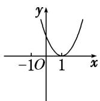
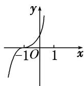
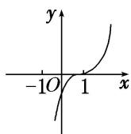
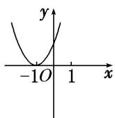
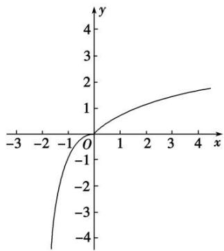
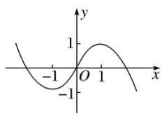

# 专题八 函数奇偶性与单调性的综合问题

奇偶性与单调性的综合问题主要包括：奇偶性与单调性的判断，利用函数的奇偶性与单调性比较函数值的大小以及解不等式等.

# 考点一 奇偶性与单调性的判断

# 【方法总结】

对于函数奇偶性与单调性的判断问题主要是应用奇偶性与单调性的定义及相关结论解决。当然对于选填题也可用特值法秒杀。

# 【例题选讲】

[例 1](1)下列函数中，既是偶函数，又在(0, 1)上单调递增的函数是()

A. $y=|\log_{3}x|$

B. $y=x^{3}$

C. $y=e^{|x|}$

D. $y = \cos |x|$

(2)已知函数 $f(x)=\frac{x}{\mathrm{e}^{|x|}}$ ，则下列说法正确的是()

A. 函数 $f(x)$ 是奇函数，且在 $(-\infty, -1)$ 上是减函数  
B. 函数 $f(x)$ 是奇函数，且在 $(-∞, -1)$ 上是增函数  
C. 函数 $f(x)$ 是偶函数，且在 $(-∞, -1)$ 上是减函数  
D. 函数 $f(x)$ 是偶函数，且在 $(-∞, -1)$ 上是增函数

(3) (2017·全国I)已知函数 $f(x) = \ln x + \ln (2 - x)$ ，则()

A. $f(x)$ 在 $(0, 2)$ 上单调递增

B. $f(x)$ 在 $(0, 2)$ 上单调递减

C. $y=f(x)$ 的图象关于直线 x=1 对称

D. $y = f(x)$ 的图象关于点(1，0)对称

(4)设函数 $f(x)=\ln(1+x)+m\ln(1-x)$ 是偶函数，则()

A. $m = 1$ ，且 $f(x)$ 在 $(0,1)$ 上是增函数

B. $m = 1$ ，且 $f(x)$ 在 $(0,1)$ 上是减函数

C. m = -1，且 $f(x)$ 在 $(0, 1)$ 上是增函数

D. $m = -1$ ，且 $f(x)$ 在 $(0, 1)$ 上是减函数

(5)(2019·北京)设函数 $f(x) = \mathrm{e}^x + a\mathrm{e}^{-x}$ (a 为常数). 若 $f(x)$ 为奇函数, 则 $a =$ \_\_\_\_; 若 $f(x)$ 是 $\mathbf{R}$ 上的增函数, 则 $a$ 的取值范围是 \_\_\_\_.

# 【对点训练】

1. 下列函数中，既是偶函数又在区间 $(0, +\infty)$ 上单调递增的是（ ）

A. $y=\frac{1}{x}$

B. $y = |x| - 1$

C. $y=\lg x$

D. $y=\left(\frac{1}{2}\right)|x|$

2. 下列函数中, 既是奇函数又在 $(0, +\infty)$ 上单调递增的是( )

A. $y = \mathrm{e}^{x} + \mathrm{e}^{-x}$

B. $y=\ln(|x|+1)$

C. $y=\frac{\sin x}{|x|}$

D. $y=x-\frac{1}{x}$

3. 已知函数 $f(x - 1)$ 是定义在 $\mathbf{R}$ 上的奇函数，且在 $[0, +\infty)$ 上是增函数，则函数 $f(x)$ 的图象可能是( )

  
A

  
B

  
C

  
D

4. 已知 $f(x)=\frac{\mathrm{e}^{x}-\mathrm{e}^{-x}}{2}$ ，则下列正确的是()

A. 奇函数，在 $\mathbf{R}$ 上为增函数

B. 偶函数，在 $\mathbf{R}$ 上为增函数

C. 奇函数，在 $\mathbf{R}$ 上为减函数

D. 偶函数，在 $\mathbf{R}$ 上为减函数

5. 已知函数 $f(x)$ 满足以下两个条件：①任意 $x_{1}, x_{2} \in (0, +\infty)$ 且 $x_{1} \neq x_{2}, (x_{1} - x_{2}) \cdot [f(x_{1}) - f(x_{2})] < 0$ ; ②对定

义域内任意 x 有 $f(x)+f(-x)=0$ ，则符合条件的函数是()

A. $f(x) = 2x$

B. $f(x)=1-|x|$

C. $f(x) = -x^{3}$

D. $f(x)=\ln(x^{2}+3)$

# 考点二 比较函数值的大小

# 【方法总结】

比较函数值大小的思路：比较函数值的大小时，若自变量的值不在同一个单调区间内，要利用其函数性质，转化到同一个单调区间上进行比较，对于选择题、填空题能数形结合的尽量用图象法求解．同时要充分利用奇函数在关于原点对称的两个区间上具有相同的单调性，偶函数在关于原点对称的两个区间上具有相反的单调性.

# 【例题选讲】

[例 2](1)(2019·全国III)设 $f(x)$ 是定义域为 R 的偶函数，且在 $(0, +\infty)$ 单调递减，则()

A. $f(\log_3\frac{1}{4}) > f(2^{-\frac{3}{2}}) > f(2^{-\frac{2}{3}})$

B. $f(\log_{3}\frac{1}{4})>f(2^{-\frac{2}{3}})>f(2^{-\frac{3}{2}})$

C. $f(2^{-\frac{3}{2}}) > f(2^{-\frac{2}{3}}) > f(\log_3\frac{1}{4})$

D. $f(2^{-\frac{2}{3}}) > f(2^{-\frac{3}{2}}) > f(\log_3\frac{1}{4})$

(2)已知函数 $y = f(x)$ 是 $\mathbf{R}$ 上的偶函数，当 $x_{1}, x_{2} \in (0, +\infty)$ 时，都有 $(x_{1} - x_{2}) \cdot [f(x_{1}) - f(x_{2})] < 0$ . 设 $a = \ln \frac{1}{m}$ , $b = (\ln m)^{2}$ , $c = \ln \sqrt{m}$ ，其中 $m > e$ ，则（）

A. $f(a) > f(b) > f(c)$

B. $f(b) > f(a) > f(c)$

C. $f(c) > f(a) > f(b)$

D. $f(c) > f(b) > f(a)$

(3)函数 $f(x)$ 是定义在 $\mathbf{R}$ 上的奇函数，对任意两个正数 $x_{1}, x_{2}(x_{1}<x_{2})$ ，都有 $x_{2}f(x_{1})>x_{1}f(x_{2})$ ，记 $a=\frac{1}{2}f(2)$ ， $b=f(1), c=-\frac{1}{3}f(-3)$ ，则 $a, b, c$ 之间的大小关系为（）

A. a>b>c

B. b>a>c

C. c>b>a

D. a>c>b

# 【对点训练】

6. 已知 $f(x)$ 是定义在 R 上的偶函数，且 $f(x)$ 在 $(0, +\infty)$ 上单调递增，则()

A. $f(0)>f(\log_{3}2)>f(-\log_{2}3)$

B. $f(\log_{3}2) > f(0) > f(-\log_{2}3)$

C. $f(-\log_{2}3)>f(\log_{3}2)>f(0)$

D. $f(-\log_23) > f(0) > f(\log_32)$

7. 函数 $y = f(x)$ 在[0, 2]上单调递增，且函数 $f(x + 2)$ 是偶函数，则下列结论成立的是()

A. $f(1) < f(\frac{5}{2}) < f(\frac{7}{2})$

B. $f(\frac{7}{2})<f(1)<f(\frac{5}{2})$

C. $f(\frac{7}{2}) < f(\frac{5}{2}) < f(1)$

D. $f(\frac{5}{2})<f(1)<f(\frac{7}{2})$

8. 定义在 $\mathbf{R}$ 上的偶函数 $f(x)$ 满足：对任意的 $x_{1}, x_{2} \in [0, +\infty)(x_{1} \neq x_{2})$ ，有 $\frac{f(x_{2}) - f(x_{1})}{x_{2} - x_{1}} < 0$ ，则（）

A. $f(3) < f(-2) < f(1)$

B. $f(1) < f(-2) < f(3)$

C. $f(-2) < f(1) < f(3)$

D. $f(3) < f(1) < f(-2)$

9. (2017·全国I)已知奇函数 $f(x)$ 在 R 上是增函数， $g(x) = xf(x)$ . 若 $a = g(-\log_2 5.1)$ ， $b = g(2^{0.8})$ ， $c = g(3)$ ，则 $a, b, c$ 的大小关系为（）

A. a<b<c

B. c<b<a

C. b<a<c

D. b<c<a

10. 已知函数 $y = f(x)$ 是 $\mathbf{R}$ 上的偶函数，对任意 $x_{1}, x_{2} \in (0, +\infty)$ ，都有 $(x_{1} - x_{2}) \cdot [f(x_{1}) - f(x_{2})] < 0$ 。设 $a = \ln \frac{1}{\pi}$ , $b = (\ln \pi)^{2}$ , $c = \ln \sqrt{\pi}$ ，则（）

A. $f(a) > f(b) > f(c)$

B. $f(b) > f(a) > f(c)$

C. $f(c) > f(a) > f(b)$

D. $f(c) > f(b) > f(a)$

11. 已知函数 $f(x) = a^{x} (a > 0, a \neq 1)$ 的反函数的图象经过点 $\left[\frac{\sqrt{2}}{2}, \frac{1}{2}\right]$ . 若函数 $g(x)$ 的定义域为 $\mathbf{R}$ , 当 $x \in [-2, 2]$ 时, 有 $g(x) = f(x)$ , 且函数 $g(x + 2)$ 为偶函数, 则下列结论正确的是 ( )

A. $g(\pi) < g(3) < g(\sqrt{2})$

B. $g(\pi) < g(\sqrt{2}) < g(3)$

C. $g(\sqrt{2}) <   g(3) <   g(\pi)$

D. $g(\sqrt{2}) <   g(\pi) <   g(3)$

12. 已知定义在 $\mathbf{R}$ 上的函数 $f(x)$ 满足下列三个条件：

①对任意的 $x \in \mathbf{R}$ 都有 $f(x + 2) = -f(x)$ ; ②对任意的 $0 \leq x_1 < x_2 \leq 2$ , 都有 $f(x_1) < f(x_2)$ ; ③ $f(x + 2)$ 的图象关于 $y$ 轴对称. 则 $f(4.5), f(6.5), f(7)$ 的大小关系是 \_\_\_\_. (用“<”连接)

# 考点三 解不等式(抽象函数)

# 【方法总结】

含“f”不等式的解法：首先根据函数的性质把不等式转化为 $f(g(x)) > f(h(x))$ 的形式，然后根据函数的单调性去掉“f”，转化为具体的不等式(组)，此时要注意 $g(x)$ 与 $h(x)$ 的取值应在外层函数的定义域内．要注意奇偶性中结论8：奇函数在两个对称的区间上具有相同的单调性；偶函数在两个对称的区间上具有相反的单调性的应用．特别应用奇偶性中结论2：如果函数 $f(x)$ 是偶函数，那么 $f(x) = f(|x|)$ ，可避免分类讨论．

# 【例题选讲】

[例 3](1)(2017·全国I)函数 $f(x)$ 在 $(-∞, +∞)$ 上单调递减，且为奇函数．若 $f(1) = -1$ ，则满足 $-1 \leq f(x - 2) \leq 1$ 的 x 的取值范围是（）

A. $[-2, 2]$

B. $[-1, 1]$

C. $[0, 4]$

D. $[1, 3]$

(2)已知定义域为 $(-1, 1)$ 的奇函数 $f(x)$ 是减函数，且 $f(a - 3) + f(9 - a^2) < 0$ ，则实数 $a$ 的取值范围是（）

A. $(2\sqrt{2},3)$

B. $(3,\sqrt{10})$

C. $(2\sqrt{2}, 4)$

D. $(-2, 3)$

(3)设 $f(x)$ 为奇函数，且在 $(-∞,0)$ 内是减函数， $f(-2)=0$ ，则 $xf(x)<0$ 的解集为()

A. $(-1, 0) \cup (2, +\infty)$

B. $(-\infty, -2) \cup (0, 2)$

C. $(-∞, -2)∪(2, +∞)$

D. $(-2, 0) \cup (0, 2)$

(4)已知函数 $y = f(x)$ 是定义域为 $\mathbf{R}$ 的偶函数，且 $f(x)$ 在 $[0, +\infty)$ 上单调递增，则不等式 $f(2x - 1) > f(x - 2)$ 的解集为 \_\_\_\_.

(5)已知 $f(x)$ 是定义在 R 上的偶函数，且在区间 $(-∞, 0)$ 上单调递增．若实数 a 满足 $f(2^{|a-1|}) > f(-\sqrt{2})$ ，则 a 的取值范围是 \_\_\_\_.

(6)若函数 $f(x)$ 是定义在 $\mathbf{R}$ 上的偶函数，且在区间 $[0, +\infty)$ 上是单调递增的．如果实数 $t$ 满足 $f(\ln t) + f\left(\ln \frac{1}{t}\right) \leq 2f(1)$ ，那么 $t$ 的取值范围是 \_\_\_\_.

(7)已知定义在 $\mathbf{R}$ 上的函数 $f(x)$ 在 $[1, +\infty)$ 上单调递减，且 $f(x + 1)$ 是偶函数，不等式 $f(m + 2) \geq f(x - 1)$ 对任意的 $x \in [-1, 0]$ 恒成立，则实数 $m$ 的取值范围是（）

A. $[-3, 1]$

B. $[-4, 2]$

C. $(- \infty, -3] \cup [1, +\infty)$

D. $(- \infty, -4] \cup [2, +\infty)$

(8)已知函数 $y = f(x)$ 的定义域为 $\mathbf{R}$ ， $f(x + 1)$ 为偶函数，且对 $\forall x_1 < x_2 \leq 1$ ，满足 $\frac{f(x_2) - f(x_1)}{x_2 - x_1} < 0$ 。若 $f(3) = 1$ ，则不等式 $f(\log_2 x) < 1$ 的解集为（）

A. $\left(\frac{1}{2},8\right)$

B. $(1, 8)$

C. $\left(0, \frac{1}{2}\right) \cup (8, +\infty)$

D. $(-\infty, 1) \cup (8, +\infty)$

(9)已知函数 $f(x)$ 是定义在R上的奇函数,若对于任意给定的不等实数 $x_{1},x_{2}$ ，不等式 $x_{1}f(x_{1})+x_{2}f(x_{2})<x_{1}f(x_{2})+x_{2}f(x_{1})$ 恒成立，则不等式 $f(1-x)<0$ 的解集为()

A. $(-∞, 0)$

B. $(0, +\infty)$

C. $(-∞, 1)$

D. $(1, +\infty)$

(10)定义在 $\mathbf{R}$ 上的函数 $f(x)$ 对任意 $0 < x_{2} < x_{1}$ 都有 $\frac{f(x_1) - f(x_2)}{x_1 - x_2} < 1$ ，且函数 $y = f(x)$ 的图象关于原点对称，若 $f(2) = 2$ ，则不等式 $f(x) - x > 0$ 的解集是（）

A. $(-2, 0) \cup (0, 2)$

B. $(- \infty, -2) \cup (2, +\infty)$

C. $(-\infty, -2) \cup (0, 2)$

D. $(-2, 0) \cup (2, +\infty)$

# 【对点训练】

13. 已知定义在 $\mathbf{R}$ 上的奇函数 $y = f(x)$ 在 $(0, +\infty)$ 内单调递增，且 $f\left(\frac{1}{2}\right) = 0$ ，则 $f(x) > 0$ 的解集为 \_\_\_\_.

14. 已知 $f(x)$ 是定义在 $\mathbf{R}$ 上的奇函数，且在 $[0, +\infty)$ 上单调递增．若实数 $m$ 满足 $f(\log_3|m - 1|) + f(-1) < 0$ ，则 $m$ 的取值范围是（）

A. $(-2, 1) \cup (1, 4)$

B. $(-2, 1)$

C. $(-2, 4)$

D. $(1, 4)$

15. 设奇函数 $f(x)$ 在 $(0, +\infty)$ 上为增函数，且 $f(1) = 0$ ，则不等式 $\frac{f(x) - f(-x)}{x} < 0$ 的解集为 \_\_\_\_.

16. 已知函数 $f(x)$ 是定义在 $\mathbf{R}$ 上的奇函数，且在区间 $[0, +\infty)$ 上单调递增，若 $\frac{|f(\ln x) - f(\ln \frac{1}{x})|}{2} < f(1)$ ，则 $x$ 的取值范围是（）

A. $(0, \frac{1}{e})$

B. $(0, e)$

C. $(\frac{1}{e}, e)$

D. (e, +∞)

17. 已知偶函数 $f(x)$ 在区间 $[0, +\infty)$ 上单调递增，则满足 $f(2x - 1) < f\left(\frac{1}{3}\right)$ 的 $x$ 的取值范围是（）

A. $\left(\frac{1}{3},\frac{2}{3}\right)$

B. $\left[\frac{1}{3},\frac{2}{3}\right]$

C. $\begin{pmatrix}\frac{1}{2},\frac{2}{3}\end{pmatrix}$

D. $\left[\frac{1}{2},\frac{2}{3}\right]$

18. 已知定义域为 $\mathbf{R}$ 的偶函数 $f(x)$ 在 $(- \infty, 0]$ 上是减函数，且 $f(1) = 2$ ，则不等式 $f(\log_2 x) > 2$ 的解集为（）

A. $(2, +\infty)$

B. $\left(0, \frac{1}{2}\right) \cup (2, +\infty)$

C. $\left(0,\frac{\sqrt{2}}{2}\right)\cup(\sqrt{2},+\infty)$

D. $(\sqrt{2}, +\infty)$

19. 设定义在 $[-2, 2]$ 上的偶函数 $f(x)$ 在区间 $[0, 2]$ 上单调递减，若 $f(1 - m) < f(m)$ ，则实数 $m$ 的取值范围是 \_\_\_\_.

20. 设 $f(x)$ 是定义在 $[-2b, 3 + b]$ 上的偶函数，且在 $[-2b, 0]$ 上为增函数，则 $f(x - 1) \geq f(3)$ 的解集为（）

A. $[-3, 3]$

B. $[-2, 4]$

C. $[-1, 5]$

D. $[0, 6]$

21. 已知函数 $y = f(x)$ 是定义在 $\mathbf{R}$ 上的偶函数，且在 $(-\infty, 0]$ 上是增函数，若不等式 $f(a) \geq f(x)$ 对任意 $x \in [1, 2]$ 恒成立，则实数 $a$ 的取值范围是（）

A. $(-\infty, 1]$

B. $[-1, 1]$

C. $(-\infty, 2]$

D. $[-2, 2]$

22. 已知 $f(x)$ 是偶函数，且 $f(x)$ 在 $[0, +\infty)$ 上是增函数，如果 $f(ax + 1) \leq f(x - 2)$ 在 $x \in \left[\frac{1}{2}, 1\right]$ 上恒成立，那么实数 $a$ 的取值范围是（）

A. $[-2, 1]$

B. $[-5, 0]$

C. $[-5, 1]$

D. $[-2, 0]$

# 考点四 解不等式(具体函数)

# 【方法总结】

函数是给定的，但解析式比较复杂，一般不把自变量代入处理．而是先研究函数的单调性与奇偶性，然后把不等式转化为 $f(g(x))>f(h(x))$ 的形式，根据函数的单调性去掉“f”，转化为具体的不等式(组)去解决问题．要注意奇偶性中结论8：奇函数在两个对称的区间上具有相同的单调性；偶函数在两个对称的区间上具有相反的单调性的应用．特别应用奇偶性中结论2：如果函数 $f(x)$ 是偶函数，那么 $f(x)=f(|x|)$ ，可避免分

类讨论.

# 【例题选讲】

[例 4](1)已知函数 $f(x)=\sin x+x$ ，对任意的 $m\in[-2,2]$ ， $f(mx-2)+f(x)<0$ 恒成立，则 x 的取值范围是 \_\_\_\_.

(2)若 $f(x)=\mathrm{e}^{x}-a\mathrm{e}^{-x}$ 为奇函数，则满足 $f(x-1)>\frac{1}{\mathrm{e}^{2}}-\mathrm{e}^{2}$ 的 x 的取值范围是()

A. $(-2, +\infty)$

B. $(-1, +\infty)$

C. $(2, +\infty)$

D. $(3, +\infty)$

(3)设函数 $f(x)=\ln(1+|x|)-\frac{1}{1+x^{2}}$ ，则使得 $f(x)>f(2x-1)$ 成立的x的取值范围为\_\_\_\_.

(4)已知 $g(x)$ 是定义在 R 上的奇函数，且当 x<0 时， $g(x)=-\ln(1-x)$ ，函数 $f(x)=\left\{\begin{aligned}x^{3},&x\leq0,\\ g(x),&x>0,\end{aligned}\right.$ 若 $f(2-x^{2})>f(x)$ ，则 x 的取值范围是()

A. $(-\infty, -2) \cup (1, +\infty)$

B. $(-\infty, 1) \cup (2, +\infty)$

C. $(-2, 1)$

D. $(1, 2)$

line

| x   | y    |
| --- | ---- |
| -3  | -4   |
| -2  | -2   |
| -1  | 0    |
| 0   | 0    |
| 1   | 1    |
| 2   | 1.5  |
| 3   | 2    |
| 4   | 2.5  |

(5)已知函数 $f(x) = \begin{cases} -x^2 + 2x, & x > 0, \\ 0, & x = 0, \\ x^2 + mx, & x < 0 \end{cases}$ 是奇函数．若函数 $f(x)$ 在区间 $[-1, a - 2]$ 上单调递增，则实数 $a$ 的取值范围是 \_\_\_\_.

# 【对点训练】

23. 已知函数 $f(x) = x^3 + 2x$ ，若 $f(1) + f(\log_{\frac{1}{a}} 3) > 0 (a > 0$ 且 $a \neq 1$ ，则实数 $a$ 的取值范围是 \_\_\_\_.

24. 已知函数 $f(x) = \frac{1}{2^x} - 2^x$ ，则满足 $f(x^2 - 5x) + f(6) > 0$ 的实数 $x$ 的取值范围是 \_\_\_\_.

25. 已知定义在 $\mathbf{R}$ 上的奇函数 $f(x)$ 满足: 当 $x > 0$ 时, $f(x) = 2^{x} - \frac{2}{x}$ , 则 $\frac{f(x)}{x} > 0$ 的解集为( )

A. $(-1, 0) \cup (0, 1)$

B. $(-1, 0) \cup (1, +\infty)$

C. $(-\infty, -1) \cup (0, 1)$

D. $(-\infty, -1) \cup (1, +\infty)$

26. 已知函数 $f(x) = \begin{cases} x^2 + 2x (x \geq 0), \\ 2x - x^2 (x < 0), \end{cases}$ 函数 $g(x) = |f(x)| - 1$ ，若 $g(2 - a^2) > g(a)$ ，则实数 $a$ 的取值范围是（）

A. $(-2,1)$

B. $(-∞, -2)∪(2, +∞)$

C. $(-2, 2)$

D. $(-\infty, -2) \cup (-1, 1) \cup (2, +\infty)$

