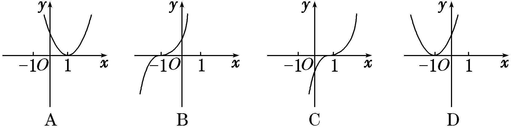
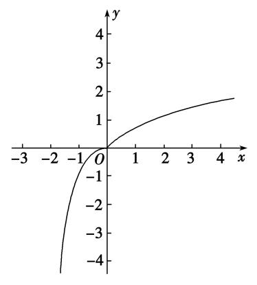
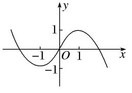

专题八　函数奇偶性与单调性的综合问题

奇偶性与单调性的综合问题主要包括：奇偶性与单调性的判断，利用函数的奇偶性与单调性比较函数值的大小以及解不等式等．

考点一　奇偶性与单调性的判断

【方法总结】

对于函数奇偶性与单调性的判断问题主要是应用奇偶性与单调性的定义及相关结论解决．当然对于选填题也可用特值法秒杀．

【例题选讲】

[例1]（1）下列函数中，既是偶函数，又在(0，1)上单调递增的函数是(　　)

A．<em>y</em>＝|log3<em>x</em>|　　　　　
B．<em>y</em>＝<em>x</em>3　　　　　
C．<em>y</em>＝e|<em>x</em>|　　　　　
D．<em>y</em>＝cos |<em>x</em>|
答案　C　解析　对于A选项，函数定义域是(0，＋∞)，故是非奇非偶函数，显然B项中，<em>y</em>＝<em>x</em>3是奇函数．对于C选项，函数的定义域是<strong>R</strong>，是偶函数，且当<em>x</em>∈(0，＋∞)时，函数是增函数，故在(0，1)上单调递增，正确．对于D选项，<em>y</em>＝cos |<em>x</em>|在(0，1)上单调递减．  
（2）已知函数*f*(*x*)＝，则下列说法正确的是(　　)

A．函数*f*(*x*)是奇函数，且在(－∞，－1)上是减函数

B．函数*f*(*x*)是奇函数，且在(－∞，－1)上是增函数

C．函数*f*(*x*)是偶函数，且在(－∞，－1)上是减函数

D．函数*f*(*x*)是偶函数，且在(－∞，－1)上是增函数
答案　A　解析　由题意，函数<em>f</em>(<em>x</em>)＝，可得其定义域为<strong>R</strong>，又由<em>f</em>(－<em>x</em>)＝＝－＝－<em>f</em>(<em>x</em>)，即<em>f</em>(－<em>x</em>)＝－<em>f</em>(<em>x</em>)，所以函数<em>f</em>(<em>x</em>)是奇函数，当<em>x</em>∈(－∞，－1)时，<em>f</em>(<em>x</em>)＝＝<em>x</em>·e<em>x</em>，则<em>f</em>′(<em>x</em>)＝e<em>x</em>＋<em>x</em>e<em>x</em>＝(1＋<em>x</em>)e<em>x</em>，则<em>f</em>′(<em>x</em>)&lt;0，函数<em>f</em>(<em>x</em>)在(－∞，－1)上单调递减，故选A.  
（3） (2017·全国Ⅰ)已知函数*f*(*x*)＝ln *x*＋ln(2－*x*)，则(　　)

A．*f*(*x*)在(0，2)上单调递增　　　　　　　　　　
B．*f*(*x*)在(0，2)上单调递减

C．*y*＝*f*(*x*)的图象关于直线*x*＝1对称　　　　　　
D．*y*＝*f*(*x*)的图象关于点(1，0)对称
答案　C　解析　<em>f</em>(<em>x</em>)的定义域为(0，2)．<em>f</em>(<em>x</em>)＝ln <em>x</em>＋ln(2－<em>x</em>)＝ln[<em>x</em>(2－<em>x</em>)]＝ln(－<em>x</em>2＋2<em>x</em>)．设<em>u</em>＝－<em>x</em>2＋2<em>x</em>，<em>x</em>∈(0，2)，则<em>u</em>＝－<em>x</em>2＋2<em>x</em>在(0，1)上单调递增，在(1，2)上单调递减．又<em>y</em>＝ln <em>u</em>在其定义域上单调递增，∴<em>f</em>(<em>x</em>)＝ln(－<em>x</em>2＋2<em>x</em>)在(0，1)上单调递增，在(1，2)上单调递减．∴选项A，B错误；∵<em>f</em>(<em>x</em>)＝ln <em>x</em>＋ln(2－<em>x</em>)＝<em>f</em>(2－<em>x</em>)，∴<em>f</em>(<em>x</em>)的图象关于直线<em>x</em>＝1对称，∴选项C正确；∵<em>f</em>(2－<em>x</em>)＋<em>f</em>(<em>x</em>)＝[ln(2－<em>x</em>)＋ln <em>x</em>]＋[ln <em>x</em>＋ln(2－<em>x</em>)]＝2[ln <em>x</em>＋ln(2－<em>x</em>)]，不恒为0，∴<em>f</em>(<em>x</em>)的图象不关于点(1，0)对称，∴选项D错误．故选C．  
（4）设函数*f*(*x*)＝ln(1＋*x*)＋*m*ln(1－*x*)是偶函数，则(　　)

A．*m*＝1，且*f*(*x*)在(0，1)上是增函数　　　　　　
B．*m*＝1，且*f*(*x*)在(0，1)上是减函数

C．*m*＝－1，且*f*(*x*)在(0，1)上是增函数　　　　　
D．*m*＝－1，且*f*(*x*)在(0，1)上是减函数
答案　B　解析　因为函数<em>f</em>(<em>x</em>)＝ln(1＋<em>x</em>)＋<em>m</em>ln(1－<em>x</em>)是偶函数，所以<em>f</em> ＝<em>f</em> ，则(<em>m</em>－1)ln 3＝0，即<em>m</em>＝1，则<em>f</em>(<em>x</em>)＝ln(1＋<em>x</em>)＋ln(1－<em>x</em>)＝ln(1－<em>x</em>2)，因为当<em>x</em>∈(0，1)时，<em>y</em>＝1－<em>x</em>2是减函数，故<em>f</em>(<em>x</em>)在(0，1)上是减函数．故选B．  
（5）(2019·北京)设函数<em>f</em>(<em>x</em>)＝e<em>x</em>＋<em>a</em>e－<em>x</em>(<em>a</em>为常数)．若<em>f</em>(<em>x</em>)为奇函数，则<em>a</em>＝\_\_\_\_\_\_\_\_；若<em>f</em>(<em>x</em>)是<strong>R</strong>上的增函数，则<em>a</em>的取值范围是\_\_\_\_\_\_\_\_．
答案　－1　(－∞，0]　<strong>解析</strong>　因为<em>f</em>(<em>x</em>)＝e<em>x</em>＋<em>a</em>e－<em>x</em>(<em>a</em>为常数)的定义域为<strong>R</strong>，所以<em>f</em>（0）＝e0＋<em>a</em>e－0＝1＋<em>a</em>＝0，所以<em>a</em>＝－1．因为<em>f</em>(<em>x</em>)＝e<em>x</em>＋<em>a</em>e－<em>x</em>，所以<em>f</em>′(<em>x</em>)＝e<em>x</em>－<em>a</em>e－<em>x</em>＝e<em>x</em>－．因为<em>f</em>(<em>x</em>)是<strong>R</strong>上的增函数，所以<em>f</em>′(<em>x</em>)≥0在R上恒成立，即e<em>x</em>≥在<strong>R</strong>上恒成立，所以<em>a</em>≤e2<em>x</em>在<strong>R</strong>上恒成立．又e2<em>x</em>＞0，所以<em>a</em>≤0，即<em>a</em>的取值范围是(－∞，0]．

【对点训练】

1．下列函数中，既是偶函数又在区间(0，＋∞)上单调递增的是(　　)

A．*y*＝　　　　　
B．*y*＝|*x*|－1　　　　　
C．*y*＝lg *x*　　　　　
D．*y*＝

1．答案　B　解析　*y*＝为奇函数；*y*＝lg *x*的定义域为(0，＋∞)，不具备奇偶性；*y*＝在(0，＋∞)上

为减函数；*y*＝|*x*|－1在(0，＋∞)上为增函数，且在定义域上为偶函数．

2．下列函数中，既是奇函数又在(0，＋∞)上单调递增的是(　　)

A．<em>y</em>＝e<em>x</em>＋e－<em>x</em>　　　　　
B．<em>y</em>＝ln(|<em>x</em>|＋1)　　　　　
C．<em>y</em>＝　　　　　
D．<em>y</em>＝<em>x</em>－

2．答案　D　解析：选项A，B是偶函数，排除；选项C是奇函数，但在(0，＋∞)上不是单调函数，不符

合题意；选项D中，*y*＝*x*－是奇函数，且*y*＝*x*和*y*＝－在(0，＋∞)上均为增函数，故*y*＝*x*－在(0，＋∞)上为增函数，所以选项D正确．故选D.

3．已知函数<em>f</em>(<em>x</em>－1)是定义在<strong>R</strong>上的奇函数，且在[0，＋∞)上是增函数，则函数<em>f</em>(<em>x</em>)的图象可能是(　　)

3．答案　B　解析：选函数*f*(*x*－1)的图象向左平移1个单位，即可得到函数*f*(*x*)的图象．因为函数*f*(*x*－1)

是定义在<strong>R</strong>上的奇函数，所以函数<em>f</em>(<em>x</em>－1)的图象关于原点对称，所以函数<em>f</em>(<em>x</em>)的图象关于点(－1，0)对称，排除A，C，D，故选B.

4．已知*f*(*x*)＝，则下列正确的是(　　)

A．奇函数，在R上为增函数　　　　　　
B．偶函数，在R上为增函数

C．奇函数，在R上为减函数　　　　　　
D．偶函数，在R上为减函数

4．答案　<strong>A</strong>　解析　定义域为<strong>R</strong>，∵<em>f</em>(－<em>x</em>)＝ ＝－<em>f</em>(<em>x</em>)，∴<em>f</em>(<em>x</em>)是奇函数，∵e<em>x</em>是<strong>R</strong>上的增函数，－

e－<em>x</em>也是<strong>R</strong>上的增函数，∴是<strong>R</strong>上的增函数，故选A．

5．已知函数<em>f</em>(<em>x</em>)满足以下两个条件：①任意<em>x</em>1，<em>x</em>2∈(0，＋∞)且<em>x</em>1≠<em>x</em>2，(<em>x</em>1－<em>x</em>2)·[<em>f</em>(<em>x</em>1)－<em>f</em>(<em>x</em>2)]&lt;0；②对定

义域内任意*x*有*f*(*x*)＋*f*(－*x*)＝0，则符合条件的函数是(　　)

A．<em>f</em>(<em>x</em>)＝2<em>x</em>　　　
B．<em>f</em>(<em>x</em>)＝1－|<em>x</em>|　　　
C．<em>f</em>(<em>x</em>)＝－<em>x</em>3　　　
D．<em>f</em>(<em>x</em>)＝ln(<em>x</em>2＋3)

5．答案　C　解析　由条件①可知，*f*(*x*)在(0，＋∞)上单调递减，则可排除A、D选项，由条件②可知，

*f*(*x*)为奇函数，则可排除B选项，故选C．

考点二　比较函数值的大小

【方法总结】
比较函数值大小的思路：比较函数值的大小时，若自变量的值不在同一个单调区间内，要利用其函数性质，转化到同一个单调区间上进行比较，对于选择题、填空题能数形结合的尽量用图象法求解．同时要充分利用奇函数在关于原点对称的两个区间上具有相同的单调性，偶函数在关于原点对称的两个区间上具有相反的单调性．

【例题选讲】

<strong>[例2]</strong>（1） (2019·全国Ⅲ)设<em>f</em>(<em>x</em>)是定义域为<strong>R</strong>的偶函数，且在(0，＋∞)单调递减，则(　　)

A．　　　　　　　　　　
B．

C．　　　　　　　　　　
D．

答案　C　解析　根据函数<em>f</em>(<em>x</em>)为偶函数可知，<em>f</em>(log3)＝<em>f</em>(－log34)＝<em>f</em>(log34)，因为0&lt;&lt;&lt;20&lt;log34，且函数<em>f</em>(<em>x</em>)在(0，＋∞)单调递减，所以<em>f</em>()&gt;<em>f</em>()&gt;<em>f</em>(log3)．故选C．  
（2）已知函数<em>y</em>＝<em>f</em>(<em>x</em>)是<strong>R</strong>上的偶函数，当<em>x</em>1，<em>x</em>2∈(0，＋∞)时，都有(<em>x</em>1－<em>x</em>2)·[<em>f</em>(<em>x</em>1)－<em>f</em>(<em>x</em>2)]＜0．设<em>a</em>＝ln，<em>b</em>＝(ln<em>m</em>)2，<em>c</em>＝ln，其中<em>m</em>＞e，则(　　)

A．*f*(*a*)＞*f*(*b*)＞*f*(*c*)　　
B．*f*(*b*)＞*f*(*a*)＞*f*(*c*)　　
C．*f*(*c*)＞*f*(*a*)＞*f*(*b*)　　
D．*f*(*c*)＞*f*(*b*)＞*f*(*a*)
答案　C　解析　根据已知条件知<em>f</em>(<em>x</em>)在(0，＋∞)上是减函数，且<em>f</em>(<em>a</em>)＝<em>f</em>(|<em>a</em>|)，<em>f</em>(<em>b</em>)＝<em>f</em>(|<em>b</em>|)，<em>f</em>(<em>c</em>)＝<em>f</em>(|<em>c</em>|)，|<em>a</em>|＝ln <em>m</em>＞1，<em>b</em>＝(ln <em>m</em>)2＞|<em>a</em>|，0＜<em>c</em>＝ln <em>m</em>＜|<em>a</em>|，∴<em>f</em>(<em>c</em>)＞<em>f</em>(<em>a</em>)＞<em>f</em>(<em>b</em>)．  
（3）函数<em>f</em>(<em>x</em>)是定义在<strong>R</strong>上的奇函数，对任意两个正数<em>x</em>1，<em>x</em>2(<em>x</em>1&lt;<em>x</em>2)，都有<em>x</em>2<em>f</em>(<em>x</em>1)&gt;<em>x</em>1<em>f</em>(<em>x</em>2)，记<em>a</em>＝<em>f</em>（2），<em>b</em>＝<em>f</em>（1），<em>c</em>＝－<em>f</em>(－3)，则<em>a</em>，<em>b</em>，<em>c</em>之间的大小关系为(　　)

A．*a*>*b*>*c*　　　　　
B．*b*>*a*>*c*　　　　　
C．*c*>*b*>*a*　　　　　
D．*a*>*c*>*b*
答案　B　解析　因为对任意两个正数<em>x</em>1，<em>x</em>2(<em>x</em>1&lt;<em>x</em>2)，都有<em>x</em>2<em>f</em>(<em>x</em>1)&gt;<em>x</em>1<em>f</em>(<em>x</em>2)，所以&gt;，得函数<em>g</em>(<em>x</em>)＝在(0，＋∞)上是减函数，又<em>c</em>＝－<em>f</em>(－3)＝<em>f</em>（3），所以<em>g</em>（1）&gt;<em>g</em>（2）&gt;<em>g</em>（3），即<em>b</em>&gt;<em>a</em>&gt;<em>c</em>，故选B．

【对点训练】

6．已知<em>f</em>(<em>x</em>)是定义在<strong>R</strong>上的偶函数，且<em>f</em>(<em>x</em>)在(0，＋∞)上单调递增，则(　　)

A．<em>f</em>（0）&gt;<em>f</em>(log32)&gt;<em>f</em>(－log23)　　　　　　　　
B．<em>f</em>(log32)&gt;<em>f</em>（0）&gt;<em>f</em>(－log23)

C．<em>f</em>(－log23)&gt;<em>f</em>(log32)&gt;<em>f</em>（0）　　　　　　　　
D．<em>f</em>(－log23)&gt;<em>f</em>（0）&gt;<em>f</em>(log32)

6．答案　C　解析　∵log23&gt;log22＝1＝log33&gt;log32&gt;0，且函数<em>f</em>(<em>x</em>)在(0，＋∞)上单调递增，∴

<em>f</em>(log23)&gt;<em>f</em>(log32)&gt;<em>f</em>（0），又函数<em>f</em>(<em>x</em>)为偶函数，∴<em>f</em>(log23)＝<em>f</em>(－log23)，∴<em>f</em>(－log23)&gt;<em>f</em>(log32)&gt;<em>f</em>（0）．

7．函数*y*＝*f*(*x*)在[0，2]上单调递增，且函数*f*(*x*＋2)是偶函数，则下列结论成立的是(　　)

A．*f*（1）<<　　
B．<*f*（1）<　　
C．<<*f*（1）　　
D．<*f*（1）<

7．答案　B　解析　∵函数*y*＝*f*(*x*)在[0，2]上单调递增，且函数*f*(*x*＋2)是偶函数，∴函数*y*＝*f*(*x*)在[2，

4]上单调递减，且在[0，4]上函数*y*＝*f*(*x*)满足*f*(2－*x*)＝*f*(2＋*x*)，∴*f*（1）＝*f*（3），<*f*（3）<，即<*f*（1）<．

8．定义在<strong>R</strong>上的偶函数<em>f</em>(<em>x</em>)满足：对任意的<em>x</em>1，<em>x</em>2∈[0，＋∞)(<em>x</em>1≠<em>x</em>2)，有&lt;0，则(　　)

A．*f*（3）＜*f*(－2)＜*f*（1）　　　　　　　　　　　
B．*f*（1）＜*f*(－2)＜*f*（3）

C．*f*(－2)＜*f*（1）＜*f*（3）　　　　　　　　　　　
D．*f*（3）＜*f*（1）＜*f*(－2)

8．答案　<strong>A</strong>　解析　∵<em>f</em>(<em>x</em>)是偶函数∴<em>f</em>(－2)＝ <em>f</em>（2），又∵任意的<em>x</em>1，<em>x</em>2∈[0，＋∞)(<em>x</em>1≠<em>x</em>2)，有&lt;0，
∴*f*(*x*)在[0，＋∞)上是减函数，又∵1＜2＜3∴*f*（1）＞*f*（2）＝*f*(－2)＞*f*（3），故选A．

9．(2017·全国Ⅰ)已知奇函数<em>f</em>(<em>x</em>)在<strong>R</strong>上是增函数，<em>g</em>(<em>x</em>)＝<em>xf</em>(<em>x</em>)．若<em>a</em>＝<em>g</em>(－log25.1)，<em>b</em>＝<em>g</em>(20.8)，<em>c</em>＝<em>g</em>（3），
则*a*，*b*，*c*的大小关系为(　　)

A．*a*<*b*<*c*　　　　　
B．*c*<*b*<*a*　　　　　
C．*b*<*a*<*c* 　　　　　
D．*b*<*c*<*a*

9．答案　C　解析　法一　易知<em>g</em>(<em>x</em>)＝<em>xf</em>(<em>x</em>)在<strong>R</strong>上为偶函数，∵奇函数<em>f</em>(<em>x</em>)在<strong>R</strong>上是增函数，且<em>f</em>（0）＝0．
∴<em>g</em>(<em>x</em>)在(0，＋∞)上是增函数．又3&gt;log25.1&gt;2&gt;20.8，且<em>a</em>＝<em>g</em>(－log25.1)＝<em>g</em>(log25.1)，∴<em>g</em>（3）&gt;<em>g</em>(log25.1)

&gt;<em>g</em>(20.8)，则<em>c</em>&gt;<em>a</em>&gt;<em>b</em>．

法二　(特殊化)取<em>f</em>(<em>x</em>)＝<em>x</em>，则<em>g</em>(<em>x</em>)＝<em>x</em>2为偶函数且在(0，＋∞)上单调递增，又3&gt;log25.1&gt;20.8，从而可得<em>c</em>&gt;<em>a</em>&gt;<em>b</em>．

10．已知函数<em>y</em>＝<em>f</em>(<em>x</em>)是<strong>R</strong>上的偶函数，对任意<em>x</em>1，<em>x</em>2∈(0，＋∞)，都有(<em>x</em>1－<em>x</em>2)·[<em>f</em>(<em>x</em>1)－<em>f</em>(<em>x</em>2)]＜0．设<em>a</em>＝ln

，<em>b</em>＝(lnπ)2，<em>c</em>＝ln，则(　　)

A．*f*(*a*)＞*f*(*b*)＞*f*(*c*)　
B．*f*(*b*)＞*f*(*a*)＞*f*(*c*)　
C．*f*(*c*)＞*f*(*a*)＞*f*(*b*)　
D．*f*(*c*)＞*f*(*b*)＞*f*(*a*)

10．答案　C　解析　由题意易知<em>f</em>(<em>x</em>)在(0，＋∞)上是减函数，因为<em>f</em>(<em>x</em>)是<strong>R</strong>上的偶函数，所以<em>f</em>(－<em>x</em>)＝<em>f</em>(<em>x</em>)

＝<em>f</em>(|<em>x</em>|)．又因为|<em>a</em>|＝ln π＞1，<em>b</em>＝(ln π)2＞|<em>a</em>|，0＜<em>c</em>＝＜|<em>a</em>|，所以<em>f</em>(<em>c</em>)＞<em>f</em>(|<em>a</em>|)＞<em>f</em>(<em>b</em>)．又由题意知，<em>f</em>(<em>a</em>)＝<em>f</em>(|<em>a</em>|)．所以<em>f</em>(<em>c</em>)＞<em>f</em>(<em>a</em>)＞<em>f</em>(<em>b</em>)．

11．已知函数<em>f</em>(<em>x</em>)＝<em>ax</em>(<em>a</em>&gt;0，<em>a</em>≠1)的反函数的图象经过点．若函数<em>g</em>(<em>x</em>)的定义域为<strong>R</strong>，当<em>x</em>∈[－2，

2]时，有*g*(*x*)＝*f*(*x*)，且函数*g*(*x*＋2)为偶函数，则下列结论正确的是(　　)

A．*g*(π)<*g*（3）<*g*()　　
B．*g*(π)<*g*()<*g*（3）　　
C．*g*()<*g*（3）<*g*(π)　　
D．*g*()<*g*(π)<*g*（3）

11．答案　C　解析：因为函数*f*(*x*)的反函数的图象经过点，所以函数*f*(*x*)的图象经过点，
所以<em>a</em>＝，即<em>a</em>＝，函数<em>f</em>(<em>x</em>)在<strong>R</strong>上单调递减．函数<em>g</em>(<em>x</em>＋2)为偶函数，所以函数<em>g</em>(<em>x</em>)的图象关于直线<em>x</em>＝2对称，又<em>x</em>∈[－2，2]时，<em>g</em>(<em>x</em>)＝<em>f</em>(<em>x</em>)且<em>g</em>(<em>x</em>)单调递减，所以<em>x</em>∈[2，6]时，<em>g</em>(<em>x</em>)单调递增，根据对称性，可知在[－2，6]上距离对称轴<em>x</em>＝2越远的自变量，对应的函数值越大，所以<em>g</em>()&lt;<em>g</em>（3）&lt;<em>g</em>(π)．故选C.

12．已知定义在<strong>R</strong>上的函数<em>f</em>(<em>x</em>)满足下列三个条件：

①对任意的<em>x</em>∈<strong>R</strong>都有<em>f</em>(<em>x</em>＋2)＝－<em>f</em>(<em>x</em>)；②对任意的0≤<em>x</em>1&lt;<em>x</em>2≤2，都有<em>f</em>(<em>x</em>1)&lt;<em>f</em>(<em>x</em>2)；③<em>f</em>(<em>x</em>＋2)的图象关于<em>y</em>轴对称．则<em>f</em>(4.5)，<em>f</em>(6.5)，<em>f</em>（7）的大小关系是\_\_\_\_\_\_\_\_．(用“&lt;”连接)

12．答案　*f*(4.5)<*f*（7）<*f*(6.5)　解析：由①可知，*f*(*x*)是一个周期为4的函数；由②可知，*f*(*x*)在[0，2]上是

增函数；由③可知，*f*(*x*)的图象关于直线*x*＝2对称．故*f*(4.5)＝*f*(0.5)，*f*(6.5)＝*f*(2.5)＝*f*(1.5)，*f*（7）＝*f*（3）＝*f*（1），*f*(0.5)<*f*（1）<*f*(1.5)，即，*f*(4.5)<*f*（7）<*f*(6.5)．

考点三　解不等式(抽象函数)

【方法总结】

含“*f*”不等式的解法：首先根据函数的性质把不等式转化为*f*(*g*(*x*))>*f*(*h*(*x*))的形式，然后根据函数的单调性去掉“*f*”，转化为具体的不等式(组)，此时要注意*g*(*x*)与*h*(*x*)的取值应在外层函数的定义域内．要注意奇偶性中结论8：奇函数在两个对称的区间上具有相同的单调性；偶函数在两个对称的区间上具有相反的单调性的应用．特别应用奇偶性中结论2：如果函数*f*(*x*)是偶函数，那么*f*(*x*)＝*f*(|*x*|)，可避免分类讨论．

【例题选讲】

<strong>[例3]</strong>（1）(2017·全国Ⅰ)函数<em>f</em>(<em>x</em>)在(－∞，＋∞)上单调递减，且为奇函数．若<em>f</em>（1）＝－1，则满足－1≤<em>f</em>(<em>x</em>－2)≤1的<em>x</em>的取值范围是(　　)

A．[－2，2]　　　　　
B．[－1，1]　　　　　
C．[0，4]　　　　　
D．[1，3]
答案　D　解析　∵*f*(*x*)为奇函数，∴*f*(－*x*)＝－*f*(*x*)．∵*f*（1）＝－1，∴*f*(－1)＝－*f*（1）＝1．故由－1≤*f*(*x*－2)≤1，得*f*（1）≤*f*(*x*－2)≤*f*(－1)．又*f*(*x*)在(－∞，＋∞)上单调递减，∴－1≤*x*－2≤1，∴1≤*x*≤3．  
（2）已知定义域为(－1，1)的奇函数<em>f</em>(<em>x</em>)是减函数，且<em>f</em>(<em>a</em>－3)＋<em>f</em>(9－<em>a</em>2)&lt;0，则实数<em>a</em>的取值范围是(　　)

A．(2，3)　　　　　
B．(3，)　　　　　
C．(2，4)　　　　　
D．(－2，3)
答案　A　解析　 由<em>f</em>(<em>a</em>－3)＋<em>f</em>(9－<em>a</em>2)&lt;0得<em>f</em>(<em>a</em>－3)&lt;－<em>f</em>(9－<em>a</em>2)．又由奇函数性质，得<em>f</em>(<em>a</em>－3)&lt;<em>f</em>(<em>a</em>2－9)．因为<em>f</em>(<em>x</em>)是定义域为(－1，1)的减函数，所以解得2&lt;<em>a</em>&lt;3．  
（3）设*f*(*x*)为奇函数，且在(－∞，0)内是减函数，*f*(－2)＝0，则*xf*(*x*)<0的解集为(　　)

A．(－1，0)∪(2，＋∞)　　　　　　　　　　　
B．(－∞，－2)∪(0，2)

C．(－∞，－2)∪(2，＋∞)　　　　　　　　　　
D．(－2，0)∪(0，2)
答案　C　解析　∵*f*(*x*)为奇函数，且在(－∞，0)内是减函数，*f*(－2)＝0，∴*f*(－2)＝－*f*（2）＝0，在(0，＋∞)内是减函数．若*xf*(*x*)<0，则或根据*f*(*x*)在(－∞，0)内是减函数，在(0，＋∞)内是减函数，解得：*x*∈(－∞，－2)∪(2，＋∞)．故选．  
（4）已知函数<em>y</em>＝<em>f</em>(<em>x</em>)是定义域为<strong>R</strong>的偶函数，且<em>f</em>(<em>x</em>)在[0，＋∞)上单调递增，则不等式<em>f</em>(2<em>x</em>－1)&gt;<em>f</em>(<em>x</em>－2)的解集为\_\_\_\_\_\_\_\_．
答案　(－∞，－1)∪(1，＋∞)　解析　∵函数<em>y</em>＝<em>f</em>(<em>x</em>)是定义域为<strong>R</strong>的偶函数，∴<em>f</em>(2<em>x</em>－1)&gt;<em>f</em>(<em>x</em>－2)可转化为<em>f</em>(|2<em>x</em>－1|)&gt;<em>f</em>(|<em>x</em>－2|)，又∵<em>f</em>(<em>x</em>)在[0，＋∞)上单调递增，∴<em>f</em>(2<em>x</em>－1)&gt;<em>f</em>(<em>x</em>－2)⇔|2<em>x</em>－1|&gt;|<em>x</em>－2|，两边平方解得：<em>x</em>∈(－∞，－1)∪(1，＋∞) ，故<em>f</em>(2<em>x</em>－1)&gt;<em>f</em>(<em>x</em>－2)的解集为<em>x</em>∈(－∞，－1)∪(1，＋∞)．  
（5）已知<em>f</em>(<em>x</em>)是定义在<strong>R</strong>上的偶函数，且在区间(－∞，0)上单调递增．若实数<em>a</em>满足<em>f</em>(2|<em>a</em>－1|)&gt;<em>f</em>(－)，则<em>a</em>的取值范围是\_\_\_\_\_\_\_\_．

答案　　解析　∵<em>f</em>(2|<em>a</em>－1|)&gt;<em>f</em>(－)＝<em>f</em>()，又由已知可得<em>f</em>(<em>x</em>)在(0，＋∞)上单调递减，∴2|<em>a</em>－1|&lt;＝，∴|<em>a</em>－1|&lt;，∴&lt;<em>a</em>&lt;．  
（6）若函数<em>f</em>(<em>x</em>)是定义在<strong>R</strong>上的偶函数，且在区间[0，＋∞)上是单调递增的．如果实数<em>t</em>满足<em>f</em>(ln<em>t</em>)＋<em>f</em>≤2<em>f</em>（1），那么<em>t</em>的取值范围是\_\_\_\_\_\_\_\_．
答案　　解析　由于函数<em>f</em>(<em>x</em>)是定义在<strong>R</strong>上的偶函数，所以<em>f</em>(ln <em>t</em>)＝<em>f</em>，由<em>f</em>(ln <em>t</em>)＋<em>f</em>≤2<em>f</em>（1），得<em>f</em>(ln <em>t</em>)≤<em>f</em>（1）．又函数<em>f</em>(<em>x</em>)在区间[0，＋∞)上是单调递增的，所以|ln <em>t</em>|≤1，即－1≤ln <em>t</em>≤1，故≤<em>t</em>≤e．  
（7）已知定义在<strong>R</strong>上的函数<em>f</em>(<em>x</em>)在[1，＋∞)上单调递减，且<em>f</em>(<em>x</em>＋1)是偶函数，不等式<em>f</em>(<em>m</em>＋2)≥<em>f</em>(<em>x</em>－1)对任意的<em>x</em>∈[－1，0]恒成立，则实数<em>m</em>的取值范围是(　　)

A．[－3，1]　　　
B．[－4，2]　　　
C．(－∞，－3]∪[1，＋∞)　　　
D．(－∞，－4]∪[2，＋∞)
答案　A　解析　因为<em>f</em>(<em>x</em>＋1)是偶函数，所以<em>f</em>(－<em>x</em>＋1)＝<em>f</em>(<em>x</em>＋1)，所以<em>f</em>(<em>x</em>)的图象关于<em>x</em>＝1对称，由<em>f</em>(<em>m</em>＋2)≥<em>f</em>(<em>x</em>－1)得|(<em>m</em>＋2)－1|≤|(<em>x</em>－1)－1|，即|<em>m</em>＋1|≤|<em>x</em>－2|在<em>x</em>∈[－1，0]恒成立，所以|<em>m</em>＋1|≤|<em>x</em>－2|min，所以|<em>m</em>＋1|≤2，解得－3≤<em>m</em>≤1．  
（8）已知函数<em>y</em>＝<em>f</em>(<em>x</em>)的定义域为<strong>R</strong>，<em>f</em>(<em>x</em>＋1)为偶函数，且对∀<em>x</em>1&lt;<em>x</em>2≤1，满足&lt;0．若<em>f</em>（3）＝1，则不等式<em>f</em>(log2<em>x</em>)&lt;1的解集为(　　)

A．　　　
B．(1，8)　　　
C．∪(8，＋∞)　　　
D．(－∞，1)∪(8，＋∞)
答案　A　解析　因为对∀<em>x</em>1&lt;<em>x</em>2≤1，满足&lt;0，所以<em>y</em>＝<em>f</em>(<em>x</em>)当<em>x</em>∈(－∞，1]时，是单调递减函数，又因为<em>f</em>(<em>x</em>＋1)为偶函数，所以函数<em>y</em>＝<em>f</em>(<em>x</em>)的图象关于<em>x</em>＝1对称，所以函数<em>y</em>＝<em>f</em>(<em>x</em>)当<em>x</em>&gt;1时，是增函数，又因为<em>f</em>（3）＝1，所以有<em>f</em>(－1)＝1，当log2<em>x</em>≤1时，即当0&lt;<em>x</em>≤2时，<em>f</em>(log2<em>x</em>)&lt;1⇒<em>f</em>(log2<em>x</em>)&lt;<em>f</em>(－1)⇒log2<em>x</em>&gt;－1⇒<em>x</em>&gt;，∴&lt;<em>x</em>≤2，当log2<em>x</em>&gt;1时，即当<em>x</em>&gt;2时，<em>f</em>(log2<em>x</em>)&lt;1⇒<em>f</em>(log2<em>x</em>)&lt;<em>f</em>（3）⇒log2<em>x</em>&lt;3⇒<em>x</em>&lt;8，∴2&lt;<em>x</em>&lt;8，综上所述：不等式<em>f</em>(log2<em>x</em>)&lt;1的解集为，故选A．  
（9）已知函数<em>f</em>(<em>x</em>)是定义在<strong>R</strong>上的奇函数，若对于任意给定的不等实数<em>x</em>1、<em>x</em>2，不等式<em>x</em>1<em>f</em>(<em>x</em>1)＋<em>x</em>2<em>f</em>(<em>x</em>2)&lt;<em>x</em>1<em>f</em>(<em>x</em>2)＋<em>x</em>2<em>f</em>(<em>x</em>1)恒成立，则不等式<em>f</em>(1－<em>x</em>)&lt;0的解集为(　　)

A．(－∞，0)　　　　
B．(0，＋∞)　　　　
C．(－∞，1)　　　　
D．(1，＋∞)
答案　C　解析　由条件式得(<em>x</em>1－<em>x</em>2)[<em>f</em>(<em>x</em>1)－<em>f</em>(<em>x</em>2)]&lt;0，∴<em>x</em>1&lt;<em>x</em>2时，<em>f</em>(<em>x</em>1)&gt;<em>f</em>(<em>x</em>2)，<em>x</em>1&gt;<em>x</em>2时，<em>f</em>(<em>x</em>1)&lt;<em>f</em>(<em>x</em>2)，∴<em>f</em>(<em>x</em>)为减函数，又<em>f</em>(<em>x</em>)为<strong>R</strong>上的奇函数，∴<em>f</em>（0）＝0，∴不等式<em>f</em>(1－<em>x</em>)&lt;0化为<em>f</em>(1－<em>x</em>)&lt;<em>f</em>（0），∴1－<em>x</em>&gt;0，∴<em>x</em>&lt;1，故选C．  
（10）定义在<strong>R</strong>上的函数<em>f</em>(<em>x</em>)对任意0&lt;<em>x</em>2&lt;<em>x</em>1都有&lt;1，且函数<em>y</em>＝<em>f</em>(<em>x</em>)的图象关于原点对称，若<em>f</em>（2）＝2，则不等式<em>f</em>(<em>x</em>)－<em>x</em>&gt;0的解集是(　　)

A．(－2，0)∪(0，2)　　　　　　 　　
B．(－∞，－2)∪(2，＋∞)

C．(－∞，－2)∪(0，2)　　　　　　　
D．(－2，0)∪(2，＋∞)
答案　C　解析　由<1，可得<0．令*F*(*x*)＝*f*(*x*)－*x*，由题意知*F*(*x*)在(－∞，0)，(0，＋∞)上是减函数，且是奇函数，*F*（2）＝0，*F*(－2)＝0，所以结合图象，令*F*(*x*)>0，得*x*<－2或0<*x*<2．故选C．

【对点训练】

13．已知定义在<strong>R</strong>上的奇函数<em>y</em>＝<em>f</em>(<em>x</em>)在(0，＋∞)内单调递增，且<em>f</em>＝0，则<em>f</em>(<em>x</em>)&gt;0的解集为\_\_\_\_\_\_\_\_\_\_\_\_\_\_\_．

13．答案　　解析　由奇函数*y*＝*f*(*x*)在(0，＋∞)内单调递增，且*f*＝0，可知函数*y*

＝*f*(*x*)在(－∞，0)内单调递增，且*f*＝0．由*f*(*x*)>0，可得*x*>或－<*x*<0．

14．已知<em>f</em>(<em>x</em>)是定义在<strong>R</strong>上的奇函数，且在[0，＋∞)上单调递增．若实数<em>m</em>满足<em>f</em>(log3|<em>m</em>－1|)＋<em>f</em>(－1)&lt;0，
则*m*的取值范围是(　　)

A．(－2，1)∪(1，4)　　　　
B．(－2，1)　　　　
C．(－2，4)　　　　
D．(1，4)

14．答案　A　解析　因为<em>f</em>(<em>x</em>)是定义在<strong>R</strong>上的奇函数，且在[0，＋∞)上单调递增，所以函数<em>f</em>(<em>x</em>)是<strong>R</strong>上的

增函数，由题得<em>f</em>(log3|<em>m</em>－1|)＋<em>f</em>(－1)&lt;0，所以<em>f</em>(log3|<em>m</em>－1|)&lt;－<em>f</em>(－1)＝<em>f</em>（1），所以log3|<em>m</em>－1|&lt;1＝log33，所以|<em>m</em>－1|＜3，所以－3＜<em>m</em>－1＜3，所以－2＜<em>m</em>＜4，因为|<em>m</em>－1|&gt;0，所以<em>m</em>≠1，故<em>m</em>∈(－2，1)∪(1，4)．故选A．

15．设奇函数*f*(*x*)在(0，＋∞)上为增函数，且*f*（1）＝0，则不等式＜0的解集为\_\_\_\_\_\_\_\_．

15．答案　(－1，0)∪(0，1)　解析　∵*f*(*x*)为奇函数，且在(0，＋∞)上是增函数，*f*（1）＝0，∴*f*(－1)＝－*f*（1）

＝0，*f*(*x*)在(－∞，0)上也是增函数，＝2＜0，即或根据*f*(*x*)在(－∞，0)和(0，＋∞)上都是增函数，且*f*(－1)＝*f*（1）＝0，解得*x*∈(－1，0)∪(0，1)．

16．已知函数<em>f</em>(<em>x</em>)是定义在<strong>R</strong>上的奇函数，且在区间[0，＋∞)上单调递增，若&lt;<em>f</em>（1），则<em>x</em>的

取值范围是(　　)

A．(0，)　　　　　　
B．(0，e)　　　　　　
C．(，e)　　　　　　
D．(e，＋∞)

16．答案　C　解析　因为函数<em>f</em>(<em>x</em>)是定义在<strong>R</strong>上的奇函数，所以<em>f</em>(ln<em>x</em>)－<em>f</em>(ln)＝<em>f</em>(ln<em>x</em>)－<em>f</em>(－ln<em>x</em>)＝<em>f</em>(ln<em>x</em>)＋

*f*(ln*x*)＝2*f*(ln*x*)，所以<*f*（1）等价于|*f*(ln*x*)|<*f*（1），又*f*(*x*)在区间[0，＋∞)上单调递增，所以－1<ln*x*<1，解得<*x*<e．

17．已知偶函数*f*(*x*)在区间[0，＋∞)上单调递增，则满足*f*(2*x*－1)＜*f*的*x*的取值范围是(　　)

A．　　　　　　
B．　　　　　　
C．　　　　　　
D．

17．答案　<strong>A</strong>　解析　因为<em>f</em>(<em>x</em>)是偶函数，所以其图象关于<em>y</em>轴对称，又<em>f</em>(<em>x</em>)在[0，＋∞)上单调递增，<em>f</em>(2<em>x</em>

－1)＜*f*，所以|2*x*－1|＜，所以＜*x*＜．

18．已知定义域为<strong>R</strong>的偶函数<em>f</em>(<em>x</em>)在(－∞，0]上是减函数，且<em>f</em>（1）＝2，则不等式<em>f</em>(log2<em>x</em>)&gt;2的解集为(　　)

A．(2，＋∞)　　　
B．∪(2，＋∞)　　　
C．∪(，＋∞)　　　
D．(，＋∞)

18．答案　B　解析　<em>f</em>(<em>x</em>)是<strong>R</strong>上的偶函数，且在(－∞，0]上是减函数，所以<em>f</em>(<em>x</em>)在[0，＋∞)上是增函数，
所以<em>f</em>(log2<em>x</em>)&gt;2＝<em>f</em>（1）⇔<em>f</em>(|log2<em>x</em>|)&gt;<em>f</em>（1）⇔|log2<em>x</em>|&gt;1⇔log2<em>x</em>&gt;1或log2<em>x</em>&lt;－1⇔<em>x</em>&gt;2或0&lt;<em>x</em>&lt;．

19．设定义在[－2，2]上的偶函数*f*(*x*)在区间[0，2]上单调递减，若*f*(1－*m*)<*f*(*m*)，则实数*m*的取值范围是

\_\_\_\_\_\_\_\_．

19．答案　　解析　因为*f*(*x*)是偶函数，所以*f*(－*x*)＝*f*(*x*)＝*f*(|*x*|)．所以不等式*f*(1－*m*)<*f*(*m*)等价于

*f*(|1－*m*|)<*f*(|*m*|)．又当*x*∈[0，2]时，*f*(*x*)是减函数．所以解得－1≤*m*<．

20．设*f*(*x*)是定义在[－2*b*，3＋*b*]上的偶函数，且在[－2*b*，0]上为增函数，则*f*(*x*－1)≥*f*（3）的解集为(　　)

A．[－3，3]　　　　　
B．[－2，4]　　　　　
C．[－1，5]　　　　　
D．[0，6]

20．答案　B　解析　因为*f*(*x*)是定义在[－2*b*，3＋*b*]上的偶函数，所以有－2*b*＋3＋*b*＝0，解得*b*＝3，由

函数*f*(*x*)在[－6，0]上为增函数，得*f*(*x*)在(0，6]上为减函数．故*f*(*x*－1)≥*f*（3）⇒*f*(|*x*－1|)≥*f*（3）⇒|*x*－1|≤3，故－2≤*x*≤4．

21．已知函数<em>y</em>＝<em>f</em>(<em>x</em>)是定义在<strong>R</strong>上的偶函数，且在(－∞，0]上是增函数，若不等式<em>f</em>(<em>a</em>)≥<em>f</em>(<em>x</em>)对任意<em>x</em>∈[1，

2]恒成立，则实数*a*的取值范围是(　　)

A．(－∞，1]　　　　　
B．[－1，1]　　　　　
C．(－∞，2]　　　　　
D．[－2，2]

21．答案　B　解析　因为函数*f*(*x*)为偶函数，且在(－∞，0]上是增函数，所以函数*f*(*x*)在[0，＋∞)上是减

函数，则不等式<em>f</em>(<em>a</em>)≥<em>f</em>(<em>x</em>)对任意<em>x</em>∈[1，2]恒成立等价于<em>f</em>(<em>a</em>)≥<em>f</em>(<em>x</em>)max＝<em>f</em>（1），所以|<em>a</em>|≤1，解得－1≤<em>a</em>≤1，即实数<em>a</em>的取值范围为[－1，1]，故选B．

22．已知*f*(*x*)是偶函数，且*f*(*x*)在[0，＋∞)上是增函数，如果*f*(*ax*＋1)≤*f*(*x*－2)在*x*∈上恒成立，那么

实数*a*的取值范围是(　　)

A．[－2，1]　　　　　
B．[－5，0]　　　　　
C．[－5，1]　　　　　
D．[－2，0]

22．答案　D　解析　因为*f*(*x*)是偶函数，且*f*(*x*)在[0，＋∞)上是增函数，所以*f*(*ax*＋1)≤*f*(*x*－2)在*x*∈

上恒成立，即|*ax*＋1|≤|*x*－2|，即*x*－2≤*ax*＋1≤2－*x*.由*ax*＋1≤2－*x*，得*ax*≤1－*x*，*a*≤－1，而－1在*x*

＝1时取得最小值0，故*a*≤0.同理，由*x*－2≤*ax*＋1，得*a*≥－2，所以*a*的取值范围是[－2，0]．

考点四　解不等式(具体函数)

【方法总结】

函数是给定的，但解析式比较复杂，一般不把自变量代入处理．而是先研究函数的单调性与奇偶性，然后把不等式转化为*f*(*g*(*x*))>*f*(*h*(*x*))的形式，根据函数的单调性去掉“*f*”，转化为具体的不等式(组)去解决问题．要注意奇偶性中结论8：奇函数在两个对称的区间上具有相同的单调性；偶函数在两个对称的区间上具有相反的单调性的应用．特别应用奇偶性中结论2：如果函数*f*(*x*)是偶函数，那么*f*(*x*)＝*f*(|*x*|)，可避免分类讨论．

【例题选讲】

<strong>[例4]</strong>（1）已知函数<em>f</em>(<em>x</em>)＝sin<em>x</em>＋<em>x</em>，对任意的<em>m</em>∈[－2，2]，<em>f</em>(<em>mx</em>－2)＋<em>f</em>(<em>x</em>)&lt;0恒成立，则<em>x</em>的取值范围是\_\_\_\_\_\_\_\_．
答案　－2&lt;<em>x</em>&lt;　解析　易知<em>f</em>(<em>x</em>)在<strong>R</strong>上为单调递增函数，且<em>f</em>(<em>x</em>)为奇函数，故<em>f</em>(<em>mx</em>－2)＋<em>f</em>(<em>x</em>)&lt;0等价于<em>f</em>(<em>mx</em>－2)&lt;－<em>f</em>(<em>x</em>)＝<em>f</em>(－<em>x</em>)，则<em>mx</em>－2&lt;－<em>x</em>，即<em>mx</em>＋<em>x</em>－2&lt;0对所有<em>m</em>∈[－2，2]恒成立，令<em>h</em>(<em>m</em>)＝<em>mx</em>＋<em>x</em>－2，<em>m</em>∈[－2，2]，此时，只需即可，解得－2&lt;<em>x</em>&lt;．  
（2）若<em>f</em>(<em>x</em>)＝e<em>x</em>－<em>a</em>e－<em>x</em>为奇函数，则满足<em>f</em>(<em>x</em>－1)&gt;－e2的<em>x</em>的取值范围是(　　)

A．(－2，＋∞)　　　　
B．(－1，＋∞)　　　　
C．(2，＋∞)　　　　
D．(3，＋∞)
答案　B　解析　由<em>f</em>(<em>x</em>)＝e<em>x</em>－<em>a</em>e－<em>x</em>为奇函数，得<em>f</em>(－<em>x</em>)＝－<em>f</em>(<em>x</em>)，即e－<em>x</em>－<em>a</em>e<em>x</em>＝<em>a</em>e－<em>x</em>－e<em>x</em>，得<em>a</em>＝1，所以<em>f</em>(<em>x</em>)＝e<em>x</em>－e－<em>x</em>，则<em>f</em>(<em>x</em>)在<strong>R</strong>上单调递增，又<em>f</em>(<em>x</em>－1)&gt;－e2＝<em>f</em>(－2)，所以<em>x</em>－1&gt;－2，解得<em>x</em>&gt;－1，故选B．  
（3）设函数*f*(*x*)＝ln(1＋|*x*|)－，则使得*f*(*x*)>*f*(2*x*－1)成立的*x*的取值范围为\_\_\_\_\_\_\_\_\_\_\_\_\_\_．
答案　　解析　由已知得函数<em>f</em>(<em>x</em>)为偶函数，所以<em>f</em>(<em>x</em>)＝<em>f</em>(|<em>x</em>|)，由<em>f</em>(<em>x</em>)&gt;<em>f</em>(2<em>x</em>－1)，可得<em>f</em>(|<em>x</em>|)&gt;<em>f</em>(|2<em>x</em>－1|)．当<em>x</em>&gt;0时，<em>f</em>(<em>x</em>)＝ln(1＋<em>x</em>)－，因为<em>y</em>＝ln(1＋<em>x</em>)与<em>y</em>＝－在(0，＋∞)上都单调递增，所以函数<em>f</em>(<em>x</em>)在(0，＋∞)上单调递增．由<em>f</em>(|<em>x</em>|)&gt;<em>f</em>(|2<em>x</em>－1|)，可得|<em>x</em>|&gt;|2<em>x</em>－1|，两边平方可得<em>x</em>2&gt;(2<em>x</em>－1)2，整理得3<em>x</em>2－4<em>x</em>＋1&lt;0，解得&lt;<em>x</em>&lt;1．所以符合题意的<em>x</em>的取值范围为．  
（4）已知<em>g</em>(<em>x</em>)是定义在<strong>R</strong>上的奇函数，且当<em>x</em>&lt;0时，<em>g</em>(<em>x</em>)＝－ln(1－<em>x</em>)，函数<em>f</em>(<em>x</em>)＝若<em>f</em>(2－<em>x</em>2)&gt;<em>f</em>(<em>x</em>)，则<em>x</em>的取值范围是(　　)

A．(－∞，－2)∪(1，＋∞)　　
B．(－∞，1)∪(2，＋∞)　　
C．(－2，1)　　
D．(1，2)
答案　C　解析　因为<em>g</em>(<em>x</em>)是定义在<strong>R</strong>上的奇函数，且当<em>x</em>&lt;0时，<em>g</em>(<em>x</em>)＝－ln(1－<em>x</em>)，所以当<em>x</em>&gt;0时，－<em>x</em>&lt;0，<em>g</em>(－<em>x</em>)＝－ln(1＋<em>x</em>)，即当<em>x</em>&gt;0时，<em>g</em>(<em>x</em>)＝ln(1＋<em>x</em>)，因为函数<em>f</em>(<em>x</em>)＝所以函数<em>f</em>(<em>x</em>)＝.函数<em>f</em>(<em>x</em>)的图象如下：

可判断<em>f</em>(<em>x</em>)＝.在(－∞，＋∞)上单调递增．因为<em>f</em>(2－<em>x</em>2)&gt;<em>f</em>(<em>x</em>)，所以2－<em>x</em>2&gt;<em>x</em>，解得－2&lt;<em>x</em>&lt;1．故选C．  
（5）已知函数*f*(*x*)＝是奇函数．若函数*f*(*x*)在区间[－1，*a*－2]上单调递增，则实数*a*的取值范围是\_\_\_\_\_\_\_\_\_\_\_\_．
答案　　解(1，3]析　设<em>x</em>&lt;0，则－<em>x</em>&gt;0，所以<em>f</em>(－<em>x</em>)＝－(－<em>x</em>)2＋2(－<em>x</em>)＝－<em>x</em>2－2<em>x</em>．又<em>f</em>(<em>x</em>)为奇函数，所以<em>f</em>(－<em>x</em>)＝－<em>f</em>(<em>x</em>)，于是<em>x</em>&lt;0时，<em>f</em>(<em>x</em>)＝<em>x</em>2＋2<em>x</em>＝<em>x</em>2＋<em>mx</em>，所以<em>m</em>＝2．要使<em>f</em>(<em>x</em>)在[－1，<em>a</em>－2]上单调递增，结合<em>f</em>(<em>x</em>)的图象(如图所示)知所以1&lt;<em>a</em>≤3，故实数<em>a</em>的取值范围是(1，3]．

【对点训练】

23．已知函数<em>f</em>(<em>x</em>)＝<em>x</em>3＋2<em>x</em>，若<em>f</em>（1）＋<em>f</em>（3）&gt;0(<em>a</em>&gt;0且<em>a</em>≠1)，则实数<em>a</em>的取值范围是\_\_\_\_\_\_\_\_\_\_\_\_．

23．答案　(0，1)∪(3，＋∞)　解析　因为函数<em>f</em>(<em>x</em>)＝<em>x</em>3＋2<em>x</em>是奇函数，且在<strong>R</strong>上是增函数，<em>f</em>（1）＋<em>f</em>（3）&gt;

0，所以*f*（3）>－*f*（1）＝*f*(－1)，所以3>－1，所以或所以*a*∈(0，1)∪(3，＋∞)．

24．已知函数<em>f</em>(<em>x</em>)＝－2<em>x</em>，则满足<em>f</em>(<em>x</em>2－5<em>x</em>)＋<em>f</em>（6）&gt;0的实数<em>x</em>的取值范围是\_\_\_\_\_\_\_\_．

24．答案　(2，3)　解析　根据题意，函数<em>f</em>(<em>x</em>)＝－2<em>x</em>，<em>f</em>(－<em>x</em>)＝－2－<em>x</em>＝－＝－<em>f</em>(<em>x</em>)，即函数<em>f</em>(<em>x</em>)

为奇函数，又由<em>y</em>＝在<strong>R</strong>上为减函数，<em>y</em>＝－2<em>x</em>在<strong>R</strong>上为减函数，则函数<em>f</em>(<em>x</em>)在<strong>R</strong>上为减函数，则<em>f</em>(<em>x</em>2－5<em>x</em>)＋<em>f</em>（6）&gt;0⇒<em>f</em>(<em>x</em>2－5<em>x</em>)&gt;－<em>f</em>（6）⇒<em>f</em>(<em>x</em>2－5<em>x</em>)&gt;<em>f</em>(－6)⇒<em>x</em>2－5<em>x</em>&lt;－6，解得2&lt;<em>x</em>&lt;3，即<em>x</em>的取值范围为(2，3)．

25．已知定义在<strong>R</strong>上的奇函数<em>f</em>(<em>x</em>)满足：当<em>x</em>&gt;0时，<em>f</em>(<em>x</em>)＝2<em>x</em>－，则&gt;0的解集为(　　)

A．(－1，0)∪(0，1)　　　　　　　　 　
B．(－1，0)∪(1，＋∞)

C．(－∞，－1)∪(0，1)　　　　　　　　
D．(－∞，－1)∪(1，＋∞)

25．答案　<strong>D</strong>　解析　因为当<em>x</em>&gt;0时，函数<em>f</em>(<em>x</em>)单调递增，又<em>f</em>（1）＝0，所以<em>f</em>(<em>x</em>)＝2<em>x</em>－&gt;0的解集为(1，＋

∞)，所以＞0在(0，＋∞)上的解集为(1，＋∞)．因为<em>f</em>(<em>x</em>)是奇函数，所以是偶函数，则&gt;0在<strong>R</strong>上的解集为(－∞，－1)∪(1，＋∞)．

26．已知函数<em>f</em>(<em>x</em>)＝函数<em>g</em>(<em>x</em>)＝|<em>f</em>(<em>x</em>)|－1，若<em>g</em>(2－<em>a</em>2)&gt;<em>g</em>(<em>a</em>)，则实数<em>a</em>的取值范围是(　　)

A．(－2，1)　　　　　　　　　　　　　
B．(－∞，－2)∪(2，＋∞)

C．(－2，2)　　　　　　　　　　　　　
D．(－∞，－2)∪(－1，1)∪(2，＋∞)

26．答案　D　解析　由题可知，<em>f</em>(<em>x</em>)为单调递增的奇函数，则<em>g</em>(<em>x</em>)为偶函数，又<em>g</em>(2－<em>a</em>2)&gt;<em>g</em>(<em>a</em>)，因此|2－

<em>a</em>2|&gt;|<em>a</em>|，即(2－<em>a</em>2)2&gt;<em>a</em>2，利用换元法解得<em>a</em>的取值范围是(－∞，－2)∪(－1，1)∪(2，＋∞)．故选D．

