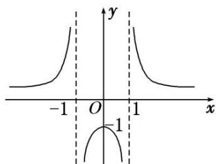
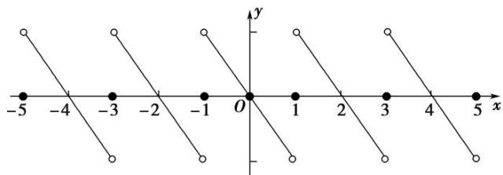

# 专题九 函数的奇偶性、周期性与单调性的综合问题

函数的奇偶性、周期性及单调性是函数的三大性质，在高考中常常将它们综合在一起命题，解题时，往往需要借助函数的奇偶性和周期性来确定另一区间上的单调性，即实现区间的转换，再利用单调性解决相关问题．主要题型有奇偶性、周期性及单调性的判断，比较大小以及多结论的正误判断等.

# 考点一 奇偶性、周期性与单调性的判断

# 【方法总结】

对于函数奇偶性、周期性与单调性的判断问题主要是应用奇偶性、周期性与单调性的定义及相关结论解决．当然对于选填题也可用特值法秒杀.

# 【例题选讲】

[例 1]（1）已知函数 $f(x)=\left\{\begin{aligned}x^{2}+1, & x>0,\\ \cos x, & x\leq0,\end{aligned}\right.$ 则下列结论正确的是()

A. $f(x)$ 是偶函数

B. $f(x)$ 是增函数

C. $f(x)$ 是周期函数

D. $f(x)$ 的值域为 $[-1, +\infty)$  
（2）已知函数 $f(x) = \log_a (a^x + 1) + \frac{1}{2} x (a > 0 \text{ 且 } a \neq 1)$ ，则（）

A. $f(x)$ 图象关于原点对称

B. $f(x)$ 图象关于 $y$ 轴对称

C. $f(x)$ 在 R 上单调递增

D. $f(x)$ 在 $\mathbf{R}$ 上单调递减

# 【对点训练】

1. 定义在 $\mathbf{R}$ 上的函数 $f(x)$ 满足 $f(x) = f(-x)$ ，且 $f(x) = f(x + 6)$ ，当 $x \in [0, 3]$ 时， $f(x)$ 单调递增，则 $f(x)$ 在下列哪个区间上单调递减（）

A. [3, 7]

B. $[4, 5]$

C. [5, 8]

D. [6, 10]

2. 定义在 $\mathbf{R}$ 上的奇函数 $f(x)$ 满足 $f\left[\frac{x + \frac{3}{2}}{2}\right] = f(x)$ ，当 $x \in \left[0, \frac{1}{2}\right]$ 时， $f(x) = \log_{\frac{1}{2}}(1 - x)$ ，则 $f(x)$ 在区间 $\left[\frac{1}{2}, \frac{3}{2}\right]$ 内是（）

A. 减函数且 $f(x) > 0$

B. 减函数且 $f(x) < 0$

C. 增函数且 $f(x) > 0$

D. 增函数且 $f(x) < 0$

3. 已知函数 $f(x)=\mathrm{e}^{x-1}-\mathrm{e}^{-x+1}$ ，则下列说法正确的是()

A. 函数 $f(x)$ 的最小正周期是 1

B. 函数 $f(x)$ 是单调递减函数

C. 函数 $f(x)$ 的图象关于直线 $x = 1$ 轴对称

D. 函数 $f(x)$ 的图象关于(1, 0)中心对称

4. 已知函数 $f(x)$ 是定义域为 $\mathbf{R}$ 的偶函数，且 $f(x + 1) = \frac{1}{f(x)}$ ，若 $f(x)$ 在 $[-1, 0]$ 上是减函数，那么 $f(x)$ 在[2, 3]上是（）

A. 增函数

B. 减函数

C. 先增后减的函数

D. 先减后增的函数

5. 定义在 $\mathbf{R}$ 上的奇函数 $f(x)$ 满足 $f(x + 1) = f(-x)$ ，当 $x \in (0, 1)$ 时， $f(x) = \begin{cases} \log_{\frac{1}{2}} \left| \frac{1}{2} - x \right| & x \neq \frac{1}{2} \\ 0 & x = \frac{1}{2} \end{cases}$ 则 $f(x)$ 在区间 $\left[1, \frac{3}{2}\right]$ 内是（）

A. 增函数且 $f(x) > 0$

B. 增函数且 $f(x) < 0$

C. 减函数且 $f(x) > 0$

D. 减函数且 $f(x) < 0$

6. 已知函数 $f(x) = \begin{cases} x^2 + 1, & x > 0, \\ \cos(6\pi + x), & x \leq 0, \end{cases}$ 则下列结论正确的是（）

A. 函数 $f(x)$ 是偶函数

B. 函数 $f(x)$ 是减函数

C. 函数 $f(x)$ 是周期函数

D. 函数 $f(x)$ 的值域为 $[-1, +\infty)$

# 考点二 比较函数值的大小

# 【方法总结】
比较函数值大小的思路：比较函数值的大小时，若自变量的值不在同一个单调区间内，要利用其函数性质，转化到同一个单调区间上进行比较，对于选择题、填空题能数形结合的尽量用图象法求解．同时要充分利用奇函数在关于原点对称的两个区间上具有相同的单调性，偶函数在关于原点对称的两个区间上具有相反的单调性.

# 【例题选讲】

[例 2]（1）已知偶函数 $f(x)$ 对于任意 $x \in R$ 都有 $f(x+1) = -f(x)$ ，且 $f(x)$ 在区间 [0, 1] 上是单调递增的，则 $f(-6.5)$ ， $f(-1)$ ， $f(0)$ 的大小关系是（）

A. $f(0) < f(-6.5) < f(-1)$

B. $f(-6.5) < f(0) < f(-1)$

C. $f(-1) < f(-6.5) < f(0)$

D. $f(-1) < f(0) < f(-6.5)$  
（2）已知定义在 $\mathbf{R}$ 上的奇函数 $f(x)$ 满足 $f(x - 4) = -f(x)$ ，且在区间[0，2]上是增函数，则（

A. $f(-25) < f(11) < f(80)$

B. $f(80) < f(11) < f(-25)$

C. $f(11) < f(80) < f(-25)$

D. $f(-25) < f(80) < f(11)$  
（3）已知函数 $f(x)$ 的定义域为 R，且满足下列三个条件：

①对任意的 $x_{1}, x_{2} \in [4, 8]$ ，当 $x_{1} < x_{2}$ 时，都有 $\frac{f(x_1) - f(x_2)}{x_1 - x_2} > 0$ ；② $f(x + 4) = -f(x)$ ；③ $y = f(x + 4)$ 是偶函数。若 $a = f(6), b = f(11), c = f(2017)$ ，则 $a, b, c$ 的大小关系正确的是（）

A. a<b<c

B. b<a<c

C. a<c<b

D. c<b<a

# 【对点训练】

7. 定义在 $\mathbf{R}$ 上的奇函数 $f(x)$ 满足 $f(x + 2) = -f(x)$ ，且在[0, 2)上单调递减，则下列结论正确的是( )

A. $0 < f(1) < f(3)$

B. $f(3)<0<f(1)$

C. $f(1)<0<f(3)$

D. $f(3) < f(1) < 0$

8. 已知定义在 $\mathbf{R}$ 上的函数 $f(x)$ 满足 $f(x - 3) = -f(x)$ ，在区间 $\left[0, \frac{3}{2}\right]$ 上是增函数，且函数 $y = f(x - 3)$ 为奇函数，则（）

A. $f(-31) < f(84) < f(13)$

B. $f(84) < f(13) < f(-31)$

C. $f(13) < f(84) < f(-31)$

D. $f(-31) < f(13) < f(84)$

9. 定义在 $\mathbf{R}$ 上的偶函数 $f(x)$ 满足 $f(x + 1) = -f(x)$ ，且在[0, 1]上单调递增，设 $a = f(3)$ ， $b = f(\sqrt{2})$ ， $c = f(2)$ ，则 $a, b, c$ 的大小关系是 \_\_\_\_.

10. 定义在 $\mathbf{R}$ 上的奇函数 $f(x)$ 满足 $f(x + 2) = -f(x)$ ，且在[0, 1]上是减函数，则有（）

A. $f(\frac{3}{2}) < f(-\frac{1}{4}) < f(\frac{1}{4})$

B. $f(\frac{1}{4}) < f(-\frac{1}{4}) < f(\frac{3}{2})$

C. $f(\frac{3}{2}) < f(\frac{1}{4}) < f(-\frac{1}{4})$

D. $f(-\frac{1}{4})<f(\frac{3}{2})<f(\frac{1}{4})$

11. 已知函数 $f(x)$ 的定义域为 $\mathbf{R}$ ，且满足下列三个条件：

① $\forall x_{1}, x_{2} \in [4, 8]$ ，当 $x_{1}<x_{2}$ 时，都有 $\frac{f(x_{1})-f(x_{2})}{x_{1}-x_{2}}>0$ ；② $f(x+4)=-f(x)$ ；③ $y=f(x+4)$ 是偶函数.
若 $a=f(6)$ ， $b=f(11)$ ， $c=f(2025)$ ，则 a，b，c 的大小关系正确的是()

A. a<b<c

B. b<a<c

C. a<c<b

D. c<b<a

12. 已知 $y = f(x)$ 是偶函数，且当 $0 \leq x \leq 1$ 时， $f(x) = \sin x$ ，而 $y = f(x + 1)$ 是奇函数，则 $a = f(-3.5)$ ， $b = f(7)$ ， $c$

=f(12)的大小关系是()

A. $c < b < a$

B. c<a<b

C. a<c<b

D. a<b<c

13. 定义在 $\mathbf{R}$ 上的函数 $y = f(x)$ 满足以下三个条件:

①对于任意的 $x \in R$ ，都有 $f(x+1)=f(x-1)$ ；②函数 $y=f(x+1)$ 的图象关于 y 轴对称；③对于任意的 $x_{1}$ ， $x_{2} \in [0, 1]$ ，都有 $(f(x_{1})-f(x_{2})) \cdot (x_{1}-x_{2}) > 0$ 。则 $f\left(\frac{3}{2}\right)$ 、 $f(2)$ 、 $f(3)$ 从小到大的关系是（）

A. $f\left(\frac{3}{2}\right)>f(2)>f(3)$

B. $f(3)>f(2)>f\left(\frac{3}{2}\right)$

C. $f\left(\frac{3}{2}\right)>f(3)>f(2)$

D. $f(3) > f\left(\frac{3}{2}\right) > f(2)$

14. 已知定义在 $\mathbf{R}$ 上的函数 $f(x)$ 满足 $f(x - 1) = f(x + 1)$ ，且当 $x \in [-1, 1]$ 时， $f(x) = x\left(1 - \frac{2}{\mathrm{e}^x + 1}\right)$ ，则（）

A. $f(-3) < f(2) < f\left(\frac{5}{2}\right)$

B. $f\left(\frac{5}{2}\right)<f(-3)<f(2)$

C. $f(2) < f(-3) < f\left(\frac{5}{2}\right)$

D. $f(2) < f\left(\frac{5}{2}\right) < f(-3)$

# 考点三 奇偶性(对称性)、周期性与单调性等的多项判断

# 【方法总结】

对于函数奇偶性、周期性与单调性的多项判断问题主要是应用奇偶性、周期性与单调性的定义及相关结论解决．当然对于选填题也可用特值法秒杀.

# 【例题选讲】

[例 3] （1） 已知函数 $f(x)=\frac{1}{|x|-1}$ ，下列关于函数 $f(x)$ 的结论：

① $y=f(x)$ 的值域为 R;  
② $y=f(x)$ 在 $(0,+\infty)$ 上单调递减；  
③ $y=f(x)$ 的图象关于y轴对称;  
④ $y=f(x)$ 的图象与直线 $y=ax(a\neq0)$ 至少有一个交点.
其中正确结论的序号是\_\_\_\_。

  
（2）设函数 $f(x)$ 是定义在 $\mathbf{R}$ 上的偶函数，且对任意的 $x \in \mathbb{R}$ 恒有 $f(x + 1) = f(x - 1)$ ，已知当 $x \in [0, 1]$ 时， $f(x) = 2^x$ ，则有

①2 是函数 $f(x)$ 的周期;  
②函数 $f(x)$ 在 $(1, 2)$ 上是减函数，在 $(2, 3)$ 上是增函数；  
③函数 $f(x)$ 的最大值是 1，最小值是 0.
其中所有正确命题的序号是\_\_\_\_。  
（3）已知定义在 $\mathbf{R}$ 上的函数 $y = f(x)$ 满足条件 $f\left[\frac{x + \frac{3}{2}}{2}\right] = -f(x)$ ，且函数 $y = f\left[\frac{x - \frac{3}{4}}{4}\right]$ 为奇函数，给出以下四个命题：

①函数 $f(x)$ 是周期函数；  
②函数 $f(x)$ 的图象关于点 $\left(-\frac{3}{4}, 0\right)$ 对称；  
③函数 $f(x)$ 为 R 上的偶函数；
④函数 $f(x)$ 为 R 上的单调函数.
其中真命题的序号为\_\_\_\_。  
（4）已知函数 $y = f(x)$ 是定义在 $\mathbf{R}$ 上的奇函数， $\forall x \in \mathbb{R}$ ， $f(x - 1) = f(x + 1)$ 成立，当 $x \in (0,1)$ 且 $x_{1} \neq x_{2}$ 时，有 $\frac{f(x_2) - f(x_1)}{x_2 - x_1} < 0$ 。给出下列命题：

① $f(1)=0;$   
② $f(x)$ 在 $[-2, 2]$ 上有5个零点；  
③点(2014, 0)是函数 $y=f(x)$ 图象的一个对称中心;  
④直线 x=2014 是函数 $y=f(x)$ 图象的一条对称轴.
则正确命题的序号是\_\_\_\_。

  
（5）定义在 $\mathbf{R}$ 上的函数 $f(x)$ 满足 $f(x + y) = f(x) + f(y)$ ， $f(x + 2) = -f(x)$ 且 $f(x)$ 在 $[-1, 0]$ 上是增函数，给出下列几个命题：

① $f(x)$ 是周期函数；  
② $f(x)$ 的图象关于x=1对称;  
③ $f(x)$ 在[1，2]上是减函数；  
④ $f(2)=f(0)$ ,
其中正确命题的序号是\_\_\_\_(请把正确命题的序号全部写出来).

# 【对点训练】

15. 函数 $y = f(x)$ 是定义在 $\mathbf{R}$ 上的奇函数，且满足 $f(x - 2) = -f(x)$ 对一切 $x \in \mathbf{R}$ 都成立，又当 $x \in [-1, 1]$ 时， $f(x) = x^3$ ，则下列四个命题：

①函数 $y=f(x)$ 是以 4 为周期的周期函数；  
②当 $x \in [1, 3]$ 时， $f(x) = (2 - x)^{3}$ ;  
③函数 $y=f(x)$ 的图象关于 x=1 对称；  
④函数 $y=f(x)$ 的图象关于点 $(2,0)$ 对称.
其中正确命题的序号是\_\_\_\_。

16. 定义在实数集 R 上的函数 $f(x)$ 满足 $f(x)+f(x+2)=0$ ，且 $f(4-x)=f(x)$ 。现有以下三种叙述：

①8 是函数 $f(x)$ 的一个周期;  
② $f(x)$ 的图象关于直线x=2对称；  
③ $f(x)$ 是偶函数.
其中正确的序号是\_\_\_\_。

17. 已知定义在 $\mathbf{R}$ 上的函数 $y = f(x)$ 满足条件 $f(x + \frac{3}{2}) = -f(x)$ ，且函数 $y = f(x - \frac{3}{4})$ 为奇函数，给出以下四个结论：

①函数 $f(x)$ 是周期函数；  
②函数 $f(x)$ 的图象关于点 $\left(-\frac{3}{4}, 0\right)$ 对称；  
③函数 $f(x)$ 为 R 上的偶函数；  
④函数 $f(x)$ 为 R 上的单调函数.
其中正确结论的序号为\_\_\_\_。

18. 已知函数 $y = f(x)$ 是 $\mathbf{R}$ 上的偶函数，对于任意 $x \in \mathbb{R}$ ，都有 $f(x + 6) = f(x) + f(3)$ 成立，当 $x_{1}, x_{2} \in [0,3]$ ，且 $x_{1} \neq x_{2}$ 时，都有 $\frac{f(x_1) - f(x_2)}{x_1 - x_2} > 0$ . 给出下列命题：

① $f(3)=0;$   
②直线 x = -6 是函数 $y = f(x)$ 的图象的一条对称轴；  
③函数 $y=f(x)$ 在 $[-9, -6]$ 上为增函数；  
④函数 $y=f(x)$ 在 $[-9, 9]$ 上有四个零点.
其中所有正确命题的序号为\_\_\_\_。

19. 定义在 $\mathbf{R}$ 上的奇函数 $f(x)$ 满足 $f\left[\frac{x + 1}{2}\right] = f\left[\frac{1}{2} - x\right]$ ，且在 $\left[-\frac{1}{2}, 0\right]$ 上是增函数，给出下列关于 $f(x)$ 的判断：

① $f(x)$ 是周期函数，且周期为2；  
② $f(x)$ 的图象关于点(1, 0)对称；  
③ $f(x)$ 在 $[0, 1]$ 上是减函数；  
④ $f(x)$ 在 $\left[\frac{1}{2},\frac{3}{2}\right]$ 上是增函数；  
⑤ $f\left(\frac{7}{6}\right)=f\left(\frac{11}{6}\right).$
其中正确的序号是\_\_\_\_。

