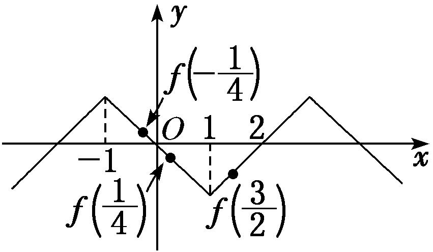
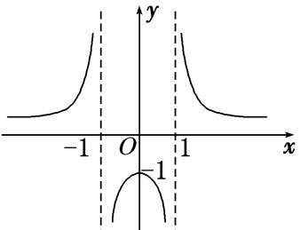
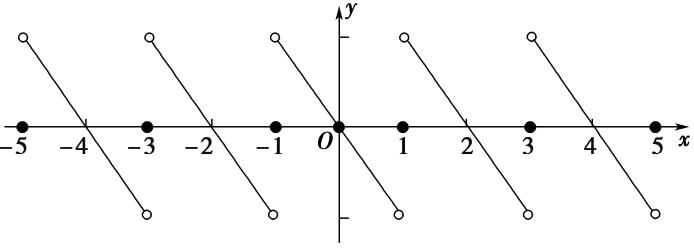

专题九　函数的奇偶性、周期性与单调性的综合问题

函数的奇偶性、周期性及单调性是函数的三大性质，在高考中常常将它们综合在一起命题，解题时，往往需要借助函数的奇偶性和周期性来确定另一区间上的单调性，即实现区间的转换，再利用单调性解决相关问题．主要题型有奇偶性、周期性及单调性的判断，比较大小以及多结论的正误判断等．

考点一　奇偶性、周期性与单调性的判断

【方法总结】

对于函数奇偶性、周期性与单调性的判断问题主要是应用奇偶性、周期性与单调性的定义及相关结论解决．当然对于选填题也可用特值法秒杀．

【例题选讲】

<strong>[例1]</strong>（1）已知函数<em>f</em>(<em>x</em>)＝则下列结论正确的是(　　)

A．*f*(*x*)是偶函数　　
B．*f*(*x*)是增函数　　
C．*f*(*x*)是周期函数　　
D．*f*(*x*)的值域为[－1，＋∞)
答案　<strong>D</strong>　解析　因为<em>f</em>(π)＝π2＋1，<em>f</em>(－π)＝－1，所以<em>f</em>(－π)≠<em>f</em>(π)，所以函数<em>f</em>(<em>x</em>)不是偶函数，排除A；因为函数<em>f</em>(<em>x</em>)在(－2π，－π)上单调递减，排除B；函数<em>f</em>(<em>x</em>)在(0，＋∞)上单调递增，所以函数<em>f</em>(<em>x</em>)不是周期函数，排除C；因为<em>x</em>&gt;0时，<em>f</em>(<em>x</em>)&gt;1，<em>x</em>≤0时，－1≤<em>f</em>(<em>x</em>)≤1，所以函数<em>f</em>(<em>x</em>)的值域为[－1，＋∞)．  
（2）已知函数<em>f</em>(<em>x</em>)＝log<em>a</em>(<em>ax</em>＋1)＋<em>x</em>(<em>a</em>&gt;0且<em>a</em>≠1)，则(　　)

A．*f*(*x*)图象关于原点对称　　　　　　　　　　
B．*f*(*x*)图象关于*y*轴对称

C．<em>f</em>(<em>x</em>)在<strong>R</strong>上单调递增　　　　　　　　　　　
D．<em>f</em>(<em>x</em>)在<strong>R</strong>上单调递减
答案　C　解析　∵<em>f</em>(<em>x</em>)＋<em>f</em>(－<em>x</em>)≠0，<em>f</em>(<em>x</em>)－<em>f</em>(－<em>x</em>)≠0，可知<em>f</em>(<em>x</em>)为非奇非偶函数，故排除A，B；当<em>a</em>&gt;1时，<em>u</em>＝<em>ax</em>＋1在<strong>R</strong>上单调递增，<em>y</em>＝log<em>au</em>在(1，＋∞)上单调递增，且<em>y</em>＝<em>x</em>在<strong>R</strong>上单调递增，∴<em>f</em>(<em>x</em>)在<strong>R</strong>上单调递增；当0&lt;<em>a</em>&lt;1时，<em>u</em>＝<em>ax</em>＋1在<strong>R</strong>上单调递减，<em>y</em>＝log<em>au</em>在(1，＋∞)上单调递减，且<em>y</em>＝<em>x</em>在<strong>R</strong>上单调递增，∴<em>f</em>(<em>x</em>)在<strong>R</strong>上单调递增，故选C．

【对点训练】

1．定义在<strong>R</strong>上的函数<em>f</em>(<em>x</em>)满足<em>f</em>(<em>x</em>)＝<em>f</em>(－<em>x</em>)，且<em>f</em>(<em>x</em>)＝<em>f</em>(<em>x</em>＋6)，当<em>x</em>∈[0，3]时，<em>f</em>(<em>x</em>)单调递增，则<em>f</em>(<em>x</em>)在下

列哪个区间上单调递减(　　)

A．[3，7]　　　　　　　
B．[4，5]　　　　　　　
C．[5，8]　　　　　　　
D．[6，10]

1．答案　B　解析　依题意知，*f*(*x*)是偶函数，且是以6为周期的周期函数．因为当*x*∈[0，3]时，*f*(*x*)单

调递增，所以*f*(*x*)在[－3，0]上单调递减．根据函数周期性知，函数*f*(*x*)在[3，6]上单调递减．又因为[4，5]⊆[3，6]，所以函数*f*(*x*)在[4，5]上单调递减．

2．定义在<strong>R</strong>上的奇函数<em>f</em>(<em>x</em>)满足<em>f</em>＝<em>f</em>(<em>x</em>)，当<em>x</em>∈时，<em>f</em>(<em>x</em>)＝(1－<em>x</em>)，则<em>f</em>(<em>x</em>)在区间内

是(　　)

A．减函数且*f*(*x*)>0　　
B．减函数且*f*(*x*)<0　　
C．增函数且*f*(*x*)>0　　
D．增函数且*f*(*x*)<0

2．答案　D　解析　当*x*∈时，由*f*(*x*)＝(1－*x*)可知，*f*(*x*)单调递增且*f*(*x*)>0，又函数*f*(*x*)为奇函

数，所以在区间上函数也单调递增，且*f*(*x*)<0.由*f*＝*f*(*x*)知，函数的周期为，所以在区间上，函数单调递增且*f*(*x*)<0．故选D．

3．已知函数<em>f</em>(<em>x</em>)＝e<em>x</em>－1－e－<em>x</em>＋1，则下列说法正确的是(　　)

A．函数*f*(*x*)的最小正周期是1　　　　　　　　
B．函数*f*(*x*)是单调递减函数

C．函数*f*(*x*)的图象关于直线*x*＝1轴对称　　　
D．函数*f*(*x*)的图象关于(1，0)中心对称

3．答案　D　解析　函数<em>f</em>(<em>x</em>)＝e<em>x</em>－1－e－<em>x</em>＋1，即<em>f</em>(<em>x</em>)＝e<em>x</em>－1－，可令<em>t</em>＝e<em>x</em>－1，即有<em>y</em>＝<em>t</em>－，由<em>y</em>＝<em>t</em>－在

<em>t</em>＞0单调递增，<em>t</em>＝e<em>x</em>－1在<strong>R</strong>上单调递增，可得函数<em>f</em>(<em>x</em>)在<strong>R</strong>上为增函数，则A，B均错误；由<em>f</em>(2－<em>x</em>)＝e1－<em>x</em>－e<em>x</em>－1，可得<em>f</em>(<em>x</em>)＋<em>f</em>(2－<em>x</em>)＝0，即有<em>f</em>(<em>x</em>)的图象关于点(1，0)对称，则C错误，D正确．故选D．

4．已知函数<em>f</em>(<em>x</em>)是定义域为<strong>R</strong>的偶函数，且<em>f</em>(<em>x</em>＋1)＝，若<em>f</em>(<em>x</em>)在[－1，0]上是减函数，那么<em>f</em>(<em>x</em>)在[2，

3]上是(　　)

A．增函数　　　　
B．减函数　　　　
C．先增后减的函数　　　　
D．先减后增的函数

4．答案　A　解析：由题意知*f*(*x*＋2)＝＝*f*(*x*)，所以*f*(*x*)的周期为2，又函数*f*(*x*)是定义域为R的偶

函数，且*f*(*x*)在[－1，0]上是减函数，则*f*(*x*)在[0，1]上是增函数，所以*f*(*x*)在[2，3]上是增函数．

5．定义在<strong>R</strong>上的奇函数<em>f</em>(<em>x</em>)满足<em>f</em>(<em>x</em>＋1)＝<em>f</em>(－<em>x</em>)，当<em>x</em>∈(0，1)时，<em>f</em>(<em>x</em>)＝则<em>f</em>(<em>x</em>)
在区间内是(　　)

A．增函数且*f*(*x*)>0　　
B．增函数且*f*(*x*)<0　　
C．减函数且*f*(*x*)>0　　
D．减函数且*f*(*x*)<0

5．答案　D　解析　由*f*(*x*)为奇函数，*f*(*x*＋1)＝*f*(－*x*)得，*f*(*x*)＝－*f*(*x*＋1)＝*f*(*x*＋2)，∴*f*(*x*)是周期为2的周

期函数．根据条件，当*x*∈，1时，*f*(*x*)＝，*x*－2∈，－(*x*－2)∈，∴*f*(*x*)＝*f*(*x*－2)＝－*f*(2－*x*)＝，设2－*x*＝*t*，则*t*∈，*x*＝2－*t*，∴－*f*(*t*)＝log－*t*，∴*f*(*t*)＝－log，∴*f*(*x*)＝－log，*x*∈，可以看出当*x*增大时，－*x*减小，log增大，*f*(*x*)减小，∴在区间内，*f*(*x*)是减函数．而由1<*x*<得0<－*x*<．∴log>1，∴*f*(*x*)<0．故选D．

6．已知函数*f*(*x*)＝则下列结论正确的是(　　)

A．函数*f*(*x*)是偶函数　　　　　　　　　　
B．函数*f*(*x*)是减函数

C．函数*f*(*x*)是周期函数　　　　　　　　　
D．函数*f*(*x*)的值域为[－1，＋∞)

6．答案　D　解析　选由函数*f*(*x*)的解析式，知*f*（1）＝2，*f*(－1)＝cos(－1)＝cos 1，*f*（1）≠*f*(－1)，则*f*(*x*)不是

偶函数．当<em>x</em>&gt;0时，<em>f</em>(<em>x</em>)＝<em>x</em>2＋1，则<em>f</em>(<em>x</em>)在区间(0，＋∞)上是增函数，且函数值<em>f</em>(<em>x</em>)&gt;1；当<em>x</em>≤0时，<em>f</em>(<em>x</em>)＝cos <em>x</em>，则<em>f</em>(<em>x</em>)在区间(－∞，0]上不是单调函数，且函数值<em>f</em>(<em>x</em>) ∈[－1，1]．所以函数<em>f</em>(<em>x</em>)不是单调函数，也不是周期函数，其值域为[－1，＋∞)．故选D．

考点二　比较函数值的大小

【方法总结】
比较函数值大小的思路：比较函数值的大小时，若自变量的值不在同一个单调区间内，要利用其函数性质，转化到同一个单调区间上进行比较，对于选择题、填空题能数形结合的尽量用图象法求解．同时要充分利用奇函数在关于原点对称的两个区间上具有相同的单调性，偶函数在关于原点对称的两个区间上具有相反的单调性．

【例题选讲】

<strong>[例2]</strong>（1）已知偶函数<em>f</em>(<em>x</em>)对于任意<em>x</em>∈<strong>R</strong>都有<em>f</em>(<em>x</em>＋1)＝－<em>f</em>(<em>x</em>)，且<em>f</em>(<em>x</em>)在区间[0，1]上是单调递增的，则<em>f</em>(－6.5)，<em>f</em>(－1)，<em>f</em>（0）的大小关系是(　　)

A．*f*（0）<*f*(－6.5)<*f*(－1)　　　　　　　　　　　　
B．*f*(－6.5)<*f*（0）<*f*(－1)

C．*f*(－1)<*f*(－6.5)<*f*（0）　　　　　　　　　　　　
D．*f*(－1)<*f*（0）<*f*(－6.5)
答案　A　解析　由*f*(*x*＋1)＝－*f*(*x*)，得*f*(*x*＋2)＝－*f*(*x*＋1)＝*f*(*x*)，∴函数*f*(*x*)的周期是2．∵函数*f*(*x*)为偶函数，∴*f*(－6.5)＝*f*(－0.5)＝*f*(0.5)，*f*(－1)＝*f*（1）．∵*f*(*x*)在区间[0，1]上是单调递增的，∴*f*（0）<*f*(0.5)<*f*（1），即*f*（0）<*f*(－6.5)<*f*(－1)．  
（2）已知定义在<strong>R</strong>上的奇函数<em>f</em>(<em>x</em>)满足<em>f</em>(<em>x</em>－4)＝－<em>f</em>(<em>x</em>)，且在区间[0，2]上是增函数，则(　　)

A．*f*(－25)＜*f*（11）＜*f*（80）　　　　　　　　　　
B．*f*（80）＜*f*（11）＜*f*(－25)

C．*f*（11）＜*f*（80）＜*f*(－25)　　　　　　　　　　
D．*f*(－25)＜*f*（80）＜*f*（11）
答案　<strong>D</strong>　解析　因为<em>f</em>(<em>x</em>)满足<em>f</em>(<em>x</em>－4)＝－<em>f</em>(<em>x</em>)，所以<em>f</em>(<em>x</em>－8)＝<em>f</em>(<em>x</em>)，所以函数<em>f</em>(<em>x</em>)是以8为周期的周期函数，则<em>f</em>(－25)＝<em>f</em>(－1)，<em>f</em>（80）＝<em>f</em>（0），<em>f</em>（11）＝<em>f</em>（3）．由<em>f</em>(<em>x</em>)是定义在<strong>R</strong>上的奇函数，且满足<em>f</em>(<em>x</em>－4)＝－<em>f</em>(<em>x</em>)，得<em>f</em>（11）＝<em>f</em>（3）＝－<em>f</em>(－1)＝<em>f</em>（1）．因为<em>f</em>(<em>x</em>)在区间[0，2]上是增函数，<em>f</em>(<em>x</em>)在<strong>R</strong>上是奇函数，所以<em>f</em>(<em>x</em>)在区间[－2，2]上是增函数，所以<em>f</em>(－1)＜<em>f</em>（0）＜<em>f</em>（1），即<em>f</em>(－25)＜<em>f</em>（80）＜<em>f</em>（11）．故选D．  
（3）已知函数<em>f</em>(<em>x</em>)的定义域为<strong>R</strong>，且满足下列三个条件：

①对任意的<em>x</em>1，<em>x</em>2∈[4，8]，当<em>x</em>1＜<em>x</em>2时，都有＞0；②<em>f</em>(<em>x</em>＋4)＝－<em>f</em>(<em>x</em>)；③<em>y</em>＝<em>f</em>(<em>x</em>＋4)是偶函数．若<em>a</em>＝<em>f</em>（6），<em>b</em>＝<em>f</em>（11），<em>c</em>＝<em>f</em>(2 017)，则<em>a</em>，<em>b</em>，<em>c</em>的大小关系正确的是(　　)

A．*a*＜*b*＜*c*　　　　　
B．*b*＜*a*＜*c*　　　　　
C．*a*＜*c*＜*b*　　　　　
D．*c*＜*b*＜*a*
答案　<strong>B</strong>　解析　由条件①知，函数<em>f</em>(<em>x</em>)在区间[4，8]上是增函数，由条件②知，函数<em>f</em>(<em>x</em>)的周期<em>T</em>＝8，由条件③知，函数<em>f</em>(<em>x</em>)的图象关于直线<em>x</em>＝4对称．则<em>f</em>（11）＝<em>f</em>（3）＝<em>f</em>（5），<em>f</em>(2 017)＝<em>f</em>（1）＝<em>f</em>（7）．由<em>f</em>（5）＜<em>f</em>（6）＜<em>f</em>（7）知<em>f</em>（11）＜<em>f</em>（6）＜<em>f</em>(2 017)，即<em>b</em>＜<em>a</em>＜<em>c</em>．故选B．

【对点训练】

7．定义在<strong>R</strong>上的奇函数<em>f</em>(<em>x</em>)满足<em>f</em>(<em>x</em>＋2)＝－<em>f</em>(<em>x</em>)，且在[0，2)上单调递减，则下列结论正确的是(　　)

A．0<*f*（1）<*f*（3）　　　　
B．*f*（3）<0<*f*（1）　　　　
C．*f*（1）<0<*f*（3）　　　　
D．*f*（3）<*f*（1）<0

7．答案　C　解析　由函数*f*(*x*)是定义在R上的奇函数，得*f*（0）＝0．由*f*(*x*＋2)＝－*f*(*x*)，得*f*(*x*＋4)＝－*f*(*x*

＋2)＝*f*(*x*)，故函数*f*(*x*)是以4为周期的周期函数，所以*f*（3）＝*f*(－1)．又*f*(*x*)在[0，2)上单调递减，所以函数*f*(*x*)在(－2，2)上单调递减，所以*f*(－1)>*f*（0）>*f*（1），即*f*（1）<0<*f*（3）．

8．已知定义在<strong>R</strong>上的函数<em>f</em>(<em>x</em>)满足<em>f</em>(<em>x</em>－3)＝－<em>f</em>(<em>x</em>)，在区间上是增函数，且函数<em>y</em>＝<em>f</em>(<em>x</em>－3)为奇函

数，则(　　)

A．*f*(－31)＜*f*（84）＜*f*（13）　　　　　　　　　　　
B．*f*（84）＜*f*（13）＜*f*(－31)

C．*f*（13）＜*f*（84）＜*f*(－31)　　　　　　　　　　　
D．*f*(－31)＜*f*（13）＜*f*（84）

8．答案　A　解析　根据题意，函数*f*(*x*)满足*f*(*x*－3)＝－*f*(*x*)，则有*f*(*x*－6)＝－*f*(*x*－3)＝*f*(*x*)，则函数*f*(*x*)

为周期为6的周期函数．若函数*y*＝*f*(*x*－3)为奇函数，则*f*(*x*)的图象关于点(－3，0)成中心对称，则有*f*(*x*)＝－*f*(－6－*x*)，又由函数的周期为6，则有*f*(*x*)＝－*f*(－*x*)，函数*f*(*x*)为奇函数．又由函数在区间上是增函数，则函数*f*(*x*)在上为增函数，*f*（84）＝*f*(14×6＋0)＝*f*（0），*f*(－31)＝*f*(－1－5×6)＝*f*(－1)，*f*（13）＝*f*(1＋2×6)＝*f*（1），则有*f*(－1)＜*f*（0）＜*f*（1），即*f*(－31)＜*f*（84）＜*f*（13），故选A．

9．定义在<strong>R</strong>上的偶函数<em>f</em>(<em>x</em>)满足<em>f</em>(<em>x</em>＋1)＝－<em>f</em>(<em>x</em>)，且在[0，1]上单调递增，设<em>a</em>＝<em>f</em>（3），<em>b</em>＝<em>f</em>()，<em>c</em>＝<em>f</em>（2），
则*a*，*b*，*c*的大小关系是\_\_\_\_\_\_\_\_．

9．答案　*a*＞*b*＞*c*　解析　由*f*(*x*＋1)＝－*f*(*x*)得*f*(*x*＋2)＝*f*(*x*)，即函数*f*(*x*)的周期为2，则*f*（3）＝*f*（1），*f*（2）＝

*f*（0），*f*()＝*f*(－2)＝*f*(2－)，由于0＜2－＜1，且函数*f*(*x*)在[0，1]上单调递增，所以*f*（3）＞*f*()＞*f*（2），即*a*＞*b*＞*c*．

10．定义在<strong>R</strong>上的奇函数<em>f</em>(<em>x</em>)满足<em>f</em>(<em>x</em>＋2)＝－<em>f</em>(<em>x</em>)，且在[0，1]上是减函数，则有(　　)

A．　　　　　　　　
B．

C．　　　　　　　　
D．

10．答案　C　解析　由题设知：*f*(*x*)＝－*f*(*x*－2)＝*f*(2－*x*)，所以函数*f*(*x*)的图象关于直线*x*＝1对称；函数

*f*(*x*)是奇函数，其图象关于坐标原点对称，由于函数*f*(*x*)在[0，1]上是减函数，所以*f*(*x*)在[－1，0]上也是减函数，综上函数*f*(*x*)在[－1，1]上是减函数；又，－<<，∴，即．

11．已知函数<em>f</em>(<em>x</em>)的定义域为<strong>R</strong>，且满足下列三个条件：

①∀<em>x</em>1，<em>x</em>2∈[4，8]，当<em>x</em>1&lt;<em>x</em>2时，都有&gt;0；②<em>f</em>(<em>x</em>＋4)＝－<em>f</em>(<em>x</em>)；③<em>y</em>＝<em>f</em>(<em>x</em>＋4)是偶函数．
若*a*＝*f*（6），*b*＝*f*（11），*c*＝*f*(2 025)，则*a*，*b*，*c*的大小关系正确的是(　　)

A．*a*<*b*<*c*　　　　　
B．*b*<*a*<*c*　　　　　
C．*a*<*c*<*b*　　　　　
D．*c*<*b*<*a*

11．答案　B　解析　由条件①知，当*x*∈[4，8]时，*f*(*x*)为增函数；由条件②知，*f*(*x*＋8)＝－*f*(*x*＋4)＝*f*(*x*)，

*f*(*x*)是周期为8的周期函数；由条件③知，*y*＝*f*(*x*)关于直线*x*＝4对称，所以*f*（11）＝*f*（3）＝*f*（5），*f*(2 025)＝*f*（1）＝*f*（7），故*f*（5）＜*f*（6）＜*f*（7），即*b*＜*a*＜*c*．故选B．

12．已知*y*＝*f*(*x*)是偶函数，且当0≤*x*≤1时，*f*(*x*)＝sin*x*，而*y*＝*f*(*x*＋1)是奇函数，则*a*＝*f*(－3.5)，*b*＝*f*（7），*c*

＝*f*（12）的大小关系是(　　)

A．*c*＜*b*＜*a*　　　　　
B．*c*＜*a*＜*b*　　　　　
C．*a*＜*c*＜*b*　　　　　
D．*a*＜*b*＜*c*

12．答案　B　解析　因为*y*＝*f*(*x*)是偶函数，所以*f*(*x*)＝*f*(－*x*)，因为*y*＝*f*(*x*＋1)是奇函数，所以*f*(*x*)＝－*f*(2

－*x*)，所以*f*(－*x*)＝－*f*(2－*x*)，即*f*(*x*)＝*f*(*x*＋4)．所以函数*f*(*x*)的周期为4，又因为当0≤*x*≤1时，*f*(*x*)＝sin *x*，所以函数在[0，1]上单调递增，因为*a*＝*f*(－3.5)＝*f*(－3.5＋4)＝*f*(0.5)；*b*＝*f*（7）＝*f*(7－8)＝*f*(－1)＝*f*（1），*c*＝*f*（12）＝*f*(12－12)＝*f*（0），又因为*f*(*x*)在[0，1]上为增函数，所以*f*（0）＜*f*(0.5)＜*f*（1），即*c*＜*a*＜*b*．

13．定义在<strong>R</strong>上的函数<em>y</em>＝<em>f</em>(<em>x</em>)满足以下三个条件：

①对于任意的<em>x</em>∈<strong>R</strong>，都有<em>f</em>(<em>x</em>＋1)＝<em>f</em>(<em>x</em>－1)；②函数<em>y</em>＝<em>f</em>(<em>x</em>＋1)的图象关于<em>y</em>轴对称；③对于任意的<em>x</em>1，<em>x</em>2∈[0，1]，都有(<em>f</em>(<em>x</em>1)－<em>f</em>(<em>x</em>2))·(<em>x</em>1－<em>x</em>2)&gt;0．则<em>f</em> 、<em>f</em>（2）、<em>f</em>（3）从小到大的关系是(　　)

A．*f* >*f*（2）>*f*（3）　　
B．*f*（3）>*f*（2）>*f*　　
C．*f* >*f*（3）>*f*（2）　　
D．*f*（3）>*f* >*f*（2）

13．答案　D　解析　①对于任意的<em>x</em>∈<strong>R</strong>，都有<em>f</em>(<em>x</em>＋1)＝<em>f</em>(<em>x</em>－1)，所以函数的周期为<em>T</em>＝2；②函数<em>y</em>＝<em>f</em>(<em>x</em>

＋1)的图象关于<em>y</em>轴对称，所以函数<em>f</em>(<em>x</em>)关于直线<em>x</em>＝1对称；③对于任意的<em>x</em>1，<em>x</em>2∈[0,1]，都有(<em>f</em>(<em>x</em>1)－<em>f</em>(<em>x</em>2))(<em>x</em>1－<em>x</em>2)&gt;0，所以函数在[0,1]单调递增，因为<em>f</em>（3）＝<em>f</em>（1），<em>f</em> ＝<em>f</em> ，<em>f</em>（2）＝<em>f</em>（0），1＞＞0，所以<em>f</em>（3）&gt;<em>f</em> &gt;<em>f</em>（2），故选D．

14．已知定义在<strong>R</strong>上的函数<em>f</em>(<em>x</em>)满足<em>f</em>(<em>x</em>－1)＝<em>f</em>(<em>x</em>＋1)，且当<em>x</em>∈[－1，1]时，<em>f</em>(<em>x</em>)＝<em>x</em>，则(　　)

A．*f*(－3)<*f*（2）<*f* 　　
B．*f* <*f*(－3)<*f*（2）　　
C．*f*（2）<*f*(－3)<*f* 　　
D．*f*（2）<*f* <*f*(－3)

14．答案　D　解析：∵*f*(*x*－1)＝*f*(*x*＋1)，则函数*f*(*x*)的周期*T*＝2．当*x*∈[－1，1]时，*f*(*x*)＝*x*＝

*x*·，则*f*(－*x*)＝－*x*·＝－*x*·＝*x*·＝*f*(*x*)，则函数*f*(*x*)为偶函数，因此*f* ＝*f* ，*f*(－3)＝*f*(－1)＝*f*（1），*f*（2）＝*f*（0）．当0≤*x*≤1时，函数*y*＝*x*与*y*＝1－均为增函数且都不小于0，所以*f*(*x*)＝*x*在区间[0，1]上是增函数．∴*f*（1）>*f* >*f*（0），即*f*(－3)>*f* >*f*（2）．

考点三　奇偶性(对称性)、周期性与单调性等的多项判断

【方法总结】

对于函数奇偶性、周期性与单调性的多项判断问题主要是应用奇偶性、周期性与单调性的定义及相关结论解决．当然对于选填题也可用特值法秒杀．

【例题选讲】

<strong>[例3]</strong> （1）已知函数<em>f</em>(<em>x</em>)＝，下列关于函数<em>f</em>(<em>x</em>)的结论：

①<em>y</em>＝<em>f</em>(<em>x</em>)的值域为<strong>R</strong>；
②*y*＝*f*(*x*)在(0，＋∞)上单调递减；
③*y*＝*f*(*x*)的图象关于*y*轴对称；
④*y*＝*f*(*x*)的图象与直线*y*＝*ax*(*a*≠0)至少有一个交点．
其中正确结论的序号是\_\_\_\_\_\_\_\_．
答案　③④　解析：函数*f*(*x*)＝＝其图象如图所示，由图象可知*f*(*x*)的值域为(－∞，－1)∪(0，＋∞)，故①错；*f*(*x*)在(0,1)和(1，＋∞)上单调递减，而在(0，＋∞)上不是单调的，故②错；*f*(*x*)的图象关于*y*轴对称，故③正确；由于*f*(*x*)在每个象限都有图象，所以与过原点的直线*y*＝*ax*(*a*≠0)至少有一个交点，故④正确．

  
（2）设函数<em>f</em>(<em>x</em>)是定义在<strong>R</strong>上的偶函数，且对任意的 <em>x</em>∈<strong>R</strong>恒有<em>f</em>(<em>x</em>＋1)＝<em>f</em>(<em>x</em>－1)，已知当<em>x</em>∈[0，1]时，<em>f</em>(<em>x</em>)＝2<em>x</em>，则有

①2是函数*f*(*x*)的周期；
②函数*f*(*x*)在(1，2)上是减函数，在(2，3)上是增函数；
③函数*f*(*x*)的最大值是1，最小值是0.
其中所有正确命题的序号是\_\_\_\_\_\_\_\_．
答案　<strong>①②</strong>　解析　由<em>f</em>(<em>x</em>＋1)＝<em>f</em>(<em>x</em>－1)得<em>f</em>(<em>x</em>＋2)＝<em>f</em>(<em>x</em>)，因此2是函数<em>f</em>(<em>x</em>)的周期，故①正确；由题意知，在区间[0,1]上，函数<em>f</em>(<em>x</em>)是增函数．在区间[－1,0]上，函数<em>f</em>(<em>x</em>)是减函数，由函数的周期性知，函数<em>f</em>(<em>x</em>)在(1，2)上是减函数，在(2，3)上是增函数，故②正确；函数<em>f</em>(<em>x</em>)的最大值为2，最小值为1，故③错误．  
（3）已知定义在<strong>R</strong>上的函数<em>y</em>＝<em>f</em>(<em>x</em>)满足条件<em>f</em>＝－<em>f</em>(<em>x</em>)，且函数<em>y</em>＝<em>f</em>为奇函数，给出以下四个命题：

①函数*f*(*x*)是周期函数；
②函数*f*(*x*)的图象关于点对称；
③函数<em>f</em>(<em>x</em>)为<strong>R</strong>上的偶函数；
④函数<em>f</em>(<em>x</em>)为<strong>R</strong>上的单调函数．
其中真命题的序号为\_\_\_\_\_\_\_\_．
答案　<strong>①②③</strong>　解析　<em>f</em>(<em>x</em>＋3)＝<em>f</em>＝－<em>f</em>＝<em>f</em>(<em>x</em>)，所以<em>f</em>(<em>x</em>)是周期为3的周期函数，①正确；函数<em>f</em>是奇函数，其图象关于点(0,0)对称，则<em>f</em>(<em>x</em>)的图象关于点对称，②正确；因为<em>f</em>(<em>x</em>)的图象关于点对称，－＝，所以<em>f</em>(－<em>x</em>)＝－<em>f</em>，又<em>f</em>＝－<em>f</em>＝－<em>f</em>(<em>x</em>)，所以<em>f</em>(－<em>x</em>)＝<em>f</em>(<em>x</em>)，③正确；<em>f</em>(<em>x</em>)是周期函数在<strong>R</strong>上不可能是单调函数，④错误．故真命题的序号为①②③．  
（4）已知函数<em>y</em>＝<em>f</em>(<em>x</em>)是定义在<strong>R</strong>上的奇函数，∀<em>x</em>∈<strong>R</strong>，<em>f</em>(<em>x</em>－1)＝<em>f</em>(<em>x</em>＋1)成立，当<em>x</em>∈(0，1)且<em>x</em>1≠<em>x</em>2时，有＜0．给出下列命题：

①*f*（1）＝0；
②*f*(*x*)在[－2，2]上有5个零点；
③点(2 014，0)是函数*y*＝*f*(*x*)图象的一个对称中心；
④直线*x*＝2 014是函数*y*＝*f*(*x*)图象的一条对称轴．
则正确命题的序号是\_\_\_\_\_\_\_\_．
答案　①②③　解析：令<em>f</em>(<em>x</em>－1)＝<em>f</em>(<em>x</em>＋1)中<em>x</em>＝0，得<em>f</em>(－1)＝<em>f</em>（1）．∵<em>f</em>(－1)＝－<em>f</em>（1），∴2<em>f</em>（1）＝0，∴<em>f</em>（1）＝0，故①正确；由<em>f</em>(<em>x</em>－1)＝<em>f</em>(<em>x</em>＋1)得<em>f</em>(<em>x</em>)＝<em>f</em>(<em>x</em>＋2)，∴<em>f</em>(<em>x</em>)是周期为2的周期函数，∴<em>f</em>（2）＝<em>f</em>（0）＝0，又当<em>x</em>∈(0，1)且<em>x</em>1≠<em>x</em>2时，有＜0，∴函数在区间(0,1)上单调递减，可作函数的简图如图：由图知②③正确，④不正确，∴正确命题的序号为①②③

  
（5）定义在<strong>R</strong>上的函数<em>f</em>(<em>x</em>)满足<em>f</em>(<em>x</em>＋<em>y</em>)＝<em>f</em>(<em>x</em>)＋<em>f</em>(<em>y</em>)，<em>f</em>(<em>x</em>＋2)＝－<em>f</em>(<em>x</em>)且<em>f</em>(<em>x</em>)在[－1，0]上是增函数，给出下列几个命题：

①*f*(*x*)是周期函数；
②*f*(*x*)的图象关于*x*＝1对称；
③*f*(*x*)在[1，2]上是减函数；
④*f*（2）＝*f*（0），
其中正确命题的序号是\_\_\_\_\_\_\_\_(请把正确命题的序号全部写出来)．
答案　①②③④　解析　*f*(*x*＋*y*)＝*f*(*x*)＋*f*(*y*)对任意*x*，*y*∈R恒成立．令*x*＝*y*＝0，所以*f*（0）＝0.令*x*＋*y*＝0，所以*y*＝－*x*，所以*f*（0）＝*f*(*x*)＋*f*(－*x*)．所以*f*(－*x*)＝－*f*(*x*)，所以*f*(*x*)为奇函数．因为*f*(*x*)在*x*∈[－1，0]上为增函数，又*f*(*x*)为奇函数，所以*f*(*x*)在[0，1]上为增函数．由*f*(*x*＋2)＝－*f*(*x*)⇒*f*(*x*＋4)＝－*f*(*x*＋2)＝*f*(*x*)，所以周期*T*＝4，即*f*(*x*)为周期函数．*f*(*x*＋2)＝－*f*(*x*)⇒*f*(－*x*＋2)＝－*f*(－*x*)．又因为*f*(*x*)为奇函数，所以*f*(2－*x*)＝*f*(*x*)，所以函数关于*x*＝1对称．由*f*(*x*)在[0，1]上为增函数，又关于*x*＝1对称，所以*f*(*x*)在[1，2]上为减函数．由*f*(*x*＋2)＝－*f*(*x*)，令*x*＝0得*f*（2）＝－*f*（0）＝*f*（0）．

【对点训练】

15．函数<em>y</em>＝<em>f</em>(<em>x</em>)是定义在<strong>R</strong>上的奇函数，且满足<em>f</em>(<em>x</em>－2)＝－<em>f</em>(<em>x</em>)对一切<em>x</em>∈<strong>R</strong>都成立，又当<em>x</em>∈[－1，1]时，

<em>f</em>(<em>x</em>)＝<em>x</em>3，则下列四个命题：

①函数*y*＝*f*(*x*)是以4为周期的周期函数；
②当<em>x</em>∈[1，3]时，<em>f</em>(<em>x</em>)＝(2－<em>x</em>)3；
③函数*y*＝*f*(*x*)的图象关于*x*＝1对称；
④函数*y*＝*f*(*x*)的图象关于点(2，0)对称．
其中正确命题的序号是\_\_\_\_\_\_\_\_.

15．答案　①②③④　解析　因为函数*y*＝*f*(*x*)是奇函数，故有*f*(－*x*)＝－*f*(*x*)，由*f*(*x*－2)＝－*f*(*x*)可知，函

数是最小正周期为4的函数，故命题①正确．<em>f</em>(－<em>x</em>)＝－<em>f</em>(<em>x</em>)和<em>f</em>(<em>x</em>－2)＝－<em>f</em>(<em>x</em>)结合得到<em>f</em>(<em>x</em>－2)＝<em>f</em>(－<em>x</em>)，故函数关于<em>x</em>＝－1对称，而<em>x</em>∈[1,3]，<em>x</em>－2∈[－1,1]，∴<em>f</em>(<em>x</em>－2)＝(<em>x</em>－2)3＝－<em>f</em>(<em>x</em>)，∴<em>f</em>(<em>x</em>)＝－(<em>x</em>－2)3＝(2－<em>x</em>)3，故命题②正确，由上可作图，推知命题③④正确．

16．定义在实数集<strong>R</strong>上的函数<em>f</em>(<em>x</em>)满足<em>f</em>(<em>x</em>)＋<em>f</em>(<em>x</em>＋2)＝0，且<em>f</em>(4－<em>x</em>)＝<em>f</em>(<em>x</em>)．现有以下三种叙述：

①8是函数*f*(*x*)的一个周期；
②*f*(*x*)的图象关于直线*x*＝2对称；
③*f*(*x*)是偶函数．
其中正确的序号是\_\_\_\_\_\_\_\_．

16．答案　①②③　解析　由*f*(*x*)＋*f*(*x*＋2)＝0得*f*(*x*＋2)＝－*f*(*x*)，即*f*(*x*＋4)＝－*f*(*x*＋2)＝*f*(*x*)，即4是*f*(*x*)

的一个周期，8也是*f*(*x*)的一个周期，由*f*(4－*x*)＝*f*(*x*)得*f*(*x*)的图象关于直线*x*＝2对称；由*f*(4－*x*)＝*f*(*x*)与*f*(*x*＋4)＝*f*(*x*)得*f*(4－*x*)＝*f*(－*x*)，*f*(－*x*)＝*f*(*x*)，即函数*f*(*x*)为偶函数．

17．已知定义在<strong>R</strong>上的函数<em>y</em>＝<em>f</em>(<em>x</em>)满足条件<em>f</em>(<em>x</em>＋)＝－<em>f</em>(<em>x</em>)，且函数<em>y</em>＝<em>f</em>(<em>x</em>－)为奇函数，给出以下四个

结论：

①函数*f*(*x*)是周期函数；
②函数*f*(*x*)的图象关于点对称；
③函数<em>f</em>(<em>x</em>)为<strong>R</strong>上的偶函数；
④函数<em>f</em>(<em>x</em>)为<strong>R</strong>上的单调函数．
其中正确结论的序号为\_\_\_\_\_\_\_\_．

17．答案　①②③　解析：*f*(*x*＋3)＝*f*＝－*f*＝*f*(*x*)，所以*f*(*x*)是周期为3的周期函数，①

正确；函数<em>f</em>(<em>x</em>－)是奇函数，其图象关于点(0,0)对称，则<em>f</em>(<em>x</em>)的图象关于点对称，②正确；因为<em>f</em>(<em>x</em>)的图象关于点对称，－＝，所以<em>f</em>(－<em>x</em>)＝－<em>f</em>(－＋<em>x</em>)，又<em>f</em>＝－<em>f</em>＝－<em>f</em>(<em>x</em>)，所以<em>f</em>(－<em>x</em>)＝<em>f</em>(<em>x</em>)，③正确；<em>f</em>(<em>x</em>)是周期函数，在<strong>R</strong>上不可能是单调函数，④错误．故正确结论的序号为①②③．故选C．

18．已知函数<em>y</em>＝<em>f</em>(<em>x</em>)是<strong>R</strong>上的偶函数，对于任意<em>x</em>∈<strong>R</strong>，都有<em>f</em>(<em>x</em>＋6)＝<em>f</em>(<em>x</em>)＋<em>f</em>（3）成立，当<em>x</em>1，<em>x</em>2∈[0，3]，

且<em>x</em>1≠<em>x</em>2时，都有&gt;0．给出下列命题：

①*f*（3）＝0；
②直线*x*＝－6是函数*y*＝*f*(*x*)的图象的一条对称轴；
③函数*y*＝*f*(*x*)在[－9，－6]上为增函数；
④函数*y*＝*f*(*x*)在[－9，9]上有四个零点．
其中所有正确命题的序号为\_\_\_\_\_\_\_\_．

18．答案　①②④　解析　∵<em>f</em>(－3＋6)＝<em>f</em>(－3)＋<em>f</em>（3）．又<em>f</em>(<em>x</em>)是<strong>R</strong>上的偶函数，所以<em>f</em>（3）＝0，故①正确；
由①知<em>f</em>(<em>x</em>＋6)＝<em>f</em>(<em>x</em>)，所以<em>f</em>(<em>x</em>)的周期为6．又因为<em>f</em>(<em>x</em>)是<strong>R</strong>上的偶函数，所以<em>f</em>(<em>x</em>＋6)＝<em>f</em>(－<em>x</em>)，而<em>f</em>(<em>x</em>)的周期为6，所以<em>f</em>(<em>x</em>＋6)＝<em>f</em>(－6＋<em>x</em>)，<em>f</em>(－<em>x</em>)＝<em>f</em>(－<em>x</em>－6)，所以<em>f</em>(－6－<em>x</em>)＝<em>f</em>(－6＋<em>x</em>)，所以直线<em>x</em>＝－6是函数<em>y</em>＝<em>f</em>(<em>x</em>)的图象的一条对称轴．故②正确；当<em>x</em>1，<em>x</em>2∈[0，3]，且<em>x</em>1≠<em>x</em>2时，都有&gt;0，所以函数<em>y</em>＝<em>f</em>(<em>x</em>)在[0，3]上为增函数．因为<em>f</em>(<em>x</em>)是<strong>R</strong>上的偶函数，所以函数<em>y</em>＝<em>f</em>(<em>x</em>)在[－3，0]上为减函数，而<em>f</em>(<em>x</em>)的周期为6，所以函数<em>y</em>＝<em>f</em>(<em>x</em>)在[－9，－6]上为减函数．故③错误；<em>f</em>（3）＝0，<em>f</em>(<em>x</em>)的周期为6，所以<em>f</em>(－9)＝<em>f</em>(－3)＝<em>f</em>（3）＝<em>f</em>（9）＝0，所以函数<em>y</em>＝<em>f</em>(<em>x</em>)在[－9，9]上有四个零点．故④正确．

19．定义在<strong>R</strong>上的奇函数<em>f</em>(<em>x</em>)满足<em>f</em>＝<em>f</em>，且在上是增函数，给出下列关于<em>f</em>(<em>x</em>)的判断：

①*f*(*x*)是周期函数，且周期为2；
②*f*(*x*)的图象关于点(1，0)对称；
③*f*(*x*)在[0，1]上是减函数；
④*f*(*x*)在上是增函数；
⑤*f* ＝*f* ．
其中正确的序号是\_\_\_\_\_\_\_\_．

19．答案　①②⑤　解析　根据题设条件利用判断函数周期性、对称性、单调性的方法，对每个命题进行

确认．对于①，由*f*＝*f*，得*f*(*x*＋1)＝*f*(－*x*)＝－*f*(*x*)，所以*f*(*x*＋2)＝－*f*(*x*＋1)＝*f*(*x*)，所以*f*(*x*)是周期函数，且周期为2.故①正确；对于②，由①知*f*(*x*＋2)＝*f*(*x*)，所以*f*(*x*＋1)＝*f*(*x*－1)，由*f*(*x*)是奇函数得*f*(*x*＋1)＝－*f*(1－*x*)，则*f*(*x*)的图象关于点(1,0)对称．故②正确；对于③④，*f*(*x*)在上是增函数，则在上是增函数，所以*f*(*x*)在上为增函数．又由*f* ＝*f* 知，*f*(*x*)的图象关于直线*x*＝对称，所以*f*(*x*)在上是减函数．故③④错误；对于⑤，*f* ＝*f* ＝－*f* ，*F* ＝*f* ＝－*f* ，由*f* ＝*f* ，可得*f* ＝*f* ．所以*f* ＝*f* .故⑤正确．所以正确命题的序号是①②⑤．

