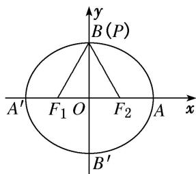
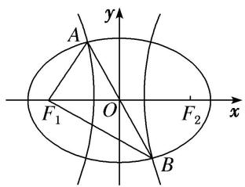
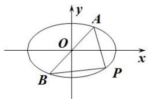
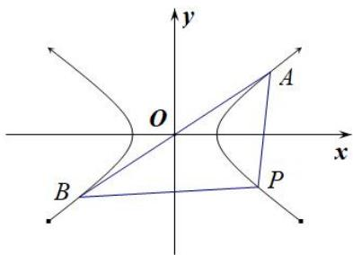
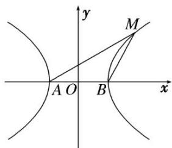
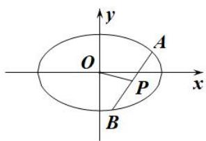
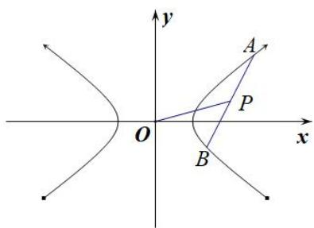

# 专题01 五组秒杀公式模型

# 第I组秒杀公式  
（1） $e_{\text{椭圆}}=\frac{c}{a}=\sqrt{1-\left(\frac{b}{a}\right)^{2}};$  
（2） $e_{\text{双曲线}}=\frac{c}{a}=\sqrt{1+\left(\frac{b}{a}\right)^{2}}=\sqrt{1+k^{2}}=\sqrt{1+\tan^{2}\alpha}$ (其中 $\alpha$ 与 k 为渐近线的倾斜角与斜率)

[例 1] （1）已知双曲线 C: $\frac{x^{2}}{a^{2}} - \frac{y^{2}}{b^{2}} = 1 (a > 0, b > 0)$ 的两条渐近线的夹角为 $60^{\circ}$ ，则双曲线 C 的离心率为（）

A. $\sqrt{2}$

B. $\sqrt{3}$

C. $\sqrt{3}$ 或 $\frac{2\sqrt{3}}{3}$

D. $\frac{2\sqrt{3}}{3}$ 或 2  
（2）双曲线 $E: \frac{x^2}{a^2} - \frac{y^2}{b^2} = 1 (a > 0, b > 0)$ 的渐近线方程为 $y = \pm \sqrt{7} x$ ，则 $E$ 的离心率为（）

A. 2

B. $\frac{2\sqrt{14}}{7}$

C. $2\sqrt{2}$

D. $2\sqrt{3}$  
（3）(2019·全国I)双曲线 $C:\frac{x^{2}}{a^{2}}-\frac{y^{2}}{b^{2}}=1(a>0,b>0)$ 的一条渐近线的倾斜角为 $130^{\circ}$ ，则 C 的离心率为()

A. $2 \sin 40^{\circ}$

B. $2\cos40^{\circ}$

C. $\frac{1}{\sin50^{\circ}}$

D. $\frac{1}{\cos50^{\circ}}$  
（4）(2017·全国III)已知椭圆 $C: \frac{x^2}{a^2} + \frac{y^2}{b^2} = 1 (a > b > 0)$ 的左、右顶点分别为 $A_1, A_2$ ，且以线段 $A_1A_2$ 为直径的圆与直线 $bx - ay + 2ab = 0$ 相切，则 $C$ 的离心率为（）

A. $\frac{\sqrt{6}}{3}$

B. $\frac{\sqrt{3}}{3}$

C. $\frac{\sqrt{2}}{3}$

D. $\frac{1}{3}$  
（5） (2019·全国I)已知双曲线 $C: \frac{x^2}{a^2} - \frac{y^2}{b^2} = 1 (a > 0, b > 0)$ 的左，右焦点分别为 $F_1, F_2$ ，过 $F_1$ 的直线与 $C$ 的两条渐近线分别交于 $A, B$ 两点。若 $\overrightarrow{F_1A} = \overrightarrow{AB}$ ， $\overrightarrow{F_1B} \cdot \overrightarrow{F_2B} = 0$ ，则 $C$ 的离心率为 \_\_\_\_.

# 【对点训练】

1. 已知 $F_{1}, F_{2}$ 分别是双曲线 $\frac{x^{2}}{a^{2}} - \frac{y^{2}}{b^{2}} = 1 (a > 0, b > 0)$ 的左、右焦点，过点 $F_{1}, F_{2}$ 分别作 $x$ 轴的垂线，交渐近线于点 $M, N$ ，且点 $M, N$ 在 $x$ 轴的同侧，若四边形 $MNF_{2}F_{1}$ 为正方形，则该双曲线的离心率为( )

A. $\sqrt{2}$

B. $\sqrt{3}$

C. 2

D. $\sqrt{5}$

2. 已知双曲线 $\frac{x^2}{a^2} - \frac{y^2}{b^2} = 1 (a > 0, b > 0)$ 的一条渐近线与直线 $x + 3y + 1 = 0$ 垂直，则双曲线的离心率等于（）

A. $\sqrt{6}$

B. $\frac{2\sqrt{3}}{3}$

C. $\sqrt{10}$

D. $\sqrt{3}$

3. 已知 $F$ 为双曲线 $C: \frac{x^2}{a^2} - \frac{y^2}{b^2} = 1 (a > 0, b > 0)$ 的一个焦点，其关于双曲线 $C$ 的一条渐近线的对称点在另一条渐近线上，则双曲线 $C$ 的离心率为（）

A. $\sqrt{2}$

B. $\sqrt{3}$

C. 2

D. $\sqrt{5}$

4. 双曲线 $C: \frac{x^2}{a^2} - \frac{y^2}{b^2} = 1 (a > 0, b > 0)$ 的一个焦点为 $F$ ，过点 $F$ 作双曲线 $C$ 的一条渐近线的垂线，垂足为 $A$ ，且交 $y$ 轴于 $B$ ，若 $A$ 为 $BF$ 的中点，则双曲线的离心率为（）

A. $\sqrt{2}$

B. $\sqrt{3}$

C. 2

D. $\frac{\sqrt{6}}{2}$

5. (2019·天津)已知抛物线 $y^{2} = 4x$ 的焦点为 $F$ ，准线为 $l$ 。若 $l$ 与双曲线 $\frac{x^2}{a^2} - \frac{y^2}{b^2} = 1 (a > 0, b > 0)$ 的两条渐近线分别交于点 $A$ 和点 $B$ ，且 $|AB| = 4|OF|$ ( $O$ 为原点)，则双曲线的离心率为（）

A. $\sqrt{2}$

B. $\sqrt{3}$

C. 2

D. $\sqrt{5}$

6. 已知 $F$ 是双曲线 $C: \frac{x^2}{a^2} - \frac{y^2}{b^2} = 1 (a > 0, b > 0)$ 的左焦点，过点 $F$ 作垂直于 $x$ 轴的直线交该双曲线的一条渐近线于点 $M$ ，若 $|FM| = 2a$ ，记该双曲线的离心率为 $e$ ，则 $e^2 = (\quad)$

A. $\frac{1+\sqrt{17}}{2}$

B. $\frac{1+\sqrt{17}}{4}$

C. $\frac{2+\sqrt{5}}{2}$

D. $\frac{2+\sqrt{5}}{4}$

7. (2017·全国II)若双曲线 $C: \frac{x^2}{a^2} - \frac{y^2}{b^2} = 1 (a > 0, b > 0)$ 的一条渐近线被圆 $(x - 2)^2 + y^2 = 4$ 所截得的弦长为 2，则 $C$ 的离心率为（）

A. 2

B. $\sqrt{3}$

C. $\sqrt{2}$

D. $\frac{2\sqrt{3}}{3}$

8. 过双曲线 $\frac{x^2}{a^2} - \frac{y^2}{b^2} = 1 (a > 0, b > 0)$ 的右顶点 $A$ 作斜率为 -1 的直线，该直线与双曲线的两条渐近线的交点分别为 $B, C$ ，若 $A, B, C$ 三点的横坐标成等比数列，则双曲线的离心率为（）

A. $\sqrt{3}$

B) $\sqrt{5}$

C. $\sqrt{10}$

D. $\sqrt{13}$

9. 设 $F_{1}$ , $F_{2}$ 是双曲线 $\frac{x^{2}}{a^{2}} - \frac{y^{2}}{b^{2}} = 1 (a > 0, b > 0)$ 的左, 右焦点, $O$ 是坐标原点, 点 $P$ 在双曲线 $C$ 的右支上且 $|F_{1}F_{2}| = 2|OP|$ , $\triangle PF_{1}F_{2}$ 的面积为 $a^{2}$ , 则双曲线的离心率是( )

A. $\sqrt{5}$

B. $\sqrt{2}$

C. 4

D. 2

10. 设椭圆 $C: \frac{x^2}{a^2} + \frac{y^2}{b^2} = 1 (a > 0, b > 0)$ 的左、右焦点分别为 $F_1, F_2$ ，点 $E(0, t)(0 < t < b)$ . 已知动点 $P$ 在椭圆上，且点 $P, E, F_2$ 不共线，若 $\triangle PEF_2$ 的周长的最小值为 $4b$ ，则椭圆 $C$ 的离心率为（）

A. $\frac{\sqrt{3}}{2}$

B. $\frac{\sqrt{2}}{2}$

C. $\frac{1}{2}$

D. $\frac{\sqrt{3}}{3}$

11. 已知双曲线 $\frac{x^2}{a^2} - \frac{y^2}{b^2} = 1 (a > 0, b > 0)$ 的两条渐近线分别为 $l_1, l_2$ ，经过右焦点 $F$ 垂直于 $l_1$ 的直线分别交 $l_1, l_2$ 于 $A, B$ 两点。若 $|OA|$ ， $|AB|$ ， $|OB|$ 成等差数列，且 $\overrightarrow{AF}$ 与 $\overrightarrow{FB}$ 反向，则该双曲线的离心率为（）

A. $\frac{\sqrt{5}}{2}$

B. $\sqrt{3}$

C. $\sqrt{5}$

D. $\frac{5}{2}$

12. 已知 $F$ 为双曲线 $\frac{x^2}{a^2} - \frac{y^2}{b^2} = 1 (a > 0, b > 0)$ 的右焦点，过原点的直线 $l$ 与双曲线交于 $M, N$ 两点，且 $\overrightarrow{MF} \cdot \overrightarrow{NF} = 0$ ， $\triangle MNF$ 的面积为 $ab$ ，则该双曲线的离心率为 \_\_\_\_.

# 第II组秒杀公式  
（1） $e_{椭圆}=\frac{c}{a}=\frac{2c}{2a}=\frac{|F_{1}F_{2}|}{|PF_{1}|+|PF_{2}|}=\frac{\sin\angle F_{1}PF_{2}}{\sin\angle F_{1}F_{2}P+\sin\angle F_{2}F_{1}P}.$   
（2） $e_{\text{双曲线}} = \frac{c}{a} = \frac{2c}{2a} = \frac{|F_1F_2|}{|PF_1| - |PF_2|} = \frac{\sin\angle F_1PF_2}{|\sin\angle F_1F_2P - \sin\angle F_2F_1P|}$ .

[例 2] （6）设椭圆 C: $\frac{x^{2}}{a^{2}}+\frac{y^{2}}{b^{2}}=1(a>b>0)$ 的左、右焦点分别为 $F_{1}$ ， $F_{2}$ ，P 是 C 上的点， $PF_{2}\perp F_{1}F_{2}$ ， $\angle PF_{1}F_{2}=30^{\circ}$ ，则 C 的离心率为()

A. $\frac{\sqrt{3}}{6}$

B. $\frac{1}{3}$

C. $\frac{1}{2}$

D. $\frac{\sqrt{3}}{3}$  
（7） (2018·全国II)已知 $F_{1}$ ， $F_{2}$ 是椭圆 C 的两个焦点，P 是 C 上的一点，若 $PF_{1} \perp PF_{2}$ ，且 $\angle PF_{2}F_{1} = 60^{\circ}$ ，则 C 的离心率为()

A. $1 - \frac{\sqrt{3}}{2}$

B. $2 - \sqrt{3}$

C. $\frac{\sqrt{3} - 1}{2}$

D. $\sqrt{3} - 1$  
（8）已知 $F_{1}$ ， $F_{2}$ 分别是双曲线 E: $\frac{x^{2}}{a^{2}} - \frac{y^{2}}{b^{2}} = 1 (a > 0, b > 0)$ 的左、右焦点，点 M 在 E 上， $MF_{1}$ 与 x 轴垂直， $\sin \angle MF_{2}F_{1} = \frac{1}{3}$ ，则 E 的离心率为()

A. $\sqrt{2}$

B. $\frac{3}{2}$

C. $\sqrt{3}$

D. 2  
（9）点 P 是椭圆上任意一点， $F_{1}$ ， $F_{2}$ 分别是椭圆的左、右焦点， $\angle F_{1}PF_{2}$ 的最大值是 $60^{\circ}$ ，则椭圆的离心率 e= \_\_\_\_.

  
（10）椭圆 $C: \frac{x^2}{a^2} + \frac{y^2}{b^2} = 1 (a > b > 0)$ 的左焦点为 $F$ , 若 $F$ 关于直线 $\sqrt{3} x + y = 0$ 的对称点 $A$ 是椭圆 $C$ 上的点, 则椭圆 $C$ 的离心率为 \_\_\_\_.  
（11） (2018·北京)已知椭圆 $M: \frac{x^2}{a^2} + \frac{y^2}{b^2} = 1 (a > b > 0)$ , 双曲线 $N: \frac{x^2}{m^2} - \frac{y^2}{n^2} = 1$ 。若双曲线 $N$ 的两条渐近线与椭圆 $M$ 的四个交点及椭圆 $M$ 的两个焦点恰为一个正六边形的顶点, 则椭圆 $M$ 的离心率为 \_\_\_\_; 双曲线 $N$ 的离心率为 \_\_\_\_.  
（12）如图， $F_{1}$ ， $F_{2}$ 是椭圆 $C_{1}$ 与双曲线 $C_{2}$ 的公共焦点，A，B 分别是 $C_{1}$ ， $C_{2}$ 在第二、四象限的交点，若 $AF_{1} \perp BF_{1}$ ，且 $\angle AF_{1}O = \frac{\pi}{3}$ ，则 $C_{1}$ 与 $C_{2}$ 的离心率之和为（）

A. $2 \sqrt{3}$

B. 4

C. $2\sqrt{5}$

D. $2\sqrt{6}$

# 【对点训练】

13. 设圆锥曲线 C 的两个焦点分别为 $F_{1}$ ， $F_{2}$ ，若曲线 C 上存在点 P 满足 $\left|PF_{1}\right| : \left|F_{1}F_{2}\right| : \left|PF_{2}\right| = 4 : 3 : 2$ ，则曲线 C 的离心率等于 \_\_\_\_.  
14. 在直角坐标系 $xOy$ 中，设 $F$ 为双曲线 $C: \frac{x^2}{a^2} - \frac{y^2}{b^2} = 1 (a > 0, b > 0)$ 的右焦点， $P$ 为双曲线 $C$ 的右支上一点，且 $\triangle OPF$ 为正三角形，则双曲线 $C$ 的离心率为（）

A. $\sqrt{3}$

B. $\frac{2\sqrt{3}}{3}$

C. $1 + \sqrt{3}$

D. $2 + \sqrt{3}$

15. 已知等腰梯形 $ABCD$ 中, $AB \parallel CD$ , $AB = 2CD = 4$ , $\angle BAD = 60^{\circ}$ , 双曲线以 $A$ , $B$ 为焦点, 且经过 $C$ , $D$ 两点, 则该双曲线的离心率等于( )

A. $\sqrt{2}$

B. $\sqrt{3}$

C. $\sqrt{5}$

D. $\sqrt{3} + 1$

16. 已知 $F$ 是椭圆 $E: \frac{x^2}{a^2} + \frac{y^2}{b^2} = 1 (a > b > 0)$ 的左焦点，经过原点 $O$ 的直线 $l$ 与椭圆 $E$ 交于 $P$ ， $Q$ 两点，若 $|PF| = 2|QF|$ ，且 $\angle PFQ = 120^\circ$ ，则椭圆 $E$ 的离心率为（）

A. $\frac{1}{3}$

B. $\frac{1}{2}$

C. $\frac{\sqrt{3}}{3}$

D. $\frac{\sqrt{2}}{2}$

17. 已知双曲线 $C: \frac{x^2}{a^2} - \frac{y^2}{b^2} = 1 (a > 0, b > 0)$ 的左、右焦点分别为 $F_1, F_2, P$ 为双曲线 $C$ 上第二象限内一点，若直线 $y = \frac{b}{a} x$ 恰为线段 $PF_2$ 的垂直平分线，则双曲线 $C$ 的离心率为（）

A. $\sqrt{2}$

B. $\sqrt{3}$

C. $\sqrt{5}$

D. $\sqrt{6}$

18. 椭圆 $C: \frac{x^2}{a^2} + \frac{y^2}{b^2} = 1 (a > b > 0)$ 的左焦点为 $F$ ，若 $F$ 关于直线 $\sqrt{3} x + y = 0$ 的对称点 $A$ 是椭圆 $C$ 上的点，则椭圆 $C$ 的离心率为（）

A. $\frac{1}{2}$

B. $\frac{\sqrt{3}-1}{2}$

C. $\frac{\sqrt{3}}{2}$

D. $\sqrt{3} - 1$

# 第III组秒杀公式  
（1）若直线 $y = kx$ 与椭圆 $E$ 交于 $A, B$ 两点， $P$ 为椭圆上异于 $A, B$ 的点，若直线 $PA, PB$ 的斜率存在，且分别为 $k_{1}, k_{2}$ ，则 $k_{1} \cdot k_{2} = -\frac{b^{2}}{a^{2}} = e^{2} - 1$ .

  
（2）若直线 $y = kx$ 与双曲线 $E$ 交于 $A, B$ 两点， $P$ 为双曲线上异于 $A, B$ 的点，若直线 $PA, PB$ 的斜率存在，且分别为 $k_{1}, k_{2}$ ，则 $k_{1} \cdot k_{2} = \frac{b^{2}}{a^{2}} = e^{2} - 1$ .

注：当焦点在 y 轴上时 a, b 对调.

# 【例题选讲】

[例 3] （13）(2015·全国II)已知 A, B 为双曲线 E 的左，右顶点，点 M 在 E 上， $\triangle ABM$ 为等腰三角形，且顶角为 $120^{\circ}$ ，则 E 的离心率为()

A. $\sqrt{5}$

B. 2

C. $\sqrt{3}$

D. $\sqrt{2}$

  
（14）已知椭圆 $C: \frac{x^2}{a^2} + \frac{y^2}{b^2} = 1 (a > b > 0)$ 的右顶点为 $A$ ，过原点 $O$ 的直线 $l$ 与 $C$ 交于点 $P, Q$ ，且直线 $AP$ 与直线 $AQ$ 的斜率之积为 $-\frac{1}{2}$ ，则 $C$ 的离心率是（）

A. $\frac{1}{2}$

B. $\frac{\sqrt{6}}{3}$

C. $\frac{\sqrt{2}}{2}$

D. $\frac{\sqrt{2}}{4}$  
（15）设 $A_{1}$ ， $A_{2}$ 分别为椭圆 $\frac{x^{2}}{a^{2}} + \frac{y^{2}}{b^{2}} = 1 (a > b > 0)$ 的左、右顶点，若在椭圆上存在点 P，使得 $k_{PA1} \cdot k_{PA2} > -\frac{1}{2}$ ，则该椭圆的离心率的取值范围是()

A. $\left(0,\frac{1}{2}\right)$

B. $\left(0,\frac{\sqrt{2}}{2}\right)$

C. $\left(\frac{\sqrt{2}}{2},1\right)$

D. $\left(\frac{1}{2},\ 1\right)$  
（16）已知 O 为坐标原点，点 A, B 在双曲线 C: $\frac{x^{2}}{a^{2}} - \frac{y^{2}}{b^{2}} = 1 (a > 0, b > 0)$ 上，且关于坐标原点 O 对称．若双曲线 C 上与点 A, B 横坐标不相同的任意一点 P 满足 $k_{PA} \cdot k_{PB} = 3$ ，则双曲线 C 的离心率为()

A. 2

B. 4

C. $\sqrt{10}$

D. 10  
（17）已知双曲线 $\frac{x^{2}}{a^{2}}-\frac{y^{2}}{b^{2}}=1(a>0,\ b>0)$ ，M、N为双曲线上关于原点对称的两点，P为双曲线上的点，且直线PM、PN的斜率分别为 $k_{1}$ 、 $k_{2}$ ，若 $k_{1}\cdot k_{2}=\frac{5}{4}$ ，则双曲线的离心率为()

A. $\sqrt{2}$

B. $\frac{3}{2}$

C. 2

D. $\frac{5}{2}$

# 【对点训练】

19. 设 $A_{1}, A_{2}$ 分别为双曲线 $C: \frac{y^{2}}{a^{2}} - \frac{x^{2}}{b^{2}} = 1 (a > 0, b > 0)$ 的上、下顶点，若双曲线上存在点 $M$ 使得两直线斜率 $k_{MA1} \cdot k_{MA2} < \frac{1}{2}$ ，则双曲线 $C$ 的离心率 $e$ 的取值范围为（）

A. $\left(0,\frac{\sqrt{6}}{2}\right)$

B. $\left(1,\frac{\sqrt{6}}{2}\right)$

C. $\left(\frac{\sqrt{6}}{2},+\infty\right)$

D. $\left(1,\frac{3}{2}\right)$

20. 已知 $A, B$ 是椭圆 $C$ 上关于原点对称的两点, 若椭圆 $C$ 上存在点 $P$ , 使得直线 $PA, PB$ 斜率的绝对值之和为 1 , 则椭圆 $C$ 的离心率的取值范围是 \_\_\_\_.

# 第IV组秒杀公式  
（1）若直线 $y = kx + m (k \neq 0 \text{且} m \neq 0)$ 与椭圆 $E$ 交于 $A, B$ 两点， $P$ 为弦 $AB$ 的中点，设直线 $PO$ 的斜率为 $k_0$ ，则 $k_0 \cdot k = -\frac{b^2}{a^2} = e^2 - 1$ .

  
（2）若直线 $y = kx + m (k \neq 0 \text{且} m \neq 0)$ 与双曲线 $E$ 交于 $A, B$ 两点， $P$ 为弦 $AB$ 的中点，设直线 $PO$ 的斜率为 $k_0$ ，则 $k_0 \cdot k = \frac{b^2}{a^2} = e^2 - 1$ .

注：当焦点在 $y$ 轴上时 $a, b$ 对调.

# 【例题选讲】

[例 4] （18） 过点 $M(1, 1)$ 作斜率为 $-\frac{1}{3}$ 的直线 l 与椭圆 C: $\frac{x^{2}}{a^{2}} + \frac{y^{2}}{b^{2}} = 1 (a > b > 0)$ 相交于 A, B 两点，若 M 是线段 AB 的中点，则椭圆 C 的离心率为 \_\_\_\_.  
（19）已知椭圆 $\frac{x^{2}}{a^{2}}+\frac{y^{2}}{b^{2}}=1(a>b>0)$ ，点F为左焦点，点P为下顶点，平行于FP的直线l交椭圆于A，B两点，且AB的中点为 $M(1,\frac{1}{2})$ ，则椭圆的离心率为()

A. $\frac{1}{2}$

B. $\frac{\sqrt{2}}{2}$

C. $\frac{1}{4}$

D. $\frac{\sqrt{3}}{2}$  
（20）已知椭圆 $\frac{x^2}{a^2} +\frac{y^2}{b^2} = 1(a > b > 0)$ 的一条弦所在的直线方程是 $x - y + 5 = 0$ ，弦的中点坐标是 $M(-4,1)$ 则椭圆的离心率是（）

A. $\frac{1}{2}$

B. $\frac{\sqrt{2}}{2}$

C. $\frac{\sqrt{3}}{2}$

D. $\frac{\sqrt{5}}{5}$  
（21）已知双曲线 $C: \frac{x^2}{a^2} - \frac{y^2}{b^2} = 1 (a > 0, b > 0)$ , 过点 $P(3, 6)$ 的直线 $l$ 与 $C$ 相交于 $A, B$ 两点, 且 $AB$ 的中点为 $N(12, 15)$ , 则双曲线 $C$ 的离心率为( )

A. 2

B. $\frac{3}{2}$

C. $\frac{3\sqrt{5}}{5}$

D. $\frac{\sqrt{5}}{2}$

# 第V组秒杀公式

过椭圆或双曲线的焦点 $F$ 作倾斜角为 $\theta$ 直线与椭圆或双曲线相交 $A$ 、 $B$ 两点，且 $\overrightarrow{AF} = \lambda \overrightarrow{FB}$ ，则有 $|e\cos \theta| = \frac{|\lambda - 1|}{|\lambda + 1|}$ 。（其中 $\theta$ 为直线的倾斜角， $F$ 在线段 $AB$ 上）

[例 5] （22）倾斜角为 $\frac{\pi}{4}$ 的直线经过椭圆 $\frac{x^{2}}{a^{2}}+\frac{y^{2}}{b^{2}}=1(a>b>0)$ 的右焦点F，与椭圆交于A、B两点，且 $\overrightarrow{AF}=2\overrightarrow{FB}$ ，则该椭圆的离心率为()

A. $\frac{\sqrt{3}}{2}$

B. $\frac{\sqrt{2}}{3}$

C. $\frac{\sqrt{2}}{2}$

D. $\frac{\sqrt{3}}{3}$  
（23）已知 F 是椭圆 $\frac{x^{2}}{a^{2}} + \frac{y^{2}}{b^{2}} = 1 (a > b > 0)$ 的右焦点，A 是椭圆短轴的一个端点，若 F 为过 AF 的椭圆的弦的三等分点，则椭圆的离心率为()

A. $\frac{1}{3}$

B. $\frac{\sqrt{3}}{3}$

C. $\frac{1}{2}$

D. $\frac{\sqrt{3}}{2}$  
（24）已知双曲线 $\frac{x^2}{a^2} -\frac{y^2}{b^2} = 1(a > 0,b > 0)$ 的右焦点为 $F$ ，直线 $l$ 经过点 $F$ 且与双曲线的一条渐近线垂直，直线 $l$ 与双曲线的右支交于不同两点 $A,B$ ，若 $\overrightarrow{AF} = 3\overrightarrow{FB}$ ，则该双曲线的离心率为（）

A. $\frac{\sqrt{5}}{2}$

B. $\frac{\sqrt{6}}{2}$

C. $\frac{2\sqrt{3}}{3}$

D. $\sqrt{3}$  
（25）设 $F_{1}$ ， $F_{2}$ 分别是椭圆 $E: \frac{x^{2}}{a^{2}} + \frac{y^{2}}{b^{2}} = 1 (a > b > 0)$ 的左、右焦点，过点 $F_{1}$ 的直线交椭圆 $E$ 于 $A$ ， $B$ 两点，若 $\triangle AF_{1}F_{2}$ 的面积是 $\triangle BF_{1}F_{2}$ 面积的三倍， $\cos \angle AF_{2}B = \frac{3}{5}$ ，则椭圆 $E$ 的离心率为（）

A. $\frac{1}{2}$

B. $\frac{2}{3}$

C. $\frac{\sqrt{3}}{2}$

D. $\frac{\sqrt{2}}{2}$  
（26）已知椭圆 $\frac{x^{2}}{a^{2}}+\frac{y^{2}}{b^{2}}=1(a>b>0)$ 的左、右焦点分别为 $F_{1}$ ， $F_{2}$ ，过 $F_{1}$ 且与x轴垂直的直线交椭圆于A，B两点，直线 $AF_{2}$ 与椭圆的另一个交点为点C，若 $S_{\triangle ABC}=3S_{\triangle BCF2}$ ，则椭圆的离心率为\_\_\_\_.

# 【对点训练】

21. 已知 $F$ 是椭圆 $\frac{x^2}{a^2} + \frac{y^2}{b^2} = 1 (a > b > 0)$ 的右焦点， $A$ 是椭圆短轴的一个端点，若 $F$ 为过 $AF$ 的椭圆的弦的三等分点，则椭圆的离心率为（）

A. $\frac{1}{3}$

B. $\frac{\sqrt{3}}{3}$

C. $\frac{1}{2}$

D. $\frac{\sqrt{3}}{2}$

22. 已知 $F_{1}$ , $F_{2}$ 是椭圆 $C: \frac{x^{2}}{a^{2}} + \frac{y^{2}}{b^{2}} = 1 (a > b > 0)$ 的左右焦点, $B$ 是短轴的一个端点, 线段 $BF_{2}$ 的延长线交椭圆 $C$ 于点 $D$ , 若 $\triangle F_{1}BD$ 为等腰三角形, 则椭圆 $C$ 的离心率为 \_\_\_\_.

