# 专题01 五组秒杀公式模型

# 第I组秒杀公式

(1) $e_{\text{椭圆}}=\frac{c}{a}=\sqrt{1-\left(\frac{b}{a}\right)^{2}};$

(2) $e_{\text{双曲线}}=\frac{c}{a}=\sqrt{1+\left(\frac{b}{a}\right)^{2}}=\sqrt{1+k^{2}}=\sqrt{1+\tan^{2}\alpha}$ (其中a与k为渐近线的倾斜角与斜率)

[例 1] (1)已知双曲线 C: $\frac{x^{2}}{a^{2}} - \frac{y^{2}}{b^{2}} = 1 (a > 0, b > 0)$ 的两条渐近线的夹角为 $60^{\circ}$ ，则双曲线 C 的离心率为（）

A. $\sqrt{2}$

B. $\sqrt{3}$

C. $\sqrt{3}$ 或 $\frac{2\sqrt{3}}{3}$

D. $\frac{2\sqrt{3}}{3}$ 或 2

答案 D 解析 秒杀 ∵两条渐近线的夹角为 $60^{\circ}$ ，∴一条渐近线的倾斜角为 $30^{\circ}$ ，斜率为 $\frac{\sqrt{3}}{3}$ 。∴ $e = \sqrt{1 + k^{2}} = \frac{2\sqrt{3}}{3}$ 。或一条渐近线的倾斜角为 $60^{\circ}$ ，斜率为 $\sqrt{3}$ 。∴ $e = \sqrt{1 + k^{2}} = 2$ 。故选 D.

通法 $\because$ 两条渐近线的夹角为 $60^{\circ}$ ，且两条渐近线关于坐标轴对称， $\therefore \frac{b}{a} = \tan 30^{\circ} = \frac{\sqrt{3}}{3}$ 或 $\frac{b}{a} = \tan 60^{\circ} = \sqrt{3}$ 。由 $\frac{b}{a} = \frac{\sqrt{3}}{3}$ ，得 $\frac{b^2}{a^2} = \frac{c^2 - a^2}{a^2} = e^2 - 1 = \frac{1}{3}$ ， $\therefore e = \frac{2\sqrt{3}}{3}$ (舍负)；由 $\frac{b}{a} = \sqrt{3}$ ，得 $\frac{b^2}{a^2} = \frac{c^2 - a^2}{a^2} = e^2 - 1 = 3$ ， $\therefore e = 2$ (舍负)。故选 D.

(2)双曲线 $E: \frac{x^2}{a^2} - \frac{y^2}{b^2} = 1 (a > 0, b > 0)$ 的渐近线方程为 $y = \pm \sqrt{7} x$ ，则 $E$ 的离心率为（）

A. 2

B. $\frac{2\sqrt{14}}{7}$

C. $2\sqrt{2}$

D. $2\sqrt{3}$

答案 C 解析 秒杀 $\because$ 渐近线的斜率为 $\pm \sqrt{7}$ . $\therefore e = \sqrt{1 + k^2} = 2\sqrt{2}$ .

通法 由题意，双曲线 $\frac{x^2}{a^2} -\frac{y^2}{b^2} = 1(a > 0,b > 0)$ 的渐近线方程为 $y = \pm \sqrt{7} x$ ，即 $\frac{b}{a} = \sqrt{7}$ ，所以双曲线的离心率为 $e = \frac{c}{a} = \sqrt{\frac{a^2 + b^2}{a^2}} = \sqrt{1 + \left(\frac{b}{a}\right)^2} = 2\sqrt{2}$ ，故选.

(3)(2019·全国I)双曲线 $C:\frac{x^{2}}{a^{2}}-\frac{y^{2}}{b^{2}}=1(a>0,b>0)$ 的一条渐近线的倾斜角为 $130^{\circ}$ ，则 C 的离心率为()

A. $2 \sin 40^{\circ}$

B. $2\cos40^{\circ}$

C. $\frac{1}{\sin50^{\circ}}$

D. $\frac{1}{\cos50^{\circ}}$

答案 D 解析 秒杀 由题意可得 $-\frac{b}{a} = \tan 130^{\circ}$ ，所以 $e = \sqrt{1 + \frac{b^{2}}{a^{2}}} = \sqrt{1 + \tan^{2}130^{\circ}} = \sqrt{1 + \frac{\sin^{2}130^{\circ}}{\cos^{2}130^{\circ}}} = \frac{1}{|\cos 130^{\circ}|} = \frac{1}{\cos 50^{\circ}}$ 。故选 D.

(4)(2017·全国III)已知椭圆 $C: \frac{x^2}{a^2} + \frac{y^2}{b^2} = 1 (a > b > 0)$ 的左、右顶点分别为 $A_1, A_2$ ，且以线段 $A_1A_2$ 为直径的圆与直线 $bx - ay + 2ab = 0$ 相切，则 $C$ 的离心率为（）

A. $\frac{\sqrt{6}}{3}$

B. $\frac{\sqrt{3}}{3}$

C. $\frac{\sqrt{2}}{3}$

D. $\frac{1}{3}$

答案 A 解析 秒杀 由题意知以 $A_{1}A_{2}$ 为直径的圆的圆心为 $(0,0)$ ，半径为 $a$ 。又直线 $bx - ay + 2ab = 0$ 与圆相切， $\therefore$ 圆心到直线的距离 $d = \frac{2ab}{\sqrt{a^2 + b^2}} = a$ ，解得 $a = \sqrt{3}b$ ， $\therefore \frac{b}{a} = \frac{1}{\sqrt{3}}$ ， $\therefore e = \sqrt{1 - \left(\frac{b}{a}\right)^2} = \sqrt{1 - \left(\frac{1}{\sqrt{3}}\right)^2} = \frac{\sqrt{6}}{3}$ 。故选 A.

(5) (2019·全国I)已知双曲线 $C: \frac{x^2}{a^2} - \frac{y^2}{b^2} = 1 (a > 0, b > 0)$ 的左，右焦点分别为 $F_1, F_2$ ，过 $F_1$ 的直线与 $C$ 的两条渐近线分别交于 $A, B$ 两点．若 $\overrightarrow{F_1A} = \overrightarrow{AB}$ ， $\overrightarrow{F_1B} \cdot \overrightarrow{F_2B} = 0$ ，则 $C$ 的离心率为 \_\_\_\_.

答案 2 解析 秒杀 由 $\overrightarrow{F_{1}A}=\overrightarrow{AB}$ ，得 A 为 $F_{1}B$ 的中点。又∵O 为 $F_{1}F_{2}$ 的中点，∴ $OA \parallel BF_{2}$ 。又 $\overrightarrow{F_{1}B}\cdot\overrightarrow{F_{2}B}=0$ ，∴ $\angle F_{1}BF_{2}=90^{\circ}$ 。∴ $OF_{2}=OB$ ，∴ $\angle OBF_{2}=\angle OF_{2}B$ 。又∵ $\angle F_{1}OA=\angle BOF_{2}$ ， $\angle F_{1}OA=\angle OF_{2}B$ ，∴ $\angle BOF_{2}=\angle OF_{2}B=\angle OBF_{2}$ ，∴ $\triangle OBF_{2}$ 为等边三角形。∴一条渐近线的倾斜角为 $60^{\circ}$ ，斜率为 $\sqrt{3}$ 。∴ $e=\sqrt{1+k^{2}}=2$ 。

通法一：由 $\overrightarrow{F_1A} = \overrightarrow{AB}$ ，得 $A$ 为 $F_{1}B$ 的中点。又 $\because O$ 为 $F_{1}F_{2}$ 的中点， $\therefore OA \parallel BF_{2}$ 。又 $\overrightarrow{F_1B} \cdot \overrightarrow{F_2B} = 0$ ， $\therefore \angle F_{1}BF_{2} = 90^{\circ}$ 。 $\therefore OF_{2} = OB$ ， $\therefore \angle OBF_{2} = \angle OF_{2}B$ 。又 $\because \angle F_{1}OA = \angle BOF_{2}$ ， $\angle F_{1}OA = \angle OF_{2}B$ ， $\therefore \angle BOF_{2} = \angle OF_{2}B = \angle OBF_{2}$ ， $\therefore \triangle OBF_{2}$ 为等边三角形。如图所示，不妨设 $B$ 为 $\left[\frac{c}{2}, -\frac{\sqrt{3}}{2} c\right]$ 。 $\because$ 点 $B$ 在直线 $y = -\frac{b}{a} x$ 上， $\therefore \frac{b}{a} = \sqrt{3}$ ， $\therefore$ 离心率 $e = \frac{c}{a} = 2$ 。

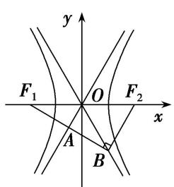

text_image

y
F₁ O F₂
x
A B

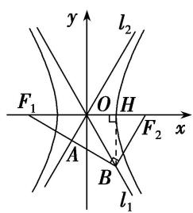

text_image

y
l₂
F₁ O H x
A B F₂
l₁

通法二： $\because \overrightarrow{F_1B} \cdot \overrightarrow{F_2B} = 0, \therefore \angle F_1BF_2 = 90^\circ$ 。在 Rt $\triangle BF_1BF_2$ 中， $O$ 为 $F_1F_2$ 的中点， $\therefore |OF_2| = |OB| = c$ 。如图，作 $BH \perp x$ 轴于 $H$ ，由 $l_1$ 为双曲线的渐近线，可得 $\frac{|BH|}{|OH|} = \frac{b}{a}$ ，且 $|BH|^2 + |OH|^2 = |OB|^2 = c^2, \therefore |BH| = b, |OH| = a, \therefore B(a, -b), F_2(c, 0)$ 。又 $\because \overrightarrow{F_1A} = \overrightarrow{AB}, \therefore A$ 为 $F_1B$ 的中点。 $\therefore OA // F_2B, \therefore \frac{b}{a} = \frac{b}{c - a}, \therefore c = 2a, \therefore$ 离心率 $e = \frac{c}{a} = 2$ 。

# 【对点训练】

1. 已知 $F_{1}, F_{2}$ 分别是双曲线 $\frac{x^{2}}{a^{2}} - \frac{y^{2}}{b^{2}} = 1 (a > 0, b > 0)$ 的左、右焦点，过点 $F_{1}, F_{2}$ 分别作 $x$ 轴的垂线，交渐近线于点 $M, N$ ，且点 $M, N$ 在 $x$ 轴的同侧，若四边形 $MNF_{2}F_{1}$ 为正方形，则该双曲线的离心率为( )

A. $\sqrt{2}$

B. $\sqrt{3}$

C. 2

D. $\sqrt{5}$

1. 答案 D 解析 秒杀 由题意， $\therefore e = \sqrt{1 + k^2} = \sqrt{5}$ .

通法 不妨设点 M, N 在 x 轴的上方，把 x=c 代入渐近线的方程 $y=\frac{b}{a}x$ ，得 $y=\frac{bc}{a}$ 。因为四边形 $MNF_{2}F_{1}$ 为正方形，所以 $\frac{bc}{a}=2c$ ，所以 b=2a，由此可得 $c=\sqrt{5}a$ 。所以该双曲线的离心率 $e=\frac{c}{a}=\sqrt{5}$ 。故选 D.

2. 已知双曲线 $\frac{x^2}{a^2} - \frac{y^2}{b^2} = 1 (a > 0, b > 0)$ 的一条渐近线与直线 $x + 3y + 1 = 0$ 垂直，则双曲线的离心率等于（）

A. $\sqrt{6}$

B. $\frac{2\sqrt{3}}{3}$

C. $\sqrt{10}$

D. $\sqrt{3}$

2. 答案 C 解析 秒杀 由于双曲线的一条渐近线与直线 $x + 3y + 1 = 0$ 垂直，则双曲线的渐近线方程为 $y = \pm 3x$ , $\therefore e = \sqrt{1 + k^2} = \sqrt{10}$ .

通法 由于双曲线的一条渐近线与直线 $x + 3y + 1 = 0$ 垂直，则双曲线的渐近线方程为 $y = \pm 3x$ ，可得 $\frac{b}{a} = 3$ ，可得 $b^2 = 9a^2$ ，即 $c^2 - a^2 = 9a^2$ ，亦即 $c^2 = 10a^2$ ，故离心率为 $e = \frac{c}{a} = \sqrt{10}$ .

3. 已知 $F$ 为双曲线 $C: \frac{x^2}{a^2} - \frac{y^2}{b^2} = 1 (a > 0, b > 0)$ 的一个焦点，其关于双曲线 $C$ 的一条渐近线的对称点在另一条渐近线上，则双曲线 $C$ 的离心率为（）

A. $\sqrt{2}$

B. $\sqrt{3}$

C. 2

D. $\sqrt{5}$

3. 答案 C 解析 秒杀 依题意，设双曲线的渐近线 $y = \frac{b}{a} x$ 的倾斜角为 $\theta$ ，则由双曲线的对称性得 $3\theta = \pi, \theta = \frac{\pi}{3}, \therefore e = \sqrt{1 + k^2} = 2$ . 选 C.

通法 依题意, 设双曲线的渐近线 $y = \frac{b}{a} x$ 的倾斜角为 $\theta$ , 则由双曲线的对称性得 $3\theta = \pi$ , $\theta = \frac{\pi}{3}$ , $\frac{b}{a} = \tan \frac{\pi}{3} = \sqrt{3}$ , 双曲线 $C$ 的离心率 $e = \sqrt{1 + \left(\frac{b}{a}\right)^2} = 2$ , 选 C.

4. 双曲线 $C: \frac{x^2}{a^2} - \frac{y^2}{b^2} = 1 (a > 0, b > 0)$ 的一个焦点为 $F$ ，过点 $F$ 作双曲线 $C$ 的一条渐近线的垂线，垂足为 $A$ ，且交 $y$ 轴于 $B$ ，若 $A$ 为 $BF$ 的中点，则双曲线的离心率为（）

A. $\sqrt{2}$

B. $\sqrt{3}$

C. 2

D. $\frac{\sqrt{6}}{2}$

4. 答案 A 解析 秒杀 由题易知双曲线 C 的一条渐近线与 x 轴的夹角为 $\frac{\pi}{4}$ ，∴ $e = \sqrt{1 + k^{2}} = \sqrt{2}$ 。故选 A.

通法 由题易知双曲线 C 的一条渐近线与 x 轴的夹角为 $\frac{\pi}{4}$ ，故双曲线 C 的离心率 $e=\left(\cos\frac{\pi}{4}\right)^{-1}=\sqrt{2}$ 。故选 A.

5. (2019·天津)已知抛物线 $y^{2} = 4x$ 的焦点为 $F$ ，准线为 $l$ 。若 $l$ 与双曲线 $\frac{x^2}{a^2} - \frac{y^2}{b^2} = 1 (a > 0, b > 0)$ 的两条渐近线分别交于点 $A$ 和点 $B$ ，且 $|AB| = 4|OF|$ ( $O$ 为原点)，则双曲线的离心率为（）

A. $\sqrt{2}$

B. $\sqrt{3}$

C. 2

D. $\sqrt{5}$

5. 答案 D 解析 秒杀 由题设知 $k = 2, e = \sqrt{1 + k^2} = \sqrt{5}$ . 故选 D.

通法 由已知易得，抛物线 $y^{2} = 4x$ 的焦点为 $F(1,0)$ ，准线 $l: x = -1$ ，所以 $|OF| = 1$ 。又双曲线的两条渐近线的方程为 $y = \pm \frac{b}{a}x$ ，不妨设点 $A\left(-1, \frac{b}{a}\right), B\left(-1, -\frac{b}{a}\right)$ ，所以 $|AB| = \frac{2b}{a} = 4|OF| = 4$ ，所以 $\frac{b}{a} = 2$ ，即 $b = 2a$ ，所以 $b^{2} = 4a^{2}$ 。又双曲线方程中 $c^{2} = a^{2} + b^{2}$ ，所以 $c^{2} = 5a^{2}$ ，所以 $e = \frac{c}{a} = \sqrt{5}$ 。

6. 已知 $F$ 是双曲线 $C: \frac{x^2}{a^2} - \frac{y^2}{b^2} = 1 (a > 0, b > 0)$ 的左焦点，过点 $F$ 作垂直于 $x$ 轴的直线交该双曲线的一条渐近线于点 $M$ ，若 $|FM| = 2a$ ，记该双曲线的离心率为 $e$ ，则 $e^2 = (\quad)$

A. $\frac{1+\sqrt{17}}{2}$

B. $\frac{1 + \sqrt{17}}{4}$

C. $\frac{2 + \sqrt{5}}{2}$

D. $\frac{2+\sqrt{5}}{4}$

6. 答案 A 解析 秒杀 由题意得， $e=\sqrt{1+\frac{4}{e^{2}}}$ ， $\therefore e^{4}-e^{2}-4=0$ ，解得 $e^{2}=\frac{1+\sqrt{17}}{2}$ ，故选 A.

通法 由题意得， $F(-c,0)$ ，该双曲线的一条渐近线为 $y=-\frac{b}{a}x$ ，将 x=-c 代入 $y=-\frac{b}{a}x$ 得 $y=\frac{bc}{a}$ ，∴ $\frac{bc}{a}=2a$ ，即 $bc=2a^{2}$ ，∴ $4a^{4}=b^{2}c^{2}=c^{2}(c^{2}-a^{2})$ ，∴ $e^{4}-e^{2}-4=0$ ，解得 $e^{2}=\frac{1+\sqrt{17}}{2}$ ，故选 A.

7. (2017·全国II)若双曲线 $C: \frac{x^2}{a^2} - \frac{y^2}{b^2} = 1 (a > 0, b > 0)$ 的一条渐近线被圆 $(x - 2)^2 + y^2 = 4$ 所截得的弦长为 2，则 $C$ 的离心率为( )

A. 2

B. $\sqrt{3}$

C. $\sqrt{2}$

D. $\frac{2\sqrt{3}}{3}$

7. 答案 A 解析 秒杀 设双曲线的一条渐近线方程为 $y=\frac{b}{a}x$ ，化成一般式 bx-ay=0，圆心(2,0)到直线的距离为 $\sqrt{2^{2}-1^{2}}=\frac{|2b|}{\sqrt{a^{2}+b^{2}}}$ ，解得 $\frac{b}{a}=\sqrt{3}$ ， $e=\sqrt{1+\left(\frac{b}{a}\right)^{2}}=2$ .

8. 过双曲线 $\frac{x^2}{a^2} - \frac{y^2}{b^2} = 1 (a > 0, b > 0)$ 的右顶点 $A$ 作斜率为 -1 的直线，该直线与双曲线的两条渐近线的交点分别为 $B, C$ ，若 $A, B, C$ 三点的横坐标成等比数列，则双曲线的离心率为（）

A. $\sqrt{3}$

B) $\sqrt{5}$

C. $\sqrt{10}$

D. $\sqrt{13}$

8. 答案 C 解析 秒杀 双曲线渐近线方程为 $y = \pm \frac{b}{a} x$ ，与直线 $y = -(x - a)$ 联立。由 $-\frac{b}{a} x = -x + a$ ，得 $x = \frac{a^2}{a - b}$ ，由 $\frac{b}{a} x = -x + a$ ，得 $x = \frac{a^2}{a + b}$ 。根据题意，若 $\frac{a^2}{a - b} \cdot a = \left(\frac{a^2}{a + b}\right)^2$ ，得 $a(a - b) = (a + b)^2$ ，此式不可能，若 $\frac{a^2}{a + b} \cdot a = \left(\frac{a^2}{a - b}\right)^2$ ，则 $a(a + b) = (a - b)^2$ ，解得 $b = 3a$ 。双曲线的离心率 $e = \sqrt{1 + \left(\frac{b}{a}\right)^2} = \sqrt{10}$ 。故选 C.

9. 设 $F_{1}, F_{2}$ 是双曲线 $\frac{x^{2}}{a^{2}} - \frac{y^{2}}{b^{2}} = 1 (a > 0, b > 0)$ 的左，右焦点， $O$ 是坐标原点，点 $P$ 在双曲线 $C$ 的右支上且 $|F_{1}F_{2}| = 2|OP|$ ， $\triangle PF_{1}F_{2}$ 的面积为 $a^{2}$ ，则双曲线的离心率是（）

A. $\sqrt{5}$

B. $\sqrt{2}$

C. 4

D. 2

9. 答案 B 解析 秒杀 由 $|F_{1}F_{2}|=2|OP|$ 可知 $|OP|=c$ ，所以 $\triangle PF_{1}F_{2}$ 为直角三角形，可知 $a^{2}=b^{2}\frac{1}{\tan\frac{\theta}{2}}$ . ∴

$$
a ^ {2} = b ^ {2}, e = \sqrt {1 + \left(\frac {b}{a}\right) ^ {2}} = \sqrt {2}.
$$

通法 由 $|F_{1}F_{2}|=2|OP|$ 可知 $|OP|=c$ ，所以 $\triangle PF_{1}F_{2}$ 为直角三角形，且 $PF_{1}\perp PF_{2}$ 。由 $S_{\triangle PF_{1}F_{2}}=a^{2}$ 可知 $|PF_{1}||PF_{2}|=2a^{2}$ ，又 $|PF_{1}|^{2}+|PF_{2}|^{2}=|F_{1}F_{2}|^{2}$ 。 $\therefore(|PF_{1}|-|PF_{2}|)^{2}=-2|PF_{1}||PF_{2}|+|F_{1}F_{2}|^{2}$ ，即 $4a^{2}=-4a^{2}+4c^{2}$ ， $\therefore e^{2}=\frac{c^{2}}{a^{2}}=\frac{8}{4}=2$ ，又e>1， $\therefore e=\sqrt{2}$ ，故选B.

10. 设椭圆 $C: \frac{x^2}{a^2} + \frac{y^2}{b^2} = 1 (a > 0, b > 0)$ 的左、右焦点分别为 $F_1, F_2$ ，点 $E(0, t)(0 < t < b)$ . 已知动点 $P$ 在椭圆上，且点 $P, E, F_2$ 不共线，若 $\triangle PEF_2$ 的周长的最小值为 $4b$ ，则椭圆 $C$ 的离心率为（）

A. $\frac{\sqrt{3}}{2}$

B. $\frac{\sqrt{2}}{2}$

C. $\frac{1}{2}$

D. $\frac{\sqrt{3}}{3}$

10. 答案 A 解析 秒杀 $\triangle PEF_{2}$ 的周长为 $|PE| + |PF_{2}| + |EF_{2}| = |PE| + 2a - |PF_{1}| + |EF_{2}| = 2a + |EF_{2}| + |PE|$ $-\left|PF_{1}\right| \geq 2a + \left|EF_{2}\right| - \left|EF_{1}\right| = 2a = 4b, \therefore e = \frac{c}{a} = \sqrt{1 - \left(\frac{b}{a}\right)^{2}} = \sqrt{1 - \frac{1}{4}} = \frac{\sqrt{3}}{2}$ . 故选 A.

11. 已知双曲线 $\frac{x^2}{a^2} - \frac{y^2}{b^2} = 1 (a > 0, b > 0)$ 的两条渐近线分别为 $l_1, l_2$ ，经过右焦点 $F$ 垂直于 $l_1$ 的直线分别交 $l_1, l_2$ 于 $A, B$ 两点。若 $|OA|$ ， $|AB|$ ， $|OB|$ 成等差数列，且 $\overrightarrow{AF}$ 与 $\overrightarrow{FB}$ 反向，则该双曲线的离心率为（）

A. $\frac{\sqrt{5}}{2}$

B. $\sqrt{3}$

C. $\sqrt{5}$

D. $\frac{5}{2}$

11. 答案 C 解析 秒杀 设实轴长为 $2a$ ，虚轴长为 $2b$ ，令 $\angle AOF = \alpha$ ，则由题意知 $\tan \alpha = \frac{b}{a}$ ，在 $\triangle AOB$ 中， $\angle AOB = 180^\circ - 2\alpha$ ， $\tan \angle AOB = -\tan 2\alpha = \frac{|AB|}{|OA|}$ ， $\because |OA|, |AB|$ ， $|OB|$ 成等差数列， $\therefore$ 设 $|OA| = m - d$ ， $|AB| = m$ ， $|OB| = m + d$ ， $\because OA \perp BF$ ， $\therefore (m - d)^2 + m^2 = (m + d)^2$ ，整理得 $d = \frac{1}{4}m$ ， $\therefore -\tan 2\alpha = -\frac{2\tan \alpha}{1 - \tan^2\alpha} = \frac{|AB|}{|OA|} = \frac{m}{\frac{3}{4}m} = \frac{4}{3}$ ，解得 $\frac{b}{a} = 2$ 或 $\frac{b}{a} = -\frac{1}{2}$ （舍去）， $e = \sqrt{1 + \left(\frac{b}{a}\right)^2} = \sqrt{5}$ .

12. 已知 $F$ 为双曲线 $\frac{x^2}{a^2} - \frac{y^2}{b^2} = 1 (a > 0, b > 0)$ 的右焦点，过原点的直线 $l$ 与双曲线交于 $M, N$ 两点，且 $\overrightarrow{MF} \cdot \overrightarrow{NF} = 0$ ， $\triangle MNF$ 的面积为 $ab$ ，则该双曲线的离心率为 \_\_\_\_.

12. 答案 $\sqrt{2}$ 解析 秒杀 因为 $\overrightarrow{MF} \cdot \overrightarrow{NF} = 0$ ，所以 $\overrightarrow{MF} \perp \overrightarrow{NF}$ 。设双曲线的左焦点为 $F'$ ，则由双曲线的对称性知四边形 $F'MFN$ 为矩形，则有 $|MF| = |NF'|$ ， $|MN| = 2c$ 。不妨设点 $N$ 在双曲线右支上，由双曲线的定义知， $|NF'| - |NF| = 2a$ ，所以 $|MF| - |NF| = 2a$ 。因为 $S_{\triangle MNF} = \frac{1}{2} |MF| \cdot |NF| = ab$ ，所以 $|MF||NF| = 2ab$ 。在 Rt△MNF 中， $|MF|^2 + |NF|^2 = |MN|^2$ ，即 $(|MF| - |NF|^2 + 2|MF||NF| = |MN|^2$ ，所以 $(2a)^2 + 2 \cdot 2ab = (2c)^2$ ，把$c^2 = a^2 + b^2$ 代入，并整理，得 $\frac{b}{a} = 1$ ，所以 $e = \frac{c}{a} = \sqrt{1 + \left(\frac{b}{a}\right)^2} = \sqrt{2}$ .

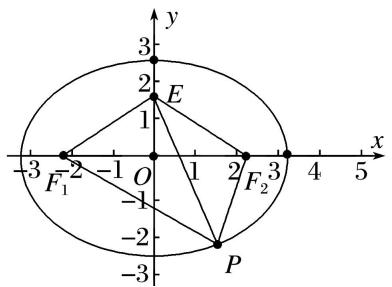

text_image

y
3
2
E
1
-3 F₁ -2 -1 O 1 2 F₂ 3 x
-1
-2 P
-3

# 第II组秒杀公式

(1) $e_{\text{椭圆}} = \frac{c}{a} = \frac{2c}{2a} = \frac{|F_1F_2|}{|PF_1| + |PF_2|} = \frac{\sin\angle F_1PF_2}{\sin\angle F_1F_2P + \sin\angle F_2F_1P}$ .   
(2) $e_{\text{双曲线}} = \frac{c}{a} = \frac{2c}{2a} = \frac{|F_1F_2|}{|PF_1| - |PF_2|} = \frac{\sin\angle F_1PF_2}{|\sin\angle F_1F_2P - \sin\angle F_2F_1P|}$ .

[例 2] (6)设椭圆 C: $\frac{x^{2}}{a^{2}}+\frac{y^{2}}{b^{2}}=1(a>b>0)$ 的左、右焦点分别为 $F_{1}$ ， $F_{2}$ ，P 是 C 上的点， $PF_{2}\perp F_{1}F_{2}$ ， $\angle PF_{1}F_{2}=30^{\circ}$ ，则 C 的离心率为()

A. $\frac{\sqrt{3}}{6}$

B. $\frac{1}{3}$

C. $\frac{1}{2}$

D. $\frac{\sqrt{3}}{3}$

答案 D 解析 秒杀 在 Rt△PF₂F₁ 中，令 |PF₂| = 1，∵∠PF₁F₂ = 30°，∴ |PF₁| = 2，|F₁F₂| = √3。∴ e = $\frac{2c}{2a} = \frac{|F_1F_2|}{|PF_1| + |PF_2|} = \frac{\sqrt{3}}{3}$ .

通法 如图，在 Rt△PF₂F₁ 中，∠PF₁F₂=30°，|F₁F₂|=2c，∴|PF₁|= $\frac{2c}{\cos 30^\circ}$ = $\frac{4\sqrt{3}c}{3}$ ，

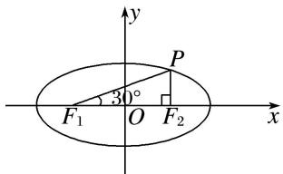

text_image

y
P
30°
F₁ O F₂ x

$|PF_{2}|=2c\cdot\tan30^{\circ}=\frac{2\sqrt{3}c}{3}.$ $\because|PF_{1}|+|PF_{2}|=2a,$ 即 $\frac{4\sqrt{3}c}{3}+\frac{2\sqrt{3}c}{3}=2a,$ 可得 $\sqrt{3}c=a.$ $\therefore e=\frac{c}{a}=\frac{\sqrt{3}}{3}.$

(7) (2018·全国II)已知 $F_{1}$ , $F_{2}$ 是椭圆 $C$ 的两个焦点, $P$ 是 $C$ 上的一点, 若 $PF_{1} \perp PF_{2}$ , 且 $\angle PF_{2}F_{1}=60^{\circ}$ , 则 $C$ 的离心率为( )

A. $1 - \frac{\sqrt{3}}{2}$

B. $2 - \sqrt{3}$

C. $\frac{\sqrt{3} - 1}{2}$

D. $\sqrt{3} - 1$

答案 D 解析 秒杀 $e = \frac{c}{a} = \frac{2c}{2a} = \frac{|F_1F_2|}{|PF_2| + |PF_1|} = \frac{\sin\angle F_1PF_2}{\sin\angle PF_1F_2 + \sin\angle PF_2F_1} = \frac{\sin 90^\circ}{\sin 30^\circ + \sin 60^\circ}\sqrt{3} - 1$ . 故选 D.

通法 由题设知 $\angle F_{1}PF_{2} = 90^{\circ}$ ， $\angle PF_2F_1 = 60^\circ$ ， $|F_1F_2| = 2c$ ，所以 $|PF_2| = c$ ， $|PF_1| = \sqrt{3} c$ 。由椭圆的定义得 $|PF_{1}| + |PF_{2}| = 2a$ ，即 $\sqrt{3} c + c = 2a$ ，所以 $(\sqrt{3} +1)c = 2a$ ，故椭圆 $C$ 的离心率 $e = \frac{c}{a} = \frac{2}{\sqrt{3} + 1} = \sqrt{3} -1$ 。故选

D.

(8)已知 $F_{1}$ , $F_{2}$ 分别是双曲线 $E: \frac{x^{2}}{a^{2}} - \frac{y^{2}}{b^{2}} = 1 (a > 0, b > 0)$ 的左、右焦点，点 $M$ 在 $E$ 上， $MF_{1}$ 与 $x$ 轴垂直， $\sin \angle MF_{2}F_{1} = \frac{1}{3}$ ，则 $E$ 的离心率为（）

A. $\sqrt{2}$

B. $\frac{3}{2}$

C. $\sqrt{3}$

D. 2

答案 A 解析 秒杀 作出示意图, 如图, 离心率 $e = \frac{c}{a} = \frac{2c}{2a} = \frac{|F_1F_2|}{|MF_2| - |MF_1|} = \frac{\sin\angle F_1MF_2}{\sin\angle MF_1F_2 - \sin\angle MF_2F_1}$ $= \frac{\frac{2\sqrt{2}}{3}}{1 - \frac{1}{3}} = \sqrt{2}$ . 故选 A.

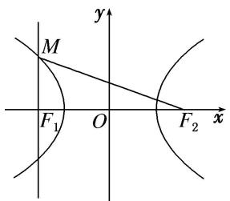

text_image

y
M
F₁ O F₂ x

通法 因为 $MF_{1}$ 与 $x$ 轴垂直，所以 $|MF_{1}| = \frac{b^{2}}{a}$ . 又 $\sin \angle MF_{2}F_{1} = \frac{1}{3}$ ，所以 $\frac{|MF_1|}{|MF_2|} = \frac{1}{3}$ ，即 $|MF_{2}| = 3|MF_{1}|$ . 由双曲线的定义，得 $2a = |MF_{2}| - |MF_{1}| = 2|MF_{1}| = \frac{2b^{2}}{a}$ ，所以 $b^{2} = a^{2}$ ，所以 $c^{2} = b^{2} + a^{2} = 2a^{2}$ ，所以离心率 $e = \frac{c}{a} = \sqrt{2}$ . 故选A.

(9)点 P 是椭圆上任意一点， $F_{1}$ ， $F_{2}$ 分别是椭圆的左、右焦点， $\angle F_{1}PF_{2}$ 的最大值是 $60^{\circ}$ ，则椭圆的离心率 e= \_\_\_\_.

答案 $\frac{1}{2}$ 解析 秒杀 $e=\frac{c}{a}=\frac{2c}{2a}=\frac{|F_{1}F_{2}|}{|PF_{2}|+|PF_{1}|}=\frac{1}{2}$

通法 如图所示，当点 $P$ 与点 $B$ 重合时， $\angle F_{1}PF_{2}$ 取得最大值 $60^{\circ}$ ，此时 $|OF_{1}| = c$ ， $|PF_{1}| = |PF_{2}| = 2c$ 。由椭圆的定义，得 $|PF_{1}| + |PF_{2}| = 4c = 2a$ ，所以椭圆的离心率 $e = \frac{c}{a} = \frac{1}{2}$ 。

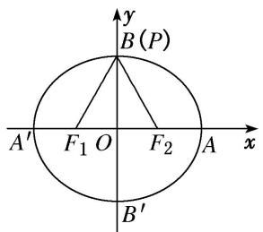

text_image

y
B(P)
A' F₁ O F₂ A x
B'

(10)椭圆 $C: \frac{x^2}{a^2} + \frac{y^2}{b^2} = 1 (a > b > 0)$ 的左焦点为 $F$ , 若 $F$ 关于直线 $\sqrt{3} x + y = 0$ 的对称点 $A$ 是椭圆 $C$ 上的点, 则椭圆 $C$ 的离心率为 \_\_\_\_.

答案 $\sqrt{3}-1$ 解析 秒杀 设 $F'$ 为椭圆的右焦点，则 $AF\perp AF'$ ， $\angle AFF'F=\frac{\pi}{3}$ ， $\therefore|AF|=\sqrt{3}|AF'|$ ， $|FF'|$

$= 2|AF^{\prime}|$ ，因此椭圆 $C$ 的离心率为 $\frac{2c}{2a} = \frac{|FF'|}{|AF| + |AF'|} = \frac{2}{\sqrt{3} + 1} = \sqrt{3} -1.$

(11) (2018·北京)已知椭圆 $M: \frac{x^2}{a^2} + \frac{y^2}{b^2} = 1 (a > b > 0)$ , 双曲线 $N: \frac{x^2}{m^2} - \frac{y^2}{n^2} = 1$ . 若双曲线 $N$ 的两条渐近线与椭圆 $M$ 的四个交点及椭圆 $M$ 的两个焦点恰为一个正六边形的顶点, 则椭圆 $M$ 的离心率为\_\_\_\_; 双曲线 $N$ 的离心率为\_\_\_\_.

答案 $\sqrt{3} - 1$ 2 解析 秒杀 双曲线 $N$ 的离心率 $e_1 = \sqrt{1 + \tan^2 60^\circ} = 2$ 。椭圆 $M$ 的离心率 $e_2 = \frac{\sin \angle FDC}{\sin \angle DFC + \sin \angle DCF} = \frac{\sin 90^\circ}{\sin 30^\circ + \sin 60^\circ} = \sqrt{3} - 1$ .

通法一：如图，∵双曲线N的渐近线方程为 $y=\pm\frac{n}{m}x,\quad\therefore\frac{n}{m}=\tan60^{\circ}=\sqrt{3},\quad\therefore$ 双曲线N的离心率 $e_{1}$ 满足 $e_{1}^{2}=1+\frac{n^{2}}{m^{2}}=4,\quad\therefore e_{1}=2.$ 由 $\left\{\begin{aligned}y&=\sqrt{3}x,\\ \frac{x^{2}}{a^{2}}+\frac{y^{2}}{b^{2}}&=1,\end{aligned}\right.$ 得 $x^{2}=\frac{a^{2}b^{2}}{3a^{2}+b^{2}}.$ 设D点的横坐标为x，由正六边形的性质得 $|ED|=2x=c,\quad\therefore4x^{2}=c^{2}.$ $\therefore\frac{4a^{2}b^{2}}{3a^{2}+b^{2}}=a^{2}-b^{2},$ 得 $3a^{4}-6a^{2}b^{2}-b^{4}=0,\quad\therefore3-\frac{6b^{2}}{a^{2}}-\left(\frac{b^{2}}{a^{2}}\right)^{2}=0,$ 解得 $\frac{b^{2}}{a^{2}}=2\sqrt{3}-3.$ $\therefore$ 椭圆M的离心率 $e_{2}^{2}=1-\frac{b^{2}}{a^{2}}=4-2\sqrt{3}.$ $\therefore e_{2}=\sqrt{3}-1.$

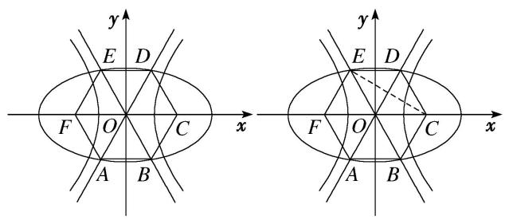

text_image

y
E D
F O C
A B
x
y
E D
F O C
A B
x

通法二：∵双曲线 N 的渐近线方程为 $y=\pm\frac{n}{m}x$ ，则 $\frac{n}{m}=\tan60^{\circ}=\sqrt{3}$ 。又 $c_{1}=\sqrt{m^{2}+n^{2}}=2m$ ，∴双曲线 N 的离心率为 $\frac{c_{1}}{m}=2$ 。如图，连接 EC，由题意知，F，C 为椭圆 M 的两焦点，设正六边形边长为 1，则 $|FC|=2c_{2}=2$ ，即 $c_{2}=1$ 。又 E 为椭圆 M 上一点，则 $|EF|+|EC|=2a$ ，即 $1+\sqrt{3}=2a$ ， $a=\frac{1+\sqrt{3}}{2}$ 。∴椭圆 M 的离心率为 $\frac{c_{2}}{a}=\frac{2}{1+\sqrt{3}}=\sqrt{3}-1$ 。

(12)如图， $F_{1}$ ， $F_{2}$ 是椭圆 $C_{1}$ 与双曲线 $C_{2}$ 的公共焦点，A，B 分别是 $C_{1}$ ， $C_{2}$ 在第二、四象限的交点，若 $AF_{1} \perp BF_{1}$ ，且 $\angle AF_{1}O = \frac{\pi}{3}$ ，则 $C_{1}$ 与 $C_{2}$ 的离心率之和为（）

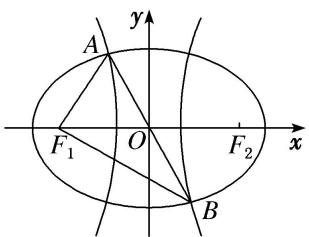

text_image

A
y
F₁ O F₂ x
B

A. $2 \sqrt{3}$

B. 4

C. $2\sqrt{5}$

D. $2\sqrt{6}$

答案 A 解析 秒杀 连接 $AF_{2}$ ，椭圆 $C_{1}$ 的离心率 $e_{1}=\frac{\sin\angle F_{1}AF_{2}}{\sin\angle AF_{1}F_{2}+\sin\angle AF_{2}F_{1}}=\frac{\sin90^{\circ}}{\sin60^{\circ}+\sin30^{\circ}}=\sqrt{3}-1$ 。双曲线 $C_{2}$ 的离心率 $e_{2}=\frac{\sin\angle F_{1}AF_{2}}{\sin\angle AF_{1}F_{2}-\sin\angle AF_{2}F_{1}}=\frac{\sin90^{\circ}}{\sin60^{\circ}-\sin30^{\circ}}=\sqrt{3}+1$ 。∴ $e+e_{1}=2\sqrt{3}$

通法 设椭圆方程为 $\frac{x^2}{a^2} + \frac{y^2}{b^2} = 1 (a > b > 0)$ ，由双曲线和椭圆的对称性可知， $A, B$ 关于原点对称，又 $AF_1 \perp BF_1$ ，且 $\angle AF_1O = \frac{\pi}{3}$ ，故 $|AF_1| = |OF_1| = |OA| = |OB| = c$ ， $\therefore A\left(-\frac{c}{2}, \frac{\sqrt{3}}{2}c\right)$ ，代入椭圆方程 $\frac{x^2}{a^2} + \frac{y^2}{b^2} = 1$ ，结合 $b^2 = a^2 - c^2$ 及 $e = \frac{c}{a}$ ，整理可得， $e^4 - 8e^2 + 4 = 0$ ， $\because 0 < e < 1$ ， $\therefore e^2 = 4 - 2\sqrt{3} = (\sqrt{3} - 1)^2$ ， $\therefore e = \sqrt{3} - 1$ 。同理可求得双曲线的离心率 $e_1 = \sqrt{3} + 1$ ， $\therefore e + e_1 = 2\sqrt{3}$ 。

# 【对点训练】

13. 设圆锥曲线 C 的两个焦点分别为 $F_{1}$ ， $F_{2}$ ，若曲线 C 上存在点 P 满足 $\left|PF_{1}\right| : \left|F_{1}F_{2}\right| : \left|PF_{2}\right| = 4 : 3 : 2$ ，则曲线 C 的离心率等于 \_\_\_\_.

13. 答案 $\frac{1}{2}$ 或 $\frac{3}{2}$ 解析 秒杀 不妨设 $|PF_{1}| = 4t, |F_{1}F_{2}| = 3t, |PF_{2}| = 2t$ ，其中 $t \neq 0$ 。若该曲线为椭圆，则有 $|PF_{1}| + |PF_{2}| = 6t = 2a, |F_{1}F_{2}| = 3t = 2c, e = \frac{c}{a} = \frac{2c}{2a} = \frac{3t}{6t} = \frac{1}{2}$ ；若该曲线为双曲线，则有 $|PF_{1}| - |PF_{2}| = 2t = 2a, |F_{1}F_{2}| = 3t = 2c, e = \frac{c}{a} = \frac{2c}{2a} = \frac{3t}{2t} = \frac{3}{2}$ .

14. 在直角坐标系 $xOy$ 中，设 $F$ 为双曲线 $C: \frac{x^2}{a^2} - \frac{y^2}{b^2} = 1 (a > 0, b > 0)$ 的右焦点， $P$ 为双曲线 $C$ 的右支上一点，且 $\triangle OPF$ 为正三角形，则双曲线 $C$ 的离心率为（）

A. $\sqrt{3}$

B. $\frac{2\sqrt{3}}{3}$

C. $1 + \sqrt{3}$

D. $2 + \sqrt{3}$

14. 答案 C 解析 秒杀 设 $F'$ 为双曲线的左焦点，连接 $PF'$ ，则 $\angle FPF' = 90^{\circ}$ ， $\angle PFF' = 30^{\circ}$ ， $\angle PFF' = 60^{\circ}$ ， $\therefore e = \frac{c}{a} = \frac{2c}{2a} = \frac{|F_{1}F_{2}|}{||PF_{2}| - |PF_{1}||} = \frac{\sin 90^{\circ}}{|\sin 30^{\circ} + \sin 60^{\circ}|} \sqrt{3} + 1$ 。故选 C.

通法 设 $F'$ 为双曲线的左焦点， $|F'F|=2c$ ，依题意可得 $|PO|=|PF|=c$ ，连接 $PF'$ ，由双曲线的定义可得 $|PF'|-|PF|=2a$ ，故 $|PF'|=2a+c$ ，在 $\triangle PF'O$ 中， $\angle POF'=120^{\circ}$ ，由余弦定理可得 $\cos120^{\circ}=\frac{c^{2}+c^{2}-(2a+c)^{2}}{2c^{2}}$ ，化简可得 $c^{2}-2ac-2a^{2}=0$ ，即 $(\frac{c}{a})^{2}-2\times\frac{c}{a}-2=0$ ，解得 $\frac{c}{a}=1+\sqrt{3}$ 或 $\frac{c}{a}=1-\sqrt{3}$ （不合题意，舍去），故双曲线的离心率 $e=1+\sqrt{3}$ ，故选 C.

15. 已知等腰梯形 $ABCD$ 中, $AB \parallel CD$ , $AB = 2CD = 4$ , $\angle BAD = 60^{\circ}$ , 双曲线以 $A$ , $B$ 为焦点, 且经过 $C$ , $D$ 两点, 则该双曲线的离心率等于( )

A. $\sqrt{2}$

B. $\sqrt{3}$

C. $\sqrt{5}$

D. $\sqrt{3} + 1$

15. 答案 D 解析 秒杀 因为 $AB = 2CD = 4$ ， $\angle BAD = 60^{\circ}$ ，所以 $DB = 2\sqrt{3}$ ， $AD = BC = 2$ ， $\therefore e = \frac{c}{a} = \frac{2c}{2a}$ $= \frac{|AB|}{||BD| - |AD||} = \frac{2}{\sqrt{3} - 1} = \sqrt{3} + 1$ 。故选 C.

通法 因为 AB=2CD=4, $\angle BAD=60^{\circ}$ , 所以 $DB=2\sqrt{3}$ , AD=BC=2, 则由双曲线的定义可得 $2a=|DB|$

$-|DA| = 2\sqrt{3} - 2, 2c = |AB| = 4$ ，即 $\sqrt{3} - 1 = a, c = 2$ ，故双曲线的离心率是 $e = \frac{c}{a} = \frac{2}{\sqrt{3} - 1} = \frac{2(\sqrt{3} + 1)}{2} = \sqrt{3} + 1$ 。故选D.

16. 已知 $F$ 是椭圆 $E: \frac{x^2}{a^2} + \frac{y^2}{b^2} = 1 (a > b > 0)$ 的左焦点，经过原点 $O$ 的直线 $l$ 与椭圆 $E$ 交于 $P$ ， $Q$ 两点，若 $|PF| = 2|QF|$ ，且 $\angle PFQ = 120^\circ$ ，则椭圆 $E$ 的离心率为（）

A. $\frac{1}{3}$

B. $\frac{1}{2}$

C. $\frac{\sqrt{3}}{3}$

D. $\frac{\sqrt{2}}{2}$

16. 答案 C 解析 秒杀 设 $F_{1}$ 是椭圆 E 的右焦点，连接 $PF_{1}, QF_{1}$ . 根据对称性，线段 $FF_{1}$ 与线段 PQ 在点 O 处互相平分，所以四边形 $PFQF_{1}$ 是平行四边形， $|FQ| = |PF_{1}|$ ， $\angle FPF_{1} = 180^{\circ} - \angle PFQ = 60^{\circ}$ ，又 $|FP| = 2|PF_{1}|$ ，所以 $\triangle FPF_{1}$ 是直角三角形， $\angle FF_{1}P = 90^{\circ}$ ， $\angle FPF_{1} = 60^{\circ}$ ， $\angle F_{1}FP = 30^{\circ}$ ， $\therefore e = \frac{c}{a} = \frac{2c}{2a} = \frac{|F_{1}F_{2}|}{||PF_{2}| - |PF_{1}||} = \frac{\sin 60^{\circ}}{|\sin 90^{\circ} + \sin 30^{\circ}|} = \frac{\sqrt{3}}{3}$ . 故选 C.

通法 设 $F_{1}$ 是椭圆 E 的右焦点，连接 $PF_{1}$ ， $QF_{1}$ 。根据对称性，线段 $FF_{1}$ 与线段 PQ 在点 O 处互相平分，所以四边形 $PFQF_{1}$ 是平行四边形， $|FQ| = |PF_{1}|$ ， $\angle FPF_{1} = 180^{\circ} - \angle PFQ = 60^{\circ}$ ，根据椭圆的定义， $|PF| + |PF_{1}| = 2a$ ，又 $|PF| = 2|QF|$ ，所以 $|PF_{1}| = \frac{2}{3}a$ ， $|PF| = \frac{4}{3}a$ ，而 $|F_{1}F| = 2c$ ，在 $\triangle F_{1}PF$ 中，由余弦定理，得 $(2c)^{2} = \left(\frac{2}{3}a\right)^{2} + \left(\frac{4}{3}a\right)^{2} - 2 \times \frac{2}{3}a \times \frac{4}{3}a \times \cos 60^{\circ}$ ，得 $\frac{c^{2}}{a^{2}} = \frac{1}{3}$ ，所以椭圆 E 的离心率 $e = \frac{c}{a} = \frac{\sqrt{3}}{3}$ 。故选 C。

17. 已知双曲线 $C: \frac{x^2}{a^2} - \frac{y^2}{b^2} = 1 (a > 0, b > 0)$ 的左、右焦点分别为 $F_1, F_2, P$ 为双曲线 $C$ 上第二象限内一点，若直线 $y = \frac{b}{a} x$ 恰为线段 $PF_2$ 的垂直平分线，则双曲线 $C$ 的离心率为（）

A. $\sqrt{2}$

B. $\sqrt{3}$

C. $\sqrt{5}$

D. $\sqrt{6}$

17. 答案 C 解析 秒杀 由已知 $\triangle F_{1}PF_{2}$ 是直角三角形， $\angle F_{2}PF_{1} = 90^{\circ}$ ， $\sin \angle PF_{1}F_{2} = \frac{b}{c}$ ， $\angle PF_{2}F_{1} = \frac{a}{c}$ ， $\therefore e = \frac{c}{a} = \frac{\sin 90^{\circ}}{|\sin \angle PF_{1}F_{2} + \sin \angle PF_{2}F_{1}|} = \frac{1}{\left|\frac{b}{c} - \frac{a}{c}\right|}$ . 即 $\frac{b}{a} = 2$ ，所以 $e = \sqrt{1 + \left(\frac{b}{a}\right)^{2}} = \sqrt{5}$ . 故选 C.

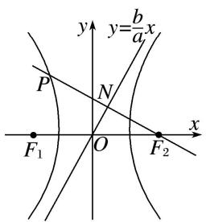

text_image

y
y=\frac{b}{a}x
P
N
F₁ O F₂ x

通法 如图, 直线 $PF_{2}$ 的方程为 $y = -\frac{a}{b} (x - c)$ , 设直线 $PF_{2}$ 与直线 $y = \frac{b}{a} x$ 的交点为 $N$ , 易知 $N\left(\frac{a^2}{c}, \frac{ab}{c}\right)$ . 又线段 $PF_{2}$ 的中点为 $N$ , 所以 $P\left(\frac{2a^2 - c^2}{c}, \frac{2ab}{c}\right)$ . 因为点 $P$ 在双曲线 $C$ 上, 所以 $\frac{(2a^2 - c^2)^2}{a^2c^2} - \frac{4a^2b^2}{c^2b^2} = 1$ , 即 $5a^2$

$= c^{2}$ ，所以 $e = \frac{c}{a} = \sqrt{5}$ 故选C.

18. 椭圆 $C: \frac{x^2}{a^2} + \frac{y^2}{b^2} = 1 (a > b > 0)$ 的左焦点为 $F$ ，若 $F$ 关于直线 $\sqrt{3} x + y = 0$ 的对称点 $A$ 是椭圆 $C$ 上的点，则椭圆 $C$ 的离心率为（）

A. $\frac{1}{2}$

B. $\frac{\sqrt{3} - 1}{2}$

C. $\frac{\sqrt{3}}{2}$

D. $\sqrt{3} - 1$

18. 答案 D 解析 秒杀 设 $F_{1}$ 是椭圆 $C$ 的右焦点，连接 $AF_{1}, AF$ 。由已知 $\triangle F_{1}AF$ 是直角三角形， $\angle FAF_{1} = 90^{\circ}$ ， $\angle AF_{1}F = 60^{\circ}$ ， $\angle AFF_{1} = 30^{\circ}$ ， $e = \frac{\sin \angle F_{1}AF}{\sin \angle AF_{1}F + \sin \angle AFF_{1}} = \frac{\sin 90^{\circ}}{\sin 60^{\circ} + \sin 30^{\circ}}\sqrt{3} - 1$ 。故选 D.

通法 设 $F(-c,0)$ 关于直线 $\sqrt{3}x+y=0$ 的对称点为 $A(m,n)$ ，则 $\left\{\begin{aligned}\frac{n}{m+c}&\cdot(-\sqrt{3})=-1,\\ \sqrt{3}\cdot\frac{m-c}{2}&+\frac{n}{2}=0,\end{aligned}\right.$ 解得 $m=\frac{c}{2}$ ， $n=\frac{\sqrt{3}}{2}c$ ，代入椭圆方程可得 $\frac{\frac{c^{2}}{4}}{a^{2}}+\frac{\frac{3}{4}c^{2}}{b^{2}}=1$ 化简可得 $e^{4}-8e^{2}+4=0$ ，又0<e<1，解得 $e=\sqrt{3}-1$ 。故选D.

# 第III组秒杀公式

(1)若直线 $y = kx$ 与椭圆 $E$ 交于 $A, B$ 两点， $P$ 为椭圆上异于 $A, B$ 的点，若直线 $PA, PB$ 的斜率存在，且分别为 $k_{1}, k_{2}$ ，则 $k_{1} \cdot k_{2} = -\frac{b^{2}}{a^{2}} = e^{2} - 1$ .

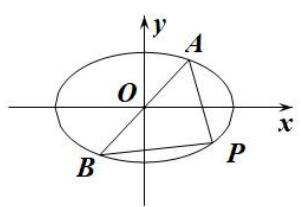

text_image

y
A
O
x
B
P

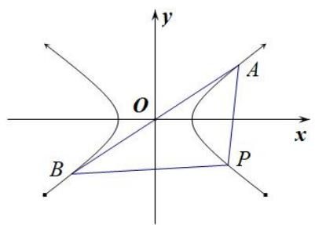

text_image

y
O
A
x
B
P

(2)若直线 $y = kx$ 与双曲线 $E$ 交于 $A, B$ 两点， $P$ 为双曲线上异于 $A, B$ 的点，若直线 $PA, PB$ 的斜率存在，且分别为 $k_{1}, k_{2}$ ，则 $k_{1} \cdot k_{2} = \frac{b^{2}}{a^{2}} = e^{2} - 1$ .

注：当焦点在 y 轴上时 a, b 对调.

# 【例题选讲】

[例 3] (13)(2015·全国II)已知 A, B 为双曲线 E 的左，右顶点，点 M 在 E 上， $\triangle ABM$ 为等腰三角形，且顶角为 $120^{\circ}$ ，则 E 的离心率为()

A. $\sqrt{5}$

B. 2

C. $\sqrt{3}$

D. $\sqrt{2}$

答案 D 解析 秒杀 $\because k_{1}\cdot k_{2}=e^{2}-1.\therefore1=e^{2}-1.\therefore e=\sqrt{2}$ . 故选 D.

通法 不妨取点 M 在第一象限，如图所示，设双曲线方程为 $\frac{x^{2}}{a^{2}} - \frac{y^{2}}{b^{2}} = 1 (a > 0, b > 0)$ ，则 $|BM| = |AB| = 2a$ ，

$\angle MBx = 180^{\circ} - 120^{\circ} = 60^{\circ}$ ， $\therefore M$ 点的坐标为 $(2a, \sqrt{3} a)$ . $\because M$ 点在双曲线上， $\therefore \frac{4a^2}{a^2} - \frac{3a^2}{b^2} = 1$ ， $a = b$ ， $\therefore c = \sqrt{2} a$ ， $e = \frac{c}{a} = \sqrt{2}$ 故选D.

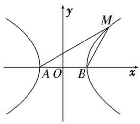

text_image

y
M
A O B x

(14)已知椭圆 $C: \frac{x^2}{a^2} + \frac{y^2}{b^2} = 1 (a > b > 0)$ 的右顶点为 $A$ ，过原点 $O$ 的直线 $l$ 与 $C$ 交于点 $P, Q$ ，且直线 $AP$ 与直线 $AQ$ 的斜率之积为 $-\frac{1}{2}$ ，则 $C$ 的离心率是（）

A. $\frac{1}{2}$

B. $\frac{\sqrt{6}}{3}$

C. $\frac{\sqrt{2}}{2}$

D. $\frac{\sqrt{2}}{4}$

答案 C 解析 秒杀 $\because k_{1}\cdot k_{2}=e^{2}-1.\therefore-\frac{1}{2}=e^{2}-1.\therefore e=\frac{\sqrt{2}}{2}.$ 故选 C.

通法 设 $P(x_{1},y_{1})$ ， $Q(-x_1, - y_1)$ ， $A(a,0)$ .所以 $k_{AP}\cdot k_{AQ} = \frac{y_1}{x_1 - a}\cdot \frac{-y_1}{-x_1 - a} = \frac{y_1^2}{x_1^2 - a^2}$ 又因为 $\frac{x_1^2 + y_1^2}{a^2} = 1\Rightarrow y_1^2 = \frac{b^2(a^2 - x_1^2)}{a^2}$ 所以 $k_{AP}\cdot k_{AQ} = -\frac{b^2}{a^2}$ 即 $\frac{b^2}{a^2} = \frac{1}{2}$ 所以椭圆 $C$ 的离心率 $e = \frac{c}{a} = \sqrt{1 - \frac{b^2}{a^2}} = \frac{\sqrt{2}}{2}$ 故选C.

(15)设 $A_{1}$ , $A_{2}$ 分别为椭圆 $\frac{x^{2}}{a^{2}} + \frac{y^{2}}{b^{2}} = 1 (a > b > 0)$ 的左、右顶点，若在椭圆上存在点 $P$ ，使得 $k_{PA1} \cdot k_{PA2} > -\frac{1}{2}$ ，则该椭圆的离心率的取值范围是（）

A. $\left(0,\frac{1}{2}\right)$

B. $\left(0,\frac{\sqrt{2}}{2}\right)$

C. $\left(\frac{\sqrt{2}}{2},1\right)$

D. $\left(\frac{1}{2},\ 1\right)$

答案 C 解析 秒杀 $\because k_{1}\cdot k_{2}=e^{2}-1.\therefore e^{2}-1>-\frac{1}{2}.\therefore e>\frac{\sqrt{2}}{2}$ ，故选 C.

通法 椭圆 $\frac{x^2}{a^2} +\frac{y^2}{b^2} = 1(a > b > 0)$ 的左、右顶点分别为 $A_{1}(-a,0),A_{2}(a,0)$ ，设 $P(x_0,y_0)$ ，根据题意， $k_{PA1}\cdot k_{PA2} = \frac{y_0^2}{x_0^2 - a^2} > - \frac{1}{2}$ 而 $\frac{x_0^2}{a^2} +\frac{y_0^2}{b^2} = 1$ 所以 $\frac{y_0^2}{x_0^2 - a^2} = -\frac{b^2}{a^2}$ 于是 $\frac{b^2}{a^2} < \frac{1}{2}$ 即 $\frac{a^2 - c^2}{a^2} < \frac{1}{2},1 - e^2 < \frac{1}{2}$ 所以 $e > \frac{\sqrt{2}}{2}$ 又 $e < 1$ ，故 $\frac{\sqrt{2}}{2} < e < 1$ 故选C.

(16)已知 O 为坐标原点，点 A，B 在双曲线 C: $\frac{x^{2}}{a^{2}} - \frac{y^{2}}{b^{2}} = 1 (a > 0, b > 0)$ 上，且关于坐标原点 O 对称．若双曲线 C 上与点 A，B 横坐标不相同的任意一点 P 满足 $k_{PA} \cdot k_{PB} = 3$ ，则双曲线 C 的离心率为（）

A. 2

B. 4

C. $\sqrt{10}$

D. 10

答案 A 解析 秒杀 $\because k_{1}\cdot k_{2}=e^{2}-1.\therefore3=e^{2}-1.\therefore e=2.$ 故选 A.

通法 设 $A(x_{1}, y_{1})$ , $P(x_{0}, y_{0})(|x_{0}| \neq |x_{1}|)$ ，则 $B(-x_{1}, -y_{1})$ ，则 $k_{PA} \cdot k_{PB} = \frac{y_{0} - y_{1}}{x_{0} - x_{1}} \frac{y_{0} + y_{1}}{x_{0} + x_{1}} = \frac{y_{0}^{2} - y_{1}^{2}}{x_{0}^{2} - x_{1}^{2}}$ 。因为点 P，

A 在双曲线 C 上，所以 $b^{2}x_{0}^{2}-a^{2}y_{0}^{2}=a^{2}b^{2}$ ， $b^{2}x_{1}^{2}-a^{2}y_{1}^{2}=a^{2}b^{2}$ ，两式相减可得 $\frac{y_{0}^{2}-y_{1}^{2}}{x_{0}^{2}-x_{1}^{2}}=\frac{b^{2}}{a^{2}}$ ，故 $\frac{b^{2}}{a^{2}}=3$ ，于是 $b^{2}=3a^{2}$ 。又因为 $c^{2}=a^{2}+b^{2}$ ，所以双曲线 C 的离心率 $e=\sqrt{1+\left(\frac{b}{a}\right)^{2}}=2$ 。故选 A.

(17)已知双曲线 $\frac{x^{2}}{a^{2}}-\frac{y^{2}}{b^{2}}=1(a>0,\ b>0)$ ，M、N为双曲线上关于原点对称的两点，P为双曲线上的点，且直线PM、PN的斜率分别为 $k_{1}$ 、 $k_{2}$ ，若 $k_{1}\cdot k_{2}=\frac{5}{4}$ ，则双曲线的离心率为()

A. $\sqrt{2}$

B. $\frac{3}{2}$

C. 2

D. $\frac{5}{2}$

答案 B 解析 秒杀 $\because k_{1}\cdot k_{2}=e^{2}-1.\quad\therefore\frac{5}{4}=e^{2}-1.\quad\therefore e=\frac{3}{2}.$ 故选 B.

通法 设 $M(x_{1}, y_{1})$ , $P(x_{2}, y_{2})$ ，则 $N(-x_{1}, -y_{1})$ , $\therefore k_{1} \cdot k_{2} = \frac{y_{2} - y_{1}}{x_{2} - x_{1}} \cdot \frac{y_{2} + y_{1}}{x_{2} + x_{1}} = \frac{y_{2}^{2} - y_{1}^{2}}{x_{2}^{2} - x_{1}^{2}}$ ，由点 M、N 在双曲线上得 $\frac{x_{1}^{2}}{a^{2}} - \frac{y_{1}^{2}}{b^{2}} = 1$ , $\frac{x_{2}^{2}}{a^{2}} - \frac{y_{2}^{2}}{b^{2}} = 1$ ，两式相减可得 $\frac{y_{2}^{2} - y_{1}^{2}}{x_{2}^{2} - x_{1}^{2}} = \frac{b^{2}}{a^{2}}$ , $\because k_{1} \cdot k_{2} = \frac{5}{4}$ , $\therefore \frac{b^{2}}{a^{2}} = \frac{5}{4}$ , $\therefore b = \frac{\sqrt{5}}{2} a$ , $\therefore c = \sqrt{a^{2} + b^{2}} = \frac{3}{2} a$ , $\therefore e = \frac{c}{a} = \frac{3}{2}$ . 故选 B.

# 【对点训练】

19. 设 $A_{1}, A_{2}$ 分别为双曲线 $C: \frac{y^{2}}{a^{2}} - \frac{x^{2}}{b^{2}} = 1 (a > 0, b > 0)$ 的上、下顶点，若双曲线上存在点 $M$ 使得两直线斜率 $k_{MA1} \cdot k_{MA2} < \frac{1}{2}$ ，则双曲线 $C$ 的离心率 $e$ 的取值范围为（）

A. $\left(0,\frac{\sqrt{6}}{2}\right)$

B. $\left(1,\frac{\sqrt{6}}{2}\right)$

C. $\left(\frac{\sqrt{6}}{2},+\infty\right)$

D. $\begin{pmatrix}1,\frac{3}{2}\end{pmatrix}$

19. 答案 B 解析 秒杀 $k_{1} \cdot k_{2} = e^{2} - 1$ . $\therefore e^{2} - 1 < \frac{1}{2}$ , 解得 $1 < e < \frac{\sqrt{6}}{2}$ . 故选 B.

通法 设 $M(x_{0}, y_{0})$ , $A_{1}(0, -a)$ , $A_{2}(0, a)$ ，则 $kM A_{1}=\frac{y_{0}+a}{x_{0}}$ , $kM A_{2}=\frac{y_{0}-a}{x_{0}}$ ，所以 $k_{MA1}\cdot k_{MA2}=\frac{y_{0}^{2}-a^{2}}{x_{0}^{2}}>2$ (\*)。又点 $M(x_{0}, y_{0})$ 在双曲线 $\frac{y^{2}}{a^{2}}-\frac{x^{2}}{b^{2}}=1$ 上，所以 $y_{0}^{2}=a^{2}\left(\frac{x_{0}^{2}}{b^{2}}+1\right)$ ，代入(\*)式化简得 $\frac{a^{2}}{b^{2}}>2$ ，所以 $\frac{b^{2}}{a^{2}}<\frac{1}{2}$ ，所以 $\frac{c^{2}-a^{2}}{a^{2}}=e^{2}-1<\frac{1}{2}$ ，解得 $1<e<\frac{\sqrt{6}}{2}$ 。故选 B.

20. 已知 $A, B$ 是椭圆 $C$ 上关于原点对称的两点, 若椭圆 $C$ 上存在点 $P$ , 使得直线 $PA, PB$ 斜率的绝对值之和为 1 , 则椭圆 $C$ 的离心率的取值范围是 \_\_\_\_.

20. 答案 $\left[\frac{\sqrt{3}}{2}, 1\right]$ 解析 秒杀 $k_{1} + k_{2} = 1, k_{1} \cdot k_{2} = e^{2} - 1$ . 由基本不等式得， $1 = k_{1} + k_{2} \geq 2\sqrt{k_{1} \cdot k_{2}} = \sqrt{e^{2} - 1}$ ，解得 $\frac{\sqrt{3}}{2} \leq e < 1$ .

通法 不妨设椭圆 C 的方程为 $\frac{x^{2}}{a^{2}} + \frac{y^{2}}{b^{2}} = 1 (a > b > 0)$ ， $P(x, y)$ ， $A(x_{1}, y_{1})$ ，则 $B(-x_{1}, -y_{1})$ ，所以 $\frac{x^{2}}{a^{2}} + \frac{y^{2}}{b^{2}} = 1$ ， $\frac{x_{1}^{2}}{a^{2}} + \frac{y_{1}^{2}}{b^{2}} = 1$ ，两式相减得 $\frac{x^{2} - x_{1}^{2}}{a^{2}} = -\frac{y^{2} - y_{1}^{2}}{b^{2}}$ ，所以 $\frac{y^{2} - y_{1}^{2}}{x^{2} - x_{1}^{2}} = -\frac{b^{2}}{a^{2}}$ ，所以直线 PA，PB 斜率的绝对值之和

为 $\left|\frac{y - y_1}{x - x_1}\right| + \left|\frac{y + y_1}{x + x_1}\right| \geq 2\sqrt{\left|\frac{y^2 - y_1^2}{x^2 - x_1^2}\right|} = \frac{2b}{a}$ ，由题意得 $\frac{2b}{a} \leq 1$ ，所以 $a^2 \geq 4b^2 = 4a^2 - 4c^2$ ，即 $3a^2 \leq 4c^2$

所以 $e^{2} \geq \frac{3}{4}$ ，又因为 0 < e < 1，所以 $\frac{\sqrt{3}}{2} \leq e < 1$ .

# 第IV组秒杀公式

(1)若直线 $y = kx + m (k \neq 0 \text{且} m \neq 0)$ 与椭圆 $E$ 交于 $A, B$ 两点， $P$ 为弦 $AB$ 的中点，设直线 $PO$ 的斜率为 $k_0$ ，则 $k_0 \cdot k = -\frac{b^2}{a^2} = e^2 - 1$ .

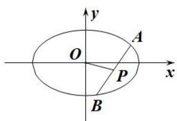

text_image

y
O
A
x
P
B

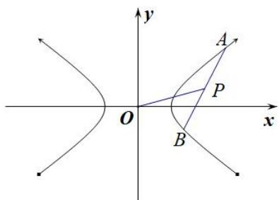

text_image

y
A
P
O
x
B

(2)若直线 $y = kx + m (k \neq 0 \text{且} m \neq 0)$ 与双曲线 $E$ 交于 $A, B$ 两点， $P$ 为弦 $AB$ 的中点，设直线 $PO$ 的斜率为 $k_0$ ，则 $k_0 \cdot k = \frac{b^2}{a^2} = e^2 - 1$ .

注：当焦点在 $y$ 轴上时 $a, b$ 对调.

# 【例题选讲】

[例 4] (18) 过点 M(1, 1) 作斜率为 $-\frac{1}{3}$ 的直线 l 与椭圆 C: $\frac{x^{2}}{a^{2}} + \frac{y^{2}}{b^{2}} = 1 (a > b > 0)$ 相交于 A, B 两点，若 M 是线段 AB 的中点，则椭圆 C 的离心率为 \_\_\_\_.

答案 $\frac{\sqrt{6}}{3}$ 解析 秒杀 由题意得， $k_0 \cdot k = e^2 - 1$ 。 $\therefore e = \frac{\sqrt{6}}{3}$ .

通法 设 $A(x_{1},y_{1}),B(x_{2},y_{2})$ ，由题意得， $\left\{ \begin{array}{l}b^{2}x_{1}^{2} + a^{2}y_{1}^{2} = a^{2}b^{2},\\ b^{2}x_{2}^{2} + a^{2}y_{2}^{2} = a^{2}b^{2}, \end{array} \right.\therefore b^{2}(x_{1} + x_{2})(x_{1} - x_{2}) + a^{2}(y_{1} + y_{2})(y_{1}-$ $y_{2}) = 0,\therefore 2b^{2}(x_{1} - x_{2}) + 2a^{2}(y_{1} - y_{2}) = 0,\therefore b^{2}(x_{1} - x_{2}) = -a^{2}(y_{1} - y_{2}).\therefore \frac{b^{2}}{a^{2}} = -\frac{y_{1} - y_{2}}{x_{1} - x_{2}} = \frac{1}{3},\therefore a^{2} = 3b^{2}. \therefore a^{2} =$ $3(a^{2} - c^{2}),\therefore 2a^{2} = 3c^{2},\therefore e = \frac{\sqrt{6}}{3}.$

(19)已知椭圆 $\frac{x^{2}}{a^{2}}+\frac{y^{2}}{b^{2}}=1(a>b>0)$ ，点F为左焦点，点P为下顶点，平行于FP的直线l交椭圆于A，B两点，且AB的中点为 $M(1,\frac{1}{2})$ ，则椭圆的离心率为()

A. $\frac{1}{2}$

B. $\frac{\sqrt{2}}{2}$

C. $\frac{1}{4}$

D. $\frac{\sqrt{3}}{2}$

答案 B 解析 秒杀 由题意得， $k_{0} \cdot k = e^{2} - 1$ . 即 $\frac{1}{2} \cdot \left( -\frac{b}{c} \right) = e^{2} - 1$ ，∴ $e = \frac{\sqrt{2}}{2}$ . 故选 B.

通法 因为 FP 的斜率为 $-\frac{b}{c}$ ，FP // l，所以直线 1 的斜率为 $-\frac{b}{c}$ 。设 $A(x_{1}, y_{1})$ ， $B(x_{2}, y_{2})$ ，由 $\left\{\begin{aligned}\frac{x_{1}^{2}}{a^{2}}+\frac{y_{1}^{2}}{b^{2}}=1\\ \frac{x_{2}^{2}}{a^{2}}+\frac{y_{2}^{2}}{b^{2}}=1\end{aligned}\right.$ 得 $\frac{y_{1}^{2}}{b^{2}}-\frac{y_{2}^{2}}{b^{2}}=-\left(\frac{x_{1}^{2}}{a^{2}}-\frac{x_{2}^{2}}{a^{2}}\right)$ ，即 $\frac{y_{1}-y_{2}}{x_{1}-x_{2}}=-\frac{b^{2}(x_{1}+x_{2})}{a^{2}(y_{1}+y_{2})}$ 。因为AB的中点为 $M(1,\frac{1}{2})$ ，所以 $-\frac{b}{c}=-\frac{2b^{2}}{a^{2}}$ ，所以 $a^{2}=2bc$ ，
所以 $b^{2}+c^{2}=2bc$ ，所以b=c，所以 $a=\sqrt{2}c$ ，所以椭圆的离心率为 $\frac{\sqrt{2}}{2}$ ，故选B.

(20)已知椭圆 $\frac{x^{2}}{a^{2}}+\frac{y^{2}}{b^{2}}=1(a>b>0)$ 的一条弦所在的直线方程是 $x-y+5=0$ ，弦的中点坐标是 $M(-4,1)$ ，则椭圆的离心率是()

A. $\frac{1}{2}$

B. $\frac{\sqrt{2}}{2}$

C. $\frac{\sqrt{3}}{2}$

D. $\frac{\sqrt{5}}{5}$

答案 C 解析 秒杀 由题意得， $k_{0} \cdot k = e^{2} - 1$ . $\therefore e = \frac{\sqrt{3}}{2}$ . 故选 C.

通法一 设直线与椭圆的交点为 $A(x_{1},y_{1}),B(x_{2},y_{2})$ ，分别代入椭圆方程，得 $\left\{ \begin{array}{l}x_1^2 +\frac{y_1^2}{b^2} = 1,\\ \frac{x_2^2}{a^2} +\frac{y_2^2}{b^2} = 1, \end{array} \right.$ 两式相减得 $\frac{y_1 - y_2}{x_1 - x_2} = -\frac{b^2}{a^2}\cdot \frac{x_1 + x_2}{y_1 + y_2}$ 因为 $k_{AB} = \frac{y_1 - y_2}{x_1 - x_2} = 1$ ，且 $x_{1} + x_{2} = -8,y_{1} + y_{2} = 2$ ，所以 $\frac{b^2}{a^2} = \frac{1}{4},e = \frac{c}{a} = \sqrt{1 - \left(\frac{b}{a}\right)^2} = \frac{\sqrt{3}}{2},$ 故选C.

通法二 将直线方程 $x - y + 5 = 0$ 代入 $\frac{x^2}{a^2} +\frac{y^2}{b^2} = 1(a > b > 0)$ ，得 $(a^{2} + b^{2})x^{2} + 10a^{2}x + 25a^{2} - a^{2}b^{2} = 0$ ，设直线与椭圆的交点为 $A(x_{1},y_{1}),B(x_{2},y_{2})$ ，则 $x_{1} + x_{2} = -\frac{10a^{2}}{a^{2} + b^{2}}$ ，又由中点坐标公式知 $x_{1} + x_{2} = -8$ ，所以 $\frac{10a^2}{a^2 + b^2}$ $= 8$ ，解得 $a = 2b$ ，又 $c = \sqrt{a^2 - b^2} = \sqrt{3} b$ ，所以 $e = \frac{c}{a} = \frac{\sqrt{3}}{2}$ 故选C.

(21)已知双曲线 $C: \frac{x^2}{a^2} - \frac{y^2}{b^2} = 1 (a > 0, b > 0)$ , 过点 $P(3, 6)$ 的直线 $l$ 与 $C$ 相交于 $A, B$ 两点, 且 $AB$ 的中点为 $N(12, 15)$ , 则双曲线 $C$ 的离心率为( )

A. 2

B. $\frac{3}{2}$

C. $\frac{3\sqrt{5}}{5}$

D. $\frac{\sqrt{5}}{2}$

答案 B 解析 秒杀 由题意得， $k_{0} \cdot k = e^{2} - 1$ . $\therefore e = \frac{3}{2}$ . 故选 B.

通法 设 $A(x_{1}, y_{1}), B(x_{2}, y_{2})$ ，由 AB 的中点为 N(12,15)，则 $x_{1} + x_{2} = 24, y_{1} + y_{2} = 30$ ，由 $\left\{\begin{aligned}\frac{x_{1}^{2}}{a^{2}} - \frac{y_{1}^{2}}{b^{2}} &= 1, \\ \frac{x_{2}^{2}}{a^{2}} - \frac{y_{2}^{2}}{b^{2}} &= 1,\end{aligned}\right.$ 两式相减得， $\frac{(x_{1}+x_{2})(x_{1}-x_{2})}{a^{2}}=\frac{(y_{1}+y_{2})(y_{1}-y_{2})}{b^{2}}$ ，则 $\frac{y_{1}-y_{2}}{x_{1}-x_{2}}=\frac{b^{2}(x_{1}+x_{2})}{a^{2}(y_{1}+y_{2})}=\frac{4b^{2}}{5a^{2}}$ ，由直线AB的斜率 $k=\frac{15-6}{12-3}=1$ ，所以 $\frac{4b^{2}}{5a^{2}}=1$ ，则 $\frac{b^{2}}{a^{2}}=\frac{5}{4}$ ，双曲线的离心率 $e=\frac{c}{a}=\sqrt{1+\frac{b^{2}}{a^{2}}}=\frac{3}{2}$ ，所以双曲线C的离心率为 $\frac{3}{2}$ 。故选B。

# 第V组秒杀公式

过椭圆或双曲线的焦点 $F$ 作倾斜角为 $\theta$ 直线与椭圆或双曲线相交 $A$ 、 $B$ 两点，且 $\overrightarrow{AF} = \lambda \overrightarrow{FB}$ ，则有 $|e\cos \theta| = \frac{|\lambda - 1|}{|\lambda + 1|}$ 。（其中 $\theta$ 为直线的倾斜角， $F$ 在线段 $AB$ 上）

[例 5] (22)倾斜角为 $\frac{\pi}{4}$ 的直线经过椭圆 $\frac{x^{2}}{a^{2}}+\frac{y^{2}}{b^{2}}=1(a>b>0)$ 的右焦点F，与椭圆交于A、B两点，且 $\overrightarrow{AF}=2\overrightarrow{FB}$ ，则该椭圆的离心率为()

A. $\frac{\sqrt{3}}{2}$

B. $\frac{\sqrt{2}}{3}$

C. $\frac{\sqrt{2}}{2}$

D. $\frac{\sqrt{3}}{3}$

答案 B 解析 秒杀 由题可知， $\left|e\cos\frac{\pi}{4}\right|=\frac{|2-1|}{|2+1|}$ ，所以 $e=\frac{\sqrt{2}}{3}$ ，故选 B.

通法 由题可知，直线的方程为 y=x-c，与椭圆方程联立得 $\left\{\begin{aligned}\frac{x^{2}}{a^{2}}+\frac{y^{2}}{b^{2}}=1\\ y=x-c\end{aligned}\right.$ ，所以 $(b^{2}+a^{2})y^{2}+2b^{2}cy-b^{4}$ =0，由于直线过椭圆的右焦点，故必与椭圆有两个交点，则 $\Delta>0$ 。设 $A(x_{1},y_{1}),B(x_{2},y_{2})$ ，则 $\left\{\begin{aligned}y_{1}+y_{2}&=\frac{-2b^{2}c}{a^{2}+b^{2}}\\ y_{1}y_{2}&=\frac{-b^{4}}{a^{2}+b^{2}}\end{aligned}\right.$ 又 $\overrightarrow{AF}=2\overrightarrow{FB}$ ，所以 $(c-x_{1},-y_{1})=2(x_{2}-c,y_{2})$ ，所以 $-y_{1}=2y_{2}$ ，可得 $\left\{\begin{aligned}-y_{2}&=\frac{-2b^{2}c}{a^{2}+b^{2}}\\ -2y_{2}^{3}&=\frac{-b^{4}}{a^{2}+b^{2}}\end{aligned}\right.$ ，所以 $\frac{1}{2}=\frac{4c^{2}}{a^{2}+b^{2}}$ ，所以 $e=\frac{\sqrt{2}}{3}$ ，故选B.

(23)已知 F 是椭圆 $\frac{x^{2}}{a^{2}} + \frac{y^{2}}{b^{2}} = 1 (a > b > 0)$ 的右焦点，A 是椭圆短轴的一个端点，若 F 为过 AF 的椭圆的弦的三等分点，则椭圆的离心率为()

A. $\frac{1}{3}$

B. $\frac{\sqrt{3}}{3}$

C. $\frac{1}{2}$

D. $\frac{\sqrt{3}}{2}$

答案 B 解析 秒杀 由题可知， $|e\cos\theta|=\frac{|2-1|}{|2+1|}$ ，即 $|e\cdot\frac{c}{a}|=\frac{|2-1|}{|2+1|}$ ，所以 $e=\frac{\sqrt{3}}{3}$ ，故选 B.

通法 延长 AF 交椭圆于点 B，设椭圆左焦点为 $F'$ ，连接 $AF'$ ， $BF'$ 。根据题意 $|AF| = \sqrt{b^{2} + c^{2}} = a$ ， $|AF| = 2|FB|$ ，所以 $|FB| = \frac{a}{2}$ 。根据椭圆定义 $|BF'| + |BF| = 2a$ ，所以 $|BF'| = \frac{3a}{2}$ 。在 $\triangle AFF'$ 中，由余弦定理得 $\cos \angle F'AF = \frac{|F'A|^{2} + |FA|^{2} - |F'F|^{2}}{2|F'A|\cdot|FA|} = \frac{2a^{2} - 4c^{2}}{2a^{2}}$ 。在 $\triangle AF'B$ 中，由余弦定理得 $\cos \angle F'AB = \frac{|F'A|^{2} + |AB|^{2} - |BF'|^{2}}{2|F'A|\cdot|AB|} = \frac{1}{3}$ ，所以 $\frac{2a^{2} - 4c^{2}}{2a^{2}} = \frac{1}{3}$ ，解得 $a = \sqrt{3}c$ ，所以椭圆离心率为 $e = \frac{c}{a} = \frac{\sqrt{3}}{3}$ 。故选 B。

(24)已知双曲线 $\frac{x^{2}}{a^{2}}-\frac{y^{2}}{b^{2}}=1(a>0,\ b>0)$ 的右焦点为F，直线l经过点F且与双曲线的一条渐近线垂直，直线l与双曲线的右支交于不同两点A，B，若 $\overrightarrow{AF}=3\overrightarrow{FB}$ ，则该双曲线的离心率为()

A. $\frac{\sqrt{5}}{2}$

B. $\frac{\sqrt{6}}{2}$

C. $\frac{2\sqrt{3}}{3}$

D. $\sqrt{3}$

答案 A 解析 秒杀 由题可知， $|e\cos\theta|=\frac{|3-1|}{|3+1|}$ ，即 $|\frac{c}{a}\cdot\frac{b}{c}|=\frac{1}{2}$ ，即 $\frac{b}{a}=\frac{1}{2}$ 所以 $e=\sqrt{1+(\frac{b}{a})^{2}}=\frac{\sqrt{5}}{2}$ ，故选 B.

通法 由题意得直线 l 的方程为 $x=\frac{b}{a}y+c$ ，不妨取 a=1，则 $x=by+c$ ，且 $b^{2}=c^{2}-1$ 。将 $x=by+c$ 代入 $x^{2}-\frac{y^{2}}{b^{2}}=1,(b>0)$ ，得 $(b^{4}-1)y^{2}+2b^{3}cy+b^{4}=0$ 。设 $A(x_{1},y_{1}), B(x_{2},y_{2})$ ，则 $y_{1}+y_{2}=-\frac{2b^{3}c}{b^{4}-1}, y_{1}y_{2}=\frac{b^{4}}{b^{4}-1}$ 。由 $\overrightarrow{AF}=3\overrightarrow{FB}$ ，得 $y_{1}=-3y_{2}$ ，所以 $\left\{\begin{aligned}-2y_{2}&=-\frac{2b^{3}c}{b^{4}-1}\\ -3y_{2}&=\frac{b^{4}}{b^{4}-1}\end{aligned}\right.$ ，得 $3b^{2}c^{2}=1-b^{4}$ ，解得 $b^{2}=\frac{1}{4}$ ，所以 $c=\sqrt{b^{2}+1}=\sqrt{\frac{5}{4}}=\frac{\sqrt{5}}{2}$ ，故该双曲线的离心率为 $e=\frac{c}{a}=\frac{\sqrt{5}}{2}$ ，故选 A。

(25)设 $F_{1}$ ， $F_{2}$ 分别是椭圆 E: $\frac{x^{2}}{a^{2}} + \frac{y^{2}}{b^{2}} = 1 (a > b > 0)$ 的左、右焦点，过点 $F_{1}$ 的直线交椭圆 E 于 A，B 两点，若 $\triangle AF_{1}F_{2}$ 的面积是 $\triangle BF_{1}F_{2}$ 面积的三倍， $\cos \angle AF_{2}B = \frac{3}{5}$ ，则椭圆 E 的离心率为()

A. $\frac{1}{2}$

B. $\frac{2}{3}$

C. $\frac{\sqrt{3}}{2}$

D. $\frac{\sqrt{2}}{2}$

答案 D 解析 秒杀 设 $|F_{1}B|=k(k>0)$ ，依题意可得 $|AF_{1}|=3k,\quad|AB|=4k,\quad\therefore|AF_{2}|=2a-3k,\quad|BF_{2}|=2a-k.\quad\because\cos\angle AF_{2}B=\frac{3}{5}$ ，在 $\triangle ABF_{2}$ 中，由余弦定理可得 $|AB|^{2}=|AF_{2}|^{2}+|BF_{2}|^{2}-2|AF_{2}||BF_{2}|\cos\angle AF_{2}B,\quad\therefore(4k)^{2}=(2a-3k)^{2}+(2a-k)^{2}-\frac{6}{5}(2a-3k)(2a-k)$ ，化简可得 $(a+k)(a-3k)=0$ ，而 $a+k>0$ ，故a-3k=0，a=3k， $\therefore|AF_{2}|=|AF_{1}|=3k,\quad|BF_{2}|=5k,\quad|e\cos\theta|=\frac{|3-1|}{|3+1|}$ ，即 $|e\cdot\frac{c}{a}|=\frac{|3-1|}{|3+1|}$ ，所以 $e=\frac{\sqrt{2}}{3}$ ，故选D.

通法 设 $|F_{1}B|=k(k>0)$ ，依题意可得 $|AF_{1}|=3k,\quad|AB|=4k,\quad\therefore|AF_{2}|=2a-3k,\quad|BF_{2}|=2a-k.\quad\because\cos\angle AF_{2}B=\frac{3}{5}$ ，在 $\triangle ABF_{2}$ 中，由余弦定理可得 $|AB|^{2}=|AF_{2}|^{2}+|BF_{2}|^{2}-2|AF_{2}||BF_{2}|\cos\angle AF_{2}B,\quad\therefore(4k)^{2}=(2a-3k)^{2}+(2a-k)^{2}-\frac{6}{5}(2a-3k)(2a-k)$ ，化简可得 $(a+k)(a-3k)=0$ ，而 $a+k>0$ ，故a-3k=0，a=3k， $\therefore|AF_{2}|=|AF_{1}|=3k,$ $|BF_{2}|=5k,\quad\therefore|BF_{2}|^{2}=|AF_{2}|^{2}+|AB|^{2},\quad\therefore AF_{1}\perp AF_{2},\quad\therefore\triangle AF_{1}F_{2}$ 是等腰直角三角形. $\therefore c=\frac{\sqrt{2}}{2}a$ ，椭圆的离心率 $e=\frac{c}{a}=\frac{\sqrt{2}}{2}.$

(26)已知椭圆 $\frac{x^{2}}{a^{2}}+\frac{y^{2}}{b^{2}}=1(a>b>0)$ 的左、右焦点分别为 $F_{1}$ ， $F_{2}$ ，过 $F_{1}$ 且与x轴垂直的直线交椭圆于A，B两点，直线 $AF_{2}$ 与椭圆的另一个交点为点C，若 $S_{\triangle ABC}=3S_{\triangle BCF2}$ ，则椭圆的离心率为\_\_\_\_.

答案 $\frac{\sqrt{5}}{5}$ 解析 秒杀 如图所示，因为 $S_{\triangle ABC} = 3S\triangle_{BCF2}$ ，所以 $|AF_2| = 2|F_2C|$ 。 $\tan \angle F_1F_2A = \frac{b^2}{2ac}$ ，则

$\cos^2\angle F_1F_2A = \frac{4a^2c^2}{b^4 + 4a^2c^2}.\quad |e\cos \theta | = \frac{|2 - 1|}{|2 + 1|},$ 即 $\frac{c^2}{a^2}\cdot \frac{4a^2c^2}{b^4 + 4a^2c^2} = \frac{1}{9}$ ，化为： $a^2 = 5c^2$ ，解得 $e = \frac{\sqrt{5}}{5}.$

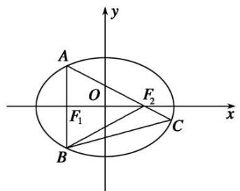

text_image

A
O
F₁
F₂
B
C
x
y

通法 如图所示，因为 $S_{\triangle ABC}=3S\triangle_{BCF2}$ ，所以 $\left|AF_{2}\right|=2\left|F_{2}C\right|$ 。 $A(-c,\frac{b^{2}}{a})$ ，直线 $AF_{2}$ 的方程为： $y-0=\frac{b^{2}}{a}-0(x-c)$ ，化为： $y=\frac{-b^{2}}{2ac}(x-c)$ ，代入椭圆方程 $\frac{x^{2}}{a^{2}}+\frac{y^{2}}{b^{2}}=1(a>b>0)$ ，可得： $(4c^{2}+b^{2})x^{2}-2cb^{2}x+b^{2}c^{2}-4a^{2}c^{2}=0$ ，所以 $x_{C}\cdot(-c)=\frac{b^{2}c^{2}-4a^{2}c^{2}}{4c^{2}+b^{2}}$ ，解得 $x_{C}=\frac{4a^{2}c-b^{2}c}{4c^{2}+b^{2}}$ 。因为 $\overrightarrow{AF_{2}}=2\overrightarrow{F_{2}}C$ ，所以 $c-(-c)=2(\frac{4a^{2}c-b^{2}c}{4c^{2}+b^{2}}-c)$ ，化为： $a^{2}=5c^{2}$ ，解得 $e=\frac{\sqrt{5}}{5}$ 。

# 【对点训练】

21. 已知 $F$ 是椭圆 $\frac{x^2}{a^2} + \frac{y^2}{b^2} = 1 (a > b > 0)$ 的右焦点, $A$ 是椭圆短轴的一个端点, 若 $F$ 为过 $AF$ 的椭圆的弦的三等分点, 则椭圆的离心率为( )

A. $\frac{1}{3}$

B. $\frac{\sqrt{3}}{3}$

C. $\frac{1}{2}$

D. $\frac{\sqrt{3}}{2}$

21. 答案 B 解析 秒杀 由题可知， $|e\cos\theta|=\frac{|2-1|}{|2+1|}$ ，即 $|e\cdot\frac{c}{a}|=\frac{|2-1|}{|2+1|}$ ，所以 $e=\frac{\sqrt{3}}{3}$ ，故选 B.

通法 延长 $AF$ 交椭圆于点 $B$ ，设椭圆左焦点为 $F'$ ，连接 $AF'$ ， $BF'$ 。根据题意 $|AF| = \sqrt{b^2 + c^2} = a$ ， $|AF| = 2|FB|$ ，所以 $|FB| = \frac{a}{2}$ 。根据椭圆定义 $|BF'| + |BF| = 2a$ ，所以 $|BF'| = \frac{3a}{2}$ 。在 $\triangle AFF'$ 中，由余弦定理得 $\cos \angle F'AF = \frac{|F'A|^2 + |FA|^2 - |F'F|^2}{2|F'A|\cdot|FA|} = \frac{2a^2 - 4c^2}{2a^2}$ 。在 $\triangle AF'B$ 中，由余弦定理得 $\cos \angle F'AB = \frac{|F'A|^2 + |AB|^2 - |BF'|^2}{2|F'A|\cdot|AB|} = \frac{1}{3}$ ，所以 $\frac{2a^2 - 4c^2}{2a^2} = \frac{1}{3}$ ，解得 $a = \sqrt{3}c$ ，所以椭圆离心率为 $e = \frac{c}{a} = \frac{\sqrt{3}}{3}$ 。故选 B.

22. 已知 $F_{1}$ , $F_{2}$ 是椭圆 $C: \frac{x^{2}}{a^{2}} + \frac{y^{2}}{b^{2}} = 1 (a > b > 0)$ 的左右焦点, $B$ 是短轴的一个端点, 线段 $BF_{2}$ 的延长线交椭圆 $C$ 于点 $D$ , 若 $\triangle F_{1}BD$ 为等腰三角形, 则椭圆 $C$ 的离心率为 \_\_\_\_.

22. 答案 $\frac{\sqrt{3}}{3}$ 解析 秒杀 如图，不妨设点 $B$ 是椭圆短轴的上端点，则点 $D$ 在第四象限内，设点 $D(x, y)$ 。由题意得 $\triangle F_1BD$ 为等腰三角形，且 $|DF_1| = |DB|$ 。由椭圆的定义得 $|DF_1| + |DF_2| = 2a$ ， $|BF_1| = |BF_2| = a$ ，又 $|DF_1| = |DB| = |DF_2| + |BF_2| = |DF_2| + a$ ， $\therefore (|DF_2| + a) + |DF_2| = 2a$ ，解得 $|DF_2| = \frac{a}{2}$ 。由题可知， $|e\cos \theta| = \frac{|2 - 1|}{|2 + 1|}$ ，即 $|e \cdot \frac{c}{a}| = \frac{|2 - 1|}{|2 + 1|}$ ，所以 $e = \frac{\sqrt{3}}{3}$ 。

通法 如图, 不妨设点 $B$ 是椭圆短轴的上端点, 则点 $D$ 在第四象限内, 设点 $D(x, y)$ . 由题意得 $\triangle F_{1}BD$

为等腰三角形，且 $|DF_{1}|=|DB|$ .

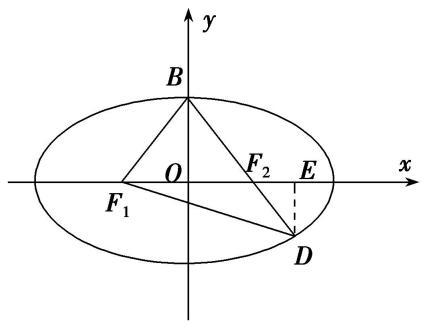

text_image

y
B
O
F₁
F₂
E
x
D

由椭圆的定义得 $|DF_{1}|+|DF_{2}|=2a,\quad|BF_{1}|=|BF_{2}|=a$ ，又 $|DF_{1}|=|DB|=|DF_{2}|+|BF_{2}|=|DF_{2}|+a,\quad\therefore(|DF_{2}|+a)+|DF_{2}|=2a$ ，解得 $|DF_{2}|=\frac{a}{2}$ 。作 $DE\perp x$ 轴于E，则有 $|DE|=|DF_{2}|\sin\angle DF_{2}E=|DF_{2}|\sin\angle BF_{2}O=\frac{a}{2}\times\frac{b}{a}=\frac{b}{2},\quad|F_{2}E|=|DF_{2}|\cos\angle DF_{2}E=|DF_{2}|\cos\angle BF_{2}O=\frac{a}{2}\times\frac{c}{a}=\frac{c}{2},\quad\therefore|OE|=|OF_{2}|+|F_{2}E|=c+\frac{c}{2}=\frac{3c}{2},\quad\therefore$ 点D的坐标为 $\left(\frac{3c}{2},-\frac{b}{2}\right)$ 。又点D在椭圆上， $\therefore\frac{\left(\frac{3c}{2}\right)^{2}}{a^{2}}+\frac{\left(-\frac{b}{2}\right)^{2}}{b^{2}}=1$ ，整理得 $3c^{2}=a^{2}$ ，所以 $e=\frac{c}{a}=\frac{\sqrt{3}}{3}$ 。

