**专题01　五组秒杀公式模型**

**第Ⅰ组秒杀公式**

(1)<em>e</em>椭圆＝＝；

(2)<em>e</em>双曲线＝＝＝＝ (其中<em>α</em>与<em>k</em>为渐近线的倾斜角与斜率)

<strong>[例1]</strong>　(1)已知双曲线<em>C</em>：－＝1(<em>a</em>&gt;0，<em>b</em>&gt;0)的两条渐近线的夹角为60°，则双曲线<em>C</em>的离心率为(　　)

A．　　　　　　　　B．　　　　　　　　C．或　　　　　　　　D．或2

<strong>答案</strong>　D　<strong>解析</strong>　秒杀　∵两条渐近线的夹角为60°，∴一条渐近线的倾斜角为30°，斜率为．∴<em>e</em>＝＝．或一条渐近线的倾斜角为60°，斜率为．∴<em>e</em>＝＝2．故选D．

通法　∵两条渐近线的夹角为60°，且两条渐近线关于坐标轴对称，∴＝tan 30°＝或＝tan 60°＝．由＝，得＝＝<em>e</em>2－1＝，∴<em>e</em>＝(舍负)；由＝，得＝＝<em>e</em>2－1＝3，∴<em>e</em>＝2(舍负)．故选D．

(2)双曲线*E*：－＝1(*a*>0，*b*>0)的渐近线方程为*y*＝±*x*，则*E*的离心率为(　　)

A．2　　　　　　　　B．　　　　　　　　C．2　　　　　　　　D．2

<strong>答案</strong>　C　<strong>解析</strong>　秒杀　∵渐近线的斜率为±．∴<em>e</em>＝＝2．

通法　由题意，双曲线－＝1(*a*>0，*b*>0)的渐近线方程为*y*＝±*x*，即＝，所以双曲线的离心率为*e*＝＝＝＝2，故选．

(3)(2019·全国Ⅰ)双曲线*C*：－＝1(*a*＞0，*b*＞0)的一条渐近线的倾斜角为130°，则*C*的离心率为(　　)

A．2sin 40°　　　　　　　　B．2cos 40°　　　　　　　　C.　　　　　　　　D.

<strong>答案　D　解析</strong>　秒杀　由题意可得－＝tan 130°，所以<em>e</em>＝＝＝＝＝．故选D．

(4)(2017·全国Ⅲ)已知椭圆<em>C</em>：＋＝1(<em>a</em>&gt;<em>b</em>&gt;0)的左、右顶点分别为<em>A</em>1，<em>A</em>2，且以线段<em>A</em>1<em>A</em>2为直径的圆与直线<em>bx</em>－<em>ay</em>＋2<em>ab</em>＝0相切，则<em>C</em>的离心率为(　　)

A．　　　　　　　　B．　　　　　　　　C．　　　　　　　　D．

<strong>答案</strong>　A　<strong>解析</strong>　秒杀　由题意知以<em>A</em>1<em>A</em>2为直径的圆的圆心为(0，0)，半径为<em>a</em>．又直线<em>bx</em>－<em>ay</em>＋2<em>ab</em>＝0与圆相切，∴圆心到直线的距离<em>d</em>＝＝<em>a</em>，解得<em>a</em>＝<em>b</em>，∴＝，∴<em>e</em>＝＝＝．故选A．

(5) (2019·全国Ⅰ)已知双曲线<em>C</em>：－＝1(<em>a</em>&gt;0，<em>b</em>&gt;0)的左，右焦点分别为<em>F</em>1，<em>F</em>2，过<em>F</em>1的直线与<em>C</em>的两条渐近线分别交于<em>A</em>，<em>B</em>两点．若＝，·＝0，则<em>C</em>的离心率为\_\_\_\_\_\_\_\_．

<strong>答案</strong>　2　<strong>解析</strong>　秒杀　由＝，得<em>A</em>为<em>F</em>1<em>B</em>的中点．又∵<em>O</em>为<em>F</em>1<em>F</em>2的中点，∴<em>OA</em>∥<em>BF</em>2．又·＝0，∴∠<em>F</em>1<em>BF</em>2＝90°．∴<em>OF</em>2＝<em>OB</em>，∴∠<em>OBF</em>2＝∠<em>OF</em>2<em>B</em>．又∵∠<em>F</em>1<em>OA</em>＝∠<em>BOF</em>2，∠<em>F</em>1<em>OA</em>＝∠<em>OF</em>2<em>B</em>，∴∠<em>BOF</em>2＝∠<em>OF</em>2<em>B</em>＝∠<em>OBF</em>2，∴△<em>OBF</em>2为等边三角形．∴一条渐近线的倾斜角为60°，斜率为．∴<em>e</em>＝＝2．

通法一：由＝，得<em>A</em>为<em>F</em>1<em>B</em>的中点．又∵<em>O</em>为<em>F</em>1<em>F</em>2的中点，∴<em>OA</em>∥<em>BF</em>2．又·＝0，∴∠<em>F</em>1<em>BF</em>2＝90°．∴<em>OF</em>2＝<em>OB</em>，∴∠<em>OBF</em>2＝∠<em>OF</em>2<em>B</em>．又∵∠<em>F</em>1<em>OA</em>＝∠<em>BOF</em>2，∠<em>F</em>1<em>OA</em>＝∠<em>OF</em>2<em>B</em>，∴∠<em>BOF</em>2＝∠<em>OF</em>2<em>B</em>＝∠<em>OBF</em>2，∴△<em>OBF</em>2为等边三角形．如图所示，不妨设<em>B</em>为．∵点<em>B</em>在直线<em>y</em>＝－<em>x</em>上，∴＝，∴离心率<em>e</em>＝＝2．

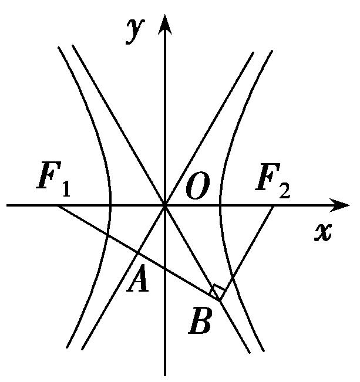

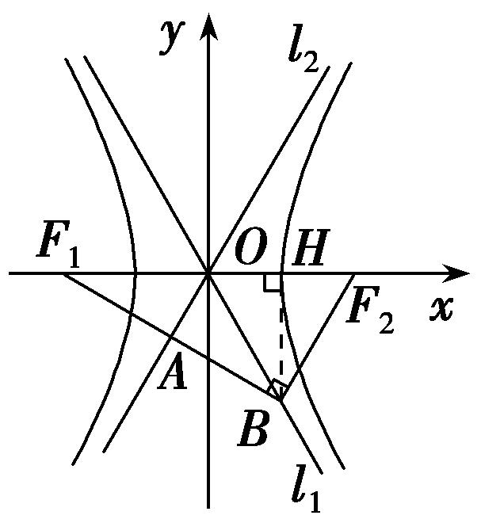

通法二：∵·＝0，∴∠<em>F</em>1<em>BF</em>2＝90°．在Rt△<em>F</em>1<em>BF</em>2中，<em>O</em>为<em>F</em>1<em>F</em>2的中点，∴|<em>OF</em>2|＝|<em>OB</em>|＝<em>c</em>．如图，作<em>BH</em>⊥<em>x</em>轴于<em>H</em>，由<em>l</em>1为双曲线的渐近线，可得＝，且|<em>BH</em>|2＋|<em>OH</em>|2＝|<em>OB</em>|2＝<em>c</em>2，∴|<em>BH</em>|＝<em>b</em>，|<em>OH</em>|＝<em>a</em>，∴<em>B</em>(<em>a</em>，－<em>b</em>)，<em>F</em>2(<em>c</em>，0)．又∵＝，∴<em>A</em>为<em>F</em>1<em>B</em>的中点．∴<em>OA</em>∥<em>F</em>2<em>B</em>，∴＝，∴<em>c</em>＝2<em>a</em>，∴离心率<em>e</em>＝＝2．

**【对点训练】**

1．已知<em>F</em>1，<em>F</em>2分别是双曲线－＝1(<em>a</em>＞0，<em>b</em>＞0)的左、右焦点，过点<em>F</em>1，<em>F</em>2分别作<em>x</em>轴的垂线，交渐

近线于点<em>M</em>，<em>N</em>，且点<em>M</em>，<em>N</em>在<em>x</em>轴的同侧，若四边形<em>MNF</em>2<em>F</em>1为正方形，则该双曲线的离心率为(　　)

A．　　　　　　　　B．　　　　　　　　C．2　　　　　　　　D．

1．<strong>答案</strong>　D　<strong>解析</strong>　秒杀　由题意，∴<em>e</em>＝＝．

通法　不妨设点<em>M</em>，<em>N</em>在<em>x</em>轴的上方，把<em>x</em>＝<em>c</em>代入渐近线的方程<em>y</em>＝<em>x</em>，得<em>y</em>＝．因为四边形<em>MNF</em>2<em>F</em>1为正方形，所以＝2<em>c</em>，所以<em>b</em>＝2<em>a</em>，由此可得<em>c</em>＝<em>a</em>．所以该双曲线的离心率<em>e</em>＝＝．故选D．

2．已知双曲线－＝1(*a*>0，*b*>0)的一条渐近线与直线*x*＋3*y*＋1＝0垂直，则双曲线的离心率等于(　　)

A．　　　　　　　　B．　　　　　　　　C．　　　　　　　　D．

2．<strong>答案</strong>　C　<strong>解析</strong>　秒杀　由于双曲线的一条渐近线与直线<em>x</em>＋3<em>y</em>＋1＝0垂直，则双曲线的渐近线方程为

*y*＝±3*x*，∴*e*＝＝．

通法　由于双曲线的一条渐近线与直线<em>x</em>＋3<em>y</em>＋1＝0垂直，则双曲线的渐近线方程为<em>y</em>＝±3<em>x</em>，可得＝3，可得<em>b</em>2＝9<em>a</em>2，即<em>c</em>2－<em>a</em>2＝9<em>a</em>2，亦即<em>c</em>2＝10<em>a</em>2，故离心率为<em>e</em>＝＝．

3．已知*F*为双曲线*C*：－＝1(*a*>0，*b*>0)的一个焦点，其关于双曲线*C*的一条渐近线的对称点在另一

条渐近线上，则双曲线*C*的离心率为(　　)

A．　　　　　　　　B．　　　　　　　　C．2　　　　　　　　D．

3．<strong>答案</strong>　C　<strong>解析</strong>　秒杀　依题意，设双曲线的渐近线<em>y</em>＝<em>x</em>的倾斜角为<em>θ</em>，则由双曲线的对称性得3<em>θ</em>＝

π，*θ*＝，∴*e*＝＝2．选C．

通法　依题意，设双曲线的渐近线*y*＝*x*的倾斜角为*θ*，则由双曲线的对称性得3*θ*＝π，*θ*＝，＝tan＝，双曲线*C*的离心率*e*＝＝2，选C．

4．双曲线*C*：－＝1(*a*>0，*b*>0)的一个焦点为*F*，过点*F*作双曲线*C*的一条渐近线的垂线，垂足为*A*，

且交*y*轴于*B*，若*A*为*BF*的中点，则双曲线的离心率为(　　)

A．　　　　　　　　B．　　　　　　　　C．2　　　　　　　　D．

4．<strong>答案</strong>　A　<strong>解析</strong>　秒杀　由题易知双曲线<em>C</em>的一条渐近线与<em>x</em>轴的夹角为，∴<em>e</em>＝＝．故选

A．

通法　由题易知双曲线*C*的一条渐近线与*x*轴的夹角为，故双曲线*C*的离心率*e*＝＝．故选A．

5．(2019·天津)已知抛物线<em>y</em>2＝4<em>x</em>的焦点为<em>F</em>，准线为<em>l</em>．若<em>l</em>与双曲线－＝1(<em>a</em>&gt;0，<em>b</em>&gt;0)的两条渐近线

分别交于点*A*和点*B*，且|*AB*|＝4|*OF*|(*O*为原点)，则双曲线的离心率为(　　)

A．　　　　　　　　B．　　　　　　　　C．2　　　　　　　　D．

5．<strong>答案</strong>　D　<strong>解析</strong>　秒杀　由题设知<em>k</em>＝2，<em>e</em>＝＝．故选D．

通法　由已知易得，抛物线<em>y</em>2＝4<em>x</em>的焦点为<em>F</em>(1,0)，准线<em>l</em>：<em>x</em>＝－1，所以|<em>OF</em>|＝1．又双曲线的两条渐近线的方程为<em>y</em>＝±<em>x</em>，不妨设点<em>A</em>，<em>B</em>，所以|<em>AB</em>|＝＝4|<em>OF</em>|＝4，所以＝2，即<em>b</em>＝2<em>a</em>，所以<em>b</em>2＝4<em>a</em>2．又双曲线方程中<em>c</em>2＝<em>a</em>2＋<em>b</em>2，所以<em>c</em>2＝5<em>a</em>2，所以<em>e</em>＝＝．

6．已知*F*是双曲线*C*：－＝1(*a*>0，*b*>0)的左焦点，过点*F*作垂直于*x*轴的直线交该双曲线的一条渐

近线于点<em>M</em>，若|<em>FM</em>|＝2<em>a</em>，记该双曲线的离心率为<em>e</em>，则<em>e</em>2＝(　　)

A．　　　　　　B．　　　　　　C．　　　　　　D．

6．<strong>答案</strong>　A　<strong>解析</strong>　秒杀　由题意得，,∴<em>e</em>4－<em>e</em>2－4＝0，解得<em>e</em>2＝，故选A．

通法　由题意得，<em>F</em>(－<em>c</em>，0)，该双曲线的一条渐近线为<em>y</em>＝－<em>x</em>，将<em>x</em>＝－<em>c</em>代入<em>y</em>＝－<em>x</em>得<em>y</em>＝，∴＝2<em>a</em>，即<em>bc</em>＝2<em>a</em>2，∴4<em>a</em>4＝<em>b</em>2<em>c</em>2＝<em>c</em>2(<em>c</em>2－<em>a</em>2)，∴<em>e</em>4－<em>e</em>2－4＝0，解得<em>e</em>2＝，故选A．

7．(2017·全国Ⅱ)若双曲线<em>C</em>：－＝1(<em>a</em>&gt;0，<em>b</em>&gt;0)的一条渐近线被圆(<em>x</em>－2)2＋<em>y</em>2＝4所截得的弦长为2，则

*C*的离心率为(　　)

A．2　　　　　　　　B．　　　　　　　　C．　　　　　　　　D．

7．<strong>答案</strong>　A　<strong>解析</strong>　秒杀　设双曲线的一条渐近线方程为<em>y</em>＝<em>x</em>，化成一般式<em>bx</em>－<em>ay</em>＝0，圆心(2，0)到直

线的距离为＝，解得＝，*e*＝＝2．

8．过双曲线 $\frac{x^{2}}{a^{2}}$ － $\frac{y^{2}}{b^{2}}$ =1(*a*>0，*b*>0)的右顶点*A*作斜率为－1的直线，该直线与双曲线的两条渐近线的交点

分别为*B*，*C*，若*A*，*B*，*C*三点的横坐标成等比数列，则双曲线的离心率为(　　)

A． $\sqrt{3}$ 　　　　　　　　B) $\sqrt{5}$ 　　　　　　　　C． $\sqrt{10}$ 　　　　　　　　D． $\sqrt{13}$

8．&lt;te&lt;te&lt;te&lt;te&lt;text style="it<em>a</em>lic"&gt;x&lt;/text&gt;t style="italic"&gt;x&lt;/text&gt;t style="it<em>a</em>lic"&gt;x&lt;/text&gt;t st<em>y</em>le="italic"&gt;x&lt;/text&gt;t st<em>y</em>le="bold"&gt;答案　&lt;/text&gt;C　<strong>解析</strong>　秒杀　双曲线渐近线方程为y＝± $\frac{b}{a}$ &lt;te&lt;te&lt;te&lt;text style="it<em>a</em>lic"&gt;x&lt;/text&gt;t style="italic"&gt;x&lt;/text&gt;t style="it<em>a</em>lic"&gt;x&lt;/text&gt;t st<em>y</em>le="italic"&gt;x&lt;/text&gt;，与直线<em>y</em>＝－(x－a)联立．由－ $\frac{b}{a}$ &lt;te&lt;te&lt;te&lt;text style="it<em>a</em>lic"&gt;x&lt;/text&gt;t style="italic"&gt;x&lt;/text&gt;t style="it<em>a</em>lic"&gt;x&lt;/text&gt;t st<em>y</em>le="italic"&gt;x&lt;/text&gt;＝－x＋a，

得&lt;t<em>e</em>&lt;te&lt;te&lt;text style="it&lt;text style="it&lt;text style="it&lt;text style="it&lt;text style="it&lt;text style="it&lt;text style="it&lt;text style="it&lt;text style="it<em>a</em>lic"&gt;a&lt;/text&gt;lic"&gt;a&lt;/text&gt;lic"&gt;a&lt;/text&gt;lic"&gt;a&lt;/text&gt;lic"&gt;a&lt;/text&gt;lic"&gt;a&lt;/text&gt;lic"&gt;a&lt;/text&gt;lic"&gt;a&lt;/text&gt;lic"&gt;x&lt;/text&gt;t style="it<em>a</em>lic"&gt;x&lt;/text&gt;t style="italic"&gt;x&lt;/text&gt;t style="italic"&gt;x&lt;/text&gt;＝ $\frac{a^{2}}{a-b}$ ，由 $\frac{b}{a}$ &lt;t<em>e</em>&lt;te&lt;te&lt;text style="it&lt;text style="it&lt;text style="it&lt;text style="it&lt;text style="it&lt;text style="it&lt;text style="it&lt;text style="it&lt;text style="it<em>a</em>lic"&gt;a&lt;/text&gt;lic"&gt;a&lt;/text&gt;lic"&gt;a&lt;/text&gt;lic"&gt;a&lt;/text&gt;lic"&gt;a&lt;/text&gt;lic"&gt;a&lt;/text&gt;lic"&gt;a&lt;/text&gt;lic"&gt;a&lt;/text&gt;lic"&gt;x&lt;/text&gt;t style="it<em>a</em>lic"&gt;x&lt;/text&gt;t style="italic"&gt;x&lt;/text&gt;t style="italic"&gt;x&lt;/text&gt;＝－x＋a，得x＝ $\frac{a^{2}}{a+b}$ ．根据题意，若 $\frac{a^{2}}{a-b}$ ·&lt;t<em>e</em>&lt;text style="it&lt;text style="it&lt;text style="it&lt;text style="it&lt;text style="it&lt;text style="it&lt;text style="it&lt;text style="it&lt;text style="it<em>a</em>lic"&gt;a&lt;/text&gt;lic"&gt;a&lt;/text&gt;lic"&gt;a&lt;/text&gt;lic"&gt;a&lt;/text&gt;lic"&gt;a&lt;/text&gt;lic"&gt;a&lt;/text&gt;lic"&gt;a&lt;/text&gt;lic"&gt;a&lt;/text&gt;lic"&gt;x&lt;/text&gt;t style="italic"&gt;a&lt;/text&gt;= $\left(\frac{a^{2}}{a+b}\right)^{2}$ ，得&lt;t<em>e</em>&lt;text style="it&lt;text style="it&lt;text style="it&lt;text style="it&lt;text style="it&lt;text style="it&lt;text style="it&lt;text style="it&lt;text style="it<em>a</em>lic"&gt;a&lt;/text&gt;lic"&gt;a&lt;/text&gt;lic"&gt;a&lt;/text&gt;lic"&gt;a&lt;/text&gt;lic"&gt;a&lt;/text&gt;lic"&gt;a&lt;/text&gt;lic"&gt;a&lt;/text&gt;lic"&gt;a&lt;/text&gt;lic"&gt;x&lt;/text&gt;t style="italic"&gt;a&lt;/text&gt;(a－<em>&lt;text style="italic"&gt;&lt;text style="italic"&gt;&lt;text style="italic"&gt;&lt;text style="italic"&gt;b</em>&lt;/text&gt;&lt;/text&gt;&lt;/text&gt;&lt;/text&gt;)＝(a＋b)&lt;text style="superscript"&gt;2&lt;/text&gt;，此式不可能，若 $\frac{a^{2}}{a+b}$ ·&lt;t<em>e</em>&lt;text style="it&lt;text style="it&lt;text style="it&lt;text style="it&lt;text style="it&lt;text style="it&lt;text style="it&lt;text style="it&lt;text style="it<em>a</em>lic"&gt;a&lt;/text&gt;lic"&gt;a&lt;/text&gt;lic"&gt;a&lt;/text&gt;lic"&gt;a&lt;/text&gt;lic"&gt;a&lt;/text&gt;lic"&gt;a&lt;/text&gt;lic"&gt;a&lt;/text&gt;lic"&gt;a&lt;/text&gt;lic"&gt;x&lt;/text&gt;t style="italic"&gt;a&lt;/text&gt;＝ $\left(\frac{a^{2}}{a-b}\right)^{2}$ ，则&lt;t<em>e</em>&lt;text style="it&lt;text style="it&lt;text style="it&lt;text style="it&lt;text style="it&lt;text style="it&lt;text style="it&lt;text style="it&lt;text style="it<em>a</em>lic"&gt;a&lt;/text&gt;lic"&gt;a&lt;/text&gt;lic"&gt;a&lt;/text&gt;lic"&gt;a&lt;/text&gt;lic"&gt;a&lt;/text&gt;lic"&gt;a&lt;/text&gt;lic"&gt;a&lt;/text&gt;lic"&gt;a&lt;/text&gt;lic"&gt;x&lt;/text&gt;t style="italic"&gt;a&lt;/text&gt;(a＋<em>&lt;text style="italic"&gt;&lt;text style="italic"&gt;&lt;text style="italic"&gt;&lt;text style="italic"&gt;b</em>&lt;/text&gt;&lt;/text&gt;&lt;/text&gt;&lt;/text&gt;)＝(a－b)&lt;text style="superscript"&gt;2&lt;/text&gt;，解得b＝3a．双曲线的离心率e＝＝ $\sqrt{10}$ ．故选C．

9．设<em>F</em>1，<em>F</em>2是双曲线－＝1(<em>a</em>＞0，<em>b</em>＞0)的左，右焦点，<em>O</em>是坐标原点，点<em>P</em>在双曲线<em>C</em>的右支上且

|<em>F</em>1<em>F</em>2|＝2|<em>OP</em>|，△<em>PF</em>1<em>F</em>2的面积为<em>a</em>2，则双曲线的离心率是(　　)

A．　　　　　　　　　B．　　　　　　　　　C．4　　　　　　　　　D．2

9．<strong>答案</strong>　B　<strong>解析</strong>　秒杀　由|<em>F</em>1<em>F</em>2|＝2|<em>OP</em>|可知|<em>OP</em>|＝<em>c</em>，所以△<em>PF</em>1<em>F</em>2为直角三角形，可知<em>a</em>2＝<em>b</em>2．∴

<em>a</em>2＝<em>b</em>2，<em>e</em>＝＝．

通法　由|<em>F</em>1<em>F</em>2|＝2|<em>OP</em>|可知|<em>OP</em>|＝<em>c</em>，所以△<em>PF</em>1<em>F</em>2为直角三角形，且<em>PF</em>1⊥<em>PF</em>2．由<em>S</em>＝<em>a</em>2可知|<em>PF</em>1||<em>PF</em>2|＝2<em>a</em>2，又|<em>PF</em>1|2＋|<em>PF</em>2|2＝|<em>F</em>1<em>F</em>2|2．∴(|<em>PF</em>1|－|<em>PF</em>2|)2＝－2|<em>PF</em>1||<em>PF</em>2|＋|<em>F</em>1<em>F</em>2|2，即4<em>a</em>2＝－4<em>a</em>2＋4<em>c</em>2，∴<em>e</em>2＝＝＝2，又<em>e</em>＞1，∴<em>e</em>＝，故选B．

10．设椭圆<em>C</em>：＋＝1(<em>a</em>&gt;0，<em>b</em>&gt;0)的左、右焦点分别为<em>F</em>1，<em>F</em>2，点<em>E</em>(0，<em>t</em>)(0&lt;<em>t</em>&lt;<em>b</em>)．已知动点<em>P</em>在

椭圆上，且点<em>P</em>，<em>E</em>，<em>F</em>2不共线，若△<em>PEF</em>2的周长的最小值为4<em>b</em>，则椭圆<em>C</em>的离心率为(　　)

A．　　　　　　　　B．　　　　　　　　C．　　　　　　　　D．

10．<strong>答案</strong>　A　<strong>解析</strong>　秒杀　△<em>PEF</em>2的周长为|<em>PE</em>|＋|<em>PF</em>2|＋|<em>EF</em>2|＝|<em>PE</em>|＋2<em>a</em>－|<em>PF</em>1|＋|<em>EF</em>2|＝2<em>a</em>＋|<em>EF</em>2|＋|<em>PE</em>|

－|<em>PF</em>1|≥2<em>a</em>＋|<em>EF</em>2|－|<em>EF</em>1|＝2<em>a</em>＝4<em>b</em>，∴<em>e</em>＝＝＝＝．故选A．

11．已知双曲线－＝1(<em>a</em>＞0，<em>b</em>＞0)的两条渐近线分别为<em>l</em>1，<em>l</em>2，经过右焦点<em>F</em>垂直于<em>l</em>1的直线分别交

<em>l</em>1，<em>l</em>2于<em>A</em>，<em>B</em>两点．若|<em>OA</em>|，|<em>AB</em>|，|<em>OB</em>|成等差数列，且与反向，则该双曲线的离心率为(　　)

A．　　　　　　　　B．　　　　　　　　C．　　　　　　　　D．

11．<strong>答案</strong>　C　<strong>解析</strong>　秒杀　设实轴长为2<em>a</em>，虚轴长为2<em>b</em>，令∠<em>AOF</em>＝<em>α</em>，则由题意知tan <em>α</em>＝，在△<em>AOB</em>

中，∠<em>AOB</em>＝180°－2<em>α</em>，tan∠<em>AOB</em>＝－tan2<em>α</em>＝，∵|<em>OA</em>|，|<em>AB</em>|，|<em>OB</em>|成等差数列，∴设|<em>OA</em>|＝<em>m</em>－<em>d</em>，|<em>AB</em>|＝<em>m</em>，|<em>OB</em>|＝<em>m</em>＋<em>d</em>，∵<em>OA</em>⊥<em>BF</em>，∴(<em>m</em>－<em>d</em>)2＋<em>m</em>2＝(<em>m</em>＋<em>d</em>)2，整理得<em>d</em>＝<em>m</em>，∴－tan2<em>α</em>＝－＝＝＝，解得＝2或＝－(舍去)，<em>e</em>＝＝．

12．已知*F*为双曲线－＝1(*a*＞0，*b*＞0)的右焦点，过原点的直线*l*与双曲线交于*M*，*N*两点，且·

＝0，△*MNF*的面积为*ab*，则该双曲线的离心率为\_\_\_\_\_\_\_\_．

12．<strong>答案　　解析</strong>　秒杀　因为·＝0，所以⊥．设双曲线的左焦点为<em>F</em>′，则由双曲线

的对称性知四边形<em>F</em>′<em>MFN</em>为矩形，则有|<em>MF</em>|＝|<em>NF</em>′|，|<em>MN</em>|＝2<em>c</em>．不妨设点<em>N</em>在双曲线右支上，由双曲线的定义知，|<em>NF</em>′|－|<em>NF</em>|＝2<em>a</em>，所以|<em>MF</em>|－|<em>NF</em>|＝2<em>a</em>．因为<em>S</em>△<em>MNF</em>＝|<em>MF</em>|·|<em>NF</em>|＝<em>ab</em>，所以|<em>MF</em>||<em>NF</em>|＝2<em>ab</em>．在Rt△<em>MNF</em>中，|<em>MF</em>|2＋|<em>NF</em>|2＝|<em>MN</em>|2，即(|<em>MF</em>|－|<em>NF</em>|)2＋2|<em>MF</em>||<em>NF</em>|＝|<em>MN</em>|2，所以(2<em>a</em>)2＋2·2<em>ab</em>＝(2<em>c</em>)2，把<em>c</em>2＝<em>a</em>2＋<em>b</em>2代入，并整理，得＝1，所以<em>e</em>＝＝＝．

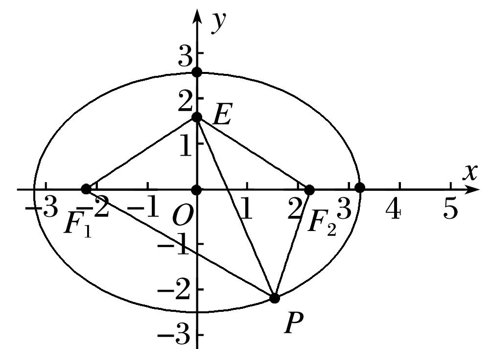

**第Ⅱ组秒杀公式**

(1)<em>e</em>椭圆＝＝＝＝．

(2)<em>e</em>双曲线＝＝＝＝．

<strong>[例2]</strong>　(6)设椭圆<em>C</em>：＋＝1(<em>a</em>&gt;<em>b</em>&gt;0)的左、右焦点分别为<em>F</em>1，<em>F</em>2，<em>P</em>是<em>C</em>上的点，<em>PF</em>2⊥<em>F</em>1<em>F</em>2，∠<em>PF</em>1<em>F</em>2＝30°，则<em>C</em>的离心率为(　　)

A．　　　　　　　　B．　　　　　　　　C．　　　　　　　　D．

<strong>答案</strong>　D　<strong>解析</strong>　秒杀　在Rt△<em>PF</em>2<em>F</em>1中，令|<em>PF</em>2|＝1，∵∠<em>PF</em>1<em>F</em>2＝30°，∴|<em>PF</em>1|＝2，|<em>F</em>1<em>F</em>2|＝．∴<em>e</em>＝＝＝．

通法　如图，在Rt△<em>PF</em>2<em>F</em>1中，∠<em>PF</em>1<em>F</em>2＝30°，|<em>F</em>1<em>F</em>2|＝2<em>c</em>，∴|<em>PF</em>1|＝＝，

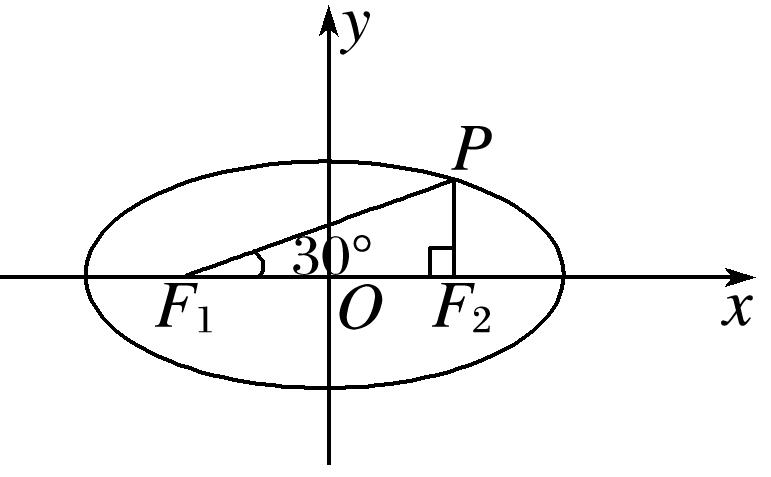

|<em>PF</em>2|＝2<em>c</em>·tan 30°＝．∵|<em>PF</em>1|＋|<em>PF</em>2|＝2<em>a</em>，即＋＝2<em>a</em>，可得<em>c</em>＝<em>a</em>．∴<em>e</em>＝＝．

(7) (2018·全国Ⅱ)已知<em>F</em>1，<em>F</em>2是椭圆<em>C</em>的两个焦点，<em>P</em>是<em>C</em>上的一点，若<em>PF</em>1⊥<em>PF</em>2，且∠<em>PF</em>2<em>F</em>1＝60°，则<em>C</em>的离心率为(　　)

A．1－　　　　　　　B．2－　　　　　　　C．　　　　　　　D．－1

<strong>答案</strong>　D　<strong>解析</strong>　秒杀　<em>e</em>＝＝＝＝＝－1．故选D．

通法　由题设知∠<em>F</em>1<em>PF</em>2＝90°，∠<em>PF</em>2<em>F</em>1＝60°，|<em>F</em>1<em>F</em>2|＝2<em>c</em>，所以|<em>PF</em>2|＝<em>c</em>，|<em>PF</em>1|＝<em>c</em>．由椭圆的定义得|<em>PF</em>1|＋|<em>PF</em>2|＝2<em>a</em>，即<em>c</em>＋<em>c</em>＝2<em>a</em>，所以(＋1)<em>c</em>＝2<em>a</em>，故椭圆<em>C</em>的离心率<em>e</em>＝＝＝－1．故选D．

(8)已知<em>F</em>1，<em>F</em>2分别是双曲线<em>E</em>：－＝1(<em>a</em>＞0，<em>b</em>＞0)的左、右焦点，点<em>M</em>在<em>E</em>上，<em>MF</em>1与<em>x</em>轴垂直，sin∠<em>MF</em>2<em>F</em>1＝，则<em>E</em>的离心率为(　　)

A．　　　　　　　　B．　　　　　　　　C．　　　　　　　　D．2

<strong>答案</strong>　A　<strong>解析</strong>　秒杀　作出示意图，如图，离心率<em>e</em>＝＝＝＝＝＝．故选A．

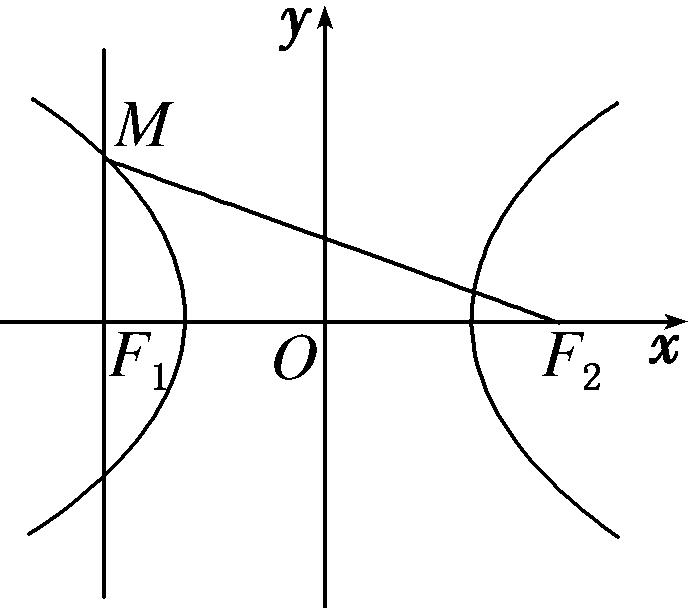

通法　因为<em>MF</em>1与<em>x</em>轴垂直，所以|<em>MF</em>1|＝．又sin∠<em>MF</em>2<em>F</em>1＝，所以＝，即|<em>MF</em>2|＝3|<em>MF</em>1|．由双曲线的定义，得2<em>a</em>＝|<em>MF</em>2|－|<em>MF</em>1|＝2|<em>MF</em>1|＝，所以<em>b</em>2＝<em>a</em>2，所以<em>c</em>2＝<em>b</em>2＋<em>a</em>2＝2<em>a</em>2，所以离心率<em>e</em>＝＝．故选A．

(9)点<em>P</em>是椭圆上任意一点，<em>F</em>1，<em>F</em>2分别是椭圆的左、右焦点，∠<em>F</em>1<em>PF</em>2的最大值是60°，则椭圆的离心率<em>e</em>＝\_\_\_\_\_\_\_\_．

<strong>答案　　解析</strong>　秒杀　<em>e</em>＝＝＝＝

通法　如图所示，当点<em>P</em>与点<em>B</em>重合时，∠<em>F</em>1<em>PF</em>2取得最大值60°，此时|<em>OF</em>1|＝<em>c</em>，|<em>PF</em>1|＝|<em>PF</em>2|＝2<em>c</em>．由椭圆的定义，得|<em>PF</em>1|＋|<em>PF</em>2|＝4<em>c</em>＝2<em>a</em>，所以椭圆的离心率<em>e</em>＝＝．

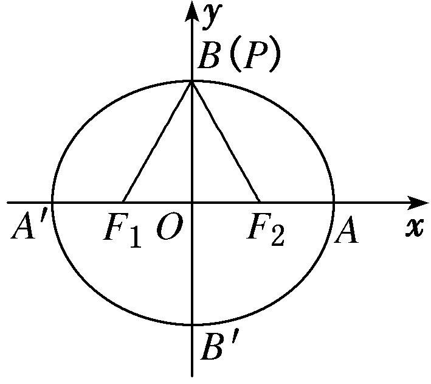

(10)椭圆*C*：＋＝1(*a*＞*b*＞0)的左焦点为*F*，若*F*关于直线*x*＋*y*＝0的对称点*A*是椭圆*C*上的点，则椭圆*C*的离心率为\_\_\_\_\_\_\_\_．

<strong>答案</strong>　－1　<strong>解析</strong>　秒杀　设<em>F</em>′为椭圆的右焦点，则<em>AF</em>⊥<em>AF</em>′，∠<em>AF</em>′<em>F</em>＝，∴|<em>AF</em>|＝|<em>AF</em>′|，|<em>FF</em>′|＝2|<em>AF</em>′|，因此椭圆<em>C</em>的离心率为＝＝＝－1．

(11) (2018·北京)已知椭圆*M*：＋＝1(*a*＞*b*＞0)，双曲线*N*：－＝1．若双曲线*N*的两条渐近线与椭圆*M*的四个交点及椭圆*M*的两个焦点恰为一个正六边形的顶点，则椭圆*M*的离心率为\_\_\_\_\_\_\_\_；双曲线*N*的离心率为\_\_\_\_\_\_\_\_．

<strong>答案</strong>　－1　2　<strong>解析</strong>　秒杀　双曲线<em>N</em>的离心率<em>e</em>1＝＝2．椭圆<em>M</em>的离心率<em>e</em>2＝＝＝－1．

通法一：如图，∵双曲线<em>N</em>的渐近线方程为<em>y</em>＝±<em>x</em>，∴＝tan 60°＝，∴双曲线<em>N</em>的离心率<em>e</em>1满足<em>e</em>＝1＋＝4，∴<em>e</em>1＝2．由得<em>x</em>2＝．设<em>D</em>点的横坐标为<em>x</em>，由正六边形的性质得|<em>ED</em>|＝2<em>x</em>＝<em>c</em>，∴4<em>x</em>2＝<em>c</em>2．∴＝<em>a</em>2－<em>b</em>2，得3<em>a</em>4－6<em>a</em>2<em>b</em>2－<em>b</em>4＝0，∴3－－2＝0，解得＝2－3．∴椭圆<em>M</em>的离心率<em>e</em>＝1－＝4－2．∴<em>e</em>2＝－1．

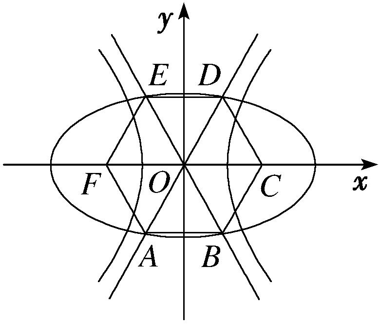

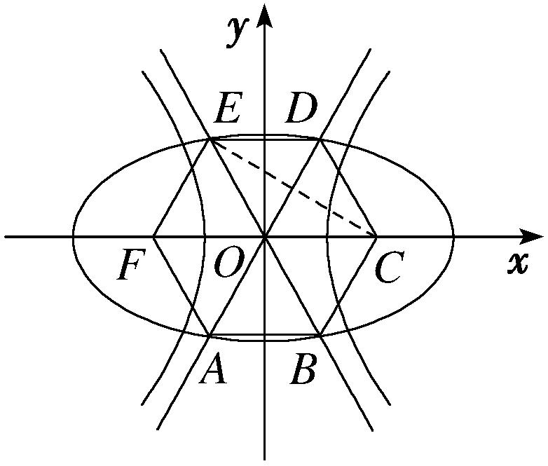

通法二：∵双曲线<em>N</em>的渐近线方程为<em>y</em>＝±<em>x</em>，则＝tan 60°＝．又<em>c</em>1＝＝2<em>m</em>，∴双曲线<em>N</em>的离心率为＝2．如图，连接<em>EC</em>，由题意知，<em>F</em>，<em>C</em>为椭圆<em>M</em>的两焦点，设正六边形边长为1，则|<em>FC</em>|＝2<em>c</em>2＝2，即<em>c</em>2＝1．又<em>E</em>为椭圆<em>M</em>上一点，则|<em>EF</em>|＋|<em>EC</em>|＝2<em>a</em>，即1＋＝2<em>a</em>，<em>a</em>＝．∴椭圆<em>M</em>的离心率为＝＝－1．

(12)如图，<em>F</em>1，<em>F</em>2是椭圆<em>C</em>1与双曲线<em>C</em>2的公共焦点，<em>A</em>，<em>B</em>分别是<em>C</em>1，<em>C</em>2在第二、四象限的交点，若<em>AF</em>1⊥<em>BF</em>1，且∠<em>AF</em>1<em>O</em>＝，则<em>C</em>1与<em>C</em>2的离心率之和为(　　)

A．2　　　　　　　　B．4　　　　　　　　C．2　　　　　　　　D．2

<strong>答案</strong>　A　<strong>解析</strong>　秒杀　连接<em>AF</em>2，椭圆<em>C</em>1的离心率<em>e</em>1＝＝＝－1．双曲线<em>C</em>2的离心率<em>e</em>2＝＝＝＋1．∴<em>e</em>＋<em>e</em>1＝2．

通法　设椭圆方程为＋＝1(<em>a</em>&gt;<em>b</em>&gt;0)，由双曲线和椭圆的对称性可知，<em>A</em>，<em>B</em>关于原点对称，又<em>AF</em>1⊥<em>BF</em>1，且∠<em>AF</em>1<em>O</em>＝，故|<em>AF</em>1|＝|<em>OF</em>1|＝|<em>OA</em>|＝|<em>OB</em>|＝<em>c</em>，∴<em>A</em>，代入椭圆方程＋＝1，结合<em>b</em>2＝<em>a</em>2－<em>c</em>2及<em>e</em>＝，整理可得，<em>e</em>4－8<em>e</em>2＋4＝0，∵0&lt;<em>e</em>&lt;1，∴<em>e</em>2＝4－2＝(－1)2，∴<em>e</em>＝－1．同理可求得双曲线的离心率<em>e</em>1＝＋1，∴<em>e</em>＋<em>e</em>1＝2．

**【对点训练】**

13．设圆锥曲线<em>C</em>的两个焦点分别为<em>F</em>1，<em>F</em>2，若曲线<em>C</em>上存在点<em>P</em>满足|<em>PF</em>1|∶|<em>F</em>1<em>F</em>2|∶|<em>PF</em>2|＝4∶3∶2，则

曲线*C*的离心率等于\_\_\_\_\_\_\_\_．

13．<strong>答案</strong>　或　<strong>解析</strong>　秒杀　不妨设|<em>PF</em>1|＝4<em>t</em>，|<em>F</em>1<em>F</em>2|＝3<em>t</em>，|<em>PF</em>2|＝2<em>t</em>，其中<em>t</em>≠0．若该曲线为椭圆，则有

|<em>PF</em>1|＋|<em>PF</em>2|＝6<em>t</em>＝2<em>a</em>，|<em>F</em>1<em>F</em>2|＝3<em>t</em>＝2<em>c</em>，<em>e</em>＝＝＝＝；若该曲线为双曲线，则有|<em>PF</em>1|－|<em>PF</em>2|＝2<em>t</em>＝2<em>a</em>，|<em>F</em>1<em>F</em>2|＝3<em>t</em>＝2<em>c</em>，<em>e</em>＝＝＝＝．

14．在直角坐标系*xOy*中，设*F*为双曲线*C*：－＝1(*a*>0，*b*>0)的右焦点，*P*为双曲线*C*的右支上一点，

且△*OPF*为正三角形，则双曲线*C*的离心率为(　　)

A．　　　　　　　　B．　　　　　　　　C．1＋　　　　　　　　D．2＋

14．<strong>答案</strong>　C　<strong>解析</strong>　秒杀　设<em>F</em>′为双曲线的左焦点，连接<em>PF</em>′，则∠<em>F PF</em>′＝90°，∠<em>PFF</em>′＝30°，∠<em>PFF</em>′

＝60°，∴*e*＝＝＝＝＋1．故选C．

通法　设<em>F</em>′为双曲线的左焦点，|<em>F</em>′<em>F</em>|＝2<em>c</em>，依题意可得|<em>PO</em>|＝|<em>PF</em>|＝<em>c</em>，连接<em>PF</em>′，由双曲线的定义可得|<em>PF</em>′|－|<em>PF</em>|＝2<em>a</em>，故|<em>PF</em>′|＝2<em>a</em>＋<em>c</em>，在△<em>PF</em>′<em>O</em>中，∠<em>POF</em>′＝120°，由余弦定理可得cos120°＝，化简可得<em>c</em>2－2<em>ac</em>－2<em>a</em>2＝0，即()2－2×－2＝0，解得＝1＋或＝1－(不合题意，舍去)，故双曲线的离心率<em>e</em>＝1＋，故选C．

15．已知等腰梯形*ABCD*中，*AB*∥*CD*，*AB*＝2*CD*＝4，∠*BAD*＝60°，双曲线以*A*，*B*为焦点，且经过*C*，

*D*两点，则该双曲线的离心率等于(　　)

A． $\sqrt{2}$ 　　　　　　　　B． $\sqrt{3}$ 　　　　　　　　C． $\sqrt{5}$ 　　　　　　　　D． $\sqrt{3}$ +1

15．&lt;t<em>e</em>xt style="bold"&gt;答案&lt;/text&gt;　D　<strong>解析</strong>　秒杀　因为<em>AB</em>＝2<em>CD</em>＝4，∠<em>B&lt;text style="italic"&gt;AD</em>&lt;/text&gt;＝60°，所以<em>DB</em>＝2 $\sqrt{3}$ ，&lt;t<em>e</em>xt style="italic"&gt;AD&lt;/text&gt;＝<em>BC</em>＝2，∴e＝＝

＝＝＝＋1．故选C．

通法　因为<t*e*xt style="it<text style="it<text style="itali*c*">a</text>li*c*">a</text>lic">*AB*</text>＝2*CD*＝4，∠*B<text style="italic">AD*</text>＝60°，所以*<text style="italic">DB*</text>＝2 $\sqrt{3}$ ，<t*e*xt style="it<text style="it<text style="itali*c*">a</text>li*c*">a</text>lic">AD</text>＝*BC*＝2，则由双曲线的定义可得2a＝|*<text style="italic">DB*</text>|－|*DA*|＝2 $\sqrt{3}$ －2，2<t*e*xt style="it<text style="itali*c*">a</text>lic">c</text>＝|<text style="it*a*lic">*AB*</text>|＝4，即 $\sqrt{3}$ －1＝<t*e*xt style="it<text style="itali*c*">a</text>li*c*">a</text>，c＝2，故双曲线的离心率是e＝ $\frac{c}{a}$ ＝＝ $\frac{2(\sqrt{3}+1)}{2}$ ＝ $\sqrt{3}$ +1．故选D．

16．已知*F*是椭圆*E*：＋＝1(*a*>*b*>0)的左焦点，经过原点*O*的直线*l*与椭圆*E*交于*P*，*Q*两点，若|*PF*|

＝2|*QF*|，且∠*PFQ*＝120°，则椭圆*E*的离心率为(　　)

A．　　　　　　　　B．　　　　　　　　C．　　　　　　　　D．

16．<strong>答案</strong>　C　<strong>解析</strong>　秒杀　设<em>F</em>1是椭圆<em>E</em>的右焦点，连接<em>PF</em>1，<em>QF</em>1．根据对称性，线段<em>FF</em>1与线段<em>PQ</em>

在点<em>O</em>处互相平分，所以四边形<em>PFQF</em>1是平行四边形，|<em>FQ</em>|＝|<em>PF</em>1|，∠<em>FPF</em>1＝180°－∠<em>PFQ</em>＝60°，又|<em>FP</em>|＝2|<em>PF</em>1|，所以△<em>FPF</em>1是直角三角形，∠<em>FF</em>1<em>P</em>＝90°，∠<em>FPF</em>1＝60°，∠<em>F</em>1<em>FP</em>＝30°，∴<em>e</em>＝＝＝＝＝．故选C．

通法　设<em>F</em>1是椭圆<em>E</em>的右焦点，连接<em>PF</em>1，<em>QF</em>1．根据对称性，线段<em>FF</em>1与线段<em>PQ</em>在点<em>O</em>处互相平分，所以四边形<em>PFQF</em>1是平行四边形，|<em>FQ</em>|＝|<em>PF</em>1|，∠<em>FPF</em>1＝180°－∠<em>PFQ</em>＝60°，根据椭圆的定义，|<em>PF</em>|＋|<em>PF</em>1|＝2<em>a</em>，又|<em>PF</em>|＝2|<em>QF</em>|，所以|<em>PF</em>1|＝<em>a</em>，|<em>PF</em>|＝<em>a</em>，而|<em>F</em>1<em>F</em>|＝2<em>c</em>，在△<em>F</em>1<em>PF</em>中，由余弦定理，得(2<em>c</em>)2＝2＋2－2×<em>a</em>×<em>a</em>×cos60°，得＝，所以椭圆<em>E</em>的离心率<em>e</em>＝＝．故选C．

17．已知双曲线<em>C</em>：－＝1(<em>a</em>&gt;0，<em>b</em>&gt;0)的左、右焦点分别为<em>F</em>1，<em>F</em>2，<em>P</em>为双曲线<em>C</em>上第二象限内一点，

若直线<em>y</em>＝<em>x</em>恰为线段<em>PF</em>2的垂直平分线，则双曲线<em>C</em>的离心率为(　　)

A．　　　　　　　　B．　　　　　　　　C．　　　　　　　　D．

17．<strong>答案</strong>　C　<strong>解析</strong>　秒杀　由已知△<em>F</em>1<em>PF</em>2是直角三角形，∠<em>F</em>2<em>PF</em>1＝90°，sin∠<em>PF</em>1<em>F</em>2＝，∠<em>PF</em>2<em>F</em>1＝，

∴*e*＝＝＝．即＝2，所以*e*＝＝．故选C．

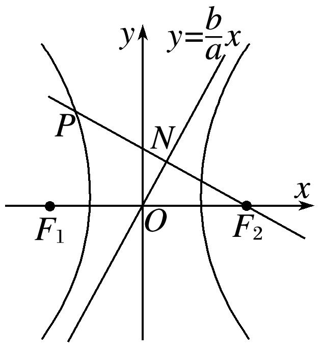

通法　如图，直线<em>PF</em>2的方程为<em>y</em>＝－(<em>x</em>－<em>c</em>)，设直线<em>PF</em>2与直线<em>y</em>＝<em>x</em>的交点为<em>N</em>，易知<em>N</em>．又线段<em>PF</em>2的中点为<em>N</em>，所以<em>P</em>．因为点<em>P</em>在双曲线<em>C</em>上，所以－＝1，即5<em>a</em>2＝<em>c</em>2，所以<em>e</em>＝＝．故选C．

18．椭圆*C*：＋＝1(*a*>*b*>0)的左焦点为*F*，若*F*关于直线*x*＋*y*＝0的对称点*A*是椭圆*C*上的点，则

椭圆*C*的离心率为(　　)

A．　　　　　　　　B．　　　　　　　　C．　　　　　　　　D．－1

18．<strong>答案</strong>　D　<strong>解析</strong>　秒杀　设<em>F</em>1是椭圆<em>C</em>的右焦点，连接<em>AF</em>1，<em>AF</em>．由已知△<em>F</em>1<em>AF</em>是直角三角形，∠

<em>FAF</em>1＝90°，∠<em>AF</em>1<em>F</em>＝60°，∠<em>AFF</em>1＝30°，<em>e</em>＝＝－1．故选D．

通法　设<em>F</em>(－<em>c</em>，0)关于直线<em>x</em>＋<em>y</em>＝0的对称点为<em>A</em>(<em>m</em>，<em>n</em>)，则解得<em>m</em>＝，<em>n</em>＝<em>c</em>，代入椭圆方程可得＋＝1化简可得<em>e</em>4－8<em>e</em>2＋4＝0，又0＜<em>e</em>＜1，解得<em>e</em>＝－1．故选D．

**第Ⅲ组秒杀公式**

(1)若直线<em>y</em>＝<em>kx</em>与椭圆<em>E</em>交于<em>A</em>，<em>B</em>两点，<em>P</em>为椭圆上异于<em>A</em>，<em>B</em>的点，若直线<em>PA</em>，<em>PB</em>的斜率存在，且分别为<em>k</em>1，<em>k</em>2，则<em>k</em>1·<em>k</em>2＝－＝<em>e</em>2－1．

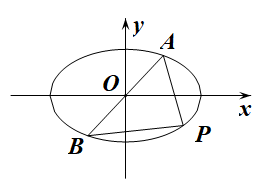

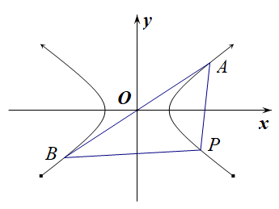

(2)若直线<em>y</em>＝<em>kx</em>与双曲线<em>E</em>交于<em>A</em>，<em>B</em>两点，<em>P</em>为双曲线上异于<em>A</em>，<em>B</em>的点，若直线<em>PA</em>，<em>PB</em>的斜率存在，且分别为<em>k</em>1，<em>k</em>2，则<em>k</em>1·<em>k</em>2＝＝<em>e</em>2－1．

注：当焦点在*y*轴上时*a，b*对调．

**【例题选讲】**

<strong>[例3]</strong>　(13)(2015·全国Ⅱ)已知<em>A</em>，<em>B</em>为双曲线<em>E</em>的左，右顶点，点<em>M</em>在<em>E</em>上，△<em>ABM</em>为等腰三角形，且顶角为120°，则<em>E</em>的离心率为(　　)

A．　　　　　　　　B．2　　　　　　　　C．　　　　　　　　D．

<strong>答案</strong>　D　<strong>解析</strong>　秒杀　∵<em>k</em>1·<em>k</em>2＝<em>e</em>2－1．∴1＝<em>e</em>2－1．∴<em>e</em>＝．故选D．

通法　不妨取点*M*在第一象限，如图所示，设双曲线方程为－＝1(*a*>0，*b*>0)，则|*BM*|＝|*AB*|＝2*a*，∠*MBx*＝180°－120°＝60°，∴*M*点的坐标为．∵*M*点在双曲线上，∴－＝1，*a*＝*b*，∴*c*＝*a*，*e*＝＝．故选D．

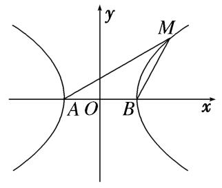

(14)已知椭圆*C*：＋＝1(*a*＞*b*＞0)的右顶点为*A*，过原点*O*的直线*l*与*C*交于点*P*，*Q*，且直线*AP*与直线*AQ*的斜率之积为－，则*C*的离心率是(　　)

A．　　　　　　　　B．　　　　　　　　C．　　　　　　　　D．

<strong>答案</strong>　C　<strong>解析</strong>　秒杀　∵<em>k</em>1·<em>k</em>2＝<em>e</em>2－1．∴－＝<em>e</em>2－1．∴<em>e</em>＝．故选C．

通法　设<em>P</em>(<em>x</em>1，<em>y</em>1)，<em>Q</em>(－<em>x</em>1，－<em>y</em>1)，<em>A</em>(<em>a</em>，0)．所以<em>kAP</em>·<em>kAQ</em>＝·＝，又因为＋＝1⇒<em>y</em>＝，所以<em>kAP</em>·<em>kAQ</em>＝－，即＝，所以椭圆<em>C</em>的离心率<em>e</em>＝＝＝，故选C．

(15)设<em>A</em>1，<em>A</em>2分别为椭圆＋＝1(<em>a</em>＞<em>b</em>＞0)的左、右顶点，若在椭圆上存在点<em>P</em>，使得<em>kPA</em>1·<em>kPA</em>2＞－，则该椭圆的离心率的取值范围是(　　)

A．　　　　　B．　　　　　C．　　　　　D．

<strong>答案</strong>　C　<strong>解析</strong>　秒杀　∵<em>k</em>1·<em>k</em>2＝<em>e</em>2－1．∴<em>e</em>2－1＞－．∴<em>e</em>＞，故选C．

通法　椭圆＋＝1(<em>a</em>＞<em>b</em>＞0)的左、右顶点分别为<em>A</em>1(－<em>a</em>，0)，<em>A</em>2(<em>a</em>，0)，设<em>P</em>(<em>x</em>0，<em>y</em>0)，根据题意，<em>kPA</em>1·<em>kPA</em>2＝＞－，而＋＝1，所以＝－，于是＜，即＜，1－<em>e</em>2＜，所以<em>e</em>＞，又<em>e</em>＜1，故＜<em>e</em>＜1．故选C．

(16)已知<em>O</em>为坐标原点，点<em>A</em>，<em>B</em>在双曲线<em>C</em>：－＝1(<em>a</em>&gt;0，<em>b</em>&gt;0)上，且关于坐标原点<em>O</em>对称．若双曲线<em>C</em>上与点<em>A</em>，<em>B</em>横坐标不相同的任意一点<em>P</em>满足<em>kPA</em>·<em>kPB</em>＝3，则双曲线<em>C</em>的离心率为(　　)

A．2　　　　　　　　B．4　　　　　　　　C．　　　　　　　　D．10

<strong>答案</strong>　A　<strong>解析</strong>　秒杀　∵<em>k</em>1·<em>k</em>2＝<em>e</em>2－1．∴3＝<em>e</em>2－1．∴<em>e</em>＝2．故选A．

通法　设<em>A</em>(<em>x</em>1，<em>y</em>1)，<em>P</em>(<em>x</em>0，<em>y</em>0)(|<em>x</em>0|≠|<em>x</em>1|)，则<em>B</em>(－<em>x</em>1，－<em>y</em>1)，则<em>kPA</em>·<em>kPB</em>＝·＝．因为点<em>P</em>，<em>A</em>在双曲线<em>C</em>上，所以<em>b</em>2<em>x</em>－<em>a</em>2<em>y</em>＝<em>a</em>2<em>b</em>2，<em>b</em>2<em>x</em>－<em>a</em>2<em>y</em>＝<em>a</em>2<em>b</em>2，两式相减可得＝，故＝3，于是<em>b</em>2＝3<em>a</em>2．又因为<em>c</em>2＝<em>a</em>2＋<em>b</em>2，所以双曲线<em>C</em>的离心率<em>e</em>＝＝2．故选A．

(17)已知双曲线－＝1(<em>a</em>＞0，<em>b</em>＞0)，<em>M</em>、<em>N</em>为双曲线上关于原点对称的两点，<em>P</em>为双曲线上的点，且直线<em>PM</em>、<em>PN</em>的斜率分别为<em>k</em>1、<em>k</em>2，若<em>k</em>1·<em>k</em>2＝，则双曲线的离心率为(　　)

A．　　　　　　　　B．　　　　　　　　C．2　　　　　　　　D．

<strong>答案</strong>　B　<strong>解析</strong>　秒杀　∵<em>k</em>1·<em>k</em>2＝<em>e</em>2－1．∴＝<em>e</em>2－1．∴<em>e</em>＝．故选B．

通法　设<em>M</em>(<em>x</em>1，<em>y</em>1)，<em>P</em>(<em>x</em>2，<em>y</em>2)，则<em>N</em>(－<em>x</em>1，－<em>y</em>1)，∴<em>k</em>1·<em>k</em>2＝·＝，由点<em>M</em>、<em>N</em>在双曲线上得－＝1，－＝1，两式相减可得＝，∵<em>k</em>1·<em>k</em>2＝，∴＝，∴<em>b</em>＝<em>a</em>，∴<em>c</em>＝＝<em>a</em>，∴<em>e</em>＝＝．故选B．

**【对点训练】**

19．设<em>A</em>1，<em>A</em>2分别为双曲线<em>C</em>：－＝1(<em>a</em>＞0，<em>b</em>＞0)的上、下顶点，若双曲线上存在点<em>M</em>使得两直线斜

率<em>kMA</em>1·<em>kMA</em>2＜，则双曲线<em>C</em>的离心率<em>e</em>的取值范围为(　　)

A．　　　　　　B．　　　　　　C．　　　　　　D．

19．<strong>答案</strong>　B　<strong>解析</strong>　秒杀　<em>k</em>1·<em>k</em>2＝<em>e</em>2－1．∴<em>e</em>2－1＜，解得1＜<em>e</em>＜．故选B．

通法　设<em>M</em>(<em>x</em>0，<em>y</em>0)，<em>A</em>1(0，－<em>a</em>)，<em>A</em>2(0，<em>a</em>)，则<em>kM A</em>1＝，<em>kM A</em>2＝，所以<em>kM A</em>1·<em>kM A</em>2＝＞2　(\*)．又点<em>M</em>(<em>x</em>0，<em>y</em>0)在双曲线－＝1上，所以<em>y</em>＝<em>a</em>2，代入(\*)式化简得＞2，所以＜，所以＝<em>e</em>2－1＜，解得1＜<em>e</em>＜．故选B．

20．已知*A*，*B*是椭圆*C*上关于原点对称的两点，若椭圆*C*上存在点*P*，使得直线*PA*，*PB*斜率的绝对值

之和为1，则椭圆*C*的离心率的取值范围是\_\_\_\_\_\_\_\_．

20．<strong>答案　　解析</strong>　秒杀　<em>k</em>1＋<em>k</em>2＝1，<em>k</em>1·<em>k</em>2＝<em>e</em>2－1．由基本不等式得，1＝<em>k</em>1＋<em>k</em>2≥2＝，

解得≤*e*<1．

通法　不妨设椭圆<em>C</em>的方程为＋＝1(<em>a</em>&gt;<em>b</em>&gt;0)，<em>P</em>(<em>x</em>，<em>y</em>)，<em>A</em>(<em>x</em>1，<em>y</em>1)，则<em>B</em>，所以＋＝1，＋＝1，两式相减得＝－，所以＝－，所以直线<em>PA</em>，<em>PB</em>斜率的绝对值之和为＋≥2＝，由题意得≤1，所以<em>a</em>2≥4<em>b</em>2＝4<em>a</em>2－4<em>c</em>2，即3<em>a</em>2≤4<em>c</em>2，所以<em>e</em>2≥，又因为0&lt;<em>e</em>&lt;1，所以≤<em>e</em>&lt;1．

**第Ⅳ组秒杀公式**

(1)若直线<em>y</em>＝<em>kx</em>＋<em>m</em>(<em>k</em>≠0且<em>m</em>≠0)与椭圆<em>E</em>交于<em>A</em>，<em>B</em>两点，<em>P</em>为弦<em>AB</em>的中点，设直线<em>PO</em>的斜率为<em>k</em>0，则<em>k</em>0·<em>k</em>＝－＝<em>e</em>2－1．

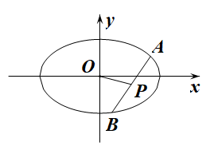

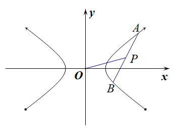

(2)若直线<em>y</em>＝<em>kx</em>＋<em>m</em>(<em>k</em>≠0且<em>m</em>≠0)与双曲线<em>E</em>交于<em>A</em>，<em>B</em>两点，<em>P</em>为弦<em>AB</em>的中点，设直线<em>PO</em>的斜率为<em>k</em>0，则<em>k</em>0·<em>k</em>＝＝<em>e</em>2－1．

注：当焦点在*y*轴上时*a，b*对调．

**【例题选讲】**

<strong>[例4]</strong>　(18)过点<em>M</em>(1，1)作斜率为－的直线<em>l</em>与椭圆<em>C</em>：＋＝1(<em>a</em>＞<em>b</em>＞0) 相交于<em>A</em>，<em>B</em>两点，若<em>M</em>是线段<em>AB</em>的中点，则椭圆<em>C</em>的离心率为\_\_\_\_\_\_\_\_．

<strong>答案　　解析</strong>　秒杀　由题意得，<em>k</em>0·<em>k</em>＝<em>e</em>2－1．∴<em>e</em>＝．

通法　设<em>A</em>(<em>x</em>1，<em>y</em>1)，<em>B</em>(<em>x</em>2，<em>y</em>2)，由题意得，∴<em>b</em>2(<em>x</em>1＋<em>x</em>2)(<em>x</em>1－<em>x</em>2)＋<em>a</em>2(<em>y</em>1＋<em>y</em>2)(<em>y</em>1－<em>y</em>2)＝0，∴2<em>b</em>2(<em>x</em>1－<em>x</em>2)＋2<em>a</em>2(<em>y</em>1－<em>y</em>2)＝0，∴<em>b</em>2(<em>x</em>1－<em>x</em>2)＝－<em>a</em>2(<em>y</em>1－<em>y</em>2)．∴＝－＝，∴<em>a</em>2＝3<em>b</em>2．∴<em>a</em>2＝3(<em>a</em>2－<em>c</em>2)，∴2<em>a</em>2＝3<em>c</em>2，∴<em>e</em>＝．

(19)已知椭圆＋＝1(*a*>*b*>0)，点*F*为左焦点，点*P*为下顶点，平行于*FP*的直线*l*交椭圆于*A*，*B*两点，且*AB*的中点为*M*(1，)，则椭圆的离心率为(　　)

A．　　　　　　　　B．　　　　　　　　C．　　　　　　　　D．

<strong>答案</strong>　B　<strong>解析</strong>　秒杀　由题意得，<em>k</em>0·<em>k</em>＝<em>e</em>2－1．即，∴<em>e</em>＝．故选B．

通法　因为<em>FP</em>的斜率为－，<em>FP</em>∥<em>l</em>，所以直线l的斜率为－．设<em>A</em>(<em>x</em>1，<em>y</em>1)，<em>B</em>(<em>x</em>2，<em>y</em>2)，由得－＝－(－)，即＝－．因为<em>AB</em>的中点为<em>M</em>(1，)，所以－＝－，所以<em>a</em>2＝2<em>bc</em>，所以<em>b</em>2＋<em>c</em>2＝2<em>bc</em>，所以<em>b</em>＝<em>c</em>，所以<em>a</em>＝<em>c</em>，所以椭圆的离心率为，故选B．

(20)已知椭圆＋＝1(*a*＞*b*＞0)的一条弦所在的直线方程是*x*－*y*＋5＝0，弦的中点坐标是*M*(－4，1)，则椭圆的离心率是(　　)

A．　　　　　　　　B．　　　　　　　　C．　　　　　　　D．

<strong>答案</strong>　C　<strong>解析</strong>　秒杀　由题意得，<em>k</em>0·<em>k</em>＝<em>e</em>2－1．∴<em>e</em>＝．故选C．

通法一　设直线与椭圆的交点为<em>A</em>(<em>x</em>1，<em>y</em>1)，<em>B</em>(<em>x</em>2，<em>y</em>2)，分别代入椭圆方程，得两式相减得＝－·.因为<em>kAB</em>＝＝1，且<em>x</em>1＋<em>x</em>2＝－8，<em>y</em>1＋<em>y</em>2＝2，所以＝，<em>e</em>＝＝＝，故选C．

通法二　将直线方程<em>x</em>－<em>y</em>＋5＝0代入＋＝1(<em>a</em>&gt;<em>b</em>&gt;0)，得(<em>a</em>2＋<em>b</em>2)<em>x</em>2＋10<em>a</em>2<em>x</em>＋25<em>a</em>2－<em>a</em>2<em>b</em>2＝0，设直线与椭圆的交点为<em>A</em>(<em>x</em>1，<em>y</em>1)，<em>B</em>(<em>x</em>2，<em>y</em>2)，则<em>x</em>1＋<em>x</em>2＝－，又由中点坐标公式知<em>x</em>1＋<em>x</em>2＝－8，所以＝8，解得<em>a</em>＝2<em>b</em>，又<em>c</em>＝＝<em>b</em>，所以<em>e</em>＝＝．故选C．

(21)已知双曲线*C*：－＝1(*a*>0，*b*>0)，过点*P*(3，6)的直线*l*与*C*相交于*A*，*B*两点，且*AB*的中点为*N*(12，15)，则双曲线*C*的离心率为(　　)

A．2　　　　　　　　B．　　　　　　　　C．　　　　　　　　D．

<strong>答案</strong>　B　<strong>解析</strong>　秒杀　由题意得，<em>k</em>0·<em>k</em>＝<em>e</em>2－1．∴<em>e</em>＝．故选B．

通法　设<em>A</em>(<em>x</em>1，<em>y</em>1)，<em>B</em>(<em>x</em>2，<em>y</em>2)，由<em>AB</em>的中点为<em>N</em>(12,15)，则<em>x</em>1＋<em>x</em>2＝24，<em>y</em>1＋<em>y</em>2＝30，由两式相减得，＝，则＝＝，由直线<em>AB</em>的斜率<em>k</em>＝＝1，所以＝1，则＝，双曲线的离心率<em>e</em>＝＝ ＝，所以双曲线<em>C</em>的离心率为．故选B．

**第Ⅴ组秒杀公式**

过椭圆或双曲线的焦点*F*作倾斜角为*θ*直线与椭圆或双曲线相交*A*、*B*两点，且＝*λ*，则有．(其中*θ*为直线的倾斜角，*F*在线段*AB*上)

<strong>[例5]</strong>　(22)倾斜角为的直线经过椭圆＋＝1(<em>a</em>&gt;<em>b</em>&gt;0)的右焦点<em>F</em>，与椭圆交于<em>A</em>、<em>B</em>两点，且＝2，则该椭圆的离心率为(　　)

A．　　　　　　　　B．　　　　　　　　C． 　　　　　　　　D．

<strong>答案</strong>　B　<strong>解析</strong>　秒杀　由题可知，，所以<em>e</em>＝，故选B．

通法　由题可知，直线的方程为<em>y</em>＝<em>x</em>－<em>c</em>，与椭圆方程联立得，所以(<em>b</em>2＋<em>a</em>2)<em>y</em>2＋2<em>b</em>2<em>cy</em>－<em>b</em>4＝0，由于直线过椭圆的右焦点，故必与椭圆有两个交点，则<em>Δ</em>&gt;0．设<em>A</em>(<em>x</em>1，<em>y</em>1)，<em>B</em>(<em>x</em>2，<em>y</em>2)，则，又＝2，所以(<em>c</em>－<em>x</em>1，－<em>y</em>1)＝2(<em>x</em>2－<em>c</em>，<em>y</em>2)，所以－<em>y</em>1＝2<em>y</em>2，可得，所以＝，所以<em>e</em>＝，故选B．

(23)已知*F*是椭圆＋＝1(*a*>*b*>0)的右焦点，*A*是椭圆短轴的一个端点，若*F*为过*AF*的椭圆的弦的三等分点，则椭圆的离心率为(　　)

A．　　　　　　　　B．　　　　　　　　C．　　　　　　　　D．

<strong>答案</strong>　B　<strong>解析</strong>　秒杀　由题可知，，即，所以<em>e</em>＝，故选B．

通法　延长*AF*交椭圆于点*B*，设椭圆左焦点为*F*′，连接*AF*′，*BF*′．根据题意|*AF*|＝＝*a*，|*AF*|＝2|*FB*|，所以|*FB*|＝．根据椭圆定义|*BF*′|＋|*BF*|＝2*a*，所以|*BF*′|＝．在△*AFF*′中，由余弦定理得cos∠*F*′*AF*＝＝．在△*AF*′*B*中，由余弦定理得cos∠*F*′*AB*＝＝，所以＝，解得*a*＝*c*，所以椭圆离心率为*e*＝＝．故选B．

(24)已知双曲线－＝1(*a*>0，*b*>0)的右焦点为*F*，直线*l*经过点*F*且与双曲线的一条渐近线垂直，直线*l*与双曲线的右支交于不同两点*A*，*B*，若＝3，则该双曲线的离心率为(　　)

A． 　　　　　　　　B．　　　　　　　　C．　　　　　　　　D．

<strong>答案</strong>　A　<strong>解析</strong>　秒杀　由题可知，，即，即所以<em>e</em>＝＝，故选B．

通法　由题意得直线<em>l</em>的方程为<em>x</em>＝<em>y</em>＋<em>c</em>，不妨取<em>a</em>＝1，则<em>x</em>＝<em>by</em>＋<em>c</em>，且<em>b</em>2＝<em>c</em>2－1．将<em>x</em>＝<em>by</em>＋<em>c</em>代入<em>x</em>2－＝1，(<em>b</em>＞0)，得(<em>b</em>4－1)<em>y</em>2＋2<em>b</em>3<em>cy</em>＋<em>b</em>4＝0．设<em>A</em>(<em>x</em>1，<em>y</em>1)，<em>B</em>(<em>x</em>2，<em>y</em>2)，则<em>y</em>1＋<em>y</em>2＝－，<em>y</em>1<em>y</em>2＝．由＝3，得<em>y</em>1＝－3<em>y</em>2，所以，得3<em>b</em>2<em>c</em>2＝1－<em>b</em>4，解得<em>b</em>2＝，所以<em>c</em>＝＝＝，故该双曲线的离心率为<em>e</em>＝＝，故选A．

(25)设<em>F</em>1，<em>F</em>2分别是椭圆<em>E</em>：＋＝1(<em>a</em>&gt;<em>b</em>&gt;0)的左、右焦点，过点<em>F</em>1的直线交椭圆<em>E</em>于<em>A</em>，<em>B</em>两点，若△<em>AF</em>1<em>F</em>2的面积是△<em>BF</em>1<em>F</em>2面积的三倍，cos∠<em>AF</em>2<em>B</em>＝，则椭圆<em>E</em>的离心率为(　　)

A．　　　　　　　　B． 　　　　　　　　C． 　　　　　　　　D．

答案　D　解析　秒杀　设|<em>F</em>1<em>B</em>|＝<em>k</em>，依题意可得|<em>AF</em>1|＝3<em>k</em>，|<em>AB</em>|＝4<em>k</em>，∴|<em>AF</em>2|＝2<em>a</em>－3<em>k</em>，|<em>BF</em>2|＝2<em>a</em>－<em>k</em>．∵cos∠<em>AF</em>2<em>B</em>＝，在△<em>ABF</em>2中，由余弦定理可得|<em>AB</em>|2＝|<em>AF</em>2|2＋|<em>BF</em>2|2－2|<em>AF</em>2||<em>BF</em>2|cos∠<em>AF</em>2<em>B</em>，∴(4<em>k</em>)2＝(2<em>a</em>－3<em>k</em>)2＋(2<em>a</em>－<em>k</em>)2－(2<em>a</em>－3<em>k</em>)(2<em>a</em>－<em>k</em>)，化简可得(<em>a</em>＋<em>k</em>)(<em>a</em>－3<em>k</em>)＝0，而<em>a</em>＋<em>k</em>&gt;0，故<em>a</em>－3<em>k</em>＝0，<em>a</em>＝3<em>k</em>，∴|<em>AF</em>2|＝|<em>AF</em>1|＝3<em>k</em>，|<em>BF</em>2|＝5<em>k</em>，，即，所以<em>e</em>＝，故选D．

通法　设|<em>F</em>1<em>B</em>|＝<em>k</em>，依题意可得|<em>AF</em>1|＝3<em>k</em>，|<em>AB</em>|＝4<em>k</em>，∴|<em>AF</em>2|＝2<em>a</em>－3<em>k</em>，|<em>BF</em>2|＝2<em>a</em>－<em>k</em>．∵cos∠<em>AF</em>2<em>B</em>＝，在△<em>ABF</em>2中，由余弦定理可得|<em>AB</em>|2＝|<em>AF</em>2|2＋|<em>BF</em>2|2－2|<em>AF</em>2||<em>BF</em>2|cos∠<em>AF</em>2<em>B</em>，∴(4<em>k</em>)2＝(2<em>a</em>－3<em>k</em>)2＋(2<em>a</em>－<em>k</em>)2－(2<em>a</em>－3<em>k</em>)(2<em>a</em>－<em>k</em>)，化简可得(<em>a</em>＋<em>k</em>)(<em>a</em>－3<em>k</em>)＝0，而<em>a</em>＋<em>k</em>&gt;0，故<em>a</em>－3<em>k</em>＝0，<em>a</em>＝3<em>k</em>，∴|<em>AF</em>2|＝|<em>AF</em>1|＝3<em>k</em>，|<em>BF</em>2|＝5<em>k</em>，∴|<em>BF</em>2|2＝|<em>AF</em>2|2＋|<em>AB</em>|2，∴<em>AF</em>1⊥<em>AF</em>2，∴△<em>AF</em>1<em>F</em>2是等腰直角三角形．∴<em>c</em>＝<em>a</em>，椭圆的离心率<em>e</em>＝＝．

(26)已知椭圆＋＝1(<em>a</em>&gt;<em>b</em>&gt;0)的左、右焦点分别为<em>F</em>1，<em>F</em>2，过<em>F</em>1且与<em>x</em>轴垂直的直线交椭圆于<em>A</em>，<em>B</em>两点，直线<em>AF</em>2与椭圆的另一个交点为点<em>C</em>，若<em>S</em>△<em>ABC</em>＝3<em>S</em>△<em>BCF</em>2，则椭圆的离心率为<u>　　　</u>．

<strong>答案　　解析</strong>　秒杀　如图所示，因为<em>S</em>△<em>ABC</em>＝3<em>S</em>△<em>BCF</em>2，所以|<em>AF</em>2|＝2|<em>F</em>2<em>C</em>|．tan∠<em>F</em>1<em>F</em>2<em>A</em>＝，则cos2∠<em>F</em>1<em>F</em>2<em>A</em>＝．，即，化为：<em>a</em>2＝5<em>c</em>2，解得<em>e</em>＝．

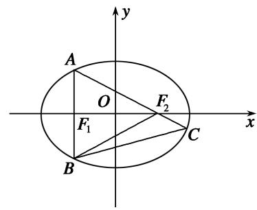

通法　如图所示，因为<em>S</em>△<em>ABC</em>＝3<em>S</em>△<em>BCF</em>2，所以|<em>AF</em>2|＝2|<em>F</em>2<em>C</em>|．<em>A</em>(－<em>c</em>，)，直线<em>AF</em>2的方程为：<em>y</em>－0＝(<em>x</em>－<em>c</em>)，化为：<em>y</em>＝(<em>x</em>－<em>c</em>)，代入椭圆方程＋＝1(<em>a</em>&gt;<em>b</em>&gt;0)，可得：(4<em>c</em>2＋<em>b</em>2)<em>x</em>2－2<em>cb</em>2<em>x</em>＋<em>b</em>2<em>c</em>2－4<em>a</em>2<em>c</em>2＝0，所以<em>xC</em>·(－<em>c</em>)＝，解得<em>xC</em>＝．因为＝2，所以<em>c</em>－(－<em>c</em>)＝2(－<em>c</em>)，化为：<em>a</em>2＝5<em>c</em>2，解得<em>e</em>＝．

**【对点训练】**

21．已知*F*是椭圆＋＝1(*a*>*b*>0)的右焦点，*A*是椭圆短轴的一个端点，若*F*为过*AF*的椭圆的弦的三等

分点，则椭圆的离心率为(　　)

A．　　　　　　　　B．　　　　　　　　C．　　　　　　　　D．

21．<strong>答案</strong>　B　<strong>解析</strong>　秒杀　由题可知，，即，所以<em>e</em>＝，故选B．

通法　延长*AF*交椭圆于点*B*，设椭圆左焦点为*F*′，连接*AF*′，*BF*′．根据题意|*AF*|＝＝*a*，|*AF*|＝2|*FB*|，所以|*FB*|＝．根据椭圆定义|*BF*′|＋|*BF*|＝2*a*，所以|*BF*′|＝．在△*AFF*′中，由余弦定理得cos∠*F*′*AF*＝＝．在△*AF*′*B*中，由余弦定理得cos∠*F*′*AB*＝＝，所以＝，解得*a*＝*c*，所以椭圆离心率为*e*＝＝．故选B．

22．已知<em>F</em>1，<em>F</em>2是椭圆<em>C</em>：＋＝1(<em>a</em>&gt;<em>b</em>&gt;0)的左右焦点，<em>B</em>是短轴的一个端点，线段<em>BF</em>2的延长线交椭

圆<em>C</em>于点<em>D</em>，若△<em>F</em>1<em>BD</em>为等腰三角形，则椭圆<em>C</em>的离心率为\_\_\_\_\_\_\_\_．

22．<strong>答案　　解析</strong>　秒杀　如图，不妨设点<em>B</em>是椭圆短轴的上端点，则点<em>D</em>在第四象限内，设点<em>D</em>(<em>x</em>，

<em>y</em>)．由题意得△<em>F</em>1<em>BD</em>为等腰三角形，且|<em>DF</em>1|＝|<em>DB</em>|．由椭圆的定义得|<em>DF</em>1|＋|<em>DF</em>2|＝2<em>a</em>，|<em>BF</em>1|＝|<em>BF</em>2|＝<em>a</em>，又|<em>DF</em>1|＝|<em>DB</em>|＝|<em>DF</em>2|＋|<em>BF</em>2|＝|<em>DF</em>2|＋<em>a</em>，∴(|<em>DF</em>2|＋<em>a</em>)＋|<em>DF</em>2|＝2<em>a</em>，解得|<em>DF</em>2|＝．由题可知，，即，所以<em>e</em>＝．

通法　如图，不妨设点<em>B</em>是椭圆短轴的上端点，则点<em>D</em>在第四象限内，设点<em>D</em>(<em>x</em>，<em>y</em>)．由题意得△<em>F</em>1<em>BD</em>为等腰三角形，且|<em>DF</em>1|＝|<em>DB</em>|．

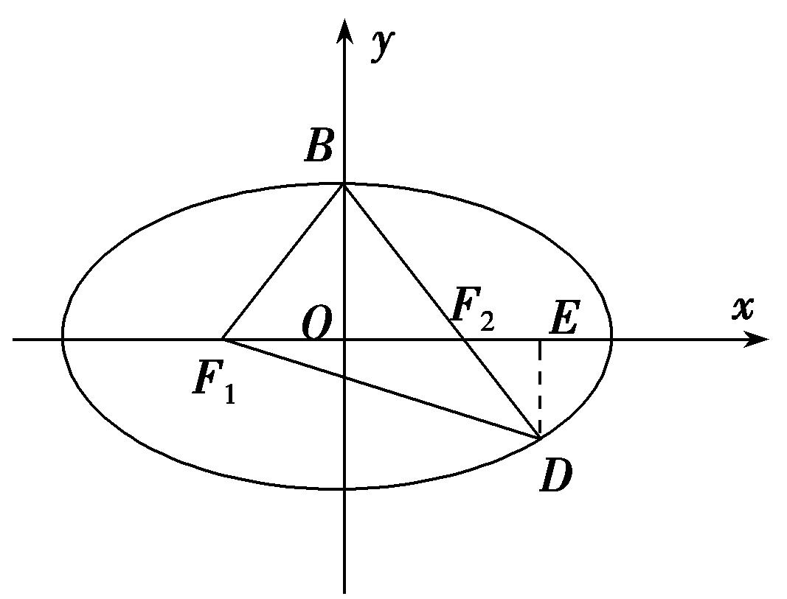

由椭圆的定义得|<em>DF</em>1|＋|<em>DF</em>2|＝2<em>a</em>，|<em>BF</em>1|＝|<em>BF</em>2|＝<em>a</em>，又|<em>DF</em>1|＝|<em>DB</em>|＝|<em>DF</em>2|＋|<em>BF</em>2|＝|<em>DF</em>2|＋<em>a</em>，∴(|<em>DF</em>2|＋<em>a</em>)＋|<em>DF</em>2|＝2<em>a</em>，解得|<em>DF</em>2|＝．作<em>DE</em>⊥<em>x</em>轴于<em>E</em>，则有|<em>DE</em>|＝|<em>DF</em>2|sin∠<em>DF</em>2<em>E</em>＝|<em>DF</em>2|sin∠<em>BF</em>2<em>O</em>＝×＝，|<em>F</em>2<em>E</em>|＝|<em>DF</em>2|cos∠<em>DF</em>2<em>E</em>＝|<em>DF</em>2|cos∠<em>BF</em>2<em>O</em>＝×＝，∴|<em>OE</em>|＝|<em>OF</em>2|＋|<em>F</em>2<em>E</em>|＝<em>c</em>＋＝，∴点<em>D</em>的坐标为．又点<em>D</em>在椭圆上，∴＋＝1，整理得3<em>c</em>2＝<em>a</em>2，所以<em>e</em>＝＝．

