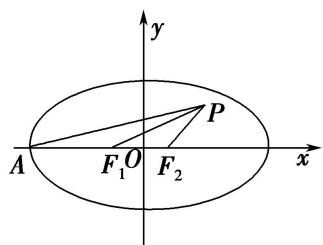
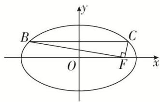

# 专题 02 建立 $f(a, b, c)=0$ 模型

1. $f(a, b, c) = 0$ 型(明显)

所谓明显型就是题目中有明显的等量关系，在计算离心率的大小时，根据题目中的条件，建立 $a, b, c$ 之间的齐次等量关系 $f(a, b, c) = 0$ ，再化归为关于离心率 $e$ 的方程求解.

# 【例题选讲】

[例 6] (27)(2016·全国I)直线 l 经过椭圆的一个顶点和一个焦点，若椭圆中心到 l 的距离为其短轴长的 $\frac{1}{4}$ ，则该椭圆的离心率为()

A. $\frac{1}{3}$

B. $\frac{1}{2}$

C. $\frac{2}{3}$

D. $\frac{3}{4}$

(28)(2018·全国II)已知 $F_{1}$ , $F_{2}$ 是椭圆 $C: \frac{x^{2}}{a^{2}} + \frac{y^{2}}{b^{2}} = 1 (a > b > 0)$ 的左、右焦点, $A$ 是 $C$ 的左顶点, 点 $P$ 在过 $A$ 且斜率为 $\frac{\sqrt{3}}{6}$ 的直线上, $\triangle PF_{1}F_{2}$ 为等腰三角形, $\angle F_{1}F_{2}P = 120^{\circ}$ , 则 $C$ 的离心率为( )

A. $\frac{2}{3}$

B. $\frac{1}{2}$

C. $\frac{1}{3}$

D. $\frac{1}{4}$

text_image

y
P
A F₁ O F₂ x

(29)已知双曲线 $\Gamma: \frac{x^2}{a^2} - \frac{y^2}{b^2} = 1 (a > 0, b > 0)$ ，过双曲线 $\Gamma$ 的右焦点 $F$ ，且倾斜角为 $\frac{\pi}{2}$ 的直线 $l$ 与双曲线 $\Gamma$ 交于 $A, B$ 两点， $O$ 是坐标原点，若 $\angle AOB = \angle OAB$ ，则双曲线 $\Gamma$ 的离心率为（）

A. $\frac{\sqrt{3}+\sqrt{7}}{2}$

B. $\frac{\sqrt{11} + \sqrt{33}}{2}$

C. $\frac{\sqrt{3}+\sqrt{39}}{6}$

D. $\frac{1 + \sqrt{17}}{4}$

(30) (2016·江苏)如图，在平面直角坐标系 $xOy$ 中， $F$ 是椭圆 $\frac{x^2}{a^2} + \frac{y^2}{b^2} = 1 (a > b > 0)$ 的右焦点，直线 $y = \frac{b}{2}$ 与椭圆交于 $B$ ， $C$ 两点，且 $\angle BFC = 90^\circ$ ，则该椭圆的离心率是 \_\_\_\_.

text_image

B
O
F
C
x
y

(31)已知 $F$ 为双曲线 $C: \frac{x^2}{a^2} - \frac{y^2}{b^2} = 1 (a > 0, b > 0)$ 的左焦点，直线 $l$ 经过点 $F$ ，若点 $A(a, 0)$ ， $B(0, b)$ 关于直线 $l$ 对称，则双曲线 $C$ 的离心率为（）

A. $\frac{\sqrt{3} + 1}{2}$

B. $\frac{\sqrt{2} + 1}{2}$

C. $\sqrt{3}+1$

D. $\sqrt{2} + 1$

(32)椭圆 $\frac{x^2}{a^2} +\frac{y^2}{b^2} = 1(a > b > 0)$ ， $F_{1}$ ， $F_{2}$ 为椭圆的左、右焦点， $O$ 为坐标原点，点 $P$ 为椭圆上一点， $|OP| =$

$\frac{\sqrt{2}}{4} a$ ，且 $|PF_{1}|$ ， $|F_{1}F_{2}|$ ， $|PF_{2}|$ 成等比数列，则椭圆的离心率为( )

A. $\frac{\sqrt{2}}{4}$

B. $\frac{\sqrt{2}}{3}$

C. $\frac{\sqrt{6}}{3}$

D. $\frac{\sqrt{6}}{4}$

# 【对点训练】

23. $P$ 是椭圆 $\frac{x^2}{a^2} +\frac{y^2}{b^2} = 1(a > b > 0)$ 上的一点， $A$ 为左顶点， $F$ 为右焦点， $PF\bot x$ 轴，若 $\tan \angle PAF = \frac{1}{2}$ ，则椭圆的离心率 $e$ 为（）

A. $\frac{\sqrt{2}}{3}$

B. $\frac{\sqrt{2}}{2}$

C. $\frac{\sqrt{3}}{3}$

D. $\frac{1}{2}$

24. 已知双曲线 $E: \frac{x^2}{a^2} - \frac{y^2}{b^2} = 1 (a > 0, b > 0)$ , 若矩形 $ABCD$ 的四个顶点在 $E$ 上, $AB$ , $CD$ 的中点为 $E$ 的两个焦点, 且 $2|AB| = 3|BC|$ , 则 $E$ 的离心率是 \_\_\_\_.

25. 已知椭圆 $\frac{x^2}{a^2} + \frac{y^2}{b^2} = 1 (a > b > 0)$ 的左顶点为 $M$ ，上顶点为 $N$ ，右焦点为 $F$ ，若 $\overrightarrow{NM} \cdot \overrightarrow{NF} = 0$ ，则椭圆的离心率为（）

A. $\frac{\sqrt{3}}{2}$

B. $\frac{\sqrt{2}-1}{2}$

C. $\frac{\sqrt{3}-1}{2}$

D. $\frac{\sqrt{5}-1}{2}$

26. 已知椭圆 $\frac{x^2}{a^2} + \frac{y^2}{b^2} = 1 (a > b > 0)$ 的左焦点为 $F_1(-c, 0)$ ，右顶点为 $A$ ，上顶点为 $B$ ，现过 $A$ 点作直线 $F_1B$ 的垂线，垂足为 $T$ ，若直线 $OT(O$ 为坐标原点)的斜率为 $-\frac{3b}{c}$ ，则该椭圆的离心率为 \_\_\_\_.

27. 已知 $F_{1}$ , $F_{2}$ 为双曲线的焦点, 过 $F_{2}$ 作垂直于实轴的直线交双曲线于 $A$ , $B$ 两点, $BF_{1}$ 交 $y$ 轴于点 $C$ , 若 $AC \perp BF_{1}$ , 则双曲线的离心率为( )

A. $\sqrt{2}$

B. $\sqrt{3}$

C. $2\sqrt{2}$

D. $2 \sqrt{3}$

28. (2018·浙江)已知椭圆 $C: \frac{x^2}{a^2} + \frac{y^2}{b^2} = 1 (a > b > 0)$ 的左焦点 $F_1$ 关于直线 $y = -\sqrt{3} c$ 的对称点 $Q$ 在椭圆上，则椭圆的离心率是（）

A. $\sqrt{3} - 1$

B. $\frac{\sqrt{3}+1}{2}$

C. $2 - \sqrt{3}$

D. $\frac{\sqrt{3}}{3}$

29. (2018·浙江)已知双曲线 $x^{2} - \frac{y^{2}}{b^{2}} = 1 (b > 0)$ 的右焦点为 $F$ , 过点 $F$ 作一条渐近线的垂线, 垂足为 $M$ . 若点 $M$ 的纵坐标为 $\frac{2\sqrt{5}}{5}$ , 则双曲线的离心率是 \_\_\_\_.

30. 已知直线 $l$ 的倾斜角为 $45^{\circ}$ , 直线 $l$ 与双曲线 $C: \frac{x^{2}}{a^{2}} - \frac{y^{2}}{b^{2}} = 1 (a > 0, b > 0)$ 的左、右两支分别交于 $M$ , $N$ 两点, 且 $MF_{1}, NF_{2}$ 都垂直于 $x$ 轴(其中 $F_{1}, F_{2}$ 分别为双曲线 $C$ 的左、右焦点), 则该双曲线的离心率为( )

A. $\sqrt{3}$

B. $\sqrt{5}$

C. $\sqrt{5} - 1$

D. $\frac{\sqrt{5}+1}{2}$

31. 从椭圆 $\frac{x^2}{a^2} + \frac{y^2}{b^2} = 1 (a > b > 0)$ 上一点 $P$ 向 $x$ 轴作垂线，垂足恰为左焦点 $F_1$ ， $A$ 是椭圆与 $x$ 轴正半轴的交点， $B$ 是椭圆与 $y$ 轴正半轴的交点，且 $AB // OP(O$ 是坐标原点)，则该椭圆的离心率是 \_\_\_\_.

32. 已知双曲线 $C: \frac{x^2}{a^2} - \frac{y^2}{b^2} = 1 (a > 0, b > 0)$ 的左、右焦点分别为 $F_1, F_2, P$ 为双曲线 $C$ 上第二象限内一点，若直线 $y = \frac{b}{a} x$ 恰为线段 $PF_2$ 的垂直平分线，则双曲线 $C$ 的离心率为（）

A. $\sqrt{2}$

B. $\sqrt{3}$

C. $\sqrt{5}$

D. $\sqrt{6}$

33. 已知椭圆 $C: \frac{x^2}{a^2} + \frac{y^2}{b^2} = 1 (a > b > 0)$ 的右顶点为 $A$ ，经过原点的直线 $l$ 交椭圆 $C$ 于 $P$ ， $Q$ 两点，若 $|PQ| = a$ ， $AP \perp PQ$ ，则椭圆 $C$ 的离心率为 \_\_\_\_.

34. (2018·全国III)设 $F_{1}$ , $F_{2}$ 是双曲线 $C: \frac{x^{2}}{a^{2}} - \frac{y^{2}}{b^{2}} = 1 (a > 0, b > 0)$ 的左, 右焦点, $O$ 是坐标原点. 过 $F_{2}$ 作 $C$ 的一条渐近线的垂线, 垂足为 $P$ . 若 $|PF_{1}| = \sqrt{6} |OP|$ , 则 $C$ 的离心率为( )

A. $\sqrt{5}$

B. 2

C. $\sqrt{3}$

D. $\sqrt{2}$

35. 已知双曲线 $C: \frac{x^2}{a^2} - \frac{y^2}{b^2} = 1 (a > 0, b > 0)$ 的右焦点为 $F$ , 过点 $F$ 向双曲线的一条渐近线引垂线, 垂足为 $M$ , 交另一条渐近线于 $N$ , 若 $2\overrightarrow{MF} = \overrightarrow{FN}$ , 则双曲线的离心率为 \_\_\_\_.

36. 已知椭圆 $C: \frac{x^2}{a^2} + \frac{y^2}{b^2} = 1 (a > b > 0)$ 的左、右焦点分别为 $F_1, F_2$ ，过 $F_2(1, 0)$ 且斜率为 1 的直线交椭圆于 $A, B$ ，若三角形 $F_1AB$ 的面积等于 $\sqrt{2} b^2$ ，则该椭圆的离心率为 \_\_\_\_.

# 2. $f(a, b, c)=0$ 型(隐含)

所谓隐含型就是题目中没有明显的等量关系，在计算离心率的大小时，根据题目中的条件，利用图形中存在的几何特征掘几何关系，运用点在曲线上或垂直关系或用余弦定理等，建立 $a, b, c$ 之间的齐次等量关系 $f(a, b, c) = 0$ ，再化归为关于离心率 $e$ 的方程求解.

# 【例题选讲】

[例 7 (33) 过双曲线 C: $\frac{x^{2}}{a^{2}} - \frac{y^{2}}{b^{2}} = 1 (a > 0, b > 0)$ 左焦点 F 的直线 l 与 C 交于 M, N 两点，且 $\overrightarrow{FN} = 3\overrightarrow{FM}$ ，若 $OM \perp FN$ ，则 C 的离心率为()

A. 2

B. $\sqrt{7}$

C. 3

D. $\sqrt{10}$

(34)已知椭圆 $C: \frac{x^2}{a^2} + \frac{y^2}{b^2} = 1 (a > b > 0)$ 的左、右焦点分别为 $F_1, F_2, P$ 为椭圆 $C$ 上一点，且 $\angle F_1PF_2 = \frac{\pi}{3}$ ，若 $F_1$ 关于 $\angle F_1PF_2$ 平分线的对称点在椭圆 $C$ 上，则该椭圆的离心率为 \_\_\_\_.

(35)已知双曲线 $C: \frac{x^2}{a^2} - \frac{y^2}{b^2} = 1 (a > 0, b > 0)$ 的左、右焦点分别为 $F_1, F_2, O$ 为坐标原点。 $P$ 是双曲线在第一象限上的点，直线 $PO, PF_2$ 分别交双曲线 $C$ 左、右支于 $M, N$ 。若 $|PF_1| = 2 |PF_2|$ ，且 $\angle MF_2N = 60^\circ$ ，则双曲线 $C$ 的离心率为 \_\_\_\_.

(36)已知 $F_{1}$ ， $F_{2}$ 是双曲线 $\frac{x^{2}}{a^{2}} - \frac{y^{2}}{b^{2}} = 1 (a > 0, b > 0)$ 的左、右焦点，过 $F_{2}$ 作双曲线一条渐近线的垂线，垂足为点 A，交另一条渐近线于点 B，且 $\overrightarrow{AF_{2}} = \frac{1}{3} \overrightarrow{F_{2}B}$ ，则该双曲线的离心率为()

A. $\frac{\sqrt{6}}{2}$

B. $\frac{\sqrt{5}}{2}$

C. $\sqrt{3}$

D. 2

(37)设椭圆: $\frac{x^2}{a^2} + \frac{y^2}{b^2} = 1 (a > b > 0)$ 的右顶点为 $A$ , 右焦点为 $F$ , $B$ 为椭圆在第二象限内的点, 直线 $BO$ 交椭圆于点 $C$ , $O$ 为原点, 若直线 $BF$ 平分线段 $AC$ , 则椭圆的离心率为( )

A. $\frac{1}{2}$

B. $\frac{1}{3}$

C. $\frac{1}{4}$

D. $\frac{1}{5}$

(38)已知双曲线 $E: \frac{x^2}{a^2} - \frac{y^2}{b^2} = 1 (a > 0, b > 0)$ 的左、右焦点分别为 $F_1, F_2, |F_1F_2| = 6, P$ 是双曲线 $E$ 右支上一点， $PF_1$ 与 $y$ 轴交于点 $A, \triangle PAF_2$ 的内切圆与 $AF_2$ 相切于点 $Q$ . 若 $|AQ| = \sqrt{3}$ ，则双曲线 $E$ 的离心率是（）

A. $2 \sqrt{3}$

B. $\sqrt{5}$

C. $\sqrt{3}$

D. $\sqrt{2}$

(39)已知 F 是椭圆 $\frac{x^{2}}{a^{2}} + \frac{y^{2}}{b^{2}} = 1 (a > b > 0)$ 的右焦点，直线 $y = \frac{b}{a} x$ 交椭圆于 A，B 两点，若 $\cos \angle AFB = \frac{1}{3}$ ，则椭圆的离心率是 \_\_\_\_.

(40)在平面上给定相异两点 A, B, 设 P 点在同一平面上且满足 $\frac{|PA|}{|PB|} = \lambda$ , 当 $\lambda > 0$ 且 $\lambda \neq 1$ 时, P 点的轨迹是一个圆, 这个轨迹最先由古希腊数学家阿波罗尼斯发现, 故我们称这个圆为阿波罗尼斯圆, 现有椭圆 $\frac{x^{2}}{a^{2}} + \frac{y^{2}}{b^{2}} = 1 (a > b > 0)$ , A, B 为椭圆的长轴端点, C, D 为椭圆的短轴端点, 动点 P 满足 $\frac{|PA|}{|PB|} = 2$ , $\triangle PAB$ 的面积最大值为 $\frac{16}{3}$ , $\triangle PCD$ 面积的最小值为 $\frac{2}{3}$ , 则椭圆的离心率为 \_\_\_\_.

# 【对点训练】

37. 已知 $F_{1}, F_{2}$ 分别为椭圆 $\frac{x^{2}}{a^{2}} + \frac{y^{2}}{b^{2}} = 1 (a > b > 0)$ 的左、右焦点，点 $P$ 是椭圆上位于第二象限内的点，延长 $PF_{1}$ 交椭圆于点 $Q$ ，若 $PF_{2} \perp PQ$ ，且 $|PF_{2}| = |PQ|$ ，则椭圆的离心率为（）

A. $\sqrt{6} -\sqrt{3}$

B. $\sqrt{2} - 1$

C. $\sqrt{3} -\sqrt{2}$

D. $2 - \sqrt{2}$

38. 已知 $F_{1}, F_{2}$ 是双曲线 $\frac{x^{2}}{a^{2}} - \frac{y^{2}}{b^{2}} = 1 (a > 0, b > 0)$ 的左、右焦点，过 $F_{1}$ 的直线 $l$ 与双曲线的左右两支分别交于点 $B, A$ ，若 $\triangle ABF_{2}$ 为等边三角形，则双曲线的离心率为（）

A. $\sqrt{7}$

B. 4

C. $\frac{2\sqrt{3}}{3}$

D. $\sqrt{3}$

39. 已知 $F$ 是椭圆 $E: \frac{x^2}{a^2} + \frac{y^2}{b^2} = 1 (a > b > 0)$ 的左焦点，经过原点 $O$ 的直线 $l$ 与椭圆 $E$ 交于 $P$ ， $Q$ 两点，若 $|PF| = 2|QF|$ ，且 $\angle PFQ = 120^\circ$ ，则椭圆 $E$ 的离心率为（）

A. $\frac{1}{3}$

B. $\frac{1}{2}$

C. $\frac{\sqrt{3}}{3}$

D. $\frac{\sqrt{2}}{2}$

40. 已知 $F$ 是椭圆 $\frac{x^2}{a^2} + \frac{y^2}{b^2} = 1 (a > b > 0)$ 的右焦点， $A$ 是椭圆短轴的一个端点，若 $F$ 为过 $AF$ 的椭圆的弦的三等分点，则椭圆的离心率为（）

A. $\frac{1}{3}$

B. $\frac{\sqrt{3}}{3}$

C. $\frac{1}{2}$

D. $\frac{\sqrt{3}}{2}$

41. 设 $F_{1}$ , $F_{2}$ 分别是椭圆 $E$ : $\frac{x^{2}}{a^{2}} + \frac{y^{2}}{b^{2}} = 1 (a > b > 0)$ 的左、右焦点, 过点 $F_{1}$ 的直线交椭圆 $E$ 于 $A$ , $B$ 两点, 若

$\triangle AF_{1}F_{2}$ 的面积是 $\triangle BF_{1}F_{2}$ 面积的三倍， $\cos\angle AF_{2}B=\frac{3}{5}$ ，则椭圆 E 的离心率为()

A. $\frac{1}{2}$

B. $\frac{2}{3}$

C. $\frac{\sqrt{3}}{2}$

D. $\frac{\sqrt{2}}{2}$

42. 在直角坐标系 $xOy$ 中，设 $F$ 为双曲线 $C: \frac{x^2}{a^2} - \frac{y^2}{b^2} = 1 (a > 0, b > 0)$ 的右焦点， $P$ 为双曲线 $C$ 的右支上一点，且 $\triangle OPF$ 为正三角形，则双曲线 $C$ 的离心率为（）

A. $\sqrt{3}$

B. $\frac{2\sqrt{3}}{3}$

C. $1 + \sqrt{3}$

D. $2 + \sqrt{3}$

43. 已知双曲线 $C: \frac{x^2}{a^2} - \frac{y^2}{b^2} = 1 (a > 0, b > 0)$ 的右焦点为 $F$ , 左顶点为 $A$ , 以 $F$ 为圆心, $FA$ 为半径的圆交 $C$ 的右支于 $P$ , $Q$ 两点, $\triangle APQ$ 的一个内角为 $60^\circ$ , 则双曲线 $C$ 的离心率为 \_\_\_\_.

44. 已知 $O$ 为坐标原点, $F$ 是椭圆 $C: \frac{x^2}{a^2} + \frac{y^2}{b^2} = 1 (a > b > 0)$ 的左焦点, $A$ , $B$ 分别为 $C$ 的左, 右顶点. $P$ 为 $C$ 上一点, 且 $PF \perp x$ 轴. 过点 $A$ 的直线 $l$ 与线段 $PF$ 交于点 $M$ , 与 $y$ 轴交于点 $E$ . 若直线 $BM$ 经过 $OE$ 的中点, 则 $C$ 的离心率为( )

A. $\frac{1}{3}$

B. $\frac{1}{2}$

C. $\frac{2}{3}$

D. $\frac{3}{4}$

45. 已知椭圆的短轴长为 8，点 $F_{1}, F_{2}$ 为其两个焦点，点 $P$ 为椭圆上任意一点， $\triangle PF_{1}F_{2}$ 的内切圆面积的最大值为 $\frac{9\pi}{4}$ ，则椭圆的离心率为（）

A. $\frac{4}{5}$

B. $\frac{\sqrt{2}}{2}$

C. $\frac{3}{5}$

D. $\frac{2\sqrt{2}}{3}$

46. 椭圆 $\frac{x^2}{a^2} + \frac{y^2}{b^2} = 1 (a > b > 0)$ 的左、右焦点为 $F_1, F_2$ ，若在椭圆上存在一点 $P$ ，使得 $\triangle PF_1F_2$ 的内心 $I$ 与重心 $G$ 满足 $IG // F_1F_2$ ，则椭圆的离心率为（）

A. $\frac{\sqrt{2}}{2}$

B. $\frac{2}{3}$

C. $\frac{1}{3}$

D. $\frac{1}{2}$

