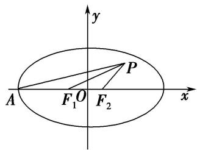
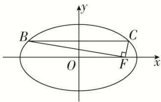
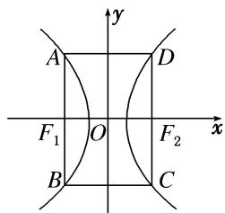
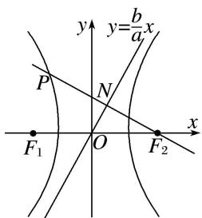
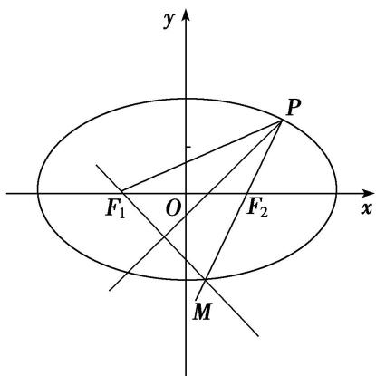
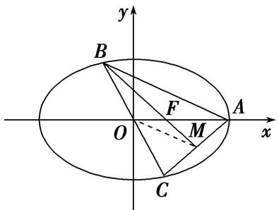
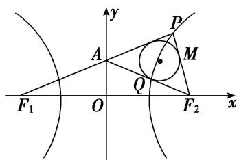
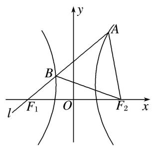
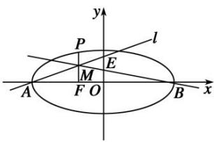

# 专题 02 建立 $f(a, b, c)=0$ 模型

1. $f(a, b, c) = 0$ 型(明显)

所谓明显型就是题目中有明显的等量关系，在计算离心率的大小时，根据题目中的条件，建立 $a, b, c$ 之间的齐次等量关系 $f(a, b, c) = 0$ ，再化归为关于离心率 $e$ 的方程求解.

# 【例题选讲】

[例 6] （27）(2016·全国I)直线 l 经过椭圆的一个顶点和一个焦点，若椭圆中心到 l 的距离为其短轴长的 $\frac{1}{4}$ ，则该椭圆的离心率为()

A. $\frac{1}{3}$

B. $\frac{1}{2}$

C. $\frac{2}{3}$

D. $\frac{3}{4}$
答案 B 解析 不妨设椭圆的方程为 $\frac{x^2}{a^2} +\frac{y^2}{b^2} = 1(a > b > 0)$ ，右焦点 $F(c,0)$ ，则直线 $l$ 的方程为 $\frac{x}{c} +\frac{y}{b} = 1$ 即 $bx + cy - bc = 0$ ．由题意 $\frac{| - bc|}{\sqrt{b^2 + c^2}} = \frac{1}{2} b$ ，且 $a^2 = b^2 +c^2$ ，得 $b^{2}c^{2} = \frac{1}{4} b^{2}a^{2}$ ，所以 $e = \frac{c}{a} = \frac{1}{2}$  
（28）(2018·全国II)已知 $F_{1}$ ， $F_{2}$ 是椭圆 C: $\frac{x^{2}}{a^{2}} + \frac{y^{2}}{b^{2}} = 1 (a > b > 0)$ 的左、右焦点，A 是 C 的左顶点，点 P 在过 A 且斜率为 $\frac{\sqrt{3}}{6}$ 的直线上， $\triangle PF_{1}F_{2}$ 为等腰三角形， $\angle F_{1}F_{2}P = 120^{\circ}$ ，则 C 的离心率为()

A. $\frac{2}{3}$

B. $\frac{1}{2}$

C. $\frac{1}{3}$

D. $\frac{1}{4}$
答案 D 解析 由题意可得椭圆的焦点在 x 轴上，如图所示，设 $\left|F_{1}F_{2}\right|=2c,\quad\because\triangle PF_{1}F_{2}$ 为等腰三角形，且 $\angle F_{1}F_{2}P=120^{\circ},\quad\therefore\left|PF_{2}\right|=\left|F_{1}F_{2}\right|=2c.\because\left|OF_{2}\right|=c,\quad\therefore$ 点 P 坐标为 $(c+2c\cos60^{\circ},2c\sin60^{\circ})$ ，即点 $P(2c,\sqrt{3}c)$ . ∵ 点 P 在过点 A，且斜率为 $\frac{\sqrt{3}}{6}$ 的直线上，∴ $\frac{\sqrt{3}c}{2c+a}=\frac{\sqrt{3}}{6}$ ，解得 $\frac{c}{a}=\frac{1}{4},\quad\therefore e=\frac{1}{4}$ ，故选 D.

  
（29）已知双曲线 $\Gamma: \frac{x^2}{a^2} - \frac{y^2}{b^2} = 1 (a > 0, b > 0)$ , 过双曲线 $\Gamma$ 的右焦点 $F$ , 且倾斜角为 $\frac{\pi}{2}$ 的直线 $l$ 与双曲线 $\Gamma$ 交于 $A, B$ 两点, $O$ 是坐标原点, 若 $\angle AOB = \angle OAB$ , 则双曲线 $\Gamma$ 的离心率为 ( )

A. $\frac{\sqrt{3}+\sqrt{7}}{2}$

B. $\frac{\sqrt{11}+\sqrt{33}}{2}$

C. $\frac{\sqrt{3}+\sqrt{39}}{6}$

D. $\frac{1 + \sqrt{17}}{4}$
答案 C 解析 由题意可知 AB 是通径, 根据双曲线的对称性和 $\angle AOB = \angle OAB$ , 可知 $\triangle AOB$ 为等边三角形, 所以 $\tan \angle AOF = \frac{b^{2}}{c} = \frac{\sqrt{3}}{3}$ , 整理得 $b^{2} = \frac{\sqrt{3}}{3} ac$ , 由 $c^{2} = a^{2} + b^{2}$ , 得 $c^{2} = a^{2} + \frac{\sqrt{3}}{3} ac$ , 两边同时除以 $a^{2}$ , 得 $e^{2} - \frac{\sqrt{3}}{3} e - 1 = 0$ , 解得 $e = \frac{\sqrt{3} + \sqrt{39}}{6}$ . 故选 C.  
（30） (2016·江苏)如图, 在平面直角坐标系 $xOy$ 中, $F$ 是椭圆 $\frac{x^2}{a^2} + \frac{y^2}{b^2} = 1 (a > b > 0)$ 的右焦点, 直线 $y = \frac{b}{2}$ 与椭圆交于 $B$ , $C$ 两点, 且 $\angle BFC = 90^\circ$ , 则该椭圆的离心率是 \_\_\_\_.

答案 $\frac{\sqrt{6}}{3}$ 解析 由已知条件易得 $B\left(-\frac{\sqrt{3}}{2} a, \frac{b}{2}\right), C\left(\frac{\sqrt{3}}{2} a, \frac{b}{2}\right), F(c, 0), \therefore \overrightarrow{BF} = c + \frac{\sqrt{3}}{2} a, -\frac{b}{2}, \overrightarrow{CF} = c - \frac{\sqrt{3}}{2} a, -\frac{b}{2}$ ，由 $\angle BFC = 90^\circ$ ，可得 $\overrightarrow{BF} \cdot \overrightarrow{CF} = 0$ ，所以 $\left(c - \frac{\sqrt{3}}{2} a\right)\left(c + \frac{\sqrt{3}}{2} a\right) + \left(-\frac{b}{2}\right)^2 = 0, c^2 - \frac{3}{4} a^2 + \frac{1}{4} b^2 = 0$ ，即 $4c^2 - 3a^2 + (a^2 - c^2) = 0$ ，亦即 $3c^2 = 2a^2$ ，所以 $\frac{c^2}{a^2} = \frac{2}{3}$ ，则 $e = \frac{c}{a} = \frac{\sqrt{6}}{3}$ .  
（31）已知 F 为双曲线 C: $\frac{x^{2}}{a^{2}} - \frac{y^{2}}{b^{2}} = 1 (a > 0, b > 0)$ 的左焦点，直线 l 经过点 F，若点 A(a, 0)，B(0, b) 关于直线 l 对称，则双曲线 C 的离心率为()

A. $\frac{\sqrt{3} + 1}{2}$

B. $\frac{\sqrt{2} + 1}{2}$

C. $\sqrt{3}+1$

D. $\sqrt{2} + 1$
答案 C 解析 由点 $A(a,0), B(0,b)$ 关于直线 $l$ 对称，可得直线 $l$ 为线段 $AB$ 的垂直平分线，线段 $AB$ 的中点的坐标为 $\left(\frac{a}{2},\frac{b}{2}\right)$ ，直线 $AB$ 的斜率为 $-\frac{b}{a}$ ，可得直线 $l$ 的方程为 $y - \frac{b}{2} = \frac{a}{b}\left(x - \frac{a}{2}\right)$ ，令 $y = 0$ ，可得 $x = \frac{1}{2} a - \frac{b^2}{2a}$ ，由题意可得 $-c = \frac{1}{2} a - \frac{b^2}{2a}$ ，即有 $a(a + 2c) = b^2 = c^2 - a^2$ ，即 $c^2 - 2ac - 2a^2 = 0$ ，由 $e = \frac{c}{a}$ ，可得 $e^2 - 2e - 2 = 0$ ，解得 $e = 1 + \sqrt{3}(e = 1 - \sqrt{3}$ 舍去），故选 C.  
（32）椭圆 $\frac{x^2}{a^2} +\frac{y^2}{b^2} = 1(a > b > 0)$ ， $F_{1}$ ， $F_{2}$ 为椭圆的左、右焦点， $O$ 为坐标原点，点 $P$ 为椭圆上一点， $|OP| =$ $\frac{\sqrt{2}}{4} a$ ，且 $|PF_1|$ ， $|F_1F_2|$ ， $|PF_2|$ 成等比数列，则椭圆的离心率为（）

A. $\frac{\sqrt{2}}{4}$

B. $\frac{\sqrt{2}}{3}$

C. $\frac{\sqrt{6}}{3}$

D. $\frac{\sqrt{6}}{4}$
答案 D 解析 设 $P(x,y)$ ，则 $|OP|^{2}=x^{2}+y^{2}=\frac{a^{2}}{8}$ ，由椭圆定义得， $|PF_{1}|+|PF_{2}|=2a,\therefore|PF_{1}|^{2}+2|PF_{1}||PF_{2}|+|PF_{2}|^{2}=4a^{2}$ ，又 $\because|PF_{1}|,|F_{1}F_{2}|,|PF_{2}|$ 成等比数列， $\therefore|PF_{1}|\cdot|PF_{2}|=|F_{1}F_{2}|^{2}=4c^{2}$ ，则 $|PF_{1}|^{2}+|PF_{2}|^{2}+8c^{2}=4a^{2},\therefore(x+c)^{2}+y^{2}+(x-c)^{2}+y^{2}+8c^{2}=4a^{2}$ ，整理得 $x^{2}+y^{2}+5c^{2}=2a^{2}$ ，即 $\frac{a^{2}}{8}+5c^{2}=2a^{2}$ ，整理得 $\frac{c^{2}}{a^{2}}=\frac{3}{8}$ ，∴椭圆的离心率 $e=\frac{c}{a}=\frac{\sqrt{6}}{4}$ .

# 【对点训练】

23. $P$ 是椭圆 $\frac{x^2}{a^2} +\frac{y^2}{b^2} = 1(a > b > 0)$ 上的一点， $A$ 为左顶点， $F$ 为右焦点， $PF\bot x$ 轴，若 $\tan \angle PAF = \frac{1}{2}$ 则椭圆的离心率 $e$ 为（）

A. $\frac{\sqrt{2}}{3}$

B. $\frac{\sqrt{2}}{2}$

C. $\frac{\sqrt{3}}{3}$

D. $\frac{1}{2}$

23. 答案 D 解析 不妨设点 $P$ 在第一象限，因为 $PF \perp x$ 轴，所以 $x_{P} = c$ ，将 $x_{P} = c$ 代入椭圆方程得 $y_{P} = \frac{b^{2}}{a}$ ，即 $|PF| = \frac{b^{2}}{a}$ ，则 $\tan \angle PAF = \frac{|PF|}{|AF|} = \frac{\frac{b^2}{a}}{a + c} = \frac{1}{2}$ ，结合 $b^{2} = a^{2} - c^{2}$ ，整理得 $2c^{2} + ac - a^{2} = 0$ ，两边同时除以 $a^{2}$ 得 $2e^{2} + e - 1 = 0$ ，解得 $e = \frac{1}{2}$ 或 $e = -1$ （舍去）。故选D.

24. 已知双曲线 $E: \frac{x^2}{a^2} - \frac{y^2}{b^2} = 1 (a > 0, b > 0)$ , 若矩形 $ABCD$ 的四个顶点在 $E$ 上, $AB$ , $CD$ 的中点为 $E$ 的两个焦点, 且 $2|AB| = 3|BC|$ , 则 $E$ 的离心率是 \_\_\_\_.

24. 答案 2 解析 如图，由题意知 $|AB|=\frac{2b^{2}}{a}$ ， $|BC|=2c$ 。又 $2|AB|=3|BC|$ ， $\therefore 2\times\frac{2b^{2}}{a}=3\times2c$ ，即 $2b^{2}=3ac$ ， $\therefore 2(c^{2}-a^{2})=3ac$ ，两边同除以 $a^{2}$ 并整理得 $2e^{2}-3e-2=0$ ，解得e=2(负值舍去).

25. 已知椭圆 $\frac{x^2}{a^2} + \frac{y^2}{b^2} = 1 (a > b > 0)$ 的左顶点为 $M$ ，上顶点为 $N$ ，右焦点为 $F$ ，若 $\overrightarrow{NM} \cdot \overrightarrow{NF} = 0$ ，则椭圆的离心率为（）

A. $\frac{\sqrt{3}}{2}$

B. $\frac{\sqrt{2}-1}{2}$

C. $\frac{\sqrt{3} - 1}{2}$

D. $\frac{\sqrt{5}-1}{2}$

25. 答案 D 解析 由题意知， $M(-a,0)$ ， $N(0,b)$ ， $F(c,0)$ ， $\therefore \overrightarrow{NM}=(-a,-b)$ ， $\overrightarrow{NF}=(c,-b)$ 。 $\because \overrightarrow{NM}\cdot\overrightarrow{NF}=0$ ， $\therefore -ac+b^{2}=0$ ，即 $b^{2}=ac$ 。又 $b^{2}=a^{2}-c^{2}$ ， $\therefore a^{2}-c^{2}=ac$ 。 $\therefore e^{2}+e-1=0$ ，解得 $e=\frac{\sqrt{5}-1}{2}$ 或 $e=\frac{-\sqrt{5}-1}{2}$ （舍去）。 $\therefore$ 椭圆的离心率为 $\frac{\sqrt{5}-1}{2}$ ，故选D。

26. 已知椭圆 $\frac{x^2}{a^2} + \frac{y^2}{b^2} = 1 (a > b > 0)$ 的左焦点为 $F_1(-c, 0)$ ，右顶点为 $A$ ，上顶点为 $B$ ，现过 $A$ 点作直线 $F_1B$ 的垂线，垂足为 $T$ ，若直线 $OT(O$ 为坐标原点)的斜率为 $-\frac{3b}{c}$ ，则该椭圆的离心率为 \_\_\_\_.

26. 答案 $\frac{1}{2}$ 解析 因为椭圆 $\frac{x^2}{a^2} + \frac{y^2}{b^2} = 1 (a > b > 0)$ , $A, B$ 和 $F_1$ 点坐标分别为 $(a, 0), (0, b), (-c, 0)$ , 所以直线 $BF_1$ 的方程是 $y = \frac{b}{c} x + b$ , $OT$ 的方程是 $y = -\frac{3b}{c} x$ . 联立解得 $T$ 点坐标为 $\left(-\frac{c}{4}, \frac{3b}{4}\right)$ , 直线 $AT$ 的斜率为 $-\frac{3b}{4a + c}$ . 由 $AT \perp BF_1$ 得, $-\frac{3b}{4a + c} \times \frac{b}{c} = -1$ , $\therefore 3b^2 = 4ac + c^2$ , $\therefore 3(a^2 - c^2) = 4ac + c^2$ , $\therefore 4e^2 + 4e - 3 = 0$ , 又 $0 < e < 1$ , 所以 $e = \frac{1}{2}$ .

27. 已知 $F_{1}$ , $F_{2}$ 为双曲线的焦点, 过 $F_{2}$ 作垂直于实轴的直线交双曲线于 $A$ , $B$ 两点, $BF_{1}$ 交 $y$ 轴于点 $C$ , 若 $AC \perp BF_{1}$ , 则双曲线的离心率为( )

A. $\sqrt{2}$

B. $\sqrt{3}$

C. $2\sqrt{2}$

D. $2\sqrt{3}$

27. 答案 B 解析 不妨设双曲线方程为 $\frac{x^2}{a^2} - \frac{y^2}{b^2} = 1 (a > 0, b > 0)$ ，由已知，取 $A$ 点坐标为 $\left\{c, \frac{b^2}{a}\right\}$ ，取 $B$ 点坐标为 $\left\{c, -\frac{b^2}{a}\right\}$ ，则 $C$ 点坐标为 $\left\{0, -\frac{b^2}{2a}\right\}$ 且 $F_1(-c, 0)$ . 由 $AC \perp BF_1$ 知 $\overrightarrow{AC} \cdot \overrightarrow{BF}_1 = 0$ ，又 $\overrightarrow{AC} = \left(-c, -\frac{3b^2}{2a}\right)$ ， $\overrightarrow{BF}_1 = \left(-2c, \frac{b^2}{a}\right)$ ，可得 $2c^2 - \frac{3b^4}{2a^2} = 0$ ，又 $b^2 = c^2 - a^2$ ，可得 $3c^4 - 10c^2a^2 + 3a^4 = 0$ ，则有 $3e^4 - 10e^2 + 3 = 0$ ，可得 $e^2 = 3$ 或 $\frac{1}{3}$ ，又 $e > 1$ ，所以 $e = \sqrt{3}$ . 故选 B.

28. (2018·浙江)已知椭圆 $C: \frac{x^2}{a^2} + \frac{y^2}{b^2} = 1 (a > b > 0)$ 的左焦点 $F_1$ 关于直线 $y = -\sqrt{3} c$ 的对称点 $Q$ 在椭圆上，则椭圆的离心率是（）

A. $\sqrt{3} - 1$

B. $\frac{\sqrt{3} + 1}{2}$

C. $2-\sqrt{3}$

D. $\frac{\sqrt{3}}{3}$

28. 答案 C 解析 ∵ 左焦点 $F_{1}$ 关于直线 $y = -\sqrt{3}c$ 的对称点为 Q，∴ $|F_{1}Q| = 2\sqrt{3}c$ 。设椭圆的右焦点为 $F_{2}$ ，则 $|F_{1}F_{2}| = 2c$ 。由椭圆定义知， $|F_{2}Q| = 2a - |F_{1}Q| = 2a - 2\sqrt{3}c$ 。在 $Rt\triangle F_{1}QF_{2}$ 中， $|F_{1}F_{2}|^{2} + |F_{1}Q|^{2} = |F_{2}Q|^{2}$ ，即 $(2c)^{2} + (2\sqrt{3}c)^{2} = (2a - 2\sqrt{3}c)^{2}$ ，∴ $c^{2} + 2\sqrt{3}ac - a^{2} = 0$ ，故 $e^{2} + 2\sqrt{3}e - 1 = 0$ ，∴ $e = 2 - \sqrt{3}$ （负值舍去）。故选 C。

29. (2018·浙江)已知双曲线 $x^{2} - \frac{y^{2}}{b^{2}} = 1 (b > 0)$ 的右焦点为 $F$ , 过点 $F$ 作一条渐近线的垂线, 垂足为 $M$ . 若点 $M$ 的纵坐标为 $\frac{2\sqrt{5}}{5}$ , 则双曲线的离心率是 \_\_\_\_.

29. 答案 $\sqrt{5}$ 解析 $\because$ 点 $M$ 的纵坐标为 $\frac{2\sqrt{5}}{5}$ , $\therefore$ 点 $M$ 在渐近线 $y = \frac{b}{a} x$ 上. $\because$ 双曲线方程为 $x^{2} - \frac{y^{2}}{b^{2}} = 1$ , $\therefore a = 1, F(c, 0)$ , 渐近线方程为 $y = \pm bx$ . 则 $|FM| = \frac{|bc|}{\sqrt{1 + b^2}}$ , $\because c^{2} = a^{2} + b^{2} = 1 + b^{2}, \therefore |FM| = b$ . $\because \triangle OMF$ 为直角三角形, $\therefore OM = \sqrt{OF^2 - FM^2} = \sqrt{c^2 - b^2} = a$ . $\therefore OM \times FM = OF \times y_M$ , 即 $cy_M = ab$ , $\therefore c^2 y_M^2 = b^2$ . $\because y_M = \frac{2\sqrt{5}}{5}$ , $\therefore b^2 = \frac{4}{5} c^2$ . 又 $\because c^2 = a^2 + b^2$ , $\therefore a^2 = \frac{1}{5} c^2$ , $\therefore e = \sqrt{5}$ .

30. 已知直线 $l$ 的倾斜角为 $45^{\circ}$ , 直线 $l$ 与双曲线 $C: \frac{x^{2}}{a^{2}} - \frac{y^{2}}{b^{2}} = 1 (a > 0, b > 0)$ 的左、右两支分别交于 $M$ , $N$ 两点, 且 $MF_{1}, NF_{2}$ 都垂直于 $x$ 轴(其中 $F_{1}, F_{2}$ 分别为双曲线 $C$ 的左、右焦点), 则该双曲线的离心率为( )

A. $\sqrt{3}$

B. $\sqrt{5}$

C. $\sqrt{5}-1$

D. $\frac{\sqrt{5} + 1}{2}$

30. 答案 D 解析 根据题意及双曲线的对称性，可知直线 l 过坐标原点， $|MF_{1}|=|NF_{2}|$ . 设点 $M(-c, y_{0})$ ，则 $N(c, -y_{0})$ ， $\frac{c^{2}}{a^{2}}-\frac{y_{0}^{2}}{b^{2}}=1$ ，即 $|y_{0}|=\frac{c^{2}-a^{2}}{a}$ . 由直线 l 的倾斜角为 $45^{\circ}$ ，且 $|MF_{1}|=|NF_{2}|=|y_{0}|$ ，得 $|y_{0}|$

=c，即 $\frac{c^{2}-a^{2}}{a}=c$ ，整理得 $c^{2}-ac-a^{2}=0$ ，即 $e^{2}-e-1=0$ ，解得 $e=\frac{\sqrt{5}+1}{2}$ 或 $e=\frac{1-\sqrt{5}}{2}$ （舍去），故选D.

31. 从椭圆 $\frac{x^2}{a^2} + \frac{y^2}{b^2} = 1 (a > b > 0)$ 上一点 $P$ 向 $x$ 轴作垂线，垂足恰为左焦点 $F_1$ ， $A$ 是椭圆与 $x$ 轴正半轴的交点， $B$ 是椭圆与 $y$ 轴正半轴的交点，且 $AB // OP(O$ 是坐标原点)，则该椭圆的离心率是 \_\_\_\_.

31. 答案 $\frac{\sqrt{2}}{2}$ 解析 由题意可设 $P(-c, y_0)(c$ 为半焦距), $k_{OP} = -\frac{y_0}{c}$ , $k_{AB} = -\frac{b}{a}$ , 由于 $OP // AB$ , 所以 $-\frac{y_0}{c} = -\frac{b}{a}$ , $y_0 = \frac{bc}{a}$ , 把 $P\left(-c, \frac{bc}{a}\right)$ 代入椭圆方程得 $\frac{(-c)^2}{a^2} + \frac{\left(\frac{bc}{a}\right)^2}{b^2} = 1$ , 所以 $\left(\frac{c}{a}\right)^2 = \frac{1}{2}$ , 所以 $e = \frac{c}{a} = \frac{\sqrt{2}}{2}$ .

32. 已知双曲线 $C: \frac{x^2}{a^2} - \frac{y^2}{b^2} = 1 (a > 0, b > 0)$ 的左、右焦点分别为 $F_1, F_2, P$ 为双曲线 $C$ 上第二象限内一点，若直线 $y = \frac{b}{a} x$ 恰为线段 $PF_2$ 的垂直平分线，则双曲线 $C$ 的离心率为（）

A. $\sqrt{2}$

B. $\sqrt{3}$

C. $\sqrt{5}$

D. $\sqrt{6}$

32. 答案 C 解析 如图，

直线 $PF_{2}$ 的方程为 $y=-\frac{a}{b}(x-c)$ ，设直线 $PF_{2}$ 与直线 $y=\frac{b}{a}x$ 的交点为 N，易知 $N\left(\frac{a^{2}}{c},\frac{ab}{c}\right)$ 。又线段 $PF_{2}$ 的中点为 N，所以 $P\left(\frac{2a^{2}-c^{2}}{c},\frac{2ab}{c}\right)$ 。因为点 P 在双曲线 C 上，所以 $\frac{(2a^{2}-c^{2})^{2}}{a^{2}c^{2}}-\frac{4a^{2}b^{2}}{c^{2}b^{2}}=1$ ，即 $5a^{2}=c^{2}$ ，所以 $e=\frac{c}{a}=\sqrt{5}$ 。故选 C。

33. 已知椭圆 $C: \frac{x^2}{a^2} + \frac{y^2}{b^2} = 1 (a > b > 0)$ 的右顶点为 $A$ ，经过原点的直线 $l$ 交椭圆 $C$ 于 $P$ ， $Q$ 两点，若 $|PQ| = a$ ， $AP \perp PQ$ ，则椭圆 $C$ 的离心率为 \_\_\_\_.

33. 答案 $\frac{2\sqrt{5}}{5}$ 解析 不妨设点 $P$ 在第一象限， $O$ 为坐标原点，由对称性可得 $|OP| = \frac{|PQ|}{2} = \frac{a}{2}$ ，因为 $AP \perp PQ$ ，所以在 Rt△POA 中， $\cos \angle POA = \frac{|OP|}{|OA|} = \frac{1}{2}$ ，故 $\angle POA = 60^\circ$ ，易得 $P\left(\frac{a}{4}, \frac{\sqrt{3}a}{4}\right)$ ，代入椭圆方程得 $\frac{1}{16} + \frac{3a^2}{16b^2} = 1$ ，故 $a^2 = 5b^2 = 5(a^2 - c^2)$ ，所以椭圆 $C$ 的离心率 $e = \frac{2\sqrt{5}}{5}$ .

34. (2018·全国III)设 $F_{1}$ , $F_{2}$ 是双曲线 $C$ : $\frac{x^{2}}{a^{2}} - \frac{y^{2}}{b^{2}} = 1 (a > 0, b > 0)$ 的左, 右焦点, $O$ 是坐标原点. 过 $F_{2}$ 作 $C$ 的一条渐近线的垂线, 垂足为 $P$ . 若 $|PF_{1}| = \sqrt{6} |OP|$ , 则 $C$ 的离心率为( )

A. $\sqrt{5}$

B. 2

C. $\sqrt{3}$

D. $\sqrt{2}$

34. 答案 C 解析 方法一：设渐近线的方程为 bx-ay=0，则直线 $PF_{2}$ 的方程为 $ax+by-ac=0$ ，由
$\left\{ \begin{array}{l} ax + by - ac = 0, \\ bx - ay = 0, \end{array} \right.$ 可得 $P\left(\frac{a^2}{c}, \frac{ab}{c}\right)$ ，由 $F_1(-c, 0)$ 及 $|PF_1| = \sqrt{6}|OP|$ ，得 $\sqrt{\left(\frac{a^2}{c} + c\right)^2 + \left(\frac{ab}{c}\right)^2} = \sqrt{6} \times \sqrt{\left(\frac{a^2}{c}\right)^2 + \left(\frac{ab}{c}\right)^2}$ ，化简可得 $3a^2 = c^2$ ，即 $e = \sqrt{3}$ .
方法二：因为 $|PF_{2}|=b,\quad|OF_{2}|=c,\quad\therefore|PO|=a$ ，在Rt△ $POF_{2}$ 中，设 $\angle PF_{2}O=\theta$ ，则有 $\cos\theta=\frac{|PF_{2}|}{|OF_{2}|}=\frac{b}{c};$
∵ 在 $\triangle PF_{1}F_{2}$ 中， $\cos\theta=\frac{|PF_{2}|^{2}+|F_{1}F_{2}|^{2}-|PF_{1}|^{2}}{2\cdot|PF_{2}|\cdot|F_{1}F_{2}|}=\frac{b}{c},\quad\therefore\frac{b^{2}+4c^{2}-(\sqrt{6}a)^{2}}{2b\cdot2c}=\frac{b}{c}\Rightarrow b^{2}+4c^{2}-6a^{2}=4b^{2}\Rightarrow4c^{2}-6a^{2}=3c^{2}-3a^{2}\Rightarrow c^{2}=3a^{2}\Rightarrow e=\sqrt{3}.$

35. 已知双曲线 $C: \frac{x^2}{a^2} - \frac{y^2}{b^2} = 1 (a > 0, b > 0)$ 的右焦点为 $F$ , 过点 $F$ 向双曲线的一条渐近线引垂线, 垂足为 $M$ , 交另一条渐近线于 $N$ , 若 $2\overrightarrow{MF} = \overrightarrow{FN}$ , 则双曲线的离心率为 \_\_\_\_.

35. 答案 $\frac{2\sqrt{3}}{3}$ 解析 设右焦点 $F(c, 0)$ ，渐近线 $OM$ ， $ON$ 的方程分别为 $y = \frac{b}{a}x$ ， $y = -\frac{b}{a}x$ 。不失一般性，
设过 $F$ 的垂线为 $x = -\frac{b}{a} y + c$ 。由 $\left\{ \begin{array}{l} y = -\frac{b}{a} x, \\ x = -\frac{b}{a} y + c \end{array} \right.$ 得 $y_{N} = \frac{-\frac{bc}{a}}{1 - \frac{b^{2}}{a^{2}}}$ 。由 $\left\{ \begin{array}{l} y = \frac{b}{a} x, \\ x = -\frac{b}{a} y + c \end{array} \right.$ 得 $y_{M} = \frac{\frac{bc}{a}}{1 + \frac{b^{2}}{a^{2}}}$ 。因

为 $2\overrightarrow{MF} = \overrightarrow{FN}$ ，所以 $-2y_{M} = y_{N}$ ，即 $\frac{-2\frac{bc}{a}}{1 + \frac{b^2}{a^2}} = \frac{-\frac{bc}{a}}{1 - \frac{b^2}{a^2}}$ 易解得 $\frac{b^2}{a^2} = \frac{1}{3}$ ，所以 $e = \sqrt{1 + \frac{b^2}{a^2}} = \sqrt{1 + \frac{1}{3}} = \frac{2\sqrt{3}}{3}.$

36. 已知椭圆 $C: \frac{x^2}{a^2} + \frac{y^2}{b^2} = 1 (a > b > 0)$ 的左、右焦点分别为 $F_1, F_2$ ，过 $F_2(1, 0)$ 且斜率为 1 的直线交椭圆于 $A, B$ ，若三角形 $F_1AB$ 的面积等于 $\sqrt{2} b^2$ ，则该椭圆的离心率为 \_\_\_\_.

36. 答案 $\sqrt{3}-1$ 解析 设椭圆的焦距为 $2c, A(x_1, y_1), B(x_2, y_2)$ ，由题意得直线 $AB$ 的方程为 $y=x-1$ ，与椭圆方程联立，消去 $x$ 化简得 $(a^2+b^2)y^2+2b^2y+b^2-a^2b^2=0$ ，由根与系数的关系得， $y_1+y_2=\frac{-2b^2}{a^2+b^2}$ ， $y_1\cdot y_2=\frac{b^2-a^2b^2}{a^2+b^2}$ ，则 $\triangle F_1AB$ 的面积为 $\frac{1}{2}\times 2c|y_1-y_2|=\sqrt{\left(\frac{-2b^2}{a^2+b^2}\right)^2-\frac{4(b^2-a^2b^2)}{a^2+b^2}}=\sqrt{2}b^2$ ，化简得 $-2a^2+2a^4+2a^2b^2=b^2(a^2+b^2)^2$ ，又因为 $b^2=a^2-1$ ，所以 $4a^4-8a^2+1=0$ ，解得 $a=\frac{1+\sqrt{3}}{2}$ ，则椭圆的离心率 $e=\frac{c}{a}=\sqrt{3}-1$ .

2. $f(a, b, c)=0$ 型(隐含)

所谓隐含型就是题目中没有明显的等量关系，在计算离心率的大小时，根据题目中的条件，利用图形中存在的几何特征掘几何关系，运用点在曲线上或垂直关系或用余弦定理等，建立 a, b, c 之间的齐次等量关系 $f(a, b, c)=0$ ，再化归为关于离心率 e 的方程求解.

# 【例题选讲】

[例 7 （33） 过双曲线 C: $\frac{x^{2}}{a^{2}} - \frac{y^{2}}{b^{2}} = 1 (a > 0, b > 0)$ 左焦点 F 的直线 l 与 C 交于 M, N 两点，且 $\overrightarrow{FN} = 3\overrightarrow{FM}$ ，若 $OM \perp FN$ ，则 C 的离心率为()

A. 2

B. $\sqrt{7}$

C. 3

D. $\sqrt{10}$
答案 B 解析 设双曲线的右焦点为 $F'$ ，取 $MN$ 的中点 $P$ ，连接 $F'P, F'M, F'N$ ，如图所示，由 $\overrightarrow{FN} = 3\overrightarrow{FM}$ ，可知 $|MF| = |MP| = |NP|$ 。又 $O$ 为 $FF'$ 的中点，可知 $OM // PF'$ 。 $\because OM \perp FN, \therefore PF' \perp FN.$ 。 $\therefore PF'$ 为线段 $MN$ 的垂直平分线。 $\therefore |NF'| = |MF'|$ 。设 $|MF| = t$ ，由双曲线定义可知 $|NF'| = 3t - 2a, |MF'| = 2a + t$ ，则 $3t - 2a = 2a + t$ ，解得 $t = 2a$ 。在 Rt△MF'P 中， $|PF'| = \sqrt{|MF'|^2 - |MP|^2} = \sqrt{16a^2 - 4a^2} = 2\sqrt{3}a,$ 。 $\therefore |OM| = \frac{1}{2} |PF'| = \sqrt{3}a$ 。在 Rt△MFO 中， $|MF|^2 + |OM|^2 = |OF|^2,$ 。 $\therefore 4a^2 + 3a^2 = c^2 \Rightarrow e = \sqrt{7}$ 。故选 B.  
（34）已知椭圆 $C: \frac{x^2}{a^2} + \frac{y^2}{b^2} = 1 (a > b > 0)$ 的左、右焦点分别为 $F_1, F_2, P$ 为椭圆 $C$ 上一点，且 $\angle F_1PF_2 = \frac{\pi}{3}$ ，若 $F_1$ 关于 $\angle F_1PF_2$ 平分线的对称点在椭圆 $C$ 上，则该椭圆的离心率为 \_\_\_\_.
答案 $\frac{\sqrt{3}}{3}$ 解析 如图， $\because F_{1}$ 关于 $\angle F_{1}PF_{2}$ 平分线的对称点在椭圆 $C$ 上， $\therefore P, F_{2}, M$ 三点共线，

设 $|PF_{1}|=m$ ，则 $|PM|=m,\quad|MF_{1}|=m$ ．又 $|PF_{1}|+|PM|+|MF_{1}|=4a=3m$ ． $\because|PF_{1}|=\frac{4}{3}a,\quad|PF_{2}|=\frac{2}{3}a$ ．由余弦定理可得 $|PF_{1}|^{2}+|PF_{2}|^{2}-2|PF_{1}||PF_{2}|\cos\frac{\pi}{3}=|F_{1}F_{2}|^{2},\quad\therefore a^{2}=3c^{2},\quad e=\frac{c}{a}=\frac{\sqrt{3}}{3}.$  
（35）已知双曲线 $C: \frac{x^2}{a^2} - \frac{y^2}{b^2} = 1 (a > 0, b > 0)$ 的左、右焦点分别为 $F_1, F_2, O$ 为坐标原点。 $P$ 是双曲线在第一象限上的点，直线 $PO, PF_2$ 分别交双曲线 $C$ 左、右支于 $M, N$ 。若 $|PF_1| = 2 |PF_2|$ ，且 $\angle MF_2N = 60^\circ$ ，则双曲线 $C$ 的离心率为 \_\_\_\_.
答案 $\sqrt{3}$ 解析 由题意， $|PF_1| = 2|PF_2|$ ，由双曲线的定义可得， $|PF_1| - |PF_2| = 2a$ ，可得 $|PF_1| = 4a$ ， $|PF_2| = 2a$ ，又 $|F_1O| = |F_2O|$ ， $|PO| = |MO|$ ，得四边形 $PF_1MF_2$ 为平行四边形，又 $\angle MF_2N = 60^\circ$ ，可得 $\angle F_1PF_2 = 60^\circ$ ，在 $\triangle PF_1F_2$ 中，由余弦定理可得， $4c^2 = 16a^2 + 4a^2 - 2 \cdot 4a \cdot 2a \cdot \cos 60^\circ$ ，即 $4c^2 = 20a^2 - 8a^2$ ， $c^2 = 3a^2$ ，可得 $c = \sqrt{3}a$ ，所以 $e = \frac{c}{a} = \sqrt{3}$ .  
（36）已知 $F_{1}$ ， $F_{2}$ 是双曲线 $\frac{x^2}{a^2} - \frac{y^2}{b^2} = 1 (a > 0, b > 0)$ 的左、右焦点，过 $F_{2}$ 作双曲线一条渐近线的垂线，垂足为点 A，交另一条渐近线于点 B，且 $\overrightarrow{AF_{2}}=\frac{1}{3}\overrightarrow{F_{2}B}$ ，则该双曲线的离心率为()

A. $\frac{\sqrt{6}}{2}$

B. $\frac{\sqrt{5}}{2}$

C. $\sqrt{3}$

D. 2
答案 A 解析 由 $F_{2}(c,0)$ 到渐近线 $y = \frac{b}{a} x$ 的距离为 $d = \frac{bc}{\sqrt{a^2 + b^2}} = b$ ，即有 $|\overrightarrow{AF_2}| = b$ ，则 $|\overrightarrow{BF_2}| = 3b$ ，在 $\triangle AF_2O$ 中， $|\overrightarrow{OA}| = a, |\overrightarrow{OF_2}| = c, \tan \angle F_2OA = \frac{b}{a}$ ，又有 $\angle AOB = 2\angle F_2OA$ ，则 $\tan \angle AOB = \frac{4b}{a} = \frac{2\times\frac{b}{a}}{1 - \left(\frac{b}{a}\right)^2}$ ，化简可得 $a^2 = 2b^2$ ，即有 $c^2 = a^2 + b^2 = \frac{3}{2} a^2$ ，即有 $e = \frac{c}{a} = \frac{\sqrt{6}}{2}$ 。故选A.  
（37）设椭圆: $\frac{x^2}{a^2} + \frac{y^2}{b^2} = 1 (a > b > 0)$ 的右顶点为 $A$ , 右焦点为 $F$ , $B$ 为椭圆在第二象限内的点, 直线 $BO$ 交椭圆于点 $C$ , $O$ 为原点, 若直线 $BF$ 平分线段 $AC$ , 则椭圆的离心率为( )

A. $\frac{1}{2}$

B. $\frac{1}{3}$

C. $\frac{1}{4}$

D. $\frac{1}{5}$
答案 B 解析 如图，设点 M 为 AC 的中点，连接 OM，则 OM 为 $\triangle ABC$ 的中位线，于是 $\triangle OFM \sim \triangle AFB$ ，且 $\frac{|OF|}{|FA|} = \frac{|OM|}{|AB|} = \frac{1}{2}$ ，即 $\frac{c}{a - c} = \frac{1}{2}$ ，解得 $e = \frac{c}{a} = \frac{1}{3}$ 。故选 B.

  
（38）已知双曲线 $E: \frac{x^2}{a^2} - \frac{y^2}{b^2} = 1 (a > 0, b > 0)$ 的左、右焦点分别为 $F_1, F_2, |F_1F_2| = 6, P$ 是双曲线 $E$ 右支上一点， $PF_1$ 与 $y$ 轴交于点 $A, \triangle PAF_2$ 的内切圆与 $AF_2$ 相切于点 $Q$ 。若 $|AQ| = \sqrt{3}$ ，则双曲线 $E$ 的离心率是（）

A. $2 \sqrt{3}$

B. $\sqrt{5}$

C. $\sqrt{3}$

D. $\sqrt{2}$
答案 C 解析 如图，设 $\triangle PAF_{2}$ 的内切圆与 $PF_{2}$ 相切于点 $M$ 。依题意知， $|AF_{1}| = |AF_{2}|$ ，根据双曲线的定义，以及 $P$ 是双曲线 $E$ 右支上一点，得 $2a = |PF_{1}| - |PF_{2}|$ ，根据三角形内切圆的性质，得 $|PF_{1}| = |AF_{1}| + |PA| = |AF_{1}| + (|PM| + |AQ|)$ ， $|PF_{2}| = |PM| + |MF_{2}| = |PM| + |QF_{2}| = |PM| + (|AF_{2}| - |AQ|)$ 。所以 $2a = 2|AO| = 2\sqrt{3}$ ，即 $a = \sqrt{3}$ 。因为 $|F_{1}F_{2}| = 6$ ，所以 $c = 3$ ，所以双曲线 $E$ 的离心率是 $e = \frac{c}{a} = \frac{3}{\sqrt{3}} = \sqrt{3}$ ，故选 C。

  
（39）已知 F 是椭圆 $\frac{x^{2}}{a^{2}} + \frac{y^{2}}{b^{2}} = 1 (a > b > 0)$ 的右焦点，直线 $y = \frac{b}{a} x$ 交椭圆于 A，B 两点，若 $\cos \angle AFB = \frac{1}{3}$ ，则椭圆的离心率是 \_\_\_\_.
答案 $\frac{2\sqrt{5}}{5}$ 解析 令 $A$ 在第三象限, $B$ 在第一象限, 将直线方程代入椭圆方程, 求得 $A\left(-\frac{\sqrt{2}}{2}a, -\frac{\sqrt{2}}{2}b\right)$ , $B\left(\frac{\sqrt{2}}{2}a, \frac{\sqrt{2}}{2}b\right)$ , 故 $|AB| = \sqrt{2}a \cdot \sqrt{1^2 + \left(\frac{b}{a}\right)^2}$ . 在 $\triangle ABF$ 中运用面积公式得 $\frac{1}{2} \cdot |AF| \cdot |BF| \cdot \sin \angle AFB = \frac{1}{2} \cdot |OF| \cdot |y_A - y_B|$ , ①. 再运用余弦定理得 $|AB|^2 = |AF|^2 + |BF|^2 - 2|AF| \cdot |BF| \cdot \cos \angle AFB$ , ②. 联立 ①② 解得 $e = \frac{c}{a} = \frac{2\sqrt{5}}{5}$ .  
（40）在平面上给定相异两点 A, B，设 P 点在同一平面上且满足 $\frac{|PA|}{|PB|} = \lambda$ ，当 $\lambda > 0$ 且 $\lambda \neq 1$ 时，P 点的轨迹是一个圆，这个轨迹最先由古希腊数学家阿波罗尼斯发现，故我们称这个圆为阿波罗尼斯圆，现有椭圆 $\frac{x^{2}}{a^{2}} + \frac{y^{2}}{b^{2}} = 1 (a > b > 0)$ ，A, B 为椭圆的长轴端点，C, D 为椭圆的短轴端点，动点 P 满足 $\frac{|PA|}{|PB|} = 2$ ， $\triangle PAB$ 的面积最大值为 $\frac{16}{3}$ ， $\triangle PCD$ 面积的最小值为 $\frac{2}{3}$ ，则椭圆的离心率为 \_\_\_\_.
答案 $\frac{\sqrt{3}}{2}$ 解析 依题意 $A(-a,0), B(a,0)$ ，设 $P(x,y)$ ，依题意得 $|PA| = 2|PB|$ ， $\sqrt{(x + a)^2 + y^2} = 2\sqrt{(x - a)^2 + y^2}$ ，两边平方化简得 $\left[x - \frac{5}{3}a\right]^2 + y^2 = \left(\frac{4}{3}a\right)^2$ ，故圆心为 $\left(\frac{5a}{3}, 0\right)$ ，半径 $r = \frac{4a}{3}$ 。所以 $\triangle PAB$ 的最大面积为 $\frac{1}{2} \cdot 2a \cdot \frac{4}{3}a = \frac{16}{3}$ ，解得 $a = 2$ ， $\triangle PCD$ 的最小面积为 $\frac{1}{2} \cdot 2b \cdot \left(\frac{5a}{3} - \frac{4a}{3}\right) = b \cdot \frac{a}{3} = \frac{2}{3}$ ，解得 $b = 1$ 。故椭圆的离心率为 $e = \sqrt{1 - \left(\frac{b}{a}\right)^2} = \sqrt{1 - \frac{1}{4}} = \frac{\sqrt{3}}{2}$ 。

# 【对点训练】

37. 已知 $F_{1}, F_{2}$ 分别为椭圆 $\frac{x^2}{a^2} + \frac{y^2}{b^2} = 1 (a > b > 0)$ 的左、右焦点，点 $P$ 是椭圆上位于第二象限内的点，延长 $PF_{1}$ 交椭圆于点 $Q$ ，若 $PF_{2} \perp PQ$ ，且 $|PF_{2}| = |PQ|$ ，则椭圆的离心率为（）

A. $\sqrt{6} -\sqrt{3}$

B. $\sqrt{2}-1$

C. $\sqrt{3} -\sqrt{2}$

D. $2 - \sqrt{2}$

37. 答案 A 解析 $PF_{2} \perp PQ$ 且 $|PF_{2}| = |PQ|$ ，可得 $\triangle PQF_{2}$ 为等腰直角三角形，设 $|PF_{2}| = t$ ，则 $|QF_{2}| = \sqrt{2}t$ ，由椭圆的定义可得 $|PF_{1}| = 2a - t, 2t + \sqrt{2}t = 4a$ ，则 $t = 2(2 - \sqrt{2})a$ ，在直角三角形 $PF_{1}F_{2}$ 中，可得 $t^{2} + (2a - t)^{2} = 4c^{2} \cdot 4(6 - 4\sqrt{2})a^{2} + (12 - 8\sqrt{2})a^{2} = 4c^{2}$ ，化为 $c^{2} = (9 - 6\sqrt{2})a^{2}$ ，可得 $e = \frac{c}{a} = \sqrt{6} - \sqrt{3}$ 。故选 A.

38. 已知 $F_{1}, F_{2}$ 是双曲线 $\frac{x^{2}}{a^{2}} - \frac{y^{2}}{b^{2}} = 1 (a > 0, b > 0)$ 的左、右焦点，过 $F_{1}$ 的直线 $l$ 与双曲线的左右两支分别交于点 $B, A$ ，若 $\triangle ABF_{2}$ 为等边三角形，则双曲线的离心率为（）

A. $\sqrt{7}$

B. 4

C. $\frac{2\sqrt{3}}{3}$

D. $\sqrt{3}$

38. 答案 A 解析 因为 $\triangle ABF_{2}$ 为等边三角形，所以不妨设 $|AB|=|BF_{2}|=|AF_{2}|=m$ ,因为 A 为双曲线右支上一点，所以 $\left|F_{1}A\right|-\left|F_{2}A\right|=\left|F_{1}A\right|-\left|AB\right|=\left|F_{1}B\right|=2a$ ，因为 B 为双曲线左支上一点，所以 $\left|BF_{2}\right|-\left|BF_{1}\right|=2a,\quad\left|BF_{2}\right|=4a$ ，由 $\angle ABF_{2}=60^{\circ}$ ，得 $\angle F_{1}BF_{2}=120^{\circ}$ ，在 $\triangle F_{1}BF_{2}$ 中，由余弦定理得 $4c^{2}=4a^{2}+16a^{2}-2\cdot2a\cdot4a\cdot\cos120^{\circ}$ ，得 $c^{2}=7a^{2}$ ，则 $e^{2}=7$ ，又 e>1，所以 $e=\sqrt{7}$ 。故选 A.

39. 已知 $F$ 是椭圆 $E: \frac{x^2}{a^2} + \frac{y^2}{b^2} = 1 (a > b > 0)$ 的左焦点，经过原点 $O$ 的直线 $l$ 与椭圆 $E$ 交于 $P$ ， $Q$ 两点，若 $|PF| = 2|QF|$ ，且 $\angle PFQ = 120^\circ$ ，则椭圆 $E$ 的离心率为（）

A. $\frac{1}{3}$

B. $\frac{1}{2}$

C. $\frac{\sqrt{3}}{3}$

D. $\frac{\sqrt{2}}{2}$

39. 答案 C 解析 解法一：设 $F_{1}$ 是椭圆 E 的右焦点，如图，连接 $PF_{1}$ ， $QF_{1}$ . 根据对称性，线段 $FF_{1}$ 与线段 PQ 在点 O 处互相平分，所以四边形 $PFQF_{1}$ 是平行四边形， $|FQ| = |PF_{1}|$ ， $\angle FPF_{1} = 180^{\circ} - \angle PFQ = 60^{\circ}$ ，根据椭圆的定义， $|PF| + |PF_{1}| = 2a$ ，又 $|PF| = 2|QF|$ ，所以 $|PF_{1}| = \frac{2}{3}a$ ， $|PF| = \frac{4}{3}a$ ，而 $|F_{1}F| = 2c$ ，在 $\triangle F_{1}PF$ 中，由余弦定理，得 $(2c)^{2} = \left(\frac{2}{3}a\right)^{2} + \left(\frac{4}{3}a\right)^{2} - 2 \times \frac{2}{3}a \times \frac{4}{3}a \times \cos 60^{\circ}$ ，得 $\frac{c^{2}}{a^{2}} = \frac{1}{3}$ ，所以椭圆 E 的离心率 e = $\frac{c}{a} = \frac{\sqrt{3}}{3}$ 。故选 C.
解法二：设 $F_{1}$ 是椭圆 E 的右焦点，连接 $PF_{1}$ ， $QF_{1}$ 。根据对称性，线段 $FF_{1}$ 与线段 PQ 在点 O 处互相平分，所以四边形 $PFQF_{1}$ 是平行四边形， $|FQ|=|PF_{1}|$ ， $\angle FPF_{1}=180^{\circ}-\angle PFQ=60^{\circ}$ ，又 $|FP|=2|PF_{1}|$ ，所以 $\triangle FPF_{1}$ 是直角三角形， $\angle FF_{1}P=90^{\circ}$ ，不妨设 $|PF_{1}|=1$ ，则 $|FP|=2$ ， $|FF_{1}|=2c=\sqrt{|PF|^{2}-|PF_{1}|^{2}}=\sqrt{2^{2}-1^{2}}=\sqrt{3}$ ，根据椭圆的定义， $2a=|PF|+|PF_{1}|=1+2=3$ ，所以椭圆 E 的离心率 $e=\frac{c}{a}=\frac{\sqrt{3}}{3}$ 。故选 C.

40. 已知 $F$ 是椭圆 $\frac{x^2}{a^2} + \frac{y^2}{b^2} = 1 (a > b > 0)$ 的右焦点， $A$ 是椭圆短轴的一个端点，若 $F$ 为过 $AF$ 的椭圆的弦的三等分点，则椭圆的离心率为（）

A. $\frac{1}{3}$

B. $\frac{\sqrt{3}}{3}$

C. $\frac{1}{2}$

D. $\frac{\sqrt{3}}{2}$

40. 答案 B 解析 延长 AF 交椭圆于点 B，设椭圆左焦点为 $F'$ ，连接 $AF'$ ， $BF'$ 。根据题意 $|AF|=\sqrt{b^{2}+c^{2}}=a$ ， $|AF|=2|FB|$ ，所以 $|FB|=\frac{a}{2}$ 。根据椭圆定义 $|BF'|+|BF|=2a$ ，所以 $|BF'|=\frac{3a}{2}$ 。在 $\triangle AFF'$ 中，由余弦定理得 $\cos\angle F'AF=\frac{|F'A|^{2}+|FA|^{2}-|F'F|^{2}}{2|F'A|\cdot|FA|}=\frac{2a^{2}-4c^{2}}{2a^{2}}$ 。在 $\triangle AF'B$ 中，由余弦定理得 $\cos\angle F'AB=\frac{|F'A|^{2}+|AB|^{2}-|BF'|^{2}}{2|F'A|\cdot|AB|}=\frac{1}{3}$ ，所以 $\frac{2a^{2}-4c^{2}}{2a^{2}}=\frac{1}{3}$ ，解得 $a=\sqrt{3}c$ ，所以椭圆离心率为 $e=\frac{c}{a}=\frac{\sqrt{3}}{3}$ 。故选 B。

41. 设 $F_{1}$ , $F_{2}$ 分别是椭圆 $E$ : $\frac{x^{2}}{a^{2}} + \frac{y^{2}}{b^{2}} = 1 (a > b > 0)$ 的左、右焦点, 过点 $F_{1}$ 的直线交椭圆 $E$ 于 $A$ , $B$ 两点, 若
$\triangle AF_{1}F_{2}$ 的面积是 $\triangle BF_{1}F_{2}$ 面积的三倍， $\cos\angle AF_{2}B=\frac{3}{5}$ ，则椭圆 E 的离心率为()

A. $\frac{1}{2}$

B. $\frac{2}{3}$

C. $\frac{\sqrt{3}}{2}$

D. $\frac{\sqrt{2}}{2}$

41. 答案 D 解析 设 $|F_{1}B|=k(k>0)$ ，依题意可得 $|AF_{1}|=3k,\quad|AB|=4k,\quad\therefore|AF_{2}|=2a-3k,\quad|BF_{2}|=2a-k.\quad\because\cos\angle AF_{2}B=\frac{3}{5}$ ，在 $\triangle ABF_{2}$ 中，由余弦定理可得 $|AB|^{2}=|AF_{2}|^{2}+|BF_{2}|^{2}-2|AF_{2}||BF_{2}|\cos\angle AF_{2}B,\quad\therefore(4k)^{2}=(2a-3k)^{2}+(2a-k)^{2}-\frac{6}{5}(2a-3k)(2a-k)$ ，化简可得 $(a+k)(a-3k)=0$ ，而 $a+k>0$ ，故a-3k=0，a=3k， $\therefore|AF_{2}|=|AF_{1}|=3k,\quad|BF_{2}|=5k,\quad\therefore|BF_{2}|^{2}=|AF_{2}|^{2}+|AB|^{2},\quad\therefore AF_{1}\perp AF_{2},\quad\therefore\triangle AF_{1}F_{2}$ 是等腰直角三角形。 $\therefore c=\frac{\sqrt{2}}{2}a$ ，椭圆的离心率 $e=\frac{c}{a}=\frac{\sqrt{2}}{2}$ .

42. 在直角坐标系 $xOy$ 中，设 $F$ 为双曲线 $C: \frac{x^2}{a^2} - \frac{y^2}{b^2} = 1 (a > 0, b > 0)$ 的右焦点， $P$ 为双曲线 $C$ 的右支上一点，且 $\triangle OPF$ 为正三角形，则双曲线 $C$ 的离心率为（）

A. $\sqrt{3}$

B. $\frac{2\sqrt{3}}{3}$

C. $1 + \sqrt{3}$

D. $2 + \sqrt{3}$

42. 答案 C 解析 设 $F'$ 为双曲线的左焦点， $|FF|=2c$ ，依题意可得 $|PO|=|PF|=c$ ，连接 $PF'$ ，由双曲线的定义可得 $|PF'|-|PF|=2a$ ，故 $|PF'|=2a+c$ ，在 $\triangle PF'O$ 中， $\angle POF'=120^{\circ}$ ，由余弦定理可得 $\cos120^{\circ}=\frac{c^{2}+c^{2}-(2a+c)^{2}}{2c^{2}}$ ，化简可得 $c^{2}-2ac-2a^{2}=0$ ，即 $(\frac{c}{a})^{2}-2\times\frac{c}{a}-2=0$ ，解得 $\frac{c}{a}=1+\sqrt{3}$ 或 $\frac{c}{a}=1-\sqrt{3}$ （不合题意，舍去），故双曲线的离心率 $e=1+\sqrt{3}$ ，故选 C.

43. 已知双曲线 $C: \frac{x^2}{a^2} - \frac{y^2}{b^2} = 1 (a > 0, b > 0)$ 的右焦点为 $F$ , 左顶点为 $A$ , 以 $F$ 为圆心, $FA$ 为半径的圆交 $C$ 的右支于 $P$ , $Q$ 两点, $\triangle APQ$ 的一个内角为 $60^\circ$ , 则双曲线 $C$ 的离心率为 \_\_\_\_.

43. 答案 $\frac{4}{3}$ 解析 设左焦点为 $F_{1}$ , 由于双曲线和圆都关于 $x$ 轴对称, 又 $\triangle APQ$ 的一个内角为 $60^{\circ}$ , $\therefore \angle PAF = 30^{\circ}, \angle PFA = 120^{\circ}, |AF| = |PF| = c + a, \therefore |PF_{1}| = 3a + c$ , 在 $\triangle PFF_{1}$ 中, 由余弦定理得, $|PF_{1}|^{2} = |PF|^{2} + |F_{1}F|^{2} - 2|PF||F_{1}F|\cos \angle F_{1}FP$ , 即 $3c^{2} - ac - 4a^{2} = 0$ , 即 $3e^{2} - e - 4 = 0$ , $\therefore e = \frac{4}{3}$ (舍负).

44. 已知 $O$ 为坐标原点， $F$ 是椭圆 $C: \frac{x^2}{a^2} + \frac{y^2}{b^2} = 1 (a > b > 0)$ 的左焦点， $A, B$ 分别为 $C$ 的左，右顶点。 $P$ 为 $C$ 上一点，且 $PF \perp x$ 轴。过点 $A$ 的直线 $l$ 与线段 $PF$ 交于点 $M$ ，与 $y$ 轴交于点 $E$ 。若直线 $BM$ 经过 $OE$ 的中点，则 $C$ 的离心率为（）

A. $\frac{1}{3}$

B. $\frac{1}{2}$

C. $\frac{2}{3}$

D. $\frac{3}{4}$

44. 答案 A 解析 解法一：设 $E(0, m)$ ，则直线 AE 的方程为 $-\frac{x}{a} + \frac{y}{m} = 1$ ，由题意可知 $M(-c, m - \frac{mc}{a})$ ，

(0, $\frac{m}{2}$ ) 和 $B(a, 0)$ 三点共线，则 $\frac{m - \frac{mc}{a} - \frac{m}{2}}{-c} = \frac{\frac{m}{2}}{-a}$ ，化简得 a = 3c，则 C 的离心率 $e = \frac{c}{a} = \frac{1}{3}$ .
解法二：如图所示，由题意得 $A(-a, 0)$ ， $B(a, 0)$ ， $F(-c, 0)$ .

由 $PF \perp x$ 轴得 $P(-c, \frac{b^2}{a})$ 。设 $E(0, m)$ ，又 $PF \parallel OE$ ，得 $\frac{|MF|}{|OE|} = \frac{|AF|}{|AO|}$ ，则 $|MF| = \frac{m(a - c)}{a}$ ，①。又由 $OE \parallel MF$ ，得 $\frac{\frac{1}{2}|OE|}{|MF|} = \frac{|BO|}{|BF|}$ ，则 $|MF| = \frac{m(a + c)}{2a}$ ，②。由①②得 $a - c = \frac{1}{2}(a + c)$ ，即 $a = 3c$ ，所以 $e = \frac{c}{a} = \frac{1}{3}$ ，故选 A.

45. 已知椭圆的短轴长为 8，点 $F_{1}, F_{2}$ 为其两个焦点，点 $P$ 为椭圆上任意一点， $\triangle PF_{1}F_{2}$ 的内切圆面积的最大值为 $\frac{9\pi}{4}$ ，则椭圆的离心率为（）

A. $\frac{4}{5}$

B. $\frac{\sqrt{2}}{2}$

C. $\frac{3}{5}$

D. $\frac{2\sqrt{2}}{3}$

45. 答案 C 解析 不妨设椭圆的标准方程为 $\frac{x^2}{a^2} + \frac{y^2}{b^2} = 1 (a > b > 0)$ ，则 $2b = 8$ ，即 $b = 4$ ，设 $\triangle PF_1F_2$ 内切圆的半径为 $r$ ，则有 $S_{\triangle PF1F2} = \frac{1}{2}(2a + 2c)r = \frac{1}{2} \times 2c|y_P|$ ，即 $r = \frac{c|y_P|}{a + c}$ ，当点 $P$ 运动到椭圆短轴的端点时， $r$ 有最大值 $\frac{3}{2}$ ，此时 $|y_P| = b$ ，于是有 $\frac{4c}{a + c} = \frac{3}{2}$ ，即 $3a = 5c$ ，故椭圆的离心率 $e = \frac{c}{a} = \frac{3}{5}$ .

46. 椭圆 $\frac{x^2}{a^2} + \frac{y^2}{b^2} = 1 (a > b > 0)$ 的左、右焦点为 $F_1, F_2$ ，若在椭圆上存在一点 $P$ ，使得 $\triangle PF_1F_2$ 的内心 $I$ 与重心 $G$ 满足 $IG // F_1F_2$ ，则椭圆的离心率为（）

A. $\frac{\sqrt{2}}{2}$

B. $\frac{2}{3}$

C. $\frac{1}{3}$

D. $\frac{1}{2}$

46. 答案 D 解析 设 $P(x_{0}, y_{0})$ ，又 $F_{1}(-c, 0)$ ， $F_{2}(c, 0)$ ，则 $\triangle PF_{1}F_{2}$ 的重心 $G\left(\frac{x_{0}}{3}, \frac{y_{0}}{3}\right)$ 。因为 $IG \parallel F_{1}F_{2}$ ，所以 $\triangle PF_{1}F_{2}$ 的内心 I 的纵坐标为 $\frac{y_{0}}{3}$ 。即 $\triangle PF_{1}F_{2}$ 的内切圆半径为 $\frac{|y_{0}|}{3}$ 。由 $\triangle PF_{1}F_{2}$ 的面积 $S = \frac{1}{2}(|PF_{1}| + |PF_{2}| + |F_{1}F_{2}|)r$ ， $S = \frac{1}{2}|F_{1}F_{2}||y_{0}|$ 及椭圆定义 $|PF_{1}| + |PF_{2}| = 2a$ ，得 $\frac{1}{2}(2a + 2c)\frac{|y_{0}|}{3} = \frac{1}{2} \times 2c|y_{0}|$ ，解得 $e = \frac{1}{2}$ 。故选 D。

