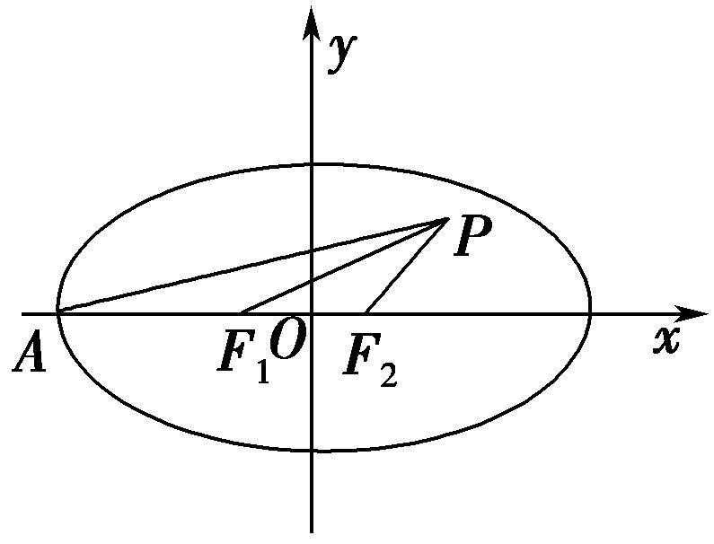
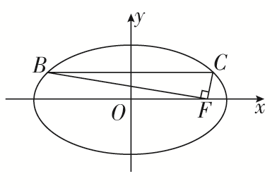
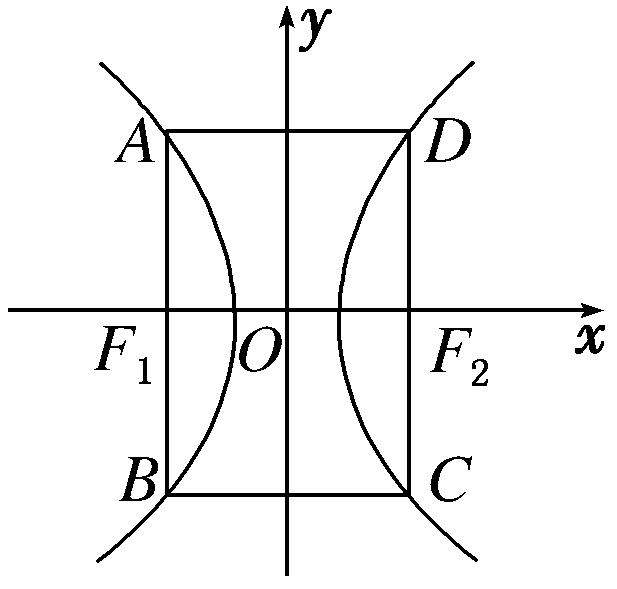
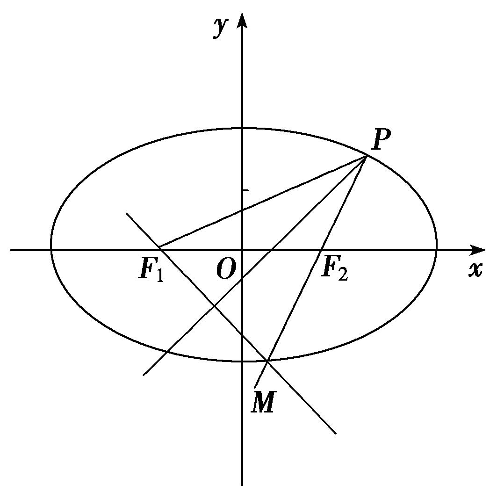
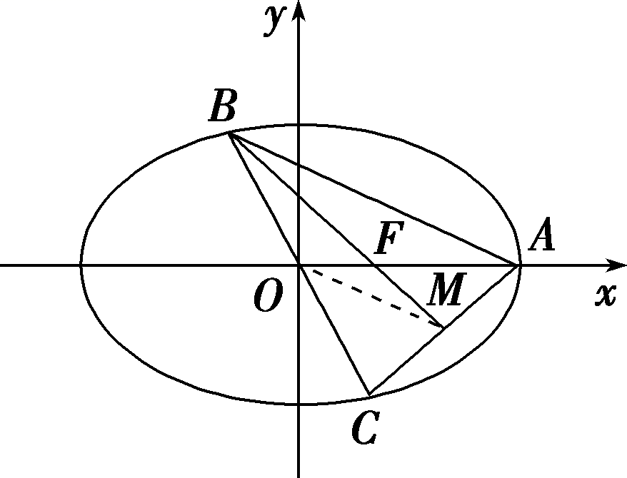
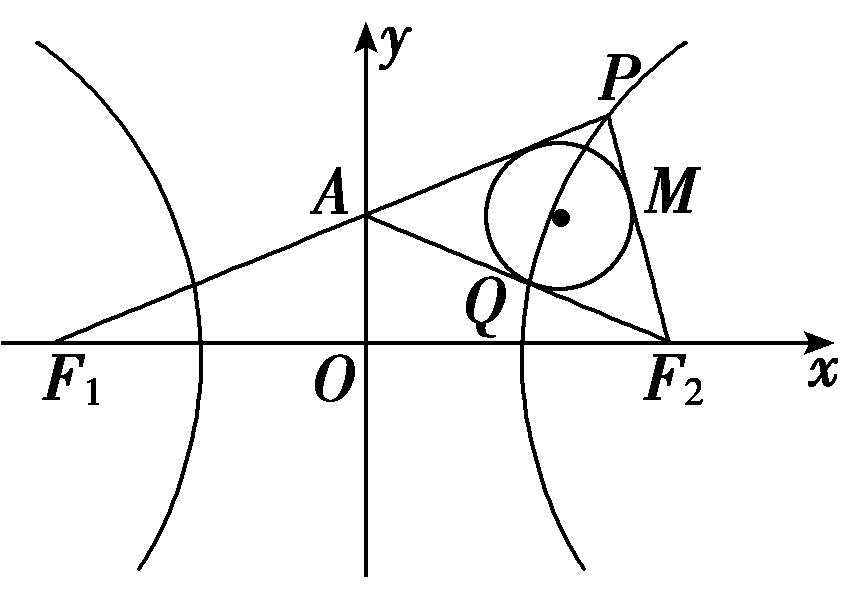
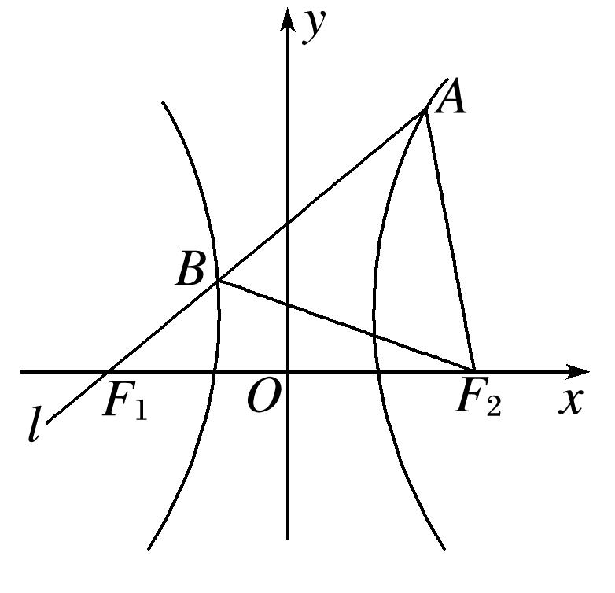
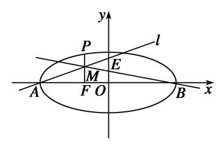

<strong>专题02　建立</strong><em><strong>f</strong></em><strong>(</strong><em><strong>a</strong></em><strong>，</strong><em><strong>b</strong></em><strong>，</strong><em><strong>c</strong></em><strong>)＝0模型</strong>

<strong>1．</strong><em><strong>f</strong></em><strong>(</strong><em><strong>a</strong></em><strong>，</strong><em><strong>b</strong></em><strong>，</strong><em><strong>c</strong></em><strong>)＝0型(</strong>明显<strong>)</strong>

所谓明显型就是题目中有明显的等量关系，在计算离心率的大小时，根据题目中的条件，建立*a*，*b*，*c*之间的齐次等量关系*f*(*a*，*b*，*c*)＝0，再化归为关于离心率*e*的方程求解．

**【例题选讲】**

<strong>[例6]</strong>　(27)(2016·全国Ⅰ)直线<em>l</em>经过椭圆的一个顶点和一个焦点，若椭圆中心到<em>l</em>的距离为其短轴长的，则该椭圆的离心率为(　　)

A．　　　　　　　　B．　　　　　　　　C．　　　　　　　　D．

<strong>答案</strong>　B　<strong>解析</strong>　不妨设椭圆的方程为＋＝1(<em>a</em>&gt;<em>b</em>&gt;0)，右焦点<em>F</em>(<em>c</em>，0)，则直线<em>l</em>的方程为＋＝1，即<em>bx</em>＋<em>cy</em>－<em>bc</em>＝0．由题意＝<em>b</em>，且<em>a</em>2＝<em>b</em>2＋<em>c</em>2，得<em>b</em>2<em>c</em>2＝<em>b</em>2<em>a</em>2，所以<em>e</em>＝＝．

(28)(2018·全国Ⅱ)已知<em>F</em>1，<em>F</em>2是椭圆<em>C</em>：＋＝1(<em>a</em>＞<em>b</em>＞0)的左、右焦点，<em>A</em>是<em>C</em>的左顶点，点<em>P</em>在过<em>A</em>且斜率为的直线上，△<em>PF</em>1<em>F</em>2为等腰三角形，∠<em>F</em>1<em>F</em>2<em>P</em>＝120°，则<em>C</em>的离心率为(　　)

A．　　　　　　　　B．　　　　　　　　C．　　　　　　　　D．

<strong>答案　D　解析</strong>　由题意可得椭圆的焦点在<em>x</em>轴上，如图所示，设|<em>F</em>1<em>F</em>2|＝2<em>c</em>，∵△<em>PF</em>1<em>F</em>2为等腰三角形，且∠<em>F</em>1<em>F</em>2<em>P</em>＝120°，∴|<em>PF</em>2|＝|<em>F</em>1<em>F</em>2|＝2<em>c</em>.∵|<em>OF</em>2|＝<em>c</em>，∴点<em>P</em>坐标为(<em>c</em>＋2<em>c</em>cos 60°，2<em>c</em>sin 60°)，即点<em>P</em>(2<em>c</em>，<em>c</em>)．∵点<em>P</em>在过点<em>A</em>，且斜率为的直线上，∴＝，解得＝，∴<em>e</em>＝，故选D.

(29)已知双曲线*Γ*：－＝1(*a*>0，*b*>0)，过双曲线*Γ*的右焦点*F*，且倾斜角为的直线*l*与双曲线*Γ*交于*A*，*B*两点，*O*是坐标原点，若∠*AOB*＝∠*OAB*，则双曲线*Γ*的离心率为(　　)

A．　　　　　B．　　　　　C．　　　　　D．

<strong>答案</strong>　C　<strong>解析</strong>　由题意可知<em>AB</em>是通径，根据双曲线的对称性和∠<em>AOB</em>＝∠<em>OAB</em>，可知△<em>AOB</em>为等边三角形，所以tan∠<em>AOF</em>＝＝，整理得<em>b</em>2＝<em>ac</em>，由<em>c</em>2＝<em>a</em>2＋<em>b</em>2，得<em>c</em>2＝<em>a</em>2＋<em>ac</em>，两边同时除以<em>a</em>2，得<em>e</em>2－<em>e</em>－1＝0，解得<em>e</em>＝．故选C．

(30) (2016·江苏)如图，在平面直角坐标系*xOy*中，*F*是椭圆＋＝1(*a*>*b*>0)的右焦点，直线*y*＝与椭圆交于*B*，*C*两点，且∠*BFC*＝90°，则该椭圆的离心率是\_\_\_\_\_\_\_\_．

<strong>答案　　解析</strong>　由已知条件易得<em>B</em>，<em>C</em>，<em>F</em>(<em>c</em>，0)，∴＝<em>c</em>＋<em>a</em>，－，＝<em>c</em>－<em>a</em>，－，由∠<em>BFC</em>＝90°，可得·＝0，所以＋2＝0，<em>c</em>2－<em>a</em>2＋<em>b</em>2＝0，即4<em>c</em>2－3<em>a</em>2＋(<em>a</em>2－<em>c</em>2)＝0，亦即3<em>c</em>2＝2<em>a</em>2，所以＝，则<em>e</em>＝＝．

(31)已知*F*为双曲线*C*：－＝1(*a*＞0，*b*＞0)的左焦点，直线*l*经过点*F*，若点*A*(*a*，0)，*B*(0，*b*)关于直线*l*对称，则双曲线*C*的离心率为(　　)

A．　　　　　B．　　　　　C．＋1　　　　　D．＋1

<strong>答案</strong>　C　<strong>解析</strong>　由点<em>A</em>(<em>a</em>，0)，<em>B</em>(0，<em>b</em>)关于直线<em>l</em>对称，可得直线<em>l</em>为线段<em>AB</em>的垂直平分线，线段<em>AB</em>的中点的坐标为，直线<em>AB</em>的斜率为－，可得直线<em>l</em>的方程为<em>y</em>－＝，令<em>y</em>＝0，可得<em>x</em>＝<em>a</em>－，由题意可得－<em>c</em>＝<em>a</em>－，即有<em>a</em>(<em>a</em>＋2<em>c</em>)＝<em>b</em>2＝<em>c</em>2－<em>a</em>2，即<em>c</em>2－2<em>ac</em>－2<em>a</em>2＝0，由<em>e</em>＝，可得<em>e</em>2－2<em>e</em>－2＝0，解得<em>e</em>＝1＋(<em>e</em>＝1－舍去)，故选C．

(32)椭圆＋＝1(<em>a</em>&gt;<em>b</em>&gt;0)，<em>F</em>1，<em>F</em>2为椭圆的左、右焦点，<em>O</em>为坐标原点，点<em>P</em>为椭圆上一点，|<em>OP</em>|＝<em>a</em>，且|<em>PF</em>1|，|<em>F</em>1<em>F</em>2|，|<em>PF</em>2|成等比数列，则椭圆的离心率为(　　)

A．　　　　　　　　B．　　　　　　　　C．　　　　　　　　D．

<strong>答案</strong>　D　<strong>解析</strong>　设<em>P</em>(<em>x</em>，<em>y</em>)，则|<em>OP</em>|2＝<em>x</em>2＋<em>y</em>2＝，由椭圆定义得，|<em>PF</em>1|＋|<em>PF</em>2|＝2<em>a</em>，∴|<em>PF</em>1|2＋2|<em>PF</em>1||<em>PF</em>2|＋|<em>PF</em>2|2＝4<em>a</em>2，又∵|<em>PF</em>1|，|<em>F</em>1<em>F</em>2|，|<em>PF</em>2|成等比数列，∴|<em>PF</em>1|·|<em>PF</em>2|＝|<em>F</em>1<em>F</em>2|2＝4<em>c</em>2，则|<em>PF</em>1|2＋|<em>PF</em>2|2＋8<em>c</em>2＝4<em>a</em>2，∴(<em>x</em>＋<em>c</em>)2＋<em>y</em>2＋(<em>x</em>－<em>c</em>)2＋<em>y</em>2＋8<em>c</em>2＝4<em>a</em>2，整理得<em>x</em>2＋<em>y</em>2＋5<em>c</em>2＝2<em>a</em>2，即＋5<em>c</em>2＝2<em>a</em>2，整理得＝，∴椭圆的离心率<em>e</em>＝＝．

**【对点训练】**

23．*P*是椭圆＋＝1(*a*＞*b*＞0)上的一点，*A*为左顶点，*F*为右焦点，*PF*⊥*x*轴，若tan∠*PAF*＝，则椭

圆的离心率*e*为(　　)

A．　　　　　　　　B．　　　　　　　　C．　　　　　　　　D．

23．<strong>答案</strong>　D　<strong>解析</strong>　不妨设点<em>P</em>在第一象限，因为<em>PF</em>⊥<em>x</em>轴，所以<em>xP</em>＝<em>c</em>，将<em>xP</em>＝<em>c</em>代入椭圆方程得<em>yP</em>

＝，即|<em>PF</em>|＝，则tan∠<em>PAF</em>＝＝＝，结合<em>b</em>2＝<em>a</em>2－<em>c</em>2，整理得2<em>c</em>2＋<em>ac</em>－<em>a</em>2＝0，两边同时除以<em>a</em>2得2<em>e</em>2＋<em>e</em>－1＝0，解得<em>e</em>＝或<em>e</em>＝－1(舍去)．故选D．

24．已知双曲线*E*：－＝1(*a*＞0，*b*＞0)，若矩形*ABCD*的四个顶点在*E*上，*AB*，*CD*的中点为*E*的两

个焦点，且2|*AB*|＝3|*BC*|，则*E*的离心率是\_\_\_\_\_\_\_\_．

24．<strong>答案</strong>　2　<strong>解析</strong>　如图，由题意知|<em>AB</em>|＝，|<em>BC</em>|＝2<em>c</em>．又2|<em>AB</em>|＝3|<em>BC</em>|，∴2×＝3×2<em>c</em>，即2<em>b</em>2＝

3<em>ac</em>，∴2(<em>c</em>2－<em>a</em>2)＝3<em>ac</em>，两边同除以<em>a</em>2并整理得2<em>e</em>2－3<em>e</em>－2＝0，解得<em>e</em>＝2(负值舍去)．

25．已知椭圆＋＝1(*a*>*b*>0)的左顶点为*M*，上顶点为*N*，右焦点为*F*，若·＝0，则椭圆的离心率

为(　　)

A．　　　　　　　B．　　　　　　　C．　　　　　　　D．

25．<strong>答案</strong>　D　<strong>解析</strong>　由题意知，<em>M</em>(－<em>a</em>，0)，<em>N</em>(0，<em>b</em>)，<em>F</em>(<em>c</em>，0)，∴＝(－<em>a</em>，－<em>b</em>)，＝(<em>c</em>，－<em>b</em>)．∵·

＝0，∴－<em>ac</em>＋<em>b</em>2＝0，即<em>b</em>2＝<em>ac</em>．又<em>b</em>2＝<em>a</em>2－<em>c</em>2，∴<em>a</em>2－<em>c</em>2＝<em>ac</em>．∴<em>e</em>2＋<em>e</em>－1＝0，解得<em>e</em>＝或<em>e</em>＝(舍去)．∴椭圆的离心率为，故选D．

26．已知椭圆＋＝1(<em>a</em>＞<em>b</em>＞0)的左焦点为<em>F</em>1(－<em>c</em>，0)，右顶点为<em>A</em>，上顶点为<em>B</em>，现过<em>A</em>点作直线<em>F</em>1<em>B</em>

的垂线，垂足为*T*，若直线*OT*(*O*为坐标原点)的斜率为－，则该椭圆的离心率为\_\_\_\_\_\_\_\_．

26．答案　　解析　因为椭圆＋＝1(<em>a</em>＞<em>b</em>＞0)，<em>A</em>，<em>B</em>和<em>F</em>1点坐标分别为(<em>a</em>，0)，(0，<em>b</em>)，(－<em>c</em>，0)，

所以直线<em>BF</em>1的方程是<em>y</em>＝<em>x</em>＋<em>b</em>，<em>OT</em>的方程是<em>y</em>＝－<em>x</em>．联立解得<em>T</em>点坐标为，直线<em>AT</em>的斜率为－．由<em>AT</em>⊥<em>BF</em>1得，－×＝－1，∴3<em>b</em>2＝4<em>ac</em>＋<em>c</em>2，∴3(<em>a</em>2－<em>c</em>2)＝4<em>ac</em>＋<em>c</em>2，∴4<em>e</em>2＋4<em>e</em>－3＝0，又0＜<em>e</em>＜1，所以<em>e</em>＝．

27．已知<em>F</em>1，<em>F</em>2为双曲线的焦点，过<em>F</em>2作垂直于实轴的直线交双曲线于<em>A</em>，<em>B</em>两点，<em>BF</em>1交<em>y</em>轴于点<em>C</em>，

若<em>AC</em>⊥<em>BF</em>1，则双曲线的离心率为(　　)

A．　　　　　　　　B．　　　　　　　　C．2 　　　　　　　　D．2

27．<strong>答案</strong>　B　<strong>解析</strong>　不妨设双曲线方程为－＝1(<em>a</em>&gt;0，<em>b</em>&gt;0)，由已知，取<em>A</em>点坐标为，取<em>B</em>点

坐标为，则<em>C</em>点坐标为且<em>F</em>1(－<em>c</em>，0)．由<em>AC</em>⊥<em>BF</em>1知·＝0，又＝，＝，可得2<em>c</em>2－＝0，又<em>b</em>2＝<em>c</em>2－<em>a</em>2，可得3<em>c</em>4－10<em>c</em>2<em>a</em>2＋3<em>a</em>4＝0，则有3<em>e</em>4－10<em>e</em>2＋3＝0，可得<em>e</em>2＝3或，又<em>e</em>&gt;1，所以<em>e</em>＝．故选B．

28．(2018·浙江)已知椭圆<em>C</em>：＋＝1(<em>a</em>＞<em>b</em>＞0)的左焦点<em>F</em>1关于直线<em>y</em>＝－<em>c</em>的对称点<em>Q</em>在椭圆上，

则椭圆的离心率是(　　)

A．－1　　　　　　B．　　　　　　C．2－　　　　　　D．

28．<strong>答案</strong>　C　<strong>解析</strong>　∵左焦点<em>F</em>1关于直线<em>y</em>＝－<em>c</em>的对称点为<em>Q</em>，∴|<em>F</em>1<em>Q</em>|＝2<em>c</em>．设椭圆的右焦点为

<em>F</em>2，则|<em>F</em>1<em>F</em>2|＝2<em>c</em>．由椭圆定义知，|<em>F</em>2<em>Q</em>|＝2<em>a</em>－|<em>F</em>1<em>Q</em>|＝2<em>a</em>－2<em>c</em>．在Rt△<em>F</em>1<em>QF</em>2中，|<em>F</em>1<em>F</em>2|2＋|<em>F</em>1<em>Q</em>|2＝|<em>F</em>2<em>Q</em>|2，即(2<em>c</em>)2＋(2<em>c</em>)2＝(2<em>a</em>－2<em>c</em>)2，∴<em>c</em>2＋2<em>ac</em>－<em>a</em>2＝0，故<em>e</em>2＋2<em>e</em>－1＝0，∴<em>e</em>＝2－(负值舍去)．故选C．

29．(2018·浙江)已知双曲线<em>x</em>2－＝1(<em>b</em>＞0)的右焦点为<em>F</em>，过点<em>F</em>作一条渐近线的垂线，垂足为<em>M</em>．若点

*M*的纵坐标为，则双曲线的离心率是\_\_\_\_\_\_\_\_．

29．<strong>答案　　解析</strong>　∵点<em>M</em>的纵坐标为，∴点<em>M</em>在渐近线<em>y</em>＝<em>x</em>上．∵双曲线方程为<em>x</em>2－＝1，

∴<em>a</em>＝1，<em>F</em>(<em>c</em>，0)，渐近线方程为<em>y</em>＝±<em>bx</em>．则|<em>FM</em>|＝，∵<em>c</em>2＝<em>a</em>2＋<em>b</em>2＝1＋<em>b</em>2，∴|<em>FM</em>|＝<em>b</em>．∵△<em>OMF</em>为直角三角形，∴<em>OM</em>＝＝＝<em>a</em>．∴<em>OM</em>×<em>FM</em>＝<em>OF</em>×<em>yM</em>，即<em>cyM</em>＝<em>ab</em>，∴<em>c</em>2<em>y</em>＝<em>b</em>2．∵<em>yM</em>＝，∴<em>b</em>2＝<em>c</em>2．又∵<em>c</em>2＝<em>a</em>2＋<em>b</em>2，∴<em>a</em>2＝<em>c</em>2，∴<em>e</em>＝．

30．已知直线*l*的倾斜角为45°，直线*l*与双曲线*C*：－＝1(*a*>0，*b*>0)的左、右两支分别交于*M*，*N*两

点，且<em>MF</em>1，<em>NF</em>2都垂直于<em>x</em>轴(其中<em>F</em>1，<em>F</em>2分别为双曲线<em>C</em>的左、右焦点)，则该双曲线的离心率为(　　)

A．　　　　　　　　B．　　　　　　　　C．－1　　　　　　　　D．

30．<strong>答案</strong>　D　<strong>解析</strong>　根据题意及双曲线的对称性，可知直线<em>l</em>过坐标原点，|<em>MF</em>1|＝|<em>NF</em>2|．设点<em>M</em>(－<em>c</em>，

<em>y</em>0)，则<em>N</em>(<em>c</em>，－<em>y</em>0)，－＝1，即|<em>y</em>0|＝．由直线<em>l</em>的倾斜角为45°，且|<em>MF</em>1|＝|<em>NF</em>2|＝|<em>y</em>0|，得|<em>y</em>0|＝<em>c</em>，即＝<em>c</em>，整理得<em>c</em>2－<em>ac</em>－<em>a</em>2＝0，即<em>e</em>2－<em>e</em>－1＝0，解得<em>e</em>＝或<em>e</em>＝(舍去)，故选D．

31．从椭圆＋＝1(<em>a</em>&gt;<em>b</em>&gt;0)上一点<em>P</em>向<em>x</em>轴作垂线，垂足恰为左焦点<em>F</em>1，<em>A</em>是椭圆与<em>x</em>轴正半轴的交点，

*B*是椭圆与*y*轴正半轴的交点，且*AB*∥*OP*(*O*是坐标原点)，则该椭圆的离心率是\_\_\_\_\_\_\_\_．

31．<strong>答案　　解析</strong>　由题意可设<em>P</em>(－<em>c</em>，<em>y</em>0)(<em>c</em>为半焦距)，<em>kOP</em>＝－，<em>kAB</em>＝－，由于<em>OP</em>∥<em>AB</em>，所以－

＝－，<em>y</em>0＝，把<em>P</em>代入椭圆方程得＋＝1，所以＝，所以<em>e</em>＝＝.

32．已知双曲线<em>C</em>：－＝1(<em>a</em>&gt;0，<em>b</em>&gt;0)的左、右焦点分别为<em>F</em>1，<em>F</em>2，<em>P</em>为双曲线<em>C</em>上第二象限内一点，

若直线<em>y</em>＝<em>x</em>恰为线段<em>PF</em>2的垂直平分线，则双曲线<em>C</em>的离心率为(　　)

A．　　　　　　　　B．　　　　　　　　C．　　　　　　　　D．

32．**答案**　C　**解析**　如图，

直线<em>PF</em>2的方程为<em>y</em>＝－(<em>x</em>－<em>c</em>)，设直线<em>PF</em>2与直线<em>y</em>＝<em>x</em>的交点为<em>N</em>，易知<em>N</em>．又线段<em>PF</em>2的中点为<em>N</em>，所以<em>P</em>．因为点<em>P</em>在双曲线<em>C</em>上，所以－＝1，即5<em>a</em>2＝<em>c</em>2，所以<em>e</em>＝＝．故选C．

33．已知椭圆*C*：＋＝1(*a*>*b*>0)的右顶点为*A*，经过原点的直线*l*交椭圆*C*于*P*，*Q*两点，若|*PQ*|＝*a*，

*AP*⊥*PQ*，则椭圆*C*的离心率为\_\_\_\_\_\_\_\_．

33．<strong>答案　　解析</strong>　不妨设点<em>P</em>在第一象限，<em>O</em>为坐标原点，由对称性可得|<em>OP</em>|＝＝，因为<em>AP</em>

⊥<em>PQ</em>，所以在Rt△<em>POA</em>中，cos∠<em>POA</em>＝＝，故∠<em>POA</em>＝60°，易得<em>P</em>，代入椭圆方程得＋＝1，故<em>a</em>2＝5<em>b</em>2＝5(<em>a</em>2－<em>c</em>2)，所以椭圆<em>C</em>的离心率<em>e</em>＝．

34．(2018·全国Ⅲ)设<em>F</em>1，<em>F</em>2是双曲线<em>C</em>：－＝1(<em>a</em>&gt;0，<em>b</em>&gt;0)的左，右焦点，<em>O</em>是坐标原点．过<em>F</em>2作<em>C</em>

的一条渐近线的垂线，垂足为*P*．若＝，则*C*的离心率为(　　)

A．　　　　　　　　B．2　　　　　　　　C．　　　　　　　　D．

34．<strong>答案</strong>　C　<strong>解析</strong>　方法一：设渐近线的方程为<em>bx</em>－<em>ay</em>＝0，则直线<em>PF</em>2的方程为<em>ax</em>＋<em>by</em>－<em>ac</em>＝0，由

可得<em>P</em>，由<em>F</em>1(－<em>c，</em>0)及|<em>PF</em>1|＝|<em>OP</em>|，得＝×，化简可得3<em>a</em>2＝<em>c</em>2，即<em>e</em>＝．

方法二：因为|<em>PF</em>2|＝<em>b</em>，|<em>OF</em>2|＝<em>c</em>，∴|<em>PO</em>|＝<em>a</em>，在Rt△<em>POF</em>2中，设∠<em>PF</em>2<em>O</em>＝<em>θ</em>，则有cos<em>θ</em>＝＝；∵在△<em>PF</em>1<em>F</em>2中，cos<em>θ</em>＝＝，∴＝⇒<em>b</em>2＋4<em>c</em>2－6<em>a</em>2＝4<em>b</em>2⇒4<em>c</em>2－6<em>a</em>2＝3<em>c</em>2－3<em>a</em>2⇒<em>c</em>2＝3<em>a</em>2⇒<em>e</em>＝．

35．已知双曲线*C*：－＝1(*a*>0，*b*>0)的右焦点为*F*，过点*F*向双曲线的一条渐近线引垂线，垂足为*M*，

交另一条渐近线于*N*，若2＝，则双曲线的离心率为\_\_\_\_\_\_\_\_．

35．<strong>答案　　解析</strong>　设右焦点<em>F</em>(<em>c</em>，0)，渐近线<em>OM</em>，<em>ON</em>的方程分别为<em>y</em>＝<em>x</em>，<em>y</em>＝－<em>x</em>．不失一般性，

设过<em>F</em>的垂线为<em>x</em>＝－<em>y</em>＋<em>c</em>．由得<em>yN</em>＝．由得<em>yM</em>＝．因为2＝，所以－2<em>yM</em>＝<em>yN</em>，即＝，易解得＝，所以<em>e</em>＝ ＝＝．

36．已知椭圆<em>C</em>：＋＝1(<em>a</em>＞<em>b</em>＞0)的左、右焦点分别为<em>F</em>1，<em>F</em>2，过<em>F</em>2(1，0)且斜率为1的直线交椭圆于

<em>A</em>，<em>B</em>，若三角形<em>F</em>1<em>AB</em>的面积等于<em>b</em>2，则该椭圆的离心率为\_\_\_\_\_\_\_\_．

36．<strong>答案</strong>　－1　<strong>解析</strong>　设椭圆的焦距为2<em>c</em>，<em>A</em>(<em>x</em>1，<em>y</em>1)，<em>B</em>(<em>x</em>2，<em>y</em>2)，由题意得直线<em>AB</em>的方程为<em>y</em>＝<em>x</em>－1，

与椭圆方程联立，消去<em>x</em>化简得(<em>a</em>2＋<em>b</em>2)<em>y</em>2＋2<em>b</em>2<em>y</em>＋<em>b</em>2－<em>a</em>2<em>b</em>2＝0，由根与系数的关系得，<em>y</em>1＋<em>y</em>2＝，<em>y</em>1·<em>y</em>2＝，则△<em>F</em>1<em>AB</em>的面积为×2<em>c</em>|<em>y</em>1－<em>y</em>2|＝＝<em>b</em>2，化简得－2<em>a</em>2＋2<em>a</em>4＋2<em>a</em>2<em>b</em>2＝<em>b</em>2(<em>a</em>2＋<em>b</em>2)2，又因为<em>b</em>2＝<em>a</em>2－1，所以4<em>a</em>4－8<em>a</em>2＋1＝0，解得<em>a</em>＝，则椭圆的离心率<em>e</em>＝＝－1．

<strong>2．</strong><em><strong>f</strong></em><strong>(</strong><em><strong>a</strong></em><strong>，</strong><em><strong>b</strong></em><strong>，</strong><em><strong>c</strong></em><strong>)＝0型(</strong>隐含<strong>)</strong>

所谓隐含型就是题目中没有明显的等量关系，在计算离心率的大小时，根据题目中的条件，利用图形中存在的几何特征掘几何关系，运用点在曲线上或垂直关系或用余弦定理等，建立*a*，*b*，*c*之间的齐次等量关系*f*(*a*，*b*，*c*)＝0，再化归为关于离心率*e*的方程求解．

**【例题选讲】**

<strong>[例7</strong>　(33)过双曲线<em>C</em>：－＝1(<em>a</em>&gt;0，<em>b</em>&gt;0)左焦点<em>F</em>的直线<em>l</em>与<em>C</em>交于<em>M</em>，<em>N</em>两点，且＝3，若<em>OM</em>⊥<em>FN</em>，则<em>C</em>的离心率为(　　)

A．2　　　　　　　　B．　　　　　　　　C．3　　　　　　　　D．

<strong>答案</strong>　B　<strong>解析</strong>　设双曲线的右焦点为<em>F</em>′，取<em>MN</em>的中点<em>P</em>，连接<em>F</em>′<em>P</em>，<em>F</em>′<em>M</em>，<em>F</em>′<em>N</em>，如图所示，由＝3，可知|<em>MF</em>|＝|<em>MP</em>|＝|<em>NP</em>|．又<em>O</em>为<em>FF</em>′的中点，可知<em>OM</em>∥<em>PF</em>′．∵<em>OM</em>⊥<em>FN</em>，∴<em>PF</em>′⊥<em>FN</em>．∴<em>PF</em>′为线段<em>MN</em>的垂直平分线．∴|<em>NF</em>′|＝|<em>MF</em>′|．设|<em>MF</em>|＝<em>t</em>，由双曲线定义可知|<em>NF</em>′|＝3<em>t</em>－2<em>a</em>，|<em>MF</em>′|＝2<em>a</em>＋<em>t</em>，则3<em>t</em>－2<em>a</em>＝2<em>a</em>＋<em>t</em>，解得<em>t</em>＝2<em>a</em>．在Rt△<em>MF</em>′<em>P</em>中，|<em>PF</em>′|＝＝＝2<em>a</em>，∴|<em>OM</em>|＝|<em>PF</em>′|＝<em>a</em>．在Rt△<em>MFO</em>中，|<em>MF</em>|2＋|<em>OM</em>|2＝|<em>OF</em>|2，∴4<em>a</em>2＋3<em>a</em>2＝<em>c</em>2⇒<em>e</em>＝．故选B．

(34)已知椭圆<em>C</em>：＋＝1(<em>a</em>&gt;<em>b</em>&gt;0)的左、右焦点分别为<em>F</em>1，<em>F</em>2，<em>P</em>为椭圆<em>C</em>上一点，且∠<em>F</em>1<em>PF</em>2＝，若<em>F</em>1关于∠<em>F</em>1<em>PF</em>2平分线的对称点在椭圆<em>C</em>上，则该椭圆的离心率为\_\_\_\_\_\_\_\_．

<strong>答案　　解析</strong>　如图，∵<em>F</em>1关于∠<em>F</em>1<em>PF</em>2平分线的对称点在椭圆<em>C</em>上，∴<em>P</em>，<em>F</em>2，<em>M</em>三点共线，

设|<em>PF</em>1|＝<em>m</em>，则|<em>PM</em>|＝<em>m</em>，|<em>MF</em>1|＝<em>m</em>．又|<em>PF</em>1|＋|<em>PM</em>|＋|<em>MF</em>1|＝4<em>a</em>＝3<em>m</em>．∵|<em>PF</em>1|＝<em>a</em>，|<em>PF</em>2|＝<em>a</em>．由余弦定理可得|<em>PF</em>1|2＋|<em>PF</em>2|2－2|<em>PF</em>1||<em>PF</em>2|cos ＝|<em>F</em>1<em>F</em>2|2，∴<em>a</em>2＝3<em>c</em>2，<em>e</em>＝＝．

(35)已知双曲线<em>C</em>：－＝1(<em>a</em>&gt;0，<em>b</em>&gt;0)的左、右焦点分别为<em>F</em>1，<em>F</em>2，<em>O</em>为坐标原点．<em>P</em>是双曲线在第一象限上的点，直线<em>PO</em>，<em>PF</em>2分别交双曲线<em>C</em>左、右支于<em>M</em>，<em>N</em>．若|<em>PF</em>1|＝2|<em>PF</em>2|，且∠<em>MF</em>2<em>N</em>＝60°，则双曲线<em>C</em>的离心率为\_\_\_\_\_\_\_\_．

<strong>答案　　解析</strong>　由题意，|<em>PF</em>1|＝2|<em>PF</em>2|，由双曲线的定义可得，|<em>PF</em>1|－|<em>PF</em>2|＝2<em>a</em>，可得|<em>PF</em>1|＝4<em>a</em>，|<em>PF</em>2|＝2<em>a</em>，又|<em>F</em>1<em>O</em>|＝|<em>F</em>2<em>O</em>|，|<em>PO</em>|＝|<em>MO</em>|，得四边形<em>PF</em>1<em>MF</em>2为平行四边形，又∠<em>MF</em>2<em>N</em>＝60°，可得∠<em>F</em>1<em>PF</em>2＝60°，在△<em>PF</em>1<em>F</em>2中，由余弦定理可得，4<em>c</em>2＝16<em>a</em>2＋4<em>a</em>2－2·4<em>a</em>·2<em>a</em>·cos 60°，即4<em>c</em>2＝20<em>a</em>2－8<em>a</em>2，<em>c</em>2＝3<em>a</em>2，可得<em>c</em>＝<em>a</em>，所以<em>e</em>＝＝．

(36)已知&lt;text style="it<em>a</em>lic"&gt;<em>&lt;text style="italic"&gt;F</em>&lt;/text&gt;&lt;/text&gt;&lt;text style="su<em>b</em>script"&gt;1&lt;/text&gt;，F&lt;text style="subscript"&gt;2&lt;/text&gt;是双曲线 $\frac{x^{2}}{a^{2}}$ － $\frac{y^{2}}{b^{2}}$ =&lt;text style="su<em>b</em>script"&gt;1&lt;/text&gt;(<em>a</em>&gt;0，b&gt;0)的左、右焦点，过<em>&lt;text style="italic"&gt;&lt;text style="italic"&gt;F</em>&lt;/text&gt;&lt;/text&gt;&lt;text style="subscript"&gt;2&lt;/text&gt;作双曲线一条渐近线的垂线，垂足为点<em>A</em>，交另一条渐近线于点<em>B</em>，且 $\overset{\to }{AF_{2}}$ ＝ $\frac{1}{3}\overset{\to }{F_{2}B}$ ，则该双曲线的离心率为(　　)

A． $\frac{\sqrt{6}}{2}$ 　　　　　　　　B． $\frac{\sqrt{5}}{2}$ 　　　　　　　　C． $\sqrt{3}$ 　　　　　　　　D．2

&lt;t<em>e</em>&lt;text style="it&lt;text style="it&lt;text style="it<em>a</em>lic"&gt;a&lt;/text&gt;li<em>c</em>"&gt;a&lt;/text&gt;li<em>c</em>"&gt;x&lt;/text&gt;t st<em>y</em>le="<em>&lt;text style="italic"&gt;&lt;text style="italic"&gt;&lt;text style="italic"&gt;&lt;text style="italic"&gt;b</em>&lt;/text&gt;&lt;/text&gt;&lt;/text&gt;&lt;/text&gt;ol<em>d</em>"&gt;答案　&lt;/text&gt;A　<strong>解析</strong>　由&lt;text style="itali<em>c</em>"&gt;<em>&lt;text style="italic"&gt;F</em>&lt;/text&gt;&lt;/text&gt;&lt;text style="subscript"&gt;&lt;text style="subscript"&gt;&lt;text style="subscript"&gt;&lt;text style="superscript"&gt;&lt;text style="superscript"&gt;&lt;text style="superscript"&gt;&lt;text style="superscript"&gt;&lt;text style="superscript"&gt;&lt;text style="superscript"&gt;2&lt;/text&gt;&lt;/text&gt;&lt;/text&gt;&lt;/text&gt;&lt;/text&gt;&lt;/text&gt;&lt;/text&gt;&lt;/text&gt;&lt;/text&gt;(c，0)到渐近线y＝ $\frac{b}{a}$ &lt;t<em>e</em>xt style="it&lt;text style="it&lt;text style="it<em>a</em>lic"&gt;a&lt;/text&gt;li<em>c</em>"&gt;a&lt;/text&gt;li<em>c</em>"&gt;x&lt;/text&gt;的距离为<em>d</em>＝ $\frac{bc}{\sqrt{a^{2}+b^{2}}}$ ＝&lt;t<em>e</em>xt style="it&lt;text style="it&lt;text style="it<em>a</em>lic"&gt;a&lt;/text&gt;li<em>c</em>"&gt;a&lt;/text&gt;li<em>c</em>"&gt;<em>&lt;text style="italic"&gt;&lt;text style="italic"&gt;&lt;text style="italic"&gt;b</em>&lt;/text&gt;&lt;/text&gt;&lt;/text&gt;&lt;/text&gt;，即有| $\overset{\to }{AF_{2}}$ |＝&lt;t<em>e</em>xt style="it&lt;text style="it&lt;text style="it<em>a</em>lic"&gt;a&lt;/text&gt;li<em>c</em>"&gt;a&lt;/text&gt;li<em>c</em>"&gt;<em>&lt;text style="italic"&gt;&lt;text style="italic"&gt;&lt;text style="italic"&gt;b</em>&lt;/text&gt;&lt;/text&gt;&lt;/text&gt;&lt;/text&gt;，则| $\overset{\to }{BF_{2}}$ |＝3&lt;t<em>e</em>xt style="it&lt;text style="it&lt;text style="it<em>a</em>lic"&gt;a&lt;/text&gt;li<em>c</em>"&gt;a&lt;/text&gt;li<em>c</em>"&gt;<em>&lt;text style="italic"&gt;&lt;text style="italic"&gt;&lt;text style="italic"&gt;b</em>&lt;/text&gt;&lt;/text&gt;&lt;/text&gt;&lt;/text&gt;，在△A&lt;te<em>x</em>t st<em>y</em>le="itali<em>c</em>"&gt;<em>&lt;text style="italic"&gt;F</em>&lt;/text&gt;&lt;/text&gt;&lt;text style="subscript"&gt;&lt;text style="subscript"&gt;&lt;text style="subscript"&gt;&lt;text style="superscript"&gt;&lt;text style="superscript"&gt;&lt;text style="superscript"&gt;&lt;text style="superscript"&gt;&lt;text style="superscript"&gt;&lt;text style="superscript"&gt;2&lt;/text&gt;&lt;/text&gt;&lt;/text&gt;&lt;/text&gt;&lt;/text&gt;&lt;/text&gt;&lt;/text&gt;&lt;/text&gt;&lt;/text&gt;<em>O</em>中，| $\overset{\to }{OA}$ |＝&lt;t<em>e</em>xt style="it&lt;text style="it&lt;text style="it<em>a</em>lic"&gt;a&lt;/text&gt;li<em>c</em>"&gt;a&lt;/text&gt;li<em>c</em>"&gt;a，&lt;/text&gt;| $\overset{\to }{OF_{2}}$ |＝&lt;t<em>e</em>&lt;text style="it&lt;text style="it&lt;text style="it<em>a</em>lic"&gt;a&lt;/text&gt;li<em>c</em>"&gt;a&lt;/text&gt;li<em>c</em>"&gt;x&lt;/text&gt;t st<em>y</em>le="italic"&gt;c&lt;/text&gt;，tan∠<em>&lt;text style="italic"&gt;&lt;text style="italic"&gt;F</em>&lt;/text&gt;&lt;/text&gt;&lt;text style="su<em>&lt;text style="italic"&gt;&lt;text style="italic"&gt;&lt;text style="italic"&gt;&lt;text style="italic"&gt;b</em>&lt;/text&gt;&lt;/text&gt;&lt;/text&gt;&lt;/text&gt;script"&gt;&lt;text style="subscript"&gt;&lt;text style="subscript"&gt;&lt;text style="superscript"&gt;&lt;text style="superscript"&gt;&lt;text style="superscript"&gt;&lt;text style="superscript"&gt;&lt;text style="superscript"&gt;&lt;text style="superscript"&gt;2&lt;/text&gt;&lt;/text&gt;&lt;/text&gt;&lt;/text&gt;&lt;/text&gt;&lt;/text&gt;&lt;/text&gt;&lt;/text&gt;&lt;/text&gt;<em>O</em>A＝ $\frac{b}{a}$ ，又有∠A&lt;t<em>e</em>xt style="it&lt;text style="it&lt;text style="it<em>a</em>lic"&gt;a&lt;/text&gt;li<em>c</em>"&gt;a&lt;/text&gt;li<em>c</em>"&gt;O&lt;/text&gt;B＝&lt;te<em>x</em>t st<em>y</em>le="su<em>&lt;text style="italic"&gt;&lt;text style="italic"&gt;&lt;text style="italic"&gt;&lt;text style="italic"&gt;b</em>&lt;/text&gt;&lt;/text&gt;&lt;/text&gt;&lt;/text&gt;s<em>c</em>ript"&gt;&lt;text style="subscript"&gt;&lt;text style="subscript"&gt;&lt;text style="superscript"&gt;&lt;text style="superscript"&gt;&lt;text style="superscript"&gt;&lt;text style="superscript"&gt;&lt;text style="superscript"&gt;&lt;text style="superscript"&gt;2&lt;/text&gt;&lt;/text&gt;&lt;/text&gt;&lt;/text&gt;&lt;/text&gt;&lt;/text&gt;&lt;/text&gt;&lt;/text&gt;&lt;/text&gt;∠<em>&lt;text style="italic"&gt;&lt;text style="italic"&gt;F</em>&lt;/text&gt;&lt;/text&gt;2<em>&lt;text style="italic"&gt;OA</em>&lt;/text&gt;，则tan∠<em>&lt;text style="italic"&gt;AOB</em>&lt;/text&gt;= $\frac{4b}{a}$ = $\frac{2\times \frac{b}{a}}{1-(\frac{b}{a}) ^{2}}$ ，化简可得&lt;t<em>e</em>xt style="it&lt;text style="it<em>a</em>lic"&gt;a&lt;/text&gt;li<em>c</em>"&gt;a&lt;/text&gt;&lt;te&lt;text style="itali<em>c</em>"&gt;x&lt;/text&gt;t st<em>y</em>le="su<em>&lt;text style="italic"&gt;&lt;text style="italic"&gt;&lt;text style="italic"&gt;&lt;text style="italic"&gt;b</em>&lt;/text&gt;&lt;/text&gt;&lt;/text&gt;&lt;/text&gt;s<em>c</em>ript"&gt;&lt;text style="subscript"&gt;&lt;text style="subscript"&gt;&lt;text style="superscript"&gt;&lt;text style="superscript"&gt;&lt;text style="superscript"&gt;&lt;text style="superscript"&gt;&lt;text style="superscript"&gt;&lt;text style="superscript"&gt;2&lt;/text&gt;&lt;/text&gt;&lt;/text&gt;&lt;/text&gt;&lt;/text&gt;&lt;/text&gt;&lt;/text&gt;&lt;/text&gt;&lt;/text&gt;＝2b2，即有c2＝a2＋b2＝ $\frac{3}{2}$ &lt;t<em>e</em>xt style="it&lt;text style="it<em>a</em>lic"&gt;a&lt;/text&gt;li<em>c</em>"&gt;a&lt;/text&gt;&lt;te&lt;text style="itali<em>c</em>"&gt;x&lt;/text&gt;t st<em>y</em>le="su<em>&lt;text style="italic"&gt;&lt;text style="italic"&gt;&lt;text style="italic"&gt;&lt;text style="italic"&gt;b</em>&lt;/text&gt;&lt;/text&gt;&lt;/text&gt;&lt;/text&gt;s<em>c</em>ript"&gt;&lt;text style="subscript"&gt;&lt;text style="subscript"&gt;&lt;text style="superscript"&gt;&lt;text style="superscript"&gt;&lt;text style="superscript"&gt;&lt;text style="superscript"&gt;&lt;text style="superscript"&gt;&lt;text style="superscript"&gt;2&lt;/text&gt;&lt;/text&gt;&lt;/text&gt;&lt;/text&gt;&lt;/text&gt;&lt;/text&gt;&lt;/text&gt;&lt;/text&gt;&lt;/text&gt;，即有e＝ $\frac{c}{a}$ ＝ $\frac{\sqrt{6}}{2}$ ．故选A．

(37)设椭圆：＋＝1(*a*>*b*>0)的右顶点为*A*，右焦点为*F*，*B*为椭圆在第二象限内的点，直线*BO*交椭圆于点*C*，*O*为原点，若直线*BF*平分线段*AC*，则椭圆的离心率为(　　)

A．　　　　　　　　B．　　　　　　　　C．　　　　　　　　D．

<strong>答案</strong>　B　<strong>解析</strong>　如图，设点<em>M</em>为<em>AC</em>的中点，连接<em>OM</em>，则<em>OM</em>为△<em>ABC</em>的中位线，于是△<em>OFM</em>∽△<em>AFB</em>，且＝＝，即＝，解得<em>e</em>＝＝．故选B．

(38)已知双曲线<em>E</em>：－＝1(<em>a</em>＞0，<em>b</em>＞0)的左、右焦点分别为<em>F</em>1，<em>F</em>2，|<em>F</em>1<em>F</em>2|＝6，<em>P</em>是双曲线<em>E</em>右支上一点，<em>PF</em>1与<em>y</em>轴交于点<em>A</em>，△<em>PAF</em>2的内切圆与<em>AF</em>2相切于点<em>Q</em>．若|<em>AQ</em>|＝，则双曲线<em>E</em>的离心率是(　　)

A．2　　　　　　　　B．　　　　　　　　C．　　　　　　　　D．

<strong>答案</strong>　C　<strong>解析</strong>　如图，设△<em>PAF</em>2的内切圆与<em>PF</em>2相切于点<em>M</em>．依题意知，|<em>AF</em>1|＝|<em>AF</em>2|，根据双曲线的定义，以及<em>P</em>是双曲线<em>E</em>右支上一点，得2<em>a</em>＝|<em>PF</em>1|－|<em>PF</em>2|，根据三角形内切圆的性质，得|<em>PF</em>1|＝|<em>AF</em>1|＋|<em>PA</em>|＝|<em>AF</em>1|＋(|<em>PM</em>|＋|<em>AQ</em>|)，|<em>PF</em>2|＝|<em>PM</em>|＋|<em>MF</em>2|＝|<em>PM</em>|＋|<em>QF</em>2|＝|<em>PM</em>|＋(|<em>AF</em>2|－|<em>AQ</em>|)．所以2<em>a</em>＝2|<em>AO</em>|＝2，即<em>a</em>＝．因为|<em>F</em>1<em>F</em>2|＝6，所以<em>c</em>＝3，所以双曲线<em>E</em>的离心率是<em>e</em>＝＝＝，故选C．

(39)已知*F*是椭圆＋＝1(*a*＞*b*＞0)的右焦点，直线*y*＝*x*交椭圆于*A*，*B*两点，若cos∠*AFB*＝，则椭圆的离心率是\_\_\_\_\_\_\_\_．

<strong>答案　　解析</strong>　令<em>A</em>在第三象限，<em>B</em>在第一象限，将直线方程代入椭圆方程，求得<em>A</em>，<em>B</em>，故|<em>AB</em>|＝<em>a</em>·．在△<em>ABF</em>中运用面积公式得·|<em>AF</em>|·|<em>BF</em>|·sin∠<em>AFB</em>＝·|<em>OF</em>|·|<em>yA</em>－<em>yB</em>|，①．再运用余弦定理得|<em>AB</em>|2＝|<em>AF</em>|2＋|<em>BF</em>|2－2|<em>AF</em>|·|<em>BF</em>|·cos∠<em>AFB</em>，②．联立①②解得<em>e</em>＝＝．

(40)在平面上给定相异两点*A*，*B*，设*P*点在同一平面上且满足＝*λ*，当*λ*＞0且*λ*≠1时，*P*点的轨迹是一个圆，这个轨迹最先由古希腊数学家阿波罗尼斯发现，故我们称这个圆为阿波罗尼斯圆，现有椭圆＋＝1(*a*>*b*>0)，*A*，*B*为椭圆的长轴端点，*C*，*D*为椭圆的短轴端点，动点*P*满足＝2，△*PAB*的面积最大值为，△*PCD*面积的最小值为，则椭圆的离心率为\_\_\_\_\_\_\_\_．

<strong>答案　　解析</strong>　依题意<em>A</em>(－<em>a</em>，0)，<em>B</em>(<em>a</em>，0)，设<em>P</em>(<em>x</em>，<em>y</em>)，依题意得|<em>PA</em>|＝2|<em>PB</em>|，＝2，两边平方化简得2＋<em>y</em>2＝2，故圆心为，半径<em>r</em>＝．所以△<em>PAB</em>的最大面积为·2<em>a</em>·<em>a</em>＝，解得<em>a</em>＝2，△<em>PCD</em>的最小面积为·2<em>b</em>·＝<em>b</em>·＝，解得<em>b</em>＝1．故椭圆的离心率为<em>e</em>＝＝＝．

**【对点训练】**

37．已知<em>F</em>1，<em>F</em>2分别为椭圆＋＝1(<em>a</em>&gt;<em>b</em>&gt;0)的左、右焦点，点<em>P</em>是椭圆上位于第二象限内的点，延长<em>PF</em>1

交椭圆于点<em>Q</em>，若<em>PF</em>2⊥<em>PQ</em>，且|<em>PF</em>2|＝|<em>PQ</em>|，则椭圆的离心率为(　　)

A．－　　　　　　B．－1　　　　　　C．－　　　　　　D．2－

37．<strong>答案</strong>　A　<strong>解析</strong>　<em>PF</em>2⊥<em>PQ</em>且|<em>PF</em>2|＝|<em>PQ</em>|，可得△<em>PQF</em>2为等腰直角三角形，设|<em>PF</em>2|＝<em>t</em>，则|<em>QF</em>2|＝<em>t</em>，

由椭圆的定义可得|<em>PF</em>1|＝2<em>a</em>－<em>t</em>，2<em>t</em>＋<em>t</em>＝4<em>a</em>，则<em>t</em>＝2<em>a</em>，在直角三角形<em>PF</em>1<em>F</em>2中，可得<em>t</em>2＋(2<em>a</em>－<em>t</em>)2＝4<em>c</em>2,4(6－4)<em>a</em>2＋(12－8)<em>a</em>2＝4<em>c</em>2，化为<em>c</em>2＝(9－6)<em>a</em>2，可得<em>e</em>＝＝－．故选A．

38．已知<em>F</em>1，<em>F</em>2是双曲线－＝1(<em>a</em>&gt;0，<em>b</em>&gt;0)的左、右焦点，过<em>F</em>1的直线<em>l</em>与双曲线的左右两支分别交

于点<em>B</em>，<em>A</em>，若△<em>ABF</em>2为等边三角形，则双曲线的离心率为(　　)

A．　　　　　　　　B．4　　　　　　　　C．　　　　　　　　D．

38．<strong>答案</strong>　A　<strong>解析</strong>　因为△<em>ABF</em>2为等边三角形，所以不妨设|<em>AB</em>|＝|<em>BF</em>2|＝|<em>AF</em>2|＝<em>m</em>，

因为<em>A</em>为双曲线右支上一点，所以|<em>F</em>1<em>A</em>|－|<em>F</em>2<em>A</em>|＝|<em>F</em>1<em>A</em>|－|<em>AB</em>|＝|<em>F</em>1<em>B</em>|＝2<em>a</em>，因为<em>B</em>为双曲线左支上一点，所以|<em>BF</em>2|－|<em>BF</em>1|＝2<em>a</em>，|<em>BF</em>2|＝4<em>a</em>，由∠<em>ABF</em>2＝60°，得∠<em>F</em>1<em>BF</em>2＝120°，在△<em>F</em>1<em>BF</em>2中，由余弦定理得4<em>c</em>2＝4<em>a</em>2＋16<em>a</em>2－2·2<em>a</em>·4<em>a</em>·cos 120°，得<em>c</em>2＝7<em>a</em>2，则<em>e</em>2＝7，又<em>e</em>&gt;1，所以<em>e</em>＝．故选A．

39．已知*F*是椭圆*E*：＋＝1(*a*>*b*>0)的左焦点，经过原点*O*的直线*l*与椭圆*E*交于*P*，*Q*两点，若|*PF*|

＝2|*QF*|，且∠*PFQ*＝120°，则椭圆*E*的离心率为(　　)

A．　　　　　　　　B．　　　　　　　　C．　　　　　　　　D．

39．<strong>答案</strong>　C　<strong>解析</strong>　解法一：设<em>F</em>1是椭圆<em>E</em>的右焦点，如图，连接<em>PF</em>1，<em>QF</em>1.根据对称性，线段<em>FF</em>1与

线段<em>PQ</em>在点<em>O</em>处互相平分，所以四边形<em>PFQF</em>1是平行四边形，|<em>FQ</em>|＝|<em>PF</em>1|，∠<em>FPF</em>1＝180°－∠<em>PFQ</em>＝60°，根据椭圆的定义，|<em>PF</em>|＋|<em>PF</em>1|＝2<em>a</em>，又|<em>PF</em>|＝2|<em>QF</em>|，所以|<em>PF</em>1|＝<em>a</em>，|<em>PF</em>|＝<em>a</em>，而|<em>F</em>1<em>F</em>|＝2<em>c</em>，在△<em>F</em>1<em>PF</em>中，由余弦定理，得(2<em>c</em>)2＝2＋2－2×<em>a</em>×<em>a</em>×cos60°，得＝，所以椭圆<em>E</em>的离心率<em>e</em>＝＝．故选C．

解法二：设<em>F</em>1是椭圆<em>E</em>的右焦点，连接<em>PF</em>1，<em>QF</em>1.根据对称性，线段<em>FF</em>1与线段<em>PQ</em>在点<em>O</em>处互相平分，所以四边形<em>PFQF</em>1是平行四边形，|<em>FQ</em>|＝|<em>PF</em>1|，∠<em>FPF</em>1＝180°－∠<em>PFQ</em>＝60°，又|<em>FP</em>|＝2|<em>PF</em>1|，所以△<em>FPF</em>1是直角三角形，∠<em>FF</em>1<em>P</em>＝90°，不妨设|<em>PF</em>1|＝1，则|<em>FP</em>|＝2，|<em>FF</em>1|＝2<em>c</em>＝＝＝，根据椭圆的定义，2<em>a</em>＝|<em>PF</em>|＋|<em>PF</em>1|＝1＋2＝3，所以椭圆<em>E</em>的离心率<em>e</em>＝＝．故选C．

40．已知*F*是椭圆＋＝1(*a*>*b*>0)的右焦点，*A*是椭圆短轴的一个端点，若*F*为过*AF*的椭圆的弦的三等

分点，则椭圆的离心率为(　　)

A．　　　　　　　　B．　　　　　　　　C．　　　　　　　　D．

40．<strong>答案</strong>　B　<strong>解析</strong>　延长<em>AF</em>交椭圆于点<em>B</em>，设椭圆左焦点为<em>F</em>′，连接<em>AF</em>′，<em>BF</em>′．根据题意|<em>AF</em>|＝

＝*a*，|*AF*|＝2|*FB*|，所以|*FB*|＝．根据椭圆定义|*BF*′|＋|*BF*|＝2*a*，所以|*BF*′|＝．在△*AFF*′中，由余弦定理得cos∠*F*′*AF*＝＝．在△*AF*′*B*中，由余弦定理得cos∠*F*′*AB*＝＝，所以＝，解得*a*＝*c*，所以椭圆离心率为*e*＝＝．故选B．

41．设<em>F</em>1，<em>F</em>2分别是椭圆<em>E</em>：＋＝1(<em>a</em>&gt;<em>b</em>&gt;0)的左、右焦点，过点<em>F</em>1的直线交椭圆<em>E</em>于<em>A</em>，<em>B</em>两点，若

△<em>AF</em>1<em>F</em>2的面积是△<em>BF</em>1<em>F</em>2面积的三倍，cos∠<em>AF</em>2<em>B</em>＝，则椭圆<em>E</em>的离心率为(　　)

A．　　　　　　　　B． 　　　　　　　　C． 　　　　　　　　D．

41．答案　D　解析　设|<em>F</em>1<em>B</em>|＝<em>k</em>，依题意可得|<em>AF</em>1|＝3<em>k</em>，|<em>AB</em>|＝4<em>k</em>，∴|<em>AF</em>2|＝2<em>a</em>－3<em>k</em>，|<em>BF</em>2|＝2<em>a</em>－

<em>k</em>．∵cos∠<em>AF</em>2<em>B</em>＝，在△<em>ABF</em>2中，由余弦定理可得|<em>AB</em>|2＝|<em>AF</em>2|2＋|<em>BF</em>2|2－2|<em>AF</em>2||<em>BF</em>2|cos∠<em>AF</em>2<em>B</em>，∴(4<em>k</em>)2＝(2<em>a</em>－3<em>k</em>)2＋(2<em>a</em>－<em>k</em>)2－(2<em>a</em>－3<em>k</em>)(2<em>a</em>－<em>k</em>)，化简可得(<em>a</em>＋<em>k</em>)(<em>a</em>－3<em>k</em>)＝0，而<em>a</em>＋<em>k</em>&gt;0，故<em>a</em>－3<em>k</em>＝0，<em>a</em>＝3<em>k</em>，∴|<em>AF</em>2|＝|<em>AF</em>1|＝3<em>k</em>，|<em>BF</em>2|＝5<em>k</em>，∴|<em>BF</em>2|2＝|<em>AF</em>2|2＋|<em>AB</em>|2，∴<em>AF</em>1⊥<em>AF</em>2，∴△<em>AF</em>1<em>F</em>2是等腰直角三角形．∴<em>c</em>＝<em>a</em>，椭圆的离心率<em>e</em>＝＝．

42．在直角坐标系*xOy*中，设*F*为双曲线*C*：－＝1(*a*>0，*b*>0)的右焦点，*P*为双曲线*C*的右支上一点，

且△*OPF*为正三角形，则双曲线*C*的离心率为(　　)

A．　　　　　　　　B．　　　　　　　　C．1＋　　　　　　　　D．2＋

42．<strong>答案</strong>　C　<strong>解析</strong>　设<em>F</em>′为双曲线的左焦点，|<em>F</em>′<em>F</em>|＝2<em>c</em>，依题意可得|<em>PO</em>|＝|<em>PF</em>|＝<em>c</em>，连接<em>PF</em>′，由双曲线

的定义可得|<em>PF</em>′|－|<em>PF</em>|＝2<em>a</em>，故|<em>PF</em>′|＝2<em>a</em>＋<em>c</em>，在△<em>PF</em>′<em>O</em>中，∠<em>POF</em>′＝120°，由余弦定理可得cos120°＝，化简可得<em>c</em>2－2<em>ac</em>－2<em>a</em>2＝0，即()2－2×－2＝0，解得＝1＋或＝1－(不合题意，舍去)，故双曲线的离心率<em>e</em>＝1＋，故选C．

43．已知双曲线*C*：－＝1(*a*>0，*b*>0)的右焦点为*F*，左顶点为*A*，以*F*为圆心，*FA*为半径的圆交*C*的

右支于*P*，*Q*两点，△*APQ*的一个内角为60°，则双曲线*C*的离心率为\_\_\_\_\_\_\_\_．

43．<strong>答案　　解析</strong>　设左焦点为<em>F</em>1，由于双曲线和圆都关于<em>x</em>轴对称，又△<em>APQ</em>的一个内角为60°，∴

∠<em>PAF</em>＝30°，∠<em>PFA</em>＝120°，|<em>AF</em>|＝|<em>PF</em>|＝<em>c</em>＋<em>a</em>，∴|<em>PF</em>1|＝3<em>a</em>＋<em>c</em>，在△<em>PFF</em>1中，由余弦定理得，|<em>PF</em>1|2＝|<em>PF</em>|2＋|<em>F</em>1<em>F</em>|2－2|<em>PF</em>||<em>F</em>1<em>F</em>|cos∠<em>F</em>1<em>FP</em>，即3<em>c</em>2－<em>ac</em>－4<em>a</em>2＝0，即3<em>e</em>2－<em>e</em>－4＝0，∴<em>e</em>＝(舍负)．

44．已知*O*为坐标原点，*F*是椭圆*C*：＋＝1(*a*>*b*>0)的左焦点，*A*，*B*分别为*C*的左，右顶点．*P*为*C*

上一点，且*PF*⊥*x*轴．过点*A*的直线*l*与线段*PF*交于点*M*，与*y*轴交于点*E*．若直线*BM*经过*OE*的中点，则*C*的离心率为(　　)

A．　　　　　　　　B．　　　　　　　　C．　　　　　　　　D．

44．<strong>答案</strong>　A　<strong>解析</strong>　解法一：设<em>E</em>(0，<em>m</em>)，则直线<em>AE</em>的方程为－＋＝1，由题意可知<em>M</em>(－<em>c</em>，<em>m</em>－)，

(0，)和*B*(*a*，0)三点共线，则＝，化简得*a*＝3*c*，则*C*的离心率*e*＝＝．

解法二：如图所示，由题意得*A*(－*a*，0)，*B*(*a，* 0)，*F*(－*c*，0)．

由*PF*⊥*x*轴得*P*(－*c*，)．设*E*(0，*m*)，又*PF*∥*OE*，得＝，则|*MF*|＝，①．又由*OE*∥*MF*，得＝，则|*MF*|＝，②．由①②得*a*－*c*＝(*a*＋*c*)，即*a*＝3*c*，所以*e*＝＝，故选A．

45．已知椭圆的短轴长为8，点<em>F</em>1，<em>F</em>2为其两个焦点，点<em>P</em>为椭圆上任意一点，△<em>PF</em>1<em>F</em>2的内切圆面积的

最大值为，则椭圆的离心率为(　　)

A．　　　　　　　　B．　　　　　　　　C．　　　　　　　　D．

45．<strong>答案</strong>　C　<strong>解析</strong>　不妨设椭圆的标准方程为＋＝1(<em>a</em>&gt;<em>b</em>&gt;0)，则2<em>b</em>＝8，即<em>b</em>＝4，设△<em>PF</em>1<em>F</em>2内切圆

的半径为<em>r</em>，则有<em>S</em>△<em>PF</em>1<em>F</em>2＝(2<em>a</em>＋2<em>c</em>)<em>r</em>＝×2<em>c</em>|<em>yP</em>|，即<em>r</em>＝，当点<em>P</em>运动到椭圆短轴的端点时，<em>r</em>有最大值，此时|<em>yP</em>|＝<em>b</em>，于是有＝，即3<em>a</em>＝5<em>c</em>，故椭圆的离心率<em>e</em>＝＝．

46．椭圆＋＝1(<em>a</em>&gt;<em>b</em>&gt;0)的左、右焦点为<em>F</em>1，<em>F</em>2，若在椭圆上存在一点<em>P</em>，使得△<em>PF</em>1<em>F</em>2的内心<em>I</em>与重心

<em>G</em>满足<em>IG</em>∥<em>F</em>1<em>F</em>2，则椭圆的离心率为(　　)

A．　　　　　　　　B．　　　　　　　　C．　　　　　　　　D．

46．<strong>答案</strong>　D　<strong>解析</strong>　设<em>P</em>(<em>x</em>0，<em>y</em>0)，又<em>F</em>1(－<em>c</em>，0)，<em>F</em>2(<em>c</em>，0)，则△<em>PF</em>1<em>F</em>2的重心<em>G</em>．因为<em>IG</em>∥<em>F</em>1<em>F</em>2，

所以△<em>PF</em>1<em>F</em>2的内心<em>I</em>的纵坐标为．即△<em>PF</em>1<em>F</em>2的内切圆半径为．由△<em>PF</em>1<em>F</em>2的面积<em>S</em>＝(|<em>PF</em>1|＋|<em>PF</em>2|＋|<em>F</em>1<em>F</em>2|)<em>r</em>，<em>S</em>＝|<em>F</em>1<em>F</em>2||<em>y</em>0|及椭圆定义|<em>PF</em>1|＋|<em>PF</em>2|＝2<em>a</em>，得(2<em>a</em>＋2<em>c</em>)＝×2<em>c</em>|<em>y</em>0|，解得<em>e</em>＝．故选D．

