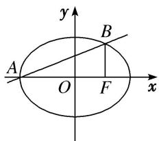
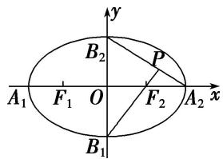

# 专题 03 离心率范围(最值)模型
解决离心率范围(最值)问题的基本思路是建立目标函数或构建不等关系：建立目标函数的关键是选用一个合适的变量，其原则是这个变量能够表达离心率，利用求函数的值域(最值)的方法将离心率表示为其他变量的函数，求其值域(最值)，从而确定离心率的取值范围；构建不等关系是根据试题本身给出的不等条件，或一些隐含条件或椭圆(双曲线)自身的性质构造不等关系，从而求解.

# 【例题选讲】

[例 8] （41） 过双曲线 $\frac{x^{2}}{a^{2}} - \frac{y^{2}}{b^{2}} = 1 (a > 0, b > 0)$ 的右焦点且垂直于 x 轴的直线与双曲线交于 A, B 两点，与双曲线的渐近线交于 C, D 两点，若 $|AB| \geq \frac{3}{5} |CD|$ ，则双曲线离心率 e 的取值范围为()

A. $\left[\frac{5}{3}, +\infty\right]$

B. $\left[\frac{5}{4},+\infty\right]$

C. $\left(1,\frac{5}{3}\right]$

D. $\left(1,\frac{5}{4}\right]$  
（42）已知椭圆 $C: \frac{x^2}{a^2} + \frac{y^2}{b^2} = 1 (a > b > 0)$ 的右焦点为 $F$ ，短轴的一个端点为 $P$ ，直线 $l: 4x - 3y = 0$ 与椭圆 $C$ 相交于 $A$ ， $B$ 两点。若 $|AF| + |BF| = 6$ ，点 $P$ 到直线 $l$ 的距离不小于 $\frac{6}{5}$ ，则椭圆离心率的取值范围是（）

A. $\left[0,\frac{5}{9}\right]$

B. $\left[0,\frac{\sqrt{3}}{2}\right]$

C. $\left[0,\frac{\sqrt{5}}{3}\right]$

D. $\left(\frac{1}{3},\frac{\sqrt{3}}{2}\right]$  
（43）已知 $F_{1}$ ， $F_{2}$ 是椭圆 $\frac{x^2}{a^2} + \frac{y^2}{b^2} = 1 (a > b > 0)$ 的左、右焦点，过 $F_{2}$ 且垂直于 $x$ 轴的直线与椭圆交于 $A$ ， $B$ 两点，若 $\triangle ABF_{1}$ 是锐角三角形，则该椭圆离心率 $e$ 的取值范围是（）

A. $(\sqrt{2}-1,+\infty)$

B. $(0,\sqrt{2}-1)$

C. $(\sqrt{2} - 1, 1)$

D. $(\sqrt{2}-1,\sqrt{2}+1)$  
（44）已知 $F_{1}$ ， $F_{2}$ 分别是椭圆 C: $\frac{x^{2}}{m} + \frac{y^{2}}{4} = 1$ 的上下两个焦点，若椭圆上存在四个不同点 P，使得 $\triangle PF_{1}F_{2}$ 的面积为 $\sqrt{3}$ ，则椭圆 C 的离心率的取值范围是（）

A. $\left(\frac{1}{2},\frac{\sqrt{3}}{2}\right)$

B. $\left(\frac{1}{2},\quad1\right)$

C. $\left(\frac{\sqrt{3}}{2},1\right)$

D. $\left(\frac{\sqrt{3}}{3},1\right)$  
（45）已知椭圆 $\frac{x^2}{a^2} +\frac{y^2}{b^2} = 1(a > b > 0)$ 的左、右焦点分别为 $F_{1}(-c,0),F_{2}(c,0)$ ，若椭圆上存在一点 $P$ 使 $\frac{a}{\sin\angle PF_1F_2} = \frac{c}{\sin\angle PF_2F_1}$ ，则该椭圆的离心率的取值范围为

思路点拨 在 $\triangle PF_{1}F_{2}$ 中，使用正弦定理建立 $|PF_{1}|$ ， $|PF_{2}|$ 之间的数量关系，再结合椭圆定义求出 $|PF_{2}|$ ，利用 $a - c < |PF_{2}| < a + c$ 建立不等式确定所求范围。  
（46）已知双曲线 $C: \frac{x^2}{a^2} - \frac{y^2}{b^2} = 1 (a > 0, b > 0)$ ，若存在过右焦点 $F$ 的直线与双曲线 $C$ 相交于 $A$ ， $B$ 两点，且 $\overrightarrow{AF} = 3\overrightarrow{BF}$ ，则双曲线 $C$ 的离心率的最小值为 \_\_\_\_.  
（47）已知双曲线方程为 $\frac{x^2}{m^2 + 4} -\frac{y^2}{b^2} = 1$ ，若其过焦点的最短弦长为2，则该双曲线的离心率的取值范围是（

A. $(1, \frac{\sqrt{6}}{2}]$

B. $\left[\frac{\sqrt{6}}{2}, +\infty\right)$

C. $(1, \frac{\sqrt{6}}{2})$

D. $(\frac{\sqrt{6}}{2}, +\infty)$  
（48）椭圆 $M: \frac{x^2}{a^2} + \frac{y^2}{b^2} = 1 (a > b > 0)$ 的左、右焦点分别为 $F_1, F_2, P$ 为椭圆 $M$ 上任一点，且 $|PF_1| \cdot |PF_2|$ 的最大值的取值范围是 $[2b^2, 3b^2]$ ，椭圆 $M$ 的离心率为 $e$ ，则 $e - \frac{1}{e}$ 的最小值是 \_\_\_\_.  
（49）已知点 $A(-1, 0)$ 和 $B(1, 0)$ ，动点 $P(x, y)$ 在直线 $l: y = x + 3$ 上移动，椭圆 $C$ 以 $A, B$ 为焦点且经过点 $P$ ，则椭圆 $C$ 的离心率的最大值为（）

A. $\frac{\sqrt{5}}{5}$

B. $\frac{\sqrt{10}}{5}$

C. $\frac{2\sqrt{5}}{5}$

D. $\frac{2\sqrt{10}}{5}$  
（50）已知双曲线 $\frac{x^{2}}{a^{2}}-\frac{y^{2}}{b^{2}}=1(a>0,\ b>0)$ 的左、右焦点分别为 $F_{1}$ ， $F_{2}$ ，点P在双曲线的右支上，且 $|PF_{1}|=6|PF_{2}|$ ，此双曲线的离心率e的最大值为\_\_\_\_.

# 【对点训练】

47. 过椭圆 $C: \frac{x^2}{a^2} + \frac{y^2}{b^2} = 1 (a > b > 0)$ 的左顶点 $A$ 且斜率为 $k$ 的直线交椭圆 $C$ 于另一点 $B$ , 且点 $B$ 在 $x$ 轴上的射影恰好为右焦点 $F$ . 若 $\frac{1}{3} < k < \frac{1}{2}$ , 则椭圆 $C$ 的离心率的取值范围是( )

A. $\left(\frac{1}{4},\frac{3}{4}\right)$

B. $\begin{pmatrix}\frac{2}{3},&1\end{pmatrix}$

C. $\left(\frac{1}{2},\frac{2}{3}\right)$

D. $\left(0,\frac{1}{2}\right)$

48. 已知双曲线 $C: \frac{x^2}{a^2 + 1} - y^2 = 1 (a > 0)$ 的右顶点为 $A, O$ 为坐标原点，若 $|OA| < 2$ ，则双曲线 $C$ 的离心率的取值范围是（）

A. $\left(\frac{\sqrt{5}}{2},+\infty\right)$

B. $\left(1,\frac{5}{2}\right)$

C. $\left(\frac{\sqrt{5}}{2},\sqrt{2}\right)$

D. $(1, \sqrt{2})$

49. 已知椭圆 $E: \frac{x^2}{a^2} + \frac{y^2}{b^2} = 1 (a > b > 0)$ 的右焦点为 $F$ ，短轴的一个端点为 $M$ ，直线 $l: 3x - 4y = 0$ 交椭圆 $E$ 于 $A$ ， $B$ 两点。若 $|AF| + |BF| = 4$ ，点 $M$ 到直线 $l$ 的距离不小于 $\frac{4}{5}$ ，则椭圆 $E$ 的离心率的取值范围是（）

A. $\left[0,\frac{\sqrt{3}}{2}\right]$

B. $\left\{0,\frac{3}{4}\right]$

C. $\left[\frac{\sqrt{3}}{2},1\right]$

D. $\left[\frac{3}{4},1\right]$

50. 已知双曲线 $\frac{x^2}{a^2} - \frac{y^2}{b^2} = 1 (a > 0, b > 0)$ 的左、右焦点为 $F_1$ 、 $F_2$ ，双曲线上的点 $P$ 满足 $4|\overrightarrow{PF_1} + \overrightarrow{PF_2}| \geq 3|\overrightarrow{F_1F_2}|$ 恒成立，则双曲线的离心率的取值范围为（）

A. $1 < e \leq \frac{3}{2}$

B. $e \geq \frac{3}{2}$

C. $1 < e \leq \frac{4}{3}$

D. $e \geq \frac{4}{3}$

51. 已知点 $F_{1}$ , $F_{2}$ 分别是双曲线 $\frac{x^{2}}{a^{2}} - \frac{y^{2}}{b^{2}} = 1 (a > 0, b > 0)$ 的左、右焦点，过 $F_{2}$ 且垂直于 $x$ 轴的直线与双曲

线交于 M，N 两点，若 $\overrightarrow{MF_{1}}\cdot\overrightarrow{NF_{1}}>0$ ，则该双曲线的离心率 e 的取值范围是()

A. $(\sqrt{2}, \sqrt{2} + 1)$

B. $(1, \sqrt{2} + 1)$

C. $(1, \sqrt{3})$

D. $(\sqrt{3}, +\infty)$

52. 正方形 ABCD 的四个顶点都在椭圆 $\frac{x^{2}}{a^{2}} + \frac{y^{2}}{b^{2}} = 1 (a > b > 0)$ 上，若椭圆的焦点在正方形的内部，则椭圆的离心率的取值范围是()

A. $\left(\frac{\sqrt{5}-1}{2},1\right)$

B. $\left(0,\frac{\sqrt{5}-1}{2}\right)$

C. $\left(\frac{\sqrt{3}-1}{2},1\right)$

D. $\left(0,\frac{\sqrt{3}-1}{2}\right)$

53. 如图, 椭圆的中心在坐标原点 $O$ , 顶点分别是 $A_{1}, A_{2}, B_{1}, B_{2}$ , 焦点分别为 $F_{1}, F_{2}$ , 延长 $B_{1}F_{2}$ 与 $A_{2}B_{2}$ 交于 $P$ 点, 若 $\angle B_{1}PA_{2}$ 为钝角, 则此椭圆的离心率的取值范围为 \_\_\_\_.

54. 已知 $F_{1}, F_{2}$ 分别是椭圆 $C: \frac{x^{2}}{a^{2}} + \frac{y^{2}}{b^{2}} = 1 (a > b > 0)$ 的左、右焦点，若椭圆 $C$ 上存在点 $P$ 使 $\angle F_{1}PF_{2}$ 为钝角，则椭圆 $C$ 的离心率的取值范围是（）

A. $\left(\frac{\sqrt{2}}{2},1\right)$

B. $\left(\frac{1}{2},\quad1\right)$

C. $\left(0,\frac{\sqrt{2}}{2}\right)$

D. $\left(0,\frac{1}{2}\right)$

55. 已知椭圆 $\frac{x^2}{a^2} + \frac{y^2}{b^2} = 1 (a > b > 0)$ 的左、右焦点分别为 $F_1, F_2, P$ 是椭圆上一点， $\triangle PF_1F_2$ 是以 $F_2P$ 为底边的等腰三角形，且 $60^\circ < \angle PF_1F_2 < 120^\circ$ ，则该椭圆的离心率的取值范围是（）

A. $\left(\frac{\sqrt{3}-1}{2},1\right)$

B. $\left(\frac{\sqrt{3}-1}{2},\frac{1}{2}\right)$

C. $\left(\frac{1}{2},1\right)$

D. $(0,\frac{1}{2})$

56. 过双曲线 $\frac{x^2}{a^2} - \frac{y^2}{b^2} = 1 (a > 0, b > 0)$ 的左焦点且垂直于 $x$ 轴的直线与双曲线交于 $A, B$ 两点， $D$ 为虚轴的一个端点，且 $\triangle ABD$ 为钝角三角形，则此双曲线离心率的取值范围为 \_\_\_\_.

57. 已知点 $F$ 为双曲线 $E: \frac{x^2}{a^2} - \frac{y^2}{b^2} = 1 (a > 0, b > 0)$ 的右焦点，直线 $y = kx (k > 0)$ 与 $E$ 交于不同象限内的 $M, N$ 两点，若 $MF \perp NF$ ，设 $\angle MNF = \beta$ ，且 $\beta \in \left[\frac{\pi}{12}, \frac{\pi}{6}\right]$ ，则该双曲线的离心率的取值范围是（）

A. $[\sqrt{2},\sqrt{2} +\sqrt{6} ]$

B. $[2, \sqrt{3} + 1]$

C. $[2, \sqrt{2} + \sqrt{6}]$

D. $[\sqrt{2},\sqrt{3} +1]$

58. 过双曲线 $\frac{x^2}{a^2} - \frac{y^2}{b^2} = 1 (a > 0, b > 0)$ 的右顶点且斜率为 2 的直线，与该双曲线的右支交于两点，则此双曲线离心率的取值范围为 \_\_\_\_.

59. 已知 $F_{1}$ , $F_{2}$ 分别是椭圆 $C: \frac{x^{2}}{a^{2}} + \frac{y^{2}}{b^{2}} = 1 (a > b > 0)$ 的左、右焦点, 若椭圆 $C$ 上存在点 $P$ , 使得线段 $PF_{1}$ 的中垂线恰好经过焦点 $F_{2}$ , 则椭圆 $C$ 的离心率的取值范围是( )

A. $\left[\frac{2}{3},1\right]$

B. $\left[\frac{1}{3},\frac{\sqrt{2}}{2}\right]$

C. $\left[\frac{1}{3},\quad1\right]$

D. $\left(0,\frac{1}{3}\right]$

60. 已知 $F_{1}$ , $F_{2}$ 是椭圆 $\frac{x^{2}}{a^{2}} + \frac{y^{2}}{b^{2}} = 1 (a > b > 0)$ 的左、右两个焦点, 若椭圆上存在点 $P$ 使得 $PF_{1} \perp PF_{2}$ , 则该椭圆

的离心率的取值范围是( )

A. $\left[\frac{\sqrt{5}}{5},1\right]$

B. $\left[\frac{\sqrt{2}}{2},1\right]$

C. $\left[0,\frac{\sqrt{5}}{5}\right]$

D. $\left[0,\frac{\sqrt{2}}{2}\right]$

61. 已知双曲线 $C: \frac{x^2}{a^2} - \frac{y^2}{b^2} = 1 (a > 0, b > 0)$ 的左、右焦点分别为 $F_1, F_2$ ，点 $P$ 为双曲线右支上一点，若 $|PF_1|^2 = 8a|PF_2|$ ，则双曲线 $C$ 的离心率的取值范围为（）

A. $(1, 3]$

B. $[3, +\infty)$

C. $(0, 3)$

D. $(0, 3]$

62. 已知 $F_{1}(-c, 0)$ , $F_{2}(c, 0)$ 为椭圆 $\frac{x^{2}}{a^{2}} + \frac{y^{2}}{b^{2}} = 1 (a > b > 0)$ 的两个焦点，点 $P$ 在椭圆上且满足 $\overrightarrow{PF_1} \cdot \overrightarrow{PF_2} = c^{2}$ ，则该椭圆离心率的取值范围是（）

A. $\left[\frac{\sqrt{3}}{3},1\right]$

B. $\left[\frac{\sqrt{3}}{3},\frac{\sqrt{2}}{2}\right]$

C. $\left[\frac{1}{3}, \frac{1}{2}\right]$

D. $\left\{0,\frac{\sqrt{2}}{2}\right]$

63. 已知双曲线 $M: \frac{x^2}{a^2} - \frac{y^2}{b^2} = 1 (a > 0, b > 0)$ 的左、右焦点分别为 $F_1, F_2, |F_1F_2| = 2c$ 。若双曲线 $M$ 的右支上存在点 $P$ ，使 $\frac{a}{\sin \angle PF_1F_2} = \frac{3c}{\sin \angle PF_2F_1}$ ，则双曲线 $M$ 的离心率的取值范围为（）

A. $\left(1,\frac{2+\sqrt{7}}{3}\right)$

B. $\left(1,\frac{2+\sqrt{7}}{3}\right]$

C. $(1, 2)$

D. $(1, 2]$

64. 已知椭圆 $\frac{x^2}{a^2} + \frac{y^2}{b^2} = 1 (a > b > 0)$ 的左、右焦点分别为 $F_1, F_2$ ，且 $|F_1F_2| = 2c$ ，若椭圆上存在点 $M$ 使得 $\frac{\sin \angle MF_1F_2}{a} = \frac{\sin \angle MF_2F_1}{c}$ ，则该椭圆离心率的取值范围为（）

A. $(0, \sqrt{2} - 1)$

B. $\left(\frac{\sqrt{2}}{2},1\right)$

C. $\left(0,\frac{\sqrt{2}}{2}\right)$

D. $(\sqrt{2}-1,1)$

65. 已知椭圆 $\frac{x^{2}}{a^{2}} + \frac{y^{2}}{b^{2}} = 1 (a > b > 0)$ 的左、右焦点分别为 $F_{1}(-c, 0)$ , $F_{2}(c, 0)$ ，若椭圆上存在点 P 使 $\frac{1 - \cos 2\angle PF_{1}F_{2}}{1 - \cos 2\angle PF_{2}F_{1}} = \frac{a^{2}}{c^{2}}$ ，该椭圆的离心率的取值范围为 \_\_\_\_.

