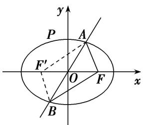
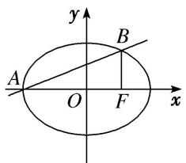
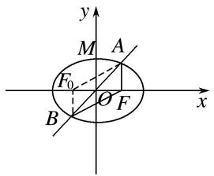
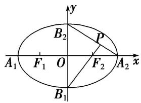
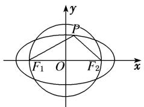
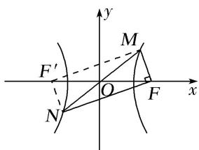
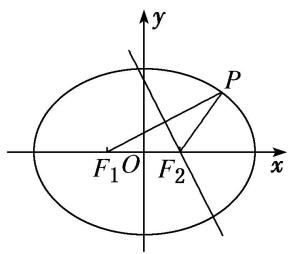

# 专题 03 离心率范围(最值)模型
解决离心率范围(最值)问题的基本思路是建立目标函数或构建不等关系：建立目标函数的关键是选用一个合适的变量，其原则是这个变量能够表达离心率，利用求函数的值域(最值)的方法将离心率表示为其他变量的函数，求其值域(最值)，从而确定离心率的取值范围；构建不等关系是根据试题本身给出的不等条件，或一些隐含条件或椭圆(双曲线)自身的性质构造不等关系，从而求解.

# 【例题选讲】

[例 8] （41） 过双曲线 $\frac{x^{2}}{a^{2}} - \frac{y^{2}}{b^{2}} = 1 (a > 0, b > 0)$ 的右焦点且垂直于 x 轴的直线与双曲线交于 A, B 两点，与双曲线的渐近线交于 C, D 两点，若 $|AB| \geq \frac{3}{5} |CD|$ ，则双曲线离心率 e 的取值范围为()

A. $\left[\frac{5}{3}, +\infty\right]$

B. $\left[\frac{5}{4},+\infty\right]$

C. $\left(1,\frac{5}{3}\right]$

D. $\left(1,\frac{5}{4}\right]$
答案 B 解析 将 $x = c$ 代入 $\frac{x^2}{a^2} -\frac{y^2}{b^2} = 1$ 得 $y = \pm \frac{b^2}{a}$ ，不妨取 $A\left(c,\frac{b^2}{a}\right),B\left(c, - \frac{b^2}{a}\right)$ ，所以 $|AB| = \frac{2b^2}{a}$ .将 $x = c$ 代入双曲线的渐近线方程 $y = \pm \frac{b}{a} x$ ，得 $y = \pm \frac{bc}{a}$ ，不妨取 $C\left(c,\frac{bc}{a}\right),D\left(c, - \frac{bc}{a}\right)$ ，所以 $|CD| = \frac{2bc}{a}$ 因为 $|AB|\geq \frac{3}{5}|CD|$ ，所以 $\frac{2b^2\geq 3}{a\geq 5}\times \frac{2bc}{a}$ ，即 $b\geq \frac{3}{5}$ ，则 $b^{2}\geq \frac{9}{25} c^{2}$ ，即 $c^2 -a^2\geq \frac{9}{25} c^2$ ，即 $\frac{16}{25} c^2\geq a^2$ ，所以 $e^2\geq \frac{25}{16}$ ，所以 $e\geq \frac{5}{4}$ ，故选B.  
（42）已知椭圆 $C: \frac{x^2}{a^2} + \frac{y^2}{b^2} = 1 (a > b > 0)$ 的右焦点为 $F$ ，短轴的一个端点为 $P$ ，直线 $l: 4x - 3y = 0$ 与椭圆 $C$ 相交于 $A, B$ 两点。若 $|AF| + |BF| = 6$ ，点 $P$ 到直线 $l$ 的距离不小于 $\frac{6}{5}$ ，则椭圆离心率的取值范围是（）

A. $\left[0,\frac{5}{9}\right]$

B. $\left[0,\frac{\sqrt{3}}{2}\right]$

C. $\left\{0,\frac{\sqrt{5}}{3}\right]$

D. $\left(\frac{1}{3},\frac{\sqrt{3}}{2}\right]$
答案 C 解析 如图所示，设 $F'$ 为椭圆的左焦点，连接 $AF'$ ， $BF'$ ，则四边形 $AFBF'$ 是平行四边形，

$\therefore 6 = |AF| + |BF| = |AF'| + |AF| = 2a, \therefore a = 3.$ 取 $P(0, b)$ ， $\because$ 点 $P$ 到直线 $l: 4x + 3y = 0$ 的距离不小于 $\frac{6}{5}$ ， $\therefore \frac{|3b|}{\sqrt{16 + 9}} \geq \frac{6}{5}$ ，解得 $b \geq 2.$ $\therefore c \leq \sqrt{9 - 4} = \sqrt{5}, \therefore 0 < \frac{c}{a} \leq \frac{\sqrt{5}}{3}.$ $\therefore$ 椭圆 $E$ 的离心率范围是 $\left[0, \frac{\sqrt{5}}{3}\right]$ . 故选 C.  
（43）已知 $F_{1}$ , $F_{2}$ 是椭圆 $\frac{x^{2}}{a^{2}} + \frac{y^{2}}{b^{2}} = 1 (a > b > 0)$ 的左、右焦点, 过 $F_{2}$ 且垂直于 $x$ 轴的直线与椭圆交于 $A$ , $B$ 两点, 若 $\triangle ABF_{1}$ 是锐角三角形, 则该椭圆离心率 $e$ 的取值范围是 ( )

A. $(\sqrt{2}-1,+\infty)$

B. $(0,\sqrt{2}-1)$

C. $(\sqrt{2}-1,1)$

D. $(\sqrt{2}-1,\sqrt{2}+1)$
答案 C 解析 由题意可知，A, B 的横坐标均为 c，且 A, B 都在椭圆上，所以 $\frac{c^{2}}{a^{2}} + \frac{y^{2}}{b^{2}} = 1$ ，从而可得 $y = \pm \frac{b^{2}}{a}$ ，不妨令 $A\left(c, \frac{b^{2}}{a}\right)$ ， $B\left(c, -\frac{b^{2}}{a}\right)$ 。由 $\triangle ABF_{1}$ 是锐角三角形知 $\angle AF_{1}F_{2} < 45^{\circ}$ ，所以 $\tan \angle AF_{1}F_{2} < 1$ ，所以 $\tan \angle AF_{1}F_{2} = \frac{AF_{2}}{F_{1}F_{2}} = \frac{\frac{b^{2}}{a}}{2c} < 1$ ，故 $\frac{a^{2} - c^{2}}{2ac} < 1$ ，即 $e^{2} + 2e - 1 > 0$ ，解得 $e > \sqrt{2} - 1$ 或 $e < -\sqrt{2} - 1$ ，又因为椭圆中，0 < e < 1，所以 $\sqrt{2} - 1 < e < 1$ 。故选 C。  
（44）已知 $F_{1}$ ， $F_{2}$ 分别是椭圆 C: $\frac{x^{2}}{m} + \frac{y^{2}}{4} = 1$ 的上下两个焦点，若椭圆上存在四个不同点 P，使得 $\triangle PF_{1}F_{2}$ 的面积为 $\sqrt{3}$ ，则椭圆 C 的离心率的取值范围是（）

A. $\left(\frac{1}{2},\frac{\sqrt{3}}{2}\right)$

B. $\left(\frac{1}{2},\ 1\right)$

C. $\left(\frac{\sqrt{3}}{2},1\right)$

D. $\left(\frac{\sqrt{3}}{3},1\right)$
答案 A 解析 $F_{1}, F_{2}$ 分别是椭圆 $C: \frac{x^{2}}{m} + \frac{y^{2}}{4} = 1$ 的上下两个焦点，可得 $2c = 2\sqrt{4 - m}$ ，短半轴的长： $\sqrt{m}$ ，椭圆上存在四个不同点 $P$ ，使得 $\triangle PF_{1}F_{2}$ 的面积为 $\sqrt{3}$ ，可得 $\frac{1}{2} \times 2\sqrt{4 - m} \times \sqrt{m} > \sqrt{3}$ ，可得 $m^{2} - 4m + 3 < 0$ ，解得 $m \in (1, 3)$ ，则椭圆 $C$ 的离心率为： $e = \frac{\sqrt{4 - m}}{2} \in \left[\frac{1}{2}, \frac{\sqrt{3}}{2}\right]$ .  
（45）已知椭圆 $\frac{x^2}{a^2} +\frac{y^2}{b^2} = 1(a > b > 0)$ 的左、右焦点分别为 $F_{1}(-c,0),F_{2}(c,0)$ ，若椭圆上存在一点 $P$ 使 $\frac{a}{\sin\angle PF_1F_2} = \frac{c}{\sin\angle PF_2F_1}$ ，则该椭圆的离心率的取值范围为

思路点拨 在 $\triangle PF_{1}F_{2}$ 中，使用正弦定理建立 $|PF_1|$ ， $|PF_2|$ 之间的数量关系，再结合椭圆定义求出 $|PF_2|$ ，利用 $a - c < |PF_2| < a + c$ 建立不等式确定所求范围。
答案（ $\sqrt{2}-1$ ，1）解析 根据已知条件 $\angle PF_{1}F_{2}$ ， $\angle PF_{2}F_{1}$ 都不能等于 0，即点 $P$ 不会是椭圆的左、右顶点，故 $P, F_{1}, F_{2}$ 构成三角形，在 $\triangle PF_{1}F_{2}$ 中，由正弦定理得 $\frac{|PF_{2}|}{\sin\angle PF_{1}F_{2}} = \frac{|PF_{1}|}{\sin\angle PF_{2}F_{1}}$ ，则由已知，得 $\frac{a}{|PF_{2}|} = \frac{c}{|PF_{1}|}$ ，即 $|PF_{1}| = \frac{c}{a} |PF_{2}|$ ，①。根据椭圆定义， $|PF_{1}| + |PF_{2}| = 2a$ ，②。由①②解得， $|PF_{2}| = \frac{2a}{1 + \frac{c}{a}} = \frac{2a^{2}}{a + c}$ ，因为 $a - c < |PF_{2}| < a + c$ ，所以 $a - c < \frac{2a^{2}}{a + c} < a + c$ ，即 $b^{2} < 2a^{2} < a^{2} + 2ac + c^{2}$ ，所以 $c^{2} + 2ac - a^{2} > 0$ ，即 $e^{2} + 2e - 1 > 0$ ，解得 $e < -\sqrt{2} - 1$ 或 $e > \sqrt{2} - 1$ ，又 $e \in (0, 1)$ ，故椭圆的离心率 $e \in (\sqrt{2} - 1, 1)$ 。  
（46）已知双曲线 $C: \frac{x^2}{a^2} - \frac{y^2}{b^2} = 1 (a > 0, b > 0)$ ，若存在过右焦点 $F$ 的直线与双曲线 $C$ 相交于 $A$ ， $B$ 两点，且 $\overrightarrow{AF} = 3\overrightarrow{BF}$ ，则双曲线 $C$ 的离心率的最小值为 \_\_\_\_.
答案 2 解析 因为过右焦点 F 的直线与双曲线 C 交于 A, B 两点，且 $\overrightarrow{AF}=3\overrightarrow{BF}$ ，故点 A 在双曲线的左支上，B 在双曲线的右支上，如图所示．设 $A(x_{1}, y_{1})$ ， $B(x_{2}, y_{2})$ ，右焦点 $F(c, 0)$ ，因为 $\overrightarrow{AF}=3\overrightarrow{BF}$ ，所以 $c-x_{1}=3(c-x_{2})$ ，即 $3x_{2}-x_{1}=2c$ ，由图可知， $x_{1}\leq-a,\quad x_{2}\geq a$ ，所以 $-x_{1}\geq a,\quad 3x_{2}\geq3a$ ，故 $3x_{2}-x_{1}\geq4a$ ，即 $2c\geq4a$ ，故 $e\geq2$ ，所以双曲线 C 的离心率的最小值为 2.  
（47）已知双曲线方程为 $\frac{x^2}{m^2 + 4} -\frac{y^2}{b^2} = 1$ ，若其过焦点的最短弦长为2，则该双曲线的离心率的取值范围是（

A. $(1, \frac{\sqrt{6}}{2}]$

B. $\left[\frac{\sqrt{6}}{2}, +\infty\right)$

C. $(1, \frac{\sqrt{6}}{2})$

D. $(\frac{\sqrt{6}}{2}, +\infty)$
答案 A 解析 过焦点的最短弦长有可能是 2a 或是过焦点且垂直于长轴所在直线的弦长为 $\frac{2b^{2}}{a} = \frac{2b^{2}}{\sqrt{m^{2} + 4}}$ ， $a^{2} = m^{2} + 4 \geq 4$ ， $2a \geq 4 > 2$ ，所以过焦点的最短弦长为 $\frac{2b^{2}}{a} = \frac{2b^{2}}{\sqrt{m^{2} + 4}} = 2$ ，即 $b^{2} = \sqrt{m^{2} + 4} \geq 2$ ， $e = \frac{c}{a} = \frac{\sqrt{m^{2} + b^{2} + 4}}{\sqrt{m^{2} + 4}} = \frac{\sqrt{b^{4} + b^{2}}}{b^{2}} = \sqrt{1 + \frac{1}{b^{2}}}$ ， $0 < \frac{1}{b^{2}} \leq \frac{1}{2}$ ，所以 $1 < 1 + \frac{1}{b^{2}} \leq \frac{3}{2}$ ， $1 < \sqrt{1 + \frac{1}{b^{2}}} \leq \frac{\sqrt{6}}{2}$ ，即 $e \in (1, \frac{\sqrt{6}}{2}]$ 。故选 A.  
（48）椭圆 $M: \frac{x^2}{a^2} + \frac{y^2}{b^2} = 1 (a > b > 0)$ 的左、右焦点分别为 $F_1, F_2, P$ 为椭圆 $M$ 上任一点，且 $|PF_1| \cdot |PF_2|$ 的最大值的取值范围是 $[2b^2, 3b^2]$ ，椭圆 $M$ 的离心率为 $e$ ，则 $e - \frac{1}{e}$ 的最小值是 \_\_\_\_.
答案 $-\frac{\sqrt{2}}{2}$ 解析 由椭圆的定义可知 $|PF_1| + |PF_2| = 2a$ ， $\therefore |PF_1| \cdot |PF_2| \leq \left(\frac{|PF_1| + |PF_2|}{2}\right)^2 = a^2$ ， $\therefore 2b^2 \leq a^2 \leq 3b^2$ ，即 $2a^2 - 2c^2 \leq a^2 \leq 3a^2 - 3c^2$ ， $\therefore \frac{1}{2} \leq \frac{c^2}{a^2} \leq \frac{2}{3}$ ，即 $\frac{\sqrt{2}}{2} \leq e \leq \frac{\sqrt{6}}{3}$ 。令 $f(x) = x - \frac{1}{x}$ ，则 $f(x)$ 在 $\left[\frac{\sqrt{2}}{2}, \frac{\sqrt{6}}{3}\right]$ 上是增函数， $\therefore$ 当 $e = \frac{\sqrt{2}}{2}$ 时， $e - \frac{1}{e}$ 取得最小值 $\frac{\sqrt{2}}{2} - \sqrt{2} = -\frac{\sqrt{2}}{2}$ 。  
（49）已知点 $A(-1,0)$ 和 $B(1,0)$ ，动点 $P(x,y)$ 在直线 $l: y = x + 3$ 上移动，椭圆 $C$ 以 $A, B$ 为焦点且经过点 $P$ ，则椭圆 $C$ 的离心率的最大值为（）

A. $\frac{\sqrt{5}}{5}$

B. $\frac{\sqrt{10}}{5}$

C. $\frac{2\sqrt{5}}{5}$

D. $\frac{2\sqrt{10}}{5}$
答案 A 解析 方法 1 不妨设椭圆方程为 $\frac{x^2}{a^2} + \frac{y^2}{a^2 - 1} = 1 (a > 1)$ ，与直线 $l$ 的方程联立 $\left\{ \begin{array}{l} \frac{x^2}{a^2} + \frac{y^2}{a^2 - 1} = 1, \\ y = x + 3, \end{array} \right.$ 消去 $y$ 得 $(2a^2 - 1)x^2 + 6a^2x + 10a^2 - a^4 = 0$ ，由题意易知 $\Delta = 36a^4 - 4(2a^2 - 1)(10a^2 - a^4) \geq 0$ ，解得 $a \geq \sqrt{5}$ ，所以 $e = \frac{c}{a} = \frac{1}{a} \leq \frac{\sqrt{5}}{5}$ ，所以 $e$ 的最大值为 $\frac{\sqrt{5}}{5}$ .
方法 2 A(-1, 0)关于直线 l: $y = x + 3$ 的对称点为 $A'(-3, 2)$ ，连接 $A'B$ 交直线 l 于点 P，则此时椭圆 C 的长轴长最短，为 $|A'B| = 2\sqrt{5}$ ，所以椭圆 C 的离心率的最大值为 $\frac{1}{\sqrt{5}} = \frac{\sqrt{5}}{5}$ 。故选 A.  
（50）已知双曲线 $\frac{x^{2}}{a^{2}}-\frac{y^{2}}{b^{2}}=1(a>0,\ b>0)$ 的左、右焦点分别为 $F_{1}$ ， $F_{2}$ ，点P在双曲线的右支上，且 $|PF_{1}|=6|PF_{2}|$ ，此双曲线的离心率e的最大值为\_\_\_\_.
答案 $\frac{7}{5}$ 解析 由定义，知 $|PF_1| - |PF_2| = 2a$ 。又 $|PF_1| = 6|PF_2|$ ， $\therefore |PF_1| = \frac{12}{5} a, |PF_2| = \frac{2}{5} a$ 。当 $P, F_1,$
$F_{2}$ 三点不共线时，在 $\triangle PF_{1}F_{2}$ 中，由余弦定理，得 $\cos \angle F_{1}PF_{2} = \frac{|PF_{1}|^{2} + |PF_{2}|^{2} - |F_{1}F_{2}|^{2}}{2\cdot|PF_{1}|\cdot|PF_{2}|} = \frac{\frac{144}{25}a^{2} + \frac{4}{25}a^{2} - 4c^{2}}{2\cdot\frac{12}{5}a\cdot\frac{2}{5}a}$
$= \frac{37}{12} -\frac{25}{12} e^2$ ，即 $e^2 = \frac{37}{25} -\frac{12}{25}\cos \angle F_1PF_2.\because \cos \angle F_1PF_2\in (-1,1),\therefore e\in \left(1,\frac{7}{5}\right).$ 当 $P,F_{1},F_{2}$ 三点共线时， $\because |PF_1| = 6|PF_2|$ ， $\therefore e = \frac{c}{a} = \frac{7}{5}$ ，综上， $e$ 的最大值为 $\frac{7}{5}$ .还可用三角形两边之和大于第三边构造不等式.

# 【对点训练】

47. 过椭圆 $C: \frac{x^2}{a^2} + \frac{y^2}{b^2} = 1 (a > b > 0)$ 的左顶点 $A$ 且斜率为 $k$ 的直线交椭圆 $C$ 于另一点 $B$ , 且点 $B$ 在 $x$ 轴上的射影恰好为右焦点 $F$ . 若 $\frac{1}{3} < k < \frac{1}{2}$ , 则椭圆 $C$ 的离心率的取值范围是( )

A. $\left(\frac{1}{4},\frac{3}{4}\right)$

B. $\left(\frac{2}{3},1\right)$

C. $\left(\frac{1}{2},\frac{2}{3}\right)$

D. $\left(0,\frac{1}{2}\right)$

47. 答案 C 解析 由题图可知, $|AF|=a+c$ , $|BF|=\frac{a^{2}-c^{2}}{a}$ , 于是 $k=\frac{|BF|}{|AF|}=\frac{a^{2}-c^{2}}{a(a+c)}$ . 又 $\frac{1}{3}<k<\frac{1}{2}$ , 所以 $\frac{1}{3}<\frac{a^{2}-c^{2}}{a(a+c)}<\frac{1}{2}$ , 化简可得 $\frac{1}{3}<1-e<\frac{1}{2}$ , 从而可得 $\frac{1}{2}<e<\frac{2}{3}$ , 故选 C.

48. 已知双曲线 $C: \frac{x^2}{a^2 + 1} - y^2 = 1 (a > 0)$ 的右顶点为 $A, O$ 为坐标原点，若 $|OA| < 2$ ，则双曲线 $C$ 的离心率的取值范围是（）

A. $\left(\frac{\sqrt{5}}{2},+\infty\right)$

B. $\left(1,\frac{5}{2}\right)$

C. $\left(\frac{\sqrt{5}}{2},\sqrt{2}\right)$

D. $(1, \sqrt{2})$

48. 答案 C 解析 双曲线 $C: \frac{x^2}{a^2 + 1} - y^2 = 1 (a > 0)$ 中，右顶点为 $A(\sqrt{a^2 + 1}, 0), \therefore |OA| = \sqrt{a^2 + 1} < 2, \therefore 1 < a^2 + 1 < 4, \therefore 1 > \frac{1}{a^2 + 1} > \frac{1}{4}, \because c^2 = a^2 + 1 + 1 = a^2 + 2, \therefore c = \sqrt{a^2 + 2}, \therefore e = \frac{\sqrt{a^2 + 2}}{\sqrt{a^2 + 1}} = \sqrt{\frac{a^2 + 2}{a^2 + 1}} = \sqrt{1 + \frac{1}{a^2 + 1}}, \therefore \sqrt{1 + \frac{1}{4}} < e < \sqrt{1 + 1}$ ，即 $\frac{\sqrt{5}}{2} < e < \sqrt{2}$ . 故选 C.

49. 已知椭圆 $E: \frac{x^2}{a^2} + \frac{y^2}{b^2} = 1 (a > b > 0)$ 的右焦点为 $F$ ，短轴的一个端点为 $M$ ，直线 $l: 3x - 4y = 0$ 交椭圆 $E$ 于 $A$ ， $B$ 两点。若 $|AF| + |BF| = 4$ ，点 $M$ 到直线 $l$ 的距离不小于 $\frac{4}{5}$ ，则椭圆 $E$ 的离心率的取值范围是（）

A. $\left\{0,\frac{\sqrt{3}}{2}\right]$

B. $\left(0,\frac{3}{4}\right]$

C. $\left[\frac{\sqrt{3}}{2},1\right]$

D. $\left[\frac{3}{4},1\right]$

49. 答案 A 解析 设左焦点为 $F_{0}$ ，连接 $F_{0}A$ ， $F_{0}B$ ，则四边形 $AFBF_{0}$ 为平行四边形.

$\because |AF| + |BF| = 4, \therefore |AF| + |AF_0| = 4, \therefore a = 2.$ 设 $M(0, b)$ ，则 $M$ 到直线 $l$ 的距离 $d = \frac{4b}{5} \geq \frac{4}{5}, \therefore 1 \leq b < 2.$ 离心率 $e = \frac{c}{a} = \sqrt{\frac{c^2}{a^2}} = \sqrt{\frac{a^2 - b^2}{a^2}} = \sqrt{\frac{4 - b^2}{4}} \in \left[0, \frac{\sqrt{3}}{2}\right]$ ，故选A.

50. 已知双曲线 $\frac{x^2}{a^2} - \frac{y^2}{b^2} = 1 (a > 0, b > 0)$ 的左、右焦点为 $F_1$ 、 $F_2$ ，双曲线上的点 $P$ 满足 $4|\overrightarrow{PF_1} + \overrightarrow{PF_2}| \geq 3|\overrightarrow{F_1F_2}|$ 恒成立，则双曲线的离心率的取值范围为（）

A. $1 < e \leq \frac{3}{2}$

B. $e \geq \frac{3}{2}$

C. $1 < e \leq \frac{4}{3}$

D. $e \geq \frac{4}{3}$

50. 答案 C 解析 由 OP 为 $\triangle F_{1}PF_{2}$ 的中线，可得 $4|\overrightarrow{PF_{1}}+\overrightarrow{PF_{2}}|=8|\overrightarrow{PO}|\geq3|\overrightarrow{F_{1}F_{2}}|$ ，因为 $|F_{1}F_{2}|\geq a, |F_{1}F_{2}|=2c$ ，可得 $8a\geq6c$ ，即双曲线的离心率为： $1<e\leq\frac{4}{3}$ 。故选 C.

51. 已知点 $F_{1}$ , $F_{2}$ 分别是双曲线 $\frac{x^{2}}{a^{2}} - \frac{y^{2}}{b^{2}} = 1 (a > 0, b > 0)$ 的左、右焦点，过 $F_{2}$ 且垂直于 $x$ 轴的直线与双曲线交于 $M$ , $N$ 两点，若 $\overrightarrow{MF}_{1} \cdot \overrightarrow{NF}_{1} > 0$ ，则该双曲线的离心率 $e$ 的取值范围是（）

A. $(\sqrt{2},\sqrt{2} +1)$

B. $(1, \sqrt{2} + 1)$

C. $(1, \sqrt{3})$

D. $(\sqrt{3}, +\infty)$

51. 答案 B 解析 设 $F_{1}(-c,0)$ , $F_{2}(c,0)$ ，依题意可得 $\frac{c^{2}}{a^{2}} - \frac{y^{2}}{b^{2}} = 1$ ，得到 $y = \frac{b^{2}}{a}$ ，不妨设 $M\left(c, \frac{b^{2}}{a}\right)$ , $N\left(c, -\frac{b^{2}}{a}\right)$ ，则 $\overrightarrow{MF}_{1} \cdot \overrightarrow{NF}_{1} = \left(-2c, -\frac{b^{2}}{a}\right) \cdot \left(-2c, \frac{b^{2}}{a}\right) = 4c^{2} - \frac{b^{4}}{a^{2}} > 0$ ，得到 $4a^{2}c^{2} - (c^{2} - a^{2})^{2} > 0$ ，即 $a^{4} + c^{4} - 6a^{2}c^{2} < 0$ ，故 $e^{4} - 6e^{2} + 1 < 0$ ，解得 $3 - 2\sqrt{2} < e^{2} < 3 + 2\sqrt{2}$ ，又 e > 1，所以 $1 < e^{2} < 3 + 2\sqrt{2}$ ，解得 $1 < e < 1 + \sqrt{2}$ .

52. 正方形 ABCD 的四个顶点都在椭圆 $\frac{x^{2}}{a^{2}} + \frac{y^{2}}{b^{2}} = 1 (a > b > 0)$ 上，若椭圆的焦点在正方形的内部，则椭圆的离心率的取值范围是()

A. $\left(\frac{\sqrt{5}-1}{2},1\right)$

B. $\left(0,\frac{\sqrt{5}-1}{2}\right)$

C. $\left(\frac{\sqrt{3}-1}{2},1\right)$

D. $\left(0,\frac{\sqrt{3}-1}{2}\right)$

52. 答案 B 解析设正方形的边长为 $2m$ ，因为椭圆的焦点在正方形的内部，所以 $m > c$ ，又正方形ABCD的四个顶点都在椭圆 $\frac{x^2}{a^2} + \frac{y^2}{b^2} = 1 (a > b > 0)$ 上，所以 $\frac{m^2}{a^2} + \frac{m^2}{b^2} = 1 > \frac{c^2}{a^2} + \frac{c^2}{b^2} = e^2 + \frac{e^2}{1 - e^2}$ ，整理得 $e^4 - 3e^2 + 1 > 0$ ， $e^2 < \frac{3 - \sqrt{5}}{2} = \frac{(\sqrt{5} - 1)^2}{4}$ ，所以 $0 < e < \frac{\sqrt{5} - 1}{2}$ . 故选B.

53. 如图, 椭圆的中心在坐标原点 $O$ , 顶点分别是 $A_{1}, A_{2}, B_{1}, B_{2}$ , 焦点分别为 $F_{1}, F_{2}$ , 延长 $B_{1}F_{2}$ 与 $A_{2}B_{2}$ 交于 $P$ 点, 若 $\angle B_{1}PA_{2}$ 为钝角, 则此椭圆的离心率的取值范围为 \_\_\_\_.

53. 答案 $\left(\frac{\sqrt{5}-1}{2},1\right)$ 解析 设椭圆的方程为 $\frac{x^{2}}{a^{2}}+\frac{y^{2}}{b^{2}}=1(a>b>0)$ ， $\angle B_{1}PA_{2}$ 为钝角可转化为 $B_{2}A_{2}$ ， $F_{2}B_{1}$ 所夹的角为钝角，则 $(a,-b)\cdot(-c,-b)<0$ ，得 $b^{2}<ac$ ，即 $a^{2}-c^{2}<ac$ ，故 $\left(\frac{c}{a}\right)^{2}+\frac{c}{a}-1>0$ 即 $e^{2}+e-1>0$ ， $e>\frac{\sqrt{5}-1}{2}$ 或 $e<\frac{-\sqrt{5}-1}{2}$ ，又 0<e<1，所以 $\frac{\sqrt{5}-1}{2}<e<1$ 。

54. 已知 $F_{1}$ , $F_{2}$ 分别是椭圆 $C: \frac{x^{2}}{a^{2}} + \frac{y^{2}}{b^{2}} = 1 (a > b > 0)$ 的左、右焦点, 若椭圆 $C$ 上存在点 $P$ 使 $\angle F_{1}PF_{2}$ 为钝角, 则椭圆 $C$ 的离心率的取值范围是( )

A. $\left(\frac{\sqrt{2}}{2},1\right)$

B. $\left(\frac{1}{2},\ 1\right)$

C. $\left(0,\frac{\sqrt{2}}{2}\right)$

D. $\left(0,\frac{1}{2}\right)$

54. 答案 A 解析 法一：设 $P(x_0, y_0)$ ，由题意知 $|x_0| < a$ ，因为 $\angle F_1PF_2$ 为钝角，所以 $PF_1 \longrightarrow \cdot PF_2 \longrightarrow < 0$ 有解，即 $(-c - x_0, -y_0) \cdot (c - x_0, -y_0) < 0$ ，化简得 $c^2 > x_0^2 + y_0^2$ ，即 $c^2 > (x_0^2 + y_0^2)_{\min}$ ，又 $y_0^2 = b^2 - \frac{b^2}{a^2} x_0^2$ ， $0 \leq x_0^2 < a^2$ ，故 $x_0^2 + y_0^2 = b^2 + \frac{c^2}{a^2} x_0^2 \in [b^2, a^2)$ ，所以 $(x_0^2 + y_0^2)_{\min} = b^2$ ，故 $c^2 > b^2$ ，又 $b^2 = a^2 - c^2$ ，所以 $e^2 = \frac{c^2}{a^2} > \frac{1}{2}$ ，解得 $e > \frac{\sqrt{2}}{2}$ ，又 $0 < e < 1$ ，故椭圆 $C$ 的离心率的取值范围是 $\left[\frac{\sqrt{2}}{2}, 1\right]$ .

法二：椭圆上存在点 $P$ 使 $\angle F_{1}PF_{2}$ 为钝角 $\Leftrightarrow$ 以原点 $O$ 为圆心，以 $c$ 为半径的圆与椭圆有四个不同的交点 $\Leftrightarrow b < c$ 。如图，由 $b < c$ ，得 $a^{2} - c^{2} < c^{2}$ ，即 $a^{2} < 2c^{2}$ ，解得 $e = \frac{c}{a} > \frac{\sqrt{2}}{2}$ ，又 $0 < e < 1$ ，故椭圆 $C$ 的离心率的取值范围是 $\left[\frac{\sqrt{2}}{2}, 1\right]$ .

55. 已知椭圆 $\frac{x^2}{a^2} + \frac{y^2}{b^2} = 1 (a > b > 0)$ 的左、右焦点分别为 $F_1, F_2, P$ 是椭圆上一点， $\triangle PF_1F_2$ 是以 $F_2P$ 为底边的等腰三角形，且 $60^\circ < \angle PF_1F_2 < 120^\circ$ ，则该椭圆的离心率的取值范围是（）

A. $\left(\frac{\sqrt{3}-1}{2},1\right)$

B. $\left(\frac{\sqrt{3}-1}{2},\frac{1}{2}\right)$

C. $\left(\frac{1}{2},1\right)$

D. $(0,\frac{1}{2})$

55. 答案 B 解析 由题意可得， $|PF_{2}|^{2}=|F_{1}F_{2}|^{2}+|PF_{1}|^{2}-2|F_{1}F_{2}|\cdot|PF_{1}|\cos\angle PF_{1}F_{2}=4c^{2}+4c^{2}-2\cdot2c\cdot2c\cdot\cos\angle PF_{1}F_{2}$ ，即 $|PF_{2}|=2\sqrt{2}c\cdot\sqrt{1-\cos\angle PF_{1}F_{2}}$ ，所以 $a=\frac{|PF_{1}|+|PF_{2}|}{2}=c+\sqrt{2}c\cdot\sqrt{1-\cos\angle PF_{1}F_{2}}$ ，又 $60^{\circ}<\angle PF_{1}F_{2}<120^{\circ}$ ， $\therefore-\frac{1}{2}<\cos\angle PF_{1}F_{2}<\frac{1}{2}$ ，所以 $2c<a<(\sqrt{3}+1)c$ ，则 $\frac{1}{\sqrt{3}+1}<\frac{c}{a}<\frac{1}{2}$ ，即 $\frac{\sqrt{3}-1}{2}<e<\frac{1}{2}$ 。故选B.

56. 过双曲线 $\frac{x^2}{a^2} - \frac{y^2}{b^2} = 1 (a > 0, b > 0)$ 的左焦点且垂直于 $x$ 轴的直线与双曲线交于 $A, B$ 两点， $D$ 为虚轴的一个端点，且 $\triangle ABD$ 为钝角三角形，则此双曲线离心率的取值范围为 \_\_\_\_.

56. 答案 $(1, \sqrt{2}) \cup (\sqrt{2 + \sqrt{2}}, +\infty)$ 解析 设双曲线 $\frac{x^2}{a^2} - \frac{y^2}{b^2} = 1 (a > 0, b > 0)$ 的左焦点 $F_1(-c, 0)$ ，令 $x = -c$ ，可得 $y = \pm b\sqrt{\frac{c^2}{a^2} - 1} = \pm \frac{b^2}{a}$ ，设 $A\left(-c, \frac{b^2}{a}\right), B\left(-c, -\frac{b^2}{a}\right), D(0, b)$ ，可得 $\overrightarrow{AD} = \left(c, b - \frac{b^2}{a}\right), \overrightarrow{AB} = \left(0, -\frac{2b^2}{a}\right), \overrightarrow{DB} = \left(-c, -b - \frac{b^2}{a}\right)$ ，若 $\angle DAB$ 为钝角，则 $\overrightarrow{AD} \cdot \overrightarrow{AB} < 0$ ，即 $0 - \frac{2b^2}{a}\left(b - \frac{b^2}{a}\right) < 0$ ，化为 $a > b$ ，即有 $a^2 > b^2 = c^2 - a^2$ ，可得 $c^2 < 2a^2$ ，即 $e = \frac{c}{a} < \sqrt{2}$ ，又 $e > 1$ ，可得 $1 < e < \sqrt{2}$ ；若 $\angle ADB$ 为钝角，则 $\overrightarrow{DA} \cdot \overrightarrow{DB} < 0$ ，即 $c^2 - \left(\frac{b^2}{a} + b\right)\left(\frac{b^2}{a} - b\right) < 0$ ，化为 $c^4 - 4a^2c^2 + 2a^4 > 0$ ，由 $e = \frac{c}{a}$ ，可得 $e^4 - 4e^2 + 2 > 0$ ，又 $e > 1$ ，可得 $e > \sqrt{2 + \sqrt{2}}$ ；又 $\overrightarrow{AB} \cdot \overrightarrow{DB} = \frac{2b^2}{a}\left(b + \frac{b^2}{a}\right) > 0$ ， $\therefore \angle DBA$ 不可能为钝角。综上可得， $e$ 的取值范围为 $(1, \sqrt{2}) \cup (\sqrt{2 + \sqrt{2}}, +\infty)$ 。

57. 已知点 $F$ 为双曲线 $E: \frac{x^2}{a^2} - \frac{y^2}{b^2} = 1 (a > 0, b > 0)$ 的右焦点，直线 $y = kx (k > 0)$ 与 $E$ 交于不同象限内的 $M, N$ 两点，若 $MF \perp NF$ ，设 $\angle MNF = \beta$ ，且 $\beta \in \left[\frac{\pi}{12}, \frac{\pi}{6}\right]$ ，则该双曲线的离心率的取值范围是（）

A. $[\sqrt{2},\sqrt{2} +\sqrt{6} ]$

B. $[2, \sqrt{3} + 1]$

C. $[2, \sqrt{2} + \sqrt{6}]$

D. $[\sqrt{2},\sqrt{3} +1]$

57. 答案 D 解析 如图，设左焦点为 $F'$ ，连接 $MF'$ ， $NF'$ ，令 $|MF| = r_1$ ， $|MF'| = r_2$ ，则 $|NF| = |MF'| = r_2$ ，由双曲线定义可知 $r_2 - r_1 = 2a①$ ， $\because$ 点 $M$ 与点 $N$ 关于原点对称，且 $MF \perp NF$ ， $\therefore |OM| = |ON| = |OF| = c$ ， $\therefore r_1^2 + r_2^2 = 4c^2②$ ，

由①②得 $r_1r_2 = 2(c^2 - a^2)$ ，又知 $S_{\triangle MNF} = 2S_{\triangle MOF}$ ， $\therefore \frac{1}{2} r_1r_2 = 2 \cdot \frac{1}{2} c^2 \cdot \sin 2\beta$ ， $\therefore c^2 - a^2 = c^2 \cdot \sin 2\beta$ ， $\therefore e^2 = \frac{1}{1 - \sin 2\beta}$ ，又 $\because \beta \in \left[\frac{\pi}{12}, \frac{\pi}{6}\right]$ ， $\therefore \sin 2\beta \in \left[\frac{1}{2}, \frac{\sqrt{3}}{2}\right]$ ， $\therefore e^2 = \frac{1}{1 - \sin 2\beta} \in [2, (\sqrt{3} + 1)^2]$ . 又 $e > 1$ ， $\therefore e \in [\sqrt{2}, \sqrt{3} + 1]$ .

58. 过双曲线 $\frac{x^2}{a^2} - \frac{y^2}{b^2} = 1 (a > 0, b > 0)$ 的右顶点且斜率为 2 的直线，与该双曲线的右支交于两点，则此双曲线离心率的取值范围为 \_\_\_\_.

58. 答案 (1, $\sqrt{5}$ ) 解析 由过双曲线 $\frac{x^2}{a^2} - \frac{y^2}{b^2} = 1 (a > 0, b > 0)$ 的右顶点且斜率为 2 的直线，与该双曲线的右支交于两点，可得 $\frac{b}{a} < 2$ . $\therefore e = \frac{c}{a} = \sqrt{\frac{a^2 + b^2}{a^2}} < \sqrt{1 + 4} = \sqrt{5}, \because e > 1, \therefore 1 < e < \sqrt{5}, \therefore$ 此双曲线离心率的取值范围为 $(1, \sqrt{5})$ .

59. 已知 $F_{1}$ , $F_{2}$ 分别是椭圆 $C: \frac{x^{2}}{a^{2}} + \frac{y^{2}}{b^{2}} = 1 (a > b > 0)$ 的左、右焦点, 若椭圆 $C$ 上存在点 $P$ , 使得线段 $PF_{1}$ 的中垂线恰好经过焦点 $F_{2}$ , 则椭圆 $C$ 的离心率的取值范围是( )

A. $\left[\frac{2}{3},1\right]$

B. $\left[\frac{1}{3},\frac{\sqrt{2}}{2}\right]$

C. $\left[\frac{1}{3},\quad1\right]$

D. $\left(0,\frac{1}{3}\right]$

59. 答案 C 解析 如图所示，∵线段 $PF_{1}$ 的中垂线经过 $F_{2}$ ，∴ $|PF_{2}| = |F_{1}F_{2}| = 2c$ ，即椭圆上存在一点 P，使得 $|PF_{2}| = 2c$ 。∴ $a - c \leq 2c < a + c$ 。∴ $e = \frac{c}{a} \in \left[\frac{1}{3}, 1\right]$ .

60. 已知 $F_{1}$ , $F_{2}$ 是椭圆 $\frac{x^{2}}{a^{2}} + \frac{y^{2}}{b^{2}} = 1 (a > b > 0)$ 的左、右两个焦点, 若椭圆上存在点 $P$ 使得 $PF_{1} \perp PF_{2}$ , 则该椭圆的离心率的取值范围是( )

A. $\left[\frac{\sqrt{5}}{5},1\right]$

B. $\left[\frac{\sqrt{2}}{2},1\right]$

C. $\left[0,\frac{\sqrt{5}}{5}\right]$

D. $\left(0,\frac{\sqrt{2}}{2}\right]$

60. 答案 B 解析 $\because F_{1}, F_{2}$ 是椭圆 $\frac{x^{2}}{a^{2}} + \frac{y^{2}}{b^{2}} = 1 (a > b > 0)$ 的左、右两个焦点， $\therefore$ 离心率 $0 < e < 1, F_{1}(-c, 0), F_{2}(c, 0), c^{2} = a^{2} - b^{2}$ . 设点 $P(x, y)$ ，由 $PF_{1} \perp PF_{2}$ ，得 $(x + c, y) \cdot (x - c, y) = 0$ ，化简得 $x^{2} + y^{2} = c^{2}$ . 联立方程组 $\left\{ \begin{array}{l} x^{2} + y^{2} = c^{2}, \\ \frac{x^{2}}{a^{2}} + \frac{y^{2}}{b^{2}} = 1, \end{array} \right.$ 整理得， $x^{2} = (2c^{2} - a^{2}) \cdot \frac{a^{2}}{c^{2}} \geq 0$ ，解得 $e \geq \frac{\sqrt{2}}{2}$ . 又 $0 < e < 1, \therefore \frac{\sqrt{2}}{2} \leq e < 1$ .

61. 已知双曲线 $C: \frac{x^2}{a^2} - \frac{y^2}{b^2} = 1 (a > 0, b > 0)$ 的左、右焦点分别为 $F_1, F_2$ ，点 $P$ 为双曲线右支上一点，若 $|PF_1|^2 = 8a|PF_2|$ ，则双曲线 $C$ 的离心率的取值范围为（）

A. $(1, 3]$

B. $[3, +\infty)$

C. $(0, 3)$

D. $(0, 3]$

61. 答案 A 解析根据双曲线的定义及点 P 在双曲线的右支上，得 $\left|PF_{1}\right| - \left|PF_{2}\right| = 2a$ ，设 $\left|PF_{1}\right| = m, \left|PF_{2}\right| = n$ ，则 m - n = 2a, $m^{2} = 8an$ , $\therefore m^{2} - 4mn + 4n^{2} = 0$ , $\therefore m = 2n$ ，则 n = 2a, m = 4a，依题得 $\left|F_{1}F_{2}\right| \leq \left|PF_{1}\right| + \left|PF_{2}\right|$ , $\therefore 2c \leq 4a + 2a$ , $\therefore e = \frac{c}{a} \leq 3$ ，又 e > 1, $\therefore 1 < e \leq 3$ ，即双曲线 C 的离心率的取值范围为 (1, 3].

62. 已知 $F_{1}(-c, 0)$ , $F_{2}(c, 0)$ 为椭圆 $\frac{x^{2}}{a^{2}} + \frac{y^{2}}{b^{2}} = 1 (a > b > 0)$ 的两个焦点，点 $P$ 在椭圆上且满足 $\overrightarrow{PF_1} \cdot \overrightarrow{PF_2} = c^{2}$ ，则该椭圆离心率的取值范围是（）

A. $\left[\frac{\sqrt{3}}{3},1\right]$

B. $\left[\frac{\sqrt{3}}{3},\frac{\sqrt{2}}{2}\right]$

C. $\left[\frac{1}{3},\frac{1}{2}\right]$

D. $\left[0,\frac{\sqrt{2}}{2}\right]$

62. 答案 B 解析 设 $P(x, y)$ ，则 $\frac{x^2}{a^2} + \frac{y^2}{b^2} = 1 (a > b > 0)$ ， $y^2 = b^2 - \frac{b^2}{a^2} x^2$ ， $-a \leq x \leq a$ ， $\overrightarrow{PF_1} = (-c - x, -y)$ ， $\overrightarrow{PF_2} = (c - x, -y)$ 。所以 $\overrightarrow{PF_1} \cdot \overrightarrow{PF_2} = x^2 - c^2 + y^2 = \left(1 - \frac{b^2}{a^2}\right)x^2 + b^2 - c^2 = \frac{c^2}{a^2}x^2 + b^2 - c^2$ 。因为 $-a \leq x \leq a$ ，所以 $b^2 - c^2 \leq \overrightarrow{PF_1} \cdot \overrightarrow{PF_2} \leq b^2$ 。所以 $b^2 - c^2 \leq c^2 \leq b^2$ ，所以 $2c^2 \leq a^2 \leq 3c^2$ ，所以 $\frac{\sqrt{3}}{3} \leq \frac{c}{a} \leq \frac{\sqrt{2}}{2}$ 。故选 B.

63. 已知双曲线 $M: \frac{x^2}{a^2} - \frac{y^2}{b^2} = 1 (a > 0, b > 0)$ 的左、右焦点分别为 $F_1, F_2, |F_1F_2| = 2c$ 。若双曲线 $M$ 的右支上存在点 $P$ ，使 $\frac{a}{\sin \angle PF_1F_2} = \frac{3c}{\sin \angle PF_2F_1}$ ，则双曲线 $M$ 的离心率的取值范围为（）

A. $\left(1,\frac{2+\sqrt{7}}{3}\right)$

B. $\left(1,\frac{2+\sqrt{7}}{3}\right]$

C. $(1, 2)$

D. $(1, 2]$

63. 答案 A 解析 根据正弦定理可知 $\frac{\sin\angle PF_1F_2}{\sin\angle PF_2F_1} = \frac{|PF_2|}{|PF_1|}$ ，所以 $\frac{|PF_2|}{|PF_1|} = \frac{a}{3c}$ ，即 $|PF_2| = \frac{a}{3c}|PF_1|$ ， $|PF_1| - |PF_2| = 2a$ ，所以 $\left(1 - \frac{a}{3c}\right)|PF_1| = 2a$ ，解得 $|PF_1| = \frac{6ac}{3c - a}$ ，而 $|PF_1| > a + c$ ，即 $\frac{6ac}{3c - a} > a + c$ ，整理得 $3e^2 - 4e - 1 < 0$ ，解得 $\frac{2 - \sqrt{7}}{3} < e < \frac{2 + \sqrt{7}}{3}$ 。又因为离心率 $e > 1$ ，所以 $1 < e < \frac{2 + \sqrt{7}}{3}$ ，故选 A.

64. 已知椭圆 $\frac{x^2}{a^2} + \frac{y^2}{b^2} = 1 (a > b > 0)$ 的左、右焦点分别为 $F_1, F_2$ ，且 $|F_1F_2| = 2c$ ，若椭圆上存在点 $M$ 使得 $\frac{\sin \angle MF_1F_2}{a} = \frac{\sin \angle MF_2F_1}{c}$ ，则该椭圆离心率的取值范围为（）

A. $(0, \sqrt{2} - 1)$

B. $\left(\frac{\sqrt{2}}{2},1\right)$

C. $\left(0,\frac{\sqrt{2}}{2}\right)$

D. $(\sqrt{2}-1,1)$

64. 答案 D 解析在 $\triangle MF_{1}F_{2}$ 中， $\frac{|MF_2|}{\sin\angle MF_1F_2} = \frac{|MF_1|}{\sin\angle MF_2F_1}$ ，而 $\frac{\sin\angle MF_1F_2}{a} = \frac{\sin\angle MF_2F_1}{c}$ ， $\therefore \frac{|MF_2|}{|MF_1|} = \frac{\sin\angle MF_1F_2}{\sin\angle MF_2F_1} = \frac{a}{c}$ ，①. 又 $M$ 是椭圆 $\frac{x^2}{a^2} + \frac{y^2}{b^2} = 1$ 上一点， $F_{1}, F_{2}$ 是椭圆的焦点， $\therefore |MF_1| + |MF_2| = 2a$ ，②. 由①②得， $|MF_1| = \frac{2ac}{a + c}$ ， $|MF_2| = \frac{2a^2}{a + c}$ . 显然 $|MF_2| > |MF_1|$ ， $\therefore a - c < |MF_2| < a + c$ ，即 $a - c < \frac{2a^2}{a + c} < a + c$ 整理得 $c^2 + 2ac - a^2 > 0$ ， $\therefore e^2 + 2e - 1 > 0$ ，又 $0 < e < 1$ ， $\therefore \sqrt{2} - 1 < e < 1$ ，故选 D.

65. 已知椭圆 $\frac{x^{2}}{a^{2}} + \frac{y^{2}}{b^{2}} = 1 (a > b > 0)$ 的左、右焦点分别为 $F_{1}(-c, 0)$ , $F_{2}(c, 0)$ ，若椭圆上存在点 P 使 $\frac{1 - \cos 2\angle PF_{1}F_{2}}{1 - \cos 2\angle PF_{2}F_{1}} = \frac{a^{2}}{c^{2}}$ ，该椭圆的离心率的取值范围为 \_\_\_\_.

65. 答案 $(\sqrt{2} - 1, 1)$ 解析 由 $\frac{1 - \cos 2\angle PF_1F_2}{1 - \cos 2\angle PF_2F_1} = \frac{a^2}{c^2}$ 得 $\frac{c}{a} = \frac{\sin\angle PF_2F_1}{\sin\angle PF_1F_2}.$ 又由正弦定理得 $\frac{\sin\angle PF_2F_1}{\sin\angle PF_1F_2} = \frac{|PF_1|}{|PF_2|}$ , 所以 $|\frac{PF_1|}{|PF_2|} = \frac{c}{a}$ , 即 $|PF_1| = \frac{c}{a}|PF_2|$ . 又由椭圆定义得 $|PF_1| + |PF_2| = 2a$ , 所以 $|PF_2| = \frac{2a^2}{a + c}$ , $|PF_1| = \frac{2ac}{a + c}$ , 因为 $PF_2$ 是 $\triangle PF_1F_2$ 的一边, 所以有 $2c - \frac{2ac}{a + c} < \frac{2a^2}{a + c} < 2c + \frac{2ac}{a + c}$ , 即 $c^2 + 2ac - a^2 > 0$ , 所以 $e^2 + 2e - 1 > 0 (0 < e < 1)$ , 解得椭圆离心率的取值范围为 $(\sqrt{2} - 1, 1)$ .

