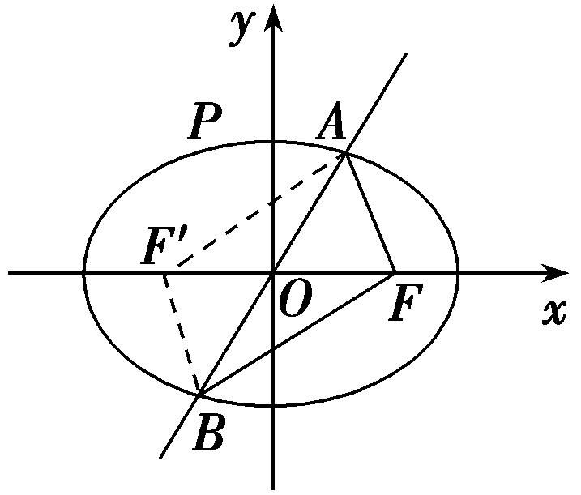
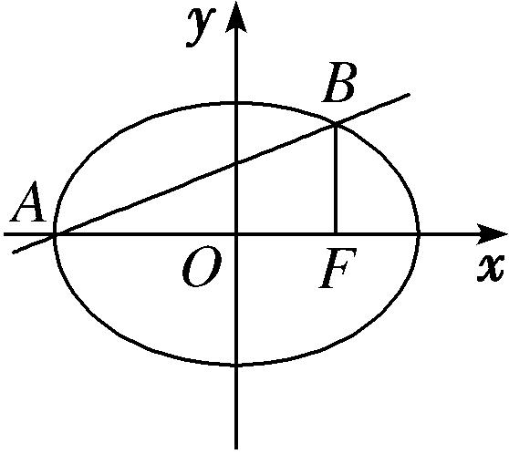
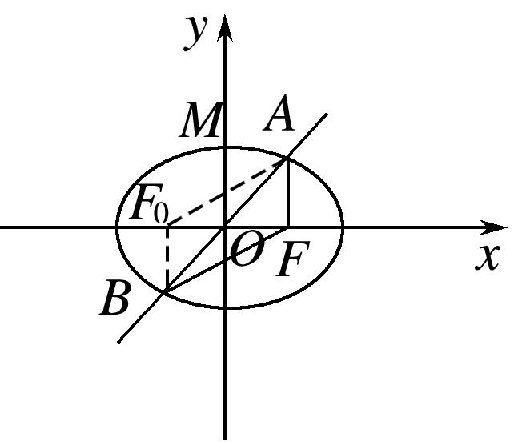
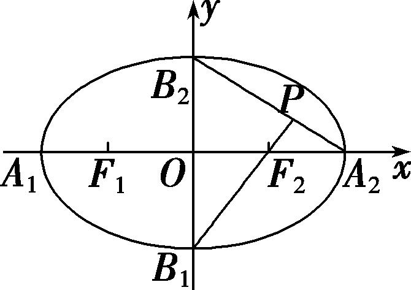
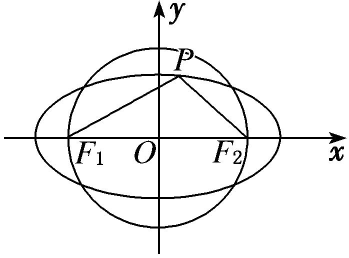
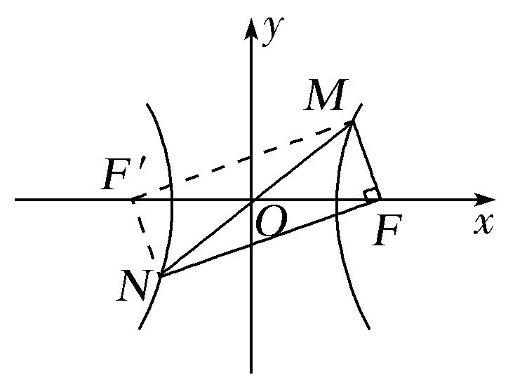
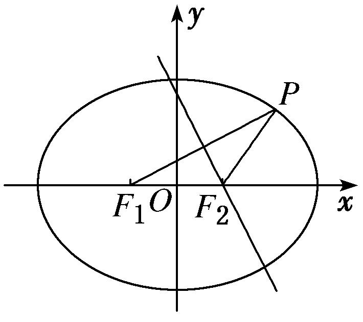

专题03　离心率范围(最值)模型
解决离心率范围(最值)问题的基本思路是建立目标函数或构建不等关系：建立目标函数的关键是选用一个合适的变量，其原则是这个变量能够表达离心率，利用求函数的值域(最值)的方法将离心率表示为其他变量的函数，求其值域(最值)，从而确定离心率的取值范围；构建不等关系是根据试题本身给出的不等条件，或一些隐含条件或椭圆(双曲线)自身的性质构造不等关系，从而求解．

【例题选讲】

<strong>[例8]</strong>　（41）过双曲线－＝1(<em>a</em>&gt;0，<em>b</em>&gt;0)的右焦点且垂直于<em>x</em>轴的直线与双曲线交于<em>A</em>，<em>B</em>两点，与双曲线的渐近线交于<em>C</em>，<em>D</em>两点，若|<em>AB</em>|≥|<em>CD</em>|，则双曲线离心率<em>e</em>的取值范围为(　　)

A．　　　　　
B．　　　　　
C．　　　　　
D．

<strong>答案</strong>　B　<strong>解析</strong>　将<em>x</em>＝<em>c</em>代入－＝1得<em>y</em>＝±，不妨取<em>A</em>，<em>B</em>，所以|<em>AB</em>|＝．将<em>x</em>＝<em>c</em>代入双曲线的渐近线方程<em>y</em>＝±<em>x</em>，得<em>y</em>＝±，不妨取<em>C</em>，<em>D</em>，所以|<em>CD</em>|＝．因为|<em>AB</em>|≥|<em>CD</em>|，所以≥×，即<em>b</em>≥<em>c</em>，则<em>b</em>2≥<em>c</em>2，即<em>c</em>2－<em>a</em>2≥<em>c</em>2，即<em>c</em>2≥<em>a</em>2，所以<em>e</em>2≥，所以<em>e</em>≥，故选B．  
（42）已知椭圆*C*：＋＝1(*a*>*b*>0)的右焦点为*F*，短轴的一个端点为*P*，直线*l*：4*x*－3*y*＝0与椭圆*C*相交于*A*，*B*两点．若|*AF*|＋|*BF*|＝6，点*P*到直线*l*的距离不小于，则椭圆离心率的取值范围是(　　)

A．　　　　　　
B．　　　　　　
C．　　　　　　
D．

<strong>答案</strong>　C　<strong>解析</strong>　如图所示，设<em>F</em>′为椭圆的左焦点，连接<em>AF</em>′，<em>BF</em>′，则四边形<em>AFBF</em>′是平行四边形，

∴6＝|*AF*|＋|*BF*|＝|*AF*′|＋|*AF*|＝2*a*，∴*a*＝3．取*P*(0，*b*)，∵点*P*到直线*l*∶4*x*＋3*y*＝0的距离不小于，∴≥，解得*b*≥2．∴*c*≤＝，∴0<≤．∴椭圆*E*的离心率范围是．故选C．  
（43）已知<em>F</em>1，<em>F</em>2是椭圆＋＝1(<em>a</em>&gt;<em>b</em>&gt;0)的左、右焦点，过<em>F</em>2且垂直于<em>x</em>轴的直线与椭圆交于<em>A</em>，<em>B</em>两点，若△<em>ABF</em>1是锐角三角形，则该椭圆离心率<em>e</em>的取值范围是(　　)

A．(－1，＋∞)　　　
B．(0，－1)　　　
C．(－1，1)　　　
D．(－1，＋1)

<strong>答案</strong>　C　<strong>解析</strong>　由题意可知，<em>A</em>，<em>B</em>的横坐标均为<em>c</em>，且<em>A</em>，<em>B</em>都在椭圆上，所以＋＝1，从而可得<em>y</em>＝±，不妨令<em>A</em>，<em>B</em>．由△<em>ABF</em>1是锐角三角形知∠<em>AF</em>1<em>F</em>2&lt;45°，所以tan ∠<em>AF</em>1<em>F</em>2&lt;1，所以tan∠<em>AF</em>1<em>F</em>2＝＝&lt;1，故&lt;1，即<em>e</em>2＋2<em>e</em>－1&gt;0，解得<em>e</em>&gt;－1或<em>e</em>&lt;－－1，又因为椭圆中，0&lt;<em>e</em>&lt;1，所以－1&lt;<em>e</em>&lt;1．故选C．  
（44）已知<em>F</em>1，<em>F</em>2分别是椭圆<em>C</em>：＋＝1的上下两个焦点，若椭圆上存在四个不同点<em>P</em>，使得△<em>PF</em>1<em>F</em>2的面积为，则椭圆<em>C</em>的离心率的取值范围是(　　)

A．　　　　　
B．　　　　　
C．　　　　　
D．

<strong>答案</strong>　A　<strong>解析</strong>　<em>F</em>1，<em>F</em>2分别是椭圆<em>C</em>：＋＝1的上下两个焦点，可得2<em>c</em>＝2，短半轴的长：，椭圆上存在四个不同点<em>P</em>，使得△<em>PF</em>1<em>F</em>2的面积为，可得×2×&gt;，可得<em>m</em>2－4<em>m</em>＋3&lt;0，解得<em>m</em>∈(1，3)，则椭圆<em>C</em>的离心率为：<em>e</em>＝∈．

  
（45）已知椭圆 $\frac{x^{2}}{a^{2}}$ ＋ $\frac{y^{2}}{b^{2}}$ =&lt;text style="subs&lt;text style="itali<em>c</em>"&gt;c&lt;/text&gt;ript"&gt;1&lt;/text&gt;(<em>a</em>&gt;<em>b</em>&gt;0)的左、右焦点分别为<em>&lt;text style="italic"&gt;F</em>&lt;/text&gt;1(－c，0)，F2(c，0)，若椭圆上存在一点<em>P</em>使 $\frac{a}{sin\angle PF_{1}F_{2}}$ ＝ $\frac{c}{sin\angle PF_{2}F_{1}}$ ，则该椭圆的离心率的取值范围为<u>　　　　</u>．

思路点拨　在△<em>PF</em>1<em>F</em>2中，使用正弦定理建立|<em>PF</em>1|，|<em>PF</em>2|之间的数量关系，再结合椭圆定义求出|<em>PF</em>2|，利用<em>a</em>－<em>c</em>&lt;|<em>PF</em>2|&lt;<em>a</em>＋<em>c</em>建立不等式确定所求范围．

&lt;t&lt;t&lt;t&lt;t&lt;t&lt;t<em>e</em>xt style="italic"&gt;e&lt;/text&gt;xt style="italic"&gt;e&lt;/text&gt;xt style="italic"&gt;e&lt;/text&gt;xt style="italic"&gt;e&lt;/text&gt;xt style="italic"&gt;e&lt;/text&gt;xt style="&lt;text style="it&lt;text style="it&lt;text style="it<em>a</em>li&lt;text style="itali<em>c</em>"&gt;c&lt;/text&gt;"&gt;a&lt;/text&gt;lic"&gt;a&lt;/text&gt;lic"&gt;b&lt;/text&gt;old"&gt;答案　&lt;/text&gt;( $\sqrt{2}$ －&lt;t&lt;t&lt;t&lt;t&lt;t&lt;t<em>e</em>xt style="italic"&gt;e&lt;/text&gt;xt style="italic"&gt;e&lt;/text&gt;xt style="italic"&gt;e&lt;/text&gt;xt style="italic"&gt;e&lt;/text&gt;xt style="italic"&gt;e&lt;/text&gt;xt style="su&lt;text style="it&lt;text style="it&lt;text style="it<em>a</em>li&lt;text style="itali<em>c</em>"&gt;c&lt;/text&gt;"&gt;a&lt;/text&gt;lic"&gt;a&lt;/text&gt;lic"&gt;b&lt;/text&gt;s&lt;text style="it&lt;text style="it&lt;text style="itali&lt;text style="itali<em>c</em>"&gt;c&lt;/text&gt;"&gt;a&lt;/text&gt;li<em>c</em>"&gt;a&lt;/text&gt;lic"&gt;c&lt;/text&gt;ript"&gt;&lt;text style="subscript"&gt;&lt;text style="subscript"&gt;&lt;text style="subscript"&gt;&lt;text style="subscript"&gt;1&lt;/text&gt;&lt;/text&gt;&lt;/text&gt;&lt;/text&gt;&lt;/text&gt;，1)　<strong>解析</strong>　根据已知条件∠&lt;text style="it&lt;text style="it<em>a</em>lic"&gt;a&lt;/text&gt;lic"&gt;<em>&lt;text style="italic"&gt;P</em>&lt;/text&gt;<em>&lt;text style="italic"&gt;&lt;text style="italic"&gt;&lt;text style="italic"&gt;&lt;text style="italic"&gt;F</em>&lt;/text&gt;&lt;/text&gt;&lt;/text&gt;&lt;/text&gt;&lt;/text&gt;1F&lt;text style="subscript"&gt;&lt;text style="subscript"&gt;&lt;text style="subscript"&gt;&lt;text style="subscript"&gt;&lt;text style="subscript"&gt;&lt;text style="subscript"&gt;&lt;text style="subscript"&gt;&lt;text style="superscript"&gt;&lt;text style="superscript"&gt;&lt;text style="superscript"&gt;&lt;text style="superscript"&gt;&lt;text style="superscript"&gt;&lt;text style="superscript"&gt;&lt;text style="superscript"&gt;2&lt;/text&gt;&lt;/text&gt;&lt;/text&gt;&lt;/text&gt;&lt;/text&gt;&lt;/text&gt;&lt;/text&gt;&lt;/text&gt;&lt;/text&gt;&lt;/text&gt;&lt;/text&gt;&lt;/text&gt;&lt;/text&gt;&lt;/text&gt;，∠<em>&lt;text style="italic"&gt;&lt;text style="italic"&gt;&lt;text style="italic"&gt;&lt;text style="italic"&gt;&lt;text style="italic"&gt;&lt;text style="italic"&gt;&lt;text style="italic"&gt;PF</em>&lt;/text&gt;&lt;/text&gt;&lt;/text&gt;&lt;/text&gt;&lt;/text&gt;&lt;/text&gt;&lt;/text&gt;2F1都不能等于0，即点P不会是椭圆的左、右顶点，故P，F1，F2构成三角形，在△PF1F2中，由正弦定理得 $\frac{|PF_{2}|}{sin\angle PF_{1}F_{2}}$ ＝ $\frac{|PF_{1}|}{sin\angle PF_{2}F_{1}}$ ，则由已知，得 $\frac{a}{|PF_{2}|}$ ＝ $\frac{c}{|PF_{1}|}$ ，即|&lt;t&lt;t&lt;t&lt;t&lt;t&lt;t<em>e</em>xt style="italic"&gt;e&lt;/text&gt;xt style="italic"&gt;e&lt;/text&gt;xt style="italic"&gt;e&lt;/text&gt;xt style="italic"&gt;e&lt;/text&gt;xt style="italic"&gt;e&lt;/text&gt;xt style="it&lt;text style="it&lt;text style="it&lt;text style="it&lt;text style="it&lt;text style="it&lt;text style="it<em>a</em>li&lt;text style="itali<em>c</em>"&gt;c&lt;/text&gt;"&gt;a&lt;/text&gt;lic"&gt;a&lt;/text&gt;li&lt;text style="itali<em>c</em>"&gt;c&lt;/text&gt;"&gt;a&lt;/text&gt;li<em>c</em>"&gt;a&lt;/text&gt;li<em>c</em>"&gt;a&lt;/text&gt;lic"&gt;a&lt;/text&gt;lic"&gt;<em>&lt;text style="italic"&gt;P</em>&lt;/text&gt;<em>&lt;text style="italic"&gt;&lt;text style="italic"&gt;&lt;text style="italic"&gt;&lt;text style="italic"&gt;F</em>&lt;/text&gt;&lt;/text&gt;&lt;/text&gt;&lt;/text&gt;&lt;/text&gt;&lt;text style="su<em>b</em>script"&gt;&lt;text style="subscript"&gt;&lt;text style="subscript"&gt;&lt;text style="subscript"&gt;&lt;text style="subscript"&gt;1&lt;/text&gt;&lt;/text&gt;&lt;/text&gt;&lt;/text&gt;&lt;/text&gt;|＝ $\frac{c}{a}$ |&lt;t&lt;t&lt;t&lt;t&lt;t&lt;t<em>e</em>xt style="italic"&gt;e&lt;/text&gt;xt style="italic"&gt;e&lt;/text&gt;xt style="italic"&gt;e&lt;/text&gt;xt style="italic"&gt;e&lt;/text&gt;xt style="italic"&gt;e&lt;/text&gt;xt style="it&lt;text style="it&lt;text style="it&lt;text style="it&lt;text style="it&lt;text style="it&lt;text style="it<em>a</em>li&lt;text style="itali<em>c</em>"&gt;c&lt;/text&gt;"&gt;a&lt;/text&gt;lic"&gt;a&lt;/text&gt;li&lt;text style="itali<em>c</em>"&gt;c&lt;/text&gt;"&gt;a&lt;/text&gt;li<em>c</em>"&gt;a&lt;/text&gt;li<em>c</em>"&gt;a&lt;/text&gt;lic"&gt;a&lt;/text&gt;lic"&gt;<em>&lt;text style="italic"&gt;P</em>&lt;/text&gt;<em>&lt;text style="italic"&gt;&lt;text style="italic"&gt;&lt;text style="italic"&gt;&lt;text style="italic"&gt;F</em>&lt;/text&gt;&lt;/text&gt;&lt;/text&gt;&lt;/text&gt;&lt;/text&gt;&lt;text style="su<em>b</em>script"&gt;&lt;text style="subscript"&gt;&lt;text style="subscript"&gt;&lt;text style="subscript"&gt;&lt;text style="subscript"&gt;&lt;text style="subscript"&gt;&lt;text style="subscript"&gt;&lt;text style="superscript"&gt;&lt;text style="superscript"&gt;&lt;text style="superscript"&gt;&lt;text style="superscript"&gt;&lt;text style="superscript"&gt;&lt;text style="superscript"&gt;&lt;text style="superscript"&gt;2&lt;/text&gt;&lt;/text&gt;&lt;/text&gt;&lt;/text&gt;&lt;/text&gt;&lt;/text&gt;&lt;/text&gt;&lt;/text&gt;&lt;/text&gt;&lt;/text&gt;&lt;/text&gt;&lt;/text&gt;&lt;/text&gt;&lt;/text&gt;|，①．根据椭圆定义，|<em>&lt;text style="italic"&gt;&lt;text style="italic"&gt;&lt;text style="italic"&gt;&lt;text style="italic"&gt;&lt;text style="italic"&gt;&lt;text style="italic"&gt;&lt;text style="italic"&gt;PF</em>&lt;/text&gt;&lt;/text&gt;&lt;/text&gt;&lt;/text&gt;&lt;/text&gt;&lt;/text&gt;&lt;/text&gt;&lt;text style="subscript"&gt;&lt;text style="subscript"&gt;&lt;text style="subscript"&gt;&lt;text style="subscript"&gt;&lt;text style="subscript"&gt;1&lt;/text&gt;&lt;/text&gt;&lt;/text&gt;&lt;/text&gt;&lt;/text&gt;|＋|PF2|＝2a，②．由①②解得，|PF2|＝ $\frac{2a}{1+\frac{c}{a}}$ ＝ $\frac{2a^{2}}{a+c}$ ，因为&lt;t&lt;t&lt;t&lt;t&lt;t&lt;t<em>e</em>xt style="italic"&gt;e&lt;/text&gt;xt style="italic"&gt;e&lt;/text&gt;xt style="italic"&gt;e&lt;/text&gt;xt style="italic"&gt;e&lt;/text&gt;xt style="italic"&gt;e&lt;/text&gt;xt style="it&lt;text style="it&lt;text style="it&lt;text style="it&lt;text style="it&lt;text style="it<em>a</em>li&lt;text style="itali<em>c</em>"&gt;c&lt;/text&gt;"&gt;a&lt;/text&gt;lic"&gt;a&lt;/text&gt;li&lt;text style="itali<em>c</em>"&gt;c&lt;/text&gt;"&gt;a&lt;/text&gt;li<em>c</em>"&gt;a&lt;/text&gt;li<em>c</em>"&gt;a&lt;/text&gt;lic"&gt;a&lt;/text&gt;－c&lt;|<em>&lt;text style="italic"&gt;&lt;text style="italic"&gt;P</em>&lt;/text&gt;<em>&lt;text style="italic"&gt;&lt;text style="italic"&gt;&lt;text style="italic"&gt;&lt;text style="italic"&gt;F</em>&lt;/text&gt;&lt;/text&gt;&lt;/text&gt;&lt;/text&gt;&lt;/text&gt;&lt;text style="su<em>b</em>script"&gt;&lt;text style="subscript"&gt;&lt;text style="subscript"&gt;&lt;text style="subscript"&gt;&lt;text style="subscript"&gt;&lt;text style="subscript"&gt;&lt;text style="subscript"&gt;&lt;text style="superscript"&gt;&lt;text style="superscript"&gt;&lt;text style="superscript"&gt;&lt;text style="superscript"&gt;&lt;text style="superscript"&gt;&lt;text style="superscript"&gt;&lt;text style="superscript"&gt;2&lt;/text&gt;&lt;/text&gt;&lt;/text&gt;&lt;/text&gt;&lt;/text&gt;&lt;/text&gt;&lt;/text&gt;&lt;/text&gt;&lt;/text&gt;&lt;/text&gt;&lt;/text&gt;&lt;/text&gt;&lt;/text&gt;&lt;/text&gt;|&lt;a＋c，所以a－c&lt; $\frac{2a^{2}}{a+c}$ &lt; &lt;t&lt;t&lt;t&lt;t&lt;t&lt;t<em>e</em>xt style="italic"&gt;e&lt;/text&gt;xt style="italic"&gt;e&lt;/text&gt;xt style="italic"&gt;e&lt;/text&gt;xt style="italic"&gt;e&lt;/text&gt;xt style="italic"&gt;e&lt;/text&gt;xt style="it&lt;text style="it&lt;text style="it&lt;text style="it&lt;text style="it&lt;text style="it<em>a</em>li&lt;text style="itali<em>c</em>"&gt;c&lt;/text&gt;"&gt;a&lt;/text&gt;lic"&gt;a&lt;/text&gt;li&lt;text style="itali<em>c</em>"&gt;c&lt;/text&gt;"&gt;a&lt;/text&gt;li<em>c</em>"&gt;a&lt;/text&gt;li<em>c</em>"&gt;a&lt;/text&gt;lic"&gt;a&lt;/text&gt;＋c，即<em>b</em>&lt;text style="subscript"&gt;&lt;text style="subscript"&gt;&lt;text style="subscript"&gt;&lt;text style="subscript"&gt;&lt;text style="subscript"&gt;&lt;text style="subscript"&gt;&lt;text style="subscript"&gt;&lt;text style="superscript"&gt;&lt;text style="superscript"&gt;&lt;text style="superscript"&gt;&lt;text style="superscript"&gt;&lt;text style="superscript"&gt;&lt;text style="superscript"&gt;&lt;text style="superscript"&gt;2&lt;/text&gt;&lt;/text&gt;&lt;/text&gt;&lt;/text&gt;&lt;/text&gt;&lt;/text&gt;&lt;/text&gt;&lt;/text&gt;&lt;/text&gt;&lt;/text&gt;&lt;/text&gt;&lt;/text&gt;&lt;/text&gt;&lt;/text&gt;&lt;2a2&lt;a2＋2<em>&lt;text style="italic"&gt;ac</em>&lt;/text&gt;＋c2，所以c2＋2ac－a2&gt;0，即e2＋2e－&lt;text style="subscript"&gt;&lt;text style="subscript"&gt;&lt;text style="subscript"&gt;&lt;text style="subscript"&gt;&lt;text style="subscript"&gt;1&lt;/text&gt;&lt;/text&gt;&lt;/text&gt;&lt;/text&gt;&lt;/text&gt;&gt;0，解得e&lt;－ $\sqrt{2}$ －&lt;t&lt;t&lt;t&lt;t&lt;t&lt;t<em>e</em>xt style="italic"&gt;e&lt;/text&gt;xt style="italic"&gt;e&lt;/text&gt;xt style="italic"&gt;e&lt;/text&gt;xt style="italic"&gt;e&lt;/text&gt;xt style="italic"&gt;e&lt;/text&gt;xt style="su&lt;text style="it&lt;text style="it&lt;text style="it<em>a</em>li&lt;text style="itali<em>c</em>"&gt;c&lt;/text&gt;"&gt;a&lt;/text&gt;lic"&gt;a&lt;/text&gt;lic"&gt;b&lt;/text&gt;s&lt;text style="it&lt;text style="it&lt;text style="itali&lt;text style="itali<em>c</em>"&gt;c&lt;/text&gt;"&gt;a&lt;/text&gt;li<em>c</em>"&gt;a&lt;/text&gt;lic"&gt;c&lt;/text&gt;ript"&gt;&lt;text style="subscript"&gt;&lt;text style="subscript"&gt;&lt;text style="subscript"&gt;&lt;text style="subscript"&gt;1&lt;/text&gt;&lt;/text&gt;&lt;/text&gt;&lt;/text&gt;&lt;/text&gt;或e&gt; $\sqrt{2}$ －&lt;t&lt;t&lt;t&lt;t&lt;t&lt;t<em>e</em>xt style="italic"&gt;e&lt;/text&gt;xt style="italic"&gt;e&lt;/text&gt;xt style="italic"&gt;e&lt;/text&gt;xt style="italic"&gt;e&lt;/text&gt;xt style="italic"&gt;e&lt;/text&gt;xt style="su&lt;text style="it&lt;text style="it&lt;text style="it<em>a</em>li&lt;text style="itali<em>c</em>"&gt;c&lt;/text&gt;"&gt;a&lt;/text&gt;lic"&gt;a&lt;/text&gt;lic"&gt;b&lt;/text&gt;s&lt;text style="it&lt;text style="it&lt;text style="itali&lt;text style="itali<em>c</em>"&gt;c&lt;/text&gt;"&gt;a&lt;/text&gt;li<em>c</em>"&gt;a&lt;/text&gt;lic"&gt;c&lt;/text&gt;ript"&gt;&lt;text style="subscript"&gt;&lt;text style="subscript"&gt;&lt;text style="subscript"&gt;&lt;text style="subscript"&gt;1&lt;/text&gt;&lt;/text&gt;&lt;/text&gt;&lt;/text&gt;&lt;/text&gt;，又e∈(0，1)，故椭圆的离心率e∈( $\sqrt{2}$ －&lt;t&lt;t&lt;t&lt;t&lt;t&lt;t<em>e</em>xt style="italic"&gt;e&lt;/text&gt;xt style="italic"&gt;e&lt;/text&gt;xt style="italic"&gt;e&lt;/text&gt;xt style="italic"&gt;e&lt;/text&gt;xt style="italic"&gt;e&lt;/text&gt;xt style="su&lt;text style="it&lt;text style="it&lt;text style="it<em>a</em>li&lt;text style="itali<em>c</em>"&gt;c&lt;/text&gt;"&gt;a&lt;/text&gt;lic"&gt;a&lt;/text&gt;lic"&gt;b&lt;/text&gt;s&lt;text style="it&lt;text style="it&lt;text style="itali&lt;text style="itali<em>c</em>"&gt;c&lt;/text&gt;"&gt;a&lt;/text&gt;li<em>c</em>"&gt;a&lt;/text&gt;lic"&gt;c&lt;/text&gt;ript"&gt;&lt;text style="subscript"&gt;&lt;text style="subscript"&gt;&lt;text style="subscript"&gt;&lt;text style="subscript"&gt;1&lt;/text&gt;&lt;/text&gt;&lt;/text&gt;&lt;/text&gt;&lt;/text&gt;，1)．  
（46）已知双曲线*C*：－＝1(*a*>0，*b*>0)，若存在过右焦点*F*的直线与双曲线*C*相交于*A*，*B*两点，且＝3，则双曲线*C*的离心率的最小值为\_\_\_\_\_\_\_\_．

<strong>答案</strong>　2　<strong>解析</strong>　因为过右焦点<em>F</em>的直线与双曲线<em>C</em>交于<em>A</em>，<em>B</em>两点，且＝3，故点<em>A</em>在双曲线的左支上，<em>B</em>在双曲线的右支上，如图所示．设<em>A</em>(<em>x</em>1，<em>y</em>1)，<em>B</em>(<em>x</em>2，<em>y</em>2)，右焦点<em>F</em>(<em>c，</em>0)，因为＝3，所以<em>c</em>－<em>x</em>1＝3(<em>c</em>－<em>x</em>2)，即3<em>x</em>2－<em>x</em>1＝2<em>c</em>，由图可知，<em>x</em>1≤－<em>a</em>，<em>x</em>2≥<em>a</em>，所以－<em>x</em>1≥<em>a</em>，3<em>x</em>2≥3<em>a</em>，故3<em>x</em>2－<em>x</em>1≥4<em>a</em>，即2<em>c</em>≥4<em>a</em>，故<em>e</em>≥2，所以双曲线<em>C</em>的离心率的最小值为2．

  
（47）已知双曲线方程为 $\frac{x^{2}}{m^{2}+4}$ － $\frac{y^{2}}{b^{2}}$ ＝1，若其过焦点的最短弦长为2，则该双曲线的离心率的取值范围是(　　)

A．(1， $\frac{\sqrt{6}}{2}$ ]　　　　　　
B．[ $\frac{\sqrt{6}}{2}$ ，＋∞)　　　　　　
C．(1， $\frac{\sqrt{6}}{2}$ )　　　　　　
D．( $\frac{\sqrt{(((((6}}{2}$ ，＋∞)

&lt;t&lt;t<em>e</em>xt style="italic"&gt;e&lt;/text&gt;xt style="<em>b</em>old"&gt;答案　&lt;/text&gt;A　<strong>解析</strong>　过焦点的最短弦长有可能是&lt;text style="superscript"&gt;&lt;text style="superscript"&gt;2&lt;/text&gt;&lt;/text&gt;&lt;text style="it&lt;text style="it<em>a</em>lic"&gt;a&lt;/text&gt;lic"&gt;a&lt;/text&gt;或是过焦点且垂直于长轴所在直线的弦长为 $\frac{2b^{2}}{a}$ ＝ $\frac{2b^{2}}{\sqrt{m^{2}+4}}$ ，&lt;t&lt;t<em>e</em>xt style="italic"&gt;e&lt;/text&gt;xt style="it&lt;text style="it<em>a</em>lic"&gt;a&lt;/text&gt;lic"&gt;a&lt;/text&gt;&lt;text style="superscript"&gt;&lt;text style="superscript"&gt;2&lt;/text&gt;&lt;/text&gt;＝<em>m</em>2＋4≥4，2a≥4&gt;2，所以过焦点的最短弦长为 $\frac{2b^{2}}{a}$ ＝ $\frac{2b^{2}}{\sqrt{m^{2}+4}}$ =&lt;t&lt;t<em>e</em>xt style="italic"&gt;e&lt;/text&gt;xt style="superscript"&gt;&lt;text style="superscript"&gt;2&lt;/text&gt;&lt;/text&gt;，即<em>b</em>2＝ $\sqrt{m^{2}+4}$ ≥&lt;t&lt;t<em>e</em>xt style="italic"&gt;e&lt;/text&gt;xt style="superscript"&gt;&lt;text style="superscript"&gt;2&lt;/text&gt;&lt;/text&gt;，e＝ $\frac{c}{a}$ = $\frac{\sqrt{m^{2}+b^{2}+4}}{\sqrt{m^{2}+4}}$ ＝ $\frac{\sqrt{b^{4}+b^{2}}}{b^{2}}$ ＝，0&lt; $\frac{1}{b^{2}}$ ≤ $\frac{1}{2}$ ，所以1&lt;1+ $\frac{1}{b^{2}}$ ≤ $\frac{3}{2}$ ，1&lt; $\sqrt{1+\frac{1}{b^{2}}}$ ≤ $\frac{\sqrt{6}}{2}$ ，即&lt;t<em>e</em>xt style="italic"&gt;e&lt;/text&gt;∈(1， $\frac{\sqrt{6}}{2}$ ]．故选A．  
（48）椭圆<em>M</em>：＋＝1(<em>a</em>＞<em>b</em>＞0)的左、右焦点分别为<em>F</em>1，<em>F</em>2，<em>P</em>为椭圆<em>M</em>上任一点，且|<em>PF</em>1|·|<em>PF</em>2|的最大值的取值范围是[2<em>b</em>2，3<em>b</em>2]，椭圆<em>M</em>的离心率为<em>e</em>，则<em>e</em>－的最小值是\_\_\_\_\_\_\_\_．

<strong>答案</strong>　－　<strong>解析</strong>　由椭圆的定义可知|<em>PF</em>1|＋|<em>PF</em>2|＝2<em>a</em>，∴|<em>PF</em>1|·|<em>PF</em>2|≤2＝<em>a</em>2，∴2<em>b</em>2≤<em>a</em>2≤3<em>b</em>2，即2<em>a</em>2－2<em>c</em>2≤<em>a</em>2≤3<em>a</em>2－3<em>c</em>2，∴≤≤，即≤<em>e</em>≤．令<em>f</em>(<em>x</em>)＝<em>x</em>－，则<em>f</em>(<em>x</em>)在上是增函数，∴当<em>e</em>＝时，<em>e</em>－取得最小值－＝－．  
（49）已知点*A*(－1，0)和*B*(1，0)，动点*P*(*x*，*y*)在直线*l*：*y*＝*x*＋3上移动，椭圆*C*以*A*，*B*为焦点且经过点*P*，则椭圆*C*的离心率的最大值为(　　)

A．　　　　　　　　
B．　　　　　　　　
C．　　　　　　　　
D．

<strong>答案</strong>　A　<strong>解析</strong>　方法1　不妨设椭圆方程为＋＝1(<em>a</em>&gt;1)，与直线<em>l</em>的方程联立消去<em>y</em>得(2<em>a</em>2－1)<em>x</em>2＋6<em>a</em>2<em>x</em>＋10<em>a</em>2－<em>a</em>4＝0，由题意易知<em>Δ</em>＝36<em>a</em>4－4(2<em>a</em>2－1)(10<em>a</em>2－<em>a</em>4)≥0，解得<em>a</em>≥，所以<em>e</em>＝＝≤，所以<em>e</em>的最大值为．
方法2　*A*(－1，0)关于直线*l*：*y*＝*x*＋3的对称点为*A*′(－3，2)，连接*A*′*B*交直线*l*于点*P*，则此时椭圆*C*的长轴长最短，为|*A*′*B*|＝2，所以椭圆*C*的离心率的最大值为＝．故选A．  
（50）已知双曲线－＝1 (<em>a</em>&gt;0，<em>b</em>&gt;0)的左、右焦点分别为<em>F</em>1，<em>F</em>2，点<em>P</em>在双曲线的右支上，且|<em>PF</em>1|＝6|<em>PF</em>2|，此双曲线的离心率<em>e</em>的最大值为\_\_\_\_\_\_\_\_．

<strong>答案　　解析</strong>　由定义，知|<em>PF</em>1|－|<em>PF</em>2|＝2<em>a</em>．又|<em>PF</em>1|＝6|<em>PF</em>2|，∴|<em>PF</em>1|＝<em>a</em>，|<em>PF</em>2|＝<em>a</em>．当<em>P</em>，<em>F</em>1，<em>F</em>2三点不共线时，在△<em>PF</em>1<em>F</em>2中，由余弦定理，得cos∠<em>F</em>1<em>PF</em>2＝＝＝－<em>e</em>2，即<em>e</em>2＝－cos∠<em>F</em>1<em>PF</em>2．∵cos∠<em>F</em>1<em>PF</em>2∈(－1,1)，∴<em>e</em>∈．当<em>P</em>，<em>F</em>1，<em>F</em>2三点共线时，∵|<em>PF</em>1|＝6|<em>PF</em>2|，∴<em>e</em>＝＝，综上，<em>e</em>的最大值为．还可用三角形两边之和大于第三边构造不等式．

【对点训练】

47．过椭圆*C*：＋＝1(*a*>*b*>0)的左顶点*A*且斜率为*k*的直线交椭圆*C*于另一点*B*，且点*B*在*x*轴上的

射影恰好为右焦点*F*．若<*k*<，则椭圆*C*的离心率的取值范围是(　　)

A．　　　　　　
B．　　　　　　
C．　　　　　　
D．

47．<strong>答案</strong>　C　<strong>解析</strong>　由题图可知，|<em>AF</em>|＝<em>a</em>＋<em>c</em>，|<em>BF</em>|＝，于是<em>k</em>＝＝．又&lt;<em>k</em>&lt;，所以&lt;

<，化简可得<1－*e*<，从而可得<*e*<，故选C．

48．已知双曲线<em>C</em>：－<em>y</em>2＝1(<em>a</em>&gt;0)的右顶点为<em>A</em>，<em>O</em>为坐标原点，若|<em>OA</em>|&lt;2，则双曲线<em>C</em>的离心率的

取值范围是(　　)

A．　　　　　
B．　　　　　
C．　　　　　
D．(1，)

48．<strong>答案</strong>　C　<strong>解析</strong>　双曲线<em>C</em>：－<em>y</em>2＝1(<em>a</em>&gt;0)中，右顶点为<em>A</em>(，0)，∴|<em>OA</em>|＝&lt;2，∴

1&lt;<em>a</em>2＋1&lt;4，∴1&gt;&gt;，∵<em>c</em>2＝<em>a</em>2＋1＋1＝<em>a</em>2＋2，∴<em>c</em>＝，∴<em>e</em>＝＝ ＝，∴&lt;<em>e</em>&lt;，即&lt;<em>e</em>&lt;．故选C．

49．已知椭圆*E*：＋＝1(*a*>*b*>0)的右焦点为*F*，短轴的一个端点为*M*，直线*l*：3*x*－4*y*＝0交椭圆*E*于*A*，

*B*两点．若|*AF*|＋|*BF*|＝4，点*M*到直线*l*的距离不小于，则椭圆*E*的离心率的取值范围是(　　)

A．　　　　　　
B．　　　　　　
C．　　　　　　
D．

49．<strong>答案</strong>　A　<strong>解析</strong>　设左焦点为<em>F</em>0，连接<em>F</em>0<em>A</em>，<em>F</em>0<em>B</em>，则四边形<em>AFBF</em>0为平行四边形．

∵|<em>AF</em>|＋|<em>BF</em>|＝4，∴|<em>AF</em>|＋|<em>AF</em>0|＝4，∴<em>a</em>＝2．设<em>M</em>(0，<em>b</em>)，则<em>M</em>到直线<em>l</em>的距离<em>d</em>＝≥，∴1≤<em>b</em>&lt;2．离心率<em>e</em>＝＝＝ ＝ ∈，故选A．

50．已知双曲线－＝1(<em>a</em>&gt;0，<em>b</em>&gt;0)的左、右焦点为<em>F</em>1、<em>F</em>2，双曲线上的点<em>P</em>满足4|＋|≥3||
恒成立，则双曲线的离心率的取值范围为(　　)

A．1<*e*≤　　　　　　　
B．*e*≥　　　　　　　
C．1<*e*≤　　　　　　　
D．*e*≥

50．<strong>答案</strong>　C　<strong>解析</strong>　由<em>OP</em>为△<em>F</em>1<em>PF</em>2的中线，可得4|＋|＝8||≥3||，因为||≥<em>a</em>，||

＝2*c*，可得8*a*≥6*c*，即双曲线的离心率为：1<*e*≤．故选C．

51．已知点<em>F</em>1，<em>F</em>2分别是双曲线－＝1(<em>a</em>＞0，<em>b</em>＞0)的左、右焦点，过<em>F</em>2且垂直于<em>x</em>轴的直线与双曲

线交于<em>M</em>，<em>N</em>两点，若1·1＞0，则该双曲线的离心率<em>e</em>的取值范围是(　　)

A．(，＋1)　　　　
B．(1，＋1)　　　　
C．(1，)　　　　
D．(，＋∞)

51．<strong>答案</strong>　B　<strong>解析</strong>　设<em>F</em>1(－<em>c</em>，0)，<em>F</em>2(<em>c</em>，0)，依题意可得－＝1，得到<em>y</em>＝，不妨设<em>M</em>，<em>N</em>，
则1·1＝·＝4<em>c</em>2－＞0，得到4<em>a</em>2<em>c</em>2－(<em>c</em>2－<em>a</em>2)2＞0，即<em>a</em>4＋<em>c</em>4－6<em>a</em>2<em>c</em>2＜0，故<em>e</em>4－6<em>e</em>2＋1＜0，解得3－2＜<em>e</em>2＜3＋2，又<em>e</em>＞1，所以1＜<em>e</em>2＜3＋2，解得1＜<em>e</em>＜1＋．

52．正方形*ABCD*的四个顶点都在椭圆＋＝1(*a*>*b*>0)上，若椭圆的焦点在正方形的内部，则椭圆的离

心率的取值范围是(　　)

A．　　　　
B．　　　　
C． 　　　　
D．

52．<strong>答案</strong>　B　<strong>解析</strong>设正方形的边长为2<em>m</em>，因为椭圆的焦点在正方形的内部，所以<em>m</em>&gt;<em>c</em>，又正方形<em>ABCD</em>

的四个顶点都在椭圆＋＝1(<em>a</em>&gt;<em>b</em>&gt;0)上，所以＋＝1&gt;＋＝<em>e</em>2＋，整理得<em>e</em>4－3<em>e</em>2＋1&gt;0，<em>e</em>2&lt;＝，所以0&lt;<em>e</em>&lt;．故选B．

53．如图，椭圆的中心在坐标原点<em>O</em>，顶点分别是<em>A</em>1，<em>A</em>2，<em>B</em>1，<em>B</em>2，焦点分别为<em>F</em>1，<em>F</em>2，延长<em>B</em>1<em>F</em>2与<em>A</em>2<em>B</em>2

交于<em>P</em>点，若∠<em>B</em>1<em>PA</em>2为钝角，则此椭圆的离心率的取值范围为\_\_\_\_\_\_\_\_．

53．<strong>答案　　解析</strong>　设椭圆的方程为＋＝1(<em>a</em>&gt;<em>b</em>&gt;0)，∠<em>B</em>1<em>PA</em>2为钝角可转化为，所

夹的角为钝角，则(<em>a</em>，－<em>b</em>)·(－<em>c</em>，－<em>b</em>)&lt;0，得<em>b</em>2&lt;<em>ac</em>，即<em>a</em>2－<em>c</em>2&lt;<em>ac</em>，故＋－1&gt;0即<em>e</em>2＋<em>e</em>－1&gt;0，<em>e</em>&gt;或<em>e</em>&lt;，又0&lt;<em>e</em>&lt;1，所以&lt;<em>e</em>&lt;1．

54．已知<em>F</em>1，<em>F</em>2分别是椭圆<em>C</em>：＋＝1(<em>a</em>&gt;<em>b</em>&gt;0)的左、右焦点，若椭圆<em>C</em>上存在点<em>P</em>使∠<em>F</em>1<em>PF</em>2为钝角，
则椭圆*C*的离心率的取值范围是(　　)

A．　　　　　　
B．　　　　　　
C．　　　　　　
D．

54．<strong>答案</strong>　A　<strong>解析</strong>　法一：设<em>P</em>(<em>x</em>0，<em>y</em>0)，由题意知|<em>x</em>0|&lt;<em>a</em>，因为∠<em>F</em>1<em>PF</em>2为钝角，所以<em>PF</em>1―→·<em>PF</em>2―→&lt;0

有解，即(－<em>c</em>－<em>x</em>0，－<em>y</em>0)·(<em>c</em>－<em>x</em>0，－<em>y</em>0)&lt;0，化简得<em>c</em>2&gt;<em>x</em>＋<em>y</em>，即<em>c</em>2&gt;(<em>x</em>＋<em>y</em>)min，又<em>y</em>＝<em>b</em>2－<em>x</em>，0≤<em>x</em>&lt;<em>a</em>2，故<em>x</em>＋<em>y</em>＝<em>b</em>2＋<em>x</em>∈[<em>b</em>2，<em>a</em>2)，所以(<em>x</em>＋<em>y</em>)min＝<em>b</em>2，故<em>c</em>2&gt;<em>b</em>2，又<em>b</em>2＝<em>a</em>2－<em>c</em>2，所以<em>e</em>2＝&gt;，解得<em>e</em>&gt;，又0&lt;<em>e</em>&lt;1，故椭圆<em>C</em>的离心率的取值范围是．

法二：椭圆上存在点<em>P</em>使∠<em>F</em>1<em>PF</em>2为钝角⇔以原点<em>O</em>为圆心，以<em>c</em>为半径的圆与椭圆有四个不同的交点⇔<em>b</em>&lt;<em>c</em>．如图，由<em>b</em>&lt;<em>c</em>，得<em>a</em>2－<em>c</em>2&lt;<em>c</em>2，即<em>a</em>2&lt;2<em>c</em>2，解得<em>e</em>＝&gt;，又0&lt;<em>e</em>&lt;1，故椭圆<em>C</em>的离心率的取值范围是．

55．已知椭圆＋＝1(<em>a</em>&gt;<em>b</em>&gt;0)的左、右焦点分别为<em>F</em>1，<em>F</em>2，<em>P</em>是椭圆上一点，△<em>PF</em>1<em>F</em>2是以<em>F</em>2<em>P</em>为底边的

等腰三角形，且60°&lt;∠<em>PF</em>1<em>F</em>2&lt;120°，则该椭圆的离心率的取值范围是(　　)

A．（，1）　　　　
B．（，）　　　　
C．（，1）　　　　
D．（0，）

55．<strong>答案</strong>　B　<strong>解析</strong>　由题意可得，|<em>PF</em>2|2＝|<em>F</em>1<em>F</em>2|2＋|<em>PF</em>1|2－2|<em>F</em>1<em>F</em>2|·|<em>PF</em>1|cos∠<em>PF</em>1<em>F</em>2＝4<em>c</em>2＋4<em>c</em>2－2·2<em>c</em>·2<em>c</em>·cos

∠<em>PF</em>1<em>F</em>2，即|<em>PF</em>2|＝2<em>c</em>·，所以<em>a</em>＝＝<em>c</em>＋<em>c</em>·，又60°&lt;∠<em>PF</em>1<em>F</em>2&lt;120°，∴－&lt;cos∠<em>PF</em>1<em>F</em>2&lt;，所以2<em>c</em>&lt;<em>a</em>&lt;(＋1)<em>c</em>，则&lt;&lt;，即&lt;<em>e</em>&lt;．故选B．

56．过双曲线－＝1(*a*>0，*b*>0)的左焦点且垂直于*x*轴的直线与双曲线交于*A*，*B*两点，*D*为虚轴的一

个端点，且△*ABD*为钝角三角形，则此双曲线离心率的取值范围为\_\_\_\_\_\_\_\_．

56．<strong>答案</strong>　(1，)∪(，＋∞)　<strong>解析</strong>　设双曲线－＝1(<em>a</em>&gt;0，<em>b</em>&gt;0)的左焦点<em>F</em>1(－<em>c,</em>0)，令<em>x</em>＝－

<em>c</em>，可得<em>y</em>＝±<em>b</em>＝±，设<em>A</em>，<em>B</em>，<em>D</em>(0，<em>b</em>)，可得＝，＝，＝，若∠<em>DAB</em>为钝角，则·&lt;0，即0－·&lt;0，化为<em>a</em>&gt;<em>b</em>，即有<em>a</em>2&gt;<em>b</em>2＝<em>c</em>2－<em>a</em>2，可得<em>c</em>2&lt;2<em>a</em>2，即<em>e</em>＝&lt;，又<em>e</em>&gt;1，可得1&lt;<em>e</em>&lt;；若∠<em>ADB</em>为钝角，则·&lt;0，即<em>c</em>2－&lt;0，化为<em>c</em>4－4<em>a</em>2<em>c</em>2＋2<em>a</em>4&gt;0，由<em>e</em>＝，可得<em>e</em>4－4<em>e</em>2＋2&gt;0，又<em>e</em>&gt;1，可得<em>e</em>&gt;；又·＝&gt;0，∴∠<em>DBA</em>不可能为钝角．综上可得，<em>e</em>的取值范围为(1，)∪(，＋∞)．

57．已知点*F*为双曲线*E*：－＝1(*a*>0，*b*>0)的右焦点，直线*y*＝*kx*(*k*>0)与*E*交于不同象限内的*M*，*N*

两点，若*MF*⊥*NF*，设∠*MNF*＝*β*，且*β*∈，则该双曲线的离心率的取值范围是(　　)

A．[，＋]　　　
B．[2，＋1]　　　
C．[2，＋]　　　
D．[，＋1]

57．<strong>答案</strong>　D　<strong>解析</strong>　如图，设左焦点为<em>F</em>′，连接<em>MF</em>′，<em>NF</em>′，令|<em>MF</em>|＝<em>r</em>1，|<em>MF</em>′|＝<em>r</em>2，则|<em>NF</em>|＝|<em>MF</em>′|＝<em>r</em>2，
由双曲线定义可知<em>r</em>2－<em>r</em>1＝2<em>a</em>①，∵点<em>M</em>与点<em>N</em>关于原点对称，且<em>MF</em>⊥<em>NF</em>，∴|<em>OM</em>|＝|<em>ON</em>|＝|<em>OF</em>|＝<em>c</em>，∴<em>r</em>＋<em>r</em>＝4<em>c</em>2②，

由①②得<em>r</em>1<em>r</em>2＝2(<em>c</em>2－<em>a</em>2)，又知<em>S</em>△<em>MNF</em>＝2<em>S</em>△<em>MOF</em>，∴<em>r</em>1<em>r</em>2＝2·<em>c</em>2·sin 2<em>β</em>，∴<em>c</em>2－<em>a</em>2＝<em>c</em>2·sin 2<em>β</em>，∴<em>e</em>2＝，又∵<em>β</em>∈，∴sin 2<em>β</em>∈，∴<em>e</em>2＝∈[2，(＋1)2]．又<em>e</em>&gt;1，∴<em>e</em>∈[，＋1]．

58．过双曲线－＝1(*a*>0，*b*>0)的右顶点且斜率为2的直线，与该双曲线的右支交于两点，则此双曲线

离心率的取值范围为\_\_\_\_\_\_\_\_.

58．<strong>答案</strong>　(1，)　<strong>解析</strong>　由过双曲线－＝1(<em>a</em>&gt;0，<em>b</em>&gt;0)的右顶点且斜率为2的直线，与该双曲线的右

支交于两点，可得<2．∴*e*＝＝<＝，∵*e*>1，∴1<*e*<，∴此双曲线离心率的取值范围为(1，).

59．已知<em>F</em>1，<em>F</em>2分别是椭圆<em>C</em>：＋＝1(<em>a</em>&gt;<em>b</em>&gt;0)的左、右焦点，若椭圆<em>C</em>上存在点<em>P</em>，使得线段<em>PF</em>1的

中垂线恰好经过焦点<em>F</em>2，则椭圆<em>C</em>的离心率的取值范围是(　　)

A． 　　　　　　
B．　　　　　　
C．　　　　　　
D．

59．<strong>答案</strong>　C　<strong>解析</strong>　如图所示，∵线段<em>PF</em>1的中垂线经过<em>F</em>2，∴|<em>PF</em>2|＝|<em>F</em>1<em>F</em>2|＝2<em>c</em>，即椭圆上存在一点<em>P</em>，

使得|<em>PF</em>2|＝2<em>c</em>．∴<em>a</em>－<em>c</em>≤2<em>c</em>＜<em>a</em>＋<em>c</em>．∴<em>e</em>＝∈．

60．已知<em>F</em>1，<em>F</em>2是椭圆＋＝1(<em>a</em>&gt;<em>b</em>&gt;0)的左、右两个焦点，若椭圆上存在点<em>P</em>使得<em>PF</em>1⊥<em>PF</em>2，则该椭圆

的离心率的取值范围是(　　)

A．　　　　　　
B．　　　　　　
C．　　　　　　
D．

60．<strong>答案</strong>　B　<strong>解析</strong>　∵<em>F</em>1，<em>F</em>2是椭圆＋＝1(<em>a</em>&gt;<em>b</em>&gt;0)的左、右两个焦点，∴离心率0&lt;<em>e</em>&lt;1，<em>F</em>1(－<em>c，</em>0)，

<em>F</em>2(<em>c</em>，0)，<em>c</em>2＝<em>a</em>2－<em>b</em>2．设点<em>P</em>(<em>x</em>，<em>y</em>)，由<em>PF</em>1⊥<em>PF</em>2，得(<em>x</em>＋<em>c</em>，<em>y</em>)·(<em>x</em>－<em>c</em>，<em>y</em>)＝0，化简得<em>x</em>2＋<em>y</em>2＝<em>c</em>2．联立方程组整理得，<em>x</em>2＝(2<em>c</em>2－<em>a</em>2)·≥0，解得<em>e</em>≥．又0&lt;<em>e</em>&lt;1，∴≤<em>e</em>&lt;1．

61．已知双曲线<em>C</em>：－＝1(<em>a</em>＞0，<em>b</em>＞0)的左、右焦点分别为<em>F</em>1，<em>F</em>2，点<em>P</em>为双曲线右支上一点，若|<em>PF</em>1|2

＝8<em>a</em>|<em>PF</em>2|，则双曲线<em>C</em>的离心率的取值范围为(　　)

A．(1，3]　　　　　　
B．[3，＋∞)　　　　　　
C．(0，3)　　　　　　
D．(0，3]

61．<strong>答案</strong>　A　<strong>解析</strong>根据双曲线的定义及点<em>P</em>在双曲线的右支上，得|<em>PF</em>1|－|<em>PF</em>2|＝2<em>a</em>，设|<em>PF</em>1|＝<em>m</em>，|<em>PF</em>2|

＝<em>n</em>，则<em>m</em>－<em>n</em>＝2<em>a</em>，<em>m</em>2＝8<em>an</em>，∴<em>m</em>2－4<em>mn</em>＋4<em>n</em>2＝0，∴<em>m</em>＝2<em>n</em>，则<em>n</em>＝2<em>a</em>，<em>m</em>＝4<em>a</em>，依题得|<em>F</em>1<em>F</em>2|≤|<em>PF</em>1|＋|<em>PF</em>2|，∴2<em>c</em>≤4<em>a</em>＋2<em>a</em>，∴<em>e</em>＝≤3，又<em>e</em>＞1，∴1＜<em>e</em>≤3，即双曲线<em>C</em>的离心率的取值范围为(1，3]．

62．已知<em>F</em>1(－<em>c</em>，0)，<em>F</em>2(<em>c</em>，0)为椭圆＋＝1(<em>a</em>&gt;<em>b</em>&gt;0)的两个焦点，点<em>P</em>在椭圆上且满足·＝<em>c</em>2，则

该椭圆离心率的取值范围是(　　)

A．　　　　　
B．　　　　　
C．　　　　　
D．

62．<strong>答案</strong>　B　<strong>解析</strong>　设<em>P</em>(<em>x</em>，<em>y</em>)，则＋＝1(<em>a</em>&gt;<em>b</em>&gt;0)，<em>y</em>2＝<em>b</em>2－<em>x</em>2，－<em>a</em>≤<em>x</em>≤<em>a</em>，＝(－<em>c</em>－<em>x</em>，－

<em>y</em>)，＝(<em>c</em>－<em>x</em>，－<em>y</em>)．所以·＝<em>x</em>2－<em>c</em>2＋<em>y</em>2＝<em>x</em>2＋<em>b</em>2－<em>c</em>2＝<em>x</em>2＋<em>b</em>2－<em>c</em>2．因为－<em>a</em>≤<em>x</em>≤<em>a</em>，所以<em>b</em>2－<em>c</em>2≤·≤<em>b</em>2．所以<em>b</em>2－<em>c</em>2≤<em>c</em>2≤<em>b</em>2，所以2<em>c</em>2≤<em>a</em>2≤3<em>c</em>2，所以≤≤．故选B．

63．已知双曲线<em>M</em>：－＝1(<em>a</em>&gt;0，<em>b</em>&gt;0)的左、右焦点分别为<em>F</em>1，<em>F</em>2，＝2<em>c</em>．若双曲线<em>M</em>的右支上

存在点*P*，使＝，则双曲线*M*的离心率的取值范围为(　　)

A．　　　　　
B．　　　　　
C．(1，2)　　　　　
D．

63．<strong>答案</strong>　A　<strong>解析</strong>　根据正弦定理可知＝，所以＝，即|<em>PF</em>2|＝|<em>PF</em>1|，

＝2<em>a</em>，所以＝2<em>a</em>，解得＝，而&gt;<em>a</em>＋<em>c</em>，即&gt;<em>a</em>＋<em>c</em>，整理得3<em>e</em>2－4<em>e</em>－1&lt;0，解得&lt;<em>e</em>&lt;．又因为离心率<em>e</em>&gt;1，所以1&lt;<em>e</em>&lt;，故选A．

64．已知椭圆＋＝1(<em>a</em>＞<em>b</em>＞0)的左、右焦点分别为<em>F</em>1，<em>F</em>2，且|<em>F</em>1<em>F</em>2|＝2<em>c</em>，若椭圆上存在点<em>M</em>使得

＝，则该椭圆离心率的取值范围为(　　)

A．(0，－1)　　　　
B．　　　　
C．　　　　
D．(－1，1)

64．<strong>答案</strong>　D　<strong>解析</strong>在△<em>MF</em>1<em>F</em>2中，＝，而＝，∴＝

＝，①．又<em>M</em>是椭圆＋＝1上一点，<em>F</em>1，<em>F</em>2是椭圆的焦点，∴|<em>MF</em>1|＋|<em>MF</em>2|＝2<em>a</em>，②．由①②得，|<em>MF</em>1|＝，|<em>MF</em>2|＝．显然|<em>MF</em>2|＞|<em>MF</em>1|，∴<em>a</em>－<em>c</em>＜|<em>MF</em>2|＜<em>a</em>＋<em>c</em>，即<em>a</em>－<em>c</em>＜＜<em>a</em>＋<em>c</em>，整理得<em>c</em>2＋2<em>ac</em>－<em>a</em>2＞0，∴<em>e</em>2＋2<em>e</em>－1＞0，又0＜<em>e</em>＜1，∴－1＜<em>e</em>＜1，故选D．

65．已知椭圆＋＝1(<em>a</em>&gt;<em>b</em>&gt;0)的左、右焦点分别为<em>F</em>1(－<em>c</em>，0)，<em>F</em>2(<em>c</em>，0)，若椭圆上存在点<em>P</em>使

＝，该椭圆的离心率的取值范围为<u>　　　　　　　</u>．

65．答案　(－1，1)　解析　由＝得＝．又由正弦定理得＝，
所以＝，即|<em>PF</em>1|＝|<em>PF</em>2|．又由椭圆定义得|<em>PF</em>1|＋|<em>PF</em>2|＝2<em>a</em>，所以|<em>PF</em>2|＝，|<em>PF</em>1|＝，因为<em>PF</em>2是△<em>PF</em>1<em>F</em>2的一边，所以有2<em>c</em>－&lt;&lt;2<em>c</em>＋，即<em>c</em>2＋2<em>ac</em>－<em>a</em>2&gt;0，所以<em>e</em>2＋2<em>e</em>－1&gt;0(0&lt;<em>e</em>&lt;1)，解得椭圆离心率的取值范围为(－1，1)．

