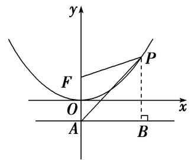
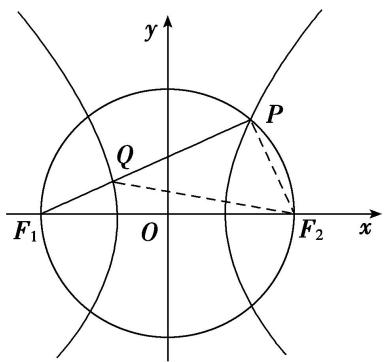

# 专题 04 椭圆(双曲线)+圆(抛物线)模型

#### 1. 椭圆(双曲线)+圆(抛物线)求范围型

椭圆(双曲线)+圆(抛物线)型求范围的基本思路是借助椭圆、双曲线、抛物线或圆的相关知识，结合题设条件建立目标函数或构建不等式，转化为求函数的值域或解不等式求解.

# 【例题选讲】

[例 9] （51） 过椭圆 C: $\frac{x^{2}}{a^{2}} + \frac{y^{2}}{b^{2}} = 1 (a > b > 0)$ 的右焦点作 x 轴的垂线，交 C 于 A, B 两点，直线 l 过 C 的左焦点和上顶点．若以 AB 为直径的圆与 l 存在公共点，则 C 的离心率的取值范围是()

A. $\left\{0,\frac{\sqrt{5}}{5}\right]$

B. $\left[\frac{\sqrt{5}}{5},1\right]$

C. $\left[0,\frac{\sqrt{2}}{2}\right]$

D. $\left[\frac{\sqrt{2}}{2},1\right]$  
（52）已知直线 $l: y = kx + 2$ 过椭圆 $\frac{x^2}{a^2} + \frac{y^2}{b^2} = 1 (a > b > 0)$ 的上顶点 $B$ 和左焦点 $F$ , 且被圆 $x^2 + y^2 = 4$ 截得的弦长为 $L$ , 若 $L \geq \frac{4\sqrt{5}}{5}$ , 则椭圆离心率 $e$ 的取值范围是 \_\_\_\_.  
（53）若椭圆 $b^{2}x^{2} + a^{2}y^{2} = a^{2}b^{2}(a > b > 0)$ 和圆 $x^{2} + y^{2} = \left(\frac{b}{2} + c\right)^{2}$ 有四个交点，其中 $c$ 为椭圆的半焦距，则椭圆的离心率 $e$ 的取值范围为（）

A. $\left(\frac{\sqrt{5}}{5},\frac{3}{5}\right)$

B. $\left(0,\frac{\sqrt{2}}{5}\right)$

C. $\left(\frac{\sqrt{2}}{5},\frac{\sqrt{3}}{5}\right)$

D. $\left(\frac{\sqrt{3}}{5},\frac{\sqrt{5}}{5}\right)$

# 【对点训练】

66. 已知双曲线 $C_1: \frac{x^2}{a^2} - \frac{y^2}{b^2} = 1 (a > 0, b > 0)$ ，圆 $C_2: x^2 + y^2 - 2ax + \frac{3}{4} a^2 = 0$ ，若双曲线 $C_1$ 的一条渐近线与圆 $C_2$ 有两个不同的交点，则双曲线 $C_1$ 的离心率的取值范围是（）

A. $\left(1,\frac{2\sqrt{3}}{3}\right)$

B. $\left(\frac{2\sqrt{3}}{3},+\infty\right)$

C. $(1, 2)$

D. $(2, +\infty)$

67. 已知双曲线 $\frac{x^2}{a^2} - \frac{y^2}{b^2} = 1 (a > 0, b > 0)$ 的渐近线与圆 $x^2 - 4x + y^2 + 2 = 0$ 相交，则双曲线的离心率的取值范围是 \_\_\_\_.

68. 若双曲线 $x^{2} - \frac{y^{2}}{b^{2}} = 1 (b > 0)$ 的一条渐近线与圆 $x^{2} + (y - 2)^{2} = 1$ 至多有一个交点，则双曲线离心率的取值范围是（）

A. (1, 2]

B. $[2, +\infty)$

C. $(1,\sqrt{3}]$

D. $[\sqrt{3}, +\infty)$

69. 已知 $A(1, 2)$ , $B(-1, 2)$ , 动点 $P$ 满足 $\overrightarrow{AP} \perp \overrightarrow{BP}$ , 若双曲线 $\frac{x^2}{a^2} - \frac{y^2}{b^2} = 1 (a > 0, b > 0)$ 的一条渐近线与动点 $P$ 的轨迹没有公共点, 则双曲线的离心率 $e$ 的取值范围是( )

A. (1, 2)

B. $(1, 2]$

C. $(1,\sqrt{2})$

D. $(1,\sqrt{2}]$

70. 已知双曲线 $E: \frac{x^2}{a^2} - \frac{y^2}{b^2} = 1 (a > 0, b > 0)$ 的右顶点为 $A$ ，抛物线 $C: y^2 = 8ax$ 的焦点为 $F$ 。若在 $E$ 的渐近线上存在点 $P$ ，使得 $\overrightarrow{AP} \perp \overrightarrow{FP}$ ，则 $E$ 的离心率的取值范围是（）

A. (1, 2) 
B. $(1, \frac{3\sqrt{2}}{4}]$ 
C. $[\frac{3\sqrt{2}}{4}, +\infty)$ 
D. $(2, +\infty)$

71. 已知圆 $(x - 1)^2 + y^2 = \frac{3}{4}$ 的一条切线 $y = kx$ 与双曲线 $C: \frac{x^2}{a^2} - \frac{y^2}{b^2} = 1 (a > 0, b > 0)$ 有两个交点，则双曲线 $C$ 的离心率的取值范围是（）

A. $(1, \sqrt{3})$

B. $(1, 2)$

C. $(\sqrt{3}, +\infty)$

D. $(2, +\infty)$

72. 已知直线 $l: y = kx + 2$ 过双曲线 $C: \frac{x^2}{a^2} - \frac{y^2}{b^2} = 1 (a > 0, b > 0)$ 的左焦点 $F$ 和虚轴的上端点 $B(0, b)$ ，且与圆 $x^2 + y^2 = 8$ 交于点 $M, N$ ，若 $|MN| \geq 2\sqrt{5}$ ，则双曲线的离心率 $e$ 的取值范围是（）

A. $(1, \sqrt{6}]$

B. $(1, \frac{\sqrt{6}}{2}]$

C. $\left[\frac{\sqrt{6}}{2}, +\infty\right)$

D. $[\sqrt{6}, +\infty)$

73. 已知椭圆 $\frac{x^2}{a^2} + \frac{y^2}{b^2} = 1 (a > b > c > 0, a^2 = b^2 + c^2)$ 的左、右焦点分别为 $F_1, F_2$ ，若以 $F_2$ 为圆心， $b - c$ 为半径作圆 $F_2$ ，过椭圆上一点 $P$ 作此圆的切线，切点为 $T$ ，且 $|PT|$ 的最小值不小于 $\frac{\sqrt{3}}{2} (a - c)$ ，则椭圆的离心率 $e$ 的取值范围是 \_\_\_\_.

74. 已知 $A, B, F$ 分别是椭圆 $x^{2} + \frac{y^{2}}{b^{2}} = 1 (0 < b < 1)$ 的右顶点、上顶点、左焦点，设 $\triangle ABF$ 的外接圆的圆心坐标为 $(p, q)$ . 若 $p + q > 0$ ，则椭圆的离心率的取值范围为 \_\_\_\_.

75. 已知双曲线 $C_1: \frac{x^2}{a^2} - \frac{y^2}{b^2} = 1$ 与圆 $C_2: x^2 + y^2 = b^2$ (其中 $a > 0, b > 0$ ), 若在 $C_1$ 上存在点 $P$ , 使得由点 $P$ 向 $C_2$ 所作的两条切线互相垂直, 则双曲线 $C_1$ 的离心率的取值范围是 \_\_\_\_.

#### 2. 椭圆(双曲线)+圆(抛物线)求值型

椭圆(双曲线)+圆(抛物线)型求值的基本思路是借助椭圆、双曲线、抛物线或圆的相关知识，结合题设条件建立a，b，c的等量关系，转化为e的方程求解.

# 【例题选讲】

[例 10] （54）已知双曲线 C: $mx^{2} + ny^{2} = 1 (mn < 0)$ 的一条渐近线与圆 $x^{2} + y^{2} - 6x - 2y + 9 = 0$ 相切，则 C 的离心率为()

A. $\frac{5}{3}$

B. $\frac{5}{4}$

C. $\frac{5}{3}$ 或 $\frac{25}{16}$

D. $\frac{5}{3}$ 或 $\frac{5}{4}$  
（55）设椭圆 $\frac{x^2}{a^2} +\frac{y^2}{b^2} = 1(a > b > 0)$ 的焦点为 $F_{1}$ ， $F_{2}$ ， $P$ 是椭圆上一点，且 $\angle F_1PF_2 = \frac{\pi}{3}$ ，若 $\triangle F_1PF_2$ 的外接圆和内切圆的半径分别为 $R$ ， $r$ ，当 $R = 4r$ 时，椭圆的离心率为（

A. $\frac{4}{5}$

B. $\frac{2}{3}$

C. $\frac{1}{2}$

D. $\frac{2}{5}$  
（56）已知双曲线 $\Gamma: \frac{x^2}{a^2} - \frac{y^2}{b^2} = 1 (a > 0, b > 0)$ 的一条渐近线为 $l$ ，圆 $C: (x - a)^2 + y^2 = 8$ 与 $l$ 交于 $A$ ， $B$ 两点，若 $\triangle ABC$ 是等腰直角三角形，且 $\overrightarrow{OB} = 5\overrightarrow{OA}$ (其中 $O$ 为坐标原点)，则双曲线 $\Gamma$ 的离心率为（）

A. $\frac{2\sqrt{13}}{3}$

B. $\frac{2\sqrt{13}}{5}$

C. $\frac{\sqrt{13}}{5}$

D. $\frac{\sqrt{13}}{3}$  
（57）已知点 $A$ 是抛物线 $x^{2} = 4y$ 的对称轴与准线的交点，点 $F$ 为抛物线的焦点，点 $P$ 在抛物线上且满足$|PA|=m|PF|$ . 若 m 取得最大值时，点 P 恰好在以 A，F 为焦点的椭圆上，则椭圆的离心率为()

A. $\sqrt{3} - 1$

B. $\sqrt{2}-1$

C. $\frac{\sqrt{5} - 1}{2}$

D. $\frac{\sqrt{2} - 1}{2}$

  
（58）已知 $F_{1}$ , $F_{2}$ 为双曲线 $\frac{x^{2}}{a^{2}} -\frac{y^{2}}{b^{2}} = 1(a > 0, b > 0)$ 的左、右焦点，以 $F_{1}F_{2}$ 为直径的圆与双曲线右支的一个交点为 $P$ ， $PF_{1}$ 与双曲线相交于点 $Q$ ，且 $|PQ| = 2|QF_{1}|$ ，则该双曲线的离心率为（）

A. $\sqrt{5}$

B. 2

C. $\sqrt{3}$

D. $\frac{\sqrt{5}}{2}$

# 【对点训练】

76. (2017·全国III)已知椭圆 $C: \frac{x^2}{a^2} + \frac{y^2}{b^2} = 1 (a > b > 0)$ 的左、右顶点分别为 $A_1, A_2$ ，且以线段 $A_1A_2$ 为直径的圆与直线 $bx - ay + 2ab = 0$ 相切，则 $C$ 的离心率为（）

A. $\frac{\sqrt{6}}{3}$

B. $\frac{\sqrt{3}}{3}$

C. $\frac{\sqrt{2}}{3}$

D. $\frac{1}{3}$

77. (2019·全国II)设 F 为双曲线 C: $\frac{x^{2}}{a^{2}} - \frac{y^{2}}{b^{2}} = 1 (a > 0, b > 0)$ 的右焦点，O 为坐标原点，以 OF 为直径的圆与圆 $x^{2} + y^{2} = a^{2}$ 交于 P，Q 两点．若 $|PQ| = |OF|$ ，则 C 的离心率为（）

A. $\sqrt{2}$

B. $\sqrt{3}$

C. 2

D. $\sqrt{5}$

78. 以双曲线 $C: \frac{x^2}{a^2} - \frac{y^2}{b^2} = 1 (a > 0, b > 0)$ 上一点 $M$ 为圆心作圆，该圆与 $x$ 轴相切于 $C$ 的一个焦点，与 $y$ 轴交于 $P, Q$ 两点．若 $\triangle MPQ$ 为正三角形，则该双曲线的离心率等于（）

A. $\sqrt{2}$

B. $\sqrt{3}$

C. 2

D. $\sqrt{5}$

79. 已知椭圆 $\frac{x^2}{a^2} + \frac{y^2}{b^2} = 1 (a > b > 0)$ 的右顶点和上顶点分别为 $A$ 、 $B$ , 左焦点为 $F$ . 以原点 $O$ 为圆心的圆与直线 $BF$ 相切, 且该圆与 $y$ 轴的正半轴交于点 $C$ , 过点 $C$ 的直线交椭圆于 $M$ 、 $N$ 两点. 若四边形 $FAMN$ 是平行四边形, 则该椭圆的离心率为( )

A. $\frac{3}{5}$

B. $\frac{1}{2}$

C. $\frac{2}{3}$

D. $\frac{3}{4}$

80. (2017·全国I)已知双曲线 $C: \frac{x^2}{a^2} - \frac{y^2}{b^2} = 1 (a > 0, b > 0)$ 的右顶点为 $A$ ，以 $A$ 为圆心， $b$ 为半径作圆 $A$ ，圆 $A$ 与双曲线 $C$ 的一条渐近线交于 $M, N$ 两点．若 $\angle MAN = 60^\circ$ ，则 $C$ 的离心率为 \_\_\_\_.

81. 已知双曲线 $\frac{x^2}{a^2} - \frac{y^2}{b^2} = 1 (a > 0, b > 0)$ 的左焦点为 $F_1(-c, 0)(c > 0)$ ，过点 $F_1$ 作直线与圆 $x^2 + y^2 = \frac{a^2}{4}$ 相切于点 $A$ ，与双曲线的右支交于点 $B$ ，若 $\overrightarrow{OB} = 2\overrightarrow{OA} - \overrightarrow{OF}_1$ ，则双曲线的离心率为（）

A. 2

B. $\frac{\sqrt{10}}{2}$

C. $\frac{\sqrt{7}}{2}$

D. $\frac{\sqrt{5}}{2}$

82. 已知双曲线 $E: \frac{x^2}{a^2} - \frac{y^2}{b^2} = 1 (a > 0, b > 0)$ 的左、右焦点分别为 $F_1, F_2, |F_1F_2| = 8, P$ 是 $E$ 右支上的一点， $PF_1$ 与 $y$ 轴交于点 $A, \triangle PAF_2$ 的内切圆与边 $AF_2$ 的切点为 $Q$ . 若 $|AQ| = \sqrt{3}, E$ 的离心率为 \_\_\_\_.

83. 设 $F$ 是椭圆 $C: \frac{x^2}{a^2} + \frac{y^2}{b^2} = 1 (a > b > 0)$ 的一个焦点， $P$ 是 $C$ 上的点，圆 $x^2 + y^2 = \frac{a^2}{9}$ 与线段 $PF$ 交于 $A$ ， $B$ 两点，若 $A, B$ 是线段 $PF$ 的两个三等分点，则椭圆 $C$ 的离心率为（）

A. $\frac{\sqrt{3}}{3}$

B. $\frac{\sqrt{5}}{3}$

C. $\frac{\sqrt{10}}{4}$

D. $\frac{\sqrt{17}}{5}$

84. 已知双曲线 $C: \frac{x^2}{a^2} - \frac{y^2}{b^2} = 1 (a > 0, b > 0)$ 的左、右焦点分别为 $F_1(-c, 0), F_2(c, 0), P$ 是双曲线 $C$ 右支上一点，且 $|PF_2| = |F_1F_2|$ ，若直线 $PF_1$ 与圆 $x^2 + y^2 = a^2$ 相切，则双曲线的离心率为（）

A. $\frac{4}{3}$

B. $\frac{5}{3}$

C. 2

D. 3

85. 已知双曲线 $\frac{x^2}{a^2} - \frac{y^2}{b^2} = 1 (a > 0, b > 0)$ 的左、右焦点分别为 $F_1, F_2, A, B$ 分别是双曲线左、右两支上关于坐标原点 $O$ 对称的两点，且直线 $AB$ 的斜率为 $2\sqrt{2}$ . $M, N$ 分别为 $AF_2, BF_2$ 的中点，若原点 $O$ 在以线段 $MN$ 为直径的圆上，则双曲线的离心率为（）

A. $\sqrt{3}$

B. $\sqrt{6}$

C. $\sqrt{6} +\sqrt{3}$

D. $\sqrt{6} -\sqrt{2}$

86. 已知双曲线 $C_1: \frac{x^2}{a^2} - \frac{y^2}{b^2} = 1 (a > 0, b > 0)$ 的左、右焦点分别为 $F_1, F_2$ ，抛物线 $C_2: y^2 = 2px (p > 0)$ 的焦点与双曲线 $C_1$ 的一个焦点重合， $C_1$ 与 $C_2$ 在第一象限相交于点 $P$ ，且 $|F_1F_2| = |PF_1|$ ，则双曲线 $C_1$ 的离心率为 \_\_\_\_.

87. 双曲线 $C_1: \frac{y^2}{a^2} - \frac{x^2}{b^2} = 1 (a > 0, b > 0)$ 的焦点为 $F_1(0, -c)$ 、 $F_2(0, c)$ ，抛物线 $C_2: y = \frac{1}{4c} x^2$ 的准线与 $C_1$ 交于 $M$ 、 $N$ 两点，且以 $MN$ 为直径的圆过 $F_2$ ，则椭圆 $\frac{x^2}{a^2} + \frac{y^2}{c^2} = 1$ 的离心率的平方为（）

A. $\sqrt{2} - 1$

B. $2 - \sqrt{2}$

C. $2 \sqrt{2} - 2$

D. $3 - 2\sqrt{2}$

