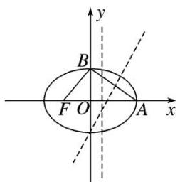
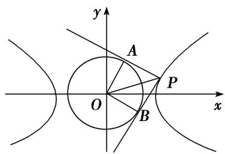
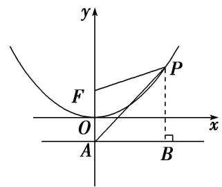
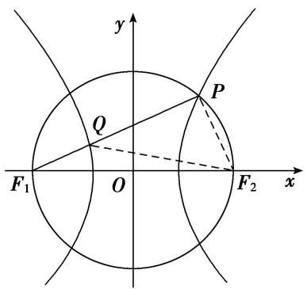
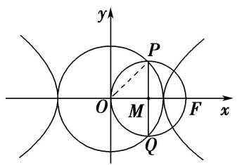
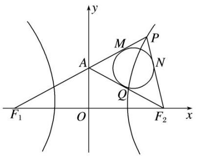
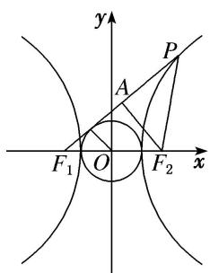
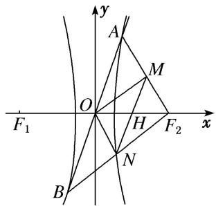

# 专题 04 椭圆(双曲线)+圆(抛物线)模型

#### 1. 椭圆(双曲线)+圆(抛物线)求范围型

椭圆(双曲线)+圆(抛物线)型求范围的基本思路是借助椭圆、双曲线、抛物线或圆的相关知识，结合题设条件建立目标函数或构建不等式，转化为求函数的值域或解不等式求解.

# 【例题选讲】

[例 9] （51） 过椭圆 C: $\frac{x^{2}}{a^{2}} + \frac{y^{2}}{b^{2}} = 1 (a > b > 0)$ 的右焦点作 x 轴的垂线，交 C 于 A, B 两点，直线 l 过 C 的左焦点和上顶点．若以 AB 为直径的圆与 l 存在公共点，则 C 的离心率的取值范围是()

A. $\left\{0,\frac{\sqrt{5}}{5}\right]$

B. $\left[\frac{\sqrt{5}}{5},1\right]$

C. $\left[0,\frac{\sqrt{2}}{2}\right]$

D. $\left[\frac{\sqrt{2}}{2},1\right]$
答案 A 解析 由题设知，直线 $l: \frac{x}{-c} + \frac{y}{b} = 1$ ，即 $bx - cy + bc = 0$ ，以 $AB$ 为直径的圆的圆心为 $(c,0)$ ，根据题意，将 $x = c$ 代入椭圆 $C$ 的方程，得 $y = \pm \frac{b^2}{a}$ ，则圆的半径 $r = \frac{b^2}{a}$ 。又圆与直线 $l$ 有公共点，所以 $\frac{2bc}{\sqrt{b^2 + c^2}} \leq \frac{b^2}{a}$ ，化简得 $2c \leq b$ ，平方整理得 $a^2 \geq 5c^2$ ，所以 $e = \frac{c}{a} \leq \frac{\sqrt{5}}{5}$ 。又 $0 < e < 1$ ，所以 $0 < e \leq \frac{\sqrt{5}}{5}$ 。故选 A.  
（52）已知直线 $l: y = kx + 2$ 过椭圆 $\frac{x^2}{a^2} + \frac{y^2}{b^2} = 1 (a > b > 0)$ 的上顶点 $B$ 和左焦点 $F$ , 且被圆 $x^2 + y^2 = 4$ 截得的弦长为 $L$ , 若 $L \geq \frac{4\sqrt{5}}{5}$ , 则椭圆离心率 $e$ 的取值范围是 \_\_\_\_.
答案 $\left[0, \frac{2\sqrt{5}}{5}\right]$ 解析 依题意，知 $b = 2, kc = 2$ 。设圆心到直线 $l$ 的距离为 $d$ ，则 $L = 2\sqrt{4 - d^2} \geq \frac{4\sqrt{5}}{5}$ ，解得 $d^2 \leq \frac{16}{5}$ 。又因为 $d = \frac{2}{\sqrt{1 + k^2}}$ ，所以 $\frac{1}{1 + k^2} \leq \frac{4}{5}$ ，解得 $k^2 \geq \frac{1}{4}$ 。于是 $e^2 = \frac{c^2}{a^2} = \frac{c^2}{b^2 + c^2} = \frac{1}{1 + k^2}$ ，所以 $0 < e^2 \leq \frac{4}{5}$ ，又由 $0 < e < 1$ ，解得 $0 < e \leq \frac{2\sqrt{5}}{5}$ 。  
（53）若椭圆 $b^{2}x^{2} + a^{2}y^{2} = a^{2}b^{2}(a > b > 0)$ 和圆 $x^{2} + y^{2} = \left(\frac{b}{2} + c\right)^{2}$ 有四个交点，其中 $c$ 为椭圆的半焦距，则椭圆的离心率 $e$ 的取值范围为（）

A. $\left(\frac{\sqrt{5}}{5},\frac{3}{5}\right)$

B. $\left(0,\frac{\sqrt{2}}{5}\right)$

C. $\left(\frac{\sqrt{2}}{5},\frac{\sqrt{3}}{5}\right)$

D. $\left(\frac{\sqrt{3}}{5},\frac{\sqrt{5}}{5}\right)$
答案 A 解析 由题意可知，椭圆的上、下顶点在圆内，左、右顶点在圆外，则 $\left\{ \begin{array}{l} a > \frac{b}{2} + c, \\ b < \frac{b}{2} + c, \end{array} \right.$ 整理得 $\left\{ \begin{array}{l} (a - c)^2 > \frac{1}{4} (a^2 - c^2), \\ \sqrt{a^2 - c^2} < 2c, \end{array} \right.$ 解得 $\frac{\sqrt{5}}{5} < e < \frac{3}{5}$ .

# 【对点训练】

66. 已知双曲线 $C_1: \frac{x^2}{a^2} - \frac{y^2}{b^2} = 1 (a > 0, b > 0)$ , 圆 $C_2: x^2 + y^2 - 2ax + \frac{3}{4}a^2 = 0$ , 若双曲线 $C_1$ 的一条渐近线与圆 $C_2$ 有两个不同的交点, 则双曲线 $C_1$ 的离心率的取值范围是( )

A. $\left(1,\frac{2\sqrt{3}}{3}\right)$

B. $\left(\frac{2\sqrt{3}}{3},+\infty\right)$

C. $(1, 2)$

D. $(2, +\infty)$

66. 答案 A 解析 由双曲线方程可得其渐近线方程为 $y = \pm \frac{b}{a} x$ ，即 $bx \pm ay = 0$ ，圆 $C_2: x^2 + y^2 - 2ax + \frac{3}{4} a^2 = 0$ 可化为 $(x - a)^2 + y^2 = \frac{1}{4} a^2$ ，圆心 $C_2$ 的坐标为 $(a,0)$ ，半径 $r = \frac{1}{2} a$ ，由双曲线 $C_1$ 的一条渐近线与圆 $C_2$ 有两个不同的交点，得 $\frac{|ab|}{\sqrt{a^2 + b^2}} < \frac{1}{2} a$ ，即 $c > 2b$ ，即 $c^2 > 4b^2$ ，又知 $b^2 = c^2 - a^2$ ，所以 $c^2 > 4(c^2 - a^2)$ ，即 $c^2 < \frac{4}{3} a^2$ ，所以 $e = \frac{c}{a} < \frac{2\sqrt{3}}{3}$ ，又知 $e > 1$ ，所以双曲线 $C_1$ 的离心率的取值范围为 $\left[1, \frac{2\sqrt{3}}{3}\right]$ ，故选 A.

67. 已知双曲线 $\frac{x^2}{a^2} - \frac{y^2}{b^2} = 1 (a > 0, b > 0)$ 的渐近线与圆 $x^2 - 4x + y^2 + 2 = 0$ 相交，则双曲线的离心率的取值范围是 \_\_\_\_.

67. 答案 (1, $\sqrt{2}$ ) 解析 双曲线的渐近线方程为 $y = \pm \frac{b}{a} x$ ，即 $bx \pm ay = 0$ ，圆 $x^{2} - 4x + y^{2} + 2 = 0$ 可化为 $(x - 2)^{2} + y^{2} = 2$ ，其圆心为 $(2, 0)$ ，半径为 $\sqrt{2}$ 。因为直线 $bx \pm ay = 0$ 和圆 $(x - 2)^{2} + y^{2} = 2$ 相交，所以 $\frac{|2b|}{\sqrt{a^2 + b^2}} < \sqrt{2}$ ，整理得 $b^{2} < a^{2}$ 。从而 $c^{2} - a^{2} < a^{2}$ ，即 $c^{2} < 2a^{2}$ ，所以 $e^{2} < 2$ 。又 $e > 1$ ，故双曲线的离心率的取值范围是 $(1, \sqrt{2})$ 。

68. 若双曲线 $x^{2} - \frac{y^{2}}{b^{2}} = 1 (b > 0)$ 的一条渐近线与圆 $x^{2} + (y - 2)^{2} = 1$ 至多有一个交点，则双曲线离心率的取值范围是（）

A. (1, 2]

B. $[2, +\infty)$

C. $(1,\sqrt{3}]$

D. $\left[\sqrt{3},+\infty\right)$

68. 答案 A 解析 双曲线 $x^{2}-\frac{y^{2}}{b^{2}}=1(b>0)$ 的一条渐近线方程是 bx-y=0，由题意圆 $x^{2}+(y-2)^{2}=1$ 的圆心 (0, 2) 到 bx-y=0 的距离不小于 1，即 $\frac{2}{\sqrt{b^{2}+1}}\geq1$ ，则 $b^{2}\leq3$ ，那么离心率 $e\in(1,2]$ ，故选 A.

69. 已知 $A(1, 2)$ , $B(-1, 2)$ , 动点 $P$ 满足 $\overrightarrow{AP} \perp \overrightarrow{BP}$ , 若双曲线 $\frac{x^2}{a^2} - \frac{y^2}{b^2} = 1 (a > 0, b > 0)$ 的一条渐近线与动点 $P$ 的轨迹没有公共点, 则双曲线的离心率 $e$ 的取值范围是( )

A. (1, 2)

B. $(1, 2]$

C. $(1,\sqrt{2})$

D. $(1,\sqrt{2}]$

69. 答案 A 解析] 设 $P(x, y)$ , 由题设条件得动点 $P$ 的轨迹方程为 $(x-1)(x+1)+(y-2)(y-2)=0$ , 即 $x^{2}+(y-2)^{2}=1$ , 它是以 $(0, 2)$ 为圆心, 1 为半径的圆. 又双曲线 $\frac{x^{2}}{a^{2}}-\frac{y^{2}}{b^{2}}=1(a>0, b>0)$ 的渐近线方程为 $y=\pm\frac{b}{a}$ , 即 $bx\pm ay=0$ , 因此由题意可得 $\frac{2a}{\sqrt{a^{2}+b^{2}}}>1$ , 即 $\frac{2a}{c}>1$ , 则 $e=\frac{c}{a}<2$ , 又 $e>1$ , 故 $1<e<2$ .

70. 已知双曲线 $E: \frac{x^2}{a^2} - \frac{y^2}{b^2} = 1 (a > 0, b > 0)$ 的右顶点为 $A$ ，抛物线 $C: y^2 = 8ax$ 的焦点为 $F$ 。若在 $E$ 的渐近线上存在点 $P$ ，使得 $\overrightarrow{AP} \perp \overrightarrow{FP}$ ，则 $E$ 的离心率的取值范围是（）

A. $(1, 2)$

B. $(1, \frac{3\sqrt{2}}{4}]$

C. $\left[\frac{3\sqrt{2}}{4}, +\infty\right)$

D. $(2, +\infty)$

70. 答案 B 解析 由题意得， $A(a,0)$ ， $F(2a,0)$ ，设 $P(x_{0},\frac{b}{a}x_{0})$ ，由 $\overrightarrow{AP}\perp\overrightarrow{FP}$ ，得 $\overrightarrow{AP}\cdot\overrightarrow{PF}=0\Rightarrow\frac{c^{2}}{a^{2}}x_{0}^{2}-3ax_{0}+2a^{2}=0$ ，因为在 E 的渐近线上存在点 P，则 $\Delta\geq0$ ，即 $9a^{2}-4\times2a^{2}\times\frac{c^{2}}{a^{2}}\geq0\Rightarrow9a^{2}\geq8c^{2}\Rightarrow e^{2}\leq\frac{9}{8}\Rightarrow e\leq\frac{3\sqrt{2}}{4}$ ，又因为 E 为双曲线，则 $1<e\leq\frac{3\sqrt{2}}{4}$ 。故选 B.

71. 已知圆 $(x - 1)^2 + y^2 = \frac{3}{4}$ 的一条切线 $y = kx$ 与双曲线 $C: \frac{x^2}{a^2} - \frac{y^2}{b^2} = 1 (a > 0, b > 0)$ 有两个交点，则双曲线 $C$ 的离心率的取值范围是（）

A. $(1, \sqrt{3})$

B. $(1, 2)$

C. $(\sqrt{3}, +\infty)$

D. $(2, +\infty)$

71. 答案 D 解析 由题意，圆心到直线的距离 $d = \frac{|k|}{\sqrt{1^2 + k^2}} = \frac{\sqrt{3}}{2}$ ，所以 $k = \pm \sqrt{3}$ ，因为圆 $(x - 1)^2 + y^2 = \frac{3}{4}$ 的一条切线 $y = kx$ 与双曲线 $C: \frac{x^2}{a^2} - \frac{y^2}{b^2} = 1 (a > 0, b > 0)$ 有两个交点，所以 $\frac{b}{a} > \sqrt{3}$ ，所以 $1 + \frac{b^2}{a^2} > 4$ ，所以 $e > 2$ .

72. 已知直线 $l: y = kx + 2$ 过双曲线 $C: \frac{x^2}{a^2} - \frac{y^2}{b^2} = 1 (a > 0, b > 0)$ 的左焦点 $F$ 和虚轴的上端点 $B(0, b)$ ，且与圆 $x^2 + y^2 = 8$ 交于点 $M, N$ ，若 $|MN| \geq 2\sqrt{5}$ ，则双曲线的离心率 $e$ 的取值范围是（）

A. $(1, \sqrt{6}]$

B. $(1,\frac{\sqrt{6}}{2}]$

C. $\left[\frac{\sqrt{6}}{2}, +\infty\right)$

D. $[\sqrt{6}, +\infty)$

72. 答案 C 解析 设圆心到直线 l 的距离为 $d(d>0)$ ，因为 $|MN|\geq2\sqrt{5}$ ，所以 $2\sqrt{8-d^{2}}\geq2\sqrt{5}$ ，即 $0<d\leq\sqrt{3}$ 。又 $d=\frac{2}{\sqrt{1+k^{2}}}$ ，所以 $\frac{2}{\sqrt{1+k^{2}}}\leq\sqrt{3}$ ，解得 $|k|\geq\frac{\sqrt{3}}{3}$ 。由直线 l: y=kx+2 过双曲线 C: $\frac{x^{2}}{a^{2}}-\frac{y^{2}}{b^{2}}=1(a>0, b>0)$ 的左焦点 F 和虚轴的上端点 B(0, b)，得 $|k|=\frac{b}{c}$ 。所以 $\frac{b}{c}\geq\frac{\sqrt{3}}{3}$ ，即 $\frac{b^{2}}{c^{2}}\geq\frac{1}{3}$ ，所以 $\frac{c^{2}-a^{2}}{c^{2}}\geq\frac{1}{3}$ ，即 $1-\frac{1}{e^{2}}\geq\frac{1}{3}$ ，所以 $e\geq\frac{\sqrt{6}}{2}$ ，于是双曲线的离心率 e 的取值范围是 $\left[\frac{\sqrt{6}}{2}, +\infty\right)$ 。故选 C。

73. 已知椭圆 $\frac{x^2}{a^2} + \frac{y^2}{b^2} = 1 (a > b > c > 0, a^2 = b^2 + c^2)$ 的左、右焦点分别为 $F_1, F_2$ ，若以 $F_2$ 为圆心， $b - c$ 为半径作圆 $F_2$ ，过椭圆上一点 $P$ 作此圆的切线，切点为 $T$ ，且 $|PT|$ 的最小值不小于 $\frac{\sqrt{3}}{2} (a - c)$ ，则椭圆的离心率 $e$ 的取值范围是 \_\_\_\_.

73. 答案 $\left[\frac{3}{5}, \frac{\sqrt{2}}{2}\right]$ 解析 因为 $|PT| = \sqrt{|PF_2|^2 - (b - c)^2} (b > c)$ ，而 $|PF_2|$ 的最小值为 $a - c$ ，所以 $|PT|$ 的最小值为 $\sqrt{(a - c)^2 - (b - c)^2}$ . 依题意，有 $\sqrt{(a - c)^2 - (b - c)^2} \geq \frac{\sqrt{3}}{2} (a - c)$ ，所以 $(a - c)^2 \geq 4(b - c)^2$ ，所以 $a - c \geq 2(b - c)$ ，所以 $a + c \geq 2b$ ，所以 $(a + c)^2 \geq 4(a^2 - c^2)$ ，所以 $5c^2 + 2ac - 3a^2 \geq 0$ ，所以 $5e^2 + 2e - 3 \geq 0$ ，①．又 $b > c$ ，所以 $b^2 > c^2$ ，所以 $a^2 - c^2 > c^2$ ，所以 $2e^2 < 1$ ，②．联立①②，得 $\frac{3}{5} \leq e < \frac{\sqrt{2}}{2}$ .

74. 已知 A, B, F 分别是椭圆 $x^{2}+\frac{y^{2}}{b^{2}}=1(0<b<1)$ 的右顶点、上顶点、左焦点，设 $\triangle ABF$ 的外接圆的圆心坐标为 $(p, q)$ 。若 $p + q > 0$ ，则椭圆的离心率的取值范围为 \_\_\_\_.

74. 答案 $\left(0, \frac{\sqrt{2}}{2}\right)$ 解析 如图所示，线段 FA 的垂直平分线为 $x=\frac{1-\sqrt{1-b^{2}}}{2}$ ，线段 AB 的中点为 $\left(\frac{1}{2}, \frac{b}{2}\right)$ .

因为 $k_{AB} = -b$ ，所以线段 AB 的垂直平分线的斜率 $k = \frac{1}{b}$ ，所以线段 AB 的垂直平分线方程为 $y - \frac{b}{2} = \frac{1}{b} \left( x - \frac{1}{2} \right)$ 。把 $x = \frac{1 - \sqrt{1 - b^{2}}}{2} = p$ 代入上述方程可得 $y = \frac{b^{2} - \sqrt{1 - b^{2}}}{2b} = q$ 。因为 $p + q > 0$ ，所以 $\frac{1 - \sqrt{1 - b^{2}}}{2} + \frac{b^{2} - \sqrt{1 - b^{2}}}{2b} > 0$ ，化为 $b > \sqrt{1 - b^{2}}$ 。又 0 < b < 1，解得 $\frac{1}{2} < b^{2} < 1$ ，即 $-1 < -b^{2} < -\frac{1}{2}$ ，所以 $0 < 1 - b^{2} < \frac{1}{2}$ ，所以 $e = \frac{c}{a} = c = \sqrt{1 - b^{2}} \in \left( 0, \frac{\sqrt{2}}{2} \right)$ 。

75. 已知双曲线 $C_1: \frac{x^2}{a^2} - \frac{y^2}{b^2} = 1$ 与圆 $C_2: x^2 + y^2 = b^2$ (其中 $a > 0, b > 0$ ), 若在 $C_1$ 上存在点 $P$ , 使得由点 $P$ 向 $C_2$ 所作的两条切线互相垂直, 则双曲线 $C_1$ 的离心率的取值范围是 \_\_\_\_.

75. 答案 $\left[\frac{\sqrt{6}}{2}, +\infty\right]$ 解析 由题意，根据圆的性质，可知四边形 $PAOB$ 是正方形，所以 $|OP| = \sqrt{2} b$ ；因为 $|OP| = \sqrt{2} b \geq a$ ，所以 $\frac{b}{a} \geq \frac{1}{\sqrt{2}}$ ，所以 $e = \frac{c}{a} = \frac{\sqrt{a^2 + b^2}}{a} = \sqrt{1 + \left(\frac{b}{a}\right)^2} \geq \sqrt{1 + \frac{1}{2}} = \frac{\sqrt{6}}{2}$ ；所以双曲线离心率 $e$ 的取值范围是 $\left[\frac{\sqrt{6}}{2}, +\infty\right]$ ，故答案为： $\left[\frac{\sqrt{6}}{2}, +\infty\right]$ .

#### 2. 椭圆(双曲线)+圆(抛物线)求值型

椭圆(双曲线)+圆(抛物线)型求值的基本思路是借助椭圆、双曲线、抛物线或圆的相关知识，结合题设条件建立a，b，c的等量关系，转化为e的方程求解.

# 【例题选讲】

[例 10] （54）已知双曲线 C: $mx^{2} + ny^{2} = 1 (mn < 0)$ 的一条渐近线与圆 $x^{2} + y^{2} - 6x - 2y + 9 = 0$ 相切，则 C 的离心率为()

A. $\frac{5}{3}$

B. $\frac{5}{4}$

C. $\frac{5}{3}$ 或 $\frac{25}{16}$

D. $\frac{5}{3}$ 或 $\frac{5}{4}$
答案 D 解析 圆 $x^{2} + y^{2} - 6x - 2y + 9 = 0$ 的标准方程为 $(x - 3)^{2} + (y - 1)^{2} = 1$ ，则圆心为 $M(3,1)$ ，半径 $r = 1$ 。当 $m < 0$ ， $n > 0$ 时，由 $mx^{2} + ny^{2} = 1$ 得 $\frac{y^2}{\frac{1}{n}} - \frac{x^2}{-\frac{1}{m}} = 1$ ，则双曲线的焦点在 $y$ 轴上，不妨设双曲线与圆相切的渐近线方程为 $y = \frac{a}{b} x$ ，即 $ax - by = 0$ ，则圆心到直线的距离 $d = \frac{|3a - b|}{\sqrt{a^2 + b^2}} = 1$ ，即 $|3a - b| = c$ ，平方得 $9a^2 - 6ab + b^2 = c^2 = a^2 + b^2$ ，即 $8a^2 - 6ab = 0$ ，则 $b = \frac{4}{3} a$ ，平方得 $b^2 = \frac{16}{9} a^2 = c^2 - a^2$ ，即 $c^2 = \frac{25}{9} a^2$ ，则 $c = \frac{5}{3} a$ ，离心率 $e = \frac{c}{a} = \frac{5}{3}$ ；当 $m > 0$ ， $n < 0$ 时，同理可得 $e = \frac{5}{4}$ ，故选 D.  
（55）设椭圆 $\frac{x^2}{a^2} +\frac{y^2}{b^2} = 1(a > b > 0)$ 的焦点为 $F_{1}$ ， $F_{2}$ ， $P$ 是椭圆上一点，且 $\angle F_1PF_2 = \frac{\pi}{3}$ ，若 $\triangle F_1PF_2$ 的外接圆和内切圆的半径分别为 $R$ ， $r$ ，当 $R = 4r$ 时，椭圆的离心率为（

A. $\frac{4}{5}$

B. $\frac{2}{3}$

C. $\frac{1}{2}$

D. $\frac{2}{5}$
答案 B 解析 椭圆 $\frac{x^{2}}{a^{2}}+\frac{y^{2}}{b^{2}}=1(a>b>0)$ 的焦点为 $F_{1}(-c,0)$ ， $F_{2}(c,0)$ ，P为椭圆上一点，且 $\angle F_{1}PF_{2}=\frac{\pi}{3}$ ， $|F_{1}F_{2}|=2c$ ，根据正弦定理 $\frac{|F_{1}F_{2}|}{\sin\angle F_{1}PF_{2}}=\frac{2c}{\sin\frac{\pi}{3}}=2R,\therefore R=\frac{2\sqrt{3}}{3}c,\because R=4r,\therefore r=\frac{\sqrt{3}}{6}c$ ，由余弦定理， $(2c)^{2}=|PF_{1}|^{2}+|PF_{2}|^{2}-2|PF_{1}||PF_{2}|\cos\angle F_{1}PF_{2}$ ，由 $|PF_{1}|+|PF_{2}|=2a,\angle F_{1}PF_{2}=\frac{\pi}{3}$ ，可得 $|PF_{1}||PF_{2}|=\frac{4}{3}(a^{2}-c^{2})$ ，则由三角形面积公式 $\frac{1}{2}(|PF_{1}|+|PF_{2}|+|F_{1}F_{2}|)\cdot r=\frac{1}{2}|PF_{1}||PF_{2}|\sin\angle F_{1}PF_{2}$ ，可得 $(2a+2c)\cdot\frac{\sqrt{3}}{6}c=\frac{4}{3}(a^{2}-c^{2})\cdot\frac{\sqrt{3}}{2},\therefore e=\frac{c}{a}=\frac{2}{3}.$  
（56）已知双曲线 $\Gamma: \frac{x^2}{a^2} - \frac{y^2}{b^2} = 1 (a > 0, b > 0)$ 的一条渐近线为 $l$ ，圆 $C: (x - a)^2 + y^2 = 8$ 与 $l$ 交于 $A$ ， $B$ 两点，若 $\triangle ABC$ 是等腰直角三角形，且 $\overrightarrow{OB} = 5\overrightarrow{OA}$ (其中 $O$ 为坐标原点)，则双曲线 $\Gamma$ 的离心率为（）

A. $\frac{2\sqrt{13}}{3}$

B. $\frac{2\sqrt{13}}{5}$

C. $\frac{\sqrt{13}}{5}$

D. $\frac{\sqrt{13}}{3}$
答案 D 解析 取双曲线渐近线为 $y=\frac{b}{a}x$ ，圆 $(x-a)^{2}+y^{2}=8$ 的圆心为 $(a,0)$ ，半径 $r=2\sqrt{2}$ ，由题意知 $\angle ACB=\frac{\pi}{2}$ ，由勾股定理得 $|AB|=\sqrt{(2\sqrt{2})^{2}+(2\sqrt{2})^{2}}=4$ ，又由 $\overrightarrow{OB}=5\overrightarrow{OA}$ 得 $|OA|=\frac{1}{4}|AB|=1$ ，在 $\triangle OAC$ 和 $\triangle OBC$ 中，由余弦定理得 $\cos\angle BOC=\frac{a^{2}+1-8}{2a}=\frac{5^{2}+a^{2}-8}{10a}$ ，解得 $a^{2}=13$ 。根据圆心到直线 $y=\frac{b}{a}x$ 的距离为 2，有 $\frac{ab}{c}=2$ ，结合 $c^{2}=a^{2}+b^{2}$ ，解得 $c=\frac{13}{3}$ ，故离心率为 $\frac{c}{a}=\frac{\frac{13}{3}}{\sqrt{13}}=\frac{\sqrt{13}}{3}$ 。故选 D.  
（57）已知点 A 是抛物线 $x^{2}=4y$ 的对称轴与准线的交点，点 F 为抛物线的焦点，点 P 在抛物线上且满足 $|PA|=m|PF|$ 。若 m 取得最大值时，点 P 恰好在以 A，F 为焦点的椭圆上，则椭圆的离心率为()

A. $\sqrt{3} - 1$

B. $\sqrt{2} - 1$

C. $\frac{\sqrt{5} - 1}{2}$

D. $\frac{\sqrt{2} - 1}{2}$
答案 B 解析 法一：由抛物线方程知 $A(0, -1)$ ，过点 $P$ 作 $PB$ 垂直准线于点 $B$ ，如图．由抛物线

定义可知 $|PF|=|PB|$ ，则 $|PA|=m|PF|=m|PB|$ ，即 $m=\frac{|PA|}{|PB|}=\frac{1}{\sin\angle PAB}$ 。若m最大，则 $\sin\angle PAB$ 最小，此时直线PA与抛物线相切。设直线PA的方程为y=kx-1，代入 $x^{2}=4y$ 得 $x^{2}=4kx-4$ ，即 $x^{2}-4kx+4=0$ ，令 $\Delta=16k^{2}-16=0$ ，解得 $k=\pm1$ ，可得 $P(\pm2,1)$ ， $B(\pm2,-1)$ ，所以 $|PF|=|PB|=|AB|=2$ ，所以 $|PA|=2\sqrt{2}$ 。因为点P在以A，F为焦点的椭圆上，所以 $2c=|AF|=2$ ， $2a=|PA|+|PF|=2\sqrt{2}+2$ ，所以椭圆的离心率 $e=\frac{c}{a}=\frac{2c}{2a}=\frac{2}{2\sqrt{2}+2}=\sqrt{2}-1$ ，故选B.

法二：过点 $P$ 作 $PB$ 垂直准线于点 $B$ 。设 $P(x, y)$ 。因为 $A$ 是抛物线 $x^2 = 4y$ 的对称轴与准线的交点，点 $F$ 为抛物线的焦点，所以 $A(0, -1)$ ， $F(0, 1)$ ，则 $m = \frac{|PA|}{|PF|} = \sqrt{\frac{(y + 1)^2 + x^2}{(y - 1)^2 + x^2}} = \sqrt{\frac{(y + 1)^2 + 4y}{(y - 1)^2 + 4y}} = \sqrt{1 + \frac{4y}{y^2 + 2y + 1}}$ 。当 $y = 0$ 时， $m = 1$ ；当 $y > 0$ 时， $m = \sqrt{1 + \frac{4y}{y^2 + 2y + 1}} = \sqrt{1 + \frac{4}{y + \frac{1}{y} + 2}} \leq \sqrt{1 + \frac{4}{2 + 2\sqrt{y \cdot \frac{1}{y}}}} = \sqrt{2}$ ，当且仅当 $y = 1$ 时取等号。当 $m$ 取得最大值时， $P(\pm 2, 1)$ ， $B(\pm 2, -1)$ ，所以 $|PF| = |PB| = |AB| = 2$ ，所以 $|PA| = 2\sqrt{2}$ 。因为点 $P$ 在以 $A$ ， $F$ 为焦点的椭圆上，所以 $2c = |AF| = 2$ ， $2a = |PA| + |PF| = 2\sqrt{2} + 2$ ，所以椭圆的离心率 $e = \frac{c}{a} = \frac{2c}{2a} = \frac{2}{2\sqrt{2} + 2} = \sqrt{2} - 1$ ，故选 B.  
（58）已知 $F_{1}$ ， $F_{2}$ 为双曲线 $\frac{x^2}{a^2} - \frac{y^2}{b^2} = 1 (a > 0, b > 0)$ 的左、右焦点，以 $F_{1}F_{2}$ 为直径的圆与双曲线右支的一个交点为 $P$ ， $PF_{1}$ 与双曲线相交于点 $Q$ ，且 $|PQ| = 2|QF_{1}|$ ，则该双曲线的离心率为（）

A. $\sqrt{5}$

B. 2

C. $\sqrt{3}$

D. $\frac{\sqrt{5}}{2}$
答案 A 解析 如图，连接 $PF_{2}$ ， $QF_{2}$ 。由 $|PQ| = 2|QF_{1}|$ ，可设 $|QF_{1}| = m$ ，则 $|PQ| = 2m$ ， $|PF_{1}| = 3m$ ；由 $|PF_{1}| - |PF_{2}| = 2a$ ，得 $|PF_{2}| = |PF_{1}| - 2a = 3m - 2a$ ；由 $|QF_{2}| - |QF_{1}| = 2a$ ，得 $|QF_{2}| = |QF_{1}| + 2a = m + 2a$ 。∵点 $P$ 在以 $F_{1}F_{2}$ 为直径的圆上，∴ $PF_{1} \perp PF_{2}$ ，∴ $|PF_{1}|^{2} + |PF_{2}|^{2} = |F_{1}F_{2}|^{2}$ ， $|PQ|^{2} + |PF_{2}|^{2} = |QF_{2}|^{2}$ 。由 $|PQ|^{2} + |PF_{2}|^{2} = |QF_{2}|^{2}$ ，得 $(2m)^{2} + (3m - 2a)^{2} = (m + 2a)^{2}$ ，解得 $m = \frac{4}{3} a$ ，∴ $|PF_{1}| = 3m = 4a$ ， $|PF_{2}| = 3m - 2a = 2a$ 。∵ $|PF_{1}|^{2} + |PF_{2}|^{2} = |F_{1}F_{2}|^{2}$ ， $|F_{1}F_{2}| = 2c$ ，∴ $(4a)^{2} + (2a)^{2} = (2c)^{2}$ ，化简得 $c^{2} = 5a^{2}$ ，∴双曲线的离心率 $e = \sqrt{\frac{c^{2}}{a^{2}}} = \sqrt{5}$ ，故选 A.

# 【对点训练】

76. (2017·全国III)已知椭圆 $C: \frac{x^2}{a^2} + \frac{y^2}{b^2} = 1 (a > b > 0)$ 的左、右顶点分别为 $A_1, A_2$ ，且以线段 $A_1A_2$ 为直径的圆与直线 $bx - ay + 2ab = 0$ 相切，则 $C$ 的离心率为（）

A. $\frac{\sqrt{6}}{3}$

B. $\frac{\sqrt{3}}{3}$

C. $\frac{\sqrt{2}}{3}$

D. $\frac{1}{3}$

76. 答案 A 解析 以线段 $A_{1}A_{2}$ 为直径的圆的方程为 $x^{2} + y^{2} = a^{2}$ ，由圆心到直线 $bx - ay + 2ab = 0$ 的距离 $d = \frac{2ab}{\sqrt{b^2 + a^2}} = a$ ，得 $a^2 = 3b^2$ ，所以 $C$ 的离心率 $e = \sqrt{1 - \frac{b^2}{a^2}} = \frac{\sqrt{6}}{3}$ .

77. (2019·全国II)设 F 为双曲线 C: $\frac{x^{2}}{a^{2}} - \frac{y^{2}}{b^{2}} = 1 (a > 0, b > 0)$ 的右焦点，O 为坐标原点，以 OF 为直径的圆与圆 $x^{2} + y^{2} = a^{2}$ 交于 P，Q 两点．若 $|PQ| = |OF|$ ，则 C 的离心率为（）

A. $\sqrt{2}$

B. $\sqrt{3}$

C. 2

D. $\sqrt{5}$

77. 答案 A 解析 令双曲线 $C: \frac{x^2}{a^2} - \frac{y^2}{b^2} = 1 (a > 0, b > 0)$ 的右焦点 $F$ 的坐标为 $(c,0)$ ，则 $c = \sqrt{a^2 + b^2}$ 。如图所示，由圆的对称性及条件 $|PQ| = |OF|$ 可知， $PQ$ 是以 $OF$ 为直径的圆的直径，且 $PQ \perp OF$ . 设垂足为 $M$ ，连接 $OP$ ，则 $|OP| = a$ ， $|OM| = |MP| = \frac{c}{2}$ ，由 $|OM|^2 + |MP|^2 = |OP|^2$ ，得 $\left(\frac{c}{2}\right)^2 + \left(\frac{c}{2}\right)^2 = a^2$ ， $\therefore \frac{c}{a} = \sqrt{2}$ ，即离心率 $e = \sqrt{2}$ 。故选 A.

78. 以双曲线 $C: \frac{x^2}{a^2} - \frac{y^2}{b^2} = 1 (a > 0, b > 0)$ 上一点 $M$ 为圆心作圆，该圆与 $x$ 轴相切于 $C$ 的一个焦点，与 $y$ 轴交于 $P, Q$ 两点．若 $\triangle MPQ$ 为正三角形，则该双曲线的离心率等于（）

A. $\sqrt{2}$

B. $\sqrt{3}$

C. 2

D. $\sqrt{5}$

78. 答案 B 解析 设圆 $M$ 与双曲线 $C$ 相切于点 $F(c,0)$ ，则 $MF \perp x$ 轴，于是可设 $M(c,t)(t > 0)$ ，代入双曲线方程中解得 $t = \frac{b^2}{a}$ ，所以 $|MF| = \frac{b^2}{a}$ ，所以 $|PQ| = 2\sqrt{\left(\frac{b^2}{a}\right)^2 - c^2}$ 。因为 $\triangle MPQ$ 为等边三角形，所以 $c$
$= \frac{\sqrt{3}}{2} \times 2\sqrt{\left(\frac{b^2}{a}\right)^2 - c^2}$ ，化简，得 $3b^4 = 4a^2c^2$ ，即 $3(c^2 - a^2)^2 = 4a^2c^2$ ，亦即 $3c^4 - 10c^2a^2 + 3a^4 = 0$ ，所以 $3e^4 - 10e^2 + 3 = 0$ ，解得 $e^2 = \frac{1}{3}$ 或 $e^2 = 3$ ，又 $e > 1$ ，所以 $e = \sqrt{3}$ .

79. 已知椭圆 $\frac{x^2}{a^2} + \frac{y^2}{b^2} = 1 (a > b > 0)$ 的右顶点和上顶点分别为 $A$ 、 $B$ , 左焦点为 $F$ . 以原点 $O$ 为圆心的圆与直线 $BF$ 相切, 且该圆与 $y$ 轴的正半轴交于点 $C$ , 过点 $C$ 的直线交椭圆于 $M$ 、 $N$ 两点. 若四边形 $FAMN$ 是平行四边形, 则该椭圆的离心率为( )

A. $\frac{3}{5}$

B. $\frac{1}{2}$

C. $\frac{2}{3}$

D. $\frac{3}{4}$

79. 答案 A 解析 因为圆 O 与直线 BF 相切，所以圆 O 的半径为 $\frac{bc}{a}$ ，即 $OC = \frac{bc}{a}$ ，因为四边形 FAMN 是平行四边形，所以点 M 的坐标为 $\left(\frac{a + c}{2}, \frac{bc}{a}\right)$ ，代入椭圆方程得 $\frac{(a + c)^{2}}{4a^{2}} + \frac{c^{2}b^{2}}{a^{2}b^{2}} = 1$ ，所以 $5e^{2} + 2e - 3 = 0$ ，又 0 < e < 1，所以 $e = \frac{3}{5}$ 。故选 A。

80. (2017·全国I)已知双曲线 $C: \frac{x^2}{a^2} - \frac{y^2}{b^2} = 1 (a > 0, b > 0)$ 的右顶点为 $A$ ，以 $A$ 为圆心， $b$ 为半径作圆 $A$ ，圆 $A$ 与双曲线 $C$ 的一条渐近线交于 $M, N$ 两点．若 $\angle MAN = 60^\circ$ ，则 $C$ 的离心率为 \_\_\_\_.

80. 答案 $\frac{2\sqrt{3}}{3}$ 解析 双曲线的右顶点为 $A(a, 0)$ ，一条渐近线的方程为 $y = \frac{b}{a}x$ ，即 $bx - ay = 0$ ，则圆心 $A$ 到此渐近线的距离 $d = \frac{|ba - a \times 0|}{\sqrt{b^2 + a^2}} = \frac{ab}{c}$ . 又因为 $\angle MAN = 60^\circ$ ，圆的半径为 $b$ ，所以 $b \cdot \sin 60^\circ = \frac{ab}{c}$ ，即 $\frac{\sqrt{3}b}{2} = \frac{ab}{c}$ ，所以 $e = \frac{2}{\sqrt{3}} = \frac{2\sqrt{3}}{3}$ .

81. 已知双曲线 $\frac{x^2}{a^2} - \frac{y^2}{b^2} = 1 (a > 0, b > 0)$ 的左焦点为 $F_1(-c, 0)(c > 0)$ ，过点 $F_1$ 作直线与圆 $x^2 + y^2 = \frac{a^2}{4}$ 相切于点 $A$ ，与双曲线的右支交于点 $B$ ，若 $\overrightarrow{OB} = 2\overrightarrow{OA} - \overrightarrow{OF}_1$ ，则双曲线的离心率为（）

A. 2

B. $\frac{\sqrt{10}}{2}$

C. $\frac{\sqrt{7}}{2}$

D. $\frac{\sqrt{5}}{2}$

81. 答案 B 解析 设双曲线 $\frac{x^2}{a^2} - \frac{y^2}{b^2} = 1 (a > 0, b > 0)$ 的右焦点为 $F_2(c,0)$ , $\because \overrightarrow{OB} = 2\overrightarrow{OA} - \overrightarrow{OF_1}$ , $\therefore 2\overrightarrow{OA} = \overrightarrow{OB} + \overrightarrow{OF_1}$ , $\therefore A$ 是 $BF_1$ 的中点, $\because$ 过点 $F_1$ 作直线与圆 $x^2 + y^2 = \frac{a^2}{4}$ 相切于点 $A$ , $\therefore OA \perp BF_1$ , $\because O$ 是 $F_1F_2$ 的中点, $\therefore OA // BF_2$ , $\therefore BF_1 \perp BF_2$ , $|BF_2| = a$ , $\therefore |BF_1|^2 = |F_1F_2|^2 - |BF_2|^2 = 4c^2 - a^2$ , $\because |BF_1| = 2a + |BF_2| = 3a$ , $\therefore 9a^2 = 4c^2 - a^2$ , $\therefore 10a^2 = 4c^2$ , $\therefore e = \frac{\sqrt{10}}{2}$ , 故选 B.

82. 已知双曲线 $E: \frac{x^2}{a^2} - \frac{y^2}{b^2} = 1 (a > 0, b > 0)$ 的左、右焦点分别为 $F_1, F_2, |F_1F_2| = 8, P$ 是 $E$ 右支上的一点， $PF_1$ 与 $y$ 轴交于点 $A, \triangle PAF_2$ 的内切圆与边 $AF_2$ 的切点为 $Q$ . 若 $|AQ| = \sqrt{3}, E$ 的离心率为 \_\_\_\_.

82. 答案 $\frac{4\sqrt{3}}{3}$ 解析 如图所示，设 $PF_{1}, PF_{2}$ 分别与 $\triangle PAF_{2}$ 的内切圆切于 $M, N$ ，依题意，有 $|MA| = |AQ|$ ， $|NP| = |MP|$ ， $|NF_{2}| = |QF_{2}|$ ， $|AF_{1}| = |AF_{2}| = |QA| + |QF_{2}|$ ， $2a = |PF_{1}| - |PF_{2}| = (|AF_{1}| + |MA| + |MP|) - (|NP| + |NF_{2}|) = 2|QA| = 2\sqrt{3}$ ，故 $a = \sqrt{3}$ ，从而 $e = \frac{c}{a} = \frac{4}{\sqrt{3}} = \frac{4\sqrt{3}}{3}$ .

83. 设 $F$ 是椭圆 $C: \frac{x^2}{a^2} + \frac{y^2}{b^2} = 1 (a > b > 0)$ 的一个焦点， $P$ 是 $C$ 上的点，圆 $x^2 + y^2 = \frac{a^2}{9}$ 与线段 $PF$ 交于 $A$ ， $B$ 两点，若 $A, B$ 是线段 $PF$ 的两个三等分点，则椭圆 $C$ 的离心率为（）

A. $\frac{\sqrt{3}}{3}$

B. $\frac{\sqrt{5}}{3}$

C. $\frac{\sqrt{10}}{4}$

D. $\frac{\sqrt{17}}{5}$

83. 答案 D 解析 设线段 $AB$ 的中点为 $D$ , 连接 $OD$ , $OA$ , 设椭圆 $C$ 的左、右焦点分别为 $F$ , $F_1$ , 连接 $PF_1$ . 设 $|OD|=t$ , 因为点 $A$ , $B$ 是线段 $PF$ 的两个三等分点, 所以点 $D$ 为线段 $PF$ 的中点, 所以 $OD \parallel PF_1$ , 且 $|PF_1|=2t$ , $PF_1 \perp PF$ . 因为 $|PF|=3|AB|=6|AD|=6\sqrt{\left(\frac{a}{3}\right)^2-t^2}$ , 根据椭圆的定义, 得 $|PF|+|PF_1|=2a$ , $\therefore 6\sqrt{\left(\frac{a}{3}\right)^2-t^2+2t=2a}$ , 解得 $t=\frac{a}{5}$ 或 $t=0$ (舍去). 所以 $|PF|=\frac{8a}{5}$ , $|PF_1|=\frac{2a}{5}$ . 在 Rt△ $PFF_1$ 中, $|PF|^2+|PF_1|^2=|FF_1|^2$ , 即 $\left(\frac{8a}{5}\right)^2+\left(\frac{2a}{5}\right)^2=(2c)^2$ , 得 $\frac{c^2}{a^2}=\frac{17}{25}$ , 所以椭圆 $C$ 的离心率 $e=\frac{c}{a}=\frac{\sqrt{17}}{5}$ .

84. 已知双曲线 $C: \frac{x^2}{a^2} - \frac{y^2}{b^2} = 1 (a > 0, b > 0)$ 的左、右焦点分别为 $F_1(-c, 0), F_2(c, 0), P$ 是双曲线 $C$ 右支上一点，且 $|PF_2| = |F_1F_2|$ ，若直线 $PF_1$ 与圆 $x^2 + y^2 = a^2$ 相切，则双曲线的离心率为（）

A. $\frac{4}{3}$

B. $\frac{5}{3}$

C. 2

D. 3

84. 答案 B 解析 取线段 $PF_{1}$ 的中点为 A，连接 $AF_{2}$ ，又 $|PF_{2}| = |F_{1}F_{2}|$ ，则 $AF_{2} \perp PF_{1}$ ，∵ 直线 $PF_{1}$ 与圆 $x^{2} + y^{2} = a^{2}$ 相切，∴ $|AF_{2}| = 2a$ ，∵ $|PF_{2}| = |F_{1}F_{2}| = 2c$ ，∴ $|PF_{1}| = 2a + 2c$ ，∴ $|PA| = \frac{1}{2} \cdot |PF_{1}| = a + c$ ，则在 Rt△APF₂ 中， $4c^{2} = (a + c)^{2} + 4a^{2}$ ，化简得 $(3c - 5a)(a + c) = 0$ ，则双曲线的离心率为 $\frac{5}{3}$ .

85. 已知双曲线 $\frac{x^2}{a^2} - \frac{y^2}{b^2} = 1 (a > 0, b > 0)$ 的左、右焦点分别为 $F_1, F_2, A, B$ 分别是双曲线左、右两支上关于坐标原点 $O$ 对称的两点，且直线 $AB$ 的斜率为 $2\sqrt{2}$ . $M, N$ 分别为 $AF_2, BF_2$ 的中点，若原点 $O$ 在以线段 $MN$ 为直径的圆上，则双曲线的离心率为（）

A. $\sqrt{3}$

B. $\sqrt{6}$

C. $\sqrt{6}+\sqrt{3}$

D. $\sqrt{6} -\sqrt{2}$

85. 答案 C 解析 设双曲线的焦距为 $2c$ ， $MN$ 与 $x$ 轴交于点 $H$ ，如图可知， $OH = \frac{MN}{2} = \frac{AB}{4} = \frac{c}{2}$ ，所以 $AB = 2c$ ，由 $\left\{ \begin{array}{l} y = 2\sqrt{2} x, \\ b^2 x^2 - a^2 y^2 = a^2 b^2, \end{array} \right.$ 可得 $x = \pm \sqrt{\frac{a^2 b^2}{b^2 - 8a^2}}$ ，所以 $AB = 6\sqrt{\frac{a^2 b^2}{b^2 - 8a^2}} = 2c$ ，所以有 $18a^2 c^2 - 9a^4 = c^4$ ，解得 $e^2 = 9 + 6\sqrt{2}$ ，所以离心率 $e = \sqrt{6} + \sqrt{3}$ ，故选 C.

86. 已知双曲线 $C_1: \frac{x^2}{a^2} - \frac{y^2}{b^2} = 1 (a > 0, b > 0)$ 的左、右焦点分别为 $F_1, F_2$ ，抛物线 $C_2: y^2 = 2px (p > 0)$ 的焦点与双曲线 $C_1$ 的一个焦点重合， $C_1$ 与 $C_2$ 在第一象限相交于点 $P$ ，且 $|F_1F_2| = |PF_1|$ ，则双曲线 $C_1$ 的离心率为 \_\_\_\_.

86. 答案 $2 + \sqrt{3}$ 解析 由题意可知， $F_{1}(-c,0)$ ， $F_{2}(c,0)$ 。设点 $P(x_0, y_0)$ ，过点 $P$ 作抛物线 $C_{2}: y^{2} = 2px$ ( $p > 0$ ) 准线的垂线，垂足为 $A$ ，连接 $PF_{2}$ 。根据双曲线的定义和 $|F_{1}F_{2}| = |PF_{1}| = 2c$ ，可知 $|PF_{2}| = 2c - 2a$ 。由抛物线的定义可知 $|PF_{2}| = |PA| = x_{0} + c = 2c - 2a$ ，则 $x_{0} = c - 2a$ 。由题意可知 $\frac{p}{2} = c$ ，又点 $P$ 在抛物线 $C_{2}$ 上，所以 $y_{0}^{2} = 2px_{0} = 4c \cdot (c - 2a)$ ，在 Rt△ $F_{1}AP$ 中， $|F_{1}A|^{2} = |PF_{1}|^{2} - |PA|^{2} = (2c)^{2} - (2c - 2a)^{2} = 8ac - 4a^{2}$ ，即 $y_{0}^{2} = 8ac - 4a^{2}$ ，所以 $8ac - 4a^{2} = 4c(c - 2a)$ ，化简可得 $c^{2} - 4ac + a^{2} = 0$ ，即 $e^{2} - 4e + 1 = 0$ ，又 $e > 1$ ，所以 $e = 2 + \sqrt{3}$ 。

87. 双曲线 $C_1: \frac{y^2}{a^2} - \frac{x^2}{b^2} = 1 (a > 0, b > 0)$ 的焦点为 $F_1(0, -c)$ 、 $F_2(0, c)$ ，抛物线 $C_2: y = \frac{1}{4c} x^2$ 的准线与 $C_1$ 交于 $M$ 、 $N$ 两点，且以 $MN$ 为直径的圆过 $F_2$ ，则椭圆 $\frac{x^2}{a^2} + \frac{y^2}{c^2} = 1$ 的离心率的平方为（）

A. $\sqrt{2} - 1$

B. $2 - \sqrt{2}$

C. $2 \sqrt{2} - 2$

D. $3 - 2\sqrt{2}$

87. 答案 C 解析 ∵ 抛物线 $C_{2}$ 的方程为 $y = \frac{1}{4c} x^{2}$ ，∴ 抛物线 $C_{2}$ 的焦点坐标为 $(0, c)$ ，准线方程为 y = -c
∵ 双曲线 $C_{1}$ ： $\frac{y^{2}}{a^{2}} - \frac{x^{2}}{b^{2}} = 1 \quad (a > 0, b > 0)$ 的焦点为 $F_{1}(0, -c)$ 、 $F_{2}(0, c)$ ，且抛物线 $C_{2}$ 的准线与 $C_{1}$ 交于 M、N 两点 ∴ $M\left(-\frac{b^{2}}{a}, -c\right)$ ， $N\left(\frac{b^{2}}{a}, -c\right)$ ，∵ 以 MN 为直径的圆过 $F_{2}$ ，∴ $\overrightarrow{MF_{2}} \cdot \overrightarrow{NF_{2}} = 0$ ，即
$4c^{2}-\frac{b^{4}}{a^{2}}=0,\quad\because c^{2}=a^{2}+b^{2},\quad\therefore 4c^{4}-4c^{2}b^{2}-b^{4}=0,$ 即 $\left(\frac{b}{c}\right)^{4}+4\left(\frac{b}{c}\right)^{2}-4=0,\quad\therefore\left(\frac{b}{c}\right)^{2}=2\sqrt{2}-2\because$ 椭圆 $\frac{x^{2}}{a^{2}}+\frac{y^{2}}{c^{2}}=1$ 的离心率为 $\frac{\sqrt{c^{2}-a^{2}}}{c}=\frac{b}{c},\quad\therefore$ 椭圆 $\frac{x^{2}}{a^{2}}+\frac{y^{2}}{c^{2}}=1$ 的离心率的平方为 $\left(\frac{b}{c}\right)^{2}=2\sqrt{2}-2.$ 故选C.

