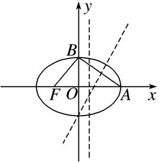
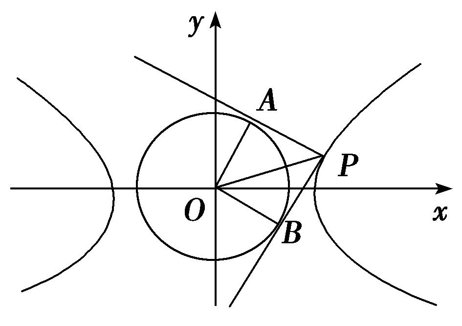
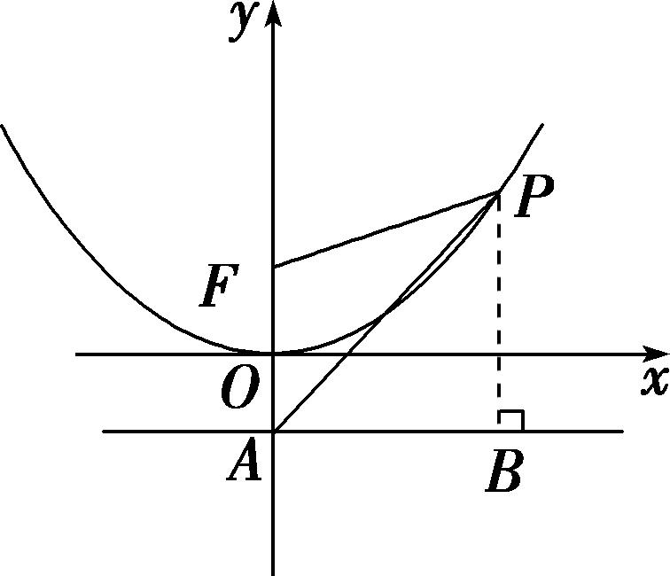
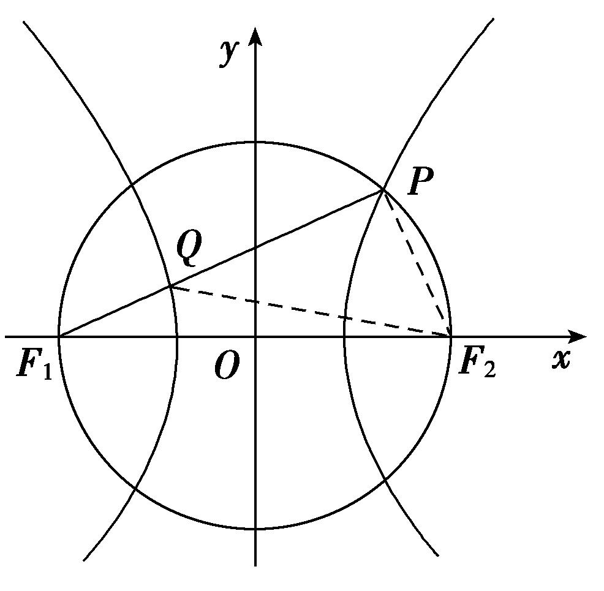
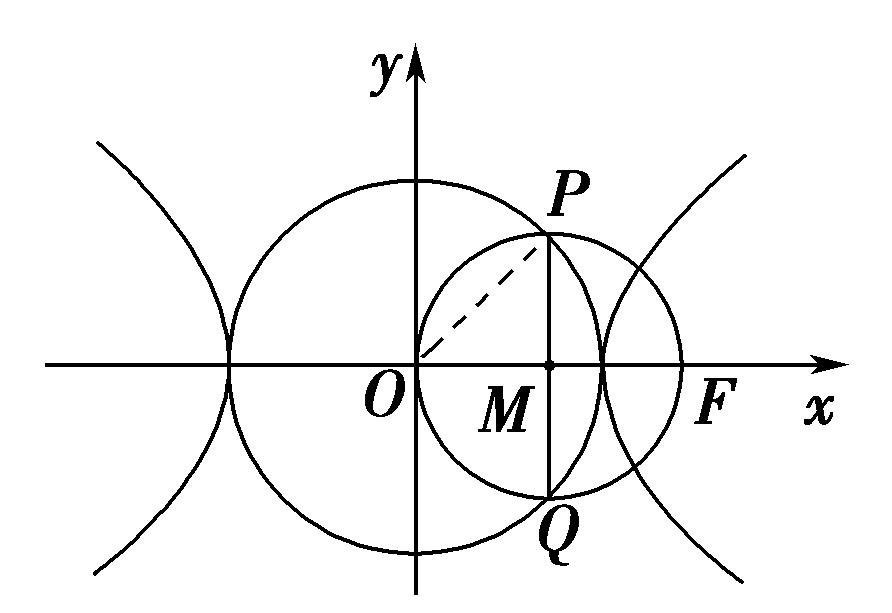
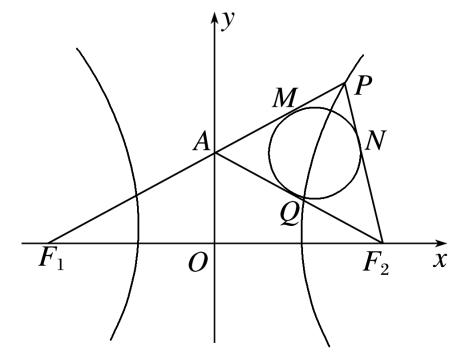
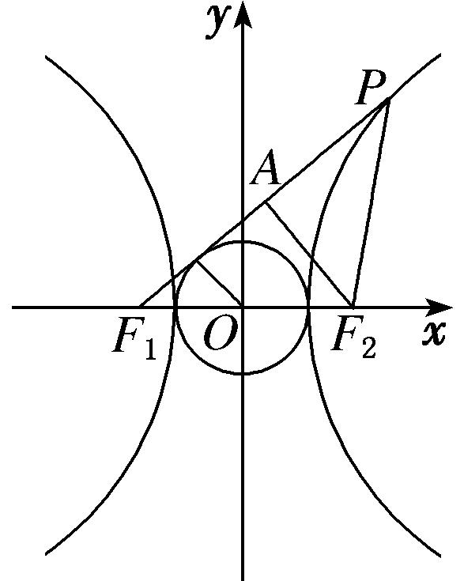
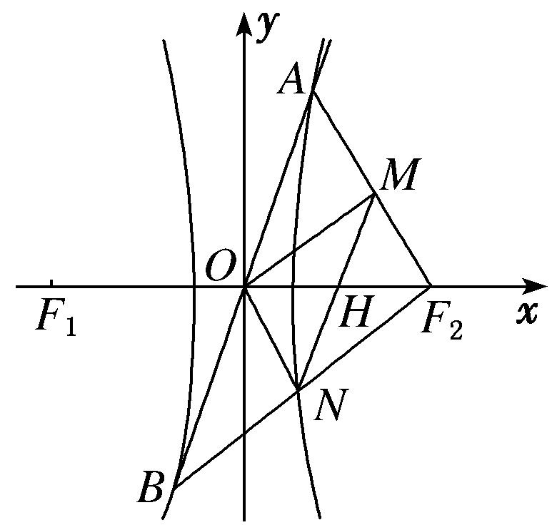

**专题04　椭圆(双曲线)＋圆(抛物线)模型**

**1．椭圆(双曲线)＋圆(抛物线)求范围型**

椭圆(双曲线)＋圆(抛物线)型求范围的基本思路是借助椭圆、双曲线、抛物线或圆的相关知识，结合题设条件建立目标函数或构建不等式，转化为求函数的值域或解不等式求解．

**【例题选讲】**

<strong>[例9]</strong>　(51)过椭圆<em>C</em>：＋＝1(<em>a</em>＞<em>b</em>＞0)的右焦点作<em>x</em>轴的垂线，交<em>C</em>于<em>A</em>，<em>B</em>两点，直线<em>l</em>过<em>C</em>的左焦点和上顶点．若以<em>AB</em>为直径的圆与<em>l</em>存在公共点，则<em>C</em>的离心率的取值范围是(　　)

A．　　　　　B．　　　　　C．　　　　　D．

<strong>答案</strong>　A　<strong>解析</strong>　由题设知，直线<em>l</em>：＋＝1，即<em>bx</em>－<em>cy</em>＋<em>bc</em>＝0，以<em>AB</em>为直径的圆的圆心为(<em>c,</em>0)，根据题意，将<em>x</em>＝<em>c</em>代入椭圆<em>C</em>的方程，得<em>y</em>＝±，则圆的半径<em>r</em>＝．又圆与直线<em>l</em>有公共点，所以≤，化简得2<em>c</em>≤<em>b</em>，平方整理得<em>a</em>2≥5<em>c</em>2，所以<em>e</em>＝≤．又0＜<em>e</em>＜1，所以0＜<em>e</em>≤．故选A．

(52)已知直线<em>l</em>：<em>y</em>＝<em>kx</em>＋2过椭圆＋＝1(<em>a</em>＞<em>b</em>＞0)的上顶点<em>B</em>和左焦点<em>F</em>，且被圆<em>x</em>2＋<em>y</em>2＝4截得的弦长为<em>L</em>，若<em>L</em>≥，则椭圆离心率<em>e</em>的取值范围是\_\_\_\_\_\_\_\_．

<strong>答案　　解析</strong>　依题意，知<em>b</em>＝2，<em>kc</em>＝2．设圆心到直线<em>l</em>的距离为<em>d</em>，则<em>L</em>＝2≥，解得<em>d</em>2≤．又因为<em>d</em>＝，所以≤，解得<em>k</em>2≥．于是<em>e</em>2＝＝＝，所以0＜<em>e</em>2≤，又由0＜<em>e</em>＜1，解得0＜<em>e</em>≤．

(53)若椭圆<em>b</em>2<em>x</em>2＋<em>a</em>2<em>y</em>2＝<em>a</em>2<em>b</em>2(<em>a</em>＞<em>b</em>＞0)和圆<em>x</em>2＋<em>y</em>2＝2有四个交点，其中<em>c</em>为椭圆的半焦距，则椭圆的离心率<em>e</em>的取值范围为(　　)

A．　　　　　　B．　　　　　　C．　　　　　　D．

<strong>答案</strong>　A　<strong>解析</strong>　由题意可知，椭圆的上、下顶点在圆内，左、右顶点在圆外，则整理得解得＜<em>e</em>＜．

**【对点训练】**

66．已知双曲线<em>C</em>1：－＝1(<em>a</em>&gt;0，<em>b</em>&gt;0)，圆<em>C</em>2：<em>x</em>2＋<em>y</em>2－2<em>ax</em>＋<em>a</em>2＝0，若双曲线<em>C</em>1的一条渐近线与圆

<em>C</em>2有两个不同的交点，则双曲线<em>C</em>1的离心率的取值范围是(　　)

A．　　　　　B．　　　　　C．(1，2) 　　　　　D．(2，＋∞)

66．<strong>答案</strong>　A　<strong>解析</strong>　由双曲线方程可得其渐近线方程为<em>y</em>＝±<em>x</em>，即<em>bx</em>±<em>ay</em>＝0，圆<em>C</em>2：<em>x</em>2＋<em>y</em>2－2<em>ax</em>＋<em>a</em>2

＝0可化为(<em>x</em>－<em>a</em>)2＋<em>y</em>2＝<em>a</em>2，圆心<em>C</em>2的坐标为(<em>a,</em>0)，半径<em>r</em>＝<em>a</em>，由双曲线<em>C</em>1的一条渐近线与圆<em>C</em>2有两个不同的交点，得&lt;<em>a</em>，即<em>c</em>&gt;2<em>b</em>，即<em>c</em>2&gt;4<em>b</em>2，又知<em>b</em>2＝<em>c</em>2－<em>a</em>2，所以<em>c</em>2&gt;4(<em>c</em>2－<em>a</em>2)，即<em>c</em>2&lt;<em>a</em>2，所以<em>e</em>＝&lt;，又知<em>e</em>&gt;1，所以双曲线<em>C</em>1的离心率的取值范围为，故选A．

67．已知双曲线－＝1(<em>a</em>＞0，<em>b</em>＞0)的渐近线与圆<em>x</em>2－4<em>x</em>＋<em>y</em>2＋2＝0相交，则双曲线的离心率的取值范

围是\_\_\_\_\_\_．

67．<strong>答案</strong>　(1，)　<strong>解析</strong>　双曲线的渐近线方程为<em>y</em>＝±<em>x</em>，即<em>bx</em>±<em>ay</em>＝0，圆<em>x</em>2－4<em>x</em>＋<em>y</em>2＋2＝0可化为(<em>x</em>

－2)2＋<em>y</em>2＝2，其圆心为(2，0)，半径为．因为直线<em>bx</em>±<em>ay</em>＝0和圆(<em>x</em>－2)2＋<em>y</em>2＝2相交，所以＜，整理得<em>b</em>2＜<em>a</em>2．从而<em>c</em>2－<em>a</em>2＜<em>a</em>2，即<em>c</em>2＜2<em>a</em>2，所以<em>e</em>2＜2．又<em>e</em>＞1，故双曲线的离心率的取值范围是(1，)．

68．若双曲线<em>x</em>2－＝1 (<em>b</em>&gt;0)的一条渐近线与圆<em>x</em>2＋(<em>y</em>－2)2＝1至多有一个交点，则双曲线离心率的取值

范围是(　　)

A．(1，2]　　　　　　B．[2，＋∞)　　　　　　C．(1，]　　　　　　D．[，＋∞)

68．<strong>答案</strong>　A　<strong>解析</strong>　双曲线<em>x</em>2－＝1(<em>b</em>&gt;0)的一条渐近线方程是<em>bx</em>－<em>y</em>＝0，由题意圆<em>x</em>2＋(<em>y</em>－2)2＝1的圆

心(0，2)到<em>bx</em>－<em>y</em>＝0的距离不小于1，即≥1，则<em>b</em>2≤3，那么离心率<em>e</em>∈(1，2]，故选A．

69．已知*A*(1，2)，*B*(－1，2)，动点*P*满足⊥，若双曲线－＝1(*a*>0，*b*>0)的一条渐近线与动

点*P*的轨迹没有公共点，则双曲线的离心率*e*的取值范围是(　　)

A．(1，2)　　　　　　B．(1，2]　　　　　　C．(1，)　　　　　　D．(1， ]

69．<strong>答案</strong>　A　<strong>解析]</strong>　设<em>P</em>(<em>x</em>，<em>y</em>)，由题设条件得动点<em>P</em>的轨迹方程为(<em>x</em>－1)(<em>x</em>＋1)＋(<em>y</em>－2)(<em>y</em>－2)＝0，即

<em>x</em>2＋(<em>y</em>－2)2＝1，它是以(0，2)为圆心，1为半径的圆．又双曲线－＝1(<em>a</em>&gt;0，<em>b</em>&gt;0)的渐近线方程为<em>y</em>＝±<em>x</em>，即<em>bx</em>±<em>ay</em>＝0，因此由题意可得&gt;1，即&gt;1，则<em>e</em>＝&lt;2，又<em>e</em>&gt;1，故1&lt;<em>e</em>&lt;2．

70．已知双曲线&lt;text st<em>y</em>le="it<em>a</em>lic"&gt;<em>E</em>&lt;/text&gt;： $\frac{x^{2}}{a^{2}}$ － $\frac{y^{2}}{b^{2}}$ =1(&lt;text st<em>y</em>le="italic"&gt;a&lt;/text&gt;&gt;0，<em>b</em>&gt;0)的右顶点为<em>A</em>，抛物线<em>C</em>：y2＝8<em>ax</em>的焦点为<em>F</em>．若在<em>&lt;text style="italic"&gt;E</em>&lt;/text&gt;的渐近

线上存在点*P*，使得 $\overset{\to }{AP}$ ⊥ $\overset{\to }{FP}$ ，则*E*的离心率的取值范围是(　　)

A．(1，2)　　　　　　B．(1，]　　　　　　C．[ $\frac{3\sqrt{2}}{4}$ ，＋∞)　　　　　　D．(2，＋∞)

7&lt;te<em>x</em>t style="subscript"&gt;0&lt;/text&gt;．&lt;te<em>x</em>t style="bold"&gt;答案　&lt;/text&gt;B　<strong>解析</strong>　由题意得，&lt;text style="it&lt;text style="it<em>a</em>lic"&gt;a&lt;/text&gt;lic"&gt;A&lt;/text&gt;(a，0)，<em>F</em>(2a，0)，设<em>P</em>(x0， $\frac{b}{a}$ &lt;te<em>x</em>t style="italic"&gt;x&lt;/text&gt;&lt;text style="subscript"&gt;0&lt;/text&gt;)，由 $\overset{\to }{AP}$ ⊥ $\overset{\to }{FP}$ ，得 $\overset{\to }{AP}$ · $\overset{\to }{PF}$ =&lt;te<em>x</em>t style="subscript"&gt;0&lt;/text&gt;⇒ $\frac{c^{2}}{a^{2}}x_{0}^{2}$

－3&lt;t&lt;t&lt;t<em>e</em>xt style="italic"&gt;e&lt;/text&gt;xt style="italic"&gt;e&lt;/text&gt;xt style="it&lt;text style="it&lt;text style="it&lt;text style="it&lt;text style="itali<em>c</em>"&gt;a&lt;/text&gt;lic"&gt;a&lt;/text&gt;lic"&gt;a&lt;/text&gt;lic"&gt;a&lt;/text&gt;lic"&gt;ax&lt;/text&gt;0＋&lt;text style="superscript"&gt;&lt;text style="superscript"&gt;&lt;text style="superscript"&gt;&lt;text style="superscript"&gt;&lt;text style="superscript"&gt;2&lt;/text&gt;&lt;/text&gt;&lt;/text&gt;&lt;/text&gt;&lt;/text&gt;a2=0，因为在<em>&lt;text style="italic"&gt;E</em>&lt;/text&gt;的渐近线上存在点<em>P</em>，则Δ≥0，即9a2－4×2a2× $\frac{c^{2}}{a^{2}}$ ≥&lt;t&lt;t&lt;t<em>e</em>xt style="italic"&gt;e&lt;/text&gt;xt style="italic"&gt;e&lt;/text&gt;xt style="subs<em>c</em>ript"&gt;0&lt;/text&gt;⇒9&lt;text style="it&lt;text style="it&lt;text style="it<em>a</em>lic"&gt;a&lt;/text&gt;lic"&gt;a&lt;/text&gt;lic"&gt;a&lt;/text&gt;&lt;text style="superscript"&gt;&lt;text style="superscript"&gt;&lt;text style="superscript"&gt;&lt;text style="superscript"&gt;&lt;text style="superscript"&gt;2&lt;/text&gt;&lt;/text&gt;&lt;/text&gt;&lt;/text&gt;&lt;/text&gt;≥8c2⇒e2≤ $\frac{9}{8}$ ⇒&lt;t&lt;t<em>e</em>xt style="italic"&gt;e&lt;/text&gt;xt style="italic"&gt;e&lt;/text&gt;≤ $\frac{3\sqrt{2}}{4}$ ，又因为&lt;t&lt;t&lt;t<em>e</em>xt style="italic"&gt;e&lt;/text&gt;xt style="italic"&gt;e&lt;/text&gt;xt style="it&lt;text style="it&lt;text style="it&lt;text style="itali<em>c</em>"&gt;a&lt;/text&gt;lic"&gt;a&lt;/text&gt;lic"&gt;a&lt;/text&gt;lic"&gt;<em>E</em>&lt;/text&gt;为双曲线,则1&lt;e≤ $\frac{3\sqrt{2}}{4}$ ．故选B．

71．已知圆(<em>x</em>－1)2＋<em>y</em>2＝的一条切线<em>y</em>＝<em>kx</em>与双曲线<em>C</em>：－＝1(<em>a</em>&gt;0，<em>b</em>&gt;0)有两个交点，则双曲线<em>C</em>的

离心率的取值范围是(　　)

A．(1，)　　　　B．(1，2)　　　　C．(，＋∞)　　　　D．(2，＋∞)

71．<strong>答案</strong>　D　<strong>解析</strong>　由题意，圆心到直线的距离<em>d</em>＝＝，所以<em>k</em>＝±，因为圆(<em>x</em>－1)2＋<em>y</em>2＝的

一条切线*y*＝*kx*与双曲线*C*：－＝1(*a*>0，*b*>0)有两个交点，所以>，所以1＋>4，所以*e*>2．

72．已知直线*l*：*y*＝*kx*＋2过双曲线*C*：－＝1(*a*＞0，*b*＞0)的左焦点*F*和虚轴的上端点*B*(0，*b*)，且与

圆<em>x</em>2＋<em>y</em>2＝8交于点<em>M</em>，<em>N</em>，若|<em>MN</em>|≥2，则双曲线的离心率<em>e</em>的取值范围是(　　)

A．(1，]　　　　　　B．(1，]　　　　　　C．[，＋∞)　　　　　　D．[，＋∞)

72．<strong>答案</strong>　C　<strong>解析</strong>　设圆心到直线<em>l</em>的距离为<em>d</em>(<em>d</em>＞0)，因为|<em>MN</em>|≥2，所以2≥2，即0＜<em>d</em>≤

．又*d*＝，所以≤，解得|*k*|≥．由直线*l*：*y*＝*kx*＋2过双曲线*C*：－＝1(*a*＞0，*b*＞0)的左焦点*F*和虚轴的上端点*B*(0，*b*)，得|*k*|＝．所以≥，即≥，所以≥，即1－≥，所以*e*≥，于是双曲线的离心率*e*的取值范围是[，＋∞)．故选C．

73．已知椭圆＋＝1(<em>a</em>&gt;<em>b</em>&gt;<em>c</em>&gt;0，<em>a</em>2＝<em>b</em>2＋<em>c</em>2)的左、右焦点分别为<em>F</em>1，<em>F</em>2，若以<em>F</em>2为圆心，<em>b</em>－<em>c</em>为半

径作圆<em>F</em>2，过椭圆上一点<em>P</em>作此圆的切线，切点为<em>T</em>，且|<em>PT</em>|的最小值不小于(<em>a</em>－<em>c</em>)，则椭圆的离心率<em>e</em>的取值范围是\_\_\_\_\_\_\_\_\_\_．

73．<strong>答案　　解析</strong>　因为|<em>PT</em>|＝(<em>b</em>&gt;<em>c</em>)，而|<em>PF</em>2|的最小值为<em>a</em>－<em>c</em>，所以|<em>PT</em>|的最

小值为．依题意，有≥(<em>a</em>－<em>c</em>)，所以(<em>a</em>－<em>c</em>)2≥4(<em>b</em>－<em>c</em>)2，所以<em>a</em>－<em>c</em>≥2(<em>b</em>－<em>c</em>)，所以<em>a</em>＋<em>c</em>≥2<em>b</em>，所以(<em>a</em>＋<em>c</em>)2≥4(<em>a</em>2－<em>c</em>2)，所以5<em>c</em>2＋2<em>ac</em>－3<em>a</em>2≥0，所以5<em>e</em>2＋2<em>e</em>－3≥0，①．又<em>b</em>&gt;<em>c</em>，所以<em>b</em>2&gt;<em>c</em>2，所以<em>a</em>2－<em>c</em>2&gt;<em>c</em>2，所以2<em>e</em>2&lt;1，②．联立①②，得≤<em>e</em>&lt;．

74．已知<em>A</em>，<em>B</em>，<em>F</em>分别是椭圆<em>x</em>2＋＝1(0&lt;<em>b</em>&lt;1)的右顶点、上顶点、左焦点，设△<em>ABF</em>的外接圆的圆心坐

标为(*p*，*q*)．若*p*＋*q*>0，则椭圆的离心率的取值范围为\_\_\_\_\_\_\_\_\_\_\_\_\_\_．

74．答案　　解析　如图所示，线段*FA*的垂直平分线为*x*＝，线段*AB*的中点为.

因为<em>kAB</em>＝－<em>b</em>，所以线段<em>AB</em>的垂直平分线的斜率<em>k</em>＝，所以线段<em>AB</em>的垂直平分线方程为<em>y</em>－＝．把<em>x</em>＝＝<em>p</em>代入上述方程可得<em>y</em>＝＝<em>q</em>．因为<em>p</em>＋<em>q</em>&gt;0，所以＋&gt;0，化为<em>b</em>&gt;．又0&lt;<em>b</em>&lt;1，解得&lt;<em>b</em>2&lt;1，即－1&lt;－<em>b</em>2&lt;－，所以0&lt;1－<em>b</em>2&lt;，所以<em>e</em>＝＝<em>c</em>＝∈．

75．已知双曲线<em>C</em>1：－＝1与圆<em>C</em>2：<em>x</em>2＋<em>y</em>2＝<em>b</em>2(其中<em>a</em>&gt;0，<em>b</em>&gt;0)，若在<em>C</em>1上存在点<em>P</em>，使得由点<em>P</em>向

<em>C</em>2所作的两条切线互相垂直，则双曲线<em>C</em>1的离心率的取值范围是\_\_\_\_\_\_\_\_．

75．<strong>答案　　解析</strong>　由题意，根据圆的性质，可知四边形<em>PAOB</em>是正方形，所以|<em>OP</em>|＝<em>b</em>；

因为|*OP*|＝*b*≥*a*，所以≥，所以*e*＝＝＝≥ ＝；所以双曲线离心率*e*的取值范围是．故答案为：．

**2．椭圆(双曲线)＋圆(抛物线)求值型**

椭圆(双曲线)＋圆(抛物线)型求值的基本思路是借助椭圆、双曲线、抛物线或圆的相关知识，结合题设条件建立*a*，*b*，*c*的等量关系，转化为*e*的方程求解．

**【例题选讲】**

<strong>[例10]</strong>　(54)已知双曲线<em>C</em>：<em>mx</em>2＋<em>ny</em>2＝1(<em>mn</em>&lt;0)的一条渐近线与圆<em>x</em>2＋<em>y</em>2－6<em>x</em>－2<em>y</em>＋9＝0相切，则<em>C</em>的离心率为(　　)

A．　　　　　　　　B．　　　　　　　　C．或　　　　　　　　D．或

<strong>答案</strong>　D　<strong>解析</strong>　圆<em>x</em>2＋<em>y</em>2－6<em>x</em>－2<em>y</em>＋9＝0的标准方程为(<em>x</em>－3)2＋(<em>y</em>－1)2＝1，则圆心为<em>M</em>(3,1)，半径<em>r</em>＝1．当<em>m</em>&lt;0，<em>n</em>&gt;0时，由<em>mx</em>2＋<em>ny</em>2＝1得－＝1，则双曲线的焦点在<em>y</em>轴上，不妨设双曲线与圆相切的渐近线方程为<em>y</em>＝<em>x</em>，即<em>ax</em>－<em>by</em>＝0，则圆心到直线的距离<em>d</em>＝＝1，即|3<em>a</em>－<em>b</em>|＝<em>c</em>，平方得9<em>a</em>2－6<em>ab</em>＋<em>b</em>2＝<em>c</em>2＝<em>a</em>2＋<em>b</em>2，即8<em>a</em>2－6<em>ab</em>＝0，则<em>b</em>＝<em>a</em>，平方得<em>b</em>2＝<em>a</em>2＝<em>c</em>2－<em>a</em>2，即<em>c</em>2＝<em>a</em>2，则<em>c</em>＝<em>a</em>，离心率<em>e</em>＝＝；当<em>m</em>&gt;0，<em>n</em>&lt;0时，同理可得<em>e</em>＝，故选D．

(55)设椭圆＋＝1(<em>a</em>&gt;<em>b</em>&gt;0)的焦点为<em>F</em>1，<em>F</em>2，<em>P</em>是椭圆上一点，且∠<em>F</em>1<em>PF</em>2＝，若△<em>F</em>1<em>PF</em>2的外接圆和内切圆的半径分别为<em>R</em>，<em>r</em>，当<em>R</em>＝4<em>r</em>时，椭圆的离心率为(　　)

A．　　　　　　　　B．　　　　　　　　C．　　　　　　　　D．

<strong>答案</strong>　B　<strong>解析</strong>　椭圆＋＝1(<em>a</em>&gt;<em>b</em>&gt;0)的焦点为<em>F</em>1(－<em>c,</em>0)，<em>F</em>2(<em>c,</em>0)，<em>P</em>为椭圆上一点，且∠<em>F</em>1<em>PF</em>2＝，|<em>F</em>1<em>F</em>2|＝2<em>c</em>，根据正弦定理＝＝2<em>R</em>，∴<em>R</em>＝<em>c</em>，∵<em>R</em>＝4<em>r</em>，∴<em>r</em>＝<em>c</em>，由余弦定理，2＝|<em>PF</em>1|2＋|<em>PF</em>2|2－2|<em>PF</em>1||<em>PF</em>2|cos∠<em>F</em>1<em>PF</em>2，由|<em>PF</em>1|＋|<em>PF</em>2|＝2<em>a</em>，∠<em>F</em>1<em>PF</em>2＝，可得|<em>PF</em>1||<em>PF</em>2|＝，则由三角形面积公式·<em>r</em>＝|<em>PF</em>1||<em>PF</em>2|sin∠<em>F</em>1<em>PF</em>2，可得·<em>c</em>＝·，∴<em>e</em>＝＝．

(56)已知双曲线&lt;te&lt;text st&lt;text sty<em>l</em>e="italic"&gt;y&lt;/text&gt;le="it<em>a</em>lic"&gt;x&lt;/text&gt;t sty<em>l</em>e="it<em>a</em>lic"&gt;<em>Γ</em>&lt;/text&gt;： $\frac{x^{2}}{a^{2}}$ － $\frac{y^{2}}{b^{2}}$ ＝1(&lt;te&lt;text st&lt;text sty<em>l</em>e="italic"&gt;y&lt;/text&gt;le="it<em>a</em>lic"&gt;x&lt;/text&gt;t sty<em>l</em>e="italic"&gt;a&lt;/text&gt;&gt;0，<em>b</em>&gt;0)的一条渐近线为l，圆<em>C</em>：(x－a)&lt;text style="superscript"&gt;2&lt;/text&gt;＋y2＝8与l交于<em>A</em>，<em>B</em>两点，若△<em>ABC</em>是等腰直角三角形，且 $\overset{\to }{OB}$ ＝5 $\overset{\to }{OA}$ (其中<em>O</em>为坐标原点)，则双曲线&lt;te&lt;text st&lt;text sty<em>l</em>e="italic"&gt;y&lt;/text&gt;le="it<em>a</em>lic"&gt;x&lt;/text&gt;t sty<em>l</em>e="it<em>a</em>lic"&gt;<em>Γ</em>&lt;/text&gt;的离心率为(　　)

A． $\frac{2\sqrt{13}}{3}$ 　　　　　　　　B．　　　　　　　　C．　　　　　　　　D．

&lt;te&lt;te&lt;te&lt;text style="it&lt;text style="itali<em>c</em>"&gt;a&lt;/text&gt;li<em>c</em>"&gt;x&lt;/text&gt;t st&lt;text st<em>y</em>le="it&lt;text style="it<em>a</em>lic"&gt;a&lt;/text&gt;lic"&gt;y&lt;/text&gt;le="it<em>a</em>lic"&gt;x&lt;/text&gt;t style="italic"&gt;x&lt;/text&gt;t st<em>y</em>le="<em>b</em>old"&gt;答案　&lt;/text&gt;D　<strong>解析</strong>　取双曲线渐近线为y＝ $\frac{b}{a}$ &lt;te&lt;te&lt;text style="it&lt;text style="itali<em>c</em>"&gt;a&lt;/text&gt;li<em>c</em>"&gt;x&lt;/text&gt;t st&lt;text st<em>y</em>le="it&lt;text style="it<em>a</em>lic"&gt;a&lt;/text&gt;lic"&gt;y&lt;/text&gt;le="it<em>a</em>lic"&gt;x&lt;/text&gt;t style="italic"&gt;x&lt;/text&gt;，圆(x－a)&lt;text style="supe<em>r</em>script"&gt;&lt;text style="superscript"&gt;&lt;text style="superscript"&gt;&lt;text style="superscript"&gt;&lt;text style="superscript"&gt;2&lt;/text&gt;&lt;/text&gt;&lt;/text&gt;&lt;/text&gt;&lt;/text&gt;＋<em>y</em>2＝8的圆心为(a，0)，半径r＝2，由题意知∠<em>ACB</em>＝ $\frac{\pi }{2}$ ，由勾股定理得|&lt;te&lt;text style="it&lt;text style="itali<em>c</em>"&gt;a&lt;/text&gt;li<em>c</em>"&gt;x&lt;/text&gt;t st<em>y</em>le="it<em>a</em>lic"&gt;<em>AB</em>&lt;/text&gt;|＝＝4，又由 $\overset{\to }{OB}$ ＝5 $\overset{\to }{OA}$ 得|&lt;te&lt;text style="it&lt;text style="itali<em>c</em>"&gt;a&lt;/text&gt;li<em>c</em>"&gt;x&lt;/text&gt;t st<em>y</em>le="it<em>a</em>lic"&gt;OA&lt;/text&gt;|＝ $\frac{1}{4}$ |&lt;te&lt;text style="it&lt;text style="itali<em>c</em>"&gt;a&lt;/text&gt;li<em>c</em>"&gt;x&lt;/text&gt;t st<em>y</em>le="it<em>a</em>lic"&gt;<em>AB</em>&lt;/text&gt;|＝1，在△<em>OA</em>C和△<em>OBC</em>中，由余弦定理得cos∠<em>BOC</em>＝ $\frac{a^{2}+1-8}{2a}$ = $\frac{5^{2}+a^{2}-8}{10a}$ ，解得&lt;te&lt;text style="it&lt;text style="itali<em>c</em>"&gt;a&lt;/text&gt;li<em>c</em>"&gt;x&lt;/text&gt;t st&lt;text st<em>y</em>le="it&lt;text style="it<em>a</em>lic"&gt;a&lt;/text&gt;lic"&gt;y&lt;/text&gt;le="italic"&gt;a&lt;/text&gt;&lt;text style="supe<em>r</em>script"&gt;&lt;text style="superscript"&gt;&lt;text style="superscript"&gt;&lt;text style="superscript"&gt;&lt;text style="superscript"&gt;2&lt;/text&gt;&lt;/text&gt;&lt;/text&gt;&lt;/text&gt;&lt;/text&gt;＝13．根据圆心到直线&lt;te&lt;te<em>x</em>t style="italic"&gt;x&lt;/text&gt;t style="italic"&gt;y&lt;/text&gt;＝ $\frac{b}{a}$ &lt;te&lt;te&lt;text style="it&lt;text style="itali<em>c</em>"&gt;a&lt;/text&gt;li<em>c</em>"&gt;x&lt;/text&gt;t st&lt;text st<em>y</em>le="it&lt;text style="it<em>a</em>lic"&gt;a&lt;/text&gt;lic"&gt;y&lt;/text&gt;le="it<em>a</em>lic"&gt;x&lt;/text&gt;t style="italic"&gt;x&lt;/text&gt;的距离为&lt;text style="supe<em>r</em>script"&gt;&lt;text style="superscript"&gt;&lt;text style="superscript"&gt;&lt;text style="superscript"&gt;&lt;text style="superscript"&gt;2&lt;/text&gt;&lt;/text&gt;&lt;/text&gt;&lt;/text&gt;&lt;/text&gt;，有 $\frac{ab}{c}$ ＝&lt;te&lt;text style="it&lt;text style="itali<em>c</em>"&gt;a&lt;/text&gt;li<em>c</em>"&gt;x&lt;/text&gt;t st&lt;text st<em>y</em>le="it&lt;text style="it<em>a</em>lic"&gt;a&lt;/text&gt;lic"&gt;y&lt;/text&gt;le="supe<em>r</em>script"&gt;&lt;text style="superscript"&gt;&lt;text style="superscript"&gt;&lt;text style="superscript"&gt;&lt;text style="superscript"&gt;2&lt;/text&gt;&lt;/text&gt;&lt;/text&gt;&lt;/text&gt;&lt;/text&gt;，结合c2＝<em>a</em>2＋<em>b</em>2，解得c＝，故离心率为 $\frac{c}{a}$ ＝ $\frac{\frac{13}{3}}{\sqrt{13}}$ ＝ $\frac{\sqrt{13}}{3}$ ．故选D．

(57)已知点<em>A</em>是抛物线<em>x</em>2＝4<em>y</em>的对称轴与准线的交点，点<em>F</em>为抛物线的焦点，点<em>P</em>在抛物线上且满足|<em>PA</em>|＝<em>m</em>|<em>PF</em>|．若<em>m</em>取得最大值时，点<em>P</em>恰好在以<em>A</em>，<em>F</em>为焦点的椭圆上，则椭圆的离心率为(　　)

A．－1　　　　　　　B．－1　　　　　　　C．　　　　　　　D．

<strong>答案</strong>　B　<strong>解析</strong>　法一：由抛物线方程知<em>A</em>(0，－1)，过点<em>P</em>作<em>PB</em>垂直准线于点<em>B</em>，如图．由抛物线定义可知|<em>PF</em>|＝|<em>PB</em>|，则|<em>PA</em>|＝<em>m</em>|<em>PF</em>|＝<em>m</em>|<em>PB</em>|，即<em>m</em>＝＝．若<em>m</em>最大，则sin∠<em>PAB</em>最小，此时直线<em>PA</em>与抛物线相切．设直线<em>PA</em>的方程为<em>y</em>＝<em>kx</em>－1，代入<em>x</em>2＝4<em>y</em>得<em>x</em>2＝4<em>kx</em>－4，即<em>x</em>2－4<em>kx</em>＋4＝0，令<em>Δ</em>＝16<em>k</em>2－16＝0，解得<em>k</em>＝±1，可得<em>P</em>(±2，1)，<em>B</em>(±2，－1)，所以|<em>PF</em>|＝|<em>PB</em>|＝|<em>AB</em>|＝2，所以|<em>PA</em>|＝2．因为点<em>P</em>在以<em>A</em>，<em>F</em>为焦点的椭圆上，所以2<em>c</em>＝|<em>AF</em>|＝2，2<em>a</em>＝|<em>PA</em>|＋|<em>PF</em>|＝2＋2，所以椭圆的离心率<em>e</em>＝＝＝＝－1，故选B．

法二：过点<em>P</em>作<em>PB</em>垂直准线于点<em>B</em>．设<em>P</em>(<em>x</em>，<em>y</em>)．因为<em>A</em>是抛物线<em>x</em>2＝4<em>y</em>的对称轴与准线的交点，点<em>F</em>为抛物线的焦点，所以<em>A</em>(0，－1)，<em>F</em>(0，1)，则<em>m</em>＝＝＝＝.当<em>y</em>＝0时，<em>m</em>＝1；当<em>y</em>&gt;0时，<em>m</em>＝＝≤＝，当且仅当<em>y</em>＝1时取等号．当<em>m</em>取得最大值时，<em>P</em>(±2，1)，<em>B</em>(±2，－1)，所以|<em>PF</em>|＝|<em>PB</em>|＝|<em>AB</em>|＝2，所以|<em>PA</em>|＝2．因为点<em>P</em>在以<em>A</em>，<em>F</em>为焦点的椭圆上，所以2<em>c</em>＝|<em>AF</em>|＝2，2<em>a</em>＝|<em>PA</em>|＋|<em>PF</em>|＝2＋2，所以椭圆的离心率<em>e</em>＝＝＝＝－1，故选B．

(58)已知<em>F</em>1，<em>F</em>2为双曲线－＝1(<em>a</em>＞0，<em>b</em>＞0)的左、右焦点，以<em>F</em>1<em>F</em>2为直径的圆与双曲线右支的一个交点为<em>P</em>，<em>PF</em>1与双曲线相交于点<em>Q</em>，且|<em>PQ</em>|＝2|<em>QF</em>1|，则该双曲线的离心率为(　　)

A．　　　　　　　B．2　　　　　　　　C．　　　　　　　　D．

<strong>答案</strong>　A　<strong>解析</strong>　如图，连接<em>PF</em>2，<em>QF</em>2．由|<em>PQ</em>|＝2|<em>QF</em>1|，可设|<em>QF</em>1|＝<em>m</em>，则|<em>PQ</em>|＝2<em>m</em>，|<em>PF</em>1|＝3<em>m</em>；由|<em>PF</em>1|－|<em>PF</em>2|＝2<em>a</em>，得|<em>PF</em>2|＝|<em>PF</em>1|－2<em>a</em>＝3<em>m</em>－2<em>a</em>；由|<em>QF</em>2|－|<em>QF</em>1|＝2<em>a</em>，得|<em>QF</em>2|＝|<em>QF</em>1|＋2<em>a</em>＝<em>m</em>＋2<em>a</em>.∵点<em>P</em>在以<em>F</em>1<em>F</em>2为直径的圆上，∴<em>PF</em>1⊥<em>PF</em>2，∴|<em>PF</em>1|2＋|<em>PF</em>2|2＝|<em>F</em>1<em>F</em>2|2，|<em>PQ</em>|2＋|<em>PF</em>2|2＝|<em>QF</em>2|2.由|<em>PQ</em>|2＋|<em>PF</em>2|2＝|<em>QF</em>2|2，得(2<em>m</em>)2＋(3<em>m</em>－2<em>a</em>)2＝(<em>m</em>＋2<em>a</em>)2，解得<em>m</em>＝<em>a</em>，∴|<em>PF</em>1|＝3<em>m</em>＝4<em>a</em>，|<em>PF</em>2|＝3<em>m</em>－2<em>a</em>＝2<em>a</em>.∵|<em>PF</em>1|2＋|<em>PF</em>2|2＝|<em>F</em>1<em>F</em>2|2，|<em>F</em>1<em>F</em>2|＝2<em>c</em>，∴(4<em>a</em>)2＋(2<em>a</em>)2＝(2<em>c</em>)2，化简得<em>c</em>2＝5<em>a</em>2，∴双曲线的离心率<em>e</em>＝＝，故选A．

**【对点训练】**

76．(2017·全国Ⅲ)已知椭圆<em>C</em>：＋＝1(<em>a</em>&gt;<em>b</em>&gt;0)的左、右顶点分别为<em>A</em>1，<em>A</em>2，且以线段<em>A</em>1<em>A</em>2为直径的圆

与直线*bx*－*ay*＋2*ab*＝0相切，则*C*的离心率为(　　)

A．　　　　　　　　B．　　　　　　　　C．　　　　　　　　D．

76．<strong>答案</strong>　A　<strong>解析</strong>　以线段<em>A</em>1<em>A</em>2为直径的圆的方程为<em>x</em>2＋<em>y</em>2＝<em>a</em>2，由圆心到直线<em>bx</em>－<em>ay</em>＋2<em>ab</em>＝0的距离

<em>d</em>＝＝<em>a</em>，得<em>a</em>2＝3<em>b</em>2，所以<em>C</em>的离心率<em>e</em>＝＝．

77．(2019·全国Ⅱ)设*F*为双曲线*C*：－＝1(*a*＞0，*b*＞0)的右焦点，*O*为坐标原点，以*OF*为直径的圆与

圆<em>x</em>2＋<em>y</em>2＝<em>a</em>2交于<em>P</em>，<em>Q</em>两点．若|<em>PQ</em>|＝|<em>OF</em>|，则<em>C</em>的离心率为(　　)

A．　　　　　　　　B．　　　　　　　　C．2　　　　　　　　D．

77．<strong>答案</strong>　A　<strong>解析</strong>　令双曲线<em>C</em>：－＝1(<em>a</em>&gt;0，<em>b</em>&gt;0)的右焦点<em>F</em>的坐标为(<em>c,</em>0)，则<em>c</em>＝．如图

所示，由圆的对称性及条件|<em>PQ</em>|＝|<em>OF</em>|可知，<em>PQ</em>是以<em>OF</em>为直径的圆的直径，且<em>PQ</em>⊥<em>OF</em>.设垂足为<em>M</em>，连接<em>OP</em>，则|<em>OP</em>|＝<em>a</em>，|<em>OM</em>|＝|<em>MP</em>|＝，由|<em>OM</em>|2＋|<em>MP</em>|2＝|<em>OP</em>|2，得＋＝<em>a</em>2，∴＝，即离心率<em>e</em>＝．故选A．

78．以双曲线*C*：－＝1(*a*＞0，*b*＞0)上一点*M*为圆心作圆，该圆与*x*轴相切于*C*的一个焦点，与*y*轴

交于*P*，*Q*两点．若△*MPQ*为正三角形，则该双曲线的离心率等于(　　)

A．　　　　　　　　B．　　　　　　　　C．2　　　　　　　　D．

78．<strong>答案</strong>　B　<strong>解析</strong>　设圆<em>M</em>与双曲线<em>C</em>相切于点<em>F</em>(<em>c，</em>0)，则<em>MF</em>⊥<em>x</em>轴，于是可设<em>M</em>(<em>c</em>，<em>t</em>)(<em>t</em>＞0)，代入

双曲线方程中解得<em>t</em>＝，所以|<em>MF</em>|＝，所以|<em>PQ</em>|＝2．因为△<em>MPQ</em>为等边三角形，所以<em>c</em>＝×2，化简，得3<em>b</em>4＝4<em>a</em>2<em>c</em>2，即3(<em>c</em>2－<em>a</em>2)2＝4<em>a</em>2<em>c</em>2，亦即3<em>c</em>4－10<em>c</em>2<em>a</em>2＋3<em>a</em>4＝0，所以3<em>e</em>4－10<em>e</em>2＋3＝0，解得<em>e</em>2＝或<em>e</em>2＝3，又<em>e</em>＞1，所以<em>e</em>＝．

79．已知椭圆＋＝1(*a*＞*b*＞0)的右顶点和上顶点分别为*A*、*B*，左焦点为*F*．以原点*O*为圆心的圆与直

线*BF*相切，且该圆与*y*轴的正半轴交于点*C*，过点*C*的直线交椭圆于*M*、*N*两点．若四边形*FAMN*是平行四边形，则该椭圆的离心率为(　　)

A．　　　　　　　　B．　　　　　　　　C．　　　　　　　　D．

79．<strong>答案</strong>　A　<strong>解析</strong>　因为圆<em>O</em>与直线<em>BF</em>相切，所以圆<em>O</em>的半径为，即<em>OC</em>＝，因为四边形<em>FAMN</em>

是平行四边形，所以点<em>M</em>的坐标为，代入椭圆方程得＋＝1，所以5<em>e</em>2＋2<em>e</em>－3＝0，又0＜<em>e</em>＜1，所以<em>e</em>＝．故选A．

80．(2017·全国Ⅰ)已知双曲线*C*：－＝1(*a*>0，*b*>0)的右顶点为*A*，以*A*为圆心，*b*为半径作圆*A*，圆*A*

与双曲线*C*的一条渐近线交于*M*，*N*两点．若∠*MAN*＝60°，则*C*的离心率为\_\_\_\_\_\_\_\_．

80．<strong>答案　　解析</strong>　双曲线的右顶点为<em>A</em>(<em>a</em>，0)，一条渐近线的方程为<em>y</em>＝<em>x</em>，即<em>bx</em>－<em>ay</em>＝0，则圆心<em>A</em>

到此渐近线的距离*d*＝＝．又因为∠*MAN*＝60°，圆的半径为*b*，所以*b*·sin 60°＝，即＝，所以*e*＝＝．

81．已知双曲线－＝1(<em>a</em>&gt;0，<em>b</em>&gt;0)的左焦点为<em>F</em>1(－<em>c</em>，0)(<em>c</em>&gt;0)，过点<em>F</em>1作直线与圆<em>x</em>2＋<em>y</em>2＝相切于点

*A*，与双曲线的右支交于点*B*，若＝2－，则双曲线的离心率为(　　)

A．2　　　　　　　　B．　　　　　　　　C．　　　　　　　　D．

81．<strong>答案</strong>　B　<strong>解析</strong>　设双曲线－＝1(<em>a</em>&gt;0，<em>b</em>&gt;0)的右焦点为<em>F</em>2(<em>c,</em>0)，∵＝2－，∴2＝＋

，∴<em>A</em>是<em>BF</em>1的中点，∵过点<em>F</em>1作直线与圆<em>x</em>2＋<em>y</em>2＝相切于点<em>A</em>，∴<em>OA</em>⊥<em>BF</em>1，∵<em>O</em>是<em>F</em>1<em>F</em>2的中点，∴<em>OA</em>∥<em>BF</em>2，∴<em>BF</em>1⊥<em>BF</em>2，|<em>BF</em>2|＝<em>a</em>，∴|<em>BF</em>1|2＝|<em>F</em>1<em>F</em>2|2－|<em>BF</em>2|2＝4<em>c</em>2－<em>a</em>2，∵|<em>BF</em>1|＝2<em>a</em>＋|<em>BF</em>2|＝3<em>a</em>，∴9<em>a</em>2＝4<em>c</em>2－<em>a</em>2，∴10<em>a</em>2＝4<em>c</em>2，∴<em>e</em>＝，故选B．

82．已知双曲线<em>E</em>：－＝1(<em>a</em>&gt;0，<em>b</em>&gt;0)的左、右焦点分别为<em>F</em>1，<em>F</em>2，|<em>F</em>1<em>F</em>2|＝8，<em>P</em>是<em>E</em>右支上的一点，

<em>PF</em>1与<em>y</em>轴交于点<em>A</em>，△<em>PAF</em>2的内切圆与边<em>AF</em>2的切点为<em>Q</em>．若|<em>AQ</em>|＝，<em>E</em>的离心率为\_\_\_\_\_\_\_\_．

82．<strong>答案　　解析</strong>　如图所示，设<em>PF</em>1，<em>PF</em>2分别与△<em>PAF</em>2的内切圆切于<em>M</em>，<em>N</em>，依题意，有|<em>MA</em>|＝|<em>AQ</em>|，

|<em>NP</em>|＝|<em>MP</em>|，|<em>NF</em>2|＝|<em>QF</em>2|，|<em>AF</em>1|＝|<em>AF</em>2|＝|<em>QA</em>|＋|<em>QF</em>2|，2<em>a</em>＝|<em>PF</em>1|－|<em>PF</em>2|＝(|<em>AF</em>1|＋|<em>MA</em>|＋|<em>MP</em>|)－(|<em>NP</em>|＋|<em>NF</em>2|)＝2|<em>QA</em>|＝2，故<em>a</em>＝，从而<em>e</em>＝＝＝．

83．设<em>F</em>是椭圆<em>C</em>：＋＝1(<em>a</em>＞<em>b</em>＞0)的一个焦点，<em>P</em>是<em>C</em>上的点，圆<em>x</em>2＋<em>y</em>2＝与线段<em>PF</em>交于<em>A</em>，<em>B</em>

两点，若*A*，*B*是线段*PF*的两个三等分点，则椭圆*C*的离心率为(　　)

A．　　　　　　　　B．　　　　　　　　C．　　　　　　　　D．

83．<strong>答案</strong>　D　<strong>解析</strong>　设线段<em>AB</em>的中点为<em>D</em>，连接<em>OD</em>，<em>OA</em>，设椭圆<em>C</em>的左、右焦点分别为<em>F</em>，<em>F</em>1，连

接<em>PF</em>1．设|<em>OD</em>|＝<em>t</em>，因为点<em>A</em>，<em>B</em>是线段<em>PF</em>的两个三等分点，所以点<em>D</em>为线段<em>PF</em>的中点，所以<em>OD</em>∥<em>PF</em>1，且|<em>PF</em>1|＝2<em>t</em>，<em>PF</em>1⊥<em>PF</em>．因为|<em>PF</em>|＝3|<em>AB</em>|＝6|<em>AD</em>|＝6，根据椭圆的定义，得|<em>PF</em>|＋|<em>PF</em>1|＝2<em>a</em>，∴6＋2<em>t</em>＝2<em>a</em>，解得<em>t</em>＝或<em>t</em>＝0(舍去)．所以|<em>PF</em>|＝，|<em>PF</em>1|＝．在Rt△<em>PFF</em>1中，|<em>PF</em>|2＋|<em>PF</em>1|2＝|<em>FF</em>1|2，即2＋2＝(2<em>c</em>)2，得＝，所以椭圆<em>C</em>的离心率<em>e</em>＝＝．

84．已知双曲线<em>C</em>：－＝1(<em>a</em>&gt;0，<em>b</em>&gt;0)的左、右焦点分别为<em>F</em>1(－<em>c</em>，0)，<em>F</em>2(<em>c</em>，0)，<em>P</em>是双曲线<em>C</em>右支上

一点，且|<em>PF</em>2|＝|<em>F</em>1<em>F</em>2|，若直线<em>PF</em>1与圆<em>x</em>2＋<em>y</em>2＝<em>a</em>2相切，则双曲线的离心率为(　　)

A．　　　　　　　　B．　　　　　　　　C．2　　　　　　　　D．3

84．<strong>答案</strong>　B　<strong>解析</strong>　取线段<em>PF</em>1的中点为<em>A</em>，连接<em>AF</em>2，又|<em>PF</em>2|＝|<em>F</em>1<em>F</em>2|，则<em>AF</em>2⊥<em>PF</em>1，∵直线<em>PF</em>1与圆

<em>x</em>2＋<em>y</em>2＝<em>a</em>2相切，∴|<em>AF</em>2|＝2<em>a</em>，∵|<em>PF</em>2|＝|<em>F</em>1<em>F</em>2|＝2<em>c</em>，∴|<em>PF</em>1|＝2<em>a</em>＋2<em>c</em>，∴|<em>PA</em>|＝·|<em>PF</em>1|＝<em>a</em>＋<em>c</em>，则在Rt△<em>APF</em>2中，4<em>c</em>2＝(<em>a</em>＋<em>c</em>)2＋4<em>a</em>2，化简得(3<em>c</em>－5<em>a</em>)(<em>a</em>＋<em>c</em>)＝0，则双曲线的离心率为．

85．已知双曲线－＝1(<em>a</em>＞0，<em>b</em>＞0)的左、右焦点分别为<em>F</em>1，<em>F</em>2，<em>A</em>，<em>B</em>分别是双曲线左、右两支上关

于坐标原点<em>O</em>对称的两点，且直线<em>AB</em>的斜率为2．<em>M</em>，<em>N</em>分别为<em>AF</em>2，<em>BF</em>2的中点，若原点<em>O</em>在以线段<em>MN</em>为直径的圆上，则双曲线的离心率为(　　)

A．　　　　　　B．　　　　　　C．＋　　　　　　D．－

85．<strong>答案</strong>　C　<strong>解析</strong>　设双曲线的焦距为2<em>c</em>，<em>MN</em>与<em>x</em>轴交于点<em>H</em>，如图可知，<em>OH</em>＝＝＝，所以

<em>AB</em>＝2<em>c</em>，由可得<em>x</em>＝± ，所以<em>AB</em>＝6 ＝2<em>c</em>，所以有18<em>a</em>2<em>c</em>2－9<em>a</em>4＝<em>c</em>4，解得<em>e</em>2＝9＋6，所以离心率<em>e</em>＝＋，故选C．

86．已知双曲线<em>C</em>1：－＝1(<em>a</em>&gt;0，<em>b</em>&gt;0)的左、右焦点分别为<em>F</em>1，<em>F</em>2，抛物线<em>C</em>2：<em>y</em>2＝2<em>px</em>(<em>p</em>&gt;0)的焦点与

双曲线<em>C</em>1的一个焦点重合，<em>C</em>1与<em>C</em>2在第一象限相交于点<em>P</em>，且|<em>F</em>1<em>F</em>2|＝|<em>PF</em>1|，则双曲线<em>C</em>1的离心率为\_\_\_\_\_\_\_\_．

86．<strong>答案</strong>　2＋　<strong>解析</strong>　由题意可知，<em>F</em>1(－<em>c,</em>0)，<em>F</em>2(<em>c,</em>0)．设点<em>P</em>(<em>x</em>0，<em>y</em>0)，过点<em>P</em>作抛物线<em>C</em>2：<em>y</em>2＝2<em>px</em>

(<em>p</em>&gt;0)准线的垂线，垂足为<em>A</em>，连接<em>PF</em>2.根据双曲线的定义和|<em>F</em>1<em>F</em>2|＝|<em>PF</em>1|＝2<em>c</em>，可知|<em>PF</em>2|＝2<em>c</em>－2<em>a</em>.由抛物线的定义可知|<em>PF</em>2|＝|<em>PA</em>|＝<em>x</em>0＋<em>c</em>＝2<em>c</em>－2<em>a</em>，则<em>x</em>0＝<em>c</em>－2<em>a</em>.由题意可知＝<em>c</em>，又点<em>P</em>在抛物线<em>C</em>2上，所以<em>y</em>＝2<em>px</em>0＝4<em>c</em>·(<em>c</em>－2<em>a</em>)，在Rt△<em>F</em>1<em>AP</em>中，|<em>F</em>1<em>A</em>|2＝|<em>PF</em>1|2－|<em>PA</em>|2＝(2<em>c</em>)2－(2<em>c</em>－2<em>a</em>)2＝8<em>ac</em>－4<em>a</em>2, 即<em>y</em>＝8<em>ac</em>－4<em>a</em>2，所以8<em>ac</em>－4<em>a</em>2＝4<em>c</em>(<em>c</em>－2<em>a</em>)，化简可得<em>c</em>2－4<em>ac</em>＋<em>a</em>2＝0，即<em>e</em>2－4<em>e</em>＋1＝0，又<em>e</em>&gt;1，所以<em>e</em>＝2＋.

87．双曲线：（，）的焦点为、，抛物线：的准线

与交于、两点，且以为直径的圆过，则椭圆的离心率的平方为（　　）

A．　　　　　　B．　　　　　　C．　　　　　　D．

87．**答案**　C　**解析**　∵抛物线的方程为，∴抛物线的焦点坐标为，准线方程为

∵双曲线：（，）的焦点为、，且抛物线的准线与交于、两点∴，，∵以为直径的圆过，∴，即，∵，∴，即，∴∵椭圆的离心率为，∴椭圆的离心率的平方为．故选C．

