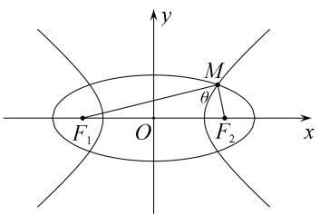
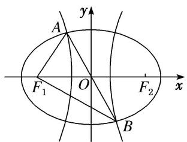

# 专题 05 共焦点椭圆、双曲线模型

秒杀结论 已知椭圆 $C_1: \frac{x^2}{a^2} + \frac{y^2}{b^2} = 1$ (其中 $a > b > 0$ ) 与双曲线 $C_2: \frac{x^2}{m^2} - \frac{y^2}{n^2} = 1$ (其中 $m > 0, n > 0$ ) 共焦点， $e_1, e_2$ 分别为 $C_1, C_2$ 的离心率， $M$ 是 $C_1, C_2$ 的一个交点， $\theta = \angle F_1MF_2$ ，则

I. $|MF_1| = a + m, |PF_2| = a - m;$ II. $\frac{\sin^2\frac{\theta}{2}}{e_1^2} + \frac{\cos^2\frac{\theta}{2}}{e_2^2} = 1.$

text_image

y
M
θ
F₁ O F₂ x

# 【方法技巧】

结论 I 的推导是用椭圆与双曲线的定义, 然后两式相加, 相减. 凡是已知公共焦点三角形中的一边 (焦半径) 或三边的比例关系 (可取特值, 特别是在直角三角形中), 然后使用结论 I: $\left|MF_{1}\right|=a+m$ , $\left|PF_{2}\right|=a-m$ , 找到 a, m, c 的关系, 从而解决问题. 可免去用椭圆与双曲线的定义, 节省时间. 关于结论 I 的记忆是长边加, 短边减, 椭圆的长半轴在前, 双曲线的实半轴在后.

结论II的推导是先用椭圆与双曲线的定义，然后用余弦定理，或用焦点三角形的面积相等。凡是已知公共焦点三角形中的顶角（或隐含如例2(6)，对点练5，6），然后使用结论II： $\frac{\sin^{2}\theta}{e_{1}^{2}}+\frac{\cos^{2}\theta}{e_{2}^{2}}=1$ ，可快速到 $e_{1}^{2},e_{2}^{2}$ 的关系，从而解决问题。如果求最值注意基本不等式的使用，如不能用基本不等式可利用三角换元转化为三角函数的最值(如例2(5)，对点练4，6)或用柯西不等式(选修4-5)。关于结论II的记忆类比平方关系，在正弦，余弦下分别加上椭圆与双曲线的离心率的平方。

# 【例题选讲】

[例 11] (59)椭圆与双曲线有公共焦点 $F_{1}$ , $F_{2}$ , 它们在第一象限的交点为 $A$ , 且 $AF_{1} \perp AF_{2}$ , $\angle AF_{1}F_{2}=30^{\circ}$ , 则椭圆与双曲线的离心率的倒数和为( )

A. $2 \sqrt{3}$

B. $\sqrt{3}$

C. 2

D. 1

(60)中心在原点的椭圆 $C_{1}$ 与双曲线 $C_{2}$ 具有相同的焦点， $F_{1}(-c,0)$ ， $F_{2}(c,0)$ ，P 为 $C_{1}$ 与 $C_{2}$ 在第一象限的交点， $|PF_{1}|=|F_{1}F_{2}|$ 且 $|PF_{2}|=3$ ，若椭圆 $C_{1}$ 的离心率 $e_{1}\in\left(\frac{2}{3},\frac{4}{5}\right)$ ，则双曲线的离心率 $e_{2}$ 的范围是()

A. $\begin{pmatrix}\frac{3}{2},\frac{5}{3}\end{pmatrix}$

B. $\left(\frac{5}{3},2\right)$

C. $\left(\frac{4}{3},2\right)$

D. $(2, 3)$

(61)已知中心在原点的椭圆与双曲线有公共焦点，左右焦点分别为 $F_{1}$ ， $F_{2}$ ，且两条曲线在第一象限的交点为 $P$ ， $\triangle PF_{1}F_{2}$ 是以 $PF_{1}$ 为底边的等腰三角形，若 $|PF_{1}| = 10$ ，椭圆与双曲线的离心率分别为 $e_{1}$ ， $e_{2}$ ，则 $e_{1}e_{2} + 1$ 的取值范围为（）

A. $(1, +\infty)$

B. $\left(\frac{4}{3},+\infty\right)$

C. $\left(\frac{6}{5},+\infty\right)$

D. $\left(\frac{10}{9},+\infty\right)$

# 【对点训练】

88. $F_{1}, F_{2}$ 是椭圆 $C_{1}$ 与双曲线 $C_{2}$ 的公共焦点， $A$ 是 $C_{1}, C_{2}$ 在第一象限的交点，且 $AF_{1} \perp AF_{2}, \angle AF_{1}F_{2} = \frac{\pi}{6}$ ，则 $C_{1}$ 与 $C_{2}$ 的离心率之积为（）

A. 2

B. $\sqrt{3}$

C. $\frac{1}{2}$

D. $\frac{\sqrt{3}}{2}$

89. 已知中心在原点的椭圆与双曲线有公共焦点，左右焦点分别为 $F_{1}, F_{2}$ ，且两条曲线在第一象限的交点为 $P$ ， $\triangle PF_{1}F_{2}$ 是以 $PF_{1}$ 为底边的等腰三角形，若双曲线的离心率为 3，则椭圆的离心率为（）

A. $\frac{3}{7}$

B. $\frac{4}{7}$

C. $\frac{5}{6}$

D. $\frac{9}{10}$

90. 已知有公共焦点的椭圆与双曲线的中心为原点，焦点在 $x$ 轴上，左、右焦点分别为 $F_{1} 、 F_{2}$ ，且它们在第一象限的交点为 $P$ ， $\triangle PF_{1}F_{2}$ 是以 $PF_{1}$ 为底边的等腰三角形。若 $|PF_{1}| = 10$ ，双曲线的离心率的取值范围为 $(1, 2)$ 。则该椭圆的离心率的取值范围是（）

A. $\left(\frac{1}{3},\frac{1}{2}\right)$

B. $\left(\frac{2}{5},\frac{1}{2}\right)$

C. $\left(\frac{1}{3},\frac{2}{5}\right)$

D. $\left(\frac{1}{2},1\right)$

91. 已知 $F_{1}$ , $F_{2}$ 是椭圆与双曲线的公共焦点, $P$ 是它们的一个公共点, 且 $|PF_{1}| > |PF_{2}|$ , 线段 $PF_{1}$ 的垂直平分线过 $F_{2}$ , 若椭圆的离心率为 $e_{1}$ , 双曲线的离心率为 $e_{2}$ , 则 $\frac{2}{e_{1}} + \frac{e_{2}}{2}$ 的最小值为 ( )

A. 6

B. 3

C. $\sqrt{6}$

D. $\sqrt{3}$

92. 如图, $F_{1}, F_{2}$ 是椭圆 $C_{1}$ 与双曲线 $C_{2}$ 的公共焦点, $A, B$ 分别是 $C_{1}, C_{2}$ 在第二、四象限的交点, 若 $AF_{1} \perp BF_{1}$ , 且 $\angle AF_{1}O = \frac{\pi}{3}$ , 则 $C_{1}$ 与 $C_{2}$ 的离心率之和为( )

text_image

A
y
F₁ O F₂ x
B

A. $2 \sqrt{3}$

B. 4

C. $2\sqrt{5}$

D. $2 \sqrt{6}$

[例 12] (62)已知椭圆、双曲线均是以直角三角形 ABC 的斜边 AC 的两端点为焦点的曲线，且都过 B 点，它们的离心率分别为 $e_{1}$ ， $e_{2}$ ，则 $\frac{1}{e_{1}^{2}} + \frac{1}{e_{2}^{2}} = (\quad)$

A. $\frac{3}{2}$

B. 2

C. $\frac{5}{2}$

D. 4

(63)(2013 浙江)已知 $F_{1}$ ， $F_{2}$ 为椭圆 $C_{1}:\frac{x^{2}}{4}+y^{2}=1$ 和双曲线 $C_{2}$ 的公共焦点，P 为它们的一个公共点，A，B 分别是 $C_{1}$ ， $C_{2}$ 在第二、四象限的交点，若四边形 $AF_{1}BF_{1}$ 为矩形，则 $C_{2}$ 的离心率是()

A. $\sqrt{2}$

B. $\sqrt{3}$

C. $\frac{3}{2}$

D. $\frac{\sqrt{6}}{2}$

(64)(2016 全国高中数学联赛四川预赛)已知 $F_{1}$ ， $F_{2}$ 为椭圆和双曲线的公共焦点，P 为它们的一个公共

点，且 $\angle F_{1}PF_{2} = \frac{\pi}{3}$ ，则该椭圆和双曲线的离心率之积的最小值为( )

A. $\frac{\sqrt{3}}{3}$

B. $\frac{\sqrt{3}}{2}$

C. 1

D. $\sqrt{3}$

(65)已知椭圆 $C_1: \frac{x^2}{a^2} + \frac{y^2}{b^2} = 1$ (其中 $a > b > 0$ ) 与双曲线 $C_2: \frac{x^2}{m^2} - \frac{y^2}{n^2} = 1$ (其中 $m > 0, n > 0$ ) 有相同的焦点 $F_1, F_2, P$ 是两曲线的一个公共点， $e_1, e_2$ 分别是两曲线的离心率，若 $PF_1 \perp PF_1$ ，则 $4e_1^2 + e_2^2$ 的最小值是（）

A. $\frac{5}{2}$

B. $\frac{7}{2}$

C. $\frac{9}{2}$

D. $\frac{11}{2}$

(66)(2014 湖北)已知 $F_{1}$ ， $F_{2}$ 是椭圆和双曲线的公共焦点，P 是它们的一个公共点，且 $\angle F_{1}PF_{2}=\frac{\pi}{3}$ ，则椭圆和双曲线的离心率的倒数之和的最大值为()

A. $\frac{4\sqrt{3}}{3}$

B. $\frac{2\sqrt{3}}{3}$

C. 3

D. 2

(67)(2016 浙江)已知椭圆 $C_{1}$ : $\frac{x^{2}}{m^{2}} + y^{2} = 1 (m > 1)$ 与双曲线 $C_{2}$ : $\frac{x^{2}}{n^{2}} - y^{2} = 1 (n > 0)$ 的焦点重合, $e_{1}, e_{2}$ 分别为 $C_{1}, C_{2}$ 的离心率, 则( )

A. $m > n$ 且 $e_1 e_2 > 1$

B. $m > n$ 且 $e_1 e_2 < 1$

C. $m < n$ 且 $e_1 e_2 > 1$

D. $m < n$ 且 $e_1 e_2 < 1$

# 【对点训练】

93. 已知椭圆和双曲线有共同的焦点 $F_{1}, F_{2}, P$ 是它们的一个交点，且 $\angle F_{1}PF_{2} = \frac{2\pi}{3}$ ，记椭圆和双曲线的离心率分别为 $e_{1}, e_{2}$ ，则 $\frac{3}{e_1^2} + \frac{1}{e_2^2}$ 等于（ ）

A. 4

B. $2 \sqrt{3}$

C. 2

D. 3

94. 已知圆锥曲线 $C_{1}: mx^{2} + ny^{2} = 1 (n > m > 0)$ 与 $C_{2}: px^{2} - qy^{2} = 1 (p > 0)$ 的公共焦点为 $F_{1}, F_{2}$ . 点 $M$ 为 $C_{1}, C_{2}$ 的一个公共点，且满足 $\angle F_{1}MF_{2} = 90^{\circ}$ ，若圆锥曲线 $C_{1}$ 的离心率为 $\frac{3}{4}$ ，则 $C_{2}$ 的离心率为（）

A. $\frac{9}{2}$

B. $\frac{3\sqrt{2}}{2}$

C. $\frac{3}{2}$

D. $\frac{5}{4}$

95. 已知椭圆 $\frac{x^2}{a^2} + \frac{y^2}{b^2} = 1 (a > b > 0)$ 与双曲线 $\frac{x^2}{m^2} - \frac{y^2}{n^2} = 1 (m > 0, n > 0)$ 具有相同焦点 $F_1, F_2$ ，且在第一象限交于点 $P$ ，椭圆与双曲线的离心率分别为 $e_1, e_2$ ，若 $\angle F_1PF_2 = \frac{\pi}{3}$ ，则 $e_1^2 + e_2^2$ 的最小值是（）

A. $\frac{2+\sqrt{3}}{2}$

B. $2 + \sqrt{3}$

C. $\frac{1 + 2\sqrt{3}}{2}$

D. $\frac{2 + \sqrt{3}}{4}$

96. 已知 $F_{1}, F_{2}$ 是椭圆和双曲线的公共焦点, $P$ 是它们的一个公共点, 且 $\angle F_{1}PF_{2} = \theta$ , $\cos \theta = \frac{4}{5}$ , 则椭圆和双曲线的离心率的倒数之和的最大值为( )

A. $\frac{4}{3}$

B. $\frac{10}{3}$

C. $\frac{5}{3}$

D. $\frac{7}{3}$

97. 已知椭圆 $C_1: \frac{x^2}{m^2} + \frac{y^2}{4b^2} = 1$ (其中 $m > 2b > 0$ ) 与双曲线 $C_2: \frac{x^2}{n^2} - \frac{y^2}{b^2} = 1$ (其中 $n > 0, b > 0$ ) 的焦点重合， $e_1, e_2$ 分别为 $C_1, C_2$ 的离心率，则（）

A. $m > n$ 且 $e_1 e_2 \geq \frac{4}{5}$

B. $m > n$ 且 $e_1 e_2 \leq \frac{4}{5}$

C. $m < n$ 且 $e_1 e_2 \geq \frac{4}{5}$

D. $m < n$ 且 $e_1 e_2 \leq \frac{4}{5}$

98. (2014 全国高中数学联赛湖北预赛)已知椭圆和双曲线有共同的焦点 $F_{1}$ , $F_{2}$ , 记椭圆和双曲线的离心率分别为 $e_{1}$ , $e_{2}$ , 若椭圆的短轴长是和双曲线虚轴长的 2 倍, 则 $\frac{1}{e_{1}} + \frac{1}{e_{2}}$ 的最大值为( )

A. 4

B. $2 \sqrt{3}$

C. $\frac{1}{2}$

D. $\frac{5}{2}$

