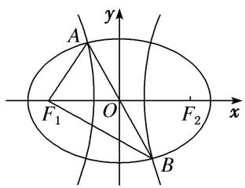
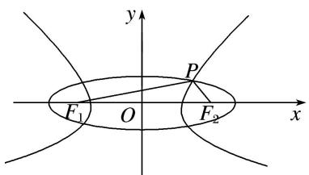

# 专题 05 共焦点椭圆、双曲线模型

秒杀结论 已知椭圆 $C_1: \frac{x^2}{a^2} + \frac{y^2}{b^2} = 1$ (其中 $a > b > 0$ ) 与双曲线 $C_2: \frac{x^2}{m^2} - \frac{y^2}{n^2} = 1$ (其中 $m > 0, n > 0$ ) 共焦点， $e_1, e_2$ 分别为 $C_1, C_2$ 的离心率， $M$ 是 $C_1, C_2$ 的一个交点， $\theta = \angle F_1MF_2$ ，则

I. $|MF_1| = a + m, |PF_2| = a - m;$ II. $\frac{\sin^2\frac{\theta}{2}}{e_1^2} + \frac{\cos^2\frac{\theta}{2}}{e_2^2} = 1.$

# 【方法技巧】

结论 I 的推导是用椭圆与双曲线的定义, 然后两式相加, 相减. 凡是已知公共焦点三角形中的一边 (焦半径) 或三边的比例关系 (可取特值, 特别是在直角三角形中), 然后使用结论 I: $\left|MF_{1}\right|=a+m$ , $\left|PF_{2}\right|=a-m$ , 找到 a, m, c 的关系, 从而解决问题. 可免去用椭圆与双曲线的定义, 节省时间. 关于结论 I 的记忆是长边加, 短边减, 椭圆的长半轴在前, 双曲线的实半轴在后.

结论II的推导是先用椭圆与双曲线的定义，然后用余弦定理，或用焦点三角形的面积相等。凡是已知公共焦点三角形中的顶角（或隐含如例2(6)，对点练5，6），然后使用结论II： $\frac{\sin^{2}\theta}{e_{1}^{2}}+\frac{\cos^{2}\theta}{e_{2}^{2}}=1$ ，可快速到 $e_{1}^{2},e_{2}^{2}$ 的关系，从而解决问题。如果求最值注意基本不等式的使用，如不能用基本不等式可利用三角换元转化为三角函数的最值(如例2(5)，对点练4，6)或用柯西不等式(选修4-5)。关于结论II的记忆类比平方关系，在正弦，余弦下分别加上椭圆与双曲线的离心率的平方。

# 【例题选讲】

[例 11] （59）椭圆与双曲线有公共焦点 $F_{1}$ , $F_{2}$ , 它们在第一象限的交点为 $A$ , 且 $AF_{1} \perp AF_{2}$ , $\angle AF_{1}F_{2}=30^{\circ}$ , 则椭圆与双曲线的离心率的倒数和为( )

A. $2 \sqrt{3}$

B. $\sqrt{3}$

C. 2

D. 1
答案 B 秒杀 设椭圆方程为： $\frac{x^{2}}{a^{2}}+\frac{y^{2}}{b^{2}}=1(a>b>0)$ ，双曲线方程为 $\frac{x^{2}}{m^{2}}-\frac{y^{2}}{n^{2}}=1(m>0,\ n>0)$ ，根据题意，可设 $|AF_{1}|=\sqrt{3}$ ， $|AF_{2}|=1$ ， $|F_{1}F_{2}|=2$ ，则 $a+m=\sqrt{3}$ ，a-m=1，∴ $\frac{1}{e_{1}}+\frac{1}{e_{2}}=\frac{a}{c}+\frac{m}{c}=\frac{a+m}{c}=\sqrt{3}$ 。故选B.  
（60）中心在原点的椭圆 $C_1$ 与双曲线 $C_2$ 具有相同的焦点， $F_1(-c, 0)$ ， $F_2(c, 0)$ ， $P$ 为 $C_1$ 与 $C_2$ 在第一象限的交点， $|PF_1| = |F_1F_2|$ 且 $|PF_2| = 3$ ，若椭圆 $C_1$ 的离心率 $e_1 \in \begin{pmatrix} \frac{2}{3}, & \frac{4}{5} \end{pmatrix}$ ，则双曲线的离心率 $e_2$ 的范围是（）

A. $\left(\frac{3}{2},\frac{5}{3}\right)$

B. $\left(\frac{5}{3},2\right)$

C. $\left(\frac{4}{3},2\right)$

D. $(2, 3)$
答案 C 秒杀 设椭圆方程为： $\frac{x^{2}}{a^{2}}+\frac{y^{2}}{b^{2}}=1(a>b>0)$ ，设双曲线方程为 $\frac{x^{2}}{m^{2}}-\frac{y^{2}}{n^{2}}=1(m>0,\ n>0)$ ，由题意

有， $a+m=2c,\quad a-m=3$ ，所以 m=2c-a，又 $e_{2}=\frac{c}{m}=\frac{c}{2c-a}=\frac{1}{2-\frac{1}{e_{1}}}$ ，因为 $e_{1}\in\left(\frac{2}{3},\frac{4}{5}\right)$ ，所以 $\frac{1}{e_{1}}\in\left(\frac{5}{4},\frac{3}{2}\right)$ ，
所以 $e_{2}\in\left(\frac{4}{3},2\right)$ .  
（61）已知中心在原点的椭圆与双曲线有公共焦点，左右焦点分别为 $F_{1}$ ， $F_{2}$ ，且两条曲线在第一象限的交点为 $P$ ， $\triangle PF_{1}F_{2}$ 是以 $PF_{1}$ 为底边的等腰三角形，若 $|PF_{1}| = 10$ ，椭圆与双曲线的离心率分别为 $e_{1}$ ， $e_{2}$ ，则 $e_{1}e_{2} + 1$ 的取值范围为（）

A. $(1, +\infty)$

B. $\left(\frac{4}{3},+\infty\right)$

C. $\left(\frac{6}{5},+\infty\right)$

D. $\left(\frac{10}{9},+\infty\right)$
答案 B 秒杀 设椭圆方程为： $\frac{x^{2}}{a^{2}}+\frac{y^{2}}{b^{2}}=1(a>b>0)$ ，设双曲线方程为 $\frac{x^{2}}{m^{2}}-\frac{y^{2}}{n^{2}}=1(m>0,\ n>0)$ ，由题意有， $a+m=10,\ a-m=2c$ ，所以 $a=5+c,\ m=5-c,\ c>\frac{5}{2}$ ，又 $e_{1}e_{2}+1=\frac{c^{2}}{am}+1=\frac{c^{2}}{25-c^{2}}+1>\frac{4}{3}$ 。故选 B.

# 【对点训练】

88. $F_{1}$ , $F_{2}$ 是椭圆 $C_{1}$ 与双曲线 $C_{2}$ 的公共焦点, $A$ 是 $C_{1}$ , $C_{2}$ 在第一象限的交点, 且 $AF_{1} \perp AF_{2}$ , $\angle AF_{1}F_{2} = \frac{\pi}{6}$ , 则 $C_{1}$ 与 $C_{2}$ 的离心率之积为( )

A. 2

B. $\sqrt{3}$

C. $\frac{1}{2}$

D. $\frac{\sqrt{3}}{2}$

88. 答案 A 秒杀 设椭圆方程为： $\frac{x^{2}}{a^{2}}+\frac{y^{2}}{b^{2}}=1(a>b>0)$ ，双曲线方程为 $\frac{x^{2}}{m^{2}}-\frac{y^{2}}{n^{2}}=1(m>0,n>0)$ ，根据题意，可设 $|AF_{1}|=\sqrt{3}$ ， $|AF_{2}|=1$ ， $|F_{1}F_{2}|=2$ ，则 $a+m=\sqrt{3}$ ，a-m=1，∴ $a=\frac{\sqrt{3}+1}{2}$ ， $m=\frac{\sqrt{3}-1}{2}$ ，∴ $e_{1}e_{2}=\frac{c^{2}}{am}=2$ 。故选A。

89. 已知中心在原点的椭圆与双曲线有公共焦点，左右焦点分别为 $F_{1}, F_{2}$ ，且两条曲线在第一象限的交点为 $P$ ， $\triangle PF_{1}F_{2}$ 是以 $PF_{1}$ 为底边的等腰三角形，若双曲线的离心率为 3，则椭圆的离心率为（）

A. $\frac{3}{7}$

B. $\frac{4}{7}$

C. $\frac{5}{6}$

D. $\frac{9}{10}$

89. 答案 A 秒杀 设椭圆方程为： $\frac{x^{2}}{a^{2}}+\frac{y^{2}}{b^{2}}=1(a>b>0)$ ，双曲线方程为 $\frac{x^{2}}{m^{2}}-\frac{y^{2}}{n^{2}}=1(m>0,n>0)$ ，根据题意，a-m=2c, $\frac{c}{m}=3$ , $\therefore\frac{c}{a}=\frac{c}{m+2c}=\frac{3}{7}$ . 故选 A.

90. 已知有公共焦点的椭圆与双曲线的中心为原点, 焦点在 $x$ 轴上, 左、右焦点分别为 $F_{1} 、 F_{2}$ , 且它们在第一象限的交点为 $P$ , $\triangle PF_{1}F_{2}$ 是以 $PF_{1}$ 为底边的等腰三角形. 若 $|PF_{1}| = 10$ , 双曲线的离心率的取值范围为(1, 2). 则该椭圆的离心率的取值范围是( )

A. $\left(\frac{1}{3},\frac{1}{2}\right)$

B. $\left(\frac{2}{5},\frac{1}{2}\right)$

C. $\left(\frac{1}{3},\frac{2}{5}\right)$

D. $\left(\frac{1}{2},1\right)$

90. 答案 C 秒杀 设椭圆方程为： $\frac{x^{2}}{a^{2}}+\frac{y^{2}}{b^{2}}=1(a>b>0)$ ，设双曲线方程为 $\frac{x^{2}}{m^{2}}-\frac{y^{2}}{n^{2}}=1(m>0,n>0)$ ，由题意有， $a+m=10,\quad a-m=2c$ ，所以 $a=5+c,\quad m=5-c$ ，因为双曲线的离心率的取值范围为(1,2)，所

以 $1 < \frac{c}{5 - c} < 2$ ， $\therefore \frac{5}{2} < c < \frac{10}{3}$ ， $\because$ 椭圆的离心率 $e = \frac{c}{a} = \frac{c}{c + 5} = 1 - \frac{5}{c + 5}$ ，且 $\frac{1}{3} < 1 - \frac{5}{c + 5} < \frac{2}{5}$ ， $\therefore$ 该椭圆的离心率的取值范围是 $(\frac{1}{3}, \frac{2}{5})$ 。

91. 已知 $F_{1}$ , $F_{2}$ 是椭圆与双曲线的公共焦点, $P$ 是它们的一个公共点, 且 $|PF_{1}| > |PF_{2}|$ , 线段 $PF_{1}$ 的垂直平分线过 $F_{2}$ , 若椭圆的离心率为 $e_{1}$ , 双曲线的离心率为 $e_{2}$ , 则 $\frac{2}{e_{1}} + \frac{e_{2}}{2}$ 的最小值为 ( )

A. 6

B. 3

C. $\sqrt{6}$

D. $\sqrt{3}$

91. 答案 A 通解 设椭圆的长半轴长为 $a$ ，双曲线的半实轴长为 $a'$ ，半焦距为 $c$ ，依题意知
$\left\{ \begin{array}{l} |PF_{1}| + |PF_{2}| = 2a, \\ |PF_{1}| - |PF_{2}| = 2a', \\ |PF_{2}| = |F_{1}F_{2}| = 2c, \end{array} \right.$ $\therefore 2a = 2a' + 4c,\therefore \frac{2}{e_1} +\frac{e_2}{2} = \frac{2a}{c} +\frac{c}{2a'} = \frac{2a' + 4c}{c} +\frac{c}{2a'} = \frac{2a'}{c} +\frac{c}{2a'} +4\geq 2 + 4 = 6,$ 当

且仅当 $c=2a'$ 时取“=”，故选 A.

秒杀 设椭圆方程为： $\frac{x^{2}}{a^{2}}+\frac{y^{2}}{b^{2}}=1(a>b>0)$ ，双曲线方程为 $\frac{x^{2}}{m^{2}}-\frac{y^{2}}{n^{2}}=1(m>0,n>0)$ ，根据题意，a-m=2c， $\therefore a=m+2c,\quad\therefore\frac{2}{e_{1}}+\frac{e_{2}}{2}=\frac{2a}{c}+\frac{c}{2m}=\frac{2m+4c}{c}+\frac{c}{2m}=\frac{2m}{c}+\frac{c}{2m}+4\geq2+4=6$ ，当且仅当c=2m时取“=”，故选A.

92. 如图, $F_{1}, F_{2}$ 是椭圆 $C_{1}$ 与双曲线 $C_{2}$ 的公共焦点, $A, B$ 分别是 $C_{1}, C_{2}$ 在第二、四象限的交点, 若 $AF_{1} \perp BF_{1}$ , 且 $\angle AF_{1}O = \frac{\pi}{3}$ , 则 $C_{1}$ 与 $C_{2}$ 的离心率之和为( )

A. $2 \sqrt{3}$

B. 4

C. $2\sqrt{5}$

D. $2\sqrt{6}$

92. 答案 A 通解 设椭圆方程为 $\frac{x^2}{a^2} + \frac{y^2}{b^2} = 1 (a > b > 0)$ ，由双曲线和椭圆的对称性可知， $A, B$ 关于原点对称，又 $AF_1 \perp BF_1$ ，且 $\angle AF_1O = \frac{\pi}{3}$ ，故 $|AF_1| = |OF_1| = |OA| = |OB| = c$ ， $\therefore A\left(-\frac{c}{2}, \frac{\sqrt{3}}{2}c\right)$ ，代入椭圆方程 $\frac{x^2}{a^2} + \frac{y^2}{b^2} = 1$ ，结合 $b^2 = a^2 - c^2$ 及 $e = \frac{c}{a}$ ，整理可得， $e^4 - 8e^2 + 4 = 0$ ， $\because 0 < e < 1$ ， $\therefore e^2 = 4 - 2\sqrt{3} = (\sqrt{3} - 1)^2$ ， $\therefore e = \sqrt{3} - 1$ 。同理可求得双曲线的离心率 $e_1 = \sqrt{3} + 1$ ， $\therefore e + e_1 = 2\sqrt{3}$ 。

秒杀 设椭圆方程为： $\frac{x^{2}}{a^{2}}+\frac{y^{2}}{b^{2}}=1(a>b>0)$ ，双曲线方程为 $\frac{x^{2}}{m^{2}}-\frac{y^{2}}{n^{2}}=1(m>0,\ n>0)$ ，根据题意，可设 $|AF_{1}|=1,\ |AF_{2}|=\sqrt{3},\ |F_{1}F_{2}|=2$ ，则 $a+m=\sqrt{3},\ a-m=1,\therefore e+e_{1}=\frac{c}{a}+\frac{c}{m}=\frac{c(a+m)}{am}=2\sqrt{3}$ 。故选A.

# 【例题选讲】

[例 12] （62）已知椭圆、双曲线均是以直角三角形 ABC 的斜边 AC 的两端点为焦点的曲线，且都过 B点，它们的离心率分别为 $e_{1}$ ， $e_{2}$ ，则 $\frac{1}{e_{1}^{2}} + \frac{1}{e_{2}^{2}} = (\quad)$

A. $\frac{3}{2}$

B. 2

C. $\frac{5}{2}$

D. 4
答案 B 通解 以 AC 边所在的直线为 x 轴，AC 中垂线所在的直线为 y 轴建立直角坐标系(图略)，设椭圆方程为 $\frac{x^{2}}{a_{1}^{2}} + \frac{y^{2}}{b_{1}^{2}} = 1$ ，设双曲线方程为 $\frac{x^{2}}{a_{2}^{2}} - \frac{y^{2}}{b_{2}^{2}} = 1$ ，焦距都为 2c，不妨设 $|AB| > |BC|$ ，椭圆和双曲线都过点 B，则 $|AB| + |BC| = 2a_{1}$ ， $|AB| - |BC| = 2a_{2}$ ，所以 $|AB| = a_{1} + a_{2}$ ， $|BC| = a_{1} - a_{2}$ ，又因为 $\triangle ABC$ 为直角三角形， $|AC| = 2c$ ，所以 $(a_{1} + a_{2})^{2} + (a_{1} - a_{2})^{2} = (2c)^{2}$ ，即 $a_{1}^{2} + a_{2}^{2} = 2c^{2}$ ，所以 $\frac{a_{1}^{2}}{c^{2}} + \frac{a_{2}^{2}}{c^{2}} = 2$ ，即 $\frac{1}{e_{1}^{2}} + \frac{1}{e_{2}^{2}} = 2$ 。故选 B.

秒杀 由已知 $\frac{\theta}{2} = \frac{\pi}{4}$ ，又由 $\frac{\sin^2\frac{\theta}{2}}{e_1^2} + \frac{\cos^2\frac{\theta}{2}}{e_2^2} = 1$ ，得 $\frac{1}{e_1^2} + \frac{1}{e_2^2} = 2$ 。故选 B.  
（63）(2013 浙江)已知 $F_{1}, F_{2}$ 为椭圆 $C_{1}: \frac{x^{2}}{4} + y^{2} = 1$ 和双曲线 $C_{2}$ 的公共焦点， $P$ 为它们的一个公共点， $A, B$ 分别是 $C_{1}, C_{2}$ 在第二、四象限的交点，若四边形 $AF_{1}BF_{1}$ 为矩形，则 $C_{2}$ 的离心率是（）

A. $\sqrt{2}$

B. $\sqrt{3}$

C. $\frac{3}{2}$

D. $\frac{\sqrt{6}}{2}$
答案 D 秒杀 由已知 $\frac{\theta}{2} = \frac{\pi}{4}$ ，又由 $\frac{\sin^2\frac{\theta}{2}}{e_1^2} + \frac{\cos^2\frac{\theta}{2}}{e_2^2} = 1$ ，得 $\frac{1}{e_1^2} + \frac{1}{e_2^2} = 2$ ，又 $e_1 = \frac{\sqrt{3}}{2}$ ， $\therefore e_2 = \frac{\sqrt{6}}{2}$ ，故选 D.  
（64）(2016 全国高中数学联赛四川预赛)已知 $F_{1}$ ， $F_{2}$ 为椭圆和双曲线的公共焦点，P 为它们的一个公共点，且 $\angle F_{1}PF_{2}=\frac{\pi}{3}$ ，则该椭圆和双曲线的离心率之积的最小值为()

A. $\frac{\sqrt{3}}{3}$

B. $\frac{\sqrt{3}}{2}$

C. 1

D. $\sqrt{3}$
答案 B 秒杀 由已知 $\frac{\theta}{2} = \frac{\pi}{6}$ ，又由 $\frac{\sin^2\frac{\theta}{2}}{e_1^2} + \frac{\cos^2\frac{\theta}{2}}{e_2^2} = 1$ ，得 $\frac{1}{e_1^2} + \frac{3}{e_2^2} = 4$ ， $4 = \frac{1}{e_1^2} + \frac{3}{e_2^2} > \frac{2\sqrt{3}}{e_1 e_2}$ ， $e_1 e_2 \geq \frac{\sqrt{3}}{2}$ （当且仅当 $e_2 = \sqrt{3} e_1$ 时取等号），故选 B.  
（65）已知椭圆 $C_1: \frac{x^2}{a^2} + \frac{y^2}{b^2} = 1$ (其中 $a > b > 0$ ) 与双曲线 $C_2: \frac{x^2}{m^2} - \frac{y^2}{n^2} = 1$ (其中 $m > 0, n > 0$ ) 有相同的焦点 $F_1, F_2, P$ 是两曲线的一个公共点， $e_1, e_2$ 分别是两曲线的离心率，若 $PF_1 \perp PF_1$ ，则 $4e_1^2 + e_2^2$ 的最小值是（）

A. $\frac{5}{2}$

B. $\frac{7}{2}$

C. $\frac{9}{2}$

D. $\frac{11}{2}$
答案 C 秒杀 由已知 $\frac{\theta}{2} = \frac{\pi}{4}$ ，又由 $\frac{\sin^2\frac{\theta}{2}}{e_1^2} + \frac{\cos^2\frac{\theta}{2}}{e_2^2} = 1$ ，得 $\frac{1}{e_1^2} + \frac{1}{e_2^2} = 2$ ， $4e_1^2 + e_2^2 = \frac{1}{2}(4e_1^2 + e_2^2)(\frac{1}{e_1^2} + \frac{1}{e_2^2}) = \frac{5}{2} + \frac{1}{2}\left(\frac{e_2^2}{e_1^2} + \frac{4e_1^2}{e_2^2}\right) \geq \frac{9}{2}$ (当且仅当 $e_2^2 = 2e_1^2$ 时取等号)，故选 C.  
（66）(2014 湖北)已知 $F_{1}$ ， $F_{2}$ 是椭圆和双曲线的公共焦点，P 是它们的一个公共点，且 $\angle F_{1}PF_{2}=\frac{\pi}{3}$ ，则椭圆和双曲线的离心率的倒数之和的最大值为( )

A. $\frac{4\sqrt{3}}{3}$

B. $\frac{2\sqrt{3}}{3}$

C. 3

D. 2
答案 A 秒杀 由已知 $\frac{\theta}{2} = \frac{\pi}{6}$ ，又由 $\frac{\sin^2\frac{\theta}{2}}{e_1^2} + \frac{\cos^2\frac{\theta}{2}}{e_2^2} = 1$ ，得 $\frac{1}{e_1^2} + \frac{3}{e_2^2} = 4$ ，可利用三角换元 $\frac{1}{e_1} = 2\cos \theta$ ， $\frac{\sqrt{3}}{e_2} = 2\sin \theta$ ，则 $\frac{1}{e_1} + \frac{1}{e_2} = \frac{4\sqrt{3}}{3}\sin (\theta + \varphi) \leq \frac{4\sqrt{3}}{3}$ 。故选 A.  
（67）(2016 浙江)已知椭圆 $C_{1}$ : $\frac{x^{2}}{m^{2}} + y^{2} = 1 (m > 1)$ 与双曲线 $C_{2}$ : $\frac{x^{2}}{n^{2}} - y^{2} = 1 (n > 0)$ 的焦点重合, $e_{1}, e_{2}$ 分别为 $C_{1}, C_{2}$ 的离心率, 则( )

A. $m > n$ 且 $e_1 e_2 > 1$

B. $m > n$ 且 $e_1 e_2 < 1$

C. $m < n$ 且 $e_1 e_2 > 1$

D. $m <   n$ 且 $e_1e_2 <   1$
答案 A 通解 由于 $m^2 - 1 = c^2$ ， $n^2 + 1 = c^2$ ，则 $m^2 - n^2 = 2$ ，故 $m > n$ ，又 $(e_1 e_2)^2 = \frac{m^2 - 1}{m^2} \cdot \frac{n^2 + 1}{n^2} = \frac{n^2 + 1}{n^2 + 2} \cdot \frac{n^2 + 1}{n^2} = \frac{n^4 + 2n^2 + 1}{n^4 + 2n^2} = 1 + \frac{1}{n^4 + 2n^2} > 1$ ， $\therefore e_1 e_2 > 1$ 。故选 A.

秒杀 由椭圆和双曲线焦点三角形面积公式得， $b^{2}\tan\frac{\theta}{2}=b^{2}\frac{1}{\tan\frac{\theta}{2}}$ ，即， $\tan\frac{\theta}{2}=\frac{1}{\tan\frac{\theta}{2}}$ ，解得 $\theta=\frac{\pi}{2}$ 。 $\therefore\frac{1}{e_{1}^{2}}+\frac{1}{e_{2}^{2}}=2$ ，因为 $e_{1}\neq e_{2}$ ， $\therefore2=\frac{1}{e_{1}^{2}}+\frac{1}{e_{2}^{2}}>\frac{2}{e_{1}e_{2}}$ ， $\therefore e_{1}e_{2}>1$ 。故选A。

# 【对点训练】

93. 已知椭圆和双曲线有共同的焦点 $F_{1}, F_{2}, P$ 是它们的一个交点，且 $\angle F_{1}PF_{2} = \frac{2\pi}{3}$ ，记椭圆和双曲线的离心率分别为 $e_{1}, e_{2}$ ，则 $\frac{3}{e_1^2} + \frac{1}{e_2^2}$ 等于（ ）

A. 4

B. $2\sqrt{3}$

C. 2

D. 3

93. 答案 A 通解 如图所示，设椭圆的长半轴长为 $a_1$ ，双曲线的实半轴长为 $a_2$ ，则根据椭圆及双曲线的定义： $|PF_1| + |PF_2| = 2a_1$ ， $|PF_1| - |PF_2| = 2a_2$ ， $\therefore |PF_1| = a_1 + a_2$ ， $|PF_2| = a_1 - a_2$ ，设 $|F_1F_2| = 2c$ ， $\angle F_1PF_2 = \frac{2\pi}{3}$ ，则在 $\triangle PF_1F_2$ 中，由余弦定理得 $4c^2 = (a_1 + a_2)^2 + (a_1 - a_2)^2 - 2(a_1 + a_2)(a_1 - a_2)\cos \frac{2\pi}{3}$ ，化简得 $3a_1^2 + a_2^2 = 4c^2$ ，该式可变成 $\frac{3}{e_1^2} + \frac{1}{e_2^2} = 4$ 。故选 A.

秒杀 由已知 $\frac{\theta}{2} = \frac{\pi}{3}$ ，又由 $\frac{\sin^2\frac{\theta}{2}}{e_1^2} + \frac{\cos^2\frac{\theta}{2}}{e_2^2} = 1$ ，得 $\frac{3}{e_1^2} + \frac{1}{e_2^2} = 4$ 。故选A.

94. 已知圆锥曲线 $C_1: mx^2 + ny^2 = 1 (n > m > 0)$ 与 $C_2: px^2 - qy^2 = 1 (p > 0)$ 的公共焦点为 $F_1, F_2$ . 点 $M$ 为 $C_1, C_2$ 的一个公共点，且满足 $\angle F_{1}MF_{2}=90^{\circ}$ ，若圆锥曲线 $C_{1}$ 的离心率为 $\frac{3}{4}$ ，则 $C_{2}$ 的离心率为( )

A. $\frac{9}{2}$

B. $\frac{3\sqrt{2}}{2}$

C. $\frac{3}{2}$

D. $\frac{5}{4}$

94. 答案 B 通解 $C_{1}:\frac{x^{2}}{\underline{1}} +\frac{y^{2}}{\underline{1}} = 1$ ， $C_2:\frac{x^2 - y^2}{\underline{1} - \underline{1}} = 1$ 设 $a_1 = \sqrt{\frac{1}{m}}, a_2 = \sqrt{\frac{1}{p}}, MF_1 = s, MF_2 = t$ ，由椭圆的定义可得 $s + t = 2a_{1}$ ，由双曲线的定义可得 $s - t = 2a_{2}$ ，解得 $s = a_{1} + a_{2}, t = a_{1} - a_{2}$ ，由 $\angle F_{1}MF_{2} = 90^{\circ}$ 运用勾股定理，可得 $s^2 +t^2 = 4c^2$ ，即为 $a_1^2 +a_2^2 = 2c^2$ ，由离心率的公式可得， $\frac{1}{\mathrm{e}_1^2} +\frac{1}{\mathrm{e}_2^2} = 2,\because e_1 = \frac{3}{4},\therefore e_2^2$ $= \frac{9}{2}$ ，则 $e_2 = \frac{3\sqrt{2}}{2}$ 故选B.

秒杀 由已知 $\frac{\theta}{2} = \frac{\pi}{4}$ ，又由 $\frac{\sin^2\theta}{e_1^2} + \frac{\cos^2\theta}{e_2^2} = 1$ ，得 $\frac{1}{e_1^2} + \frac{1}{e_2^2} = 2$ ， $\because e_1 = \frac{3}{4}$ ， $\therefore e_2^2 = \frac{9}{2}$ ，则 $e_2 = \frac{3\sqrt{2}}{2}$ ，故选B.

95. 已知椭圆 $\frac{x^2}{a^2} + \frac{y^2}{b^2} = 1 (a > b > 0)$ 与双曲线 $\frac{x^2}{m^2} - \frac{y^2}{n^2} = 1 (m > 0, n > 0)$ 具有相同焦点 $F_1, F_2$ ，且在第一象限交于点 $P$ ，椭圆与双曲线的离心率分别为 $e_1, e_2$ ，若 $\angle F_1PF_2 = \frac{\pi}{3}$ ，则 $e_1^2 + e_2^2$ 的最小值是（）

A. $\frac{2 + \sqrt{3}}{2}$

B. $2 + \sqrt{3}$

C. $\frac{1 + 2\sqrt{3}}{2}$

D. $\frac{2+\sqrt{3}}{4}$

95. 答案 A 通解根据题意，可知 $|PF_{1}|+|PF_{2}|=2a,\quad|PF_{1}|-|PF_{2}|=2m$ ，解得 $|PF_{1}|=a+m,\quad|PF_{2}|=a-m$ ，根据余弦定理，可知 $(2c)^{2}=(a+m)^{2}+(a-m)^{2}-2(a+m)(a-m)\cos\frac{\pi}{3}$ ，整理得 $c^{2}=\frac{a^{2}+3m^{2}}{4}$ ，所以 $e_{1}^{2}+e_{2}^{2}=\frac{c^{2}}{a^{2}}+\frac{c^{2}}{m^{2}}=\frac{a^{2}+3m^{2}}{4a^{2}}+\frac{a^{2}+3m^{2}}{4m^{2}}=1+\frac{1}{4}\left(\frac{3m^{2}}{a^{2}}+\frac{a^{2}}{m^{2}}\right)\geq1+\frac{\sqrt{3}}{2}=\frac{2+\sqrt{3}}{2}$ （当且仅当 $a^{2}=\sqrt{3}m^{2}$ 时取等号），故选A. 秒杀由已知 $\frac{\theta}{2}=\frac{\pi}{6}$ ，又由 $\frac{\sin^{2}\theta}{e_{1}^{2}}+\frac{\cos^{2}\theta}{e_{2}^{2}}=1$ ，得 $\frac{1}{e_{1}^{2}}+\frac{3}{e_{2}^{2}}=4,\quad e_{1}^{2}+e_{2}^{2}=\frac{1}{4}(e_{1}^{2}+e_{2}^{2})(\frac{1}{e_{1}^{2}}+\frac{3}{e_{2}^{2}})=1+\frac{1}{4}\left(\frac{e_{2}^{2}}{e_{1}^{2}}+\frac{3e_{1}^{2}}{e_{2}^{2}}\right)\geq1+\frac{\sqrt{3}}{2}=\frac{2+\sqrt{3}}{2}$ （当且仅当 $e_{2}^{2}=3e_{1}^{2}$ 时取等号），故选A.

96. 已知 $F_{1}, F_{2}$ 是椭圆和双曲线的公共焦点， $P$ 是它们的一个公共点，且 $\angle F_{1}PF_{2} = \theta, \cos \theta = \frac{4}{5}$ ，则椭圆和双曲线的离心率的倒数之和的最大值为（）

A. $\frac{4}{3}$

B. $\frac{10}{3}$

C. $\frac{5}{3}$

D. $\frac{7}{3}$

96. 答案 B 秒杀 由 $\frac{\sin^2\theta}{e_1^2} + \frac{\cos^2\theta}{e_2^2} = 1$ ，得 $\frac{1}{e_1^2} + \frac{9}{e_2^2} = 10$ ，可利用三角换元 $\frac{1}{e_1} = \sqrt{10}\cos \theta$ ， $\frac{1}{e_2} = \frac{\sqrt{10}}{3}\sin \theta$ ，则 $\frac{1}{e_1} + \frac{1}{e_2} = \frac{10}{3}\sin (\theta + \varphi) \leq \frac{10}{3}$ . 故选 B.

97. 已知椭圆 $C_{1}$ : $\frac{x^{2}}{m^{2}} + \frac{y^{2}}{4b^{2}} = 1$ (其中 $m > 2b > 0$ ) 与双曲线 $C_{2}$ : $\frac{x^{2}}{n^{2}} - \frac{y^{2}}{b^{2}} = 1$ (其中 $n > 0, b > 0$ ) 的焦点重合, $e_{1}$ ,
$e_{2}$ 分别为 $C_{1}$ ， $C_{2}$ 的离心率，则()

A. $m > n$ 且 $e_1 e_2 \geq \frac{4}{5}$

B. $m > n$ 且 $e_1 e_2 \leq \frac{4}{5}$

C. $m < n$ 且 $e_1 e_2 \geq \frac{4}{5}$

D. $m < n$ 且 $e_1 e_2 \leq \frac{4}{5}$

97. 答案 A 秒杀 由椭圆和双曲线焦点三角形面积公式得， $b^{2}\tan\frac{\theta}{2}=b^{2}\frac{1}{\tan\frac{\theta}{2}}$ ，即， $4\tan\frac{\theta}{2}=\frac{1}{\tan\frac{\theta}{2}}$ ，解得 $\tan\frac{\theta}{2}=\frac{1}{2}$ 。 $\therefore\frac{1}{e_{1}^{2}}+\frac{4}{e_{2}^{2}}=5,\therefore5=\frac{1}{e_{1}^{2}}+\frac{4}{e_{2}^{2}}\geq2\sqrt{\frac{4}{e_{1}^{2}e_{2}^{2}}}\geq\frac{4}{e_{1}e_{2}},\therefore5\geq\frac{4}{e_{1}e_{2}}$ ，当且仅当 $2e_{1}=e_{2}$ 时，等号成立。 $\therefore e_{1}e_{2}\geq\frac{4}{5}$ 。故选 A.

98. (2014 全国高中数学联赛湖北预赛)已知椭圆和双曲线有共同的焦点 $F_{1}$ , $F_{2}$ , 记椭圆和双曲线的离心率分别为 $e_{1}$ , $e_{2}$ , 若椭圆的短轴长是和双曲线虚轴长的 2 倍, 则 $\frac{1}{e_{1}} + \frac{1}{e_{2}}$ 的最大值为( )

A. 4

B. $2 \sqrt{3}$

C. $\frac{1}{2}$

D. $\frac{5}{2}$

98. 答案 D 秒杀 由椭圆和双曲线焦点三角形面积公式得， $b^{2}\tan\frac{\theta}{2}=b^{2}\frac{1}{\tan\frac{\theta}{2}}$ ，即， $4\tan\frac{\theta}{2}=\frac{1}{\tan\frac{\theta}{2}}$ ，解得 $\tan\frac{\theta}{2}=\frac{1}{2}$ 。∴ $\frac{1}{e_{1}^{2}}+\frac{4}{e_{2}^{2}}=5$ ，可利用三角换元 $\frac{1}{e_{1}}=\sqrt{5}\cos\theta,\quad\frac{2}{e_{2}}=\sqrt{5}\sin\theta$ ，则 $\frac{1}{e_{1}}+\frac{1}{e_{2}}=\frac{5}{2}\sin(\theta+\varphi)\leq\frac{5}{2}$ .

