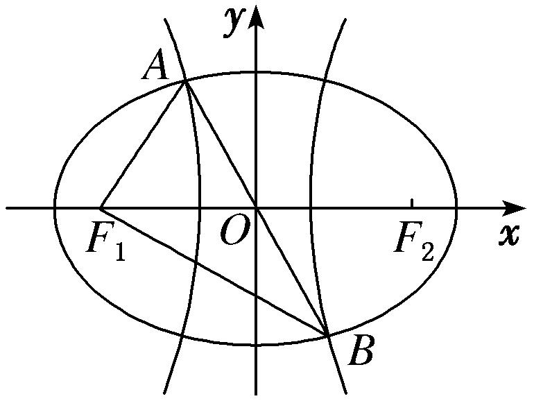
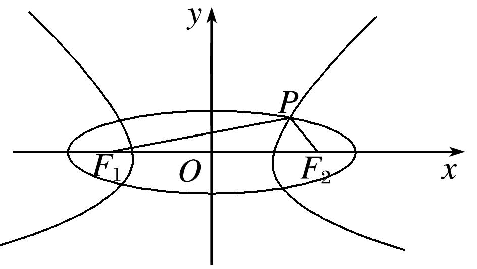

专题05　共焦点椭圆、双曲线模型

<strong>秒杀结论</strong>　已知椭圆<em>C</em>1：＋＝1(其中<em>a</em>＞<em>b</em>＞0)与双曲线<em>C</em>2：－＝1(其中<em>m</em>＞0，<em>n</em>＞0)共焦点，<em>e</em>1，<em>e</em>2分别为<em>C</em>1，<em>C</em>2的离心率，<em>M</em>是<em>C</em>1，<em>C</em>2的一个交点，<em>θ</em>＝∠<em>F</em>1<em>ＭF</em>2，则

Ⅰ．|<em>MF</em>1|＝<em>a</em>＋<em>m</em>，|<em>PF</em>2|＝<em>a</em>－<em>m</em>；Ⅱ．＋＝1．

【方法技巧】

结论Ⅰ的推导是用椭圆与双曲线的定义，然后两式相加，相减．凡是已知公共焦点三角形中的一边（焦半径）或三边的比例关系（可取特值，特别是在直角三角形中），然后使用结论Ⅰ：|<em>MF</em>1|＝<em>a</em>＋<em>m</em>，|<em>PF</em>2|＝<em>a</em>－<em>m</em>，找到<em>a</em>，<em>m</em>，<em>c</em>的关系，从而解决问题．可免去用椭圆与双曲线的定义，节省时间．关于结论Ⅰ的记忆是长边加，短边减，椭圆的长半轴在前，双曲线的实半轴在后．

结论Ⅱ的推导是先用椭圆与双曲线的定义，然后用余弦定理，或用焦点三角形的面积相等．凡是已知公共焦点三角形中的顶角（或隐含如例2(6)，对点练5，6），然后使用结论Ⅱ：＋＝1，可快速到<em>e</em>12，<em>e</em>22的关系，从而解决问题．如果求最值注意基本不等式的使用，如不能用基本不等式可利用三角换元转化为三角函数的最值(如例2(5)，对点练4，6)或用柯西不等式(选修4－5)．关于结论Ⅱ的记忆类比平方关系，在正弦，余弦下分别加上椭圆与双曲线的离心率的平方．

【例题选讲】

<strong>[例11]</strong>　（59）椭圆与双曲线有公共焦点<em>F</em>1，<em>F</em>2，它们在第一象限的交点为<em>A</em>，且<em>AF</em>1⊥<em>AF</em>2，∠<em>AF</em>1<em>F</em>2＝30°，则椭圆与双曲线的离心率的倒数和为(　　)

A．2　　　　　　　　　
B．　　　　　　　　　
C．2　　　　　　　　　
D．1

<strong>答案</strong>　B　<strong>秒杀</strong>　设椭圆方程为：＋＝1(<em>a</em>&gt;<em>b</em>&gt;0)，双曲线方程为－＝1(<em>m</em>&gt;0，<em>n</em>&gt;0)，根据题意，可设|<em>AF</em>1|＝，|<em>AF</em>2|＝1，|<em>F</em>1 <em>F</em>2|＝2，则<em>a</em>＋<em>m</em>＝，<em>a</em>－<em>m</em>＝１，∴＋＝＋＝＝．故选B．  
（60）中心在原点的椭圆<em>C</em>1与双曲线<em>C</em>2具有相同的焦点，<em>F</em>1(－<em>c</em>，0)，<em>F</em>2(<em>c</em>，0)，<em>P</em>为<em>C</em>1与<em>C</em>2在第一象限的交点，|<em>PF</em>1|＝|<em>F</em>1<em>F</em>2|且|<em>PF</em>2|＝3，若椭圆<em>C</em>1的离心率<em>e</em>1∈，则双曲线的离心率<em>e</em>2的范围是(　　)

A．　　　　　　
B．　　　　　　
C．　　　　　　
D．(2，3)

<strong>答案</strong>　C　<strong>秒杀</strong>　设椭圆方程为：＋＝1(<em>a</em>&gt;<em>b</em>&gt;0)，设双曲线方程为－＝1(<em>m</em>&gt;0，<em>n</em>&gt;0)，由题意有，<em>a</em>＋<em>m</em>＝2<em>c</em>，<em>a</em>－<em>m</em>＝3，所以<em>m</em>＝2<em>c</em>－<em>a</em>，又<em>e</em>2＝＝＝，因为<em>e</em>1∈，所以∈，所以<em>e</em>2∈.  
（61）已知中心在原点的椭圆与双曲线有公共焦点，左右焦点分别为<em>F</em>1，<em>F</em>2，且两条曲线在第一象限的交点为<em>P</em>，△<em>PF</em>1<em>F</em>2是以<em>PF</em>1为底边的等腰三角形，若|<em>PF</em>1|＝10，椭圆与双曲线的离心率分别为<em>e</em>1，<em>e</em>2，则<em>e</em>1<em>e</em>2＋1的取值范围为(　　)

A．(1，＋∞)　　　　　
B．(，＋∞)　　　　　
C．(，＋∞)　　　　　
D．(，＋∞)

<strong>答案</strong>　B　<strong>秒杀</strong>　设椭圆方程为：＋＝1(<em>a</em>&gt;<em>b</em>&gt;0)，设双曲线方程为－＝1(<em>m</em>&gt;0，<em>n</em>&gt;0)，由题意有，<em>a</em>＋<em>m</em>＝10，<em>a</em>－<em>m</em>＝2<em>c</em>，所以<em>a</em>＝5＋<em>c</em>，<em>m</em>＝5－<em>c</em>，<em>c</em>＞，又<em>e</em>1<em>e</em>2＋1＝＋1＝＋1＞．故选B．

【对点训练】

88．<em>F</em>1，<em>F</em>2是椭圆<em>C</em>1与双曲线<em>C</em>2的公共焦点，<em>A</em>是<em>C</em>1，<em>C</em>2在第一象限的交点，且<em>AF</em>1⊥<em>AF</em>2，∠<em>AF</em>1<em>F</em>2＝

，则<em>C</em>1与<em>C</em>2的离心率之积为(　　)

A．2　　　　　　　　　
B．　　　　　　　　　
C．　　　　　　　　　
D．

88．<strong>答案</strong>　A　<strong>秒杀</strong>　设椭圆方程为：＋＝1(<em>a</em>&gt;<em>b</em>&gt;0)，双曲线方程为－＝1(<em>m</em>&gt;0，<em>n</em>&gt;0)，根据题意，

可设|<em>AF</em>1|＝，|<em>AF</em>2|＝1，|<em>F</em>1 <em>F</em>2|＝2，则<em>a</em>＋<em>m</em>＝，<em>a</em>－<em>m</em>＝１，∴<em>a</em>＝，<em>m</em>＝，∴<em>e</em>1<em>e</em>2＝＝2．故选A．

89．已知中心在原点的椭圆与双曲线有公共焦点，左右焦点分别为<em>F</em>1，<em>F</em>2，且两条曲线在第一象限的交点

为<em>P</em>，△<em>PF</em>1<em>F</em>2是以<em>PF</em>1为底边的等腰三角形，若双曲线的离心率为3，则椭圆的离心率为(　　)

A．　　　　　　　　　
B．　　　　　　　　　
C．　　　　　　　　　
D．

89．<strong>答案</strong>　A　<strong>秒杀</strong>　设椭圆方程为：＋＝1(<em>a</em>&gt;<em>b</em>&gt;0)，双曲线方程为－＝1(<em>m</em>&gt;0，<em>n</em>&gt;0)，根据题意，

*a*－*m*＝2*c*，＝3，∴＝＝．故选A．

90．已知有公共焦点的椭圆与双曲线的中心为原点，焦点在<em>x</em>轴上，左、右焦点分别为<em>F</em>1、<em>F</em>2，且它们在

第一象限的交点为<em>P</em>，△<em>PF</em>1<em>F</em>2是以<em>PF</em>1为底边的等腰三角形．若|<em>PF</em>1|＝10，双曲线的离心率的取值范围为(1，2)．则该椭圆的离心率的取值范围是(　　)

A．(，)　　　　　
B．(，)　　　　　
C．(，)　　　　　
D．(，1)

90．<strong>答案</strong>　C　<strong>秒杀</strong>　设椭圆方程为：＋＝1(<em>a</em>&gt;<em>b</em>&gt;0)，设双曲线方程为－＝1(<em>m</em>&gt;0，<em>n</em>&gt;0)，由题意

有，*a*＋*m*＝10，*a*－*m*＝2*c*，所以*a*＝5＋*c*，*m*＝5－*c*，因为双曲线的离心率的取值范围为(1，2)，所以1<<2，∴<*c*<，∵椭圆的离心率*e*＝＝＝1－，且<1－<，∴该椭圆的离心率的取值范围是(，)．

91．已知<em>F</em>1，<em>F</em>2是椭圆与双曲线的公共焦点，<em>P</em>是它们的一个公共点，且|<em>PF</em>1|&gt;|<em>PF</em>2|，线段<em>PF</em>1的垂直平

分线过<em>F</em>2，若椭圆的离心率为<em>e</em>1，双曲线的离心率为<em>e</em>2，则＋的最小值为(　　)

A．6　　　　　　　　
B．3　　　　　　　　
C．　　　　　　　　
D．

91．<strong>答案</strong>　A　<strong>通解</strong>　设椭圆的长半轴长为<em>a</em>，双曲线的半实轴长为<em>a</em>′，半焦距为<em>c</em>，依题意知
∴2*a*＝2*a*′＋4*c*，∴＋＝＋＝＋＝＋＋4≥2＋4＝6，当且仅当*c*＝2*a*′时取“＝”，故选A．

<strong>秒杀</strong>　设椭圆方程为：＋＝1(<em>a</em>&gt;<em>b</em>&gt;0)，双曲线方程为－＝1(<em>m</em>&gt;0，<em>n</em>&gt;0)，根据题意，<em>a</em>－<em>m</em>＝2<em>c</em>，∴<em>a</em>＝<em>m</em>＋2<em>c</em>，∴＋＝＋＝＋＝＋＋4≥2＋4＝6，当且仅当<em>c</em>＝2<em>m</em>时取“＝”，故选A．

92．如图，<em>F</em>1，<em>F</em>2是椭圆<em>C</em>1与双曲线<em>C</em>2的公共焦点，<em>A</em>，<em>B</em>分别是<em>C</em>1，<em>C</em>2在第二、四象限的交点，若<em>AF</em>1

⊥<em>BF</em>1，且∠<em>AF</em>1<em>O</em>＝，则<em>C</em>1与<em>C</em>2的离心率之和为(　　)

A．2　　　　　　　　
B．4　　　　　　　　
C．2　　　　　　　　
D．2

92．<strong>答案</strong>　A　<strong>通解</strong>　设椭圆方程为＋＝1(<em>a</em>&gt;<em>b</em>&gt;0)，由双曲线和椭圆的对称性可知，<em>A</em>，<em>B</em>关于原点对

称，又<em>AF</em>1⊥<em>BF</em>1，且∠<em>AF</em>1<em>O</em>＝，故|<em>AF</em>1|＝|<em>OF</em>1|＝|<em>OA</em>|＝|<em>OB</em>|＝<em>c</em>，∴<em>A</em>，代入椭圆方程＋＝1，结合<em>b</em>2＝<em>a</em>2－<em>c</em>2及<em>e</em>＝，整理可得，<em>e</em>4－8<em>e</em>2＋4＝0，∵0&lt;<em>e</em>&lt;1，∴<em>e</em>2＝4－2＝(－1)2，∴<em>e</em>＝－1．同理可求得双曲线的离心率<em>e</em>1＝＋1，∴<em>e</em>＋<em>e</em>1＝2．

<strong>秒杀</strong>　设椭圆方程为：＋＝1(<em>a</em>&gt;<em>b</em>&gt;0)，双曲线方程为－＝1(<em>m</em>&gt;0，<em>n</em>&gt;0)，根据题意，可设|<em>AF</em>1|＝1，|<em>AF</em>2|＝，|<em>F</em>1 <em>F</em>2|＝2，则<em>a</em>＋<em>m</em>＝，<em>a</em>－<em>m</em>＝１，∴<em>e</em>＋<em>e</em>1＝＋＝＝2．故选A．

【例题选讲】

<strong>[例12]</strong>　（62）已知椭圆、双曲线均是以直角三角形<em>ABC</em>的斜边<em>AC</em>的两端点为焦点的曲线，且都过<em>B</em>点，它们的离心率分别为<em>e</em>1，<em>e</em>2，则＋＝(　　)

A．　　　　　　　　
B．2　　　　　　　　
C．　　　　　　　　
D．4

<strong>答案</strong>　B　<strong>通解</strong>　以<em>AC</em>边所在的直线为<em>x</em>轴，<em>AC</em>中垂线所在的直线为<em>y</em>轴建立直角坐标系(图略)，设椭圆方程为＋＝1，设双曲线方程为－＝1，焦距都为2<em>c</em>，不妨设|<em>AB</em>|&gt;|<em>BC</em>|，椭圆和双曲线都过点<em>B</em>，则|<em>AB</em>|＋|<em>BC</em>|＝2<em>a</em>1，|<em>AB</em>|－|<em>BC</em>|＝2<em>a</em>2，所以|<em>AB</em>|＝<em>a</em>1＋<em>a</em>2，|<em>BC</em>|＝<em>a</em>1－<em>a</em>2，又因为△<em>ABC</em>为直角三角形，|<em>AC</em>|＝2<em>c</em>，所以(<em>a</em>1＋<em>a</em>2)2＋(<em>a</em>1－<em>a</em>2)2＝(2<em>c</em>)2，即<em>a</em>＋<em>a</em>＝2<em>c</em>2，所以＋＝2，即＋＝2．故选B．

秒杀　由已知＝，又由＋＝1，得＋＝2．故选B．  
（63）(2013浙江)已知<em>F</em>1，<em>F</em>2为椭圆<em>C</em>1：＋<em>y</em>2＝1和双曲线<em>C</em>2的公共焦点，<em>P</em>为它们的一个公共点，<em>A</em>，<em>B</em>分别是<em>C</em>1，<em>C</em>2在第二、四象限的交点，若四边形<em>AF</em>1<em>BF</em>1为矩形，则<em>C</em>2的离心率是(　　)

A．　　　　　　　　　
B．　　　　　　　　　
C．　　　　　　　　　
D．

<strong>答案</strong>　D　<strong>秒杀</strong>　由已知＝，又由＋＝1，得＋＝2，又<em>e</em>1＝，∴<em>e</em>2＝，故选D．  
（64）(2016全国高中数学联赛四川预赛)已知<em>F</em>1，<em>F</em>2为椭圆和双曲线的公共焦点，<em>P</em>为它们的一个公共点，且∠<em>F</em>1<em>PF</em>2＝，则该椭圆和双曲线的离心率之积的最小值为(　　)

A．　　　　　　　　　
B．　　　　　　　　　
C．1　　　　　　　　　
D．

<strong>答案</strong>　B　<strong>秒杀</strong>　由已知＝，又由＋＝1，得＋＝4，4＝＋＞，<em>e</em>1<em>e</em>2≥(当且仅当<em>e</em>2＝<em>e</em>1时取等号)，故选B．  
（65）已知椭圆<em>C</em>1：＋＝1(其中<em>a</em>＞<em>b</em>＞0)与双曲线<em>C</em>2：－＝1(其中<em>m</em>＞0，<em>n</em>＞0)有相同的焦点<em>F</em>1，<em>F</em>2，<em>P</em>是两曲线的一个公共点，<em>e</em>1，<em>e</em>2分别是两曲线的离心率，若<em>PF</em>1⊥<em>PF</em>1，则4<em>e</em>＋<em>e</em>的最小值是(　　)

A．　　　　　　　　　
B．　　　　　　　　　
C．　　　　　　　　　
D．

<strong>答案</strong>　C　<strong>秒杀</strong>　由已知＝，又由＋＝1，得＋＝2，4<em>e</em>＋<em>e</em>＝(4<em>e</em>＋<em>e</em>)(＋)＝＋≥ (当且仅当<em>e</em>＝2<em>e</em>时取等号)，故选C．  
（66）(2014湖北)已知<em>F</em>1，<em>F</em>2是椭圆和双曲线的公共焦点，<em>P</em>是它们的一个公共点，且∠<em>F</em>1<em>PF</em>2＝，则椭圆和双曲线的离心率的倒数之和的最大值为(　　)

A．　　　　　　　　
B．　　　　　　　　
C．3　　　　　　　　
D．2

<strong>答案</strong>　A　<strong>秒杀</strong>　由已知＝，又由＋＝1，得＋＝4，可利用三角换元＝2cos<em>θ</em>，＝2sin<em>θ</em>，则＋＝sin(<em>θ</em>＋<em>φ</em>)≤．故选A．  
（67）(2016浙江)已知椭圆<em>C</em>1：＋<em>y</em>2＝1(<em>m</em>&gt;1)与双曲线<em>C</em>2：－<em>y</em>2＝1(<em>n</em>&gt;0)的焦点重合，<em>e</em>1，<em>e</em>2分别为<em>C</em>1，<em>C</em>2的离心率，则(　　)

A．<em>m</em>&gt;<em>n</em>且<em>e</em>1<em>e</em>2&gt;1　　　　
B．<em>m</em>&gt;<em>n</em>且<em>e</em>1<em>e</em>2&lt;1　　　　
C．<em>m</em>&lt;<em>n</em>且<em>e</em>1<em>e</em>2&gt;1　　　　
D．<em>m</em>&lt;<em>n</em>且<em>e</em>1<em>e</em>2&lt;1

<strong>答案</strong>　A　<strong>通解</strong>　由于<em>m</em>2－1＝<em>c</em>2，<em>n</em>2＋1＝<em>c</em>2，则<em>m</em>2－<em>n</em>2＝2，故<em>m</em>&gt;<em>n</em>，又(<em>e</em>1<em>e</em>2)2＝·＝·＝＝1＋&gt;1，∴<em>e</em>1<em>e</em>2&gt;1．故选A．

<strong>秒杀</strong>　由椭圆和双曲线焦点三角形面积公式得，<em>b</em>2tan＝<em>b</em>2，即，tan＝，解得<em>θ</em>＝．∴＋＝2，因为<em>e</em>1≠<em>e</em>2，∴2＝＋＞，∴<em>e</em>1<em>e</em>2&gt;1．故选A．

【对点训练】

93．已知椭圆和双曲线有共同的焦点<em>F</em>1，<em>F</em>2，<em>P</em>是它们的一个交点，且∠<em>F</em>1<em>PF</em>2＝，记椭圆和双曲线的

离心率分别为<em>e</em>1，<em>e</em>2，则＋等于(　　)

A．4　　　　　　　　
B．2　　　　　　　　
C．2　　　　　　　　
D．3

93．<strong>答案</strong>　A　<strong>通解</strong>　如图所示，设椭圆的长半轴长为<em>a</em>1，双曲线的实半轴长为<em>a</em>2，则根据椭圆及双曲线

的定义：|<em>PF</em>1|＋|<em>PF</em>2|＝2<em>a</em>1，|<em>PF</em>1|－|<em>PF</em>2|＝2<em>a</em>2，∴|<em>PF</em>1|＝<em>a</em>1＋<em>a</em>2，|<em>PF</em>2|＝<em>a</em>1－<em>a</em>2，设|<em>F</em>1<em>F</em>2|＝2<em>c</em>，∠<em>F</em>1<em>PF</em>2＝，则在△<em>PF</em>1<em>F</em>2中，由余弦定理得4<em>c</em>2＝(<em>a</em>1＋<em>a</em>2)2＋(<em>a</em>1－<em>a</em>2)2－2(<em>a</em>1＋<em>a</em>2)(<em>a</em>1－<em>a</em>2)cos，化简得3<em>a</em>＋<em>a</em>＝4<em>c</em>2，该式可变成＋＝4．故选A．

秒杀　由已知＝，又由＋＝1，得＋＝4．故选A．

94．已知圆锥曲线<em>C</em>1：<em>mx</em>2＋<em>ny</em>2＝1(<em>n</em>&gt;<em>m</em>&gt;0)与<em>C</em>2：<em>px</em>2－<em>qy</em>2＝1(<em>p</em>&gt;0)的公共焦点为<em>F</em>1，<em>F</em>2.点<em>M</em>为<em>C</em>1，<em>C</em>2

的一个公共点，且满足∠<em>F</em>1<em>MF</em>2＝90°，若圆锥曲线<em>C</em>1的离心率为，则<em>C</em>2的离心率为(　　)

A．　　　　　　　　
B．　　　　　　　　
C．　　　　　　　　
D．

94．<strong>答案</strong>　B　<strong>通解</strong>　<em>C</em>1：＋＝1，<em>C</em>2：－＝1．设<em>a</em>1＝，<em>a</em>2＝，<em>MF</em>1＝<em>s</em>，<em>MF</em>2＝<em>t</em>，由椭圆

的定义可得<em>s</em>＋<em>t</em>＝2<em>a</em>1，由双曲线的定义可得<em>s</em>－<em>t</em>＝2<em>a</em>2，解得<em>s</em>＝<em>a</em>1＋<em>a</em>2，<em>t</em>＝<em>a</em>1－<em>a</em>2，由∠<em>F</em>1<em>MF</em>2＝90°，运用勾股定理，可得<em>s</em>2＋<em>t</em>2＝4<em>c</em>2，即为<em>a</em>＋<em>a</em>＝2<em>c</em>2，由离心率的公式可得，＋＝2，∵<em>e</em>1＝，∴<em>e</em>＝，则<em>e</em>2＝，故选B．

<strong>秒杀</strong>　由已知＝，又由＋＝1，得＋＝2，∵<em>e</em>1＝，∴<em>e</em>＝，则<em>e</em>2＝，故选B．

95．已知椭圆＋＝1(<em>a</em>&gt;<em>b</em>&gt;0)与双曲线－＝1(<em>m</em>&gt;0，<em>n</em>&gt;0)具有相同焦点<em>F</em>1，<em>F</em>2，且在第一象限交于点

<em>P</em>，椭圆与双曲线的离心率分别为<em>e</em>1，<em>e</em>2，若∠<em>F</em>1<em>PF</em>2＝，则<em>e</em>＋<em>e</em>的最小值是(　　)

A．　　　　　　　　
B．2＋　　　　　　　　
C．　　　　　　　　
D．

95．<strong>答案</strong>　A　<strong>通解</strong>根据题意，可知|<em>PF</em>1|＋|<em>PF</em>2|＝2<em>a</em>，|<em>PF</em>1|－|<em>PF</em>2|＝2<em>m</em>，解得|<em>PF</em>1|＝<em>a</em>＋<em>m</em>，|<em>PF</em>2|＝<em>a</em>－<em>m</em>，
根据余弦定理，可知(2<em>c</em>)2＝(<em>a</em>＋<em>m</em>)2＋(<em>a</em>－<em>m</em>)2－2(<em>a</em>＋<em>m</em>)(<em>a</em>－<em>m</em>)cos ，整理得<em>c</em>2＝，所以<em>e</em>＋<em>e</em>＝＋＝＋＝1＋≥1＋＝(当且仅当<em>a</em>2＝<em>m</em>2时取等号)，故选A．

<strong>秒杀</strong>　由已知＝，又由＋＝1，得＋＝4，<em>e</em>＋<em>e</em>＝(<em>e</em>＋<em>e</em>)(＋)＝1＋≥1＋＝(当且仅当<em>e</em>＝3<em>e</em>时取等号)，故选A．

96．已知<em>F</em>1，<em>F</em>2是椭圆和双曲线的公共焦点，<em>P</em>是它们的一个公共点，且∠<em>F</em>1<em>PF</em>2＝<em>θ</em>，cos<em>θ</em>＝，则椭圆

和双曲线的离心率的倒数之和的最大值为(　　)

A．　　　　　　　　　
B．　　　　　　　　　
C．　　　　　　　　　
D．

96．<strong>答案</strong>　B　<strong>秒杀</strong>　由＋＝1，得＋＝10，可利用三角换元＝cos<em>θ</em>，＝sin<em>θ</em>，则

＋＝sin(*θ*＋*φ*)≤．故选B．

97．已知椭圆<em>C</em>1：＋＝1(其中<em>m</em>＞2<em>b</em>＞0)与双曲线<em>C</em>2：－＝1(其中<em>n</em>＞0，<em>b</em>＞0)的焦点重合，<em>e</em>1，

<em>e</em>2分别为<em>C</em>1，<em>C</em>2的离心率，则(　　)

A．<em>m</em>＞<em>n</em>且<em>e</em>1<em>e</em>2≥　　
B．<em>m</em>＞<em>n</em>且<em>e</em>1<em>e</em>2≤　　
C．<em>m</em>＜<em>n</em>且<em>e</em>1<em>e</em>2≥　　
D．<em>m</em>＜<em>n</em>且<em>e</em>1<em>e</em>2≤

97．<strong>答案</strong>　A　<strong>秒杀</strong>　由椭圆和双曲线焦点三角形面积公式得，<em>b</em>2tan＝<em>b</em>2，即，4tan＝，解得tan

＝．∴＋＝5，∴5＝＋≥2≥，∴5≥，当且仅当2<em>e</em>1＝<em>e</em>2时，等号成立．∴<em>e</em>1<em>e</em>2≥．故选A．

98．(2014全国高中数学联赛湖北预赛)已知椭圆和双曲线有共同的焦点<em>F</em>1，<em>F</em>2，记椭圆和双曲线的离心率
分别为<em>e</em>1，<em>e</em>2，若椭圆的短轴长是和双曲线虚轴长的2倍，则＋的最大值为(　　)

A．4　　　　　　　　　
B．2　　　　　　　　　
C．　　　　　　　　　
D．

98．<strong>答案</strong>　D　<strong>秒杀</strong>　由椭圆和双曲线焦点三角形面积公式得，<em>b</em>2tan＝<em>b</em>2，即，4tan＝，解得tan

＝．∴＋＝5，可利用三角换元＝cos*θ*，＝sin*θ*，则＋＝sin(*θ*＋*φ*)≤．

