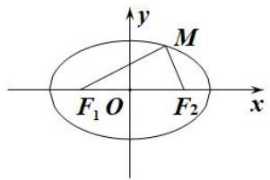
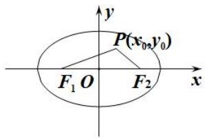
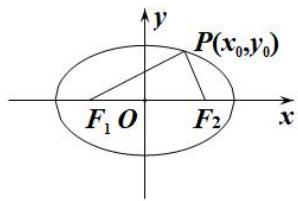
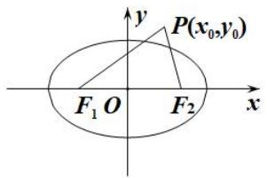
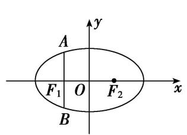
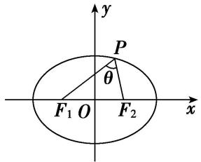
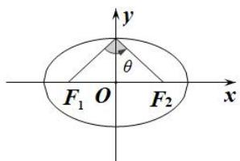
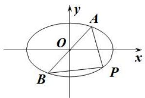
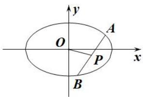
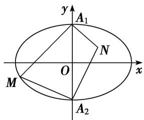

# 专题06 椭圆模型

# 椭圆秒杀小题常用结论  
（1）椭圆定义： $|MF_{1}|+|MF_{2}|=2a(2a>|F_{1}F_{2}|)$ . 如图（1）

图（1）

图（2）

图（3）

图（4）  
（2）点 $P(x_0, y_0)$ 和椭圆 $\frac{x^2}{a^2} + \frac{y^2}{b^2} = 1 (a > b > 0)$ 的关系
$P(x_{0}, y_{0})$ 在椭圆内 $\Leftrightarrow \frac{x_{0}^{2}}{a^{2}} + \frac{y_{0}^{2}}{b^{2}} < 1$ ; $P(x_{0}, y_{0})$ 在椭圆上 $\Leftrightarrow \frac{x_{0}^{2}}{a^{2}} + \frac{y_{0}^{2}}{b^{2}} = 1$ ; $P(x_{0}, y_{0})$ 在椭圆外 $\Leftrightarrow \frac{x_{0}^{2}}{a^{2}} + \frac{y_{0}^{2}}{b^{2}} > 1$ .  
（3）如图（5），椭圆的通径(过焦点且垂直于长轴的弦)长为 $|AB|=\frac{2b^{2}}{a}$ ，通径是最短的焦点弦．过焦点最长弦为长轴．过原点最长弦为长轴长2a，最短弦为短轴长2b.

图（5）

图（6）

图（7）  
（4）焦点三角形：椭圆上的点 $P(x_0, y_0)$ 与两焦点 $F_1$ ， $F_2$ 构成的 $\triangle PF_1F_2$ 叫做焦点三角形．若 $r_1 = |PF_1|$ ， $r_2 = |PF_2|$ ， $\angle F_1PF_2 = \theta$ ， $\triangle PF_1F_2$ 的面积为 $S$ ，则在椭圆 $\frac{x^2}{a^2} + \frac{y^2}{b^2} = 1 (a > b > 0)$ 中如图（6）:

① $\triangle PF_{1}F_{2}$ 的周长为 $2(a+c)$ . ② $S=b^{2}\tan\frac{\theta}{2}$ .  
（5）如图（7） $P$ 为椭圆 $\frac{x^2}{a^2} +\frac{y^2}{b^2} = 1(a > b > 0)$ 上的动点， $F_{1}$ ， $F_{2}$ 分别为椭圆的左、右焦点，当椭圆上点 $P$ 在短轴端点时与两焦点连线的夹角最大.  
（6） $P$ 为椭圆 $\frac{x^2}{a^2} +\frac{y^2}{b^2} = 1(a > b > 0)$ 上的点， $F_{1}$ ， $F_{2}$ 分别为椭圆的左、右焦点，则 $P$ 到焦点的最长距离为 $\underline{a}$ $\pm c$ ，最短距离为 $\underline{a - c}$   
（7）如图（8）设 P, A, B 是椭圆 $\frac{x^{2}}{a^{2}} + \frac{y^{2}}{b^{2}} = 1 (a > b > 0)$ 上不同的三点，其中 A, B 关于原点对称，则 $k_{PA} \cdot k_{PB} = -\frac{b^{2}}{a^{2}} = e^{2} - 1$ .

图（8）

图（9）  
（8）如图（9）设 A, B 是椭圆 $\frac{x^{2}}{a^{2}} + \frac{y^{2}}{b^{2}} = 1 (a > b > 0)$ 上不同的两点，P 为弦 AB 的中点，则 $k_{AB} \cdot k_{OP} = -\frac{b^{2}}{a^{2}} = e^{2} - 1$ .

# 【例题选讲】

[例 1] （1）(2019·全国III)设 $F_{1}$ ， $F_{2}$ 为椭圆 C: $\frac{x^{2}}{36} + \frac{y^{2}}{20} = 1$ 的两个焦点，M 为 C 上一点且在第一象限。若 $\triangle MF_{1}F_{2}$ 为等腰三角形，则 M 的坐标为 \_\_\_\_.  
（2）已知椭圆 $E: \frac{x^2}{9} + \frac{y^2}{4} = 1$ ，直线 $l$ 交椭圆于 $A, B$ 两点，若 $AB$ 的中点坐标为 $\left(-\frac{1}{2}, 1\right)$ ，则 $l$ 的方程为（）

A. $2x+9y-10=0$

B. $2x - 9y - 10 = 0$

C. $2x+9y+10=0$

D. $2x - 9y + 10 = 0$  
（3）设椭圆 $\frac{x^{2}}{a^{2}}+\frac{y^{2}}{b^{2}}=1(a>b>0)$ 的左右焦点分别为 $F_{1}$ 、 $F_{2}$ ，上下顶点分别为A、B，直线 $AF_{2}$ 与该椭圆交于A、M两点．若 $\angle F_{1}AF_{2}=120^{\circ}$ ，则直线BM的斜率为()

A. $\frac{1}{4}$

B. $\frac{\sqrt{3}}{4}$

C. $\frac{\sqrt{3}}{2}$

D. $\sqrt{3}$  
（4）已知 P 为椭圆 C: $\frac{x^{2}}{4}+\frac{y^{2}}{3}=1$ 上的一个动点， $F_{1}$ ， $F_{2}$ 是椭圆 C 的左、右焦点，O 为坐标原点，O 到椭圆 C 在 P 点处的切线距离为 d，若 $\left|PF_{1}\right|\cdot\left|PF_{2}\right|=\frac{24}{7}$ ，则 d= \_\_\_\_.  
（5）已知直线 MN 过椭圆 $\frac{x^{2}}{2} + y^{2} = 1$ 的左焦点 F，与椭圆交于 M, N 两点，直线 PQ 过原点 O 与 MN 平行，且与椭圆交于 P, Q 两点，则 $\frac{|PQ|^{2}}{|MN|} =$ \_\_\_\_ .  
（6）已知点 $P(x, y)$ 在椭圆 $\frac{x^{2}}{36} + \frac{y^{2}}{100} = 1$ 上， $F_{1}, F_{2}$ 是椭圆的两个焦点，若 $\triangle PF_{1}F_{2}$ 的面积为 18，则 $\angle F_{1}PF_{2}$ 的余弦值为 \_\_\_\_.  
（7）在平面直角坐标系 $xOy$ 中，直线 $x + \sqrt{2} y - 2\sqrt{2} = 0$ 与椭圆 $C: \frac{x^2}{a^2} + \frac{y^2}{b^2} = 1 (a > b > 0)$ 相切，且椭圆 $C$ 的右焦点 $F(c, 0)$ 关于直线 $l: y = \frac{c}{b} x$ 的对称点 $E$ 在椭圆 $C$ 上，则 $\triangle OEF$ 的面积为（）

A. $\frac{1}{2}$

B. $\frac{\sqrt{3}}{2}$

C. 1

D. 2  
（8）如图所示， $A_{1}$ ， $A_{2}$ 是椭圆 C: $\frac{x^{2}}{9}+\frac{y^{2}}{4}=1$ 的短轴端点，点 M 在椭圆上运动，且点 M 不与 $A_{1}$ ， $A_{2}$ 重合，点 N 满足 $NA_{1}\perp MA_{1}$ ， $NA_{2}\perp MA_{2}$ ，则 $\frac{S_{\triangle MA_{1}A_{2}}}{S_{\triangle NA_{1}A_{2}}}=(\quad)$

A. $\frac{3}{2}$

B. $\frac{2}{3}$

C. $\frac{9}{4}$

D. $\frac{4}{9}$

# 【对点训练】

1. 已知椭圆 $\frac{x^2}{16} + \frac{y^2}{4} = 1$ 上的两点 $A, B$ 关于直线 $2x - 2y - 3 = 0$ 对称，则弦 $AB$ 的中点坐标为 \_\_\_\_.

2. 已知椭圆 $C: 9x^{2} + y^{2} = m^{2}(m > 0)$ , 直线 $l$ 不过原点 $O$ 且不平行于坐标轴, $l$ 与 $C$ 有两个交点 $A$ , $B$ , 线段 $AB$ 的中点为 $M$ , 则直线 $OM$ 与直线 $l$ 的斜率之积为 ( )

A. -9

B. $-\frac{9}{2}$

C. $-\frac{1}{9}$

D. -3

3. $P$ 为椭圆 $\frac{x^2}{25} +\frac{y^2}{9} = 1$ 上一点， $F_{1}$ ， $F_{2}$ 分别是椭圆的左、右焦点，过 $P$ 点作 $PH\bot F_1F_2$ 于点 $H$ ，若 $PF_{1}\bot$ $PF_{2}$ ，则 $|PH| = (\quad)$

A. $\frac{25}{4}$

B. $\frac{8}{3}$

C. 8

D. $\frac{9}{4}$

4. 已知 $\triangle ABC$ 的顶点 $B, C$ 在椭圆 $\frac{x^2}{3} + y^2 = 1$ 上，顶点 $A$ 是椭圆的一个焦点，且椭圆的另外一个焦点在 $BC$ 边上，则 $\triangle ABC$ 的周长是（）

A. $2 \sqrt{3}$

B. 6

C. $4\sqrt{3}$

D. 12

5. 设 $F_{1}$ , $F_{2}$ 为椭圆 $\frac{x^{2}}{9} + \frac{y^{2}}{5} = 1$ 的两个焦点, 点 $P$ 在椭圆上, 若线段 $PF_{1}$ 的中点在 $y$ 轴上, 则 $\frac{|PF_{2}|}{|PF_{1}|}$ 的值为 ( )

A. $\frac{5}{14}$

B. $\frac{5}{13}$

C. $\frac{4}{9}$

D. $\frac{5}{9}$

6. 已知椭圆 $C: \frac{x^2}{a^2} + \frac{y^2}{b^2} = 1 (a > b > 0)$ 及点 $B(0, a)$ ，过点 $B$ 与椭圆相切的直线交 $x$ 轴的负半轴于点 $A$ ， $F$ 为椭圆的右焦点，则 $\angle ABF = (\quad)$

A. $60^{\circ}$

B. $90^{\circ}$

C. $120^{\circ}$

D. $150^{\circ}$

7. 已知椭圆 $\frac{x^2}{4} + \frac{y^2}{2} = 1$ 的两个焦点是 $F_{1}, F_{2}$ ，点 $P$ 在该椭圆上，若 $|PF_{1}| - |PF_{2}| = 2$ ，则 $\triangle PF_{1}F_{2}$ 的面积是（）

A. $\sqrt{2}$

B. 2

C. $2\sqrt{2}$

D. $\sqrt{3}$

8. 设 $P$ 为椭圆 $C: \frac{x^2}{49} + \frac{y^2}{24} = 1$ 上一点， $F_1, F_2$ 分别是椭圆 $C$ 的左、右焦点，且 $\triangle PF_1F_2$ 的重心为 $G$ ，若 $|PF_1| : |PF_2| = 3:4$ ，那么 $\triangle GPF_1$ 的面积为（）

A. 24

B. 12

C. 8

D. 6

