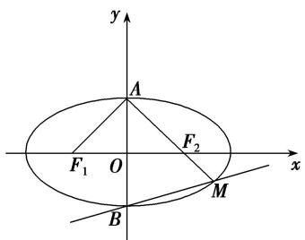
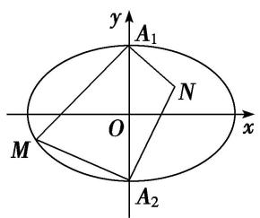
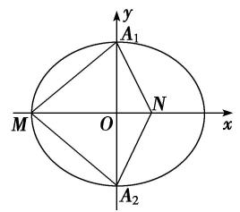

# 专题06 椭圆模型

# 椭圆秒杀小题常用结论

(1)椭圆定义： $|MF_{1}|+|MF_{2}|=2a(2a>|F_{1}F_{2}|)$ . 如图(1)

text_image

y
M
F₁ O F₂ x

图(1)

text_image

y
P(x₀,y₀)
F₁ O F₂
x

图(2)

text_image

y
P(x₀,y₀)
F₁ O F₂ x

图(3)

text_image

P(x₀,y₀)
F₁ O F₂
x
y

图(4)

(2)点 $P(x_0, y_0)$ 和椭圆 $\frac{x^2}{a^2} + \frac{y^2}{b^2} = 1 (a > b > 0)$ 的关系

$P(x_{0}, y_{0})$ 在椭圆内 $\Leftrightarrow \frac{x_{0}^{2}}{a^{2}} + \frac{y_{0}^{2}}{b^{2}} < 1$ ; $P(x_{0}, y_{0})$ 在椭圆上 $\Leftrightarrow \frac{x_{0}^{2}}{a^{2}} + \frac{y_{0}^{2}}{b^{2}} = 1$ ; $P(x_{0}, y_{0})$ 在椭圆外 $\Leftrightarrow \frac{x_{0}^{2}}{a^{2}} + \frac{y_{0}^{2}}{b^{2}} > 1$ .

(3)如图(5)，椭圆的通径(过焦点且垂直于长轴的弦)长为 $|AB|=\frac{2b^{2}}{a}$ ，通径是最短的焦点弦．过焦点最长弦为长轴．过原点最长弦为长轴长2a，最短弦为短轴长2b.

text_image

A
F₁ O F₂
B
x
y

图(5)

text_image

y
P
θ
F₁ O F₂ x

图(6)

text_image

y
θ
F₁ O F₂ x

图(7)

(4)焦点三角形：椭圆上的点 $P(x_0, y_0)$ 与两焦点 $F_1$ ， $F_2$ 构成的 $\triangle PF_1F_2$ 叫做焦点三角形．若 $r_1 = |PF_1|$ ， $r_2 = |PF_2|$ ， $\angle F_1PF_2 = \theta$ ， $\triangle PF_1F_2$ 的面积为 $S$ ，则在椭圆 $\frac{x^2}{a^2} + \frac{y^2}{b^2} = 1 (a > b > 0)$ 中如图(6):

① $\triangle PF_{1}F_{2}$ 的周长为 $2(a+c)$ . ② $S=b^{2}\tan\frac{\theta}{2}$ .  
(5)如图(7) $P$ 为椭圆 $\frac{x^2}{a^2} +\frac{y^2}{b^2} = 1(a > b > 0)$ 上的动点， $F_{1}$ ， $F_{2}$ 分别为椭圆的左、右焦点，当椭圆上点 $P$ 在短轴端点时与两焦点连线的夹角最大.  
(6) $P$ 为椭圆 $\frac{x^2}{a^2} +\frac{y^2}{b^2} = 1(a > b > 0)$ 上的点， $F_{1}$ ， $F_{2}$ 分别为椭圆的左、右焦点，则 $P$ 到焦点的最长距离为 $\underline{a}$ $\pm c$ ，最短距离为 $\underline{a - c}$   
(7)如图(8)设 P, A, B 是椭圆 $\frac{x^{2}}{a^{2}} + \frac{y^{2}}{b^{2}} = 1 (a > b > 0)$ 上不同的三点，其中 A, B 关于原点对称，则 $k_{PA} \cdot k_{PB} = -\frac{b^{2}}{a^{2}} = e^{2} - 1$ .

text_image

y
A
O
x
B
P

图(8)

text_image

y
O
A
x
P
B

图(9)

(8)如图(9)设 A, B 是椭圆 $\frac{x^{2}}{a^{2}} + \frac{y^{2}}{b^{2}} = 1 (a > b > 0)$ 上不同的两点，P 为弦 AB 的中点，则 $k_{AB} \cdot k_{OP} = -\frac{b^{2}}{a^{2}} = e^{2} - 1$ .

# 【例题选讲】

[例 1] (1)(2019·全国III)设 $F_{1}$ ， $F_{2}$ 为椭圆 C: $\frac{x^{2}}{36} + \frac{y^{2}}{20} = 1$ 的两个焦点，M 为 C 上一点且在第一象限。若 $\triangle MF_{1}F_{2}$ 为等腰三角形，则 M 的坐标为 \_\_\_\_.

答案 (3, $\sqrt{15}$ ) 解析 设 $F_{1}$ 为椭圆的左焦点，分析可知 $M$ 在以 $F_{1}$ 为圆心、焦距为半径长的圆上，即在圆 $(x + 4)^2 + y^2 = 64$ 上。因为点 $M$ 在椭圆 $\frac{x^2}{36} + \frac{y^2}{20} = 1$ 上，所以联立方程可得 $\left\{ \begin{array}{l} x + 4^2 + y^2 = 64, \\ \frac{x^2}{36} + \frac{y^2}{20} = 1, \end{array} \right.$ 解得 $\left\{ \begin{array}{l} x = 3, \\ y = \pm \sqrt{15}. \end{array} \right.$ 又因为点 $M$ 在第一象限，所以点 $M$ 的坐标为 $(3, \sqrt{15})$ 。

(2)已知椭圆 $E:\frac{x^{2}}{9}+\frac{y^{2}}{4}=1$ ，直线 l 交椭圆于 A, B 两点，若 AB 的中点坐标为 $\left(-\frac{1}{2}, 1\right)$ ，则 l 的方程为()

A. $2x+9y-10=0$

B. $2x - 9y - 10 = 0$

C. $2x+9y+10=0$

D. $2x - 9y + 10 = 0$

答案 D 解析 设 $A(x_{1}, y_{1})$ , $B(x_{2}, y_{2})$ ，则 $\frac{x_{1}^{2}}{9} + \frac{y_{1}^{2}}{4} = 1$ , $\frac{x_{2}^{2}}{9} + \frac{y_{2}^{2}}{4} = 1$ ，两式作差并化简整理得 $\frac{y_{2} - y_{1}}{x_{2} - x_{1}} = -\frac{4}{9} \times \frac{x_{1} + x_{2}}{y_{1} + y_{2}}$ ，而 $x_{1} + x_{2} = -1$ , $y_{1} + y_{2} = 2$ ，所以 $\frac{y_{2} - y_{1}}{x_{2} - x_{1}} = -\frac{4}{9} \times \frac{x_{1} + x_{2}}{y_{1} + y_{2}} = \frac{2}{9}$ ，直线 l 的方程为 $y - 1 = \frac{2}{9} \left( x + \frac{1}{2} \right)$ ，即 $2x - 9y + 10 = 0$ 。经验证可知符合题意。故选 D.

(3)设椭圆 $\frac{x^2}{a^2} +\frac{y^2}{b^2} = 1(a > b > 0)$ 的左右焦点分别为 $F_{1}$ 、 $F_{2}$ ，上下顶点分别为 $A$ 、 $B$ ，直线 $AF_{2}$ 与该椭圆交于 $A$ 、 $M$ 两点．若 $\angle F_1AF_2 = 120^\circ$ ，则直线 $BM$ 的斜率为（

A. $\frac{1}{4}$

B. $\frac{\sqrt{3}}{4}$

C. $\frac{\sqrt{3}}{2}$

D. $\sqrt{3}$

答案 B 解析 由题意，椭圆 $\frac{x^{2}}{a^{2}}+\frac{y^{2}}{b^{2}}=1(a>b>0)$ ，且满足 $\angle F_{1}AF_{2}=120^{\circ}$ ，如图所示，

text_image

y
A
F₁ O F₂ x
B M

则在 $\triangle AF_2O$ 中， $|OA| = b, |AF_2| = a$ ，且 $\angle OAF_2 = 60^\circ$ ，所以 $a = 2b$ ，不妨设 $b = 1$ ，则 $a = 2$ ，所以 $c = \sqrt{a^2 - c^2} = \sqrt{3}$ ，则椭圆的方程为 $\frac{x^2}{4} + y^2 = 1$ ，又由 $A(0,1)$ ， $F_2(\sqrt{3}, 0)$ ，所以 $kAF_2 = -\frac{\sqrt{3}}{3}$ ，所以直线 $AF_2$ 的方程为 $y = -\frac{\sqrt{3}}{3} x + 1$ ，联立方程组 $\left\{ \begin{array}{l} y = -\frac{\sqrt{3}}{3} x + 1 \\ \frac{x^2}{4} + y^2 = 1 \end{array} \right.$ ，整理得 $7x^2 - 8\sqrt{3} x = 0$ ，解得 $x = 0$ 或 $x = \frac{8\sqrt{3}}{7}$ ，把 $x = \frac{8\sqrt{3}}{7}$ 代入直线 $y = -\frac{\sqrt{3}}{3} x + 1$ ，解得 $y = -\frac{1}{7}$ ，即 $M\left(\frac{8\sqrt{3}}{7}, -\frac{1}{7}\right)$ ，又由点 $B(0, -1)$ ，所以 $BM$ 的斜率为 $k_{BM} = \frac{-\frac{1}{7} - (-1)}{\frac{8\sqrt{3}}{7} - 0}$

$$
= \frac {\sqrt {3}}{4}, \text {   故选   B.   }
$$

(4)已知 P 为椭圆 C: $\frac{x^{2}}{4}+\frac{y^{2}}{3}=1$ 上的一个动点， $F_{1}$ ， $F_{2}$ 是椭圆 C 的左、右焦点，O 为坐标原点，O 到椭圆 C 在 P 点处的切线距离为 d，若 $\left|PF_{1}\right|\cdot\left|PF_{2}\right|=\frac{24}{7}$ ，则 d= \_\_\_\_.

答案 $\frac{\sqrt{14}}{2}$ 解析 法一：因为点 $P$ 在椭圆上，所以有 $|PF_1| + |PF_2| = 4$ ，又因为 $|PF_1|\cdot |PF_2| = \frac{24}{7}$ ，由余弦定理可得 $\cos \angle F_1PF_2 = \frac{|PF_1|^2 + |PF_2|^2 - |F_1F_2|^2}{2|PF_1||PF_2|} = \frac{3}{4}$ ，所以有 $\sin \angle F_1PF_2 = \frac{\sqrt{7}}{4}$ ，所以 $\triangle F_{1}PF_{2}$ 的面积为 $S = \frac{1}{2}\times \frac{24}{7}\times \frac{\sqrt{7}}{4} = \frac{1}{2}\times 2\times y_p$ ，解得 $y_{p} = \frac{3}{\sqrt{7}}$ ，因为点 $P$ 在椭圆上，所以 $x_{p} = \frac{4}{\sqrt{7}}$ 所以过该点的椭圆的切线方程为 $\frac{\sqrt[4]{7}x}{4} +$ $\frac{\sqrt[3]{7}y}{3} = 1$ ，即为 $x + y = \sqrt{7}$ 所以原点 $O$ 到直线的距离为 $d = \frac{\sqrt{7}}{\sqrt{2}} = \frac{\sqrt{14}}{2}$

法二：设 $P(m, n)$ ，则切线方程为 $\frac{mx}{4} + \frac{ny}{3} = 1$ ，即 $3mx + 4ny - 12 = 0$ 。所以原点 O 到该切线的距离 d = $\sqrt{\frac{12}{9m^{2} + 16n^{2}}}$ 。因为点 $P(m, n)$ 在椭圆上，所以 $\frac{m^{2}}{4} + \frac{n^{2}}{3} = 1$ ，所以有 $n^{2} = 3 - \frac{3m^{2}}{4}$ ，所以 $d = \frac{4\sqrt{3}}{\sqrt{16 - m^{2}}}$ 。因为 $|PF_{1}| |PF_{2}| = \frac{24}{7}$ ，所以有 $\sqrt{(m+1)^{2} + n^{2}} \sqrt{(m-1)^{2} + n^{2}} = \frac{24}{7}$ ，即有 $\sqrt{\left(4 + \frac{1}{4}m^{2}\right) + 2m} \sqrt{\left(4 + \frac{1}{4}m^{2}\right) - 2m} = 4 - \frac{1}{4}m^{2} = \frac{24}{7}$ ，解得 $16 - m^{2} = \frac{96}{7}$ ，所以 $d = \frac{4\sqrt{3}}{\sqrt{16 - m^{2}}} = \frac{\sqrt{14}}{2}$ 。

(5)已知直线 MN 过椭圆 $\frac{x^{2}}{2} + y^{2} = 1$ 的左焦点 F，与椭圆交于 M, N 两点，直线 PQ 过原点 O 与 MN 平行，且与椭圆交于 P, Q 两点，则 $\frac{|PQ|^{2}}{|MN|} =$ \_\_\_\_.

答案 $2\sqrt{2}$ 解析 方法一特殊化，设 $MN \perp x$ 轴，则 $|MN| = \frac{2b^2}{a} = \frac{2}{\sqrt{2}} = \sqrt{2}, |PQ|^2 = 4, \frac{|PQ|^2}{|MN|} = \frac{4}{\sqrt{2}} = 2\sqrt{2}$ . 方法二 由题意知 $F(-1,0)$ ，当直线 $MN$ 的斜率不存在时， $|MN| = \frac{2b^2}{a} = \sqrt{2}, |PQ| = 2b = 2$ ，则 $\frac{|PQ|^2}{|MN|} = 2\sqrt{2}$ ；当直线 $MN$ 的斜率存在时，设直线 $MN$ 的斜率为 $k$ ，则 $MN$ 的方程为 $y = k(x + 1), M(x_1, y_1), N(x_2, y_2)$ ，联立方程 $\left\{\begin{array}{l} y = k(x + 1), \\ \frac{x^2}{2} + y^2 = 1, \end{array}\right.$ 整理得 $(2k^2 + 1)x^2 + 4k^2x + 2k^2 - 2 = 0, \Delta = 8k^2 + 8 > 0$ 。由根与系数的关系，得 $x_1 + x_2 = -\frac{4k^2}{2k^2 + 1}, x_1x_2 = \frac{2k^2 - 2}{2k^2 + 1}$ ，则 $|MN| = \sqrt{1 + k^2}\sqrt{(x_1 + x_2)^2 - 4x_1x_2} = \frac{2\sqrt{2}(k^2 + 1)}{2k^2 + 1}$ 。直线 $PQ$ 的方程为 $y = kx$ ， $P(x_3, y_3), Q(x_4, y_4)$ ，则 $\left\{\begin{array}{l} y = kx, \\ \frac{x^2}{2} + y^2 = 1, \end{array}\right.$ 解得 $x^2 = \frac{2}{1 + 2k^2}, y^2 = \frac{2k^2}{1 + 2k^2}$ ，则 $|OP|^2 = x_3^2 + y_3^2 = \frac{2(1 + k^2)}{1 + 2k^2}$ ，又 $|PQ| = 2|OP|$ ，所以 $|PQ|^2 = 4|OP|^2 = \frac{8(1 + k^2)}{1 + 2k^2}$ ，所以 $\frac{|PQ|^2}{|MN|} = 2\sqrt{2}$ 。综上， $\frac{|PQ|^2}{|MN|} = 2\sqrt{2}$ 。

(6)已知点 $P(x, y)$ 在椭圆 $\frac{x^2}{36} + \frac{y^2}{100} = 1$ 上， $F_1, F_2$ 是椭圆的两个焦点，若 $\triangle PF_1F_2$ 的面积为 18，则 $\angle F_1PF_2$ 的余弦值为 \_\_\_\_.

答案 $\frac{3}{5}$ 解析 椭圆 $\frac{x^2}{36} +\frac{y^2}{100} = 1$ 的两个焦点为 $F_{1}(0, - 8),F_{2}(0,8)$ ，由椭圆的定义知 $|PF_1| + |PF_2|$ $= 20$ ，两边平方得 $|PF_1|^2 +|PF_2|^2 +2|PF_1||PF_2| = 20^2$ ，由余弦定理得 $|PF_1|^2 +|PF_2|^2 -2|PF_1||PF_2|\cdot \cos \angle F_1PF_2 = 16^2$ 两式相减得 $2|PF_1||PF_2|(1 + \cos \angle F_1PF_2) = 144.$ 又 $S\triangle PF_1F_2 = \frac{1}{2} |PF_1||PF_2|\sin \angle F_1PF_2 = 18,$ 所以 $1 + \cos \angle F_1PF_2$ $= 2\sin \angle F_1PF_2$ ，解得 $\cos \angle F_1PF_2 = \frac{3}{5}$

(7)在平面直角坐标系 $xOy$ 中，直线 $x + \sqrt{2} y - 2\sqrt{2} = 0$ 与椭圆 $C: \frac{x^2}{a^2} + \frac{y^2}{b^2} = 1 (a > b > 0)$ 相切，且椭圆 $C$ 的右焦点 $F(c, 0)$ 关于直线 $l: y = \frac{c}{b} x$ 的对称点 $E$ 在椭圆 $C$ 上，则 $\triangle OEF$ 的面积为（）

A. $\frac{1}{2}$

B. $\frac{\sqrt{3}}{2}$

C. 1

D. 2

答案 C 解析 联立方程可得 $\left\{\begin{aligned}x+\sqrt{2}y-2\sqrt{2}&=0,\\ \frac{x^{2}}{a^{2}}+\frac{y^{2}}{b^{2}}&=1,\end{aligned}\right.$ 消去 x，化简得 $(a^{2}+2b^{2})y^{2}-8b^{2}y+b^{2}(8-a^{2})=0$ ，由 $\Delta=0$ 得 $2b^{2}+a^{2}-8=0$ 。设 $F'$ 为椭圆 C 的左焦点，连接 $F'E$ ，易知 $F'E//l$ ，所以 $F'E\perp EF$ ，又点 F 到直线 l 的距离 $d=\frac{c^{2}}{\sqrt{c^{2}+b^{2}}}=\frac{c^{2}}{a}$ ，所以 $|EF|=\frac{2c^{2}}{a}$ ， $|F'E|=2a-|EF|=\frac{2b^{2}}{a}$ ，在 Rt△ $F'EF$ 中， $|F'E|^{2}+|EF|^{2}=|F'F|^{2}$ ，化简得 $2b^{2}=a^{2}$ ，代入 $2b^{2}+a^{2}-8=0$ 得 $b^{2}=2$ ，a=2，所以 $|EF|=|F'E|=2$ ，所以 $S_{\triangle OEF}=\frac{1}{2}S_{\triangle F'EF}=1$ 。

(8)如图所示， $A_{1}$ ， $A_{2}$ 是椭圆 $C$ ： $\frac{x^2}{9} +\frac{y^2}{4} = 1$ 的短轴端点，点 $M$ 在椭圆上运动，且点 $M$ 不与 $A_{1}$ ， $A_{2}$ 重合，点 $N$ 满足 $NA_{1}\bot MA_{1}$ ， $NA_{2}\bot MA_{2}$ ，则 $\frac{S_{\triangle MA_1A_2}}{S_{\triangle NA_1A_2}} = (\quad)$

text_image

y
A₁
N
O
x
M
A₂

A. $\frac{3}{2}$

B. $\frac{2}{3}$

C. $\frac{9}{4}$

D. $\frac{4}{9}$

答案 C 解析 由题意以及选项的值可知： $\frac{S_{\triangle MA_{1}A_{2}}}{S_{\triangle NA_{1}A_{2}}}$ 是常数，取 M 为椭圆的左顶点，由椭圆的性质可知 N 在 x 的正半轴上，如图：则 $A_{1}(0,2)$ ， $A_{2}$ 是 $(0,-2)$ ， $M(-3,0)$ ，由 $OM\cdot ON=OA_{1}^{2}$ ，可得 $ON=\frac{4}{3}$ ，则 $\frac{S_{\triangle MA_{1}A_{2}}}{S_{\triangle NA_{1}A_{2}}}=\frac{\frac{1}{2}|OM|\cdot|A_{1}A_{2}|}{\frac{1}{2}|ON|\cdot|A_{1}A_{2}|}=\frac{|OM|}{|ON|}=\frac{\frac{3}{4}}{\frac{4}{3}}=\frac{9}{4}$ ，故选 C.

text_image

y
A₁
M O N x
A₂

# 【对点训练】

1. 已知椭圆 $\frac{x^2}{16} + \frac{y^2}{4} = 1$ 上的两点 $A, B$ 关于直线 $2x - 2y - 3 = 0$ 对称，则弦 $AB$ 的中点坐标为 \_\_\_\_.

1. 答案 $\left(2, \frac{1}{2}\right)$ 解析 设点 $A(x_{1}, y_{1})$ , $B(x_{2}, y_{2})$ ，弦 AB 的中点 $M(x_{0}, y_{0})$ ，由题意得 $\left\{\begin{aligned}\frac{x_{1}^{2}}{16}+\frac{y_{1}^{2}}{4}&=1,\\ \frac{x_{2}^{2}}{16}+\frac{y_{2}^{2}}{4}&=1,\end{aligned}\right.$ 两

式相减得 $\frac{2x_0(x_1 - x_2)}{16} +\frac{2y_0(y_1 - y_2)}{4} = 0$ ，因为点 $A$ ， $B$ 关于直线 $2x - 2y - 3 = 0$ 对称，所以 $k_{AB} = \frac{y_1 - y_2}{x_1 - x_2} = -$ 1，故 $\frac{x_0}{8} -\frac{y_0}{2} = 0$ ，即 $x_0 = 4y_0.$ 又点 $M(x_0,y_0)$ 在直线 $2x - 2y - 3 = 0$ 上，所以 $x_0 = 2$ ， $y_0 = \frac{1}{2}$ ，即弦 $AB$ 的中点坐标为 $\left[2,\frac{1}{2}\right].$

2. 已知椭圆 $C: 9x^{2} + y^{2} = m^{2}(m > 0)$ , 直线 $l$ 不过原点 $O$ 且不平行于坐标轴, $l$ 与 $C$ 有两个交点 $A$ , $B$ , 线段 $AB$ 的中点为 $M$ , 则直线 $OM$ 与直线 $l$ 的斜率之积为 ( )

A. -9

B. $-\frac{9}{2}$

C. $-\frac{1}{9}$

D. -3

2. 答案 A 解析 设直线 $l: y = kx + b (k \neq 0, b \neq 0)$ , $A(x_1, y_1)$ , $B(x_2, y_2)$ , $M(x_M, y_M)$ . 将 $y = kx + b$ 代入 $9x^2 + y^2 = m^2$ , 得 $(k^2 + 9)x^2 + 2kbx + b^2 - m^2 = 0$ , 故 $x_M = \frac{x_1 + x_2}{2} = -\frac{kb}{k^2 + 9}$ , $y_M = kx_M + b = \frac{9b}{k^2 + 9}$ , 故直线 $OM$ 的斜率 $k_{OM} = \frac{y_M}{x_M} = -\frac{9}{k}$ , 所以 $k_{OM} \cdot k = -9$ , 即直线 $OM$ 与直线 $l$ 的斜率之积为 $-9$ .

3. $P$ 为椭圆 $\frac{x^2}{25} +\frac{y^2}{9} = 1$ 上一点， $F_{1}$ ， $F_{2}$ 分别是椭圆的左、右焦点，过 $P$ 点作 $PH\bot F_1F_2$ 于点 $H$ ，若 $PF_{1}\bot PF_{2}$ ，则 $|PH| = (\quad)$

A. $\frac{25}{4}$

B. $\frac{8}{3}$

C. 8

D. $\frac{9}{4}$

3. 答案 D 解析 由椭圆 $\frac{x^2}{25} + \frac{y^2}{9} = 1$ 得 $a^2 = 25, b^2 = 9$ ，则 $c = \sqrt{a^2 - b^2} = \sqrt{25 - 9} = 4, \therefore |F_1F_2| = 2c = 8$ . 由椭圆的定义可得 $|PF_1| + |PF_2| = 2a = 10, \because PF_1 \perp PF_2, \therefore |PF_1|^2 + |PF_2|^2 = 64, \therefore 2|PF_1| \cdot |PF_2| = (|PF_1| + |PF_2|^2 - (|PF_1|^2 + |PF_2|^2) = 100 - 64 = 36, \therefore |PF_1| \cdot |PF_2| = 18.$ 又 $S \triangle PF_1F_2 = \frac{1}{2} |PF_1| \cdot |PF_2| = \frac{1}{2} |F_1F_2| \cdot |PH|$ , $\therefore |PH| = \frac{|PF_1| \cdot |PF_2|}{|F_1F_2|} = \frac{9}{4}$ . 故选 D.

4. 已知 $\triangle ABC$ 的顶点 $B, C$ 在椭圆 $\frac{x^2}{3} + y^2 = 1$ 上，顶点 $A$ 是椭圆的一个焦点，且椭圆的另外一个焦点在 $BC$ 边上，则 $\triangle ABC$ 的周长是（）

A. $2\sqrt{3}$

B. 6

C. $4\sqrt{3}$

D. 12

4. 答案 C 解析 依题意，记椭圆的另一个焦点为 F，则 $\triangle ABC$ 的周长等于 $|AB| + |AC| + |BC| = |AB| + |AC| + |BF| + |CF| = (|AB| + |BF|) + (|AC| + |CF|) = 4\sqrt{3}$ ，故选 C.

5. 设 $F_{1}$ , $F_{2}$ 为椭圆 $\frac{x^{2}}{9} + \frac{y^{2}}{5} = 1$ 的两个焦点, 点 $P$ 在椭圆上, 若线段 $PF_{1}$ 的中点在 $y$ 轴上, 则 $\frac{|PF_{2}|}{|PF_{1}|}$ 的值为 ( )

A. $\frac{5}{14}$

B. $\frac{5}{13}$

C. $\frac{4}{9}$

D. $\frac{5}{9}$

5. 答案 B 解析 由题意知 $a = 3, b = \sqrt{5}$ . 由椭圆定义知 $|PF_1| + |PF_2| = 6$ . 在 $\triangle PF_1F_2$ 中，因为 $PF_1$ 的中点在 $y$ 轴上， $O$ 为 $F_1F_2$ 的中点，由三角形中位线的性质可推得 $PF_2 \perp x$ 轴，所以由 $x = c$ 时可得 $|PF_2| = \frac{b^2}{a} = \frac{5}{3}$ ，所以 $|PF_1| = 6 - |PF_2| = \frac{13}{3}$ ，所以 $\frac{|PF_2|}{|PF_1|} = \frac{5}{13}$ ，故选 B.

6. 已知椭圆 $C: \frac{x^2}{a^2} + \frac{y^2}{b^2} = 1 (a > b > 0)$ 及点 $B(0, a)$ ，过点 $B$ 与椭圆相切的直线交 $x$ 轴的负半轴于点 $A$ ， $F$ 为椭圆的右焦点，则 $\angle ABF = (\quad)$

A. $60^{\circ}$

B. $90^{\circ}$

C. $120^{\circ}$

D. $150^{\circ}$

6. 答案 B 解析 由题意知，切线的斜率存在，设切线方程 $y = kx + a (k > 0)$ ，与椭圆方程联立 $\left\{ \begin{array}{l} y = kx + a, \\ \frac{x^2}{a^2} + \frac{y^2}{b^2} = 1, \end{array} \right.$ 消去 $y$ 整理得 $(b^2 + a^2 k^2)x^2 + 2ka^3x + a^4 - a^2b^2 = 0$ ，由 $A = (2ka^3)^2 - 4(b^2 + a^2k^2)(a^4 - a^2b^2) = 0$ ，得 $k = \frac{c}{a}$ ，从而 $y = \frac{c}{a}x + a$ 交 $x$ 轴于点 $A\left[ -\frac{a^2}{c}, 0 \right]$ ，又 $F(c, 0)$ ，易知 $\overrightarrow{BA} \cdot \overrightarrow{BF} = 0$ ，故 $\angle ABF = 90^\circ$ .

7. 已知椭圆 $\frac{x^2}{4} + \frac{y^2}{2} = 1$ 的两个焦点是 $F_{1}, F_{2}$ ，点 $P$ 在该椭圆上，若 $|PF_{1}| - |PF_{2}| = 2$ ，则 $\triangle PF_{1}F_{2}$ 的面积是（）

A. $\sqrt{2}$

B. 2

C. $2\sqrt{2}$

D. $\sqrt{3}$

7. 答案 A 解析 由椭圆的方程可知 $a = 2, c = \sqrt{2}$ ，且 $|PF_1| + |PF_2| = 2a = 4$ ，又 $|PF_1| - |PF_2| = 2$ ，所以 $|PF_1| = 3$ ， $|PF_2| = 1$ 。又 $|F_1F_2| = 2c = 2\sqrt{2}$ ，所以有 $|PF_1|^2 = |PF_2|^2 + |F_1F_2|^2$ ，即 $\triangle PF_1F_2$ 为直角三角形，且 $\angle PF_2F_1$ 为直角，所以 $S_{\triangle PF_1F_2} = \frac{1}{2}|F_1F_2||PF_2| = \frac{1}{2} \times 2\sqrt{2} \times 1 = \sqrt{2}$ 。

8. 设 $P$ 为椭圆 $C: \frac{x^2}{49} + \frac{y^2}{24} = 1$ 上一点， $F_1, F_2$ 分别是椭圆 $C$ 的左、右焦点，且 $\triangle PF_1F_2$ 的重心为 $G$ ，若 $|PF_1|: |PF_2| = 3: 4$ ，那么 $\triangle GPF_1$ 的面积为（）

A. 24

B. 12

C. 8

D. 6

8. 答案 C 解析 $\because P$ 为椭圆 $C: \frac{x^2}{49} + \frac{y^2}{24} = 1$ 上一点， $|PF_1| : |PF_2| = 3 : 4$ ， $|PF_1| + |PF_2| = 2a = 14$ ， $\therefore |PF_1| = 6$ ， $|PF_2| = 8$ ，又 $\because |F_1F_2| = 2c = 2\sqrt{49 - 24} = 10$ ， $\therefore$ 易知 $\triangle PF_1F_2$ 是直角三角形， $S_{\triangle PF_1F_2} = \frac{1}{2} |PF_1| \cdot |PF_2| = 24$ ， $\because \triangle PF_1F_2$ 的重心为点 $G$ ， $\therefore S_{\triangle PF_1F_2} = 3S_{\triangle GPF_1}$ ， $\therefore \triangle GPF_1$ 的面积为 8，故选 C.

