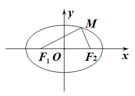
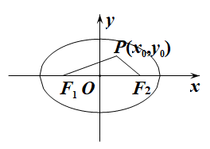
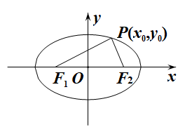
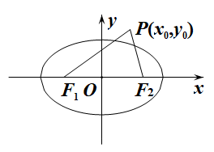
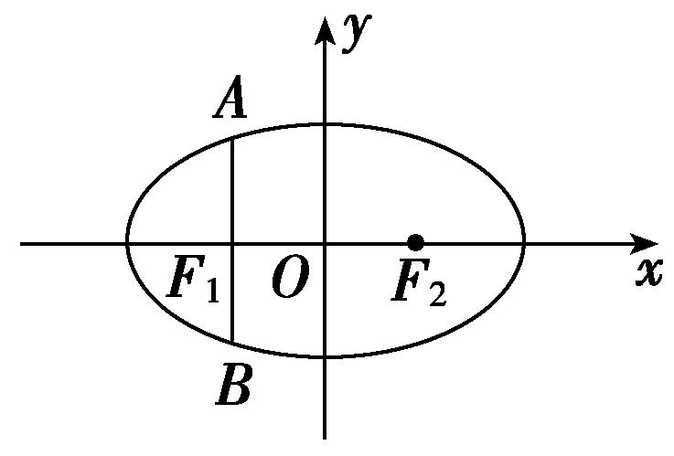
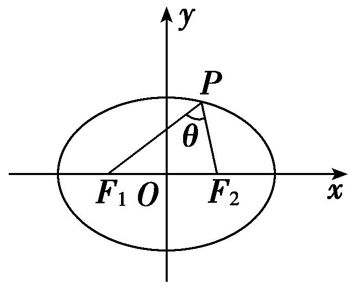
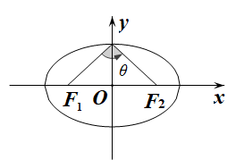
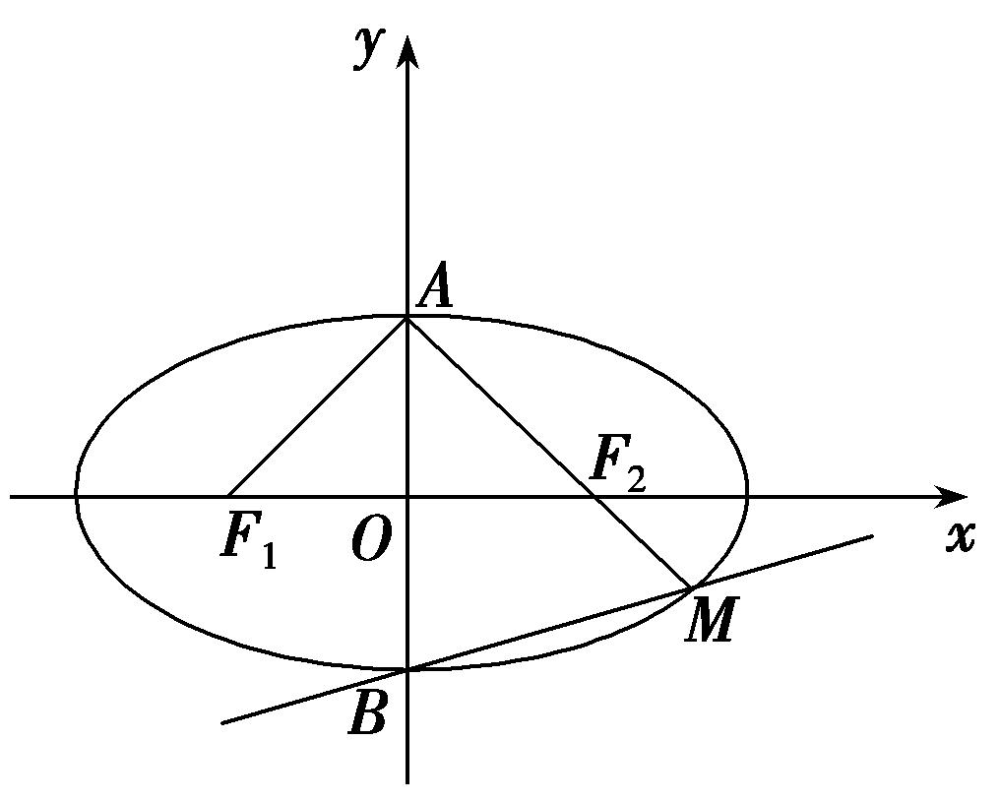
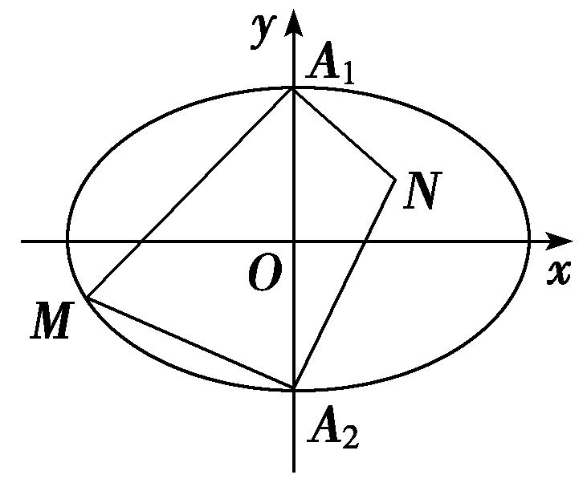
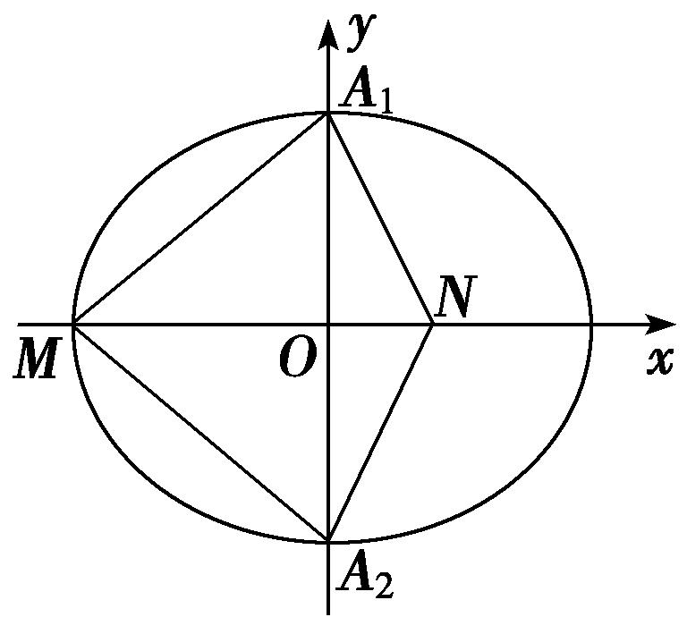

**专题06　椭圆模型**

**椭圆秒杀小题常用结论**

(1)椭圆定义：|<em>MF</em>1|＋|<em>MF</em>2|＝2<em>a</em>(2<em>a</em>＞|<em>F</em>1<em>F</em>2|)．如图(1)

  
图(1)　　　　　　　　　图(2)　　　　　　　　　图(3)　　　　　 　　　图(4)

(2)点<em>P</em>(<em>x</em>0，<em>y</em>0)和椭圆＋＝1(<em>a</em>＞<em>b</em>＞0)的关系

<em>P</em>(<em>x</em>0，<em>y</em>0)在椭圆内⇔<u>＋&lt;1</u>；<em>P</em>(<em>x</em>0，<em>y</em>0)在椭圆上⇔＋＝1；<em>P</em>(<em>x</em>0，<em>y</em>0)在椭圆外⇔<u>＋&gt;1</u>．

(3)如图(5)，椭圆的通径(过焦点且垂直于长轴的弦)长为|*AB*|＝，通径是最短的焦点弦．过焦点最长弦为长轴．过原点最长弦为长轴长2*a*，最短弦为短轴长2*b*．

  
图(5)　　　　　　　　　　　　　图(6)　　　　　　　　 　　　　　图(7)

(4)焦点三角形：椭圆上的点<em>P</em>(<em>x</em>0，<em>y</em>0)与两焦点<em>F</em>1，<em>F</em>2构成的△<em>PF</em>1<em>F</em>2叫做焦点三角形．若<em>r</em>1＝|<em>PF</em>1|，<em>r</em>2＝|<em>PF</em>2|，∠<em>F</em>1<em>PF</em>2＝<em>θ</em>，△<em>PF</em>1<em>F</em>2的面积为<em>S</em>，则在椭圆＋＝1(<em>a</em>＞<em>b</em>＞0)中如图(6)：

①△<em>PF</em>1<em>F</em>2的周长为2(<em>a</em>＋<em>c</em>)．②<em>S</em>＝<em>b</em>2tan．

(5)如图(7)<em>P</em>为椭圆＋＝1(<em>a</em>＞<em>b</em>＞0)上的动点，<em>F</em>1，<em>F</em>2分别为椭圆的左、右焦点，当椭圆上点<em>P</em>在短轴端点时与两焦点连线的夹角最大．

(6)<em>P</em>为椭圆＋＝1(<em>a</em>＞<em>b</em>＞0)上的点，<em>F</em>1，<em>F</em>2分别为椭圆的左、右焦点，则<em>P</em>到焦点的最长距离为<em><u>a</u></em><u>＋</u><em><u>c</u></em>，最短距离为<em><u>a</u></em><u>－</u><em><u>c</u></em>．

(7)如图(8)设<em>P</em>，<em>A</em>，<em>B</em>是椭圆＋＝1(<em>a</em>＞<em>b</em>＞0)上不同的三点，其中<em>A</em>，<em>B</em>关于原点对称，则<em>kPA</em>·<em>kPB</em>＝－＝<em>e</em>2－1．

  
图(8)　　　　　　　　　　　　　　　图(9)

(8)如图(9)设<em>A</em>，<em>B</em>是椭圆＋＝1(<em>a</em>＞<em>b</em>＞0)上不同的两点，<em>P</em>为弦<em>AB</em>的中点，则<em>kAB</em>·<em>kOP</em>＝－＝<em>e</em>2－1．

**【例题选讲】**

<strong>[例1]</strong>　(1)(2019·全国Ⅲ)设<em>F</em>1，<em>F</em>2为椭圆<em>C</em>：＋＝1的两个焦点，<em>M</em>为<em>C</em>上一点且在第一象限．若△<em>MF</em>1<em>F</em>2为等腰三角形，则<em>M</em>的坐标为\_\_\_\_\_\_\_\_\_\_\_\_．

<strong>答案</strong>　(3，)　<strong>解析</strong>　设<em>F</em>1为椭圆的左焦点，分析可知<em>M</em>在以<em>F</em>1为圆心、焦距为半径长的圆上，即在圆(<em>x</em>＋4)2＋<em>y</em>2＝64上．因为点<em>M</em>在椭圆＋＝1上，所以联立方程可得解得又因为点<em>M</em>在第一象限，所以点<em>M</em>的坐标为(3，)．

(2)已知椭圆*E*：＋＝1，直线*l*交椭圆于*A*，*B*两点，若*AB*的中点坐标为，则*l*的方程为(　　)

A．2*x*＋9*y*－10＝0　　　B．2*x*－9*y*－10＝0　　　C．2*x*＋9*y*＋10＝0　　　D．2*x*－9*y*＋10＝0

<strong>答案</strong>　D　<strong>解析</strong>　设<em>A</em>(<em>x</em>1，<em>y</em>1)，<em>B</em>(<em>x</em>2，<em>y</em>2)，则＋＝1，＋＝1，两式作差并化简整理得＝－×，而<em>x</em>1＋<em>x</em>2＝－1，<em>y</em>1＋<em>y</em>2＝2，所以＝－×＝，直线<em>l</em>的方程为<em>y</em>－1＝，即2<em>x</em>－9<em>y</em>＋10＝0.经验证可知符合题意．故选D．

(3)设椭圆＋＝1(<em>a</em>&gt;<em>b</em>&gt;0)的左右焦点分别为<em>F</em>1、<em>F</em>2，上下顶点分别为<em>A</em>、<em>B</em>，直线<em>AF</em>2与该椭圆交于<em>A</em>、<em>M</em>两点．若∠<em>F</em>1<em>AF</em>2＝120°，则直线<em>BM</em>的斜率为(　　)

A．　　　　　　　　B．　　　　　　　　C．　　　　　　　　D．

<strong>答案</strong>　B　<strong>解析</strong>　由题意，椭圆＋＝1(<em>a</em>&gt;<em>b</em>&gt;0)，且满足∠<em>F</em>1<em>AF</em>2＝120°，如图所示，

则在△<em>AF</em>2<em>O</em>中，|<em>OA</em>|＝<em>b</em>，|<em>AF</em>2|＝<em>a</em>，且∠<em>OAF</em>2＝60°，所以<em>a</em>＝2<em>b</em>，不妨设<em>b</em>＝1，则<em>a</em>＝2，所以<em>c</em>＝＝，则椭圆的方程为＋<em>y</em>2＝1，又由<em>A</em>(0,1)，<em>F</em>2(，0)，所以<em>kAF</em>2 ＝－，所以直线<em>AF</em>2的方程为<em>y</em>＝－<em>x</em>＋1，联立方程组，整理得7<em>x</em>2－8<em>x</em>＝0，解得<em>x</em>＝0或<em>x</em>＝，把<em>x</em>＝代入直线<em>y</em>＝－<em>x</em>＋1，解得<em>y</em>＝－，即<em>M</em> ，又由点<em>B</em>(0，－1)，所以<em>BM</em>的斜率为<em>kBM</em>＝＝，故选B．

(4)已知<em>P</em>为椭圆<em>C</em>：＋＝1上的一个动点，<em>F</em>1，<em>F</em>2是椭圆<em>C</em>的左、右焦点，<em>O</em>为坐标原点，<em>O</em>到椭圆<em>C</em>在<em>P</em>点处的切线距离为<em>d</em>，若|<em>PF</em>1|·|<em>PF</em>2|＝，则<em>d</em>＝\_\_\_\_\_\_\_\_．

<strong>答案　　解析</strong>　法一：因为点<em>P</em>在椭圆上，所以有|<em>PF</em>1|＋|<em>PF</em>2|＝4，又因为|<em>PF</em>1|·|<em>PF</em>2|＝，由余弦定理可得cos∠<em>F</em>1<em>PF</em>2＝＝，所以有sin∠<em>F</em>1<em>PF</em>2＝，所以△<em>F</em>1<em>PF</em>2的面积为<em>S</em>＝××＝×2×<em>yp</em>，解得<em>yp</em>＝，因为点<em>P</em>在椭圆上，所以<em>xp</em>＝．所以过该点的椭圆的切线方程为＋＝1，即为<em>x</em>＋<em>y</em>＝．所以原点<em>O</em>到直线的距离为<em>d</em>＝＝．

法二：设<em>P</em>(<em>m</em>，<em>n</em>)，则切线方程为＋＝1，即3<em>mx</em>＋4<em>ny</em>－12＝0．所以原点<em>O</em>到该切线的距离<em>d</em>＝．因为点<em>P</em>(<em>m</em>，<em>n</em>)在椭圆上，所以＋＝1，所以有<em>n</em>2＝3－，所以<em>d</em>＝．因为|<em>PF</em>1||<em>PF</em>2|＝，所以有 ＝，即有  ＝4－<em>m</em>2＝，解得16－<em>m</em>2＝，所以<em>d</em>＝＝．

(5)已知直线<em>MN</em>过椭圆＋<em>y</em>2＝1的左焦点<em>F</em>，与椭圆交于<em>M</em>，<em>N</em>两点，直线<em>PQ</em>过原点<em>O</em>与<em>MN</em>平行，且与椭圆交于<em>P</em>，<em>Q</em>两点，则＝\_\_\_\_\_\_\_\_．

<strong>答案</strong>　2　<strong>解析</strong>　方法一特殊化，设<em>MN</em>⊥<em>x</em>轴，则|<em>MN</em>|＝＝＝，|<em>PQ</em>|2＝4，＝＝2．

方法二　由题意知<em>F</em>(－1，0)，当直线<em>MN</em>的斜率不存在时，|<em>MN</em>|＝＝，|<em>PQ</em>|＝2<em>b</em>＝2，则＝2；当直线<em>MN</em>的斜率存在时，设直线<em>MN</em>的斜率为<em>k</em>，则<em>MN</em>的方程为<em>y</em>＝<em>k</em>(<em>x</em>＋1)，<em>M</em>(<em>x</em>1，<em>y</em>1)，<em>N</em>(<em>x</em>2，<em>y</em>2)，联立方程整理得(2<em>k</em>2＋1)<em>x</em>2＋4<em>k</em>2<em>x</em>＋2<em>k</em>2－2＝0，<em>Δ</em>＝8<em>k</em>2＋8&gt;0．由根与系数的关系，得<em>x</em>1＋<em>x</em>2＝－，<em>x</em>1<em>x</em>2＝，则|<em>MN</em>|＝＝．直线<em>PQ</em>的方程为<em>y</em>＝<em>kx</em>，<em>P</em>(<em>x</em>3，<em>y</em>3)，<em>Q</em>(<em>x</em>4，<em>y</em>4)，则解得<em>x</em>2＝，<em>y</em>2＝，则|<em>OP</em>|2＝<em>x</em>＋<em>y</em>＝，又|<em>PQ</em>|＝2|<em>OP</em>|，所以|<em>PQ</em>|2＝4|<em>OP</em>|2＝，所以＝2．综上，＝2．

(6)已知点<em>P</em>(<em>x</em>，<em>y</em>)在椭圆＋＝1上，<em>F</em>1，<em>F</em>2是椭圆的两个焦点，若△<em>PF</em>1<em>F</em>2的面积为18，则∠<em>F</em>1<em>PF</em>2的余弦值为\_\_\_\_\_\_\_\_．

<strong>答案　　解析</strong>　椭圆＋＝1的两个焦点为<em>F</em>1(0，－8)，<em>F</em>2(0，8)，由椭圆的定义知|<em>PF</em>1|＋|<em>PF</em>2|＝20，两边平方得|<em>PF</em>1|2＋|<em>PF</em>2|2＋2|<em>PF</em>1||<em>PF</em>2|＝202，由余弦定理得|<em>PF</em>1|2＋|<em>PF</em>2|2－2|<em>PF</em>1||<em>PF</em>2|·cos∠<em>F</em>1<em>PF</em>2＝162，两式相减得2|<em>PF</em>1||<em>PF</em>2|(1＋cos∠<em>F</em>1<em>PF</em>2)＝144．又<em>S</em>△<em>PF</em>1<em>F</em>2＝|<em>PF</em>1||<em>PF</em>2|sin∠<em>F</em>1<em>PF</em>2＝18，所以1＋cos∠<em>F</em>1<em>PF</em>2＝2sin∠<em>F</em>1<em>PF</em>2，解得cos∠<em>F</em>1<em>PF</em>2＝．

(7)在平面直角坐标系*xOy*中，直线*x*＋*y*－2＝0与椭圆*C*：＋＝1(*a*>*b*>0)相切，且椭圆*C*的右焦点*F*(*c*，0)关于直线*l*：*y*＝*x*的对称点*E*在椭圆*C*上，则△*OEF*的面积为(　　)

A．　　　　　　　　B．　　　　　　　　C．1　　　　　　　　D．2

<strong>答案</strong>　C　<strong>解析</strong>　联立方程可得消去<em>x</em>，化简得(<em>a</em>2＋2<em>b</em>2)<em>y</em>2－8<em>b</em>2<em>y</em>＋<em>b</em>2(8－<em>a</em>2)＝0，由<em>Δ</em>＝0得2<em>b</em>2＋<em>a</em>2－8＝0．设<em>F</em>′为椭圆<em>C</em>的左焦点，连接<em>F</em>′<em>E</em>，易知<em>F</em>′<em>E</em>∥<em>l</em>，所以<em>F</em>′<em>E</em>⊥<em>EF</em>，又点<em>F</em>到直线<em>l</em>的距离<em>d</em>＝＝，所以|<em>EF</em>|＝，|<em>F</em>′<em>E</em>|＝2<em>a</em>－|<em>EF</em>|＝，在Rt△<em>F</em>′<em>EF</em>中，|<em>F</em>′<em>E</em>|2＋|<em>EF</em>|2＝|<em>F</em>′<em>F</em>|2，化简得2<em>b</em>2＝<em>a</em>2，代入2<em>b</em>2＋<em>a</em>2－8＝0得<em>b</em>2＝2，<em>a</em>＝2，所以|<em>EF</em>|＝|<em>F</em>′<em>E</em>|＝2，所以<em>S</em>△<em>OEF</em>＝<em>S</em>△<em>F</em>′<em>EF</em>＝1．

(8)如图所示，<em>A</em>1，<em>A</em>2是椭圆<em>C</em>：＋＝1的短轴端点，点<em>M</em>在椭圆上运动，且点<em>M</em>不与<em>A</em>1，<em>A</em>2重合，点<em>N</em>满足<em>NA</em>1⊥<em>MA</em>1，<em>NA</em>2⊥<em>MA</em>2，则＝(　　)

A．　　　　　　　　B．　　　　　　　　C．　　　　　　　　D．

<strong>答案</strong>　C　<strong>解析</strong>　由题意以及选项的值可知：是常数，取<em>M</em>为椭圆的左顶点，由椭圆的性质可知<em>N</em>在<em>x</em>的正半轴上，如图：则<em>A</em>1(0，2)，<em>A</em>2是(0，－2)，<em>M</em>(－3，0)，由<em>OM</em>·<em>ON</em>＝<em>OA</em>，可得<em>ON</em>＝，则＝＝＝＝，故选C．

**【对点训练】**

1．已知椭圆＋＝1上的两点*A*，*B*关于直线2*x*－2*y*－3＝0对称，则弦*AB*的中点坐标为\_\_\_\_\_\_\_\_．

1．<strong>答案　　解析</strong>　设点<em>A</em>(<em>x</em>1，<em>y</em>1)，<em>B</em>(<em>x</em>2，<em>y</em>2)，弦<em>AB</em>的中点<em>M</em>(<em>x</em>0，<em>y</em>0)，由题意得两

式相减得＋＝0，因为点<em>A</em>，<em>B</em>关于直线2<em>x</em>－2<em>y</em>－3＝0对称，所以<em>kAB</em>＝＝－1，故－＝0，即<em>x</em>0＝4<em>y</em>0.又点<em>M</em>(<em>x</em>0，<em>y</em>0)在直线2<em>x</em>－2<em>y</em>－3＝0上，所以<em>x</em>0＝2，<em>y</em>0＝，即弦<em>AB</em>的中点坐标为.

2．已知椭圆<em>C</em>：9<em>x</em>2＋<em>y</em>2＝<em>m</em>2(<em>m</em>&gt;0)，直线<em>l</em>不过原点<em>O</em>且不平行于坐标轴，<em>l</em>与<em>C</em>有两个交点<em>A</em>，<em>B</em>，线段

*AB*的中点为*M*，则直线*OM*与直线*l*的斜率之积为(　　)

A．－9　　　　　　　　B．－　　　　　　　　C．－　　　　　　　　D．－3

2．<strong>答案</strong>　A　<strong>解析</strong>　设直线<em>l</em>：<em>y</em>＝<em>kx</em>＋<em>b</em>(<em>k</em>≠0，<em>b</em>≠0)，<em>A</em>(<em>x</em>1，<em>y</em>1)，<em>B</em>(<em>x</em>2，<em>y</em>2)，<em>M</em>(<em>xM</em>，<em>yM</em>)．将<em>y</em>＝<em>kx</em>＋<em>b</em>代

入9<em>x</em>2＋<em>y</em>2＝<em>m</em>2，得(<em>k</em>2＋9)<em>x</em>2＋2<em>kbx</em>＋<em>b</em>2－<em>m</em>2＝0，故<em>xM</em>＝＝－，<em>yM</em>＝<em>kxM</em>＋<em>b</em>＝，故直线<em>OM</em>的斜率<em>kOM</em>＝＝－，所以<em>kOM</em>·<em>k</em>＝－9，即直线<em>OM</em>与直线<em>l</em>的斜率之积为－9．

3．<em>P</em>为椭圆＋＝1上一点，<em>F</em>1，<em>F</em>2分别是椭圆的左、右焦点，过<em>P</em>点作<em>PH</em>⊥<em>F</em>1<em>F</em>2于点<em>H</em>，若<em>PF</em>1⊥

<em>PF</em>2，则|<em>PH</em>|＝(　　)

A． 　　　　　　　　B．　　　　　　　　C．8　　　　　　　　D．

3．<strong>答案</strong>　D　<strong>解析</strong>　由椭圆＋＝1得<em>a</em>2＝25，<em>b</em>2＝9，则<em>c</em>＝＝＝4，∴|<em>F</em>1<em>F</em>2|＝2<em>c</em>＝8．由

椭圆的定义可得|<em>PF</em>1|＋|<em>PF</em>2|＝2<em>a</em>＝10，∵<em>PF</em>1⊥<em>PF</em>2，∴|<em>PF</em>1|2＋|<em>PF</em>2|2＝64．∴2|<em>PF</em>1|·|<em>PF</em>2|＝(|<em>PF</em>1|＋|<em>PF</em>2|)2－(|<em>PF</em>1|2＋|<em>PF</em>2|2)＝100－64＝36，∴|<em>PF</em>1|·|<em>PF</em>2|＝18．又<em>S</em>△<em>PF</em>1<em>F</em>2＝|<em>PF</em>1|·|<em>PF</em>2|＝|<em>F</em>1<em>F</em>2|·|<em>PH</em>|，∴|<em>PH</em>|＝＝．故选D．

4．已知△<em>ABC</em>的顶点<em>B</em>，<em>C</em>在椭圆＋<em>y</em>2＝1上，顶点<em>A</em>是椭圆的一个焦点，且椭圆的另外一个焦点在<em>BC</em>

边上，则△*ABC*的周长是(　　)

A．2　　　　　　　　B．6　　　　　　　　C．4　　　　　　　　D．12

4．<strong>答案</strong>　C　<strong>解析</strong>　依题意，记椭圆的另一个焦点为<em>F</em>，则△<em>ABC</em>的周长等于|<em>AB</em>|＋|<em>AC</em>|＋|<em>BC</em>|＝|<em>AB</em>|＋|<em>AC</em>|

＋|*BF*|＋|*CF*|＝(|*AB*|＋|*BF*|)＋(|*AC*|＋|*CF*|)＝4，故选C．

5．设<em>F</em>1，<em>F</em>2为椭圆＋＝1的两个焦点，点<em>P</em>在椭圆上，若线段<em>PF</em>1的中点在<em>y</em>轴上，则的值为(　　)

A．　　　　　　　　B．　　　　　　　　C．　　　　　　　　D．

5．<strong>答案</strong>　B　<strong>解析</strong>　由题意知<em>a</em>＝3，<em>b</em>＝．由椭圆定义知|<em>PF</em>1|＋|<em>PF</em>2|＝6．在△<em>PF</em>1<em>F</em>2中，因为<em>PF</em>1的中

点在<em>y</em>轴上，<em>O</em>为<em>F</em>1<em>F</em>2的中点，由三角形中位线的性质可推得<em>PF</em>2⊥<em>x</em>轴，所以由<em>x</em>＝<em>c</em>时可得|<em>PF</em>2|＝＝，所以|<em>PF</em>1|＝6－|<em>PF</em>2|＝，所以＝，故选B．

6．已知椭圆*C*：＋＝1(*a*>*b*>0)及点*B*(0，*a*)，过点*B*与椭圆相切的直线交*x*轴的负半轴于点*A*，*F*为

椭圆的右焦点，则∠*ABF*＝(　　)

A．60°　　　　　　　　B．90°　　　　　　　　C．120°　　　　　　　　D．150°

6．<strong>答案</strong>　B　<strong>解析</strong>　由题意知，切线的斜率存在，设切线方程<em>y</em>＝<em>kx</em>＋<em>a</em>(<em>k</em>&gt;0)，与椭圆方程联立

消去<em>y</em>整理得(<em>b</em>2＋<em>a</em>2<em>k</em>2)<em>x</em>2＋2<em>ka</em>3<em>x</em>＋<em>a</em>4－<em>a</em>2<em>b</em>2＝0，由<em>Δ</em>＝(2<em>ka</em>3)2－4(<em>b</em>2＋<em>a</em>2<em>k</em>2)(<em>a</em>4－<em>a</em>2<em>b</em>2)＝0，得<em>k</em>＝，从而<em>y</em>＝<em>x</em>＋<em>a</em>交<em>x</em>轴于点<em>A</em>，又<em>F</em>(<em>c</em>，0)，易知·＝0，故∠<em>ABF</em>＝90°．

7．已知椭圆＋＝1的两个焦点是<em>F</em>1，<em>F</em>2，点<em>P</em>在该椭圆上，若|<em>PF</em>1|－|<em>PF</em>2|＝2，则△<em>PF</em>1<em>F</em>2的面积是(　　)

A．　　　　　　　　B．2　　　　　　　　C．2　　　　　　　　D．

7．<strong>答案</strong>　A　<strong>解析</strong>　由椭圆的方程可知<em>a</em>＝2，<em>c</em>＝，且|<em>PF</em>1|＋|<em>PF</em>2|＝2<em>a</em>＝4，又|<em>PF</em>1|－|<em>PF</em>2|＝2，所以|<em>PF</em>1|

＝3，|<em>PF</em>2|＝1．又|<em>F</em>1<em>F</em>2|＝2<em>c</em>＝2，所以有|<em>PF</em>1|2＝|<em>PF</em>2|2＋|<em>F</em>1<em>F</em>2|2，即△<em>PF</em>1<em>F</em>2为直角三角形，且∠<em>PF</em>2<em>F</em>1为直角，所以<em>S</em>△<em>PF</em>1<em>F</em>2＝|<em>F</em>1<em>F</em>2||<em>PF</em>2|＝×2×1＝．

8．设<em>P</em>为椭圆<em>C</em>：＋＝1上一点，<em>F</em>1，<em>F</em>2分别是椭圆<em>C</em>的左、右焦点，且△<em>PF</em>1<em>F</em>2的重心为<em>G</em>，若|<em>PF</em>1|

∶|<em>PF</em>2|＝3∶4，那么△<em>GPF</em>1的面积为(　　)

A．24　　　　　　　　B．12　　　　　　　　C．8　　　　　　　　D．6

8．<strong>答案</strong>　C　<strong>解析</strong>　∵<em>P</em>为椭圆<em>C</em>：＋＝1上一点，|<em>PF</em>1|∶|<em>PF</em>2|＝3∶4，|<em>PF</em>1|＋|<em>PF</em>2|＝2<em>a</em>＝14，∴|<em>PF</em>1|

＝6，|<em>PF</em>2|＝8，又∵|<em>F</em>1<em>F</em>2|＝2<em>c</em>＝2＝10，∴易知△<em>PF</em>1<em>F</em>2是直角三角形，<em>S</em>△<em>PF</em>1<em>F</em>2＝|<em>PF</em>1|·|<em>PF</em>2|＝24，∵△<em>PF</em>1<em>F</em>2的重心为点<em>G</em>，∴<em>S</em>△<em>PF</em>1<em>F</em>2＝3<em>S</em>△<em>GPF</em>1，∴△<em>GPF</em>1的面积为8，故选C．

