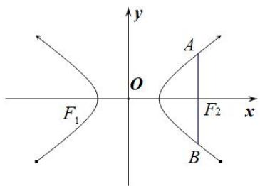
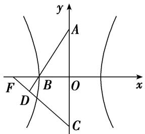

# 专题07 双曲线模型

# 双曲线线秒杀小题常用结论

(1)双曲线定义： $\|MF_{1}|-|MF_{2}\|=2a(2a<|F_{1}F_{2}|)$ . 如图(10)

text_image

y
M
F₁ O F₂ x

图(10)

text_image

y
P
O
F₁
F₂
x

图(11)

text_image

y
O
A
F₁
F₂
x
B

图(12)

(2)如图(11)双曲线的焦点到其渐近线的距离为 b. 与双曲线 $\frac{x^{2}}{a^{2}} - \frac{y^{2}}{b^{2}} = 1 (a > 0, b > 0)$ 有共同渐近线的方程可表示为 $\frac{x^{2}}{a^{2}} - \frac{y^{2}}{b^{2}} = t (t \neq 0)$ .  
(3)如图(12)同支的焦点弦中最短的为通径(过焦点且垂直于长轴的弦)，其长为 $\frac{2b^2}{a}$ ，异支的弦中最短的为实轴，其长为 $2a$ ；  
(4)如图(13)P 是双曲线上不同于实轴两端点的任意一点， $F_{1}$ 、 $F_{2}$ 分别为双曲线的左、右焦点，则 $S_{\triangle PF1F2}=b^{2}\frac{1}{\tan\frac{\theta}{2}}$ ，其中 $\theta$ 为 $\angle F_{1}PF_{2}$ .

text_image

y
P
θ
F₁ O F₂ x

图(13)

text_image

y
O
F₁
F₂ x

图(14)

(5)如图(14)双曲线 $\frac{x^2}{a^2} -\frac{y^2}{b^2} = 1(a > 0,b > 0)$ 的渐近线 $y = \pm \frac{b}{a} x$ 的斜率 $k = \pm \frac{b}{a}$ 与离心率 $e$ 的关系： $e = \sqrt{1 + (\frac{b}{a})^2} = \sqrt{1 + k^2}$

(6)若 P 是双曲线右支上一点， $F_{1}$ 、 $F_{2}$ 分别为双曲线的左、右焦点，则 $\left|PF_{1}\right|_{\min}=a+c,\quad\left|PF_{2}\right|_{\min}=c-a;$

(7)如图(15)设 P, A, B 是双曲线 $\frac{x^{2}}{a^{2}} - \frac{y^{2}}{b^{2}} = 1 (a > b > 0)$ 上不同的三点，其中 A, B 关于原点对称，则 $k_{PA} \cdot k_{PB} = \frac{b^{2}}{a^{2}} = e^{2} - 1$ .

text_image

y
O
A
x
B
P

text_image

y
A
P
O
x
B

图(15)

图(16)

(8)如图(16)设 A, B 是双曲线 $\frac{x^{2}}{a^{2}} - \frac{y^{2}}{b^{2}} = 1 (a > b > 0)$ 上不同的两点，P 为弦 AB 的中点，则 $k_{AB} \cdot k_{OP} = \frac{b^{2}}{a^{2}} = e^{2} - 1$ .

# 【例题选讲】

[例 2] (9)过点 $P(2,1)$ 作直线 l，使 l 与双曲线 $\frac{x^{2}}{4}-y^{2}=1$ 有且仅有一个公共点，这样的直线 l 共有()

A. 1 条

B. 2 条

C. 3 条

D. 4 条

(10)(2018·全国II)双曲线 $\frac{x^2}{a^2} -\frac{y^2}{b^2} = 1(a > 0,b > 0)$ 的离心率为 $\sqrt{3}$ ，则其渐近线方程为（

A. $y=\pm\sqrt{2}x$

B. $y=\pm\sqrt{3}x$

C. $y=\pm\frac{\sqrt{2}}{2}x$

D. $y=\pm\frac{\sqrt{3}}{2}x$

(11)已知双曲线 $C: \frac{x^2}{a^2} - \frac{y^2}{b^2} = 1 (a > 0, b > 0)$ 的左、右焦点分别为 $F_1, F_2, O$ 为坐标原点， $P$ 是双曲线在第一象限上的点，直线 $PO$ 交双曲线 $C$ 左支于点 $M$ ，直线 $PF_2$ 交双曲线 $C$ 右支于点 $N$ ，若 $|PF_1| = 2|PF_2|$ ，且 $\angle MF_2N = 60^\circ$ ，则双曲线 $C$ 的渐近线方程为（）

A. $y = \pm \sqrt{2} x$

B. $y=\pm\frac{\sqrt{2}}{2}x$

C. $y=\pm2x$

D. $y=\pm2\sqrt{2}x$

(12)已知双曲线 $C: \frac{x^2}{a^2} - \frac{y^2}{b^2} = 1 (a > 0, b > 0)$ 的左、右焦点分别为 $F_1, F_2$ ，点 $M$ 与双曲线 $C$ 的焦点不重合，点 $M$ 关于 $F_1, F_2$ 的对称点分别为 $A, B$ ，线段 $MN$ 的中点在双曲线的右支上，若 $|AN| - |BN| = 12$ ，则 $a = (\quad)$

A. 3

B. 4

C. 5

D. 6

(13)(2018·全国I)已知双曲线 $C: \frac{x^2}{3} - y^2 = 1$ ， $O$ 为坐标原点， $F$ 为 $C$ 的右焦点，过 $F$ 的直线与 $C$ 的两条渐近线的交点分别为 $M$ ， $N$ 。若 $\triangle OMN$ 为直角三角形，则 $|MN|$ 等于（）

A. $\frac{3}{2}$

B. 3

C. $2\sqrt{3}$

D. 4

(14)(2019·全国III)双曲线 $C: \frac{x^2}{4} - \frac{y^2}{2} = 1$ 的右焦点为 $F$ , 点 $P$ 在 $C$ 的一条渐近线上, $O$ 为坐标原点, 若 $|PO| = |PF|$ , 则 $\triangle PFO$ 的面积为 ( )

A. $\frac{3\sqrt{2}}{4}$

B. $\frac{3\sqrt{2}}{2}$

C. $2\sqrt{2}$

D. $3\sqrt{2}$

# 【对点训练】

9. 过双曲线 $\frac{x^2}{a^2} - \frac{y^2}{b^2} = 1 (a > 0, b > 0)$ 的右焦点 $F(1, 0)$ 作 $x$ 轴的垂线，与双曲线交于 $A, B$ 两点， $O$ 为坐标原点，若 $\triangle AOB$ 的面积为 $\frac{8}{3}$ ，则双曲线的渐近线方程为 \_\_\_\_.

10. 已知双曲线 $C: \frac{x^2}{a^2} - \frac{y^2}{b^2} = 1 (a, b > 0)$ 的右顶点 $A$ 和右焦点 $F$ 到一条渐近线的距离之比为 $1: \sqrt{2}$ , 则 $C$ 的渐近线方程为( )

A. $y = \pm x$

B. $y=\pm\sqrt{2}x$

C. $y=\pm2x$

D. $y=\pm\sqrt{3}x$

11. 双曲线 $\frac{x^2}{a^2} - \frac{y^2}{b^2} = 1 (a > 0, b > 0)$ 的两条渐近线分别为 $l_1, l_2, F$ 为其一个焦点，若 $F$ 关于 $l_1$ 的对称点在 $l_2$ 上，则双曲线的渐近线方程为（）

A. $y=\pm2x$

B. $y=\pm\sqrt{3}x$

C. $y=\pm3x$

D. $y=\pm\sqrt{2}x$

12. 已知 $F_{1}, F_{2}$ 分别是双曲线 $\frac{x^{2}}{a^{2}} - \frac{y^{2}}{b^{2}} = 1 (a > 0, b > 0)$ 的左、右焦点， $P$ 是双曲线上一点，若 $|PF_{1}| + |PF_{2}| = 6a$ ，且 $\triangle PF_{1}F_{2}$ 的最小内角为 $\frac{\pi}{6}$ ，则双曲线的渐近线方程为（）

A. $y=\pm2x$

B. $y=\pm\frac{1}{2}x$

C. $y=\pm\frac{\sqrt{2}}{2}x$

D. $y=\pm\sqrt{2}x$

13. 已知 $F_{2}, F_{1}$ 是双曲线 $\frac{y^{2}}{a^{2}} - \frac{x^{2}}{b^{2}} = 1 (a > 0, b > 0)$ 的上、下两个焦点，过 $F_{1}$ 的直线与双曲线的上下两支分别交于点 $B, A$ ，若 $\triangle ABF_{2}$ 为等边三角形，则双曲线的渐近线方程为（）

A. $y = \pm \sqrt{2} x$

B. $y=\pm\frac{\sqrt{2}}{2}x$

C. $y = \pm \sqrt{6} x$

D. $y=\pm\frac{\sqrt{6}}{6}x$

14. 已知 $F_{1}, F_{2}$ 是双曲线 $C: \frac{x^{2}}{a^{2}} - \frac{y^{2}}{b^{2}} = 1 (a > 0, b > 0)$ 的两个焦点， $P$ 是 $C$ 上一点，若 $|PF_{1}| + |PF_{2}| = 6a$ ，且 $\triangle PF_{1}F_{2}$ 最小内角的大小为 $30^{\circ}$ ，则双曲线 $C$ 的渐近线方程是（）

A. $\sqrt{2}x\pm y=0$

B. $x \pm \sqrt{2}y = 0$

C. $x \pm 2y = 0$

D. $2x \pm y = 0$

15. 已知双曲线 $\Gamma: \frac{x^2}{a^2} - \frac{y^2}{b^2} = 1 (a > 0, b > 0)$ 的右顶点为 $A$ ，与 $x$ 轴平行的直线交 $\Gamma$ 于 $B$ ， $C$ 两点，记 $\angle BAC = \theta$ ，若 $\Gamma$ 的离心率为 $\sqrt{2}$ ，则（）

A. $\theta\in\left(0,\frac{\pi}{2}\right)$

B. $\theta=\frac{\pi}{2}$

C. $\theta \in \left[\frac{3\pi}{4}, \pi\right]$

D. $\theta=\frac{3\pi}{4}$

16. 已知 $F_{1}, F_{2}$ 为双曲线 $C: x^{2} - y^{2} = 2$ 的左、右焦点，点 $P$ 在 $C$ 上， $|PF_{1}| = 2|PF_{2}|$ ，则 $\cos \angle F_{1}PF_{2} = \_$ .

17. 如图, 双曲线的中心在坐标原点 $O$ , $A$ , $C$ 分别是双曲线虚轴的上、下端点, $B$ 是双曲线的左顶点, $F$ 为双曲线的左焦点, 直线 $AB$ 与 $FC$ 相交于点 $D$ . 若双曲线的离心率为 2 , 则 $\angle BDF$ 的余弦值是 \_\_\_\_.

text_image

y
A
F
B
O
x
D
C

18. 过点 $P(4, 2)$ 作一直线 $AB$ 与双曲线 $C: \frac{x^2}{2} - y^2 = 1$ 相交于 $A, B$ 两点，若 $P$ 为 $AB$ 的中点，则 $|AB| = (\quad)$

A. $2 \sqrt{2}$

B. $2 \sqrt{3}$

C. $3\sqrt{3}$

D. $4\sqrt{3}$

19. 过点 $P(4, 2)$ 作一直线 $AB$ 与双曲线 $C: \frac{x^2}{2} - y^2 = 1$ 相交于 $A$ 、 $B$ 两点，若 $P$ 为 $AB$ 中点，则 $|AB| = (\quad)$

A. $2 \sqrt{2}$

B. $2\sqrt{3}$

C. $3\sqrt{3}$

D. $4\sqrt{3}$

20. 已知双曲线 $\frac{x^2}{3} - y^2 = 1$ 的左、右焦点分别为 $F_{1}, F_{2}$ ，点 $P$ 在双曲线上，且满足 $|PF_{1}| + |PF_{2}| = 2\sqrt{5}$ ，则 $\triangle PF_{1}F_{2}$ 的面积为（）

A. 1

B. $\sqrt{3}$

C. $\sqrt{5}$

D. $\frac{1}{2}$

21. 已知双曲线 $C: \frac{x^2}{a^2} - \frac{y^2}{b^2} = 1 (a > 0, b > 0)$ 的离心率为 2，左、右焦点分别为 $F_1, F_2$ ，点 $A$ 在双曲线 $C$ 上，

若 $\triangle AF_{1}F_{2}$ 的周长为10a，则 $\triangle AF_{1}F_{2}$ 的面积为()

A. $2 \sqrt{15} a^{2}$

B. $\sqrt{15} a^{2}$

C. $30a^{2}$

D. $15a^{2}$

22. 已知双曲线 $x^{2} - \frac{y^{2}}{3} = 1$ 的左、右焦点分别为 $F_{1}, F_{2}$ ，双曲线的离心率为 $e$ ，若双曲线上存在一点 $P$ 使 $\frac{\sin\angle PF_2F_1}{\sin\angle PF_1F_2} = e$ ，则 $\overrightarrow{F_2P} \cdot \overrightarrow{F_2F_1}$ 的值为（）

A. 3

B. 2

C.-3

D. -2

