# 专题07 双曲线模型

# 双曲线线秒杀小题常用结论

(1)双曲线定义： $\|MF_{1}|-|MF_{2}\|=2a(2a<|F_{1}F_{2}|)$ . 如图(10)

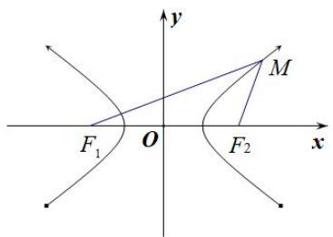

text_image

y
M
F₁ O F₂ x

图(10)

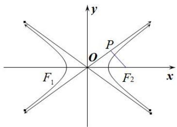

text_image

y
P
O
F₁
F₂
x

图(11)

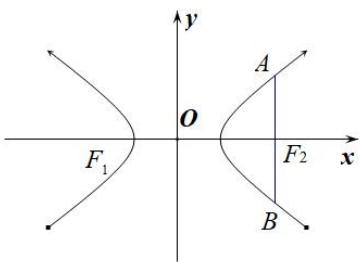

text_image

y
O
A
F₁
F₂
x
B

图(12)

(2)如图(11)双曲线的焦点到其渐近线的距离为 b. 与双曲线 $\frac{x^{2}}{a^{2}} - \frac{y^{2}}{b^{2}} = 1 (a > 0, b > 0)$ 有共同渐近线的方程可表示为 $\frac{x^{2}}{a^{2}} - \frac{y^{2}}{b^{2}} = t (t \neq 0)$ .  
(3)如图(12)同支的焦点弦中最短的为通径(过焦点且垂直于长轴的弦)，其长为 $\frac{2b^2}{a}$ ，异支的弦中最短的为实轴，其长为 $2a$ ；  
(4)如图(13)P 是双曲线上不同于实轴两端点的任意一点， $F_{1}$ 、 $F_{2}$ 分别为双曲线的左、右焦点，则 $S_{\triangle PF1F2}=b^{2}\frac{1}{\tan\frac{\theta}{2}}$ ，其中 $\theta$ 为 $\angle F_{1}PF_{2}$ .

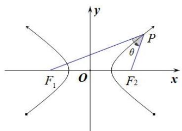

text_image

y
P
θ
F₁ O F₂ x
x

图(13)

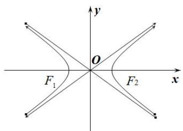

text_image

y
O
F₁
F₂ x

图(14)

(5)如图(14)双曲线 $\frac{x^2}{a^2} -\frac{y^2}{b^2} = 1(a > 0,b > 0)$ 的渐近线 $y = \pm \frac{b}{a} x$ 的斜率 $k = \pm \frac{b}{a}$ 与离心率 $e$ 的关系： $e = \sqrt{1 + (\frac{b}{a})^2} = \sqrt{1 + k^2}$

(6)若 P 是双曲线右支上一点， $F_{1}$ 、 $F_{2}$ 分别为双曲线的左、右焦点，则 $\left|PF_{1}\right|_{\min}=a+c,\quad\left|PF_{2}\right|_{\min}=c-a;$

(7)如图(15)设 P, A, B 是双曲线 $\frac{x^{2}}{a^{2}} - \frac{y^{2}}{b^{2}} = 1 (a > b > 0)$ 上不同的三点，其中 A, B 关于原点对称，则 $k_{PA} \cdot k_{PB} = \frac{b^{2}}{a^{2}} = e^{2} - 1$ .

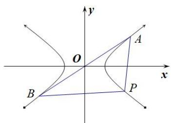

text_image

y
O
A
x
B
P

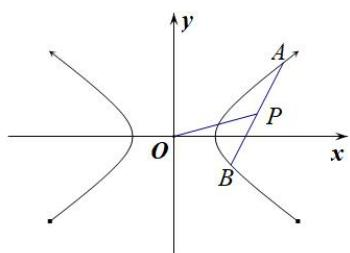

text_image

y
A
P
O
x
B

图(15)

图(16)

(8)如图(16)设 A, B 是双曲线 $\frac{x^{2}}{a^{2}} - \frac{y^{2}}{b^{2}} = 1 (a > b > 0)$ 上不同的两点，P 为弦 AB 的中点，则 $k_{AB} \cdot k_{OP} = \frac{b^{2}}{a^{2}} = e^{2} - 1$ .

# 【例题选讲】

[例 2] (9)过点 $P(2,1)$ 作直线 l，使 l 与双曲线 $\frac{x^{2}}{4}-y^{2}=1$ 有且仅有一个公共点，这样的直线 l 共有()

A. 1 条

B. 2 条

C. 3 条

D. 4 条

答案 B 解析 依题意，双曲线的渐近线方程是 $y = \pm \frac{1}{2} x$ ，点 $P$ 在直线 $y = \frac{1}{2} x$ 上。①当直线 $l$ 的斜率不存在时，直线 $l$ 的方程为 $x = 2$ ，此时直线 $l$ 与双曲线有且仅有一个公共点(2,0)，满足题意。②当直线 $l$ 的斜率存在时，设直线 $l$ 的方程为 $y - 1 = k(x - 2)$ ，即 $y = kx + 1 - 2k$ ，由 $\left\{\begin{aligned}y &= kx + 1 - 2k,\\ x^2 - 4y^2 &= 4,\end{aligned}\right.$ 消去 $y$ 得 $x^2 - 4(kx + 1 - 2k)^2 = 4$ ，即 $(1 - 4k^2)x^2 - 8(1 - 2k)kx - 4(1 - 2k)^2 - 4 = 0$ ，(\*)。若 $1 - 4k^2 = 0$ ，则 $k = \pm \frac{1}{2}$ ，当 $k = \frac{1}{2}$ 时，方程(\*)无实数解，因此 $k = \frac{1}{2}$ 不满足题意；当 $k = -\frac{1}{2}$ 时，方程(\*)有唯一实数解，因此 $k = -\frac{1}{2}$ 满足题意。若 $1 - 4k^2 \neq 0$ ，即 $k \neq \pm \frac{1}{2}$ ，此时 $A = 64k^2(1 - 2k)^2 + 16(1 - 4k^2)[(1 - 2k)^2 + 1] = 0$ 不成立，因此满足题意的实数 $k$ 不存在。综上所述，满足题意的直线 $l$ 共有2条。

(10)(2018·全国II)双曲线 $\frac{x^2}{a^2} -\frac{y^2}{b^2} = 1(a > 0,b > 0)$ 的离心率为 $\sqrt{3}$ ，则其渐近线方程为（

A. $y=\pm\sqrt{2}x$

B. $y=\pm\sqrt{3}x$

C. $y=\pm\frac{\sqrt{2}}{2}x$

D. $y=\pm\frac{\sqrt{3}}{2}x$

答案 A 解析 法一：由题意知， $e=\frac{c}{a}=\sqrt{3}$ ，所以 $c=\sqrt{3}a$ ，所以 $b=\sqrt{c^{2}-a^{2}}=\sqrt{2}a$ ，所以 $\frac{b}{a}=\sqrt{2}$ ，所以该双曲线的渐近线方程为 $y=\pm\frac{b}{a}x=\pm\sqrt{2}x$ ，故选 A.

法二：由 $e=\frac{c}{a}=\sqrt{1+\left(\frac{b}{a}\right)^{2}}=\sqrt{3}$ ，得 $\frac{b}{a}=\sqrt{2}$ ，所以该双曲线的渐近线方程为 $y=\pm\frac{b}{a}x=\pm\sqrt{2}x$ ，故选 A.

(11)已知双曲线 $C: \frac{x^2}{a^2} - \frac{y^2}{b^2} = 1 (a > 0, b > 0)$ 的左、右焦点分别为 $F_1, F_2, O$ 为坐标原点， $P$ 是双曲线在第一象限上的点，直线 $PO$ 交双曲线 $C$ 左支于点 $M$ ，直线 $PF_2$ 交双曲线 $C$ 右支于点 $N$ ，若 $|PF_1| = 2|PF_2|$ ，且 $\angle MF_2N = 60^\circ$ ，则双曲线 $C$ 的渐近线方程为（）

A. $y = \pm \sqrt{2} x$

B. $y=\pm\frac{\sqrt{2}}{2}x$

C. $y=\pm2x$

D. $y=\pm2\sqrt{2}x$

答案 A 解析 由题意得， $|PF_{1}|=2|PF_{2}|$ ， $|PF_{1}|-|PF_{2}|=2a$ ， $\therefore|PF_{1}|=4a$ ， $|PF_{2}|=2a$ ，由于 P，M 关于原点对称， $F_{1}$ ， $F_{2}$ 关于原点对称，∴线段 PM， $F_{1}F_{2}$ 互相平分，四边形 $PF_{1}MF_{2}$ 为平行四边形， $PF_{1}//MF_{2}$ ， $\because\angle MF_{2}N=60^{\circ}$ ， $\therefore\angle F_{1}PF_{2}=60^{\circ}$ ，由余弦定理可得 $4c^{2}=16a^{2}+4a^{2}-2\cdot4a\cdot2a\cdot\cos60^{\circ}$ ， $\therefore c=\sqrt{3}a$ ， $\therefore b=\sqrt{c^{2}-a^{2}}=\sqrt{2}a$ 。 $\therefore\frac{b}{a}=\sqrt{2}$ ，∴双曲线 C 的渐近线方程为 $y=\pm\sqrt{2}x$ 。故选 A.

(12)已知双曲线 $C: \frac{x^2}{a^2} - \frac{y^2}{b^2} = 1 (a > 0, b > 0)$ 的左、右焦点分别为 $F_1, F_2$ ，点 $M$ 与双曲线 $C$ 的焦点不重合，点 $M$ 关于 $F_1, F_2$ 的对称点分别为 $A, B$ ，线段 $MN$ 的中点在双曲线的右支上，若 $|AN| - |BN| = 12$ ，则 $a = (\quad)$

A. 3

B. 4

C. 5

D. 6

答案 A 解析 如图，设 \(MN\) 的中点为 \(P\)。\$\because F\_1\$ 为 \(MA\) 的中点，\(F\_2\) 为 \(MB\) 的中点，\$\therefore |AN| = 2|PF\_1|\)，\(|BN| = 2|PF\_2|\)，又 \(|AN| - |BN| = 12\)，\$\therefore |PF\_1| - |PF\_2| = 6 = 2a\$，\$\therefore a = 3\$。故选 A.

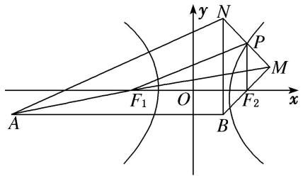

text_image

y
N
P
M
F₁ O F₂ x
A B

(13)(2018·全国I)已知双曲线 $C: \frac{x^2}{3} - y^2 = 1$ ， $O$ 为坐标原点， $F$ 为 $C$ 的右焦点，过 $F$ 的直线与 $C$ 的两条渐近线的交点分别为 $M$ ， $N$ 。若 $\triangle OMN$ 为直角三角形，则 $|MN|$ 等于（）

A. $\frac{3}{2}$

B. 3

C. $2\sqrt{3}$

D. 4

答案 B 解析 由已知得双曲线的两条渐近线方程为 $y = \pm \frac{1}{\sqrt{3}} x$ . 设两渐近线的夹角为 $2\alpha$ ，则有 $\tan \alpha = \frac{1}{\sqrt{3}} = \frac{\sqrt{3}}{3}$ ，所以 $\alpha = 30^\circ$ . 所以 $\angle MON = 2\alpha = 60^\circ$ . 又 $\triangle OMN$ 为直角三角形，由于双曲线具有对称性，不妨设 $MN \perp ON$ ，如图所示.

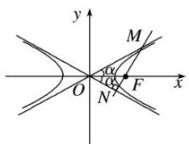

text_image

y
M
α
O
α
N
F
x

在 Rt△ONF 中， $|OF|=2$ ，则 $|ON|=\sqrt{3}$ 。则在 Rt△OMN 中， $|MN|=|ON|\cdot\tan2\alpha=\sqrt{3}\cdot\tan60^{\circ}=3$ 。故选 B.

(14)(2019·全国III)双曲线 $C: \frac{x^2}{4} - \frac{y^2}{2} = 1$ 的右焦点为 $F$ , 点 $P$ 在 $C$ 的一条渐近线上, $O$ 为坐标原点, 若 $|PO| = |PF|$ , 则 $\triangle PFO$ 的面积为 ( )

A. $\frac{3\sqrt{2}}{4}$

B. $\frac{3\sqrt{2}}{2}$

C. $2\sqrt{2}$

D. $3\sqrt{2}$

答案 A 解析 双曲线 $\frac{x^2}{4} - \frac{y^2}{2} = 1$ 的右焦点坐标为 $(\sqrt{6}, 0)$ ，一条渐近线的方程为 $y = \frac{\sqrt{2}}{2} x$ ，不妨设点 $P$ 在第一象限，由于 $|PO| = |PF|$ ，则点 $P$ 的横坐标为 $\frac{\sqrt{6}}{2}$ ，纵坐标为 $\frac{\sqrt{2}}{2} \times \frac{\sqrt{6}}{2} = \frac{\sqrt{3}}{2}$ ，即 $\triangle PFO$ 的底边长为 $\sqrt{6}$ ，高为 $\frac{\sqrt{3}}{2}$ ，所以它的面积为 $\frac{1}{2} \times \sqrt{6} \times \frac{\sqrt{3}}{2} = \frac{3\sqrt{2}}{4}$ 。故选 A.

# 【对点训练】

9. 过双曲线 $\frac{x^2}{a^2} - \frac{y^2}{b^2} = 1 (a > 0, b > 0)$ 的右焦点 $F(1, 0)$ 作 $x$ 轴的垂线，与双曲线交于 $A, B$ 两点， $O$ 为坐标原点，若 $\triangle AOB$ 的面积为 $\frac{8}{3}$ ，则双曲线的渐近线方程为 \_\_\_\_.

9. 答案 $y = \pm 2\sqrt{2} x$ 解析 由题意得 $|AB| = \frac{2b^2}{a}$ , $\because S_{\triangle AOB} = \frac{8}{3}$ , $\therefore \frac{1}{2} \times \frac{2b^2}{a} \times 1 = \frac{8}{3}$ , $\therefore \frac{b^2}{a} = \frac{8}{3}$ ①, 又 $a^2 + b^2 = 1$

②，由①②得 $a=\frac{1}{3}$ ， $b=\frac{2\sqrt{2}}{3}$ ，∴双曲线的渐近线方程为 $y=\pm\frac{b}{a}=±2\sqrt{2}x$ .

10. 已知双曲线 $C: \frac{x^2}{a^2} - \frac{y^2}{b^2} = 1 (a, b > 0)$ 的右顶点 $A$ 和右焦点 $F$ 到一条渐近线的距离之比为 $1: \sqrt{2}$ , 则 $C$ 的渐近线方程为( )

A. $y = \pm x$

B. $y=\pm\sqrt{2}x$

C. $y=\pm2x$

D. $y=\pm\sqrt{3}x$

10. 答案 A 解析 由双曲线方程可得渐近线为: $y = \pm \frac{b}{a} x, A(a,0), F(c,0)$ , 则点 $A$ 到渐近线距离 $d_1 = \frac{|ab|}{\sqrt{a^2 + b^2}} = \frac{ab}{c}$ , 点 $F$ 到渐近线距离 $d_2 = \frac{|bc|}{\sqrt{a^2 + b^2}} = \frac{bc}{c} = b, \therefore d_1 : d_2 = \frac{ab}{c} : b = a : c = 1 : \sqrt{2}$ , 即 $c = \sqrt{2} a$ , 则 $\frac{b}{a} = \frac{\sqrt{c^2 - a^2}}{a} = \frac{a}{a} = 1, \therefore$ 双曲线渐近线方程为 $y = \pm x$ . 故选 A.

11. 双曲线 $\frac{x^2}{a^2} - \frac{y^2}{b^2} = 1 (a > 0, b > 0)$ 的两条渐近线分别为 $l_1, l_2, F$ 为其一个焦点，若 $F$ 关于 $l_1$ 的对称点在 $l_2$ 上，则双曲线的渐近线方程为（）

A. $y=\pm2x$

B. $y=\pm\sqrt{3}x$

C. $y=\pm3x$

D. $y=\pm\sqrt{2}x$

11. 答案 B 解析 不妨取 $F(c, 0)$ ， $l_{1}$ : bx - ay = 0，设其对称点 $F'(m, n)$ 在 $l_{2}$ : $bx + ay = 0$ ，由对称性可得 $\left\{\begin{aligned}&b\cdot\frac{m+c}{2}-a\cdot\frac{n}{2}=0\\&\frac{n}{m-c}\cdot\frac{b}{a}=-1\end{aligned}\right.$ ，解得 $\left\{\begin{aligned}&m=\frac{a^{2}-b^{2}}{a^{2}+b^{2}}c\\&n=\frac{2abc}{a^{2}+b^{2}}\end{aligned}\right.$ ，点 $F'(m, n)$ 在 $l_{2}$ : $bx + ay = 0$ ，则 $\frac{a^{2}-b^{2}}{a^{2}+b^{2}}\cdot bc+\frac{2a^{2}bc}{a^{2}+b^{2}}=0$ ，整理可得 $\frac{b^{2}}{a^{2}}=3$ ，∴ $\frac{b}{a}=\sqrt{3}$ ，双曲线的渐近线方程为： $y=\pm\frac{b}{a}x=\pm\sqrt{3}x$ 。故选 B.

12. 已知 $F_{1}, F_{2}$ 分别是双曲线 $\frac{x^{2}}{a^{2}} - \frac{y^{2}}{b^{2}} = 1 (a > 0, b > 0)$ 的左、右焦点， $P$ 是双曲线上一点，若 $|PF_{1}| + |PF_{2}| = 6a$ ，且 $\triangle PF_{1}F_{2}$ 的最小内角为 $\frac{\pi}{6}$ ，则双曲线的渐近线方程为（）

A. $y = \pm 2x$

B. $y=\pm\frac{1}{2}x$

C. $y=\pm\frac{\sqrt{2}}{2}x$

D. $y=\pm\sqrt{2}x$

12. 答案 D 解析 不妨设 $P$ 为双曲线右支上一点，则 $\left|PF_{1}\right| > \left|PF_{2}\right|$ ，由双曲线的定义得 $\left|PF_{1}\right| - \left|PF_{2}\right| = 2a$ ，又 $\left|PF_{1}\right| + \left|PF_{2}\right| = 6a$ ，所以 $\left|PF_{1}\right| = 4a$ ， $\left|PF_{2}\right| = 2a$ 。又因为 $\left\{ \begin{array}{l} 2c > 2a, \\ 4a > 2a, \end{array} \right.$ 所以 $\angle PF_{1}F_{2}$ 为最小内角，故 $\angle PF_{1}F_{2} = \frac{\pi}{6}$ 。由余弦定理，可得 $\frac{(4a)^{2} + (2c)^{2} - (2a)^{2}}{2 \cdot 4a \cdot 2c} = \frac{\sqrt{3}}{2}$ ，即 $(\sqrt{3} a - c)^{2} = 0$ ，所以 $c = \sqrt{3} a$ ，则 $b = \sqrt{2} a$ ，所以双曲线的渐近线方程为 $y = \pm \sqrt{2} x$ 。

13. 已知 $F_{2}$ , $F_{1}$ 是双曲线 $\frac{y^{2}}{a^{2}} - \frac{x^{2}}{b^{2}} = 1 (a > 0, b > 0)$ 的上、下两个焦点，过 $F_{1}$ 的直线与双曲线的上下两支分别交于点 $B$ , $A$ ，若 $\triangle ABF_{2}$ 为等边三角形，则双曲线的渐近线方程为（）

A. $y = \pm \sqrt{2} x$

B. $y=\pm\frac{\sqrt{2}}{2}x$

C. $y=\pm\sqrt{6}x$

D. $y=\pm\frac{\sqrt{6}}{6}x$

13. 答案 D 解析 根据双曲线的定义，可得 $|BF_{1}|-|BF_{2}|=2a$ ，∵ $\triangle ABF_{2}$ 为等边三角形，∴ $|BF_{2}|=|AB|$ ，∴ $|BF_{1}|-|AB|=|AF_{1}|=2a$ ，又∵ $|AF_{2}|-|AF_{1}|=2a$ ，∴ $|AF_{2}|=|AF_{1}|+2a=4a$ ，∵在 $\triangle AF_{1}F_{2}$ 中， $|AF_{1}|=2a$ ， $|AF_{2}|=4a$ ， $\angle F_{1}AF_{2}=120^{\circ}$ ，∴ $|F_{1}F_{2}|^{2}=|AF_{1}|^{2}+|AF_{2}|^{2}-2|AF_{1}|\cdot|AF_{2}|\cos120^{\circ}$ ，即 $4c^{2}=4a^{2}+16a^{2}-$

$2 \times 2a \times 4a \times \left(-\frac{1}{2}\right) = 28a^{2}$ ，亦即 $c^{2} = 7a^{2}$ ，则 $b = \sqrt{c^{2} - a^{2}} = \sqrt{6a^{2}} = \sqrt{6}a$ ，由此可得双曲线 C 的渐近线方程为 $y = \pm \frac{\sqrt{6}}{6}x$ .

14. 已知 $F_{1}, F_{2}$ 是双曲线 $C: \frac{x^{2}}{a^{2}} - \frac{y^{2}}{b^{2}} = 1 (a > 0, b > 0)$ 的两个焦点， $P$ 是 $C$ 上一点，若 $|PF_{1}| + |PF_{2}| = 6a$ ，且 $\triangle PF_{1}F_{2}$ 最小内角的大小为 $30^{\circ}$ ，则双曲线 $C$ 的渐近线方程是（）

A. $\sqrt{2}x\pm y=0$

B. $x \pm \sqrt{2}y = 0$

C. $x \pm 2y = 0$

D. $2x \pm y = 0$

14. 答案 A 解析 由题意，不妨设 $|PF_{1}|>|PF_{2}|$ ，则根据双曲线的定义得， $|PF_{1}|-|PF_{2}|=2a$ ，又 $|PF_{1}|+|PF_{2}|=6a$ ，解得 $|PF_{1}|=4a$ ， $|PF_{2}|=2a$ 。在 $\triangle PF_{1}F_{2}$ 中， $|F_{1}F_{2}|=2c$ ，而c>a，所以有 $|PF_{2}|<|F_{1}F_{2}|$ ，所以 $\angle PF_{1}F_{2}=30^{\circ}$ ，所以 $(2a)^{2}=(2c)^{2}+(4a)^{2}-2\cdot2c\cdot4a\cos30^{\circ}$ ，得 $c=\sqrt{3}a$ ，所以 $b=\sqrt{c^{2}-a^{2}}=\sqrt{2}a$ 。所以双曲线的渐近线方程为 $y=\pm\frac{b}{a}x=\pm\sqrt{2}x$ ，即 $\sqrt{2}x\pm y=0$ 。

15. 已知双曲线 $\Gamma: \frac{x^2}{a^2} - \frac{y^2}{b^2} = 1 (a > 0, b > 0)$ 的右顶点为 $A$ ，与 $x$ 轴平行的直线交 $\Gamma$ 于 $B$ ， $C$ 两点，记 $\angle BAC = \theta$ ，若 $\Gamma$ 的离心率为 $\sqrt{2}$ ，则（）

A. $\theta\in\left(0,\frac{\pi}{2}\right)$

B. $\theta=\frac{\pi}{2}$

C. $\theta \in \left( \frac{3\pi}{4}, \pi \right)$

D. $\theta = \frac{3\pi}{4}$

15. 答案 B 解析 $\because e = \frac{c}{a} = \sqrt{2}, \therefore c = \sqrt{2} a, \therefore b^2 = c^2 - a^2 = a^2, \therefore$ 双曲线方程可变形为 $x^2 - y^2 = a^2$ . 设 $B(x_0, y_0)$ , 由对称性可知 $C(-x_0, y_0)$ , $\because$ 点 $B(x_0, y_0)$ 在双曲线上, $\therefore x_0^2 - y_0^2 = a^2$ . $\because A(a, 0), \therefore \overrightarrow{AB} = (x_0 - a, y_0), \overrightarrow{AC} = (-x_0 - a, y_0), \therefore \overrightarrow{AB} \cdot \overrightarrow{AC} = (x_0 - a) \cdot (-x_0 - a) + y_0^2 = a^2 - x_0^2 + y_0^2 = 0, \therefore \overrightarrow{AB} \perp \overrightarrow{AC}$ , 即 $\theta = \frac{\pi}{2}$ . 故选 B.

16. 已知 $F_{1}, F_{2}$ 为双曲线 $C: x^{2} - y^{2} = 2$ 的左、右焦点，点 $P$ 在 $C$ 上， $|PF_{1}| = 2|PF_{2}|$ ，则 $\cos \angle F_{1}PF_{2} = \_$ .

16. 答案 $\frac{3}{4}$ 解析 化双曲线的方程为 $\frac{x^2}{2} - \frac{y^2}{2} = 1$ ，则 $a = b = \sqrt{2}$ ， $c = 2$ ，因为 $|PF_1| = 2|PF_2|$ ，所以点 $P$ 在双曲线的右支上，则由双曲线的定义，知 $|PF_1| - |PF_2| = 2a = 2\sqrt{2}$ ，解得 $|PF_1| = 4\sqrt{2}$ ， $|PF_2| = 2\sqrt{2}$ ，根据余弦定理得 $\cos \angle F_1PF_2 = \frac{(2\sqrt{2})^2 + (4\sqrt{2})^2 - 16}{2 \times 2\sqrt{2} \times 4\sqrt{2}} = \frac{3}{4}$ .

17. 如图, 双曲线的中心在坐标原点 $O$ , $A$ , $C$ 分别是双曲线虚轴的上、下端点, $B$ 是双曲线的左顶点, $F$ 为双曲线的左焦点, 直线 $AB$ 与 $FC$ 相交于点 $D$ . 若双曲线的离心率为 2 , 则 $\angle BDF$ 的余弦值是 \_\_\_\_.

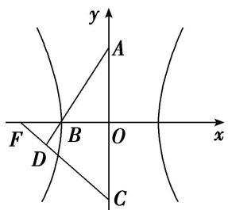

text_image

y
A
F B O x
D C

17. 答案 $\frac{\sqrt{7}}{14}$ 解析 设双曲线的标准方程为 $\frac{x^2}{a^2} - \frac{y^2}{b^2} = 1 (a > 0, b > 0)$ ，由 $e = \frac{c}{a} = 2$ 知， $c = 2a$ ，又 $c^2 = a^2 + b^2$ ，故 $b = \sqrt{3}a$ ，所以 $A(0, \sqrt{3}a), C(0, -\sqrt{3}a), B(-a, 0), F(-2a, 0)$ ，则 $\overrightarrow{BA} = (a, \sqrt{3}a), \overrightarrow{CF} = (-$

$2a, \sqrt{3} a)$ , 结合题图可知, $\cos \angle BDF = \cos < \overrightarrow{BA}, \overrightarrow{CF} > = \frac{\overrightarrow{BA} \cdot \overrightarrow{CF}}{\overrightarrow{|BA|} \cdot |\overrightarrow{CF}|} = \frac{-2a^2 + 3a^2}{2a \cdot \sqrt{7} a} = \frac{\sqrt{7}}{14}$ .

18. 过点 $P(4, 2)$ 作一直线 $AB$ 与双曲线 $C: \frac{x^2}{2} - y^2 = 1$ 相交于 $A, B$ 两点，若 $P$ 为 $AB$ 的中点，则 $|AB| = (\quad)$

A. $2 \sqrt{2}$

B. $2 \sqrt{3}$

C. $3\sqrt{3}$

D. $4 \sqrt{3}$

18. 答案 D 解析 法一：由已知可得点 P 的位置如图所示，且直线 AB 的斜率存在，设 AB 的斜率为 k，则 AB 的方程为 $y-2=k(x-4)$ ，即 $y=k(x-4)+2$ ，由 $\left\{\begin{aligned}y=k & x-4 + 2, \\ \frac{x^{2}}{2}-y^{2}=1,\end{aligned}\right.$ 消去 y 得 $(1-2k^{2})x^{2}+(16k^{2}-8k)x-32k^{2}+32k-10=0$ ，设 $A(x_{1},y_{1})$ ， $B(x_{2},y_{2})$ ，由根与系数的关系得 $x_{1}+x_{2}=\frac{-16k^{2}+8k}{1-2k^{2}}$ ， $x_{1}x_{2}=\frac{-32k^{2}+32k-10}{1-2k^{2}}$ ，因为 $P(4,2)$ 为 AB 的中点，所以 $\frac{-16k^{2}+8k}{1-2k^{2}}=8$ ，解得 k=1，满足 $\Delta>0$ ，所以 $x_{1}+x_{2}=8$ ， $x_{1}x_{2}=10$ ，所以 $|AB|=\sqrt{1+1^{2}}\times\sqrt{8^{2}-4\times10}=4\sqrt{3}$ ，故选 D.

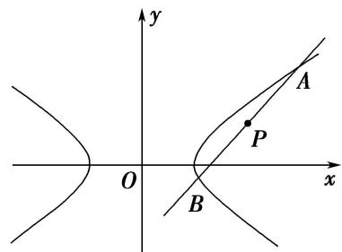

text_image

y
A
P
O
x
B

法二：由已知可得点 $P$ 的位置如法一中图所示，且直线 $AB$ 的斜率存在，设 $AB$ 的斜率为 $k$ ，则 $AB$ 的方程为 $y - 2 = k(x - 4)$ ，即 $y = k(x - 4) + 2$ ，设 $A(x_{1},y_{1}),B(x_{2},y_{2})$ ，则 $\left\{ \begin{array}{l}x_1^2 -2y_1^2 -2 = 0,\\ x_2^2 -2y_2^2 -2 = 0, \end{array} \right.$ 所以 $(x_{1} + x_{2})(x_{1}-x_{2}) = 2(y_{1} + y_{2})(y_{1} - y_{2})$ ，因为 $P(4,2)$ 为 $AB$ 的中点，所以 $k = \frac{y_1 - y_2}{x_1 - x_2} = 1$ ，所以 $AB$ 的方程为 $y = x - 2$ ，由 $\left\{ \begin{array}{l}y = x - 2,\\ \frac{x^2}{2} -y^2 = 1, \end{array} \right.$ 消去 $y$ 得 $x^{2} - 8x + 10 = 0$ ，所以 $x_{1} + x_{2} = 8$ ， $x_{1}x_{2} = 10$ ，所以 $|AB| = \sqrt{1 + 1^2}\times \sqrt{8^2 - 4\times 10} =$ $4\sqrt{3}$ ，故选D.

19. 过点 $P(4, 2)$ 作一直线 $AB$ 与双曲线 $C: \frac{x^2}{2} - y^2 = 1$ 相交于 $A$ 、 $B$ 两点，若 $P$ 为 $AB$ 中点，则 $|AB| = (\quad)$

A. $2 \sqrt{2}$

B. $2 \sqrt{3}$

C. $3\sqrt{3}$

D. $4\sqrt{3}$

19. 答案 D 解析 易知直线 AB 不与 y 轴平行，设其方程为 $y-2=k(x-4)$ ，代入双曲线 C: $\frac{x^{2}}{2}-y^{2}=1$ ，整理得 $(1-2k^{2})x^{2}+8k(2k-1)x-32k^{2}+32k-10=0$ ，设此方程两实根为 $x_{1}, x_{2}$ ，则 $x_{1}+x_{2}=\frac{8k(2k-1)}{2k^{2}-1}$ ，又 $P(4,2)$ 为 AB 的中点，所以 $\frac{8k(2k-1)}{2k^{2}-1}=8$ ，解得 k=1，当 k=1 时，直线与双曲线相交，即上述二次方程的 $\Delta>0$ ，所求直线 AB 的方程为 y-2=x-4 化成一般式为 x-y-2=0， $x_{1}+x_{2}=8$ ， $x_{1}x_{2}=10$ ， $|AB|=\sqrt{2}|x_{1}-x_{2}|=\sqrt{2}\cdot\sqrt{8^{2}-40}=4\sqrt{3}$ 。故选 D.

20. 已知双曲线 $\frac{x^2}{3} - y^2 = 1$ 的左、右焦点分别为 $F_{1}, F_{2}$ , 点 $P$ 在双曲线上, 且满足 $|PF_{1}| + |PF_{2}| = 2\sqrt{5}$ , 则 $\triangle$

$PF_{1}F_{2}$ 的面积为()

A. 1

B. $\sqrt{3}$

C. $\sqrt{5}$

D. $\frac{1}{2}$

20. 答案 A 解析 在双曲线 $\frac{x^2}{3} - y^2 = 1$ 中， $a = \sqrt{3}$ ， $b = 1$ ， $c = 2$ 。不妨设 $P$ 点在双曲线的右支上，则有 $|PF_1| - |PF_2| = 2a = 2\sqrt{3}$ ，又 $|PF_1| + |PF_2| = 2\sqrt{5}$ ， $\therefore |PF_1| = \sqrt{5} + \sqrt{3}$ ， $|PF_2| = \sqrt{5} - \sqrt{3}$ 。又 $|F_1F_2| = 2c = 4$ ，而 $|PF_1|^2 + |PF_2|^2 = |F_1F_2|^2$ ， $\therefore PF_1 \perp PF_2$ ， $\therefore S\triangle PF_1F_2 = \frac{1}{2} \times |PF_1| \times |PF_2| = \frac{1}{2} \times (\sqrt{5} + \sqrt{3}) \times (\sqrt{5} - \sqrt{3}) = 1$ 。故选 A。

21. 已知双曲线 $C: \frac{x^2}{a^2} - \frac{y^2}{b^2} = 1 (a > 0, b > 0)$ 的离心率为 2，左、右焦点分别为 $F_1, F_2$ ，点 $A$ 在双曲线 $C$ 上，若 $\triangle AF_1F_2$ 的周长为 $10a$ ，则 $\triangle AF_1F_2$ 的面积为（）

A. $2\sqrt{15}a^{2}$

B. $\sqrt{15}a^{2}$

C. $30a^{2}$

D. $15a^{2}$

21. 答案 B 解析 (1)由双曲线的对称性不妨设 A 在双曲线的右支上，由 $e=\frac{c}{a}=2$ ，得 c=2a，∴ $\triangle AF_{1}F_{2}$ 的周长为 $|AF_{1}|+|AF_{2}|+|F_{1}F_{2}|=|AF_{1}|+|AF_{2}|+4a$ ，又 $\triangle AF_{1}F_{2}$ 的周长为 10a，∴ $|AF_{1}|+|AF_{2}|=6a$ ，又∵ $|AF_{1}|-|AF_{2}|=2a$ ，∴ $|AF_{1}|=4a$ ， $|AF_{2}|=2a$ ，在 $\triangle AF_{1}F_{2}$ 中， $|F_{1}F_{2}|=4a$ ，∴ $\cos\angle F_{1}AF_{2}=\frac{|AF_{1}|^{2}+|AF_{2}|^{2}-|F_{1}F_{2}|^{2}}{2|AF_{1}|\cdot|AF_{2}|}=\frac{(4a)^{2}+(2a)^{2}-(4a)^{2}}{2\times4a\times2a}=\frac{1}{4}$ 。又 $0<\angle F_{1}AF<\pi$ ，∴ $\sin\angle F_{1}AF_{2}=\frac{\sqrt{15}}{4}$ ，∴ $S\triangle AF_{1}F_{2}=\frac{1}{2}|AF_{1}|\cdot|AF_{2}|\cdot\sin\angle F_{1}AF_{2}=\frac{1}{2}\times4a\times2a\times\frac{\sqrt{15}}{4}=\sqrt{15}a^{2}$ .

22. 已知双曲线 $x^{2} - \frac{y^{2}}{3} = 1$ 的左、右焦点分别为 $F_{1}, F_{2}$ ，双曲线的离心率为 $e$ ，若双曲线上存在一点 $P$ 使 $\frac{\sin\angle PF_2F_1}{\sin\angle PF_1F_2} = e$ ，则 $\overrightarrow{F_2P} \cdot \overrightarrow{F_2F_1}$ 的值为（）

A. 3

B. 2

C.-3

D. -2

22. 答案 B 解析 由题意及正弦定理得 $\frac{\sin\angle PF_2F_1}{\sin\angle PF_1F_2} = \frac{|PF_1|}{|PF_2|} = e = 2$ ， $\therefore |PF_1| = 2|PF_2|$ ，由双曲线的定义知 $|PF_1| - |PF_2| = 2$ ， $\therefore |PF_1| = 4$ ， $|PF_2| = 2$ ，又 $|F_1F_2| = 4$ ，由余弦定理可知 $\cos\angle PF_2F_1 = \frac{|PF_2|^2 + |F_1F_2|^2 - |PF_1|^2}{2|PF_2|\cdot|F_1F_2|}$ $= \frac{4 + 16 - 16}{2\times 2\times 4} = \frac{1}{4}$ ， $\therefore \overrightarrow{F_2P}\cdot \overrightarrow{F_2F_1} = |\overrightarrow{F_2P}|\cdot |\overrightarrow{F_2F_1}|\cdot \cos \angle PF_2F_1 = 2\times 4\times \frac{1}{4} = 2$ 。故选 B.

