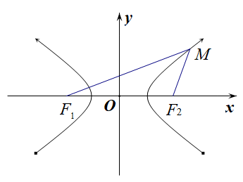
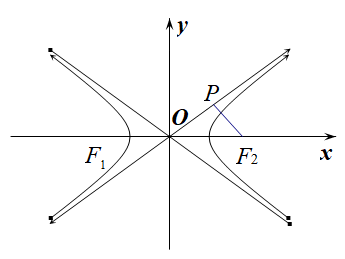
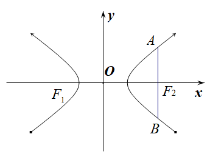
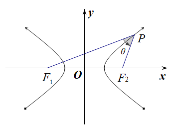
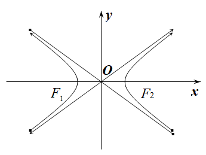
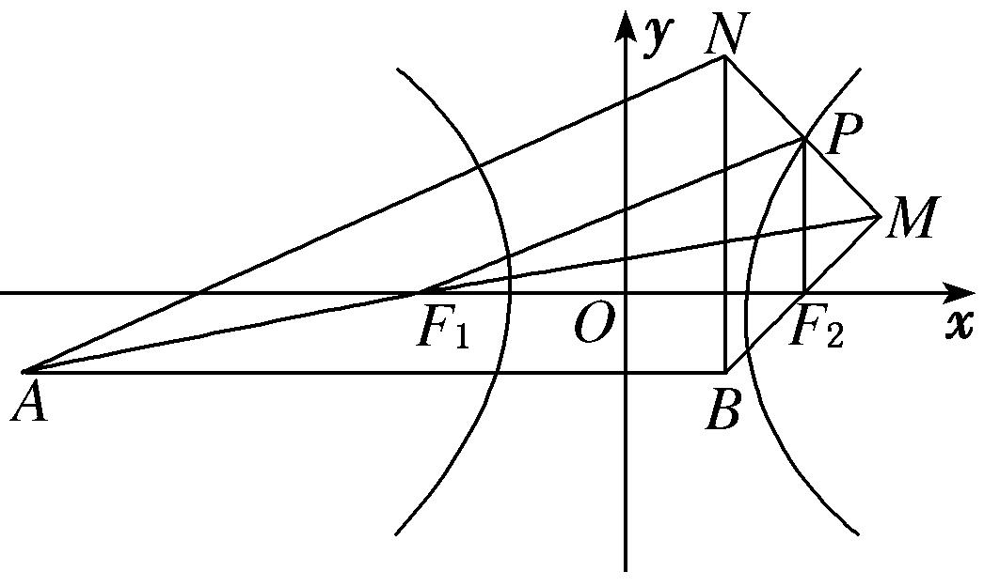
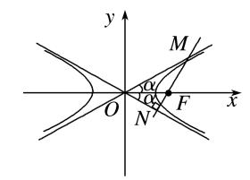
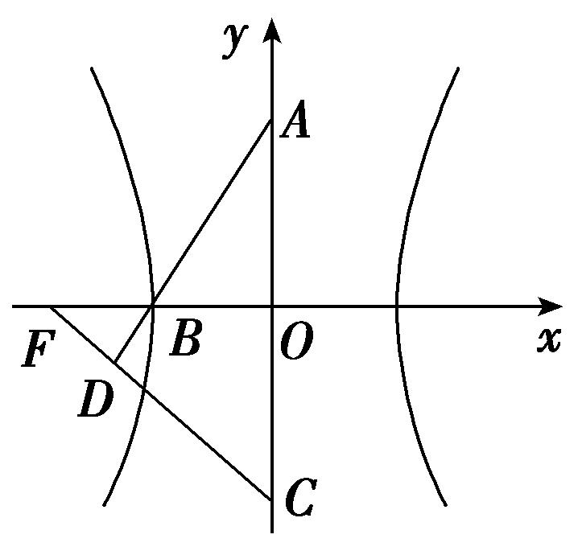
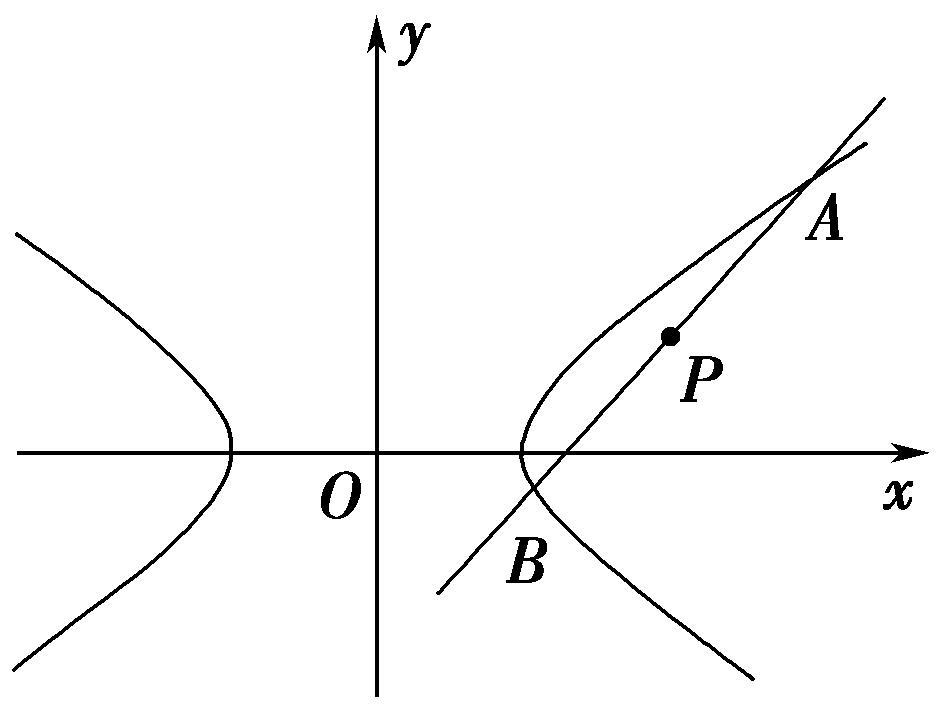

**专题07　双曲线模型**

**双曲线线秒杀小题常用结论**

(1)双曲线定义：||<em>MF</em>1|－|<em>MF</em>2||＝2<em>a</em>(2<em>a</em>＜|<em>F</em>1<em>F</em>2|)．如图(10)

  
图(10)　　　　　　　 　　 　　图(11)　　　　　　　 　　　　图(12)

(2)如图(11)双曲线的焦点到其渐近线的距离为*b*．与双曲线－＝1(*a*＞0，*b*＞0)有共同渐近线的方程可表示为－＝*t*(*t*≠0)．

(3)如图(12)同支的焦点弦中最短的为通径(过焦点且垂直于长轴的弦)，其长为，异支的弦中最短的为实轴，其长为2*a*；

(4)如图(13)<em>P</em>是双曲线上不同于实轴两端点的任意一点，<em>F</em>1、<em>F</em>2分别为双曲线的左、右焦点，则<em>S</em>△<em>PF</em>1<em>F</em>2＝<em>b</em>2，其中<em>θ</em>为∠<em>F</em>1<em>PF</em>2．

  
图(13)　　　　　　　　　　　　　　　 　　　　图(14)

(5)如图(14)双曲线－＝1(*a*＞0，*b*＞0)的渐近线*y*＝±*x*的斜率*k*＝±与离心率*e*的关系：*e*＝＝．

(6)若<em>P</em>是双曲线右支上一点，<em>F</em>1、<em>F</em>2分别为双曲线的左、右焦点，则|<em>PF</em>1|min＝<em>a</em>＋<em>c</em>，|<em>PF</em>2|min＝<em>c</em>－<em>a</em>；

(7)如图(15)设<em>P</em>，<em>A</em>，<em>B</em>是双曲线－＝1(<em>a</em>＞<em>b</em>＞0)上不同的三点，其中<em>A</em>，<em>B</em>关于原点对称，则<em>kPA</em>·<em>kPB</em>＝＝<em>e</em>2－1．

  
图(15)　　　　　　　　　　　　　　　 　　　　图(16)

(8)如图(16)设<em>A</em>，<em>B</em>是双曲线－＝1(<em>a</em>＞<em>b</em>＞0)上不同的两点，<em>P</em>为弦<em>AB</em>的中点，则<em>kAB</em>·<em>kOP</em>＝＝<em>e</em>2－1．

**【例题选讲】**

<strong>[例2]</strong>　(9)过点<em>P</em>(2，1)作直线<em>l</em>，使<em>l</em>与双曲线－<em>y</em>2＝1有且仅有一个公共点，这样的直线<em>l</em>共有(　　)

A．1条　　　　　　　　B．2条　　　　　　　　C．3条　　　　　　　　D．4条

<strong>答案</strong>　B　<strong>解析</strong>　依题意，双曲线的渐近线方程是<em>y</em>＝±<em>x</em>，点<em>P</em>在直线<em>y</em>＝<em>x</em>上．①当直线<em>l</em>的斜率不存在时，直线<em>l</em>的方程为<em>x</em>＝2，此时直线<em>l</em>与双曲线有且仅有一个公共点(2,0)，满足题意．②当直线<em>l</em>的斜率存在时，设直线<em>l</em>的方程为<em>y</em>－1＝<em>k</em>(<em>x</em>－2)，即<em>y</em>＝<em>kx</em>＋1－2<em>k</em>，由消去<em>y</em>得<em>x</em>2－4(<em>kx</em>＋1－2<em>k</em>)2＝4，即(1－4<em>k</em>2)<em>x</em>2－8(1－2<em>k</em>)<em>kx</em>－4(1－2<em>k</em>)2－4＝0，(\*)．若1－4<em>k</em>2＝0，则<em>k</em>＝±，当<em>k</em>＝时，方程(\*)无实数解，因此<em>k</em>＝不满足题意；当<em>k</em>＝－时，方程(\*)有唯一实数解，因此<em>k</em>＝－满足题意．若1－4<em>k</em>2≠0，即<em>k</em>≠±，此时<em>Δ</em>＝64<em>k</em>2(1－2<em>k</em>)2＋16(1－4<em>k</em>2)[(1－2<em>k</em>)2＋1]＝0不成立，因此满足题意的实数<em>k</em>不存在．综上所述，满足题意的直线<em>l</em>共有2条．

(10)(2018·全国Ⅱ)双曲线－＝1(*a*＞0，*b*＞0)的离心率为，则其渐近线方程为(　　)

A．*y*＝±*x*　　　　B．*y*＝±*x*　　　　C．*y*＝±*x*　　　　D．*y*＝±*x*

<strong>答案</strong>　A　<strong>解析</strong>　法一：由题意知，e＝＝，所以<em>c</em>＝<em>a</em>，所以<em>b</em>＝＝<em>a</em>，所以＝，所以该双曲线的渐近线方程为<em>y</em>＝±<em>x</em>＝±<em>x</em>，故选A．

法二：由e＝＝＝，得＝，所以该双曲线的渐近线方程为*y*＝±*x*＝±*x*，故选A．

(11)已知双曲线<em>C</em>：－＝1(<em>a</em>&gt;0，<em>b</em>&gt;0)的左、右焦点分别为<em>F</em>1，<em>F</em>2，<em>O</em>为坐标原点，<em>P</em>是双曲线在第一象限上的点，直线<em>PO</em>交双曲线<em>C</em>左支于点<em>M</em>，直线<em>PF</em>2交双曲线<em>C</em>右支于点<em>N</em>，若|<em>PF</em>1|＝2|<em>PF</em>2|，且∠<em>MF</em>2<em>N</em>＝60°，则双曲线<em>C</em>的渐近线方程为(　　)

A．*y*＝±*x*　　　　　　B．*y*＝±*x*　　　　　　C．*y*＝±2*x*　　　　　　D．*y*＝±2*x*

<strong>答案</strong>　A　<strong>解析</strong>　由题意得，|<em>PF</em>1|＝2|<em>PF</em>2|，|<em>PF</em>1|－|<em>PF</em>2|＝2<em>a</em>，∴|<em>PF</em>1|＝4<em>a</em>，|<em>PF</em>2|＝2<em>a</em>，由于<em>P</em>，<em>M</em>关于原点对称，<em>F</em>1，<em>F</em>2关于原点对称，∴线段<em>PM</em>，<em>F</em>1<em>F</em>2互相平分，四边形<em>PF</em>1<em>MF</em>2为平行四边形，<em>PF</em>1∥<em>MF</em>2，∵∠<em>MF</em>2<em>N</em>＝60°，∴∠<em>F</em>1<em>PF</em>2＝60°，由余弦定理可得4<em>c</em>2＝16<em>a</em>2＋4<em>a</em>2－2·4<em>a</em>·2<em>a</em>·cos60°，∴<em>c</em>＝<em>a</em>，∴<em>b</em>＝＝<em>a</em>．∴＝，∴双曲线<em>C</em>的渐近线方程为<em>y</em>＝±<em>x</em>．故选A．

(12)已知双曲线<em>C</em>：－＝1(<em>a</em>&gt;0，<em>b</em>&gt;0)的左、右焦点分别为<em>F</em>1，<em>F</em>2，点<em>M</em>与双曲线<em>C</em>的焦点不重合，点<em>M</em>关于<em>F</em>1，<em>F</em>2的对称点分别为<em>A</em>，<em>B</em>，线段<em>MN</em>的中点在双曲线的右支上，若|<em>AN</em>|－|<em>BN</em>|＝12，则<em>a</em>＝(　　)

A．3　　　　　　　　B．4　　　　　　　　C．5　　　　　　　　D．6

<strong>答案</strong>　A　<strong>解析</strong>　如图，设<em>MN</em>的中点为<em>P</em>．∵<em>F</em>1为<em>MA</em>的中点，<em>F</em>2为<em>MB</em>的中点，∴|<em>AN</em>|＝2|<em>PF</em>1|，|<em>BN</em>|＝2|<em>PF</em>2|，又|<em>AN</em>|－|<em>BN</em>|＝12，∴|<em>PF</em>1|－|<em>PF</em>2|＝6＝2<em>a</em>，∴<em>a</em>＝3．故选A．

(13)(2018·全国Ⅰ)已知双曲线<em>C</em>：－<em>y</em>2＝1，<em>O</em>为坐标原点，<em>F</em>为<em>C</em>的右焦点，过<em>F</em>的直线与<em>C</em>的两条渐近线的交点分别为<em>M</em>，<em>N</em>．若△<em>OMN</em>为直角三角形，则|<em>MN</em>|等于(　　)

A．　　　　　　　　B．3　　　　　　　　C．2　　　　　　　　D．4

<strong>答案</strong>　B　<strong>解析</strong>　由已知得双曲线的两条渐近线方程为<em>y</em>＝± <em>x</em>．设两渐近线的夹角为2<em>α</em>，则有tan <em>α</em>＝＝，所以<em>α</em>＝30°．所以∠<em>MON</em>＝2<em>α</em>＝60°．又△<em>OMN</em>为直角三角形，由于双曲线具有对称性，不妨设<em>MN</em>⊥<em>ON</em>，如图所示．

在Rt△*ONF*中，|*OF*|＝2，则|*ON*|＝．则在Rt△*OMN*中，|*MN*|＝|*ON*|·tan 2*α*＝·tan 60°＝3．故选B．

(14)(2019·全国Ⅲ)双曲线*C*：－＝1的右焦点为*F*，点*P*在*C*的一条渐近线上，*O*为坐标原点，若|*PO*|＝|*PF*|，则△*PFO*的面积为(　　)

A． 　　　　　　　　B．　　　　　　　　C．2　　　　　　　　D．3

<strong>答案</strong>　A　<strong>解析</strong>　双曲线－＝1的右焦点坐标为(，0)，一条渐近线的方程为<em>y</em>＝<em>x</em>，不妨设点<em>P</em>在第一象限，由于|<em>PO</em>|＝|<em>PF</em>|，则点<em>P</em>的横坐标为，纵坐标为×＝，即△<em>PFO</em>的底边长为，高为，所以它的面积为××＝．故选A．

**【对点训练】**

9．过双曲线－＝1(*a*＞0，*b*＞0)的右焦点*F*(1，0)作*x*轴的垂线，与双曲线交于*A*，*B*两点，*O*为坐标

原点，若△*AOB*的面积为，则双曲线的渐近线方程为\_\_\_\_\_\_\_\_．

9．<strong>答案</strong>　<em>y</em>＝±2<em>x</em>　<strong>解析</strong>　由题意得|<em>AB</em>|＝，∵<em>S</em>△<em>AOB</em>＝，∴××1＝，∴＝①，又<em>a</em>2＋<em>b</em>2＝1

②，由①②得*a*＝，*b*＝，∴双曲线的渐近线方程为*y*＝±*x*＝±2*x*.

10．已知双曲线*C*：－＝1(*a*，*b*>0)的右顶点*A*和右焦点*F*到一条渐近线的距离之比为1∶，则*C*的

渐近线方程为(　　)

A．*y*＝±*x*　　　　　B．*y*＝±*x*　　　　　C．*y*＝±2*x*　　　　　D．*y*＝±*x*

10．<strong>答案</strong>　A　<strong>解析</strong>　由双曲线方程可得渐近线为：<em>y</em>＝±<em>x</em>，<em>A</em>(<em>a,</em>0)，<em>F</em>(<em>c,</em>0)，则点<em>A</em>到渐近线距离<em>d</em>1＝

＝，点<em>F</em>到渐近线距离<em>d</em>2＝＝＝<em>b</em>，∴<em>d</em>1∶<em>d</em>2＝∶<em>b</em>＝<em>a</em>∶<em>c</em>＝1∶，即<em>c</em>＝<em>a</em>，则＝＝＝1，∴双曲线渐近线方程为<em>y</em>＝±<em>x</em>．故选A．

11．双曲线－＝1(<em>a</em>&gt;0，<em>b</em>&gt;0)的两条渐近线分别为<em>l</em>1，<em>l</em>2，<em>F</em>为其一个焦点，若<em>F</em>关于<em>l</em>1的对称点在<em>l</em>2

上，则双曲线的渐近线方程为(　　)

A．*y*＝±2*x*　　　　　B．*y*＝±*x*　　　　　C．*y*＝±3*x*　　　　　D．*y*＝±*x*

11．<strong>答案</strong>　B　<strong>解析</strong>　不妨取<em>F</em>(<em>c</em>，0)，<em>l</em>1：<em>bx</em>－<em>ay</em>＝0，设其对称点<em>F</em>′(<em>m</em>，<em>n</em>)在<em>l</em>2：<em>bx</em>＋<em>ay</em>＝0，由对称性可

得，解得，点<em>F</em>′(<em>m</em>，<em>n</em>)在<em>l</em>2：<em>bx</em>＋<em>ay</em>＝0，则·<em>bc</em>＋＝0，整理可得＝3，∴＝，双曲线的渐近线方程为：<em>y</em>＝±<em>x</em>＝±<em>x</em>.故选B.

12．已知<em>F</em>1，<em>F</em>2分别是双曲线－＝1(<em>a</em>&gt;0，<em>b</em>&gt;0)的左、右焦点，<em>P</em>是双曲线上一点，若|<em>PF</em>1|＋|<em>PF</em>2|＝6<em>a</em>，

且△<em>PF</em>1<em>F</em>2的最小内角为，则双曲线的渐近线方程为(　　)

A．*y*＝±2*x*　　　　　B．*y*＝±*x*　　　　　C．*y*＝±*x*　　　　　D．*y*＝±*x*

12．<strong>答案</strong>　D　<strong>解析</strong>　不妨设<em>P</em>为双曲线右支上一点，则|<em>PF</em>1|&gt;|<em>PF</em>2|，由双曲线的定义得|<em>PF</em>1|－|<em>PF</em>2|＝2<em>a</em>，

又|<em>PF</em>1|＋|<em>PF</em>2|＝6<em>a</em>，所以|<em>PF</em>1|＝4<em>a</em>，|<em>PF</em>2|＝2<em>a</em>．又因为所以∠<em>PF</em>1<em>F</em>2为最小内角，故∠<em>PF</em>1<em>F</em>2＝．由余弦定理，可得＝，即(<em>a</em>－<em>c</em>)2＝0，所以<em>c</em>＝<em>a</em>，则<em>b</em>＝<em>a</em>，所以双曲线的渐近线方程为<em>y</em>＝±<em>x</em>．

13．已知<em>F</em>2，<em>F</em>1是双曲线－＝1(<em>a</em>&gt;0，<em>b</em>&gt;0)的上、下两个焦点，过<em>F</em>1的直线与双曲线的上下两支分别

交于点<em>B</em>，<em>A</em>，若△<em>ABF</em>2为等边三角形，则双曲线的渐近线方程为(　　)

A．*y*＝±*x*　　　　　B．*y*＝±*x*　　　　　C．*y*＝±*x*　　　　　　D．*y*＝±*x*

13．<strong>答案</strong>　D　<strong>解析</strong>　根据双曲线的定义，可得|<em>BF</em>1|－|<em>BF</em>2|＝2<em>a</em>，∵△<em>ABF</em>2为等边三角形，∴|<em>BF</em>2|＝|<em>AB</em>|，

∴|<em>BF</em>1|－|<em>AB</em>|＝|<em>AF</em>1|＝2<em>a</em>，又∵|<em>AF</em>2|－|<em>AF</em>1|＝2<em>a</em>，∴|<em>AF</em>2|＝|<em>AF</em>1|＋2<em>a</em>＝4<em>a</em>，∵在△<em>AF</em>1<em>F</em>2中，|<em>AF</em>1|＝2<em>a</em>，|<em>AF</em>2|＝4<em>a</em>，∠<em>F</em>1<em>AF</em>2＝120°，∴|<em>F</em>1<em>F</em>2|2＝|<em>AF</em>1|2＋|<em>AF</em>2|2－2|<em>AF</em>1|·|<em>AF</em>2|cos 120°，即4<em>c</em>2＝4<em>a</em>2＋16<em>a</em>2－2×2<em>a</em>×4<em>a</em>×＝28<em>a</em>2，亦即<em>c</em>2＝7<em>a</em>2，则<em>b</em>＝＝＝<em>a</em>，由此可得双曲线<em>C</em>的渐近线方程为<em>y</em>＝±<em>x</em>．

14．已知<em>F</em>1，<em>F</em>2是双曲线<em>C</em>：－＝1(<em>a</em>&gt;0，<em>b</em>&gt;0)的两个焦点，<em>P</em>是<em>C</em>上一点，若|<em>PF</em>1|＋|<em>PF</em>2|＝6<em>a</em>，且△<em>PF</em>1<em>F</em>2

最小内角的大小为30°，则双曲线*C*的渐近线方程是(　　)

A．*x*±*y*＝0　　　　B．*x*±*y*＝0　　　　C．*x*±2*y*＝0　　　　D．2*x*±*y*＝0

14．<strong>答案</strong>　A　<strong>解析</strong>　由题意，不妨设|<em>PF</em>1|&gt;|<em>PF</em>2|，则根据双曲线的定义得，|<em>PF</em>1|－|<em>PF</em>2|＝2<em>a</em>，又|<em>PF</em>1|＋|<em>PF</em>2|

＝6<em>a</em>，解得|<em>PF</em>1|＝4<em>a</em>，|<em>PF</em>2|＝2<em>a</em>.在△<em>PF</em>1<em>F</em>2中，|<em>F</em>1<em>F</em>2|＝2<em>c</em>，而<em>c</em>&gt;<em>a</em>，所以有|<em>PF</em>2|&lt;|<em>F</em>1<em>F</em>2|，所以∠<em>PF</em>1<em>F</em>2＝30°，所以(2<em>a</em>)2＝(2<em>c</em>)2＋(4<em>a</em>)2－2·2<em>c</em>·4<em>a</em>cos 30°，得<em>c</em>＝<em>a</em>，所以<em>b</em>＝＝<em>a</em>.所以双曲线的渐近线方程为<em>y</em>＝±<em>x</em>＝±<em>x</em>，即<em>x</em>±<em>y</em>＝0．

15．已知双曲线*Γ*：－＝1(*a*>0，*b*>0)的右顶点为*A*，与*x*轴平行的直线交*Γ*于*B*，*C*两点，记∠*BAC*

＝*θ*，若*Γ*的离心率为，则(　　)

A．*θ*∈　　　　　　B．*θ*＝　　　　　　C．*θ*∈　　　　　　D．*θ*＝

15．<strong>答案</strong>　B　<strong>解析</strong>　∵<em>e</em>＝＝，∴<em>c</em>＝<em>a</em>，∴<em>b</em>2＝<em>c</em>2－<em>a</em>2＝<em>a</em>2，∴双曲线方程可变形为<em>x</em>2－<em>y</em>2＝<em>a</em>2.设

<em>B</em>(<em>x</em>0，<em>y</em>0)，由对称性可知<em>C</em>(－<em>x</em>0，<em>y</em>0)，∵点<em>B</em>(<em>x</em>0，<em>y</em>0)在双曲线上，∴<em>x</em>－<em>y</em>＝<em>a</em>2．∵<em>A</em>(<em>a</em>,0)，∴＝(<em>x</em>0－<em>a</em>，<em>y</em>0)，＝(－<em>x</em>0－<em>a</em>，<em>y</em>0)，∴·＝(<em>x</em>0－<em>a</em>)·(－<em>x</em>0－<em>a</em>)＋<em>y</em>＝<em>a</em>2－<em>x</em>＋<em>y</em>＝0，∴⊥，即<em>θ</em>＝．故选B．

16．已知<em>F</em>1，<em>F</em>2为双曲线<em>C</em>：<em>x</em>2－<em>y</em>2＝2的左、右焦点，点<em>P</em>在<em>C</em>上，|<em>PF</em>1|＝2|<em>PF</em>2|，则cos∠<em>F</em>1<em>PF</em>2＝\_\_\_\_\_\_\_\_．

16．<strong>答案　　解析</strong>　化双曲线的方程为－＝1，则<em>a</em>＝<em>b</em>＝，<em>c</em>＝2，因为|<em>PF</em>1|＝2|<em>PF</em>2|，所以点<em>P</em>在

双曲线的右支上，则由双曲线的定义，知|<em>PF</em>1|－|<em>PF</em>2|＝2<em>a</em>＝2，解得|<em>PF</em>1|＝4，|<em>PF</em>2|＝2，根据余弦定理得cos∠<em>F</em>1<em>PF</em>2＝＝．

17．如图，双曲线的中心在坐标原点*O*，*A*，*C*分别是双曲线虚轴的上、下端点，*B*是双曲线的左顶点，*F*

为双曲线的左焦点，直线*AB*与*FC*相交于点*D*．若双曲线的离心率为2，则∠*BDF*的余弦值是\_\_\_\_\_\_\_\_．

17．<strong>答案　　解析</strong>　设双曲线的标准方程为－＝1(<em>a</em>＞0，<em>b</em>＞0)，由<em>e</em>＝＝2知，<em>c</em>＝2<em>a</em>，又<em>c</em>2＝<em>a</em>2

＋<em>b</em>2，故<em>b</em>＝<em>a</em>，所以<em>A</em>(0，<em>a</em>)，<em>C</em>(0，－<em>a</em>)，<em>B</em>(－<em>a</em>，0)，<em>F</em>(－2<em>a</em>，0)，则＝(<em>a</em>，<em>a</em>)，＝(－2<em>a</em>，<em>a</em>)，结合题图可知，cos∠<em>BDF</em>＝cos＜，＞＝＝＝．

18．过点<em>P</em>(4，2)作一直线<em>AB</em>与双曲线<em>C</em>：－<em>y</em>2＝1相交于<em>A</em>，<em>B</em>两点，若<em>P</em>为<em>AB</em>的中点，则|<em>AB</em>|＝(　　)

A．2　　　　　　　　B．2　　　　　　　　C．3　　　　　　　　D．4

18．<strong>答案</strong>　D　<strong>解析</strong>　法一：由已知可得点<em>P</em>的位置如图所示，且直线<em>AB</em>的斜率存在，设<em>AB</em>的斜率为<em>k</em>，

则<em>AB</em>的方程为<em>y</em>－2＝<em>k</em>(<em>x</em>－4)，即<em>y</em>＝<em>k</em>(<em>x</em>－4)＋2，由消去<em>y</em>得(1－2<em>k</em>2)<em>x</em>2＋(16<em>k</em>2－8<em>k</em>)<em>x</em>－32<em>k</em>2＋32<em>k</em>－10＝0，设<em>A</em>(<em>x</em>1，<em>y</em>1)，<em>B</em>(<em>x</em>2，<em>y</em>2)，由根与系数的关系得<em>x</em>1＋<em>x</em>2＝，<em>x</em>1<em>x</em>2＝，因为<em>P</em>(4,2)为<em>AB</em>的中点，所以＝8，解得<em>k</em>＝1，满足<em>Δ</em>＞0，所以<em>x</em>1＋<em>x</em>2＝8，<em>x</em>1<em>x</em>2＝10，所以|<em>AB</em>|＝×＝4，故选D．

法二：由已知可得点<em>P</em>的位置如法一中图所示，且直线<em>AB</em>的斜率存在，设<em>AB</em>的斜率为<em>k</em>，则<em>AB</em>的方程为<em>y</em>－2＝<em>k</em>(<em>x</em>－4)，即<em>y</em>＝<em>k</em>(<em>x</em>－4)＋2，设<em>A</em>(<em>x</em>1，<em>y</em>1)，<em>B</em>(<em>x</em>2，<em>y</em>2)，则所以(<em>x</em>1＋<em>x</em>2)(<em>x</em>1－<em>x</em>2)＝2(<em>y</em>1＋<em>y</em>2)(<em>y</em>1－<em>y</em>2)，因为<em>P</em>(4,2)为<em>AB</em>的中点，所以<em>k</em>＝＝1，所以<em>AB</em>的方程为<em>y</em>＝<em>x</em>－2，由消去<em>y</em>得<em>x</em>2－8<em>x</em>＋10＝0，所以<em>x</em>1＋<em>x</em>2＝8，<em>x</em>1<em>x</em>2＝10，所以|<em>AB</em>|＝×＝4，故选D．

19．过点<em>P</em>(4，2)作一直线<em>AB</em>与双曲线<em>C</em>：－<em>y</em>2＝1相交于<em>A</em>、<em>B</em>两点，若<em>P</em>为<em>AB</em>中点，则|<em>AB</em>|＝(　　)

A．2　　　　　　　　B．2　　　　　　　　C．3　　　　　　　　D．4

19．<strong>答案</strong>　D　<strong>解析</strong>　易知直线<em>AB</em>不与<em>y</em>轴平行，设其方程为<em>y</em>－2＝<em>k</em>(<em>x</em>－4)，代入双曲线<em>C</em>：－<em>y</em>2＝1，

整理得(1－2<em>k</em>2)<em>x</em>2＋8<em>k</em>(2<em>k</em>－1)<em>x</em>－32<em>k</em>2＋32<em>k</em>－10＝0，设此方程两实根为<em>x</em>1，<em>x</em>2，则<em>x</em>1＋<em>x</em>2＝，又<em>P</em>(4，2)为<em>AB</em>的中点，所以＝8，解得<em>k</em>＝1，当<em>k</em>＝1时，直线与双曲线相交，即上述二次方程的<em>Δ</em>＞0，所求直线<em>AB</em>的方程为<em>y</em>－2＝<em>x</em>－4化成一般式为<em>x</em>－<em>y</em>－2＝0，<em>x</em>1＋<em>x</em>2＝8，<em>x</em>1<em>x</em>2＝10，|<em>AB</em>|＝|<em>x</em>1－<em>x</em>2|＝·＝4．故选D．

20．已知双曲线－<em>y</em>2＝1的左、右焦点分别为<em>F</em>1，<em>F</em>2，点<em>P</em>在双曲线上，且满足|<em>PF</em>1|＋|<em>PF</em>2|＝2，则△

<em>PF</em>1<em>F</em>2的面积为(　　)

A．1　　　　　　　　B．　　　　　　　　C．　　　　　　　　D．

20．<strong>答案</strong>　A　<strong>解析</strong>　在双曲线－<em>y</em>2＝1中，<em>a</em>＝，<em>b</em>＝1，<em>c</em>＝2．不妨设<em>P</em>点在双曲线的右支上，则有

|<em>PF</em>1|－|<em>PF</em>2|＝2<em>a</em>＝2，又|<em>PF</em>1|＋|<em>PF</em>2|＝2，∴|<em>PF</em>1|＝＋，|<em>PF</em>2|＝－.又|<em>F</em>1<em>F</em>2|＝2<em>c</em>＝4，而|<em>PF</em>1|2＋|<em>PF</em>2|2＝|<em>F</em>1<em>F</em>2|2，∴<em>PF</em>1⊥<em>PF</em>2，∴<em>S</em>△<em>PF</em>1<em>F</em>2＝×|<em>PF</em>1|×|<em>PF</em>2|＝×(＋)×(－)＝1．故选A．

21．已知双曲线<em>C</em>：－＝1(<em>a</em>&gt;0，<em>b</em>&gt;0)的离心率为2，左、右焦点分别为<em>F</em>1，<em>F</em>2，点<em>A</em>在双曲线<em>C</em>上，

若△<em>AF</em>1<em>F</em>2的周长为10<em>a</em>，则△<em>AF</em>1<em>F</em>2的面积为(　　)

A．2<em>a</em>2　　　　　　　　B．<em>a</em>2　　　　　　　　C．30<em>a</em>2　　　　　　　　D．15<em>a</em>2

21．<strong>答案</strong>　B　<strong>解析</strong>　(1)由双曲线的对称性不妨设<em>A</em>在双曲线的右支上，由<em>e</em>＝＝2，得<em>c</em>＝2<em>a</em>，∴△<em>AF</em>1<em>F</em>2

的周长为|<em>AF</em>1|＋|<em>AF</em>2|＋|<em>F</em>1<em>F</em>2|＝|<em>AF</em>1|＋|<em>AF</em>2|＋4<em>a</em>，又△<em>AF</em>1<em>F</em>2的周长为10<em>a</em>，∴|<em>AF</em>1|＋|<em>AF</em>2|＝6<em>a</em>，又∵|<em>AF</em>1|－|<em>AF</em>2|＝2<em>a</em>，∴|<em>AF</em>1|＝4<em>a</em>，|<em>AF</em>2|＝2<em>a</em>，在△<em>AF</em>1<em>F</em>2中，|<em>F</em>1<em>F</em>2|＝4<em>a</em>，∴cos ∠<em>F</em>1<em>AF</em>2＝＝＝．又0&lt;∠<em>F</em>1<em>AF</em>&lt;π，∴sin ∠<em>F</em>1<em>AF</em>2＝，∴<em>S</em>△<em>AF</em>1<em>F</em>2＝|<em>AF</em>1|·|<em>AF</em>2|·sin ∠<em>F</em>1<em>AF</em>2＝×4<em>a</em>×2<em>a</em>×＝<em>a</em>2．

22．已知双曲线<em>x</em>2－＝1的左、右焦点分别为<em>F</em>1，<em>F</em>2，双曲线的离心率为<em>e</em>，若双曲线上存在一点<em>P</em>使

＝e，则·的值为(　　)

A．3　　　　　　　　B．2　　　　　　　　C．－3　　　　　　　　D．－2

22．<strong>答案</strong>　B　<strong>解析</strong>　由题意及正弦定理得＝＝<em>e</em>＝2，∴|<em>PF</em>1|＝2|<em>PF</em>2|，由双曲线的定义知

|<em>PF</em>1|－|<em>PF</em>2|＝2，∴|<em>PF</em>1|＝4，|<em>PF</em>2|＝2，又|<em>F</em>1<em>F</em>2|＝4，由余弦定理可知cos∠<em>PF</em>2<em>F</em>1＝＝＝，∴·＝||·||·cos∠<em>PF</em>2<em>F</em>1＝2×4×＝2．故选B．

