# 专题08 抛物线模型

# 抛物线秒杀小题常用结论  
（1）抛物线定义： $|MF|=d(d$ 为M点到准线的距离). 如图（17）

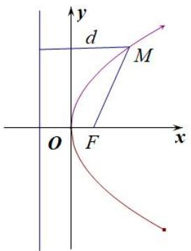

图（17）

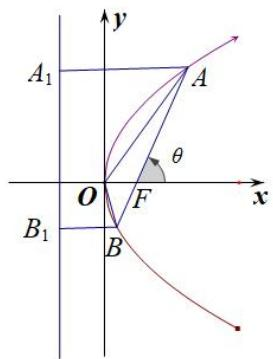

图（18）  
（2）设 A, B 是抛物线 $y^{2}=2px(p>0)$ 上不同的两点，P 为弦 AB 的中点，则 $k_{AB}\cdot y_{0}=p$ .  
（3）以抛物线 $y^{2}=2px(p>0)$ 为例，设 AB 是抛物线的过焦点的一条弦(焦点弦)，F 是抛物线的焦点， $A(x_{1},y_{1})$ ， $B(x_{2},y_{2})$ ，A、B 在准线上的射影为 $A_{1}$ 、 $B_{1}$ ，则有以下结论：

① $x_{1}x_{2}=\frac{p^{2}}{4},\quad y_{1}y_{2}=-p^{2};$

②若直线 AB 的倾斜角为 $\theta$ ，则 $|AF|=\frac{p}{1-\cos\theta}$ ， $|BF|=\frac{p}{1+\cos\theta}$ ；如图（18）

③ $\frac{1}{|AF|}+\frac{1}{|BF|}=\frac{2}{p}$ 为定值；如图（18）

④ $|AB|=x_{1}+x_{2}+p=\frac{2p}{\sin^{2}\theta}$ (其中 $\theta$ 为直线AB的倾斜角)，抛物线的通径长为2p，通径是最短的焦点弦；如图（18）

⑤ $S_{\triangle AOB}=\frac{p^{2}}{2\sin\theta}$ (其中 $\theta$ 为直线AB的倾斜角); 如图（18）

⑥以 AB 为直径的圆与抛物线的准线相切；如图（19）

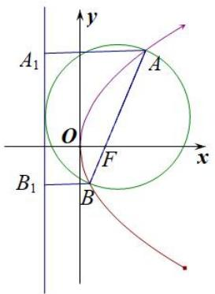

图（19）

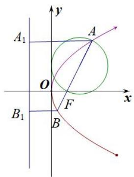

图（20）

⑦以 AF(或 BF)为直径的圆与 y 轴相切；如图(20, 21)

图（21）

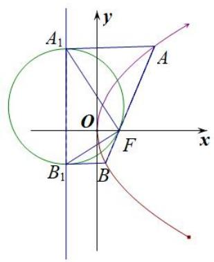

图（22）

⑧以 $A_{1}B_{1}$ 为直径的圆与直线 AB 相切，切点为 F， $\angle A_{1}FB_{1}=90^{\circ}$ ；如图（22）  
⑨A，O， $B_{1}$ 三点共线，B，O， $A_{1}$ 三点也共线；  
⑩已知 $M(x_{0}, y_{0})$ 是抛物线 $y^{2}=2px(p>0)$ 上任意一点，点 $N(a, 0)$ 是抛物线的对称轴上一点，则 $|MN|_{\min}=\left\{\begin{aligned}|a|(a\leq p),\\ \sqrt{2pa-p^{2}}(a>p).\end{aligned}\right.$   
（4）如图（23）所示, $AB$ 是抛物线 $x^{2} = 2py(p > 0)$ 的过焦点的一条弦(焦点弦), 分别过 $A, B$ 作抛物线的切线, 交于点 $P$ , 连接 $PF$ , 则有以下结论:

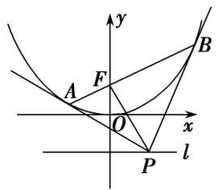

图（23）

①点 P 的轨迹是一条直线，即抛物线的准线 $l: y = -\frac{p}{2}$ ; ②两切线互相垂直，即 $PA \perp PB$ ;  
③ $PF \perp AB$ ; ④点 P 的坐标为 $\left(\frac{x_{A} + x_{B}}{2}, -\frac{p}{2}\right)$ .

# 【例题选讲】

[例 3] （15）设抛物线 C: $y^{2}=3x$ 的焦点为 F，点 A 为 C 上一点，若 $|FA|=3$ ，则直线 FA 的倾斜角为()

A. $\frac{\pi}{3}$

B. $\frac{\pi}{4}$

C. $\frac{\pi}{3}$ 或 $\frac{2\pi}{3}$

D. $\frac{\pi}{4}$ 或 $\frac{3\pi}{4}$

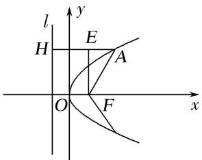  
（16）(2018·全国III)已知点 $M(-1, 1)$ 和抛物线 $C: y^{2} = 4x$ ，过 $C$ 的焦点且斜率为 $k$ 的直线与 $C$ 交于 $A$ ， $B$ 两点．若 $\angle AMB = 90^{\circ}$ ，则 $k =$ \_\_\_\_.  
（17）过抛物线 $y^{2}=2px(p>0)$ 的焦点 F 作直线交抛物线于 A, B 两点，若 $|AF|=2|BF|=6$ ，则 p= \_\_\_\_.  
（18）(2017·全国II)已知 F 是抛物线 C: $y^{2}=8x$ 的焦点，M 是 C 上一点，FM 的延长线交 y 轴于点 N．若 M 为 FN 的中点，则 $|FN|=$ \_\_\_\_.  
（19）如图，过抛物线 $y^{2} = 2px (p > 0)$ 的焦点 $F$ 的直线交抛物线于点 $A, B$ ，交其准线 $l$ 于点 $C$ ，若 $F$ 是 $AC$ 的中点，且 $|AF| = 4$ ，则线段 $AB$ 的长为（）

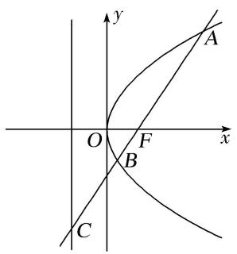

A. 5

B. 6

C. $\frac{16}{3}$

D. $\frac{20}{3}$

  
（20）过抛物线 $y^{2} = 4x$ 的焦点 $F$ 的直线 $l$ 与抛物线交于 $A$ ， $B$ 两点，若 $|AF| = 2|BF|$ ，则 $|AB|$ 等于（）

A. 4

B. $\frac{9}{2}$

C. 5

D. 6

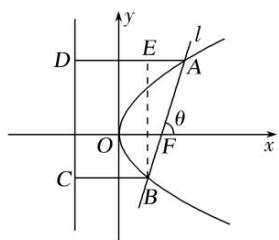  
（21）设 F 为抛物线 C: $y^{2}=3x$ 的焦点，过 F 且倾斜角为 $30^{\circ}$ 的直线交 C 于 A, B 两点，O 为坐标原点，则 $\triangle OAB$ 的面积为()

A. $\frac{3\sqrt{3}}{4}$

B. $\frac{9\sqrt{3}}{8}$

C. $\frac{63}{32}$

D. $\frac{9}{4}$  
（22）过点 $P(2, -1)$ 作抛物线 $x^{2} = 4y$ 的两条切线，切点分别为 $A, B, PA, PB$ 分别交 $x$ 轴于 $E, F$ 两点， $O$ 为坐标原点，则 $\triangle PEF$ 与 $\triangle OAB$ 的面积之比为（）

A. $\frac{\sqrt{3}}{2}$

B. $\frac{\sqrt{3}}{3}$

C. $\frac{1}{2}$

D. $\frac{3}{4}$

# 【对点训练】

23. 过抛物线 $C: y^{2} = 2px (p > 0)$ 的焦点 $F$ 且倾斜角为锐角的直线 $l$ 与 $C$ 交于 $A, B$ 两点，过线段 $AB$ 的中点 $N$ 且垂直于 $l$ 的直线与 $C$ 的准线相交于点 $M$ ，若 $|MN| = |AB|$ ，则直线 $l$ 的倾斜角为（）

A. $15^{\circ}$

B. $30^{\circ}$

C. $45^{\circ}$

D. $60^{\circ}$

24. 已知 $F$ 是抛物线 $y^{2} = 4x$ 的焦点，过焦点 $F$ 的直线 $l$ 交抛物线的准线于点 $P$ ，点 $A$ 在抛物线上且 $|AP| = |AF| = 3$ ，则直线 $l$ 的斜率为（）

A. $\pm 1$

B. $\sqrt{2}$

C. $\pm\sqrt{2}$

D. $2\sqrt{2}$

25. 已知直线 $l: y = kx - k (k \in \mathbf{R})$ 与抛物线 $C: y^2 = 4x$ 及其准线分别交于 $M, N$ 两点， $F$ 为抛物线的焦点，若 $2\overrightarrow{FM} = \overrightarrow{MN}$ ，则实数 $k$ 等于（）

A. $\pm\frac{\sqrt{3}}{3}$

B. $\pm1$

C. $\pm\sqrt{3}$

D. $\pm2$

26. 已知抛物线 $M: y^{2} = 4x$ ，过抛物线 $M$ 的焦点 $F$ 的直线 $l$ 交抛物线于 $A$ ， $B$ 两点(点 $A$ 在第一象限)，且交抛物线的准线于点 $E$ 。若 $\overrightarrow{AE} = 2\overrightarrow{BE}$ ，则直线 $l$ 的斜率为( )

A. 3

B. $2 \sqrt{2}$

C. $\sqrt{3}$

D. 1

27. 已知直线 $y = k(x + 2)(k > 0)$ 与抛物线 $C: y^2 = 8x$ 相交于 $A$ 、 $B$ 两点， $F$ 为 $C$ 的焦点，若 $|FA| = 2|FB|$ ，则 $k$ 的值为（）

A. $\frac{1}{3}$

B. $\frac{\sqrt{2}}{3}$

C. $\frac{2}{3}$

D. $\frac{2\sqrt{2}}{3}$

28. 已知抛物线 $y^{2}=2px(p>0)$ 的焦点为 F， $\triangle ABC$ 的顶点都在抛物线上，且满足 $\overrightarrow{PA}+\overrightarrow{FB}+\overrightarrow{FC}=0$ ，则 $\frac{1}{k_{AB}}+\frac{1}{k_{AC}}+\frac{1}{k_{BC}}=$ \_\_\_\_.

29. 已知抛物线 $E: x^{2} = 2py(p > 0)$ 的焦点为 $F$ ，其准线与 $y$ 轴交于点 $D$ ，过点 $F$ 作直线交抛物线 $E$ 于 $A$ ， $B$ 两点，若 $AB \perp AD$ 且 $|BF| = |AF| + 4$ ，则 $p$ 的值为 \_\_\_\_.

30. 已知抛物线 $x^{2} = 4y$ 的焦点为 $F$ , 准线为 $l$ , $P$ 为抛物线上一点, 过 $P$ 作 $PA \perp l$ 于点 $A$ , 当 $\angle AFO = 30^{\circ}$ ( $O$ 为坐标原点)时, $|PF| = \_$ .

31. 在平面直角坐标系 $xOy$ 中, 抛物线 $y^{2} = 6x$ 的焦点为 $F$ , 准线为 $l$ , $P$ 为抛物线上一点, $PA \perp l$ , $A$ 为垂足. 若直线 $AF$ 的斜率 $k = -\sqrt{3}$ , 则线段 $PF$ 的长为 \_\_\_\_.

32. 在直角坐标系 $xOy$ 中，抛物线 $C: y^2 = 4x$ 的焦点为 $F$ ，准线为 $l$ ， $P$ 为 $C$ 上一点， $PQ$ 垂直 $l$ 于点 $Q$ ， $M$ ， $N$ 分别为 $PQ$ ， $PF$ 的中点，直线 $MN$ 与 $x$ 轴交于点 $R$ ，若 $\angle NFR = 60^\circ$ ，则 $|FR|$ 等于（）

A. 2

B. $\sqrt{3}$

C. $2\sqrt{3}$

D. 3

33. 已知 $y^{2} = 4x$ 的准线交 $x$ 轴于点 $Q$ ，焦点为 $F$ ，过 $Q$ 且斜率大于 0 的直线交 $y^{2} = 4x$ 于 $A, B$ ，两点 $\angle AFB = 60^{\circ}$ ，则 $|AB|$ 等于（）

A. $\frac{4\sqrt{7}}{6}$

B. $\frac{4\sqrt{7}}{3}$

C. 4

D. 3

34. 过抛物线 $y=\frac{1}{4}x^{2}$ 的焦点 F 作一条倾斜角为 $30^{\circ}$ 的直线交抛物线于 A，B 两点，则 $|AB|=$ \_\_\_\_.

35. 已知直线 l 过抛物线 C: $y^{2}=3x$ 的焦点 F，交 C 于 A, B 两点，交 C 的准线于点 P，若 $\overrightarrow{AF}=\overrightarrow{FP}$ ，则 $|AB|=(\quad)$

A. 3

B. 4

C. 6

D. 8

36. (2017·全国II)过抛物线 C: $y^{2}=4x$ 的焦点 F，且斜率为 $\sqrt{3}$ 的直线交 C 于点 M(M 在 x 轴的上方)，l 为 C 的准线，点 N 在 l 上且 $MN \perp l$ ，则 M 到直线 NF 的距离为()

A. $\sqrt{5}$

B. $2\sqrt{2}$

C. $2\sqrt{3}$

D. $3\sqrt{3}$

37. 已知抛物线 C: $x^{2}=4y$ 的焦点为 F，直线 AB 与抛物线 C 相交于 A，B 两点，若 $2\overrightarrow{OA}+\overrightarrow{OB}-3\overrightarrow{OF}=0$ ，则弦 AB 中点到抛物线 C 的准线的距离为 \_\_\_\_.

38. 已知抛物线 $C: y^{2} = 4x$ 的焦点为 $F$ , 准线为 $l$ . 若射线 $y = 2(x - 1)(x \leq 1)$ 与 $C, l$ 分别交于 $P$ , Q 两点, 则 $\frac{|PQ|}{|PF|} = (\quad)$

A. $\sqrt{2}$

B. 2

C. $\sqrt{5}$

D. 5

39. 已知抛物线 $\Gamma: y^{2} = 8x$ 的焦点为 $F$ , 准线与 $x$ 轴的交点为 $K$ , 点 $P$ 在 $\Gamma$ 上且 $|PK| = \sqrt{2}|PF|$ , 则 $\triangle PKF$ 的面积为 \_\_\_\_.

40. 抛物线 $C: y^{2} = 4x$ 的焦点为 $F$ , 其准线 $l$ 与 $x$ 轴交于点 $A$ , 点 $M$ 在抛物线 $C$ 上, 当 $\frac{|MA|}{|MF|} = \sqrt{2}$ 时, $\triangle AMF$ 的面积为 ( )

A. 1

B. $\sqrt{2}$

C. 2

D. $2\sqrt{2}$

41. 抛物线 $x^{2} = 4y$ 的焦点为 $F$ , 过点 $F$ 作斜率为 $\frac{\sqrt{3}}{3}$ 的直线 $l$ 与抛物线在 $y$ 轴右侧的部分相交于点 $A$ , 过点 $A$ 作抛物线准线的垂线, 垂足为 $H$ , 则 $\triangle AHF$ 的面积是( )

A. 4

B. $3\sqrt{3}$

C. $4\sqrt{3}$

D. 8

42. 已知抛物线 $C: y^{2} = 8x$ 的焦点为 $F$ , 直线 $l$ 过焦点 $F$ 与抛物线 $C$ 分别交于 $A, B$ 两点, 且直线 $l$ 不与 $x$ 轴垂直, 线段 $AB$ 的垂直平分线与 $x$ 轴交于点 $P(10, 0)$ , 则 $\triangle AOB$ 的面积为 ( )

A. $4 \sqrt{3}$

B. $4 \sqrt{6}$

C. $8\sqrt{2}$

D. $8 \sqrt{6}$

43. 过抛物线 $y^{2} = 4x$ 的焦点 $F$ 的直线交抛物线于 $A, B$ 两点，点 $O$ 是坐标原点，若 $|AF| = 3$ ，则 $\triangle AOB$ 的面积为（）

A. $\frac{\sqrt{2}}{2}$

B. $\sqrt{2}$

C. $\frac{3\sqrt{2}}{2}$

D. $2\sqrt{2}$

44. 已知抛物线 $y^{2}=4x$ ，过其焦点 F 的直线 l 与抛物线分别交于 A，B 两点 (A 在第一象限内)， $\overrightarrow{AF}=3\overrightarrow{FB}$ ，过 AB 的中点且垂直于 l 的直线与 x 轴交于点 G，则 $\triangle ABG$ 的面积为（）

A. $\frac{8\sqrt{3}}{9}$

B. $\frac{16\sqrt{3}}{9}$

C. $\frac{32\sqrt{3}}{9}$

D. $\frac{64\sqrt{3}}{9}$

45. 已知抛物线 $x^{2} = 2y$ 的焦点为 $F$ ，其上有两点 $A(x_{1}, y_{1})$ ， $B(x_{2}, y_{2})$ 满足 $|AF| - |BF| = 2$ ，则 $y_{1} + x_{1}^{2} - y_{2} - x_{2}^{2} = (\quad)$

A. 4

B. 6

C. 8

D. 10

46. (2018·全国I)设抛物线 C: $y^{2}=4x$ 的焦点为 F，过点 $(-2,0)$ 且斜率为 $\frac{2}{3}$ 的直线与 C 交于 M，N 两点，则 $\overrightarrow{FM}\cdot\overrightarrow{FN}$ 等于()

A. 5

B. 6

C. 7

D. 8

47. 抛物线 $C: y^{2} = 4x$ 的焦点为 $F$ , 动点 $P$ 在抛物线 $C$ 上, 点 $A(-1, 0)$ , 当 $\frac{|PF|}{|PA|}$ 取得最小值时, 直线 $AP$ 的方程为 \_\_\_\_.

48. 已知点 $P(-1, 0)$ ，设不垂直于 $x$ 轴的直线 $l$ 与抛物线 $y^{2} = 2x$ 交于不同的两点 $A, B$ ，若 $x$ 轴是 $\angle APB$ 的角平分线，则直线 $l$ 一定过点（）

A. $\left(\frac{1}{2},0\right)$

B. $(1, 0)$

C. $(2, 0)$

D. $(-2,0)$

49. 已知抛物线 $C: y^{2} = 2px (p > 0)$ 和动直线 $l: y = kx + b (k, b$ 是参变量，且 $k \neq 0, b \neq 0)$ 相交于 $A(x_{1}, y_{1}), B(x_{2}, y_{2})$ 两点，平面直角坐标系的原点为 $O$ ，记直线 $OA, OB$ 的斜率分别为 $k_{OA}, k_{OB}$ ，且 $k_{OA} \cdot k_{OB} = \sqrt{3}$ 恒成立，则当 $k$ 变化时，直线 $l$ 经过的定点为 \_\_\_\_.

50. 在直线 $y = -2$ 上任取一点 $Q$ , 过 $Q$ 作抛物线 $x^{2} = 4y$ 的切线, 切点分别为 $A, B$ , 则直线 $AB$ 恒过的点的坐标为( )

A. $(0, 1)$

B. $(0, 2)$

C. $(2, 0)$

D. $(1, 0)$

51. 已知抛物线 $C: y^{2} = 4x$ 的焦点为 $F$ , 直线 $y = \sqrt{3}(x - 1)$ 与 $C$ 交于 $A$ , $B(A$ 在 $x$ 轴上方)两点. 若 $\overrightarrow{AF} = m\overrightarrow{FB}$ , 则 $m$ 的值为 \_\_\_\_.

52. 设抛物线 $C: y^{2} = 12x$ 的焦点为 $F$ , 准线为 $l$ , 点 $M$ 在 $C$ 上, 点 $N$ 在 $l$ 上, 且 $\overrightarrow{FN} = \lambda \overrightarrow{FM} (\lambda > 0)$ , 若 $|MF| = 4$ , 则 $\lambda$ 等于( )

A. $\frac{3}{2}$

B. 2

C. $\frac{5}{2}$

D. 3

53. 已知抛物线 $y^{2} = 2px (p > 0)$ 过点 $A\left(\frac{1}{2}, \sqrt{2}\right)$ ，其准线与 $x$ 轴交于点 $B$ ，直线 $AB$ 与抛物线的另一个交点为 $M$ ，若 $\overrightarrow{MB} = \lambda \overrightarrow{AB}$ ，则实数 $\lambda$ 为（）

A. $\frac{1}{3}$

B. $\frac{1}{2}$

C. 2

D. 3

54. 如图，过抛物线 $y^{2} = 4x$ 的焦点 $F$ 作倾斜角为 $\alpha$ 的直线 $l$ ， $l$ 与抛物线及其准线从上到下依次交于 $A$ 、 $B$ 、 $C$ 点，令 $\frac{|AF|}{|BF|} = \lambda_{1}$ ， $\frac{|BC|}{|BF|} = \lambda_{2}$ ，则当 $\alpha = \frac{\pi}{3}$ 时， $\lambda_{1} + \lambda_{2}$ 的值为（）

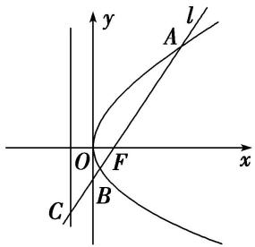

A. 4

B. 5

C. 6

D. 8

55. 如图所示，抛物线 $y = \frac{1}{4} x^2$ ， $AB$ 为过焦点 $F$ 的弦，过 $A, B$ 分别作抛物线的切线，两切线交于点 $M$ ，设 $A(x_A, y_A), B(x_B, y_B), M(x_M, y_M)$ ，则：①若 $AB$ 的斜率为 1，则 $|AB| = 4$ ；② $|AB|_{\min} = 2$ ；③ $y_M = -1$ ；④若 $AB$ 的斜率为 1，则 $x_M = 1$ ；⑤ $x_A \cdot x_B = -4$ 。以上结论正确的个数是（）

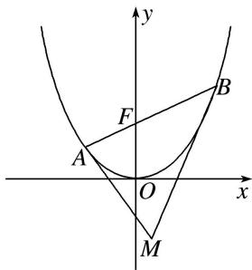

A. 1

B. 2

C. 3

D. 4

