# 专题08 抛物线模型

# 抛物线秒杀小题常用结论  
（1）抛物线定义： $|MF|=d(d$ 为M点到准线的距离). 如图（17）

图（17）

图（18）  
（2）设 A, B 是抛物线 $y^{2}=2px(p>0)$ 上不同的两点，P 为弦 AB 的中点，则 $k_{AB}\cdot y_{0}=p$ .  
（3）以抛物线 $y^{2}=2px(p>0)$ 为例，设 AB 是抛物线的过焦点的一条弦(焦点弦)，F 是抛物线的焦点， $A(x_{1},y_{1})$ ， $B(x_{2},y_{2})$ ，A、B 在准线上的射影为 $A_{1}$ 、 $B_{1}$ ，则有以下结论：

① $x_{1}x_{2}=\frac{p^{2}}{4},\quad y_{1}y_{2}=-p^{2};$

②若直线 AB 的倾斜角为 $\theta$ ，则 $|AF|=\frac{p}{1-\cos\theta}$ ， $|BF|=\frac{p}{1+\cos\theta}$ ；如图（18）

③ $\frac{1}{|AF|}+\frac{1}{|BF|}=\frac{2}{p}$ 为定值；如图（18）

④ $|AB|=x_{1}+x_{2}+p=\frac{2p}{\sin^{2}\theta}$ (其中 $\theta$ 为直线AB的倾斜角)，抛物线的通径长为2p，通径是最短的焦点弦；如图（18）

⑤ $S_{\triangle AOB}=\frac{p^{2}}{2\sin\theta}$ (其中 $\theta$ 为直线AB的倾斜角); 如图（18）

⑥以 AB 为直径的圆与抛物线的准线相切；如图（19）

图（19）

图（20）

⑦以 AF(或 BF)为直径的圆与 y 轴相切；如图(20, 21)

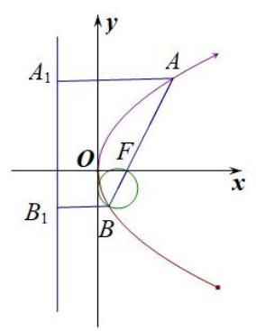

图（21）

图（22）

⑧以 $A_{1}B_{1}$ 为直径的圆与直线 AB 相切，切点为 F， $\angle A_{1}FB_{1}=90^{\circ}$ ；如图（22）  
⑨A，O， $B_{1}$ 三点共线，B，O， $A_{1}$ 三点也共线；  
⑩已知 $M(x_{0}, y_{0})$ 是抛物线 $y^{2}=2px(p>0)$ 上任意一点，点 $N(a, 0)$ 是抛物线的对称轴上一点，则 $|MN|_{\min}=\left\{\begin{aligned}|a|(a\leq p),\\ \sqrt{2pa-p^{2}}(a>p).\end{aligned}\right.$   
（4）如图（23）所示, $AB$ 是抛物线 $x^{2} = 2py(p > 0)$ 的过焦点的一条弦(焦点弦), 分别过 $A, B$ 作抛物线的切线, 交于点 $P$ , 连接 $PF$ , 则有以下结论:

图（23）

①点 P 的轨迹是一条直线，即抛物线的准线 $l: y = -\frac{p}{2}$ ; ②两切线互相垂直，即 $PA \perp PB$ ;  
③ $PF \perp AB$ ; ④点 P 的坐标为 $\left(\frac{x_{A} + x_{B}}{2}, -\frac{p}{2}\right)$ .

# 【例题选讲】

[例 3] （15）设抛物线 C: $y^{2}=3x$ 的焦点为 F，点 A 为 C 上一点，若 $|FA|=3$ ，则直线 FA 的倾斜角为()

A. $\frac{\pi}{3}$

B. $\frac{\pi}{4}$

C. $\frac{\pi}{3}$ 或 $\frac{2\pi}{3}$

D. $\frac{\pi}{4}$ 或 $\frac{3\pi}{4}$
答案 C 解析 如图, 作 $AH \perp l$ 于 $H$ , 则 $|AH| = |FA| = 3$ , 作 $FE \perp AH$ 于 $E$ , 则 $|AE| = 3 - \frac{3}{2} = \frac{3}{2}$ , 在 Rt△AEF 中, $\cos \angle EAF = \frac{|AE|}{|AF|} = \frac{1}{2}$ , $\therefore \angle EAF = \frac{\pi}{3}$ , 即直线 $FA$ 的倾斜角为 $\frac{\pi}{3}$ , 同理点 $A$ 在 $x$ 轴下方时, 直线 $FA$ 的倾斜角为 $\frac{2\pi}{3}$ .

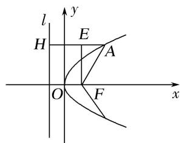  
（16）(2018·全国III)已知点 $M(-1, 1)$ 和抛物线 $C: y^{2} = 4x$ ，过 $C$ 的焦点且斜率为 $k$ 的直线与 $C$ 交于 $A$ ， $B$ 两点．若 $\angle AMB = 90^{\circ}$ ，则 $k = \_$ .
答案 2 解析 法一：由题意知，抛物线的焦点为(1,0)，则过 C 的焦点且斜率为 k 的直线方程为 y = k(x-1)(k≠0)，由 $\left\{\begin{aligned}y=k(x-1),\\ y^{2}=4x\end{aligned}\right.$ 消去 y 得 $k^{2}(x-1)^{2}=4x$ ，即 $k^{2}x^{2}-(2k^{2}+4)x+k^{2}=0$ 。设 $A(x_{1},y_{1})$ ， $B(x_{2},y_{2})$ ，则 $x_{1}+x_{2}=\frac{2k^{2}+4}{k^{2}}$ ， $x_{1}x_{2}=1$ 。由 $\left\{\begin{aligned}y=k(x-1),\\ y^{2}=4x\end{aligned}\right.$ 消去 x 得 $y^{2}=4\left(\frac{1}{k}y+1\right)$ ，即 $y^{2}-\frac{4}{k}y-4=0$ ，则 $y_{1}+y_{2}=\frac{4}{k}$ ， $y_{1}y_{2}=-4$ 。由 $\angle AMB=90^{\circ}$ ，得 $\overrightarrow{MA}\cdot\overrightarrow{MB}=(x_{1}+1,y_{1}-1)\cdot(x_{2}+1,y_{2}-1)=x_{1}x_{2}+x_{1}+x_{2}+1+y_{1}y_{2}-(y_{1}+y_{2})+1=0$ ，将 $x_{1}+x_{2}=\frac{2k^{2}+4}{k^{2}}$ ， $x_{1}x_{2}=1$ 与 $y_{1}+y_{2}=\frac{4}{k}$ ， $y_{1}y_{2}=-4$ 代入，得 k=2。

法二：设抛物线的焦点为 $F, A(x_1, y_1), B(x_2, y_2)$ ，则 $\left\{ \begin{array}{l} y_1^2 = 4x_1, \\ y_2^2 = 4x_2, \end{array} \right.$ 所以 $y_1^2 - y_2^2 = 4(x_1 - x_2)$ ，则 $k = \frac{y_1 - y_2}{x_1 - x_2} = \frac{4}{y_1 + y_2}$ 。取 $AB$ 的中点 $M'(x_0, y_0)$ ，分别过点 $A, B$ 作准线 $x = -1$ 的垂线，垂足分别为 $A'$ ， $B'$ ，又 $\angle AMB = 90^\circ$ ，点 $M$ 在准线 $x = -1$ 上，所以 $|MM'| = \frac{1}{2}|AB| = \frac{1}{2} (|AF| + |BF|) = \frac{1}{2} (|AA'| + |BB'|)$ 。又 $M'$ 为 $AB$ 的中点，所以 $MM'$ 平行于 $x$ 轴，且 $y_0 = 1$ ，所以 $y_1 + y_2 = 2$ ，所以 $k = 2$ 。  
（17）过抛物线 $y^{2}=2px(p>0)$ 的焦点 F 作直线交抛物线于 A, B 两点，若 $|AF|=2|BF|=6$ ，则 p= \_\_\_\_.
答案 4 解析 [一般解法] 设 AB 的方程为 $x=my+\frac{p}{2}$ ， $A(x_{1},y_{1})$ ， $B(x_{2},y_{2})$ ，且 $x_{1}>x_{2}$ ，将直线 AB 的方程代入抛物线方程得 $y^{2}-2pmy-p^{2}=0$ ，所以 $y_{1}y_{2}=-p^{2}$ ， $4x_{1}x_{2}=p^{2}$ 。设抛物线的准线为 l，过 A 作 $AC\perp l$ ，垂足为 C，过 B 作 $BD\perp l$ ，垂足为 D，因为 $|AF|=2|BF|=6$ ，根据抛物线的定义知， $|AF|=|AC|=x_{1}+\frac{p}{2}=6$ ， $|BF|=|BD|=x_{2}+\frac{p}{2}=3$ ，所以 $x_{1}-x_{2}=3$ ， $x_{1}+x_{2}=9-p$ ，所以 $(x_{1}+x_{2})^{2}-(x_{1}-x_{2})^{2}=4x_{1}x_{2}=p^{2}$ ，即 18p-72=0，解得 p=4。

[应用结论]法一: 设直线 AB 的倾斜角为 $\alpha$ , 分别过 A, B 作准线 l 的垂线 $AA'$ , $BB'$ , 垂足分别为 $A'$ , $B'$ (图略), 则 $|AA'|=6$ , $|BB'|=3$ , 过点 B 作 $AA'$ 的垂线 BC, 垂足为 C, 则 $|AC|=3$ , $|BC|=6\sqrt{2}$ , 易知 $\angle BAC=\alpha$ , 所以 $\sin\alpha=\frac{6\sqrt{2}}{9}=\frac{2\sqrt{2}}{3}$ , 所以 $|AB|=\frac{2p}{\sin^{2}\alpha}=9$ , 解得 p=4.

法二：设直线 $AB$ 的倾斜角为 $\alpha$ ，则 $|AF| = \frac{p}{1 - \cos \alpha}$ ， $|BF| = \frac{p}{1 + \cos \alpha}$ ，则有 $\frac{p}{1 - \cos \alpha} = 2 \times \frac{p}{1 + \cos \alpha}$ ，解得 $\cos \alpha = \frac{1}{3}$ ，又 $|AF| = \frac{p}{1 - \cos \alpha} = 6$ ，所以 $p = 4$ 。

法三：∵ $|AF|=6,\quad|BF|=3,\quad\frac{2}{p}=\frac{1}{6}+\frac{1}{3}=\frac{1}{2},\quad\therefore p=4.$  
（18）(2017·全国II)已知 F 是抛物线 C: $y^{2}=8x$ 的焦点，M 是 C 上一点，FM 的延长线交 y 轴于点 N．若 M 为 FN 的中点，则 $|FN|=$ \_\_\_\_.
答案 6 解析 如图，不妨设点 M 位于第一象限内，抛物线 C 的准线交 x 轴于点 A，过点 M 作准线的垂线，垂足为点 B，交 y 轴于点 P，∴ PM // OF.

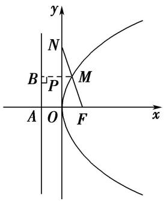
由题意知， $F(2,0)$ ， $|FO|=|AO|=2$ ．∵点M为FN的中点， $PM\parallel OF$ ，∴ $|MP|=\frac{1}{2}|FO|=1$ ．又 $|BP|=|AO|=2$ ，∴ $|MB|=|MP|+|BP|=3$ ．由抛物线的定义知 $|MF|=|MB|=3$ ，故 $|FN|=2|MF|=6$ ．  
（19）如图，过抛物线 $y^{2} = 2px (p > 0)$ 的焦点 $F$ 的直线交抛物线于点 $A, B$ ，交其准线 $l$ 于点 $C$ ，若 $F$ 是 $AC$ 的中点，且 $|AF| = 4$ ，则线段 $AB$ 的长为（）

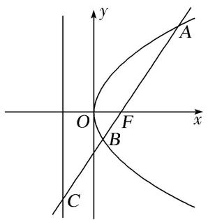

A. 5

B. 6

C. $\frac{16}{3}$

D. $\frac{20}{3}$
答案 C 解析 [一般解法] 如图，设 l 与 x 轴交于点 M，过点 A 作 $AD \perp l$ 交 l 于点 D，由抛物线的定义知， $|AD| = |AF| = 4$ ，由 F 是 AC 的中点，知 $|AD| = 2|MF| = 2p$ ，所以 p = 4，解得 p = 2，所以抛物线的方程为 $y^{2} = 4x$ 。设 $A(x_{1}, y_{1})$ ， $B(x_{2}, y_{2})$ ，则 $|AF| = x_{1} + \frac{p}{2} = x_{1} + 1 = 4$ ，所以 $x_{1} = 3$ ，可得 $y_{1} = 2\sqrt{3}$ ，所以 $A(3, 2\sqrt{3})$ ，又 $F(1, 0)$ ，所以直线 AF 的斜率 $k = \frac{2\sqrt{3}}{3 - 1} = \sqrt{3}$ ，所以直线 AF 的方程为 $y = \sqrt{3}(x - 1)$ ，代入抛物线方程 $y^{2} = 4x$ 得 $3x^{2} - 10x + 3 = 0$ ，所以 $x_{1} + x_{2} = \frac{10}{3}$ ， $|AB| = x_{1} + x_{2} + p = \frac{16}{3}$ 。故选 C。

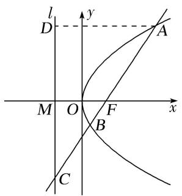

[应用结论]法一 设 $A(x_{1},y_{1}),B(x_{2},y_{2})$ ，则 $\vert AF\vert = x_1 + \frac{p}{2} = x_1 + 1 = 4$ ，所以 $x_{1} = 3$ ，又 $x_{1}x_{2} = \frac{p^{2}}{4} = 1$ ，所以 $x_{2} = \frac{1}{3}$ ，所以 $\vert AB\vert = x_1 + x_2 + p = 3 + \frac{1}{3} +2 = \frac{16}{3}$

法二 因为 $\frac{1}{|AF|} +\frac{1}{|BF|} = \frac{2}{p}$ ， $|AF| = 4$ ，所以 $|BF| = \frac{4}{3}$ ，所以 $|AB| = |AF| + |BF| = 4 + \frac{4}{3} = \frac{16}{3}$  
（20）过抛物线 $y^{2} = 4x$ 的焦点 $F$ 的直线 $l$ 与抛物线交于 $A$ ， $B$ 两点，若 $|AF| = 2|BF|$ ，则 $|AB|$ 等于（）

A. 4

B. $\frac{9}{2}$

C. 5

D. 6
答案 B 解析 [一般解法] 易知直线 l 的斜率存在, 设为 k, 则其方程为 $y = k(x - 1)$ . 由 $\left\{\begin{aligned}y &= k(x - 1), \\ y &= 4x\end{aligned}\right.$ 得 $k^{2}x^{2} - (2k^{2} + 4)x + k^{2} = 0$ , 得 $x_{A} \cdot x_{B} = 1$ , ①. 因为 $|AF| = 2|BF|$ , 由抛物线的定义得 $x_{A} + 1 = 2(x_{B} + 1)$ , 即 $x_{A} = 2x_{B} + 1$ , ②. 由①②解得 $x_{A} = 2$ , $x_{B} = \frac{1}{2}$ , 所以 $|AB| = |AF| + |BF| = x_{A} + x_{B} + p = \frac{9}{2}$ .

[应用结论]法一 由对称性不妨设点 A 在 x 轴的上方，如图设 A, B 在准线上的射影分别为 D, C，作 $BE \perp AD$ 于 E，设 $|BF| = m$ ，直线 l 的倾斜角为 $\theta$ ，则 $|AB| = 3m$ ，由抛物线的定义知 $|AD| = |AF| = 2m$ ， $|BC| = |BF| = m$ ，所以 $\cos \theta = \frac{|AE|}{|AB|} = \frac{1}{3}$ ，所以 $\tan \theta = 2\sqrt{2}$ 。则 $\sin^{2}\theta = 8\cos^{2}\theta$ ， $\therefore \sin^{2}\theta = \frac{8}{9}$ 。又 $y^{2} = 4x$ ，知 2p = 4，故利用弦长公式 $|AB| = \frac{2p}{\sin^{2}\theta} = \frac{9}{2}$ 。

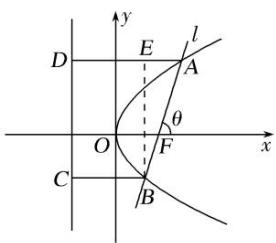

法二 因为 $|AF|=2|BF|$ ， $\frac{1}{|AF|}+\frac{1}{|BF|}=\frac{1}{2|BF|}+\frac{1}{|BF|}=\frac{3}{2|BF|}=\frac{2}{p}=1$ ，解得 $|BF|=\frac{3}{2}$ ， $|AF|=3$ ，故 $|AB|=|AF|+|BF|=\frac{9}{2}$ .  
（21）设 F 为抛物线 C: $y^{2}=3x$ 的焦点，过 F 且倾斜角为 $30^{\circ}$ 的直线交 C 于 A, B 两点，O 为坐标原点，则 $\triangle OAB$ 的面积为()

A. $\frac{3\sqrt{3}}{4}$

B. $\frac{9\sqrt{3}}{8}$

C. $\frac{63}{32}$

D. $\frac{9}{4}$
答案 D 解析 [一般解法] 由已知得焦点坐标为 $F\left(\frac{3}{4}, 0\right)$ ，因此直线 $AB$ 的方程为 $y = \frac{\sqrt{3}}{3} \left(x - \frac{3}{4}\right)$ ，即 $4x - 4\sqrt{3} y - 3 = 0$ 。与抛物线方程联立，化简得 $4y^{2} - 12\sqrt{3} y - 9 = 0$ ，故 $|y_{A} - y_{B}| = \sqrt{(y_{A} + y_{B})^{2} - 4y_{A}y_{B}} = 6$ 。因此 $S_{\triangle OAB} = \frac{1}{2} |OF||y_A - y_B| = \frac{1}{2} \times \frac{3}{4} \times 6 = \frac{9}{4}$ 。联立方程得 $x^{2} - \frac{21}{2} x + \frac{9}{16} = 0$ ，故 $x_{A} + x_{B} = \frac{21}{2}$ 。根据抛物线的定义有 $|AB| = x_{A} + x_{B} + p = \frac{21}{2} + \frac{3}{2} = 12$ ，同时原点到直线 $AB$ 的距离为 $h = \frac{|-3|}{\sqrt{4^2 + (-4\sqrt{3})^2}} = \frac{3}{8}$ ，因此 $S_{\triangle OAB} = \frac{1}{2} |AB| \cdot h = \frac{9}{4}$ 。

[应用结论] 由 $2p = 3$ ，及 $|AB| = \frac{2p}{\sin^2\alpha}$ ，得 $|AB| = \frac{2p}{\sin^2\alpha} = \frac{3}{\sin^230^\circ} = 12$ 。原点到直线 $AB$ 的距离 $d = |OF| \cdot \sin 30^\circ = \frac{3}{8}$ ，故 $S_{\triangle AOB} = \frac{1}{2}|AB| \cdot d = \frac{1}{2} \times 12 \times \frac{3}{8} = \frac{9}{4}$ 。  
（22）过点 $P(2, -1)$ 作抛物线 $x^{2} = 4y$ 的两条切线，切点分别为 $A, B, PA, PB$ 分别交 $x$ 轴于 $E, F$ 两点， $O$ 为坐标原点，则 $\triangle PEF$ 与 $\triangle OAB$ 的面积之比为（）

A. $\frac{\sqrt{3}}{2}$

B. $\frac{\sqrt{3}}{3}$

C. $\frac{1}{2}$

D. $\frac{3}{4}$
答案 C 解析 解法1 设过 \(P\) 点的直线方程为 \(y = k(x - 2) - 1\)，代入 \(x^{2} = 4y\) 可得 \(x^{2} - 4kx + 8k + 4 = 0\)，令 \(\Delta = 0\)，可得 \(16k^{2} - 4(8k + 4) = 0\)，解得 \(k = 1 \pm \sqrt{2}\)。\$\therefore\$ 直线 \(PA\)，\(PB\) 的方程分别为 \(y = (1 + \sqrt{2})(x - 2) - 1\)，\(y = (1 - \sqrt{2}) \cdot (x - 2) - 1\)，分别令 \(y = 0\)，可得 \(E(\sqrt{2} + 1, 0)\)，\(F(1 - \sqrt{2}, 0)\)，即 \(|EF| = 2\sqrt{2}\)。\(\therefore S\_{\triangle PEF} = \frac{1}{2} \times 2\sqrt{2} \times 1 = \sqrt{2}\)，易求得 \(A(2 + 2\sqrt{2}, 3 + 2\sqrt{2})\)，\(B(2 - 2\sqrt{2}, 3 - 2\sqrt{2})\)，\$\therefore\$ 直线 \(AB\) 的方程为 \(y = x + 1\)，\(|AB| = 8\)，又原点 \(O\) 到直线 \(AB\) 的距离 \(d = \frac{\sqrt{2}}{2}\)，\$\therefore S\_{\triangle OAB} = \frac{1}{2} \times 8 \times \frac{\sqrt{2}}{2} = 2\sqrt{2}\)。\(\therefore\) \$\triangle PEF\$ 与 \$\triangle OAB\$ 的面积之比为 \$\frac{1}{2}\$。故选 C.
解法2 设 $A(x_{1},y_{1}),B(x_{2},y_{2})$ ，则点 $A,B$ 处的切线方程为 $x_{1}x = 2(y + y_{1}),x_{2}x = 2(y + y_{2})$ ，所以 $E\left(\frac{2y_1}{x_1},0\right),$ $F\left(\frac{2y_2}{x_2},0\right)$ 即 $E\left(\frac{x_1}{2},0\right),F\left(\frac{x_2}{2},0\right)$ 因为这两条切线都过点 $P(2, - 1)$ ，则 $\left\{ \begin{array}{ll}2x_{1} = 2(-1 + y_{1}),\\ 2x_{2} = 2(-1 + y_{2}), \end{array} \right.$ 所以 $l_{AB}:x$ $= -1 + y$ ，即 $l_{AB}$ 过定点(0，1)，则 $\frac{S_{\triangle PEF}}{S_{OAB}} = \frac{\frac{1}{2}\times 1\times\left|\frac{x_1}{2} - \frac{x_2}{2}\right|}{\frac{1}{2}\times 1\times|x_1 - x_2|} = \frac{1}{2}.$

# 【对点训练】

23. 过抛物线 $C: y^{2} = 2px (p > 0)$ 的焦点 $F$ 且倾斜角为锐角的直线 $l$ 与 $C$ 交于 $A, B$ 两点，过线段 $AB$ 的中点 $N$ 且垂直于 $l$ 的直线与 $C$ 的准线相交于点 $M$ ，若 $|MN| = |AB|$ ，则直线 $l$ 的倾斜角为（）

A. $15^{\circ}$

B. $30^{\circ}$

C. $45^{\circ}$

D. $60^{\circ}$

23. 答案 B 解析 分别过 A, B, N 作抛物线准线的垂线，垂足分别为 $A'$ , $B'$ , $N'$ (图略)，由抛物线的定义知 $|AF|=|AA'|$ , $|BF|=|BB'|$ , $|NN'|=\frac{1}{2}(|AA'|+|BB'|)=\frac{1}{2}|AB|$ ，因为 $|MN|=|AB|$ ，所以 $|NN'|=\frac{1}{2}|MN|$ ，所以 $\angle MNN'=60^{\circ}$ ，即直线 MN 的倾斜角为 $120^{\circ}$ ，又直线 MN 与直线 l 垂直且直线 l 的倾斜角为锐角，所以直线 l 的倾斜角为 $30^{\circ}$ ，故选 B.

24. 已知 $F$ 是抛物线 $y^{2} = 4x$ 的焦点，过焦点 $F$ 的直线 $l$ 交抛物线的准线于点 $P$ ，点 $A$ 在抛物线上且 $|AP| = |AF| = 3$ ，则直线 $l$ 的斜率为（）

A. $\pm 1$

B. $\sqrt{2}$

C. $\pm\sqrt{2}$

D. $2 \sqrt{2}$

24. 答案 C 解析 因为点 A 在抛物线 $y^{2}=4x$ 上，且 $|AP|=|AF|=3$ ，点 P 在抛物线的准线上，由抛物线的定义可知， $AP \perp$ 准线，设 $A(x, y)$ ，则 $|AP|=x+\frac{p}{2}=x+1=3$ ，解得 x=2，所以 $y^{2}=8$ ，故 $A(2, \pm2\sqrt{2})$ ，故 $P(-1, \pm2\sqrt{2})$ ，又 $F(1, 0)$ ，所以直线 l 的斜率为 $k_{PF}=\frac{\pm2\sqrt{2}}{-2}=\pm\sqrt{2}$ 。故选 C.

25. 已知直线 $l: y = kx - k (k \in \mathbf{R})$ 与抛物线 $C: y^2 = 4x$ 及其准线分别交于 $M, N$ 两点， $F$ 为抛物线的焦点，若 $2\overrightarrow{FM} = \overrightarrow{MN}$ ，则实数 $k$ 等于（）

A. $\pm\frac{\sqrt{3}}{3}$

B. $\pm1$

C. $\pm\sqrt{3}$

D. $\pm2$

25. 答案 C 解析 抛物线 $C: y^{2} = 4x$ 的焦点 $F(1,0)$ ，直线 $l: y = kx - k$ 过抛物线的焦点。当 $k > 0$ 时，如图所示，

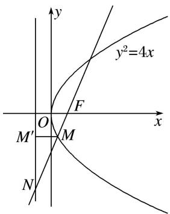

过点 $M$ 作 $MM'$ 垂直于准线 $x = -1$ ，垂足为 $M'$ ，由抛物线的定义，得 $|MM'| = |MF|$ ，易知 $\angle M'MN$ 与直线 $l$ 的倾斜角相等，由 $2\overrightarrow{FM} = \overrightarrow{MN}$ ，得 $\cos \angle M'MN = \frac{|MM'|}{|MN|} = \frac{1}{2}$ ，则 $\tan \angle M'MN = \sqrt{3}$ ， $\therefore$ 直线 $l$ 的斜率 $k = \sqrt{3}$ ；当 $k < 0$ 时，可得直线 $l$ 的斜率 $k = -\sqrt{3}$ 。故选 C.

26. 已知抛物线 $M: y^{2} = 4x$ ，过抛物线 $M$ 的焦点 $F$ 的直线 $l$ 交抛物线于 $A$ ， $B$ 两点(点 $A$ 在第一象限)，且交抛物线的准线于点 $E$ 。若 $\overrightarrow{AE} = 2\overrightarrow{BE}$ ，则直线 $l$ 的斜率为( )

A. 3

B. $2 \sqrt{2}$

C. $\sqrt{3}$

D. 1

26. 答案 B 解析 分别过 A, B 两点作 AD, BC 垂直于准线，垂足分别为 D, C，由 $\overrightarrow{AE}=2\overrightarrow{BE}$ ,得 B 为 AE 的中点，∴ $|AB|=|BE|$ ，则 $|AD|=2|BC|$ ，由抛物线的定义可知 $|AF|=|AD|$ ， $|BF|=|BC|$ ，∴ $|AB|=3|BC|$ ，∴ $|BE|=3|BC|$ ，则 $|CE|=2\sqrt{2}|BC|$ ，∴ $\tan\angle CBE=\frac{|CE|}{|CB|}=2\sqrt{2}$ ，∴ 直线 l 的斜率 $k=\tan\angle AFx=\tan\angle CBE=2\sqrt{2}$ .

27. 已知直线 $y = k(x + 2)(k > 0)$ 与抛物线 $C: y^2 = 8x$ 相交于 $A, B$ 两点， $F$ 为 $C$ 的焦点，若 $|FA| = 2|FB|$ ，则 $k$ 的值为（）

A. $\frac{1}{3}$

B. $\frac{\sqrt{2}}{3}$

C. $\frac{2}{3}$

D. $\frac{2\sqrt{2}}{3}$

27. 答案 D 解析 解法 1 设 $A(x_{1}, y_{1}), B(x_{2}, y_{2})$ ，则 $x_{1} > 0, x_{2} > 0, \therefore |FA| = x_{1} + 2, |FB| = x_{2} + 2, \therefore x_{1} + 2 = 2x_{2} + 4, \therefore x_{1} = 2x_{2} + 2.$ 由 $\left\{ \begin{array}{l} y^{2} = 8x \\ y = k(x + 2) \end{array} \right.$ ，得 $k^{2}x^{2} + (4k^{2} - 8)x + 4k^{2} = 0, \therefore x_{1}x_{2} = 4, x_{1} + x_{2} = \frac{8 - 4k^{2}}{k^{2}} = \frac{8}{k^{2}} - 4.$ 由 $\left\{ \begin{array}{l} x_{1} = 2x_{2} + 2 \\ x_{1}x_{2} = 4 \end{array} \right.$ ，得 $x_{2}^{2} + x_{2} - 2 = 0, \therefore x_{2} = 1, \therefore x_{1} = 4, \therefore \frac{8}{k^{2}} - 4 = 5, \therefore k^{2} = \frac{8}{9}, k = \frac{2\sqrt{2}}{3}$ .
解法 2 设抛物线 C: $y^{2}=8x$ 的准线为 l，易知 l: x=-2，直线 $y=k(x+2)$ 恒过定点 $P(-2,0)$ ，如图，过 A，B 分别作 $AM \perp l$ 于点 M， $BN \perp l$ 于点 N，由 $|FA|=2|FB|$ ，知 $|AM|=2|BN|$ ，所以点 B 为线段 AP 的中点，连接 OB，则 $|OB|=\frac{1}{2}|AF|$ ，所以 $|OB|=|BF|$ ，所以点 B 的横坐标为 1，因为 k>0，所以点 B 的坐标为 $(1,2\sqrt{2})$ ，所以 $k=\frac{2\sqrt{2}-0}{1-(-2)}=\frac{2\sqrt{2}}{3}$ 。故选 D.
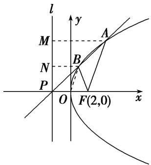

28. 已知抛物线 $y^{2}=2px(p>0)$ 的焦点为 F， $\triangle ABC$ 的顶点都在抛物线上，且满足 $\overrightarrow{PA}+\overrightarrow{FB}+\overrightarrow{FC}=0$ ，则 $\frac{1}{k_{AB}}+\frac{1}{k_{AC}}+\frac{1}{k_{BC}}=$ \_\_\_\_.

28. 答案 0 解析 设 $A(x_{1}, y_{1}), B(x_{2}, y_{2}), C(x_{3}, y_{3}), F\left(\frac{p}{2}, 0\right)$ , 由 $\overrightarrow{PA} + \overrightarrow{FB} = -\overrightarrow{FC}$ , 得 $\left(x_{1} - \frac{p}{2}, y_{1}\right) + \left(x_{2} - \frac{p}{2}, y_{2}\right) = -\left(x_{3} - \frac{p}{2}, y_{3}\right), y_{1} + y_{2} + y_{3} = 0.$ 因为 $k_{AB} = \frac{y_2 - y_1}{x_2 - x_1} = \frac{2p}{y_1 + y_2}, k_{AC} = \frac{y_3 - y_1}{x_3 - x_1} = \frac{2p}{y_1 + y_3}, k_{BC} = \frac{y_3 - y_2}{x_3 - x_2} = \frac{2p}{y_2 + y_3}$ , 所以 $\frac{1}{k_{AB}} + \frac{1}{k_{AC}} + \frac{1}{k_{BC}} = \frac{y_1 + y_2}{2p} + \frac{y_3 + y_1}{2p} + \frac{y_2 + y_3}{2p} = \frac{y_1 + y_2 + y_3}{p} = 0.$

29. 已知抛物线 $E: x^{2} = 2py(p > 0)$ 的焦点为 $F$ , 其准线与 $y$ 轴交于点 $D$ , 过点 $F$ 作直线交抛物线 $E$ 于 $A$ , $B$ 两点, 若 $AB \perp AD$ 且 $|BF| = |AF| + 4$ , 则 $p$ 的值为 \_\_\_\_.

29. 答案 2 解析 当 $k$ 不存在时，直线与抛物线不会交于两点．当 $k$ 存在时(如图)，设直线 $AB$ 的方程为 $y = kx + \frac{p}{2}$ , $A(x_{1}, y_{1})$ , $B(x_{2}, y_{2})$ , $D\left(0, -\frac{p}{2}\right)$ . 则有 $x_{1}^{2} = 2py_{1}$ , $x_{2}^{2} = 2py_{2}$ , 联立直线与抛物线方程得
$\left\{ \begin{array}{l} y = kx + \frac{p}{2}, \\ x^2 = 2py, \end{array} \right.$ 整理得 $x^{2} - 2pkx - p^{2} = 0$ ，所以 $x_{1}x_{2} = -p^{2}$ ， $x_{1} + x_{2} = 2pk$ ，所以 $y_{1}y_{2} = \binom{kx_{1} + \frac{p}{2}}{kx_{2} + \frac{p}{2}} = \frac{p^{2}}{4}, \overrightarrow{AF} = \left(-x_{1}, \frac{p}{2} - y_{1}\right), \overrightarrow{AD} = \left(-x_{1}, -\frac{p}{2} - y_{1}\right)$ . 又 $AB \perp AD$ ，所以 $-x_{1}(-x_{1}) + \left(\frac{p}{2} - y_{1}\right)\left(-\frac{p}{2} - y_{1}\right) = 0,$
整理得 $x_{1}^{2} + y_{1}^{2} = \frac{p^{2}}{4}$ ，即 $2py_{1} + y_{1}^{2} = \frac{p^{2}}{4}$ ，解得 $y_{1} = \frac{\sqrt{5} - 2}{2} p$ 。因为 $y_{1}y_{2} = \frac{p^{2}}{4}$ ，所以 $y_{2} = \frac{\sqrt{5} + 2}{2} p$ ，又 $|AF| = y_{1} + \frac{p}{2}, |BF| = y_{2} + \frac{p}{2}$ ，代入 $|BF| = |AF| + 4$ 得， $y_{2} + \frac{p}{2} = y_{1} + \frac{p}{2} + 4$ 。解得 $p = 2$ 。

30. 已知抛物线 $x^{2} = 4y$ 的焦点为 $F$ , 准线为 $l$ , $P$ 为抛物线上一点, 过 $P$ 作 $PA \perp l$ 于点 $A$ , 当 $\angle AFO = 30^{\circ}$ ( $O$ 为坐标原点)时, $|PF| = \_$ .  
30. 答案 $\frac{4}{3}$ 解析 法一: 令 $l$ 与 $y$ 轴的交点为 $B$ , 在 Rt $\triangle ABF$ 中, $\angle AFB = 30^\circ$ , $|BF| = 2$ , 所以 $|AB| = \frac{2\sqrt{3}}{3}$ . 设 $P(x_0, y_0)$ , 则 $x_0 = \pm \frac{2\sqrt{3}}{3}$ , 代入 $x^2 = 4y$ 中, 得 $y_0 = \frac{1}{3}$ , 所以 $|PF| = |PA| = y_0 + 1 = \frac{4}{3}$ .

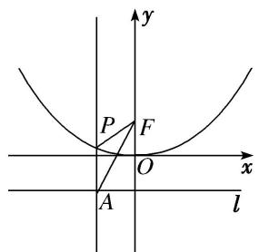

法二：如图所示， $\angle AFO = 30^{\circ}$ ， $\therefore \angle PAF = 30^{\circ}$ ，又 $|PA| = |PF|$ ， $\therefore \triangle APF$ 为顶角 $\angle APF = 120^{\circ}$ 的等腰三角形，而 $|AF| = \frac{2}{\cos 30^{\circ}} = \frac{4\sqrt{3}}{3}$ ， $\therefore |PF| = \frac{|AF|}{\sqrt{3}} = \frac{4}{3}$ .

31. 在平面直角坐标系 $xOy$ 中，抛物线 $y^{2} = 6x$ 的焦点为 $F$ ，准线为 $l$ ， $P$ 为抛物线上一点， $PA \perp l$ ， $A$ 为垂足．若直线 $AF$ 的斜率 $k = -\sqrt{3}$ ，则线段 $PF$ 的长为 \_\_\_\_.  
31. 答案 6 解析 由抛物线方程为 $y^{2} = 6x$ ，所以焦点坐标 $F\left(\frac{3}{2}, 0\right)$ ，准线方程为 $x = -\frac{3}{2}$ ，因为直线 $AF$ 的斜率为 $-\sqrt{3}$ ，所以直线 $AF$ 的方程为 $y = -\sqrt{3}\left(x - \frac{3}{2}\right)$ ，

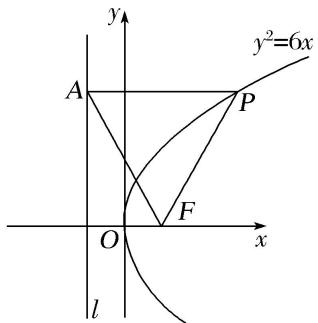
当 $x = -\frac{3}{2}$ 时， $y = 3\sqrt{3}$ ，所以 $A\left(-\frac{3}{2}, 3\sqrt{3}\right)$ ，因为 $PA \perp l$ ， $A$ 为垂足，所以点 $P$ 的纵坐标为 $3\sqrt{3}$ ，可得

点 P 的坐标为 $\left(\frac{9}{2}, 3\sqrt{3}\right)$ ，根据抛物线的定义可知 $|PF| = |PA| = \frac{9}{2} - \left(-\frac{3}{2}\right) = 6$ .

32. 在直角坐标系 $xOy$ 中，抛物线 $C: y^2 = 4x$ 的焦点为 $F$ ，准线为 $l$ ， $P$ 为 $C$ 上一点， $PQ$ 垂直 $l$ 于点 $Q$ ， $M$ ， $N$ 分别为 $PQ$ ， $PF$ 的中点，直线 $MN$ 与 $x$ 轴交于点 $R$ ，若 $\angle NFR = 60^\circ$ ，则 $|FR|$ 等于（）

A. 2

B. $\sqrt{3}$

C. $2\sqrt{3}$

D. 3

32. 答案 A 解析 由抛物线 $C: y^{2} = 4x$ ，得焦点 $F(1,0)$ ，准线方程为 $x = -1$ ，

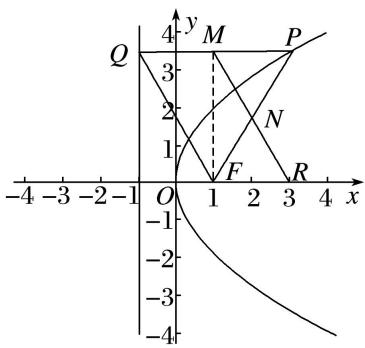
因为 M, N 分别为 PQ, PF 的中点，所以 $MN \parallel QF$ ，所以四边形 QMRF 为平行四边形， $|FR| = |QM|$ ，又由 PQ 垂直 l 于点 Q，可知 $|PQ| = |PF|$ ，因为 $\angle NFR = 60^{\circ}$ ，所以 $\triangle PQF$ 为等边三角形，所以 $FM \perp PQ$ ，所以 $|FR| = 2$ ，故选 A.

33. 已知 $y^{2} = 4x$ 的准线交 $x$ 轴于点 $Q$ ，焦点为 $F$ ，过 $Q$ 且斜率大于 0 的直线交 $y^{2} = 4x$ 于 $A, B$ ，两点 $\angle AFB = 60^{\circ}$ ，则 $|AB|$ 等于（）

A. $\frac{4\sqrt{7}}{6}$

B. $\frac{4\sqrt{7}}{3}$

C. 4

D. 3

33. 答案 B 解析 设 $A(x_{1}, 2\sqrt{x_{1}}), B(x_{2}, 2\sqrt{x_{2}}), x_{2} > x_{1} > 0$ ，因为 $k_{QA} = k_{QB}$ ，即 $\frac{2\sqrt{x_2}}{x_2 + 1} = \frac{2\sqrt{x_1}}{x_1 + 1}$ ，整理化简得 $x_{1}x_{2} = 1$ ， $|AB|^{2} = (x_{2} - x_{1})^{2} + (2\sqrt{x_2} - 2\sqrt{x_1})^{2}$ ， $|AF| = x_{1} + 1$ ， $|BF| = x_{2} + 1$ ，代入余弦定理 $|AB|^{2} = |AF|^{2} + |BF|^{2} - 2|AF||BF|\cos 60^\circ$ ，整理化简得， $x_{1} + x_{2} = \frac{10}{3}$ ，又因为 $x_{1}x_{2} = 1$ ，所以 $x_{1} = \frac{1}{3}$ ， $x_{2} = 3$ ， $|AB| = \sqrt{(x_{2} - x_{1})^{2} + (2\sqrt{x_2} - 2\sqrt{x_1})^{2}} = \frac{4\sqrt{7}}{3}$ ，故选 B.

34. 过抛物线 $y = \frac{1}{4} x^2$ 的焦点 $F$ 作一条倾斜角为 $30^\circ$ 的直线交抛物线于 $A$ ， $B$ 两点，则 $|AB| =$ \_\_\_\_.

34. 答案 $\frac{16}{3}$ 解析 （1）依题意，设点 $A(x_{1}, y_{1}), B(x_{2}, y_{2})$ ，题中的抛物线 $x^{2} = 4y$ 的焦点坐标是 $F(0, 1)$ ，直线 $AB$ 的方程为 $y = \frac{\sqrt{3}}{3} x + 1$ ，即 $x = \sqrt{3}(y - 1)$ 。由 $\left\{ \begin{array}{l} x^{2} = 4y, \\ x = \sqrt{3}(y - 1), \end{array} \right.$ 消去 $x$ 得 $3(y - 1)^{2} = 4y$ ，即 $3y^{2} - 10y + 3 = 0$ ， $\Delta = (-10)^{2} - 4 \times 3 \times 3 > 0$ ， $y_{1} + y_{2} = \frac{10}{3}$ ，则 $|AB| = |AF| + |BF| = (y_{1} + 1) + (y_{2} + 1) = y_{1} + y_{2} + 2 = \frac{16}{3}$ .

35. 已知直线 l 过抛物线 C: $y^{2}=3x$ 的焦点 F，交 C 于 A, B 两点，交 C 的准线于点 P，若 $\overrightarrow{AF}=\overrightarrow{FP}$ ，则 $|AB|=(\quad)$

A. 3

B. 4

C. 6

D. 8

35. 答案 B 解析 如图所示:

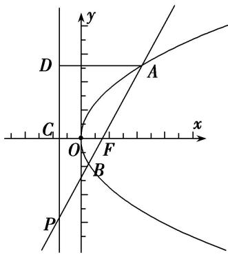
不妨设 A 在第一象限，由抛物线 C: $y^{2}=3x$ 可得 $F\left(\frac{3}{4},0\right)$ ，准线 DP: $x=-\frac{3}{4}$ 。因为 $\overrightarrow{AF}=\overrightarrow{FP}$ ，所以 F 是 AP 的中点，则 $AD=2CF=3$ 。所以可得 $A\left(\frac{9}{4},\frac{3\sqrt{3}}{2}\right)$ ，则 $k_{AF}=\sqrt{3}$ ，所以直线 AP 的方程为： $y=\sqrt{3}\left(x-\frac{3}{4}\right)$ ，联立方程 $\left\{\begin{aligned}y&=\sqrt{3}\left(x-\frac{3}{4}\right)\\ y^{2}&=3x\end{aligned}\right.$ ，整理得： $x^{2}-\frac{5}{2}x+\frac{9}{16}=0$ ，所以 $x_{1}+x_{2}=\frac{5}{2}$ ，则 $|AB|=x_{1}+x_{2}+p=\frac{5}{2}+\frac{3}{2}=4$ 。故选 B.

36. (2017·全国II)过抛物线 C: $y^{2}=4x$ 的焦点 F，且斜率为 $\sqrt{3}$ 的直线交 C 于点 M(M 在 x 轴的上方)，l 为 C 的准线，点 N 在 l 上且 $MN \perp l$ ，则 M 到直线 NF 的距离为()

A. $\sqrt{5}$

B. $2\sqrt{2}$

C. $2\sqrt{3}$

D. $3\sqrt{3}$

36. 答案 C 解析 由题意，得 $F(1,0)$ ，则直线 $FM$ 的方程是 $y = \sqrt{3}(x - 1)$ 。由 $\left\{ \begin{array}{l} y = \sqrt{3} x - 1 \\ y^2 = 4x, \end{array} \right.$ 得 $x = \frac{1}{3}$ 或 $x = 3$ 。由 $M$ 在 $x$ 轴的上方，得 $M(3, 2\sqrt{3})$ ，由 $MN \perp l$ ，得 $|MN| = |MF| = 3 + 1 = 4$ 。又 $\angle NMF$ 等于直线 $FM$ 的倾斜角，即 $\angle NMF = 60^\circ$ ，因此 $\triangle MNF$ 是边长为 4 的等边三角形，所以点 $M$ 到直线 $NF$ 的距离为 $4 \times \frac{\sqrt{3}}{2} = 2\sqrt{3}$ 。

37. 已知抛物线 $C: x^{2} = 4y$ 的焦点为 $F$ , 直线 $AB$ 与抛物线 $C$ 相交于 $A, B$ 两点, 若 $2\overrightarrow{OA} + \overrightarrow{OB} - 3\overrightarrow{OF} = 0$ , 则弦 $AB$ 中点到抛物线 $C$ 的准线的距离为 \_\_\_\_.

37. 答案 $\frac{9}{4}$ 解析 依题意得，抛物线的焦点为 $F(0,1)$ ，准线方程是 $y = -1$ ，因为 $2(\overrightarrow{OA} - \overrightarrow{OF}) + (\overrightarrow{OB} - \overrightarrow{OF}) = 0$ ，即 $2\overrightarrow{FA} + \overrightarrow{FB} = 0$ ，所以 $F, A, B$ 三点共线。设直线 $AB: y = kx + l (k \neq 0), A(x_1, y_1), B(x_2, y_2)$ ，则由 $\left\{ \begin{array}{l} y = kx + 1, \\ x^2 = 4y \end{array} \right.$ 得 $x^2 = 4(kx + 1)$ ，即 $x^2 - 4kx - 4 = 0, x_1x_2 = -4$ ①；又 $2\overrightarrow{FA} + \overrightarrow{FB} = 0$ ，因此 $2x_1 + x_2 = 0$ ②。由①②解得 $x_1^2 = 2$ ，弦 AB 的中点到抛物线 C 的准线的距离为 $\frac{1}{2} [(y_1 + 1) + (y_2 + 1)] = \frac{1}{2}(y_1 + y_2) + 1 = \frac{1}{8}(x_1^2 + x_2^2) + 1 = \frac{5x_1^2}{8} + 1 = \frac{9}{4}$ 。

38. 已知抛物线 $C: y^{2} = 4x$ 的焦点为 $F$ , 准线为 $l$ . 若射线 $y = 2(x - 1)(x \leq 1)$ 与 $C, l$ 分别交于 $P$ , Q 两点, 则 $\frac{|PQ|}{|PF|} = (\quad)$

A. $\sqrt{2}$

B. 2

C. $\sqrt{5}$

D. 5

38. 答案 C 解析 由题意，知抛物线 $C: y^{2} = 4x$ 的焦点 $F(1,0)$ ，设准线 $l: x = -1$ 与 $x$ 轴的交点为 $F_{1}$ 。过点 $P$ 作直线 $l$ 的垂线，垂足为 $P_{1}$ (图略)，由 $\left\{ \begin{array}{l} x = -1, \\ y = 2 \quad x - 1, \quad x \leq 1, \end{array} \right.$ 得点 $Q$ 的坐标为 $(-1, -4)$ ，所以 $|FQ| = 2\sqrt{5}$ 。又 $|PF| = |PP_{1}|$ ，所以 $\frac{|PQ|}{|PF|} = \frac{|PQ|}{|PP_{1}|} = \frac{|QF|}{|FF_{1}|} = \frac{2\sqrt{5}}{2} = \sqrt{5}$ ，故选 C.

39. 已知抛物线 $\Gamma: y^{2} = 8x$ 的焦点为 $F$ , 准线与 $x$ 轴的交点为 $K$ , 点 $P$ 在 $\Gamma$ 上且 $|PK| = \sqrt{2}|PF|$ , 则 $\triangle PKF$ 的面积为 \_\_\_\_.

39. 答案 8 解析 由已知得， $F(2,0)$ ， $K(-2,0)$ ，过 P 作 PM 垂直于准线于点 M，则 $|PM| = |PF|$ ，又 $|PK| = \sqrt{2}|PF|$ ， $\therefore |PM| = |MK| = |PF|$ ， $\therefore PF \perp x$ 轴， $\triangle PFK$ 的高等于 $|PF|$ ，不妨设 $P(m^{2} \cdot 2\sqrt{2}m) (m > 0)$ ，则 $m^{2} + 2 = 4$ ，解得 $m = \sqrt{2}$ ，故 $\triangle PFK$ 的面积 $S = 4 \times 2\sqrt{2} \times \sqrt{2} \times \frac{1}{2} = 8$ .

40. 抛物线 C: $y^{2}=4x$ 的焦点为 F，其准线 l 与 x 轴交于点 A，点 M 在抛物线 C 上，当 $\frac{|MA|}{|MF|}=\sqrt{2}$ 时， $\triangle AMF$ 的面积为()

A. 1

B. $\sqrt{2}$

C. 2

D. $2\sqrt{2}$

40. 答案 C 解析 （1） 过 $M$ 作 $MP$ 垂直于准线, 垂足为 $P$ , 则 $\frac{|MA|}{|MF|} = \sqrt{2} = \frac{|MA|}{|MP|} = \frac{1}{\cos \angle AMP}$ , 则 $\cos \angle AMP = \frac{\sqrt{2}}{2}$ , 又 $0^{\circ} < \angle MAF < 180^{\circ}$ , 则 $\angle AMP = 45^{\circ}$ , 此时 $\triangle AMP$ 是等腰直角三角形, 设 $M(m, \sqrt{4m})$ , 则由 $|MP| = |MA|$ 得 $|m + 1| = \sqrt{4m}$ , 解得 $m = 1, M(1, 2)$ , 所以 $\triangle AMF$ 的面积为 $\frac{1}{2} \times 2 \times 2 = 2$ .

41. 抛物线 $x^{2}=4y$ 的焦点为 F，过点 F 作斜率为 $\frac{\sqrt{3}}{3}$ 的直线 l 与抛物线在 y 轴右侧的部分相交于点 A，过点 A 作抛物线准线的垂线，垂足为 H，则 $\triangle AHF$ 的面积是()

A. 4

B. $3\sqrt{3}$

C. $4\sqrt{3}$

D. 8

41. 答案 C 解析 由抛物线的定义可得 $|AF|=|AH|$ ，∵AF的斜率为 $\frac{\sqrt{3}}{3}$ ，∴AF的倾斜角为 $30^{\circ}$ ，∵AH垂直于准线，∴ $\angle FAH=60^{\circ}$ ，故△AHF为等边三角形．设 $A\left(m,\frac{m^{2}}{4}\right)$ ，m>0，过F作FM⊥AH于M，则在△FAM中， $|AM|=\frac{1}{2}|AF|$ ，∴ $\frac{m^{2}}{4}-1=\frac{1}{2}\left(\frac{m^{2}}{4}+1\right)$ ，解得 $m=2\sqrt{3}$ ，故等边三角形AHF的边长 $|AH|=4$ ，∴△AHF的面积是 $\frac{1}{2}\times4\times4\sin60^{\circ}=4\sqrt{3}$ ．故选C.

42. 已知抛物线 $C: y^{2} = 8x$ 的焦点为 $F$ , 直线 $l$ 过焦点 $F$ 与抛物线 $C$ 分别交于 $A, B$ 两点, 且直线 $l$ 不与 $x$ 轴垂直, 线段 $AB$ 的垂直平分线与 $x$ 轴交于点 $P(10, 0)$ , 则 $\triangle AOB$ 的面积为 ( )

A. $4\sqrt{3}$

B. $4\sqrt{6}$

C. $8\sqrt{2}$

D. $8\sqrt{6}$

42. 答案 C 解析 设直线 $l: x = ty + 2$ , $A(x_{1}, y_{1})$ , $B(x_{2}, y_{2})$ ，则由 $\left\{\begin{aligned}y^{2} &= 8x \\ x &= ty + 2\end{aligned}\right.$ 可以得到 $y^{2} - 8ty - 16 = 0$ .
所以 $AB$ 的中点 $M(4t^2 + 2,4t)$ ，线段 $AB$ 的垂直平分线与 $x$ 轴交于点 $P(10,0)$ ，故 $t \neq 0$ 。所以 $AB$ 的中垂线的方程为 $y = -\frac{1}{t} (x - 4t^2 - 2) + 4t = -\frac{1}{t} x + 8t + \frac{2}{t}$ ，令 $y = 0$ 可得 $x = 8t^2 + 2$ ，解方程 $10 = 8t^2 + 2$ 得 $t = \pm 1$ 。此

时 $AB=\sqrt{1+t^{2}}|y_{1}-y_{2}|=8\sqrt{1+t^{2}}\sqrt{t^{2}+1}=16, O$ 到 AB 的距离为 $d=\frac{2}{\sqrt{1+t^{2}}}=\sqrt{2}$ ，所以 $S_{\Delta OAB}=\frac{1}{2}\times16\times\sqrt{2}=8\sqrt{2}$ 。故选 C.

43. 过抛物线 $y^{2} = 4x$ 的焦点 $F$ 的直线交抛物线于 $A, B$ 两点，点 $O$ 是坐标原点，若 $|AF| = 3$ ，则 $\triangle AOB$ 的面积为（）

A. $\frac{\sqrt{2}}{2}$

B. $\sqrt{2}$

C. $\frac{3\sqrt{2}}{2}$

D. $2\sqrt{2}$

43. 答案 C 解析 设 $A(x_{1}, y_{1}), B(x_{2}, y_{2})(y_{1} > 0, y_{2} < 0)$ , 如图所示, $|AF| = x_{1} + 1 = 3$ ,

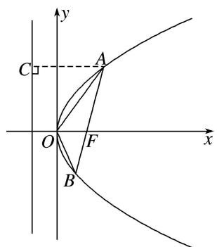
所以 $x_{1}=2,\ y_{1}=2\sqrt{2}$ . 设 AB 的方程为 x-1=ty，由 $\left\{\begin{aligned}y^{2}&=4x,\\ x&-1=ty,\end{aligned}\right.$ 消去 x，得 $y^{2}-4ty-4=0$ . 所以 $y_{1}y_{2}=-4$ . 所以 $y_{2}=-\sqrt{2},\ x_{2}=\frac{1}{2}$ ，所以 $S_{\triangle AOB}=\frac{1}{2}\times1\times|y_{1}-y_{2}|=\frac{3\sqrt{2}}{2}$ .

44. 已知抛物线 $y^{2} = 4x$ ，过其焦点 $F$ 的直线 $l$ 与抛物线分别交于 $A$ ， $B$ 两点 (A 在第一象限内)， $\overrightarrow{AF} = 3\overrightarrow{FB}$ ，过 $AB$ 的中点且垂直于 $l$ 的直线与 $x$ 轴交于点 $G$ ，则 $\triangle ABG$ 的面积为（）

A. $\frac{8\sqrt{3}}{9}$

B. $\frac{16\sqrt{3}}{9}$

C. $\frac{32\sqrt{3}}{9}$

D. $\frac{64\sqrt{3}}{9}$

44. 答案 C 解析 设 $A(x_{1}, y_{1})$ , $B(x_{2}, y_{2})$ ，因为 $\overrightarrow{AF}=3\overrightarrow{FB}$ ，所以 $y_{1}=-3y_{2}$ ，设直线 l 的方程为 x
=my+1，由 $\left\{\begin{aligned}y^{2}&=4x,\\ x&=my+1\end{aligned}\right.$ 消去x得 $y^{2}-4my-4=0,\therefore y_{1}y_{2}=-4,\therefore\left\{\begin{aligned}y_{1}&=2\sqrt{3},\\ y_{2}&=-\frac{2\sqrt{3}}{3},\end{aligned}\right.\therefore y_{1}+y_{2}=4m=\frac{4\sqrt{3}}{3},$ $\therefore m=\frac{\sqrt{3}}{3},\therefore x_{1}+x_{2}=\frac{10}{3},AB$ 的中点坐标为 $\left(\frac{5}{3},\frac{2\sqrt{3}}{3}\right)$ ，过AB中点且垂直于直线l的直线方程为 $y-\frac{2\sqrt{3}}{3}$ $=-\frac{\sqrt{3}\left(x-\frac{5}{3}\right)}{3}$ ，令y=0，可得 $x=\frac{11}{3}$ ，所以 $S_{\triangle ABG}=\frac{1}{2}\times\left(\frac{11}{3}-1\right)\times\left(2\sqrt{3}+\frac{2\sqrt{3}}{3}\right)=\frac{32\sqrt{3}}{9}.$

45. 已知抛物线 $x^{2} = 2y$ 的焦点为 $F$ ，其上有两点 $A(x_{1}, y_{1})$ ， $B(x_{2}, y_{2})$ 满足 $|AF| - |BF| = 2$ ，则 $y_{1} + x_{1}^{2} - y_{2} - x_{2}^{2} = (\quad)$

A. 4

B. 6

C. 8

D. 10

45. 答案 B 解析 （1）由抛物线定义知 $|AF|=y_{1}+\frac{1}{2},|BF|=y_{2}+\frac{1}{2},\therefore|AF|-|BF|=y_{1}-y_{2}=2$ ，又知 $x_{1}^{2}=2y_{1}$ $x_{2}^{2}=2y_{2},\quad\therefore x_{1}^{2}-x_{2}^{2}=2(y_{1}-y_{2})=4,\quad\therefore y_{1}+x_{1}^{2}-y_{2}-x_{2}^{2}=(y_{1}-y_{2})+(x_{1}^{2}-x_{2}^{2})=2+4=6.$

46. (2018·全国I)设抛物线 C: $y^{2}=4x$ 的焦点为 F，过点 $(-2,0)$ 且斜率为 $\frac{2}{3}$ 的直线与 C 交于 M，N 两点，则 $\overrightarrow{FM}\cdot\overrightarrow{FN}$ 等于()

A. 5

B. 6

C. 7

D. 8

46. 答案 D 解析 由题意知直线 $MN$ 的方程为 $y = \frac{2}{3} (x + 2)$ ，联立直线与抛物线的方程，得
$\left\{ \begin{array}{l} y = \frac{2}{3} (x + 2), \\ y^2 = 4x, \end{array} \right.$ 解得 $\left\{ \begin{array}{l} x = 1, \\ y = 2 \end{array} \right.$ 或 $\left\{ \begin{array}{l} x = 4, \\ y = 4. \end{array} \right.$ 不妨设点 $M$ 的坐标为(1，2)，点 $N$ 的坐标为(4，4). 又 $\because$ 抛物线的焦点为 $F(1,0)$ ， $\therefore \overrightarrow{FM} = (0,2)$ ， $\overrightarrow{FN} = (3,4)$ 。 $\therefore \overrightarrow{FM} \cdot \overrightarrow{FN} = 0 \times 3 + 2 \times 4 = 8$ 。故选 D.

47. 抛物线 $C: y^{2} = 4x$ 的焦点为 $F$ , 动点 $P$ 在抛物线 $C$ 上, 点 $A(-1, 0)$ , 当 $\frac{|PF|}{|PA|}$ 取得最小值时, 直线 $AP$ 的方程为 \_\_\_\_.

47. 答案 $x + y + 1 = 0$ 或 $x - y + 1 = 0$ 解析 设 $P$ 点的坐标为 $(4t^2 \cdot 4t)$ ， $\because F(1,0), A(-1,0), \therefore |PF|^2 = (4t^2 - 1)^2 + 16t^2 = 16t^4 + 8t^2 + 1, |PA|^2 = (4t^2 + 1)^2 + 16t^2 = 16t^4 + 24t^2 + 1, \therefore \left(\frac{|PF|}{|PA|}\right)^2 = \frac{16t^4 + 8t^2 + 1}{16t^4 + 24t^2 + 1} = 1 - \frac{16t^2}{16t^4 + 24t^2 + 1} = 1 - \frac{16}{16t^2 + \frac{1}{t^2} + 24} \geq 1 - \frac{16}{2\sqrt{16t^2 \cdot \frac{1}{t^2}} + 24} = 1 - \frac{16}{32} = \frac{1}{2}$ ，当且仅当 $16t^2 = \frac{1}{t^2}$ ，即 $t = \pm \frac{1}{2}$ 时取等号，此时点 $P$ 坐标为 $(1, 2)$ 或 $(1, -2)$ ，此时直线 $AP$ 的方程为 $y = \pm (x + 1)$ ，即 $x + y + 1 = 0$ 或 $x - y + 1 = 0$ .

48. 已知点 $P(-1, 0)$ , 设不垂直于 $x$ 轴的直线 $l$ 与抛物线 $y^{2} = 2x$ 交于不同的两点 $A, B$ , 若 $x$ 轴是 $\angle APB$ 的角平分线, 则直线 $l$ 一定过点 ( )

A. $\left(\frac{1}{2},0\right)$

B. $(1, 0)$

C. $(2,0)$

D. $(-2, 0)$

48. 答案 B 解析 根据题意，直线的斜率存在且不等于零，设直线的方程为 $x=ty+m(t\neq0)$ ，与抛物线方程联立，消元得 $y^{2}-2ty-2m=0$ ，设 $A(x_{1},y_{1})$ ， $B(x_{2},y_{2})$ ，因为 x 轴是 $\angle APB$ 的角平分线，所以 AP，BP 的斜率互为相反数，所以 $\frac{y_{1}}{x_{1}+1}+\frac{y_{2}}{x_{2}+1}=0$ ，所以 $2ty_{1}y_{2}+(m+1)(y_{1}+y_{2})=0$ ，结合根与系数之间的关系，整理得出 $2t(-2m)+2tm+2t=0$ ， $2t(m-1)=0$ ，因为 $t\neq0$ ，所以 m=1，所以过定点 $(1,0)$ ，故选 B.

49. 已知抛物线 $C: y^{2} = 2px (p > 0)$ 和动直线 $l: y = kx + b (k, b$ 是参变量，且 $k \neq 0, b \neq 0)$ 相交于 $A(x_{1}, y_{1}), B(x_{2}, y_{2})$ 两点，平面直角坐标系的原点为 $O$ ，记直线 $OA, OB$ 的斜率分别为 $k_{OA}, k_{OB}$ ，且 $k_{OA} \cdot k_{OB} = \sqrt{3}$ 恒成立，则当 $k$ 变化时，直线 $l$ 经过的定点为 \_\_\_\_.

49. 答案 $\left(-\frac{2\sqrt{3}p}{3}, 0\right)$ 解析 联立 $\left\{\begin{aligned}y^{2}&=2px,\\ y&=kx+b\end{aligned}\right.$ 消去 y，得 $k^{2}x^{2}+(2kb-2p)x+b^{2}=0,\therefore x_{1}+x_{2}=\frac{-2kb+2p}{k^{2}}$ $x_{1}x_{2}=\frac{b^{2}}{k^{2}},\quad\because k_{OA}\cdot k_{OB}=\sqrt{3},\quad\therefore y_{1}y_{2}=\sqrt{3}x_{1}x_{2},\quad 又 \because y_{1}y_{2}=(kx_{1}+b)(kx_{2}+b)=k^{2}x_{1}x_{2}+kb(x_{1}+x_{2})+b^{2}=\frac{2bp}{k},$ $\therefore\frac{2bp}{k}=\sqrt{3}\cdot\frac{b^{2}}{k^{2}}$ ，解得 $b=\frac{2\sqrt{3}pk}{3},\quad\therefore y=kx+\frac{2\sqrt{3}pk}{3}=k\left(x+\frac{2\sqrt{3}p}{3}\right).$ 令 $x=-\frac{2\sqrt{3}p}{3}$ ，得 y=0，∴直线 l 过

定点 $\left(-\frac{2\sqrt{3}p}{3},0\right)$ .

50. 在直线 $y = -2$ 上任取一点 $Q$ , 过 $Q$ 作抛物线 $x^{2} = 4y$ 的切线, 切点分别为 $A, B$ , 则直线 $AB$ 恒过的点的坐标为( )

A. $(0, 1)$

B. $(0, 2)$

C. $(2, 0)$

D. $(1, 0)$

50. 答案 B 解析 设 $Q(t, -2)$ , $A(x_{1}, y_{1})$ , $B(x_{2}, y_{2})$ ，抛物线方程变为 $y=\frac{1}{4}x^{2}$ ，则 $y'=\frac{1}{2}x$ ，则在点 A 处的切线方程为 $y-y_{1}=\frac{1}{2}x_{1}(x-x_{1})$ ，化简得 $y=\frac{1}{2}x_{1}x-y_{1}$ ，同理，在点 B 处的切线方程为 $y=\frac{1}{2}x_{2}x-y_{2}$ ，又点 $Q(t, -2)$ 的坐标适合这两个方程，代入得 $-2=\frac{1}{2}x_{1}t-y_{1}$ ， $-2=\frac{1}{2}x_{2}t-y_{2}$ ，这说明 $A(x_{1}, y_{1})$ ， $B(x_{2}, y_{2})$ 都满足方程 $-2=\frac{1}{2}xt-y$ ，即直线 AB 的方程为 $y-2=\frac{1}{2}tx$ ，因此直线 AB 恒过点 $(0, 2)$ .

51. 已知抛物线 $C: y^{2} = 4x$ 的焦点为 $F$ , 直线 $y = \sqrt{3}(x - 1)$ 与 $C$ 交于 $A$ , $B(A$ 在 $x$ 轴上方)两点. 若 $\overrightarrow{AF} = m\overrightarrow{FB}$ , 则 $m$ 的值为 \_\_\_\_.

51. 答案 3 解析 由题意知 $F(1,0)$ ，由 $\left\{ \begin{array}{l} y = \sqrt{3}(x - 1), \\ y^2 = 4x, \end{array} \right.$ 解得 $\left\{ \begin{array}{l} x_1 = \frac{1}{3}, \\ y_1 = -\frac{2\sqrt{3}}{3}, \end{array} \right.$ $\left\{ \begin{array}{l} x_2 = 3, \\ y_2 = 2\sqrt{3}. \end{array} \right.$ 由 $A$ 在 $x$ 轴

上方，知 $A(3, 2\sqrt{3})$ ， $B\left(\frac{1}{3}, -\frac{2\sqrt{3}}{3}\right)$ ，则 $\overrightarrow{AF}=(-2, -2\sqrt{3})$ ， $\overrightarrow{FB}=\left(-\frac{2}{3}, -\frac{2\sqrt{3}}{3}\right)$ ，因为 $\overrightarrow{AF}=m\overrightarrow{FB}$ ，所以 m=3。

52. 设抛物线 $C: y^{2} = 12x$ 的焦点为 $F$ , 准线为 $l$ , 点 $M$ 在 $C$ 上, 点 $N$ 在 $l$ 上, 且 $\overrightarrow{FN} = \lambda \overrightarrow{FM} (\lambda > 0)$ , 若 $|MF| = 4$ , 则 $\lambda$ 等于( )

A. $\frac{3}{2}$

B. 2

C. $\frac{5}{2}$

D. 3

52. 答案 D 解析 如图，过 M 向准线 l 作垂线，垂足为 $M'$ ，根据已知条件，结合抛物线的定义得 $\frac{|MM'|}{|FF'|} = \frac{|MN|}{|NF|} = \frac{\lambda - 1}{\lambda}$ ,

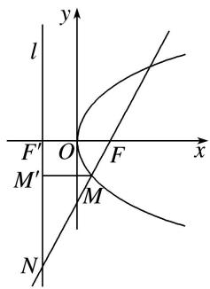
又 $|MF|=4,\therefore|MM'|=4$ ，又 $|FF'|=6,\therefore\frac{|MM'|}{|FF'|}=\frac{4}{6}=\frac{\lambda-1}{\lambda},\therefore\lambda=3$ ．故选D.

53. 已知抛物线 $y^{2} = 2px (p > 0)$ 过点 $A\left(\frac{1}{2}, \sqrt{2}\right)$ ，其准线与 $x$ 轴交于点 $B$ ，直线 $AB$ 与抛物线的另一个交点为

M，若 $\overrightarrow{MB}=\lambda\overrightarrow{AB}$ ，则实数 $\lambda$ 为()

A. $\frac{1}{3}$

B. $\frac{1}{2}$

C. 2

D. 3

53. 答案 C 解析 把点 $A\left(\frac{1}{2}, \sqrt{2}\right)$ 代入抛物线的方程得 $2=2p\times\frac{1}{2}$ ，解得 p=2，所以抛物线的方程为 $y^{2}=4x$ ，则 $B(-1,0)$ ，设 $M\left(\frac{y_{M}^{2}}{4}, y_{M}\right)$ ，则 $\overrightarrow{AB}=\left(-\frac{3}{2}, -\sqrt{2}\right)$ ， $\overrightarrow{MB}=(-1-\frac{y_{M}^{2}}{4}, -y_{M})$ ，由 $\overrightarrow{MB}=\lambda\overrightarrow{AB}$ ，得 $\left\{\begin{aligned}-1-\frac{y_{M}^{2}}{4}&=-\frac{3}{2}\lambda,\\-y_{M}&=-\sqrt{2}\lambda,\end{aligned}\right.$ 解得 $\lambda=2$ 或 $\lambda=1$ （舍去），故选 C.

54. 如图，过抛物线 $y^{2} = 4x$ 的焦点 $F$ 作倾斜角为 $\alpha$ 的直线 $l$ ， $l$ 与抛物线及其准线从上到下依次交于 $A$ 、 $B$ 、 $C$ 点，令 $\frac{|AF|}{|BF|} = \lambda_{1}$ ， $\frac{|BC|}{|BF|} = \lambda_{2}$ ，则当 $\alpha = \frac{\pi}{3}$ 时， $\lambda_{1} + \lambda_{2}$ 的值为（）

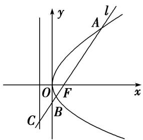

A. 4

B. 5

C. 6

D. 8

54. 答案 B 解析 由题意知焦点的坐标为 $F(1,0)$ 。设 $A(x_1, y_1), B(x_2, y_2)$ ，当 $\alpha = \frac{\pi}{3}$ 时，直线 $AB$ 的方程为 $y = \sqrt{3}x - \sqrt{3}$ ，与抛物线方程联立得 $3x^2 - 10x + 3 = 0$ ， $\therefore x_1 + x_2 = \frac{10}{3}, x_1x_2 = 1$ ，解得 $x_1 = 3, x_2 = \frac{1}{3}$ ，由题图可知， $\lambda_1 = \frac{|AF|}{|BF|} = \frac{x_1 + 1}{x_2 + 1} = \frac{3 + 1}{1 + \frac{1}{3}} = 3$ ， $\because \alpha = \frac{\pi}{3}, \therefore \lambda_2 = \frac{|BC|}{|BF|} = 2, \therefore \lambda_1 + \lambda_2 = 5$ 。故选 B.

55. 如图所示，抛物线 $y = \frac{1}{4} x^2$ ， $AB$ 为过焦点 $F$ 的弦，过 $A, B$ 分别作抛物线的切线，两切线交于点 $M$ ，设 $A(x_A, y_A), B(x_B, y_B), M(x_M, y_M)$ ，则：①若 $AB$ 的斜率为 1，则 $|AB| = 4$ ；② $|AB|_{\min} = 2$ ；③ $y_M = -1$ ；④若 $AB$ 的斜率为 1，则 $x_M = 1$ ；⑤ $x_A \cdot x_B = -4$ 。以上结论正确的个数是（）

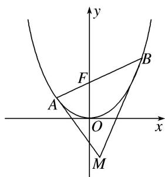

A. 1

B. 2

C. 3

D. 4

55. 答案 B 解析 由题意得，焦点 $F(0,1)$ ，对于①， $l_{AB}$ 的方程为 $y = x + 1$ ，与抛物线的方程联立，得$\left\{\begin{aligned}y&=x+1,\\ y&=\frac{1}{4}x^{2},\end{aligned}\right.$ 消去 x，得 $y^{2}-6y+1=0$ ，所以 $y_{A}+y_{B}=6$ ，则 $|AB|=y_{A}+y_{B}+p=8$ ，则①错误；对于②，$|AB|_{\min}=2p=4$ ，则②错误；因为 $y'=\frac{x}{2}$ ，则 $l_{AM}:y-y_{A}=\frac{x_{A}}{2}(x-x_{A})$ ，即 $y=\frac{1}{2}x_{A}x-\frac{x_{A}^{2}}{4}$ ， $l_{BM}:y-y_{B}=\frac{x_{B}}{2}(x-$ $-x_{B})$ ，即 $y = \frac{1}{2} x_{B}x - \frac{x_{B}^{2}}{4}$ ，联立 $l_{AM}$ 与 $l_{BM}$ 的方程得 $\left\{ \begin{array}{l} y = \frac{1}{2} x_{A}x - \frac{x_{A}^{2}}{4}, \\ y = \frac{1}{2} x_{B}x - \frac{x_{B}^{2}}{4}, \end{array} \right.$ 解得 $M\left(\frac{x_A + x_B}{2}, \frac{x_A \cdot x_B}{4}\right)$ . 设 $l_{AB}$ 的方程为 $y = kx + 1$ ，与抛物线的方程联立，得 $\left\{ \begin{array}{l} y = kx + 1, \\ y = \frac{1}{4} x^2, \end{array} \right.$ 消去 $y$ ，得 $x^2 - 4kx - 4 = 0$ ，所以 $x_A + x_B = 4k$ ， $x_A \cdot x_B = -4$ ，所以 $y_M = -1$ ，③和⑤均正确；对于④，当 $AB$ 的斜率为 1 时， $x_M = 2$ ，则④错误，故选 B.

