**专题08　抛物线模型**

**抛物线秒杀小题常用结论**

(1)抛物线定义：|*MF*|＝*d*(*d*为*M*点到准线的距离)．如图(17)

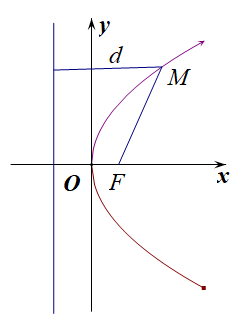

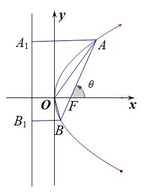  
图(17)　　　　　　　　　　　　 　　　　图(18)

(2)设<em>A</em>，<em>B</em>是抛物线<em>y</em>2＝2<em>px</em>(<em>p</em>&gt;0)上不同的两点，<em>P</em>为弦<em>AB</em>的中点，则<em>kAB</em>·<em>y</em>0＝<em>p</em>．

(3)以抛物线<em>y</em>2＝2<em>px</em>(<em>p</em>&gt;0)为例，设<em>AB</em>是抛物线的过焦点的一条弦(焦点弦)，<em>F</em>是抛物线的焦点，<em>A</em>(<em>x</em>1，<em>y</em>1)，<em>B</em>(<em>x</em>2，<em>y</em>2)，<em>A</em>、<em>B</em>在准线上的射影为<em>A</em>1、<em>B</em>1，则有以下结论：

①<em>x</em>1<em>x</em>2＝，<em>y</em>1<em>y</em>2＝－<em>p</em>2；

②若直线*AB*的倾斜角为*θ*，则|*AF*|＝，|*BF*|＝；如图(18)

③＋＝为定值；如图(18)

④|<em>AB</em>|＝<em>x</em>1＋<em>x</em>2＋<em>p</em>＝(其中<em>θ</em>为直线<em>AB</em>的倾斜角)，抛物线的通径长为2<em>p</em>，通径是最短的焦点弦；如图(18)

⑤<em>S</em>△<em>AOB</em>＝(其中<em>θ</em> 为直线<em>AB</em>的倾斜角)；如图(18)

⑥以*AB*为直径的圆与抛物线的准线相切；如图(19)

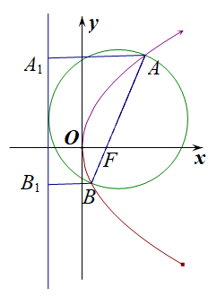

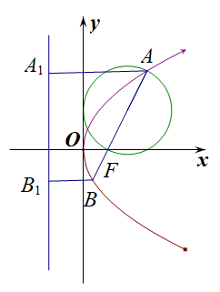  
图(19)　　　　　　　　　　　　 　　　　图(20)

⑦以*AF*(或*BF*)为直径的圆与*y*轴相切；如图(20，21)

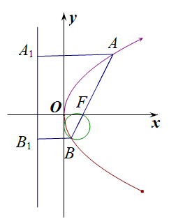

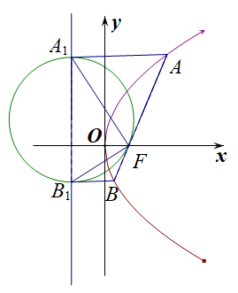  
图(21)　　　　　　　　　　　　　　　 　　　图(22)

⑧以<em>A</em>1<em>B</em>1为直径的圆与直线<em>AB</em>相切，切点为<em>F</em>，∠<em>A</em>1<em>FB</em>1＝90°；如图(22)

⑨<em>A</em>，<em>O</em>，<em>B</em>1三点共线，<em>B</em>，<em>O</em>，<em>A</em>1三点也共线；

⑩已知<em>M</em>(<em>x</em>0，<em>y</em>0)是抛物线<em>y</em>2＝2<em>px</em>(<em>p</em>&gt;0)上任意一点，点<em>N</em>(<em>a</em>，0)是抛物线的对称轴上一点，则|<em>MN</em>|min＝

(4)如图(23)所示，<em>AB</em>是抛物线<em>x</em>2＝2<em>py</em>(<em>p</em>&gt;0)的过焦点的一条弦(焦点弦)，分别过<em>A</em>，<em>B</em>作抛物线的切线，交于点<em>P</em>，连接<em>PF</em>，则有以下结论：

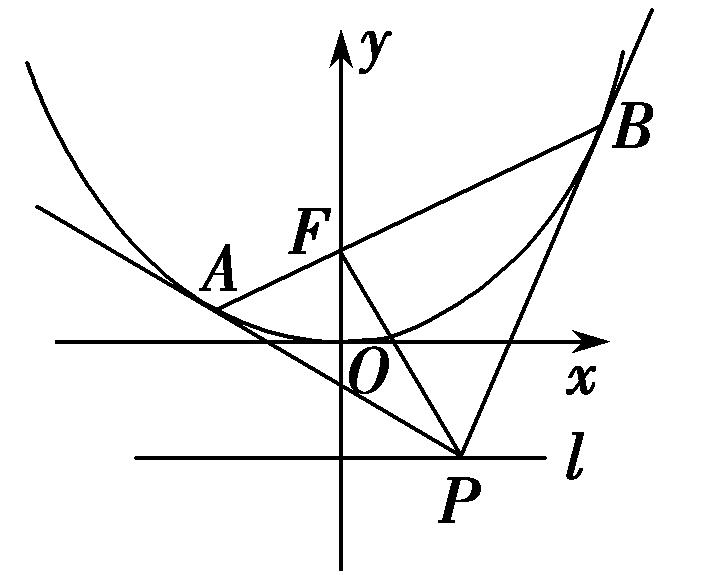  
图(23)

①点*P*的轨迹是一条直线，即抛物线的准线*l*：*y*＝－；②两切线互相垂直，即*PA*⊥*PB*；

③*PF*⊥*AB*；④点*P*的坐标为．

**【例题选讲】**

<strong>[例3]</strong>　(15)设抛物线<em>C</em>：<em>y</em>2＝3<em>x</em>的焦点为<em>F</em>，点<em>A</em>为<em>C</em>上一点，若|<em>FA</em>|＝3，则直线<em>FA</em>的倾斜角为(　　)

A．　　　　　　　　B．　　　　　　　　C．或　　　　　　　　D．或

<strong>答案</strong>　C　<strong>解析</strong>　如图，作<em>AH</em>⊥<em>l</em>于<em>H</em>，则|<em>AH</em>|＝|<em>FA</em>|＝3，作<em>FE</em>⊥<em>AH</em>于<em>E</em>，则|<em>AE</em>|＝3－＝，在Rt△<em>AEF</em>中，cos∠<em>EAF</em>＝＝，∴∠<em>EAF</em>＝，即直线<em>FA</em>的倾斜角为，同理点<em>A</em>在<em>x</em>轴下方时，直线<em>FA</em>的倾斜角为．

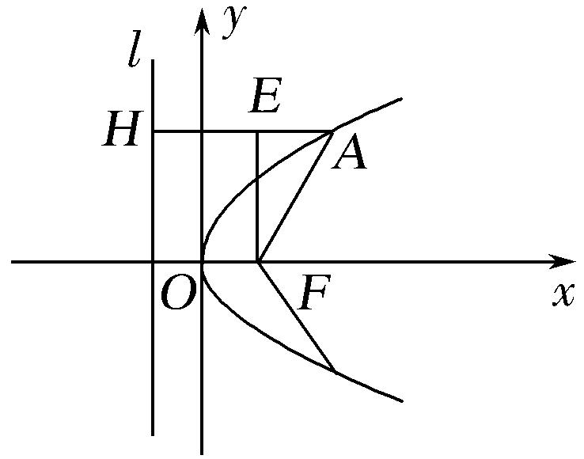

(16)(2018·全国Ⅲ)已知点<em>M</em>(－1，1)和抛物线<em>C</em>：<em>y</em>2＝4<em>x</em>，过<em>C</em>的焦点且斜率为<em>k</em>的直线与<em>C</em>交于<em>A</em>，<em>B</em>两点．若∠<em>AMB</em>＝90°，则<em>k</em>＝\_\_\_\_\_\_\_\_．

<strong>答案</strong>　2　<strong>解析</strong>　法一：由题意知，抛物线的焦点为(1，0)，则过<em>C</em>的焦点且斜率为<em>k</em>的直线方程为<em>y</em>＝<em>k</em>(<em>x</em>－1)(<em>k</em>≠0)，由消去<em>y</em>得<em>k</em>2(<em>x</em>－1)2＝4<em>x</em>，即<em>k</em>2<em>x</em>2－(2<em>k</em>2＋4)<em>x</em>＋<em>k</em>2＝0．设<em>A</em>(<em>x</em>1，<em>y</em>1)，<em>B</em>(<em>x</em>2，<em>y</em>2)，则<em>x</em>1＋<em>x</em>2＝，<em>x</em>1<em>x</em>2＝1．由消去<em>x</em>得<em>y</em>2＝4，即<em>y</em>2－<em>y</em>－4＝0，则<em>y</em>1＋<em>y</em>2＝，<em>y</em>1<em>y</em>2＝－4.由∠<em>AMB</em>＝90°，得·＝(<em>x</em>1＋1，<em>y</em>1－1)·(<em>x</em>2＋1，<em>y</em>2－1)＝<em>x</em>1<em>x</em>2＋<em>x</em>1＋<em>x</em>2＋1＋<em>y</em>1<em>y</em>2－(<em>y</em>1＋<em>y</em>2)＋1＝0，将<em>x</em>1＋<em>x</em>2＝，<em>x</em>1<em>x</em>2＝1与<em>y</em>1＋<em>y</em>2＝，<em>y</em>1<em>y</em>2＝－4代入，得<em>k</em>＝2．

法二：设抛物线的焦点为<em>F</em>，<em>A</em>(<em>x</em>1，<em>y</em>1)，<em>B</em>(<em>x</em>2，<em>y</em>2)，则所以<em>y</em>－<em>y</em>＝4(<em>x</em>1－<em>x</em>2)，则<em>k</em>＝＝．取<em>AB</em>的中点<em>M</em>′(<em>x</em>0，<em>y</em>0)，分别过点<em>A</em>，<em>B</em>作准线<em>x</em>＝－1的垂线，垂足分别为<em>A</em>′，<em>B</em>′，又∠<em>AMB</em>＝90°，点<em>M</em>在准线<em>x</em>＝－1上，所以|<em>MM</em>′|＝|<em>AB</em>|＝(|<em>AF</em>|＋|<em>BF</em>|)＝(|<em>AA</em>′|＋|<em>BB</em>′|)．又<em>M</em>′为<em>AB</em>的中点，所以<em>MM</em>′平行于<em>x</em>轴，且<em>y</em>0＝1，所以<em>y</em>1＋<em>y</em>2＝2，所以<em>k</em>＝2．

(17)过抛物线<em>y</em>2＝2<em>px</em>(<em>p</em>&gt;0)的焦点<em>F</em>作直线交抛物线于<em>A</em>，<em>B</em>两点，若|<em>AF</em>|＝2|<em>BF</em>|＝6，则<em>p</em>＝\_\_\_\_\_\_\_\_．

<strong>答案</strong>　4　<strong>解析</strong>　[一般解法]　设<em>AB</em>的方程为<em>x</em>＝<em>my</em>＋，<em>A</em>(<em>x</em>1，<em>y</em>1)，<em>B</em>(<em>x</em>2，<em>y</em>2)，且<em>x</em>1&gt;<em>x</em>2，将直线<em>AB</em>的方程代入抛物线方程得<em>y</em>2－2<em>pmy</em>－<em>p</em>2＝0，所以<em>y</em>1<em>y</em>2＝－<em>p</em>2，4<em>x</em>1<em>x</em>2＝<em>p</em>2.设抛物线的准线为<em>l</em>，过<em>A</em>作<em>AC</em>⊥<em>l</em>，垂足为<em>C</em>，过<em>B</em>作<em>BD</em>⊥<em>l</em>，垂足为<em>D</em>，因为|<em>AF</em>|＝2|<em>BF</em>|＝6，根据抛物线的定义知，|<em>AF</em>|＝|<em>AC</em>|＝<em>x</em>1＋＝6，|<em>BF</em>|＝|<em>BD</em>|＝<em>x</em>2＋＝3，所以<em>x</em>1－<em>x</em>2＝3，<em>x</em>1＋<em>x</em>2＝9－<em>p</em>，所以(<em>x</em>1＋<em>x</em>2)2－(<em>x</em>1－<em>x</em>2)2＝4<em>x</em>1<em>x</em>2＝<em>p</em>2，即18<em>p</em>－72＝0，解得<em>p</em>＝4．

[应用结论]法一：设直线*AB*的倾斜角为*α*，分别过*A*，*B*作准线*l*的垂线*AA*′，*BB*′，垂足分别为*A*′，*B*′(图略)，则|*AA*′|＝6，|*BB*′|＝3，过点*B*作*AA*′的垂线*BC*，垂足为*C*，则|*AC*|＝3，|*BC*|＝6，易知∠*BAC*＝*α*，所以sin *α*＝＝，所以|*AB*|＝＝9，解得*p*＝4．

法二：设直线*AB*的倾斜角为*α*，则|*AF*|＝，|*BF*|＝，则有＝2×，解得cos *α*＝，又|*AF*|＝＝6，所以*p*＝4．

法三：∵|*AF*|＝6，|*BF*|＝3，＝＋＝，∴*p*＝4．

(18)(2017·全国Ⅱ)已知<em>F</em>是抛物线<em>C</em>：<em>y</em>2＝8<em>x</em>的焦点，<em>M</em>是<em>C</em>上一点，<em>FM</em>的延长线交<em>y</em>轴于点<em>N</em>．若<em>M</em>为<em>FN</em>的中点，则|<em>FN</em>|＝\_\_\_\_\_\_\_\_．

<strong>答案</strong>　6　<strong>解析</strong>　如图，不妨设点<em>M</em>位于第一象限内，抛物线<em>C</em>的准线交<em>x</em>轴于点<em>A</em>，过点<em>M</em>作准线的垂线，垂足为点<em>B</em>，交<em>y</em>轴于点<em>P</em>，∴<em>PM</em>∥<em>OF</em>．

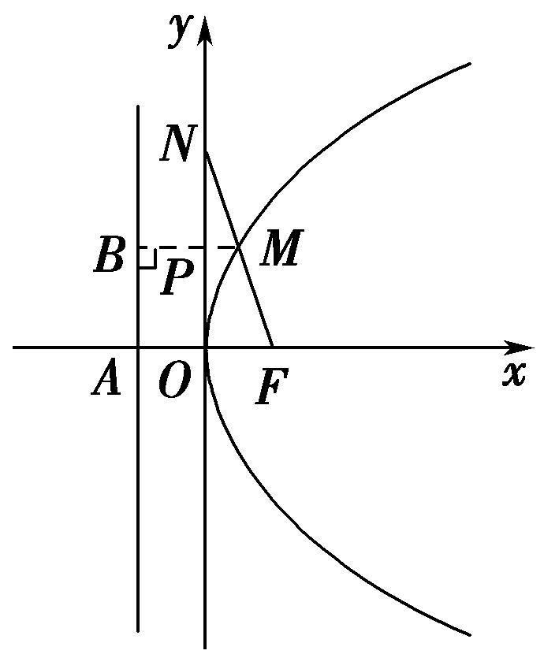

由题意知，*F*(2，0)，|*FO*|＝|*AO*|＝2．∵点*M*为*FN*的中点，*PM*∥*OF*，∴|*MP*|＝|*FO*|＝1．又|*BP*|＝|*AO*|＝2，∴|*MB*|＝|*MP*|＋|*BP*|＝3．由抛物线的定义知|*MF*|＝|*MB*|＝3，故|*FN*|＝2|*MF*|＝6．

(19)如图，过抛物线<em>y</em>2＝2<em>px</em>(<em>p</em>&gt;0)的焦点<em>F</em>的直线交抛物线于点<em>A</em>，<em>B</em>，交其准线<em>l</em>于点<em>C</em>，若<em>F</em>是<em>AC</em>的中点，且|<em>AF</em>|＝4，则线段<em>AB</em>的长为(　　)

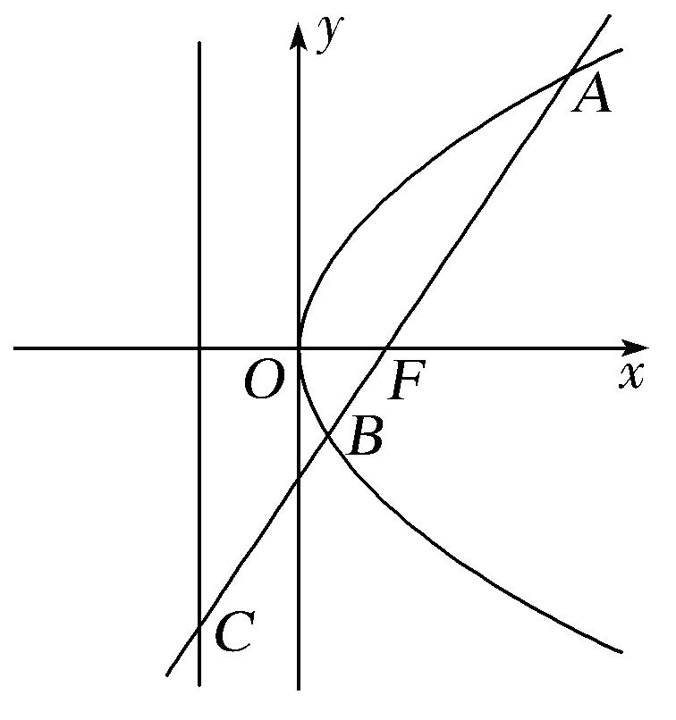

A．5　　　　　　　　B．6　　　　　　　　C．　　　　　　　　D．

<strong>答案</strong>　C　<strong>解析</strong>　[一般解法]　如图，设<em>l</em>与<em>x</em>轴交于点<em>M</em>，过点<em>A</em>作<em>AD</em>⊥<em>l</em>交<em>l</em>于点<em>D</em>，由抛物线的定义知，|<em>AD</em>|＝|<em>AF</em>|＝4，由<em>F</em>是<em>AC</em>的中点，知|<em>AD</em>|＝2|<em>MF</em>|＝2<em>p</em>，所以2<em>p</em>＝4，解得<em>p</em>＝2，所以抛物线的方程为<em>y</em>2＝4<em>x</em>．设<em>A</em>(<em>x</em>1，<em>y</em>1)，<em>B</em>(<em>x</em>2，<em>y</em>2)，则|<em>AF</em>|＝<em>x</em>1＋＝<em>x</em>1＋1＝4，所以<em>x</em>1＝3，可得<em>y</em>1＝2，所以<em>A</em>(3，2)，又<em>F</em>(1，0)，所以直线<em>AF</em>的斜率<em>k</em>＝＝，所以直线<em>AF</em>的方程为<em>y</em>＝(<em>x</em>－1)，代入抛物线方程<em>y</em>2＝4<em>x</em>得3<em>x</em>2－10<em>x</em>＋3＝0，所以<em>x</em>1＋<em>x</em>2＝，|<em>AB</em>|＝<em>x</em>1＋<em>x</em>2＋<em>p</em>＝．故选C．

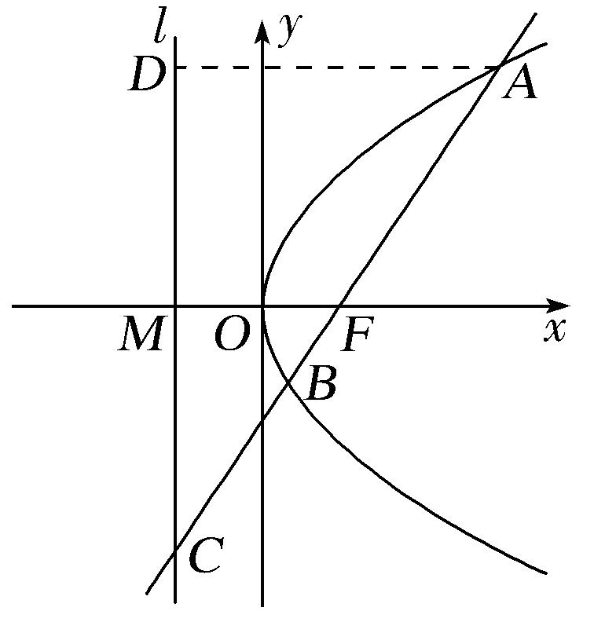

[应用结论]法一　设<em>A</em>(<em>x</em>1，<em>y</em>1)，<em>B</em>(<em>x</em>2，<em>y</em>2)，则|<em>AF</em>|＝<em>x</em>1＋＝<em>x</em>1＋1＝4，所以<em>x</em>1＝3，又<em>x</em>1<em>x</em>2＝＝1，所以<em>x</em>2＝，所以|<em>AB</em>|＝<em>x</em>1＋<em>x</em>2＋<em>p</em>＝3＋＋2＝．

法二　因为＋＝，|*AF*|＝4，所以|*BF*|＝，所以|*AB*|＝|*AF*|＋|*BF*|＝4＋＝．

(20)过抛物线<em>y</em>2＝4<em>x</em>的焦点<em>F</em>的直线<em>l</em>与抛物线交于<em>A</em>，<em>B</em>两点，若|<em>AF</em>|＝2|<em>BF</em>|，则|<em>AB</em>|等于(　　)

A．4　　　　　　　　B．　　　　　　　　C．5　　　　　　　　D．6

<strong>答案</strong>　B　<strong>解析</strong>　[一般解法]易知直线<em>l</em>的斜率存在，设为<em>k</em>，则其方程为<em>y</em>＝<em>k</em>(<em>x</em>－1)．由得<em>k</em>2<em>x</em>2－(2<em>k</em>2＋4)<em>x</em>＋<em>k</em>2＝0，得<em>xA</em>·<em>xB</em>＝1，①．因为|<em>AF</em>|＝2|<em>BF</em>|，由抛物线的定义得<em>xA</em>＋1＝2(<em>xB</em>＋1)，即<em>xA</em>＝2<em>xB</em>＋1，②．由①②解得<em>xA</em>＝2，<em>xB</em>＝，所以|<em>AB</em>|＝|<em>AF</em>|＋|<em>BF</em>|＝<em>xA</em>＋<em>xB</em>＋<em>p</em>＝．

[应用结论]法一　由对称性不妨设点<em>A</em>在<em>x</em>轴的上方，如图设<em>A</em>，<em>B</em>在准线上的射影分别为<em>D</em>，<em>C</em>，作<em>BE</em>⊥<em>AD</em>于<em>E</em>，设|<em>BF</em>|＝<em>m</em>，直线<em>l</em>的倾斜角为<em>θ</em>，则|<em>AB</em>|＝3<em>m</em>，由抛物线的定义知|<em>AD</em>|＝|<em>AF</em>|＝2<em>m</em>，|<em>BC</em>|＝|<em>BF</em>|＝<em>m</em>，所以cos <em>θ</em>＝＝，所以tan <em>θ</em>＝2．则sin2<em>θ</em>＝8cos2<em>θ</em>，∴sin2<em>θ</em>＝．又<em>y</em>2＝4<em>x</em>，知2<em>p</em>＝4，故利用弦长公式|<em>AB</em>|＝＝．

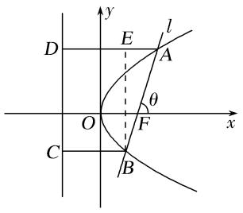

法二　因为|*AF*|＝2|*BF*|，＋＝＋＝＝＝1，解得|*BF*|＝，|*AF*|＝3，故|*AB*|＝|*AF*|＋|*BF*|＝．

(21)设<em>F</em>为抛物线<em>C</em>：<em>y</em>2＝3<em>x</em>的焦点，过<em>F</em>且倾斜角为30°的直线交<em>C</em>于<em>A</em>，<em>B</em>两点，<em>O</em>为坐标原点，则△<em>OAB</em>的面积为(　　)

A．　　　　　　　　B．　　　　　　　　C．　　　　　　　　D．

<strong>答案　D　解析</strong>　[一般解法]　由已知得焦点坐标为<em>F</em>，因此直线<em>AB</em>的方程为<em>y</em>＝，即4<em>x</em>－4<em>y</em>－3＝0．与抛物线方程联立，化简得4<em>y</em>2－12<em>y</em>－9＝0，故|<em>yA</em>－<em>yB</em>|＝＝6．因此<em>S</em>△<em>OAB</em>＝|<em>OF</em>||<em>yA</em>－<em>yB</em>|＝××6＝．联立方程得<em>x</em>2－<em>x</em>＋＝0，故<em>xA</em>＋<em>xB</em>＝．根据抛物线的定义有|<em>AB</em>|＝<em>xA</em>＋<em>xB</em>＋<em>p</em>＝＋＝12，同时原点到直线<em>AB</em>的距离为<em>h</em>＝＝，因此<em>S</em>△<em>OAB</em>＝|<em>AB</em>|·<em>h</em>＝．

[应用结论]　由2<em>p</em>＝3，及|<em>AB</em>|＝，得|<em>AB</em>|＝＝＝12．原点到直线<em>AB</em>的距离<em>d</em>＝|<em>OF</em>|·sin 30°＝，故<em>S</em>△<em>AOB</em>＝|<em>AB</em>|·<em>d</em>＝×12×＝．

(22)过点<em>P</em>(2，－1)作抛物线<em>x</em>2＝4<em>y</em>的两条切线，切点分别为<em>A</em>，<em>B</em>，<em>PA</em>，<em>PB</em>分别交<em>x</em>轴于<em>E</em>，<em>F</em>两点，<em>O</em>为坐标原点，则△<em>PEF</em>与△<em>OAB</em>的面积之比为(　　)

A．　　　　　　　　B．　　　　　　　　C．　　　　　　　　D．

<strong>答案</strong>　C　<strong>解析</strong>　解法1　设过<em>P</em>点的直线方程为<em>y</em>＝<em>k</em>(<em>x</em>－2)－1，代入<em>x</em>2＝4<em>y</em>可得<em>x</em>2－4<em>kx</em>＋8<em>k</em>＋4＝0，令<em>Δ</em>＝0，可得16<em>k</em>2－4(8<em>k</em>＋4)＝0，解得<em>k</em>＝1±．∴直线<em>PA</em>，<em>PB</em>的方程分别为<em>y</em>＝(1＋)(<em>x</em>－2)－1，<em>y</em>＝(1－)·(<em>x</em>－2)－1，分别令<em>y</em>＝0，可得<em>E</em>(＋1，0)，<em>F</em>(1－，0)，即|<em>EF</em>|＝2．∴<em>S</em>△<em>PEF</em>＝×2×1＝，易求得<em>A</em>(2＋2，3＋2)，<em>B</em>(2－2，3－2)，∴直线<em>AB</em>的方程为<em>y</em>＝<em>x</em>＋1，|<em>AB</em>|＝8，又原点<em>O</em>到直线<em>AB</em>的距离<em>d</em>＝，∴<em>S</em>△<em>OAB</em>＝×8×＝2．∴△<em>PEF</em>与△<em>OAB</em>的面积之比为．故选C．

解法2　设<em>A</em>(<em>x</em>1，<em>y</em>1)，<em>B</em>(<em>x</em>2，<em>y</em>2)，则点<em>A</em>，<em>B</em>处的切线方程为<em>x</em>1<em>x</em>＝2(<em>y</em>＋<em>y</em>1)，<em>x</em>2<em>x</em>＝2(<em>y</em>＋<em>y</em>2)，所以<em>E</em>，<em>F</em>，即<em>E</em>，<em>F</em>，因为这两条切线都过点<em>P</em>(2，－1)，则所以<em>lAB</em>：<em>x</em>＝－1＋<em>y</em>，即<em>lAB</em>过定点(0，1)，则＝＝．

**【对点训练】**

23．过抛物线<em>C</em>：<em>y</em>2＝2<em>px</em>(<em>p</em>＞0)的焦点<em>F</em>且倾斜角为锐角的直线<em>l</em>与<em>C</em>交于<em>A</em>，<em>B</em>两点，过线段<em>AB</em>的中点

*N*且垂直于*l*的直线与*C*的准线相交于点*M*，若|*MN*|＝|*AB*|，则直线*l*的倾斜角为(　　)

A．15°　　　　　　　　B．30°　　　　　　　　C．45°　　　　　　　　D．60°

23．<strong>答案</strong>　B　<strong>解析</strong>　分别过<em>A</em>，<em>B</em>，<em>N</em>作抛物线准线的垂线，垂足分别为<em>A</em>′，<em>B</em>′，<em>N</em>′(图略)，由抛物线的

定义知|*AF*|＝|*AA*′|，|*BF*|＝|*BB*′|，|*NN*′|＝(|*AA*′|＋|*BB*′|)＝|*AB*|，因为|*MN*|＝|*AB*|，所以|*NN*′|＝|*MN*|，所以∠*MNN*′＝60°，即直线*MN*的倾斜角为120°，又直线*MN*与直线*l*垂直且直线*l*的倾斜角为锐角，所以直线*l*的倾斜角为30°，故选B．

24．已知<em>F</em>是抛物线<em>y</em>2＝4<em>x</em>的焦点，过焦点<em>F</em>的直线<em>l</em>交抛物线的准线于点<em>P</em>，点<em>A</em>在抛物线上且|<em>AP</em>|＝

|*AF*|＝3，则直线*l*的斜率为(　　)

A．±1　　　　　　　　B．　　　　　　　　C．±　　　　　　　　D．2

24．<strong>答案</strong>　C　<strong>解析</strong>　因为点<em>A</em>在抛物线<em>y</em>2＝4<em>x</em>上，且|<em>AP</em>|＝|<em>AF</em>|＝3，点<em>P</em>在抛物线的准线上，由抛物线

的定义可知，<em>AP</em>⊥准线，设<em>A</em>(<em>x</em>，<em>y</em>)，则|<em>AP</em>|＝<em>x</em>＋＝<em>x</em>＋1＝3，解得<em>x</em>＝2，所以<em>y</em>2＝8，故<em>A</em>(2，±2)，故<em>P</em>(－1，±2)，又<em>F</em>(1，0)，所以直线<em>l</em>的斜率为<em>kPF</em>＝＝±．故选C．

25．已知直线<em>l</em>：<em>y</em>＝<em>kx</em>－<em>k</em>(<em>k</em>∈<strong>R</strong>)与抛物线<em>C</em>：<em>y</em>2＝4<em>x</em>及其准线分别交于<em>M</em>，<em>N</em>两点，<em>F</em>为抛物线的焦点，

若2＝，则实数*k*等于(　　)

A．±　　　　　　　　B．±1　　　　　　　　C．±　　　　　　　　D．±2

25．<strong>答案</strong>　C　<strong>解析</strong>　抛物线<em>C</em>：<em>y</em>2＝4<em>x</em>的焦点<em>F</em>(1，0)，直线<em>l</em>：<em>y</em>＝<em>kx</em>－<em>k</em>过抛物线的焦点．当<em>k</em>&gt;0时，

如图所示，

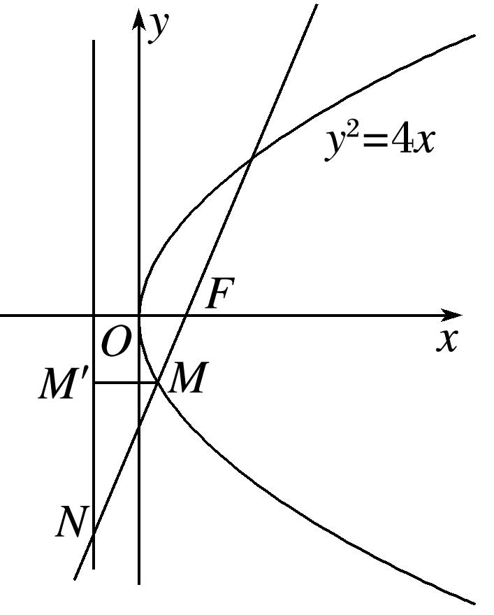

过点*M*作*MM*′垂直于准线*x*＝－1，垂足为*M*′，由抛物线的定义，得|*MM*′|＝|*MF*|，易知∠*M*′*MN*与直线*l*的倾斜角相等，由2＝，得cos∠*M*′*MN*＝＝，则tan∠*M*′*MN*＝，∴直线*l*的斜率*k*＝；当*k*<0时，可得直线*l*的斜率*k*＝－．故选C．

26．已知抛物线<em>M</em>：<em>y</em>2＝4<em>x</em>，过抛物线<em>M</em>的焦点<em>F</em>的直线<em>l</em>交抛物线于<em>A</em>，<em>B</em>两点(点<em>A</em>在第一象限)，且

交抛物线的准线于点*E*．若＝2，则直线*l*的斜率为(　　)

A．3 　　　　　　　　B．2　　　　　　　　C．　　　　　　　　D．1

26．<strong>答案</strong>　B　<strong>解析</strong>　分别过<em>A</em>，<em>B</em>两点作<em>AD</em>，<em>BC</em>垂直于准线，垂足分别为<em>D</em>，<em>C</em>，由＝2，

得*B*为*AE*的中点，∴|*AB*|＝|*BE*|，则|*AD*|＝2|*BC*|，由抛物线的定义可知|*AF*|＝|*AD*|，|*BF*|＝|*BC*|，∴|*AB*|＝3|*BC*|，∴|*BE*|＝3|*BC*|，则|*CE*|＝2|*BC*|，∴tan∠*CBE*＝＝2，∴直线*l*的斜率*k*＝tan∠*AFx*＝tan ∠*CBE*＝2．

27．已知直线<em>y</em>＝<em>k</em>(<em>x</em>＋2)(<em>k</em>＞0)与抛物线<em>C</em>：<em>y</em>2＝8<em>x</em>相交于<em>A</em>、<em>B</em>两点，<em>F</em>为<em>C</em>的焦点，若|<em>FA</em>|＝2|<em>FB</em>|，则<em>k</em>

的值为(　　)

A．　　　　　　　　B．　　　　　　　　C．　　　　　　　　D．

27．<strong>答案</strong>　D　<strong>解析</strong>　解法1　设<em>A</em>(<em>x</em>1，<em>y</em>1)，<em>B</em>(<em>x</em>2，<em>y</em>2)，则<em>x</em>1&gt;0，<em>x</em>2&gt;0，∴|<em>FA</em>|＝<em>x</em>1＋2，|<em>FB</em>|＝<em>x</em>2＋2，∴<em>x</em>1

＋2＝2<em>x</em>2＋4，∴<em>x</em>1＝2<em>x</em>2＋2．由，得<em>k</em>2<em>x</em>2＋(4<em>k</em>2－8)<em>x</em>＋4<em>k</em>2＝0，∴<em>x</em>1<em>x</em>2＝4，<em>x</em>1＋<em>x</em>2＝＝－4．由，得<em>x</em>＋<em>x</em>2－2＝0，∴<em>x</em>2＝1，∴<em>x</em>1＝4，∴－4＝5，∴<em>k</em>2＝，<em>k</em>＝．

解法2　设抛物线<em>C</em>：<em>y</em>2＝8<em>x</em>的准线为<em>l</em>，易知<em>l</em>：<em>x</em>＝－2，直线<em>y</em>＝<em>k</em>(<em>x</em>＋2)恒过定点<em>P</em>(－2，0)，如图，过<em>A</em>，<em>B</em>分别作<em>AM</em>⊥<em>l</em>于点<em>M</em>，<em>BN</em>⊥<em>l</em>于点<em>N</em>，由|<em>FA</em>|＝2|<em>FB</em>|，知|<em>AM</em>|＝2|<em>BN</em>|，所以点<em>B</em>为线段<em>AP</em>的中点，连接<em>OB</em>，则|<em>OB</em>|＝|<em>AF</em>|，所以|<em>OB</em>|＝|<em>BF</em>|，所以点<em>B</em>的横坐标为1，因为<em>k</em>＞0，所以点<em>B</em>的坐标为(1，2)，所以<em>k</em>＝＝．故选D．

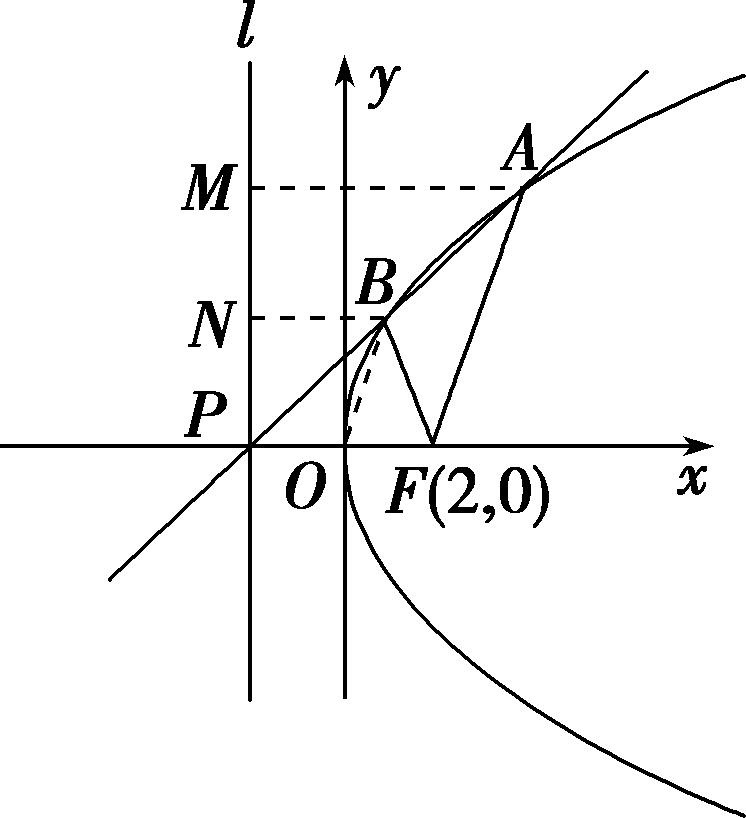

28．已知抛物线<em>y</em>2＝2<em>px</em>(<em>p</em>&gt;0)的焦点为<em>F</em>，△<em>ABC</em>的顶点都在抛物线上，且满足＋＋＝0，则

＋＋＝\_\_\_\_\_\_\_\_．

28．<strong>答案</strong>　0　<strong>解析</strong>　设<em>A</em>(<em>x</em>1，<em>y</em>1)，<em>B</em>(<em>x</em>2，<em>y</em>2)，<em>C</em>(<em>x</em>3，<em>y</em>3)，<em>F</em>，由＋＝－，得

＋＝－，<em>y</em>1＋<em>y</em>2＋<em>y</em>3＝0.因为<em>kAB</em>＝＝，<em>kAC</em>＝＝，<em>kBC</em>＝＝，所以＋＋＝＋＋＝＝0．

29．已知抛物线<em>E</em>：<em>x</em>2＝2<em>py</em>(<em>p</em>&gt;0)的焦点为<em>F</em>，其准线与<em>y</em>轴交于点<em>D</em>，过点<em>F</em>作直线交抛物线<em>E</em>于<em>A</em>，<em>B</em>

两点，若*AB*⊥*AD*且|*BF*|＝|*AF*|＋4，则*p*的值为\_\_\_\_\_\_\_\_．

29．<strong>答案</strong>　2　<strong>解析</strong>　当<em>k</em>不存在时，直线与抛物线不会交于两点．当<em>k</em>存在时(如图)，设直线<em>AB</em>的方程

为<em>y</em>＝<em>kx</em>＋，<em>A</em>(<em>x</em>1，<em>y</em>1)，<em>B</em>(<em>x</em>2，<em>y</em>2)，<em>D</em>．则有<em>x</em>＝2<em>py</em>1，<em>x</em>＝2<em>py</em>2，联立直线与抛物线方程得整理得<em>x</em>2－2<em>pkx</em>－<em>p</em>2＝0，所以<em>x</em>1<em>x</em>2＝－<em>p</em>2，<em>x</em>1＋<em>x</em>2＝2<em>pk</em>，所以<em>y</em>1<em>y</em>2＝＝，＝，＝．又<em>AB</em>⊥<em>AD</em>，所以－<em>x</em>1(－<em>x</em>1)＋＝0，整理得<em>x</em>＋<em>y</em>＝，即2<em>py</em>1＋<em>y</em>＝，解得<em>y</em>1＝<em>p</em>．因为<em>y</em>1<em>y</em>2＝，所以<em>y</em>2＝<em>p</em>，又|<em>AF</em>|＝<em>y</em>1＋，|<em>BF</em>|＝<em>y</em>2＋，代入|<em>BF</em>|＝|<em>AF</em>|＋4得，<em>y</em>2＋＝<em>y</em>1＋＋4．解得<em>p</em>＝2．

30．已知抛物线<em>x</em>2＝4<em>y</em>的焦点为<em>F</em>，准线为<em>l</em>，<em>P</em>为抛物线上一点，过<em>P</em>作<em>PA</em>⊥<em>l</em>于点<em>A</em>，当∠<em>AFO</em>＝30°(<em>O</em>

为坐标原点)时，|*PF*|＝\_\_\_\_\_\_\_\_.

30．<strong>答案　　解析</strong>　法一：令<em>l</em>与<em>y</em>轴的交点为<em>B</em>，在Rt△<em>ABF</em>中，∠<em>AFB</em>＝30°，|<em>BF</em>|＝2，所以|<em>AB</em>|＝．设

<em>P</em>(<em>x</em>0，<em>y</em>0)，则<em>x</em>0＝±，代入<em>x</em>2＝4<em>y</em>中，得<em>y</em>0＝，所以|<em>PF</em>|＝|<em>PA</em>|＝<em>y</em>0＋1＝．

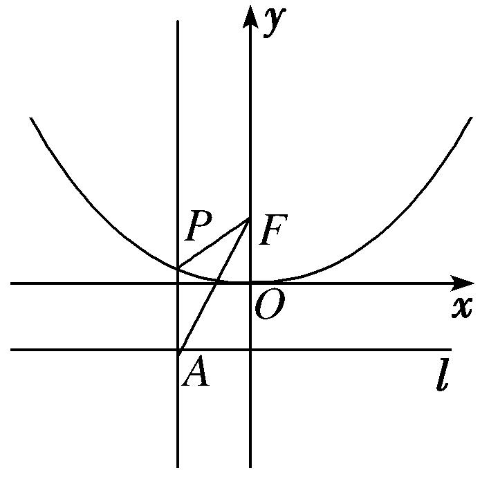

法二：如图所示，∠*AFO*＝30°，∴∠*PAF*＝30°，又|*PA*|＝|*PF*|，∴△*APF*为顶角∠*APF*＝120°的等腰三角形，而|*AF*|＝＝，∴|*PF*|＝＝．

31．在平面直角坐标系<em>xOy</em>中，抛物线<em>y</em>2＝6<em>x</em>的焦点为<em>F</em>，准线为<em>l</em>，<em>P</em>为抛物线上一点，<em>PA</em>⊥<em>l</em>，<em>A</em>为垂

足．若直线*AF*的斜率*k*＝－，则线段*PF*的长为\_\_\_\_\_\_\_\_．

31．<strong>答案</strong>　6　<strong>解析</strong>　由抛物线方程为<em>y</em>2＝6<em>x</em>，所以焦点坐标<em>F</em>，准线方程为<em>x</em>＝－，因为直线<em>AF</em>

的斜率为－，所以直线*AF*的方程为*y*＝－，

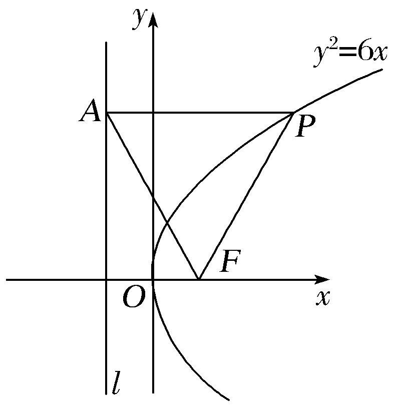

当*x*＝－时，*y*＝3，所以*A*，因为*PA*⊥*l*，*A*为垂足，所以点*P*的纵坐标为3，可得点*P*的坐标为，根据抛物线的定义可知|*PF*|＝|*PA*|＝－＝6．

32．在直角坐标系<em>xOy</em>中，抛物线<em>C</em>：<em>y</em>2＝4<em>x</em>的焦点为<em>F</em>，准线为<em>l</em>，<em>P</em>为<em>C</em>上一点，<em>PQ</em>垂直<em>l</em>于点<em>Q</em>，

*M*，*N*分别为*PQ*，*PF*的中点，直线*MN*与*x*轴交于点*R*，若∠*NFR*＝60°，则|*FR*|等于(　　)

A．2　　　　　　　　B．　　　　　　　　C．2　　　　　　　　D．3

32．<strong>答案</strong>　A　<strong>解析</strong>　由抛物线<em>C</em>：<em>y</em>2＝4<em>x</em>，得焦点<em>F</em>(1,0)，准线方程为<em>x</em>＝－1，

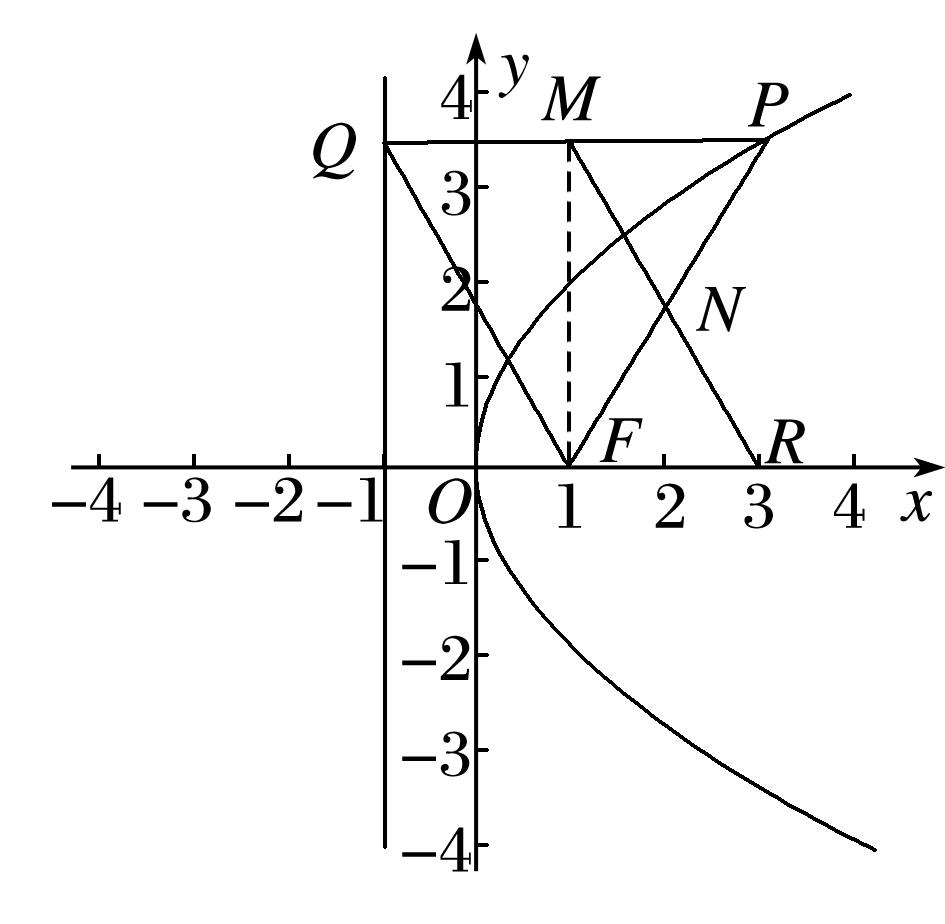

因为*M*，*N*分别为*PQ*，*PF*的中点，所以*MN*∥*QF*，所以四边形*QMRF*为平行四边形，|*FR*|＝|*QM*|，又由*PQ*垂直*l*于点*Q*，可知|*PQ*|＝|*PF*|，因为∠*NFR*＝60°，所以△*PQF*为等边三角形，所以*FM*⊥*PQ*，所以|*FR*|＝2，故选A．

33．已知<em>y</em>2＝4<em>x</em>的准线交<em>x</em>轴于点<em>Q</em>，焦点为<em>F</em>，过<em>Q</em>且斜率大于0的直线交<em>y</em>2＝4<em>x</em>于<em>A</em>，<em>B</em>，两点∠<em>AFB</em>

＝60°，则|*AB*|等于(　　)

A．　　　　　　　　B．　　　　　　　　C．4 　　　　　　　　D．3

33．<strong>答案</strong>　B　<strong>解析</strong>　设<em>A</em>(<em>x</em>1,2)，<em>B</em>(<em>x</em>2,2)，<em>x</em>2&gt;<em>x</em>1&gt;0，因为<em>kQA</em>＝<em>kQB</em>，即＝，整理化简得<em>x</em>1<em>x</em>2

＝1，|<em>AB</em>|2＝(<em>x</em>2－<em>x</em>1)2＋(2－2)2，|<em>AF</em>|＝<em>x</em>1＋1，|<em>BF</em>|＝<em>x</em>2＋1，代入余弦定理|<em>AB</em>|2＝|<em>AF</em>|2＋|<em>BF</em>|2－2|<em>AF</em>||<em>BF</em>|cos60°，整理化简得，<em>x</em>1＋<em>x</em>2＝，又因为<em>x</em>1<em>x</em>2＝1，所以<em>x</em>1＝，<em>x</em>2＝3，|<em>AB</em>|＝＝，故选B．

34．过抛物线<em>y</em>＝<em>x</em>2的焦点<em>F</em>作一条倾斜角为30°的直线交抛物线于<em>A</em>，<em>B</em>两点，则|<em>AB</em>|＝\_\_\_\_\_\_\_\_．

34．<strong>答案　　解析</strong>　(1)依题意，设点<em>A</em>(<em>x</em>1，<em>y</em>1)，<em>B</em>(<em>x</em>2，<em>y</em>2)，题中的抛物线<em>x</em>2＝4<em>y</em>的焦点坐标是<em>F</em>(0，1)，

直线<em>AB</em>的方程为<em>y</em>＝<em>x</em>＋1，即<em>x</em>＝(<em>y</em>－1)．由消去<em>x</em>得3(<em>y</em>－1)2＝4<em>y</em>，即3<em>y</em>2－10<em>y</em>＋3＝0，<em>Δ</em>＝(－10)2－4×3×3&gt;0，<em>y</em>1＋<em>y</em>2＝，则|<em>AB</em>|＝|<em>AF</em>|＋|<em>BF</em>|＝(<em>y</em>1＋1)＋(<em>y</em>2＋1)＝<em>y</em>1＋<em>y</em>2＋2＝．

35．已知直线<em>l</em>过抛物线<em>C</em>：<em>y</em>2＝3<em>x</em>的焦点<em>F</em>，交<em>C</em>于<em>A</em>，<em>B</em>两点，交<em>C</em>的准线于点<em>P</em>，若＝，则|<em>AB</em>|

＝(　　)

A．3　　　　　　　　B．4　　　　　　　　C．6　　　　　　　　D．8

35．**答案**　B　**解析**　如图所示：

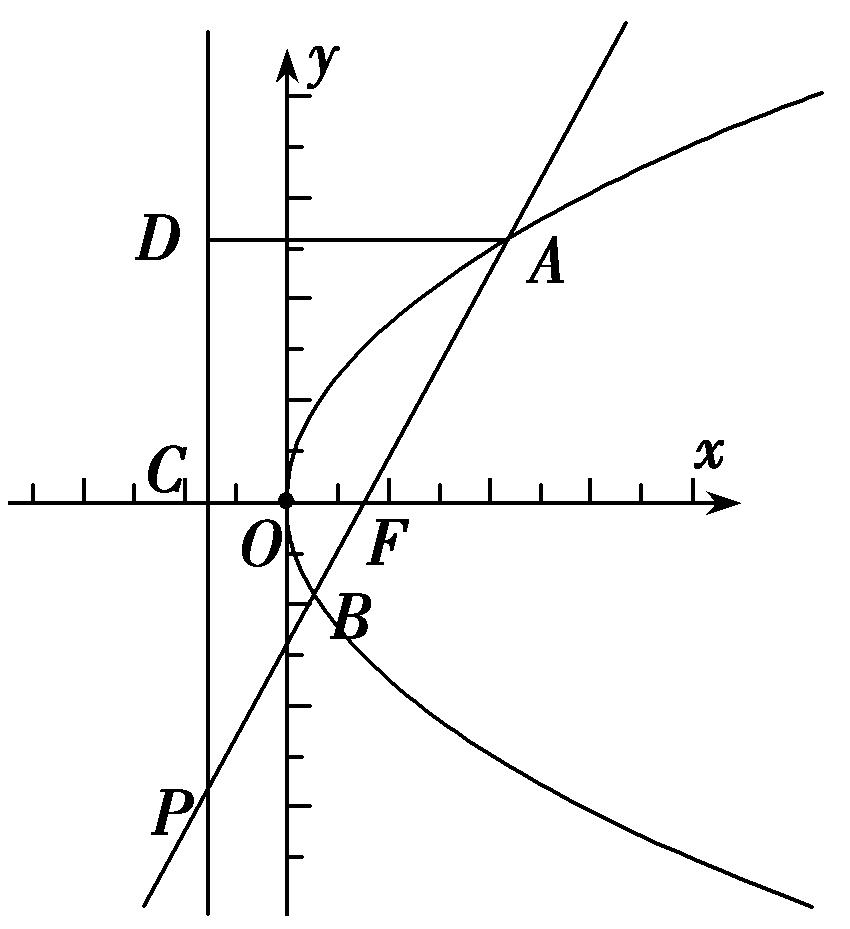

不妨设<em>A</em>在第一象限，由抛物线<em>C</em>：<em>y</em>2＝3<em>x</em>可得<em>F</em>，准线<em>DP</em>：<em>x</em>＝－．因为＝，所以<em>F</em>是<em>AP</em>的中点，则<em>AD</em>＝2<em>CF</em>＝3.所以可得<em>A</em>，则<em>kAF</em>＝，所以直线<em>AP</em>的方程为：<em>y</em>＝，联立方程，整理得：<em>x</em>2－<em>x</em>＋＝0，所以<em>x</em>1＋<em>x</em>2＝，则|<em>AB</em>|＝<em>x</em>1＋<em>x</em>2＋<em>p</em>＝＋＝4．故选B．

36．(2017·全国Ⅱ)过抛物线<em>C</em>：<em>y</em>2＝4<em>x</em>的焦点<em>F</em>，且斜率为的直线交<em>C</em>于点<em>M</em>(<em>M</em>在<em>x</em>轴的上方)，<em>l</em>为<em>C</em>

的准线，点*N*在*l*上且*MN*⊥*l*，则*M*到直线*NF*的距离为(　　)

A．　　　　　　　　B．2　　　　　　　　C．2　　　　　　　　D．3

36．<strong>答案</strong>　C　<strong>解析</strong>　由题意，得<em>F</em>(1,0)，则直线<em>FM</em>的方程是<em>y</em>＝(<em>x</em>－1)．由得<em>x</em>

＝或*x*＝3．由*M*在*x*轴的上方，得*M*(3，2)，由*MN*⊥*l*，得|*MN*|＝|*MF*|＝3＋1＝4．又∠*NMF*等于直线*FM*的倾斜角，即∠*NMF*＝60°，因此△*MNF*是边长为4的等边三角形，所以点*M*到直线*NF*的距离为4×＝2．

37．已知抛物线<em>C</em>：<em>x</em>2＝4<em>y</em>的焦点为<em>F</em>，直线<em>AB</em>与抛物线<em>C</em>相交于<em>A</em>，<em>B</em>两点，若2＋－3＝0，

则弦*AB*中点到抛物线*C*的准线的距离为\_\_\_\_\_\_\_\_．

37．<strong>答案　　解析</strong>　依题意得，抛物线的焦点为<em>F</em>(0，1)，准线方程是y＝－1，因为2(－)＋(－

)＝0，即2＋＝0，所以<em>F</em>，<em>A</em>，<em>B</em>三点共线．设直线<em>AB</em>：<em>y</em>＝<em>kx</em>＋<em>1</em>(<em>k</em>≠0)，<em>A</em>(<em>x1</em>，<em>y</em>1)，B<em>(x</em>2，<em>y2</em>)，则由得<em>x</em>2＝4(<em>kx</em>＋1)，即<em>x2</em>－4<em>kx</em>－4＝0，<em>x1x2</em>＝－4　①；又2＋＝0，因此2<em>x</em>1＋<em>x</em>2＝0　②．由①②解得x＝2，弦AB的中点到抛物线C的准线的距离为[(<em>y1</em>＋1)＋(<em>y</em>2＋1)]＝(<em>y</em>1＋<em>y</em>2)＋1＝(<em>x</em>＋<em>x</em>)＋1＝＋1＝．

38．已知抛物线<em>C</em>：<em>y</em>2＝4<em>x</em>的焦点为<em>F</em>，准线为<em>l</em>．若射线<em>y</em>＝2(<em>x</em>－1)(<em>x</em>≤1)与<em>C</em>，<em>l</em>分别交于<em>P</em>，Q两点，

则＝(　　)

A．　　　　　　　　B．2　　　　　　　　C．　　　　　　　　D．5

38．<strong>答案</strong>　C　<strong>解析</strong>　由题意，知抛物线<em>C</em>：<em>y</em>2＝4<em>x</em>的焦点<em>F</em>(1,0)，设准线<em>l</em>：<em>x</em>＝－1与<em>x</em>轴的交点为<em>F</em>1.

过点<em>P</em>作直线<em>l</em>的垂线，垂足为<em>P</em>1(图略)，由得点<em>Q</em>的坐标为(－1，－4)，所以|<em>FQ</em>|＝2．又|<em>PF</em>|＝|<em>PP</em>1|，所以＝＝＝＝，故选C．

39．已知抛物线<em>Γ</em>：<em>y</em>2＝8<em>x</em>的焦点为<em>F</em>，准线与<em>x</em>轴的交点为<em>K</em>，点<em>P</em>在<em>Γ</em>上且|<em>PK</em>|＝|<em>PF</em>|，则△<em>PKF</em>的

面积为\_\_\_\_\_\_\_\_．

39．<strong>答案</strong>　8　<strong>解析</strong>　由已知得，<em>F</em>(2，0)，<em>K</em>(－2，0)，过<em>P</em>作<em>PM</em>垂直于准线于点<em>M</em>，则|<em>PM</em>|＝|<em>PF</em>|，又

|<em>PK</em>|＝|<em>PF</em>|，∴|<em>PM</em>|＝|<em>MK</em>|＝|<em>PF</em>|，∴<em>PF</em>⊥<em>x</em>轴，△<em>PFK</em>的高等于|<em>PF</em>|，不妨设<em>P</em>(<em>m</em>2,2<em>m</em>)(<em>m</em>＞0)，则<em>m</em>2＋2＝4，解得<em>m</em>＝，故△<em>PFK</em>的面积<em>S</em>＝4×2××＝8．

40．抛物线<em>C</em>：<em>y</em>2＝4<em>x</em>的焦点为<em>F</em>，其准线<em>l</em>与<em>x</em>轴交于点<em>A</em>，点<em>M</em>在抛物线<em>C</em>上，当＝时，△<em>AMF</em>

的面积为(　　)

A．1　　　　　　　　B．　　　　　　　　C．2　　　　　　　　D．2

40．<strong>答案</strong>　C　<strong>解析</strong>　(1)过<em>M</em>作<em>MP</em>垂直于准线，垂足为<em>P</em>，则＝＝＝，则cos∠

*AMP*＝，又0°<∠*MAF*<180°，则∠*AMP*＝45°，此时△*AMP*是等腰直角三角形，设*M*(*m*，)，则由|*MP*|＝|*MA*|得|*m*＋1|＝，解得*m*＝1，*M*(1，2)，所以△*AMF*的面积为×2×2＝2．

41．抛物线<em>x</em>2＝4<em>y</em>的焦点为<em>F</em>，过点<em>F</em>作斜率为的直线<em>l</em>与抛物线在<em>y</em>轴右侧的部分相交于点<em>A</em>，过点

*A*作抛物线准线的垂线，垂足为*H*，则△*AHF*的面积是(　　)

A．4　　　　　　　　B．3　　　　　　　　C．4　　　　　　　　D．8

41．<strong>答案</strong>　C　<strong>解析</strong>　由抛物线的定义可得|<em>AF</em>|＝|<em>AH</em>|，∵<em>AF</em>的斜率为，∴<em>AF</em>的倾斜角为30°，∵<em>AH</em>

垂直于准线，∴∠*FAH*＝60°，故△*AHF*为等边三角形．设*A*，*m*>0，过*F*作*FM*⊥*AH*于*M*，则在△*FAM*中，|*AM*|＝|*AF*|，∴－1＝，解得*m*＝2，故等边三角形*AHF*的边长|*AH*|＝4，∴△*AHF*的面积是×4×4sin 60°＝4．故选C．

42．已知抛物线<em>C</em>：<em>y</em>2＝8<em>x</em>的焦点为<em>F</em> ，直线<em>l</em>过焦点<em>F</em>与抛物线<em>C</em>分别交于<em>A</em>，<em>B</em>两点，且直线<em>l</em>不与

*x*轴垂直，线段*AB*的垂直平分线与*x*轴交于点*P*(10，0)，则△*AOB*的面积为(　　)

A．4　　　　　　　　B．4　　　　　　　　C．8　　　　　　　　D．8

42．<strong>答案</strong>　C　<strong>解析</strong>　设直线<em>l</em>：<em>x</em>＝<em>ty</em>＋2，<em>A</em>(<em>x</em>1，<em>y</em>1)，<em>B</em>(<em>x</em>2，<em>y</em>2)，则由可以得到<em>y</em>2－8<em>ty</em>－16＝0，

所以<em>AB</em>的中点<em>M</em>(4<em>t</em>2＋2,4<em>t</em>)，线段<em>AB</em>的垂直平分线与<em>x</em>轴交于点<em>P</em>(10,0)，故<em>t</em>≠0．所以<em>AB</em>的中垂线的方程为<em>y</em>＝－(<em>x</em>－4<em>t</em>2－2)＋4<em>t</em>＝－·<em>x</em>＋8<em>t</em>＋，令<em>y</em>＝0可得<em>x</em>＝8<em>t</em>2＋2，解方程10＝8<em>t</em>2＋2得<em>t</em>＝±1．此时<em>AB</em>＝ |<em>y</em>1－<em>y</em>2|＝8 ＝16，<em>O</em>到<em>AB</em>的距离为<em>d</em>＝＝，所以<em>S</em>Δ<em>OAB</em>＝×16×＝8．故选C．

43．过抛物线<em>y</em>2＝4<em>x</em>的焦点<em>F</em>的直线交抛物线于<em>A</em>，<em>B</em>两点，点<em>O</em>是坐标原点，若|<em>AF</em>|＝3，则△<em>AOB</em>的

面积为(　　)

A．　　　　　　　　B．　　　　　　　　C．　　　　　　　　D．2

43．<strong>答案</strong>　C　<strong>解析</strong>　设<em>A</em>(<em>x</em>1，<em>y</em>1)，<em>B</em>(<em>x</em>2，<em>y</em>2)(<em>y</em>1&gt;0，<em>y</em>2&lt;0)，如图所示，|<em>AF</em>|＝<em>x</em>1＋1＝3，

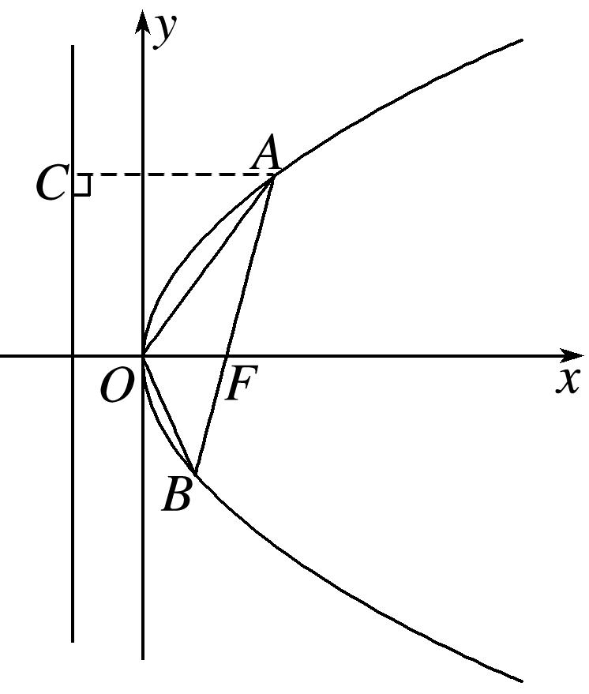

所以<em>x</em>1＝2，<em>y</em>1＝2．设<em>AB</em>的方程为<em>x</em>－1＝<em>ty</em>，由消去<em>x</em>，得<em>y</em>2－4<em>ty</em>－4＝0．所以<em>y</em>1<em>y</em>2＝－4．所以<em>y</em>2＝－，<em>x</em>2＝，所以<em>S</em>△<em>AOB</em>＝×1×|<em>y</em>1－<em>y</em>2|＝．

44．已知抛物线<em>y</em>2＝4<em>x</em>，过其焦点<em>F</em>的直线<em>l</em>与抛物线分别交于<em>A</em>，<em>B</em>两点(<em>A</em>在第一象限内)，＝3，

过*AB*的中点且垂直于*l*的直线与*x*轴交于点*G*，则△*ABG*的面积为(　　)

A．　　　　　　　　B． 　　　　　　　　C．　　　　　　　　D．

44．<strong>答案</strong>　C　<strong>解析</strong>　设<em>A</em>(<em>x</em>1，<em>y</em>1)，<em>B</em>(<em>x</em>2，<em>y</em>2)，因为＝3，所以<em>y</em>1＝－3<em>y</em>2，设直线<em>l</em>的方程为<em>x</em>

＝<em>my</em>＋1，由消去<em>x</em>得<em>y</em>2－4<em>my</em>－4＝0，∴<em>y</em>1<em>y</em>2＝－4，∴∴<em>y</em>1＋<em>y</em>2＝4<em>m</em>＝，∴<em>m</em>＝，∴<em>x</em>1＋<em>x</em>2＝，<em>AB</em>的中点坐标为，过<em>AB</em>中点且垂直于直线<em>l</em>的直线方程为<em>y</em>－＝－，令<em>y</em>＝0，可得<em>x</em>＝，所以<em>S</em>△<em>ABG</em>＝××＝．

45．已知抛物线<em>x</em>2＝2<em>y</em>的焦点为<em>F</em>，其上有两点<em>A</em>(<em>x</em>1，<em>y</em>1)，<em>B</em>(<em>x</em>2，<em>y</em>2)满足|<em>AF</em>|－|<em>BF</em>|＝2，则<em>y</em>1＋<em>x</em>－<em>y</em>2－<em>x</em>

＝(　　)

A．4　　　　　　　　B．6　　　　　　　　C．8　　　　　　　　D．10

45．<strong>答案</strong>　B　<strong>解析</strong>　(1)由抛物线定义知|<em>AF</em>|＝<em>y</em>1＋，|<em>BF</em>|＝<em>y</em>2＋，∴|<em>AF</em>|－|<em>BF</em>|＝<em>y</em>1－<em>y</em>2＝2，又知<em>x</em>＝2<em>y</em>1，

<em>x</em>＝2<em>y</em>2，∴<em>x</em>－<em>x</em>＝2(<em>y</em>1－<em>y</em>2)＝4，∴<em>y</em>1＋<em>x</em>－<em>y</em>2－<em>x</em>＝(<em>y</em>1－<em>y</em>2)＋(<em>x</em>－<em>x</em>)＝2＋4＝6．

46．(2018·全国Ⅰ)设抛物线<em>C</em>：<em>y</em>2＝4<em>x</em>的焦点为<em>F</em>，过点(－2，0)且斜率为的直线与<em>C</em>交于<em>M</em>，<em>N</em>两点，

则·等于(　　)

A．5　　　　　　　　B．6　　　　　　　　C．7　　　　　　　　D．8

46．<strong>答案</strong>　D　<strong>解析</strong>　由题意知直线<em>MN</em>的方程为<em>y</em>＝(<em>x</em>＋2)，联立直线与抛物线的方程，得

解得或不妨设点*M*的坐标为(1，2)，点*N*的坐标为(4，4)．又∵抛物线的焦点为*F*(1，0)，∴＝(0，2)，＝(3，4)．∴·＝0×3＋2×4＝8．故选D．

47．抛物线<em>C</em>：<em>y</em>2＝4<em>x</em>的焦点为<em>F</em>，动点<em>P</em>在抛物线<em>C</em>上，点<em>A</em>(－1，0)，当取得最小值时，直线<em>AP</em>

的方程为\_\_\_\_\_\_\_\_．

47．<strong>答案</strong>　<em>x</em>＋<em>y</em>＋1＝0或<em>x</em>－<em>y</em>＋1＝0　<strong>解析</strong>　设<em>P</em>点的坐标为(4<em>t</em>2,4<em>t</em>)，∵<em>F</em>(1,0)，<em>A</em>(－1,0)，∴|<em>PF</em>|2＝(4<em>t</em>2

－1)2＋16<em>t</em>2＝16<em>t</em>4＋8<em>t</em>2＋1，|<em>PA</em>|2＝(4<em>t</em>2＋1)2＋16<em>t</em>2＝16<em>t</em>4＋24<em>t</em>2＋1，∴2＝＝1－＝1－≥1－＝1－＝，当且仅当16<em>t</em>2＝，即<em>t</em>＝±时取等号，此时点<em>P</em>坐标为(1，2)或(1，－2)，此时直线<em>AP</em>的方程为<em>y</em>＝±(<em>x</em>＋1)，即<em>x</em>＋<em>y</em>＋1＝0或<em>x</em>－<em>y</em>＋1＝0．

48．已知点<em>P</em>(－1，0)，设不垂直于<em>x</em>轴的直线<em>l</em>与抛物线<em>y</em>2＝2<em>x</em>交于不同的两点<em>A</em>，<em>B</em>，若<em>x</em>轴是∠<em>APB</em>

的角平分线，则直线*l*一定过点(　　)

A．　　　　　　B．(1，0)　　　　　　　C．(2，0)　　　　　　　D．(－2，0)

48．<strong>答案</strong>　B　<strong>解析</strong>　根据题意，直线的斜率存在且不等于零，设直线的方程为<em>x</em>＝<em>ty</em>＋<em>m</em>(<em>t</em>≠0)，与抛物线

方程联立，消元得<em>y</em>2－2<em>ty</em>－2<em>m</em>＝0，设<em>A</em>(<em>x</em>1，<em>y</em>1)，<em>B</em>(<em>x</em>2，<em>y</em>2)，因为<em>x</em>轴是∠<em>APB</em>的角平分线，所以<em>AP</em>，<em>BP</em>的斜率互为相反数，所以＋＝0，所以2<em>ty</em>1<em>y</em>2＋(<em>m</em>＋1)(<em>y</em>1＋<em>y</em>2)＝0，结合根与系数之间的关系，整理得出2<em>t</em>(－2<em>m</em>)＋2<em>tm</em>＋2<em>t</em>＝0，2<em>t</em>(<em>m</em>－1)＝0，因为<em>t</em>≠0，所以<em>m</em>＝1，所以过定点(1，0)，故选B．

49．已知抛物线<em>C</em>：<em>y</em>2＝2<em>px</em>(<em>p</em>&gt;0)和动直线<em>l</em>：<em>y</em>＝<em>kx</em>＋<em>b</em>(<em>k</em>，<em>b</em>是参变量，且<em>k</em>≠0，<em>b</em>≠0)相交于<em>A</em>(<em>x</em>1，<em>y</em>1)，<em>B</em>(<em>x</em>2，

<em>y</em>2)两点，平面直角坐标系的原点为<em>O</em>，记直线<em>OA</em>，<em>OB</em>的斜率分别为<em>kOA</em>，<em>kOB</em>，且<em>kOA</em>·<em>kOB</em>＝恒成立，则当<em>k</em>变化时，直线<em>l</em>经过的定点为\_\_\_\_\_\_\_\_．

49．<strong>答案　　解析</strong>　联立消去<em>y</em>，得<em>k</em>2<em>x</em>2＋(2<em>kb</em>－2<em>p</em>)<em>x</em>＋<em>b</em>2＝0，∴<em>x</em>1＋<em>x</em>2＝，

<em>x</em>1<em>x</em>2＝，∵<em>kOA</em>·<em>kOB</em>＝，∴<em>y</em>1<em>y</em>2＝<em>x</em>1<em>x</em>2，又∵<em>y</em>1<em>y</em>2＝(<em>kx</em>1＋<em>b</em>)(<em>kx</em>2＋<em>b</em>)＝<em>k</em>2<em>x</em>1<em>x</em>2＋<em>kb</em>(<em>x</em>1＋<em>x</em>2)＋<em>b</em>2＝，∴＝·，解得<em>b</em>＝，∴<em>y</em>＝<em>kx</em>＋＝<em>k</em>．令<em>x</em>＝－，得<em>y</em>＝0，∴直线<em>l</em>过定点．

50．在直线<em>y</em>＝－2上任取一点<em>Q</em>，过<em>Q</em>作抛物线<em>x</em>2＝4<em>y</em>的切线，切点分别为<em>A</em>，<em>B</em>，则直线<em>AB</em>恒过的点

的坐标为(　　)

A．(0，1)　　　　　　B．(0，2)　　　　　　C．(2，0)　　　　　　D．(1，0)

50．<strong>答案</strong>　B　<strong>解析</strong>　设<em>Q</em>(<em>t</em>，－2)，<em>A</em>(<em>x</em>1，<em>y</em>1)，<em>B</em>(<em>x</em>2，<em>y</em>2)，抛物线方程变为<em>y</em>＝<em>x</em>2，则<em>y</em>′＝<em>x</em>，则在点<em>A</em>

处的切线方程为<em>y</em>－<em>y</em>1＝<em>x</em>1(<em>x</em>－<em>x</em>1)，化简得<em>y</em>＝<em>x</em>1<em>x</em>－<em>y</em>1，同理，在点<em>B</em>处的切线方程为<em>y</em>＝<em>x</em>2<em>x</em>－<em>y</em>2，又点<em>Q</em>(<em>t</em>，－2)的坐标适合这两个方程，代入得－2＝<em>x</em>1<em>t</em>－<em>y</em>1，－2＝<em>x</em>2<em>t</em>－<em>y</em>2，这说明<em>A</em>(<em>x</em>1，<em>y</em>1)，<em>B</em>(<em>x</em>2，<em>y</em>2)都满足方程－2＝<em>xt</em>－<em>y</em>，即直线<em>AB</em>的方程为<em>y</em>－2＝<em>tx</em>，因此直线<em>AB</em>恒过点(0，2)．

51．已知抛物线<em>C</em>：<em>y</em>2＝4<em>x</em>的焦点为<em>F</em>，直线<em>y</em>＝(<em>x</em>－1)与<em>C</em>交于<em>A</em>，<em>B</em>(<em>A</em>在<em>x</em>轴上方)两点．若＝

*m*，则*m*的值为\_\_\_\_\_\_\_\_．

51．<strong>答案</strong>　3　<strong>解析</strong>　由题意知<em>F</em>(1,0)，由解得由<em>A</em>在<em>x</em>轴

上方，知*A*(3，2)，*B*，则＝(－2，－2)，＝，因为＝*m*，所以*m*＝3．

52．设抛物线<em>C</em>：<em>y</em>2＝12<em>x</em>的焦点为<em>F</em>，准线为<em>l</em>，点<em>M</em>在<em>C</em>上，点<em>N</em>在<em>l</em>上，且＝<em>λ</em>(<em>λ</em>&gt;0)，若|<em>MF</em>|

＝4，则*λ*等于(　　)

A．　　　　　　　　B．2　　　　　　　　C．　　　　　　　　D．3

52．<strong>答案</strong>　D　<strong>解析</strong>　如图，过<em>M</em>向准线<em>l</em>作垂线，垂足为<em>M</em>′，根据已知条件，结合抛物线的定义得

＝＝，

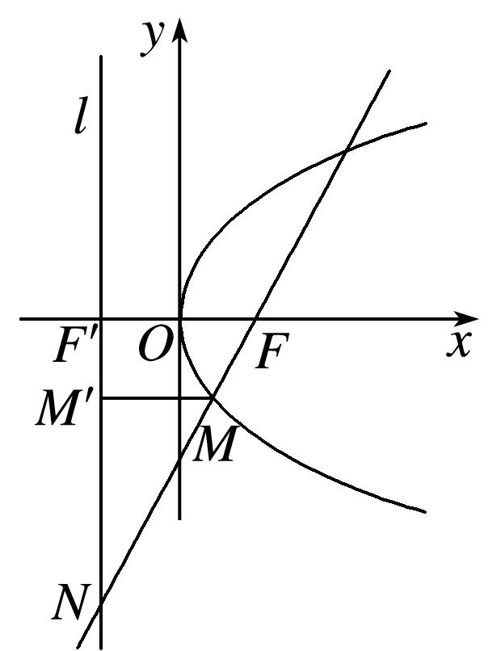

又|*MF*|＝4，∴|*MM*′|＝4，又|*FF*′|＝6，∴＝＝，∴*λ*＝3．故选D．

53．已知抛物线<em>y</em>2＝2<em>px</em>(<em>p</em>＞0)过点<em>A</em>，其准线与<em>x</em>轴交于点<em>B</em>，直线<em>AB</em>与抛物线的另一个交点为

*M*，若＝*λ*，则实数*λ*为(　　)

A．　　　　　　　　B．　　　　　　　　C．2　　　　　　　　D．3

53．<strong>答案</strong>　C　<strong>解析</strong>　把点<em>A</em>代入抛物线的方程得2＝2<em>p</em>×，解得<em>p</em>＝2，所以抛物线的方程为<em>y</em>2

＝4<em>x</em>，则<em>B</em>(－1，0)，设<em>M</em>，则＝，＝(－1－，－<em>yM</em>)，由＝<em>λ</em>，得解得<em>λ</em>＝2或<em>λ</em>＝1(舍去)，故选C．

54．如图，过抛物线<em>y</em>2＝4<em>x</em>的焦点<em>F</em>作倾斜角为<em>α</em>的直线<em>l</em>，<em>l</em>与抛物线及其准线从上到下依次交于<em>A</em>、<em>B</em>、

<em>C</em>点，令＝<em>λ</em>1，＝<em>λ</em>2，则当<em>α</em>＝时，<em>λ</em>1＋<em>λ</em>2的值为(　　)

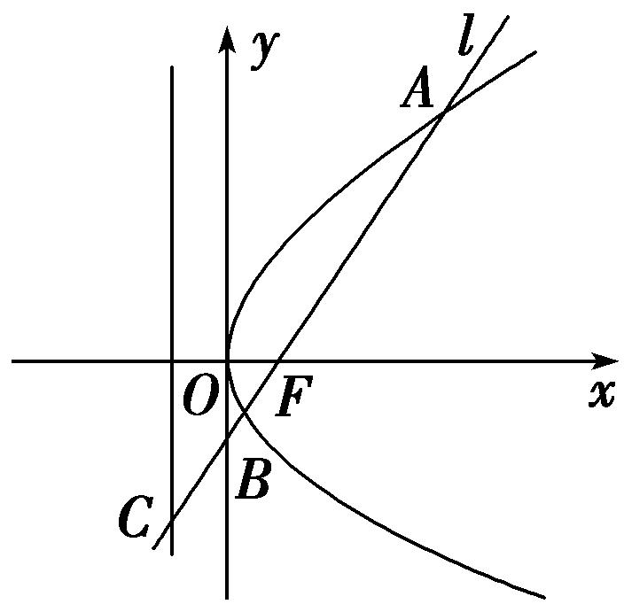

A．4　　　　　　　　B．5　　　　　　　　C．6　　　　　　　　D．8

54．<strong>答案</strong>　B　<strong>解析</strong>　由题意知焦点的坐标为<em>F</em>(1,0)．设<em>A</em>(<em>x</em>1，<em>y</em>1)，<em>B</em>(<em>x</em>2，<em>y</em>2)，当<em>α</em>＝时，直线<em>AB</em>的方程

为<em>y</em>＝<em>x</em>－，与抛物线方程联立得3<em>x</em>2－10<em>x</em>＋3＝0，∴<em>x</em>1＋<em>x</em>2＝，<em>x</em>1<em>x</em>2＝1，解得<em>x</em>1＝3，<em>x</em>2＝，由题图可知，<em>λ</em>1＝＝＝＝3，∵<em>α</em>＝，∴<em>λ</em>2＝＝2，∴<em>λ</em>1＋<em>λ</em>2＝5．故选B．

55．如图所示，抛物线<em>y</em>＝<em>x</em>2，<em>AB</em>为过焦点<em>F</em>的弦，过<em>A</em>，<em>B</em>分别作抛物线的切线，两切线交于点<em>M</em>，设

<em>A</em>(<em>xA</em>，<em>yA</em>)，<em>B</em>(<em>xB</em>，<em>yB</em>)，<em>M</em>(<em>xM</em>，<em>yM</em>)，则：①若<em>AB</em>的斜率为1，则|<em>AB</em>|＝4；②|<em>AB</em>|min＝2；③<em>yM</em>＝－1；④若<em>AB</em>的斜率为1，则<em>xM</em>＝1；⑤<em>xA</em>·<em>xB</em>＝－4．以上结论正确的个数是(　　)

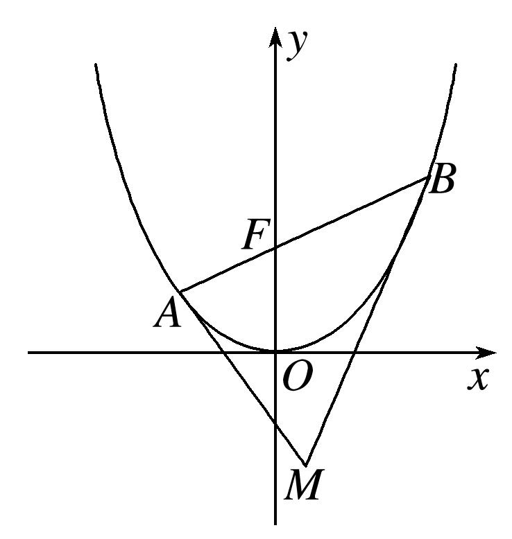

A．1　　　　　　　　B．2　　　　　　　　C．3　　　　　　　　D．4

55．<strong>答案</strong>　B　<strong>解析</strong>　由题意得，焦点<em>F</em>(0,1)，对于①，<em>lAB</em>的方程为<em>y</em>＝<em>x</em>＋1，与抛物线的方程联立，得

消去<em>x</em>，得<em>y</em>2－6<em>y</em>＋1＝0，所以<em>yA</em>＋<em>yB</em>＝6，则|<em>AB</em>|＝<em>yA</em>＋<em>yB</em>＋<em>p</em>＝8，则①错误；对于②，|<em>AB</em>|min＝2<em>p</em>＝4，则②错误；因为<em>y</em>′＝，则<em>lAM</em>：<em>y</em>－<em>yA</em>＝(<em>x</em>－<em>xA</em>)，即<em>y</em>＝<em>xAx</em>－，<em>lBM</em>：<em>y</em>－<em>yB</em>＝(<em>x</em>－<em>xB</em>)，即<em>y</em>＝<em>xBx</em>－，联立<em>lAM</em>与<em>lBM</em>的方程得解得<em>M</em>．设<em>lAB</em>的方程为<em>y</em>＝<em>kx</em>＋1，与抛物线的方程联立，得消去<em>y</em>，得<em>x</em>2－4<em>kx</em>－4＝0，所以<em>xA</em>＋<em>xB</em>＝4<em>k</em>，<em>xA</em>·<em>xB</em>＝－4，所以<em>yM</em>＝－1，③和⑤均正确；对于④，当<em>AB</em>的斜率为1时，<em>xM</em>＝2，则④错误，故选B．

