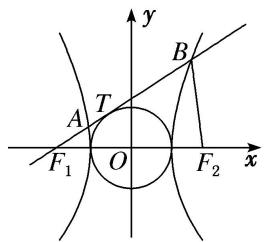
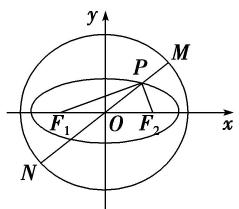

# 专题09 含两种曲线模型

# 【例题选讲】

[例 4] (23)(2019·浙江)已知椭圆 $\frac{x^{2}}{9}+\frac{y^{2}}{5}=1$ 的左焦点为F，点P在椭圆上且在x轴的上方．若线段PF的中点在以原点O为圆心，|OF|为半径的圆上，则直线PF的斜率是\_\_\_\_.

(24)如图，已知 $F_{1}$ ， $F_{2}$ 分别是双曲线 $x^{2} - \frac{y^{2}}{b^{2}} = 1 (b > 0)$ 的左、右焦点，过点 $F_{1}$ 的直线与圆 $x^{2} + y^{2} = 1$ 相切于点 $T$ ，与双曲线的左、右两支分别交于 $A$ ， $B$ ，若 $|F_{2}B| = |AB|$ ，则 $b$ 的值是 \_\_\_\_.

text_image

y
B
A T
F₁ O F₂ x

(25)已知双曲线 $C: \frac{x^2}{a^2} - \frac{y^2}{b^2} = 1 (a > 0, b > 0)$ 的焦距为 $2c$ ，直线 $l$ 过点 $\left[ \begin{array}{cc} 2 & 0 \\ 3 & 0 \end{array} \right]$ 且与双曲线 $C$ 的一条渐近线垂直，以双曲线 $C$ 的右焦点为圆心，半焦距为半径的圆与直线 $l$ 交于 $M$ ， $N$ 两点，若 $|MN| = \frac{4\sqrt{2}}{3} c$ ，则双曲线 $C$ 的渐近线方程为（）

A. $y=\pm\sqrt{2}x$

B. $y=\pm\sqrt{3}x$

C. $y=\pm2x$

D. $y=\pm4x$

(26)已知 F 为抛物线 $y^{2}=4\sqrt{3}x$ 的焦点，过点 F 的直线交抛物线于 A, B 两点(点 A 在第一象限)，若 $\overrightarrow{AF}=3\overrightarrow{FB}$ ，则以 AB 为直径的圆的标准方程为()

A. $\left(x-\frac{5\sqrt{3}}{3}\right)^{2}+(y-2)^{2}=\frac{64}{3}$

B. $(x - 2)^{2} + (y - 2\sqrt{3})^{2} = \frac{64}{3}$

C. $(x - 5\sqrt{3})^2 +(y - 2)^2 = 64$

D. $(x - 2\sqrt{3})^2 +(y - 2)^2 = 64$

(27)已知曲线 $C_1$ 是以原点 $O$ 为中心， $F_1$ ， $F_2$ 为焦点的椭圆，曲线 $C_2$ 是以 $O$ 为顶点、 $F_2$ 为焦点的抛物线， $A$ 是曲线 $C_1$ 与 $C_2$ 的交点，且 $\angle AF_2F_1$ 为钝角，若 $|AF_1| = \frac{7}{2}$ ， $|AF_2| = \frac{5}{2}$ ，则 $\triangle AF_1F_2$ 的面积是（）

A. $\sqrt{3}$

B. 2

C. $\sqrt{6}$

D. 4

(28)(2017·山东)在平面直角坐标系 $xOy$ 中，双曲线 $\frac{x^2}{a^2} -\frac{y^2}{b^2} = 1(a > 0,b > 0)$ 的右支与焦点为 $F$ 的抛物线 $x^{2}$ $= 2py(p > 0)$ 交于 $A$ ， $B$ 两点．若 $|AF| + |BF| = 4|OF|$ ，则该双曲线的渐近线方程为

# 【对点训练】

56. 如图，椭圆 $C: \frac{x^2}{a^2} + \frac{y^2}{4} = 1 (a > 2)$ ，圆 $O: x^2 + y^2 = a^2 + 4$ ，椭圆 $C$ 的左、右焦点分别为 $F_1, F_2$ ，过椭圆上一点 $P$ 和原点 $O$ 作直线 $l$ 交圆 $O$ 于 $M, N$ 两点，若 $|PF_1| \cdot |PF_2| = 6$ ，则 $|PM| \cdot |PN|$ 的值为 \_\_\_\_.

text_image

y
P
M
F₁ O F₂ x
N

57. 已知双曲线 $\frac{x^2}{a^2} - \frac{y^2}{b^2} = 1 (a > 0, b > 0)$ 的左、右焦点分别为 $F_1, F_2$ ，过 $F_1$ 作圆 $x^2 + y^2 = a^2$ 的切线，交双曲线右支于点 $M$ ，若 $\angle F_1MF_2 = 45^\circ$ ，则双曲线的渐近线方程为（）

A. $y=\pm\sqrt{2}x$

B. $y=\pm\sqrt{3}x$

C. $y=\pm x$

D. $y=\pm2x$

58. 已知双曲线 $\frac{x^2}{9} - \frac{y^2}{b^2} = 1 (b > 0)$ 的左顶点为 $A$ ，虚轴长为 8，右焦点为 $F$ ，且 $\odot F$ 与双曲线的渐近线相切，若过点 $A$ 作 $\odot F$ 的两条切线，切点分别为 $M, N$ ，则 $|MN| =$ \_\_\_\_.

59. 已知双曲线 $\frac{y^2}{25} - \frac{x^2}{144} = 1$ ，过双曲线的上焦点 $F_1$ 作圆 $O: x^2 + y^2 = 25$ 的一条切线，切点为 $M$ ，交双曲线的下支于点 $N$ ， $T$ 为 $NF_1$ 的中点，则 $\triangle MOT$ 的外接圆的周长为 \_\_\_\_.

60. 以抛物线 $C: y^{2} = 2px (p > 0)$ 的顶点为圆心的圆交 $C$ 于 $A, B$ 两点，交 $C$ 的准线于 $D, E$ 两点．已知 $|AB| = 2\sqrt{6}, |DE| = 2\sqrt{10}$ ，则 $p$ 等于 \_\_\_\_.

61. 已知抛物线 $y^{2} = 4x$ ，圆 $F: (x - 1)^{2} + y^{2} = 1$ ，直线 $y = k(x - 1) (k \neq 0)$ 自上而下顺次与上述两曲线交于点 $A$ ， $B, C, D$ ，则 $|AB| \cdot |CD|$ 的值是 \_\_\_\_.

62. 已知曲线 $G: y = \sqrt{-x^2 + 16x - 15}$ 及点 $A\left(\frac{1}{2}, 0\right)$ ，若曲线 $G$ 上存在相异两点 $B, C$ ，其到直线 $l: 2x + 1 = 0$ 的距离分别为 $|AB|$ 和 $|AC|$ ，则 $|AB| + |AC| =$ \_\_\_\_.

63. 已知 $F$ 为抛物线 $C: x^{2} = 2py(p > 0)$ 的焦点，曲线 $C_{1}$ 是以 $F$ 为圆心， $\frac{p}{4}$ 为半径的圆，直线 $2\sqrt{3}x - 6y + 3p = 0$ 与曲线 $C, C_{1}$ 从左至右依次相交于 $P, Q, R, S$ ，则 $\frac{|RS|}{|PQ|} =$ \_\_\_\_.

64. 已知抛物线 $C: y^{2} = 2px (p > 0)$ 的焦点为 $F$ , 过点 $F$ 的直线 $l$ 与抛物线 $C$ 交于 $A, B$ 两点, 且直线 $l$ 与圆 $x^{2} - px + y^{2} - \frac{3}{4} p^{2} = 0$ 交于 $C, D$ 两点, 若 $|AB| = 3|CD|$ , 则直线 $l$ 的斜率为 \_\_\_\_.

65. (2016·全国I)以抛物线 C 的顶点为圆心的圆交 C 于 A, B 两点，交 C 的准线于 D, E 两点．已知 $\left|AB\right|=4\sqrt{2}$ ， $\left|DE\right|=2\sqrt{5}$ ，则 C 的焦点到准线的距离为()

A. 2

B. 4

C. 6

D. 8

66. 已知抛物线 $C: y^{2} = 2px (p > 0)$ 的焦点为 $F$ ，点 $M(x_{0}, 2\sqrt{2})$ 是抛物线 $C$ 上一点，圆 $M$ 与线段 $MF$ 相交于点 $A$ ，且被直线 $x = \frac{p}{2}$ 截得的弦长为 $\sqrt{3}|MA|$ ，若 $\frac{|MA|}{|AF|} = 2$ ，则 $|AF| = (\quad)$

A. $\frac{3}{2}$

B. 1

C. 2

D. 3

67. 已知椭圆 $C_1$ 与双曲线 $C_2$ 有相同的左右焦点 $F_1, F_2, P$ 为椭圆 $C_1$ 与双曲线 $C_2$ 在第一象限内的一个公共点，设椭圆 $C_1$ 与双曲线 $C_2$ 的离心率分别为 $e_1, e_2$ ，且 $\frac{e_1}{e_2} = \frac{1}{3}$ ，若 $\angle F_1PF_2 = \frac{\pi}{3}$ ，则双曲线 $C_2$ 的渐近线方程为（）

A. $x \pm y = 0$

B. $x \pm \frac{\sqrt{3}}{3}y = 0$

C. $x \pm \frac{\sqrt{2}}{2}y = 0$

D. $x \pm 2y = 0$

68. 已知双曲线 $\frac{x^2}{3} - y^2 = 1$ 的右焦点是抛物线 $y^2 = 2px (p > 0)$ 的焦点，直线 $y = kx + m$ 与抛物线相交于 $A, B$ 两个不同的点，点 $M(2, 2)$ 是 $AB$ 的中点，则 $\triangle AOB(O$ 为坐标原点)的面积是（）

A. $4 \sqrt{3}$

B. $3\sqrt{13}$

C. $\sqrt{14}$

D. $2\sqrt{3}$

69. 设椭圆 $C_{2}$ : $\frac{x^{2}}{a^{2}} + \frac{y^{2}}{b^{2}} = 1 (a > b > 0)$ 的左、右焦点为 $F_{1}, F_{2}$ , 离心率为 $e = \frac{1}{2}$ , 抛物线 $C_{1}: y^{2} = -4mx (m > 0)$ 的准线经过椭圆的右焦点, 抛物线 $C_{1}$ 与椭圆 $C_{2}$ 交于 $x$ 轴上方一点 $P$ , 若 $\triangle PF_{1}F_{2}$ 的三边长恰好是三个连续的自然数, 则 $a$ 的值为 \_\_\_\_.

70. 已知双曲线 $M$ 的焦点 $F_{1}$ ， $F_{2}$ 在 $x$ 轴上，直线 $\sqrt{7} x + 3y = 0$ 是双曲线 $M$ 的一条渐近线，点 $P$ 在双曲线 $M$ 上，且 $\overrightarrow{PF_1} \cdot \overrightarrow{PF_2} = 0$ ，如果抛物线 $y^{2} = 16x$ 的准线经过双曲线 $M$ 的一个焦点，那么 $|\overrightarrow{PF_1}| \cdot |\overrightarrow{PF_2}| = (\quad)$

A. 21

B. 14

C. 7

D. 0

71. 已知抛物线 $C_{1}: y^{2} = 8ax (a > 0)$ , 直线 $l$ 的倾斜角是 $45^{\circ}$ 且过抛物线 $C_{1}$ 的焦点, 直线 $l$ 被抛物线 $C_{1}$ 截得的线段长是 16, 双曲线 $C_{2}: \frac{x^{2}}{a^{2}} - \frac{y^{2}}{b^{2}} = 1 (a > 0, b > 0)$ 的一个焦点在抛物线 $C_{1}$ 的准线上, 则直线 $l$ 与 $y$ 轴的交点 $P$ 到双曲线 $C_{2}$ 的一条渐近线的距离是( )

A. 2

B. $\sqrt{3}$

C. $\sqrt{2}$

D. 1

72. 已知双曲线 $\frac{x^2}{a^2} - \frac{y^2}{b^2} = 1 (a > 0, b > 0)$ 的两条渐近线与抛物线 $y^2 = 2px (p > 0)$ 的准线分别交于 $A, B$ 两点， $O$ 为坐标原点，若双曲线的离心率为 2， $\triangle ABO$ 的面积为 $2\sqrt{3}$ ，则抛物线的焦点为（）

A. $\left(\frac{1}{2},0\right)$

B. $\left(\frac{\sqrt{2}}{2},0\right)$

C. $(1, 0)$

D. $(\sqrt{2}, 0)$

73. 若双曲线 $\frac{y^2}{a^2} - \frac{x^2}{b^2} = 1 (a > 0, b > 0)$ 的渐近线与抛物线 $y = x^2 + 1$ 相切，且被圆 $x^2 + (y - a)^2 = 1$ 截得的弦长为 $\sqrt{2}$ ，则 $a = (\quad)$

A. $\frac{\sqrt{5}}{2}$

B. $\frac{\sqrt{10}}{2}$

C. $\sqrt{5}$

D. $\sqrt{10}$

74. 抛物线 $C_1: y = \frac{1}{2p} x^2 (p > 0)$ 的焦点与双曲线 $C_2: \frac{x^2}{3} - y^2 = 1$ 的右焦点的连线交 $C_1$ 于第一象限的点 $M$ . 若 $C_1$ 在点 $M$ 处的切线平行于 $C_2$ 的一条渐近线, 则 $p$ 等于( )

A. $\frac{\sqrt{3}}{16}$

B. $\frac{\sqrt{3}}{8}$

C. $\frac{2\sqrt{3}}{3}$

D. $\frac{4\sqrt{3}}{3}$

