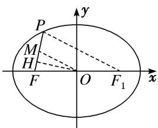
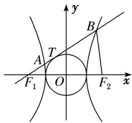
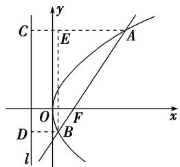
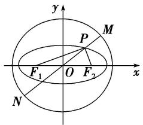
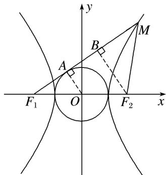
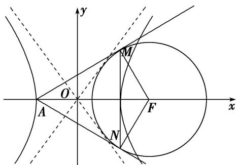
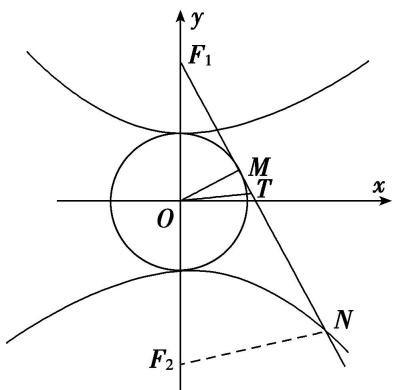
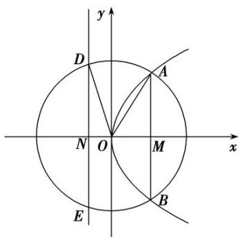
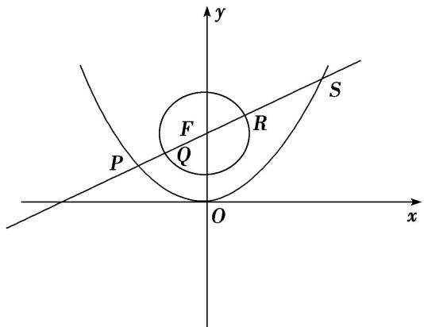
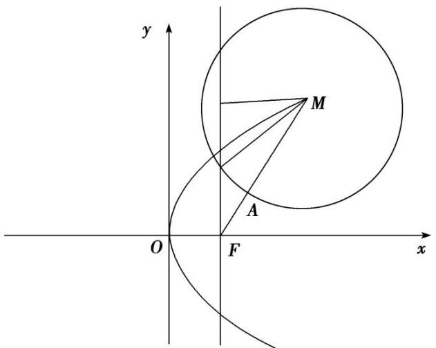

# 专题09 含两种曲线模型

# 【例题选讲】

[例 4] （23）(2019·浙江)已知椭圆 $\frac{x^{2}}{9}+\frac{y^{2}}{5}=1$ 的左焦点为 F，点 P 在椭圆上且在 x 轴的上方．若线段 PF 的中点在以原点 O 为圆心， $|OF|$ 为半径的圆上，则直线 PF 的斜率是 \_\_\_\_．
答案 $\sqrt{15}$ 解析 法一：依题意，设点 $P(m, n)(n > 0)$ ，由题意知 $F(-2, 0)$ ，所以线段 $FP$ 的中点 $M\left[\frac{-2 + m}{2}, \frac{n}{2}\right]$ 在圆 $x^{2} + y^{2} = 4$ 上，所以 $\left[\frac{-2 + m}{2}\right]^{2} + \left[\frac{n}{2}\right]^{2} = 4$ ，①．又点 $P(m, n)$ 在椭圆 $\frac{x^2}{9} + \frac{y^2}{5} = 1$ 上，所以 $\frac{m^2}{9} + \frac{n^2}{5} = 1$ ，②．联立①②，消去 $n$ ，得 $4m^2 - 36m - 63 = 0$ ，所以 $m = -\frac{3}{2}$ 或 $m = \frac{21}{2}$ （舍去）， $n = \frac{\sqrt{15}}{2}$ ，所以 $k_{PF} = \frac{\frac{\sqrt{15}}{2} - 0}{-\frac{3}{2} - (-2)} = \sqrt{15}$ .

法二：如图，取 PF 的中点 M，连接 OM，由题意知 $|OM|=|OF|=2$ ，设椭圆的右焦点为 $F_{1}$ ，连接 $PF_{1}$ ，在 $\triangle PFF_{1}$ 中，OM 为中位线，所以 $|PF_{1}|=4$ ，由椭圆的定义知 $|PF|+|PF_{1}|=6$ ，所以 $|PF|=2$ 。因为 M 为 PF 的中点，所以 $|MF|=1$ 。在等腰三角形 OMF 中，过 O 作 $OH\perp MF$ 于点 H，所以 $|OH|=\sqrt{2^{2}-\left(\frac{1}{2}\right)^{2}}=\frac{\sqrt{15}}{2}$ ，
所以 $k_{PF}=\tan\angle HFO=\frac{\frac{\sqrt{15}}{2}}{\frac{1}{2}}=\sqrt{15}.$  
（24）如图，已知 $F_{1}$ ， $F_{2}$ 分别是双曲线 $x^{2} - \frac{y^{2}}{b^{2}} = 1 (b > 0)$ 的左、右焦点，过点 $F_{1}$ 的直线与圆 $x^{2} + y^{2} = 1$ 相切于点 $T$ ，与双曲线的左、右两支分别交于 $A$ ， $B$ ，若 $|F_{2}B| = |AB|$ ，则 $b$ 的值是 \_\_\_\_.

答案 $1 + \sqrt{3}$ 解析法一：因为 $|F_{2}B| = |AB|$ ，所以结合双曲线的定义，得 $|AF_{1}| = |BF_{1}| - |AB| = |BF_{1}| - |BF_{2}| = 2$ ，连接 $OT$ ，在 $\mathrm{Rt}\triangle OTF_{1}$ 中， $|OT| = 1$ ， $|OF_{1}| = c$ ， $|TF_{1}| = b$ ，所以 $\cos \angle F_{2}F_{1}A = \frac{b}{c}$ ， $\sin \angle F_{2}F_{1}A = \frac{1}{c}$ ，所以 $A\left(-c + 2\times \frac{b}{c}, 2\times \frac{1}{c}\right)$ ，将点 $A$ 的坐标代入双曲线得 $\frac{(-c^2 + 2b)^2}{c^2} - \frac{4}{c^2b^2} = 1$ ，化简得 $b^6 - 4b^5 + 5b^4 - 4b^3 - 4 = 0$ ，得 $(b^2 - 2b - 2)(b^4 - 2b^3 + 3b^2 - 2b + 2) = 0$ ，而 $b^4 - 2b^3 + 3b^2 - 2b + 2 = b^2(b - 1)^2 + b^2 + 1 + (b - 1)^2 > 0$ 故 $b^{2}-2b-2=0$ ，解得 $b=1\pm\sqrt{3}$ （负值舍去），即 $b=1+\sqrt{3}$ .

法二：因为 $|F_{2}B|=|AB|$ ，所以结合双曲线的定义，得 $|AF_{1}|=|BF_{1}|-|AB|=|BF_{1}|-|BF_{2}|=2$ ，连接 $AF_{2}$ ，则 $|AF_{2}|=2+|AF_{1}|=4$ 。连接OT，在Rt△ $OTF_{1}$ 中， $|OT|=1$ ， $|OF_{1}|=c$ ， $|TF_{1}|=b$ ，所以 $\cos\angle F_{2}F_{1}A=\frac{b}{c}$ 。在△ $AF_{1}F_{2}$ 中，由余弦定理得， $\cos\angle F_{2}F_{1}A=\frac{|F_{1}F_{2}|^{2}+|AF_{1}|^{2}-|AF_{2}|^{2}}{2|F_{1}F_{2}|\cdot|AF_{1}|}=\frac{c^{2}-3}{2c}$ ，所以 $c^{2}-3=2b$ ，又在双曲线中， $c^{2}=1+b^{2}$ ，所以 $b^{2}-2b-2=0$ ，解得 $b=1\pm\sqrt{3}$ （负值舍去），即 $b=1+\sqrt{3}$ 。  
（25）已知双曲线 $C: \frac{x^2}{a^2} - \frac{y^2}{b^2} = 1 (a > 0, b > 0)$ 的焦距为 $2c$ ，直线 $l$ 过点 $\left\{ \begin{array}{l} \frac{2}{3} a, 0 \end{array} \right.$ 且与双曲线 $C$ 的一条渐近线垂直，以双曲线 $C$ 的右焦点为圆心，半焦距为半径的圆与直线 $l$ 交于 $M$ ， $N$ 两点，若 $|MN| = \frac{4\sqrt{2}}{3} c$ ，则双曲线 $C$ 的渐近线方程为（）

A. $y=\pm\sqrt{2}x$

B. $y=\pm\sqrt{3}x$

C. $y=\pm2x$

D. $y=\pm4x$
答案 B 解析 方法一 由题意可设渐近线方程为 $y = \frac{b}{a} x$ ，则直线 $l$ 的斜率 $k_{l} = -\frac{a}{b}$ ，直线 $l$ 的方程为 $y = -\frac{a}{b}\left(x - \frac{2}{3} a\right)$ ，整理可得 $ax + by - \frac{2}{3} a^{2} = 0$ 。焦点 $(c, 0)$ 到直线 $l$ 的距离 $d = \frac{\left|ac - \frac{2}{3} a^{2}\right|}{\sqrt{a^{2} + b^{2}}} = \frac{\left|ac - \frac{2}{3} a^{2}\right|}{c}$ ，则弦长为 $2\sqrt{c^2 - d^2} = 2\sqrt{c^2 - \frac{(ac - \frac{2}{3} a^2)^2}{c^2}} = \frac{4\sqrt{2}}{3} c$ ，整理可得 $c^4 - 9a^2c^2 + 12a^3c - 4a^4 = 0$ ，即 $e^4 - 9e^2 + 12e - 4 = 0$ ，分解因式得 $(e - 1)(e - 2)(e^2 + 3e - 2) = 0$ 。又双曲线的离心率 $e > 1$ ，则 $e = \frac{c}{a} = 2$ ，所以 $\frac{b}{a} = \sqrt{\frac{c^2 - a^2}{a^2}} = \sqrt{\left(\frac{c}{a}\right)^2 - 1} = \sqrt{3}$ ，所以双曲线 $C$ 的渐近线方程为 $y = \pm \sqrt{3} x$ 。
方法二 圆心到直线 l 的距离为 $\sqrt{c^{2}-\left(\frac{2\sqrt{2}}{3}c\right)^{2}}=\frac{c}{3},\therefore\frac{\left|ac-\frac{2}{3}a^{2}\right|}{c}=\frac{c}{3},\therefore c^{2}-3ac+2a^{2}=0,\therefore c=2a,$ $b=\sqrt{3}a,\therefore$ 渐近线方程为 $y=\pm\sqrt{3}x.$  
（26）已知 F 为抛物线 $y^{2}=4\sqrt{3}x$ 的焦点，过点 F 的直线交抛物线于 A, B 两点(点 A 在第一象限)，若 $\overrightarrow{AF}=3\overrightarrow{FB}$ ，则以 AB 为直径的圆的标准方程为()

A. $\left(x-\frac{5\sqrt{3}}{3}\right)^{2}+(y-2)^{2}=\frac{64}{3}$

B. $(x - 2)^{2} + (y - 2\sqrt{3})^{2} = \frac{64}{3}$

C. $(x - 5\sqrt{3})^2 +(y - 2)^2 = 64$

D. $(x - 2\sqrt{3})^2 +(y - 2)^2 = 64$
答案 A 解析 如图，作出抛物线的准线 $l: x = -\sqrt{3}$ ，设 $A$ 、 $B$ 在 $l$ 上的射影分别是 $C$ 、 $D$ ，

连接 $AC$ 、 $BD$ ，过 $B$ 作 $BE \perp AC$ 于 $E$ 。\$\because \overrightarrow{AF} = 3\overrightarrow{FB}\$，\$\therefore\$ 设 $|AF| = 3m$ ， $|BF| = m$ ，\$\because\$ 点 $A$ 、 $B$ 在抛物线上，\$\therefore |AC| = 3m\$, $|BD| = m$ 。因此，在 Rt△ABE 中， $|AB| = 4m$ ， $|AE| = 2m$ ，\$\therefore \cos \angle BAE = \frac{1}{2}\$，\$\therefore \angle BAE = 60^\circ\$, \$\therefore\$ 直线 $AB$ 的倾斜角为 $60^\circ$ ，即直线 $AB$ 的斜率 \$k = \tan 60^\circ = \sqrt{3}\$，\$\therefore\$ 直线 $AB$ 的方程为 \$y = \sqrt{3}(x - \sqrt{3})\$，代入抛物线方程得 \$3x^2 - 10\sqrt{3}x + 9 = 0\$。 $\therefore x_A + x_B = \frac{10\sqrt{3}}{3}$ ， $x_A \cdot x_B = 3$ 。 $\therefore y_A + y_B = \sqrt{3}(x_A - \sqrt{3}) + \sqrt{3}(x_B - \sqrt{3}) = 4$ ， $|AB| = x_A + x_B + p = \frac{16}{\sqrt{3}}$ ，\$\therefore AB\$ 中点的坐标为 \$\left(\frac{x\_A + x\_B}{2}, \frac{y\_A + y\_B}{2}\right)\$，即 \$\left(\frac{5\sqrt{3}}{3}, 2\right)\$。则以 $AB$ 为直径的圆的标准方程为 \$\left(x - \frac{5\sqrt{3}}{3}\right)^2 + (y - 2)^2 = \frac{64}{3}\$。故选 A。  
（27）已知曲线 $C_{1}$ 是以原点 O 为中心， $F_{1}$ ， $F_{2}$ 为焦点的椭圆，曲线 $C_{2}$ 是以 O 为顶点、 $F_{2}$ 为焦点的抛物线，A 是曲线 $C_{1}$ 与 $C_{2}$ 的交点，且 $\angle AF_{2}F_{1}$ 为钝角，若 $|AF_{1}|=\frac{7}{2}$ ， $|AF_{2}|=\frac{5}{2}$ ，则 $\triangle AF_{1}F_{2}$ 的面积是（）

A. $\sqrt{3}$

B. 2

C. $\sqrt{6}$

D. 4
答案 C 解析 画出图形如图所示， $AD \perp F_{1}D$ ，根据抛物线的定义可知 $\left|AF_{2}\right| = \left|AD\right| = \frac{5}{2}$ ，故 $\cos \angle F_{1}AD = \frac{5}{7}$ ，也即 $\cos \angle AF_{1}F_{2} = \frac{5}{7}$ ，在 $\triangle AF_{1}F_{2}$ 中，由余弦定理得 $\frac{5}{7} = \frac{\frac{49}{4} + \left|F_{1}F_{2}\right|^{2} - \frac{25}{4}}{2 \times \frac{7}{2} \times \left|F_{1}F_{2}\right|}$ ，解得 $\left|F_{1}F_{2}\right| = 2$ 或 $\left|F_{1}F_{2}\right| = 3$ ，由于 $\angle AF_{2}F_{1}$ 为钝角，故 $|AD| > \left|F_{1}F_{2}\right|$ ，所以 $\left|F_{1}F_{2}\right| = 3$ 舍去，故 $\left|F_{1}F_{2}\right| = 2$ 。而 $\sin \angle AF_{1}F_{2} = \sqrt{1 - \left(\frac{5}{7}\right)^{2}} = \frac{2\sqrt{6}}{7}$ ，所以 $S\triangle AF1F2 = \frac{1}{2} \times \frac{7}{2} \times 2 \times \frac{2\sqrt{6}}{7} = \sqrt{6}$ 。故选 C.  
（28）(2017·山东)在平面直角坐标系 $xOy$ 中，双曲线 $\frac{x^2}{a^2} -\frac{y^2}{b^2} = 1(a > 0,b > 0)$ 的右支与焦点为 $F$ 的抛物线 $x^{2}$ $= 2py(p > 0)$ 交于 $A$ ， $B$ 两点．若 $|AF| + |BF| = 4|OF|$ ，则该双曲线的渐近线方程为
答案 $y = \pm \frac{\sqrt{2}}{2} x$ 解析 法一 设 $A(x_{A},y_{A}),B(x_{B},y_{B})$ ，由抛物线定义可得 $|AF| + |BF| = y_{A} + \frac{p}{2} +y_{B} + \frac{p}{2} = 4\times \frac{p}{2}\Rightarrow y_{A} + y_{B} = p$ ，由 $\left\{ \begin{array}{l} \frac{x^2}{a^2} -\frac{y^2}{b^2} = 1,\\ x^2 = 2py \end{array} \right.$ 可得 $a^{2}y^{2} - 2pb^{2}y + a^{2}b^{2} = 0$ ，所以 $y_{A} + y_{B} = \frac{2pb^{2}}{a^{2}} = p$ ，解得 $a = \sqrt{2} b$ ，故该双曲线的渐近线方程为 $y = \pm \frac{\sqrt{2}}{2} x$ .

法二 (点差法)设 $A(x_{1},y_{1}),B(x_{2},y_{2})$ ，由抛物线的定义可知 $\vert AF\vert = y_1 + \frac{p}{2},\vert BF\vert = y_2 + \frac{p}{2},\vert OF\vert = \frac{p}{2}$ ，由 $\vert AF\vert$ $+|BF| = y_1 + \frac{p}{2} +y_2 + \frac{p}{2} = y_1 + y_2 + p = 4\vert OF\vert = 2p$ ，得 $y_{1} + y_{2} = p$ .易知直线 $AB$ 的斜率 $k_{AB} = \frac{y_2 - y_1}{x_2 - x_1} = \frac{\frac{x_2^2 - x_1^2}{2p} - 2p}{x_2 - x_1} =$ $\frac{x_2 + x_1}{2p}$ .由 $\left\{ \begin{array}{l}\frac{x_1^2}{a^2} -\frac{y_1^2}{b^2} = 1,\\ \frac{x_2^2}{a^2} -\frac{y_2^2}{b^2} = 1, \end{array} \right.$ 得 $k_{AB} = \frac{y_2 - y_1}{x_2 - x_1} = \frac{b^2(x_1 + x_2)}{a^2(y_1 + y_2)} = \frac{b^2}{a^2}\cdot \frac{x_1 + x_2}{p}$ 则 $\frac{b^2}{a^2}\cdot \frac{x_1 + x_2}{p} = \frac{x_2 + x_1}{2p}$ 所以 $\frac{b^2}{a^2} = \frac{1}{2}\Rightarrow \frac{b}{a} = \frac{\sqrt{2}}{2},$
所以双曲线的渐近线方程为 $y=\pm\frac{\sqrt{2}}{2}x$ .

# 【对点训练】

56. 如图，椭圆 $C: \frac{x^2}{a^2} + \frac{y^2}{4} = 1 (a > 2)$ ，圆 $O: x^2 + y^2 = a^2 + 4$ ，椭圆 $C$ 的左、右焦点分别为 $F_1, F_2$ ，过椭圆上一点 $P$ 和原点 $O$ 作直线 $l$ 交圆 $O$ 于 $M, N$ 两点，若 $|PF_1| \cdot |PF_2| = 6$ ，则 $|PM| \cdot |PN|$ 的值为 \_\_\_\_.

56. 答案 6 解析 由已知 $|PM|\cdot|PN|=(R-|OP|)(R+|OP|)=R^{2}-|OP|^{2}=a^{2}+4-|OP|^{2},\quad|OP|^{2}=|\overrightarrow{OP}|^{2}=\frac{1}{4}(\overrightarrow{PF_{1}}+ \overrightarrow{PF_{2}})^{2}=\frac{1}{4}(|\overrightarrow{PF_{1}}|^{2}+|\overrightarrow{PF_{2}}|^{2}+2|\overrightarrow{PF_{1}}||\overrightarrow{PF_{2}}|\cos\angle F_{1}PF_{2})=\frac{1}{2}(|\overrightarrow{PF_{1}}|^{2}+|\overrightarrow{PF_{2}}|^{2})-\frac{1}{4}(|\overrightarrow{PF_{1}}|^{2}+|\overrightarrow{PF_{2}}|^{2}-2|\overrightarrow{PF_{1}}||\overrightarrow{PF_{2}}|\cos\angle F_{1}PF_{2})=\frac{1}{2}[(2a)^{2}-2|PF_{1}||PF_{2}|]-\frac{1}{4}\times(2c)^{2}=a^{2}-2$ ，所以 $|PM|\cdot|PN|=(a^{2}+4)-(a^{2}-2)=6$ .

57. 已知双曲线 $\frac{x^2}{a^2} - \frac{y^2}{b^2} = 1 (a > 0, b > 0)$ 的左、右焦点分别为 $F_1, F_2$ ，过 $F_1$ 作圆 $x^2 + y^2 = a^2$ 的切线，交双曲线右支于点 $M$ ，若 $\angle F_1MF_2 = 45^\circ$ ，则双曲线的渐近线方程为（）

A. $y=\pm\sqrt{2}x$

B. $y=\pm\sqrt{3}x$

C. $y=\pm x$

D. $y=\pm2x$

57. 答案 A 解析 如图，作 $OA \perp F_{1}M$ 于点 A， $F_{2}B \perp F_{1}M$ 于点 B.

因为 $F_{1}M$ 与圆 $x^{2}+y^{2}=a^{2}$ 相切， $\angle F_{1}MF_{2}=45^{\circ}$ ，所以 $|OA|=a,\quad|F_{2}B|=|BM|=2a,\quad|F_{2}M|=2\sqrt{2}a,\quad|F_{1}B|=2b$ 。又点 M 在双曲线上，所以 $|F_{1}M|-|F_{2}M|=2a+2b-2\sqrt{2}a=2a$ 。整理，得 $b=\sqrt{2}a$ 。所以 $\frac{b}{a}=\sqrt{2}$ 。所以双曲线的渐近线方程为 $y=\pm\sqrt{2}x$ 。故选 A。

58. 已知双曲线 $\frac{x^2}{9} - \frac{y^2}{b^2} = 1 (b > 0)$ 的左顶点为 $A$ ，虚轴长为 8，右焦点为 $F$ ，且 $\odot F$ 与双曲线的渐近线相切，若过点 $A$ 作 $\odot F$ 的两条切线，切点分别为 $M, N$ ，则 $|MN| =$ \_\_\_\_.

58. 答案 $4\sqrt{3}$ 解析 如图所示. $\because$ 双曲线 $\frac{x^2}{9} - \frac{y^2}{b^2} = 1 (b > 0)$ 的左顶点为 $A$ , 虚轴长为 $8$ , $\therefore a^2 = 9, 2b = 8$ , $\therefore a = 3, b = 4$ , $\therefore$ 双曲线的渐近线方程为 $y = \pm \frac{4}{3} x$ , 即 $4x \pm 3y = 0$ , $c^2 = a^2 + b^2 = 25$ , 即 $c = 5$ , $\therefore F(5, 0)$ . $\because \odot F$ 与双曲线的渐近线相切, $\therefore \odot F$ 的半径 $r = \frac{|4 \times 5 + 0|}{\sqrt{16 + 9}} = 4$ , $\therefore |MF| = 4$ , $\because |AF| = a + c = 5 + 3 =$

8, $\therefore |AM| = \sqrt{8^2 - 4^2} = 4\sqrt{3}$ , $\because S_{\text{四边形 }AMFN} = 2 \times \frac{1}{2} |AM| \cdot |MF| = \frac{1}{2} |AF| \cdot |MN|$ , $\therefore 2 \times 4\sqrt{3} \times 4 = 8 \cdot |MN|$ , 解得 $|MN| = 4\sqrt{3}$ .

59. 已知双曲线 $\frac{y^2}{25} - \frac{x^2}{144} = 1$ ，过双曲线的上焦点 $F_1$ 作圆 $O: x^2 + y^2 = 25$ 的一条切线，切点为 $M$ ，交双曲线的下支于点 $N$ ， $T$ 为 $NF_1$ 的中点，则 $\triangle MOT$ 的外接圆的周长为 \_\_\_\_.  
59. 答案 $\frac{37}{7}\pi$ 解析 如图， $\because F_1M$ 为圆的切线， $\therefore OM \perp F_1M$ ，在直角三角形 $OMF_1$ 中， $|OM| = 5$ . 设双曲线的下焦点为 $F_2$ ，连接 $NF_2$ ， $\therefore OT$ 为 $\triangle F_1F_2N$ 的中位线， $\therefore 2|OT| = |NF_2|$ . 设 $|OT| = x$ ，则 $|NF_2| = 2x$ ，又 $|NF_1| - |NF_2| = 10$ ， $\therefore |NF_1| = |NF_2| + 10 = 2x + 10$ ， $\therefore |TF_1| = x + 5$ 。由勾股定理得 $|F_1M|^2 = |OF_1|^2 - |OM|^2 = 13^2 - 5^2 = 144$ ， $|F_1M| = 12$ ， $\therefore |MT| = |x - 7|$ ，在直角三角形 $OMT$ 中， $|OT|^2 - |MT|^2 = |OM|^2$ ，即 $x^2 - (x - 7)^2 = 5^2$ ， $\therefore x = \frac{37}{7}$ 。又 $\triangle OMT$ 是直角三角形，故其外接圆的直径为 $|OT| = \frac{37}{7}$ ， $\therefore \triangle MOT$ 的外接圆的周长为 $\frac{37}{7}\pi$ .

60. 以抛物线 $C: y^{2} = 2px (p > 0)$ 的顶点为圆心的圆交 $C$ 于 $A, B$ 两点，交 $C$ 的准线于 $D, E$ 两点．已知 $|AB| = 2\sqrt{6}, |DE| = 2\sqrt{10}$ ，则 $p$ 等于 \_\_\_\_.  
60. 答案 $\sqrt{2}$ 解析 如图， $|AB| = 2\sqrt{6}$ ， $|AM| = \sqrt{6}$ ， $|DE| = 2\sqrt{10}$ ， $|DN| = \sqrt{10}$ ， $|ON| = \frac{p}{2}$ ， $\therefore x_A = \frac{(\sqrt{6})^2}{2p} = \frac{3}{p}$ ， $\because |OD| = |OA|$ ， $\therefore \sqrt{|ON|^2 + |DN|^2} = \sqrt{|OM|^2 + |AM|^2}$ ， $\therefore \frac{p^2}{4} + 10 = \frac{9}{p^2} + 6$ ，解得： $p = \sqrt{2}$ . (负值舍去)

61. 已知抛物线 $y^{2} = 4x$ ，圆 $F: (x - 1)^{2} + y^{2} = 1$ ，直线 $y = k(x - 1) (k \neq 0)$ 自上而下顺次与上述两曲线交于点 $A$ ， $B, C, D$ ，则 $|AB| \cdot |CD|$ 的值是 \_\_\_\_.  
61. 答案 1 解析 设 $A(x_{1}, y_{1}), D(x_{2}, y_{2})$ ，则 $|AB| \cdot |CD| = (|AF| - 1)(|DF| - 1) = (x_{1} + 1 - 1)(x_{2} + 1 - 1) = x_{1}x_{2}$ ，由 $y = k(x - 1)$ 与 $y^{2} = 4x$ 联立方程消 $y$ 得 $k^{2}x^{2} - (2k^{2} + 4)x + k^{2} = 0$ ， $x_{1}x_{2} = 1$ ，因此 $|AB| \cdot |CD| = 1$ .  
62. 已知曲线 $G: y = \sqrt{-x^2 + 16x - 15}$ 及点 $A\left(\frac{1}{2}, 0\right)$ ，若曲线 $G$ 上存在相异两点 $B, C$ ，其到直线 $l: 2x + 1 = 0$ 的距离分别为 $|AB|$ 和 $|AC|$ ，则 $|AB| + |AC| =$ \_\_\_\_.  
62. 答案 15 解析 曲线 $G: y = \sqrt{-x^2 + 16x - 15}$ , 即为半圆 $M: (x - 8)^2 + y^2 = 49(y \geq 0)$ , 由题意得 $B$ , $C$ 为半圆 $M$ 与抛物线 $y^2 = 2x$ 的两个交点, 由 $y^2 = 2x$ 与 $(x - 8)^2 + y^2 = 49(y \geq 0)$ 联立方程组得 $x^2 - 14x + 15 = 0$ , 方程必有两不等实根, 设 $B(x_1, y_1)$ , $C(x_2, y_2)$ . 所以 $|AB| + |AC| = x_1 + \frac{1}{2} + x_2 + \frac{1}{2} = 14 + 1 = 15$ .  
63. 已知 $F$ 为抛物线 $C: x^{2} = 2py(p > 0)$ 的焦点，曲线 $C_{1}$ 是以 $F$ 为圆心， $\frac{p}{4}$ 为半径的圆，直线 $2\sqrt{3}x - 6y + 3p = 0$ 与曲线 $C, C_{1}$ 从左至右依次相交于 $P, Q, R, S$ ，则 $\frac{|RS|}{|PQ|} =$ \_\_\_\_.  
63. 答案 $\frac{21}{5}$ 可得直线 $2\sqrt{3} x - 6y + 3p = 0$ 与 $y$ 轴交点是抛物线 $C: x^2 = 2py (p > 0)$ 的焦点 $F$ , 由
$\left\{ \begin{array}{l} 2 \sqrt {3} x - 6 y + 3 p = 0 \\ x ^ {2} = 2 p y \end{array} \right. \text {得} x ^ {2} - \frac {2 \sqrt {3}}{3} p x - p ^ {2} = 0, \Rightarrow x _ {P} = - \frac {\sqrt {3}}{3} p, x _ {S} = \sqrt {3} p \Rightarrow y _ {P} = \frac {1}{6} p, y _ {S} = \frac {3}{2} p, | R S | = | S F | - \frac {p}{4} =$
$y _ {S} + \frac {p}{2} - \frac {p}{4} = \frac {7}{4} p, | P Q | = | P F | - \frac {p}{4} = y _ {P} + \frac {p}{2} - \frac {p}{4} = \frac {5}{1 2} p. \therefore \text {则} \frac {| R S |}{| P Q |} = \frac {2 1}{5}.$

64. 已知抛物线 $C: y^{2} = 2px (p > 0)$ 的焦点为 $F$ , 过点 $F$ 的直线 $l$ 与抛物线 $C$ 交于 $A, B$ 两点, 且直线 $l$ 与圆 $x^{2} - px + y^{2} - \frac{3}{4} p^{2} = 0$ 交于 $C, D$ 两点, 若 $|AB| = 3|CD|$ , 则直线 $l$ 的斜率为 \_\_\_\_.

64. 答案 $\pm \frac{\sqrt{2}}{2}$ 解析 由题意得 $F\left(\frac{p}{2}, 0\right)$ ，由 $x^{2} - px + y^{2} - \frac{3}{4} p^{2} = 0$ ，配方得 $\left(x - \frac{p}{2}\right)^{2} + y^{2} = p^{2}$ ，所以直线 $l$ 过圆心 $\left(\frac{p}{2}, 0\right)$ ，可得 $|CD| = 2p$ ，若直线 $l$ 的斜率不存在，则 $l: x = \frac{p}{2}, |AB| = 2p, |CD| = 2p$ ，不符合题意，∴ 直线 $l$ 的斜率存在．∴ 可设直线 $l$ 的方程为 $y = k\left(x - \frac{p}{2}\right), A(x_{1}, y_{1}), B(x_{2}, y_{2})$ ，联立 $\left\{y = k\left(x - \frac{p}{2}\right), y^{2} = 2px, \right.$ 化为 $x^{2} - \left(p + \frac{2p}{k^{2}}\right)x + \frac{p^{2}}{4} = 0$ ，所以 $x_{1} + x_{2} = p + \frac{2p}{k^{2}}$ ，所以 $|AB| = x_{1} + x_{2} + p = 2p + \frac{2p}{k^{2}}$ ，由 $|AB| = 3|CD|$ ，所以 $2p + \frac{2p}{k^{2}} = 6p$ ，可得 $k^{2} = \frac{1}{2}$ ，所以 $k = \pm \frac{\sqrt{2}}{2}$ .

65. (2016·全国I)以抛物线 C 的顶点为圆心的圆交 C 于 A, B 两点，交 C 的准线于 D, E 两点．已知 $\left|AB\right|=4\sqrt{2}$ ， $\left|DE\right|=2\sqrt{5}$ ，则 C 的焦点到准线的距离为()

A. 2

B. 4

C. 6

D. 8

65. 答案 B 设抛物线的方程为 $y^{2}=2px(p>0)$ ，圆的方程为 $x^{2}+y^{2}=r^{2}$ 。∵ $|AB|=4\sqrt{2}$ ， $|DE|=2\sqrt{5}$ ，抛物线的准线方程为 $x=-\frac{p}{2}$ ，∴ 不妨设 $A\left(\frac{4}{p}, 2\sqrt{2}\right)$ ， $D\left(-\frac{p}{2}, \sqrt{5}\right)$ 。∵ 点 $A\left(\frac{4}{p}, 2\sqrt{2}\right)$ ， $D\left(-\frac{p}{2}, \sqrt{5}\right)$ 在圆 $x^{2}+y^{2}=r^{2}$ 上，∴ $\left\{\begin{aligned}&\frac{16}{p^{2}}+8=r^{2},\\ &\frac{p^{2}}{4}+5=r^{2},\end{aligned}\right.$ $\therefore \frac{16}{p^{2}}+8=\frac{p^{2}}{4}+5,\quad\therefore p=4$ （负值舍去）。∴ C 的焦点到准线的距离为 4。

66. 已知抛物线 $C: y^{2} = 2px (p > 0)$ 的焦点为 $F$ ，点 $M(x_{0}, 2\sqrt{2})$ 是抛物线 $C$ 上一点，圆 $M$ 与线段 $MF$ 相交于点 $A$ ，且被直线 $x = \frac{p}{2}$ 截得的弦长为 $\sqrt{3}|MA|$ ，若 $\frac{|MA|}{|AF|} = 2$ ，则 $|AF| = (\quad)$

A. $\frac{3}{2}$

B. 1

C. 2

D. 3

66. 答案 B 如图，圆心 M 到直线 $x=\frac{p}{2}$ 的距离 $d=\left|x_{0}-\frac{p}{2}\right|$ ，①．圆 M 的半径 $r=|MA|$ ， $\therefore|MA|^{2}=d^{2}+\left(\frac{\sqrt{3}}{2}|MA|\right)$
$^{2}\Rightarrow d^{2}=\frac{1}{4}|MA|^{2},②.\because\frac{|MA|}{|AF|}=2,\therefore|MA|=\frac{2}{3}\left(x_{0}+\frac{p}{2}\right),③.$ 由①②③可得 $x_{0}=p,$ 或 $x_{0}=\frac{p}{4},\because(2\sqrt{2})^{2}=2px_{0}(p>0),$ ∴p=2或4. ∴ $\left\{\begin{aligned}p&=2,\\ x_{0}&=2\end{aligned}\right.$ 或 $\left\{\begin{aligned}p&=4,\\ x_{0}&=1,\end{aligned}\right.$ $\therefore|AF|=\frac{1}{2}|MA|=1.$ 故选 B.

67. 已知椭圆 $C_1$ 与双曲线 $C_2$ 有相同的左右焦点 $F_1, F_2, P$ 为椭圆 $C_1$ 与双曲线 $C_2$ 在第一象限内的一个公共点，设椭圆 $C_1$ 与双曲线 $C_2$ 的离心率分别为 $e_1, e_2$ ，且 $\frac{e_1}{e_2} = \frac{1}{3}$ ，若 $\angle F_1PF_2 = \frac{\pi}{3}$ ，则双曲线 $C_2$ 的渐近线方程为（）

A. $x \pm y = 0$

B. $x \pm \frac{\sqrt{3}}{3}y = 0$

C. $x \pm \frac{\sqrt{2}}{2}y = 0$

D. $x \pm 2y = 0$

67. 答案 $x \pm \frac{\sqrt{2}}{2} y = 0$ 设椭圆 $C_1: \frac{x^2}{a^2} + \frac{y^2}{b^2} = 1 (a > b > 0)$ ，双曲线 $C_2: \frac{x^2}{m^2} - \frac{y^2}{n^2} = 1$ ，依题意 $c_1 = c_2 = c$ ，且 $\frac{e_1}{e_2} = \frac{1}{3}$ ， $\therefore \frac{m}{a} = \frac{1}{3}$ ，则 $a = 3m$ ，①，由圆锥曲线定义，得 $|PF_1| + |PF_2| = 2a$ ，且 $|PF_1| - |PF_2| = 2m$ ， $\therefore |PF_1| = 4m$ ， $|PF_2| = 2m$ 。在 $\triangle F_1PF_2$ 中，由余弦定理，得： $4c^2 = |PF_1|^2 + |PF_2|^2 - 2|PF_1||PF_2|\cos \frac{\pi}{3} = 12m^2$ ， $\therefore c^2 = 3m^2$ ，则 $n^2 = c^2 - m^2 = 2m^2$ ，因此双曲线 $C_2$ 的渐近线方程为 $y = \pm \sqrt{2} x$ ，即 $x \pm \frac{\sqrt{2}}{2} y = 0$ 。

68. 已知双曲线 $\frac{x^2}{3} - y^2 = 1$ 的右焦点是抛物线 $y^2 = 2px (p > 0)$ 的焦点，直线 $y = kx + m$ 与抛物线相交于 $A, B$ 两个不同的点，点 $M(2, 2)$ 是 $AB$ 的中点，则 $\triangle AOB(O$ 为坐标原点)的面积是（）

A. $4 \sqrt{3}$

B. $3 \sqrt{13}$

C. $\sqrt{14}$

D. $2\sqrt{3}$

68. 答案 D 解析 ∵ 双曲线右焦点为(2, 0)，∴ 抛物线焦点为(2, 0)，∴ $y^{2}=8x$ ，设 $A(x_{1}, y_{1})$ ， $B(x_{2}, y_{2})$ ，则 $\left\{\begin{aligned}y_{1}^{2}&=8x_{1},\\ y_{2}^{2}&=8x_{2},\end{aligned}\right.$ ① ①-②得 $(y_{1}-y_{2})(y_{1}+y_{2})=8(x_{1}-x_{2})$ ，∴ $\frac{y_{1}-y_{2}}{x_{1}-x_{2}}=\frac{8}{y_{1}+y_{2}}=\frac{8}{4}=2$ 。∴ 直线 AB 斜率为 2，又过点 $M(2, 2)$ ，∴ 直线 AB 方程为 y=2x-2。将直线 AB 方程与 $y^{2}=8x$ 联立得 $x^{2}-4x+1=0$ ，∴ $x_{1}+x_{2}=4$ ， $x_{1}x_{2}=1$ ，∴ $|AB|=\sqrt{k^{2}+1}\cdot\sqrt{(x_{1}+x_{2})^{2}-4x_{1}x_{2}}=\sqrt{5}\times\sqrt{16-4}=2\sqrt{15}$ 。又 ∵ O 到 AB 的距离 $d=\frac{2}{\sqrt{5}}=\frac{2\sqrt{5}}{5}$ 。∴ $S_{\triangle AOB}=\frac{1}{2}\times2\sqrt{15}\times\frac{2\sqrt{5}}{5}=2\sqrt{3}$ 。故选 D。

69. 设椭圆 $C_{2}$ : $\frac{x^{2}}{a^{2}} + \frac{y^{2}}{b^{2}} = 1 (a > b > 0)$ 的左、右焦点为 $F_{1}, F_{2}$ , 离心率为 $e = \frac{1}{2}$ , 抛物线 $C_{1}: y^{2} = -4mx (m > 0)$ 的准线经过椭圆的右焦点, 抛物线 $C_{1}$ 与椭圆 $C_{2}$ 交于 $x$ 轴上方一点 $P$ , 若 $\triangle PF_{1}F_{2}$ 的三边长恰好是三个连续的自然数, 则 $a$ 的值为 \_\_\_\_.

69. 答案 6 设椭圆的焦距为 $2c$ ，因为抛物线的准线经过椭圆的右焦点，所以可知 $c = m, a = 2m, b = \sqrt{3}$

m. 由 $\left\{\begin{aligned}y^{2}&=-4mx,\\ 3x^{2}+4y^{2}&=12m^{2},\end{aligned}\right.$ 解得 $x=-\frac{2}{3}m$ 或 $x=6m$ (舍去)，所以 $P\left(-\frac{2}{3}m,\frac{2\sqrt{6}}{3}m\right)$ ，所以 $|PF_{1}|=\frac{5m}{3}$ ， $|PF_{2}|=\frac{7m}{3}$ ， $|F_{1}F_{2}|=\frac{6m}{3}$ 。因为 $\triangle PF_{1}F_{2}$ 的三边长恰好是连续的三个自然数，可得 m=3，所以 a=2m=6。

70. 已知双曲线 $M$ 的焦点 $F_{1}$ , $F_{2}$ 在 $x$ 轴上, 直线 $\sqrt{7} x + 3y = 0$ 是双曲线 $M$ 的一条渐近线, 点 $P$ 在双曲线 $M$ 上, 且 $\overrightarrow{PF_1} \cdot \overrightarrow{PF_2} = 0$ , 如果抛物线 $y^{2} = 16x$ 的准线经过双曲线 $M$ 的一个焦点, 那么 $|\overrightarrow{PF_1}| \cdot |\overrightarrow{PF_2}| = (\quad)$

A. 21

B. 14

C. 7

D. 0

70. 答案 B 解析 设双曲线方程为 $\frac{x^2}{a^2} - \frac{y^2}{b^2} = 1 (a > 0, b > 0)$ ， $\because$ 直线 $\sqrt{7}x + 3y = 0$ 是双曲线 $M$ 的一条渐近线， $\therefore \frac{b}{a} = \frac{\sqrt{7}}{3}$ ，①．又抛物线的准线为 $x = -4$ ， $\therefore c = 4$ ②．又 $a^2 + b^2 = c^2$ 。③． $\therefore$ 由①②③得 $a = 3$ ．设点 $P$ 为双曲线右支上一点， $\therefore$ 由双曲线定义得 $|PF_1| - |PF_2| = 6$ ④．又 $\overrightarrow{PF_1} \cdot \overrightarrow{PF_2} = 0$ ， $\therefore \overrightarrow{PF_1} \perp \overrightarrow{PF_2}$ ， $\therefore$ 在 Rt△ $PF_1F_2$ 中 $|\overrightarrow{PF_1}|^2 + |\overrightarrow{PF_2}|^2 = 8^2$ ⑤．联立④⑤，解得 $|\overrightarrow{PF_1}| \cdot |\overrightarrow{PF_2}| = 14$ ．

71. 已知抛物线 $C_{1}: y^{2} = 8ax (a > 0)$ , 直线 $l$ 的倾斜角是 $45^{\circ}$ 且过抛物线 $C_{1}$ 的焦点, 直线 $l$ 被抛物线 $C_{1}$ 截得的线段长是 16, 双曲线 $C_{2}: \frac{x^{2}}{a^{2}} - \frac{y^{2}}{b^{2}} = 1 (a > 0, b > 0)$ 的一个焦点在抛物线 $C_{1}$ 的准线上, 则直线 $l$ 与 $y$ 轴的交点 $P$ 到双曲线 $C_{2}$ 的一条渐近线的距离是( )

A. 2

B. $\sqrt{3}$

C. $\sqrt{2}$

D. 1

71. 答案 D 解析 抛物线 $C_{1}$ 的焦点为 $(2a, 0)$ ，由弦长计算公式有 $\frac{8a}{\sin^{2}45^{\circ}} = 16a = 16, a = 1$ ，所以抛物线 $C_{1}$ 的标准方程为 $y^{2} = 8x$ ，准线方程为 x = -2，故双曲线 $C_{2}$ 的一个焦点坐标为 $(-2, 0)$ ，即 c = 2，所以 $b = \sqrt{c^{2} - a^{2}} = \sqrt{2^{2} - 1^{2}} = \sqrt{3}$ ，渐近线方程为 $y = \pm \sqrt{3}x$ ，直线 l 的方程为 y = x - 2，所以点 $P(0, -2)$ ，点 P 到双曲线 $C_{2}$ 的一条渐近线的距离为 $\frac{|-2|}{\sqrt{3+1}} = 1$ ，选 D.

72. 已知双曲线 $\frac{x^2}{a^2} - \frac{y^2}{b^2} = 1 (a > 0, b > 0)$ 的两条渐近线与抛物线 $y^2 = 2px (p > 0)$ 的准线分别交于 $A, B$ 两点， $O$ 为坐标原点，若双曲线的离心率为 2， $\triangle ABO$ 的面积为 $2\sqrt{3}$ ，则抛物线的焦点为（）

A. $\left(\frac{1}{2},0\right)$

B. $\left(\frac{\sqrt{2}}{2},0\right)$

C. $(1, 0)$

D. $(\sqrt{2}, 0)$

72. 答案 D 解析 $\because$ 双曲线 $\frac{x^2}{a^2} - \frac{y^2}{b^2} = 1 (a > 0, b > 0)$ , $\therefore$ 双曲线的渐近线方程是 $y = \pm \frac{b}{a} x$ , 又抛物线 $y^2 = 2px (p > 0)$ 的准线方程是 $x = -\frac{p}{2}$ , 故 $A, B$ 两点的纵坐标分别是 $\frac{bp}{2a}, -\frac{bp}{2a}$ , 又由双曲线的离心率为 2, 所以 $\frac{c}{a} = 2$ , 则 $\frac{b}{a} = \sqrt{3}$ , $\therefore A, B$ 两点的纵坐标分别是 $\frac{\sqrt{3}p}{2}, -\frac{\sqrt{3}p}{2}$ , 又 $\triangle AOB$ 的面积为 $2\sqrt{3}$ , $x$ 轴是 $\angle AOB$ 的平分线, $\therefore \frac{1}{2} \times \sqrt{3}p \times \frac{p}{2} = 2\sqrt{3}$ , 解得 $p = 2\sqrt{2}$ . $\therefore$ 抛物线的焦点坐标为 $(\sqrt{2}, 0)$ , 故选 D.

73. 若双曲线 $\frac{y^2}{a^2} - \frac{x^2}{b^2} = 1 (a > 0, b > 0)$ 的渐近线与抛物线 $y = x^2 + 1$ 相切，且被圆 $x^2 + (y - a)^2 = 1$ 截得的弦长为 $\sqrt{2}$ ，则 $a = (\quad)$

A. $\frac{\sqrt{5}}{2}$

B. $\frac{\sqrt{10}}{2}$

C. $\sqrt{5}$

D. $\sqrt{10}$

73. 答案 B 解析 可以设切点为 $(x_0, x_0^2 + 1)$ ，由 $y' = 2x$ ， $\therefore$ 切线方程为 $y - (x_0^2 + 1) = 2x_0(x - x_0)$ ，即 $y = 2x_0x - x_0^2 + 1$ ， $\because$ 已知双曲线的渐近线为 $y = \pm \frac{a}{b}x$ ， $\therefore \left\{ \begin{array}{l} -x_0^2 + 1 = 0, \\ \pm \frac{a}{b} = 2x_0, \end{array} \right.$ $x_0 = \pm 1, \frac{a}{b} = 2$ ，一条渐近线方程为 $y = 2x$ ，圆心 $(0, a)$ 到直线 $y = 2x$ 的距离是 $\frac{a}{\sqrt{5}} = \frac{\sqrt{2}}{2} \Rightarrow a = \frac{\sqrt{10}}{2}$ 。故选 B.

74. 抛物线 $C_1: y = \frac{1}{2p} x^2 (p > 0)$ 的焦点与双曲线 $C_2: \frac{x^2}{3} - y^2 = 1$ 的右焦点的连线交 $C_1$ 于第一象限的点 $M$ . 若 $C_1$ 在点 $M$ 处的切线平行于 $C_2$ 的一条渐近线, 则 $p$ 等于( )

A. $\frac{\sqrt{3}}{16}$

B. $\frac{\sqrt{3}}{8}$

C. $\frac{2\sqrt{3}}{3}$

D. $\frac{4\sqrt{3}}{3}$

74. 答案 D 经过第一象限的双曲线 $C_{2}$ 的渐近线方程为 $y=\frac{\sqrt{3}}{3}x$ . 抛物线 $C_{1}$ 的焦点为 $F\left(\begin{matrix}0,&p\\ &2\end{matrix}\right)$ ，双曲线 $C_{2}$ 的右焦点为 $F_{2}(2,0)$ . 因为 $y=\frac{1}{2p}x^{2}$ ，所以 $y'=\frac{1}{p}x$ . 所以抛物线 $C_{1}$ 在点 $M\left(x_{0},\frac{x_{0}^{2}}{2p}\right)$ 处的切线斜率为 $\frac{\sqrt{3}}{3}$ ，即 $\frac{1}{p}x_{0}=\frac{\sqrt{3}}{3}$ ，所以 $x_{0}=\frac{\sqrt{3}}{3}p$ . 因为 $F\left(\begin{matrix}0,&p\\ &2\end{matrix}\right)$ ， $F_{2}(2,0)$ ， $M\left(\frac{\sqrt{3}}{3}p,\frac{p}{6}\right)$ 三点共线，所以 $\frac{p-0}{0-2}=\frac{\frac{p-p}{6-2}}{\frac{\sqrt{3}}{3}p-0}$ ，解得 $p=\frac{4\sqrt{3}}{3}$ ，故选 D.

