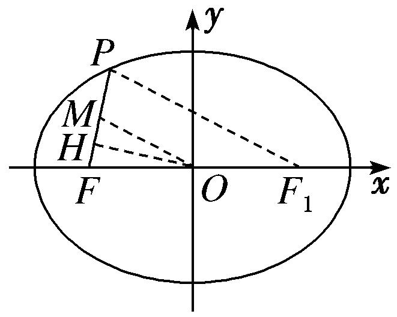
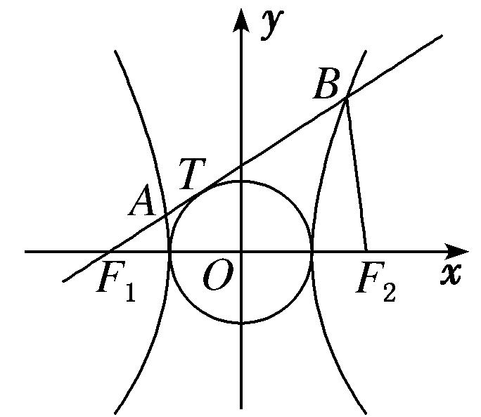
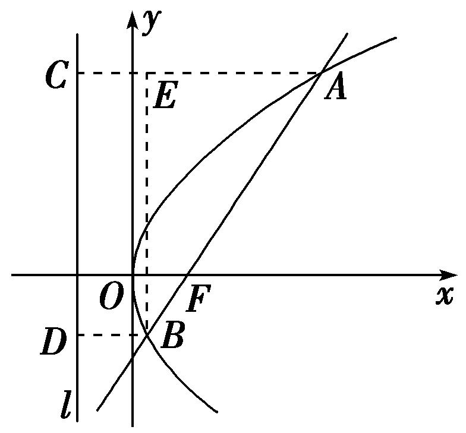
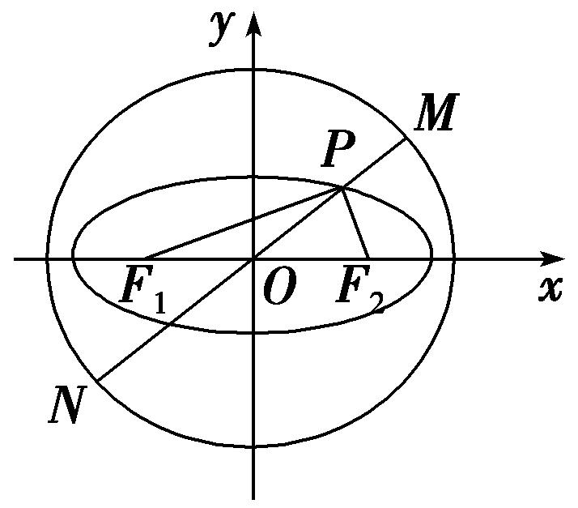
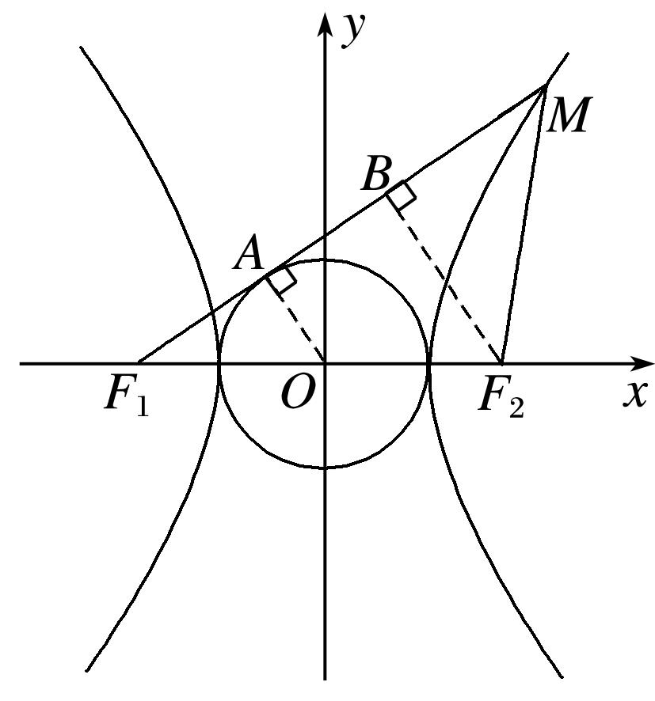
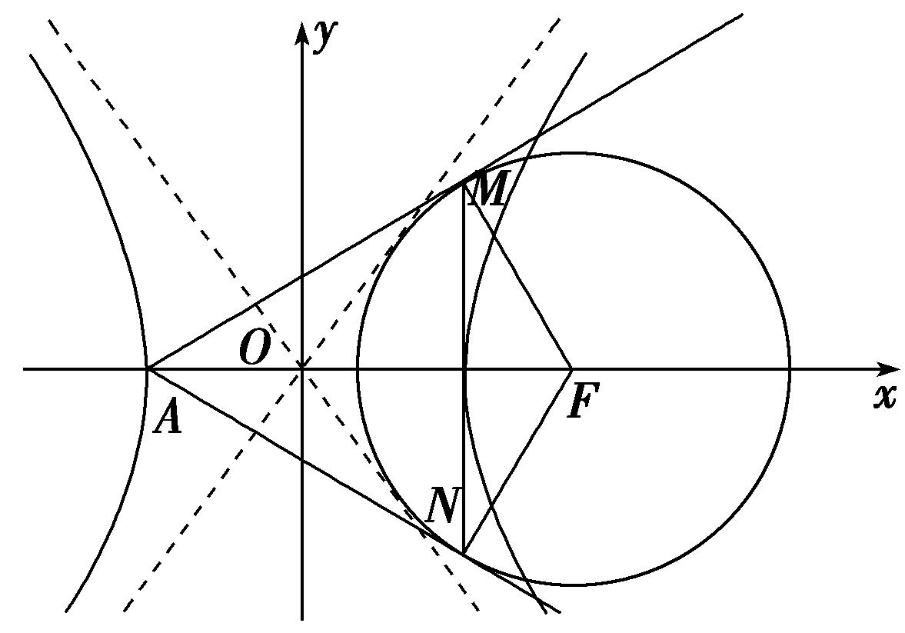
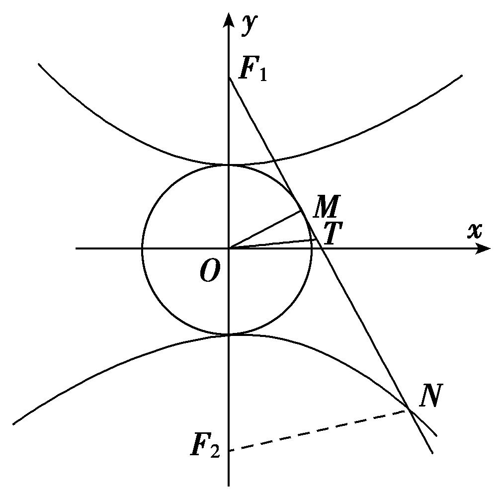
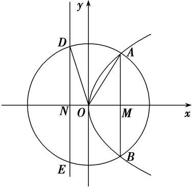
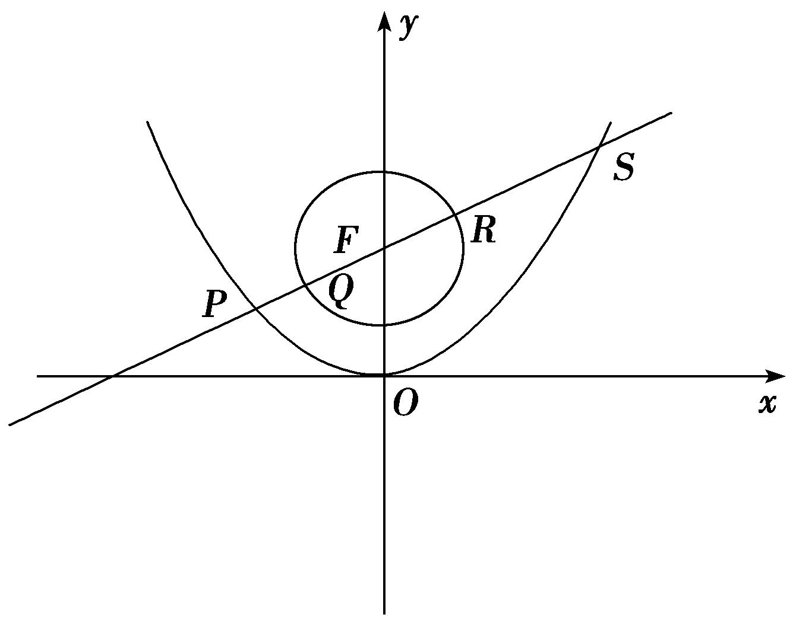
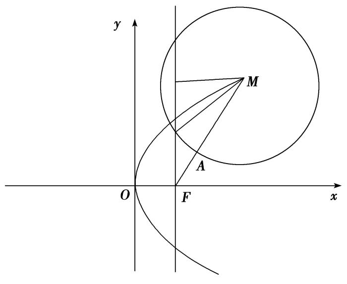

**专题09　含两种曲线模型**

**【例题选讲】**

<strong>[例4]</strong>　(23)(2019·浙江)已知椭圆＋＝1的左焦点为<em>F</em>，点<em>P</em>在椭圆上且在<em>x</em>轴的上方．若线段<em>PF</em>的中点在以原点<em>O</em>为圆心，|<em>OF</em>|为半径的圆上，则直线<em>PF</em>的斜率是\_\_\_\_\_\_\_\_．

<strong>答案　　解析</strong>　法一：依题意，设点<em>P</em>(<em>m</em>，<em>n</em>)(<em>n</em>&gt;0)，由题意知<em>F</em>(－2，0)，所以线段<em>FP</em>的中点<em>M</em>在圆<em>x</em>2＋<em>y</em>2＝4上，所以2＋2＝4，①．又点<em>P</em>(<em>m</em>，<em>n</em>)在椭圆＋＝1上，所以＋＝1，②．联立①②，消去<em>n</em>，得4<em>m</em>2－36<em>m</em>－63＝0，所以<em>m</em>＝－或<em>m</em>＝(舍去)，<em>n</em>＝，所以<em>kPF</em>＝＝．

法二：如图，取<em>PF</em>的中点<em>M</em>，连接<em>OM</em>，由题意知|<em>OM</em>|＝|<em>OF</em>|＝2，设椭圆的右焦点为<em>F</em>1，连接<em>PF</em>1，在△<em>PFF</em>1中，<em>OM</em>为中位线，所以|<em>PF</em>1|＝4，由椭圆的定义知|<em>PF</em>|＋|<em>PF</em>1|＝6，所以|<em>PF</em>|＝2．因为<em>M</em>为<em>PF</em>的中点，所以|<em>MF</em>|＝1．在等腰三角形<em>OMF</em>中，过<em>O</em>作<em>OH</em>⊥<em>MF</em>于点<em>H</em>，所以|<em>OH</em>|＝＝，所以<em>kPF</em>＝tan∠<em>HFO</em>＝＝．

(24)如图，已知<em>F</em>1，<em>F</em>2分别是双曲线<em>x</em>2－＝1(<em>b</em>＞0)的左、右焦点，过点<em>F</em>1的直线与圆<em>x</em>2＋<em>y</em>2＝1相切于点<em>T</em>，与双曲线的左、右两支分别交于<em>A</em>，<em>B</em>，若|<em>F</em>2<em>B</em>|＝|<em>AB</em>|，则<em>b</em>的值是\_\_\_\_\_\_\_\_．

<strong>答案</strong>　1＋　<strong>解析</strong>　法一：因为|<em>F</em>2<em>B</em>|＝|<em>AB</em>|，所以结合双曲线的定义，得|<em>AF</em>1|＝|<em>BF</em>1|－|<em>AB</em>|＝|<em>BF</em>1|－|<em>BF</em>2|＝2，连接<em>OT</em>，在Rt△<em>OTF</em>1中，|<em>OT</em>|＝1，|<em>OF</em>1|＝<em>c</em>，|<em>TF</em>1|＝<em>b</em>，所以cos∠<em>F</em>2<em>F</em>1<em>A</em>＝，sin∠<em>F</em>2<em>F</em>1<em>A</em>＝，所以<em>A</em>，将点<em>A</em>的坐标代入双曲线得－＝1，化简得<em>b</em>6－4<em>b</em>5＋5<em>b</em>4－4<em>b</em>3－4＝0，得(<em>b</em>2－2<em>b</em>－2)(<em>b</em>4－2<em>b</em>3＋3<em>b</em>2－2<em>b</em>＋2)＝0，而<em>b</em>4－2<em>b</em>3＋3<em>b</em>2－2<em>b</em>＋2＝<em>b</em>2(<em>b</em>－1)2＋<em>b</em>2＋1＋(<em>b</em>－1)2＞0，故<em>b</em>2－2<em>b</em>－2＝0，解得<em>b</em>＝1±(负值舍去)，即<em>b</em>＝1＋．

法二：因为|<em>F</em>2<em>B</em>|＝|<em>AB</em>|，所以结合双曲线的定义，得|<em>AF</em>1|＝|<em>BF</em>1|－|<em>AB</em>|＝|<em>BF</em>1|－|<em>BF</em>2|＝2，连接<em>AF</em>2，则|<em>AF</em>2|＝2＋|<em>AF</em>1|＝4．连接<em>OT</em>，在Rt△<em>OTF</em>1中，|<em>OT</em>|＝1，|<em>OF</em>1|＝<em>c</em>，|<em>TF</em>1|＝<em>b</em>，所以cos∠<em>F</em>2<em>F</em>1<em>A</em>＝．在△<em>AF</em>1<em>F</em>2中，由余弦定理得，cos∠<em>F</em>2<em>F</em>1<em>A</em>＝＝，所以<em>c</em>2－3＝2<em>b</em>，又在双曲线中，<em>c</em>2＝1＋<em>b</em>2，所以<em>b</em>2－2<em>b</em>－2＝0，解得<em>b</em>＝1±(负值舍去)，即<em>b</em>＝1＋．

(25)已知双曲线*C*：－＝1(*a*>0，*b*>0)的焦距为2*c*，直线*l*过点且与双曲线*C*的一条渐近线垂直，以双曲线*C*的右焦点为圆心，半焦距为半径的圆与直线*l*交于*M*，*N*两点，若|*MN*|＝*c*，则双曲线*C*的渐近线方程为(　　)

A．*y*＝±*x*　　　　　　B．*y*＝±*x*　　　　　　C．*y*＝±2*x*　　　　　　D．*y*＝±4*x*

<strong>答案</strong>　B　<strong>解析</strong>　方法一　由题意可设渐近线方程为<em>y</em>＝<em>x</em>，则直线<em>l</em>的斜率<em>kl</em>＝－，直线<em>l</em>的方程为<em>y</em>＝－，整理可得<em>ax</em>＋<em>by</em>－<em>a</em>2＝0．焦点(<em>c</em>，0)到直线<em>l</em>的距离<em>d</em>＝＝，则弦长为2＝2＝<em>c</em>，整理可得<em>c</em>4－9<em>a</em>2<em>c</em>2＋12<em>a</em>3<em>c</em>－4<em>a</em>4＝0，即<em>e</em>4－9<em>e</em>2＋12<em>e</em>－4＝0，分解因式得＝0．又双曲线的离心率<em>e</em>&gt;1，则<em>e</em>＝＝2，所以＝ ＝＝，所以双曲线<em>C</em>的渐近线方程为<em>y</em>＝±<em>x</em>．

方法二　圆心到直线<em>l</em>的距离为＝，∴＝，∴<em>c</em>2－3<em>ac</em>＋2<em>a</em>2＝0，∴<em>c</em>＝2<em>a</em>，<em>b</em>＝<em>a</em>，∴渐近线方程为<em>y</em>＝±<em>x</em>．

(26)已知<em>F</em>为抛物线<em>y</em>2＝4<em>x</em>的焦点，过点<em>F</em>的直线交抛物线于<em>A</em>，<em>B</em>两点(点<em>A</em>在第一象限)，若＝3，则以<em>AB</em>为直径的圆的标准方程为(　　)

A．2＋(<em>y</em>－2)2＝　　　　　　　　B．(<em>x</em>－2)2＋(<em>y</em>－2)2＝

C．(<em>x</em>－5)2＋(<em>y</em>－2)2＝64　　　　　　　　D．(<em>x</em>－2)2＋(<em>y</em>－2)2＝64

<strong>答案</strong>　A　<strong>解析</strong>　如图，作出抛物线的准线<em>l</em>：<em>x</em>＝－，设<em>A</em>、<em>B</em>在<em>l</em>上的射影分别是<em>C</em>、<em>D</em>，

连接<em>AC</em>、<em>BD</em>，过<em>B</em>作<em>BE</em>⊥<em>AC</em>于<em>E</em>．∵＝3，∴设|<em>AF</em>|＝3<em>m</em>，|<em>BF</em>|＝<em>m</em>，∵点<em>A</em>、<em>B</em>在抛物线上，∴|<em>AC</em>|＝3<em>m</em>，|<em>BD</em>|＝<em>m</em>．因此，在Rt△<em>ABE</em>中，|<em>AB</em>|＝4<em>m</em>，|<em>AE</em>|＝2<em>m</em>，∴cos∠<em>BAE</em>＝，∴∠<em>BAE</em>＝60°，∴直线<em>AB</em>的倾斜角为60°，即直线<em>AB</em>的斜率<em>k</em>＝tan 60°＝，∴直线<em>AB</em>的方程为<em>y</em>＝(<em>x</em>－)，代入抛物线方程得3<em>x</em>2－10<em>x</em>＋9＝0．∴<em>xA</em>＋<em>xB</em>＝，<em>xA</em>·<em>xB</em>＝3．∴<em>yA</em>＋<em>yB</em>＝(<em>xA</em>－)＋(<em>xB</em>－)＝4，|<em>AB</em>|＝<em>xA</em>＋<em>xB</em>＋<em>p</em>＝，∴<em>AB</em>中点的坐标为，即．则以<em>AB</em>为直径的圆的标准方程为2＋(<em>y</em>－2)2＝．故选A．

(27)已知曲线<em>C</em>1是以原点<em>O</em>为中心，<em>F</em>1，<em>F</em>2为焦点的椭圆，曲线<em>C</em>2是以<em>O</em>为顶点、<em>F</em>2为焦点的抛物线，<em>A</em>是曲线<em>C</em>1与<em>C</em>2的交点，且∠<em>AF</em>2<em>F</em>1为钝角，若|<em>AF</em>1|＝，|<em>AF</em>2|＝，则△<em>AF</em>1<em>F</em>2的面积是(　　)

A．　　　　　　　　B．2　　　　　　　　C．　　　　　　　　D．4

<strong>答案</strong>　C　<strong>解析</strong>　画出图形如图所示，<em>AD</em>⊥<em>F</em>1<em>D</em>，根据抛物线的定义可知|<em>AF</em>2|＝|<em>AD</em>|＝，故cos∠<em>F</em>1<em>AD</em>＝，也即cos∠<em>AF</em>1<em>F</em>2＝，在△<em>AF</em>1<em>F</em>2中，由余弦定理得＝，解得|<em>F</em>1<em>F</em>2|＝2或|<em>F</em>1<em>F</em>2|＝3，由于∠<em>AF</em>2<em>F</em>1为钝角，故|<em>AD</em>|&gt;|<em>F</em>1<em>F</em>2|，所以|<em>F</em>1<em>F</em>2|＝3舍去，故|<em>F</em>1<em>F</em>2|＝2．而sin∠<em>AF</em>1<em>F</em>2＝＝，所以<em>S</em>△<em>AF</em>1<em>F</em>2＝××2×＝．故选C．

(28)(2017·山东)在平面直角坐标系<em>xOy</em>中，双曲线－＝1(<em>a</em>&gt;0，<em>b</em>&gt;0)的右支与焦点为<em>F</em>的抛物线<em>x</em>2＝2<em>py</em>(<em>p</em>&gt;0)交于<em>A</em>，<em>B</em>两点．若|<em>AF</em>|＋|<em>BF</em>|＝4|<em>OF</em>|，则该双曲线的渐近线方程为\_\_\_\_\_\_\_\_．

<strong>答案</strong>　<em>y</em>＝±<em>x</em>　<strong>解析</strong>　法一　设<em>A</em>(<em>xA</em>，<em>yA</em>)，<em>B</em>(<em>xB</em>，<em>yB</em>)，由抛物线定义可得|<em>AF</em>|＋|<em>BF</em>|＝<em>yA</em>＋＋<em>yB</em>＋＝4×⇒<em>yA</em>＋<em>yB</em>＝<em>p</em>，由可得<em>a</em>2<em>y</em>2－2<em>pb</em>2<em>y</em>＋<em>a</em>2<em>b</em>2＝0，所以<em>yA</em>＋<em>yB</em>＝＝<em>p</em>，解得<em>a</em>＝<em>b</em>，故该双曲线的渐近线方程为<em>y</em>＝±<em>x</em>．

法二　(点差法)设<em>A</em>(<em>x</em>1，<em>y</em>1)，<em>B</em>(<em>x</em>2，<em>y</em>2)，由抛物线的定义可知|<em>AF</em>|＝<em>y</em>1＋，|<em>BF</em>|＝<em>y</em>2＋，|<em>OF</em>|＝，由|<em>AF</em>|＋|<em>BF</em>|＝<em>y</em>1＋＋<em>y</em>2＋＝<em>y</em>1＋<em>y</em>2＋<em>p</em>＝4|<em>OF</em>|＝2<em>p</em>，得<em>y</em>1＋<em>y</em>2＝<em>p</em>．易知直线<em>AB</em>的斜率<em>kAB</em>＝＝＝．由得<em>kAB</em>＝＝＝·，则·＝，所以＝⇒＝，所以双曲线的渐近线方程为<em>y</em>＝±<em>x</em>．

**【对点训练】**

56．如图，椭圆<em>C</em>：＋＝1(<em>a</em>&gt;2)，圆<em>O</em>：<em>x</em>2＋<em>y</em>2＝<em>a</em>2＋4，椭圆<em>C</em>的左、右焦点分别为<em>F</em>1，<em>F</em>2，过椭圆

上一点<em>P</em>和原点<em>O</em>作直线<em>l</em>交圆<em>O</em>于<em>M</em>，<em>N</em>两点，若|<em>PF</em>1|·|<em>PF</em>2|＝6，则|<em>PM</em>|·|<em>PN</em>|的值为\_\_\_\_\_\_\_\_．

56．<strong>答案</strong>　6　<strong>解析</strong>　由已知|<em>PM</em>|·|<em>PN</em>|＝(<em>R</em>－|<em>OP</em>|)(<em>R</em>＋|<em>OP</em>|)＝<em>R</em>2－|<em>OP</em>|2＝<em>a</em>2＋4－|<em>OP</em>|2，|<em>OP</em>|2＝||2＝(

＋)2＝(||2＋||2＋2||||cos∠<em>F</em>1<em>PF</em>2)＝(||2＋||2)－(||2＋||2－2||||cos∠<em>F</em>1<em>PF</em>2)＝[(2<em>a</em>)2－2|<em>PF</em>1||<em>PF</em>2|]－×(2<em>c</em>)2＝<em>a</em>2－2，所以|<em>PM</em>|·|<em>PN</em>|＝(<em>a</em>2＋4)－(<em>a</em>2－2)＝6．

57．已知双曲线－＝1(<em>a</em>&gt;0，<em>b</em>&gt;0)的左、右焦点分别为<em>F</em>1，<em>F</em>2，过<em>F</em>1作圆<em>x</em>2＋<em>y</em>2＝<em>a</em>2的切线，交双曲线

右支于点<em>M</em>，若∠<em>F</em>1<em>MF</em>2＝45°，则双曲线的渐近线方程为(　　)

A．*y*＝±*x*　　　　　B．*y*＝±*x*　　　　　C．*y*＝±*x*　　　　　D．*y*＝±2*x*

57．<strong>答案</strong>　A　<strong>解析</strong>　如图，作<em>OA</em>⊥<em>F</em>1<em>M</em>于点<em>A</em>，<em>F</em>2<em>B</em>⊥<em>F</em>1<em>M</em>于点<em>B</em>．

因为<em>F</em>1<em>M</em>与圆<em>x</em>2＋<em>y</em>2＝<em>a</em>2相切，∠<em>F</em>1<em>MF</em>2＝45°，所以|<em>OA</em>|＝<em>a</em>，|<em>F</em>2<em>B</em>|＝|<em>BM</em>|＝2<em>a</em>，|<em>F</em>2<em>M</em>|＝2<em>a</em>，|<em>F</em>1<em>B</em>|＝2<em>b</em>．又点<em>M</em>在双曲线上，所以|<em>F</em>1<em>M</em>|－|<em>F</em>2<em>M</em>|＝2<em>a</em>＋2<em>b</em>－2<em>a</em>＝2<em>a</em>．整理，得<em>b</em>＝<em>a</em>．所以＝．所以双曲线的渐近线方程为<em>y</em>＝±<em>x</em>．故选A．

58．已知双曲线－＝1(*b*＞0)的左顶点为*A*，虚轴长为8，右焦点为*F*，且⊙*F*与双曲线的渐近线相切，

若过点*A*作⊙*F*的两条切线，切点分别为*M*，*N*，则|*MN*|＝\_\_\_\_\_\_\_\_.

58．<strong>答案</strong>　4　<strong>解析</strong>　如图所示．∵双曲线－＝1(<em>b</em>＞0)的左顶点为<em>A</em>，虚轴长为8，∴<em>a</em>2＝9，2<em>b</em>＝8，

∴<em>a</em>＝3，<em>b</em>＝4，∴双曲线的渐近线方程为<em>y</em>＝±<em>x</em>，即4<em>x</em>±3<em>y</em>＝0，<em>c</em>2＝<em>a</em>2＋<em>b</em>2＝25，即<em>c</em>＝5，∴<em>F</em>(5，0)．∵⊙<em>F</em>与双曲线的渐近线相切，∴⊙<em>F</em>的半径<em>r</em>＝＝4，∴|<em>MF</em>|＝4，∵|<em>AF</em>|＝<em>a</em>＋<em>c</em>＝5＋3＝8，∴|<em>AM</em>|＝＝4，∵<em>S</em>四边形<em>AMFN</em>＝2×|<em>AM</em>|·|<em>MF</em>|＝|<em>AF</em>|·|<em>MN</em>|，∴2×4×4＝8·|<em>MN</em>|，解得|<em>MN</em>|＝4．

59．已知双曲线－＝1，过双曲线的上焦点<em>F</em>1作圆<em>O</em>：<em>x</em>2＋<em>y</em>2＝25的一条切线，切点为<em>M</em>，交双曲线

的下支于点<em>N</em>，<em>T</em>为<em>NF</em>1的中点，则△<em>MOT</em>的外接圆的周长为\_\_\_\_\_\_\_\_．

59．<strong>答案</strong>　π　<strong>解析</strong>　如图，∵<em>F</em>1<em>M</em>为圆的切线，∴<em>OM</em>⊥<em>F</em>1<em>M</em>，在直角三角形<em>OMF</em>1中，|<em>OM</em>|＝5.设双

曲线的下焦点为<em>F</em>2，连接<em>NF</em>2，∴<em>OT</em>为△<em>F</em>1<em>F</em>2<em>N</em>的中位线，∴2|<em>OT</em>|＝|<em>NF</em>2|.设|<em>OT</em>|＝<em>x</em>，则|<em>NF</em>2|＝2<em>x</em>，又|<em>NF</em>1|－|<em>NF</em>2|＝10，∴|<em>NF</em>1|＝|<em>NF</em>2|＋10＝2<em>x</em>＋10，∴|<em>TF</em>1|＝<em>x</em>＋5．由勾股定理得|<em>F</em>1<em>M</em>|2＝|<em>OF</em>1|2－|<em>OM</em>|2＝132－52＝144，|<em>F</em>1<em>M</em>|＝12，∴|<em>MT</em>|＝|<em>x</em>－7|，在直角三角形<em>OMT</em>中，|<em>OT</em>|2－|<em>MT</em>|2＝|<em>OM</em>|2，即<em>x</em>2－(<em>x</em>－7)2＝52，∴<em>x</em>＝．又△<em>OMT</em>是直角三角形，故其外接圆的直径为|<em>OT</em>|＝，∴△<em>MOT</em>的外接圆的周长为π．

60．以抛物线<em>C</em>：<em>y</em>2＝2<em>px</em>(<em>p</em>&gt;0)的顶点为圆心的圆交<em>C</em>于<em>A</em>，<em>B</em>两点，交<em>C</em>的准线于<em>D</em>，<em>E</em>两点．已知|<em>AB</em>|

＝2，|*DE*|＝2，则*p*等于\_\_\_\_\_\_\_\_．

60．<strong>答案　　解析</strong>　如图，|<em>AB</em>|＝2，|<em>AM</em>|＝，|<em>DE</em>|＝2，|<em>DN</em>|＝，|<em>ON</em>|＝，∴<em>xA</em>＝＝，

∵|*OD*|＝|*OA*|，∴＝，∴＋10＝＋6，解得：*p*＝.(负值舍去)

61．已知抛物线<em>y</em>2＝4<em>x</em>，圆<em>F</em>：(<em>x</em>－1)2＋<em>y</em>2＝1，直线<em>y</em>＝<em>k</em>(<em>x</em>－1)(<em>k</em>≠0)自上而下顺次与上述两曲线交于点<em>A</em>，

*B*，*C*，*D*，则|*AB*|·|*CD*|的值是\_\_\_\_\_\_\_\_．

61．<strong>答案</strong>　1　<strong>解析</strong>　设<em>A</em>(<em>x</em>1，<em>y</em>1)，<em>D</em>(<em>x</em>2，<em>y</em>2)，则|<em>AB</em>|·|<em>CD</em>|＝(|<em>AF</em>|－1)(|<em>DF</em>|－1)＝(<em>x</em>1＋1－1)(<em>x</em>2＋1－1)＝<em>x</em>1<em>x</em>2，

由<em>y</em>＝<em>k</em>(<em>x</em>－1)与<em>y</em>2＝4<em>x</em>联立方程消<em>y</em>得<em>k</em>2<em>x</em>2－(2<em>k</em>2＋4)<em>x</em>＋<em>k</em>2＝0，<em>x</em>1<em>x</em>2＝1，因此|<em>AB</em>|·|<em>CD</em>|＝1．

62．已知曲线*G*：*y*＝及点*A*，若曲线*G*上存在相异两点*B*，*C*，其到直线*l*：2*x*＋1

＝0的距离分别为|*AB*|和|*AC*|，则|*AB*|＋|*AC*|＝\_\_\_\_\_\_\_\_.

62．<strong>答案</strong>　15　<strong>解析</strong>　曲线<em>G</em>：<em>y</em>＝，即为半圆<em>M</em>：(<em>x</em>－8)2＋<em>y</em>2＝49(<em>y</em>≥0)，由题意得<em>B</em>，<em>C</em>

为半圆<em>M</em>与抛物线<em>y</em>2＝2<em>x</em>的两个交点，由<em>y</em>2＝2<em>x</em>与(<em>x</em>－8)2＋<em>y</em>2＝49(<em>y</em>≥0)联立方程组得<em>x</em>2－14<em>x</em>＋15＝0，方程必有两不等实根，设<em>B</em>(<em>x</em>1，<em>y</em>1)，<em>C</em>(<em>x</em>2，<em>y</em>2)．所以|<em>AB</em>|＋|<em>AC</em>|＝<em>x</em>1＋＋<em>x</em>2＋＝14＋1＝15．

63．已知<em>F</em>为抛物线<em>C</em>：<em>x</em>2＝2<em>py</em>(<em>p</em>&gt;0)的焦点，曲线<em>C</em>1是以<em>F</em>为圆心，为半径的圆，直线2<em>x</em>－6<em>y</em>＋3<em>p</em>

＝0与曲线<em>C</em>，<em>C</em>1从左至右依次相交于<em>P</em>，<em>Q</em>，<em>R</em>，<em>S</em>，则＝\_\_\_\_\_\_\_\_．

63．<strong>答案</strong>　　可得直线2<em>x</em>－6<em>y</em>＋3<em>p</em>＝0与<em>y</em>轴交点是抛物线<em>C</em>：<em>x</em>2＝2<em>py</em>(<em>p</em>&gt;0)的焦点<em>F</em>，由

得<em>x</em>2－<em>px</em>－<em>p</em>2＝0，⇒<em>xP</em>＝－<em>p</em>，<em>xS</em>＝<em>p</em>⇒<em>yP</em>＝<em>p</em>，<em>yS</em>＝<em>p</em>，|<em>RS</em>|＝|<em>SF</em>|－＝<em>yS</em>＋－＝<em>p</em>，|<em>PQ</em>|＝|<em>PF</em>|－＝<em>yP</em>＋－＝<em>p</em>．∴则＝．

64．已知抛物线<em>C</em>：<em>y</em>2＝2<em>px</em>(<em>p</em>&gt;0)的焦点为<em>F</em>，过点<em>F</em>的直线<em>l</em>与抛物线<em>C</em>交于<em>A</em>，<em>B</em>两点，且直线<em>l</em>与圆

<em>x</em>2－<em>px</em>＋<em>y</em>2－<em>p</em>2＝0交于<em>C</em>，<em>D</em>两点，若|<em>AB</em>|＝3|<em>CD</em>|，则直线<em>l</em>的斜率为\_\_\_\_\_\_\_\_．

64．<strong>答案</strong>　±　<strong>解析</strong>　由题意得<em>F</em>，由<em>x</em>2－<em>px</em>＋<em>y</em>2－<em>p</em>2＝0，配方得2＋<em>y</em>2＝<em>p</em>2，所以直线<em>l</em>

过圆心，可得|<em>CD</em>|＝2<em>p</em>，若直线<em>l</em>的斜率不存在，则<em>l</em>：<em>x</em>＝，|<em>AB</em>|＝2<em>p</em>，|<em>CD</em>|＝2<em>p</em>，不符合题意，∴直线<em>l</em>的斜率存在．∴可设直线<em>l</em>的方程为<em>y</em>＝<em>k</em>，<em>A</em>(<em>x</em>1，<em>y</em>1)，<em>B</em>(<em>x</em>2，<em>y</em>2)，联立化为<em>x</em>2－<em>x</em>＋＝0，所以<em>x</em>1＋<em>x</em>2＝<em>p</em>＋，所以|<em>AB</em>|＝<em>x</em>1＋<em>x</em>2＋<em>p</em>＝2<em>p</em>＋，由|<em>AB</em>|＝3|<em>CD</em>|，所以2<em>p</em>＋＝6<em>p</em>，可得<em>k</em>2＝，所以<em>k</em>＝±．

65．(2016·全国Ⅰ)以抛物线*C*的顶点为圆心的圆交*C*于*A*，*B*两点，交*C*的准线于*D*，*E*两点．已知|*AB*|

＝4，|*DE*|＝2，则*C*的焦点到准线的距离为(　　)

A．2　　　　　　　　B．4　　　　　　　　C．6　　　　　　　　D．8

65．<strong>答案　B</strong>　设抛物线的方程为<em>y</em>2＝2<em>px</em>(<em>p</em>＞0)，圆的方程为<em>x</em>2＋<em>y</em>2＝<em>r</em>2．∵|<em>AB</em>|＝4，|<em>DE</em>|＝2，抛物

线的准线方程为<em>x</em>＝－，∴不妨设<em>A</em>，<em>D</em>．∵点<em>A</em>，<em>D</em>在圆<em>x</em>2＋<em>y</em>2＝<em>r</em>2上，∴∴＋8＝＋5，∴<em>p</em>＝4(负值舍去)．∴<em>C</em>的焦点到准线的距离为4．

66．已知抛物线<em>C</em>：<em>y</em>2＝2<em>px</em>(<em>p</em>&gt;0)的焦点为<em>F</em>，点<em>M</em>(<em>x</em>0，2)是抛物线<em>C</em>上一点，圆<em>M</em>与线段<em>MF</em>相交于

点*A*，且被直线*x*＝截得的弦长为|*MA*|，若＝2，则|*AF*|＝(　　)

A．　　　　　　　　B．1　　　　　　　　C．2　　　　　　　　D．3

66．<strong>答案</strong>　B　如图，圆心<em>M</em>到直线<em>x</em>＝的距离<em>d</em>＝，①．圆<em>M</em>的半径<em>r</em>＝|<em>MA</em>|，∴|<em>MA</em>|2＝<em>d</em>2＋

2⇒<em>d</em>2＝|<em>MA</em>|2，②．∵＝2，∴|<em>MA</em>|＝，③．由①②③可得<em>x</em>0＝<em>p</em>，或<em>x</em>0＝，∵(2)2＝2<em>px</em>0(<em>p</em>&gt;0)，∴<em>p</em>＝2或4．∴或∴|<em>AF</em>|＝|<em>MA</em>|＝1．故选B．

67．已知椭圆<em>C</em>1与双曲线<em>C</em>2有相同的左右焦点<em>F</em>1，<em>F</em>2，<em>P</em>为椭圆<em>C</em>1与双曲线<em>C</em>2在第一象限内的一个公

共点，设椭圆<em>C</em>1与双曲线<em>C</em>2的离心率分别为<em>e</em>1，<em>e</em>2，且＝，若∠<em>F</em>1<em>PF</em>2＝，则双曲线<em>C</em>2的渐近线方程为(　　)

A．*x*±*y*＝0　　　　　　B．*x*±*y*＝0　　　　　　C．*x*±*y*＝0　　　　　　D．*x*±2*y*＝0

67．<strong>答案</strong>　<em>x</em>±<em>y</em>＝0　设椭圆<em>C</em>1：＋＝1(<em>a</em>&gt;<em>b</em>&gt;0)，双曲线<em>C</em>2：－＝1，依题意<em>c</em>1＝<em>c</em>2＝<em>c</em>，且＝，

∴＝，则<em>a</em>＝3<em>m</em>，①，由圆锥曲线定义，得|<em>PF</em>1|＋|<em>PF</em>2|＝2<em>a</em>，且|<em>PF</em>1|－|<em>PF</em>2|＝2<em>m</em>，∴|<em>PF</em>1|＝4<em>m</em>，|<em>PF</em>2|＝2<em>m</em>．在△<em>F</em>1<em>PF</em>2中，由余弦定理，得：4<em>c</em>2＝|<em>PF</em>1|2＋|<em>PF</em>2|2－2|<em>PF</em>1||<em>PF</em>2|cos＝12<em>m</em>2，∴<em>c</em>2＝3<em>m</em>2，则<em>n</em>2＝<em>c</em>2－<em>m</em>2＝2<em>m</em>2，因此双曲线<em>C</em>2的渐近线方程为<em>y</em>＝±<em>x</em>，即<em>x</em>±<em>y</em>＝0．

68．已知双曲线－<em>y</em>2＝1的右焦点是抛物线<em>y</em>2＝2<em>px</em>(<em>p</em>&gt;0)的焦点，直线<em>y</em>＝<em>kx</em>＋<em>m</em>与抛物线相交于<em>A</em>，<em>B</em>两

个不同的点，点*M*(2，2)是*AB*的中点，则△*AOB*(*O*为坐标原点)的面积是(　　)

A．4　　　　　　　　B．3　　　　　　　　C．　　　　　　　　D．2

68．<strong>答案</strong>　D　<strong>解析</strong>　∵双曲线右焦点为(2，0)，∴抛物线焦点为(2，0)，∴<em>y</em>2＝8<em>x</em>，设<em>A</em>(<em>x</em>1，<em>y</em>1)，<em>B</em>(<em>x</em>2，

<em>y</em>2)，则①－②得(<em>y</em>1－<em>y</em>2)(<em>y</em>1＋<em>y</em>2)＝8(<em>x</em>1－<em>x</em>2)，∴＝＝＝2.∴直线<em>AB</em>斜率为2，又过点<em>M</em>(2，2)，∴直线<em>AB</em>方程为<em>y</em>＝2<em>x</em>－2.将直线<em>AB</em>方程与<em>y</em>2＝8<em>x</em>联立得<em>x</em>2－4<em>x</em>＋1＝0，∴<em>x</em>1＋<em>x</em>2＝4，<em>x</em>1<em>x</em>2＝1，∴|<em>AB</em>|＝·＝×＝2．又∵<em>O</em>到<em>AB</em>的距离<em>d</em>＝＝.∴<em>S</em>△<em>AOB</em>＝×2×＝2．故选D．

69．设椭圆<em>C</em>2：＋＝1(<em>a</em>＞<em>b</em>＞0)的左、右焦点为<em>F</em>1，<em>F</em>2，离心率为<em>e</em>＝，抛物线<em>C</em>1：<em>y</em>2＝－4<em>mx</em>(<em>m</em>＞

0)的准线经过椭圆的右焦点，抛物线<em>C</em>1与椭圆<em>C</em>2交于<em>x</em>轴上方一点<em>P</em>，若△<em>PF</em>1<em>F</em>2的三边长恰好是三个连续的自然数，则<em>a</em>的值为\_\_\_\_\_\_\_\_．

69．<strong>答案</strong>　6　设椭圆的焦距为2<em>c</em>，因为抛物线的准线经过椭圆的右焦点，所以可知<em>c</em>＝<em>m</em>，<em>a</em>＝2<em>m</em>，<em>b</em>＝

<em>m</em>．由解得<em>x</em>＝－<em>m</em>或<em>x</em>＝6<em>m</em>(舍去)，所以<em>P</em>，所以|<em>PF</em>1|＝，|<em>PF</em>2|＝，|<em>F</em>1<em>F</em>2|＝．因为△<em>PF</em>1<em>F</em>2的三边长恰好是连续的三个自然数，可得<em>m</em>＝3，所以<em>a</em>＝2<em>m</em>＝6．

70．已知双曲线<em>M</em>的焦点<em>F</em>1，<em>F</em>2在<em>x</em>轴上，直线<em>x</em>＋3<em>y</em>＝0是双曲线<em>M</em>的一条渐近线，点<em>P</em>在双曲线<em>M</em>

上，且·＝0，如果抛物线<em>y</em>2＝16<em>x</em>的准线经过双曲线<em>M</em>的一个焦点，那么||·||＝(　　)

A．21　　　　　　　　B．14　　　　　　　　C．7　　　　　　　　D．0

70．<strong>答案</strong>　B　<strong>解析</strong>　设双曲线方程为－＝1(<em>a</em>&gt;0，<em>b</em>&gt;0)，∵直线<em>x</em>＋3<em>y</em>＝0是双曲线<em>M</em>的一条渐近

线，∴＝，①．又抛物线的准线为<em>x</em>＝－4，∴<em>c</em>＝4②．又<em>a</em>2＋<em>b</em>2＝<em>c</em>2.③．∴由①②③得<em>a</em>＝3．设点<em>P</em>为双曲线右支上一点，∴由双曲线定义得＝6④．又·＝0，∴⊥，∴在Rt△<em>PF</em>1<em>F</em>2中||2＋||2＝82⑤．联立④⑤，解得||·||＝14．

71．已知抛物线<em>C</em>1：<em>y</em>2＝8<em>ax</em>(<em>a</em>＞0)，直线<em>l</em>的倾斜角是45°且过抛物线<em>C</em>1的焦点，直线<em>l</em>被抛物线<em>C</em>1截得

的线段长是16，双曲线<em>C</em>2：－＝1(<em>a</em>＞0，<em>b</em>＞0)的一个焦点在抛物线<em>C</em>1的准线上，则直线<em>l</em>与<em>y</em>轴的交点<em>P</em>到双曲线<em>C</em>2的一条渐近线的距离是(　　)

A．2　　　　　　　　B．　　　　　　　　C．　　　　　　　　D．1

71．<strong>答案</strong>　D　<strong>解析</strong>　抛物线<em>C</em>1的焦点为(2<em>a</em>，0)，由弦长计算公式有＝16<em>a</em>＝16，<em>a</em>＝1，所以抛物

线<em>C</em>1的标准方程为<em>y</em>2＝8<em>x</em>，准线方程为<em>x</em>＝－2，故双曲线<em>C</em>2的一个焦点坐标为(－2，0)，即<em>c</em>＝2，所以<em>b</em>＝＝＝，渐近线方程为<em>y</em>＝±<em>x</em>，直线<em>l</em>的方程为<em>y</em>＝<em>x</em>－2，所以点<em>P</em>(0，－2)，点<em>P</em>到双曲线<em>C</em>2的一条渐近线的距离为＝1，选D．

72．已知双曲线－＝1(<em>a</em>＞0，<em>b</em>＞0)的两条渐近线与抛物线<em>y</em>2＝2<em>px</em>(<em>p</em>＞0)的准线分别交于<em>A</em>，<em>B</em>两点，

*O*为坐标原点，若双曲线的离心率为2，△*ABO*的面积为2，则抛物线的焦点为(　　)

A．　　　　B．　　　　C．(1，0)　　　　D．(，0)

72．<strong>答案</strong>　D　<strong>解析</strong>　∵双曲线－＝1(<em>a</em>＞0，<em>b</em>＞0)，∴双曲线的渐近线方程是<em>y</em>＝±<em>x</em>，又抛物线<em>y</em>2＝

2*px*(*p*＞0)的准线方程是*x*＝－，故*A*，*B*两点的纵坐标分别是，－，又由双曲线的离心率为2，所以＝2，则＝，∴*A*，*B*两点的纵坐标分别是，－，又△*AOB*的面积为2，*x*轴是∠*AOB*的平分线，∴×*p*×＝2，解得*p*＝2．∴抛物线的焦点坐标为(，0)，故选D．

73．若双曲线－＝1(<em>a</em>＞0，<em>b</em>＞0)的渐近线与抛物线<em>y</em>＝<em>x</em>2＋1相切，且被圆<em>x</em>2＋(<em>y</em>－<em>a</em>)2＝1截得的弦长

为，则*a*＝(　　 )

A．　　　　　　　　B．　　　　　　　　C．　　　　　　　　D．

73．<strong>答案</strong>　B　<strong>解析</strong>　可以设切点为(<em>x</em>0，<em>x</em>＋1)，由<em>y</em>′＝2<em>x</em>，∴切线方程为<em>y</em>－(<em>x</em>＋1)＝2<em>x</em>0(<em>x</em>－<em>x</em>0)，即<em>y</em>＝

2<em>x</em>0<em>x</em>－<em>x</em>＋1，∵已知双曲线的渐近线为<em>y</em>＝±<em>x</em>，∴<em>x</em>0＝±1，＝2，一条渐近线方程为<em>y</em>＝2<em>x</em>，圆心(0，<em>a</em>)到直线<em>y</em>＝2<em>x</em>的距离是＝⇒<em>a</em>＝．故选B．

74．抛物线<em>C</em>1：<em>y</em>＝<em>x</em>2(<em>p</em>&gt;0)的焦点与双曲线<em>C</em>2：－<em>y</em>2＝1的右焦点的连线交<em>C</em>1于第一象限的点<em>M</em>．若

<em>C</em>1在点<em>M</em>处的切线平行于<em>C</em>2的一条渐近线，则<em>p</em>等于(　　)

A．　　　　　　　　B．　　　　　　　　C．　　　　　　　　D．

74．<strong>答案</strong>　D　经过第一象限的双曲线<em>C</em>2的渐近线方程为<em>y</em>＝<em>x</em>.抛物线<em>C</em>1的焦点为<em>F</em>，双曲线<em>C</em>2

的右焦点为<em>F</em>2(2，0)．因为<em>y</em>＝<em>x</em>2，所以<em>y</em>′＝<em>x</em>．所以抛物线<em>C</em>1在点<em>M</em>处的切线斜率为，即<em>x</em>0＝，所以<em>x</em>0＝<em>p</em>．因为<em>F</em>，<em>F</em>2(2，0)，<em>M</em>三点共线，所以＝，解得<em>p</em>＝，故选D．

